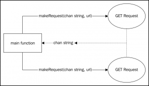
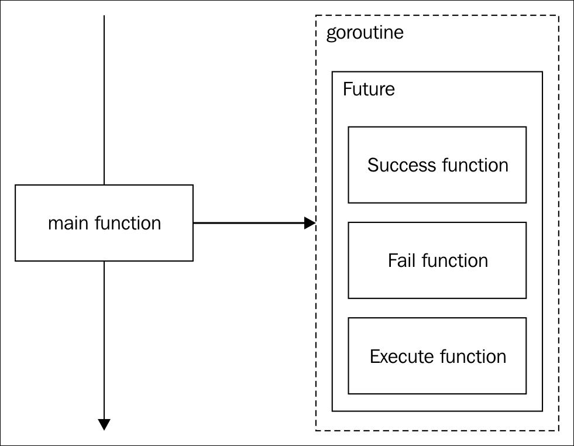
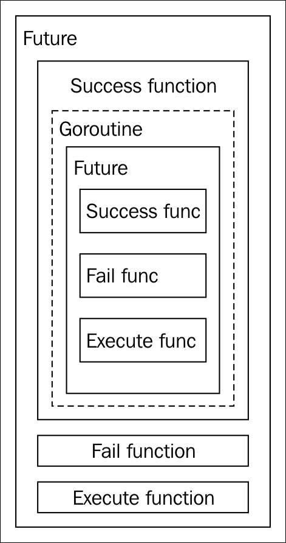
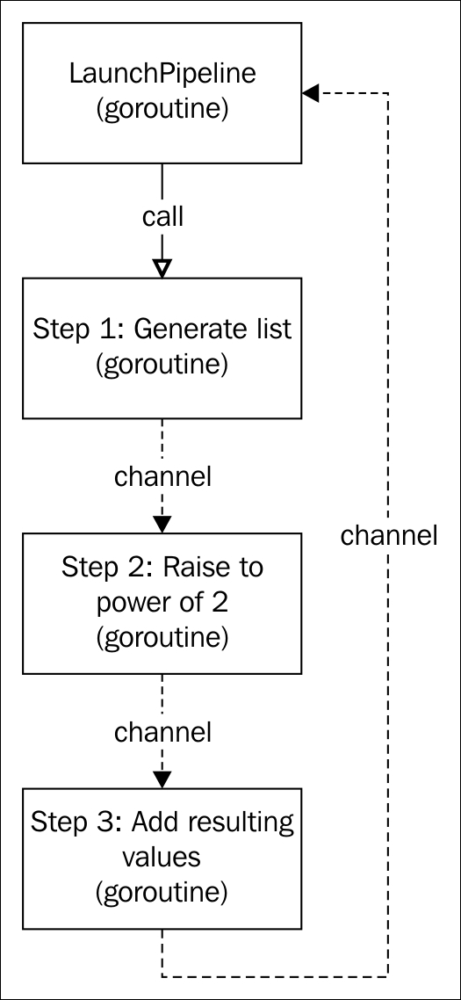
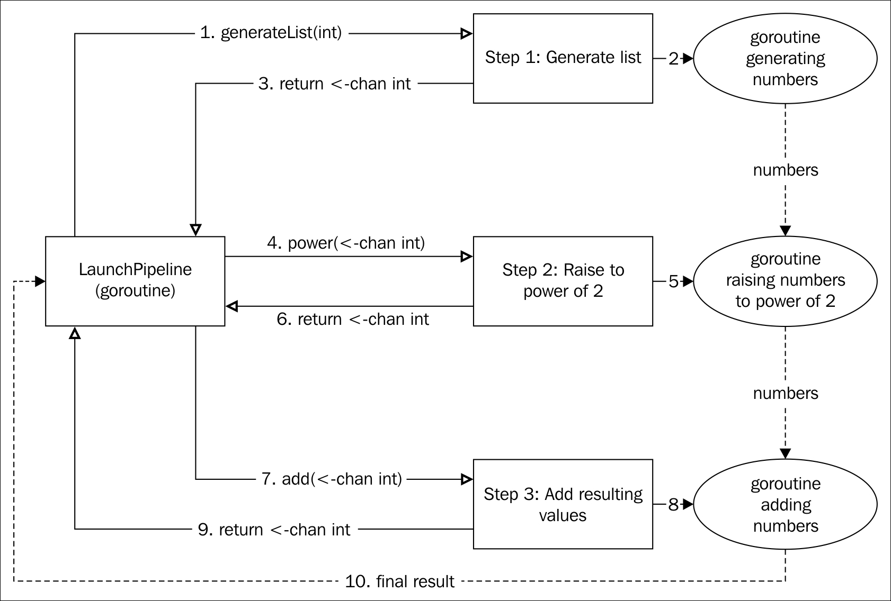

# 第九章：并发模式-屏障、未来和管道设计模式

现在我们熟悉了并发和并行的概念，并且已经了解了如何使用 Go 的并发原语来实现它们，我们可以看到关于并发工作和并行执行的一些模式。在本章中，我们将看到以下模式：

+   屏障是一种非常常见的模式，特别是当我们必须等待来自不同 Goroutines 的多个响应才能让程序继续时。

+   未来模式允许我们编写一个算法，该算法最终将由同一个 Goroutine 或不同的 Goroutine 在时间上执行（或不执行）

+   管道是一种强大的模式，用于构建与某种逻辑相连的 Goroutines 的复杂同步流

快速浏览一下这三种模式的描述。它们都描述了一些逻辑来同步执行时间。非常重要的是要记住，我们现在正在使用前几章中看到的所有工具和模式来开发并发结构。在创建模式中，我们处理创建对象。在结构模式中，我们学习如何构建成惯用的结构，在行为模式中，我们主要处理算法。现在，使用并发模式，我们将主要管理应用程序的定时执行和顺序执行，这些应用程序具有多个*流*。

# 屏障并发模式

我们将从屏障模式开始。它的目的很简单-设置一个屏障，以便在我们获得所有需要的结果之前没有人通过，这在并发应用程序中非常常见。

## 描述

想象一下这样的情况，我们有一个微服务应用程序，其中一个服务需要通过合并另外三个微服务的响应来组成其响应。这就是屏障模式可以帮助我们的地方。

我们的屏障模式可以是一个服务，它将阻止其响应，直到它已与一个或多个不同的 Goroutines（或服务）返回的结果组合在一起。那么我们有什么样的原语具有阻塞特性呢？嗯，我们可以使用锁，但在 Go 中更惯用的是使用无缓冲通道。

## 目标

正如其名称所示，屏障模式试图阻止执行，以便在准备好结束之前不要完成。屏障模式的目标如下：

+   将类型的值与来自一个或多个 Goroutines 的数据组合在一起。

+   控制任何这些传入数据管道的正确性，以便不返回不一致的数据。我们不希望部分填充的结果，因为其中一个管道返回了错误。

## 一个 HTTP GET 聚合器

对于我们的示例，我们将在微服务应用程序中编写一个非常典型的情况-一个执行两个 HTTP `GET`调用并将它们合并成单个响应的应用程序，然后将其打印在控制台上。

我们的小应用程序必须在不同的 Goroutine 中执行每个请求，并在控制台上打印结果，如果两个响应都正确。如果其中任何一个返回错误，那么我们只打印错误。

设计必须是并发的，允许我们利用多核 CPU 并行进行调用：



在上图中，实线表示调用，虚线表示通道。气球是 Goroutines，因此我们有两个 Goroutines 由`main`函数启动（也可以被认为是 Goroutine）。这两个函数将通过使用它们在`makeRequest`调用时接收到的**公共通道**与`main`函数进行通信。

## 验收标准

我们在这个应用程序中的主要目标是获取两个不同调用的合并响应，因此我们可以这样描述我们的验收标准：

+   在控制台上打印两次对`http://httpbin.org/headers`和`http://httpbin.org/User-Agent` URL 的调用的合并结果。这些是一对公共端点，会响应来自传入连接的数据。它们非常受欢迎，用于测试目的。您需要互联网连接才能完成此练习。

+   如果任何一个调用失败，它不得打印任何结果-只打印错误消息（或者如果两个调用都失败，则打印错误消息）。

+   当两个调用都完成时，输出必须作为组合结果打印出来。这意味着我们不能先打印一个调用的结果，然后再打印另一个调用的结果。

## 单元测试 - 集成

为并发设计编写单元测试或集成测试有时可能会很棘手，但这不会阻止我们编写出色的单元测试。我们将有一个名为`barrier`的方法，接受一个定义为`string`类型的端点集。屏障将对每个端点进行`GET`请求，并在打印结果之前组合结果。在这种情况下，我们将编写三个集成测试，以简化我们的代码，这样我们就不需要生成模拟响应：

```go
package barrier 

import ( 
    "bytes" 
    "io" 
    "os" 
    "strings" 
    "testing" 
) 

func TestBarrier(t *testing.T) { 
  t.Run("Correct endpoints", func(t *testing.T) { 
    endpoints := []string{"http://httpbin.org/headers",  "http://httpbin.org/User-Agent"
    } 
  }) 

  t.Run("One endpoint incorrect", func(t *testing.T) { 
    endpoints := []string{"http://malformed-url",  "http://httpbin.org/User-Agent"} 
  }) 

  t.Run("Very short timeout", func(t *testing.T) { 
    endpoints := []string{"http://httpbin.org/headers",  "http://httpbin.org/User-Agent"} 
  }) 
} 

```

我们有一个单一的测试，将执行三个子测试：

+   第一个测试对正确的端点进行两次调用

+   第二个测试将有一个错误的端点，因此它必须返回一个错误

+   最后一个测试将返回最大超时时间，以便我们可以强制超时错误

我们将有一个名为`barrier`的函数，它将接受形式为字符串的不确定数量的端点。它的签名可能是这样的：

```go
func barrier(endpoints ...string) {} 

```

正如你所看到的，`barrier`函数不返回任何值，因为它的结果将打印在控制台上。之前，我们已经编写了一个`io.Writer`接口的实现，以模拟在操作系统的`stdout`库上的写入。为了改变一些东西，我们将捕获`stdout`库而不是模拟一个。一旦你理解了 Go 语言中的并发原语，捕获`stdout`库的过程并不困难：

```go
func captureBarrierOutput(endpoints ...string) string { 
    reader, writer, _ := os.Pipe() 

    os.Stdout = writer 
    out := make(chan string) 

    go func() { 
      var buf bytes.Buffer 
      io.Copy(&buf, reader) 
      out <- buf.String() 
    }() 

    barrier(endpoints...) 

    writer.Close() 
    temp := <-out 

    return temp 
} 

```

不要被这段代码吓到；它真的很简单。首先我们创建了一个管道；我们在第三章中已经做过这个操作，*结构模式 - 适配器、桥接和组合设计模式*，当我们谈论适配器设计模式时。回想一下，管道允许我们将`io.Writer`接口连接到`io.Reader`接口，以便读取器的输入是`Writer`的输出。我们将`os.Stdout`定义为写入器。然后，为了捕获`stdout`输出，我们将需要一个不同的 Goroutine 来监听我们写入控制台时。正如你所知，如果我们写入，我们就不会捕获，如果我们捕获，我们就不会写入。这里的关键词是`while`；这是一个经验法则，如果你在某个定义中找到这个词，你可能需要一个并发结构。因此，我们使用`go`关键字启动一个不同的 Goroutine，将读取器的输入复制到字节缓冲区，然后通过通道发送缓冲区的内容（我们应该先前创建）。

此时，我们有一个监听的 Goroutine，但我们还没有打印任何东西，所以我们用提供的端点调用我们的（尚未编写的）函数`barrier`。接下来，我们必须关闭写入器以向 Goroutine 发出不会再有更多输入的信号。我们称为 out 的通道会阻塞执行，直到接收到某个值（由我们启动的 Goroutine 发送的值）。最后一步是返回从控制台捕获的内容。

好的，所以我们有一个名为`captureBarrierOutput`的函数，它将在`stdout`中捕获输出并将其作为字符串返回。现在我们可以编写我们的测试了：

```go
t.Run("Correct endpoints", func(t *testing.T) { 
    endpoints := []string{"http://httpbin.org/headers", "http://httpbin.org/User-Agent"
    } 

 result := captureBarrierOutput(endpoints...)
 if !strings.Contains(result, "Accept-Encoding") || strings.Contains (result, "User-Agent") 
  {
 t.Fail()
 }
 t.Log(result) 
}) 

```

所有这些测试都非常容易实现。总的来说，是`captureBarrierOutput`函数调用了`barrier`函数。所以我们传递端点并检查返回的结果。我们发送到[`httpbin.org`](http://httpbin.org)的组合响应必须包含每个端点响应中的*Accept-Encoding*和*User-Agent*文本。如果我们找不到这些文本，测试将失败。为了调试目的，如果我们想要使用`-v`标志检查它，我们会记录响应在 go test 中：

```go
t.Run("One endpoint incorrect", func(t *testing.T) { 
  endpoints := []string
  {
    "http://malformed-url", "http://httpbin.org/User-Agent"} 

 result := captureBarrierOutput(endpoints...)
 if !strings.Contains(result, "ERROR") {
 t.Fail()
 }
 t.Log(result) 
}) 

```

这次我们使用了不正确的端点 URL，所以响应必须返回以*ERROR*为前缀的错误，这是我们自己在`barrier`函数中编写的。

最后一个函数将把 HTTP `GET`客户端的超时减少到最少 1 毫秒，以便强制超时：

```go
t.Run("Very short timeout", func(t *testing.T) { 
  endpoints := []string
  {
    "http://httpbin.org/headers", "http://httpbin.org/User-Agent"} 
 timeoutMilliseconds = 1
 result := captureBarrierOutput(endpoints...)
 if !strings.Contains(result, "Timeout") {
 t.Fail()
 }
 t.Log(result) 
  }) 

```

`timeoutMilliseconds`变量将是一个我们在实现过程中需要定义的包变量。

## 实现

我们需要定义一个名为`timeoutMilliseconds`的包变量。让我们从那里开始：

```go
package barrier 

import ( 
    "fmt" 
    "io/ioutil" 
    "net/http" 
    "time" 
) 

var timeoutMilliseconds int = 5000 

```

初始超时延迟为 5 秒（5,000 毫秒），我们将需要这些包在我们的代码中。

好的，所以我们需要一个函数为每个端点 URL 启动一个 Goroutine。你还记得我们是如何在 Goroutines 之间进行通信的吗？没错--通道！所以我们需要一个处理响应的通道和一个处理错误的通道。

但我们可以简化它一些。我们将收到两个正确的响应、两个错误，或一个响应和一个错误；无论如何，总是有两个响应，所以我们可以将错误和响应合并成一个合并类型：

```go
type barrierResp struct { 
    Err  error 
    Resp string 
} 

```

因此，每个 Goroutine 将发送一个`barrierResp`类型的值。这个值将有一个`Err`值或一个`Resp`字段的值。

该过程很简单：我们创建了一个大小为 2 的通道，用于接收`barrierResp`类型的响应，我们启动了两个请求并等待两个响应，然后检查是否有任何错误：

```go
func barrier(endpoints ...string) { 
    requestNumber := len(endpoints) 

    in := make(chan barrierResp, requestNumber) 
    defer close(in) 

    responses := make([]barrierResp, requestNumber) 

    for _, endpoint := range endpoints { 
        go makeRequest(in, endpoint) 
    } 

    var hasError bool 
    for i := 0; i < requestNumber; i++ { 
        resp := <-in 
        if resp.Err != nil { 
            fmt.Println("ERROR: ", resp.Err) 
            hasError = true 
        } 
        responses[i] = resp 
    } 

    if !hasError { 
        for _, resp := range responses { 
            fmt.Println(resp.Resp) 
        } 
    } 
} 

```

根据前面的描述，我们创建了一个名为`in`的缓冲通道，使其大小与传入的端点一样，并推迟了通道关闭。然后，我们使用每个端点和响应通道启动了一个名为`makeRequest`的函数。

现在我们将循环两次，每次对应一个端点。在循环中，我们阻塞执行，等待来自`in`通道的数据。如果我们发现错误，我们会打印带有*ERROR*前缀的错误，因为这是我们在测试中期望的，并将`hasErrorvar`设置为 true。在两个响应之后，如果我们没有发现任何错误（`hasError== false`），我们会打印每个响应，并关闭通道。

我们仍然缺少`makeRequest`函数：

```go
func makeRequest(out chan<- barrierResp, url string) { 
    res := barrierResp{} 
    client := http.Client{ 
        Timeout: time.Duration(time.Duration(timeoutMilliseconds) * time.Millisecond), 
    } 

    resp, err := client.Get(url) 
    if err != nil { 
        res.Err = err 
        out <- res 
        return 
    } 

    byt, err := ioutil.ReadAll(resp.Body) 
    if err != nil { 
        res.Err = err 
        out <- res 
        return 
    } 

    res.Resp = string(byt) 
    out <- res 
} 

```

`makeRequest`函数是一个非常简单的函数，它接受一个通道来输出`barrierResp`值和一个要请求的 URL。我们创建一个`http.Client`并将其超时字段设置为`timeoutMilliseconds`包变量的值。这是我们在`in`函数测试之前可以改变超时延迟的方法。然后，我们简单地进行`GET`调用，获取响应，将其解析为字节切片，并通过`out`通道发送。

我们通过填充`barrierResp`类型的`res`变量来完成所有这些。如果我们在执行`GET`请求或解析结果的主体时发现错误，我们会填充`res.Err`字段，将其发送到`out`通道（其对面连接到原始 Goroutine），并退出函数（这样我们就不会错误地通过`out`通道发送两个值）。

是时候运行测试了。请记住，您需要互联网连接，否则前两个测试将失败。我们将首先尝试具有两个正确端点的测试：

```go
go test -run=TestBarrier/Correct_endpoints -v .
=== RUN   TestBarrier
=== RUN   TestBarrier/Correct_endpoints
--- PASS: TestBarrier (0.54s)
 --- PASS: TestBarrier/Correct_endpoints (0.54s)
 barrier_test.go:20: {
 "headers": {
 "Accept-Encoding": "gzip", 
"Host": "httpbin.org",
"User-Agent": "Go-http-client/1.1"
 }
 }
 {
 "User-Agent": "Go-http-client/1.1"
 } 
 ok

```

完美。我们得到了一个带有键`headers`的 JSON 响应，以及另一个带有键`User-Agent`的 JSON 响应。在我们的集成测试中，我们正在寻找字符串`User-Agent`和`Accept-Encoding`，这些字符串都存在，所以测试已成功通过。

现在我们将运行一个具有不正确端点的测试：

```go
go test -run=TestBarrier/One_endpoint_incorrect -v .
=== RUN   TestBarrier
=== RUN   TestBarrier/One_endpoint_incorrect
--- PASS: TestBarrier (0.27s)
 --- PASS: TestBarrier/One_endpoint_incorrect (0.27s)
 barrier_test.go:31: ERROR:  Get http://malformed-url: dial tcp: lookup malformed-url: no such host
ok

```

我们可以看到，当`http://malformed-url`返回*no such host*错误时，我们出现了错误。对这个 URL 的请求必须返回一个以`ERROR:`为前缀的文本，正如我们在验收标准中所述，这就是为什么这个测试是正确的（我们没有假阳性）。

### 注意

在测试中，理解“假阳性”和“假阴性”测试的概念非常重要。假阳性测试大致描述为当不应该通过条件时通过条件的测试（结果：全部通过），而假阴性则正好相反（结果：测试失败）。例如，我们可能正在测试请求时返回一个字符串，但是返回的字符串可能完全为空！这将导致假阴性，即即使我们正在检查一个有意不正确的行为（对`http://malformed-url`的请求），测试也不会失败。

最后一个测试将超时时间缩短为 1 毫秒：

```go
go test -run=TestBarrier/Very_short_timeout -v .     
=== RUN   TestBarrier 
=== RUN   TestBarrier/Very_short_timeout 
--- PASS: TestBarrier (0.00s) 
    --- PASS: TestBarrier/Very_short_timeout (0.00s) 
        barrier_test.go:43: ERROR:  Get http://httpbin.org/User-Agent: net/http: request canceled while waiting for connection (Client.Timeout exceeded while awaiting headers) 
        ERROR:  Get http://httpbin.org/headers: net/http: request canceled while waiting for connection (Client.Timeout exceeded while awaiting headers) 

ok

```

再次，测试成功通过，我们得到了两个超时错误。URL 是正确的，但我们在一毫秒内没有得到响应，所以客户端返回了超时错误。

## 使用屏障设计模式等待响应

屏障模式以其可组合的特性打开了微服务编程的大门。它可以被认为是一种结构模式，正如你可以想象的那样。

屏障模式不仅对进行网络请求有用；我们还可以使用它将某些任务分割成多个 Goroutines。例如，一个昂贵的操作可以分割成几个较小的操作，分布在不同的 Goroutines 中，以最大程度地实现并行性并获得更好的性能。

# 未来设计模式

未来设计模式（也称为**Promise**）是实现异步编程的并发结构的一种快速简便的方法。我们将利用 Go 中的一级函数来开发*Futures*。

## 描述

简而言之，我们将在不同的 Goroutines 中定义每个动作的可能行为，然后执行它们。Node.js 使用这种方法，默认提供事件驱动编程。这里的想法是实现一个*fire-and-forget*，处理动作的所有可能结果。

为了更好地理解，我们可以谈论一个类型，它在执行顺利或失败的情况下嵌入了行为。



在前面的图表中，`main`函数在一个新的 Goroutine 中启动了一个**Future**。它不会等待任何东西，也不会接收 Future 的任何进度。它真的只是启动并忘记了它。

这里有趣的是，我们可以在一个 Future 中启动一个新的 Future，并在同一个 Goroutine（或新的 Goroutine）中嵌入尽可能多的 Futures。这个想法是利用一个 Future 的结果来启动下一个。例如：



在这里，我们有相同的 Future。在这种情况下，如果`Execute`函数返回了正确的结果，那么将执行`Success`函数，只有在这种情况下，我们才会执行一个新的 Goroutine，里面包含另一个 Future（甚至可以不使用 Goroutine）。

这是一种懒惰的编程，其中一个 Future 可能会无限地调用自身，或者直到满足某些规则为止。这个想法是预先定义行为，让未来解决可能的解决方案。

## 目标

使用未来模式，我们可以启动许多新的 Goroutines，每个 Goroutine 都有一个动作和自己的处理程序。这使我们能够做到以下几点：

+   将动作处理程序委托给不同的 Goroutine

+   在它们之间堆叠许多异步调用（一个异步调用在其结果中调用另一个异步调用）

## 一个简单的异步请求者

我们将开发一个非常简单的示例来尝试理解 Future 的工作原理。在这个示例中，我们将有一个返回字符串或错误的方法，但我们希望并发执行它。我们已经学会了如何做到这一点。使用通道，我们可以启动一个新的 Goroutine，并处理来自通道的传入结果。

但在这种情况下，我们将不得不处理结果（字符串或错误），而我们不希望这样做。相反，我们将定义成功时要执行的操作，以及出现错误时要执行的操作，并且忘记 Goroutine。

## 验收标准

对于这个任务，我们没有功能性需求。相反，我们将对其进行技术要求：

+   将函数执行委托给不同的 Goroutine

+   函数将返回一个字符串（也许）或一个错误

+   处理程序必须在执行函数之前已经定义好

+   设计必须是可重用的

## 单元测试

所以，正如我们提到的，我们将使用一等函数来实现这种行为，我们将需要三种特定类型的函数：

+   `type SuccessFunc func(string)`: 如果一切顺利，`SuccessFunc` 函数将被执行。它的字符串参数将是操作的结果，因此我们的 Goroutine 将调用这个函数。

+   `type FailFunc func(error)`: `FailFunc` 函数处理相反的结果，也就是当出现问题时，正如你所见，它会返回一个错误。

+   `type ExecuteStringFunc func() (string, error)`: 最后，`ExecuteStringFunc` 函数是一个类型，定义了我们想要执行的操作。也许它会返回一个字符串或一个错误。如果这一切看起来令人困惑，不要担心；稍后会更清楚。

因此，我们创建了 `future` 对象，定义了成功的行为，定义了失败的行为，并传递了一个要执行的 `ExecuteStringFunc` 类型。在实现文件中，我们需要一个新类型：

```go
type MaybeString struct {} 

```

我们还将在 `_test.go` 文件中创建两个测试：

```go
package future 

import ( 
  "errors" 
  "testing" 
  "sync" 
) 

func TestStringOrError_Execute(t *testing.T) { 
  future := &MaybeString{} 
  t.Run("Success result", func(t *testing.T) { 
    ... 
  }) 
  t.Run("Error result", func(t *testing.T) { 
  ... 
  }) 
} 

```

我们将通过链接定义函数，就像你通常在 Node.js 中看到的那样。这样的代码紧凑而且不难跟踪：

```go
t.Run("Success result", func(t *testing.T) { 
 future.Success(func(s string) {
 t.Log(s)
 }).Fail(func(e error) {
 t.Fail()
 })
 future.Execute(func() (string, error) {
 return "Hello World!", nil
 }) 
}) 

```

`future.Success` 函数必须在 `MaybeString` 结构中定义，以接受一个 `SuccessFunc` 函数，如果一切正常则执行，并返回相同指针给 `future` 对象（这样我们就可以继续链式调用）。`Fail` 函数也必须在 `MaybeString` 结构中定义，并且必须接受一个 `FailFunc` 函数，然后返回指针。我们在两种情况下都返回指针，这样我们就可以定义 `Fail` 和 `Success` 或者反之亦然。

最后，我们使用 `Execute` 方法传递一个 `ExecuteStringFunc` 类型（一个接受空参数并返回一个字符串或一个错误的函数）。在这种情况下，我们返回一个字符串和 nil，所以我们期望 `SuccessFunc` 函数将被执行，并且我们将结果记录到控制台。如果执行了失败函数，那么测试就失败了，因为不应该为返回的 nil 错误执行 `FailFunc` 函数。

但我们还缺少一些东西。我们说过函数必须在不同的 Goroutine 中异步执行，所以我们必须以某种方式同步这个测试，以防它结束得太快。同样，我们可以使用一个通道或 `sync.WaitGroup`：

```go
t.Run("Success result", func(t *testing.T) { 
 var wg sync.WaitGroup
 wg.Add(1) 
    future.Success(func(s string) { 
      t.Log(s) 

 wg.Done() 
    }).Fail(func(e error) { 
      t.Fail() 

 wg.Done() 
    }) 

    future.Execute(func() (string, error) { 
      return "Hello World!", nil 
    }) 
 wg.Wait() 
  }) 

```

我们之前在之前的频道中见过 WaitGroups。这个 WaitGroup 被配置为等待一个信号（`wg.Add(1)`）。`Success` 和 `Fail` 方法将触发 `WaitGroup` 的 `Done()` 方法，以允许执行继续并完成测试（这就是为什么 `Wait()` 方法在最后）。记住，每个 `Done()` 方法都会从 WaitGroup 中减去一个，而我们只添加了一个，所以我们的 `Wait()` 方法只会阻塞，直到一个 `Done()` 方法被执行。

利用我们对制作 `Success` 结果单元测试的了解，通过将错误调用 `t.Fail()` 方法从错误调用成功调用中交换，很容易制作一个失败的结果单元测试，这样如果调用成功，则测试失败：

```go
t.Run("Failed result", func(t *testing.T) { 
 var wg sync.WaitGroup
 wg.Add(1)
 future.Success(func(s string) {
 t.Fail()
 wg.Done()
 }).Fail(func(e error) {
 t.Log(e.Error())
 wg.Done()
 })
 future.Execute(func() (string, error) {
 return "", errors.New("Error ocurred")
 })
 wg.Wait() 
}) 

```

如果你像我一样使用 IDE，你的 `Success`、`Fail` 和 `Execute` 方法调用必须是红色的。这是因为我们在实现文件中缺少了方法的声明：

```go
package future 

type SuccessFunc func(string) 
type FailFunc func(error) 
type ExecuteStringFunc func() (string, error) 

type MaybeString struct { 
  ... 
} 

func (s *MaybeString) Success(f SuccessFunc) *MaybeString { 
  return nil 
} 

func (s *MaybeString) Fail(f FailFunc) *MaybeString { 
  return nil 
} 

func (s *MaybeString) Execute(f ExecuteStringFunc) { 
  ... 
} 

```

我们的测试似乎已经准备好执行了。让我们试一下：

```go
go test -v .
=== RUN   TestStringOrError_Execute
=== RUN   TestStringOrError_Execute/Success_result
fatal error: all goroutines are asleep - deadlock!
goroutine 1 [chan receive]:
testing.(*T).Run(0xc4200780c0, 0x5122e9, 0x19, 0x51d750, 0xc420041d30)
 /usr/lib/go/src/testing/testing.go:647 +0x316
testing.RunTests.func1(0xc4200780c0)
 /usr/lib/go/src/testing/testing.go:793 +0x6d
testing.tRunner(0xc4200780c0, 0xc420041e20)
 /usr/lib/go/src/testing/testing.go:610 +0x81
testing.RunTests(0x51d758, 0x5931e0, 0x1, 0x1, 0x50feb4)
 /usr/lib/go/src/testing/testing.go:799 +0x2f5
testing.(*M).Run(0xc420041ee8, 0xc420014550)
 /usr/lib/go/src/testing/testing.go:743 +0x85
main.main()
 go-design-patterns/future/_test/_testmain.go:54 +0xc6
...continue

```

嗯... 测试失败了，是的... 但不是以可控的方式。为什么呢？因为我们还没有任何实现，所以`Success`或`Fail`函数也没有被执行。我们的 WaitGroup 永远在等待调用`Done()`方法，但这个调用永远不会到来，所以它无法继续并完成测试。这就是*所有 Goroutines 都在休眠-死锁*的含义。在我们的具体例子中，这意味着*没有人会调用 Done()，所以我们已经死了*。

### 注意

由于 Go 编译器和运行时执行器，我们可以轻松地检测死锁。想象一下，如果 Go 运行时无法检测死锁，我们将陷入一片空白的屏幕中，不知道出了什么问题。

那么我们该如何解决这个问题呢？嗯，一个简单的方法是使用超时，在等待一段时间后调用`Done()`方法。对于这段代码来说，等待 1 秒是安全的，因为它不执行长时间运行的操作。

我们将在我们的`test`文件中声明一个`timeout`函数，等待一秒，然后打印一条消息，将测试设置为失败，并通过调用其`Done()`方法让 WaitGroup 继续：

```go
func timeout(t *testing.T, wg *sync.WaitGroup) { 
  time.Sleep(time.Second) 
  t.Log("Timeout!") 

  t.Fail() 
  wg.Done() 
} 

```

每个子测试的最终外观与我们之前的`"Success result"`示例类似：

```go
t.Run("Success result", func(t *testing.T) { 
  var wg sync.WaitGroup 
  wg.Add(1) 

  //Timeout! 
  go timeout(t, wg) 
  // ... 
}) 

```

让我们看看当我们再次执行测试时会发生什么：

```go
go test -v .
=== RUN   TestStringOrError_Execute
=== RUN   TestStringOrError_Execute/Success_result
=== RUN   TestStringOrError_Execute/Failed_result
--- FAIL: TestStringOrError_Execute (2.00s)
 --- FAIL: TestStringOrError_Execute/Success_result (1.00s)
 future_test.go:64: Timeout!
 --- FAIL: TestStringOrError_Execute/Failed_result (1.00s)
 future_test.go:64: Timeout!
FAIL
exit status 1
FAIL

```

我们的测试失败了，但是以一种可控的方式。看一下`FAIL`行的末尾--注意经过的时间是 1 秒，因为它被超时触发了，正如我们在日志消息中所看到的。

现在是时候转向实现了。

## 实现

根据我们的测试，实现必须以链式方式在`MaybeString`类型中接受`SuccessFunc`、`FailFunc`和`ExecuteStringFunc`函数，并异步调用`ExecuteStringFunc`函数，根据返回的结果调用`SuccessFunc`或`FailFunc`函数。

链式调用是通过在类型中存储函数并返回类型的指针来实现的。当然，我们谈论的是我们之前声明的类型方法：

```go
type MaybeString struct { 
  successFunc SuccessFunc 
  failFunc    FailFunc 
} 

func (s *MaybeString) Success(f SuccessFunc) *MaybeString { 
  s.successFunc = f 
  return s 
} 

func (s *MaybeString) Fail(f FailFunc) *MaybeString { 
  s.failFunc = f 
  return s 
} 

```

我们需要两个字段来存储`SuccessFunc`和`FailFunc`函数，它们分别被命名为`successFunc`和`failFunc`字段。这样，对`Success`和`Fail`方法的调用只是将它们的传入函数存储到我们的新字段中。它们只是返回特定`MaybeString`值的指针的设置器。这些类型方法接受`MaybeString`结构的指针，所以在`func`声明之后不要忘记在`MaybeString`上加上"`*`"。

Execute 方法接受`ExecuteStringFunc`方法并异步执行它。这似乎很简单，使用 Goroutine 就可以了，对吧？

```go
func (s *MaybeString) Execute(f ExecuteStringFunc) { 
  go func(s *MaybeString) { 
    str, err := f() 
    if err != nil { 
      s.failFunc(err) 
    } else { 
      s.successFunc(str) 
    } 
  }(s) 
} 

```

看起来很简单，因为它确实很简单！我们启动了执行`f`方法（一个`ExecuteStringFunc`）的 Goroutine，并获取它的结果--可能是一个字符串，也可能是一个错误。如果存在错误，我们调用`MaybeString`结构中的`failFunc`字段。如果没有错误，我们调用`successFunc`字段。我们使用 Goroutine 来委托函数执行和错误处理，这样我们的 Goroutine 就不必自己处理它。

现在让我们运行单元测试：

```go
go test -v .
=== RUN   TestStringOrError_Execute
=== RUN   TestStringOrError_Execute/Success_result
=== RUN   TestStringOrError_Execute/Failed_result
--- PASS: TestStringOrError_Execute (0.00s)
 --- PASS: TestStringOrError_Execute/Success_result (0.00s)
 future_test.go:21: Hello World!
 --- PASS: TestStringOrError_Execute/Failed_result (0.00s)
 future_test.go:49: Error ocurred
PASS
ok 

```

太好了！看看执行时间现在几乎为零，所以我们的超时没有被执行（实际上，它们已经被执行了，但测试已经完成，它们的结果已经被说明）。

而且，现在我们可以使用我们的`MaybeString`类型来异步执行任何接受空参数并返回字符串或错误的函数。接受空参数的函数似乎有点无用，对吧？但是我们可以使用闭包将上下文引入到这种类型的函数中。

让我们编写一个`setContext`函数，它接受一个字符串作为参数，并返回一个`ExecuteStringFunc`方法，该方法返回前面的参数加上后缀`Closure!`：

```go
func setContext(msg string) ExecuteStringFunc { 
  msg = fmt.Sprintf("%d Closure!\n", msg) 

  return func() (string, error){ 
    return msg, nil 
  } 
} 

```

因此，我们可以编写一个使用这个闭包的新测试：

```go
t.Run("Closure Success result", func(t *testing.T) { 
    var wg sync.WaitGroup 
    wg.Add(1) 
    //Timeout! 
    go timeout(t, &wg) 

    future.Success(func(s string) { 
      t.Log(s) 
      wg.Done() 
    }).Fail(func(e error) { 
      t.Fail() 
      wg.Done() 
    }) 
    future.Execute(setContext("Hello")) 
    wg.Wait() 
  }) 

```

`setContext`函数返回一个`ExecuteStringFunc`方法，它可以直接传递给`Execute`函数。我们使用一个我们知道会返回的任意文本来调用`setContext`函数。

让我们再次执行我们的测试。现在一切都要顺利进行！

```go
go test -v .
=== RUN   TestStringOrError_Execute
=== RUN   TestStringOrError_Execute/Success_result
=== RUN   TestStringOrError_Execute/Failed_result
=== RUN   TestStringOrError_Execute/Closure_Success_result
--- PASS: TestStringOrError_Execute (0.00s)
 --- PASS: TestStringOrError_Execute/Success_result (0.00s)
 future_test.go:21: Hello World!
 --- PASS: TestStringOrError_Execute/Failed_result (0.00s)
 future_test.go:49: Error ocurred
 --- PASS: TestStringOrError_Execute/Closure_Success_result (0.00s)
 future_test.go:69: Hello Closure!
PASS
ok

```

它也给了我们一个 OK。闭包测试显示了我们之前解释的行为。通过取一个消息`"Hello"`并将其附加到其他内容(`"Closure!"`)，我们可以改变我们想要返回的文本的上下文。现在将其扩展到 HTTP `GET`调用，对数据库的调用，或者您可以想象的任何其他内容。它只需要以返回一个字符串或错误的方式结束。但是请记住，`setContext`函数中除了我们要返回的匿名函数之外的所有内容都不是并发的，并且在调用 execute 之前将异步执行，因此我们必须尽量将尽可能多的逻辑放在匿名函数中。

## 将未来放在一起

我们已经看到了通过使用函数类型系统来实现异步编程的好方法。然而，我们也可以通过设置一个具有`Success`、`Fail`和`Execute`方法以及满足它们的类型的接口来实现，然后使用模板模式来异步执行它们，正如我们在本章中之前看到的那样。这取决于你！

# Pipeline 设计模式

我们将在本章中看到的第三种模式是 Pipeline 模式。您将在并发结构中大量使用此模式，我们也可以认为它是最有用的模式之一。

## 描述

我们已经知道了管道是什么。每当我们编写任何执行一些逻辑的函数时，我们都在编写一个管道：如果*这样*，那么*那样*，否则*其他*。通过使用一些相互调用的函数，管道模式可以变得更加复杂。它们甚至可以在它们的执行中被循环。

Go 中的 Pipeline 模式以类似的方式工作，但 Pipeline 中的每个步骤都将在不同的 Goroutine 中进行，并且使用通道进行通信和同步。

## 目标

创建 Pipeline 时，我们主要寻求以下好处：

+   我们可以创建一个多步算法的并发结构

+   我们可以通过将算法分解为不同的 Goroutines 来利用多核机器的并行性

然而，仅仅因为我们将算法分解为不同的 Goroutines 并不一定意味着它会执行得最快。我们一直在谈论 CPU，所以理想情况下，算法必须是 CPU 密集型的，以利用并发结构。创建 Goroutines 和通道的开销可能会使算法变得更小。

## 并发多操作

我们将为我们的示例进行一些数学运算。我们将生成一个从 1 开始，以某个任意数字 N 结束的数字列表。然后我们将取每个数字，将其平方，并将结果数字求和到一个唯一的结果。因此，如果*N=3*，我们的列表将是[1,2,3]。将它们平方后，我们的列表变为[1,4,9]。如果我们对结果列表求和，得到的值是 14。

## 验收标准

从功能上讲，我们的 Pipeline 模式需要将每个数字提升到 2 的幂，然后将它们全部求和。它将被分为一个数字生成器和两个操作，因此：

1.  从 1 到 N 生成一个列表，其中 N 可以是任何整数。

1.  取出这个生成列表的每个数字并将其提升到 2 的幂。

1.  将每个结果数字求和到最终结果并返回它。

## 从测试开始

我们将创建一个管理一切的函数。我们将称这个函数为`LaunchPipeline`以简化事情。它将以一个整数作为参数，这将是我们的 N 数字，列表中的项目数。在实现文件中的声明如下：

```go
package pipelines 

func LaunchPipeline(amount int) int { 
  return 0 
} 

```

在我们的测试文件中，我们将使用一个切片的切片创建一个测试表：

```go
package pipelines 

import "testing" 

func TestLaunchPipeline(t *testing.T) { 
  tableTest := [][]int{ 
    {3, 14}, 
    {5, 55}, 
  } 
  // ... 
} 

```

我们的表是一个整数类型的切片的切片。在每个切片上，第一个整数代表列表大小，第二个位置代表列表中的项。实际上，它是一个矩阵。当传入 3 时，它必须返回 14。当传入 5 时，它必须返回 55。然后，我们必须遍历表，并将每个数组的第一个索引传递给`LaunchPipeline`函数：

```go
  // ... 

  var res int 
  for _, test := range tableTest { 
    res = LaunchPipeline(test[0]) 
    if res != test[1] { 
      t.Fatal() 
    } 

    t.Logf("%d == %d\n", res, test[1]) 
  } 
} 

```

使用`range`，我们得到矩阵中的每一行。每一行都包含在一个临时变量`test`中。`test[0]`代表`N`，`test[1]`代表预期结果。我们将预期结果与`LaunchPipeline`函数的返回值进行比较。如果它们不相同，测试就失败了。

```go
go test -v .
=== RUN   TestLaunchPipeline
--- FAIL: TestLaunchPipeline (0.00s)
 pipeline_test.go:15: 
FAIL
exit status 1
FAIL

```

## 实施

我们实现的关键是将每个操作分开放在不同的 Goroutine 中，并用通道连接它们。`LaunchPipeline`函数是协调它们所有的函数，如下图所示：



这个操作包括三个步骤：生成一个数字列表，将它们提升到 2 的幂，并将结果相加。

这个管道模式中的每一步都有以下结构：

```go
func functionName(in <-chan int) (<-chan int){ 
  out := make(chan bool, 100) 

  go func(){ 
    for v := range in { 
      // Do something with v and send it to channel out 
} 

close(out) 
   }() 

  return out 
} 

```

这个函数代表一个常见的步骤。让我们按照 Go 调度程序可能执行它的顺序来分解它：

1.  `functionName`函数通常会接收一个通道来获取值（`in <-chan int`）。我们称之为`in`函数，就像单词 incoming 一样。在这个函数的范围内，我们无法通过它发送值；这就是为什么箭头指向`chan`关键字的外部。

1.  `functionName`函数返回一个通道（`<-chan in`），函数调用者只能从中获取值（同样，箭头指向`chan`关键字的外部）。这也意味着通过该通道传递的任何值都必须在函数范围内生成。

1.  在函数的第一行，我们创建了一个名为`out`的通道，它将成为函数的返回值（*在这个列表中的第 2 个点*）。

1.  然后，我们将启动一个新的 Goroutine。它的范围将在返回此函数后进入，所以让我们继续。

1.  我们返回先前创建的`out`通道。

1.  最终，在执行函数并返回通道`out`之后，Goroutine 执行。它将从`in`通道中获取值，直到通道关闭。因此，这个函数的调用者负责关闭这个通道，否则 Goroutine 将永远不会结束！

1.  当`in`通道关闭时，for 循环结束，我们关闭`out`通道。任何使用这个通道的 Goroutine 都不会再接收到新值，因为最后一个值已经发送了。

唯一不完全符合这种方法的步骤是第一步，它接收一个数字，代表列表上限，而不是一个传入值的通道。因此，如果我们为管道中的每一步编写这个操作，最终的图表看起来更像这样：



尽管想法完全相同，但现在我们可以看到，实际上是`LaunchPipeline`函数将接收通道并将它们发送回管道中的下一步。使用这个图表，我们可以清楚地看到通过跟随箭头的数字来创建管道的流程。实线箭头表示函数调用，虚线箭头表示通道。

让我们更仔细地看一下代码。

### 列表生成器

操作的第一步是列表生成。列表从`1`开始，我们将接收一个代表上限的整数。我们必须将列表中的每个数字传递到下一步：

```go
func generator(max int) <-chan int { 
  outChInt := make(chan int, 100) 

  go func() { 
    for i := 1; i <= max; i++ { 
      outChInt <- i 
    } 

    close(outChInt) 
  }() 
  return outChInt 
} 

```

正如我们之前提到的，这是我们在每个步骤中遵循的模式：创建一个通道，启动通过通道发送数据的 Goroutine，并立即返回通道。这个 Goroutine 将从 1 迭代到 max 参数，这是我们列表的最高阈值，并通过通道发送每个数字。在发送每个数字之后，通道被关闭，以便不能再通过它发送更多数据，但已经缓冲的数据可以被检索。

### 将数字提升到 2 的幂

第二步将从第一步的通道中接收每个传入的数字（从参数中获取）并将其提升到 2 的幂。每个结果都必须使用新的通道发送到第三步：

```go
func power(in <-chan int) <-chan int { 
  out := make(chan int, 100) 

  go func() { 
    for v := range in { 
      out <- v * v 
    } 
    close(out) 
  }() 
  return out 
} 

```

我们再次使用相同的模式：创建一个通道并启动 Goroutine，同时返回创建的通道。

### 注意

`for-range`循环不断地从通道中获取值，直到通道关闭。

### 最终的归约操作

第三步也是最后一步，接收来自第二步的每个数字，并将它们添加到本地值，直到连接通道关闭：

```go
func sum(in <-chan int) <-chan int { 
  out := make(chan int, 100) 
  go func() { 
    var sum int 

    for v := range in { 
      sum += v 
    } 

    out <- sum 
    close(out) 
  }()

  return out 
} 

```

sum 函数还接受一个通道作为参数（从*步骤 2*返回的通道）。它也遵循创建通道、启动 Goroutine 和返回通道的相同模式。Goroutine 不断将值添加到一个名为`sum`的变量，直到`in`通道关闭。当`in`通道关闭时，sum 的值被发送到`out`通道，并立即关闭。

### 启动管道模式

最后，我们可以实现`LaunchPipeline`函数：

```go
func LaunchPipeline(amount int) int { 
  firstCh := generator(amount) 
  secondCh := power(firstCh) 
  thirdCh := sum(secondCh) 

  result := <-thirdCh 

  return result 
} 

```

函数`generator`首先返回传递给 power 函数的通道。`power`函数返回传递给`sum`函数的第二个通道。函数`sum`最终返回将接收唯一值（结果）的第一个通道。现在让我们尝试测试一下：

```go
go test -v .
=== RUN   TestLaunchPipeline
--- PASS: TestLaunchPipeline (0.00s)
 pipeline_test.go:18: 14 == 14
 pipeline_test.go:18: 55 == 55
PASS
ok

```

太棒了！值得一提的是，`LaunchPipeline`函数不需要分配每个通道，并且可以重写如下：

```go
func LaunchPipeline(amount int) int { 
  return <-sum(power(generator(amount))) 
} 

```

`generator`函数的结果直接传递给`power`函数，`power`的结果传递给`sum`函数。

## 管道模式的最后一句话

使用管道模式，我们可以以非常简单的方式创建非常复杂的并发工作流程。在我们的案例中，我们创建了一个线性工作流，但它也可以有条件、池和扇入和扇出行为。我们将在接下来的章节中看到其中一些。

# 总结

并发设计模式是难度上的一大步，并需要一些时间来掌握。作为并发程序员，我们最大的错误是以并行性的方式思考（我怎样才能并行？或者我怎样才能在一个新线程中运行？），而不是以并发结构的方式思考。

纯函数（在其范围之外不会影响任何东西的函数，将始终产生相同的输出（给定相同的输入））对此设计有所帮助。

并发编程需要练习和更多的练习。一旦你理解了基本的原语，Go 就会变得很容易。图表可以帮助你理解数据的可能流动，但理解一切的最好方法就是简单地练习。

在接下来的章节中，我们将看到如何使用管道工作池来执行一些工作，而不是使用唯一的管道。此外，我们将学习如何在并发结构中创建发布/订阅模式，并看到在使用并发构建相同模式时，相同模式可以有多大的不同。
