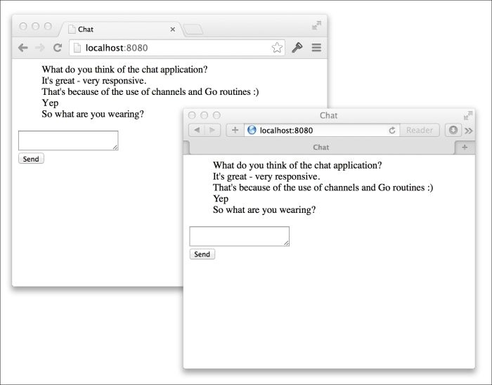

# 第一章。带有 Web 套接字的聊天应用程序

Go 非常适合编写高性能、并发的服务器应用程序和工具，而 Web 是传递它们的理想媒介。如今很难找到一个不支持 Web 的设备，并且允许我们构建一个针对几乎所有平台和设备的单一应用程序。

我们的第一个项目将是一个基于 Web 的聊天应用程序，允许多个用户在其 Web 浏览器中进行实时对话。成语化的 Go 应用程序通常由许多包组成，这些包通过在不同文件夹中放置代码来组织，Go 标准库也是如此。我们将首先使用`net/http`包构建一个简单的 Web 服务器，该服务器将提供 HTML 文件。然后，我们将继续添加对 Web 套接字的支持，通过它我们的消息将流动。

在诸如 C＃，Java 或 Node.js 之类的语言中，需要使用复杂的线程代码和巧妙地使用锁来保持所有客户端同步。正如我们将看到的，Go 通过其内置的通道和并发范例极大地帮助了我们。

在本章中，您将学习如何：

+   使用`net/http`包来提供 HTTP 请求

+   向用户的浏览器提供基于模板的内容

+   满足 Go 接口以构建我们自己的`http.Handler`类型

+   使用 Go 的 goroutines 允许应用程序同时执行多个任务

+   使用通道在运行的 Go 例程之间共享信息

+   升级 HTTP 请求以使用诸如 Web 套接字之类的现代功能

+   为应用程序添加跟踪，以更好地了解其内部工作原理

+   使用测试驱动开发实践编写完整的 Go 包

+   通过导出的接口返回未导出的类型

### 注意

此项目的完整源代码可以在[`github.com/matryer/goblueprints/tree/master/chapter1/chat`](https://github.com/matryer/goblueprints/tree/master/chapter1/chat)找到。源代码定期提交，因此 GitHub 中的历史实际上也遵循本章的流程。

# 一个简单的 Web 服务器

我们的聊天应用程序首先需要一个具有两个主要职责的 Web 服务器：它必须为在用户浏览器中运行的 HTML 和 JavaScript 聊天客户端提供服务，并接受 Web 套接字连接以允许客户端进行通信。

### 注意

`GOPATH`环境变量在附录中有详细介绍，*稳定的 Go 环境的良好实践*。如果您需要帮助设置，请务必先阅读。

在`GOPATH`中的新文件夹`chat`中创建一个`main.go`文件，并添加以下代码：

```go
package main

import (
  "log"
  "net/http"
)

func main() {

  http.HandleFunc("/", func(w http.ResponseWriter, r *http.Request) {
    w.Write([]byte(`
      <html>
        <head>
          <title>Chat</title>
        </head>
        <body>
          Let's chat!
        </body>
      </html>
    `))
  })
  // start the web server
  if err := http.ListenAndServe(":8080", nil); err != nil {
    log.Fatal("ListenAndServe:", err)
  }
}
```

这是一个完整但简单的 Go 程序，将会：

+   使用`net/http`包监听根路径

+   当请求被发出时，写出硬编码的 HTML

+   使用`ListenAndServe`方法在端口`:8080`上启动 Web 服务器

`http.HandleFunc`函数将路径模式`"/"`映射到我们作为第二个参数传递的函数，因此当用户访问`http://localhost:8080/`时，该函数将被执行。`func(w http.ResponseWriter, r *http.Request)`的函数签名是处理整个 Go 标准库中的 HTTP 请求的常见方式。

### 提示

我们使用`package main`，因为我们希望从命令行构建和运行我们的程序。然而，如果我们正在构建一个可重用的聊天包，我们可能会选择使用不同的东西，比如`package chat`。

在终端中，通过导航到您刚创建的`main.go`文件并执行以下命令来运行程序：

```go

go run main.go

```

打开浏览器到`localhost:8080`，看到**让我们聊天！**消息。

像这样将 HTML 代码嵌入到我们的 Go 代码中是有效的，但它非常丑陋，并且随着我们的项目增长，情况只会变得更糟。接下来，我们将看到模板如何帮助我们清理这些内容。

## 模板

模板允许我们将通用文本与特定文本混合在一起，例如，将用户的姓名注入欢迎消息中。例如，考虑以下模板：

```go
Hello {name}, how are you?
```

我们能够用真实的人名替换前面模板中的`{name}`文本。所以如果 Laurie 登录，她可能会看到：

```go
Hello Laurie, how are you?
```

Go 标准库有两个主要的模板包：一个叫做`text/template`用于文本，另一个叫做`html/template`用于 HTML。`html/template`包与文本版本相同，只是它了解数据将被注入模板的上下文。这很有用，因为它避免了脚本注入攻击，并解决了诸如必须对 URL 编码特殊字符之类的常见问题。

最初，我们只想将 HTML 代码从我们的 Go 代码中移动到自己的文件中，但暂时不混合任何文本。模板包使加载外部文件非常容易，所以这对我们来说是一个不错的选择。

在我们的`chat`文件夹下创建一个名为`templates`的新文件夹，并在其中创建一个名为`chat.html`的文件。我们将 HTML 从`main.go`移动到这个文件中，但我们将进行一些小的更改，以确保我们的更改已生效。

```go
<html>
  <head>
    <title>Chat</title>
  </head>
  <body>
    Let's chat 
(from template)

  </body>
</html>
```

现在，我们已经准备好使用外部 HTML 文件，但我们需要一种方法来编译模板并将其提供给用户的浏览器。

### 提示

编译模板是一个过程，通过这个过程，源模板被解释并准备好与各种数据混合，这必须在模板可以使用之前发生，但只需要发生一次。

我们将编写自己的`struct`类型，负责加载、编译和传递我们的模板。我们将定义一个新类型，它将接受一个`filename`字符串，一次编译模板（使用`sync.Once`类型），保持对编译模板的引用，然后响应 HTTP 请求。您需要导入`text/template`、`path/filepath`和`sync`包来构建您的代码。

在`main.go`中，在`func main()`行上面插入以下代码：

```go
// templ represents a single template
type templateHandler struct {
  once     sync.Once
  filename string
  templ    *template.Template
}
// ServeHTTP handles the HTTP request.
func (t *templateHandler) ServeHTTP(w http.ResponseWriter, r *http.Request) {
  t.once.Do(func() {
    t.templ = template.Must(template.ParseFiles(filepath.Join("templates", t.filename)))
  })
  t.templ.Execute(w, nil)
}
```

### 提示

您知道您可以自动添加和删除导入的包吗？请参阅附录，*稳定 Go 环境的良好实践*，了解如何做到这一点。

`templateHandler`类型有一个名为`ServeHTTP`的单一方法，其签名看起来很像我们之前传递给`http.HandleFunc`的方法。这个方法将加载源文件，编译模板并执行它，并将输出写入指定的`http.ResponseWriter`对象。因为`ServeHTTP`方法满足`http.Handler`接口，我们实际上可以直接将它传递给`http.Handle`。

### 提示

快速查看位于[`golang.org/pkg/net/http/#Handler`](http://golang.org/pkg/net/http/#Handler)的 Go 标准库源代码，将会发现`http.Handler`的接口定义规定了只有`ServeHTTP`方法需要存在，才能使类型用于通过`net/http`包来提供 HTTP 请求。

### 只做一次的事情

我们只需要一次编译模板，Go 中有几种不同的方法可以实现这一点。最明显的方法是有一个`NewTemplateHandler`函数来创建类型并调用一些初始化代码来编译模板。如果我们确信该函数只会被一个 goroutine 调用（可能是`main`函数中的主要函数），那么这将是一个完全可以接受的方法。另一种方法是在`ServeHTTP`方法内部编译模板一次，这是我们在前面的部分中采用的方法。`sync.Once`类型保证我们传递为参数的函数只会被执行一次，不管有多少 goroutine 在调用`ServeHTTP`。这很有帮助，因为 Go 中的 Web 服务器是自动并发的，一旦我们的聊天应用席卷世界，我们很可能会有许多并发调用`ServeHTTP`方法。

在`ServeHTTP`方法中编译模板还确保我们的代码在绝对需要之前不会浪费时间。这种懒惰的初始化方法在我们目前的情况下并没有节省太多时间，但在设置任务耗时和资源密集的情况下，并且功能使用频率较低的情况下，很容易看出这种方法会派上用场。

### 使用自己的处理程序

为了实现我们的`templateHandler`类型，我们需要更新`main`主体函数，使其看起来像这样：

```go
func main() {
  // root

http.Handle("/", &templateHandler{filename: "chat.html"})

  // start the web server
  if err := http.ListenAndServe(":8080", nil); err != nil {
    log.Fatal("ListenAndServe:", err)
  }
}
```

`templateHandler`结构是有效的`http.Handler`类型，因此我们可以直接将其传递给`http.Handle`函数，并要求它处理与指定模式匹配的请求。在前面的代码中，我们创建了一个`templateHandler`类型的新对象，指定文件名为`chat.html`，然后取其地址（使用`&` **地址**运算符）并将其传递给`http.Handle`函数。我们不存储对新创建的`templateHandler`类型的引用，但这没关系，因为我们不需要再次引用它。

在终端中，按下*Ctrl* + *C*退出程序，然后刷新您的浏览器，注意添加了（来自模板）文本。现在我们的代码比 HTML 代码简单得多，没有那些丑陋的块。

## 正确构建和执行 Go 程序

使用`go run`命令运行 Go 程序时，当我们的代码由单个`main.go`文件组成时非常方便。然而，通常我们可能需要快速添加其他文件。这要求我们在运行之前将整个包正确构建为可执行二进制文件。这很简单，从现在开始，这就是您将在终端中构建和运行程序的方式：

```go

go build -o {name}

./{name}

```

`go build`命令使用指定文件夹中的所有`.go`文件创建输出二进制文件，`-o`标志指示生成的二进制文件的名称。然后，您只需通过名称调用程序直接运行程序。

例如，在我们的聊天应用程序中，我们可以运行：

```go

go build -o chat

./chat

```

由于我们在首次提供页面时编译模板，因此每次发生更改时，我们都需要重新启动您的 Web 服务器程序，以查看更改生效。

# 在服务器上建模聊天室和客户端

我们聊天应用程序的所有用户（客户端）将自动放置在一个大的公共房间中，每个人都可以与其他人聊天。`room`类型将负责管理客户端连接并路由消息进出，而`client`类型表示与单个客户端的连接。

### 提示

Go 将类称为类型，将这些类的实例称为对象。

为了管理我们的网络套接字，我们将使用 Go 社区最强大的一个方面——开源第三方包。每天都会发布解决现实问题的新包，供您在自己的项目中使用，甚至允许您添加功能，报告和修复错误，并获得支持。

### 提示

重新发明轮子通常是不明智的，除非您有非常好的理由。因此，在着手构建新包之前，值得搜索可能已经解决了您的问题的任何现有项目。如果找到一个类似的项目，但不完全满足您的需求，请考虑为该项目添加功能。Go 拥有一个特别活跃的开源社区（请记住 Go 本身也是开源的），随时欢迎新面孔或头像。

我们将使用 Gorilla Project 的`websocket`包来处理我们的服务器端套接字，而不是编写我们自己的。如果您对它的工作原理感到好奇，请转到 GitHub 上的项目主页，[`github.com/gorilla/websocket`](https://github.com/gorilla/websocket)，并浏览开源代码。

## 建模客户端

在`chat`文件夹中的`main.go`旁边创建一个名为`client.go`的新文件，并添加以下代码：

```go
package main
import (
  "github.com/gorilla/websocket"
)
// client represents a single chatting user.
type client struct {
  // socket is the web socket for this client.
  socket *websocket.Conn
  // send is a channel on which messages are sent.
  send chan []byte
  // room is the room this client is chatting in.
  room *room
}
```

在前面的代码中，套接字将保存一个与客户端通信的网络套接字的引用，`send`字段是一个缓冲通道，通过它接收到的消息排队准备转发到用户的浏览器（通过套接字）。`room`字段将保留客户端正在聊天的房间的引用——这是必需的，以便我们可以将消息转发给房间中的其他所有人。

如果您尝试构建此代码，您将注意到一些错误。您必须确保已调用`go get`来检索`websocket`包，这很容易，只需打开终端并输入以下内容：

```go

go get github.com/gorilla/websocket

```

再次构建代码将产生另一个错误：

```go

./client.go:17 undefined: room

```

问题在于我们引用了一个未定义的`room`类型。为了让编译器满意，创建一个名为`room.go`的文件，并插入以下占位符代码：

```go
package main
type room struct {
  // forward is a channel that holds incoming messages
  // that should be forwarded to the other clients.
  forward chan []byte
}
```

一旦我们了解了房间需要做什么，我们将稍后改进这个定义，但现在这将允许我们继续。稍后，`forward`通道将用于将传入的消息发送到所有其他客户端。

### 注意

您可以将通道视为内存中的线程安全消息队列，发送者通过非阻塞的线程安全方式传递数据，接收者读取数据。

为了让客户端执行任何工作，我们必须定义一些方法，这些方法将实际读取和写入到网络套接字。将以下代码添加到`client.go`之外（在`client`结构下方）将向`client`类型添加名为`read`和`write`的两个方法：

```go
func (c *client) read() {
  for {
    if _, msg, err := c.socket.ReadMessage(); err == nil {
      c.room.forward <- msg
    } else {
      break
    }
  }
  c.socket.Close()
}
func (c *client) write() {
  for msg := range c.send {
    if err := c.socket.WriteMessage(websocket.TextMessage, msg); err != nil {
      break
    }
  }
  c.socket.Close()
}
```

`read`方法允许我们的客户端通过`ReadMessage`方法从套接字中读取，不断将接收到的任何消息发送到`room`类型的`forward`通道。如果遇到错误（例如“套接字已断开”），循环将中断并关闭套接字。类似地，`write`方法不断接受`send`通道的消息，通过`WriteMessage`方法将所有内容写入套接字。如果向套接字写入失败，`for`循环将中断并关闭套接字。再次构建包以确保一切都编译。

## 建模一个房间

我们需要一种方法让客户端加入和离开房间，以确保前面部分中的`c.room.forward <- msg`代码实际上将消息转发给所有客户端。为了确保我们不会同时尝试访问相同的数据，一个明智的方法是使用两个通道：一个用于向房间添加客户端，另一个用于将其删除。让我们更新我们的`room.go`代码如下：

```go
package main

type room struct {

  // forward is a channel that holds incoming messages
  // that should be forwarded to the other clients.
  forward chan []byte
  // join is a channel for clients wishing to join the room.
  join chan *client
  // leave is a channel for clients wishing to leave the room.
  leave chan *client
  // clients holds all current clients in this room.
  clients map[*client]bool
}
```

我们添加了三个字段：两个通道和一个映射。`join`和`leave`通道存在的简单目的是允许我们安全地向`clients`映射中添加和删除客户端。如果我们直接访问映射，可能会出现两个同时运行的 Go 例程同时尝试修改映射，导致内存损坏或不可预测的状态。

## 使用符合惯例的 Go 并发编程

现在我们可以使用 Go 并发提供的一个非常强大的功能——`select`语句。我们可以在需要同步或修改共享内存，或根据通道内的各种活动采取不同的操作时使用`select`语句。

在`room`结构下方，添加包含两个`select`子句的`run`方法：

```go
func (r *room) run() {
  for {
    select {
    case client := <-r.join:
      // joining
      r.clients[client] = true
    case client := <-r.leave:
      // leaving
      delete(r.clients, client)
      close(client.send)
    case msg := <-r.forward:
      // forward message to all clients
      for client := range r.clients {
        select {
        case client.send <- msg:
          // send the message
        default:
          // failed to send
          delete(r.clients, client)
          close(client.send)
        }
      }
    }
  }
}
```

尽管这可能看起来是很多代码要消化，但一旦我们稍微分解一下，我们就会发现它其实相当简单，尽管非常强大。顶部的`for`循环表示这个方法将一直运行，直到程序被终止。这可能看起来像是一个错误，但请记住，如果我们将这段代码作为 Go 例程运行，它将在后台运行，不会阻塞我们应用程序的其余部分。前面的代码将一直监视我们房间内的三个通道：`join`，`leave`和`forward`。如果在这些通道中收到消息，`select`语句将运行特定情况的代码块。重要的是要记住，它一次只会运行一个 case 代码块。这就是我们能够同步以确保我们的`r.clients`地图一次只能被一件事情修改的方式。

如果我们在`join`通道上收到消息，我们只需更新`r.clients`地图以保留已加入房间的客户端的引用。请注意，我们将值设置为`true`。我们使用地图更像是一个切片，但不必担心随着时间的推移客户端的增减而收缩切片 - 将值设置为`true`只是一种方便的、低内存的存储引用的方式。

如果我们在`leave`通道上收到消息，我们只需从地图中删除`client`类型，并关闭其`send`通道。关闭通道在 Go 语言中具有特殊的意义，当我们看到最终的`select`语句时，这一点就变得很清楚了。

如果我们在`forward`通道上收到消息，我们会遍历所有客户端，并将消息发送到每个客户端的发送通道。然后，我们的客户端类型的`write`方法将接收并将其发送到浏览器的套接字。如果`send`通道关闭，那么我们知道客户端不再接收任何消息，这就是我们的第二个`select`子句（特别是默认情况）采取的移除客户端并整理事情的操作。

## 将房间转换为 HTTP 处理程序

现在我们将把我们的`room`类型转换为`http.Handler`类型，就像我们之前对模板处理程序所做的那样。您会记得，为了做到这一点，我们只需添加一个名为`ServeHTTP`的方法，具有适当的签名。将以下代码添加到`room.go`文件的底部：

```go
const (
  socketBufferSize  = 1024
  messageBufferSize = 256
)
var upgrader = &websocket.Upgrader{ReadBufferSize: socketBufferSize, WriteBufferSize: socketBufferSize}
func (r *room) ServeHTTP(w http.ResponseWriter, req *http.Request) {
  socket, err := upgrader.Upgrade(w, req, nil)
  if err != nil {
    log.Fatal("ServeHTTP:", err)
    return
  }
  client := &client{
    socket: socket,
    send:   make(chan []byte, messageBufferSize),
    room:   r,
  }
  r.join <- client
  defer func() { r.leave <- client }()
  go client.write()
  client.read()
}
```

`ServeHTTP`方法意味着房间现在可以作为处理程序。我们很快将实现它，但首先让我们看看这段代码中发生了什么。

为了使用 Web 套接字，我们必须使用`websocket.Upgrader`类型升级 HTTP 连接，该类型是可重用的，因此我们只需要创建一个。然后，当请求通过`ServeHTTP`方法进入时，我们通过调用`upgrader.Upgrade`方法获取套接字。一切顺利的话，我们就创建客户端并将其传递到当前房间的`join`通道中。我们还推迟了客户端完成后的离开操作，这将确保用户离开后一切都整理得很好。

然后，客户端的`write`方法被调用为 Go 例程，如行首的三个字符所示`go`（单词`go`后跟一个空格字符）。这告诉 Go 在不同的线程或 goroutine 中运行该方法。

### 注意

比较在其他语言中实现多线程或并发所需的代码量与在 Go 中实现它的三个关键按键，您会发现为什么它已经成为系统开发人员中的最爱。

最后，我们在主线程中调用`read`方法，它将阻塞操作（保持连接活动），直到关闭连接的时候。在代码片段的顶部添加常量是一个很好的做法，用于声明在整个项目中原本将硬编码的值。随着这些值的增加，您可能会考虑将它们放在自己的文件中，或者至少放在各自文件的顶部，以便保持易读易修改。

## 使用辅助函数来减少复杂性

我们的房间几乎可以使用了，尽管为了让它有用，需要创建频道和地图。目前，可以通过要求开发者使用以下代码来实现这一点：

```go
r := &room{
  forward: make(chan []byte),
  join:    make(chan *client),
  leave:   make(chan *client),
  clients: make(map[*client]bool),
}
```

另一个稍微更加优雅的解决方案是提供一个`newRoom`函数来代替。这样就不需要其他人知道确切需要做什么才能让我们的房间有用。在`type room struct`的定义下面，添加这个函数：

```go
// newRoom makes a new room that is ready to go.
func newRoom() *room {
  return &room{
    forward: make(chan []byte),
    join:    make(chan *client),
    leave:   make(chan *client),
    clients: make(map[*client]bool),
  }
}
```

现在，我们的代码用户只需要调用`newRoom`函数，而不是更冗长的六行代码。

## 创建和使用房间

让我们更新`main.go`中的`main`函数，首先创建，然后运行一个房间，让每个人都可以连接到：

```go
func main() {
  r := newRoom()
  http.Handle("/", &templateHandler{filename: "chat.html"})
  http.Handle("/room", r)
  // get the room going
  go r.run()
  // start the web server
  if err := http.ListenAndServe(":8080", nil); err != nil {
    log.Fatal("ListenAndServe:", err)
  }
}
```

我们在一个单独的 Go 例程中运行房间（再次注意`go`关键字），以便聊天操作在后台进行，使我们的主线程运行 Web 服务器。我们的服务器现在已经完成并成功构建，但没有客户端进行交互，它仍然是无用的。

# 构建 HTML 和 JavaScript 聊天客户端

为了让我们的聊天应用程序的用户与服务器以及其他用户进行交互，我们需要编写一些客户端代码，利用现代浏览器中的 Web 套接字。当用户访问我们应用程序的根目录时，我们已经通过模板传递 HTML 内容，所以我们可以增强它。

使用以下标记更新`templates`文件夹中的`chat.html`文件：

```go
<html>
  <head>
    <title>Chat</title>
    <style>
      input { display: block; }
      ul    { list-style: none; }
    </style>
  </head>
  <body>
    <ul id="messages"></ul>
    <form id="chatbox">
      <textarea></textarea>
      <input type="submit" value="Send" />
       </form>  </body>
</html>
```

上述的 HTML 将在页面上呈现一个简单的网络表单，其中包含一个文本区域和一个“发送”按钮——这是我们的用户将消息提交到服务器的方式。上述代码中的`messages`元素将包含聊天消息的文本，以便所有用户都能看到正在说什么。接下来，我们需要添加一些 JavaScript 来为我们的页面添加一些功能。在`form`标签下，在闭合的`</body>`标签上面，插入以下代码：

```go
    <script src="img/jquery.min.js"></script>
    <script>
      $(function(){
        var socket = null;
        var msgBox = $("#chatbox textarea");
        var messages = $("#messages");
        $("#chatbox").submit(function(){
          if (!msgBox.val()) return false;
          if (!socket) {
            alert("Error: There is no socket connection.");
            return false;
          }
          socket.send(msgBox.val());
          msgBox.val("");
          return false;
        });
        if (!window["WebSocket"]) {
          alert("Error: Your browser does not support web sockets.")
        } else {
          socket = new WebSocket("ws://localhost:8080/room");
          socket.onclose = function() {
            alert("Connection has been closed.");
          }
          socket.onmessage = function(e) {
            messages.append($("<li>").text(e.data));
          }
        }
      });
    </script>
```

`socket = new WebSocket("ws://localhost:8080/room")`这一行是我们打开套接字并为两个关键事件`onclose`和`onmessage`添加事件处理程序的地方。当套接字接收到消息时，我们使用 jQuery 将消息附加到列表元素，从而呈现给用户。

提交 HTML 表单触发对`socket.send`的调用，这是我们向服务器发送消息的方式。

再次构建和运行程序，以确保模板重新编译，以便这些更改得到体现。

在两个不同的浏览器（或同一个浏览器的两个标签）中导航到`http://localhost:8080/`并使用应用程序。您会注意到从一个客户端发送的消息立即出现在其他客户端中。



## 更多地利用模板

目前，我们正在使用模板传递静态 HTML，这很好，因为它为我们提供了一种清晰简单的方法来将客户端代码与服务器代码分离。然而，模板实际上更加强大，我们将调整我们的应用程序以更加现实地使用它们。

我们应用程序的主机地址（`:8080`）目前在两个地方都是硬编码的。第一个实例是在`main.go`中启动 Web 服务器的地方：

```go
if err := http.ListenAndServe("
:8080

", nil); err != nil {
  log.Fatal("ListenAndServe:", err)
}
```

第二次是在 JavaScript 中硬编码的，当我们打开套接字时：

```go
socket = new WebSocket("ws://
localhost:8080

/room");
```

我们的聊天应用程序非常固执，坚持只在本地端口`8080`上运行，因此我们将使用命令行标志使其可配置，然后使用模板的注入功能确保我们的 JavaScript 知道正确的主机。

更新`main.go`中的`main`函数：

```go
func main() {  

var addr = flag.String("addr", ":8080", "The addr of the application.")

flag.Parse() // parse the flags

  r := newRoom()
  http.Handle("/", &templateHandler{filename: "chat.html"})
  http.Handle("/room", r)
  // get the room going
  go r.run()
  // start the web server

log.Println("Starting web server on", *addr)

  if err := http.ListenAndServe(
*addr

, nil); err != nil {
    log.Fatal("ListenAndServe:", err)
  }
}
```

为了使此代码构建，您需要导入`flag`包。`addr`变量的定义将我们的标志设置为一个默认为`:8080`的字符串（并简要描述了该值的用途）。我们必须调用`flag.Parse()`来解析参数并提取适当的信息。然后，我们可以通过使用`*addr`引用主机标志的值。

### 注意

对`flag.String`的调用返回`*string`类型，也就是说它返回存储标志值的字符串变量的地址。要获取值本身（而不是值的地址），我们必须使用指针间接操作符`*`。

我们还添加了一个`log.Println`调用，以在终端中输出地址，以确保我们的更改已生效。

我们将修改我们编写的`templateHandler`类型，以便将请求的详细信息作为数据传递到模板的`Execute`方法中。在`main.go`中，更新`ServeHTTP`函数，将请求`r`作为`data`参数传递给`Execute`方法：

```go
func (t *templateHandler) ServeHTTP(w http.ResponseWriter, r *http.Request) {
  t.once.Do(func() {
    t.templ = template.Must(template.ParseFiles(filepath.Join("templates", t.filename)))
  })

t.templ.Execute(w, r)

}
```

这告诉模板使用可以从`http.Request`中提取的数据进行渲染，其中包括我们需要的主机地址。

要使用`http.Request`的`Host`值，我们可以利用特殊的模板语法来注入数据。更新我们在`chat.html`文件中创建套接字的行：

```go
socket = new WebSocket("ws://{{.Host}}/room");
```

双花括号表示注释，告诉模板源注入数据的方式。`{{.Host}}`本质上等同于告诉它用`request.Host`的值替换注释（因为我们将请求`r`对象作为数据传递）。

### 提示

我们只是初步了解了 Go 标准库中内置模板的强大功能。`text/template`包的文档是了解更多内容的好地方。您可以在[`golang.org/pkg/text/template`](http://golang.org/pkg/text/template)找到更多信息。

重新构建并再次运行聊天程序，但是这次请注意，无论我们指定哪个主机，聊天操作都不再产生错误：

```go
go build -o chat
./chat -addr=":3000"
```

在浏览器中查看页面源代码，注意`{{.Host}}`已被实际应用的主机替换。有效的主机不仅仅是端口号；您还可以指定 IP 地址或其他主机名——只要它们在您的环境中被允许，例如`-addr="192.168.0.1:3000"`。

# 跟踪代码以深入了解内部情况

我们唯一知道我们的应用程序是否工作的方法是打开两个或更多浏览器，并使用我们的 UI 发送消息。换句话说，我们正在手动测试我们的代码。这对于实验性项目（如我们的聊天应用程序）或不希望增长的小项目来说是可以接受的，但是如果我们的代码要有更长的寿命或由多个人共同开发，这种手动测试就成了一种负担。我们不打算为我们的聊天程序解决**测试驱动开发**（**TDD**），但我们应该探索另一种有用的调试技术，称为**跟踪**。

跟踪是一种实践，通过它我们可以记录或打印程序流程中的关键步骤，以使程序内部发生的事情可见。在前一节中，我们添加了一个`log.Println`调用来输出聊天程序绑定到的地址。在本节中，我们将正式化这一过程，并编写我们自己完整的跟踪包。

我们将探索 TDD 实践，因为编写跟踪代码是一个完美的例子，我们很可能会重用、添加、共享，甚至开源。

## 使用 TDD 编写包

Go 中的包被组织到文件夹中，每个文件夹一个包。在同一个文件夹中有不同的包声明会导致构建错误，因为所有同级文件都被期望为单个包做出贡献。Go 没有子包的概念，这意味着嵌套包（在嵌套文件夹中）只存在于美学或信息上的原因，但不会继承任何功能或可见性。在我们的聊天应用中，所有文件都属于`main`包，因为我们想要构建一个可执行工具。我们的追踪包永远不会直接运行，因此可以并且应该使用不同的包名。我们还需要考虑我们包的**应用程序编程接口**（**API**），考虑如何建模一个包，使其对用户来说尽可能具有可扩展性和灵活性。这包括应该导出（对用户可见）的字段、函数、方法和类型，以及为简单起见应该保持隐藏的内容。

### 注意

Go 使用名称的大写来表示哪些项目是导出的，以便以大写字母开头的名称（例如`Tracer`）对包的用户可见，以小写字母开头的名称（例如`templateHandler`）是隐藏或私有的。

在`chat`文件夹旁边创建一个名为`trace`的新文件夹，这将是我们追踪包的名称。

在我们开始编码之前，让我们就我们包的一些设计目标达成一致，以便衡量成功：

+   包应该易于使用

+   单元测试应该覆盖功能

+   用户应该有灵活性来用自己的实现替换追踪器

### 接口

Go 语言中的接口是一种非常强大的语言特性，它允许我们定义一个 API 而不严格或具体地定义实现细节。在可能的情况下，使用接口描述包的基本构建块通常会在未来产生回报，这也是我们追踪包的起点。

在`trace`文件夹内创建一个名为`tracer.go`的新文件，并写入以下代码：

```go
package trace
// Tracer is the interface that describes an object capable of
// tracing events throughout code.
type Tracer interface {
  Trace(...interface{})
}
```

首先要注意的是，我们将包定义为`trace`。

### 注意

虽然将文件夹名称与包名称匹配是一个好习惯，但 Go 工具不强制执行这一点，这意味着如果有意义，你可以自由地给它们命名不同的名称。记住，当人们导入你的包时，他们会输入文件夹的名称，如果突然导入了一个不同名称的包，可能会让人困惑。

我们的`Tracer`类型（大写的`T`表示我们打算将其作为公开可见类型）是一个描述单个名为`Trace`的方法的接口。`...interface{}`参数类型表示我们的`Trace`方法将接受零个或多个任意类型的参数。你可能会认为这是多余的，因为该方法应该只接受一个字符串（我们只想追踪一些字符的字符串，不是吗？）。然而，考虑到`fmt.Sprint`和`log.Fatal`等函数，它们都遵循了 Go 标准库中的一种模式，提供了一个有用的快捷方式，用于一次性传递多个内容。在可能的情况下，我们应该遵循这样的模式和实践，因为我们希望我们自己的 API 对 Go 社区来说是熟悉和清晰的。

### 单元测试

我们答应自己要遵循测试驱动的实践，但接口只是定义，不提供任何实现，因此无法直接进行测试。但我们即将编写一个`Tracer`方法的真正实现，并且我们确实会先编写测试。

在`trace`文件夹中创建一个名为`tracer_test.go`的新文件，并插入以下框架代码：

```go
package trace
import (
  "testing"
)
func TestNew(t *testing.T) {
  t.Error("We haven't written our test yet")
}
```

测试是从一开始就内置在 Go 工具链中的，使得编写可自动化测试成为一等公民。测试代码与生产代码一起存放在以`_test.go`结尾的文件中。Go 工具将把任何以`Test`开头的函数（接受一个`*testing.T`参数）视为单元测试，并在运行测试时执行它们。要为此包运行它们，请在终端中导航到`trace`文件夹并执行以下操作：

```go

go test

```

您会看到我们的测试失败，因为我们在`TestNew`函数的主体中调用了`t.Error`：

```go

--- FAIL: TestNew (0.00 seconds)

 tracer_test.go:8: We haven't written our test yet

FAIL

exit status 1

FAIL  trace        0.011s

```

### 提示

在每次测试运行之前清除终端是一个很好的方法，可以确保您不会将之前的运行与最近的运行混淆。在 Windows 上，您可以使用`cls`命令；在 Unix 机器上，`clear`命令可以做同样的事情。

显然，我们没有正确地编写我们的测试，我们也不希望它通过，所以让我们更新`TestNew`函数：

```go
func TestNew(t *testing.T) {

 var buf bytes.Buffer

 tracer := New(&buf)

 if tracer == nil {

 t.Error("Return from New should not be nil")

 } else {

 tracer.Trace("Hello trace package.")

 if buf.String() != "Hello trace package.\n" {

 t.Errorf("Trace should not write '%s'.", buf.String())

 }

 }

}
```

本书中的大多数包都来自 Go 标准库，因此您可以添加适当的包的`import`语句以访问该包。其他包是外部的，这时您需要使用`go get`来下载它们，然后才能导入。对于这种情况，您需要在文件顶部添加`import "bytes"`。

我们已经开始通过成为第一个用户来设计我们的 API。我们希望能够在`bytes.Buffer`中捕获我们的跟踪器的输出，以便我们可以确保缓冲区中的字符串与预期值匹配。如果不匹配，对` t.Errorf`的调用将使测试失败。在此之前，我们检查一下虚构的`New`函数的返回值是否不是`nil`；同样，如果是，测试将因为对` t.Error`的调用而失败。

### 红绿测试

现在运行`go test`实际上会产生一个错误；它抱怨没有`New`函数。我们没有犯错；我们正在遵循一种被称为红绿测试的实践。红绿测试建议我们首先编写一个单元测试，看到它失败（或产生错误），然后编写尽可能少的代码使该测试通过，并重复这个过程。这里的关键点是我们要确保我们添加的代码实际上正在做一些事情，并确保我们编写的测试代码正在测试一些有意义的东西。

### 注意

考虑一分钟的无意义测试：

```go
if true == true {
  t.Error("True should be true")
}
```

逻辑上不可能让 true 不等于 true（如果 true 等于 false，那么是时候换台新电脑了），因此我们的测试是毫无意义的。如果测试或声明不能失败，那么它就毫无价值。

将`true`替换为一个您希望在特定条件下设置为`true`的变量，这意味着这样的测试确实可能失败（比如在被测试的代码行为不当时）——在这一点上，您有一个值得为代码库做出贡献的有意义的测试。

您可以将`go test`的输出视为待办事项列表，一次只解决一个问题。现在，我们只会解决有关缺少`New`函数的投诉。在`trace.go`文件中，让我们添加尽可能少的代码来继续进行；在接口类型定义下面添加以下代码片段：

```go
func New() {}
```

现在运行`go test`会显示事情确实有所进展，尽管进展不是很大。我们现在有两个错误：

```go

./tracer_test.go:11: too many arguments in call to New

./tracer_test.go:11: New(&buf) used as value

```

第一个错误告诉我们，我们正在向我们的`New`函数传递参数，但`New`函数不接受任何参数。第二个错误说我们正在使用`New`函数的返回值作为值，但`New`函数并不返回任何东西。您可能已经预料到了这一点，确实随着您在编写测试驱动的代码方面获得更多经验，您很可能会跳过这样的琐事。但是，为了正确地说明这种方法，我们将要有一段时间的迂腐。让我们通过更新我们的`New`函数来解决第一个错误：

```go
func New(w io.Writer) {}
```

我们正在接收一个满足`io.Writer`接口的参数，这意味着指定的对象必须有一个合适的`Write`方法。

### 注意

使用现有接口，特别是在 Go 标准库中找到的接口，是确保您的代码尽可能灵活和优雅的一种极其强大且经常必要的方式。

接受`io.Writer`意味着用户可以决定跟踪输出将写入何处。这个输出可以是标准输出，文件，网络套接字，`bytes.Buffer`，甚至是一些自定义对象，只要它实现了`io.Writer`接口的`Write`方法。

再次运行`go test`显示我们已解决第一个错误，我们只需要添加一个返回类型以继续通过第二个错误：

```go
func New(w io.Writer) Tracer {}
```

我们声明我们的`New`函数将返回一个`Tracer`，但我们没有返回任何东西，这让`go test`很高兴地抱怨：

```go

./tracer.go:13: missing return at end of function

```

修复这很容易；我们可以从`New`函数中返回`nil`：

```go
func New(w io.Writer) Tracer {
  return nil
}
```

当然，我们的测试代码已经断言返回值不应该是`nil`，所以`go test`现在给我们一个失败消息：

```go

tracer_test.go:14: Return from New should not be nil

```

### 注意

你可以看到严格遵循红绿原则可能有点乏味，但非常重要的是我们不要跳得太远。如果我们一次写很多实现代码，很可能会有代码没有被单元测试覆盖。

体贴的核心团队甚至通过提供代码覆盖率统计数据来解决了这个问题，我们可以通过运行以下命令生成：

```go
go test -cover
```

只要所有测试通过，添加`-cover`标志将告诉我们在执行测试期间有多少代码被触及。显然，我们越接近 100%越好。

### 实现接口

为了满足这个测试，我们需要一个可以从`New`方法中正确返回的东西，因为`Tracer`只是一个接口，我们必须返回一些真实的东西。让我们在`tracer.go`文件中添加一个 tracer 的实现：

```go
type tracer struct {
  out io.Writer
}

func (t *tracer) Trace(a ...interface{}) {}
```

我们的实现非常简单；`tracer`类型有一个名为`out`的`io.Writer`字段，我们将把跟踪输出写入其中。`Trace`方法与`Tracer`接口所需的方法完全匹配，尽管它目前什么也不做。

现在我们终于可以修复`New`方法了：

```go
func New(w io.Writer) Tracer {
  return &tracer{out: w}
}
```

再次运行`go test`显示我们的期望没有达到，因为在调用`Trace`时没有写入任何内容：

```go

tracer_test.go:18: Trace should not write ''.

```

让我们更新我们的`Trace`方法，将混合参数写入指定的`io.Writer`字段：

```go
func (t *tracer) Trace(a ...interface{}) {
  t.out.Write([]byte(fmt.Sprint(a...)))
  t.out.Write([]byte("\n"))
}
```

当调用`Trace`方法时，我们在`out`字段中存储的`io.Writer`上调用`Write`，并使用`fmt.Sprint`格式化`a`参数。我们将`fmt.Sprint`的字符串返回类型转换为`string`，然后转换为`[]byte`，因为这是`io.Writer`接口所期望的。

我们最终满足了我们的测试吗？

```go

go test -cover

PASS

coverage: 100.0% of statements

ok    trace        0.011s

```

恭喜！我们成功通过了测试，测试覆盖率为`100.0%`。一旦我们喝完香槟，我们可以花一分钟时间考虑一下我们的实现非常有趣的地方。

### 将未导出的类型返回给用户

我们编写的`tracer`结构类型是未导出的，因为它以小写的`t`开头，那么我们如何能够从导出的`New`函数中返回它呢？毕竟，用户会接收到返回的对象吗？这是完全可以接受和有效的 Go 代码；用户只会看到一个满足`Tracer`接口的对象，甚至不会知道我们私有的`tracer`类型。由于他们只与接口交互，我们的`tracer`实现暴露其他方法或字段也无所谓；它们永远不会被看到。这使我们能够保持包的公共 API 清晰简单。

这种隐藏的实现技术在 Go 标准库中被广泛使用，例如，`ioutil.NopCloser`方法是一个将普通的`io.Reader`转换为`io.ReadCloser`的函数，而`Close`方法什么也不做（用于将不需要关闭的`io.Reader`对象传递给需要`io.ReadCloser`类型的函数）。该方法在用户看来返回`io.ReadCloser`，但在底层，有一个秘密的`nopCloser`类型隐藏了实现细节。

### 注意

要亲自看到这一点，请浏览 Go 标准库源代码[`golang.org/src/pkg/io/ioutil/ioutil.go`](http://golang.org/src/pkg/io/ioutil/ioutil.go)，并搜索`nopCloser`结构。

## 使用我们的新的 trace 包

现在我们已经完成了`trace`包的第一个版本，我们可以在聊天应用程序中使用它，以更好地理解用户通过用户界面发送消息时发生了什么。

在`room.go`中，让我们导入我们的新包并对`Trace`方法进行一些调用。我们刚刚编写的`trace`包的路径将取决于您的`GOPATH`环境变量，因为导入路径是相对于`$GOPATH/src`文件夹的。因此，如果您在`$GOPATH/src/mycode/trace`中创建了`trace`包，则需要导入`mycode/trace`。

像这样更新`room`类型和`run()`方法：

```go
type room struct {
  // forward is a channel that holds incoming messages
  // that should be forwarded to the other clients.
  forward chan []byte
  // join is a channel for clients wishing to join the room.
  join chan *client
  // leave is a channel for clients wishing to leave the room.
  leave chan *client
  // clients holds all current clients in this room.
  clients map[*client]bool

// tracer will receive trace information of activity

 // in the room.

 tracer trace.Tracer

}
func (r *room) run() {
  for {
    select {
    case client := <-r.join:
      // joining
      r.clients[client] = true

r.tracer.Trace("New client joined")

    case client := <-r.leave:
      // leaving
      delete(r.clients, client)
      close(client.send)

r.tracer.Trace("Client left")

    case msg := <-r.forward:
      r.tracer.Trace("Message received: ", string(msg))
      // forward message to all clients
      for client := range r.clients {
        select {
        case client.send <- msg:
          // send the message

r.tracer.Trace(" -- sent to client")

        default:
          // failed to send
          delete(r.clients, client)
          close(client.send)

r.tracer.Trace(" -- failed to send, cleaned up client")

        }
      }
    }
  }
}
```

我们在`room`类型中添加了一个`trace.Tracer`字段，然后在整个代码中定期调用`Trace`方法。如果我们运行程序并尝试发送消息，您会注意到应用程序会因为`tracer`字段为`nil`而发生 panic。我们可以通过确保在创建`room`类型时创建并分配一个适当的对象来暂时解决这个问题。更新`main.go`文件以执行此操作：

```go
r := newRoom()
r.tracer = trace.New(os.Stdout)
```

我们使用我们的`New`方法来创建一个对象，该对象将输出发送到`os.Stdout`标准输出管道（这是一种技术方式，表示我们希望它将输出打印到我们的终端）。

现在重新构建并运行程序，并使用两个浏览器玩耍应用程序，注意终端现在有一些有趣的跟踪信息供我们查看：

```go

New client joined

New client joined

Message received: Hello Chat

 -- sent to client

 -- sent to client

Message received: Good morning :)

 -- sent to client

 -- sent to client

Client left

Client left

```

现在我们能够使用调试信息来洞察应用程序的运行情况，这将在开发和支持项目时对我们有所帮助。

## 使跟踪变为可选

一旦应用程序发布，我们生成的跟踪信息将变得非常无用，如果它只是打印到某个终端上，甚至更糟的是，如果它为我们的系统管理员创建了大量噪音。另外，请记住，当我们没有为`room`类型设置跟踪器时，我们的代码会发生 panic，这并不是一个非常用户友好的情况。为了解决这两个问题，我们将增强我们的`trace`包，添加一个`trace.Off()`方法，该方法将返回一个满足`Tracer`接口但在调用`Trace`方法时不执行任何操作的对象。

让我们添加一个测试，调用`Off`函数以获取一个静默的 tracer，然后调用`Trace`以确保代码不会发生 panic。由于跟踪不会发生，这就是我们在测试代码中能做的全部。将以下测试函数添加到`tracer_test.go`文件中：

```go
func TestOff(t *testing.T) {
  var silentTracer Tracer = Off()
  silentTracer.Trace("something")
}
```

为了使其通过，将以下代码添加到`tracer.go`文件中：

```go
type nilTracer struct{}
func (t *nilTracer) Trace(a ...interface{}) {}
// Off creates a Tracer that will ignore calls to Trace.
func Off() Tracer {
  return &nilTracer{}
}
```

我们的`nilTracer`结构定义了一个什么也不做的`Trace`方法，调用`Off()`方法将创建一个新的`nilTracer`结构并返回它。请注意，我们的`nilTracer`结构与我们的`tracer`结构不同，它不需要`io.Writer`；因为它不会写任何东西。

现在让我们通过更新`room.go`文件中的`newRoom`方法来解决我们的第二个问题：

```go
func newRoom() *room {
  return &room{
    forward: make(chan []byte),
    join:    make(chan *client),
    leave:   make(chan *client),
    clients: make(map[*client]bool),
    tracer:  trace.Off(),
  }
}
```

默认情况下，我们的`room`类型将使用`nilTracer`结构创建，并且对`Trace`的任何调用都将被忽略。您可以通过从`main.go`文件中删除`r.tracer = trace.New(os.Stdout)`行来尝试这一点：注意当您使用应用程序时没有任何内容被写入终端，并且没有发生恐慌。

## 清晰的包 API

快速浏览 API（在这种情况下，暴露的变量、方法和类型）我们的`trace`包突出显示了一个简单明显的设计已经出现：

+   `New()`方法

+   `Off()`方法

+   `Tracer`接口

我非常有信心将这个包交给一个没有任何文档或指南的 Go 程序员，我相信他们会知道如何处理它。

### 注意

在 Go 中，添加文档就像在每个项目的前一行添加注释一样简单。关于这个主题的博客文章是值得一读的（[`blog.golang.org/godoc-documenting-go-code`](http://blog.golang.org/godoc-documenting-go-code)），在那里你可以看到`tracer.go`的托管源代码的副本，这是一个你可能如何注释`trace`包的示例。有关更多信息，请参阅[github.com/matryer/goblueprints/blob/master/chapter1/trace/tracer.go](http://github.com/matryer/goblueprints/blob/master/chapter1/trace/tracer.go)。

# 总结

在本章中，我们开发了一个完整的并发聊天应用程序，以及我们自己简单的包来跟踪程序的流程，以帮助我们更好地理解底层发生了什么。

我们使用`net/http`包快速构建了一个非常强大的并发 HTTP Web 服务器。在一个特定的情况下，我们升级了连接以在客户端和服务器之间打开一个 Web 套接字。这意味着我们可以轻松快速地向用户的 Web 浏览器发送消息，而不必编写混乱的轮询代码。我们探讨了模板如何有用地将代码与内容分离，以及允许我们将数据注入到我们的模板源中，这使我们可以使主机地址可配置。命令行标志帮助我们为托管我们的应用程序的人提供简单的配置控制，同时让我们指定合理的默认值。

我们的聊天应用程序利用了 Go 强大的并发能力，使我们能够用几行惯用的 Go 代码编写清晰的*线程化*代码。通过通过通道控制客户端的到来和离开，我们能够在代码中设置同步点，防止我们尝试同时修改相同对象而破坏内存。

我们学习了诸如`http.Handler`和我们自己的`trace.Tracer`这样的接口，使我们能够提供不同的实现，而无需触及使用它们的代码，并且在某些情况下，甚至无需向用户公开实现的名称。我们看到，通过向我们的`room`类型添加`ServeHTTP`方法，我们将我们的自定义房间概念转变为一个有效的 HTTP 处理程序对象，它管理我们的 Web 套接字连接。

实际上，我们离能够正确发布我们的应用程序并不远，除了一个重大的疏忽：你无法看到谁发送了每条消息。我们没有用户的概念，甚至没有用户名，对于一个真正的聊天应用来说，这是不可接受的。

在下一章中，我们将添加回复消息的人的名称，以使他们感觉自己正在与其他人进行真正的对话。
