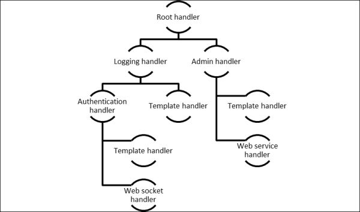
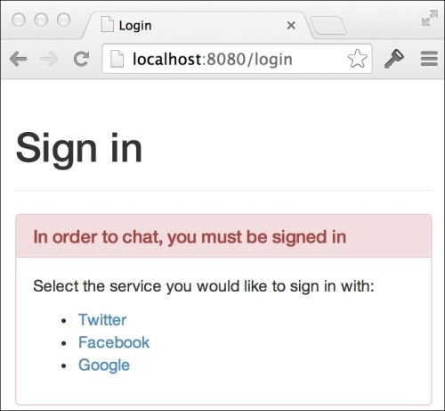
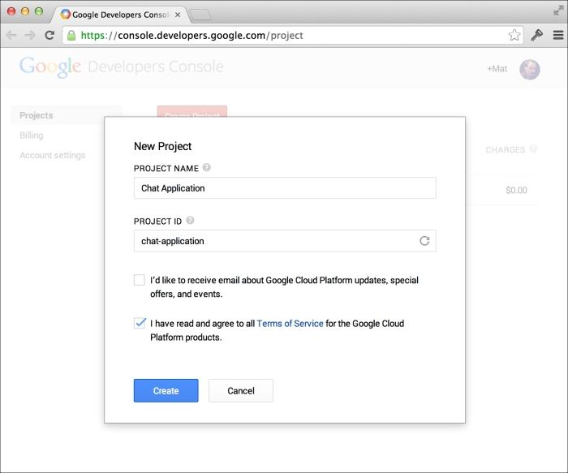
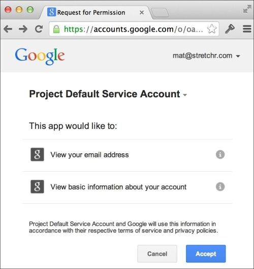

# 第二章：添加身份验证

我们在上一章构建的聊天应用程序侧重于从客户端到服务器再到客户端的消息高性能传输，但我们的用户无法知道他们在和谁交谈。解决这个问题的一个方法是构建某种注册和登录功能，让我们的用户在打开聊天页面之前创建帐户并进行身份验证。

每当我们要从头开始构建东西时，我们必须问自己在此之前其他人是如何解决这个问题的（真正原创的问题极为罕见），以及是否存在任何开放的解决方案或标准可以供我们使用。授权和身份验证并不是新问题，特别是在网络世界中，有许多不同的协议可供选择。那么我们如何决定追求最佳选择？和往常一样，我们必须从用户的角度来看待这个问题。

如今，许多网站允许您使用社交媒体或社区网站上现有的帐户进行登录。这样一来，用户就不必在尝试不同的产品和服务时一遍又一遍地输入所有帐户信息。这也对新站点的转化率产生了积极的影响。

在本章中，我们将增强我们的聊天代码库，添加身份验证，这将允许我们的用户使用 Google、Facebook 或 GitHub 进行登录，您还将看到添加其他登录门户也是多么容易。为了加入聊天，用户必须首先登录。之后，我们将使用授权数据来增强我们的用户体验，以便每个人都知道谁在房间里，以及谁说了什么。

在本章中，您将学习：

+   使用装饰器模式将`http.Handler`类型包装起来，为处理程序添加额外功能

+   使用动态路径提供 HTTP 端点

+   使用 Gomniauth 开源项目访问身份验证服务

+   使用`http`包获取和设置 cookie

+   将对象编码为 Base64，然后再转换为正常状态

+   通过网络套接字发送和接收 JSON 数据

+   向模板提供不同类型的数据

+   使用自己类型的通道进行工作

# 一路处理程序

对于我们的聊天应用程序，我们实现了自己的`http.Handler`类型，以便轻松地编译、执行和向浏览器传递 HTML 内容。由于这是一个非常简单但功能强大的接口，我们将在添加功能到我们的 HTTP 处理时继续使用它。

为了确定用户是否经过身份验证，我们将创建一个身份验证包装处理程序来执行检查，并仅在用户经过身份验证时将执行传递给内部处理程序。

我们的包装处理程序将满足与其内部对象相同的`http.Handler`接口，允许我们包装任何有效的处理程序。实际上，即将编写的身份验证处理程序如果需要的话也可以稍后封装在类似的包装器中。



应用于 HTTP 处理程序的链接模式图

前面的图显示了这种模式如何应用于更复杂的 HTTP 处理程序场景。每个对象都实现了`http.Handler`接口，这意味着对象可以传递到`http.Handle`方法中直接处理请求，或者可以传递给另一个对象，该对象添加了某种额外的功能。`Logging`处理程序可能会在调用内部处理程序的`ServeHTTP`方法之前和之后写入日志文件。由于内部处理程序只是另一个`http.Handler`，任何其他处理程序都可以包装在（或使用）`Logging`处理程序中。

对象通常包含决定执行哪个内部处理程序的逻辑。例如，我们的身份验证处理程序将要么将执行传递给包装处理程序，要么通过向浏览器发出重定向来处理请求。

现在理论已经足够了；让我们写一些代码。在`chat`文件夹中创建一个名为`auth.go`的新文件：

```go
package main
import (
  "net/http"
)
type authHandler struct {
  next http.Handler
}
func (h *authHandler) ServeHTTP(w http.ResponseWriter, r *http.Request) {
  if _, err := r.Cookie("auth"); err == http.ErrNoCookie {
    // not authenticated
    w.Header().Set("Location", "/login")
    w.WriteHeader(http.StatusTemporaryRedirect)
  } else if err != nil {
    // some other error
    panic(err.Error())
  } else {
    // success - call the next handler
    h.next.ServeHTTP(w, r)
  }
}
func MustAuth(handler http.Handler) http.Handler {
  return &authHandler{next: handler}
}
```

`authHandler`类型不仅实现了`ServeHTTP`方法（满足`http.Handler`接口），还在`next`字段中存储（包装）`http.Handler`。我们的`MustAuth`辅助函数只是创建包装任何其他`http.Handler`的`authHandler`。让我们调整以下根映射行：

```go
http.Handle("/", &templateHandler{filename: "chat.html"})
```

让我们更改第一个参数，以明确指定用于聊天的页面。接下来，让我们使用`MustAuth`函数包装`templateHandler`作为第二个参数：

```go
http.Handle("/chat", MustAuth(&templateHandler{filename: "chat.html"}))
```

使用`MustAuth`函数包装`templateHandler`将导致执行首先通过我们的`authHandler`，仅在请求经过身份验证时才到达`templateHandler`。

我们的`authHandler`中的`ServeHTTP`方法将寻找一个名为`auth`的特殊 cookie，并使用`http.ResponseWriter`上的`Header`和`WriteHeader`方法来重定向用户到登录页面，如果缺少 cookie。

构建并运行聊天应用程序，并尝试访问`http://localhost:8080/chat`：

```go

go build -o chat

./chat -host=":8080"

```

### 提示

您需要删除您的 cookie 以清除先前的 auth 令牌，或者从通过 localhost 提供的其他开发项目中留下的任何其他 cookie。

如果您查看浏览器的地址栏，您会注意到您立即被重定向到`/login`页面。由于我们目前无法处理该路径，您将收到一个**404 页面未找到**错误。

# 创建一个漂亮的社交登录页面

到目前为止，我们并没有太关注使我们的应用程序看起来漂亮，毕竟这本书是关于 Go 而不是用户界面开发。但是，构建丑陋的应用程序是没有借口的，因此我们将构建一个既漂亮又实用的社交登录页面。

Bootstrap 是用于在 Web 上开发响应式项目的前端框架。它提供了解决许多用户界面问题的 CSS 和 JavaScript 代码，以一致和美观的方式。虽然使用 Bootstrap 构建的网站往往看起来都一样（尽管 UI 可以定制的方式有很多），但它是早期应用程序的绝佳选择，或者对于没有设计师访问权限的开发人员。

### 提示

如果您使用 Bootstrap 制定的语义标准构建应用程序，那么为您的站点或应用程序制作 Bootstrap 主题将变得很容易，并且您知道它将完全适合您的代码。

我们将使用托管在 CDN 上的 Bootstrap 版本，因此我们不必担心通过我们的聊天应用程序下载和提供自己的版本。这意味着为了正确呈现我们的页面，我们需要保持活动的互联网连接，即使在开发过程中也是如此。

### 注意

如果您喜欢下载和托管自己的 Bootstrap 副本，可以这样做。将文件保存在`assets`文件夹中，并将以下调用添加到您的`main`函数中（它使用`http.Handle`通过您的应用程序提供资产）：

```go
http.Handle("/assets/", http.StripPrefix("/assets", http.FileServer(http.Dir("/path/to/assets/"))))
```

请注意，`http.StripPrefix`和`http.FileServer`函数返回满足`http.Handler`接口的对象，这是我们使用`MustAuth`辅助函数实现的装饰器模式。

在`main.go`中，让我们为登录页面添加一个端点：

```go
http.Handle("/chat", MustAuth(&templateHandler{filename: "chat.html"}))

http.Handle("/login", &templateHandler{filename: "login.html"})

http.Handle("/room", r)
```

显然，我们不希望在我们的登录页面使用`MustAuth`方法，因为它会导致无限重定向循环。

在我们的`templates`文件夹中创建一个名为`login.html`的新文件，并插入以下 HTML 代码：

```go
<html>
  <head>
    <title>Login</title>
    <link rel="stylesheet"
      href="//netdna.bootstrapcdn.com/bootstrap/3.1.1/css/bootstrap.min.css">
  </head>
  <body>
    <div class="container">
      <div class="page-header">
        <h1>Sign in</h1>
      </div>
      <div class="panel panel-danger">
        <div class="panel-heading">
          <h3 class="panel-title">In order to chat, you must be signed in</h3>
        </div>
        <div class="panel-body">
          <p>Select the service you would like to sign in with:</p>
          <ul>
            <li>
              <a href="/auth/login/facebook">Facebook</a>
            </li>
            <li>
              <a href="/auth/login/github">GitHub</a>
            </li>
            <li>
              <a href="/auth/login/google">Google</a>
            </li>
          </ul>
        </div>
      </div>
    </div>
  </body>
</html>
```

重新启动 Web 服务器并导航到`http://localhost:8080/login`。您会注意到它现在显示我们的登录页面：



# 具有动态路径的端点

Go 标准库中的`http`包的模式匹配并不是最全面和功能齐全的实现。例如，Ruby on Rails 更容易在路径内部具有动态段。

```go
"auth/:action/:provider_name"
```

然后，这将提供一个数据映射（或字典），其中包含框架自动从匹配的路径中提取的值。因此，如果您访问`auth/login/google`，那么`params[:provider_name]`将等于`google`，而`params[:action]`将等于`login`。

默认情况下，`http`包让我们指定的最多是路径前缀，我们可以通过在模式的末尾留下一个斜杠来实现：

```go
"auth/"
```

然后我们必须手动解析剩余的段，以提取适当的数据。这对于相对简单的情况是可以接受的，因为目前我们只需要处理一些不同的路径，比如：

+   `/auth/login/google`

+   `/auth/login/facebook`

+   `/auth/callback/google`

+   `/auth/callback/facebook`

### 提示

如果您需要处理更复杂的路由情况，您可能希望考虑使用专用包，如 Goweb、Pat、Routes 或 mux。对于像我们这样极其简单的情况，内置的功能就足够了。

我们将创建一个新的处理程序来支持我们的登录流程。在`auth.go`中，添加以下`loginHandler`代码：

```go
// loginHandler handles the third-party login process.
// format: /auth/{action}/{provider}
func loginHandler(w http.ResponseWriter, r *http.Request) {
  segs := strings.Split(r.URL.Path, "/")
  action := segs[2]
  provider := segs[3]
  switch action {
  case "login":
    log.Println("TODO handle login for", provider)
  default:
     w.WriteHeader(http.StatusNotFound)
     fmt.Fprintf(w, "Auth action %s not supported", action)
  }
}
```

在上述代码中，我们使用`strings.Split`将路径分成段，然后提取`action`和`provider`的值。如果已知`action`的值，我们将运行特定的代码；否则，我们将写出错误消息并返回`http.StatusNotFound`状态码（在 HTTP 状态码的语言中，是`404`代码）。

### 注意

我们现在不会让我们的代码完全健壮，但值得注意的是，如果有人使用太少的段访问`loginHandler`，我们的代码将会 panic，因为它期望`segs[2]`和`segs[3]`存在。

额外加分，看看您是否可以防止这种情况，并在有人访问`/auth/nonsense`时返回一个友好的错误消息，而不是一个 panic。

我们的`loginHandler`只是一个函数，而不是实现`http.Handler`接口的对象。这是因为，与其他处理程序不同，我们不需要它来存储任何状态。Go 标准库支持这一点，因此我们可以使用`http.HandleFunc`函数将其映射到与我们之前使用`http.Handle`类似的方式。在`main.go`中更新处理程序：

```go
http.Handle("/chat", MustAuth(&templateHandler{filename: "chat.html"}))
http.Handle("/login", &templateHandler{filename: "login.html"})

http.HandleFunc("/auth/", loginHandler)

http.Handle("/room", r)
```

重新构建并运行聊天应用程序：

```go

go build –o chat

./chat –host=":8080"

```

访问以下 URL 并注意终端中记录的输出：

+   `http://localhost:8080/auth/login/google`输出`TODO handle login for google`

+   `http://localhost:8080/auth/login/facebook`输出`TODO handle login for facebook`

我们已经成功实现了一个动态路径匹配机制，目前只是打印出待办事项消息；接下来，我们需要编写与认证服务集成的代码。

# 读累了记得休息一会哦~

**公众号：古德猫宁李**

+   电子书搜索下载

+   书单分享

+   书友学习交流

**网站：**[沉金书屋 https://www.chenjin5.com](https://www.chenjin5.com)

+   电子书搜索下载

+   电子书打包资源分享

+   学习资源分享

# OAuth2

OAuth2 是一种开放的认证和授权标准，旨在允许资源所有者通过访问令牌交换握手向客户端提供委托访问私人数据（如墙上的帖子或推文）。即使您不希望访问私人数据，OAuth2 也是一个很好的选择，它允许人们使用其现有凭据登录，而不会将这些凭据暴露给第三方网站。在这种情况下，我们是第三方，我们希望允许我们的用户使用支持 OAuth2 的服务进行登录。

从用户的角度来看，OAuth2 流程是：

1.  用户选择希望使用的提供者登录到客户端应用程序。

1.  用户被重定向到提供者的网站（其中包括客户端应用程序 ID 的 URL），并被要求授予客户端应用程序权限。

1.  用户从 OAuth2 服务提供商登录，并接受第三方应用程序请求的权限。

1.  用户被重定向回客户端应用程序，并附带一个请求代码。

1.  在后台，客户端应用程序将授予代码发送给提供者，提供者将返回一个授权令牌。

1.  客户端应用程序使用访问令牌向提供者发出授权请求，例如获取用户信息或墙上的帖子。

为了避免重复造轮子，我们将看一些已经为我们解决了这个问题的开源项目。

## 开源 OAuth2 包

Andrew Gerrand 自 2010 年 2 月以来一直在核心 Go 团队工作，即在 Go 1.0 正式发布两年前。他的`goauth2`包（请参阅[`code.google.com/p/goauth2/`](https://code.google.com/p/goauth2/)）是 OAuth2 协议的优雅实现，完全使用 Go 编写。

Andrew 的项目启发了 Gomniauth（请参阅[`github.com/stretchr/gomniauth`](https://github.com/stretchr/gomniauth)）。作为 Ruby 的`omniauth`项目的开源 Go 替代品，Gomniauth 提供了一个统一的解决方案来访问不同的 OAuth2 服务。在未来，当 OAuth3（或者下一代认证协议）推出时，理论上，Gomniauth 可以承担实现细节的痛苦，使用户代码不受影响。

对于我们的应用程序，我们将使用 Gomniauth 来访问 Google、Facebook 和 GitHub 提供的 OAuth 服务，因此请确保您已通过运行以下命令进行安装：

```go

go get github.com/stretchr/gomniauth

```

### 提示

Gomniauth 的一些项目依赖项存储在 Bazaar 存储库中，因此您需要前往[`wiki.bazaar.canonical.com`](http://wiki.bazaar.canonical.com)下载它们。

# 告诉身份验证提供程序有关您的应用

在我们要求身份验证提供程序帮助我们的用户登录之前，我们必须告诉他们有关我们的应用程序。大多数提供程序都有一种网络工具或控制台，您可以在其中创建应用程序以启动该过程。以下是 Google 的一个示例：



为了识别客户端应用程序，我们需要创建客户端 ID 和密钥。尽管 OAuth2 是一个开放标准，但每个提供程序都有自己的语言和机制来设置事物，因此您很可能需要在每种情况下通过用户界面或文档进行尝试来弄清楚。

在撰写本文时，在**Google 开发者控制台**中，您可以导航到**API 和身份验证** | **凭据**，然后单击**创建新的客户端 ID**按钮。

在大多数情况下，为了增加安全性，您必须明确指定请求将来自哪些主机 URL。目前，因为我们将在`localhost:8080`上本地托管我们的应用程序，所以您应该使用该 URL。您还将被要求提供一个重定向 URI，该 URI 是我们聊天应用程序中的端点，并且用户在成功登录后将被重定向到该端点。回调将是我们`loginHandler`上的另一个操作，因此 Google 客户端的重定向 URL 将是`http://localhost:8080/auth/callback/google`。

完成要支持的提供程序的身份验证过程后，您将为每个提供程序获得客户端 ID 和密钥。记下这些信息，因为在设置我们的聊天应用程序中的提供程序时，我们将需要它们。

### 注意

如果我们将我们的应用程序托管在真实域上，我们必须创建新的客户端 ID 和密钥，或者更新我们的身份验证提供程序的适当 URL 字段，以确保它们指向正确的位置。无论哪种方式，为了安全起见，为开发和生产的密钥设置不同的密钥并不是坏习惯。

# 实现外部登录

为了使用我们在身份验证提供程序网站上创建的项目、客户端或帐户，我们必须告诉 Gomniauth 我们想要使用哪些提供程序，以及我们将如何与它们交互。我们通过在主要的 Gomniauth 包上调用`WithProviders`函数来实现这一点。将以下代码片段添加到`main.go`（就在`main`函数顶部的`flag.Parse()`行下面）：

```go
// set up gomniauth
gomniauth.SetSecurityKey("some long key")
gomniauth.WithProviders(
  facebook.New("key", "secret",
    "http://localhost:8080/auth/callback/facebook"),
  github.New("key", "secret",
    "http://localhost:8080/auth/callback/github"),
  google.New("key", "secret",
    "http://localhost:8080/auth/callback/google"),
)
```

您应该用您之前记录的实际值替换`key`和`secret`占位符。第三个参数表示回调 URL，应与您在提供者网站上创建客户端时提供的 URL 匹配。注意第二个路径段是`callback`；虽然我们还没有实现这个，但这是我们处理认证过程的响应的地方。

像往常一样，您需要确保导入了所有适当的包：

```go
import (
  "github.com/stretchr/gomniauth/providers/facebook"
  "github.com/stretchr/gomniauth/providers/github"
  "github.com/stretchr/gomniauth/providers/google"
)
```

### 注意

Gomniauth 需要`SetSecurityKey`调用，因为它在客户端和服务器之间发送状态数据以及签名校验和，以确保状态值在传输过程中没有被篡改。安全密钥在创建哈希时使用，以一种几乎不可能在不知道确切安全密钥的情况下重新创建相同的哈希。您应该用您选择的安全哈希或短语替换`some long key`。

## 登录

现在我们已经配置了 Gomniauth，当用户登陆到我们的`/auth/login/{provider}`路径时，我们需要将用户重定向到提供者的认证页面。我们只需要更新我们在`auth.go`中的`loginHandler`函数：

```go
func loginHandler(w http.ResponseWriter, r *http.Request) {
  segs := strings.Split(r.URL.Path, "/")
  action := segs[2]
  provider := segs[3]
  switch action {
  case "login":
    provider, err := gomniauth.Provider(provider)
    if err != nil {
      log.Fatalln("Error when trying to get provider", provider, "-", err)
    }
    loginUrl, err := provider.GetBeginAuthURL(nil, nil)
    if err != nil {
      log.Fatalln("Error when trying to GetBeginAuthURL for", provider, "-", err)
    }
    w.Header.Set("Location",loginUrl)
    w.WriteHeader(http.StatusTemporaryRedirect)
  default:
    w.WriteHeader(http.StatusNotFound)
    fmt.Fprintf(w, "Auth action %s not supported", action)
  }
}
```

我们在这里做了两件主要的事情。首先，我们使用`gomniauth.Provider`函数来获取与 URL 中指定的对象（如`google`或`github`）匹配的提供者对象。然后我们使用`GetBeginAuthURL`方法获取我们必须发送用户的位置，以开始认证过程。

### 注意

`GetBeginAuthURL(nil, nil)`参数是用于状态和选项的，对于我们的聊天应用程序，我们不打算使用它们。

第一个参数是编码、签名并发送到认证提供者的数据状态映射。提供者不会对状态进行任何操作，只是将其发送回我们的回调端点。例如，如果我们想要将用户重定向回他们在认证过程中尝试访问的原始页面，这是很有用的。对于我们的目的，我们只有`/chat`端点，所以我们不需要担心发送任何状态。

第二个参数是一个附加选项的映射，将被发送到认证提供者，以某种方式修改认证过程的行为。例如，您可以指定自己的`scope`参数，这允许您请求许可以访问提供者的其他信息。有关可用选项的更多信息，请在互联网上搜索 OAuth2 或阅读每个提供者的文档，因为这些值因服务而异。

如果我们的代码从`GetBeginAuthURL`调用中没有错误，我们只需将用户的浏览器重定向到返回的 URL。

重新构建并运行聊天应用程序：

```go

go build -o chat

./chat -host=":8080"

```

通过访问`http://localhost:8080/chat`来打开主要的聊天页面。由于我们还没有登录，我们被重定向到我们的登录页面。点击 Google 选项，使用您的 Google 账户登录，您会注意到您被呈现出一个特定于 Google 的登录页面（如果您还没有登录到 Google）。一旦您登录，您将被呈现一个页面，要求您在查看有关您的账户的基本信息之前，先允许我们的聊天应用程序：



这是我们的聊天应用程序用户在登录时会经历的相同流程。

点击**接受**，您会注意到您被重定向回我们的应用程序代码，但是出现了`Auth action callback not supported`错误。这是因为我们还没有在`loginHandler`中实现回调功能。

## 处理来自提供者的响应

一旦用户在提供者的网站上点击**接受**（或者点击相当于**取消**的选项），他们将被重定向回我们应用程序的回调端点。

快速浏览返回的完整 URL，我们可以看到提供者给我们的授权代码。

```go
http://localhost:8080/auth/callback/google?
code=4/Q92xJ-BQfoX6PHhzkjhgtyfLc0Ylm.QqV4u9AbA9sYguyfbjFEsNoJKMOjQI

```

我们不必担心该代码该怎么处理，因为 Gomniauth 将为我们处理 OAuth URL 参数（通过将授权代码发送到 Google 服务器并根据 OAuth 规范将其交换为访问令牌），因此我们可以直接跳转到实现我们的回调处理程序。然而，值得知道的是，这段代码将被身份验证提供程序交换为一个允许我们访问私人用户数据的令牌。为了增加安全性，这个额外的步骤是在后台从服务器到服务器进行的，而不是在浏览器中进行的。

在`auth.go`中，我们准备向我们的动作路径段添加另一个 switch case。在默认情况之前插入以下代码：

```go
case "callback":

  provider, err := gomniauth.Provider(provider)
  if err != nil {
    log.Fatalln("Error when trying to get provider", provider, "-", err)
  }

creds, err := provider.CompleteAuth(objx.MustFromURLQuery(r.URL.RawQuery))

  if err != nil {
    log.Fatalln("Error when trying to complete auth for", provider, "-", err)
  }

user, err := provider.GetUser(creds)

  if err != nil {
    log.Fatalln("Error when trying to get user from", provider, "-", err)
  }

authCookieValue := objx.New(map[string]interface{}{

 "name": user.Name(),

 }).MustBase64()

 http.SetCookie(w, &http.Cookie{

 Name:  "auth",

 Value: authCookieValue,

 Path:  "/"})

  w.Header()["Location"] = []string{"/chat"}
  w.WriteHeader(http.StatusTemporaryRedirect)
```

当身份验证提供程序在用户授予权限后将用户重定向回来时，URL 指定它是一个回调动作。我们像之前一样查找身份验证提供程序，并调用它的`CompleteAuth`方法。我们将`http.Request`（用户浏览器现在正在进行的`GET`请求）中的`RawQuery`解析为`objx.Map`（Gomniauth 使用的多用途映射类型），`CompleteAuth`方法使用 URL 查询参数值来完成与提供程序的身份验证握手。一切顺利的话，我们将获得一些授权凭据，用于访问用户的基本数据。然后我们使用提供程序的`GetUser`方法，Gomniauth 使用指定的凭据访问用户的一些基本信息。

一旦我们有了用户数据，我们将`Name`字段在 JSON 对象中进行 Base64 编码，并将其存储为我们的`auth` cookie 的值，以便以后使用。

### 提示

数据的 Base64 编码确保它不会包含任何特殊或不可预测的字符，就像在 URL 中传递数据或将其存储在 cookie 中一样。请记住，尽管 Base64 编码的数据看起来像是加密的，但实际上并不是——您可以很容易地将 Base64 编码的数据解码回原始文本，而不费吹灰之力。有在线工具可以为您完成这项工作。

设置完 cookie 后，我们将用户重定向到聊天页面，可以安全地假设这是最初的目的地。

再次构建和运行代码，然后访问`/chat`页面，您会注意到注册流程起作用了，我们最终被允许返回到聊天页面。大多数浏览器都有检查器或控制台——一种允许您查看服务器发送给您的 cookie 的工具——您可以使用它来查看`auth` cookie 是否已出现：

```go

go build –o chat

./chat –host=":8080"

```

在我们的情况下，cookie 值是`eyJuYW1lIjoiTWF0IFJ5ZXIifQ==`，这是`{"name":"Mat Ryer"}`的 Base64 编码版本。请记住，我们在聊天应用中从未输入过名字；相反，当我们选择使用 Google 登录时，Gomniauth 会向 Google 请求一个名字。像这样存储非签名的 cookie 对于像用户姓名这样的偶发信息是可以的，但是，您应该避免使用非签名的 cookie 存储任何敏感信息，因为人们可以轻松访问和更改数据。

## 呈现用户数据

将用户数据放在 cookie 中是一个很好的开始，但非技术人员甚至不会知道它的存在，所以我们必须将数据提到前台。我们将通过增强我们的`templateHandler`方法来实现这一点，该方法首先将用户数据传递到模板的`Execute`方法中；这使我们能够在 HTML 中使用模板注释来向用户显示用户数据。

更新`main.go`中我们的`templateHandler`的`ServeHTTP`方法：

```go
func (t *templateHandler) ServeHTTP(w http.ResponseWriter, r *http.Request) {
  t.once.Do(func() {
    t.templ = template.Must(template.ParseFiles(filepath.Join("templates", t.filename)))
  })

data := map[string]interface{}{

 "Host": r.Host,

 }

 if authCookie, err := r.Cookie("auth"); err == nil {

 data["UserData"] = objx.MustFromBase64(authCookie.Value)

 }

  t.templ.Execute(w, data)
}
```

我们不仅仅将整个`http.Request`对象作为数据传递给我们的模板，而是为一个数据对象创建一个新的`map[string]interface{}`定义，该对象可能有两个字段：`Host`和`UserData`（后者只有在存在`auth` cookie 时才会出现）。通过指定映射类型后跟花括号，我们能够在同一时间添加`Host`条目和创建我们的映射。然后我们将这个新的`data`对象作为第二个参数传递给我们模板的`Execute`方法。

现在我们在模板源中添加一个 HTML 文件来显示名称。更新`chat.html`中的`chatbox`表单：

```go
<form id="chatbox">

{{.UserData.name}}:<br/>

  <textarea></textarea>
  <input type="submit" value="Send" />
</form>
```

`{{.UserData.name}}`注释告诉模板引擎在`textarea`控件之前插入我们用户的名称。

### 提示

由于我们正在使用`objx`包，请不要忘记运行`go get` [`github.com/stretchr/objx`](http://github.com/stretchr/objx)，并导入它。

重新构建并再次运行聊天应用程序，您会注意到在聊天框之前添加了您的名称。

```go

go build -o chat

./chat –host=":8080"

```

## 增加消息的附加数据

到目前为止，我们的聊天应用程序只传输消息作为字节片或`[]byte`类型在客户端和服务器之间；因此，我们的房间的`forward`通道具有`chan []byte`类型。为了发送数据（例如发送者和发送时间）以及消息本身，我们增强了我们的`forward`通道以及我们在两端与 web 套接字交互的方式。

通过在`chat`文件夹中创建一个名为`message.go`的新文件，定义一个将`[]byte`切片替换的新类型：

```go
package main
import (
  "time"
)
// message represents a single message
type message struct {
  Name    string
  Message string
  When    time.Time
}
```

`message`类型将封装消息字符串本身，但我们还添加了分别保存用户名称和消息发送时间戳的`Name`和`When`字段。

由于`client`类型负责与浏览器通信，它需要传输和接收的不仅仅是单个消息字符串。由于我们正在与 JavaScript 应用程序（即在浏览器中运行的聊天客户端）进行交流，并且 Go 标准库具有出色的 JSON 实现，因此这似乎是在消息中编码附加信息的完美选择。我们将更改`client.go`中的`read`和`write`方法，以使用套接字上的`ReadJSON`和`WriteJSON`方法，并对我们的新`message`类型进行编码和解码：

```go
func (c *client) read() {
  for {

var msg *message

 if err := c.socket.ReadJSON(&msg); err == nil {

 msg.When = time.Now()

 msg.Name = c.userData["name"].(string)

 c.room.forward <- msg

    } else {
      break
    }
  }
  c.socket.Close()
}
func (c *client) write() {
  for msg := range c.send {
    if err := 
c.socket.WriteJSON(msg)

; err != nil {
      break
    }
  }
  c.socket.Close()
}
```

当我们从浏览器接收到消息时，我们只期望填充`Message`字段，这就是为什么我们在前面的代码中设置了`When`和`Name`字段。

当您尝试构建前面的代码时，您会注意到它会抱怨一些问题。主要原因是我们试图通过`forward`和`send chan []byte`通道发送`*message`对象。在`room.go`中，将`forward`字段更改为`chan *message`类型，并在`client.go`中对`send chan`类型执行相同操作。

我们必须更新初始化通道的代码，因为类型现在已经改变。或者，您可以等待编译器提出这些问题，并在进行修复时解决它们。在`room.go`中，您需要进行以下更改：

+   将`forward: make(chan []byte)`更改为`forward: make(chan *message)`

+   将`r.tracer.Trace("Message received: ", string(msg))`更改为`r.tracer.Trace("Message received: ", msg.Message)`

+   将`send: make(chan []byte, messageBufferSize)`更改为`send: make(chan *message, messageBufferSize)`

编译器还会抱怨客户端缺少用户数据，这是一个公平的观点，因为`client`类型对我们已添加到 cookie 中的新用户数据一无所知。更新`client`结构以包括一个名为`userData`的新`map[string]interface{}`：

```go
// client represents a single chatting user.
type client struct {
  // socket is the web socket for this client.
  socket *websocket.Conn
  // send is a channel on which messages are sent.
  send chan *message
  // room is the room this client is chatting in.
  room *room
  // userData holds information about the user
  userData map[string]interface{}
}
```

用户数据来自客户端 cookie，我们通过`http.Request`对象的`Cookie`方法访问它。在`room.go`中，使用以下更改更新`ServeHTTP`：

```go
func (r *room) ServeHTTP(w http.ResponseWriter, req *http.Request) {
  socket, err := upgrader.Upgrade(w, req, nil)
  if err != nil {
    log.Fatal("ServeHTTP:", err)
    return
  }

authCookie, err := req.Cookie("auth")

 if err != nil {

 log.Fatal("Failed to get auth cookie:", err)

 return

 }

 client := &client{

 socket:   socket,

 send:     make(chan *message, messageBufferSize),

 room:     r,

 userData: objx.MustFromBase64(authCookie.Value),

 }

  r.join <- client
  defer func() { r.leave <- client }()
  go client.write()
  client.read()
}
```

我们使用`http.Request`类型上的`Cookie`方法来获取用户数据，然后将其传递给客户端。我们使用`objx.MustFromBase64`方法将编码的 cookie 值转换回可用的 map 对象。

现在我们已经将从套接字发送和接收的类型从`[]byte`更改为`*message`，我们必须告诉我们的 JavaScript 客户端，我们正在发送 JSON 而不仅仅是普通字符串。还必须要求在用户提交消息时，它将 JSON 发送回服务器。在`chat.html`中，首先更新`socket.send`调用：

```go
socket.send(JSON.stringify({"Message": msgBox.val()}));
```

我们使用`JSON.stringify`将指定的 JSON 对象（仅包含`Message`字段）序列化为字符串，然后发送到服务器。我们的 Go 代码将把 JSON 字符串解码（或取消编组）为`message`对象，将客户端 JSON 对象的字段名称与我们的`message`类型的字段名称匹配。

最后，更新`socket.onmessage`回调函数以期望 JSON，并在页面上添加发送者的名称：

```go
socket.onmessage = function(e) {
  var msg = eval("("+e.data+")");
  messages.append(
    $("<li>").append(
      $("<strong>").text(msg.Name + ": "),
      $("<span>").text(msg.Message)
    )
  );
}
```

在前面的代码片段中，我们使用了 JavaScript 的`eval`函数将 JSON 字符串转换为 JavaScript 对象，然后访问字段以构建显示它们所需的元素。

构建并运行应用程序，如果可以的话，在两个不同的浏览器中使用两个不同的帐户登录（或者邀请朋友帮助测试）：

```go

go build -o chat

./chat -host=":8080"

```

以下截图显示了聊天应用程序的浏览器聊天界面：


# 摘要

在本章中，我们通过要求用户使用 OAuth2 服务提供商进行身份验证，然后允许他们加入对话，为我们的聊天应用程序添加了一个有用且必要的功能。我们利用了几个开源包，如`Objx`和`Gomniauth`，大大减少了我们需要处理的多服务器复杂性。

当我们包装`http.Handler`类型时，我们实现了一种模式，以便轻松指定哪些路径需要用户进行身份验证，哪些即使没有`auth` cookie 也是可用的。我们的`MustAuth`辅助函数使我们能够以流畅简单的方式生成包装类型，而不会给我们的代码添加混乱和困惑。

我们看到如何使用 Cookie 和 Base64 编码来安全（虽然不安全）地在用户的浏览器中存储特定用户的状态，并利用该数据通过普通连接和网络套接字。我们更多地控制了模板中可用的数据，以便向 UI 提供用户的名称，并看到如何在特定条件下仅提供某些数据。

由于我们需要通过网络套接字发送和接收附加信息，我们学会了如何轻松地将本机类型的通道更改为适用于我们自己的类型（如我们的`message`类型）的通道。我们还学会了如何通过套接字传输 JSON 对象，而不仅仅是字节片。由于 Go 的类型安全性，以及能够为通道指定类型，编译器有助于确保我们不会通过`chan *message`发送除`message`对象以外的任何东西。尝试这样做将导致编译器错误，立即提醒我们这一事实。

在我们之前构建的应用程序中，看到聊天的人的名字是一个巨大的可用性进步，但它非常正式，可能不会吸引现代 Web 用户，他们习惯于更加视觉化的体验。我们缺少聊天的人的图片，在下一章中，我们将探讨不同的方式，让用户更好地在我们的应用程序中代表自己。

作为额外的任务，看看是否可以利用我们放入`message`类型中的`time.Time`字段，告诉用户消息何时发送。
