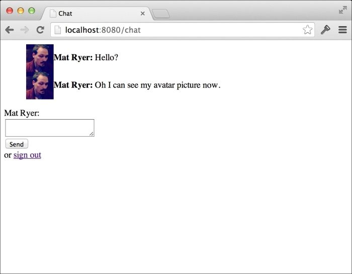
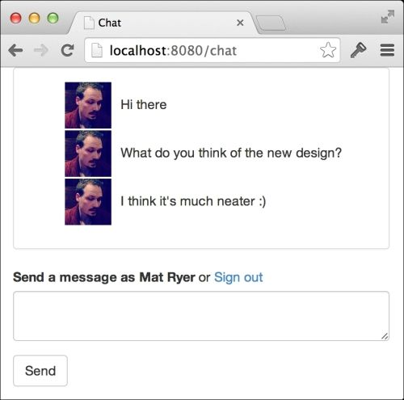
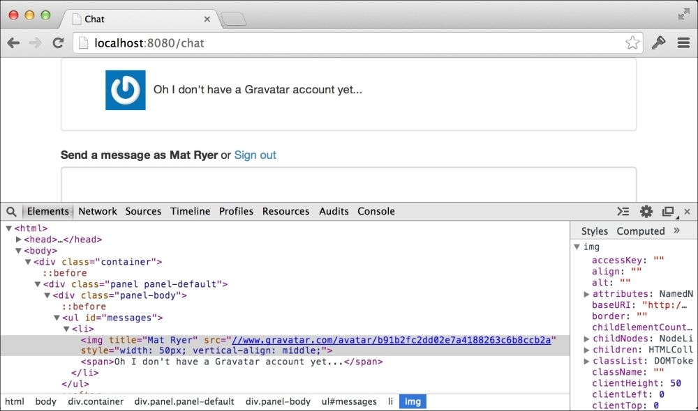

# 第三章：实现个人资料图片的三种方法

到目前为止，我们的聊天应用程序已经使用了 OAuth2 协议，允许用户登录到我们的应用程序，以便我们知道谁在说什么。在本章中，我们将添加个人资料图片，使聊天体验更加引人入胜。

我们将研究以下几种方法来在我们的应用程序中的消息旁边添加图片或头像：

+   使用认证服务器提供的头像图片

+   使用[Gravatar.com](http://Gravatar.com)网络服务通过用户的电子邮件地址查找图片

+   允许用户上传自己的图片并自行托管

前两个选项允许我们将图片的托管委托给第三方——要么是认证服务，要么是[Gravatar.com](http://Gravatar.com)——这很棒，因为它减少了我们应用程序的托管成本（存储成本和带宽成本，因为用户的浏览器实际上会从认证服务的服务器上下载图片，而不是我们自己的服务器）。第三个选项要求我们在可以通过 web 访问的位置托管图片。

这些选项并不是互斥的；在真实的生产应用程序中，您很可能会使用它们的某种组合。在本章结束时，我们将看到灵活的设计使我们能够依次尝试每种实现，直到找到合适的头像。

在本章中，我们将灵活设计，尽量做到每个里程碑所需的最低工作量。这意味着在每个部分结束时，我们将拥有在浏览器中可演示的工作实现。这也意味着我们将根据需要重构代码，并讨论我们做出的决定背后的原因。

具体来说，在本章中，您将学到以下内容：

+   即使没有标准，也有哪些获取认证服务的额外信息的良好实践

+   何时适合将抽象构建到我们的代码中

+   Go 的零初始化模式如何节省时间和内存

+   如何重用接口使我们能够以与现有接口相同的方式处理集合和单个对象

+   如何使用[Gravatar.com](http://Gravatar.com)网络服务

+   如何在 Go 中进行 MD5 哈希

+   如何通过 HTTP 上传文件并将其存储在服务器上

+   如何通过 Go web 服务器提供静态文件

+   如何使用单元测试指导代码重构

+   何时以及如何将`struct`类型的功能抽象为接口

# 认证服务器的头像

事实证明，大多数认证服务器已经为其用户准备了图片，并通过我们已经知道如何访问的受保护用户资源使其可用。要使用这个头像图片，我们需要从提供者那里获取 URL，将其存储在我们用户的 cookie 中，并通过 web 套接字发送，以便每个客户端可以在相应的消息旁边呈现图片。

## 获取头像 URL

用户或个人资料资源的架构不是 OAuth2 规范的一部分，这意味着每个提供者都负责决定如何表示这些数据。事实上，提供者的做法各不相同，例如，GitHub 用户资源中的头像 URL 存储在名为`avatar_url`的字段中，而在 Google 中，相同的字段称为`picture`。Facebook 甚至通过在名为`picture`的对象内嵌套头像 URL 值的`url`字段来进一步进行。幸运的是，Gomniauth 为我们抽象了这一点；它在提供者上的`GetUser`调用标准化了获取常见字段的接口。

为了使用头像 URL 字段，我们需要回去并将其信息存储在我们的 cookie 中。在`auth.go`中，查看`callback`操作开关情况，并更新创建`authCookieValue`对象的代码如下：

```go
authCookieValue := objx.New(map[string]interface{}{
  "name":       user.Name(),

 "avatar_url": user.AvatarURL(),

}).MustBase64()
```

在前面的代码中调用的`AvatarURL`方法将返回适当的 URL 值，然后我们将其存储在`avatar_url`字段中，该字段将存储在 cookie 中。

### 提示

Gomniauth 定义了一个接口类型的`User`，每个提供者都实现了自己的版本。从认证服务器返回的通用`map[string]interface{}`数据存储在每个对象内，方法调用使用适当的字段名访问相应的值。这种方法描述了访问信息的方式，而不严格关注实现细节，是 Go 中接口的一个很好的用法。

## 传输头像 URL

我们需要更新我们的`message`类型，以便它也可以携带头像 URL。在`message.go`中，添加`AvatarURL`字符串字段：

```go
type message struct {
  Name      string
  Message   string
  When      time.Time

AvatarURL string

}
```

到目前为止，我们实际上还没有为`AvatarURL`分配一个值，就像我们为`Name`字段所做的那样，因此我们必须更新`client.go`中的`read`方法：

```go
func (c *client) read() {
  for {
    var msg *message
    if err := c.socket.ReadJSON(&msg); err == nil {
      msg.When = time.Now()
      msg.Name = c.userData["name"].(string)

if avatarUrl, ok := c.userData["avatar_url"]; ok {

msg.AvatarURL = avatarUrl.(string)

}

      c.room.forward <- msg
    } else {
      break
    }
  }
  c.socket.Close()
}
```

我们在这里所做的一切就是从`userData`字段中取出代表我们放入 cookie 的值，并将其分配给`message`中的适当字段，如果该值在映射中存在的话。我们现在将进一步检查该值是否存在，因为我们不能保证认证服务将为此字段提供一个值。并且由于它可能是`nil`，如果它实际上缺失，将其分配给`string`类型可能会导致恐慌。

## 将头像添加到用户界面

现在，我们的 JavaScript 客户端通过套接字获取了一个头像 URL 值，我们可以使用它来在消息旁边显示图像。我们通过更新`chat.html`中的`socket.onmessage`代码来实现这一点：

```go
socket.onmessage = function(e) {
  var msg = eval("("+e.data+")");
  messages.append(
    $("<li>").append(

$("").css({

width:50,

verticalAlign:"middle"

}).attr("src", msg.AvatarURL),

      $("<strong>").text(msg.Name + ": "),
      $("<span>").text(msg.Message)
    )
  );
}
```

当我们收到一条消息时，我们将插入一个`img`标签，其中源设置为消息的`AvatarURL`字段。我们将使用 jQuery 的`css`方法强制宽度为`50`像素。这可以防止大图片破坏我们的界面，并允许我们将图像对齐到周围文本的中间。

如果我们使用先前版本登录后构建和运行我们的应用程序，你会发现不包含头像 URL 的`auth` cookie 仍然存在。我们不会被要求重新登录（因为我们已经登录了），添加`avatar_url`字段的代码也永远不会运行。我们可以删除 cookie 并刷新页面，但是在开发过程中每次进行更改时都需要这样做。让我们通过添加注销功能来正确解决这个问题。

## 注销

注销用户的最简单方法是删除`auth` cookie 并将用户重定向到聊天页面，这将导致重定向到登录页面，因为我们刚刚删除了 cookie。我们通过在`main.go`中添加一个新的`HandleFunc`调用来实现这一点：

```go
http.HandleFunc("/logout", func(w http.ResponseWriter, r *http.Request) {
  http.SetCookie(w, &http.Cookie{
    Name:   "auth",
    Value:  "",
    Path:   "/",
    MaxAge: -1,
  })
  w.Header()["Location"] = []string{"/chat"}
  w.WriteHeader(http.StatusTemporaryRedirect)
})
```

前面的处理函数使用`http.SetCookie`来更新`MaxAge`设置为`-1`的 cookie 设置，这表示它应该立即被浏览器删除。并非所有浏览器都被强制删除 cookie，这就是为什么我们还提供了一个新的`Value`设置为空字符串的设置，从而删除以前存储的用户数据。

### 提示

作为额外的任务，你可以通过更新`auth.go`中`authHandler`的`ServeHTTP`的第一行来使其适应空值情况以及缺少 cookie 的情况，从而使你的应用程序更加健壮：

```go
if cookie, err := r.Cookie("auth"); err == http.ErrNoCookie || cookie.Value == ""
```

不要忽略`r.Cookie`的返回，我们保留返回的 cookie 的引用（如果实际上有的话），并添加额外的检查，看看 cookie 的`Value`字符串是否为空。

在继续之前，让我们添加一个“登出”链接，以便更轻松地删除 cookie，并允许我们的用户注销。在`chat.html`中，更新`chatbox`表单，插入一个简单的 HTML 链接到新的`/logout`处理程序：

```go
<form id="chatbox">
  {{.UserData.name}}:<br/>
  <textarea></textarea>
  <input type="submit" value="Send" />

or <a href="/logout">sign out</a>

</form>
```

现在构建并运行应用程序，并在浏览器中打开`localhost:8080/chat`：

```go

go build –o chat

./chat –host=:8080

```

如果需要，注销并重新登录。当您点击**发送**时，您将看到您的头像图片出现在您的消息旁边。



## 使事情更美观

我们的应用程序开始看起来有点丑陋，是时候做点什么了。在上一章中，我们将 Bootstrap 库引入了我们的登录页面，现在我们将扩展其用途到我们的聊天页面。我们将在`chat.html`中进行三处更改：包括 Bootstrap 并调整页面的 CSS 样式，更改我们表单的标记，并调整我们在页面上呈现消息的方式。

首先，让我们更新页面顶部的`style`标签，并在其上插入一个`link`标签以包含 Bootstrap：

```go
<link rel="stylesheet" href="//netdna.bootstrapcdn.com/bootstrap/3.1.1/css/bootstrap.min.css">
<style>
  ul#messages        { list-style: none; }
  ul#messages li     { margin-bottom: 2px; }
  ul#messages li img { margin-right: 10px; }
</style>
```

接下来，让我们用以下代码替换`body`标签顶部的标记（在`script`标签之前）：

```go
<div class="container">
  <div class="panel panel-default">
    <div class="panel-body">
      <ul id="messages"></ul>
    </div>
  </div>
  <form id="chatbox" role="form">
    <div class="form-group">
      <label for="message">Send a message as {{.UserData.name}}</label> or <a href="/logout">Sign out</a>
      <textarea id="message" class="form-control"></textarea>
    </div>
    <input type="submit" value="Send" class="btn btn-default" />
  </form>
</div>
```

这个标记遵循 Bootstrap 标准，将适当的类应用于各种项目，例如，`form-control`类可以整洁地格式化`form`中的元素（您可以查看 Bootstrap 文档，了解这些类的更多信息）。

最后，让我们更新我们的`socket.onmessage` JavaScript 代码，将发送者的名称作为我们图像的`title`属性。这样，当您将鼠标悬停在图像上时，我们的应用程序将显示图像，而不是在每条消息旁边显示它：

```go
socket.onmessage = function(e) {
  var msg = eval("("+e.data+")");
  messages.append(
    $("<li>").append(
      $("").
attr("title", msg.Name)

.css({
        width:50,
        verticalAlign:"middle"
      }).attr("src", msg.AvatarURL),
      $("<span>").text(msg.Message)
    )
  );
}
```

构建并运行应用程序，刷新浏览器，看看是否出现新的设计：

```go

go build –o chat

./chat –host=:8080

```

上述命令显示以下输出：



通过对代码进行相对较少的更改，我们大大改善了应用程序的外观和感觉。

# 实现 Gravatar

Gravatar 是一个网络服务，允许用户上传单个个人资料图片，并将其与其电子邮件地址关联，以便从任何网站获取。像我们这样的开发人员可以通过在特定 API 端点上执行`GET`操作来访问这些图像，用于我们的应用程序。在本节中，我们将看到如何实现 Gravatar，而不是使用认证服务提供的图片。

## 抽象化头像 URL 过程

由于我们的应用程序有三种不同的获取头像 URL 的方式，我们已经达到了一个合理的学习如何将功能抽象化以清晰地实现这些选项的点。抽象化是指我们将某物的概念与其具体实现分离的过程。`http.Handler`是一个很好的例子，它展示了如何使用处理程序以及其细节，而不具体说明每个处理程序采取的操作。

在 Go 中，我们开始通过定义一个接口来描述获取头像 URL 的想法。让我们创建一个名为`avatar.go`的新文件，并插入以下代码：

```go
package main
import (
  "errors"
)
// ErrNoAvatar is the error that is returned when the
// Avatar instance is unable to provide an avatar URL.
var ErrNoAvatarURL = errors.New("chat: Unable to get an avatar URL.")
// Avatar represents types capable of representing
// user profile pictures.
type Avatar interface {
  // GetAvatarURL gets the avatar URL for the specified client,
  // or returns an error if something goes wrong.
  // ErrNoAvatarURL is returned if the object is unable to get
  // a URL for the specified client.
  GetAvatarURL(c *client) (string, error)
}
```

`Avatar`接口描述了一个类型必须满足的`GetAvatarURL`方法，以便能够获取头像 URL。我们将客户端作为参数，以便知道为哪个用户返回 URL。该方法返回两个参数：一个字符串（如果一切顺利，将是 URL），以及一个错误，以防出现问题。

可能出错的一件事是`Avatar`的特定实现之一无法获取 URL。在这种情况下，`GetAvatarURL`将作为第二个参数返回`ErrNoAvatarURL`错误。因此，`ErrNoAvatarURL`错误成为接口的一部分；它是该方法可能返回的一个可能值，也是我们代码的用户可能需要明确处理的内容。我们在方法的注释部分提到了这一点，这是在 Go 中传达这种设计决策的唯一方式。

### 提示

因为错误是立即使用`errors.New`初始化并存储在`ErrNoAvatarURL`变量中的，所以只会创建一个这样的对象；将错误的指针作为返回传递是非常廉价的。这与 Java 的检查异常不同，后者用作控制流的一部分时会创建并使用昂贵的异常对象。

### 认证服务和头像的实现

我们编写的第一个`Avatar`实现将替换现有的功能，其中我们硬编码了从认证服务获取的头像 URL。让我们使用**测试驱动开发**（**TDD**）的方法，这样我们就可以确保我们的代码可以正常工作，而不必手动测试。让我们在`chat`文件夹中创建一个名为`avatar_test.go`的新文件：

```go
package main
import "testing"
func TestAuthAvatar(t *testing.T) {
  var authAvatar AuthAvatar
  client := new(client)
  url, err := authAvatar.GetAvatarURL(client)
  if err != ErrNoAvatarURL {
    t.Error("AuthAvatar.GetAvatarURL should return ErrNoAvatarURL when no value present")
  }
  // set a value
  testUrl := "http://url-to-gravatar/"
  client.userData = map[string]interface{}{"avatar_url": testUrl}
  url, err = authAvatar.GetAvatarURL(client)
  if err != nil {
    t.Error("AuthAvatar.GetAvatarURL should return no error when value present")
  } else {
    if url != testUrl {
      t.Error("AuthAvatar.GetAvatarURL should return correct URL")
    }
  }
}
```

这个测试文件包含了我们尚不存在的`AuthAvatar`类型的`GetAvatarURL`方法的测试。首先，它使用一个没有用户数据的客户端，并确保返回`ErrNoAvatarURL`错误。在设置合适的值之后，我们的测试再次调用该方法，这次是为了断言它返回正确的值。然而，构建这段代码失败了，因为`AuthAvatar`类型不存在，所以我们将接下来声明`authAvatar`。

在编写我们的实现之前，值得注意的是，我们只声明了`authAvatar`变量作为`AuthAvatar`类型，但实际上从未给它赋值，所以它的值保持为`nil`。这不是一个错误；我们实际上正在利用 Go 的零初始化（或默认初始化）能力。由于我们的对象不需要状态（我们将`client`作为参数传递），因此没有必要在初始化一个实例上浪费时间和内存。在 Go 中，可以在`nil`对象上调用方法，前提是该方法不会尝试访问字段。当我们实际编写我们的实现时，我们将考虑一种方法，以确保这种情况成立。

让我们回到`avatar.go`，让我们的测试通过。在文件底部添加以下代码：

```go
type AuthAvatar struct{}
var UseAuthAvatar AuthAvatar
func (_ AuthAvatar) GetAvatarURL(c *client) (string, error) {
  if url, ok := c.userData["avatar_url"]; ok {
    if urlStr, ok := url.(string); ok {
      return urlStr, nil
    }
  }
  return "", ErrNoAvatarURL
}
```

在这里，我们将我们的`AuthAvatar`类型定义为空结构，并定义`GetAvatarURL`方法的实现。我们还创建了一个方便的变量`UseAuthAvatar`，它具有`AuthAvatar`类型，但其值保持为`nil`。我们以后可以将`UseAuthAvatar`变量分配给任何寻找`Avatar`接口类型的字段。

通常，方法的接收器（在名称之前括号中定义的类型）将被分配给一个变量，以便在方法体中访问它。由于在我们的情况下，我们假设对象可以具有`nil`值，我们可以使用下划线告诉 Go 丢弃引用。这也作为一个额外的提醒，告诉我们自己应该避免使用它。

我们的实现主体在其他方面相对简单：我们安全地寻找`avatar_url`的值，并确保它是一个字符串，然后将其返回。如果沿途出现任何问题，我们将返回接口中定义的`ErrNoAvatarURL`错误。

让我们通过打开终端并导航到`chat`文件夹，然后输入以下内容来运行测试：

```go

go test

```

如果一切顺利，我们的测试将通过，我们将成功创建我们的第一个`Avatar`实现。

### 使用一个实现

当我们使用一个实现时，我们可以直接引用辅助变量，或者在需要功能时创建自己的接口实例。然而，这样做会违背抽象的初衷。相反，我们使用`Avatar`接口类型来指示我们需要的功能的位置。

对于我们的聊天应用程序，我们将有一种方法来获取每个聊天室的头像 URL。所以让我们更新`room`类型，使其可以保存一个`Avatar`对象。在`room.go`中，向`room struct`类型的字段定义中添加以下内容：

```go
// avatar is how avatar information will be obtained.
avatar Avatar
```

更新`newRoom`函数，以便我们可以传入一个`Avatar`实现来使用；当我们创建我们的`room`实例时，我们将简单地将这个实现分配给新字段：

```go
// newRoom makes a new room that is ready to go.
func newRoom(avatar Avatar) *room {
  return &room{
    forward: make(chan *message),
    join:    make(chan *client),
    leave:   make(chan *client),
    clients: make(map[*client]bool),
    tracer:  trace.Off(),
    avatar:  avatar,
  }
}
```

现在构建项目将突出显示`main.go`中对`newRoom`的调用是错误的，因为我们没有提供`Avatar`参数；让我们通过传入我们方便的`UseAuthAvatar`变量来更新它：

```go
r := newRoom(UseAuthAvatar)
```

我们不必创建`AuthAvatar`的实例，因此没有分配内存。在我们的情况下，这并不会带来很大的节省（因为我们的整个应用程序只有一个房间），但是想象一下，如果我们的应用程序有成千上万个房间，潜在的节省规模是多么庞大。我们命名`UseAuthAvatar`变量的方式意味着前面的代码非常容易阅读，也使我们的意图明显。

### 提示

在设计接口时考虑代码的可读性是很重要的。考虑一个接受布尔输入的方法——如果你不知道参数名称，只传递 true 或 false 会隐藏真正的含义。考虑定义一些辅助常量，如以下简短示例中所示：

```go
func move(animated bool) { /* ... */ }
const Animate = true
const DontAnimate = false
```

考虑一下以下对`move`的调用哪一个更容易理解：

```go
move(true)
move(false)
move(Animate)
move(DontAnimate)
```

现在剩下的就是将`client`更改为使用我们的新`Avatar`接口。在`client.go`中，更新`read`方法如下：

```go
func (c *client) read() {
  for {
    var msg *message
    if err := c.socket.ReadJSON(&msg); err == nil {
      msg.When = time.Now()
      msg.Name = c.userData["name"].(string)
      msg.AvatarURL, _ = c.room.avatar.GetAvatarURL(c)
      c.room.forward <- msg
    } else {
      break
    }
  }
  c.socket.Close()
}
```

在这里，我们要求`room`上的`avatar`实例为我们获取头像 URL，而不是从`userData`中提取它。

当构建和运行应用程序时，您会注意到（尽管我们稍微重构了一些东西），行为和用户体验根本没有改变。这是因为我们告诉我们的房间使用`AuthAvatar`实现。

现在让我们向房间添加另一个实现。

### Gravatar 实现

`Avitar`中的 Gravatar 实现将执行与`AuthAvatar`实现相同的工作，只是它将生成托管在[Gravatar.com](http://Gravatar.com)上的个人资料图片的 URL。让我们首先在`avatar_test.go`文件中添加一个测试：

```go
func TestGravatarAvatar(t *testing.T) {
  var gravatarAvitar GravatarAvatar
  client := new(client)
  client.userData = map[string]interface{}{"email": "MyEmailAddress@example.com"}
  url, err := gravatarAvitar.GetAvatarURL(client)
  if err != nil {
    t.Error("GravatarAvitar.GetAvatarURL should not return an error")
  }
  if url != "//www.gravatar.com/avatar/0bc83cb571cd1c50ba6f3e8a78ef1346" {
    t.Errorf("GravatarAvitar.GetAvatarURL wrongly returned %s", url)
  }
}
```

Gravatar 使用电子邮件地址的哈希来生成每个个人资料图片的唯一 ID，因此我们设置一个客户端，并确保`userData`包含一个电子邮件地址。接下来，我们调用相同的`GetAvatarURL`方法，但这次是在具有`GravatarAvatar`类型的对象上。然后我们断言返回了正确的 URL。我们已经知道这是指定电子邮件地址的适当 URL，因为它在 Gravatar 文档中作为示例列出了，这是确保我们的代码正在执行应该执行的工作的一个很好的策略。

### 提示

请记住，本书的所有源代码都可以在 GitHub 上找到。您可以通过从[`github.com/matryer/goblueprints`](https://github.com/matryer/goblueprints)复制和粘贴片段来节省构建前述核心的时间。通常硬编码诸如基本 URL 之类的东西并不是一个好主意；我们在整本书中都进行了硬编码，以使代码片段更容易阅读和更明显，但是如果您愿意，您可以在进行过程中提取它们。

运行这些测试（使用`go test`）显然会导致错误，因为我们还没有定义我们的类型。让我们回到`avatar.go`，并在确保导入`io`包的情况下添加以下代码：

```go
type GravatarAvatar struct{}
var UseGravatar GravatarAvatar
func (_ GravatarAvatar) GetAvatarURL(c *client) (string, error) {
  if email, ok := c.userData["email"]; ok {
    if emailStr, ok := email.(string); ok {
      m := md5.New()
      io.WriteString(m, strings.ToLower(emailStr))
      return fmt.Sprintf("//www.gravatar.com/avatar/%x", m.Sum(nil)), nil
    }
  }
  return "", ErrNoAvatarURL
}
```

我们使用了与`AuthAvatar`相同的模式：一个空的结构体，一个有用的`UseGravatar`变量，以及`GetAvatarURL`方法的实现本身。在这个方法中，我们遵循 Gravatar 的指南，从电子邮件地址生成 MD5 哈希（在确保它是小写之后），并将其附加到硬编码的基本 URL 上。

在 Go 中很容易实现哈希处理，这要归功于 Go 标准库的作者们的辛勤工作。`crypto`包具有令人印象深刻的密码学和哈希处理能力——所有这些都非常容易使用。在我们的情况下，我们创建一个新的`md5`哈希处理器；因为哈希处理器实现了`io.Writer`接口，我们可以使用`io.WriteString`向其中写入一串字节。调用`Sum`返回已写入字节的当前哈希值。

### 提示

您可能已经注意到，每次需要头像 URL 时，我们都会对电子邮件地址进行哈希处理。这在规模上是相当低效的，但我们应该优先考虑完成工作而不是优化。如果需要，我们随时可以回来改变这种工作方式。

现在运行测试会显示我们的代码正在工作，但我们还没有在`auth` cookie 中包含电子邮件地址。我们通过定位在`auth.go`中为`authCookieValue`对象分配值的代码，并更新它以从 Gomniauth 获取`Email`值来实现这一点：

```go
authCookieValue := objx.New(map[string]interface{}{
  "name":       user.Name(),
  "avatar_url": user.AvatarURL(),
  "email":      user.Email(),
}).MustBase64()
```

我们必须做的最后一件事是告诉我们的房间使用 Gravatar 实现而不是`AuthAvatar`实现。我们通过在`main.go`中调用`newRoom`并进行以下更改来实现这一点：

```go
r := newRoom(UseGravatar)
```

再次构建和运行聊天程序，然后转到浏览器。请记住，由于我们已更改 cookie 中存储的信息，我们必须注销并重新登录，以便看到我们的更改生效。

假设您的 Gravatar 帐户有不同的图像，您会注意到系统现在从 Gravatar 而不是认证提供程序中获取图像。使用浏览器的检查器或调试工具将显示`img`标签的`src`属性确实已更改。



如果您没有 Gravatar 帐户，您可能会看到一个默认的占位图像代替您的个人资料图片。

# 上传头像图片

在上传图片的第三种方法中，我们将看看如何允许用户从本地硬盘上传图像，以便在聊天时用作他们的个人资料图片。我们需要一种方法来将文件与特定用户关联起来，以确保我们将正确的图片与相应的消息关联起来。

## 用户识别

为了唯一标识我们的用户，我们将复制 Gravatar 的方法，通过对他们的电子邮件地址进行哈希处理，并使用结果字符串作为标识符。我们将用户 ID 与其他用户特定数据一起存储在 cookie 中。这实际上还有一个额外的好处，就是从`GravatarAuth`中删除了与持续哈希处理相关的低效。

在`auth.go`中，用以下代码替换创建`authCookieValue`对象的代码：

```go
m := md5.New()
io.WriteString(m, strings.ToLower(user.Name()))
userId := fmt.Sprintf("%x", m.Sum(nil))
// save some data
authCookieValue := objx.New(map[string]interface{}{
  "userid":     userId,
  "name":       user.Name(),
  "avatar_url": user.AvatarURL(),
  "email":      user.Email(),
}).MustBase64()
```

在用户登录时，我们对电子邮件地址进行了哈希处理，并将结果值存储在`userid`字段中。从此时起，我们可以在我们的 Gravatar 代码中使用这个值，而不是为每条消息对电子邮件地址进行哈希处理。为了做到这一点，首先我们通过从`avatar_test.go`中删除以下行来更新测试：

```go
client.userData = map[string]interface{}{"email": "MyEmailAddress@example.com"}
```

然后用这行替换前面的行：

```go
client.userData = map[string]interface{}{"userid": "0bc83cb571cd1c50ba6f3e8a78ef1346"}
```

我们不再需要设置`email`字段，因为它没有被使用；相反，我们只需要为新的`userid`字段设置一个合适的值。但是，如果您在终端中运行`go test`，您会看到这个测试失败。

为了使测试通过，在`avatar.go`中，更新`GravatarAuth`类型的`GetAvatarURL`方法：

```go
func (_ GravatarAvatar) GetAvatarURL(c *client) (string, error) {
  if userid, ok := c.userData["userid"]; ok {
    if useridStr, ok := userid.(string); ok {
      return "//www.gravatar.com/avatar/" + useridStr, nil
    }
  }
  return "", ErrNoAvatarURL
}
```

这不会改变行为，但它允许我们进行意外的优化，这是一个很好的例子，说明为什么不应该过早优化代码——你早期发现的低效可能不值得修复所需的努力。

## 一个上传表单

如果我们的用户要上传文件作为他们的头像，他们需要一种方法来浏览本地硬盘并将文件提交到服务器。我们通过添加一个新的基于模板的页面来实现这一点。在`chat/templates`文件夹中，创建一个名为`upload.html`的文件：

```go
<html>
  <head>
    <title>Upload</title>
    <link rel="stylesheet" href="//netdna.bootstrapcdn.com/bootstrap/3.1.1/css/bootstrap.min.css">
  </head>
  <body>
    <div class="container">
      <div class="page-header">
        <h1>Upload picture</h1>
      </div>
      <form role="form" action="/uploader" enctype="multipart/form-data" method="post">
        <input type="hidden" name="userid" value="{{.UserData.userid}}" />
        <div class="form-group">
          <label for="message">Select file</label>
          <input type="file" name="avatarFile" />
        </div>
        <input type="submit" value="Upload" class="btn " />
      </form>
    </div>
  </body>
</html>
```

我们再次使用 Bootstrap 使我们的页面看起来漂亮，并且使其与其他页面相匹配。但是，这里需要注意的关键点是 HTML 表单，它将为上传文件提供必要的用户界面。操作指向 `/uploader`，我们尚未实现的处理程序，`enctype` 属性必须是 `multipart/form-data`，以便浏览器可以通过 HTTP 传输二进制数据。然后，有一个 `file` 类型的 `input` 元素，它将包含我们要上传的文件的引用。还要注意，我们已将 `UserData` 映射中的 `userid` 值作为隐藏输入包含在内 —— 这将告诉我们哪个用户正在上传文件。重要的是 `name` 属性是正确的，因为这是我们在服务器上实现处理程序时将引用数据的方式。

现在让我们将新模板映射到 `main.go` 中的 `/upload` 路径：

```go
http.Handle("/upload", &templateHandler{filename: "upload.html"})
```

## 处理上传

当用户在选择文件后点击 **上传** 时，浏览器将发送文件的数据以及用户 ID 到 `/uploader`，但是现在，这些数据实际上并没有去任何地方。我们将实现一个新的 `HandlerFunc`，能够接收文件，读取通过连接流传输的字节，并将其保存为服务器上的新文件。在 `chat` 文件夹中，让我们创建一个名为 `avatars` 的新文件夹 —— 这是我们将保存头像图像文件的地方。

接下来，创建一个名为 `upload.go` 的新文件，并插入以下代码 —— 确保添加适当的包名和导入（即 `ioutils`，`net/http`，`io` 和 `path`）。

```go
func uploaderHandler(w http.ResponseWriter, req *http.Request) {
  userId := req.FormValue("userid")
  file, header, err := req.FormFile("avatarFile")
  if err != nil {
    io.WriteString(w, err.Error())
    return
  }
  data, err := ioutil.ReadAll(file)
  if err != nil {
    io.WriteString(w, err.Error())
    return
  }
  filename := path.Join("avatars", userId+path.Ext(header.Filename))
  err = ioutil.WriteFile(filename, data, 0777)
  if err != nil {
    io.WriteString(w, err.Error())
    return
  }
  io.WriteString(w, "Successful")
}
```

这里，首先 `uploaderHandler` 使用 `http.Request` 上的 `FormValue` 方法来获取我们在 HTML 表单中隐藏输入中放置的用户 ID。然后通过调用 `req.FormFile` 获取一个能够读取上传字节的 `io.Reader` 类型，它返回三个参数。第一个参数表示文件本身，具有 `multipart.File` 接口类型，也是一个 `io.Reader`。第二个是一个包含有关文件的元数据的 `multipart.FileHeader` 对象，例如文件名。最后，第三个参数是一个我们希望具有 `nil` 值的错误。

当我们说 `multipart.File` 接口类型也是 `io.Reader` 时，我们是什么意思呢？嗯，快速浏览一下 [`golang.org/pkg/mime/multipart/#File`](http://golang.org/pkg/mime/multipart/#File) 上的文档，就会清楚地看到该类型实际上只是一些其他更一般接口的包装接口。这意味着 `multipart.File` 类型可以传递给需要 `io.Reader` 的方法，因为任何实现 `multipart.File` 的对象必须实现 `io.Reader`。

### 提示

嵌入标准库接口来描述新概念是确保代码在尽可能多的上下文中工作的好方法。同样，您应该尝试编写使用尽可能简单的接口类型的代码，理想情况下是来自标准库。例如，如果您编写了一个需要读取文件内容的方法，您可以要求用户提供 `multipart.File` 类型的参数。但是，如果您要求使用 `io.Reader`，您的代码将变得更加灵活，因为任何具有适当的 `Read` 方法的类型都可以传递进来，这也包括用户定义的类型。

`ioutil.ReadAll` 方法将继续从指定的 `io.Reader` 读取，直到接收到所有字节，因此这是我们实际从客户端接收字节流的地方。然后我们使用 `path.Join` 和 `path.Ext` 来使用 `userid` 构建一个新的文件名，并从 `multipart.FileHeader` 中获取原始文件名的扩展名。

然后，我们使用`ioutil.WriteFile`方法在`avatars`文件夹中创建一个新文件。我们在文件名中使用`userid`来将图像与正确的用户关联起来，就像 Gravatar 一样。`0777`值指定我们创建的新文件具有完整的文件权限，这是一个很好的默认设置，如果您不确定应设置什么其他权限。

如果在任何阶段发生错误，我们的代码将将其写入响应，这将帮助我们调试它，或者如果一切顺利，它将写入**成功**。

为了将这个新的处理程序函数映射到`/uploader`，我们需要回到`main.go`并在`func main`中添加以下行：

```go
http.HandleFunc("/uploader", uploaderHandler)
```

现在构建并运行应用程序，并记得注销并重新登录，以便我们的代码有机会上传`auth` cookie。

```go

go build -o chat

./chat -host=:8080

```

打开`http://localhost:8080/upload`，单击**选择文件**，然后从硬盘中选择一个文件，然后单击**上传**。转到您的`chat/avatars`文件夹，您会注意到文件确实已上传并重命名为您的`userid`字段的值。

## 提供图像

现在我们有了一个在服务器上保存用户头像图像的地方，我们需要一种方法使它们可以被浏览器访问。我们通过使用`net/http`包的内置文件服务器来实现这一点。在`main.go`中，添加以下代码：

```go
http.Handle("/avatars/",
  http.StripPrefix("/avatars/",
    http.FileServer(http.Dir("./avatars"))))
```

实际上，这实际上是一行代码，已经被分解以提高可读性。`http.Handle`调用应该感觉很熟悉：我们正在指定我们要将`/avatars/`路径与指定的处理程序进行映射-这就是有趣的地方。`http.StripPrefix`和`http.FileServer`都返回`Handler`，它们使用我们在上一章中学到的装饰器模式。`StripPrefix`函数接受`Handler`，通过删除指定的前缀修改路径，并将功能传递给内部处理程序。在我们的情况下，内部处理程序是一个`http.FileServer`处理程序，它将简单地提供静态文件，提供索引列表，并在找不到文件时生成`404 Not Found`错误。`http.Dir`函数允许我们指定要公开的文件夹。

如果我们没有使用`http.StripPrefix`从请求中去掉`/avatars/`前缀，文件服务器将在实际`avatars`文件夹内寻找另一个名为`avatars`的文件夹，即`/avatars/avatars/filename`而不是`/avatars/filename`。

在打开浏览器之前，让我们构建程序并运行它`http://localhost:8080/avatars/`。您会注意到文件服务器已经生成了`avatars`文件夹内文件的列表。单击文件将要么下载文件，要么在图像的情况下简单地显示它。如果您还没有这样做，请转到`http://localhost:8080/upload`并上传一张图片，然后返回到列表页面并单击它以在浏览器中查看它。

## 本地文件的 Avatar 实现

使文件系统头像工作的最后一步是编写我们的`Avatar`接口的实现，生成指向我们在上一节中创建的文件系统端点的 URL。

让我们在我们的`avatar_test.go`文件中添加一个测试函数：

```go
func TestFileSystemAvatar(t *testing.T) {

  // make a test avatar file
  filename := path.Join("avatars", "abc.jpg")
  ioutil.WriteFile(filename, []byte{}, 0777)
  defer func() { os.Remove(filename) }()

  var fileSystemAvatar FileSystemAvatar
  client := new(client)
  client.userData = map[string]interface{}{"userid": "abc"}
  url, err := fileSystemAvatar.GetAvatarURL(client)
  if err != nil {
    t.Error("FileSystemAvatar.GetAvatarURL should not return an error")
  }
  if url != "/avatars/abc.jpg" {
    t.Errorf("FileSystemAvatar.GetAvatarURL wrongly returned %s", url)
  }
}
```

这个测试与`GravatarAvatar`测试类似，但稍微复杂一些，因为我们还在`avatars`文件夹中创建一个测试文件，并在之后将其删除。

### 提示

`defer`关键字是确保代码运行的一个很好的方法，无论在函数的其余部分发生了什么。即使我们的测试代码发生恐慌，延迟函数仍将被调用。

测试的其余部分很简单：我们在`client.userData`中设置了一个`userid`字段，并调用`GetAvatarURL`以确保我们得到正确的值。当然，运行此测试将失败，所以让我们去添加以下代码以使其在`avatar.go`中通过：

```go
type FileSystemAvatar struct{}
var UseFileSystemAvatar FileSystemAvatar
func (_ FileSystemAvatar) GetAvatarURL(c *client) (string, error) {
  if userid, ok := c.userData["userid"]; ok {
    if useridStr, ok := userid.(string); ok {
      return "/avatars/" + useridStr + ".jpg", nil
    }
  }
  return "", ErrNoAvatarURL
}
```

正如我们在这里看到的，为了生成正确的 URL，我们只需获取`userid`的值，并通过将适当的段连接在一起来构建最终的字符串。您可能已经注意到，我们已经将文件扩展名硬编码为`.jpg`，这意味着我们的聊天应用的初始版本只支持 JPEG 格式的图片。

### 提示

只支持 JPEG 可能看起来像是一个半成品的解决方案，但遵循敏捷方法论，这是完全可以的；毕竟，自定义 JPEG 个人资料图片总比没有个人资料图片要好。

通过更新`main.go`来查看我们的新代码的运行情况，以使用我们的新的`Avatar`实现：

```go
r := newRoom(UseFileSystemAvatar)
```

现在像往常一样构建和运行应用程序，然后转到`http://localhost:8080/upload`，使用 Web 表单上传一个 JPEG 图像作为您的个人资料图片。为了确保它正常工作，请选择一个不是您 Gravatar 图片或认证服务图片的独特图片。在点击**上传**后看到成功消息后，转到`http://localhost:8080/chat`并发布一条消息。您会注意到应用程序确实使用了您上传的个人资料图片。

要更改您的个人资料图片，请返回到`/upload`页面并上传不同的图片，然后跳转回`/chat`页面并发布更多消息。

### 支持不同的文件类型

为了支持不同的文件类型，我们必须让我们的`FileSystemAvatar`类型的`GetAvatarURL`方法变得更加智能。

我们将使用非常有用的`ioutil.ReadDir`方法来获取文件列表，而不是盲目地构建字符串。列表还包括目录，因此我们将使用`IsDir`方法来确定我们是否应该跳过它。

然后，我们将检查每个文件是否以`userid`字段开头（记住我们以这种方式命名我们的文件），通过调用`path.Match`来进行检查。如果文件名与`userid`字段匹配，那么我们已经找到了该用户的文件，并返回路径。如果出现任何问题或者我们找不到文件，我们像往常一样返回`ErrNoAvatarURL`错误。

使用以下代码更新`avatar.go`中的适当方法：

```go
func (_ FileSystemAvatar) GetAvatarURL(c *client) (string, error) {
  if userid, ok := c.userData["userid"]; ok {
    if useridStr, ok := userid.(string); ok {
      if files, err := ioutil.ReadDir("avatars"); err == nil {
        for _, file := range files {
          if file.IsDir() {
            continue
          }
          if match, _ := path.Match(useridStr+"*", file.Name()); match {
            return "/avatars/" + file.Name(), nil
          }
        }
      }
    }
  }
  return "", ErrNoAvatarURL
}
```

删除`avatar`文件夹中的所有文件以防混淆，并重新构建程序。这次上传一个不同类型的图像，并注意到我们的应用程序没有任何困难地处理它。

## 重构和优化我们的代码

当我们回顾我们的`Avatar`类型的使用方式时，您会注意到每当有人发送消息时，应用程序都会调用`GetAvatarURL`。在我们最新的实现中，每次调用该方法时，我们都会遍历`avatars`文件夹中的所有文件。对于一个特别健谈的用户，这可能意味着我们会在一分钟内多次重复迭代。这显然是一种资源浪费，并且很快就会成为一个扩展问题。

我们将只在用户首次登录时获取头像 URL 并将其缓存在`auth` cookie 中，而不是为每条消息获取。不幸的是，我们的`Avatar`接口类型要求我们在`GetAvatarURL`方法中传入一个`client`对象，而在我们对用户进行身份验证时并没有这样的对象。

### 提示

那么，当我们设计`Avatar`接口时，我们是否犯了一个错误？虽然这是一个自然的结论，但事实上我们做得很对。我们根据当时可用的最佳信息设计了解决方案，因此比起尝试为每种可能的情况设计，我们更早地拥有了一个可用的聊天应用。软件会在开发过程中演变并几乎总是会发生变化，并且在代码的整个生命周期中肯定会发生变化。

### 用接口替换具体类型

我们得出结论，我们的`GetAvatarURL`方法依赖于我们在需要它的时候无法获得的类型，那么有什么好的替代方案呢？我们可以将每个所需的字段作为单独的参数传递，但这将使我们的接口变得脆弱，因为一旦`Avatar`实现需要新的信息，我们就必须更改方法签名。相反，我们将创建一个新类型，封装我们的`Avatar`实现需要的信息，同时在概念上保持与我们的特定情况解耦。

在`auth.go`中，在页面顶部添加以下代码（当然是在`package`关键字下面）：

```go
import gomniauthcommon "github.com/stretchr/gomniauth/common"
type ChatUser interface {
  UniqueID() string
  AvatarURL() string
}
type chatUser struct {
  gomniauthcommon.User
  uniqueID string
}
func (u chatUser) UniqueID() string {
  return u.uniqueID
}
```

在这里，`import`语句从 Gomniauth 导入了`common`包，并同时为其指定了一个特定的名称，通过该名称可以访问它：`gomniauthcommon`。这并不是完全必要的，因为我们没有包名冲突。但是，这样做可以使代码更容易理解。

在前面的代码片段中，我们还定义了一个名为`ChatUser`的新接口类型，它公开了我们的`Avatar`实现生成正确 URL 所需的信息。然后，我们定义了一个名为`chatUser`的实际实现（注意小写字母开头），它实现了该接口。它还利用了 Go 中一个非常有趣的特性：类型嵌入。我们实际上嵌入了接口类型`gomniauth/common.User`，这意味着我们的`struct`自动实现了该接口。

您可能已经注意到，我们实际上只实现了满足`ChatUser`接口所需的两个方法中的一个。我们之所以能够这样做，是因为 Gomniauth 的`User`接口碰巧定义了相同的`AvatarURL`方法。实际上，当我们实例化我们的`chatUser`结构时——只要我们为暗示的 Gomniauth`User`字段设置适当的值——我们的对象同时实现了 Gomniauth 的`User`接口和我们自己的`ChatUser`接口。

### 以测试驱动的方式更改接口

在我们可以使用新类型之前，我们必须更新`Avatar`接口和适当的实现以利用它。由于我们将遵循 TDD 实践，我们将在测试文件中进行这些更改，看到我们尝试构建代码时的编译器错误，并在最终使测试通过之前看到失败的测试。

打开`avatar_test.go`，并用以下代码替换`TestAuthAvatar`：

```go
func TestAuthAvatar(t *testing.T) {
  var authAvatar AuthAvatar
  testUser := &gomniauthtest.TestUser{}
  testUser.On("AvatarURL").Return("", ErrNoAvatarURL)
  testChatUser := &chatUser{User: testUser}
  url, err := authAvatar.GetAvatarURL(testChatUser)
  if err != ErrNoAvatarURL {
    t.Error("AuthAvatar.GetAvatarURL should return ErrNoAvatarURL when no value present")
  }
  testUrl := "http://url-to-gravatar/"
  testUser = &gomniauthtest.TestUser{}
  testChatUser.User = testUser
  testUser.On("AvatarURL").Return(testUrl, nil)
  url, err = authAvatar.GetAvatarURL(testChatUser)
  if err != nil {
    t.Error("AuthAvatar.GetAvatarURL should return no error when value present")
  } else {
    if url != testUrl {
      t.Error("AuthAvatar.GetAvatarURL should return correct URL")
    }
  }
}
```

### 提示

您还需要像在上一节中那样将`gomniauth/test`包导入为`gomniauthtest`。

在我们定义接口之前就使用我们的新接口是检查我们思路的合理性的好方法，这是练习 TDD 的另一个优势。在这个新测试中，我们创建了 Gomniauth 提供的`TestUser`，并将其嵌入到`chatUser`类型中。然后我们将新的`chatUser`类型传递给我们的`GetAvatarURL`调用，并对输出进行了与以往相同的断言。

### 提示

Gomniauth 的`TestUser`类型很有趣，因为它利用了`Testify`包的模拟能力。有关更多信息，请参阅[`github.com/stretchr/testify`](https://github.com/stretchr/testify)。

`On`和`Return`方法允许我们告诉`TestUser`在调用特定方法时该做什么。在第一种情况下，我们告诉`AvatarURL`方法返回错误，而在第二种情况下，我们要求它返回`testUrl`值，这模拟了我们在这个测试中涵盖的两种可能结果。

更新`TestGravatarAvatar`和`TestFileSystemAvatar`测试要简单得多，因为它们仅依赖于`UniqueID`方法，其值我们可以直接控制。

用以下代码替换`avatar_test.go`中的另外两个测试：

```go
func TestGravatarAvatar(t *testing.T) {
  var gravatarAvitar GravatarAvatar
  user := &chatUser{uniqueID: "abc"}
  url, err := gravatarAvitar.GetAvatarURL(user)
  if err != nil {
    t.Error("GravatarAvitar.GetAvatarURL should not return an error")
  }
  if url != "//www.gravatar.com/avatar/abc" {
    t.Errorf("GravatarAvitar.GetAvatarURL wrongly returned %s", url)
  }
}
func TestFileSystemAvatar(t *testing.T) {
  // make a test avatar file
  filename := path.Join("avatars", "abc.jpg")
  ioutil.WriteFile(filename, []byte{}, 0777)
  defer func() { os.Remove(filename) }()
  var fileSystemAvatar FileSystemAvatar
  user := &chatUser{uniqueID: "abc"}
  url, err := fileSystemAvatar.GetAvatarURL(user)
  if err != nil {
    t.Error("FileSystemAvatar.GetAvatarURL should not return an error")
  }
  if url != "/avatars/abc.jpg" {
    t.Errorf("FileSystemAvatar.GetAvatarURL wrongly returned %s", url)
  }
}
```

当然，这个测试代码甚至不会编译，因为我们还没有更新我们的`Avatar`接口。在`avatar.go`中，更新`Avatar`接口类型中的`GetAvatarURL`签名，以接受`ChatUser`类型而不是`client`类型：

```go
GetAvatarURL(ChatUser) (string, error)
```

### 提示

请注意，我们使用的是`ChatUser`接口（大写字母开头），而不是我们内部的`chatUser`实现结构——毕竟，我们希望对我们的`GetAvatarURL`方法接受的类型保持灵活。

尝试构建将会发现我们现在有破损的实现，因为所有的`GetAvatarURL`方法仍在要求一个`client`对象。

### 修复现有的实现

更改像我们这样的接口是自动查找受影响代码部分的好方法，因为它们会导致编译器错误。当然，如果我们正在编写其他人将使用的包，我们必须对更改接口更加严格。

现在，我们将更新三个实现签名以满足新的接口，并更改方法体以使用新类型。用以下内容替换`FileSystemAvatar`的实现：

```go
func (_ FileSystemAvatar) GetAvatarURL(u ChatUser) (string, error) {
  if files, err := ioutil.ReadDir("avatars"); err == nil {
    for _, file := range files {
      if file.IsDir() {
        continue
      }
      if match, _ := path.Match(u.UniqueID()+"*", file.Name()); match {
        return "/avatars/" + file.Name(), nil
      }
    }
  }
  return "", ErrNoAvatarURL
}
```

这里的关键变化是我们不再访问客户端上的`userData`字段，而是直接在`ChatUser`接口上调用`UniqueID`。

接下来，使用以下代码更新`AuthAvatar`的实现：

```go
func (_ AuthAvatar) GetAvatarURL(u ChatUser) (string, error) {
  url := u.AvatarURL()
  if len(url) > 0 {
    return url, nil
  }
  return "", ErrNoAvatarURL
}
```

我们的新设计正在证明更简单；如果我们能减少所需的代码量，这总是一件好事。上面的代码调用了`AvatarURL`值，并且只要它不为空（或`len(url) > 0`），我们就返回它；否则，我们返回`ErrNoAvatarURL`错误。

最后，更新`GravatarAvatar`的实现：

```go
func (_ GravatarAvatar) GetAvatarURL(u ChatUser) (string, error) {
  return "//www.gravatar.com/avatar/" + u.UniqueID(), nil
}
```

### 全局变量与字段

到目前为止，我们已经将`Avatar`实现分配给了`room`类型，这使我们可以为不同的房间使用不同的头像。然而，这暴露了一个问题：当用户登录时，我们不知道他们要去哪个房间，所以我们无法知道要使用哪种`Avatar`实现。因为我们的应用程序只支持一个房间，我们将考虑另一种选择实现的方法：使用全局变量。

全局变量就是在任何类型定义之外定义的变量，并且可以从包的任何部分访问（如果它被导出，则还可以从包外部访问）。对于简单的配置，比如使用哪种`Avatar`实现，它们是一个简单易行的解决方案。在`main.go`的`import`语句下面，添加以下行：

```go
// set the active Avatar implementation
var avatars Avatar = UseFileSystemAvatar
```

这定义了`avatars`作为一个全局变量，当我们需要获取特定用户的头像 URL 时可以使用它。

### 实现我们的新设计

我们需要更改调用`GetAvatarURL`的代码，以便只访问我们放入`userData`缓存中的值（通过`auth` cookie）。更改分配`msg.AvatarURL`的行，如下所示：

```go
if avatarUrl, ok := c.userData["avatar_url"]; ok {
  msg.AvatarURL = avatarUrl.(string)
}
```

在`auth.go`的`loginHandler`中找到我们调用`provider.GetUser`的代码，并将其替换为设置`authCookieValue`对象的代码：

```go
user, err := provider.GetUser(creds)
if err != nil {
  log.Fatalln("Error when trying to get user from", provider, "-", err)
}
chatUser := &chatUser{User: user}
m := md5.New()
io.WriteString(m, strings.ToLower(user.Name()))
chatUser.uniqueID = fmt.Sprintf("%x", m.Sum(nil))
avatarURL, err := avatars.GetAvatarURL(chatUser)
if err != nil {
  log.Fatalln("Error when trying to GetAvatarURL", "-", err)
}
```

在这里，我们在设置`User`字段（表示嵌入接口）为从 Gomniauth 返回的`User`值时创建了一个新的`chatUser`变量。然后我们将`userid`的 MD5 哈希保存到`uniqueID`字段中。

调用`avatars.GetAvatarURL`是我们辛苦工作的成果，因为现在我们在流程中更早地获取了用户的头像 URL。在`auth.go`中更新`authCookieValue`行，将头像 URL 缓存在 cookie 中，并删除电子邮件地址，因为它不再需要：

```go
authCookieValue := objx.New(map[string]interface{}{
  "userid":     chatUser.uniqueID,
  "name":       user.Name(),
  "avatar_url": avatarURL,
}).MustBase64()
```

无论`Avatar`实现需要做什么工作，比如在文件系统上迭代文件，都会因为实现只在用户首次登录时执行，而不是每次发送消息时执行而得到缓解。

### 整理和测试

最后，我们终于可以剪掉在重构过程中积累的一些废料。

由于我们不再将`Avatar`实现存储在`room`中，让我们从类型中删除该字段以及所有对它的引用。在`room.go`中，从`room`结构中删除`avatar Avatar`的定义，并更新`newRoom`方法：

```go
func newRoom() *room {
  return &room{
    forward: make(chan *message),
    join:    make(chan *client),
    leave:   make(chan *client),
    clients: make(map[*client]bool),
    tracer:  trace.Off(),
  }
}
```

### 提示

记住尽可能使用编译器作为待办事项列表，并跟随错误找出你影响其他代码的地方。

在`main.go`中，删除传递给`newRoom`函数调用的参数，因为我们使用全局变量而不是这个。

在这个练习之后，最终用户体验保持不变。通常，在重构代码时，修改的是内部结构，而公共接口保持稳定和不变。

### 提示

通常，运行诸如`golint`和`go vet`之类的工具对你的代码进行检查是一个好主意，以确保它遵循良好的实践，并且不包含任何 Go 的错误，比如缺少注释或命名不当的函数。

# 合并所有三种实现

为了以一个轰轰烈烈的方式结束这一章，我们将实现一个机制，其中每个`Avatar`实现轮流尝试获取值。如果第一个实现返回`ErrNoAvatarURL`错误，我们将尝试下一个，依此类推，直到找到可用的值。

在`avatar.go`中，在`Avatar`类型下面，添加以下类型定义：

```go
type TryAvatars []Avatar
```

`TryAvatars`类型只是`Avatar`对象的一个切片；因此，我们将添加以下`GetAvatarURL`方法：

```go
func (a TryAvatars) GetAvatarURL(u ChatUser) (string, error) {
  for _, avatar := range a {
    if url, err := avatar.GetAvatarURL(u); err == nil {
      return url, nil
    }
  }
  return "", ErrNoAvatarURL
}
```

这意味着`TryAvatars`现在是一个有效的`Avatar`实现，并且可以用来替代任何特定的实现。在前面的方法中，我们按顺序迭代`Avatar`对象的切片，为每个对象调用`GetAvatarURL`。如果没有返回错误，我们返回 URL；否则，我们继续寻找。最后，如果我们无法找到一个值，我们只需根据接口设计返回`ErrNoAvatarURL`。

在`main.go`中更新`avatars`全局变量以使用我们的新实现：

```go
var avatars Avatar = TryAvatars{
  UseFileSystemAvatar,
  UseAuthAvatar,
  UseGravatar}
```

在这里，我们创建了一个新的`TryAvatars`切片类型的实例，同时将其他`Avatar`实现放在其中。顺序很重要，因为它按照它们在切片中出现的顺序对对象进行迭代。因此，首先我们的代码将检查用户是否上传了图片；如果没有，代码将检查认证服务是否有图片供我们使用。如果这两种方法都失败，将生成一个 Gravatar URL，在最坏的情况下（例如，如果用户没有添加 Gravatar 图片），将呈现一个默认的占位图像。

要查看我们的新功能的运行情况，请执行以下步骤：

1.  构建并重新运行应用程序：

```go

go build –o chat

./chat –host=:8080

```

1.  通过访问`http://localhost:8080/logout`注销。

1.  从`avatars`文件夹中删除所有图片。

1.  通过导航到`http://localhost:8080/chat`重新登录。

1.  发送一些消息并注意你的个人资料图片。

1.  访问`http://localhost:8080/upload`并上传新的个人资料图片。

1.  再次注销，然后像以前一样登录。

1.  发送一些消息并注意你的个人资料图片已更新。

# 摘要

在本章中，我们为我们的聊天应用程序添加了三种不同的个人资料图片实现。首先，我们要求认证服务为我们提供一个 URL 来使用。我们通过使用 Gomniauth 对用户资源数据的抽象来实现这一点，然后将其作为用户界面的一部分包含在每次用户发送消息时。使用 Go 的零（或默认）初始化模式，我们能够引用`Avatar`接口的不同实现而不实际创建任何实例。

我们在用户登录时将数据存储在 cookie 中。因此，还有一个事实是，由于 cookie 在我们的代码构建之间保持持久性，我们添加了一个方便的注销功能来帮助我们验证我们的更改，我们还向用户公开了这个功能，以便他们也可以注销。对代码进行其他小的更改，并在我们的聊天页面上包含 Bootstrap，大大改善了我们应用程序的外观和感觉。

我们在 Go 中使用 MD5 哈希来实现[Gravatar.com](http://Gravatar.com) API，通过对认证服务提供的电子邮件地址进行哈希处理。如果 Gravatar 不知道电子邮件地址，他们会为我们提供一个漂亮的默认占位图像，这意味着我们的用户界面永远不会因缺少图像而出现问题。

然后，我们构建并完成了一个上传表单，并关联了保存上传图片的服务器功能到`avatars`文件夹。我们看到如何通过标准库的`http.FileServer`处理程序向用户公开保存的上传图片。由于这在我们的设计中引入了效率低下的问题，导致了过多的文件系统访问，我们通过单元测试的帮助重构了我们的解决方案。通过将`GetAvatarURL`调用移动到用户登录时而不是每次发送消息时，我们使我们的代码显著提高了可扩展性。

我们特殊的`ErrNoAvatarURL`错误类型被用作接口设计的一部分，以便在无法获取适当的 URL 时通知调用代码——当我们创建`Avatars`切片类型时，这变得特别有用。通过在一系列`Avatar`类型上实现`Avatar`接口，我们能够创建一个新的实现，轮流尝试从每个可用选项中获取有效的 URL，首先是文件系统，然后是认证服务，最后是 Gravatar。我们实现了这一点，而用户与接口交互的方式完全没有受到影响。如果一个实现返回`ErrNoAvatarURL`，我们就尝试下一个。

我们的聊天应用已经准备好上线，这样我们就可以邀请朋友进行真正的对话。但首先，我们需要选择一个域名来托管它，这是我们将在下一章中讨论的事情。
