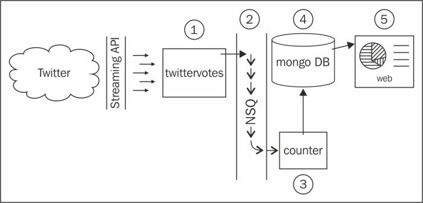

# 第五章。构建分布式系统并使用灵活数据

在本章中，我们将探讨可转移的技能，使我们能够使用无模式数据和分布式技术来解决大数据问题。本章中我们将构建的系统将为我们准备一个未来，在那里民主选举都将在线进行——当然是在 Twitter 上。我们的解决方案将通过查询 Twitter 的流 API 来收集和计算投票特定标签的提及，并且每个组件都能够水平扩展以满足需求。我们的用例是有趣而有趣的，但我们将学习的核心概念和我们将做出的具体技术选择是本章的真正重点。这里讨论的思想直接适用于任何需要真正规模能力的系统。

### 注意

水平扩展是指向系统添加节点，如物理机器，以改善其可用性、性能和/或容量。谷歌等大数据公司可以通过添加廉价且易获得的硬件（通常称为商品硬件）来扩展，因为他们编写软件和设计解决方案的方式。垂直扩展意味着增加单个节点的可用资源，例如向盒子添加额外的 RAM，或者具有更多内核的处理器。

在本章中，您将：

+   了解分布式 NoSQL 数据存储；特别是如何与 MongoDB 交互

+   了解分布式消息队列；特别是 Bit.ly 的 NSQ 以及如何使用`go-nsq`包轻松发布和订阅事件

+   通过 Twitter 的流 API 流式传输实时推文数据并管理长时间运行的网络连接

+   学习如何正确停止具有许多内部 goroutine 的程序

+   学习如何使用低内存通道进行信令

# 系统设计

有一个基本的设计草图通常是有用的，特别是在分布式系统中，许多组件将以不同的方式相互通信。我们不希望在这个阶段花费太长时间，因为我们的设计可能会随着我们深入细节而发展，但我们将看一下高层次的概述，以便我们可以讨论组成部分以及它们如何相互配合。



前面的图片显示了我们将要构建的系统的基本概述：

+   Twitter 是我们都熟悉和喜爱的社交媒体网络。

+   Twitter 的流 API 允许长时间运行的连接，其中推文数据尽可能快地流式传输。

+   `twittervotes`是我们将编写的一个程序，它读取推文并将投票推送到消息队列中。`twittervotes`获取相关的推文数据，找出正在投票的内容（或者说，提到了哪些选项），并将投票推送到 NSQ 中。

+   NSQ 是一个开源的、实时的分布式消息平台，旨在大规模运行，由 Bit.ly 构建和维护。NSQ 在其实例之间传递消息，使其对任何对选举数据表示兴趣的人都可用。

+   `counter`是我们将编写的一个程序，它监听消息队列上的投票，并定期将结果保存在 MongoDB 数据库中。`counter`从 NSQ 接收投票消息，并在内存中定期计算结果，定期推送更新以持久化数据。

+   MongoDB 是一个设计用于大规模运行的开源文档数据库。

+   `web`是一个 Web 服务器程序，将在下一章中公开我们将编写的实时结果。

可以说，可以编写一个单个的 Go 程序来读取推文，计算投票并将它们推送到用户界面，但是这样的解决方案，虽然是一个很好的概念验证，但在规模上非常有限。在我们的设计中，任何一个组件都可以在特定能力的需求增加时进行水平扩展。如果我们有相对较少的投票，但有很多人查看数据，我们可以保持`twittervotes`和`counter`实例不变，并添加更多的`web`和 MongoDB 节点，或者反之亦然。

我们设计的另一个关键优势是冗余；因为我们可以同时拥有许多组件的实例在工作，如果其中一个箱子消失了（例如由于系统崩溃或断电），其他箱子可以接管工作。现代架构通常会将这样的系统分布在地理范围内，以防止本地自然灾害。如果我们以这种方式构建我们的解决方案，所有这些选项都是可用的。

我们选择本章中的特定技术，是因为它们与 Go 的关联（例如，NSQ 完全使用 Go 编写），以及有经过充分测试的驱动程序和软件包可用。然而，从概念上讲，您可以根据需要选择各种替代方案。

## 数据库设计

我们将称我们的 MongoDB 数据库为`ballots`。它将包含一个名为`polls`的单个集合，这是我们将存储投票详细信息的地方，例如标题、选项和结果（在一个 JSON 文档中）。投票的代码将如下所示：

```go
{
  "_id": "???",
  "title": "Poll title",
  "options": ["one", "two", "three"],
  "results": {
    "one": 100,
    "two": 200,
    "three": 300
  }
}
```

`_id`字段是由 MongoDB 自动生成的，将是我们标识每个投票的方式。`options`字段包含一个字符串选项数组；这些是我们将在 Twitter 上寻找的标签。`results`字段是一个映射，其中键表示选项，值表示每个项目的总投票数。

# 安装环境

我们在本章中编写的代码具有真正的外部依赖关系，我们需要在开始构建系统之前设置这些依赖关系。

### 提示

如果您在安装任何依赖项时遇到困难，请务必查看[`github.com/matryer/goblueprints`](https://github.com/matryer/goblueprints)上的章节注释。

在大多数情况下，诸如`mongod`和`nsqd`之类的服务在我们运行程序之前必须启动。由于我们正在编写分布式系统的组件，我们将不得不同时运行每个程序，这就像打开许多终端窗口一样简单。

## NSQ

NSQ 是一个消息队列，允许一个程序向另一个程序发送消息或事件，或者向通过网络连接的不同节点上运行的许多其他程序发送消息。NSQ 保证消息的传递，这意味着它会将未传递的消息缓存，直到所有感兴趣的方收到它们。这意味着，即使我们停止`counter`程序，我们也不会错过任何投票。您可以将此功能与“发送并忘记”消息队列进行对比，其中信息被视为过时，因此如果在规定时间内未传递，则被遗忘，并且发送消息的人不关心消费者是否收到它们。

消息队列抽象允许您在不同的位置运行系统的不同组件，只要它们与队列有网络连接。您的程序与其他程序解耦；相反，您的设计开始关心专门的微服务的细节，而不是数据通过单片程序的流动。

NSQ 传输原始字节，这意味着我们可以自行决定如何将数据编码为这些字节。例如，根据我们的需求，我们可以将数据编码为 JSON 或二进制格式。在我们的情况下，我们将投票选项作为字符串发送，而不需要任何额外的编码，因为我们只共享一个数据字段。

在浏览器中打开[`nsq.io/deployment/installing.html`](http://nsq.io/deployment/installing.html)（或搜索`install nsq`）并按照您的环境的说明进行操作。您可以下载预编译的二进制文件，也可以从源代码构建自己的。如果您已经安装了 homebrew，安装 NSQ 就像输入以下命令一样简单：

```go

brew install nsq

```

安装 NSQ 后，您需要将`bin`文件夹添加到您的`PATH`环境变量中，以便在终端中使用这些工具。

为了验证 NSQ 是否正确安装，打开一个终端并运行`nsqlookupd`；如果程序成功启动，您应该会看到类似以下的一些输出：

```go

nsqlookupd v0.2.27 (built w/go1.3)

TCP: listening on [::]:4160

HTTP: listening on [::]:4161

```

我们将使用默认端口与 NSQ 进行交互，所以请注意输出中列出的 TCP 和 HTTP 端口，因为我们将在我们的代码中引用它们。

按下*Ctrl* + *C*暂停进程；稍后我们会正确启动它们。

我们将使用 NSQ 安装中的关键工具`nsqlookupd`和`nsqd`。`nsqlookupd`程序是一个管理分布式 NSQ 环境的拓扑信息的守护进程；它跟踪特定主题的所有`nsqd`生产者，并为客户端提供查询此类信息的接口。`nsqd`程序是一个守护进程，负责 NSQ 的重要工作，如接收、排队和传递来自和到感兴趣的各方的消息。有关 NSQ 的更多信息和背景，请访问[`nsq.io/`](http://nsq.io/)。

### Go 的 NSQ 驱动程序

NSQ 工具本身是用 Go 编写的，因此 Bit.ly 团队已经有一个使与 NSQ 交互非常容易的 Go 包。我们需要使用它，所以在终端中使用`go get`获取它：

```go

go get github.com/bitly/go-nsq

```

## MongoDB

MongoDB 是一个文档数据库，基本上允许您存储和查询 JSON 文档及其中的数据。每个文档都进入一个集合，可以用来将文档组合在一起，而不对其中的数据强制执行任何模式。与传统的 Oracle、Microsoft SQL Server 或 MySQL 中的行不同，文档可以具有不同的结构是完全可以接受的。例如，一个`people`集合可以同时包含以下三个 JSON 文档：

```go
{"name":"Mat","lang":"en","points":57}
{"name":"Laurie","position":"Scrum Master"}
{"position":"Traditional Manager","exists":false}
```

这种灵活性使得具有不同结构的数据可以共存，而不会影响性能或浪费空间。如果您期望软件随着时间的推移而发展，这也非常有用，因为我们确实应该这样做。

MongoDB 被设计为可以扩展，同时在单机安装上也非常易于操作，比如我们的开发机。当我们将应用程序托管到生产环境时，我们可能会安装一个更复杂的多分片、复制系统，分布在许多节点和位置，但现在，只需运行`mongod`即可。

前往[`www.mongodb.org/downloads`](http://www.mongodb.org/downloads)下载最新版本的 MongoDB 并安装它，确保像往常一样将`bin`文件夹注册到您的`PATH`环境变量中。

为了验证 MongoDB 是否成功安装，运行`mongod`命令，然后按下*Ctrl* + *C*暂停它。

### Go 的 MongoDB 驱动程序

Gustavo Niemeyer 通过他在[`labix.org/mgo`](http://labix.org/mgo)托管的`mgo`（发音为"mango"）包，大大简化了与 MongoDB 的交互，这个包是可以通过以下命令*go gettable*的：

```go

go get gopkg.in/mgo.v2

```

## 启动环境

现在我们已经安装了所有需要的部件，我们需要启动我们的环境。在本节中，我们将：

+   启动`nsqlookupd`以便我们的`nsqd`实例可以被发现

+   启动`nsqd`并告诉它要使用哪个`nsqlookupd`

+   启动`mongod`进行数据服务

这些守护进程中的每一个都应该在自己的终端窗口中运行，这样我们就可以通过按下*Ctrl* + *C*来轻松停止它们。

### 提示

记住这一节的页码，因为在您阅读本章时，您可能会多次回顾它。

在一个终端窗口中运行：

```go

nsqlookupd

```

注意 TCP 端口，默认为`4160`，然后在另一个终端窗口中运行：

```go

nsqd --lookupd-tcp-address=localhost:4160

```

确保`--lookupd-tcp-address`标志中的端口号与`nsqlookupd`实例的 TCP 端口匹配。一旦启动`nsqd`，您将注意到一些输出会从`nsqlookupd`和`nsqd`的终端打印出来；这表明这两个进程正在互相通信。

在另一个窗口或选项卡中，通过运行启动 MongoDB：

```go

mongod --dbpath ./db

```

`dbpath`标志告诉 MongoDB 在哪里存储我们数据库的数据文件。您可以选择任何位置，但在`mongod`运行之前，您必须确保文件夹存在。

### 提示

通过随时删除`dbpath`文件夹，您可以有效地擦除所有数据并重新开始。这在开发过程中特别有用。

现在我们的环境已经运行，我们准备开始构建我们的组件。

# 来自 Twitter 的投票

在`$GOPATH/src`文件夹中，与其他项目一起，为本章创建一个名为`socialpoll`的新文件夹。该文件夹本身不是 Go 包或程序，但将包含我们的三个组件程序。在`socialpoll`中，创建一个名为`twittervotes`的新文件夹，并添加必需的`main.go`模板（这很重要，因为没有`main`函数的`main`包将无法编译）：

```go
package main
func main(){}
```

我们的`twittervotes`程序将：

+   使用`mgo`从 MongoDB 数据库加载所有投票，并从每个文档的`options`数组中收集所有选项。

+   打开并保持与 Twitter 的流 API 的连接，寻找任何提及选项的内容。

+   对于与筛选器匹配的每条推文，找出提到的选项，并将该选项推送到 NSQ。

+   如果与 Twitter 的连接中断（这在长时间运行的连接中很常见，因为它实际上是 Twitter 的流 API 规范的一部分），则在短暂延迟后（以便我们不会用连接请求轰炸 Twitter），重新连接并继续。

+   定期重新查询 MongoDB 以获取最新的投票，并刷新与 Twitter 的连接，以确保我们始终关注正确的选项。

+   当用户通过按*Ctrl* + *C*终止程序时，它将自动停止。

## 与 Twitter 进行授权。

为了使用流 API，我们将需要从 Twitter 的应用程序管理控制台获取身份验证凭据，就像我们在第三章中为我们的 Gomniauth 服务提供者所做的那样，*实现个人资料图片的三种方法*。转到[`apps.twitter.com`](https://apps.twitter.com)并创建一个名为`SocialPoll`的新应用程序（名称必须是唯一的，因此您可以在这里玩得很开心；名称的选择不会影响代码）。创建应用程序后，访问**API 密钥**选项卡，并找到**您的访问令牌**部分，在那里您需要创建一个新的访问令牌。短暂延迟后，刷新页面并注意到您实际上有两组密钥和秘钥；一个 API 密钥和秘钥，以及一个访问令牌和相应的秘密。遵循良好的编码实践，我们将这些值设置为环境变量，以便我们的程序可以访问它们，而无需在源文件中硬编码它们。

本章中我们将使用的密钥是：

+   `SP_TWITTER_KEY`

+   `SP_TWITTER_SECRET`

+   `SP_TWITTER_ACCESSTOKEN`

+   `SP_TWITTER_ACCESSSECRET`

您可以根据需要设置环境变量，但由于应用程序依赖于它们才能工作，因此创建一个名为`setup.sh`（对于 bash shell）或`setup.bat`（在 Windows 上）的新文件是一个好主意，因为您可以将这些文件检入到源代码存储库中。通过从 Twitter 应用程序页面复制相应的值将以下代码插入`setup.sh`或`setup.bat`中：

```go
#!/bin/bash
export SP_TWITTER_KEY=yCwwKKnuBnUBrelyTN...
export SP_TWITTER_SECRET=6on0YRYniT1sI3f...
export SP_TWITTER_ACCESSTOKEN=2427-13677...
export SP_TWITTER_ACCESSSECRET=SpnZf336u...
```

运行文件并使用源或调用命令来适当设置值，或将它们添加到您的`.bashrc`或`C:\cmdauto.cmd`文件中，以节省每次打开新终端窗口时运行它们的时间。

### 提取连接

Twitter 流 API 支持保持长时间打开的 HTTP 连接，并且考虑到我们解决方案的设计，我们需要从请求发生的 goroutine 之外访问`net.Conn`对象以关闭它。我们可以通过为我们将创建的`http.Transport`对象提供自己的`dial`方法来实现这一点。

在`twittervotes`（所有与 Twitter 相关的内容都将驻留在此处）中创建一个名为`twitter.go`的新文件，并插入以下代码：

```go
var conn net.Conn
func dial(netw, addr string) (net.Conn, error) {
  if conn != nil {
    conn.Close()
    conn = nil
  }
  netc, err := net.DialTimeout(netw, addr, 5*time.Second)
  if err != nil {
    return nil, err
  }
  conn = netc
  return netc, nil
}
```

我们定制的`dial`函数首先确保关闭`conn`，然后打开一个新连接，保持`conn`变量更新为当前连接。如果连接中断（Twitter 的 API 偶尔会这样做）或被我们关闭，我们可以重新拨号，而不必担心僵尸连接。

我们将定期关闭连接并启动新连接，因为我们希望定期从数据库重新加载选项。为此，我们需要一个关闭连接的函数，并且还需要关闭我们将用于读取响应主体的`io.ReadCloser`。将以下代码添加到`twitter.go`中：

```go
var reader io.ReadCloser
func closeConn() {
  if conn != nil {
    conn.Close()
  }
  if reader != nil {
    reader.Close()
  }
}
```

现在我们可以随时调用`closeConn`来中断与 Twitter 的持续连接并整理事情。在大多数情况下，我们的代码将再次从数据库加载选项并立即打开新连接，但如果我们正在关闭程序（响应*Ctrl* + *C*按键），那么我们可以在退出之前调用`closeConn`。

### 读取环境变量

接下来，我们将编写一个函数，该函数将读取环境变量并设置我们需要验证请求的`OAuth`对象。在`twitter.go`文件中添加以下代码：

```go
var (
  authClient *oauth.Client
  creds *oauth.Credentials
)
func setupTwitterAuth() {
  var ts struct {
    ConsumerKey    string `env:"SP_TWITTER_KEY,required"`
    ConsumerSecret string `env:"SP_TWITTER_SECRET,required"`
    AccessToken    string `env:"SP_TWITTER_ACCESSTOKEN,required"`
    AccessSecret   string `env:"SP_TWITTER_ACCESSSECRET,required"`
  }
  if err := envdecode.Decode(&ts); err != nil {
    log.Fatalln(err)
  }
  creds = &oauth.Credentials{
    Token:  ts.AccessToken,
    Secret: ts.AccessSecret,
  }
  authClient = &oauth.Client{
    Credentials: oauth.Credentials{
      Token:  ts.ConsumerKey,
      Secret: ts.ConsumerSecret,
    },
  }
}
```

在这里，我们定义了一个`struct`类型来存储我们需要用来验证 Twitter 的环境变量。由于我们不需要在其他地方使用这种类型，我们内联定义它，并创建一个名为`ts`的变量，它是这种匿名类型（这就是为什么我们有了有些不寻常的`var ts struct…`代码）。然后我们使用 Joe Shaw 优雅的`envdecode`包来为我们拉取这些环境变量。您需要运行`go get github.com/joeshaw/envdecode`，并且还要导入`log`包。我们的程序将尝试为所有标记为`required`的字段加载适当的值，并在失败时返回错误，提醒人们如果没有 Twitter 凭据，程序将无法工作。

在`struct`中每个字段旁边的反引号内的字符串称为标签，并且可以通过反射接口获得，这就是`envdecode`知道要查找哪些变量的方式。Tyler Bunnell 和我为这个包添加了 required 参数，这表明如果缺少（或为空）任何环境变量都是错误的。

一旦我们获得了密钥，我们将使用它们来创建`oauth.Credentials`和`oauth.Client`对象，这些对象来自 Gary Burd 的`go-oauth`包，它将允许我们使用 Twitter 进行授权请求。

现在我们有了控制底层连接和授权请求的能力，我们准备编写实际构建授权请求并返回响应的代码。在`twitter.go`中，添加以下代码：

```go
var (
  authSetupOnce sync.Once
  httpClient    *http.Client
)
func makeRequest(req *http.Request, params url.Values) (*http.Response, error) {
  authSetupOnce.Do(func() {
    setupTwitterAuth()
    httpClient = &http.Client{
      Transport: &http.Transport{
        Dial: dial,
      },
    }
  })
  formEnc := params.Encode()
  req.Header.Set("Content-Type", "application/x-www-form-urlencoded")
  req.Header.Set("Content-Length", strconv.Itoa(len(formEnc)))
  req.Header.Set("Authorization", authClient.AuthorizationHeader(creds, "POST", req.URL, params))
  return httpClient.Do(req)
}
```

我们使用`sync.Once`来确保我们的初始化代码只运行一次，尽管我们调用`makeRequest`的次数有多少。在调用`setupTwitterAuth`方法之后，我们使用`http.Transport`创建一个新的`http.Client`，该`http.Transport`使用我们自定义的`dial`方法。然后，我们通过对包含我们要查询的选项的指定`params`对象进行编码，设置与 Twitter 授权所需的适当标头。

## 从 MongoDB 读取

为了加载投票，并因此搜索 Twitter 的选项，我们需要连接并查询 MongoDB。在`main.go`中，添加两个函数`dialdb`和`closedb`：

```go
var db *mgo.Session
func dialdb() error {
  var err error
  log.Println("dialing mongodb: localhost")
  db, err = mgo.Dial("localhost")
  return err
}
func closedb() {
  db.Close()
  log.Println("closed database connection")
}
```

这两个函数将使用`mgo`包连接到本地运行的 MongoDB 实例，并将`mgo.Session`（数据库连接对象）存储在名为`db`的全局变量中，并从中断开连接。

### 提示

作为额外的任务，看看是否可以找到一种优雅的方式来使 MongoDB 实例的位置可配置，以便您不需要在本地运行它。

假设 MongoDB 正在运行并且我们的代码能够连接，我们需要加载投票对象并从文档中提取所有选项，然后我们将使用这些选项来搜索 Twitter。将以下`Options`函数添加到`main.go`中：

```go
type poll struct {
  Options []string
}
func loadOptions() ([]string, error) {
  var options []string
  iter := db.DB("ballots").C("polls").Find(nil).Iter()
  var p poll
  for iter.Next(&p) {
    options = append(options, p.Options...)
  }
  iter.Close()
  return options, iter.Err()
}
```

我们的投票文档包含的不仅仅是`Options`，但我们的程序不关心其他任何内容，因此我们不需要膨胀我们的`poll`结构。我们使用`db`变量访问`ballots`数据库中的`polls`集合，并调用`mgo`包的流畅`Find`方法，传递`nil`（表示没有过滤）。

### 注意

流畅接口（由 Eric Evans 和 Martin Fowler 首次创造）是指旨在通过允许您链接方法调用来使代码更可读的 API 设计。这是通过每个方法返回上下文对象本身来实现的，以便可以直接调用另一个方法。例如，`mgo`允许您编写诸如此类的查询：

```go
query := col.Find(q).Sort("field").Limit(10).Skip(10)
```

然后我们通过调用`Iter`方法获得迭代器，这允许我们逐个访问每个投票。这是一种非常节省内存的读取投票数据的方式，因为它只使用一个`poll`对象。如果我们使用`All`方法，我们将使用的内存量取决于我们在数据库中拥有的投票数量，这将超出我们的控制。

当我们有一个投票时，我们使用`append`方法来构建选项切片。当然，随着数据库中有数百万个投票，这个切片也会变得庞大而难以控制。对于这种规模，我们可能会运行多个`twittervotes`程序，每个程序专门用于一部分投票数据。一个简单的方法是根据标题的首字母将投票分成组，例如 A-N 组和 O-Z 组。一个更复杂的方法是向`poll`文档添加一个字段，以更受控制的方式对其进行分组，也许是基于其他组的统计数据，以便我们能够在许多`twittervotes`实例之间平衡负载。

### 提示

`append`内置函数实际上是一个`variadic`函数，这意味着您可以为其附加多个元素。如果您有正确类型的切片，可以在末尾添加`...`，这模拟了将切片的每个项目作为不同参数传递。

最后，我们关闭迭代器并清理任何使用的内存，然后返回选项和在迭代过程中发生的任何错误（通过在`mgo.Iter`对象上调用`Err`方法）。

## 从 Twitter 阅读

现在我们能够加载选项并向 Twitter API 发出授权请求。因此，我们准备编写启动连接的代码，并持续从流中读取，直到我们调用我们的`closeConn`方法，或者 Twitter 因某种原因关闭连接。流中包含的结构是一个复杂的结构，包含有关推文的各种信息-谁发表了它以及何时，甚至在正文中出现了哪些链接或用户提及（有关更多详细信息，请参阅 Twitter 的 API 文档）。但是，我们只对推文文本本身感兴趣，因此您无需担心所有其他噪音；将以下结构添加到`twitter.go`中：

```go
type tweet struct {
  Text string
}
```

### 提示

这可能感觉不完整，但请考虑它如何清晰地表达了我们对其他程序员可能看到我们的代码的意图：推文有一些文本，这就是我们关心的全部。

使用这种新结构，在`twitter.go`中添加以下`readFromTwitter`函数，该函数接收一个名为`votes`的只发送通道；这是该函数通知程序的其余部分它已经在 Twitter 上注意到了一次投票的方式：

```go
func readFromTwitter(votes chan<- string) {
  options, err := loadOptions()
  if err != nil {
    log.Println("failed to load options:", err)
    return
  }
  u, err := url.Parse("https://stream.twitter.com/1.1/statuses/filter.json")
  if err != nil {
    log.Println("creating filter request failed:", err)
    return
  }
  query := make(url.Values)
  query.Set("track", strings.Join(options, ","))
  req, err := http.NewRequest("POST", u.String(), strings.NewReader(query.Encode()))
  if err != nil {
    log.Println("creating filter request failed:", err)
    return
  }
  resp, err := makeRequest(req, query)
  if err != nil {
    log.Println("making request failed:", err)
    return
  }
  reader := resp.Body
  decoder := json.NewDecoder(reader)
  for {
    var tweet tweet
    if err := decoder.Decode(&tweet); err != nil {
      break
    }
    for _, option := range options {
      if strings.Contains(
        strings.ToLower(tweet.Text),
        strings.ToLower(option),
      ) {
        log.Println("vote:", option)
        votes <- option
      }
    }
  }
}
```

在上述代码中，加载所有投票数据的选项（通过调用`loadOptions`函数）后，我们使用`url.Parse`创建一个描述 Twitter 上适当端点的`url.URL`对象。我们构建一个名为`query`的`url.Values`对象，并将选项设置为逗号分隔的列表。根据 API，我们使用编码后的`url.Values`对象作为主体发出新的`POST`请求，并将其与查询对象一起传递给`makeRequest`。如果一切顺利，我们将从请求的主体中创建一个新的`json.Decoder`，并通过调用`Decode`方法在无限的`for`循环中不断读取。如果出现错误（可能是由于连接关闭），我们简单地中断循环并退出函数。如果有要读取的推文，它将被解码为`tweet`变量，这将使我们可以访问`Text`属性（推文本身的 140 个字符）。然后，我们遍历所有可能的选项，如果推文提到了它，我们就在`votes`通道上发送它。这种技术还允许一个推文同时包含许多投票，这取决于选举规则，您可能会决定是否更改。

### 注意

`votes`通道是**只发送**的（这意味着我们不能在其上接收），因为它的类型是`chan<- string`。想象一下小箭头告诉我们消息流向的方式：要么进入通道，要么离开通道。这是一种表达意图的好方法——很明显，我们从不打算使用`readFromTwitter`函数来读取投票；相反，我们只会在该通道上发送它们。

每当`Decode`返回错误时终止程序并不提供一个非常健壮的解决方案。这是因为 Twitter API 文档规定连接会不时中断，客户端在消费服务时应考虑到这一点。而且请记住，我们也会定期终止连接，所以我们需要考虑一种在连接中断后重新连接的方法。

### 信号通道

在 Go 中使用通道的一个很好的用途是在不同 goroutine 中运行的代码之间发出信号事件。当我们编写下一个函数时，我们将看到一个真实世界的例子。

该函数的目的是启动一个 goroutine，不断调用`readFromTwitter`函数（使用指定的`votes`通道接收投票），直到我们发出停止信号。一旦它停止，我们希望通过另一个信号通道得到通知。函数的返回值将是一个`struct{}`类型的通道；一个信号通道。

信号通道具有一些有趣的特性值得仔细研究。首先，通过通道发送的类型是一个空的`struct{}`，实际上不占用任何字节，因为它没有字段。因此，`struct{}{}`是一个用于信号事件的内存高效选项。有些人使用`bool`类型，这也可以，尽管`true`和`false`都占用一个字节的内存。

### 注意

前往[`play.golang.org`](http://play.golang.org)并自己尝试一下。

布尔类型的大小为 1：

```go
fmt.Println(reflect.TypeOf(true).Size())
= 1
```

结构体`struct{}{}`的大小为`0`：

```go
fmt.Println(reflect.TypeOf(struct{}{}).Size())
= 0
```

信号通道还具有缓冲区大小为 1，这意味着执行不会阻塞，直到有东西从通道中读取信号。

我们将在我们的代码中使用两个信号通道，一个是我们传递给函数的，告诉我们的 goroutine 它应该停止，另一个是函数提供的，一旦停止完成就发出信号。

在`twitter.go`中添加以下函数：

```go
func startTwitterStream(stopchan <-chan struct{}, votes chan<- string) <-chan struct{} {
  stoppedchan := make(chan struct{}, 1)
  go func() {
    defer func() {
      stoppedchan <- struct{}{}
    }()
    for {
      select {
      case <-stopchan:
        log.Println("stopping Twitter...")
        return
      default:
        log.Println("Querying Twitter...")
        readFromTwitter(votes)
        log.Println("  (waiting)")
        time.Sleep(10 * time.Second) // wait before reconnecting
      }
    }
  }()
  return stoppedchan
}
```

在上述代码中，第一个参数`stopchan`是一个类型为`<-chan struct{}`的通道，一个**只接收**的信号通道。在代码外部，将在此通道上发出信号，这将告诉我们的 goroutine 停止。请记住，在此函数内部它是只接收的，实际通道本身将能够发送。第二个参数是`votes`通道，用于发送投票。我们函数的返回类型也是一个类型为`<-chan struct{}`的信号通道；一个只接收的通道，我们将用它来指示我们已经停止。

这些通道是必要的，因为我们的函数会触发自己的 goroutine，并立即返回，所以没有这些，调用代码将不知道生成的代码是否仍在运行。

在`startTwitterStream`函数中，我们首先创建了`stoppedchan`，并延迟发送`struct{}{}`以指示我们的函数退出时已经完成。请注意，`stoppedchan`是一个普通通道，因此即使它作为只接收返回，我们也可以在此函数内部发送它。

然后我们开始一个无限的`for`循环，在其中我们从两个通道中选择一个。第一个是`stopchan`（第一个参数），这将表明是时候停止并返回（从而触发`stoppedchan`上的延迟信号）。如果还没有发生这种情况，我们将调用`readFromTwitter`（传入`votes`通道），它将从数据库中加载选项并打开到 Twitter 的连接。

当 Twitter 连接断开时，我们的代码将返回到这里，在这里我们使用`time.Sleep`函数睡眠十秒。这是为了让 Twitter API 休息一下，以防它由于过度使用而关闭连接。一旦休息过后，我们重新进入循环，并再次检查`stopchan`通道，看看调用代码是否希望我们停止。

为了使这个流程清晰，我们记录了一些关键语句，这些语句不仅有助于我们调试代码，还让我们窥视这个有些复杂的机制的内部工作。

## 发布到 NSQ

一旦我们的代码成功地注意到 Twitter 上的投票并将它们发送到`votes`通道中，我们需要一种方法将它们发布到 NSQ 主题；毕竟，这是`twittervotes`程序的目的。

我们将编写一个名为`publishVotes`的函数，它将接收类型为`<-chan string`（只接收通道）的`votes`通道，并发布从中接收到的每个字符串。

### 注意

在我们之前的函数中，`votes`通道的类型是`chan<- string`，但这次它的类型是`<-chan string`。您可能会认为这是一个错误，甚至认为这意味着我们不能同时使用同一个通道，但您是错误的。我们稍后创建的通道将使用`make(chan string)`，既不是接收也不是发送，可以在两种情况下都起作用。在参数中使用`<-`运算符的原因是为了明确通道的使用意图；或者在它是返回类型的情况下，防止用户意外地在预期用于接收或发送的通道上发送。如果用户错误地使用这样的通道，编译器实际上会产生错误。

一旦`votes`通道关闭（这是外部代码告诉我们的函数停止工作的方式），我们将停止发布并向返回的停止信号通道发送信号。

将`publishVotes`函数添加到`main.go`：

```go
func publishVotes(votes <-chan string) <-chan struct{} {
  stopchan := make(chan struct{}, 1)
  pub, _ := nsq.NewProducer("localhost:4150", nsq.NewConfig())
  go func() {
    for vote := range votes {
      pub.Publish("votes", []byte(vote)) // publish vote
    }
    log.Println("Publisher: Stopping")
    pub.Stop()
    log.Println("Publisher: Stopped")
    stopchan <- struct{}{}
  }()
  return stopchan
}
```

我们做的第一件事是创建`stopchan`，然后将其返回，这次不是延迟发送信号，而是通过向`stopchan`发送`struct{}{}`来内联执行。

### 注意

不同之处在于显示备选选项：在一个代码库中，您应该选择自己喜欢的风格并坚持下去，直到社区内出现一个标准；在这种情况下，我们都应该遵循这个标准。

然后我们通过调用`NewProducer`创建一个 NSQ 生产者，并连接到`localhost`上的默认 NSQ 端口，使用默认配置。我们启动一个 goroutine，它使用 Go 语言的另一个很棒的内置功能，让我们可以通过在通道上执行正常的`for…range`操作来不断地从通道中拉取值（在我们的情况下是`votes`通道）。每当通道没有值时，执行将被阻塞，直到有值传送过来。如果`votes`通道被关闭，`for`循环将退出。

### 提示

要了解 Go 语言中通道的强大之处，强烈建议您查找 John Graham-Cumming 的博客文章和视频，特别是他在 2014 年 Gophercon 上介绍的*通道概览*，其中包含了通道的简要历史，包括它们的起源。（有趣的是，John 还成功地请求英国政府正式为对待 Alan Turing 的方式道歉。）

当循环退出（在`votes`通道关闭后），发布者将停止，随后发送`stopchan`信号。

## 优雅地启动和停止

当我们的程序被终止时，我们希望在实际退出之前做一些事情；即关闭与 Twitter 的连接并停止 NSQ 发布者（实际上是取消其对队列的兴趣）。为了实现这一点，我们必须覆盖默认的*Ctrl + C*行为。

### 提示

即将到来的代码块都在`main`函数内部；它们被分开，以便我们在继续之前讨论每个部分。

在`main`函数内添加以下代码：

```go
var stoplock sync.Mutex
stop := false
stopChan := make(chan struct{}, 1)
signalChan := make(chan os.Signal, 1)
go func() { 
  <-signalChan
  stoplock.Lock()
  stop = true
  stoplock.Unlock()
  log.Println("Stopping...")
  stopChan <- struct{}{}
  closeConn()
}()
signal.Notify(signalChan, syscall.SIGINT, syscall.SIGTERM)
```

在这里，我们创建了一个带有关联`sync.Mutex`的停止`bool`，以便我们可以同时从许多 goroutine 中访问它。然后我们创建了另外两个信号通道，`stopChan`和`signalChan`，并使用`signal.Notify`要求 Go 在有人尝试终止程序时将信号发送到`signalChan`（无论是使用`SIGINT`中断还是`SIGTERM`终止 POSIX 信号）。`stopChan`是我们指示要终止进程的方式，我们将其作为参数传递给`startTwitterStream`。

然后我们运行一个 goroutine，通过尝试从`signalChan`读取来阻塞等待信号；这就是这种情况下`<-`操作符的作用（它正在尝试从通道中读取）。由于我们不关心信号的类型，因此我们不需要捕获通道上返回的对象。一旦收到信号，我们将`stop`设置为`true`，并关闭连接。只有在发送了指定的信号之一后，才会运行剩余的 goroutine 代码，这就是我们能够在退出程序之前执行拆卸代码的方式。

在`main`函数内添加以下代码片段，以打开并延迟关闭数据库连接：

```go
if err := dialdb(); err != nil {
  log.Fatalln("failed to dial MongoDB:", err)
}
defer closedb()
```

由于`readFromTwitter`方法每次都会从数据库重新加载选项，并且我们希望在无需重新启动程序的情况下保持程序更新，因此我们将引入最后一个 goroutine。这个 goroutine 将每分钟调用`closeConn`，导致连接断开，并导致`readFromTwitter`再次被调用。在`main`函数的底部插入以下代码，以启动所有这些进程，然后等待它们优雅地停止：

```go
// start things
votes := make(chan string) // chan for votes
publisherStoppedChan := publishVotes(votes)
twitterStoppedChan := startTwitterStream(stopChan, votes)
go func() {
  for {
    time.Sleep(1 * time.Minute)
    closeConn()
    stoplock.Lock()
    if stop {
      stoplock.Unlock()
      break
    }
    stoplock.Unlock()
  }
}()
<-twitterStoppedChan
close(votes)
<-publisherStoppedChan
```

首先，我们创建了我们在本节中一直在谈论的`votes`通道，它是一个简单的字符串通道。请注意，它既不是发送（`chan<-`）也不是接收（`<-chan`）通道；实际上，创建这样的通道没有多大意义。然后我们调用`publishVotes`，将`votes`通道传递给它进行接收，并将返回的停止信号通道捕获为`publisherStoppedChan`。类似地，我们调用`startTwitterStream`，传入我们在`main`函数开头的`stopChan`，以及`votes`通道进行发送，并捕获生成的停止信号通道为`twitterStoppedChan`。

然后我们启动刷新 goroutine，它立即进入无限的`for`循环，然后睡眠一分钟并通过调用`closeConn`关闭连接。如果停止`bool`已经设置为 true（在之前的 goroutine 中），我们将`break`循环并退出，否则我们将继续循环并等待另一分钟再次关闭连接。使用`stoplock`是重要的，因为我们有两个 goroutine 可能同时尝试访问停止变量，但我们希望避免冲突。

一旦 goroutine 启动，我们就会在`twitterStoppedChan`上阻塞，尝试从中读取。当成功时（这意味着在`stopChan`上发送了信号），我们关闭`votes`通道，这将导致发布者的`for…range`循环退出，并且发布者本身停止，之后会在`publisherStoppedChan`上发送信号，我们等待后退出。

## 测试

为了确保我们的程序正常工作，我们需要做两件事：首先，我们需要在数据库中创建一个投票，其次，我们需要查看消息队列，看看消息是否确实由`twittervotes`生成。

在终端中，运行`mongo`命令打开一个数据库 shell，允许我们与 MongoDB 交互。然后输入以下命令添加一个测试投票：

```go

> use ballots

switched to db ballots

> db.polls.insert({"title":"Test poll","options":["happy","sad","fail","win"]})

```

前面的命令向`ballots`数据库的`polls`集合中添加了一个新项目。我们使用一些常见的选项词，这些选项可能会被 Twitter 上的人提到，以便我们可以观察到真实的推文被翻译成消息。您可能会注意到我们的投票对象缺少`results`字段；这没关系，因为我们处理的是非结构化数据，文档不必遵循严格的模式。我们将在下一节中编写的`counter`程序稍后为我们添加和维护`results`数据。

按下*Ctrl + C*退出 MongoDB shell，并输入以下命令：

```go

nsq_tail --topic="votes" --lookupd-http-address=localhost:4161

```

`nsq_tail`工具连接到指定的消息队列主题，并输出它注意到的任何消息。这是我们验证我们的`twittervotes`程序是否正在发送消息的地方。

在一个单独的终端窗口中，让我们构建并运行`twittervotes`程序：

```go

go build –o twittervotes

./twittervotes

```

现在切换回运行`nsq_tail`的窗口，并注意确实会生成消息以响应实时 Twitter 活动。

### 提示

如果您没有看到太多活动，请尝试在 Twitter 上查找热门标签，并添加另一个包含这些选项的投票。

# 计票

我们将要实现的第二个程序是`counter`工具，它将负责监视 NSQ 中的投票，对其进行计数，并将 MongoDB 与最新数字保持同步。

在`twittervotes`旁边创建一个名为`counter`的新文件夹，并将以下代码添加到一个新的`main.go`文件中：

```go
package main
import (
  "flag"
  "fmt"
  "os"
)
var fatalErr error
func fatal(e error) {
  fmt.Println(e)
  flag.PrintDefaults()
  fatalErr = e
}
func main() {
  defer func() {
    if fatalErr != nil {
      os.Exit(1)
    }
  }()
}
```

通常，当我们在代码中遇到错误时，我们使用`log.Fatal`或`os.Exit`这样的调用，它会立即终止程序。以非零退出代码退出程序很重要，因为这是我们告诉操作系统出现问题，我们没有成功完成任务的方式。常规方法的问题在于我们安排的任何延迟函数（因此我们需要运行的任何拆卸代码）都不会有机会执行。

在前面的代码片段中使用的模式允许我们调用`fatal`函数来记录发生错误。请注意，只有当我们的主函数退出时，推迟的函数才会运行，然后调用`os.Exit(1)`以退出带有退出代码`1`的程序。因为推迟的语句按 LIFO（后进先出）顺序运行，我们推迟的第一个函数将是最后执行的函数，这就是为什么我们在`main`函数中首先推迟退出代码。这使我们确信我们推迟的其他函数将在程序退出*之前*被调用。我们将使用此功能来确保无论发生任何错误，我们的数据库连接都会关闭。

## 连接到数据库

在成功获取资源后，立即考虑清理资源（例如数据库连接）是最佳时机；Go 的`defer`关键字使这变得容易。在主函数的底部，添加以下代码：

```go
log.Println("Connecting to database...")
db, err := mgo.Dial("localhost")
if err != nil {
  fatal(err)
  return
}
defer func() {
  log.Println("Closing database connection...")
  db.Close()
}()
pollData := db.DB("ballots").C("polls")
```

此代码使用熟悉的`mgo.Dial`方法打开到本地运行的 MongoDB 实例的会话，并立即推迟一个关闭会话的函数。我们可以确信这段代码将在先前推迟的包含退出代码的语句之前运行（因为推迟的函数按照它们被调用的相反顺序运行）。因此，无论我们的程序发生什么，我们都知道数据库会话一定会正确关闭。

### 提示

日志语句是可选的，但将帮助我们在运行和退出程序时查看发生了什么。

在片段的末尾，我们使用`mgo`流畅的 API 将`ballots.polls`数据集的引用保存在`pollData`变量中，稍后我们将使用它来进行查询。

## 在 NSQ 中消费消息

为了计算选票，我们需要消耗 NSQ 中`votes`主题上的消息，并且我们需要一个地方来存储它们。将以下变量添加到`main`函数中：

```go
var counts map[string]int
var countsLock sync.Mutex
```

在 Go 中，地图和锁（`sync.Mutex`）是常见的组合，因为我们将有多个 goroutine 尝试访问相同的地图，并且我们需要避免在同时尝试修改或读取它时破坏它。

将以下代码添加到`main`函数中：

```go
log.Println("Connecting to nsq...")
q, err := nsq.NewConsumer("votes", "counter", nsq.NewConfig())
if err != nil {
  fatal(err)
  return
}
```

`NewConsumer`函数允许我们设置一个对象，该对象将侦听`votes` NSQ 主题，因此当`twittervotes`在该主题上发布选票时，我们可以在此程序中处理它。如果`NewConsumer`返回错误，我们将使用我们的`fatal`函数来记录并返回。

接下来，我们将添加处理来自 NSQ 的消息（选票）的代码：

```go
q.AddHandler(nsq.HandlerFunc(func(m *nsq.Message) error {
  countsLock.Lock()
  defer countsLock.Unlock()
  if counts == nil {
    counts = make(map[string]int)
  }
  vote := string(m.Body)
  counts[vote]++
  return nil
}))
```

我们在`nsq.Consumer`上调用`AddHandler`方法，并将一个函数传递给它，该函数将在接收到`votes`主题上的每条消息时调用。

当选票到来时，我们首先锁定`countsLock`互斥体。接下来，我们推迟了互斥体的解锁，以便在函数退出时解锁。这使我们确信，在`NewConsumer`运行时，我们是唯一被允许修改地图的人；其他人必须等到我们的函数退出后才能使用它。对`Lock`方法的调用在放置锁时阻止执行，只有在通过调用`Unlock`释放锁时才继续执行。这就是为什么每个`Lock`调用都必须有一个`Unlock`对应项的原因，否则我们将使程序死锁。

每次收到一张选票时，我们都会检查`counts`是否为`nil`，如果是，则创建一个新地图，因为一旦数据库已更新为最新结果，我们希望重置一切并从零开始。最后，我们增加给定键的`int`值一次，并返回`nil`表示没有错误。

尽管我们已经创建了 NSQ 消费者，并添加了处理程序函数，但我们仍然需要连接到 NSQ 服务，我们将通过添加以下代码来实现：

```go
if err := q.ConnectToNSQLookupd("localhost:4161"); err != nil {
  fatal(err)
  return
}
```

重要的是要注意，我们实际上是连接到`nsqlookupd`实例的 HTTP 端口，而不是 NSQ 实例；这种抽象意味着我们的程序不需要知道消息来自何处才能消费它们。如果我们无法连接到服务器（例如，如果我们忘记启动它），我们将收到错误，我们会在立即返回之前将其报告给我们的致命函数。

## 保持数据库更新

我们的代码将监听投票，并在内存中保留结果的映射，但是这些信息目前被困在我们的程序中。接下来，我们需要添加定期将结果推送到数据库的代码：

```go
log.Println("Waiting for votes on nsq...")
var updater *time.Timer
updater = time.AfterFunc(updateDuration, func() {
  countsLock.Lock()
  defer countsLock.Unlock()
  if len(counts) == 0 {
    log.Println("No new votes, skipping database update")
  } else {
    log.Println("Updating database...")
    log.Println(counts)
    ok := true
    for option, count := range counts {
      sel := bson.M{"options": bson.M{"$in": []string{option}}}
      up := bson.M{"$inc": bson.M{"results." + option: count}}
      if _, err := pollData.UpdateAll(sel, up); err != nil {
        log.Println("failed to update:", err)
        ok = false
      }
    }
    if ok {
      log.Println("Finished updating database...")
      counts = nil // reset counts
    }
  }
  updater.Reset(updateDuration)
})
```

`time.AfterFunc`函数在指定的持续时间后调用函数的 goroutine。最后我们调用`Reset`，重新开始这个过程；这允许我们定期安排我们的更新代码定期运行。

当我们的更新函数运行时，我们首先锁定`countsLock`，并推迟其解锁。然后我们检查计数映射中是否有任何值。如果没有，我们只是记录我们正在跳过更新，并等待下一次。

如果有一些投票，我们会遍历`counts`映射，提取选项和投票数（自上次更新以来），并使用一些 MongoDB 魔法来更新结果。

### 注意

MongoDB 在内部存储 BSON（二进制 JSON）文档，这比普通 JSON 文档更容易遍历，这就是为什么`mgo`包带有`mgo/bson`编码包。在使用`mgo`时，我们经常使用`bson`类型，例如`bson.M`映射来描述 MongoDB 的概念。

我们首先使用`bson.M`快捷类型创建我们的更新操作的选择器，这类似于创建`map[string]interface{}`类型。我们创建的选择器将大致如下：

```go
{
  "options": {
    "$in": ["happy"]
  }
}
```

在 MongoDB 中，前面的 BSON 指定我们要选择`options`数组中包含`"happy"`的选项的投票。

接下来，我们使用相同的技术生成更新操作，大致如下：

```go
{
  "$inc": {
    "results.happy": 3
  }
}
```

在 MongoDB 中，前面的 BSON 指定我们要将`results.happy`字段增加 3。如果投票中没有`results`映射，将创建一个，如果`results`中没有`happy`键，则假定为`0`。

然后我们调用`pollsData`查询上的`UpdateAll`方法来向数据库发出命令，这将依次更新与选择器匹配的每个投票（与`Update`方法相反，它只会更新一个）。如果出现问题，我们会报告并将`ok`布尔值设置为 false。如果一切顺利，我们将`counts`映射设置为 nil，因为我们想重置计数器。

我们将在文件顶部将`updateDuration`指定为常量，这将使我们在测试程序时更容易进行更改。在`main`函数上面添加以下代码：

```go
const updateDuration = 1 * time.Second
```

## 响应 Ctrl + C

在我们的程序准备就绪之前要做的最后一件事是确保我们的`main`函数在退出之前等待操作完成，就像我们在`twittervotes`程序中所做的那样。在`main`函数的末尾添加以下代码：

```go
termChan := make(chan os.Signal, 1)
signal.Notify(termChan, syscall.SIGINT, syscall.SIGTERM, syscall.SIGHUP)
for {
  select {
  case <-termChan:
    updater.Stop()
    q.Stop()
  case <-q.StopChan:
    // finished
    return
  }
}
```

这里我们采用了与以前略有不同的策略。我们捕获终止事件，这将导致在我们按下*Ctrl + C*时通过`termChan`发送信号。接下来，我们启动一个无限循环，在循环内部，我们使用 Go 的`select`结构，使我们能够在`termChan`或消费者的`StopChan`上接收到东西时运行代码。

实际上，我们只会在按下`Ctrl+C`时首先收到`termChan`信号，此时我们会停止`updater`计时器，并要求消费者停止监听投票。然后执行重新进入循环，并阻塞直到消费者通过在其`StopChan`上发出信号来报告已经停止。当这发生时，我们完成并退出，此时我们的延迟语句运行，如果您记得的话，它会整理数据库会话。

# 运行我们的解决方案

是时候看到我们的代码在运行了。确保在单独的终端窗口中运行`nsqlookupd`，`nsqd`和`mongod`：

```go

nsqlookupd

nsqd --lookupd-tcp-address=127.0.0.1:4160

mongod --dbpath ./db

```

如果你还没有这样做，请确保`twittervotes`程序也在运行。然后在`counter`文件夹中，构建并运行我们的计数程序：

```go

go build -o counter

./counter

```

你应该会看到定期的输出，描述`counter`正在做的工作，比如：

```go

No new votes, skipping database update

Updating database...

map[win:2 happy:2 fail:1]

Finished updating database...

No new votes, skipping database update

Updating database...

map[win:3]

Finished updating database...

```

### 提示

输出当然会有所不同，因为我们实际上是在回应 Twitter 上的实时活动。

我们可以看到我们的程序正在从 NSQ 接收投票数据，并报告正在更新数据库的结果。我们可以通过打开 MongoDB shell 并查询投票数据来确认这一点，看看`results` map 是否正在更新。在另一个终端窗口中，打开 MongoDB shell：

```go

mongo

```

要求它使用选票数据库：

```go

> use ballots

switched to db ballots

```

使用无参数的 find 方法获取所有投票（在末尾添加`pretty`方法以获得格式良好的 JSON）：

```go

> db.polls.find().pretty()

{

 "_id" : ObjectId("53e2a3afffbff195c2e09a02"),

 "options" : [

 "happy","sad","fail","win"

 ],

 "results" : {

 "fail" : 159, "win" : 711,

 "happy" : 233, "sad" : 166,

 },

 "title" : "Test poll"

}

```

`results` map 确实在更新，并且随时包含每个选项的总票数。

# 摘要

在本章中，我们涵盖了很多内容。我们学习了使用信号通道优雅地关闭程序的不同技术，这在我们的代码在退出之前需要做一些工作时尤其重要。我们看到，在程序开始时推迟报告致命错误可以让我们的其他推迟函数有机会在进程结束之前执行。

我们还发现使用`mgo`包与 MongoDB 进行交互是多么容易，并且在描述数据库概念时如何使用 BSON 类型。`bson.M`替代了`map[string]interface{}`，帮助我们保持代码更简洁，同时仍然提供了我们在处理非结构化或无模式数据时所需的所有灵活性。

我们了解了消息队列以及它们如何允许我们将系统的组件分解为独立和专业化的微服务。我们首先运行查找守护程序`nsqlookupd`，然后运行单个`nsqd`实例，并通过 TCP 接口将它们连接在一起。然后我们能够在`twittervotes`中将投票发布到队列中，并连接到查找守护程序，在我们的`counter`程序中为每个发送的投票运行处理函数。

虽然我们的解决方案实际上执行的是一个非常简单的任务，但是我们在本章中构建的架构能够做一些非常了不起的事情。

+   我们消除了`twittervotes`和`counter`程序需要在同一台机器上运行的需求——只要它们都能连接到适当的 NSQ，无论它们在哪里运行，它们都会按预期运行。

+   我们可以将我们的 MongoDB 和 NSQ 节点分布在许多物理机器上，这意味着我们的系统能够实现巨大的规模——每当资源开始不足时，我们可以添加新的盒子来满足需求。

+   当我们添加其他需要查询和读取投票结果的应用程序时，我们可以确保我们的数据库服务是高度可用的，并且能够提供服务。

+   我们可以将我们的数据库分布在地理范围内，复制数据以备份，这样当灾难发生时我们不会丢失任何东西。

+   我们可以构建一个多节点、容错的 NSQ 环境，这意味着当我们的`twittervotes`程序了解到有趣的推文时，总会有地方发送数据。

+   我们可以编写更多的程序，从不同的来源生成投票；唯一的要求是它们知道如何将消息放入 NSQ。

+   在下一章中，我们将构建自己的 RESTful 数据服务，通过它我们将公开我们社交投票应用程序的功能。我们还将构建一个 Web 界面，让用户创建自己的投票，并可视化结果。
