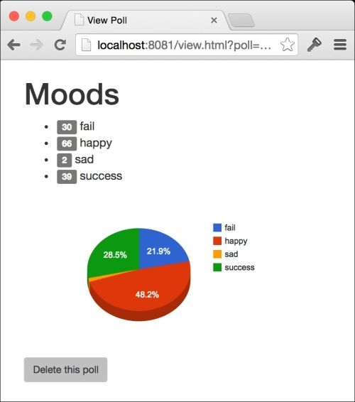

# 第六章。通过 RESTful 数据 Web 服务 API 公开数据和功能

在上一章中，我们构建了一个从 Twitter 读取推文，计算标签投票并将结果存储在 MongoDB 数据库中的服务。我们还使用了 MongoDB shell 来添加投票并查看投票结果。如果我们是唯一使用我们的解决方案的人，那么这种方法是可以的，但是如果我们发布我们的项目并期望用户直接连接到我们的 MongoDB 实例以使用我们构建的服务，那将是疯狂的。

因此，在本章中，我们将构建一个 RESTful 数据服务，通过该服务将数据和功能公开。我们还将组建一个简单的网站来消费新的 API。用户可以使用我们的网站创建和监视投票，或者在我们发布的 Web 服务之上构建自己的应用程序。

### 提示

本章中的代码依赖于第五章中的代码，*构建分布式系统并使用灵活数据*，因此建议您首先完成该章节，特别是因为它涵盖了设置本章代码运行的环境。

具体来说，您将学到：

+   如何包装`http.HandlerFunc`类型可以为我们的 HTTP 请求提供一个简单但强大的执行管道

+   如何在 HTTP 处理程序之间安全共享数据

+   编写负责公开数据的处理程序的最佳实践

+   小的抽象可以让我们现在编写尽可能简单的实现，但留下改进它们的空间，而不改变接口

+   如何向我们的项目添加简单的辅助函数和类型将防止我们（或至少推迟）对外部包添加依赖

# RESTful API 设计

要使 API 被视为 RESTful，它必须遵循一些原则，这些原则忠实于 Web 背后的原始概念，并且大多数开发人员已经了解。这种方法可以确保我们没有在 API 中构建任何奇怪或不寻常的东西，同时也让我们的用户提前消费它，因为他们已经熟悉其概念。

一些最重要的 RESTful 设计概念是：

+   HTTP 方法描述要采取的操作类型，例如，`GET`方法只会*读取*数据，而`POST`请求将*创建*某些东西

+   数据表示为资源集合

+   操作被表达为对数据的更改

+   URL 用于引用特定数据

+   HTTP 头用于描述进入和离开服务器的表示形式

### 注意

要深入了解 RESTful 设计的这些和其他细节，请参阅维基百科文章[`en.wikipedia.org/wiki/Representational_state_transfer`](http://en.wikipedia.org/wiki/Representational_state_transfer)。

以下表格显示了我们的 API 中支持的 HTTP 方法和 URL，以及我们打算如何使用调用的简要描述和示例用例：

| 请求 | 描述 | 用例 |
| --- | --- | --- |
| `GET /polls/` | 读取所有投票 | 向用户显示投票列表 |
| `GET /polls/{id}` | 读取投票 | 显示特定投票的详细信息或结果 |
| `POST /polls/` | 创建投票 | 创建新的投票 |
| `DELETE /polls/{id}` | 删除投票 | 删除特定投票 |

`{id}`占位符表示路径中唯一的投票 ID 的位置。

# 在处理程序之间共享数据

如果我们希望保持处理程序与 Go 标准库中的`http.Handler`接口一样纯净，同时将常见功能提取到我们自己的方法中，我们需要一种在处理程序之间共享数据的方法。以下的`HandlerFunc`签名告诉我们，我们只允许传入一个`http.ResponseWriter`对象和一个`http.Request`对象，什么都不能传入：

```go
type HandlerFunc func(http.ResponseWriter, *http.Request)
```

这意味着我们不能在一个地方创建和管理数据库会话对象，然后将它们传递给我们的处理程序，这理想情况下是我们想要做的。

相反，我们将实现一个按请求数据的内存映射，并为处理程序提供一种轻松访问它的方式。在`twittervotes`和`counter`文件夹旁边，创建一个名为`api`的新文件夹，并在其中创建一个名为`vars.go`的新文件。将以下代码添加到文件中：

```go
package main
import (
  "net/http"
  "sync"
)
var vars map[*http.Request]map[string]interface{}
var varsLock sync.RWMutex
```

在这里，我们声明了一个`vars`映射，它的键是指向`http.Request`类型的指针，值是另一个映射。我们将存储与请求实例相关联的变量映射。`varsLock`互斥锁很重要，因为我们的处理程序将同时尝试访问和更改`vars`映射，同时处理许多并发的 HTTP 请求，我们需要确保它们可以安全地执行这些操作。

接下来，我们将添加`OpenVars`函数，允许我们准备`vars`映射以保存特定请求的变量：

```go
func OpenVars(r *http.Request) {
  varsLock.Lock()
  if vars == nil {
    vars = map[*http.Request]map[string]interface{}{}
  }
  vars[r] = map[string]interface{}{}
  varsLock.Unlock()
}
```

这个函数首先锁定互斥锁，以便我们可以安全地修改映射，然后确保`vars`包含一个非 nil 映射，否则当我们尝试访问其数据时会导致恐慌。最后，它使用指定的`http.Request`指针作为键，分配一个新的空`map`值，然后解锁互斥锁，从而释放其他处理程序与之交互。

一旦我们完成了处理请求，我们需要一种方法来清理我们在这里使用的内存；否则，我们的代码的内存占用将不断增加（也称为内存泄漏）。我们通过添加`CloseVars`函数来实现这一点：

```go
func CloseVars(r *http.Request) {
  varsLock.Lock()
  delete(vars, r)
  varsLock.Unlock()
}
```

这个函数安全地删除了请求的`vars`映射中的条目。只要我们在尝试与变量交互之前调用`OpenVars`，并在完成后调用`CloseVars`，我们就可以自由地安全地存储和检索每个请求的数据。但是，我们不希望我们的处理程序代码在需要获取或设置一些数据时担心锁定和解锁映射，因此让我们添加两个辅助函数，`GetVar`和`SetVar`：

```go
func GetVar(r *http.Request, key string) interface{} {
  varsLock.RLock()
  value := vars[r][key]
  varsLock.RUnlock()
  return value
}
func SetVar(r *http.Request, key string, value interface{}) {
  varsLock.Lock()
  vars[r][key] = value
  varsLock.Unlock()
}
```

`GetVar`函数将使我们能够轻松地从映射中获取指定请求的变量，`SetVar`允许我们设置一个。请注意，`GetVar`函数调用`RLock`和`RUnlock`而不是`Lock`和`Unlock`；这是因为我们使用了`sync.RWMutex`，这意味着可以安全地同时进行许多读取，只要没有写入发生。这对于可以同时读取的项目的性能是有利的。对于普通的互斥锁，`Lock`会阻塞执行，等待锁定它的东西解锁它，而`RLock`则不会。

# 包装处理程序函数

在构建 Go 中的 Web 服务和网站时，学习的最有价值的模式之一是我们在第二章中已经使用过的*添加身份验证*，在那里我们通过用其他`http.Handler`类型包装它们来装饰`http.Handler`类型。对于我们的 RESTful API，我们将应用相同的技术到`http.HandlerFunc`函数上，以提供一种非常强大的模块化代码的方式，而不会破坏标准的`func(w http.ResponseWriter, r *http.Request)`接口。

## API 密钥

大多数 Web API 要求客户端为其应用程序注册一个 API 密钥，并要求他们在每个请求中发送该密钥。这些密钥有许多用途，从简单地识别请求来自哪个应用程序到解决授权问题，例如一些应用程序只能根据用户允许的内容做有限的事情。虽然我们实际上不需要为我们的应用程序实现 API 密钥，但我们将要求客户端提供一个，这将允许我们在保持接口不变的同时稍后添加实现。

在您的`api`文件夹中添加必要的`main.go`文件：

```go
package main
func main(){}
```

接下来，我们将在`main.go`的底部添加我们的第一个`HandlerFunc`包装器函数，名为`withAPIKey`：

```go
func withAPIKey(fn http.HandlerFunc) http.HandlerFunc {
  return func(w http.ResponseWriter, r *http.Request) {
    if !isValidAPIKey(r.URL.Query().Get("key")) {
      respondErr(w, r, http.StatusUnauthorized, "invalid API key")
      return
    }
    fn(w, r)
  }
}
```

正如你所看到的，我们的`withAPIKey`函数既接受一个`http.HandlerFunc`类型作为参数，又返回一个；这就是我们在这个上下文中所说的包装。`withAPIKey`函数依赖于许多其他我们尚未编写的函数，但你可以清楚地看到发生了什么。我们的函数立即返回一个新的`http.HandlerFunc`类型，通过调用`isValidAPIKey`来检查查询参数`key`。如果密钥被认为是无效的（通过返回`false`），我们将回应一个`无效的 API 密钥`错误。要使用这个包装器，我们只需将一个`http.HandlerFunc`类型传递给这个函数，以启用`key`参数检查。由于它也返回一个`http.HandlerFunc`类型，因此结果可以被传递到其他包装器中，或者直接传递给`http.HandleFunc`函数，以实际将其注册为特定路径模式的处理程序。

让我们接下来添加我们的`isValidAPIKey`函数：

```go
func isValidAPIKey(key string) bool {
  return key == "abc123"
}
```

目前，我们只是将 API 密钥硬编码为`abc123`；其他任何内容都将返回`false`，因此被视为无效。稍后，我们可以修改这个函数，以查阅配置文件或数据库来检查密钥的真实性，而不影响我们如何使用`isValidAPIKey`方法，或者`withAPIKey`包装器。

## 数据库会话

现在我们可以确保请求有一个有效的 API 密钥，我们必须考虑处理程序将如何连接到数据库。一种选择是让每个处理程序拨号自己的连接，但这并不是很**DRY**（**不要重复自己**），并且留下了潜在错误的空间，比如忘记在完成后关闭数据库会话的代码。相反，我们将创建另一个管理数据库会话的`HandlerFunc`包装器。在`main.go`中，添加以下函数：

```go
func withData(d *mgo.Session, f http.HandlerFunc) http.HandlerFunc {
  return func(w http.ResponseWriter, r *http.Request) {
    thisDb := d.Copy()
    defer thisDb.Close()
    SetVar(r, "db", thisDb.DB("ballots"))
    f(w, r)
  }
}
```

`withData`函数使用`mgo`包来接受一个 MongoDB 会话表示，以及另一个处理程序，符合该模式。返回的`http.HandlerFunc`类型将复制数据库会话，延迟关闭该副本，并使用我们的`SetVar`助手将`ballots`数据库的引用设置为`db`变量，最后调用下一个`HandlerFunc`。这意味着在此之后执行的任何处理程序都将通过`GetVar`函数访问受管数据库会话。一旦处理程序执行完毕，延迟关闭会话将发生，这将清理请求使用的任何内存，而无需个别处理程序担心它。

## 每个请求的变量

我们的模式允许我们非常轻松地代表我们的实际处理程序执行常见任务。请注意，其中一个处理程序正在调用`OpenVars`和`CloseVars`，以便`GetVar`和`SetVar`可以在不必关心设置和拆卸的情况下使用。该函数将返回一个首先调用`OpenVars`进行请求的`http.HandlerFunc`，延迟调用`CloseVars`，并调用指定的处理程序函数。任何使用`withVars`包装的处理程序都可以使用`GetVar`和`SetVar`。

将以下代码添加到`main.go`：

```go
func withVars(fn http.HandlerFunc) http.HandlerFunc {
  return func(w http.ResponseWriter, r *http.Request) {
    OpenVars(r)
    defer CloseVars(r)
    fn(w, r)
  }
}
```

使用这种模式可以解决许多其他问题；每当你发现自己在处理程序内部重复常见任务时，都值得考虑是否处理程序包装函数可以帮助简化代码。

## 跨浏览器资源共享

同源安全策略要求 Web 浏览器中的 AJAX 请求只允许服务于同一域上托管的服务，这将使我们的 API 相当受限，因为我们不一定会托管使用我们 Web 服务的所有网站。CORS 技术绕过了同源策略，允许我们构建一个能够为其他域上托管的网站提供服务的服务。为此，我们只需在响应中设置`Access-Control-Allow-Origin`头为`*`。顺便说一句，因为我们在创建投票调用中使用了`Location`头，我们也将允许客户端访问该头，这可以通过在`Access-Control-Expose-Headers`头中列出来实现。在`main.go`中添加以下代码：

```go
func withCORS(fn http.HandlerFunc) http.HandlerFunc {
  return func(w http.ResponseWriter, r *http.Request) {
    w.Header().Set("Access-Control-Allow-Origin", "*")
    w.Header().Set("Access-Control-Expose-Headers", "Location")
    fn(w, r)
  }
}
```

这是最简单的包装函数，它只是在`ResponseWriter`类型上设置适当的头，并调用指定的`http.HandlerFunc`类型。

### 提示

在这一章中，我们明确处理 CORS，以便我们可以准确了解发生了什么；对于真正的生产代码，您应该考虑使用开源解决方案，比如[`github.com/fasterness/cors`](https://github.com/fasterness/cors)。

# 读累了记得休息一会哦~

**公众号：古德猫宁李**

+   电子书搜索下载

+   书单分享

+   书友学习交流

网站：[沉金书屋 https://www.chenjin5.com](https://www.chenjin5.com)

+   电子书搜索下载

+   电子书打包资源分享

+   学习资源分享

# 响应

任何 API 的重要部分是以状态码、数据、错误和有时头部的组合来响应请求，`net/http`包使得所有这些都非常容易实现。我们有一个选项，对于小型项目或者大项目的早期阶段来说，仍然是最好的选项，那就是直接在处理程序中构建响应代码。然而，随着处理程序数量的增加，我们将不得不重复大量的代码，并在整个项目中散布表示决策。一个更可扩展的方法是将响应代码抽象成助手函数。

对于我们 API 的第一个版本，我们将只使用 JSON，但如果需要，我们希望灵活地添加其他表示。

创建一个名为`respond.go`的新文件，并添加以下代码：

```go
func decodeBody(r *http.Request, v interface{}) error {
  defer r.Body.Close()
  return json.NewDecoder(r.Body).Decode(v)
}
func encodeBody(w http.ResponseWriter, r *http.Request, v interface{}) error {
  return json.NewEncoder(w).Encode(v)
}
```

这两个函数分别抽象了从`Request`和`ResponseWriter`对象解码和编码数据。解码器还关闭了请求体，这是推荐的。虽然我们在这里没有添加太多功能，但这意味着我们不需要在代码的其他地方提到 JSON，如果我们决定添加对其他表示的支持或者切换到二进制协议，我们只需要修改这两个函数。

接下来，我们将添加一些更多的助手，使得响应变得更加容易。在`respond.go`中，添加以下代码：

```go
func respond(w http.ResponseWriter, r *http.Request,
  status int, data interface{},
) {
  w.WriteHeader(status)
  if data != nil {
    encodeBody(w, r, data)
  }
}
```

这个函数使得使用我们的`encodeBody`助手，可以轻松地将状态码和一些数据写入`ResponseWriter`对象。

处理错误是另一个值得抽象的重要方面。添加以下`respondErr`助手：

```go
func respondErr(w http.ResponseWriter, r *http.Request,
  status int, args ...interface{},
) {
  respond(w, r, status, map[string]interface{}{
    "error": map[string]interface{}{
      "message": fmt.Sprint(args...),
    },
  })
}
```

这个方法给我们提供了一个类似于`respond`函数的接口，但写入的数据将被包装在一个`error`对象中，以明确表示出现了问题。最后，我们可以添加一个特定于 HTTP 错误的助手，通过使用 Go 标准库中的`http.StatusText`函数为我们生成正确的消息：

```go
func respondHTTPErr(w http.ResponseWriter, r *http.Request,
  status int,
) {
  respondErr(w, r, status, http.StatusText(status))
}
```

请注意，这些函数都是 dogfooding，这意味着它们彼此使用（就像吃自己的狗粮一样），这很重要，因为我们希望实际的响应只发生在一个地方，以便在需要进行更改时（或更可能的是，何时需要进行更改）。

# 理解请求

`http.Request`对象为我们提供了关于底层 HTTP 请求的所有信息，因此值得浏览`net/http`文档，真正感受其强大之处。例如，但不限于：

+   URL、路径和查询字符串

+   HTTP 方法

+   Cookies

+   文件

+   表单值

+   请求者的引荐者和用户代理

+   基本身份验证详细信息

+   请求体

+   头信息

有一些问题它没有解决，我们需要自己解决或寻求外部包的帮助。URL 路径解析就是一个例子——虽然我们可以通过`http.Request`类型的`URL.Path`字段访问路径（例如`/people/1/books/2`），但没有简单的方法来提取路径中编码的数据，比如`1`的 people ID 或`2`的 books ID。

### 注意

一些项目很好地解决了这个问题，比如 Goweb 或 Gorillz 的`mux`包。它们允许您映射包含占位符值的路径模式，然后从原始字符串中提取这些值并使其可用于您的代码。例如，您可以映射`/users/{userID}/comments/{commentID}`的模式，这将映射路径，如`/users/1/comments/2`。在处理程序代码中，您可以通过放在花括号内的名称获取值，而不必自己解析路径。

由于我们的需求很简单，我们将编写一个简单的路径解析工具；如果必要，我们随时可以使用不同的包，但这意味着向我们的项目添加依赖。

创建一个名为`path.go`的新文件，并插入以下代码：

```go
package main
import (
  "strings"
)
const PathSeparator = "/"
type Path struct {
  Path string
  ID   string
}
func NewPath(p string) *Path {
  var id string
  p = strings.Trim(p, PathSeparator)
  s := strings.Split(p, PathSeparator)
  if len(s) > 1 {
    id = s[len(s)-1]
    p = strings.Join(s[:len(s)-1], PathSeparator)
  }
  return &Path{Path: p, ID: id}
}
func (p *Path) HasID() bool {
  return len(p.ID) > 0
}
```

这个简单的解析器提供了一个`NewPath`函数，它解析指定的路径字符串并返回`Path`类型的新实例。前导和尾随斜杠被修剪（使用`strings.Trim`），剩下的路径被`PathSeparator`常量（即斜杠）分割（使用`strings.Split`）。如果有多个段（`len(s) > 1`），最后一个被认为是 ID。我们重新切片字符串切片以使用`len(s)-1`选择最后一个项目作为 ID，并使用`s[:len(s)-1]`选择路径的其余部分。在同样的行上，我们还使用`PathSeparator`常量重新连接路径段，以形成一个包含路径但不包含 ID 的单个字符串。

这支持任何`collection/id`对，这正是我们 API 所需要的。以下表格显示了给定原始路径字符串的`Path`类型的状态：

| 原始路径字符串 | 路径 | ID | 是否有 ID |
| --- | --- | --- | --- |
| `/` | `/` | `nil` | `false` |
| `/people/` | `people` | `nil` | `false` |
| `/people/1/` | `people` | `1` | `true` |

# 用于提供我们的 API 的简单 main 函数

Web 服务只不过是绑定到特定 HTTP 地址和端口并提供请求的简单 Go 程序，因此我们可以使用所有我们的命令行工具编写知识和技术。

### 提示

我们还希望确保我们的`main`函数尽可能简单和适度，这始终是编码的目标，特别是在 Go 中。

在编写我们的`main`函数之前，让我们看一下我们的 API 程序的一些设计目标：

+   我们应该能够指定 API 监听的 HTTP 地址和端口以及 MongoDB 实例的地址，而无需重新编译程序（通过命令行标志）

+   我们希望程序在我们终止它时能够优雅地关闭，允许正在处理的请求（在发送终止信号给我们的程序时仍在处理的请求）完成。

+   我们希望程序能够记录状态更新并正确报告错误

在`main.go`文件的顶部，用以下代码替换`main`函数占位符：

```go
func main() {
  var (
    addr  = flag.String("addr", ":8080", "endpoint address")
    mongo = flag.String("mongo", "localhost", "mongodb address")
  )
  flag.Parse()
  log.Println("Dialing mongo", *mongo)
  db, err := mgo.Dial(*mongo)
  if err != nil {
    log.Fatalln("failed to connect to mongo:", err)
  }
  defer db.Close()
  mux := http.NewServeMux()
  mux.HandleFunc("/polls/", withCORS(withVars(withData(db, withAPIKey(handlePolls)))))
  log.Println("Starting web server on", *addr)
  graceful.Run(*addr, 1*time.Second, mux)
  log.Println("Stopping...")
}
```

这个函数就是我们的 API `main`函数的全部内容，即使我们的 API 增长，我们只需要添加一点点冗余。

我们要做的第一件事是指定两个命令行标志`addr`和`mongo`，并使用一些合理的默认值，并要求`flag`包解析它们。然后我们尝试拨号指定地址的 MongoDB 数据库。如果我们失败了，我们会通过调用`log.Fatalln`中止。假设数据库正在运行并且我们能够连接，我们会在延迟关闭连接之前将引用存储在`db`变量中。这确保我们的程序在结束时正确断开连接并整理自己。

然后，我们创建一个新的`http.ServeMux`对象，这是 Go 标准库提供的请求多路复用器，并为所有以路径`/polls/`开头的请求注册一个处理程序。

最后，我们使用 Tyler Bunnell 的优秀的`Graceful`包，可以在[`github.com/stretchr/graceful`](https://github.com/stretchr/graceful)找到，来启动服务器。该包允许我们在运行任何`http.Handler`（例如我们的`ServeMux`处理程序）时指定`time.Duration`，这将允许任何正在进行的请求在函数退出之前有一些时间完成。`Run`函数将阻塞，直到程序终止（例如，当有人按下*Ctrl* + *C*）。

## 使用处理程序函数包装器

在`ServeMux`处理程序上调用`HandleFunc`时，我们使用了我们的处理程序函数包装器，代码如下：

```go
withCORS(withVars(withData(db, withAPIKey(handlePolls)))))
```

由于每个函数都将`http.HandlerFunc`类型作为参数，并返回一个，我们可以通过嵌套函数调用来链接执行，就像我们之前做的那样。因此，当请求带有路径前缀`/polls/`时，程序将采取以下执行路径：

1.  调用`withCORS`，设置适当的标头。

1.  调用`withVars`，调用`OpenVars`并为请求延迟`CloseVars`。

1.  然后调用`withData`，它会复制提供的数据库会话作为第一个参数，并延迟关闭该会话。

1.  接下来调用`withAPIKey`，检查请求是否有 API 密钥，如果无效则中止，否则调用下一个处理程序函数。

1.  然后调用`handlePolls`，它可以访问变量和数据库会话，并且可以使用`respond.go`中的辅助函数向客户端编写响应。

1.  执行返回到`withAPIKey`，然后退出。

1.  执行返回到`withData`，然后退出，因此调用延迟的会话`Close`函数并清理数据库会话。

1.  执行返回到`withVars`，然后退出，因此调用`CloseVars`并清理。

1.  最后，执行返回到`withCORS`，然后退出。

### 注意

我们嵌套包装函数的顺序很重要，因为`withData`使用`SetVar`将每个请求的数据库会话放入该请求的变量映射中。因此，`withVars`必须在`withData`之外。如果不遵守这一点，代码很可能会出现 panic，并且您可能希望添加一个检查，以便 panic 对其他开发人员更有意义。

# 处理端点

拼图的最后一块是`handlePolls`函数，它将使用辅助函数来理解传入的请求并访问数据库，并生成一个有意义的响应，将发送回客户端。我们还需要对上一章中使用的投票数据进行建模。

创建一个名为`polls.go`的新文件，并添加以下代码：

```go
package main
import "gopkg.in/mgo.v2/bson"
type poll struct {
  ID      bson.ObjectId  `bson:"_id" json:"id"`
  Title   string         `json":"title""`
  Options []string       `json:"options"`
  Results map[string]int `json:"results,omitempty"`
}
```

在这里，我们定义了一个名为`poll`的结构，它有三个字段，依次描述了我们在上一章中编写的代码创建和维护的投票。每个字段还有一个标签（在`ID`情况下有两个），这使我们能够提供一些额外的元数据。

## 使用标签向结构体添加元数据

标签是跟随`struct`类型中字段定义的字符串，位于同一行代码中。我们使用反引号字符来表示字面字符串，这意味着我们可以在标签字符串本身中使用双引号。`reflect`包允许我们提取与任何键关联的值；在我们的情况下，`bson`和`json`都是键的示例，它们都是由空格字符分隔的键/值对。`encoding/json`和`gopkg.in/mgo.v2/bson`包允许您使用标签来指定将用于编码和解码的字段名称（以及一些其他属性），而不是从字段名称本身推断值。我们使用 BSON 与 MongoDB 数据库通信，使用 JSON 与客户端通信，因此我们实际上可以指定相同`struct`类型的不同视图。例如，考虑 ID 字段：

```go
ID bson.ObjectId `bson:"_id" json:"id"`
```

在 Go 中的字段名是`ID`，JSON 字段是`id`，BSON 字段是`_id`，这是 MongoDB 中使用的特殊标识符字段。

## 单个处理程序的多个操作

因为我们简单的路径解析解决方案只关心路径，所以当查看客户端正在进行的 RESTful 操作类型时，我们需要做一些额外的工作。具体来说，我们需要考虑 HTTP 方法，以便知道如何处理请求。例如，对我们的`/polls/`路径进行`GET`调用应该读取投票，而`POST`调用将创建一个新的投票。一些框架为您解决了这个问题，允许您基于更多内容而不仅仅是路径来映射处理程序，比如 HTTP 方法或请求中特定标头的存在。由于我们的情况非常简单，我们将使用一个简单的`switch`情况。在`polls.go`中，添加`handlePolls`函数：

```go
func handlePolls(w http.ResponseWriter, r *http.Request) {
  switch r.Method {
  case "GET":
    handlePollsGet(w, r)
    return
  case "POST":
    handlePollsPost(w, r)
    return
  case "DELETE":
    handlePollsDelete(w, r)
    return
  }
  // not found
  respondHTTPErr(w, r, http.StatusNotFound)
}
```

我们根据 HTTP 方法进行分支，并根据是`GET`、`POST`还是`DELETE`来分支我们的代码。如果 HTTP 方法是其他的，我们只是用`404 http.StatusNotFound`错误进行响应。为了使这段代码编译，您可以在`handlePolls`处理程序下面添加以下函数存根：

```go
func handlePollsGet(w http.ResponseWriter, r *http.Request) {
  respondErr(w, r, http.StatusInternalServerError, errors.New("not implemented"))
}
func handlePollsPost(w http.ResponseWriter, r *http.Request) {
  respondErr(w, r, http.StatusInternalServerError, errors.New("not implemented"))
}
func handlePollsDelete(w http.ResponseWriter, r *http.Request) {
  respondErr(w, r, http.StatusInternalServerError, errors.New("not implemented"))
}
```

### 提示

在这一部分，我们学习了如何手动解析请求的元素（HTTP 方法）并在代码中做出决策。这对于简单的情况来说很好，但值得看看像 Goweb 或 Gorilla 的`mux`包这样的包，以便以更强大的方式解决这些问题。然而，将外部依赖保持在最低限度是编写良好且包含的 Go 代码的核心理念。

### 阅读投票

现在是时候实现我们的 Web 服务的功能了。在`GET`情况下，添加以下代码：

```go
func handlePollsGet(w http.ResponseWriter, r *http.Request) {
  db := GetVar(r, "db").(*mgo.Database)
  c := db.C("polls")
  var q *mgo.Query
  p := NewPath(r.URL.Path)
  if p.HasID() {
    // get specific poll
    q = c.FindId(bson.ObjectIdHex(p.ID))
  } else {
    // get all polls
    q = c.Find(nil)
  }
  var result []*poll
  if err := q.All(&result); err != nil {
    respondErr(w, r, http.StatusInternalServerError, err)
    return
  }
  respond(w, r, http.StatusOK, &result)
}
```

我们在每个子处理程序函数中的第一件事是使用`GetVar`获取`mgo.Database`对象，这将允许我们与 MongoDB 进行交互。由于此处理程序嵌套在`withVars`和`withData`中，我们知道数据库将在执行到达我们的处理程序时可用。然后，我们使用`mgo`创建一个对象，引用数据库中的`polls`集合——如果您记得，这就是我们的投票所在的地方。

然后，我们通过解析路径构建一个`mgo.Query`对象。如果存在 ID，我们使用`polls`集合上的`FindId`方法，否则我们将`nil`传递给`Find`方法，这表示我们要选择所有的投票。我们使用`ObjectIdHex`方法将 ID 从字符串转换为`bson.ObjectId`类型，以便我们可以使用它们的数字（十六进制）标识符引用投票。

由于`All`方法期望生成一组投票对象，我们将结果定义为`[]*poll`，或者指向投票类型的指针切片。在查询上调用`All`方法将导致`mgo`使用其与 MongoDB 的连接来读取所有投票并填充`result`对象。

### 注意

对于小规模项目，比如少量投票，这种方法是可以的，但随着投票数量的增加，我们需要考虑对结果进行分页或者使用查询中的`Iter`方法进行迭代，以便不要将太多数据加载到内存中。

现在我们已经添加了一些功能，让我们第一次尝试我们的 API。如果您使用的是我们在上一章中设置的相同的 MongoDB 实例，那么您应该已经在`polls`集合中有一些数据；为了确保我们的 API 正常工作，您应该确保数据库中至少有两个投票。

### 提示

如果您需要向数据库添加其他投票，在终端中运行`mongo`命令以打开一个允许您与 MongoDB 交互的数据库 shell。然后输入以下命令以添加一些测试投票：

```go
> use ballots
switched to db ballots
> db.polls.insert({"title":"Test poll","options":["one","two","three"]})
> db.polls.insert({"title":"Test poll two","options":["four","five","six"]})
```

在终端中，导航到您的`api`文件夹，并构建和运行项目：

```go

go build –o api

./api

```

现在，通过在浏览器中导航到`http://localhost:8080/polls/?key=abc123`，向`/polls/`端点发出`GET`请求；记得包括尾随斜杠。结果将以 JSON 格式返回一组投票。

复制并粘贴投票列表中的一个 ID，并将其插入到浏览器中`?`字符之前，以访问特定投票的数据；例如，`http://localhost:8080/polls/5415b060a02cd4adb487c3ae?key=abc123`。请注意，它只返回一个投票，而不是所有投票。

### 提示

通过删除或更改密钥参数来测试 API 密钥功能，看看错误是什么样子。

您可能还注意到，尽管我们只返回了一个投票，但这个投票值仍然嵌套在一个数组中。这是一个有意为之的设计决定，有两个原因：第一个和最重要的原因是，嵌套使得 API 的用户更容易编写代码来消费数据。如果用户总是期望一个 JSON 数组，他们可以编写描述这种期望的强类型，而不是为单个投票和投票集合编写另一种类型。作为 API 设计者，这是您的决定。我们将对象嵌套在数组中的第二个原因是，它使 API 代码更简单，允许我们只改变`mgo.Query`对象并保持其余代码不变。

### 创建投票

客户端应该能够向`/polls/`发出`POST`请求来创建一个投票。让我们在`POST`情况下添加以下代码：

```go
func handlePollsPost(w http.ResponseWriter, r *http.Request) {
  db := GetVar(r, "db").(*mgo.Database)
  c := db.C("polls")
  var p poll
  if err := decodeBody(r, &p); err != nil {
    respondErr(w, r, http.StatusBadRequest, "failed to read poll from request", err)
    return
  }
  p.ID = bson.NewObjectId()
  if err := c.Insert(p); err != nil {
    respondErr(w, r, http.StatusInternalServerError, "failed to insert poll", err)
    return
  }
  w.Header().Set("Location", "polls/"+p.ID.Hex())
  respond(w, r, http.StatusCreated, nil)
}
```

在这里，我们首先尝试解码请求的主体，根据 RESTful 原则，请求的主体应包含客户端想要创建的投票对象的表示。如果发生错误，我们使用`respondErr`助手将错误写入用户，并立即返回该函数。然后，我们为投票生成一个新的唯一 ID，并使用`mgo`包的`Insert`方法将其发送到数据库。根据 HTTP 标准，我们设置响应的`Location`标头，并以`201 http.StatusCreated`消息做出响应，指向新创建的投票的 URL。

### 删除投票

我们要在 API 中包含的最后一个功能是能够删除投票。通过使用`DELETE` HTTP 方法向投票的 URL（例如`/polls/5415b060a02cd4adb487c3ae`）发出请求，我们希望能够从数据库中删除投票并返回`200 Success`响应：

```go
func handlePollsDelete(w http.ResponseWriter, r *http.Request) {
  db := GetVar(r, "db").(*mgo.Database)
  c := db.C("polls")
  p := NewPath(r.URL.Path)
  if !p.HasID() {
    respondErr(w, r, http.StatusMethodNotAllowed, "Cannot delete all polls.")
    return
  }
  if err := c.RemoveId(bson.ObjectIdHex(p.ID)); err != nil {
    respondErr(w, r, http.StatusInternalServerError, "failed to delete poll", err)
    return
  }
  respond(w, r, http.StatusOK, nil) // ok
}
```

与`GET`情况类似，我们解析路径，但这次如果路径不包含 ID，我们会响应错误。目前，我们不希望人们能够通过一个请求删除所有投票，因此使用适当的`StatusMethodNotAllowed`代码。然后，使用我们在之前情况下使用的相同集合，我们调用`RemoveId`，传入路径中的 ID 并将其转换为`bson.ObjectId`类型。假设一切顺利，我们会以`http.StatusOK`消息做出响应，没有正文。

### CORS 支持

为了使我们的`DELETE`功能在 CORS 上工作，我们必须做一些额外的工作，以支持 CORS 浏览器处理一些 HTTP 方法（如`DELETE`）的方式。CORS 浏览器实际上会发送一个预检请求（HTTP 方法为`OPTIONS`），请求权限进行`DELETE`请求（列在`Access-Control-Request-Method`请求标头中），API 必须做出适当的响应才能使请求工作。在`switch`语句中添加另一个`OPTIONS`的情况：

```go
case "OPTIONS":
  w.Header().Add("Access-Control-Allow-Methods", "DELETE")
  respond(w, r, http.StatusOK, nil)
  return
```

如果浏览器要求发送`DELETE`请求的权限，API 将通过将`Access-Control-Allow-Methods`标头设置为`DELETE`来响应，从而覆盖我们在`withCORS`包装处理程序中设置的默认`*`值。在现实世界中，`Access-Control-Allow-Methods`标头的值将根据所做的请求而改变，但由于我们只支持`DELETE`，因此现在可以硬编码它。

### 注意

CORS 的细节不在本书的范围之内，但建议您在打算构建真正可访问的 Web 服务和 API 时，如果打算构建真正可访问的 Web 服务和 API，建议您在网上研究相关内容。请访问[`enable-cors.org/`](http://enable-cors.org/)开始。

## 使用 curl 测试我们的 API

`curl`是一个命令行工具，允许我们向我们的服务发出 HTTP 请求，以便我们可以像真正的应用程序或客户端一样访问它。

### 注意

Windows 用户默认没有`curl`，需要寻找替代方法。请查看[`curl.haxx.se/dlwiz/?type=bin`](http://curl.haxx.se/dlwiz/?type=bin)或在网络上搜索“Windows`curl`替代方法”。

在终端中，让我们通过我们的 API 读取数据库中的所有投票。转到您的`api`文件夹，构建和运行项目，并确保 MongoDB 正在运行：

```go

go build –o api

./api

```

然后我们执行以下步骤：

1.  输入以下`curl`命令，使用`-X`标志表示我们要对指定的 URL 进行`GET`请求：

```go

curl -X GET http://localhost:8080/polls/?key=abc123

```

1.  在按下*Enter*键后，输出将被打印：

```go

[{"id":"541727b08ea48e5e5d5bb189","title":"Best Beatle?","options":["john","paul","george","ringo"]},{"id":"541728728ea48e5e5d5bb18a","title":"Favorite language?","options":["go","java","javascript","ruby"]}]

```

1.  虽然不够美观，但您可以看到 API 从数据库返回了投票。发出以下命令来创建一个新的投票：

```go

curl --data '{"title":"test","options":["one","two","three"]}' -X POST http://localhost:8080/polls/?key=abc123

```

1.  再次获取列表，以查看新的投票包括在内：

```go

curl -X GET http://localhost:8080/polls/?key=abc123

```

1.  复制并粘贴其中一个 ID，并调整 URL 以特指该投票：

```go

curl -X GET http://localhost:8080/polls/541727b08ea48e5e5d5bb189?key=abc123

[{"id":"541727b08ea48e5e5d5bb189",","title":"Best Beatle?","options":["john","paul","george","ringo"]}]

```

1.  现在我们只看到了选定的投票`Best Beatle`。让我们发出`DELETE`请求来删除该投票：

```go

curl -X DELETE http://localhost:8080/polls/541727b08ea48e5e5d5bb189?key=abc123

```

1.  现在当我们再次获取所有投票时，我们会看到`Best Beatle`投票已经消失了：

```go

curl -X GET http://localhost:8080/polls/?key=abc123

[{"id":"541728728ea48e5e5d5bb18a","title":"Favorite language?","options":["go","java","javascript","ruby"]}]

```

现在我们知道我们的 API 正在按预期工作，是时候构建一个正确消耗 API 的东西了。

# 消耗 API 的 Web 客户端

我们将组建一个超级简单的 Web 客户端，通过我们的 API 公开的功能和数据，允许用户与我们在上一章和本章早些时候构建的投票系统进行交互。我们的客户端将由三个网页组成：

+   显示所有投票的`index.html`页面

+   显示特定投票结果的`view.html`页面

+   一个`new.html`页面，允许用户创建新的投票

在`api`文件夹旁边创建一个名为`web`的新文件夹，并将以下内容添加到`main.go`文件中：

```go
package main
import (
  "flag"
  "log"
  "net/http"
)
func main() {
  var addr = flag.String("addr", ":8081", "website address")
  flag.Parse()
  mux := http.NewServeMux()
  mux.Handle("/", http.StripPrefix("/", 
    http.FileServer(http.Dir("public"))))
  log.Println("Serving website at:", *addr)
  http.ListenAndServe(*addr, mux)
}
```

这几行 Go 代码真正突出了这种语言和 Go 标准库的美。它们代表了一个完整的、高度可扩展的、静态网站托管程序。该程序接受一个`addr`标志，并使用熟悉的`http.ServeMux`类型从名为`public`的文件夹中提供静态文件。

### 提示

在构建下面的几个页面时，我们将编写大量的 HTML 和 JavaScript 代码。由于这不是 Go 代码，如果您不想全部输入，可以随时转到本书的 GitHub 存储库，从[`github.com/matryer/goblueprints`](https://github.com/matryer/goblueprints)复制并粘贴。

## 显示投票列表的索引页面

在`web`文件夹内创建`public`文件夹，并在其中添加`index.html`文件，然后写入以下 HTML 代码：

```go
<!DOCTYPE html>
<html>
<head>
  <title>Polls</title>
  <link rel="stylesheet" href="//maxcdn.bootstrapcdn.com/bootstrap/3.2.0/css/bootstrap.min.css">
</head>
<body>
</body>
</html>
```

我们将再次使用 Bootstrap 来使我们的简单 UI 看起来漂亮，但是我们需要在 HTML 页面的`body`标签中添加两个额外的部分。首先，添加将显示投票列表的 DOM 元素：

```go
<div class="container">
  <div class="col-md-4"></div>
  <div class="col-md-4">
    <h1>Polls</h1>
    <ul id="polls"></ul>
    <a href="new.html" class="btn btn-primary">Create new poll</a>
  </div>
  <div class="col-md-4"></div>
</div>
```

在这里，我们使用 Bootstrap 的网格系统来居中对齐我们的内容，内容由一系列投票列表和一个指向`new.html`的链接组成，用户可以在那里创建新的投票。

接下来，在上述代码下面添加以下`script`标签和 JavaScript：

```go
<script src="img/jquery.min.js"></script>
<script src="img/bootstrap.min.js"></script>
<script>
  $(function(){
    var update = function(){
      $.get("http://localhost:8080/polls/?key=abc123", null, null, "json")
        .done(function(polls){
          $("#polls").empty();
          for (var p in polls) {
            var poll = polls[p];
            $("#polls").append(
              $("<li>").append(
                $("<a>")
                  .attr("href", "view.html?poll=polls/" + poll.id)
                  .text(poll.title)
              )
            )
          }
        }
      );
      window.setTimeout(update, 10000);
    }
    update();
  });
</script>
```

我们使用 jQuery 的`$.get`函数向我们的 Web 服务发出 AJAX 请求。我们还将 API URL 硬编码。在实践中，您可能会决定反对这样做，但至少应该使用域名来进行抽象。一旦投票加载完成，我们使用 jQuery 构建一个包含指向`view.html`页面的超链接的列表，并将投票的 ID 作为查询参数传递。

## 创建新投票的页面

为了允许用户创建新的投票，创建一个名为`new.html`的文件放在`public`文件夹中，并将以下 HTML 代码添加到文件中：

```go
<!DOCTYPE html>
<html>
<head>
  <title>Create Poll</title>
  <link rel="stylesheet" href="//maxcdn.bootstrapcdn.com/bootstrap/3.2.0/css/bootstrap.min.css">
</head>
<body>
  <script src="img/jquery.min.js"></script>
  <script src="img/bootstrap.min.js"></script>
</body>
</html>
```

我们将为 HTML 表单添加元素，以捕获创建新投票时所需的信息，即投票的标题和选项。在`body`标签内添加以下代码：

```go
<div class="container">
  <div class="col-md-4"></div>
  <form id="poll" role="form" class="col-md-4">
    <h2>Create Poll</h2>
    <div class="form-group">
      <label for="title">Title</label>
      <input type="text" class="form-control" id="title" placeholder="Title">
    </div>
    <div class="form-group">
      <label for="options">Options</label>
      <input type="text" class="form-control" id="options" placeholder="Options">
      <p class="help-block">Comma separated</p>
    </div>
    <button type="submit" class="btn btn-primary">Create Poll</button> or <a href="/">cancel</a>
  </form>
  <div class="col-md-4"></div>
</div>
```

由于我们的 API 使用 JSON，我们需要做一些工作，将 HTML 表单转换为 JSON 编码的字符串，并将逗号分隔的选项字符串拆分为选项数组。添加以下`script`标签：

```go
<script>
  $(function(){
    var form = $("form#poll");
    form.submit(function(e){
      e.preventDefault();
      var title = form.find("input[id='title']").val();
      var options = form.find("input[id='options']").val();
      options = options.split(",");
      for (var opt in options) {
        options[opt] = options[opt].trim();
      }
      $.post("http://localhost:8080/polls/?key=abc123",
        JSON.stringify({
          title: title, options: options
        })
      ).done(function(d, s, r){
        location.href = "view.html?poll=" + r.getResponseHeader("Location");
      });
    });
  });
</script>
```

在这里，我们添加一个监听器来监听表单的`submit`事件，并使用 jQuery 的`val`方法来收集输入值。我们用逗号分隔选项，并在使用`$.post`方法发出`POST`请求到适当的 API 端点之前去除空格。`JSON.stringify`允许我们将数据对象转换为 JSON 字符串，并将该字符串用作请求的主体，正如 API 所期望的那样。成功后，我们提取`Location`头并将用户重定向到`view.html`页面，将新创建的投票作为参数传递。

## 显示投票详细信息的页面

我们需要完成应用程序的最终页面是`view.html`页面，用户可以在该页面上查看投票的详细信息和实时结果。在`public`文件夹中创建一个名为`view.html`的新文件，并将以下 HTML 代码添加到其中：

```go
<!DOCTYPE html>
<html>
<head>
  <title>View Poll</title>
  <link rel="stylesheet" href="//maxcdn.bootstrapcdn.com/bootstrap/3.2.0/css/bootstrap.min.css">
</head>
<body>
  <div class="container">
    <div class="col-md-4"></div>
    <div class="col-md-4">
      <h1 data-field="title">...</h1>
      <ul id="options"></ul>
      <div id="chart"></div>
      <div>
        <button class="btn btn-sm" id="delete">Delete this poll</button>
      </div>
    </div>
    <div class="col-md-4"></div>
  </div>
</body>
</html>
```

这个页面与其他页面大部分相似；它包含用于呈现投票标题、选项和饼图的元素。我们将使用谷歌的可视化 API 与我们的 API 结合，呈现结果。在`view.html`的最后一个`div`标签下（并在闭合的`body`标签上方），添加以下`script`标签：

```go
<script src="img/"></script>
<script src="img/jquery.min.js"></script>
<script src="img/bootstrap.min.js"></script>
<script>
google.load('visualization', '1.0', {'packages':['corechart']});
google.setOnLoadCallback(function(){
  $(function(){
    var chart;
    var poll = location.href.split("poll=")[1];
    var update = function(){
      $.get("http://localhost:8080/"+poll+"?key=abc123", null, null, "json")
        .done(function(polls){
          var poll = polls[0];
          $('[data-field="title"]').text(poll.title);
          $("#options").empty();
          for (var o in poll.results) {
            $("#options").append(
              $("<li>").append(
                $("<small>").addClass("label label-default").text(poll.results[o]),
                " ", o
              )
            )
          }
          if (poll.results) {
            var data = new google.visualization.DataTable();
            data.addColumn("string","Option");
            data.addColumn("number","Votes");
            for (var o in poll.results) {
              data.addRow([o, poll.results[o]])
            }
            if (!chart) {
              chart = new google.visualization.PieChart(document.getElementById('chart'));
            }
            chart.draw(data, {is3D: true});
          }
        }
      );
      window.setTimeout(update, 1000);
    };
    update();
    $("#delete").click(function(){
      if (confirm("Sure?")) {
        $.ajax({
          url:"http://localhost:8080/"+poll+"?key=abc123",
          type:"DELETE"
        })
        .done(function(){
          location.href = "/";
        })
      }
    });
  });
});
</script>
```

我们包括我们将需要为页面提供动力的依赖项，jQuery 和 Bootstrap，以及 Google JavaScript API。该代码从谷歌加载适当的可视化库，并在提取 URL 上的投票 ID 时等待 DOM 元素加载，通过在`poll=`上拆分它。然后，我们创建一个名为`update`的变量，表示负责生成页面视图的函数。采用这种方法是为了使我们能够使用`window.setTimeout`轻松地发出对视图的定期调用。在`update`函数内部，我们使用`$.get`向我们的`/polls/{id}`端点发出`GET`请求，将`{id}`替换为我们之前从 URL 中提取的实际 ID。一旦投票加载完成，我们更新页面上的标题，并遍历选项以将它们添加到列表中。如果有结果（请记住在上一章中，`results`映射仅在开始计票时才添加到数据中），我们创建一个新的`google.visualization.PieChart`对象，并构建一个包含结果的`google.visualization.DataTable`对象。调用图表上的`draw`会导致它呈现数据，从而使用最新的数字更新图表。然后，我们使用`setTimeout`告诉我们的代码在另一个秒内再次调用`update`。

最后，我们绑定到我们页面上添加的`delete`按钮的`click`事件，并在询问用户是否确定后，向投票 URL 发出`DELETE`请求，然后将其重定向回主页。这个请求实际上会导致首先进行`OPTIONS`请求，请求权限，这就是为什么我们在之前的`handlePolls`函数中添加了显式支持的原因。

# 运行解决方案

在过去的两章中，我们构建了许多组件，现在是时候看到它们一起工作了。本节包含了您需要使所有项目运行的所有内容，假设您已经按照上一章开头描述的那样正确设置了环境。本节假设您有一个包含四个子文件夹的单个文件夹：`api`，`counter`，`twittervotes`和`web`。

假设没有任何运行中的内容，按照以下步骤进行（每个步骤在自己的终端窗口中）：

1.  在顶层文件夹中，启动`nsqlookupd`守护进程：

```go

nsqlookupd

```

1.  在相同的目录中，启动`nsqd`守护进程：

```go

nsqd --lookupd-tcp-address=localhost:4160

```

1.  启动 MongoDB 守护进程：

```go

mongod

```

1.  导航到`counter`文件夹并构建并运行它：

```go

cd counter

go build –o counter

./counter

```

1.  导航到`twittervotes`文件夹并构建并运行它。确保你设置了适当的环境变量，否则当你运行程序时会看到错误：

```go

cd ../twittervotes

go build –o twittervotes

./twittervotes

```

1.  导航到`api`文件夹并构建并运行它：

```go

cd ../api

go build –o api

./api

```

1.  导航到`web`文件夹并构建并运行它：

```go

cd ../web

go build –o web

./web

```

现在一切都在运行，打开浏览器，转到`http://localhost:8081/`。使用用户界面，创建一个名为`Moods`的投票，并输入选项`happy,sad,fail,and success`。这些是足够常见的词，我们很可能会在 Twitter 上看到一些相关的活动。

创建了投票后，您将被带到查看页面，在那里您将开始看到结果的出现。等待几秒钟，享受您的辛勤工作的成果，因为 UI 会实时更新，显示实时结果。



# 总结

在本章中，我们通过一个高度可扩展的 RESTful API 公开了我们社交投票解决方案的数据，并构建了一个简单的网站，该网站使用 API 来提供用户与之交互的直观方式。该网站仅包含静态内容，没有服务器端处理（因为 API 为我们处理了繁重的工作）。这使我们能够在静态托管网站（如[bitballoon.com](http://bitballoon.com)）上以非常低的成本托管网站，或者将文件分发到内容交付网络。

在我们的 API 服务中，我们学会了如何在不破坏或混淆标准库中的处理程序模式的情况下在处理程序之间共享数据。我们还看到编写包装处理程序函数如何使我们能够以一种非常简单和直观的方式构建功能管道。

我们编写了一些基本的编码和解码函数，目前只是简单地包装了`encoding/json`包中的对应函数，以后可以改进以支持一系列不同的数据表示，而不改变我们代码的内部接口。我们编写了一些简单的辅助函数，使得响应数据请求变得容易，同时提供了相同类型的抽象，使我们能够以后发展我们的 API。

我们看到，对于简单的情况，切换到 HTTP 方法是支持单个端点的许多功能的一种优雅方式。我们还看到，通过添加几行额外的代码，我们能够构建支持 CORS 的功能，允许在不同域上运行的应用程序与我们的服务交互，而无需像 JSONP 那样的黑客。

本章的代码与我们在上一章中所做的工作结合起来，提供了一个实际的、可投入生产的解决方案，实现了以下流程：

1.  用户在网站上点击**创建投票**按钮，并输入投票的标题和选项。

1.  在浏览器中运行的 JavaScript 将数据编码为 JSON 字符串，并将其发送到我们的 API 的`POST`请求的主体中。

1.  API 收到请求后，验证 API 密钥，设置数据库会话，并将其存储在我们的变量映射中，调用 `handlePolls` 函数处理请求，并将新的投票存储在 MongoDB 数据库中。

1.  API 将用户重定向到新创建的投票的 `view.html` 页面。

1.  与此同时，`twittervotes` 程序从数据库中加载所有投票，包括新的投票，并打开到 Twitter 的连接，过滤代表投票选项的标签。

1.  当选票进来时，`twittervotes` 将它们推送到 NSQ。

1.  `counter` 程序正在监听适当的频道，并注意到投票的到来，计算每一个，并定期更新数据库。

1.  用户在 `view.html` 页面上看到结果显示（并刷新），因为网站不断地向所选投票的 API 端点发出 `GET` 请求。

在下一章中，我们将发展我们的 API 和 web 技能，构建一个全新的创业应用程序 Meander。我们将看到如何在几行 Go 代码中编写一个完整的静态 web 服务器，并探索一种在官方不支持的语言中表示枚举器的有趣方式！
