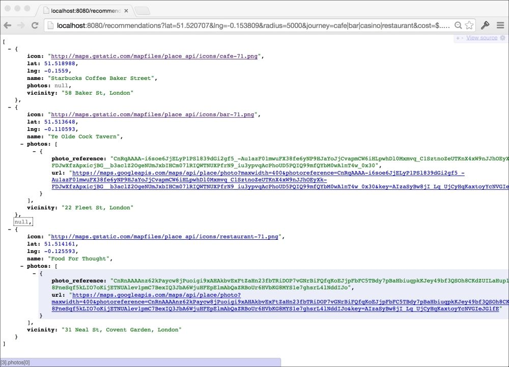

# 第七章。随机推荐网络服务

这个项目的概念是简单的：我们希望用户能够根据我们将通过 API 公开的预定义旅行类型，在特定地理位置生成随机推荐的活动。我们将给我们的项目起名为 Meander。

在现实世界的项目中，你通常需要负责整个技术栈；有人建立网站，另一个人可能编写 iOS 应用，也许外包公司建立桌面版本。在更成功的 API 项目中，你甚至可能不知道你的 API 的消费者是谁，特别是如果它是一个公共 API。

在本章中，我们将通过与虚构合作伙伴事先设计和达成最小 API 设计来模拟这一现实，然后再实施 API。一旦我们完成了项目的一部分，我们将下载由我们的队友构建的用户界面，看看它们如何一起工作，产生最终的应用程序。

在本章中，你将：

+   学会使用简短而简单的敏捷用户故事来表达项目的一般目标

+   发现你可以通过达成 API 设计来约定项目的会议点，这样可以让许多人并行工作。

+   看看早期版本的代码实际上可以在代码中编写数据固定装置并编译到程序中，这样我们可以稍后更改实现而不触及接口

+   学习一种策略，允许结构体（和其他类型）代表它们的公共版本，以便在我们想要隐藏或转换内部表示时使用

+   学会使用嵌入结构体来表示嵌套数据，同时保持我们类型的接口简单

+   学会使用`http.Get`来进行外部 API 请求，特别是 Google Places API，而不会有代码膨胀

+   学会在 Go 中有效地实现枚举器，尽管它们实际上不是一种语言特性

+   体验 TDD 的真实例子

+   看看`math/rand`包如何轻松地从切片中随机选择一个项目

+   学会从`http.Request`类型的 URL 参数中轻松获取数据

# 项目概述

遵循敏捷方法，让我们写两个用户故事来描述我们项目的功能。用户故事不应该是描述应用程序整套功能的全面文档；小卡片不仅适合描述用户试图做什么，还适合描述为什么。此外，我们应该在不试图事先设计整个系统或深入实现细节的情况下完成这一点。

首先，我们需要一个关于看到我们的用户可以选择的不同旅行类型的故事：

| **作为** | 旅行者 |
| --- | --- |
| **我想** | 看到我可以获得推荐的不同旅行类型 |
| **以便** | 我可以决定带我的伴侣去哪种类型的晚上 |

其次，我们需要一个关于为选定的旅行类型提供随机推荐的故事：

| **作为** | 旅行者 |
| --- | --- |
| **我想** | 看到我选择的旅行类型的随机推荐 |
| **以便** | 我知道去哪里，晚上会是什么样子 |

这两个故事代表了我们的 API 需要提供的两个核心功能，并最终代表了两个端点。

为了发现指定位置周围的地方，我们将使用 Google Places API，它允许我们搜索具有给定类型的企业列表，比如`酒吧`，`咖啡馆`或`电影院`。然后我们将使用 Go 的`math/rand`包随机选择这些地方，为我们的用户建立完整的旅程。

### 提示

Google Places API 支持许多业务类型；请参阅[`developers.google.com/places/documentation/supported_types`](https://developers.google.com/places/documentation/supported_types)获取完整列表。

## 项目设计细节

为了将我们的故事转化为一个交互式应用程序，我们将提供两个 JSON 端点；一个用于提供用户可以在应用程序中选择的旅程类型，另一个用于实际生成所选旅程类型的随机推荐。

```go
GET /journeys
```

上述调用应返回以下列表：

```go
[
  {
    name: "Romantic",
    journey: "park|bar|movie_theater|restaurant|florist"
  },
  {
    name: "Shopping",
    journey: "department_store|clothing_store|jewelry_store"
  }
]
```

`name`字段是应用程序生成的推荐类型的可读标签，`journey`字段是支持的旅程类型的管道分隔列表。我们将传递旅程值作为 URL 参数到我们的另一个端点，该端点生成实际的推荐：

```go
GET /recommendations?
     lat=1&lng=2&journey=bar|cafe&radius=10&cost=$...$$$$$
```

这个端点负责查询 Google Places API 并在返回地点对象数组之前生成推荐。我们将使用 URL 中的参数来控制查询的类型，根据 HTTP 规范。`lat`和`lng`参数分别表示纬度和经度，告诉我们的 API 我们想要从世界的哪个地方获得推荐，`radius`参数表示我们感兴趣的点周围的米数距离。`cost`值是表示 API 返回的地点价格范围的一种可读方式。它由两个值组成：用三个点分隔的较低和较高范围。美元符号的数量表示价格水平，`$`是最实惠的，`$$$$$`是最昂贵的。使用这种模式，`$...$$`的值将表示非常低成本的推荐，而`$$$$...$$$$$`将表示相当昂贵的体验。

### 提示

一些程序员可能会坚持用数值表示成本范围，但由于我们的 API 将被人们使用，为什么不让事情变得更有趣呢？

对于这个调用的示例负载可能看起来像这样：

```go
[
  {
    icon: "http://maps.gstatic.com/mapfiles/place_api/icons/cafe-71.png",
    lat: 51.519583, lng: -0.146251,
    vicinity: "63 New Cavendish St, London",
    name: "Asia House",
    photos: [{
      url: "https://maps.googleapis.com/maps/api/place/photo?maxwidth=400&photoreference=CnRnAAAAyLRN"
     }]
  }, ...
]
```

返回的数组包含代表旅程中每个段的随机推荐的地点对象，按适当的顺序。上面的示例是伦敦的一家咖啡馆。数据字段相当不言自明；`lat`和`lng`字段表示地点的位置（它们是纬度和经度的缩写），`name`和`vicinity`字段告诉我们业务是什么和在哪里，`photos`数组给出了来自 Google 服务器的相关照片列表。`vicinity`和`icon`字段将帮助我们为用户提供更丰富的体验。

# 在代码中表示数据

我们首先要公开用户可以选择的旅程，因此在`GOPATH`中创建一个名为`meander`的新文件夹，并添加以下`journeys.go`代码：

```go
package meander
type j struct {
  Name       string
  PlaceTypes []string
}
var Journeys = []interface{}{
  &j{Name: "Romantic", PlaceTypes: []string{"park", "bar", "movie_theater", "restaurant", "florist", "taxi_stand"}},
  &j{Name: "Shopping", PlaceTypes: []string{"department_store", "cafe", "clothing_store", "jewelry_store", "shoe_store"}},
  &j{Name: "Night Out", PlaceTypes: []string{"bar", "casino", "food", "bar", "night_club", "bar", "bar", "hospital"}},
  &j{Name: "Culture", PlaceTypes: []string{"museum", "cafe", "cemetery", "library", "art_gallery"}},
  &j{Name: "Pamper", PlaceTypes: []string{"hair_care", "beauty_salon", "cafe", "spa"}},
}
```

在这里，我们在`meander`包内定义了一个名为`j`的内部类型，然后我们使用它来通过在`Journeys`切片内创建它们的实例来描述旅程。这种方法是在代码中以一种超简单的方式表示数据，而不会构建对外部数据存储的依赖。

### 提示

作为额外的任务，为什么不看看您是否可以在整个过程中让`golint`保持愉快？每次添加一些代码时，运行`golint`来检查包并满足任何建议。它非常关心没有文档的导出项，因此以正确格式添加简单注释将使其保持愉快。要了解有关`golint`的更多信息，请参阅[`github.com/golang/lint`](https://github.com/golang/lint)。

当然，这可能会在以后演变成这样，甚至可能让用户创建和分享自己的旅程。由于我们通过 API 公开我们的数据，我们可以自由更改内部实现而不影响接口，因此这种方法非常适合 1.0 版本。

### 提示

我们使用`[]interface{}`类型的切片，因为我们将稍后实现一种通用的方式来公开公共数据，而不考虑实际类型。

一次浪漫的旅程包括首先访问公园，然后是酒吧，电影院，然后是餐厅，然后是花店，最后是乘坐出租车回家；你可以得到一个大致的想法。随意发挥创意，并通过查阅 Google Places API 中支持的类型来添加其他类型。

您可能已经注意到，由于我们将代码包含在名为`meander`（而不是`main`）的包中，我们的代码永远无法像我们迄今为止编写的其他 API 一样作为工具运行。在`meander`内创建一个名为`cmd`的新文件夹；这将容纳通过 HTTP 端点公开`meander`包功能的实际命令行工具。

在`cmd`文件夹中，将以下代码添加到`main.go`文件中：

```go
package main
func main() {
  runtime.GOMAXPROCS(runtime.NumCPU())
  //meander.APIKey = "TODO"
  http.HandleFunc("/journeys", func(w http.ResponseWriter, r *http.Request) {
    respond(w, r, meander.Journeys)
  })
  http.ListenAndServe(":8080", http.DefaultServeMux)
}
func respond(w http.ResponseWriter, r *http.Request, data []interface{}) error {
  return json.NewEncoder(w).Encode(data)
}
```

您会认出这是一个简单的 API 端点程序，映射到`/journeys`端点。

### 提示

您将不得不导入`encoding/json`，`net/http`和`runtime`包，以及您之前创建的`meander`包。

`runtime.GOMAXPROCS`调用设置了我们的程序可以使用的 CPU 的最大数量，并告诉它使用所有 CPU。然后我们在`meander`包中设置了`APIKey`的值（目前已注释掉，因为我们还没有实现它），然后在`net/http`包上调用熟悉的`HandleFunc`函数来绑定我们的端点，然后只是响应`meander.Journeys`变量。我们从上一章借用了抽象响应的概念，提供了一个`respond`函数，将指定的数据编码到`http.ResponseWriter`类型中。

让我们通过在终端中导航到`cmd`文件夹并使用`go run`来运行我们的 API 程序。在这个阶段，我们不需要将其构建成可执行文件，因为它只是一个单独的文件：

```go

go run main.go 

```

访问`http://localhost:8080/journeys`端点，注意我们提供的`Journeys`数据负载，它看起来像这样：

```go
[{
  Name: "Romantic",
  PlaceTypes: [
    "park",
    "bar",
    "movie_theater",
    "restaurant",
    "florist",
    "taxi_stand"
  ]
}]
```

这是完全可以接受的，但有一个主要缺陷：它暴露了我们实现的内部信息。如果我们将`PlaceTypes`字段名称更改为`Types`，我们的 API 将发生变化，我们应该避免这种情况。

项目随着时间的推移会不断发展和变化，尤其是成功的项目，作为开发人员，我们应该尽力保护我们的客户免受演变的影响。抽象接口是实现这一点的好方法，以及拥有数据对象的公共视图的所有权。

## Go 结构体的公共视图

为了控制 Go 中结构体的公共视图，我们需要发明一种方法，允许单独的`journey`类型告诉我们它们希望如何暴露。在`meander`文件夹中，创建一个名为`public.go`的新文件，并添加以下代码：

```go
package meander
type Facade interface {
  Public() interface{}
}
func Public(o interface{}) interface{} {
  if p, ok := o.(Facade); ok {
    return p.Public()
  }
  return o
}
```

`Facade`接口公开了一个`Public`方法，该方法将返回结构体的公共视图。`Public`函数接受任何对象并检查它是否实现了`Facade`接口（它是否有一个`Public() interface{}`方法？）；如果实现了，就调用该方法并返回结果，否则就原样返回对象。这允许我们在将结果写入`ResponseWriter`对象之前通过`Public`函数传递任何内容，从而允许单独的结构体控制它们的公共外观。

让我们通过在`journeys.go`中添加以下代码来为我们的`j`类型实现一个`Public`方法：

```go
func (j *j) Public() interface{} {
  return map[string]interface{}{
    "name":    j.Name,
    "journey": strings.Join(j.PlaceTypes, "|"),
  }
}
```

我们的`j`类型的公共视图将`PlaceTypes`字段连接成一个由管道字符分隔的字符串，按照我们的 API 设计。

回到`cmd/main.go`，用使用我们的新`Public`函数替换`respond`方法：

```go
func respond(w http.ResponseWriter, r *http.Request, data []interface{}) error {
  publicData := make([]interface{}, len(data))
  for i, d := range data {
    publicData[i] = meander.Public(d)
  }
  return json.NewEncoder(w).Encode(publicData)
}
```

在这里，我们遍历数据切片，为每个项目调用`meander.Public`函数，将结果构建到一个相同大小的新切片中。对于我们的`j`类型，它的`Public`方法将被调用以提供数据的公共视图，而不是默认视图。在终端中，再次导航到`cmd`文件夹，并在运行`http://localhost:8080/journeys`之前再次运行`go run main.go`。注意，相同的数据现在已更改为新结构：

```go
[{
  journey: "park|bar|movie_theater|restaurant|florist|taxi_stand",
  name: "Romantic"
}, ...]
```

# 生成随机推荐

为了获取我们的代码将随机构建推荐的地点，我们需要查询 Google Places API。在`meander`文件夹中，添加以下`query.go`文件：

```go
package meander
type Place struct {
  *googleGeometry `json:"geometry"`
  Name            string         `json:"name"`
  Icon            string         `json:"icon"`
  Photos          []*googlePhoto `json:"photos"`
  Vicinity        string         `json:"vicinity"`
}
type googleResponse struct {
  Results []*Place `json:"results"`
}
type googleGeometry struct {
  *googleLocation `json:"location"`
}
type googleLocation struct {
  Lat float64 `json:"lat"`
  Lng float64 `json:"lng"`
}
type googlePhoto struct {
  PhotoRef string `json:"photo_reference"`
  URL      string `json:"url"`
}
```

这段代码定义了我们需要解析来自 Google Places API 的 JSON 响应的结构，以便将其转换为可用的对象。

### 提示

转到 Google Places API 文档，查看我们期望的响应示例。请参阅[`developers.google.com/places/documentation/search`](http://developers.google.com/places/documentation/search)。

大部分前面的代码都是显而易见的，但值得注意的是`Place`类型嵌入了`googleGeometry`类型，这允许我们根据 API 表示嵌套数据，同时在我们的代码中实质上将其展平。我们在`googleGeometry`内部也是这样做的，这意味着我们将能够直接在`Place`对象上访问`Lat`和`Lng`值，即使它们在技术上是嵌套在其他结构中的。

因为我们想要控制`Place`对象如何公开显示，让我们给这个类型添加以下`Public`方法：

```go
func (p *Place) Public() interface{} {
  return map[string]interface{}{
    "name":     p.Name,
    "icon":     p.Icon,
    "photos":   p.Photos,
    "vicinity": p.Vicinity,
    "lat":      p.Lat,
    "lng":      p.Lng,
  }
}
```

### 提示

记得在这段代码上运行`golint`，看看哪些注释需要添加到导出的项目中。

## Google Places API 密钥

与大多数 API 一样，我们需要一个 API 密钥才能访问远程服务。转到 Google API 控制台，使用 Google 账户登录，并为 Google Places API 创建一个密钥。有关更详细的说明，请参阅 Google 开发者网站上的文档。

一旦您获得了密钥，让我们在`meander`包中创建一个可以保存它的变量。在`query.go`的顶部，添加以下定义：

```go
var APIKey string
```

现在返回到`main.go`，从`APIKey`行中删除双斜杠`//`，并用 Google API 控制台提供的实际密钥替换`TODO`值。

## Go 中的枚举器

为了处理我们 API 的各种成本范围，使用枚举器（或**enum**）来表示各种值并处理到和从字符串表示的转换是有意义的。Go 并没有明确提供枚举器，但有一种巧妙的实现方法，我们将在本节中探讨。

Go 中编写枚举器的一个简单灵活的检查表是：

+   定义一个基于原始整数类型的新类型

+   在需要用户指定适当值之一时使用该类型

+   使用`iota`关键字在`const`块中设置值，忽略第一个零值

+   实现一个合理的字符串表示到枚举器值的映射

+   在类型上实现一个`String`方法，从映射中返回适当的字符串表示

+   实现一个`ParseType`函数，使用映射从字符串转换为您的类型

现在我们将编写一个枚举器来表示我们 API 中的成本级别。在`meander`文件夹中创建一个名为`cost_level.go`的新文件，并添加以下代码：

```go
package meander
type Cost int8
const (
  _ Cost = iota
  Cost1
  Cost2
  Cost3
  Cost4
  Cost5
)
```

在这里，我们定义了我们的枚举器的类型，我们称之为`Cost`，由于我们只需要表示一些值，所以我们基于`int8`范围进行了定义。对于我们需要更大值的枚举器，您可以自由地使用任何与`iota`一起使用的整数类型。`Cost`类型现在是一个真正的类型，我们可以在需要表示支持的值之一的地方使用它，例如，我们可以在函数的参数中指定`Cost`类型，或者将其用作结构中字段的类型。

然后，我们定义了该类型的常量列表，并使用`iota`关键字指示我们希望为常量获得递增的值。通过忽略第一个`iota`值（始终为零），我们指示必须显式使用指定的常量之一，而不是零值。

为了提供我们的枚举器的字符串表示，我们只需要为`Cost`类型添加一个`String`方法。即使您不需要在代码中使用字符串，这也是一个有用的练习，因为每当您使用 Go 标准库的打印调用（如`fmt.Println`）时，默认情况下将使用数字值。这些值通常是没有意义的，并且需要您查找它们，甚至计算每个项目的数值。

### 注意

有关 Go 中`String()`方法的更多信息，请参阅`fmt`包中的`Stringer`和`GoStringer`接口，网址为[`golang.org/pkg/fmt/#Stringer`](http://golang.org/pkg/fmt/#Stringer)。

### 测试驱动的枚举器

为了确保我们的枚举器代码正常工作，我们将编写单元测试，对预期行为进行一些断言。

在`cost_level.go`旁边，添加一个名为`cost_level_test.go`的新文件，并添加以下单元测试：

```go
package meander_test
import (
  "testing"
  "github.com/cheekybits/is"
  "path/to/meander"
)
func TestCostValues(t *testing.T) {
  is := is.New(t)
  is.Equal(int(meander.Cost1), 1)
  is.Equal(int(meander.Cost2), 2)
  is.Equal(int(meander.Cost3), 3)
  is.Equal(int(meander.Cost4), 4)
  is.Equal(int(meander.Cost5), 5)
}
```

您需要运行`go get`来获取 CheekyBits 的`is`包（从[github.com/cheekybits/is](http://github.com/cheekybits/is)）。

### 提示

`is`包是一个替代测试助手包，但这个包非常简单，故意是最基本的。在编写自己的项目时，您可以选择自己喜欢的包。

通常，我们不会担心枚举中常量的实际整数值，但由于 Google Places API 使用数字值来表示相同的事物，我们需要关心这些值。

### 注意

您可能已经注意到这个测试文件与传统不同之处。虽然它在`meander`文件夹中，但它不是`meander`包的一部分；而是在`meander_test`中。

在 Go 中，这在除了测试之外的每种情况下都是错误的。因为我们将测试代码放入自己的包中，这意味着我们不再可以访问`meander`包的内部-请注意我们必须使用包前缀。这可能看起来像一个缺点，但实际上它允许我们确保我们测试包时就像我们是真正的用户一样。我们只能调用导出的方法，并且只能看到导出的类型；就像我们的用户一样。

通过在终端中运行`go test`来运行测试，并注意它是否通过。

让我们添加另一个测试，对每个`Cost`常量的字符串表示进行断言。在`cost_level_test.go`中，添加以下单元测试：

```go
func TestCostString(t *testing.T) {
  is := is.New(t)
  is.Equal(meander.Cost1.String(), "$")
  is.Equal(meander.Cost2.String(), "$$")
  is.Equal(meander.Cost3.String(), "$$$")
  is.Equal(meander.Cost4.String(), "$$$$")
  is.Equal(meander.Cost5.String(), "$$$$$")
}
```

这个测试断言调用每个常量的`String`方法会产生预期的值。当然，运行这些测试会失败，因为我们还没有实现`String`方法。

在`Cost`常量下面，添加以下映射和`String`方法：

```go
var costStrings = map[string]Cost{
  "$":     Cost1,
  "$$":    Cost2,
  "$$$":   Cost3,
  "$$$$":  Cost4,
  "$$$$$": Cost5,
}
func (l Cost) String() string {
  for s, v := range costStrings {
    if l == v {
      return s
    }
  }
  return "invalid"
}
```

`map[string]Cost`变量将成本值映射到字符串表示形式，`String`方法遍历映射以返回适当的值。

### 提示

在我们的情况下，一个简单的返回`strings.Repeat("$", int(l))`也可以很好地工作（并且因为它是更简单的代码而胜出），但通常不会，因此本节探讨了一般方法。

现在，如果我们要打印`Cost3`的值，我们实际上会看到`$$$`，这比数字值更有用。然而，由于我们确实想在 API 中使用这些字符串，我们还将添加一个`ParseCost`方法。

在`cost_value_test.go`中，添加以下单元测试：

```go
func TestParseCost(t *testing.T) {
  is := is.New(t)
  is.Equal(meander.Cost1, meander.ParseCost("$"))
  is.Equal(meander.Cost2, meander.ParseCost("$$"))
  is.Equal(meander.Cost3, meander.ParseCost("$$$"))
  is.Equal(meander.Cost4, meander.ParseCost("$$$$"))
  is.Equal(meander.Cost5, meander.ParseCost("$$$$$"))
}
```

在这里，我们断言调用`ParseCost`实际上会根据输入字符串产生适当的值。

在`cost_value.go`中，添加以下实现代码：

```go
func ParseCost(s string) Cost {
  return costStrings[s]
}
```

解析`Cost`字符串非常简单，因为这就是我们的映射布局。

由于我们需要表示一系列成本值，让我们想象一个`CostRange`类型，并为我们打算如何使用它编写测试。将以下测试添加到`cost_value_test.go`中：

```go
func TestParseCostRange(t *testing.T) {
  is := is.New(t)
  var l *meander.CostRange
  l = meander.ParseCostRange("$$...$$$")
  is.Equal(l.From, meander.Cost2)
  is.Equal(l.To, meander.Cost3)
  l = meander.ParseCostRange("$...$$$$$")
  is.Equal(l.From, meander.Cost1)
  is.Equal(l.To, meander.Cost5)
}
func TestCostRangeString(t *testing.T) {
  is := is.New(t)
  is.Equal("$$...$$$$", (&meander.CostRange{
    From: meander.Cost2,
    To:   meander.Cost4,
  }).String())
}
```

我们指定传入一个以两个美元符号开头的字符串，然后是三个点，然后是三个美元符号，应该创建一个新的`meander.CostRange`类型，其中`From`设置为`meander.Cost2`，`To`设置为`meander.Cost3`。第二个测试通过测试`CostRange.String`方法返回适当的值来执行相反的操作。

为了使我们的测试通过，添加以下`CostRange`类型和相关的`String`和`ParseString`函数：

```go
type CostRange struct {
  From Cost
  To   Cost
}
func (r CostRange) String() string {
  return r.From.String() + "..." + r.To.String()
}
func ParseCostRange(s string) *CostRange {
  segs := strings.Split(s, "...")
  return &CostRange{
    From: ParseCost(segs[0]),
    To:   ParseCost(segs[1]),
  }
}
```

这使我们能够将诸如`$...$$$$$`之类的字符串转换为包含两个`Cost`值的结构；`From`和`To`设置，反之亦然。

## 查询 Google Places API

现在我们能够表示 API 的结果，我们需要一种方法来表示和初始化实际查询。将以下结构添加到`query.go`中：

```go
type Query struct {
  Lat          float64
  Lng          float64
  Journey      []string
  Radius       int
  CostRangeStr string
}
```

这个结构包含了我们构建查询所需的所有信息，所有这些信息实际上都来自客户端请求的 URL 参数。接下来，添加以下`find`方法，它将负责向 Google 的服务器发出实际请求：

```go
func (q *Query) find(types string) (*googleResponse, error) {
  u := "https://maps.googleapis.com/maps/api/place/nearbysearch/json"
  vals := make(url.Values)
  vals.Set("location", fmt.Sprintf("%g,%g", q.Lat, q.Lng))
  vals.Set("radius", fmt.Sprintf("%d", q.Radius))
  vals.Set("types", types)
  vals.Set("key", APIKey)
  if len(q.CostRangeStr) > 0 {
    r := ParseCostRange(q.CostRangeStr)
    vals.Set("minprice", fmt.Sprintf("%d", int(r.From)-1))
    vals.Set("maxprice", fmt.Sprintf("%d", int(r.To)-1))
  }
  res, err := http.Get(u + "?" + vals.Encode())
  if err != nil {
    return nil, err
  }
  defer res.Body.Close()
  var response googleResponse
  if err := json.NewDecoder(res.Body).Decode(&response); err != nil {
    return nil, err
  }
  return &response, nil
}
```

首先，我们按照 Google Places API 规范构建请求 URL，通过附加`url.Values`编码的`lat`、`lng`、`radius`和`APIKey`值的数据字符串。

### 注意

`url.Values`类型实际上是`map[string][]string`类型，这就是为什么我们使用`make`而不是`new`。

我们指定的`types`值作为参数表示要查找的业务类型。如果有`CostRangeStr`，我们解析它并设置`minprice`和`maxprice`值，最后调用`http.Get`来实际发出请求。如果请求成功，我们推迟关闭响应主体，并使用`json.Decoder`方法将从 API 返回的 JSON 解码为我们的`googleResponse`类型。

## 建立推荐

接下来，我们需要编写一个方法，允许我们对不同旅程步骤进行多次调用。在`find`方法下面，添加以下`Run`方法到`Query`结构：

```go
// Run runs the query concurrently, and returns the results.
func (q *Query) Run() []interface{} {
  rand.Seed(time.Now().UnixNano())
  var w sync.WaitGroup
  var l sync.Mutex
  places := make([]interface{}, len(q.Journey))
  for i, r := range q.Journey {
    w.Add(1)
    go func(types string, i int) {
      defer w.Done()
      response, err := q.find(types)
      if err != nil {
        log.Println("Failed to find places:", err)
        return
      }
      if len(response.Results) == 0 {
        log.Println("No places found for", types)
        return
      }
      for _, result := range response.Results {
        for _, photo := range result.Photos {
          photo.URL = "https://maps.googleapis.com/maps/api/place/photo?" +
            "maxwidth=1000&photoreference=" + photo.PhotoRef + "&key=" + APIKey
        }
      }
      randI := rand.Intn(len(response.Results))
      l.Lock()
      places[i] = response.Results[randI]
      l.Unlock()
    }(r, i)
  }
  w.Wait() // wait for everything to finish
  return places
}
```

我们首先将随机种子设置为自 1970 年 1 月 1 日 UTC 以来的纳秒时间。这确保每次我们调用`Run`方法并使用`rand`包时，结果都会不同。如果我们不这样做，我们的代码将每次都建议相同的推荐，这就失去了意义。

由于我们需要向 Google 发出许多请求，并且希望尽快完成，我们将通过并发调用我们的`Query.find`方法同时运行所有查询。因此，我们接下来创建一个`sync.WaitGroup`方法，并创建一个地图来保存选定的地点以及一个`sync.Mutex`方法，以允许许多 go 例程同时访问地图。

然后，我们迭代`Journey`切片中的每个项目，可能是`bar`、`cafe`、`movie_theater`。对于每个项目，我们向`WaitGroup`对象添加`1`，并调用一个 goroutine。在例程内部，我们首先推迟`w.Done`调用，通知`WaitGroup`对象该请求已完成，然后调用我们的`find`方法进行实际请求。假设没有发生错误，并且确实能够找到一些地方，我们会遍历结果并构建出可用于任何可能存在的照片的 URL。根据 Google Places API，我们会得到一个`photoreference`键，我们可以在另一个 API 调用中使用它来获取实际的图像。为了使我们的客户不必完全了解 Google Places API，我们为他们构建完整的 URL。

然后我们锁定地图锁，并通过调用`rand.Intn`随机选择其中一个选项，并将其插入到`places`切片的正确位置，然后解锁`sync.Mutex`方法。

最后，我们等待所有 goroutine 完成，通过调用`w.Wait`，然后返回地点。

## 使用查询参数的处理程序

现在我们需要连接我们的`/recommendations`调用，因此返回`cmd`文件夹中的`main.go`，并在`main`函数内添加以下代码：

```go
http.HandleFunc("/recommendations", func(w http.ResponseWriter, r *http.Request) {
  q := &meander.Query{
    Journey: strings.Split(r.URL.Query().Get("journey"), "|"),
  }
  q.Lat, _ = strconv.ParseFloat(r.URL.Query().Get("lat"), 64)
  q.Lng, _ = strconv.ParseFloat(r.URL.Query().Get("lng"), 64)
  q.Radius, _ = strconv.Atoi(r.URL.Query().Get("radius"))
  q.CostRangeStr = r.URL.Query().Get("cost")
  places := q.Run()
  respond(w, r, places)
})
```

这个处理程序负责准备`meander.Query`对象并调用其`Run`方法，然后用结果进行响应。`http.Request`类型的 URL 值公开了提供`Get`方法的`Query`数据，该方法反过来查找给定键的值。

旅程字符串是从`bar|cafe|movie_theater`格式转换为字符串切片，通过在管道字符上进行分割。然后，对`strconv`包中的函数进行几次调用，将字符串纬度、经度和半径值转换为数值类型。

## CORS

我们的 API 第一个版本的最后一部分将是实现 CORS，就像我们在上一章中所做的那样。在阅读下一节中的解决方案之前，看看你能否自己解决这个问题。

### 提示

如果您要自己解决这个问题，请记住，您的目标是将`Access-Control-Allow-Origin`响应标头设置为`*`。还考虑我们在上一章中所做的`http.HandlerFunc`包装。这段代码的最佳位置可能是在`cmd`程序中，因为它通过 HTTP 端点公开了功能。

在`main.go`中，添加以下`cors`函数：

```go
func cors(f http.HandlerFunc) http.HandlerFunc {
  return func(w http.ResponseWriter, r *http.Request) {
    w.Header().Set("Access-Control-Allow-Origin", "*")
    f(w, r)
  }
}
```

这种熟悉的模式接受一个`http.HandlerFunc`类型，并返回一个在调用传入的函数之前设置适当标头的新函数。现在我们可以修改我们的代码，以确保`cors`函数被调用我们的两个端点。更新`main`函数中的适当行：

```go
func main() {
  runtime.GOMAXPROCS(runtime.NumCPU())
  meander.APIKey = "YOUR_API_KEY"
  http.HandleFunc("/journeys", cors(func(w http.ResponseWriter, r *http.Request) {
    respond(w, r, meander.Journeys)
  }))
  http.HandleFunc("/recommendations", cors(func(w http.ResponseWriter, r *http.Request) {
    q := &meander.Query{
      Journey: strings.Split(r.URL.Query().Get("journey"), "|"),
    }
    q.Lat, _ = strconv.ParseFloat(r.URL.Query().Get("lat"), 64)
    q.Lng, _ = strconv.ParseFloat(r.URL.Query().Get("lng"), 64)
    q.Radius, _ = strconv.Atoi(r.URL.Query().Get("radius"))
    q.CostRangeStr = r.URL.Query().Get("cost")
    places := q.Run()
    respond(w, r, places)
  }))
  http.ListenAndServe(":8080", http.DefaultServeMux)
}
```

现在对我们的 API 的调用将允许来自任何域的调用，而不会发生跨域错误。

## 测试我们的 API

现在我们准备测试我们的 API，前往控制台并导航到`cmd`文件夹。因为我们的程序导入了`meander`包，构建程序将自动构建我们的`meander`包。

构建并运行程序：

```go

go build –o meanderapi

./meanderapi

```

为了从我们的 API 中看到有意义的结果，让我们花一分钟找到您实际的纬度和经度。转到[`mygeoposition.com/`](http://mygeoposition.com/)并使用 Web 工具获取您熟悉的位置的`x,y`值。

或者从这些热门城市中选择：

+   英格兰伦敦：`51.520707 x 0.153809`

+   美国纽约：`40.7127840 x -74.0059410`

+   日本东京：`35.6894870 x 139.6917060`

+   美国旧金山：`37.7749290 x -122.4194160`

现在打开一个 Web 浏览器，并使用一些适当的值访问`/recommendations`端点：

```go
http://localhost:8080/recommendations?
  lat=51.520707&lng=-0.153809&radius=5000&
  journey=cafe|bar|casino|restaurant&
  cost=$...$$$
```

以下屏幕截图显示了伦敦周围的一个示例推荐的样子：



随意在 URL 中玩弄值，尝试不同的旅程字符串，调整位置，并尝试不同的成本范围值字符串，以查看简单 API 的强大之处。

### Web 应用程序

我们将下载一个完整的 Web 应用程序，该应用程序构建到相同的 API 规范，并将其指向我们的实现，以便在我们眼前看到它变得生动。转到[`github.com/matryer/goblueprints/tree/master/chapter7/meanderweb`](https://github.com/matryer/goblueprints/tree/master/chapter7/meanderweb)并将`meanderweb`项目下载到您的`GOPATH`中。

在终端中，导航到`meanderweb`文件夹，并构建和运行它：

```go

go build –o meanderweb

./meanderweb

```

这将启动一个在`localhost:8081`上运行的网站，它被硬编码为查找在`localhost:8080`上运行的 API。因为我们添加了 CORS 支持，尽管它们在不同的域上运行，这不会成为问题。

打开浏览器，访问`http://localhost:8081/`并与应用程序交互，虽然其他人构建了 UI，但没有我们构建的 API 支持它将会非常无用。

# 摘要

在本章中，我们构建了一个 API，它消耗和抽象了 Google Places API，以提供一个有趣而有趣的方式让用户规划他们的白天和夜晚。

我们开始写一些简单而简短的用户故事，以高层次描述我们想要实现的目标，而不是试图提前设计实现。为了并行化项目，我们同意将项目的会议点作为 API 设计，并朝着这个目标构建（就像我们的合作伙伴一样）。

我们直接在代码中嵌入数据，避免在项目的早期阶段进行数据存储的调查、设计和实施。我们关心的是数据如何被访问（通过 API 端点），这样我们就可以完全改变数据存储的方式和位置，而不会影响到已经编写为我们的 API 的应用程序。

我们实现了`Facade`接口，允许我们的结构体和其他类型提供它们的公共表示，而不会透露关于我们实现的混乱或敏感细节。

我们对枚举器的探索为我们提供了一个有用的起点，用于构建枚举类型，尽管语言中没有官方支持。我们使用的`iota`关键字让我们能够指定我们自己的数值类型的常量，并递增值。我们实现的常见`String`方法向我们展示了如何确保我们的枚举类型不会成为日志中的晦涩数字。与此同时，我们还看到了 TDD 的一个现实例子，以及红/绿编程，我们首先编写会失败的单元测试，然后通过编写实现代码使其通过。

# 读累了记得休息一会哦~

**公众号：古德猫宁李**

+   电子书搜索下载

+   书单分享

+   书友学习交流

**网站：**[沉金书屋 https://www.chenjin5.com](https://www.chenjin5.com)

+   电子书搜索下载

+   电子书打包资源分享

+   学习资源分享
