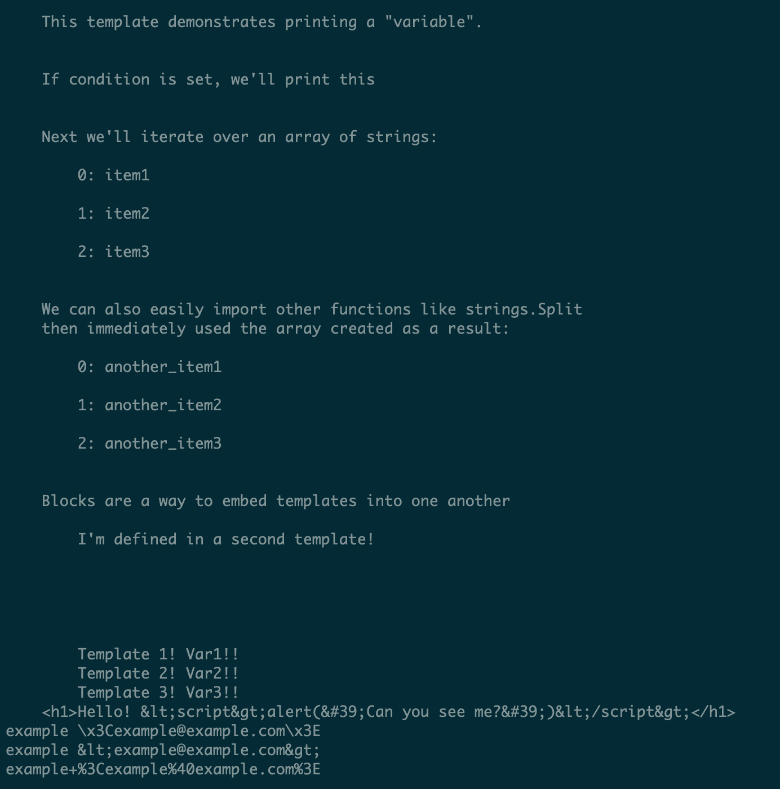

# I/O 和文件系统

Go 提供了对基本和复杂 I/O 的出色支持。本章中的配方将探讨用于处理 I/O 的常见 Go 接口，并向您展示如何使用它们。Go 标准库经常使用这些接口，并且它们将被本书中的配方使用。

您将学习如何处理内存中的数据和流式数据。您将看到有关处理文件、目录和 CSV 格式的示例。临时文件配方介绍了一种处理文件的机制，而无需处理名称冲突等开销。最后，我们将探讨 Go 标准模板，包括纯文本和 HTML。

这些配方应该为使用接口来表示和修改数据奠定基础，并应该帮助您以抽象和灵活的方式思考数据。

在本章中，将介绍以下配方：

+   使用常见的 I/O 接口

+   使用 bytes 和 strings 包

+   处理目录和文件

+   处理 CSV 格式

+   使用临时文件

+   使用 text/template 和 html/template

# 技术要求

为了继续本章中的所有配方，请根据以下步骤配置您的环境：

1.  在您的操作系统上下载并安装 Go 1.12.6 或更高版本，网址为[`golang.org/doc/install`](https://golang.org/doc/install)。

1.  打开终端或控制台应用程序，并创建并转到一个项目目录，例如`~/projects/go-programming-cookbook`。所有代码将从该目录运行和修改。

1.  将最新的代码克隆到`~/projects/go-programming-cookbook-original`中，如下所示。建议您从该目录中工作，而不是手动输入示例：

```go
$ git clone git@github.com:PacktPublishing/Go-Programming-Cookbook-Second-Edition.git go-programming-cookbook-original
```

# 使用常见的 I/O 接口

Go 语言提供了许多 I/O 接口，这些接口在整个标准库中使用。最佳实践是尽可能使用这些接口，而不是直接传递结构或其他类型。我们将在本配方中探讨的两个强大接口是`io.Reader`和`io.Writer`接口。这些接口在整个标准库中使用，了解如何使用它们将使您成为更好的 Go 开发人员。

`Reader`和`Writer`接口如下所示：

```go
type Reader interface {
        Read(p []byte) (n int, err error)
}

type Writer interface {
        Write(p []byte) (n int, err error)
}
```

Go 还可以轻松地组合接口。例如，看一下以下代码：

```go
type Seeker interface {
        Seek(offset int64, whence int) (int64, error)
}

type ReadSeeker interface {
        Reader
        Seeker
}
```

本配方还将探讨一个名为`Pipe()`的`io`函数，如下所示：

```go
func Pipe() (*PipeReader, *PipeWriter)
```

本书的其余部分将使用这些接口。

# 如何做...

以下步骤涵盖了如何编写和运行您的应用程序：

1.  从您的终端或控制台应用程序中，创建一个名为`~/projects/go-programming-cookbook/chapter1/interfaces`的新目录。

1.  转到此目录。

1.  运行以下命令：

```go
$ go mod init github.com/PacktPublishing/Go-Programming-Cookbook-Second-Edition/chapter1/interfaces 
```

您应该会看到一个名为`go.mod`的文件，其中包含以下内容：

```go
module github.com/PacktPublishing/Go-Programming-Cookbook-Second-Edition/chapter1/interfaces    
```

1.  从`~/projects/go-programming-cookbook-original/chapter1/interfaces`复制测试，或者使用这个作为练习来编写一些您自己的代码！

1.  创建一个名为`interfaces.go`的文件，内容如下：

```go
        package interfaces

        import (
                "fmt"
                "io"
                "os"
        )

        // Copy copies data from in to out first directly,
        // then using a buffer. It also writes to stdout
        func Copy(in io.ReadSeeker, out io.Writer) error {
                // we write to out, but also Stdout
                w := io.MultiWriter(out, os.Stdout)

                // a standard copy, this can be dangerous if there's a 
                // lot of data in in
                if _, err := io.Copy(w, in); err != nil {
                    return err
                }

                in.Seek(0, 0)

                // buffered write using 64 byte chunks
                buf := make([]byte, 64)
                if _, err := io.CopyBuffer(w, in, buf); err != nil {
                    return err
                }

                // lets print a new line
                fmt.Println()

                return nil
        }
```

1.  创建一个名为`pipes.go`的文件，内容如下：

```go
        package interfaces

        import (
                "io"
                "os"
        )

        // PipeExample helps give some more examples of using io  
        //interfaces
        func PipeExample() error {
                // the pipe reader and pipe writer implement
                // io.Reader and io.Writer
                r, w := io.Pipe()

                // this needs to be run in a separate go routine
                // as it will block waiting for the reader
                // close at the end for cleanup
                go func() {
                    // for now we'll write something basic,
                    // this could also be used to encode json
                    // base64 encode, etc.
                    w.Write([]byte("test\n"))
                    w.Close()
                }()

                if _, err := io.Copy(os.Stdout, r); err != nil {
                    return err
                }
                return nil
        }
```

1.  创建一个名为`example`的新目录并进入该目录。

1.  创建一个名为`main.go`的文件，内容如下：

```go
        package main

        import (
             "bytes"
             "fmt"

             "github.com/PacktPublishing/
              Go-Programming-Cookbook-Second-Edition/
              chapter1/bytestrings"
        )

        func main() {
                in := bytes.NewReader([]byte("example"))
                out := &bytes.Buffer{}
                fmt.Print("stdout on Copy = ")
                if err := interfaces.Copy(in, out); err != nil {
                        panic(err)
                }

                fmt.Println("out bytes buffer =", out.String())

                fmt.Print("stdout on PipeExample = ")
                if err := interfaces.PipeExample(); err != nil {
                        panic(err)
                }
        }
```

1.  运行`go run .`。

1.  您也可以运行以下命令：

```go
$ go build $ ./example
```

您应该会看到以下输出：

```go
$ go run .
stdout on Copy = exampleexample
out bytes buffer = exampleexample
stdout on PipeExample = test
```

1.  如果您复制或编写了自己的测试，请返回上一级目录并运行`go test`，确保所有测试都通过。

# 它是如何工作的...

`Copy()`函数在接口之间复制字节，并将该数据视为流。将数据视为流在许多实际用途中非常有用，特别是在处理网络流量或文件系统时。`Copy()`函数还创建了一个`MultiWriter`接口，它将两个写入流组合在一起，并使用`ReadSeeker`两次写入它们。如果使用了`Reader`接口，而不是看到`exampleexample`，您只会看到`example`，尽管将数据复制到`MultiWriter`接口两次。如果您的流无法适应内存，还可以使用缓冲写入。

`PipeReader`和`PipeWriter`结构实现了`io.Reader`和`io.Writer`接口。它们连接在一起，创建一个内存管道。管道的主要目的是从流中读取数据，同时将相同流中的数据写入到不同的源。本质上，它将两个流合并成一个管道。

Go 接口是一种干净的抽象，用于包装执行常见操作的数据。这在进行 I/O 操作时变得明显，因此`io`包是学习接口组合的一个很好的资源。`pipe`包通常被低估，但在链接输入和输出流时提供了很大的灵活性和线程安全性。

# 使用`bytes`和`strings`包

`bytes`和`strings`包提供了许多有用的辅助函数，用于处理和转换字符串和字节类型的数据。它们允许创建与许多常见 I/O 接口一起使用的缓冲区。

# 如何做...

以下步骤涵盖了如何编写和运行您的应用程序：

1.  从您的终端或控制台应用程序中，创建一个名为`~/projects/go-programming-cookbook/chapter1/bytestrings`的新目录。

1.  导航到此目录。

1.  运行以下命令：

```go
$ go mod init github.com/PacktPublishing/Go-Programming-Cookbook-Second-Edition/chapter1/bytestrings 
```

您应该看到一个名为`go.mod`的文件，其中包含以下内容：

```go
module github.com/PacktPublishing/Go-Programming-Cookbook-Second-Edition/chapter1/bytestrings    
```

1.  从`~/projects/go-programming-cookbook-original/chapter1/bytestrings`复制测试，或者将其用作练习编写一些自己的代码！

1.  创建一个名为`buffer.go`的文件，其中包含以下内容：

```go
        package bytestrings

        import (
                "bytes"
                "io"
                "io/ioutil"
        )

        // Buffer demonstrates some tricks for initializing bytes    
        //Buffers
        // These buffers implement an io.Reader interface
        func Buffer(rawString string) *bytes.Buffer {

                // we'll start with a string encoded into raw bytes
                rawBytes := []byte(rawString)

                // there are a number of ways to create a buffer from 
                // the raw bytes or from the original string
                var b = new(bytes.Buffer)
                b.Write(rawBytes)

                // alternatively
                b = bytes.NewBuffer(rawBytes)

                // and avoiding the initial byte array altogether
                b = bytes.NewBufferString(rawString)

                return b
        }

        // ToString is an example of taking an io.Reader and consuming 
        // it all, then returning a string
        func toString(r io.Reader) (string, error) {
                b, err := ioutil.ReadAll(r)
                if err != nil {
                    return "", err
                }
                return string(b), nil
        }
```

1.  创建一个名为`bytes.go`的文件，其中包含以下内容：

```go
        package bytestrings

        import (
                "bufio"
                "bytes"
                "fmt"
        )

        // WorkWithBuffer will make use of the buffer created by the
        // Buffer function
        func WorkWithBuffer() error {
                rawString := "it's easy to encode unicode into a byte 
                              array"

                b := Buffer(rawString)

                // we can quickly convert a buffer back into byes with
                // b.Bytes() or a string with b.String()
                fmt.Println(b.String())

                // because this is an io Reader we can make use of  
                // generic io reader functions such as
                s, err := toString(b)
                if err != nil {
                    return err
                }
                fmt.Println(s)

                // we can also take our bytes and create a bytes reader
                // these readers implement io.Reader, io.ReaderAt, 
                // io.WriterTo, io.Seeker, io.ByteScanner, and 
                // io.RuneScanner interfaces
                reader := bytes.NewReader([]byte(rawString))

                // we can also plug it into a scanner that allows 
                // buffered reading and tokenzation
                scanner := bufio.NewScanner(reader)
                scanner.Split(bufio.ScanWords)

                // iterate over all of the scan events
                for scanner.Scan() {
                    fmt.Print(scanner.Text())
                }

                return nil
        }
```

1.  创建一个名为`string.go`的文件，其中包含以下内容：

```go
        package bytestrings

        import (
                "fmt"
                "io"
                "os"
                "strings"
        )

        // SearchString shows a number of methods
        // for searching a string
        func SearchString() {
                s := "this is a test"

                // returns true because s contains
                // the word this
                fmt.Println(strings.Contains(s, "this"))

                // returns true because s contains the letter a
                // would also match if it contained b or c
                fmt.Println(strings.ContainsAny(s, "abc"))

                // returns true because s starts with this
                fmt.Println(strings.HasPrefix(s, "this"))

                // returns true because s ends with this
                fmt.Println(strings.HasSuffix(s, "test"))
                }

        // ModifyString modifies a string in a number of ways
        func ModifyString() {
                s := "simple string"

                // prints [simple string]
                fmt.Println(strings.Split(s, " "))

                // prints "Simple String"
                fmt.Println(strings.Title(s))

                // prints "simple string"; all trailing and
                // leading white space is removed
                s = " simple string "
                fmt.Println(strings.TrimSpace(s))
        }

        // StringReader demonstrates how to create
        // an io.Reader interface quickly with a string
        func StringReader() {
                s := "simple stringn"
                r := strings.NewReader(s)

                // prints s on Stdout
                io.Copy(os.Stdout, r)
        }
```

1.  创建一个名为`example`的新目录，并导航到该目录。

1.  创建一个名为`main.go`的文件，其中包含以下内容：

```go
        package main

        import "github.com/PacktPublishing/
                Go-Programming-Cookbook-Second-Edition/
                chapter1/bytestrings"

        func main() {
                err := bytestrings.WorkWithBuffer()
                if err != nil {
                        panic(err)
                }

                // each of these print to stdout
                bytestrings.SearchString()
                bytestrings.ModifyString()
                bytestrings.StringReader() 
        }
```

1.  运行`go run .`。

1.  您还可以运行以下命令：

```go
$ go build $ ./example
```

您应该看到以下输出：

```go
$ go run .
it's easy to encode unicode into a byte array ??
it's easy to encode unicode into a byte array ??
it'seasytoencodeunicodeintoabytearray??true
true
true
true
[simple string]
Simple String
simple string
simple string
```

1.  如果您复制或编写了自己的测试，请返回上一级目录并运行`go test`，确保所有测试都通过。

# 它是如何工作的...

`bytes`库在处理数据时提供了许多便利函数。例如，与字节数组相比，缓冲区在处理流处理库或方法时更加灵活。创建缓冲区后，它可以用于满足`io.Reader`接口，以便您可以利用`ioutil`函数来操作数据。对于流应用程序，您可能希望使用缓冲区和扫描器。`bufio`包在这些情况下非常有用。有时，对于较小的数据集或者在计算机上有大量内存时，使用数组或切片更为合适。

在使用这些基本类型时，Go 在转换数据之间的接口方面提供了很大的灵活性——在字符串和字节之间进行转换相对简单。在处理字符串时，`strings`包提供了许多便利函数，用于处理、搜索和操作字符串。在某些情况下，一个良好的正则表达式可能是合适的，但大多数情况下，`strings`和`strconv`包就足够了。`strings`包允许您将字符串看起来像标题，将其拆分为数组，或修剪空白。它还提供了自己的`Reader`接口，可以用于代替`bytes`包的读取器类型。

# 处理目录和文件

在切换平台（例如 Windows 和 Linux）时，处理目录和文件可能会很困难。Go 在`os`和`ioutils`包中提供了跨平台支持，以处理文件和目录。我们已经看到了`ioutils`的示例，现在我们将探讨如何以另一种方式使用它们！

# 如何做...

以下步骤涵盖了如何编写和运行您的应用程序：

1.  从您的终端或控制台应用程序中，创建一个名为`~/projects/go-programming-cookbook/chapter1/filedirs`的新目录。

1.  进入此目录。

1.  运行以下命令：

```go
$ go mod init github.com/PacktPublishing/Go-Programming-Cookbook-Second-Edition/chapter1/filedirs 
```

您应该看到一个名为`go.mod`的文件，其中包含以下内容：

```go
module github.com/PacktPublishing/Go-Programming-Cookbook-Second-Edition/chapter1/filedirs    
```

1.  从`~/projects/go-programming-cookbook-original/chapter1/filedirs`复制测试，或者利用这个机会编写一些您自己的代码！

1.  创建一个名为`dirs.go`的文件，其中包含以下内容：

```go
        package filedirs

        import (
                "errors"
                "io"
                "os"
        )

        // Operate manipulates files and directories
        func Operate() error {
                // this 0755 is similar to what you'd see with Chown
                // on a command line this will create a director 
                // /tmp/example, you may also use an absolute path 
                // instead of a relative one
                if err := os.Mkdir("example_dir", os.FileMode(0755)); 
                err !=  nil {
                        return err
                }

                // go to the /tmp directory
                if err := os.Chdir("example_dir"); err != nil {
                        return err
                }

                // f is a generic file object
                // it also implements multiple interfaces
                // and can be used as a reader or writer
                // if the correct bits are set when opening
                f, err := os.Create("test.txt")
                if err != nil {
                        return err
                }

                // we write a known-length value to the file and 
                // validate that it wrote correctly
                value := []byte("hellon")
                count, err := f.Write(value)
                if err != nil {
                        return err
                }
                if count != len(value) {
                        return errors.New("incorrect length returned 
                        from write")
                }

                if err := f.Close(); err != nil {
                        return err
                }

                // read the file
                f, err = os.Open("test.txt")
                if err != nil {
                        return err
                }

                io.Copy(os.Stdout, f)

                if err := f.Close(); err != nil {
                        return err
                }

                // go to the /tmp directory
                if err := os.Chdir(".."); err != nil {
                        return err
                }

                // cleanup, os.RemoveAll can be dangerous if you
                // point at the wrong directory, use user input,
                // and especially if you run as root
                if err := os.RemoveAll("example_dir"); err != nil {
                        return err
                }

                return nil
        }
```

1.  创建一个名为`files.go`的文件，其中包含以下内容：

```go
        package filedirs

        import (
                "bytes"
                "io"
                "os"
                "strings"
        )

        // Capitalizer opens a file, reads the contents,
        // then writes those contents to a second file
                func Capitalizer(f1 *os.File, f2 *os.File) error {
                if _, err := f1.Seek(0, io.SeekStart); err != nil {
                        return err
                }

                var tmp = new(bytes.Buffer)

                if _, err := io.Copy(tmp, f1); err != nil {
                        return err
                }

                s := strings.ToUpper(tmp.String())

                if _, err := io.Copy(f2, strings.NewReader(s)); err != 
                nil {
                        return err
                }
                return nil
        }

        // CapitalizerExample creates two files, writes to one
        //then calls Capitalizer() on both
        func CapitalizerExample() error {
                f1, err := os.Create("file1.txt")
                if err != nil {
                        return err
                }

                if _, err := f1.Write([]byte(`this file contains a 
                number of words and new lines`)); err != nil {
                        return err
                }

                f2, err := os.Create("file2.txt")
                if err != nil {
                        return err
                }

                if err := Capitalizer(f1, f2); err != nil {
                        return err
                }

                if err := os.Remove("file1.txt"); err != nil {
                        return err
                }

                if err := os.Remove("file2.txt"); err != nil {
                        return err
                }

                return nil
        }
```

1.  创建一个名为`example`的新目录并进入该目录。

1.  创建一个名为`main.go`的文件，其中包含以下内容：

```go
        package main

        import "github.com/PacktPublishing/
                Go-Programming-Cookbook-Second-Edition/
                chapter1/filedirs"

        func main() {
                if err := filedirs.Operate(); err != nil {
                        panic(err)
                }

                if err := filedirs.CapitalizerExample(); err != nil {
                        panic(err)
                }
        }
```

1.  运行`go run .`。

1.  您还可以运行以下命令：

```go
$ go build $ ./example
```

您应该看到以下输出：

```go
$ go run . 
hello
```

1.  如果您复制或编写了自己的测试，请返回上一级目录并运行`go test`，确保所有测试都通过。

# 工作原理...

如果您熟悉 Unix 中的文件，Go 的`os`库应该会让您感到非常熟悉。您可以执行基本上所有常见的操作——`Stat`文件以收集属性，使用不同权限收集文件，并创建和修改目录和文件。在本示例中，我们对目录和文件进行了许多操作，然后在完成后进行了清理。

与处理内存流非常相似，处理文件对象也提供了许多便利函数，例如`Chown`、`Stat`和`Truncate`。熟悉文件的最简单方法是利用它们。在所有以前的示例中，我们都必须小心清理我们的程序。

在构建后端应用程序时，与文件的操作是非常常见的。文件可用于配置、秘钥、临时存储等。Go 使用`os`包封装了操作系统系统调用，并允许相同的函数在使用 Windows 或 Unix 时运行。

一旦您的文件被打开并存储在`File`结构中，它就可以轻松地传递到许多接口中（我们之前讨论过这些接口）。所有之前的示例都可以直接使用`os.File`结构，而不是缓冲区和内存数据流，以便在磁盘上存储的数据上进行操作。这对于某些技术可能很有用，例如使用单个写入调用同时将所有日志写入`stderr`和文件。

# 使用 CSV 格式

CSV 是一种常见的格式，用于操作数据。例如，将 CSV 文件导入或导出到 Excel 是常见的。Go `CSV`包操作数据接口，因此很容易将数据写入缓冲区、`stdout`、文件或套接字。本节中的示例将展示一些常见的将数据转换为 CSV 格式或从 CSV 格式中获取数据的方法。

# 如何做...

这些步骤涵盖了如何编写和运行您的应用程序：

1.  从您的终端或控制台应用程序中，创建一个名为`~/projects/go-programming-cookbook/chapter1/csvformat`的新目录。

1.  进入此目录。

1.  运行以下命令：

```go
$ go mod init github.com/PacktPublishing/Go-Programming-Cookbook-Second-Edition/chapter1/csvformat 
```

您应该看到一个名为`go.mod`的文件，其中包含以下内容：

```go
module github.com/PacktPublishing/Go-Programming-Cookbook-Second-Edition/chapter1/csvformat    
```

1.  从`~/projects/go-programming-cookbook-original/chapter1/csvformat`复制测试，或者利用这个机会编写一些您自己的代码！

1.  创建一个名为`read_csv.go`的文件，其中包含以下内容：

```go
        package csvformat

        import (
                "bytes"
                "encoding/csv"
                "fmt"
                "io"
                "strconv"
        )

        // Movie will hold our parsed CSV
        type Movie struct {
                Title string
                Director string
                Year int
        }

        // ReadCSV gives shows some examples of processing CSV
        // that is passed in as an io.Reader
        func ReadCSV(b io.Reader) ([]Movie, error) {

                r := csv.NewReader(b)

                // These are some optional configuration options
                r.Comma = ';'
                r.Comment = '-'

                var movies []Movie

                // grab and ignore the header for now
                // we may also want to use this for a dictionary key or
                // some other form of lookup
                _, err := r.Read()
                if err != nil && err != io.EOF {
                        return nil, err
                }

                // loop until it's all processed
                for {
                        record, err := r.Read()
                        if err == io.EOF {
                                break
                        } else if err != nil {
                                return nil, err
                        }

                        year, err := strconv.ParseInt(record[2], 10, 
                        64)
                        if err != nil {
                                return nil, err
                        }

                        m := Movie{record[0], record[1], int(year)}
                        movies = append(movies, m)
                }
                return movies, nil
        }
```

1.  将此附加功能添加到`read_csv.go`中，如下所示：

```go
        // AddMoviesFromText uses the CSV parser with a string
        func AddMoviesFromText() error {
                // this is an example of us taking a string, converting
                // it into a buffer, and reading it 
                // with the csv package
                in := `
                - first our headers
                movie title;director;year released

                - then some data
                Guardians of the Galaxy Vol. 2;James Gunn;2017
                Star Wars: Episode VIII;Rian Johnson;2017
                `

                b := bytes.NewBufferString(in)
                m, err := ReadCSV(b)
                if err != nil {
                        return err
                }
                fmt.Printf("%#vn", m)
                return nil
        }
```

1.  创建一个名为`write_csv.go`的文件，其中包含以下内容：

```go
        package csvformat

        import (
                "bytes"
                "encoding/csv"
                "io"
                "os"
        )

        // A Book has an Author and Title
        type Book struct {
                Author string
                Title string
        }

        // Books is a named type for an array of books
        type Books []Book

        // ToCSV takes a set of Books and writes to an io.Writer
        // it returns any errors
        func (books *Books) ToCSV(w io.Writer) error {
                n := csv.NewWriter(w)
                err := n.Write([]string{"Author", "Title"})
                if err != nil {
                        return err
                }
                for _, book := range *books {
                        err := n.Write([]string{book.Author, 
                        book.Title})
                        if err != nil {
                                return err
                        }
                }

                n.Flush()
                return n.Error()
        }
```

1.  将以下附加功能添加到`write_csv.go`中，如下所示：

```go
        // WriteCSVOutput initializes a set of books
        // and writes the to os.Stdout
        func WriteCSVOutput() error {
                b := Books{
                        Book{
                                Author: "F Scott Fitzgerald",
                                Title: "The Great Gatsby",
                        },
                        Book{
                                Author: "J D Salinger",
                                Title: "The Catcher in the Rye",
                        },
                }

                return b.ToCSV(os.Stdout)
        }

        // WriteCSVBuffer returns a buffer csv for
        // a set of books
        func WriteCSVBuffer() (*bytes.Buffer, error) {
                b := Books{
                        Book{
                                Author: "F Scott Fitzgerald",
                                Title: "The Great Gatsby",
                        },
                        Book{
                                Author: "J D Salinger",
                                Title: "The Catcher in the Rye",
                        },
                }

                w := &bytes.Buffer{}
                err := b.ToCSV(w)
                return w, err
        }
```

1.  创建一个名为`example`的新目录并进入该目录。

1.  创建一个名为`main.go`的文件，其中包含以下内容：

```go
        package main

        import (
                "fmt"

                "github.com/PacktPublishing/
                 Go-Programming-Cookbook-Second-Edition/
                 chapter1/csvformat"
        )

        func main() {
                if err := csvformat.AddMoviesFromText(); err != nil {
                        panic(err)
                }

                if err := csvformat.WriteCSVOutput(); err != nil {
                        panic(err)
                }

                buffer, err := csvformat.WriteCSVBuffer()
                if err != nil {
                        panic(err)
                }

                fmt.Println("Buffer = ", buffer.String())
        }
```

1.  运行`go run .`。

1.  您还可以运行以下命令：

```go
$ go build
$ ./example
```

您应该看到以下输出：

```go
$ go run . 
[]csvformat.Movie{csvformat.Movie{Title:"Guardians of the 
Galaxy Vol. 2", Director:"James Gunn", Year:2017},         
csvformat.Movie{Title:"Star Wars: Episode VIII", Director:"Rian 
Johnson", Year:2017}}
Author,Title
F Scott Fitzgerald,The Great Gatsby
J D Salinger,The Catcher in the Rye
Buffer = Author,Title
F Scott Fitzgerald,The Great Gatsby
J D Salinger,The Catcher in the Rye
```

1.  如果您复制或编写了自己的测试，请返回上一级目录并运行`go test`，确保所有测试都通过。

# 工作原理...

为了学习如何读取 CSV 格式，我们首先将我们的数据表示为一个结构。在 Go 中，将数据格式化为结构非常有用，因为它使诸如编组和编码之类的事情相对简单。我们的读取示例使用电影作为我们的数据类型。该函数接受一个`io.Reader`接口，该接口将我们的 CSV 数据作为输入。这可以是文件或缓冲区。然后，我们使用该数据来创建和填充一个`Movie`结构，包括将年份转换为整数。我们还添加了选项到 CSV 解析器，以使用`;`（分号）作为分隔符和`-`（连字符）作为注释行。

接下来，我们以相同的思路进行探索，但是反过来。小说由标题和作者表示。我们初始化了一个小说数组，然后以 CSV 格式将特定的小说写入到`io.Writer`接口中。这可以是文件、`stdout`或缓冲区。

`CSV`包是一个很好的例子，说明为什么您希望将 Go 中的数据流视为实现常见接口。通过小幅调整，我们可以轻松更改数据的来源和目的地，并且可以在不使用过多内存或时间的情况下轻松操作 CSV 数据。例如，可以可能一次从数据流中读取一条记录，并一次以修改后的格式将其写入到另一个流中。这样做不会带来显著的内存或处理器使用。

稍后，当我们探索数据管道和工作池时，您将看到这些想法如何结合以及如何并行处理这些流。

# 使用临时文件

到目前为止，我们已经为许多示例创建并使用了文件。我们还必须手动处理清理、名称冲突等问题。临时文件和目录是处理这些情况的一种更快、更简单的方法。

# 如何做...

以下步骤涵盖了如何编写和运行您的应用程序：

1.  从您的终端或控制台应用程序中，创建一个名为`~/projects/go-programming-cookbook/chapter1/tempfiles`的新目录。

1.  导航到此目录。

1.  运行以下命令：

```go
$ go mod init github.com/PacktPublishing/Go-Programming-Cookbook-Second-Edition/chapter1/tempfiles 
```

您应该看到一个名为`go.mod`的文件，其中包含以下内容：

```go
module github.com/PacktPublishing/Go-Programming-Cookbook-Second-Edition/chapter1/tempfiles    
```

1.  从`~/projects/go-programming-cookbook-original/chapter1/tempfiles`复制测试，或者利用这个机会编写一些您自己的代码！

1.  创建一个名为`temp_files.go`的文件，内容如下：

```go
        package tempfiles

        import (
                "fmt"
                "io/ioutil"
                "os"
        )

        // WorkWithTemp will give some basic patterns for working
        // with temporary files and directories
        func WorkWithTemp() error {
                // If you need a temporary place to store files with 
                // the same name ie. template1-10.html a temp directory 
                //  is a good way to approach it, the first argument 
                // being blank means it will use create the directory                
                // in the location returned by 
                // os.TempDir()
                t, err := ioutil.TempDir("", "tmp")
                if err != nil {
                        return err
                }

                // This will delete everything inside the temp file 
                // when this function exits if you want to do this 
                //  later, be sure to return the directory name to the 
                // calling function
                defer os.RemoveAll(t)

                // the directory must exist to create the tempfile
                // created. t is an *os.File object.
                tf, err := ioutil.TempFile(t, "tmp")
                if err != nil {
                        return err
                }

                fmt.Println(tf.Name())

                // normally we'd delete the temporary file here, but 
                // because we're placing it in a temp directory, it 
                // gets cleaned up by the earlier defer

                return nil
        }
```

1.  创建一个名为`example`的新目录并导航到该目录。

1.  创建一个名为`main.go`的文件，内容如下：

```go
        package main

        import "github.com/PacktPublishing/
                Go-Programming-Cookbook-Second-Edition/
                chapter1/tempfiles"

        func main() {
                if err := tempfiles.WorkWithTemp(); err != nil {
                        panic(err)
                }
        }
```

1.  运行`go run .`。

1.  您也可以运行以下命令：

```go
$ go build $ ./example
```

您应该看到以下输出（路径不同）：

```go
$ go run . 
/var/folders/kd/ygq5l_0d1xq1lzk_c7htft900000gn/T
/tmp764135258/tmp588787953
```

1.  如果您复制或编写了自己的测试，请返回上一级目录并运行`go test`，确保所有测试都通过。

# 工作原理...

可以使用`ioutil`包来创建临时文件和目录。虽然您仍然必须自己删除文件，但使用`RemoveAll`是惯例，它将为您执行此操作，只需额外一行代码。

在编写测试时，强烈建议使用临时文件。它还对构建产物等非常有用。Go 的`ioutil`包将尝试默认遵守操作系统的偏好，但如果需要，它允许您回退到其他目录。

# 使用 text/template 和 html/template

Go 提供了丰富的模板支持。嵌套模板、导入函数、表示变量、迭代数据等都很简单。如果您需要比 CSV 写入器更复杂的东西，模板可能是一个很好的解决方案。

模板的另一个应用是用于网站。当我们想要将服务器端数据呈现给客户端时，模板非常合适。起初，Go 模板可能看起来令人困惑。本节将探讨使用模板、收集目录中的模板以及使用 HTML 模板。

# 如何做...

这些步骤涵盖了如何编写和运行您的应用程序：

1.  从您的终端或控制台应用程序中，创建一个名为`~/projects/go-programming-cookbook/chapter1/templates`的新目录。

1.  导航到此目录。

1.  运行以下命令：

```go
$ go mod init github.com/PacktPublishing/Go-Programming-Cookbook-Second-Edition/chapter1/templates 
```

您应该会看到一个名为`go.mod`的文件，其中包含以下内容：

```go
module github.com/PacktPublishing/Go-Programming-Cookbook-Second-Edition/chapter1/templates    
```

1.  从`~/projects/go-programming-cookbook-original/chapter1/templates`复制测试，或者利用这个机会编写一些自己的代码！

1.  创建一个名为`templates.go`的文件，其中包含以下内容：

```go
        package templates

        import (
                "os"
                "strings"
                "text/template"
        )

        const sampleTemplate = `
                This template demonstrates printing a {{ .Variable | 
                printf "%#v" }}.

                {{if .Condition}}
                If condition is set, we'll print this
                {{else}}
                Otherwise, we'll print this instead
                {{end}}

                Next we'll iterate over an array of strings:
                {{range $index, $item := .Items}}
                {{$index}}: {{$item}}
                {{end}}

                We can also easily import other functions like 
                strings.Split
                then immediately used the array created as a result:
                {{ range $index, $item := split .Words ","}}
                {{$index}}: {{$item}}
                {{end}}

                Blocks are a way to embed templates into one another
                {{ block "block_example" .}}
                No Block defined!
                {{end}}

                {{/*
                This is a way
                to insert a multi-line comment
                */}}
`

        const secondTemplate = `
                {{ define "block_example" }}
                {{.OtherVariable}}
                {{end}}
`
```

1.  在`templates.go`的末尾添加一个函数，如下所示：

```go
        // RunTemplate initializes a template and demonstrates a 
        // variety of template helper functions
        func RunTemplate() error {
                data := struct {
                        Condition bool
                        Variable string
                        Items []string
                        Words string
                        OtherVariable string
                }{
                        Condition: true,
                        Variable: "variable",
                        Items: []string{"item1", "item2", "item3"},
                        Words: 
                        "another_item1,another_item2,another_item3",
                        OtherVariable: "I'm defined in a second 
                        template!",
                }

                funcmap := template.FuncMap{
                        "split": strings.Split,
                }

                // these can also be chained
                t := template.New("example")
                t = t.Funcs(funcmap)

                // We could use Must instead to panic on error
                // template.Must(t.Parse(sampleTemplate))
                t, err := t.Parse(sampleTemplate)
                if err != nil {
                        return err
                }

                // to demonstrate blocks we'll create another template
                // by cloning the first template, then parsing a second
                t2, err := t.Clone()
                if err != nil {
                        return err
                }

                t2, err = t2.Parse(secondTemplate)
                if err != nil {
                        return err
                }

                // write the template to stdout and populate it
                // with data
                err = t2.Execute(os.Stdout, &data)
                if err != nil {
                        return err
                }

                return nil
        }
```

1.  创建一个名为`template_files.go`的文件，其中包含以下内容：

```go
        package templates

        import (
                "io/ioutil"
                "os"
                "path/filepath"
                "text/template"
        )

        //CreateTemplate will create a template file that contains data
        func CreateTemplate(path string, data string) error {
                return ioutil.WriteFile(path, []byte(data), 
                os.FileMode(0755))
        }

        // InitTemplates sets up templates from a directory
        func InitTemplates() error {
                tempdir, err := ioutil.TempDir("", "temp")
                if err != nil {
                        return err
                }
                defer os.RemoveAll(tempdir)

                err = CreateTemplate(filepath.Join(tempdir, "t1.tmpl"), 
                `Template 1! {{ .Var1 }}
                {{ block "template2" .}} {{end}}
                {{ block "template3" .}} {{end}}
                `)
                if err != nil {
                        return err
                }

                err = CreateTemplate(filepath.Join(tempdir, "t2.tmpl"), 
                `{{ define "template2"}}Template 2! {{ .Var2 }}{{end}}
                `)
                if err != nil {
                        return err
                }

                err = CreateTemplate(filepath.Join(tempdir, "t3.tmpl"), 
                `{{ define "template3"}}Template 3! {{ .Var3 }}{{end}}
                `)
                if err != nil {
                        return err
                }

                pattern := filepath.Join(tempdir, "*.tmpl")

                // Parse glob will combine all the files that match 
                // glob and combine them into a single template
                tmpl, err := template.ParseGlob(pattern)
                if err != nil {
                        return err
                }

                // Execute can also work with a map instead
                // of a struct
                tmpl.Execute(os.Stdout, map[string]string{
                        "Var1": "Var1!!",
                        "Var2": "Var2!!",
                        "Var3": "Var3!!",
                 })

                 return nil
        }
```

1.  创建一个名为`html_templates.go`的文件，其中包含以下内容：

```go
        package templates

        import (
                "fmt"
                "html/template"
                "os"
        )

        // HTMLDifferences highlights some of the differences
        // between html/template and text/template
        func HTMLDifferences() error {
                t := template.New("html")
                t, err := t.Parse("<h1>Hello! {{.Name}}</h1>n")
                if err != nil {
                        return err
         }

                // html/template auto-escapes unsafe operations like 
                // javascript injection this is contextually aware and 
                // will behave differently
                // depending on where a variable is rendered
                err = t.Execute(os.Stdout, map[string]string{"Name": "                 
                      <script>alert('Can you see me?')</script>"})
                if err != nil {
                        return err
                }

                // you can also manually call the escapers
                fmt.Println(template.JSEscaper(`example         
                <example@example.com>`))
                fmt.Println(template.HTMLEscaper(`example 
                <example@example.com>`))
                fmt.Println(template.URLQueryEscaper(`example 
                <example@example.com>`))

                return nil
        }
```

1.  创建一个名为`example`的新目录并进入其中。

1.  创建一个名为`main.go`的文件，其中包含以下内容：

```go
        package main

        import "github.com/PacktPublishing/
                Go-Programming-Cookbook-Second-Edition/
                chapter1/templates"

        func main() {
                if err := templates.RunTemplate(); err != nil {
                        panic(err)
                }

                if err := templates.InitTemplates(); err != nil {
                        panic(err)
                }

                if err := templates.HTMLDifferences(); err != nil {
                        panic(err)
                }
        }
```

1.  运行`go run .`。

1.  您也可以运行以下命令：

```go
$ go build $ ./example
```

您应该会看到以下输出（路径不同）：



1.  如果您复制或编写了自己的测试，请返回上一级目录并运行`go test`，确保所有测试都通过。

# 工作原理...

Go 有两个模板包：`text/template`和`html/template`。它们共享功能和各种函数。一般来说，您应该使用`html/template`来渲染网站，而`text/template`用于其他所有内容。模板是纯文本，但变量和函数可以在花括号块内使用。

模板包还提供了方便的方法来处理文件。我们在这里使用的示例在临时目录中创建了许多模板，然后用一行代码读取了它们。

`html/template`包是`text/template`包的包装器。所有的模板示例都直接使用`html/template`包，不做任何修改，只改变导入语句。HTML 模板提供了上下文感知的安全性，这可以防止诸如 JavaScript 注入之类的安全漏洞。

模板包提供了现代模板库应有的功能。很容易组合模板，添加应用程序逻辑，并确保在将结果输出到 HTML 和 JavaScript 时的安全性。
