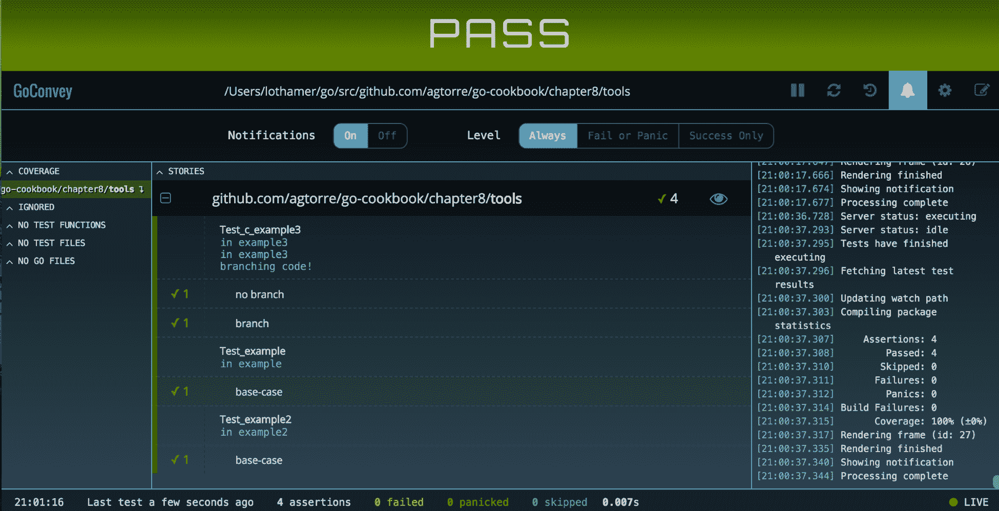

# 第九章：测试 Go 代码

这一章将与之前的章节不同；这一章将专注于测试和测试方法。Go 提供了出色的测试支持。但是，对于来自更动态语言的开发人员来说，理解它可能会有困难，因为猴子补丁和模拟相对来说比较简单。

Go 测试鼓励为您的代码使用特定的结构。特别是，测试和模拟接口非常简单并且得到了很好的支持。某些类型的代码可能更难测试。例如，对于使用包级全局变量的代码、尚未抽象为接口的地方以及具有非导出变量或方法的结构，测试可能更加困难。本章将分享一些测试 Go 代码的示例。

在本章中，我们将涵盖以下示例：

+   使用标准库进行模拟

+   使用 Mockgen 包来模拟接口

+   使用表驱动测试来提高覆盖率

+   使用第三方测试工具

+   使用 Go 进行行为测试

# 技术要求

为了继续本章中的所有示例，根据以下步骤配置您的环境：

1.  从[`golang.org/doc/install`](https://golang.org/doc/install)下载并在您的操作系统上安装 Go 1.12.6 或更高版本。

1.  打开一个终端或控制台应用程序，然后创建并导航到一个项目目录，例如`~/projects/go-programming-cookbook`。所有代码将从该目录运行和修改。

1.  将最新的代码克隆到`~/projects/go-programming-cookbook-original`，您可以选择从该目录中工作，而不是手动输入示例：

```go
$ git clone git@github.com:PacktPublishing/Go-Programming-Cookbook-Second-Edition.git go-programming-cookbook-original
```

# 使用标准库进行模拟

在 Go 中，模拟通常意味着使用测试版本实现一个接口，允许您从测试中控制运行时行为。它也可能指模拟函数和方法，对于这一点，我们将在本示例中探讨另一个技巧。这个技巧使用了在[`play.golang.org/p/oLF1XnRX3C`](https://play.golang.org/p/oLF1XnRX3C)定义的`Patch`和`Restore`函数。

一般来说，最好组合代码，以便您可以经常使用接口，并且代码是由小的、可测试的块组成的。包含大量分支条件或深度嵌套逻辑的代码可能很难测试，测试结果往往更加脆弱。这是因为开发人员需要在测试中跟踪更多的模拟对象、补丁、返回值和状态。

# 如何做...

这些步骤涵盖了编写和运行您的应用程序：

1.  从您的终端或控制台应用程序中，创建一个名为`~/projects/go-programming-cookbook/chapter9/mocking`的新目录，并导航到该目录。

1.  运行以下命令：

```go
$ go mod init github.com/PacktPublishing/Go-Programming-Cookbook-Second-Edition/chapter9/mocking 
```

您应该会看到一个名为`go.mod`的文件，其中包含以下内容：

```go
module github.com/PacktPublishing/Go-Programming-Cookbook-Second-Edition/chapter9/mocking    
```

1.  创建一个名为`mock.go`的文件，内容如下：

```go
        package mocking

        // DoStuffer is a simple interface
        type DoStuffer interface {
            DoStuff(input string) error
        }
```

1.  创建一个名为`patch.go`的文件，内容如下：

```go
        package mocking

        import "reflect"

        // Restorer holds a function that can be used
        // to restore some previous state.
        type Restorer func()

        // Restore restores some previous state.
        func (r Restorer) Restore() {
            r()
        }

        // Patch sets the value pointed to by the given destination to 
        // the given value, and returns a function to restore it to its 
        // original value. The value must be assignable to the element 
        //type of the destination.
        func Patch(dest, value interface{}) Restorer {
            destv := reflect.ValueOf(dest).Elem()
            oldv := reflect.New(destv.Type()).Elem()
            oldv.Set(destv)
            valuev := reflect.ValueOf(value)
            if !valuev.IsValid() {
                // This isn't quite right when the destination type is 
                // not nilable, but it's better than the complex 
                // alternative.
                valuev = reflect.Zero(destv.Type())
            }
            destv.Set(valuev)
            return func() {
                destv.Set(oldv)
            }
        }
```

1.  创建一个名为`exec.go`的文件，内容如下：

```go
        package mocking
        import "errors"
        var ThrowError = func() error {
            return errors.New("always fails")
        }

        func DoSomeStuff(d DoStuffer) error {

            if err := d.DoStuff("test"); err != nil {
                return err
            }

            if err := ThrowError(); err != nil {
                return err
            }

            return nil
        }
```

1.  创建一个名为`mock_test.go`的文件，内容如下：

```go
        package mocking
        type MockDoStuffer struct {
            // closure to assist with mocking
            MockDoStuff func(input string) error
        }
        func (m *MockDoStuffer) DoStuff(input string) error {
            if m.MockDoStuff != nil {
                return m.MockDoStuff(input)
            }
            // if we don't mock, return a common case
            return nil
        }
```

1.  创建一个名为`exec_test.go`的文件，内容如下：

```go
        package mocking
        import (
            "errors"
            "testing"
        )

        func TestDoSomeStuff(t *testing.T) {
            tests := []struct {
                name       string
                DoStuff    error
                ThrowError error
                wantErr    bool
            }{
                {"base-case", nil, nil, false},
                {"DoStuff error", errors.New("failed"), nil, true},
                {"ThrowError error", nil, errors.New("failed"), true},
            }
            for _, tt := range tests {
                t.Run(tt.name, func(t *testing.T) {
                    // An example of mocking an interface
                    // with our mock struct
                    d := MockDoStuffer{}
                    d.MockDoStuff = func(string) error {
                    return tt.DoStuff }

                   // mocking a function that is declared as a variable
                   // will not work for func A(),
                   // must be var A = func()
                   defer Patch(&ThrowError, func() error { return 
                   tt.ThrowError }).Restore()

                  if err := DoSomeStuff(&d); (err != nil) != tt.wantErr 
                  {
                      t.Errorf("DoSomeStuff() error = %v, 
                      wantErr %v", err, tt.wantErr)
                  }
                })
            }
        }
```

1.  为剩余的函数填写测试，并进入上一级目录运行`go test`。确保所有测试都通过：

```go
$go test
PASS
ok github.com/PacktPublishing/Go-Programming-Cookbook-Second-
Edition/chapter9/mocking 0.006s 
```

1.  `go.mod`文件可能会被更新，顶级示例目录中现在应该存在`go.sum`文件。

# 工作原理...

这个示例演示了如何模拟接口以及已声明为变量的函数。还有一些库可以直接模拟这些已声明函数的补丁/恢复，但它们绕过了很多 Go 的类型安全来实现这一功能。如果您需要对外部包中的函数进行补丁，可以使用以下技巧：

```go
// Whatever package you wanna patch
import "github.com/package" 

// This is patchable using the method described in this recipe
var packageDoSomething = package.DoSomething
```

对于这个示例，我们首先设置我们的测试并使用表驱动测试。关于这种技术有很多文献，比如[`github.com/golang/go/wiki/TableDrivenTests`](https://github.com/golang/go/wiki/TableDrivenTests)，我建议进一步探索。一旦我们设置了测试，我们就为我们的模拟函数选择输出。为了模拟我们的接口，我们的模拟对象定义了可以在运行时重写的闭包。补丁/恢复技术被应用于在每次循环后更改我们的全局函数并恢复它。这要归功于`t.Run`，它为测试的每次循环设置了一个新函数。

# 使用 Mockgen 包来模拟接口

前面的示例使用了我们的自定义模拟对象。当您使用大量接口时，编写这些内容可能会变得繁琐且容易出错。这是生成代码非常有意义的地方。幸运的是，有一个名为`github.com/golang/mock/gomock`的包，它提供了模拟对象的生成，并为我们提供了一个非常有用的库，可以与接口测试一起使用。

这个示例将探讨`gomock`的一些功能，并涵盖在何时、何地以及如何使用和生成模拟对象的权衡。

# 准备工作

根据以下步骤配置您的环境：

1.  请参阅本章开头的*技术要求*部分。

1.  运行`go get github.com/golang/mock/mockgen`命令。

# 如何做...

这些步骤涵盖了编写和运行应用程序的过程：

1.  从您的终端或控制台应用程序中，创建一个名为`~/projects/go-programming-cookbook/chapter9/mockgen`的新目录，并导航到该目录。

1.  运行以下命令：

```go
$ go mod init github.com/PacktPublishing/Go-Programming-Cookbook-Second-Edition/chapter9/mockgen 
```

您应该看到一个名为`go.mod`的文件，其中包含以下内容：

```go
module github.com/PacktPublishing/Go-Programming-Cookbook-Second-Edition/chapter9/mockgen    
```

1.  创建一个名为`interface.go`的文件，内容如下：

```go
        package mockgen

        // GetSetter implements get a set of a
        // key value pair
        type GetSetter interface {
            Set(key, val string) error
            Get(key string) (string, error)
        }
```

1.  创建一个名为`internal`的目录。

1.  运行`mockgen -destination internal/mocks.go -package internal github.com/PacktPublishing/Go-Programming-Cookbook-Second-Edition/chapter9/mockgen GetSetter`命令。这将创建一个名为`internal/mocks.go`的文件。

1.  创建一个名为`exec.go`的文件，内容如下：

```go
        package mockgen

        // Controller is a struct demonstrating
        // one way to initialize interfaces
        type Controller struct {
            GetSetter
        }

        // GetThenSet checks if a value is set. If not
        // it sets it.
        func (c *Controller) GetThenSet(key, value string) error {
            val, err := c.Get(key)
            if err != nil {
                return err
            }

            if val != value {
                return c.Set(key, value)
            }
            return nil
        }
```

1.  创建一个名为`interface_test.go`的文件，内容如下：

```go
        package mockgen

        import (
            "errors"
            "testing"

            "github.com/PacktPublishing/
             Go-Programming-Cookbook-Second-Edition/
             chapter9/mockgen/internal"
            "github.com/golang/mock/gomock"
        )

        func TestExample(t *testing.T) {
            ctrl := gomock.NewController(t)
            defer ctrl.Finish()

            mockGetSetter := internal.NewMockGetSetter(ctrl)

            var k string
            mockGetSetter.EXPECT().Get("we can put anything 
            here!").Do(func(key string) {
                k = key
            }).Return("", nil)

            customError := errors.New("failed this time")

            mockGetSetter.EXPECT().Get(gomock.Any()).Return("", 
            customError)

            if _, err := mockGetSetter.Get("we can put anything 
            here!"); err != nil {
                t.Errorf("got %#v; want %#v", err, nil)
            }
            if k != "we can put anything here!" {
                t.Errorf("bad key")
            }

            if _, err := mockGetSetter.Get("key"); err == nil {
                t.Errorf("got %#v; want %#v", err, customError)
            }
        }
```

1.  创建一个名为`exec_test.go`的文件，内容如下：

```go
        package mockgen

        import (
            "errors"
            "testing"

            "github.com/PacktPublishing/
             Go-Programming-Cookbook-Second-Edition/
             chapter9/mockgen/internal"
            "github.com/golang/mock/gomock"
        )

        func TestController_Set(t *testing.T) {
            tests := []struct {
                name string
                getReturnVal string
                getReturnErr error
                setReturnErr error
                wantErr bool
            }{
                {"get error", "value", errors.New("failed"), nil, 
                true},
                {"value match", "value", nil, nil, false},
                {"no errors", "not set", nil, nil, false},
                {"set error", "not set", nil, errors.New("failed"),
                true},
            }
            for _, tt := range tests {
                t.Run(tt.name, func(t *testing.T) {
                    ctrl := gomock.NewController(t)
                    defer ctrl.Finish()

                    mockGetSetter := internal.NewMockGetSetter(ctrl)
                    mockGetSetter.EXPECT().Get("key").AnyTimes()
                    .Return(tt.getReturnVal, tt.getReturnErr)
                    mockGetSetter.EXPECT().Set("key", 
                    gomock.Any()).AnyTimes().Return(tt.setReturnErr)

                    c := &Controller{
                        GetSetter: mockGetSetter,
                    }
                    if err := c.GetThenSet("key", "value"); (err != 
                    nil) != tt.wantErr {
                        t.Errorf("Controller.Set() error = %v, wantErr 
                        %v", err, tt.wantErr)
                    }
                })
             }
        }
```

1.  为剩余的函数填写测试，返回上一级目录，并运行`go test`。确保所有测试都通过。

1.  `go.mod`文件可能会被更新，`go.sum`文件现在应该存在于顶级配方目录中。

# 工作原理...

生成的模拟对象允许测试指定预期的参数、函数将被调用的次数以及返回的内容。它们还允许我们设置额外的工件。例如，如果原始函数具有类似的工作流程，我们可以直接写入通道。`interface_test.go`文件展示了在调用模拟对象时使用一些示例。通常，测试看起来更像`exec_test.go`，在这里我们希望拦截实际代码执行的接口函数调用，并在测试时更改它们的行为。

`exec_test.go`文件还展示了如何在表驱动测试环境中使用模拟对象。`Any()`函数表示模拟函数可以被调用零次或多次，这对于代码提前终止的情况非常有用。

在这个示例中演示的最后一个技巧是将模拟对象放入`internal`包中。当您需要模拟在您自己之外的包中声明的函数时，这是很有用的。这允许这些方法在`non _test.go`文件中定义，但它们对您的库的用户不可见，因为他们无法从内部包导入。通常，最容易的方法是将模拟对象放入与您当前编写的测试相同的包名的`_test.go`文件中。

# 使用表驱动测试来提高覆盖率

这个示例将演示如何编写表驱动测试、收集测试覆盖率并改进它的过程。它还将使用`github.com/cweill/gotests`包来生成测试。如果您已经下载了其他章节的测试代码，这些内容应该会很熟悉。通过结合这个示例和前两个示例，您应该能够在所有情况下通过一些工作实现 100%的测试覆盖率。

# 如何做...

这些步骤涵盖了编写和运行应用程序的过程：

1.  从您的终端或控制台应用程序中，创建一个名为`~/projects/go-programming-cookbook/chapter9/coverage`的新目录，并导航到该目录。

1.  运行以下命令：

```go
$ go mod init github.com/PacktPublishing/Go-Programming-Cookbook-Second-Edition/chapter9/coverage 
```

您应该会看到一个名为`go.mod`的文件，其中包含以下内容：

```go
module github.com/PacktPublishing/Go-Programming-Cookbook-Second-Edition/chapter9/coverage    
```

1.  创建一个名为`coverage.go`的文件，内容如下：

```go
        package main

        import "errors"

        // Coverage is a simple function with some branching conditions
        func Coverage(condition bool) error {
            if condition {
                return errors.New("condition was set")
            }
            return nil
        }
```

1.  运行`gotests -all -w`命令。

1.  这将生成一个名为`coverage_test.go`的文件，内容如下：

```go
        package main

        import "testing"

        func TestCoverage(t *testing.T) {
            type args struct {
                condition bool
            }
            tests := []struct {
                name string
                args args
                wantErr bool
            }{
                // TODO: Add test cases.
            }
            for _, tt := range tests {
                t.Run(tt.name, func(t *testing.T) {
                    if err := Coverage(tt.args.condition); (err != nil) 
                    != tt.wantErr {
                        t.Errorf("Coverage() error = %v, wantErr %v", 
                        err, tt.wantErr)
                    }
                })
            }
        }
```

1.  使用以下内容填写`TODO`部分：

```go
        {"no condition", args{true}, true},
```

1.  运行`go test -cover`命令，您将看到以下输出：

```go
$ go test -cover 
PASS
coverage: 66.7% of statements
ok github.com/PacktPublishing/Go-Programming-Cookbook-Second-
Edition/chapter9/coverage 0.007s
```

1.  将以下内容添加到`TODO`部分：

```go
        {"condition", args{false}, false},
```

1.  运行`go test -cover`命令，您将看到以下输出：

```go
$ go test -cover 
PASS
coverage: 100.0% of statements
ok github.com/PacktPublishing/Go-Programming-Cookbook-Second-
Edition/chapter9/coverage 0.007s
```

1.  运行以下命令：

```go
$ go test -coverprofile=cover.out 
$ go tool cover -html=cover.out -o coverage.html
```

1.  在浏览器中打开`coverage.html`文件，以查看图形覆盖报告。

1.  `go.mod`文件可能会被更新，顶级示例目录中现在应该存在`go.sum`文件。

# 它是如何工作的...

`go test -cover`命令是基本的 Go 安装中自带的。它可以用来收集您的 Go 应用程序的覆盖报告。此外，它还可以输出覆盖度指标和 HTML 覆盖报告。这个工具通常被其他工具包装，下一个示例将介绍这些内容。这些表驱动测试样式在[`github.com/golang/go/wiki/TableDrivenTests`](https://github.com/golang/go/wiki/TableDrivenTests)中有介绍，是一种优秀的方式，可以处理许多情况而不需要编写大量额外的代码。

这个示例首先通过自动生成测试代码，然后根据需要填写测试用例来帮助创建更多的覆盖。唯一特别棘手的时候是当您调用非变量函数或方法时。例如，让`gob.Encode()`返回一个错误以增加测试覆盖率可能会很棘手。使用本章的*使用标准库进行模拟*示例中描述的方法，并使用`var gobEncode = gob.Encode`来允许打补丁，也可能看起来有些古怪。因此，很难主张 100%的测试覆盖率，而是主张集中测试外部接口的广泛性——也就是测试输入和输出的许多变化，有时，正如我们将在本章的*使用 Go 进行行为测试*示例中看到的那样，模糊测试可能会变得有用。

# 使用第三方测试工具

有许多有用的 Go 测试工具：可以更轻松地了解每个函数级别的代码覆盖情况的工具，可以实现断言以减少测试代码行数的工具，以及测试运行器。这个示例将介绍`github.com/axw/gocov`和`github.com/smartystreets/goconvey`包，以演示其中一些功能。根据您的需求，还有许多其他值得注意的测试框架。`github.com/smartystreets/goconvey`包支持断言和是一个测试运行器。在 Go 1.7 之前，这是最干净的方法来拥有带标签的子测试。

# 准备工作

根据以下步骤配置您的环境：

1.  请参考本章开头的*技术要求*部分。

1.  运行`go get github.com/axw/gocov/gocov`命令。

1.  运行`go get github.com/smartystreets/goconvey`命令。

# 如何做...

这些步骤涵盖了编写和运行应用程序的过程：

1.  从您的终端或控制台应用程序中，创建一个名为`~/projects/go-programming-cookbook/chapter9/tools`的新目录，并导航到该目录。

1.  运行以下命令：

```go
$ go mod init github.com/PacktPublishing/Go-Programming-Cookbook-Second-Edition/chapter9/tools 
```

你应该看到一个名为`go.mod`的文件，其中包含以下内容：

```go
module github.com/PacktPublishing/Go-Programming-Cookbook-Second-Edition/chapter9/tools
```

1.  创建一个名为`funcs.go`的文件，内容如下：

```go
        package tools

        import (
            "fmt"
        )

        func example() error {
            fmt.Println("in example")
            return nil
        }

        var example2 = func() int {
            fmt.Println("in example2")
            return 10
        }
```

1.  创建一个名为`structs.go`的文件，内容如下：

```go
        package tools

        import (
            "errors"
            "fmt"
        )

        type c struct {
            Branch bool
        }

        func (c *c) example3() error {
            fmt.Println("in example3")
            if c.Branch {
                fmt.Println("branching code!")
                return errors.New("bad branch")
            }
            return nil
        }
```

1.  创建一个名为`funcs_test.go`的文件，内容如下：

```go
        package tools

        import (
            "testing"

            . "github.com/smartystreets/goconvey/convey"
        )

        func Test_example(t *testing.T) {
            tests := []struct {
                name string
            }{
                {"base-case"},
            }
            for _, tt := range tests {
                Convey(tt.name, t, func() {
                    res := example()
                    So(res, ShouldBeNil)
                })
            }
        }

        func Test_example2(t *testing.T) {
            tests := []struct {
                name string
            }{
                {"base-case"},
            }
            for _, tt := range tests {
                Convey(tt.name, t, func() {
                    res := example2()
                    So(res, ShouldBeGreaterThanOrEqualTo, 1)
                })
            }
        }
```

1.  创建一个名为`structs_test.go`的文件，内容如下：

```go
        package tools

        import (
            "testing"

            . "github.com/smartystreets/goconvey/convey"
        )

        func Test_c_example3(t *testing.T) {
            type fields struct {
                Branch bool
            }
            tests := []struct {
                name string
                fields fields
                wantErr bool
            }{
                {"no branch", fields{false}, false},
                {"branch", fields{true}, true},
            }
            for _, tt := range tests {
                Convey(tt.name, t, func() {
                    c := &c{
                        Branch: tt.fields.Branch,
                    }
                    So((c.example3() != nil), ShouldEqual, tt.wantErr)
                })
            }
        }
```

1.  运行`gocov test | gocov report`命令，你会看到以下输出：

```go
$ gocov test | gocov report
ok github.com/PacktPublishing/Go-Programming-Cookbook-Second-
Edition/chapter9/tools 0.006s 
coverage: 100.0% of statements

github.com/PacktPublishing/Go-Programming-Cookbook-Second-
Edition/chapter9/tools/struct.go 
c.example3 100.00% (5/5)
github.com/PacktPublishing/Go-Programming-Cookbook-Second-
Edition/chapter9/tools/funcs.go example 
100.00% (2/2)
github.com/PacktPublishing/Go-Programming-Cookbook-Second-
Edition/chapter9/tools/funcs.go @12:16 
100.00% (2/2)
github.com/PacktPublishing/Go-Programming-Cookbook-Second-
Edition/chapter9/tools ---------- 
100.00% (9/9)

Total Coverage: 100.00% (9/9)
```

1.  运行`goconvey`命令，它将打开一个看起来像这样的浏览器：



1.  确保所有测试都通过。

1.  `go.mod`文件可能已更新，`go.sum`文件现在应该存在于顶级配方目录中。

# 它是如何工作的...

本教程演示了如何将`goconvey`命令与你的测试连接起来。`Convey`关键字基本上取代了`t.Run`，并在`goconvey`Web UI 中添加了额外的标签，但它的行为略有不同。如果你有嵌套的`Convey`块，它们总是按顺序重新执行，如下所示：

```go
Convey("Outer loop", t, func(){
    a := 1
    Convey("Inner loop", t, func() {
        a = 2
    })
    Convey ("Inner loop2", t, func(){
        fmt.Println(a)
     })
})
```

使用`goconvey`命令，上面的代码将打印`1`。如果我们使用内置的`t.Run`，它将打印`2`。换句话说，Go 的`t.Run`测试是顺序运行的，永远不会重复。这种行为对于将设置代码放入外部`Convey`块非常有用，但如果你必须同时使用，记住这个区别是很重要的。

当使用`Convey`断言时，在 Web UI 和额外的统计信息中会有成功的勾号。它还可以将检查的大小减少到一行，甚至可以创建自定义断言。

如果你保持`goconvey`Web 界面打开并打开通知，当你保存代码时，测试将自动运行，并且你将收到有关覆盖率增加或减少以及构建失败的通知。

所有三个工具断言、测试运行器和 Web UI 都可以独立或一起使用。

`gocov`工具在提高测试覆盖率时非常有用。它可以快速识别缺乏覆盖的函数，并帮助你深入了解你的覆盖报告。此外，`gocov`还可以用来生成一个随 Go 代码一起提供的替代 HTML 报告，使用`github.com/matm/gocov-html`包。

# 使用 Go 进行行为测试

行为测试或集成测试是实现端到端黑盒测试的一种好方法。这种类型测试的一个流行框架是 Cucumber（[`cucumber.io/`](https://cucumber.io/)），它使用 Gherkin 语言来描述测试的步骤，然后在代码中实现这些步骤。Go 也有一个 Cucumber 库（`github.com/DATA-DOG/godog`）。本教程将使用`godog`包来编写行为测试。

# 准备就绪

根据以下步骤配置你的环境：

1.  请参考本章开头的*技术要求*部分。

1.  运行`go get github.com/DATA-DOG/godog/cmd/godog`命令。

# 如何做...

这些步骤涵盖了编写和运行你的应用程序：

1.  从你的终端或控制台应用程序中，创建一个名为`~/projects/go-programming-cookbook/chapter9/bdd`的新目录，并导航到该目录。

1.  运行以下命令：

```go
$ go mod init github.com/PacktPublishing/Go-Programming-Cookbook-Second-Edition/chapter9/bdd 
```

你应该看到一个名为`go.mod`的文件，其中包含以下内容：

```go
module github.com/PacktPublishing/Go-Programming-Cookbook-Second-Edition/chapter9/bdd
```

1.  创建一个名为`handler.go`的文件，内容如下：

```go
        package bdd

        import (
            "encoding/json"
            "fmt"
            "net/http"
        )

        // HandlerRequest will be json decoded
        // into by Handler
        type HandlerRequest struct {
            Name string `json:"name"`
        }

        // Handler takes a request and renders a response
        func Handler(w http.ResponseWriter, r *http.Request) {
            w.Header().Set("Content-Type", "text/plain; charset=utf-8")
            if r.Method != http.MethodPost {
                w.WriteHeader(http.StatusMethodNotAllowed)
                return
            }

            dec := json.NewDecoder(r.Body)
            var req HandlerRequest
            if err := dec.Decode(&req); err != nil {
                w.WriteHeader(http.StatusBadRequest)
                return
            }

            w.WriteHeader(http.StatusOK)
            w.Write([]byte(fmt.Sprintf("BDD testing %s", req.Name)))
        }
```

1.  创建一个名为`features`的新目录，并创建一个名为`features/handler.go`的文件，内容如下：

```go
        Feature: Bad Method
         Scenario: Good request
         Given we create a HandlerRequest payload with:
            | reader |
            | coder |
            | other |
         And we POST the HandlerRequest to /hello
         Then the response code should be 200
         And the response body should be:
            | BDD testing reader |
            | BDD testing coder |
            | BDD testing other |
```

1.  运行`godog`命令，你会看到以下输出：

```go
$ godog
.
1 scenarios (1 undefined)
4 steps (4 undefined)
89.062µs
.
```

1.  这将为你提供一个骨架来实现我们在特性文件中编写的测试；将它们复制到`handler_test.go`中并实现前两个步骤：

```go
        package bdd

        import (
            "bytes"
            "encoding/json"
            "fmt"
            "net/http/httptest"

            "github.com/DATA-DOG/godog"
            "github.com/DATA-DOG/godog/gherkin"
        )

        var payloads []HandlerRequest
        var resps []*httptest.ResponseRecorder

        func weCreateAHandlerRequestPayloadWith(arg1 
        *gherkin.DataTable) error {
            for _, row := range arg1.Rows {
                h := HandlerRequest{
                    Name: row.Cells[0].Value,
                }
                payloads = append(payloads, h)
            }
            return nil
        }

        func wePOSTTheHandlerRequestToHello() error {
            for _, p := range payloads {
                v, err := json.Marshal(p)
                if err != nil {
                    return err
                }
                w := httptest.NewRecorder()
                r := httptest.NewRequest("POST", "/hello", 
                bytes.NewBuffer(v))

                Handler(w, r)
                resps = append(resps, w)
            }
            return nil
        }
```

1.  运行`godog`命令，你会看到以下输出：

```go
$ godog
.
1 scenarios (1 pending)
4 steps (2 passed, 1 pending, 1 skipped)
.
```

1.  填写剩下的两个步骤：

```go
        func theResponseCodeShouldBe(arg1 int) error {
            for _, r := range resps {
                if got, want := r.Code, arg1; got != want {
                    return fmt.Errorf("got: %d; want %d", got, want)
                }
            }
            return nil
        }

        func theResponseBodyShouldBe(arg1 *gherkin.DataTable) error {
            for c, row := range arg1.Rows {
                b := bytes.Buffer{}
                b.ReadFrom(resps[c].Body)
                if got, want := b.String(), row.Cells[0].Value;
                got != want 
                {
                    return fmt.Errorf("got: %s; want %s", got, want)
                }
            }
            return nil
        }

        func FeatureContext(s *godog.Suite) {
            s.Step(`^we create a HandlerRequest payload with:$`, 
            weCreateAHandlerRequestPayloadWith)
            s.Step(`^we POST the HandlerRequest to /hello$`, 
            wePOSTTheHandlerRequestToHello)
            s.Step(`^the response code should be (d+)$`, 
            theResponseCodeShouldBe)
            s.Step(`^the response body should be:$`, 
            theResponseBodyShouldBe)
        }
```

1.  运行`godog`命令，你会看到以下输出：

```go
$ godog 
.
1 scenarios (1 passed)
4 steps (4 passed)
552.605µs
.
```

# 它是如何工作的...

Cucumber 框架非常适用于配对编程、端到端测试以及任何需要通过书面说明进行最佳沟通并且非技术人员可以理解的测试。一旦一个步骤被实现，通常可以在需要的任何地方重复使用它。如果您想要测试服务之间的集成，可以编写测试来使用实际的 HTTP 客户端，只要首先确保您的环境已设置为接收 HTTP 连接。

Datadog 对**行为驱动开发**（BDD）的实现缺少一些功能，如果您曾经使用过其他 Cucumber 框架，可能会期望这些功能，包括缺乏示例、在函数之间传递上下文，以及许多其他关键字。然而，这是一个很好的开始，通过在这个配方中使用一些技巧，比如使用全局变量来跟踪状态（并确保在场景之间清理这些全局变量），可以构建一个相当健壮的测试集。Datadog 测试包还使用了第三方测试运行器，因此无法与诸如`gocov`或`go test -cover`等包一起使用。
