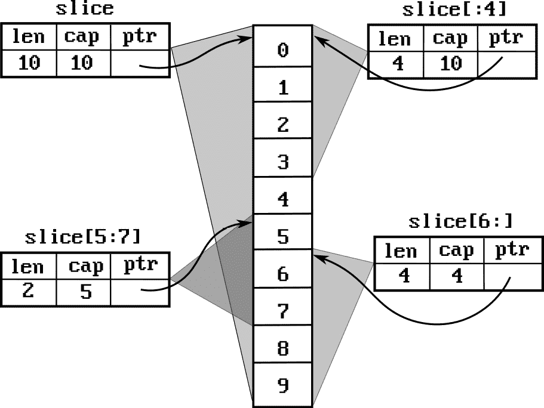

# 第四章：与数组、切片和映射一起工作

数组、切片和映射是 Go 语言定义的内置容器类型。它们是几乎所有程序的基本组成部分，通常是其他数据结构的基本构建块。本节描述了使用这些基本数据结构的某些常见模式，因为它们可能对新手不明显。

在本章中，我们将讨论以下内容：

+   与数组一起工作

+   与切片一起工作

+   使用切片实现栈

+   与映射一起工作

+   实现集合

+   使用映射进行线程安全的缓存

# 与数组一起工作

数组是固定大小的数据结构。无法调整数组的大小或使用变量作为其大小创建数组（换句话说，`[n]int`仅在`n`是一个常量整数时有效）。正因为如此，数组对于表示具有固定元素数量的对象非常有用，例如 SHA256 哈希，它是 32 字节。

数组的零值对于数组的每个元素都是零值。例如，`[5]int`初始化为五个整数，全部为 0。字符串数组将包含空字符串。

## 创建数组并在它们之间传递

本食谱展示了如何创建数组并将数组值传递给函数和方法。我们还将讨论传递数组作为值的效应。

### 如何做到...

1.  使用固定大小创建数组：

    ```go
    var arr [2]int // Array of 2 ints
    x := [...]int{1,2} // Array of 2 ints
    ```

    你可以指定数组索引，类似于定义映射：

    ```go
    y := [...]int{1, 4: 10} // Array of 5 ints,
    // [0]1, y[4]=10, all other elements are 0
    // [1 0 0 0 10]
    ```

1.  使用数组定义新的固定大小数据类型：

    ```go
    // SHA256 hash is 256 bits - 32 bytes
    type SHA256 [32]byte
    ```

1.  数组是通过值传递的：

    ```go
    func main() {
      var h SHA256
      h = getHash()
      // f will get a 32-byte array that is a copy of h
      f(h)
    ...
    }
    func f(hash SHA256) {
      hash[0]=0 // This changes the copy of `hash` passed to `f`.
                // It does not affect the `h` value declared in main
      ...
    }
    ```

警告

通过值传递数组意味着每次你将数组作为函数的参数使用时，数组都会被复制。如果你将一个`[1000]int64`数组传递给一个函数，运行时将分配和复制 8,000 字节（int64 是 64 位，即 8 字节，1,000 个 int64 值是 8,000 字节。）复制将是一个浅复制——也就是说，你传递了一个包含指针的数组，或者如果你传递了一个包含包含指针的结构体的数组，指针将被复制，而不是这些指针的内容。

请参阅以下示例：

```go
func f(m [2]map[string]int) {
   m[0]["x"]=1
}
func main() {
  array := [2]map[string]int{}
  // A copy of array is passed to f
  // but array[0] and array[1] are maps
  // Contents of those maps are not copied.
  f(array)
  fmt.Println(array[0])
  // This will print [x:1]
}
```

# 与切片一起工作

切片是数组的视图。你可能正在处理多个与相同底层数据一起工作的切片。

切片的零值是 nil。读取或写入 nil 切片将`panic`；然而，你可以向 nil 切片追加，这将创建一个新的切片。

## 创建切片

有几种方法可以创建切片。

### 如何做到...

使用`make(sliceType,length[,capacity])`：

```go
slice1 := make([]int,0)
// len(slice1)=0, cap(slice1)=0
slice2 := make([]int,0,10)
// len(slice2)=0, cap(slice2)=10
slice3 := make([]int,10)
// len(slice3)=10, cap(slice3)=10
```

在前面的代码片段中，你看到了`make`的三种不同用法来创建切片：

+   `slice1:=make([]int,0)`创建了一个空切片，`0`是切片的长度。`slice1`变量初始化为一个非空、0 长度的切片。

+   `slice2 := make([]int,0,10)`创建了一个容量为`10`的空切片。如果你知道这个切片可能的最大大小，你应该选择这种方式。这种切片分配避免了在追加第 11 个元素之前的分配/复制操作。

+   `slice3 := make([]int,10)` 创建了一个大小为 `10`、容量为 `10` 的切片。切片元素被初始化为 0。一般来说，使用这种形式，分配的切片将被初始化为其元素类型的零值。

小贴士

注意使用非零长度的切片分配。我本人就因为误将 `make([]int,10)` 错写成 `make([]int,0,10)`，然后继续向分配的切片追加 10 个元素，最终导致有 20 个元素。

请参阅以下示例：

```go
values:=make([]string,10)
for _,s:=range results {
  if someFunc(s) {
    values=append(values,s)
  }
}
```

之前的代码片段创建了一个包含 `10` 个空字符串的字符串切片，然后通过循环将这些字符串追加进去。

你也可以使用字面量初始化切片：

```go
slice := []int{1,2,3,4,5}
// len(slice)=5 cap(slice)=5
```

或者，你可以将切片变量留为 `nil`，然后向其追加。内置的 `append` 函数将接受一个 `nil` 切片，并创建一个新的：

```go
// values slice is nil after declaration
var values []string
for _,x:=range results {
  if someFunc(s) {
    values=appennd(values, s)
  }
}
```

# 从数组创建切片

许多函数将接受切片而不是数组。如果你有一个值数组，需要将其传递给需要一个切片的函数，你需要从数组创建一个切片。这很简单且高效。从数组创建切片是一个常数时间操作。

## 如何实现...

使用 `[:]` 语法从数组创建切片。该切片将以数组作为其底层存储：

```go
arr := [...]int{0, 1, 2, 3, 4, 5}
slice := arr[:] // slice has all elements of arr
slice[2]=10
// Here, arr = [...]int{0,1,10,3, 4,5}
// len(slice) = 6
// cap(slice) = 6
```

你可以创建一个指向数组某部分的切片：

```go
slice2 := arr[1:3]
// Here, slice2 = {1,10}
// len(slice2) = 2
// cap(slice2) = 5
```

你可以切片现有的切片。切片操作的界限由原始切片的容量决定：

```go
slice3 := slice2[0:4]
// len(slice3)=4
// cap(slice3)=5
// slice3 = {1,10,3,4}
```

## 它是如何工作的...

切片是一个包含三个值的数据结构：切片长度、容量以及指向底层数组的指针。切片一个数组简单地说就是创建这样一个数据结构，并将指针初始化为数组。这是一个常数时间操作。

![图 4.1 – 数组 arr 和切片 arr[:] 之间的区别](img/B21961_04_1.jpg)

图 4.1 – 数组 arr 和切片 arr[:] 之间的区别

# 追加/插入/删除切片元素

切片使用数组作为其底层存储，但在空间不足时无法增长数组。正因为如此，如果 `append` 操作超出了切片容量，就会分配一个新的更大的数组，并将切片内容复制到这个新数组中。

## 如何实现...

要向切片的末尾添加新值，请使用 `append` 内置函数：

```go
// Create an empty integer slice
islice := make([]int, 0)
// Append values 1, 2, 3 to islice, assign it to newSlice
newSlice := append(islice, 1, 2, 3)
// islice:  []
// newSlice: [1 2 3]
// Create an empty integer slice
islice = make([]int, 0)
// Another integer slice with 3 elements
otherSlice := []int{1, 2, 3}
// Append 'otherSlice' to 'islice'
newSlice = append(islice, otherSlice...)
newSlice = append(newSlice, otherSlice...)
// islice: []
// otherSlice: [1 2 3]
// newSlice: [1 2 3 1 2 3]
```

要从切片的开始或结束处删除元素，请使用切片：

```go
slice := []int{0, 1, 2, 3, 4, 5, 6, 7, 8, 9}
// Slice elements starting from index 1
suffix := slice[1:]
// suffix: [1 2 3 4 5 6 7 8 9]
// Slice elements starting from index 3
suffix2 := slice[3:]
// suffix2: [3 4 5 6 7 8 9]
// Slice elements up to index 5 (excluding 5)
prefix := slice[:5]
// prefix: [0 1 2 3 4]
// Slice elements from 3 up to index 6 (excluding 6)
mid := slice[3:6]
// [3 4 5]
```

使用 `slices` 包在切片的任意位置插入/删除元素：

+   `slices.Delete(slice,i,j)` 从切片中删除 `slice[i:j]` 的元素，并返回修改后的切片

+   `slices.Insert(slice,i,value...)` 在索引 `i` 处插入值，并将从 `i` 开始的所有元素移动以腾出空间

```go
slice := []int{0, 1, 2, 3, 4, 5, 6, 7, 8, 9}
// Remove the section slice[3:7]
edges := slices.Delete(slice, 3, 7)
// edges: [0 1 2 7 8 9]
// slice: [0 1 2 7 8 9 0 0 0 0]
inserted := slices.Insert(slice, 3, 3, 4)
// inserted: [0 1 2 3 4 7 8 9 0 0 0 0]
// edges: [0 1 2 7 8 9]
// slices: [0 1 2 7 8 9 0 0 0 0]
```

或者，你可以使用循环从切片中删除元素并截断它，如下所示：

```go
slice := []int{0, 1, 2, 3, 4, 5, 6, 7, 8, 9}
// Keep an index to write to
write:=0
for _, elem := range slice {
  if elem %2 == 0 { // Copy only even numbers
    slice[write]=elem
    write++
  }
}
// Truncate the slice
slice=slice[:write]
```

## 它是如何工作的...

切片是数组的视图。它包含三个信息：

+   `ptr`：指向数组元素的指针，这是切片的起始位置

+   `len`：切片中元素的数量

+   `cap`：此切片在基础数组中剩余的容量

如果向切片添加的元素超出了其容量，运行时会分配一个更大的数组，并将切片的内容复制到那里。之后，新的切片指向一个新的数组。

这对许多人来说是一个混淆的来源。切片可能与其他切片共享其元素。因此，修改一个切片也可能修改其他切片。

*图 4.2* 展示了一个使用相同基础数组为四个不同切片的情况：



图 4.2 – 共享相同基础数组的切片

请看以下示例：

```go
// Appends 1 to a slice, and returns the new slice
func Append1(input []int) []int {
  return append(input,1)
}
func main() {
   slice:= []int{0,1,2,3,4,5,6,7,8,9}
   shortSlice := slice[:4]
   // shortSlice: []int{0,1,2,3}
   newSlice:=Append1(slice[:4])
   // newSlice:= []int{0,1,2,3,1}
   // slice: []int{0,1,2,3,1,5,6,7,8,9}
}
```

注意，向 `newSlice` 添加元素也会修改 `slice` 的一个元素，因为 `newSlice` 有足够的容量来容纳一个额外的元素，这会覆盖 `slice[4]`。

截断切片只是创建一个比原始切片更短的新的切片。基础数组不会改变。请看以下：

```go
slice:= []int{0,1,2,3,4,5,6,7,8,9}
newSlice:=slice[:5]
// newSlice: []int{0,1,2,3,4}
```

记住，`newSlice` 只是一个包含相同 `ptr` 和 `cap` 的数据结构，但 `len` 较短。正因为如此，从现有切片或数组创建新切片是一个常数时间操作（O(1)）。

# 使用切片实现栈

切片的一个令人惊讶的常见用途是实现栈。以下是实现方式。

## 如何实现...

栈的推送操作简单就是 `append`：

```go
// A generic stack of type T
type Stack[T any] []T
func (s *Stack[T]) Push(val T) {
     *s = append(*s, val)
}
```

要实现 `pop`，截断切片：

```go
func (s *Stack[T]) Pop() (val T) {
     val = (*s)[len(*s)-1]
     *s = (*s)[:len(*s)-1]
     return
}
```

再次注意括号和间接引用的使用。我们不能写 `*s[len(*s)-1]`，因为这被解释为 `*(s[len(*s)-1])`。为了防止这种情况，我们使用 `(*s)`。

# 与映射一起工作

您可以使用整数索引访问数组或切片的元素。映射提供类似的语法来使用索引键，这些键不仅限于整数，还可以是任何“可比较”的类型（这意味着可以使用 `==` 或 `!=` 进行比较。）映射是一种关联数据类型——也就是说，它存储键值对。映射中每个键只出现一次。Go 映射为其元素提供平均常数时间的访问（也就是说，当从时间角度测量时，映射元素访问应该看起来像是一个常数时间操作。）

Go 的 `map` 类型提供了对底层复杂数据结构的方便访问。它是一种“引用”类型——也就是说，将映射变量赋值给另一个映射只是分配了对底层结构的指针，并不会复制映射的元素。

警告

映射是无序集合。不要依赖于映射中元素的顺序。相同的插入顺序可能在不同的程序中不同时间导致不同的迭代顺序。

## 定义、初始化和使用映射

与切片类似，映射的零值是 nil。从 nil 映射读取的结果与从没有元素的 non-nil 映射读取的结果相同。向 nil 映射写入将引发 panic。本节展示了初始化和使用映射的不同方式。

## 如何实现...

使用 `make` 创建一个新的映射，或使用字面量。您不能向 nil 映射写入（但可以从中读取！），因此您必须使用 `make` 或字面量初始化所有映射：

```go
func main() {
   // Make a new empty map
   m1 := make(map[int]string)
   // Initilize a map using empty map literal
   m2 := map[int]string{}
   // Initialize a map using a map literal
   m3 := map[int]string {
      1: "a",
      2: "b",
  }
 ...
```

与切片不同，映射的值不是 **可寻址的**：

```go
type User struct {
  Name string
}
func main() {
   usersByID := make(map[int]User)
   usersByID[1]=User{Name:"John Doe"}
   fmt.Println(usersByID[1].Name)
   // Prints: John Doe
   // The following will give a compile error
   usersByID[1].Name="James"
...
}
```

在上一个示例中，您不能设置存储在映射中的结构体的成员变量。当您使用 `usersByID[1]` 访问该映射元素时，您得到的是映射中存储的 `User` 的副本，将它的 `Name` 设置为其他值的效果将会丢失，因为这个副本没有存储在任何地方。

因此，相反，您可以读取并将映射值赋给可寻址的变量，更改它，并将其设置回：

```go
  user := usersByID[1]
  user.Name="James"
  usersByID[1]=user
```

或者，您可以在映射中存储指针：

```go
  userPtrsByID := make(map[int]*User)
  userPtrsByID[1]=&User {
    Name: "John Doe"
  }
  userPtrsByID[1].Name = "James" // This works.
```

如果映射没有给定键的元素，它将返回映射值类型的零值：

```go
  user := usersByID[2]  // user is set to User{}
  userPtr := userPtrsByID[2] // userPtr is set to nil
```

为了区分零值是返回因为映射没有元素，还是因为零值存储在映射中，请使用映射查找的两个值版本：

```go
  user, exists := usersByID[1] // exists = true
  userPtr, exists := userPtrsByID[2] // exists = false
```

使用 `delete` 从映射中删除一个元素：

```go
delete(usersByID, 1)
```

# 使用映射实现集合

集合用于从值集合中删除重复项。通过利用零大小值结构，映射可以有效地用作集合。

## 如何实现...

使用键类型为集合元素类型，值类型为 `struct{}` 的映射：

```go
stringSet := make(map[string]struct{})
```

使用 `struct{}{}` 值向集合中添加值：

```go
stringSet[value]=struct{}{}
```

使用映射查找的两个值版本检查值的存在：

```go
if _,exists:=stringSet[str]; exists {
  // String str exists in the set
}
```

映射是无序的。如果元素的排序很重要，请保留一个与映射一起的切片：

```go
// Remove duplicate inputs from the input, preserving order
func DedupOrdered(input []string) []string {
   set:=make(map[string]struct{})
   output:=make([]string,0,len(input))
   for _,in:=range input {
     if _,exists:=set[in]; exists {
       continue
     }
     output=append(output,in)
     set[in]=struct{}{}
   }
   return output
}
```

## 它是如何工作的...

`struct{}` 结构体是一个零大小对象。这样的对象由编译器和运行时分别处理。当用作映射中的值时，映射只为它的键分配存储空间。因此，这是一种实现集合的高效方式。

警告

从不依赖于零大小结构的指针等价性。编译器可能会选择将两个具有零大小的不同变量放置在相同的内存位置。

以下比较的结果是未定义的：

`x:=&struct{}{}`

`y:=&struct{}{}`

`if x==y {`

`//` `执行某些操作`

`}`

`x==y` 的结果可能返回 `true` 或 `false`。

# 复合键

当您有多个值用于标识特定对象时，您需要复合键。例如，假设您正在处理一个系统，其中用户可能有多个会话。您可以将这些信息存储在映射的映射中，或者创建一个包含用户 ID 和会话 ID 的复合键。

## 如何实现...

使用可比较的结构体或数组作为映射键。一般来说，可比较的结构体是一个不包含以下内容的结构体：

+   切片

+   通道

+   函数

+   映射

+   其他不可比较的结构体

因此，要使用复合键，请执行以下步骤：

1.  定义一个可比较的结构体：

```go
type Key struct {
  UserID string
  SessionID string
}
type User struct {
  Name string
  ...
}
var compositeKeyMap = map[Key]User{}
```

1.  使用映射键的实例来访问元素：

```go
compositeKeyMap[Key{
  UserID: "123",
  SessionID: "1",
   }] = User {
    Name: "John Doe",
  }
```

1.  您可以使用一个字面量映射来初始化它：

```go
var compositeKeyMap = map[Key]User {
   Key {
     UserID: "123",
     SessionID: "1",
   }: User {
      Name: "John Doe",
  },
}
```

## 它是如何工作的...

映射实现从其键生成哈希值，然后使用比较运算符来检查等价性。因此，任何可比较的数据结构都可以用作键值。

注意指针比较。包含指针字段的 struct 将检查指针的等价性。考虑以下键：

```go
type KeyWithPointer struct {
  UserID string
  SessionID *int
}
var sessionMap = map[KeyWithPointer]{}
func main() {
  session := 1
  key := KeyWithPointer{
     UserID: "John",
     SessionID: &session,
  }
  sessionMap[key]=User{ Name: "John Doe"}
```

在前面的代码片段中，复合映射键包含对 `session` 的指针和一个整数。在你将元素添加到映射后，更改 `session` 的值不会影响指向该变量的映射键。映射键仍然指向相同的变量。只有当 `KeyWithPointer` 的另一个实例也指向相同的 `session` 变量时，才能使用以下方式定位 `User` 对象：

```go
fmt.Println( sessionMap[KeyWithPointer{
   UserID: "John",
   SessionID: &session,
   }].Name) // "John Doe"
```

但：

```go
i:=1
fmt.Println( sessionMap[KeyWithPointer{
   UserID: "John",
   SessionID: &i,
   }].Name) // ""
```

# 使用映射的线程安全缓存

有时为了达到可接受的性能，缓存是必要的。想法是重用之前计算或检索的值。映射是缓存此类值的自然选择，但由于其本质，缓存通常在多个 goroutine 之间共享，因此在使用它们时必须小心。

## 简单缓存

这是一个简单的缓存，具有 `get/put` 方法，用于从缓存中检索对象并将其放入其中。

## 如何实现...

要缓存可以通过键访问的值，请使用包含映射和互斥锁的结构：

```go
type ObjectCache struct {
   mutex sync.RWMutex
   values map[string]*Object
}
// Initialize and return a new instance of the cache
func NewObjectCache() *ObjectCache {
    return &ObjectCache{
        values: make(map[string]*Object),
    }
}
```

应防止直接访问缓存内部，以确保在每次使用缓存时都遵守适当的协议：

```go
// Get an object from the cache
func (cache *ObjectCache) Get(key string) (*Object, bool) {
    cache.mutex.RLock()
    obj, exists := cache.values[key]
    cache.mutex.RUnlock()
    return obj, exists
}
// Put an object into the cache with the given key
func (cache *ObjectCache) Put(key string, value *Object) {
    cache.mutex.Lock()
    cache.values[key] = value
    cache.mutex.Unlock()
}
```

# 具有阻塞行为的缓存

如果多个 goroutine 从前面示例中的简单缓存请求相同的键，它们都可能决定检索对象并将其放回缓存。这是低效的。通常，你希望其中一个 goroutine 检索对象，而其他 goroutine 等待。这可以通过使用 `sync.Once` 来实现。

## 如何实现...

缓存元素是包含 `sync.Once` 的结构，以确保一个 goroutine 获取对象，而其他 goroutine 等待它。此外，缓存包含一个 `Get` 方法，该方法使用 `getObjectFunc` 回调函数来检索对象，如果它不在缓存中：

```go
type cacheItem struct {
   sync.Once
   object *Object
}
type ObjectCache struct {
   mutex sync.RWMutex
   values map[string]*cacheItem
   getObjectFunc func(string) (*Object, error)
}
func NewObjectCache(getObjectFunc func(string) (*Object,error)) *ObjectCache {
  return &ObjectCache{
     values: make(map[string]*cacheItem),
     getObjectFunc: getObjectFunc,
  }
}
func (item *cacheItem) get(key string, cache *ObjectCache) (err error) {
  // Calling item.Once.Do
  item.Do(func() {
     item.object, err=cache.getObjectFunc(key)
  })
  return
}
func (cache *ObjectCache) Get(key string) (*Object, error) {
  cache.mutex.RLock()
  object, exists := cache.values[key]
  cache.mutex.RUnlock()
  if exists {
    return object.object, nil
  }
  cache.mutex.Lock()
  object, exists = cache.values[key]
  if !exists {
    object = &cacheItem{}
    cache.values[key] = object
  }
  cache.mutex.Unlock()
  err := object.get(key, cache)
  return object.object, err
}
```

## 它是如何工作的...

`Get` 方法首先读取锁定缓存。然后它检查键是否存在于缓存中，并解锁它。如果值已缓存，则返回。

如果值不在缓存中，则缓存被写入锁定，因为这将是 `values` 映射的并发修改。再次检查 `values` 映射，以确保另一个 goroutine 尚未将其放入其中。如果没有，此 goroutine 将在缓存中放入一个未初始化的 `cacheItem` 并解锁它。

`cacheItem` 包含一个 `sync.Once`，这允许只有一个 goroutine 在其他 goroutine 正在等待获胜调用完成时调用 `Once.Go`。这就是从 `cacheItem.get` 方法调用 `getObjectFunc` 回调的时候。在这个时候，不可能发生内存竞争，因为只有一个 goroutine 可以执行 `item.Do` 函数。函数的结果将被存储在 `cacheItem` 中，因此不会对 `values` 映射的使用者造成任何问题。实际上，请注意，当 `getObjectFunc` 正在运行时，缓存没有被锁定。可以有多个其他 goroutine 读取和/或写入缓存。
