# 与环境交互

在本章中，将涵盖以下配方：

+   检索 Golang 版本

+   访问程序参数

+   使用 flag 包创建程序接口

+   获取并设置带有默认值的环境变量

+   检索当前工作目录

+   获取当前进程 PID

+   处理操作系统信号

+   调用外部进程

+   检索子进程信息

+   从子进程读取/写入

+   优雅地关闭应用程序

+   使用功能选项进行文件配置

# 介绍

每个程序一旦被执行，就存在于操作系统的环境中。程序接收输入并向该环境提供输出。操作系统还需要与程序通信，让程序知道外部发生了什么。最后，程序需要做出适当的响应。

本章将带您了解系统环境的发现基础知识，通过程序参数对程序进行参数化，以及操作系统信号的概念。您还将学习如何执行和与子进程通信。

# 检索 Golang 版本

在构建程序时，最好记录环境设置、构建版本和运行时版本，特别是如果您的应用程序更复杂。这有助于您分析问题，以防出现故障。

除了构建版本和例如环境变量之外，编译二进制文件的 Go 版本可以包含在日志中。以下的步骤将向您展示如何将 Go 运行时版本包含在程序信息中。

# 准备就绪

安装并验证 Go 安装。以下步骤可能有所帮助：

1.  在您的计算机上下载并安装 Go。

1.  验证您的 `GOPATH` 和 `GOROOT` 环境变量是否正确设置。

1.  打开终端并执行 `go version`。如果得到带有版本名称的输出，则 Go 已正确安装。

1.  在 `GOPATH/src` 文件夹中创建存储库。

# 如何做...

以下步骤涵盖了解决方案：

1.  打开控制台并创建文件夹 `chapter01/recipe01`。

1.  导航到目录。

1.  创建 `main.go` 文件，内容如下：

```go
        package main
        import (
          "log"
          "runtime"
        )
        const info = `
          Application %s starting.
          The binary was build by GO: %s`

        func main() {
          log.Printf(info, "Example", runtime.Version())
        }

```

1.  通过执行 `go run main.go` 运行代码。

1.  在终端中查看输出：

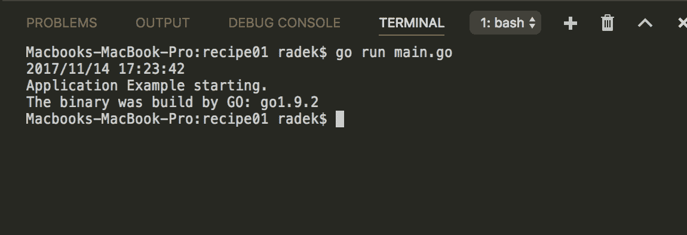

# 它是如何工作的...

`runtime` 包包含许多有用的函数。要找出 Go 运行时版本，可以使用 `Version` 函数。文档说明该函数返回提交的哈希值，以及二进制构建时的日期或标签。

实际上，`Version` 函数返回 `runtime/internal/sys` 的 `Version` 常量。常量本身位于 `$GOROOT/src/runtime/internal/sys/zversion.go` 文件中。

这个 `.go` 文件是由 `go dist` 工具生成的，版本是通过 `go/src/cmd/dist/build.go` 文件中的 `findgoversion` 函数解析的，如下所述。

`$GOROOT/VERSION` 优先级最高。如果文件为空或不存在，则使用 `$GOROOT/VERSION.cache` 文件。如果也找不到 `$GOROOT/VERSION.cache`，则工具会尝试使用 Git 信息来解析版本，但在这种情况下，您需要为 Go 源代码初始化 Git 存储库。

# 访问程序参数

参数化程序运行的最简单方法是使用命令行参数作为程序参数。

简单地说，参数化的程序调用可能如下所示：`./parsecsv user.csv role.csv`。在这种情况下，`parsecsv`是执行二进制文件的名称，`user.csv`和`role.csv`是修改程序调用的参数（在这种情况下是要解析的文件）。

# 如何做...

1.  打开控制台并创建文件夹 `chapter01/recipe02`。

1.  导航到目录。

1.  创建 `main.go` 文件，内容如下：

```go
        package main
        import (
          "fmt"
          "os"
        )

        func main() {

          args := os.Args

          // This call will print
          // all command line arguments.
          fmt.Println(args)

          // The first argument, zero item from slice,
          // is the name of the called binary.
          programName := args[0]
          fmt.Printf("The binary name is: %s \n", programName)

          // The rest of the arguments could be obtained
          // by omitting the first argument.
          otherArgs := args[1:]
          fmt.Println(otherArgs)

          for idx, arg := range otherArgs {
            fmt.Printf("Arg %d = %s \n", idx, arg)
          }
        }
```

1.  通过执行 `go build -o test` 构建二进制文件。

1.  执行命令`./test arg1 arg2`。（Windows 用户可以运行`test.exe arg1 arg2`）。

1.  在终端中查看输出：

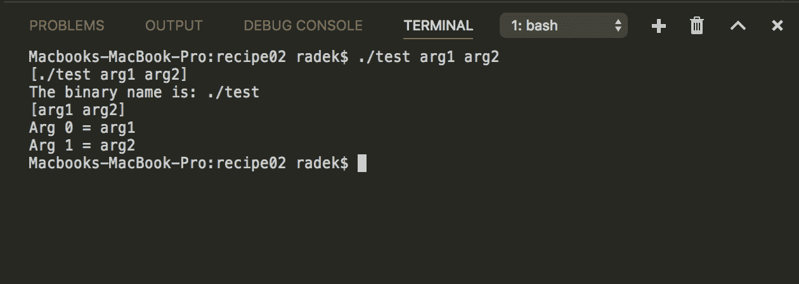

# 它是如何工作的...

Go 标准库提供了几种访问程序调用参数的方法。最通用的方法是通过 OS 包中的`Args`变量访问参数。

通过这种方式，您可以在字符串切片中获取命令行中的所有参数。这种方法的优点是参数的数量是动态的，这样您可以，例如，将要由程序处理的文件的名称传递给程序。

上面的示例只是回显传递给程序的所有参数。最后，假设二进制文件名为`test`，程序运行由终端命令`./test arg1 arg2`执行。

具体来说，`os.Args[0]`将返回`./test`。`os.Args[1:]`返回不带二进制名称的其余参数。在现实世界中，最好不要依赖于传递给程序的参数数量，而是始终检查参数数组的长度。否则，如果给定索引上的参数不在范围内，程序将自然地发生恐慌。

# 还有更多...

如果参数被定义为标志，`-flag value`，则需要额外的逻辑来将值分配给标志。在这种情况下，使用`flag`包有更好的方法来解析这些标志。这种方法是下一个配方的一部分。

# 使用 flag 包创建程序接口

前面的配方描述了如何通过非常通用的方法访问程序参数。

这个配方将提供一种通过程序标志定义接口的方法。这种方法主导了基于 GNU/Linux、BSD 和 macOS 的系统。程序调用的示例可以是`ls -l`，在*NIX 系统上，它将列出当前目录中的文件。

Go 标志处理包不支持像`ls -ll`这样的标志组合，其中在单个破折号后有多个标志。每个标志必须是单独的。Go 标志包也不区分长选项和短选项。最后，`-flag`和`--flag`是等效的。

# 如何做到...

1.  打开控制台并创建文件夹`chapter01/recipe03`。

1.  导航到目录。

1.  创建带有以下内容的`main.go`文件：

```go
        package main
        import (
          "flag"
          "fmt"
          "log"
          "os"
          "strings"
        )

        // Custom type need to implement
        // flag.Value interface to be able to
        // use it in flag.Var function.
        type ArrayValue []string

        func (s *ArrayValue) String() string {
          return fmt.Sprintf("%v", *s)
        }

        func (a *ArrayValue) Set(s string) error {
          *a = strings.Split(s, ",")
          return nil
        }

        func main() {

          // Extracting flag values with methods returning pointers
          retry := flag.Int("retry", -1, "Defines max retry count")

          // Read the flag using the XXXVar function.
          // In this case the variable must be defined
          // prior to the flag.
          var logPrefix string
          flag.StringVar(&logPrefix, "prefix", "", "Logger prefix")

          var arr ArrayValue
          flag.Var(&arr, "array", "Input array to iterate through.")

          // Execute the flag.Parse function, to
          // read the flags to defined variables.
          // Without this call the flag
          // variables remain empty.
          flag.Parse()

          // Sample logic not related to flags
          logger := log.New(os.Stdout, logPrefix, log.Ldate)

          retryCount := 0
          for retryCount < *retry {
            logger.Println("Retrying connection")
            logger.Printf("Sending array %v\n", arr)
            retryCount++
          }
        }
```

1.  通过执行`go build -o util`来构建二进制文件。

1.  从控制台执行`./util -retry 2 -prefix=example -array=1,2`。

1.  在终端中查看输出：

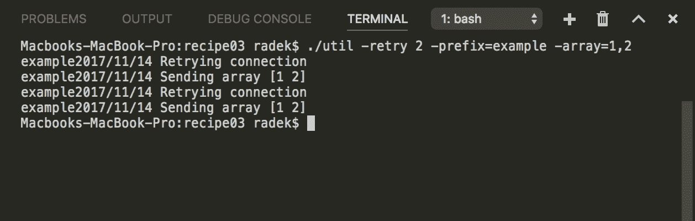

# 它是如何工作的...

对于代码中的标志定义，`flag`包定义了两种类型的函数。

第一种类型是标志类型的简单名称，例如`Int`。这个函数将返回整数变量的指针，解析标志的值将存储在其中。

`XXXVar`函数是第二种类型。它们提供相同的功能，但需要提供变量的指针。解析的标志值将存储在给定的变量中。

Go 库还支持自定义标志类型。自定义类型必须实现`flag`包中的`Value`接口。

例如，假设标志`retry`定义了重新连接到端点的重试限制，标志`prefix`定义了日志中每行的前缀，而`array`是作为有效负载发送到服务器的数组标志。终端中的程序调用将如`./util -retry 2 -prefix=example array=1,2`。

上述代码的重要部分是`Parse()`函数，它从`Args[1:]`中解析定义的标志。在定义所有标志并在访问值之前必须调用该函数。

上面的代码显示了如何从命令行标志中解析一些数据类型。类似地，其他内置类型也可以解析。

最后一个标志`array`演示了自定义类型标志的定义。请注意，`ArrayType`实现了`flag`包中的`Value`接口。

# 还有更多...

`flag`包包含更多函数来设计带有标志的接口。值得阅读`FlagSet`的文档。

通过定义新的`FlagSet`，可以通过调用`myFlagset.Parse(os.Args[2:])`来解析参数。这样你就可以基于第一个标志拥有标志子集。

# 使用默认值获取和设置环境变量

前一个教程，*使用 flag 包创建程序接口*，描述了如何将标志用作程序参数。

特别是对于较大的应用程序，另一种典型的参数化方式是使用环境变量进行配置。环境变量作为配置选项显著简化了应用程序的部署。这在云基础设施中也非常常见。

通常，本地数据库连接和自动构建环境的配置是不同的。

如果配置由环境变量定义，就不需要更改应用程序配置文件甚至应用程序代码。导出的环境变量（例如`DBSTRING`）就是我们所需要的。如果环境变量不存在，将配置默认值也非常实用。这样，应用程序开发人员的生活就轻松多了。

本教程将演示如何读取、设置和取消设置环境变量。它还将向您展示如何在变量未设置时实现默认选项。

# 如何做…

1.  打开控制台并创建文件夹`chapter01/recipe04`。

1.  导航到目录。

1.  创建`get.go`文件，内容如下：

```go
        package main

        import (
          "log"
          "os"
        )

        func main() {
          connStr := os.Getenv("DB_CONN")
          log.Printf("Connection string: %s\n", connStr)
        }
```

1.  通过在终端中调用`DB_CONN=db:/user@example && go run get.go`来执行代码。

1.  在终端中查看输出：

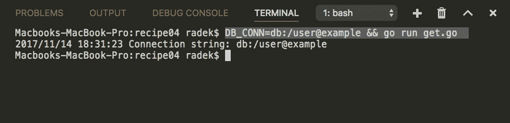

1.  创建`lookup.go`文件，内容如下：

```go
        package main

        import (
          "log"
          "os"
        )

        func main() {

          key := "DB_CONN"

          connStr, ex := os.LookupEnv(key)
          if !ex {
            log.Printf("The env variable %s is not set.\n", key)
          }
          fmt.Println(connStr)
        }
```

1.  在终端中调用`unset DB_CONN && go run lookup.go`来执行代码。

1.  在终端中查看输出：

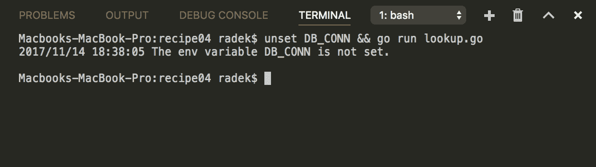

1.  创建`main.go`文件，内容如下：

```go
        package main
        import (
          "log"
          "os"
        )

        func main() {

          key := "DB_CONN"
          // Set the environmental variable.
          os.Setenv(key, "postgres://as:as@example.com/pg?
                          sslmode=verify-full")
          val := GetEnvDefault(key, "postgres://as:as@localhost/pg?
                                     sslmode=verify-full")
          log.Println("The value is :" + val)

          os.Unsetenv(key)
          val = GetEnvDefault(key, "postgres://as:as@127.0.0.1/pg?
                                    sslmode=verify-full")
          log.Println("The default value is :" + val)

        }

        func GetEnvDefault(key, defVal string) string {
          val, ex := os.LookupEnv(key)
          if !ex {
            return defVal
          }
          return val
        }
```

1.  在终端中执行`go run main.go`来运行代码。

1.  在终端中查看输出：

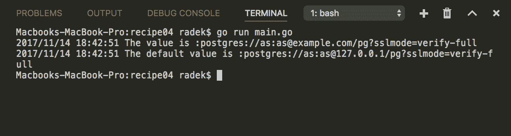

# 它是如何工作的…

环境变量可以通过`os`包中的`Getenv`和`Setenv`函数来访问。这些函数的名称不言自明，不需要进一步的描述。

`os`包中还有一个有用的函数。`LookupEnv`函数提供两个值作为结果；变量的值，以及布尔值，定义变量在环境中是否设置。

`os.Getenv`函数的缺点是，即使在环境变量未设置的情况下，它也会返回空字符串。

这个缺点可以通过`os.LookupEnv`函数来克服，该函数返回环境变量的字符串值和一个布尔值，指示变量是否设置。

要实现检索环境变量或默认值，使用`os.LookupEnv`函数。简单地说，如果变量未设置，也就是第二个返回值是`false`，那么就返回默认值。该函数的使用是第 9 步的一部分。

# 检索当前工作目录

应用程序的另一个有用信息来源是目录，程序二进制文件所在的位置。有了这些信息，程序就可以访问与二进制文件一起放置的资源和文件。

自 Go 1.8 版本以来，本教程使用了 Go 的解决方案。这是首选方案。

# 如何做…

1.  打开控制台并创建文件夹`chapter01/recipe05`。

1.  导航到目录。

1.  创建`main.go`文件，内容如下：

```go
        package main

        import (
          "fmt"
          "os"
          "path/filepath"
        )

        func main() {
          ex, err := os.Executable()
          if err != nil {
            panic(err)
          }

          // Path to executable file
          fmt.Println(ex)

          // Resolve the direcotry
          // of the executable
          exPath := filepath.Dir(ex)
          fmt.Println("Executable path :" + exPath)

          // Use EvalSymlinks to get
          // the real path.
          realPath, err := filepath.EvalSymlinks(exPath)
          if err != nil {
            panic(err)
          }
          fmt.Println("Symlink evaluated:" + realPath)
        }
```

1.  通过命令`go build -o binary`构建二进制文件。

1.  通过终端调用`./binary`来执行二进制文件。

1.  查看输出。它应该显示在您的机器上的绝对路径：

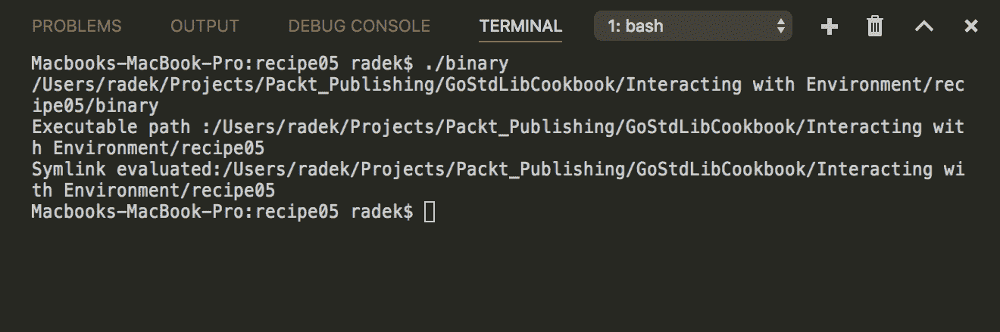

# 它是如何工作的…

自 Go 1.8 以来，`os`包中的`Executable`函数是解析可执行文件路径的首选方法。`Executable`函数返回执行的二进制文件的绝对路径（除非返回错误）。

为了解析二进制路径的目录，应用了`filepath`包中的`Dir`。唯一的问题是结果可能是`symlink`或它指向的路径。

为了克服这种不稳定的行为，可以使用`filepath`包中的`EvalSymlinks`来应用到结果路径上。通过这种方法，返回的值将是二进制文件的真实路径。

可以使用`os`库中的`Executable`函数获取二进制文件所在目录的信息。

请注意，如果代码是通过`go run`命令运行的，实际的可执行文件位于临时目录中。

# 获取当前进程 PID

了解正在运行的进程的 PID 是有用的。PID 可以被操作系统实用程序用来查找有关进程本身的信息。在进程失败的情况下，了解 PID 也很有价值，这样您可以在系统日志中跟踪进程行为，例如`/var/log/messages`，`/var/log/syslog`。

本示例向您展示了如何使用`os`包获取执行程序的 PID，并将其与操作系统实用程序一起使用以获取更多信息。

# 如何做…

1.  打开控制台并创建文件夹`chapter01/recipe06`。

1.  导航到目录。

1.  使用以下内容创建`main.go`文件：

```go
        package main

        import (
          "fmt"
          "os"
          "os/exec"
          "strconv"
        )

        func main() {

          pid := os.Getpid()
          fmt.Printf("Process PID: %d \n", pid)

          prc := exec.Command("ps", "-p", strconv.Itoa(pid), "-v")
          out, err := prc.Output()
          if err != nil {
            panic(err)
          }

          fmt.Println(string(out))
        }
```

1.  通过执行`go run main.go`来运行代码。

1.  在终端中查看输出：

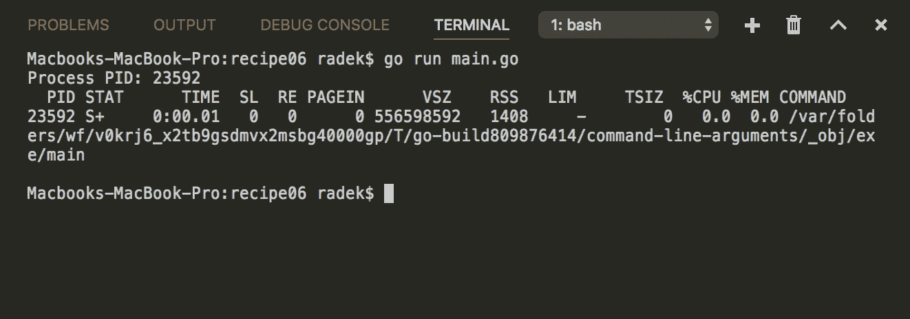

# 工作原理…

`os`包中的`Getpid`函数返回进程的 PID。示例代码展示了如何从操作系统实用程序`ps`获取有关进程的更多信息。

在应用程序启动时打印 PID 可能很有用，这样在崩溃时也可以通过检索到的 PID 来调查原因。

# 处理操作系统信号

信号是操作系统与正在运行的进程通信的基本方式。最常见的两个信号是`SIGINT`和`SIGTERM`。这些信号会导致程序终止。

还有一些信号，比如`SIGHUP`。`SIGHUP`表示调用进程的终端已关闭，例如，程序可以决定转移到后台。

Go 提供了一种处理应用程序接收到信号时的行为的方法。本示例将提供一个实现处理的示例。

# 如何做…

1.  打开控制台并创建文件夹`chapter01/recipe07`。

1.  导航到目录。

1.  使用以下内容创建`main.go`文件：

```go
        package main

        import (
          "fmt"
          "os"
          "os/signal"
          "syscall"
        )

        func main() {

          // Create the channel where the received
          // signal would be sent. The Notify
          // will not block when the signal
          // is sent and the channel is not ready.
          // So it is better to
          // create buffered channel.
          sChan := make(chan os.Signal, 1)

          // Notify will catch the
          // given signals and send
          // the os.Signal value
          // through the sChan.
          // If no signal specified in 
          // argument, all signals are matched.
          signal.Notify(sChan,
            syscall.SIGHUP,
            syscall.SIGINT,
            syscall.SIGTERM,
            syscall.SIGQUIT)

          // Create channel to wait till the
          // signal is handled.
          exitChan := make(chan int)
          go func() {
            signal := <-sChan
            switch signal {
              case syscall.SIGHUP:
                fmt.Println("The calling terminal has been closed")
                exitChan <- 0

              case syscall.SIGINT:
                fmt.Println("The process has been interrupted by CTRL+C")
                exitChan <- 1

              case syscall.SIGTERM:
                fmt.Println("kill SIGTERM was executed for process")
                exitChan <- 1

              case syscall.SIGQUIT:
                fmt.Println("kill SIGQUIT was executed for process")
                exitChan <- 1
            }
          }()

          code := <-exitChan
          os.Exit(code)
        }
```

1.  通过执行`go run main.go`来运行代码。

1.  通过按下*CTRL* + *C*发送`SIGINT`信号给应用程序。

1.  查看输出：

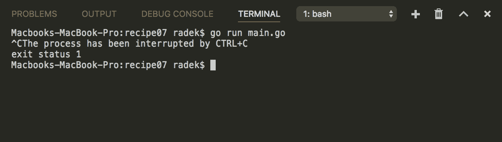

# 工作原理…

在资源被获取的应用程序中，如果立即终止可能会发生资源泄漏。最好处理信号并采取一些必要的步骤来释放资源。上述代码展示了如何做到这一点的概念。

`signal`包中的`Notify`函数将帮助我们处理接收到的信号。

如果在`Notify`函数中未指定信号作为参数，函数将捕获所有可能的信号。

请注意，`signal`包的`Notify`函数通过`sChan`通道与`goroutine`通信。`Notify`然后捕获定义的信号并将其发送到`goroutine`进行处理。最后，`exitChan`用于解析进程的退出代码。

重要的信息是，如果分配的通道未准备好，`Notify`函数将不会阻止信号。这样信号可能会被错过。为了避免错过信号，最好创建缓冲通道。

请注意，`SIGKILL`和`SIGSTOP`信号可能无法被`Notify`函数捕获，因此无法处理这些信号。

# 调用外部进程

Go 二进制文件也可以用作各种实用程序的工具，并且可以使用`go run`来替代 bash 脚本。出于这些目的，通常会调用命令行实用程序。

在这个示例中，将提供如何执行和处理子进程的基础知识。

# 准备工作

测试以下命令是否在你的终端中工作：

1.  测试`ls`（Windows 中为`dir`）命令是否存在于你的`$PATH`中。

1.  你应该能够在终端中执行`ls`（Windows 中为`dir`）命令。

# 如何做…

以下步骤涵盖了解决方案：

1.  打开控制台并创建文件夹`chapter01/recipe08`。

1.  导航到目录。

1.  创建`run.go`文件，内容如下：

```go
        package main

        import (
          "bytes"
          "fmt"
          "os/exec"
        )

        func main() {

          prc := exec.Command("ls", "-a")
          out := bytes.NewBuffer([]byte{})
          prc.Stdout = out
          err := prc.Run()
          if err != nil {
            fmt.Println(err)
          }

          if prc.ProcessState.Success() {
            fmt.Println("Process run successfully with output:\n")
            fmt.Println(out.String())
          }
        }
```

1.  通过执行`go run run.go`来运行代码。

1.  在终端中查看输出：

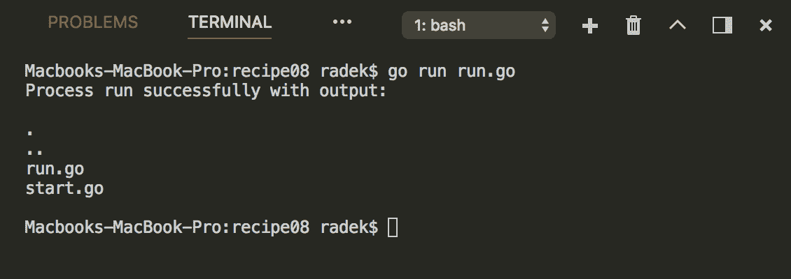

1.  创建`start.go`文件，内容如下：

```go
        package main

        import (
          "fmt"
          "os/exec"
        )

        func main() {

          prc := exec.Command("ls", "-a")
          err := prc.Start()
          if err != nil {
            fmt.Println(err)
          }

          prc.Wait()

          if prc.ProcessState.Success() {
            fmt.Println("Process run successfully with output:\n")
            fmt.Println(out.String())
          }
        }
```

1.  通过执行`go run start.go`来运行代码。

1.  在终端中查看输出：

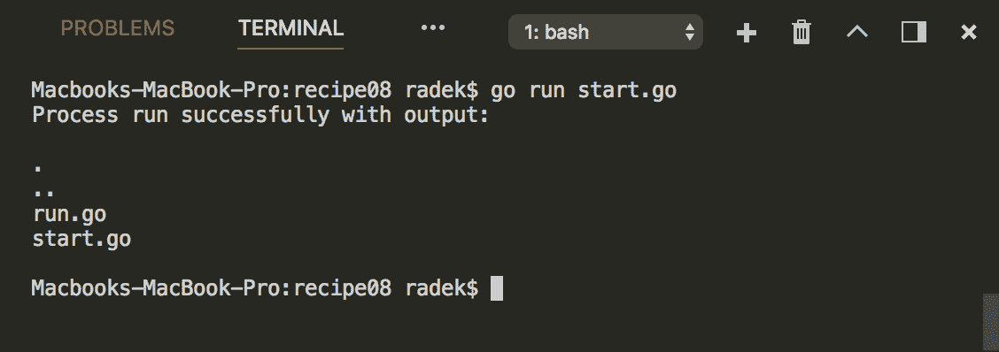

# 工作原理…

Go 标准库提供了一种简单的调用外部进程的方法。这可以通过`os/exec`包的`Command`函数来实现。

最简单的方法是创建`Cmd`结构并调用`Run`函数。`Run`函数执行进程并等待其完成。如果命令退出时出现错误，`err`值将不为空。

这更适合调用操作系统的实用程序和工具，这样程序不会挂起太久。

进程也可以异步执行。这可以通过调用`Cmd`结构的`Start`方法来实现。在这种情况下，进程被执行，但是主`goroutine`不会等待它结束。`Wait`方法可以用来等待进程结束。`Wait`方法完成后，进程的资源将被释放。

这种方法更适合执行长时间运行的进程和程序依赖的服务。

# 另请参阅

这个示例描述了如何简单地执行子进程。本章还提供了*检索子进程信息*和*从子进程读取/写入*的示例，介绍了如何从子进程读取和写入，并获取有用的进程信息的步骤。

# 检索子进程信息

*调用外部进程*示例描述了如何同步和异步调用子进程。自然地，要处理进程行为，你需要更多地了解进程。这个示例展示了如何在子进程终止后获取 PID 和基本信息。

关于运行进程的信息只能通过`syscall`包获得，而且高度依赖于平台。

# 准备工作

测试`sleep`（Windows 中为`timeout`）命令是否存在于终端中。

# 如何做…

1.  打开控制台并创建文件夹`chapter01/recipe09`。

1.  导航到目录。

1.  创建`main_running.go`文件，内容如下：

```go
        package main

        import (
          "fmt"
          "os/exec"
          "runtime"
        )

        func main() {

          var cmd string
          if runtime.GOOS == "windows" {
            cmd = "timeout"
          } else {
            cmd = "sleep"
          }
          proc := exec.Command(cmd, "1")
          proc.Start()

          // No process state is returned
          // till the process finish.
          fmt.Printf("Process state for running process: %v\n",
                     proc.ProcessState)

          // The PID could be obtain
          // event for the running process
          fmt.Printf("PID of running process: %d\n\n", 
                     proc.Process.Pid)
        }
```

1.  通过执行`go run main_running.go`来运行代码。

1.  在终端中查看输出：

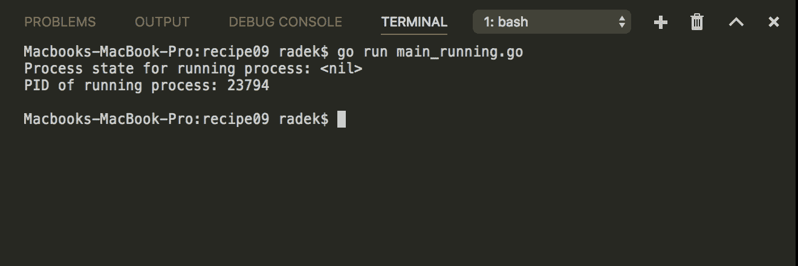

1.  创建`main.go`文件，内容如下：

```go
        func main() {

          var cmd string
          if runtime.GOOS == "windows" {
            cmd = "timeout"
          } else {
            cmd = "sleep"
          }

          proc := exec.Command(cmd, "1")
          proc.Start()

          // Wait function will
          // wait till the process ends.
          proc.Wait()

          // After the process terminates
          // the *os.ProcessState contains
          // simple information
          // about the process run
          fmt.Printf("PID: %d\n", proc.ProcessState.Pid())
          fmt.Printf("Process took: %dms\n", 
                     proc.ProcessState.SystemTime()/time.Microsecond)
          fmt.Printf("Exited sucessfuly : %t\n",
                     proc.ProcessState.Success())
        }
```

1.  通过执行`go run main.go`来运行代码。

1.  在终端中查看输出：

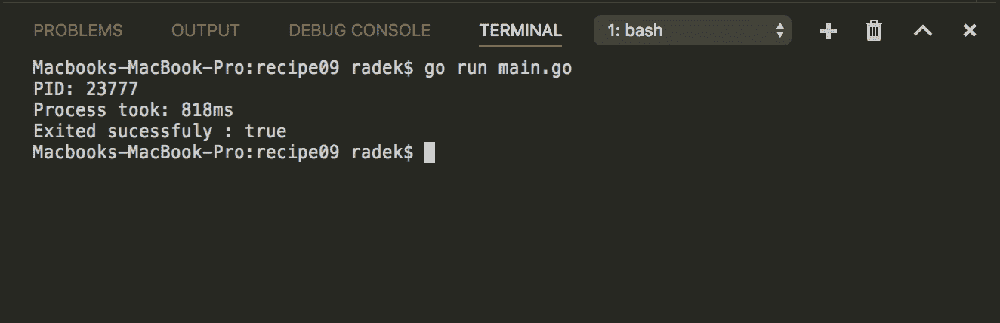

# 工作原理…

`os/exec`标准库提供了执行进程的方法。使用`Command`，将返回`Cmd`结构。`Cmd`提供了对进程表示的访问。当进程正在运行时，你只能找到 PID。

你只能获取有关进程的少量信息。但是通过检索进程的 PID，你可以调用操作系统的实用程序来获取更多信息。

请记住，即使子进程正在运行，也可以获取其 PID。另一方面，只有在进程终止后，`os`包的`ProcessState`结构才可用。

# 另请参阅

本章中有与进程处理相关的*从子进程中读取/写入*和*调用外部进程*的配方。

# 从子进程中读取/写入

每个执行的进程都有标准输出、输入和错误输出。Go 标准库提供了读取和写入这些内容的方法。

本配方将介绍如何读取进程的输出并写入子进程的输入的方法。

# 准备就绪

验证以下命令是否在终端中工作：

1.  测试终端中是否存在`ls`（Windows 中的`dir`）命令。

1.  您应该能够在终端中执行`ls`（Windows 中的`dir`）命令。

# 如何做…

1.  打开控制台并创建文件夹`chapter01/recipe10`。

1.  导航到目录。

1.  创建`main_read_output.go`文件，内容如下：

```go
       package main

       import (
         "fmt"
         "os/exec"
         "runtime"
       )

       func main() {

         var cmd string

         if runtime.GOOS == "windows" {
           cmd = "dir"
         } else {
           cmd = "ls"
         }

         proc := exec.Command(cmd)

         // Output will run the process
         // terminates and returns the standard
         // output in a byte slice.
         buff, err := proc.Output()

         if err != nil {
           panic(err)
         }

         // The output of child
         // process in form
         // of byte slice
         // printed as string
         fmt.Println(string(buff))

       }
```

1.  通过执行`go run main_read_output.go`来运行代码。

1.  在终端中查看输出：

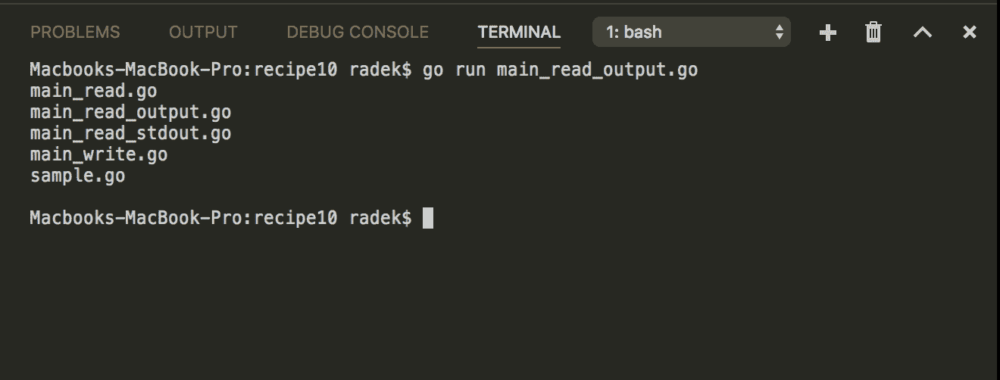

1.  创建`main_read_stdout.go`文件，内容如下：

```go
        package main

        import (
          "bytes"
          "fmt"
          "os/exec"
          "runtime"
        )

        func main() {

          var cmd string

          if runtime.GOOS == "windows" {
            cmd = "dir"
          } else {
            cmd = "ls"
          }

          proc := exec.Command(cmd)

          buf := bytes.NewBuffer([]byte{})

          // The buffer which implements
          // io.Writer interface is assigned to
          // Stdout of the process
          proc.Stdout = buf

          // To avoid race conditions
          // in this example. We wait till
          // the process exit.
          proc.Run()

          // The process writes the output to
          // to buffer and we use the bytes
          // to print the output.
          fmt.Println(string(buf.Bytes()))

        }
```

1.  通过执行`go run main_read_stdout.go`来运行代码。

1.  在终端中查看输出：

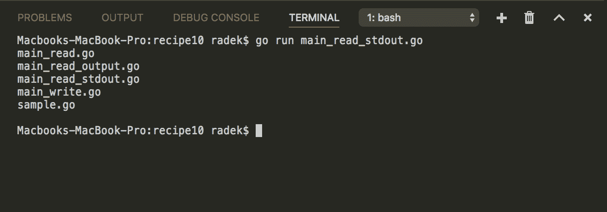

1.  创建`main_read_read.go`文件，内容如下：

```go
        package main

        import (
          "bufio"
          "context"
          "fmt"
          "os/exec"
          "time"
        )

        func main() {
          cmd := "ping"
          timeout := 2 * time.Second

          // The command line tool
          // "ping" is executed for
          // 2 seconds
          ctx, _ := context.WithTimeout(context.TODO(), timeout)
          proc := exec.CommandContext(ctx, cmd, "example.com")

          // The process output is obtained
          // in form of io.ReadCloser. The underlying
          // implementation use the os.Pipe
          stdout, _ := proc.StdoutPipe()
          defer stdout.Close()

          // Start the process
          proc.Start()

          // For more comfortable reading the
          // bufio.Scanner is used.
          // The read call is blocking.
          s := bufio.NewScanner(stdout)
          for s.Scan() {
            fmt.Println(s.Text())
          }
        }
```

1.  通过执行`go run main_read.go`来运行代码。

1.  在终端中查看输出：

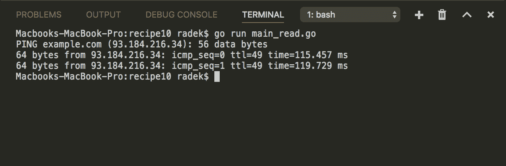

1.  创建`sample.go`文件，内容如下：

```go
        package main

        import (
          "bufio"
          "fmt"
          "os"
        )

        func main() {
          sc := bufio.NewScanner(os.Stdin)

          for sc.Scan() {
            fmt.Println(sc.Text())
          }
        }
```

1.  创建`main.go`文件，内容如下：

```go
        package main

        import (
          "bufio"
          "fmt"
          "io"
          "os/exec"
          "time"
        )

        func main() {
          cmd := []string{"go", "run", "sample.go"}

          // The command line tool
          // "ping" is executed for
          // 2 seconds
          proc := exec.Command(cmd[0], cmd[1], cmd[2])

          // The process input is obtained
          // in form of io.WriteCloser. The underlying
          // implementation use the os.Pipe
          stdin, _ := proc.StdinPipe()
          defer stdin.Close()

          // For debugging purposes we watch the
          // output of the executed process
          stdout, _ := proc.StdoutPipe()
          defer stdout.Close()

          go func() {
            s := bufio.NewScanner(stdout)
            for s.Scan() {
              fmt.Println("Program says:" + s.Text())
            }
          }()

          // Start the process
          proc.Start()

          // Now the following lines
          // are written to child
          // process standard input
          fmt.Println("Writing input")
          io.WriteString(stdin, "Hello\n")
          io.WriteString(stdin, "Golang\n")
          io.WriteString(stdin, "is awesome\n")

          time.Sleep(time.Second * 2)

          proc.Process.Kill()

        }
```

1.  通过执行`go run main.go`来运行代码。

1.  在终端中查看输出：

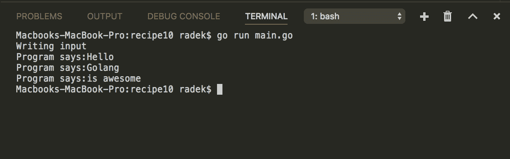

# 工作原理…

`os/exec`包的`Cmd`结构提供了访问进程输出/输入的函数。有几种方法可以读取进程的输出。

读取进程输出的最简单方法之一是使用`Cmd`结构的`Output`或`CombinedOutput`方法（获取`Stderr`和`Stdout`）。在调用此函数时，程序会同步等待子进程终止，然后将输出返回到字节缓冲区。

除了`Output`和`OutputCombined`方法外，`Cmd`结构提供了`Stdout`属性，可以将`io.Writer`分配给它。分配的写入器然后作为进程输出的目的地。它可以是文件、字节缓冲区或任何实现`io.Writer`接口的类型。

读取进程输出的最后一种方法是通过调用`Cmd`结构的`StdoutPipe`方法获取`io.Reader`。`StdoutPipe`方法在`Stdout`之间创建管道，进程在其中写入输出，并提供`Reader`，它作为程序读取进程输出的接口。这样，进程的输出被传送到检索到的`io.Reader`。

向进程的`stdin`写入的方式相同。在所有选项中，将演示使用`io.Writer`的方式。

可以看到，有几种方法可以从子进程中读取和写入。使用`stderr`和`stdin`的方式几乎与步骤 6-7 中描述的方式相同。最后，访问输入/输出的方法可以这样分为：

+   同步（等待进程结束并获取字节）：使用`Cmd`的`Output`和`CombinedOutput`方法。

+   IO：输出或输入以`io.Writer/Reader`的形式提供。`XXXPipe`和`StdXXX`属性是这种方法的正确选择。

IO 类型更加灵活，也可以异步使用。

# 优雅地关闭应用程序

服务器和守护程序是长时间运行的程序（通常是几天甚至几周）。这些长时间运行的程序通常在开始时分配资源（数据库连接，网络套接字），并在资源存在的时间内保持这些资源。如果这样的进程被终止并且关闭未得到适当处理，可能会发生资源泄漏。为了避免这种行为，应该实现所谓的优雅关闭。

在这种情况下，优雅意味着应用程序捕获终止信号（如果可能的话），并在终止之前尝试清理和释放分配的资源。这个食谱将向您展示如何实现优雅关闭。

食谱*处理操作系统信号*描述了捕获操作系统信号。相同的方法将用于实现优雅关闭。在程序终止之前，它将清理并执行一些其他活动。

# 如何做...

1.  打开控制台并创建文件夹`chapter01/recipe11`。

1.  导航到目录。

1.  创建`main.go`文件，内容如下：

```go
        package main

        import (
          "fmt"
          "io"
          "log"
          "os"
          "os/signal"
          "syscall"
          "time"
        )

        var writer *os.File

        func main() {

          // The file is opened as
          // a log file to write into.
          // This way we represent the resources
          // allocation.
          var err error
          writer, err = os.OpenFile(fmt.Sprintf("test_%d.log",
                time.Now().Unix()), os.O_RDWR|os.O_CREATE, os.ModePerm)
          if err != nil {
            panic(err)
          }

          // The code is running in a goroutine
          // independently. So in case the program is
          // terminated from outside, we need to
          // let the goroutine know via the closeChan
          closeChan := make(chan bool)
          go func() {
            for {
              time.Sleep(time.Second)
              select {
                case <-closeChan:
                  log.Println("Goroutine closing")
                  return
                default:
                  log.Println("Writing to log")
                  io.WriteString(writer, fmt.Sprintf("Logging access
                                 %s\n", time.Now().String()))
              }  

            }
          }()

          sigChan := make(chan os.Signal, 1)
          signal.Notify(sigChan,
            syscall.SIGTERM,
            syscall.SIGQUIT,
            syscall.SIGINT)

          // This is blocking read from
          // sigChan where the Notify function sends
          // the signal.
          <-sigChan

          // After the signal is received
          // all the code behind the read from channel could be
          // considered as a cleanup.
          // CLEANUP SECTION
          close(closeChan)
          releaseAllResources()
          fmt.Println("The application shut down gracefully")
        }

        func releaseAllResources() {
          io.WriteString(writer, "Application releasing 
                         all resources\n")
          writer.Close()
        }
```

1.  通过执行`go run main.go`运行代码。

1.  按下*CTRL* + *C*发送`SIGINT`信号。

1.  等待终端输出如下：

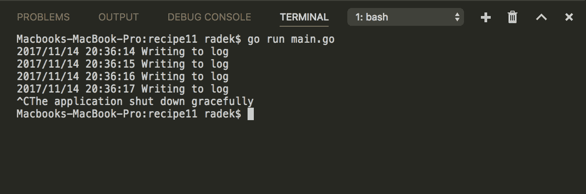

1.  `recipe11`文件夹还应包含一个名为`test_XXXX.log`的文件，其中包含如下行：

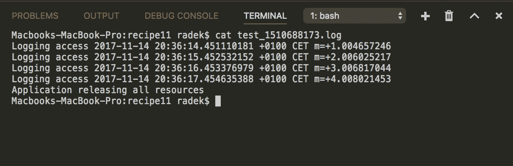

# 它是如何工作的...

从`sigChan`读取是阻塞的，因此程序会一直运行，直到通过通道发送信号。`sigChan`是`Notify`函数发送信号的通道。

程序的主要代码在一个新的`goroutine`中运行。这样，当主函数在`sigChan`上被阻塞时，工作将继续。一旦从操作系统发送信号到进程，`sigChan`接收到信号并在从`sigChan`通道读取的行下面的代码执行。这段代码可以被视为清理部分。

请注意，步骤 7 的终端输出包含最终日志`应用程序释放所有资源`，这是清理部分的一部分。

# 另请参阅

有关信号捕获工作原理的详细描述在食谱*处理操作系统信号*中。

# 使用功能选项进行文件配置

这个食谱与 Go 标准库没有直接关系，但包括如何处理应用程序的可选配置。该食谱将在实际情况下使用函数选项模式与文件配置。

# 如何做...

1.  打开控制台并创建文件夹`chapter01/recipe12`。

1.  导航到目录。

1.  创建`main.go`文件，内容如下：

```go
        package main

        import (
          "encoding/json"
          "fmt"
          "os"
        )

        type Client struct {
          consulIP string
          connString string
        }

        func (c *Client) String() string {
          return fmt.Sprintf("ConsulIP: %s , Connection String: %s",
                             c.consulIP, c.connString)
        }

        var defaultClient = Client{
          consulIP: "localhost:9000",
          connString: "postgres://localhost:5432",
        }

        // ConfigFunc works as a type to be used
        // in functional options
        type ConfigFunc func(opt *Client)

        // FromFile func returns the ConfigFunc
        // type. So this way it could read the configuration
        // from the json.
        func FromFile(path string) ConfigFunc {
          return func(opt *Client) {
            f, err := os.Open(path)
            if err != nil {
              panic(err)
            }
            defer f.Close()
            decoder := json.NewDecoder(f)

            fop := struct {
              ConsulIP string `json:"consul_ip"`
            }{}
            err = decoder.Decode(&fop)
            if err != nil {
              panic(err)
            }
            opt.consulIP = fop.ConsulIP
          }
        }

        // FromEnv reads the configuration
        // from the environmental variables
        // and combines them with existing ones.
        func FromEnv() ConfigFunc {
          return func(opt *Client) {
            connStr, exist := os.LookupEnv("CONN_DB")
            if exist {
              opt.connString = connStr
            }
          }
        }

        func NewClient(opts ...ConfigFunc) *Client {
          client := defaultClient
          for _, val := range opts {
            val(&client)
          }
          return &client
        }

        func main() {
          client := NewClient(FromFile("config.json"), FromEnv())
          fmt.Println(client.String())
        }
```

1.  在同一文件夹中，创建名为`config.json`的文件，内容如下：

```go
        {
          "consul_ip":"127.0.0.1"
        }
```

1.  通过命令`CONN_DB=oracle://local:5921 go run main.go`执行代码。

1.  查看输出：

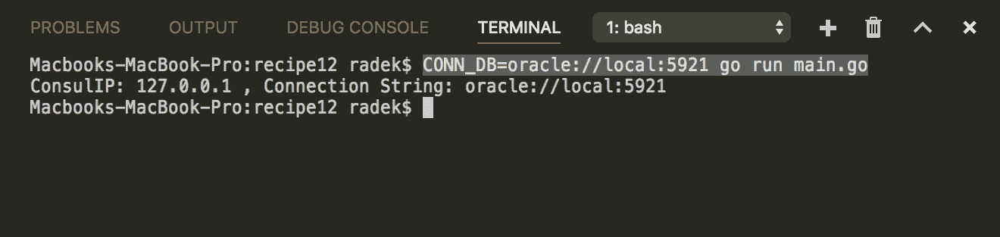

# 它是如何工作的...

函数选项模式的核心概念是配置 API 包含功能参数。在这种情况下，`NewClient`函数接受各种数量的`ConfigFunc`参数，然后逐个应用于`defaultClient`结构。这样，可以以极大的灵活性修改默认配置。

查看`FromFile`和`FromEnv`函数，它们返回`ConfigFunc`，实际上是访问文件或环境变量。

最后，您可以检查输出，该输出应用了配置选项和结果`Client`结构，其中包含来自文件和环境变量的值。
