# 第二章：字符串和其他内容

本章中的配方有：

+   在字符串中查找子字符串

+   将字符串分解为单词

+   使用分隔符连接字符串切片

+   使用 writer 连接字符串

+   使用 tabwriter 对齐文本

+   替换字符串的一部分

+   通过正则表达式模式在文本中查找子字符串

+   从非 Unicode 字符集解码字符串

+   控制大小写

+   解析逗号分隔的数据

+   管理字符串中的空格

+   缩进文本文档

# 介绍

在开发人员的生活中，对字符串和基于字符串的数据进行操作是常见任务。本章介绍如何使用 Go 标准库处理这些任务。毫无疑问，使用标准库可以做很多事情。

检查 Go 是否已正确安装。第一章的*准备就绪*部分，*与环境交互*的*检索 Golang 版本*配方将对您有所帮助。

# 在字符串中查找子字符串

在开发人员中，查找字符串中的子字符串是最常见的任务之一。大多数主流语言都在标准库中实现了这一点。Go 也不例外。本配方描述了 Go 实现这一功能的方式。

# 如何做...

1.  打开控制台并创建文件夹`chapter02/recipe01`。

1.  导航到目录。

1.  创建`contains.go`文件，内容如下：

```go
        package main

        import (
          "fmt"
          "strings"
        )

        const refString = "Mary had a little lamb"

        func main() {

          lookFor := "lamb"
          contain := strings.Contains(refString, lookFor)
          fmt.Printf("The \"%s\" contains \"%s\": %t \n", refString,
                     lookFor, contain)

          lookFor = "wolf"
          contain = strings.Contains(refString, lookFor)
          fmt.Printf("The \"%s\" contains \"%s\": %t \n", refString,
                     lookFor, contain)

          startsWith := "Mary"
          starts := strings.HasPrefix(refString, startsWith)
          fmt.Printf("The \"%s\" starts with \"%s\": %t \n", refString, 
                     startsWith, starts)

          endWith := "lamb"
          ends := strings.HasSuffix(refString, endWith)
          fmt.Printf("The \"%s\" ends with \"%s\": %t \n", refString,
                     endWith, ends)

        }
```

1.  通过执行`go run contains.go`来运行代码。

1.  在终端中查看输出：

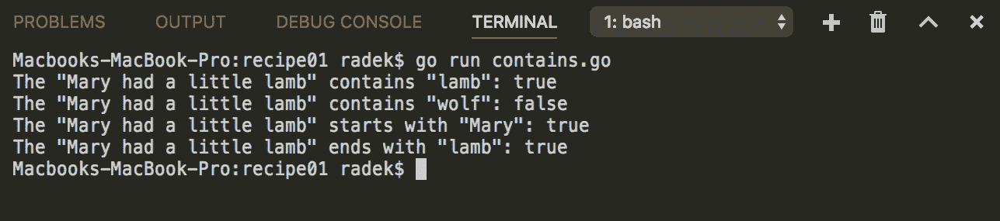

# 它是如何工作的...

Go 库`strings`包含处理字符串操作的函数。这次可以使用`Contains`函数。`Contains`函数只是检查字符串是否包含给定的子字符串。实际上，`Contains`函数中使用了`Index`函数。

要检查字符串是否以子字符串开头，可以使用`HasPrefix`函数。要检查字符串是否以子字符串结尾，可以使用`HasSuffix`函数。

实际上，`Contains`函数是通过使用同一包中的`Index`函数实现的。可以猜到，实际实现方式是这样的：如果给定子字符串的索引大于`-1`，则`Contains`函数返回`true`。

`HasPrefix`和`HasSuffix`函数的工作方式不同：内部实现只是检查字符串和子字符串的长度，如果它们相等或字符串更长，则比较字符串的所需部分。

# 另请参阅

本配方描述了如何匹配精确的子字符串。*通过正则表达式模式在文本中查找子字符串*配方将帮助您了解如何使用正则表达式模式匹配。

# 将字符串分解为单词

将字符串分解为单词可能有些棘手。首先，决定单词是什么，分隔符是什么，是否有任何空格或其他字符。做出这些决定后，可以从`strings`包中选择适当的函数。本配方将描述常见情况。

# 如何做...

1.  打开控制台并创建文件夹`chapter02/recipe02`。

1.  导航到目录。

1.  创建`whitespace.go`文件，内容如下：

```go
        package main

        import (
          "fmt"
          "strings"
        )

        const refString = "Mary had a little lamb"

        func main() {

          words := strings.Fields(refString)
          for idx, word := range words {
            fmt.Printf("Word %d is: %s\n", idx, word)
          }

        }
```

1.  通过执行`go run whitespace.go`来运行代码。

1.  在终端中查看输出：

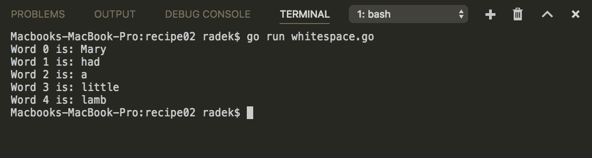

1.  创建另一个名为`anyother.go`的文件，内容如下：

```go
        package main

        import (
          "fmt"
          "strings"
        )

        const refString = "Mary_had a little_lamb"

        func main() {

          words := strings.Split(refString, "_")
          for idx, word := range words {
            fmt.Printf("Word %d is: %s\n", idx, word)
          }

        }
```

1.  通过执行`go run anyother.go`来运行代码。

1.  在终端中查看输出：

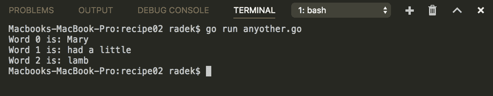

1.  创建另一个名为`specfunction.go`的文件，内容如下：

```go
        package main

        import (
          "fmt"
          "strings"
         )

         const refString = "Mary*had,a%little_lamb"

         func main() {

           // The splitFunc is called for each
           // rune in a string. If the rune
           // equals any of character in a "*%,_"
           // the refString is split.
           splitFunc := func(r rune) bool {
             return strings.ContainsRune("*%,_", r)
           }

           words := strings.FieldsFunc(refString, splitFunc)
           for idx, word := range words {
             fmt.Printf("Word %d is: %s\n", idx, word)
           }

        }
```

1.  通过执行`go run specfunction.go`来运行代码。

1.  在终端中查看输出：

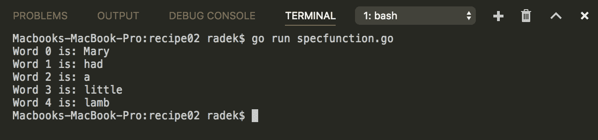

1.  创建另一个名为`regex.go`的文件，内容如下：

```go
        package main

        import (
          "fmt"
          "regexp"
        )

        const refString = "Mary*had,a%little_lamb"

        func main() {

          words := regexp.MustCompile("[*,%_]{1}").Split(refString, -1)
          for idx, word := range words {
            fmt.Printf("Word %d is: %s\n", idx, word)
          }

        }
```

1.  通过执行`go run regex.go`来运行代码。

1.  在终端中查看输出：

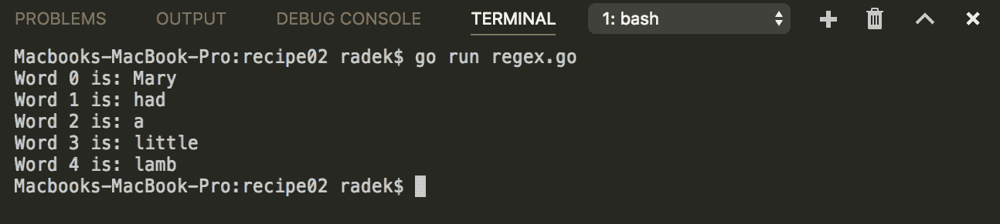

# 它是如何工作的...

将字符串拆分为单词的最简单形式考虑任何空白字符作为分隔符。具体来说，空白字符由`unicode`包中的`IsSpace`函数定义：

```go
'\t', '\n', '\v', '\f', '\r', ' ', U+0085 (NEL), U+00A0 (NBSP). 
```

`strings`包的`Fields`函数可以用于按空格字符拆分句子，如前面提到的。步骤**1-5**涵盖了这种简单情况。

如果需要其他分隔符，就需要使用`Split`函数。使用其他分隔符拆分在步骤**6-8**中介绍。只需注意字符串中的空白字符被省略。

如果您需要更复杂的函数来决定是否在给定点拆分字符串，`FieldsFunc`可能适合您。函数的一个参数是消耗给定字符串的符文并在该点返回`true`的函数。这个选项由步骤**9-11**覆盖。

正则表达式是示例中提到的最后一个选项。`regexp`包的`Regexp`结构包含`Split`方法，它的工作方式与您期望的一样。它在匹配组的位置拆分字符串。这种方法在步骤**12-14**中使用。

# 还有更多...

`strings`包还提供了各种`SplitXXX`函数，可以帮助您实现更具体的任务。

# 使用分隔符连接字符串切片

*将字符串拆分为单词*这个教程引导我们完成了根据定义的规则将单个字符串拆分为子字符串的任务。另一方面，本教程描述了如何使用给定的字符串作为分隔符将多个字符串连接成单个字符串。

一个真实的用例可能是动态构建 SQL 选择语句条件的问题。

# 如何做...

1.  打开控制台并创建文件夹`chapter02/recipe03`。

1.  导航到目录。

1.  创建`join.go`文件，内容如下：

```go
        package main

        import (
          "fmt"
          "strings"
        )

        const selectBase = "SELECT * FROM user WHERE %s "

        var refStringSlice = []string{
          " FIRST_NAME = 'Jack' ",
          " INSURANCE_NO = 333444555 ",
          " EFFECTIVE_FROM = SYSDATE "}

        func main() {

          sentence := strings.Join(refStringSlice, "AND")
          fmt.Printf(selectBase+"\n", sentence)

        }
```

1.  通过执行`go run join.go`来运行代码。

1.  在终端中查看输出：

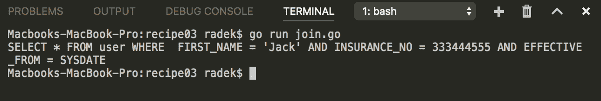

1.  创建`join_manually.go`文件，内容如下：

```go
        package main

        import (
          "fmt"
          "strings"
        )

        const selectBase = "SELECT * FROM user WHERE "

        var refStringSlice = []string{
          " FIRST_NAME = 'Jack' ",
          " INSURANCE_NO = 333444555 ",
          " EFFECTIVE_FROM = SYSDATE "}

        type JoinFunc func(piece string) string

        func main() {

          jF := func(p string) string {
            if strings.Contains(p, "INSURANCE") {
              return "OR"
            }

            return "AND"
          }
          result := JoinWithFunc(refStringSlice, jF)
          fmt.Println(selectBase + result)
        }

         func JoinWithFunc(refStringSlice []string,
                           joinFunc JoinFunc) string {
           concatenate := refStringSlice[0]
           for _, val := range refStringSlice[1:] {
             concatenate = concatenate + joinFunc(val) + val
           }
           return concatenate
        }
```

1.  通过执行`go run join.go`来运行代码。

1.  在终端中查看输出：

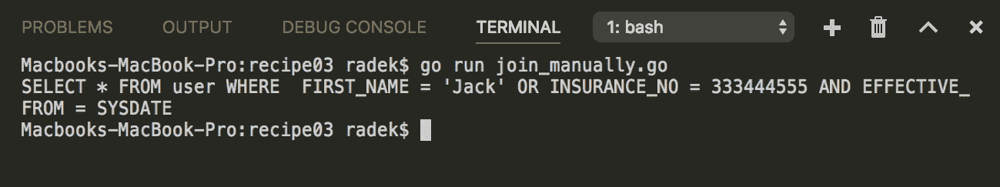

# 它是如何工作的...

为了将字符串切片连接成单个字符串，`strings`包的`Join`函数就在那里。简单地说，您需要提供需要连接的字符串切片。这样，您可以舒适地连接字符串切片。步骤**1-5**展示了使用`Join`函数的方法。

当然，可以通过迭代切片来手动实现连接。这样，您可以通过一些更复杂的逻辑自定义分隔符。步骤**6-8**只是表示手动连接如何与更复杂的决策逻辑一起使用，基于当前处理的字符串。

# 还有更多...

`Join`函数由`bytes`包提供，自然用于连接字节切片。

# 使用写入器连接字符串

除了内置的`+`运算符外，还有更多连接字符串的方法。本教程将描述使用`bytes`包和内置的`copy`函数更高效地连接字符串的方法。

# 如何做...

1.  打开控制台并创建文件夹`chapter02/recipe04`。

1.  导航到目录。

1.  创建`concat_buffer.go`文件，内容如下：

```go
       package main

       import (
         "bytes"
         "fmt"
       )

       func main() {
         strings := []string{"This ", "is ", "even ",
                             "more ", "performant "}
          buffer := bytes.Buffer{}
          for _, val := range strings {
            buffer.WriteString(val)
          }

           fmt.Println(buffer.String())
         }
```

1.  通过执行`go run concat_buffer.go`来运行代码。

1.  在终端中查看输出：

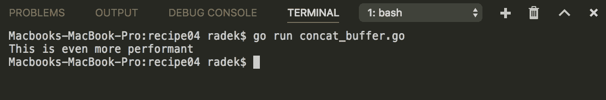

1.  创建`concat_copy.go`文件，内容如下：

```go
        package main

        import (
          "fmt"
        )

        func main() {

          strings := []string{"This ", "is ", "even ",
                              "more ", "performant "}

          bs := make([]byte, 100)
          bl := 0

          for _, val := range strings {
            bl += copy(bs[bl:], []byte(val))
          }

          fmt.Println(string(bs[:]))

        }
```

1.  在终端中执行`go run concat_copy.go`来运行代码。

1.  在终端中查看输出：

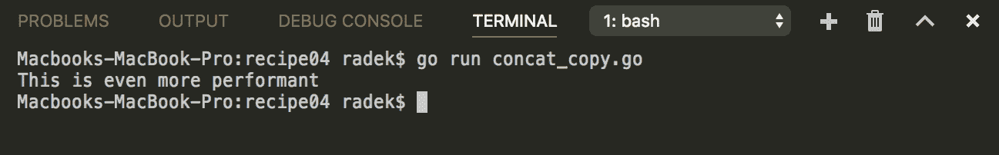

# 它是如何工作的...

步骤**1-5**涵盖了将`bytes`包`Buffer`作为性能友好的字符串连接解决方案的用法。`Buffer`结构实现了`WriteString`方法，可以用于有效地将字符串连接到底层字节切片中。

在所有情况下都不需要使用这种改进，只需要在程序将要连接大量字符串的情况下考虑一下（例如，在内存中的 CSV 导出和其他情况）。

在步骤**6 - 8**中介绍的内置的`copy`函数可以用于完成`string`的连接。这种方法对最终字符串长度有一些假设，或者可以实时完成。然而，如果结果写入的缓冲区的容量小于已写部分和要附加的字符串的总和，缓冲区必须扩展（通常是通过分配具有更大容量的新切片）。

# 还有更多...

仅供比较，这里有一个基准代码，比较了内置的`+`运算符、`bytes.Buffer`和内置的`copy`的性能：

1.  在其中创建一个`bench`文件夹和文件`bench_test.go`，内容如下：

```go
        package main

        import (
          "bytes"
          "testing"
        )

        const testString = "test"

        func BenchmarkConcat(b *testing.B) {
          var str string
          b.ResetTimer()
          for n := 0; n < b.N; n++ {
            str += testString
          }
          b.StopTimer()
        }

        func BenchmarkBuffer(b *testing.B) {
          var buffer bytes.Buffer

          b.ResetTimer()
          for n := 0; n < b.N; n++ {
            buffer.WriteString(testString)
          }
          b.StopTimer()
        }

        func BenchmarkCopy(b *testing.B) {
          bs := make([]byte, b.N)
          bl := 0

          b.ResetTimer()
          for n := 0; n < b.N; n++ {
            bl += copy(bs[bl:], testString)
          }
          b.StopTimer()
        }
```

1.  查看基准测试的结果：

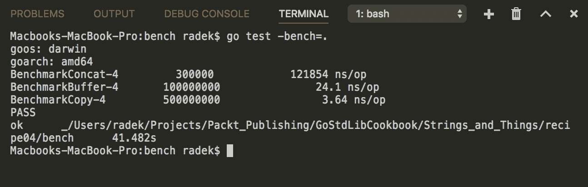

# 使用 tabwriter 对齐文本

在某些情况下，输出（通常是数据输出）是通过制表文本完成的，这些文本以良好排列的单元格格式化。这种格式可以通过`text/tabwriter`包实现。该包提供了`Writer`过滤器，它将带有制表符的文本转换为格式良好的输出文本。

# 如何做...

1.  打开控制台并创建文件夹`chapter02/recipe05`。

1.  导航到目录。

1.  创建`tabwriter.go`文件，内容如下：

```go
        package main

        import (
          "fmt"
          "os"
          "text/tabwriter"
        )

        func main() {

          w := tabwriter.NewWriter(os.Stdout, 15, 0, 1, ' ',
                                   tabwriter.AlignRight)
          fmt.Fprintln(w, "username\tfirstname\tlastname\t")
          fmt.Fprintln(w, "sohlich\tRadomir\tSohlich\t")
          fmt.Fprintln(w, "novak\tJohn\tSmith\t")
          w.Flush()

        }
```

1.  通过执行`go run tabwriter.go`来运行代码。

1.  在终端中查看输出：

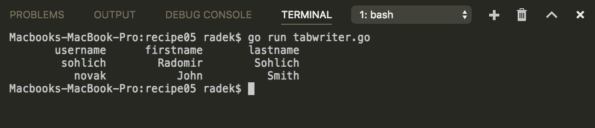

# 它是如何工作的...

通过调用`NewWriter`函数创建具有配置参数的`Writer`过滤器。由此`Writer`写入的所有数据都根据参数进行格式化。这里使用`os.Stdout`仅用于演示目的。

`text/tabwriter`包还提供了一些更多的配置选项，比如`flag`参数。最有用的是`tabwriter.AlignRight`，它配置了写入器在每一列中将内容对齐到右侧。

# 替换字符串的一部分

与字符串处理相关的另一个非常常见的任务是在字符串中替换子字符串。Go 标准库提供了`Replace`函数和`Replacer`类型，用于一次替换多个字符串。

# 如何做...

1.  打开控制台并创建文件夹`chapter02/recipe06`。

1.  导航到目录。

1.  创建`replace.go`文件，内容如下：

```go
        package main

        import (
         "fmt"
         "strings"
        )

        const refString = "Mary had a little lamb"
        const refStringTwo = "lamb lamb lamb lamb"

        func main() {
          out := strings.Replace(refString, "lamb", "wolf", -1)
          fmt.Println(out)

          out = strings.Replace(refStringTwo, "lamb", "wolf", 2)
          fmt.Println(out)
        }
```

1.  通过执行`go run replace.go`来运行代码。

1.  在终端中查看输出：

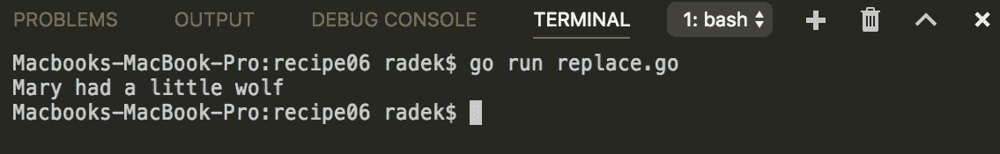

1.  创建`replacer.go`文件，内容如下：

```go
        package main

        import (
          "fmt"
          "strings"
        )

        const refString = "Mary had a little lamb"

        func main() {
          replacer := strings.NewReplacer("lamb", "wolf", "Mary", "Jack")
          out := replacer.Replace(refString)
          fmt.Println(out)
        }
```

1.  通过执行`go run replacer.go`来运行代码。

1.  在终端中查看输出：

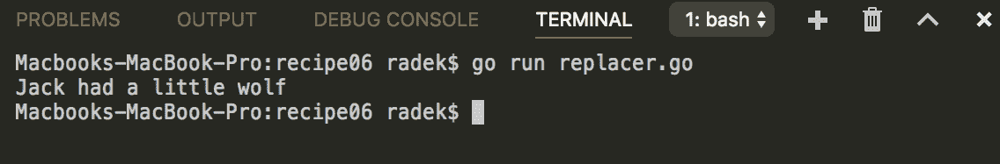

1.  创建`regexp.go`文件，内容如下：

```go
        package main

        import (
          "fmt"
          "regexp"
        )

        const refString = "Mary had a little lamb"

        func main() {
          regex := regexp.MustCompile("l[a-z]+")
          out := regex.ReplaceAllString(refString, "replacement")
          fmt.Println(out)
        }
```

1.  通过执行`go run regexp.go`来运行代码。

1.  在终端中查看输出：

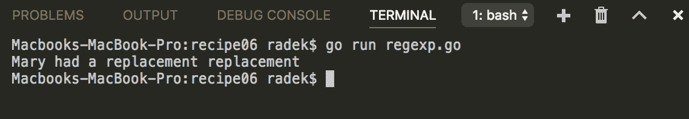

# 它是如何工作的...

`strings`包的`Replace`函数被广泛用于简单的替换。最后一个整数参数定义了将进行多少次替换（在`-1`的情况下，所有字符串都被替换。看到`Replace`的第二个用法，只有前两次出现被替换）。`Replace`函数的用法在步骤**1 - 5**中呈现。

除了`Replace`函数，`Replacer`结构也有`WriteString`方法。这个方法将使用`Replacer`中定义的所有替换写入给定的写入器。这种类型的主要目的是可重用性。它可以一次替换多个字符串，并且对并发使用是安全的；参见步骤**6 - 8**。

替换子字符串，甚至匹配模式的更复杂方法，自然是使用正则表达式。`Regex`类型指针方法`ReplaceAllString`可以用于此目的。步骤**9 - 11**说明了`regexp`包的用法。

# 还有更多...

如果需要更复杂的逻辑来进行替换，那么`regexp`包可能是应该使用的包。

# 通过正则表达式模式在文本中查找子字符串

总是有一些任务，比如验证输入、在文档中搜索信息，甚至从给定字符串中清除不需要的转义字符。对于这些情况，通常使用正则表达式。

Go 标准库包含`regexp`包，涵盖了正则表达式的操作。

# 如何做...

1.  打开控制台并创建文件夹`chapter02/recipe07`。

1.  导航到目录。

1.  创建`regexp.go`文件，内容如下：

```go
        package main

        import (
          "fmt"
          "regexp"
        )

        const refString = `[{ \"email\": \"email@example.com\" \
                             "phone\": 555467890},
                            { \"email\": \"other@domain.com\" \
                             "phone\": 555467890}]`

        func main() {

          // This pattern is simplified for brevity
          emailRegexp := regexp.MustCompile("[a-zA-Z0-9]{1,}
                                             @[a-zA-Z0-9]{1,}\\.[a-z]{1,}")
          first := emailRegexp.FindString(refString)
          fmt.Println("First: ")
          fmt.Println(first)

          all := emailRegexp.FindAllString(refString, -1)
          fmt.Println("All: ")
          for _, val := range all {
            fmt.Println(val)
          }

        }
```

1.  通过执行`go run regexp.go`来运行代码。

1.  在终端中查看输出：

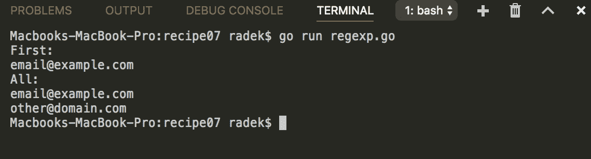

# 工作原理...

`FindString`或`FindAllString`函数是在给定字符串中查找匹配模式的最简单方法。唯一的区别是`Regexp`的`FindString`方法只会返回第一个匹配项。另一方面，`FindAllString`会返回一个包含所有匹配项的字符串切片。

`Regexp`类型提供了丰富的`FindXXX`方法。本教程仅描述了通常最有用的`String`变体。请注意，前面的代码使用了`regexp`包的`MustCompile`函数，如果正则表达式的编译失败，它会引发 panic。

# 另请参阅

除了这种复杂的正则表达式模式匹配，还可以仅匹配子字符串。这种方法在本章的*在字符串中查找子字符串*教程中有描述。

# 从非 Unicode 字符集解码字符串

一个鲜为人知的事实是，所有`.go`文件中的内容都是用 UTF-8 编码的。信不信由你，Unicode 并不是世界上唯一的字符集。例如，Windows-1250 编码在 Windows 用户中广泛传播。

在处理非 Unicode 字符串时，需要将内容转换为 Unicode。本教程演示了如何解码和编码非 Unicode 字符串。

# 如何做...

1.  打开控制台并创建文件夹`chapter02/recipe08`。

1.  导航到目录。

1.  创建内容为`Gdańsk`的文件`win1250.txt`。该文件必须以 windows-1250 字符集进行编码。如果不确定如何操作，只需跳到第 6 步，完成第 7 步后，将创建 windows-1250 编码的文件，然后可以将`out.txt`文件重命名并返回第 4 步。

1.  创建`decode.go`文件，内容如下：

```go
        package main

        import (
          "fmt"
          "io/ioutil"
          "os"
          "strings"

          "golang.org/x/text/encoding/charmap"
        )

        func main() {

          // Open windows-1250 file.
          f, err := os.Open("win1250.txt")
          if err != nil {
            panic(err)
          }
          defer f.Close()

          // Read all in raw form.
          b, err := ioutil.ReadAll(f)
          if err != nil {
            panic(err)
          }
          content := string(b)

          fmt.Println("Without decode: " + content)

          // Decode to unicode
          decoder := charmap.Windows1250.NewDecoder()
          reader := decoder.Reader(strings.NewReader(content))
          b, err = ioutil.ReadAll(reader)
          if err != nil {
            panic(err)
          }
          fmt.Println("Decoded: " + string(b))

        }
```

1.  通过执行`go run decode.go`来运行代码。

1.  在终端中查看输出：

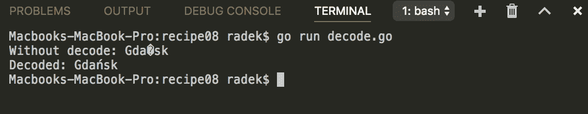

1.  创建名为`encode.go`的文件，内容如下：

```go
        package main

        import (
          "io"
          "os"

          "golang.org/x/text/encoding/charmap"
        )

        func main() {

          f, err := os.OpenFile("out.txt", os.O_CREATE|os.O_RDWR,
                                os.ModePerm|os.ModeAppend)
          if err != nil {
            panic(err)
          }
          defer f.Close()

          // Decode to unicode
          encoder := charmap.Windows1250.NewEncoder()
          writer := encoder.Writer(f)
          io.WriteString(writer, "Gdańsk")

        }
```

1.  通过执行`go run encode.go`来运行代码。

1.  在 Windows-1250 编码和 UTF-8 编码的文件`out.txt`中查看输出。

# 工作原理...

包`golang.org/x/text/encoding/charmap`包含了简单编码和解码的`Charset`类型。该类型实现了创建`Decoder`结构的`NewDecoder`方法。

步骤**1-5**展示了解码`Reader`的用法。

编码工作类似。创建编码`Writer`，然后由该`Writer`写入的每个字符串都会被编码为 Windows-1250 编码。

请注意，Windows-1250 被选择作为示例。包`golang.org/x/text/encoding/charmap`包含了许多其他字符集选项。

# 控制大小写

有许多实际任务需要修改大小写。让我们挑选其中的一些：

+   不区分大小写的比较

+   自动首字母大写

+   驼峰式转蛇式转换

为此，`strings`包提供了`ToLower`、`ToUpper`、`ToTitle`和`Title`函数。

# 如何做...

1.  打开控制台并创建文件夹`chapter02/recipe09`。

1.  导航到目录。

1.  创建`case.go`文件，内容如下：

```go
        package main

        import (
          "fmt"
          "strings"
          "unicode"
        )

        const email = "ExamPle@domain.com"
        const name = "isaac newton"
        const upc = "upc"
        const i = "i"

        const snakeCase = "first_name"

        func main() {

          // For comparing the user input
          // sometimes it is better to
          // compare the input in a same
          // case.
          input := "Example@domain.com"
          input = strings.ToLower(input)
          emailToCompare := strings.ToLower(email)
          matches := input == emailToCompare
          fmt.Printf("Email matches: %t\n", matches)

          upcCode := strings.ToUpper(upc)
          fmt.Println("UPPER case: " + upcCode)

          // This digraph has different upper case and
          // title case.
          str := "dz"
          fmt.Printf("%s in upper: %s and title: %s \n", str,
                     strings.ToUpper(str), strings.ToTitle(str))

          // Use of XXXSpecial function
          title := strings.ToTitle(i)
          titleTurk := strings.ToTitleSpecial(unicode.TurkishCase, i)
          if title != titleTurk {
            fmt.Printf("ToTitle is defferent: %#U vs. %#U \n",
                       title[0], []rune(titleTurk)[0])
          }

          // In some cases the input
          // needs to be corrected in case.
          correctNameCase := strings.Title(name)
          fmt.Println("Corrected name: " + correctNameCase)

          // Converting the snake case
          // to camel case with use of
          // Title and ToLower functions.
          firstNameCamel := toCamelCase(snakeCase)
          fmt.Println("Camel case: " + firstNameCamel)

        }

        func toCamelCase(input string) string {
          titleSpace := strings.Title(strings.Replace(input, "_", " ", -1))
          camel := strings.Replace(titleSpace, " ", "", -1)
          return strings.ToLower(camel[:1]) + camel[1:]
        }
```

1.  通过执行`go run case.go`来运行代码。

1.  在终端中查看输出：

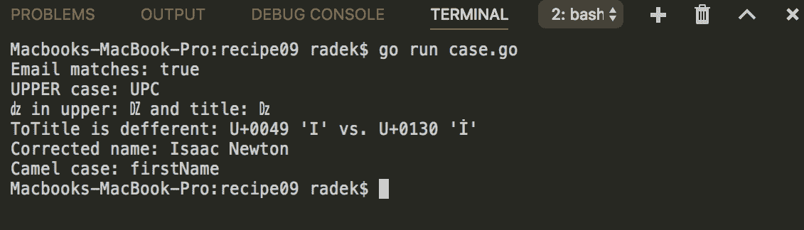

# 它是如何工作的...

请注意，Unicode 中的标题大小写映射与大写映射不同。不同之处在于字符数需要特殊处理。这些主要是连字和双字母，如*fl*，*dz*和*lj*，以及一些多音调希腊字符。例如，*U+01C7 (LJ)*映射到*U+01C8 (Lj)*，而不是*U+01C9 (lj)*。

为了进行适当的不区分大小写比较，应该使用`strings`包中的`EqualFold`函数。该函数使用大小写折叠来规范化字符串并进行比较。

# 解析逗号分隔的数据

有多种表格数据格式。**CSV**（逗号分隔值）是用于数据传输和导出的最基本格式之一。没有定义 CSV 的标准，但格式本身在 RFC 4180 中有描述。

这个示例介绍了如何舒适地解析 CSV 格式的数据。

# 如何做...

1.  打开控制台并创建文件夹`chapter02/recipe10`。

1.  导航到目录。

1.  创建名为`data.csv`的文件，其中包含以下内容：

```go
        "Name","Surname","Age"
        # this is comment in data
        "John","Mnemonic",20
        Maria,Tone,21
```

1.  创建名为`data.go`的文件，其中包含以下内容：

```go
        package main

        import (
          "encoding/csv"
          "fmt"
          "os"
        )

        func main() {

          file, err := os.Open("data.csv")
          if err != nil {
            panic(err)
          }
          defer file.Close()

          reader := csv.NewReader(file)
          reader.FieldsPerRecord = 3
          reader.Comment = '#'

          for {
            record, e := reader.Read()
            if e != nil {
              fmt.Println(e)
              break
            }
            fmt.Println(record)
          }
        }
```

1.  通过执行`go run data.go`来运行代码。

1.  在终端中查看输出：

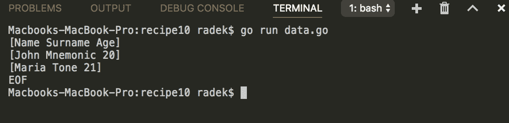

1.  创建名为`data_uncommon.csv`的文件，其中包含以下内容：

```go
       Name;Surname;Age
       "John";Mnemonic;20
       "Maria";Tone;21
```

1.  创建名为`data_uncommon.go`的文件，其中包含以下内容：

```go
       package main

       import (
         "encoding/csv"
         "fmt"
         "os"
       )

       func main() {

         file, err := os.Open("data_uncommon.csv")
         if err != nil {
           panic(err)
         }
         defer file.Close()

         reader := csv.NewReader(file)
         reader.Comma = ';'

         for {
           record, e := reader.Read()
           if e != nil {
             fmt.Println(e)
             break
           }
           fmt.Println(record)
         }
       }
```

1.  通过执行`go run data_uncommon.go`来运行代码。

1.  在终端中查看输出：

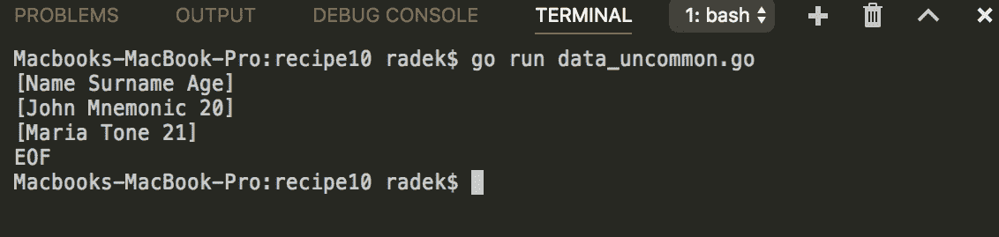

# 它是如何工作的...

与简单地逐行扫描输入并使用`strings.Split`和其他方法解析 CSV 格式不同，Go 提供了更好的方法。`encoding/csv`包中的`NewReader`函数返回`Reader`结构，该结构提供了读取 CSV 文件的 API。`Reader`结构保留了变量来配置`read`参数，根据您的需求。

`Reader`的`FieldsPerRecord`参数是一个重要的设置。这样可以验证每行的单元格数。默认情况下，当设置为`0`时，它设置为第一行中的记录数。如果设置为正值，则记录数必须匹配。如果设置为负值，则不进行单元格计数验证。

另一个有趣的配置是`Comment`参数，它允许您定义解析数据中的注释字符。在示例中，整行都会被忽略。

Go 1.10 现在禁止使用荒谬的逗号和注释设置。这意味着空值、回车、换行、无效符文和 Unicode 替换字符。还禁止将逗号和注释设置为相等。

# 管理字符串中的空白

字符串输入可能包含过多的空白、过少的空白或不合适的空白字符。本示例包括了如何处理这些并将字符串格式化为所需格式的提示。

# 如何做...

1.  打开控制台并创建文件夹`chapter02/recipe11`。

1.  导航到目录。

1.  创建名为`whitespace.go`的文件，其中包含以下内容：

```go
        package main

        import (
          "fmt"
          "math"
          "regexp"
          "strconv"
          "strings"
        )

        func main() {

          stringToTrim := "\t\t\n Go \tis\t Awesome \t\t"
          trimResult := strings.TrimSpace(stringToTrim)
          fmt.Println(trimResult)

          stringWithSpaces := "\t\t\n Go \tis\n Awesome \t\t"
          r := regexp.MustCompile("\\s+")
          replace := r.ReplaceAllString(stringWithSpaces, " ")
          fmt.Println(replace)

          needSpace := "need space"
          fmt.Println(pad(needSpace, 14, "CENTER"))
          fmt.Println(pad(needSpace, 14, "LEFT"))
        }

        func pad(input string, padLen int, align string) string {
          inputLen := len(input)

          if inputLen >= padLen {
            return input
          }

          repeat := padLen - inputLen
          var output string
          switch align {
            case "RIGHT":
              output = fmt.Sprintf("% "+strconv.Itoa(-padLen)+"s", input)
            case "LEFT":
              output = fmt.Sprintf("% "+strconv.Itoa(padLen)+"s", input)
            case "CENTER":
              bothRepeat := float64(repeat) / float64(2)
              left := int(math.Floor(bothRepeat)) + inputLen
              right := int(math.Ceil(bothRepeat))
              output = fmt.Sprintf("% "+strconv.Itoa(left)+"s% 
                                   "+strconv.Itoa(right)+"s", input, "")
          }
          return output
        }
```

1.  通过执行`go run whitespace.go`来运行代码。

1.  查看输出：

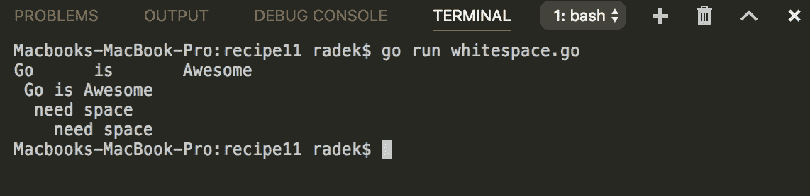

# 它是如何工作的...

在代码处理之前修剪字符串是非常常见的做法，正如前面的代码所示，标准的 Go 库可以轻松完成这项工作。`strings`库还提供了更多`TrimXXX`函数的变体，也允许修剪字符串中的其他字符。

要修剪前导和结束的空白，可以使用`strings`包的`TrimSpace`函数。这是代码的以下部分的典型示例，这也是之前示例中包含的：

```go
stringToTrim := "\t\t\n Go \tis\t Awesome \t\t"
stringToTrim = strings.TrimSpace(stringToTrim)
```

`regex`包适用于替换多个空格和制表符，可以通过这种方式准备字符串以便进一步处理。请注意，使用此方法时，换行符将被替换为一个空格。

代码的这一部分表示使用正则表达式将所有多个空格替换为单个空格：

```go
r := regexp.MustCompile("\\s+")
replace := r.ReplaceAllString(stringToTrim, " ")
```

填充不是`strings`包的显式函数，但可以通过`fmt`包的`Sprintf`函数实现。代码中的`pad`函数使用格式化模式`% <+/-padding>s`和一些简单的数学运算来找出填充。最后，填充数字前的减号作为右填充，正数作为左填充。

# 另请参阅

有关如何使用正则表达式的更多提示，您可以在本章中查看*通过正则表达式模式在文本中查找子字符串*的示例。

# 对文本文档进行缩进

前面的示例描述了如何进行字符串填充和修剪空白。这个示例将指导您如何对文本文档进行缩进和取消缩进。将使用前面示例中的类似原则。

# 如何做...

1.  打开控制台并创建文件夹`chapter02/recipe12`。

1.  创建名为`main.go`的文件，并包含以下内容：

```go
         package main

         import (
           "fmt"
           "strconv"
           "strings"
           "unicode"
         )

         func main() {

           text := "Hi! Go is awesome."
           text = Indent(text, 6)
           fmt.Println(text)

           text = Unindent(text, 3)
           fmt.Println(text)

           text = Unindent(text, 10)
           fmt.Println(text)

           text = IndentByRune(text, 10, '.')
           fmt.Println(text)

         }

         // Indent indenting the input by given indent and rune
         func IndentByRune(input string, indent int, r rune) string {
           return strings.Repeat(string(r), indent) + input
         }

         // Indent indenting the input by given indent
         func Indent(input string, indent int) string {
           padding := indent + len(input)
           return fmt.Sprintf("% "+strconv.Itoa(padding)+"s", input)
         }

         // Unindent unindenting the input string. In case the
         // input is indented by less than "indent" spaces
         // the min of this both is removed.
         func Unindent(input string, indent int) string {

           count := 0
           for _, val := range input {
             if unicode.IsSpace(val) {
               count++
             }
             if count == indent || !unicode.IsSpace(val) {
               break
             }
           }

           return input[count:]
         }
```

1.  在终端中执行`go run main.go`来运行代码。

1.  查看输出：

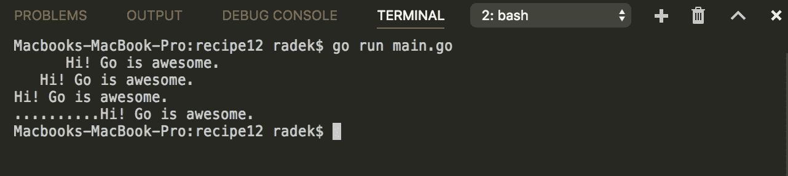

# 它是如何工作的...

缩进就像填充一样简单。在这种情况下，使用相同的格式选项。`indent`实现的更可读形式可以使用`strings`包的`Repeat`函数。上述代码中的`IndentByRune`函数应用了这种方法。

在这种情况下，取消缩进意味着删除给定数量的前导空格。在上述代码中，`Unindent`的实现会删除最少数量的前导空格或给定的缩进。

# 另请参阅

*管理字符串中的空白*示例也以更宽松的方式处理空格。
