# 处理数字

本章的食谱有：

+   将字符串转换为数字

+   比较浮点数

+   舍入浮点数

+   浮点数运算

+   格式化数字

+   在二进制、八进制、十进制和十六进制之间转换

+   使用正确的复数格式

+   生成随机数

+   操作复数

+   在度和弧度之间转换

+   取对数

+   生成校验和

# 介绍

数字通常是每个应用程序的不可避免的部分——打印格式化的数字、转换基数表示等等。本章介绍了许多常见的操作。

检查 Go 是否已正确安装。第一章的*准备就绪*部分，*与环境交互*，将对您有所帮助。

# 将字符串转换为数字

本食谱将向您展示如何将包含数字的字符串转换为数值类型（整数或浮点值）。

# 操作步骤...

1.  打开控制台并创建文件夹`chapter03/recipe01`。

1.  导航到该目录。

1.  创建包含以下内容的`main.go`文件：

```go
        package main

        import (
          "fmt"
          "strconv"
        )

        const bin = "00001"
        const hex = "2f"
        const intString = "12"
        const floatString = "12.3"

        func main() {

          // Decimals
          res, err := strconv.Atoi(intString)
          if err != nil {
            panic(err)
          }
          fmt.Printf("Parsed integer: %d\n", res)

          // Parsing hexadecimals
          res64, err := strconv.ParseInt(hex, 16, 32)
          if err != nil {
            panic(err)
          }
          fmt.Printf("Parsed hexadecima: %d\n", res64)

          // Parsing binary values
          resBin, err := strconv.ParseInt(bin, 2, 32)
          if err != nil {
            panic(err)
          }
          fmt.Printf("Parsed bin: %d\n", resBin)

          // Parsing floating-points
          resFloat, err := strconv.ParseFloat(floatString, 32)
          if err != nil {
            panic(err)
          }
          fmt.Printf("Parsed float: %.5f\n", resFloat)

        }
```

1.  在终端中执行命令`go run main.go`。

1.  您将看到以下输出：

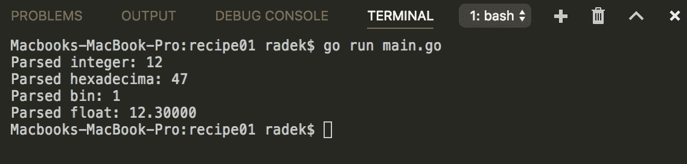

# 工作原理...

在前面示例代码中的主要函数是`strconv`包的`ParseInt`函数。该函数带有三个参数：输入、输入的基数和位大小。基数确定了如何解析数字。请注意，十六进制的基数（第二个参数）为 16，二进制的基数为 2。`strconv`包的`Atoi`函数实际上就是带有基数 10 的`ParseInt`函数。

`ParseFloat`函数将字符串转换为浮点数。第二个参数是`bitSize`的精度。`bitSize = 64`将导致`float64`。`bitSize = 32`将导致`float64`，但可以在不改变其值的情况下转换为`float32`。

# 比较浮点数

由于浮点数的表示方式，比较两个看似相同的数字时可能会出现不一致。与整数不同，IEEE 浮点数只是近似值。需要将数字转换为计算机可以以二进制形式存储的形式，这会导致轻微的精度或舍入偏差。例如，值 1.3 可以表示为 1.29999999999。可以通过一些容差进行比较。要比较任意精度的数字，可以使用`big`包。

# 操作步骤...

1.  打开控制台并创建文件夹`chapter03/recipe02`。

1.  导航到该目录。

1.  创建包含以下内容的`tolerance.go`文件：

```go
        package main

        import (
          "fmt"
          "math"
        )

        const da = 0.29999999999999998889776975374843459576368331909180
        const db = 0.3

        func main() {

          daStr := fmt.Sprintf("%.10f", da)
          dbStr := fmt.Sprintf("%.10f", db)

          fmt.Printf("Strings %s = %s equals: %v \n", daStr,
                     dbStr, dbStr == daStr)
          fmt.Printf("Number equals: %v \n", db == da)

          // As the precision of float representation
          // is limited. For the float comparison it is
          // better to use comparison with some tolerance.
          fmt.Printf("Number equals with TOLERANCE: %v \n", 
                     equals(da, db))

        }

        const TOLERANCE = 1e-8
        // Equals compares the floating-point numbers
        // with tolerance 1e-8
        func equals(numA, numB float64) bool {
          delta := math.Abs(numA - numB)
          if delta < TOLERANCE {
            return true
          }
          return false
        }
```

1.  在终端中执行命令`go run tolerance.go`。

1.  您将看到以下输出：

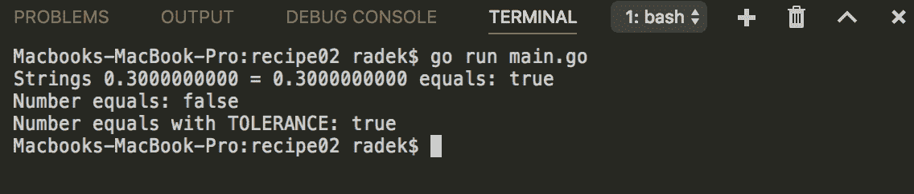

1.  创建包含以下内容的`big.go`文件：

```go
        package main

        import (
          "fmt"
          "math/big"
        )

        var da float64 = 0.299999992
        var db float64 = 0.299999991

        var prec uint = 32
        var prec2 uint = 16

        func main() {

          fmt.Printf("Comparing float64 with '==' equals: %v\n", da == db)

          daB := big.NewFloat(da).SetPrec(prec)
          dbB := big.NewFloat(db).SetPrec(prec)

          fmt.Printf("A: %v \n", daB)
          fmt.Printf("B: %v \n", dbB)
          fmt.Printf("Comparing big.Float with precision: %d : %v\n",
                     prec, daB.Cmp(dbB) == 0)

          daB = big.NewFloat(da).SetPrec(prec2)
          dbB = big.NewFloat(db).SetPrec(prec2)

          fmt.Printf("A: %v \n", daB)
          fmt.Printf("B: %v \n", dbB)
          fmt.Printf("Comparing big.Float with precision: %d : %v\n",
                     prec2, daB.Cmp(dbB) == 0)

        }
```

1.  在终端中执行命令`go run big.go`。

1.  您将看到以下输出：

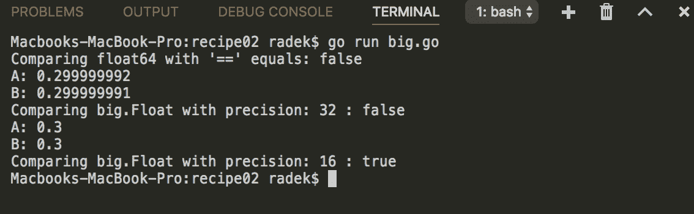

# 工作原理...

在不使用任何内置包的情况下进行浮点数比较的第一种方法（步骤 1-5）需要使用所谓的`EPSILON`常量。这是选择的足够小的增量（差异）的值，以便将两个数字视为相等。增量常数可以达到 1e-8 的数量级，这通常是足够的精度。

第二个选项更复杂，但对于进一步处理浮点数更有用。`math/big`包提供了可以配置为给定精度的`Float`类型。该包的优势在于精度可以比`float64`类型的精度高得多。出于说明目的，使用了较小的精度值来显示给定精度的四舍五入和比较。

请注意，当使用 16 位精度时，`da`和`db`数字相等，当使用 32 位精度时，它们不相等。最大可配置的精度可以从`big.MaxPrec`常量中获得。

# 四舍五入浮点数

将浮点数四舍五入为整数或特定精度必须正确进行。最常见的错误是将浮点类型`float64`转换为整数类型，并认为它已经处理好了。

一个例子可能是将数字 3.9999 转换为整数，并期望它变成值为 4 的整数。实际结果将是 3。在撰写本书时，Go 的当前版本（1.9.2）不包含`Round`函数。然而，在 1.10 版本中，`Round`函数已经在`math`包中实现。

# 如何做...

1.  打开控制台并创建文件夹`chapter03/recipe03`。

1.  导航到该目录。

1.  创建`round.go`文件，内容如下：

```go
        package main

        import (
          "fmt"
          "math"
        )

        var valA float64 = 3.55554444

        func main() {

          // Bad assumption on rounding
          // the number by casting it to
          // integer.
          intVal := int(valA)
          fmt.Printf("Bad rounding by casting to int: %v\n", intVal)

          fRound := Round(valA)
          fmt.Printf("Rounding by custom function: %v\n", fRound)

        }

        // Round returns the nearest integer.
        func Round(x float64) float64 {
          t := math.Trunc(x)
          if math.Abs(x-t) >= 0.5 {
            return t + math.Copysign(1, x)
          }
          return t
        }
```

1.  通过在终端中运行`go run round.go`来执行代码。

1.  您将看到以下输出：

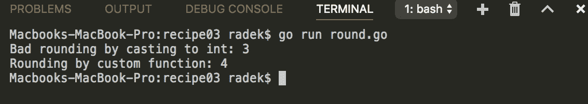

# 它是如何工作的...

将浮点数转换为整数实际上只是截断了浮点值。比如值 2 表示为 1.999999；在这种情况下，输出将是 1，这不是您期望的。

正确的浮点数四舍五入的方法是使用一个函数，该函数还会考虑小数部分。常用的四舍五入方法是向远离零的方向舍入（也称为商业舍入）。简而言之，如果数字包含小数部分的绝对值大于或等于 0.5，则将数字四舍五入，否则将向下舍入。

在`Round`函数中，`math`包的`Trunc`函数截断了数字的小数部分。然后提取了数字的小数部分。如果值超过 0.5 的限制，那么就会加上与整数值相同的符号的 1。

Go 版本 1.10 使用了一个更快的实现，该实现在示例中提到。在 1.10 版本中，您可以直接调用`math.Round`函数来获得四舍五入的数字。

# 浮点数算术

如前面的示例所述，浮点数的表示也使算术变得复杂。对于一般目的，内置的`float64`上的操作已经足够。如果需要更高的精度，则需要使用`math/big`包。本示例将向您展示如何处理这个问题。

# 如何做...

1.  打开控制台并创建文件夹`chapter03/recipe04`。

1.  导航到该目录。

1.  创建`main.go`文件，内容如下：

```go
        package main

        import (
          "fmt"
          "math/big"
        )

        const PI = `3.1415926535897932384626433832795028841971693
                    993751058209749445923078164062862089986280348253
                    421170679821480865132823066470938446095505822317
                    253594081284811174502841027019385211055596446229
                    4895493038196`
        const diameter = 3.0
        const precision = 400

        func main() {

          pi, _ := new(big.Float).SetPrec(precision).SetString(PI)
          d := new(big.Float).SetPrec(precision).SetFloat64(diameter)

          circumference := new(big.Float).Mul(pi, d)

          pi64, _ := pi.Float64()
          fmt.Printf("Circumference big.Float = %.400f\n",
                     circumference)
          fmt.Printf("Circumference float64 = %.400f\n", pi64*diameter)

          sum := new(big.Float).Add(pi, pi)
          fmt.Printf("Sum = %.400f\n", sum)

          diff := new(big.Float).Sub(pi, pi)
          fmt.Printf("Diff = %.400f\n", diff)

          quo := new(big.Float).Quo(pi, pi)
          fmt.Printf("Quocient = %.400f\n", quo)

        }
```

1.  通过在终端中运行`go run main.go`来执行代码。

1.  您将看到以下输出：

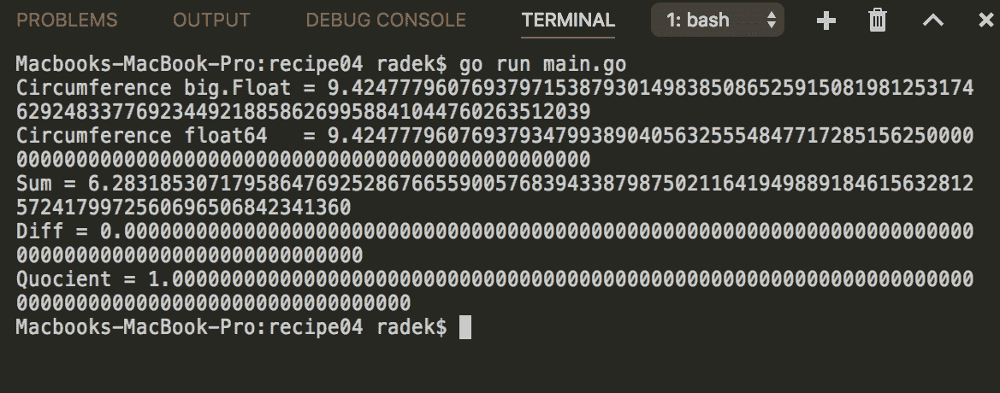

# 它是如何工作的...

`big`包提供了对高精度浮点数进行算术运算的支持。前面的示例说明了对数字的基本操作。请注意，代码将`float64`类型和`big.Float`类型的操作进行了比较。

通过使用高精度数字，使用`big.Float`类型是至关重要的。当`big.Float`转换回内置的`float64`类型时，高精度会丢失。

# 还有更多...

`big`包包含`Float`类型的更多操作。查看此包的文档（[`golang.org/pkg/math/big/#Float`](https://golang.org/pkg/math/big/#Float)）以获取更多详细信息。

# 另请参阅

浮点数的比较和四舍五入在*比较浮点数*和*四舍五入浮点数*示例中有提到。

# 格式化数字

如果数字转换为字符串，通常需要合理格式化。数字的格式化意味着数字以给定的数字和小数点打印出来。还可以选择值的表示。然而，与此密切相关的问题是数字格式的本地化。例如，一些语言使用逗号分隔的零。

# 如何做...

1.  打开控制台并创建文件夹`chapter03/recipe05`。

1.  导航到目录。

1.  创建`format.go`文件，内容如下：

```go
        package main

        import (
          "fmt"
        )

        var integer int64 = 32500
        var floatNum float64 = 22000.456

        func main() {

          // Common way how to print the decimal
          // number
          fmt.Printf("%d \n", integer)

          // Always show the sign
          fmt.Printf("%+d \n", integer)

          // Print in other base X -16, o-8, b -2, d - 10
          fmt.Printf("%X \n", integer)
          fmt.Printf("%#X \n", integer)

          // Padding with leading zeros
          fmt.Printf("%010d \n", integer)

          // Left padding with spaces
          fmt.Printf("% 10d \n", integer)

          // Right padding
          fmt.Printf("% -10d \n", integer)

          // Print floating
          // point number
          fmt.Printf("%f \n", floatNum)

          // Floating-point number
          // with limited precision = 5
          fmt.Printf("%.5f \n", floatNum)

          // Floating-point number
          // in scientific notation
          fmt.Printf("%e \n", floatNum)

          // Floating-point number
          // %e for large exponents
          // or %f otherwise
          fmt.Printf("%g \n", floatNum)

        }
```

1.  在主终端中运行`go run format.go`来执行代码。

1.  你将看到以下输出：

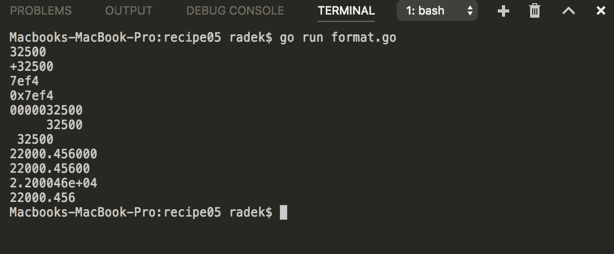

1.  创建文件`localized.go`，内容如下：

```go
        package main

        import (
          "golang.org/x/text/language"
          "golang.org/x/text/message"
        )

        const num = 100000.5678

        func main() {
          p := message.NewPrinter(language.English)
          p.Printf(" %.2f \n", num)

          p = message.NewPrinter(language.German)
          p.Printf(" %.2f \n", num)
        }
```

1.  在主终端中运行`go run localized.go`来执行代码。

1.  你将看到以下输出：

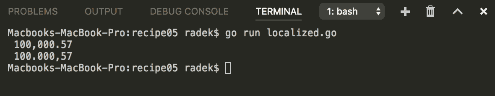

# 它是如何工作的...

代码示例显示了整数和浮点数的最常用选项。

Go 中的格式化源自 C 的`printf`函数。所谓的`动词`用于定义数字的格式化。例如，动词可以是`%X`，实际上是值的占位符。

除了基本格式化外，还有与本地习俗相关的格式化规则。根据区域设置进行格式化，包`golang.org/x/text/message`可以提供帮助。请参阅本食谱中的第二个代码示例。这样，可以对数字格式进行本地化。

# 还有更多...

有关所有格式选项，请参阅`fmt`包。`strconv`包在需要以不同基数格式化数字时也可能很有用。以下食谱描述了数字转换的可能性，但副作用是如何以不同基数格式化数字的选项。

# 在二进制、八进制、十进制和十六进制之间转换

在某些情况下，整数值可以用除十进制表示以外的其他表示。这些表示之间的转换很容易通过`strconv`包来完成。

# 如何做...

1.  打开控制台并创建文件夹`chapter03/recipe06`。

1.  导航到目录。

1.  创建`convert.go`文件，内容如下：

```go
        package main

        import (
          "fmt"
          "strconv"
        )

        const bin = "10111"
        const hex = "1A"
        const oct = "12"
        const dec = "10"
        const floatNum = 16.123557

        func main() {

          // Converts binary value into hex
          v, _ := ConvertInt(bin, 2, 16)
          fmt.Printf("Binary value %s converted to hex: %s\n", bin, v)

          // Converts hex value into dec
          v, _ = ConvertInt(hex, 16, 10)
          fmt.Printf("Hex value %s converted to dec: %s\n", hex, v)

          // Converts oct value into hex
          v, _ = ConvertInt(oct, 8, 16)
          fmt.Printf("Oct value %s converted to hex: %s\n", oct, v)

          // Converts dec value into oct
          v, _ = ConvertInt(dec, 10, 8)
          fmt.Printf("Dec value %s converted to oct: %s\n", dec, v)

          //... analogically any other conversion
          // could be done.

        }

        // ConvertInt converts the given string value of base
        // to defined toBase.
        func ConvertInt(val string, base, toBase int) (string, error) {
          i, err := strconv.ParseInt(val, base, 64)
          if err != nil {
            return "", err
          }
          return strconv.FormatInt(i, toBase), nil
        }
```

1.  在主终端中运行`go run convert.go`来执行代码。

1.  你将看到以下输出：

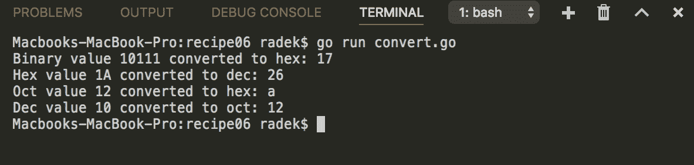

# 它是如何工作的...

`strconv`包提供了`ParseInt`和`FormatInt`函数，这些函数可以说是互补的函数。函数`ParseInt`能够解析任何基数表示的整数。另一方面，函数`FormatInt`可以将整数格式化为任何给定的基数。

最后，可以将整数的字符串表示解析为内置的`int64`类型，然后将解析后的整数的字符串格式化为给定的基数表示。

# 使用正确的复数格式

在为用户显示消息时，如果句子更加人性化，交互会更加愉快。Go 包`golang.org/x/text`，即扩展包，包含了以正确方式格式化复数的功能。

# 准备工作

执行`go get -x golang.org/x/text`以获取扩展包，如果你还没有的话。

# 如何做...

1.  打开控制台并创建文件夹`chapter03/recipe07`。

1.  导航到目录。

1.  创建`plurals.go`文件，内容如下：

```go
        package main

        import (
          "golang.org/x/text/feature/plural"
          "golang.org/x/text/language"
          "golang.org/x/text/message"
        )

        func main() {

          message.Set(language.English, "%d items to do",
            plural.Selectf(1, "%d", "=0", "no items to do",
              plural.One, "one item to do",
              "<100", "%[1]d items to do",
              plural.Other, "lot of items to do",
          ))

          message.Set(language.English, "The average is %.2f",
            plural.Selectf(1, "%.2f",
              "<1", "The average is zero",
              "=1", "The average is one",
              plural.Other, "The average is %[1]f ",
          ))

          prt := message.NewPrinter(language.English)
          prt.Printf("%d items to do", 0)
          prt.Println()
          prt.Printf("%d items to do", 1)
          prt.Println()
          prt.Printf("%d items to do", 10)
          prt.Println()
          prt.Printf("%d items to do", 1000)
          prt.Println()

          prt.Printf("The average is %.2f", 0.8)
          prt.Println()
          prt.Printf("The average is %.2f", 1.0)
          prt.Println()
          prt.Printf("The average is %.2f", 10.0)
          prt.Println()

        }
```

1.  在主终端中运行`go run plurals.go`来执行代码。

1.  你将看到以下输出：

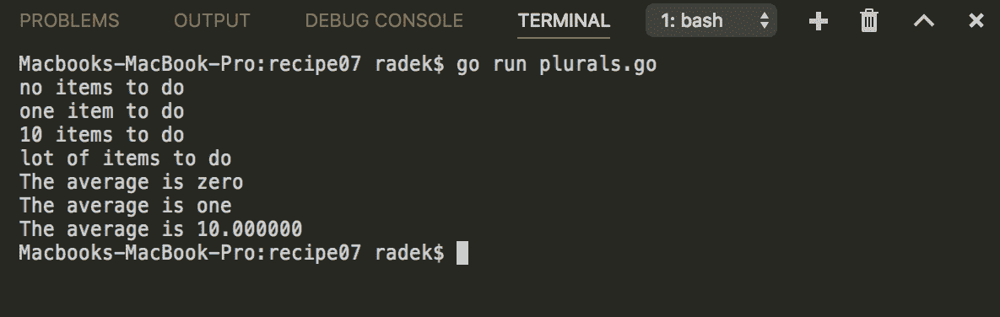

# 它是如何工作的...

包`golang.org/x/text/message`包含函数`NewPrinter`，接受语言标识并创建格式化的 I/O，与`fmt`包相同，但具有根据性别和复数形式翻译消息的能力。

`message`包的`Set`函数添加了翻译和复数选择。复数形式本身是根据`Selectf`函数设置的规则选择的。`Selectf`函数生成基于`plural.Form`或选择器的规则的`catalog.Message`类型。

上述示例代码使用了`plural.One`和`plural.Other`形式，以及`=x, <x`选择器。这些与格式化动词`%d`匹配（也可以使用其他动词）。选择第一个匹配的情况。

# 还有更多...

有关选择器和形式的更多信息，请参阅`golang.org/x/text/message`包的文档。

# 生成随机数

本教程展示了如何生成随机数。这个功能由`math/rand`包提供。由`math/rand`生成的随机数被认为是不安全的，因为序列是可重复的，具有给定的种子。

要生成加密安全的数字，应使用`crypto/rand`包。这些序列是不可重复的。

# 如何做...

1.  打开控制台并创建文件夹`chapter03/recipe08`。

1.  导航到目录。

1.  创建具有以下内容的`rand.go`文件：

```go
        package main

        import (
          crypto "crypto/rand"
          "fmt"
          "math/big"
          "math/rand"
        )

        func main() {

          sec1 := rand.New(rand.NewSource(10))
          sec2 := rand.New(rand.NewSource(10))
          for i := 0; i < 5; i++ {
            rnd1 := sec1.Int()
            rnd2 := sec2.Int()
            if rnd1 != rnd2 {
              fmt.Println("Rand generated non-equal sequence")
              break
            } else {
              fmt.Printf("Math/Rand1: %d , Math/Rand2: %d\n", rnd1, rnd2)
            }
          }

          for i := 0; i < 5; i++ {
            safeNum := NewCryptoRand()
            safeNum2 := NewCryptoRand()
            if safeNum == safeNum2 {
              fmt.Println("Crypto generated equal numbers")
              break
            } else {
              fmt.Printf("Crypto/Rand1: %d , Crypto/Rand2: %d\n",
                         safeNum, safeNum2)
            }
          }
        }

        func NewCryptoRand() int64 {
          safeNum, err := crypto.Int(crypto.Reader, big.NewInt(100234))
          if err != nil {
            panic(err)
          }
          return safeNum.Int64()
        }
```

1.  通过在主终端中运行`go run rand.go`来执行代码。

1.  您将看到以下输出：

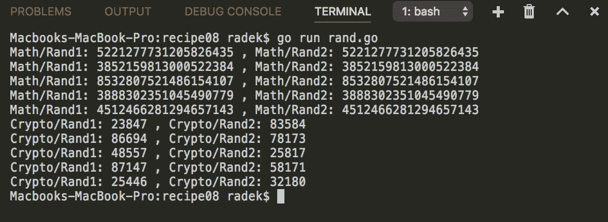

# 它是如何工作的...

上述代码介绍了如何生成随机数的两种可能性。第一种选项使用`math/rand`包，这是不安全的，允许我们使用相同的种子号生成相同的序列。这种方法通常用于测试。这样做的原因是为了使序列可重现。

第二个选项，即加密安全选项，是使用`crypto/rand`包。API 使用`Reader`提供具有加密强大伪随机生成器实例。包本身具有默认的`Reader`，通常基于基于系统的随机数生成器。

# 操作复数

复数通常用于科学应用和计算。Go 将复数实现为原始类型。复数的特定操作是`math/cmplx`包的一部分。

# 如何做...

1.  打开控制台并创建文件夹`chapter03/recipe09`。

1.  导航到目录。

1.  创建具有以下内容的`complex.go`文件：

```go
        package main

        import (
          "fmt"
          "math/cmplx"
        )

        func main() {

          // complex numbers are
          // defined as real and imaginary
          // part defined by float64
          a := complex(2, 3)

          fmt.Printf("Real part: %f \n", real(a))
          fmt.Printf("Complex part: %f \n", imag(a))

          b := complex(6, 4)

          // All common
          // operators are useful
          c := a - b
          fmt.Printf("Difference : %v\n", c)
          c = a + b
          fmt.Printf("Sum : %v\n", c)
          c = a * b
          fmt.Printf("Product : %v\n", c)
          c = a / b
          fmt.Printf("Product : %v\n", c)

          conjugate := cmplx.Conj(a)
          fmt.Println("Complex number a's conjugate : ", conjugate)

          cos := cmplx.Cos(b)
          fmt.Println("Cosine of b : ", cos)

        }
```

1.  通过在主终端中运行`go run complex.go`来执行代码。

1.  您将看到以下输出：

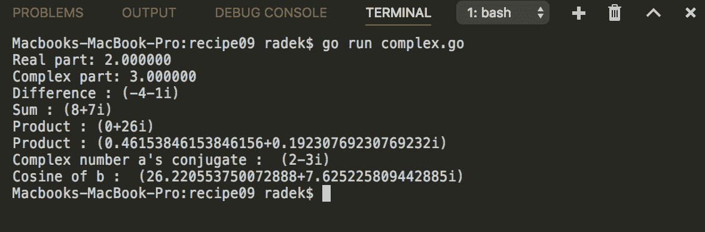

# 它是如何工作的...

基本运算符是为原始类型`complex`实现的。复数的其他操作由`math/cmplx`包提供。如果需要高精度操作，则没有`big`实现。

另一方面，复数可以实现为实数，并且虚部由`big.Float`类型表示。

# 在度和弧度之间转换

三角函数运算和几何操作通常以弧度为单位进行；能够将这些转换为度数及其相反是非常有用的。本教程将向您展示如何处理这些单位之间的转换。

# 如何做...

1.  打开控制台并创建文件夹`chapter03/recipe10`。

1.  导航到目录。

1.  创建具有以下内容的`radians.go`文件：

```go
        package main

        import (
          "fmt"
          "math"
        )

        type Radian float64

        func (rad Radian) ToDegrees() Degree {
          return Degree(float64(rad) * (180.0 / math.Pi))
        }

        func (rad Radian) Float64() float64 {
          return float64(rad)
        }

        type Degree float64

        func (deg Degree) ToRadians() Radian {
          return Radian(float64(deg) * (math.Pi / 180.0))
        }

        func (deg Degree) Float64() float64 {
          return float64(deg)
        }

        func main() {

          val := radiansToDegrees(1)
          fmt.Printf("One radian is : %.4f degrees\n", val)

          val2 := degreesToRadians(val)
          fmt.Printf("%.4f degrees is %.4f rad\n", val, val2)

          // Conversion as part
          // of type methods
          val = Radian(1).ToDegrees().Float64()
          fmt.Printf("Degrees: %.4f degrees\n", val)

          val = Degree(val).ToRadians().Float64()
          fmt.Printf("Rad: %.4f radians\n", val)
        }

        func degreesToRadians(deg float64) float64 {
          return deg * (math.Pi / 180.0)
        }

        func radiansToDegrees(rad float64) float64 {
          return rad * (180.0 / math.Pi)
        }
```

1.  通过在主终端中运行`go run radians.go`来执行代码。

1.  您将看到以下输出：

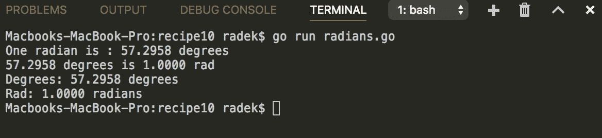

# 它是如何工作的...

Go 标准库不包含任何将弧度转换为度数及其相反的函数。但至少 Pi 常数是`math`包的一部分，因此可以按照示例代码中所示进行转换。

上述代码还介绍了定义具有附加方法的自定义类型的方法。这些方法通过方便的 API 简化了值的转换。

# 取对数

对数在科学应用以及数据可视化和测量中被使用。内置的`math`包包含了常用的对数基数。使用这些，你可以得到所有的基数。

# 操作步骤...

1.  打开控制台并创建文件夹`chapter03/recipe11`。

1.  导航到目录。

1.  创建`log.go`文件，内容如下：

```go
        package main

        import (
          "fmt"
          "math"
        )

        func main() {

          ln := math.Log(math.E)
          fmt.Printf("Ln(E) = %.4f\n", ln)

          log10 := math.Log10(-100)
          fmt.Printf("Log10(10) = %.4f\n", log10)

          log2 := math.Log2(2)
          fmt.Printf("Log2(2) = %.4f\n", log2)

          log_3_6 := Log(3, 6)
          fmt.Printf("Log3(6) = %.4f\n", log_3_6)

        }

        // Log computes the logarithm of
        // base > 1 and x greater 0
        func Log(base, x float64) float64 {
          return math.Log(x) / math.Log(base)
        }
```

1.  在主终端中运行`go run log.go`来执行代码。

1.  你将看到以下输出：

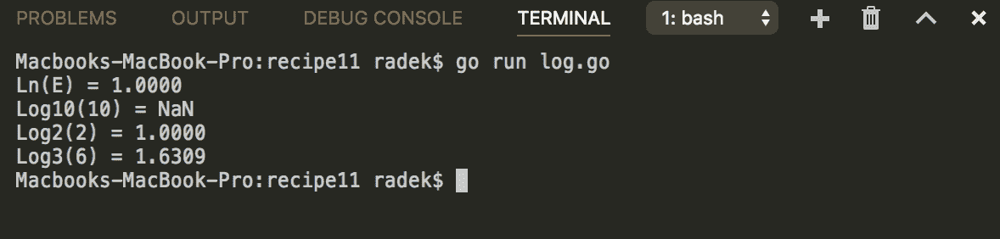

# 工作原理...

标准包`math`包含了所有常用对数的函数，因此你可以轻松地得到二进制、十进制和自然对数。查看*Log*函数，它通过助手定义的公式计算任何以*x*为底的*y*的对数：

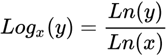

标准库中对数的内部实现自然是基于近似值的。这个函数可以在`$GOROOT/src/math/log.go`文件中找到。

# 生成校验和

哈希，或者所谓的校验和，是快速比较任何内容的最简单方法。这个示例演示了如何创建文件内容的校验和。为了演示目的，将使用 MD5 哈希函数。

# 操作步骤...

1.  打开控制台并创建文件夹`chapter03/recipe12`。

1.  导航到目录。

1.  创建`content.dat`文件，内容如下：

```go
        This is content to check
```

1.  创建`checksum.go`文件，内容如下：

```go
        package main

        import (
          "crypto/md5"
          "fmt"
          "io"
          "os"
        )

        var content = "This is content to check"

        func main() {

          checksum := MD5(content)
          checksum2 := FileMD5("content.dat")

          fmt.Printf("Checksum 1: %s\n", checksum)
          fmt.Printf("Checksum 2: %s\n", checksum2)
          if checksum == checksum2 {
            fmt.Println("Content matches!!!")
          }

        }

        // MD5 creates the md5
        // hash for given content encoded in
        // hex string
        func MD5(data string) string {
          h := md5.Sum([]byte(data))
          return fmt.Sprintf("%x", h)
        }

        // FileMD5 creates hex encoded md5 hash
        // of file content
        func FileMD5(path string) string {
          h := md5.New()
          f, err := os.Open(path)
          if err != nil {
            panic(err)
          }
          defer f.Close()
          _, err = io.Copy(h, f)
          if err != nil {
            panic(err)
          }
          return fmt.Sprintf("%x", h.Sum(nil))
        }
```

1.  在主终端中运行`go run checksum.go`来执行代码。

1.  你将看到以下输出：

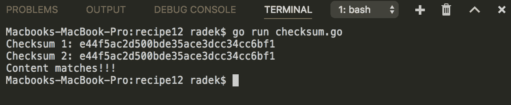

1.  创建`sha_panic.go`文件，内容如下：

```go
        package main

        import (
          "crypto"
        )

        func main() {
          crypto.SHA1.New()
        }
```

1.  在主终端中运行`go run sha_panic.go`来执行代码。

1.  你将看到以下输出：

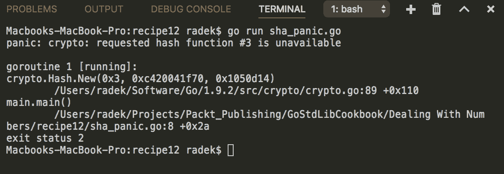

# 工作原理...

`crypto`包包含了众所周知的哈希函数的实现。`MD5`哈希函数位于`crypto/md5`包中。`crypto`包中的每个哈希函数都实现了`Hash`接口。注意`Hash`包含了`Write`方法。通过`Write`方法，它可以被用作`Writer`。这可以在`FileMD5`函数中看到。`Hash`的`Sum`方法接受字节切片的参数，结果哈希值将放置在其中。

注意这一点。`Sum`方法不会计算参数的哈希值，而是将哈希计算到参数中。

另一方面，`md5.Sum`包函数可以直接用于生成哈希。在这种情况下，`Sum`函数的参数是计算出的哈希值。

自然地，`crypto`包实现了`SHA`变体和其他哈希函数。这些通常以相同的方式使用。哈希函数可以通过`crypto`包的常量`crypto.Hash`（例如，`crypto.MD5.New()`）来访问，但是这种方式，给定函数的包也必须链接到构建的二进制文件中（可以使用空白导入，`import _ "crypto/md5"`），否则对`New`的调用将会导致恐慌。

`hash`包本身包含了 CRC 校验和等内容。
