# 从前有座山

本章中的食谱有：

+   查找今天的日期

+   将日期格式化为字符串

+   将字符串解析为日期

+   将日期转换为纪元和反之亦然

+   从日期中检索时间单位

+   日期算术

+   查找两个日期之间的差异

+   在不同时区之间转换

+   定期运行代码块

+   等待一定时间

+   超时长时间运行的操作

+   序列化时间和日期

# 介绍

本章主要讨论与时间相关的任务和操作。Go 将所有这些集中在名为`time`的标准包中。使用此包，您可以获取当前时间和日期，将日期格式化为字符串，转换时区，创建定时器和创建滴答器。请记住，您可以实现和设计功能的方式总是很多，本章将只展示其中的一些方式。

验证 Go 是否正确安装。如果有任何问题，请参阅第一章中的*检索 Golang 版本*，并按照*准备就绪*部分的步骤进行操作。

# 查找今天的日期

获取当前日期是任何系统或应用程序的常见任务。让我们看看如何使用 Go 的标准库来完成这个任务。

# 如何做...

1.  打开控制台并创建文件夹`chapter04/recipe01`。

1.  导航到目录。

1.  创建名为`today.go`的文件，内容如下：

```go
        package main

        import (
          "fmt"
          "time"
        )

        func main() {
          today := time.Now()
          fmt.Println(today)
        }
```

1.  通过在主终端中运行`go run today.go`来执行代码。

1.  您将看到以下输出：

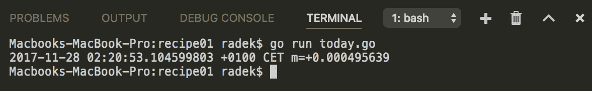

# 工作原理...

内置包`time`包含函数`Now`，该函数提供了初始化为当前本地时间和日期的`Time`实例。

`Time`类型是以纳秒为单位的时间点。`Time`的零值是公元 1 年 1 月 1 日 00:00:00.000000000 UTC。

不应使用`Time`类型的指针。如果只使用值（而不是变量的指针），则`Time`实例被认为是安全的，可用于多个 goroutine。唯一的例外是序列化。

# 另请参阅

有关`Time`类型的更多信息，请参阅`time`包文档：[`golang.org/pkg/time`](https://golang.org/pkg/time)。

# 将日期格式化为字符串

如果需要时间值的文本表示形式，通常期望某种格式。`time`包的`Time`类型提供了在给定格式中创建`string`输出的能力。有一些关于如何做到这一点的规则，我们将介绍一些有用的规则。

# 如何做...

1.  打开控制台并创建文件夹`chapter04/recipe02`。

1.  导航到目录。

1.  创建名为`format.go`的文件，内容如下：

```go
        package main

        import (
          "fmt"
          "time"
        )

        func main() {
          tTime := time.Date(2017, time.March, 5, 8, 5, 2, 0, time.Local)

          // The formatting is done
          // with use of reference value
          // Jan 2 15:04:05 2006 MST
          fmt.Printf("tTime is: %s\n", tTime.Format("2006/1/2"))

          fmt.Printf("The time is: %s\n", tTime.Format("15:04"))

          //The predefined formats could
          // be used
          fmt.Printf("The time is: %s\n", tTime.Format(time.RFC1123))

          // The formatting supports space padding
          //only for days in Go version 1.9.2
          fmt.Printf("tTime is: %s\n", tTime.Format("2006/1/_2"))

          // The zero padding is done by adding 0
          fmt.Printf("tTime is: %s\n", tTime.Format("2006/01/02"))

          //The fraction with leading zeros use 0s
          fmt.Printf("tTime is: %s\n", tTime.Format("15:04:05.00"))

          //The fraction without leading zeros use 9s
          fmt.Printf("tTime is: %s\n", tTime.Format("15:04:05.999"))

          // Append format appends the formatted time to given
          // buffer
          fmt.Println(string(tTime.AppendFormat([]byte("The time 
                             is up: "), "03:04PM")))
        }
```

1.  通过在主终端中运行`go run format.go`来执行代码。

1.  您将看到以下输出：

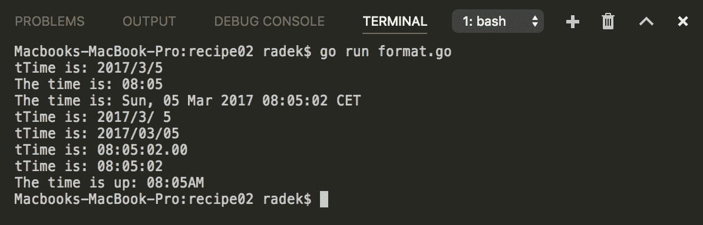

# 工作原理...

`time`包的`Time`类型提供了`Format`方法来格式化输出字符串。

Go 使用引用时间值`Jan 2 15:04:05 2006 MST`来定义格式布局。有关填充选项，请参阅代码示例。

参考日期的备忘录是，以数字形式给出时，表示为 1,2,3,4,5,6,-7。-7 值表示 MST 时区比 UTC 晚 7 小时。

时间包包括一些预定义格式（例如`time.Kitchen`）；您可以在包常量的文档中发现这些内容。([`golang.org/pkg/time/#pkg-constants`](https://golang.org/pkg/time/#pkg-constants))

# 另请参阅

有关所有预定义格式和格式选项，请参阅`time`包的文档：[`golang.org/pkg/time`](https://golang.org/pkg/time)。

# 将字符串解析为日期

日期格式化中使用的概念与日期解析中使用的概念相同。可以使用相同的参考日期和布局原则。本食谱将向您展示如何将字符串输入转换为`Time`实例。

# 如何做...

1.  打开控制台并创建文件夹`chapter04/recipe03`。

1.  导航到目录。

1.  创建包含以下内容的`parse.go`文件：

```go
        package main

        import (
          "fmt"
          "time"
        )

        func main() {

          // If timezone is not defined
          // than Parse function returns
          // the time in UTC timezone.
          t, err := time.Parse("2/1/2006", "31/7/2015")
          if err != nil {
            panic(err)
          }
          fmt.Println(t)

          // If timezone is given than it is parsed
          // in given timezone
          t, err = time.Parse("2/1/2006 3:04 PM MST", 
                              "31/7/2015 1:25 AM DST")
          if err != nil {
            panic(err)
          }
          fmt.Println(t)

          // Note that the ParseInLocation
          // parses the time in given location, if the
          // string does not contain time zone definition
          t, err = time.ParseInLocation("2/1/2006 3:04 PM ", 
                        "31/7/2015 1:25 AM ", time.Local)
          if err != nil {
            panic(err)
          }
          fmt.Println(t)

        }
```

1.  在主终端中运行`go run parse.go`来执行代码。

1.  您将看到以下输出：

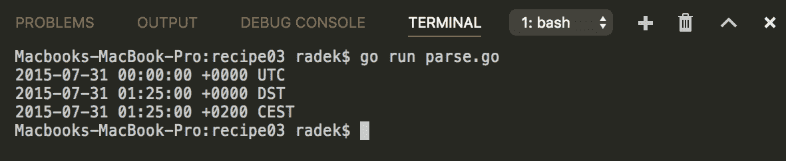

# 它是如何工作的...

`time`包包含`Parse`函数，用于解析带有时间信息的字符串。

传入日期字符串的格式由参考日期给出，格式化为匹配的格式。请记住，参考时间是`Jan 2 15:04:05 2006 MST`。

如果给定的时间字符串不包含有关时区的信息，则`Parse`函数的结果将始终为`UTC`。

如果提供了时区信息，则时间始终是所提供时区的时间瞬间。

`ParseInLocation`函数接受第三个参数，即位置。如果时间字符串不包含任何时区信息，则时间将被解析为给定位置的`Time`实例。

# 将日期转换为时期，反之亦然

时期是描述时间点的通用系统。时期时间的开始被定义为`00:00:00 1 Jan 1970 UTC`。时期的值是自时间戳以来的秒数，减去那时以来的闰秒数。

`time`包和`Time`类型使您能够操作并找出 UNIX 时期时间。

# 如何做...

1.  打开控制台并创建文件夹`chapter04/recipe04`。

1.  导航到目录。

1.  创建包含以下内容的`epoch.go`文件：

```go
        package main

        import (
          "fmt"
          "time"
        )

        func main() {

          // Set the epoch from int64
          t := time.Unix(0, 0)
          fmt.Println(t)

          // Get the epoch
          // from Time instance
          epoch := t.Unix()
          fmt.Println(epoch)

          // Current epoch time
          apochNow := time.Now().Unix()
          fmt.Printf("Epoch time in seconds: %d\n", apochNow)

          apochNano := time.Now().UnixNano()
          fmt.Printf("Epoch time in nano-seconds: %d\n", apochNano)

        }
```

1.  在主终端中运行`go run epoch.go`来执行代码。

1.  您将看到以下输出：

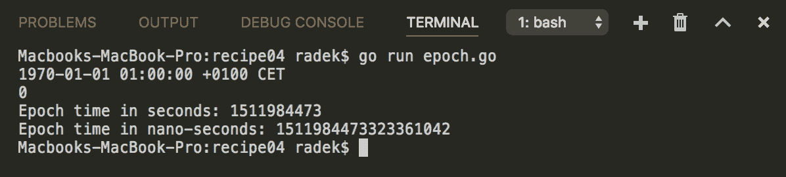

# 它是如何工作的...

`time`包包含`Unix`函数，它接受两个`int64`参数，即时期时间的秒数和纳秒数。这样，您可以从时期值获取`Time`实例。

要从`Time`实例获取时期值，可以调用与从时期创建`Time`相同名称的方法`Unix`。还有一个名为`UnixNano`的方法，它返回毫秒的计数，而不是秒。

# 从日期中检索时间单位

`Time`类型还提供了从实例中检索时间单位的 API。这意味着您可以找出实例表示的月份中的哪一天，或者一天中的哪个小时。本教程展示了如何获取这样的单位。

# 如何做...

1.  打开控制台并创建文件夹`chapter04/recipe05`。

1.  导航到目录。

1.  创建包含以下内容的`units.go`文件：

```go
        package main

        import (
          "fmt"
          "time"
        )

        func main() {
          t := time.Date(2017, 11, 29, 21, 0, 0, 0, time.Local)
          fmt.Printf("Extracting units from: %v\n", t)

          dOfMonth := t.Day()
          weekDay := t.Weekday()
          month := t.Month()

          fmt.Printf("The %dth day of %v is %v\n", dOfMonth,
                     month, weekDay)

        }
```

1.  在主终端中运行`go run units.go`来执行代码。

1.  您将看到以下输出：

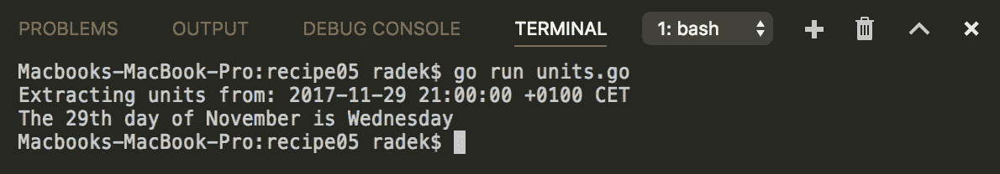

# 它是如何工作的...

`Time`类型提供了提取时间单位的方法。前面的示例显示了提取星期几、月份和月份的日期。类似地，还可以提取小时、秒和其他单位。

自然地，API 直接未提供的单位需要从现有单位中派生出来。

# 日期算术

`time`包的`Time`类型还允许您对给定的日期和时间执行基本算术运算。这样，您可以找出过去和未来的日期。

# 如何做...

1.  打开控制台并创建文件夹`chapter04/recipe06`。

1.  导航到目录。

1.  创建包含以下内容的`arithmetics.go`文件：

```go
        package main

        import (
          "fmt"
          "time"
        )

        func main() {

          l, err := time.LoadLocation("Europe/Vienna")
          if err != nil {
            panic(err)
          }
          t := time.Date(2017, 11, 30, 11, 10, 20, 0, l)
          fmt.Printf("Default date is: %v\n", t)

          // Add 3 days
          r1 := t.Add(72 * time.Hour)
          fmt.Printf("Default date +3HRS is: %v\n", r1)

          // Subtract 3 days
          r1 = t.Add(-72 * time.Hour)
          fmt.Printf("Default date -3HRS is: %v\n", r1)

          // More comfortable api
          // to add days/months/years
          r1 = t.AddDate(1, 3, 2)
          fmt.Printf("Default date +1YR +3MTH +2D is: %v\n", r1)

        }
```

1.  在主终端中运行`go run arithmetics.go`来执行代码。

1.  您将看到以下输出：

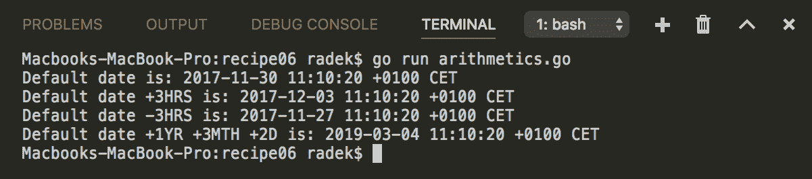

# 它是如何工作的...

`time`包的`Time`类型提供了两种操作日期和时间的基本方法。

第一种方法`Add`接受`time.Duration`和`AddDate`。使用`Add`方法，您可以通过正号将时间向未来移动，并通过添加负号将时间向后移动。

第二种方法`AddDate`，消耗`int64`参数作为年、月和日，并添加更大的时间量。

请注意，`AddDate`会对结果进行标准化，与`time.Date`函数相同。标准化意味着将月份添加到 8 月 31 日将导致 10 月 1 日，因为接下来的一个月只有 30 天（9 月 31 日不存在）。

# 查找两个日期之间的差异

查找两个日期之间的差异并不是一项不寻常的任务。对于这个操作，Go 标准包`time`，分别是`Time`类型，提供了支持方法。

# 如何做...

1.  打开控制台并创建文件夹`chapter04/recipe07`。

1.  导航到目录。

1.  创建`diff.go`文件，内容如下：

```go
        package main

        import (
          "fmt"
          "time"
        )

        func main() {

          l, err := time.LoadLocation("Europe/Vienna")
          if err != nil {
            panic(err)
          }
          t := time.Date(2000, 1, 1, 0, 0, 0, 0, l)
          t2 := time.Date(2000, 1, 3, 0, 0, 0, 0, l)
          fmt.Printf("First Default date is %v\n", t)
          fmt.Printf("Second Default date is %v\n", t2)

          dur := t2.Sub(t)
          fmt.Printf("The duration between t and t2 is %v\n", dur)

          dur = time.Since(t)
          fmt.Printf("The duration between now and t is %v\n", dur)

          dur = time.Until(t)
          fmt.Printf("The duration between t and now is %v\n", dur)

        }
```

1.  通过在主终端中运行`go run diff.go`来执行代码。

1.  您将看到以下输出：

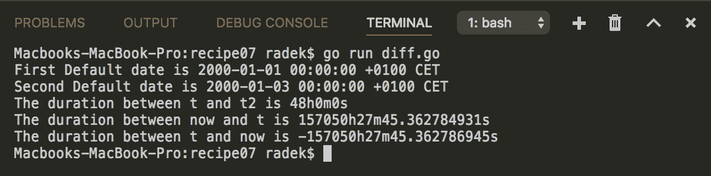

# 它是如何工作的...

`Time`实例的`Sub`方法是找出两个日期之间差异的通用方法。结果是`time.Duration`，表示这些日期之间的纳秒计数。

请注意，如果差异超过了最大/最小`time.Duration`的限制，那么将返回最大或最小值。

函数`Since`和`Until`只是计算现在和给定日期之间差异的一种更简洁的方式。它们的工作方式与它们的名称提示的一样。`Since`函数返回的结果与`time.Now().Sub(t)`相同；同样，`Until`返回的结果与`t.Sub(time.Now())`相同。

`Sub`方法自然也考虑了时区。因此，差异是相对于每个`Time`实例的位置返回的。

# 在不同时区之间转换

处理时区很困难。处理不同时区的一个好方法是将一个时区作为系统中的参考时区，并在需要时转换其他时区。这个配方向您展示了如何在不同时区之间进行时间转换。

# 如何做...

1.  打开控制台并创建文件夹`chapter04/recipe08`。

1.  导航到目录。

1.  创建`timezones.go`文件，内容如下：

```go
        package main

        import (
          "fmt"
          "time"
        )

        func main() {
          eur, err := time.LoadLocation("Europe/Vienna")
          if err != nil {
            panic(err)
          }

          t := time.Date(2000, 1, 1, 0, 0, 0, 0, eur)
          fmt.Printf("Original Time: %v\n", t)

          phx, err := time.LoadLocation("America/Phoenix")
          if err != nil {
            panic(err)
          }

          t2 := t.In(phx)
          fmt.Printf("Converted Time: %v\n", t2)

        }
```

1.  通过在主终端中运行`go run timezones.go`来执行代码。

1.  您将看到以下输出：

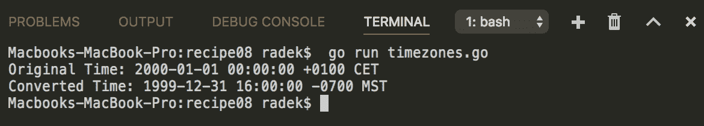

# 它是如何工作的...

`Time`类型提供了`In`方法，它消耗指向`time.Location`的指针。返回的`Time`是原始的转换为给定时区的时间。请注意，`Time`实例被认为是不可变的，因此改变实例的方法会导致新的`Time`实例。

`time`包引用*IANA 时区*数据库作为位置的来源。`LoadLocation`函数查找`ZONEINFO`环境变量中的目录或 ZIP 文件。如果找不到，则在 UNIX 系统上搜索已知的安装位置。最后，它在`$GOROOT/lib/time/zoneinfo.zip`中查找。

# 定期运行代码块

除了日期和时间操作，`time`包还提供了对周期性和延迟代码执行的支持。通常，应用程序健康检查、活动检查或任何周期性作业都可以通过这种方式实现。

# 如何做...

1.  打开控制台并创建文件夹`chapter04/recipe09`。

1.  导航到目录。

1.  创建`ticker.go`文件，内容如下：

```go
        package main

        import (
          "fmt"
          "os"
          "os/signal"
          "time"
       )

       func main() {

         c := make(chan os.Signal, 1)
         signal.Notify(c)

         ticker := time.NewTicker(time.Second)
         stop := make(chan bool)

         go func() {
           defer func() { stop <- true }()
           for {
             select {
               case <-ticker.C:
                 fmt.Println("Tick")
               case <-stop:
                 fmt.Println("Goroutine closing")
                 return
             }
           }
         }()

         // Block until
         // the signal is received
         <-c
         ticker.Stop()

         // Stop the goroutine
         stop <- true
         // Wait until the
         <-stop
         fmt.Println("Application stopped")
       }
```

1.  通过在主终端中运行`go run ticker.go`来执行代码。

1.  等待几秒钟，然后按*Ctrl* + *C*发送`SIGINT`信号。

1.  您将看到以下输出：

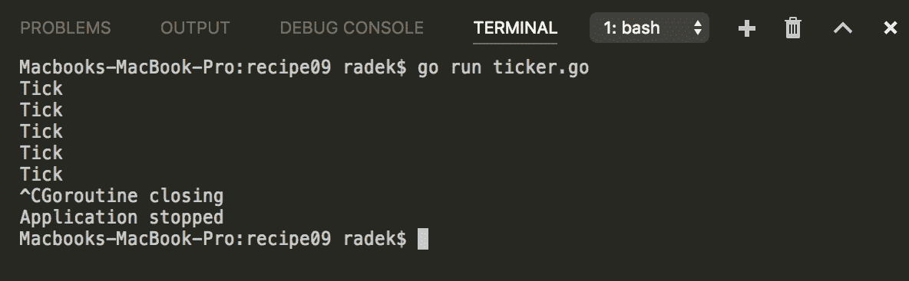

# 它是如何工作的...

`Ticker`持有`C`通道，用于传递周期性的滴答声。实例是根据滴答声之间的给定间隔创建的。间隔由`time.Duration`值定义。

打算定期执行的代码在无限循环中的 goroutine 中执行。从`Ticker`通道读取会阻塞循环，直到传递滴答声。

请注意，一旦调用`Stop`方法停止`Ticker`，`C`通道并不会关闭，它只是停止传递滴答声。因此，前面的代码包含了`select`结构，其中停止通道可以传递停止信号。这样就可以进行优雅的关闭。

# 等待一定时间

前面的示例描述了如何定期执行代码。本示例将向您展示如何延迟执行代码。

# 如何做...

1.  打开控制台并创建文件夹`chapter04/recipe10`。

1.  导航到该目录。

1.  创建`delay.go`文件，内容如下：

```go
        package main

        import (
          "fmt"
          "sync"
          "time"
        )

        func main() {

          t := time.NewTimer(3 * time.Second)

          fmt.Printf("Start waiting at %v\n", 
                     time.Now().Format(time.UnixDate))
          <-t.C
          fmt.Printf("Code executed at %v\n", 
                     time.Now().Format(time.UnixDate))

          wg := &sync.WaitGroup{}
          wg.Add(1)
          fmt.Printf("Start waiting for AfterFunc at %v\n", 
                     time.Now().Format(time.UnixDate))
          time.AfterFunc(3*time.Second, func() {
          fmt.Printf("Code executed for AfterFunc at %v\n", 
                     time.Now().Format(time.UnixDate))
          wg.Done()
        })

        wg.Wait()

        fmt.Printf("Waiting on time.After at %v\n", 
                   time.Now().Format(time.UnixDate))
        <-time.After(3 * time.Second)
        fmt.Printf("Code resumed at %v\n", 
                   time.Now().Format(time.UnixDate))

        }
```

1.  在主终端中运行`go run delay.go`来执行代码。

1.  您将看到以下输出：

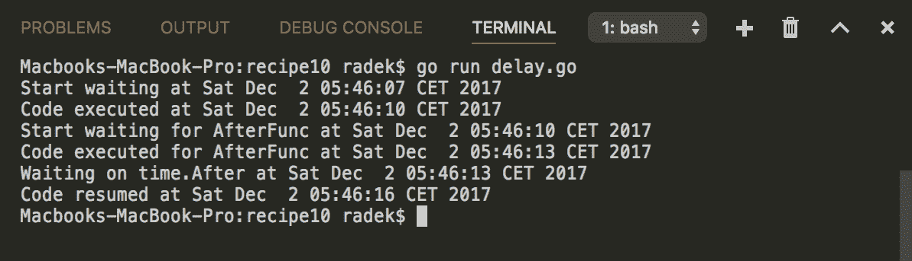

# 工作原理是...

要执行带有一定延迟的代码，可以使用`time`包中的`Timer`。这个工作原理与前面的*定期运行代码块*中描述的相同。

`Timer`包含`C`通道，在给定时间后传递滴答声。之后，该通道不会再传递其他滴答声。

相同的功能由`time`包的`AfterFunc`函数提供。它只是简化了使用。请注意，这里不需要通道。示例代码使用`sync.WaitGroup`来等待给定的函数执行。

`time.After`是前面示例中的最后选择。该函数返回一个通道，在给定时间后传递滴答声。请注意`Timer`和`After`函数之间的区别。`Timer`是可重用的结构（提供`Stop`和`Reset`方法）。另一方面，`After`函数只能使用一次，因为它不提供任何重置选项。

# 超时长时间运行的操作

前面的示例描述了如何延迟执行代码的概念。相同的概念可以用来实现长时间运行操作的超时。本示例将说明如何实现这一点。

# 如何做...

1.  打开控制台并创建文件夹`chapter04/recipe11`。

1.  导航到该目录。

1.  创建`timeout.go`文件，内容如下：

```go
        package main

        import (
          "fmt"
          "time"
        )

        func main() {

          to := time.After(3 * time.Second)
          list := make([]string, 0)
          done := make(chan bool, 1)

          fmt.Println("Starting to insert items")
          go func() {
            defer fmt.Println("Exiting goroutine")
            for {
              select {
                case <-to:
                  fmt.Println("The time is up")
                  done <- true
                  return
                default:
                  list = append(list, time.Now().String())
              }
            }
          }()

          <-done
          fmt.Printf("Managed to insert %d items\n", len(list))
        }
```

1.  在主终端中运行`go run timeout.go`来执行代码。

1.  您将看到以下输出：

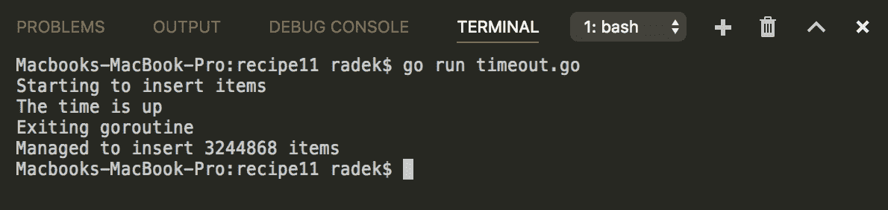

# 工作原理是...

在前面的代码中，长时间运行的操作的超时是通过`time.After`函数实现的，该函数提供在给定时间后传递的通道。

操作本身被包装到一个选择语句中，该语句在`time.After`通道和默认选项之间进行选择，执行操作。

请注意，您需要允许代码定期从`time.After`通道中读取，以了解超时是否已经超过。否则，如果默认的代码分支完全阻塞执行，就没有办法知道超时是否已经过去。

# 还有更多...

示例实现使用了`time.After`函数，但`Timer`函数也可以以相同的方式使用。内置库还使用`context.WithTimeout`来实现超时功能。

# 序列化时间和日期

在序列化日期和时间信息时，需要选择合适的格式。本示例将说明`time`包如何帮助选择合适的格式并正确进行序列化。

# 如何做...

1.  打开控制台并创建文件夹`chapter04/recipe12`。

1.  导航到该目录。

1.  创建`serialize.go`文件，内容如下：

```go
        package main

        import (
          "encoding/json"
          "fmt"
          "time"
        )

        func main() {

          eur, err := time.LoadLocation("Europe/Vienna")
          if err != nil {
            panic(err)
          }
          t := time.Date(2017, 11, 20, 11, 20, 10, 0, eur)

          // json.Marshaler interface
          b, err := t.MarshalJSON()
          if err != nil {
            panic(err)
          }
          fmt.Println("Serialized as RFC 3339:", string(b))
          t2 := time.Time{}
          t2.UnmarshalJSON(b)
          fmt.Println("Deserialized from RFC 3339:", t2)

          // Serialize as epoch
          epoch := t.Unix()
          fmt.Println("Serialized as Epoch:", epoch)

          // Deserialize epoch
          jsonStr := fmt.Sprintf("{ \"created\":%d }", epoch)
          data := struct {
            Created int64 `json:"created"`
          }{}
          json.Unmarshal([]byte(jsonStr), &data)
          deserialized := time.Unix(data.Created, 0)
          fmt.Println("Deserialized from Epoch:", deserialized)

        }
```

1.  在主终端中运行`go run serialize.go`来执行代码。

1.  您将看到以下输出：

>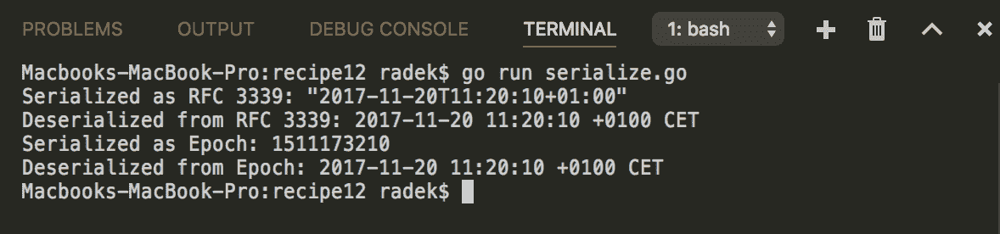

# 工作原理是...

`Time`函数实现了二进制、Gob 和 JSON 序列化的接口。JSON 格式被认为是非常通用的，因此展示了将值序列化为 JSON 的示例。请注意，`Time`函数以 RFC 3339（[`www.ietf.org/rfc/rfc3339.txt`](https://www.ietf.org/rfc/rfc3339.txt)）的方式序列化值，该规范提出了所谓的互联网日期/时间格式。

另一种非常通用的序列化/保留时间的方法是使用纪元时间。纪元时间与时区无关，因为它是由自某一绝对时间点以来经过的秒/纳秒定义的。最后，它被表示为一个数字，因此没有理由对值进行序列化和反序列化。
