# 第五章：进入和退出

本章包含以下教程：

+   读取标准输入

+   写入标准输出和错误

+   通过名称打开文件

+   将文件读入字符串

+   读写不同的字符集

+   在文件中寻找位置

+   读写二进制数据

+   同时写入多个写入器

+   写入和读取之间的管道

+   将对象序列化为二进制格式

+   读写 ZIP 文件

+   有效地解析大型 XML 文件

+   从不完整的 JSON 数组中提取数据

# 介绍

本章将介绍典型的 I/O 操作和相关任务，以及各种输入源的写入和读取。我们将介绍 XML 处理、解压缩压缩文件以及使用随机访问文件。

检查 Go 是否已正确安装。第一章的*准备就绪*部分，*与环境交互*的*检索 Golang 版本*教程将对您有所帮助。

# 读取标准输入

每个进程都拥有自己的标准输入、输出和错误文件描述符。`stdin`作为进程的输入。本教程描述了如何从`stdin`读取数据。

# 如何做...

1.  打开控制台并创建文件夹`chapter05/recipe01`。

1.  导航到目录。

1.  创建名为`fmt.go`的文件，内容如下：

```go
        package main

        import (
          "fmt"
        )

        func main() {

          var name string
          fmt.Println("What is your name?")
          fmt.Scanf("%s\n", &name)

          var age int
          fmt.Println("What is your age?")
          fmt.Scanf("%d\n", &age)

          fmt.Printf("Hello %s, your age is %d\n", name, age)

       }
```

1.  使用`go run fmt.go`执行代码。

1.  输入`John`并按*Enter*。

1.  输入`40`并按*Enter*。

1.  您将看到以下输出：

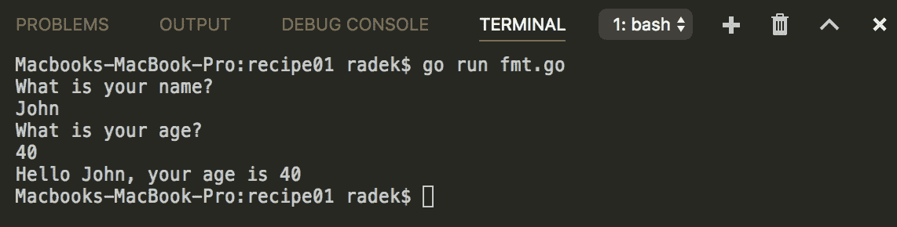

1.  创建名为`scanner.go`的文件，内容如下：

```go
        package main

        import (
          "bufio"
          "fmt"
          "os"
        )

        func main() {

          // The Scanner is able to
          // scan input by lines
          sc := bufio.NewScanner(os.Stdin)

          for sc.Scan() {
            txt := sc.Text()
            fmt.Printf("Echo: %s\n", txt)
          }

        }
```

1.  使用`go run scanner.go`执行代码。

1.  输入`Hello`并按*Enter*。

1.  按下*CTRL* + *C*发送`SIGINT`。

1.  查看输出：

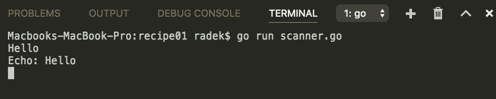

1.  创建名为`reader.go`的文件，内容如下：

```go
        package main

        import (
          "fmt"
          "os"
        )

        func main() {

         for {
           data := make([]byte, 8)
           n, err := os.Stdin.Read(data)
           if err == nil && n > 0 {
             process(data)
           } else {
             break
           }
         }

       }

       func process(data []byte) {
         fmt.Printf("Received: %X %s\n", data, string(data))
       }
```

1.  使用管道输入`echo 'Go is awesome!' | go run reader.go`执行代码。

1.  查看输出：

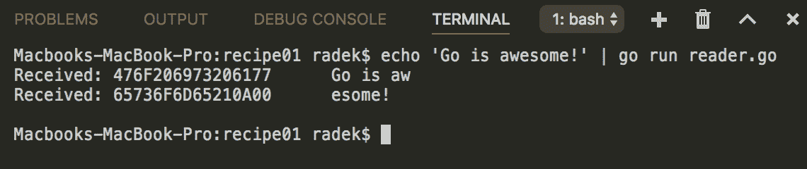

# 工作原理...

Go 进程的`stdin`可以通过`os`包的`Stdin`获取。实际上，它是一个实现了`Reader`接口的`File`类型。从`Reader`读取非常容易。上述代码展示了从`Stdin`读取的三种常见方式。

第一个选项演示了`fmt`包的使用，该包提供了`Scan`、`Scanf`和`Scanln`函数。`Scanf`函数将输入读取到给定的变量中。`Scanf`的优点是可以确定扫描值的格式。`Scan`函数只是将输入读取到变量中（没有预定义的格式），而`Scanln`则像其名称一样，读取以换行符结束的输入。

`Scanner`是示例代码中显示的第二个选项，它提供了一种方便的扫描大量输入的方式。`Scanner`包含了`Split`函数，可以定义自定义的分割函数。例如，要从`stdin`扫描单词，可以使用`bufio.ScanWords`预定义的`SplitFunc`。

通过`Reader` API 进行读取是最后介绍的方法。这种方法可以更好地控制输入的读取方式。

# 写入标准输出和错误

正如前面的教程所述，每个进程都有`stdin`、`stdout`和`stderr`文件描述符。标准方法是使用`stdout`作为进程输出，`stderr`作为进程错误输出。由于这些是文件描述符，数据写入的目标可以是任何东西，从控制台到套接字。本教程将向您展示如何写入`stdout`和`stderr`。

# 如何做...

1.  打开控制台并创建文件夹`chapter05/recipe02`。

1.  导航到目录。

1.  创建名为`stdouterr.go`的文件，内容如下：

```go
        package main

        import (
          "fmt"
          "io"
          "os"
         )

         func main() {

           // Simply write string
           io.WriteString(os.Stdout,
           "This is string to standard output.\n")

           io.WriteString(os.Stderr,
           "This is string to standard error output.\n")

           // Stdout/err implements
           // writer interface
           buf := []byte{0xAF, 0xFF, 0xFE}
           for i := 0; i < 200; i++ {
             if _, e := os.Stdout.Write(buf); e != nil {
               panic(e)
             }
           }

           // The fmt package
           // could be used too
           fmt.Fprintln(os.Stdout, "\n")
         }
```

1.  使用`go run stdouterr.go`执行代码。

1.  查看输出：

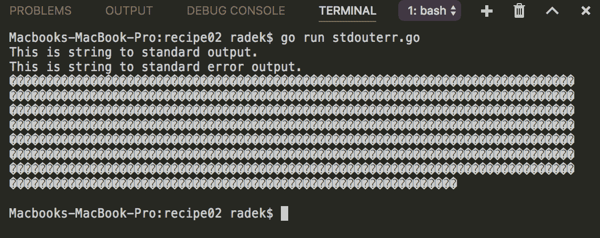

# 工作原理...

与前面示例中的`Stdin`一样，`Stdout`和`Stderr`是文件描述符。因此，它们实现了`Writer`接口。

前面的示例展示了如何通过`io.WriteString`函数、`Writer` API 的使用以及`fmt`包和`FprintXX`函数来写入这些内容的几种方法。

# 通过名称打开文件

文件访问是一种非常常见的操作，用于存储或读取数据。本示例说明了如何使用标准库通过文件名和路径打开文件。

# 如何做...

1.  打开控制台并创建文件夹`chapter05/recipe03`。

1.  导航到目录。

1.  创建目录`temp`并在其中创建文件`file.txt`。

1.  编辑`file.txt`文件并将`This file content`写入文件。

1.  使用以下内容创建`openfile.go`文件：

```go
        package main

        import (
          "fmt"
          "io"
          "io/ioutil"
          "os"
        )

        func main() {

          f, err := os.Open("temp/file.txt")
          if err != nil {
            panic(err)
          }

          c, err := ioutil.ReadAll(f)
          if err != nil {
            panic(err)
          }

          fmt.Printf("### File content ###\n%s\n", string(c))
          f.Close()

          f, err = os.OpenFile("temp/test.txt", os.O_CREATE|os.O_RDWR,
                               os.ModePerm)
          if err != nil {
            panic(err)
          }
          io.WriteString(f, "Test string")
          f.Close()

        }
```

1.  文件结构应该如下所示：

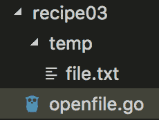

1.  使用`go run openfile.go`执行代码。

1.  查看输出，`temp`文件夹中还应该有一个新文件`test.txt`：

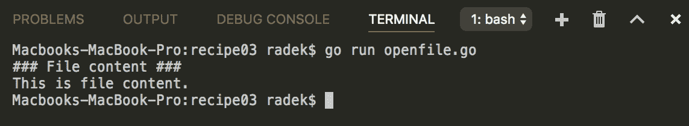

# 它是如何工作的...

`os`包提供了一种简单的打开文件的方式。函数`Open`通过路径打开文件，只以只读模式打开。另一个函数`OpenFile`更强大，需要文件路径、标志和权限。

标志常量在`os`包中定义，可以使用二进制 OR 运算符`|`组合它们。权限由`os`包常量（例如`os.ModePerm`）或数字表示法（如`0777`，权限为`-rwxrwxrwx`）设置。

# 将文件读取为字符串

在前面的示例中，我们看到了从`Stdin`读取和打开文件。在本示例中，我们将稍微结合这两者，并展示如何将文件读取为字符串。

# 如何做...

1.  打开控制台并创建文件夹`chapter05/recipe04`。

1.  导航到目录。

1.  创建目录`temp`并在其中创建文件`file.txt`。

1.  编辑`file.txt`文件并写入多行内容。

1.  使用以下内容创建`readfile.go`文件：

```go
        package main

        import "os"
        import "bufio"

        import "bytes"
        import "fmt"
        import "io/ioutil"

        func main() {

          fmt.Println("### Read as reader ###")
          f, err := os.Open("temp/file.txt")
          if err != nil {
            panic(err)
          }
          defer f.Close()

          // Read the
          // file with reader
          wr := bytes.Buffer{}
          sc := bufio.NewScanner(f)
          for sc.Scan() {
            wr.WriteString(sc.Text())
          }
          fmt.Println(wr.String())

          fmt.Println("### ReadFile ###")
          // for smaller files
          fContent, err := ioutil.ReadFile("temp/file.txt")
          if err != nil {
            panic(err)
          }
          fmt.Println(string(fContent))

        }
```

1.  使用`go run readfile.go`执行代码。

1.  查看输出：

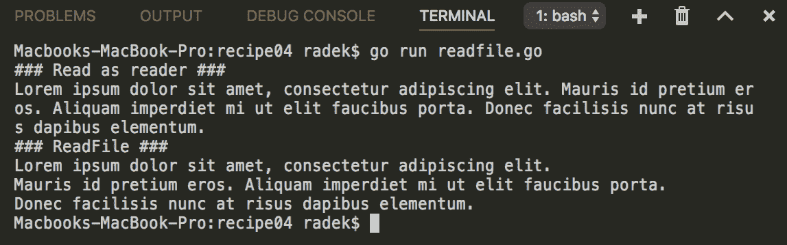

# 它是如何工作的...

从文件中读取很简单，因为`File`类型实现了`Reader`和`Writer`接口。这样，所有适用于`Reader`接口的函数和方法都适用于`File`类型。前面的示例展示了如何使用`Scanner`读取文件并将内容写入字节缓冲区（这比字符串连接更高效）。这样，您可以控制从文件中读取的内容量。

第二种方法使用`ioutil.ReadFile`更简单，但应谨慎使用，因为它会读取整个文件。请记住，文件可能很大，可能会威胁应用程序的稳定性。

# 读取/写入不同的字符集

各种来源的输入可能以各种字符集的形式出现并不是例外。请注意，许多系统使用 Windows 操作系统，但也有其他系统。Go 默认期望程序中使用的字符串是基于 UTF-8 的。如果不是，则必须从给定的字符集解码以便能够处理该字符串。本示例将展示以 UTF-8 之外的字符集读取和写入文件。

# 如何做...

1.  打开控制台并创建文件夹`chapter05/recipe05`。

1.  导航到目录。

1.  使用以下内容创建`charset.go`文件：

```go
        package main

        import (
          "fmt"
          "io/ioutil"
          "os"

          "golang.org/x/text/encoding/charmap"
        )

        func main() {

          // Write the string
          // encoded to Windows-1252
          encoder := charmap.Windows1252.NewEncoder()
          s, e := encoder.String("This is sample text with runes Š")
          if e != nil {
            panic(e)
          }
          ioutil.WriteFile("example.txt", []byte(s), os.ModePerm)

          // Decode to UTF-8
          f, e := os.Open("example.txt")
          if e != nil {
            panic(e)
          }
          defer f.Close()
          decoder := charmap.Windows1252.NewDecoder()
          reader := decoder.Reader(f)
          b, err := ioutil.ReadAll(reader)
          if err != nil {
            panic(err)
          }
          fmt.Println(string(b))
        }
```

1.  使用`go run charset.go`执行代码。

1.  查看输出：

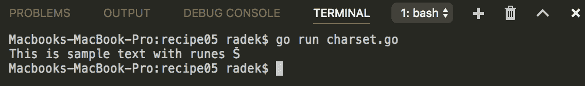

# 它是如何工作的...

`golang.org/x/text/encoding/charmap` 包包含代表广泛使用的字符集的 `Charmap` 类型指针常量。`Charmap` 类型提供了为给定字符集创建编码器和解码器的方法。`Encoder` 创建编码 `Writer`，将写入的字节编码为所选字符集。类似地，`Decoder` 可以创建解码 `Reader`，从所选字符集解码所有读取的数据。

# 另请参阅

第二章，*字符串和其他内容*，还包含了编码/解码字符串到另一个字符集的教程*从非 Unicode 字符集解码字符串*。

# 在文件中寻找位置

在某些情况下，您需要从文件的特定位置读取或写入，例如索引文件。本教程将向您展示如何在平面文件操作的上下文中使用位置寻找。

# 如何做...

1.  打开控制台并创建文件夹 `chapter05/recipe06`。

1.  导航到目录。

1.  创建名为 `flatfile.txt` 的文件，并包含以下内容：

```go
 123.Jun.......Wong......
 12..Novak.....Jurgen....
 10..Thomas....Sohlich...
```

1.  创建名为 `fileseek.go` 的文件，并包含以下内容：

```go
        package main

        import (
          "errors"
          "fmt"
          "os"
        )

        const lineLegth = 25

        func main() {

          f, e := os.OpenFile("flatfile.txt", os.O_RDWR|os.O_CREATE,
                              os.ModePerm)
          if e != nil {
            panic(e)
          }
          defer f.Close()

          fmt.Println(readRecords(2, "last", f))
          if err := writeRecord(2, "first", "Radomir", f); err != nil {
            panic(err)
          }
          fmt.Println(readRecords(2, "first", f))
          if err := writeRecord(10, "first", "Andrew", f); err != nil {
            panic(err)
          }
          fmt.Println(readRecords(10, "first", f))
          fmt.Println(readLine(2, f))
        }

        func readLine(line int, f *os.File) (string, error) {
          lineBuffer := make([]byte, 24)
          f.Seek(int64(line*lineLegth), 0)
          _, err := f.Read(lineBuffer)
          return string(lineBuffer), err
        }

        func writeRecord(line int, column, dataStr string, f *os.File) 
        error {
          definedLen := 10
          position := int64(line * lineLegth)
          switch column {
            case "id":
              definedLen = 4
            case "first":
              position += 4
            case "last":
              position += 14
           default:
             return errors.New("Column not defined")
          }

          if len([]byte(dataStr)) > definedLen {
            return fmt.Errorf("Maximum length for '%s' is %d", 
                              column, definedLen)
          }

          data := make([]byte, definedLen)
          for i := range data {
            data[i] = '.'
          }
          copy(data, []byte(dataStr))
          _, err := f.WriteAt(data, position)
          return err
        }

        func readRecords(line int, column string, f *os.File) 
                        (string, error) {
          lineBuffer := make([]byte, 24)
          f.ReadAt(lineBuffer, int64(line*lineLegth))
          var retVal string
          switch column {
            case "id":
              return string(lineBuffer[:3]), nil
            case "first":
              return string(lineBuffer[4:13]), nil
            case "last":
              return string(lineBuffer[14:23]), nil
          }

          return retVal, errors.New("Column not defined")
        }
```

1.  使用 `go run fileseek.go` 执行代码。

1.  查看输出：

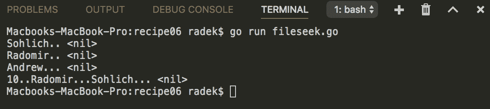

1.  以十六进制显示文件 `xxd flatfile.txt`。

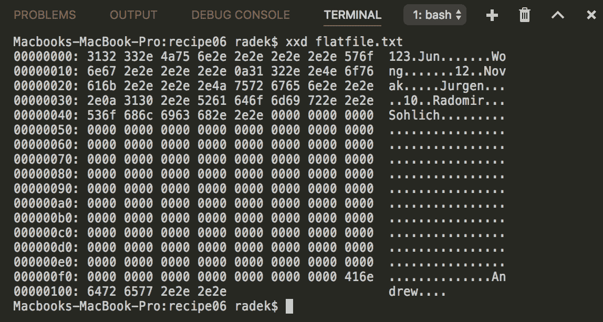

# 它是如何工作的...

前面的示例使用 `flatfile` 作为演示如何在文件中寻找、读取和写入的例子。通常，可以使用 `Seek` 方法来移动当前指针在 `File` 中的位置。它接受两个参数，即位置和如何计算位置，`0 - 相对于文件原点，1 - 相对于当前位置，2 - 相对于文件末尾`。这样，您可以在文件中移动光标。`Seek` 方法在前面代码中的 `readLine` 函数的实现中使用。

`flatfile` 是存储数据的最基本形式。记录结构具有固定长度，记录部分也是如此。示例中的平面文件结构是：`ID` - 4 个字符，`FirstName` - 10 个字符，`LastName` - 10 个字符。整个记录长度为 24 个字符，以换行符结束，即第 25 个字符。

`os.File` 还包含 `ReadAt` 和 `WriteAt` 方法。这些方法消耗要写入/读取的字节和开始的偏移量。这简化了在文件中特定位置的写入和读取。

请注意，示例假定每个符文只有一个字节，这对于特殊字符等可能并不正确。

# 读取和写入二进制数据

本教程描述了如何以二进制形式写入和读取任何类型。

# 如何做...

1.  打开控制台并创建文件夹 `chapter05/recipe07`。

1.  导航到目录。

1.  创建名为 `rwbinary.go` 的文件，并包含以下内容：

```go
        package main

        import (
          "bytes"
          "encoding/binary"
          "fmt"
        )

        func main() {
          // Writing binary values
          buf := bytes.NewBuffer([]byte{})
          if err := binary.Write(buf, binary.BigEndian, 1.004); 
          err != nil {
            panic(err)
          }
          if err := binary.Write(buf, binary.BigEndian,
                   []byte("Hello")); err != nil {
            panic(err)
          }

          // Reading the written values
          var num float64
          if err := binary.Read(buf, binary.BigEndian, &num); 
          err != nil {
            panic(err)
          }
          fmt.Printf("float64: %.3f\n", num)
          greeting := make([]byte, 5)
          if err := binary.Read(buf, binary.BigEndian, &greeting);
          err != nil {
            panic(err)
          }
          fmt.Printf("string: %s\n", string(greeting))
        }
```

1.  通过 `go run rwbinary.go` 执行代码。

1.  查看输出：

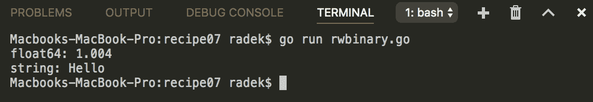

# 它是如何工作的...

可以使用 `encoding/binary` 包写入二进制数据。函数 `Write` 消耗应该写入数据的 `Writer`，字节顺序（`BigEndian`/`LittleEndian`），最后是要写入 `Writer` 的值。

要类似地读取二进制数据，可以使用 `Read` 函数。请注意，从二进制源读取数据并没有什么神奇之处。您需要确定从 `Reader` 中获取的数据是什么。如果不确定，数据可能会被获取到适合大小的任何类型中。

# 同时向多个写入器写入

当您需要将相同的输出写入多个目标时，内置包中提供了帮助。本教程展示了如何同时实现写入多个目标。

# 如何做...

1.  打开控制台并创建文件夹 `chapter05/recipe08`。

1.  导航到目录。

1.  创建名为 `multiwr.go` 的文件，并包含以下内容：

```go
        package main

        import "io"
        import "bytes"
        import "os"
        import "fmt"

        func main() {

          buf := bytes.NewBuffer([]byte{})
          f, err := os.OpenFile("sample.txt", os.O_CREATE|os.O_RDWR,
                                os.ModePerm)
          if err != nil {
            panic(err)
          }
          wr := io.MultiWriter(buf, f)
          _, err = io.WriteString(wr, "Hello, Go is awesome!")
          if err != nil {
            panic(err)
          }

          fmt.Println("Content of buffer: " + buf.String())
        }
```

1.  通过 `go run multiwr.go` 执行代码。

1.  查看输出：

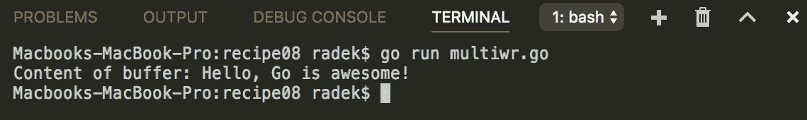

1.  检查创建文件的内容：

```go
 Hello, Go is awesome!
```

# 工作原理...

`io`包含`MultiWriter`函数，带有`Writers`的可变参数。当调用`Writer`上的`Write`方法时，数据将被写入所有底层的`Writers`。

# 在写入器和读取器之间进行管道传输

进程之间的管道是使用第一个进程的输出作为其他进程的输入的简单方法。在 Go 中也可以使用相同的概念，例如，将数据从一个套接字传输到另一个套接字，创建隧道连接。本教程将向您展示如何使用 Go 内置库创建管道。

# 操作步骤如下...

1.  打开控制台并创建文件夹`chapter05/recipe09`。

1.  导航到目录。

1.  创建`pipe.go`文件，内容如下：

```go
        package main

        import (
          "io"
          "log"
          "os"
          "os/exec"
        )

        func main() {
          pReader, pWriter := io.Pipe()

          cmd := exec.Command("echo", "Hello Go!\nThis is example")
          cmd.Stdout = pWriter

          go func() {
            defer pReader.Close()
            if _, err := io.Copy(os.Stdout, pReader); err != nil {
              log.Fatal(err)
            }
          }()

          if err := cmd.Run(); err != nil {
            log.Fatal(err)
          }

        }
```

1.  通过`go run pipe.go`执行代码。

1.  查看输出：

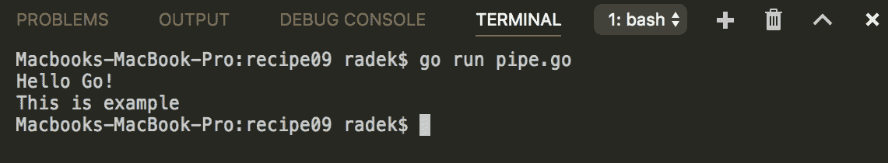

# 工作原理...

`io.Pipe`函数创建内存管道，并返回管道的两端，一端是`PipeReader`，另一端是`PipeWriter`。对`PipeWriter`的每次`Write`都会被阻塞，直到另一端的`Read`消耗。

该示例显示了从执行命令的输出到父程序的标准输出的管道输出。通过将`pWriter`分配给`cmd.Stdout`，子进程的标准输出被写入管道，`goroutine`中的`io.Copy`消耗写入的数据，将数据复制到`os.Stdout`。

# 将对象序列化为二进制格式

除了众所周知的 JSON 和 XML 之外，Go 还提供了二进制格式`gob`。本教程将介绍如何使用`gob`包的基本概念。

# 操作步骤如下...

1.  打开控制台并创建文件夹`chapter05/recipe10`。

1.  导航到目录。

1.  创建`gob.go`文件，内容如下：

```go
        package main

        import (
          "bytes"
          "encoding/gob"
          "fmt"
        )

        type User struct {
          FirstName string
          LastName string
          Age int
          Active bool
        }

        func (u User) String() string {
          return fmt.Sprintf(`{"FirstName":%s,"LastName":%s,
                               "Age":%d,"Active":%v }`,
          u.FirstName, u.LastName, u.Age, u.Active)
        }

        type SimpleUser struct {
          FirstName string
          LastName string
        }

        func (u SimpleUser) String() string {
          return fmt.Sprintf(`{"FirstName":%s,"LastName":%s}`,
          u.FirstName, u.LastName)
        }

        func main() {

          var buff bytes.Buffer

          // Encode value
          enc := gob.NewEncoder(&buff)
          user := User{
            "Radomir",
            "Sohlich",
            30,
            true,
          }
          enc.Encode(user)
          fmt.Printf("%X\n", buff.Bytes())

          // Decode value
          out := User{}
          dec := gob.NewDecoder(&buff)
          dec.Decode(&out)
          fmt.Println(out.String())

          enc.Encode(user)
          out2 := SimpleUser{}
          dec.Decode(&out2)
          fmt.Println(out2.String())

        }
```

1.  通过`go run gob.go`执行代码。

1.  查看输出：

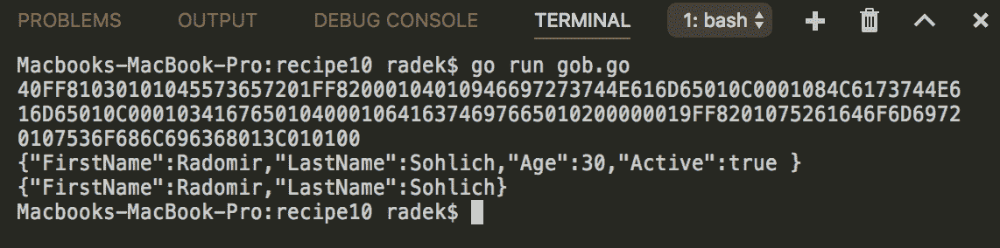

# 工作原理...

`gob`序列化和反序列化需要编码器和解码器。`gob.NewEncoder`函数创建具有底层`Writer`的`Encoder`。每次调用`Encode`方法都会将对象序列化为`gob`格式。`gob`格式本身是自描述的二进制格式。这意味着每个序列化的结构都以其描述为前缀。

要从序列化形式解码数据，必须通过调用`gob.NewDecoder`创建`Decoder`，并使用底层的`Reader`。然后，`Decode`接受应将数据反序列化到的结构的指针。

注意，gob 格式不需要源和目标类型完全匹配。有关规则，请参考`encoding`/`gob`包。

# 读取和写入 ZIP 文件

ZIP 压缩是一种广泛使用的压缩格式。通常使用 ZIP 格式来上传文件集或者导出压缩文件作为输出。本教程将向您展示如何使用标准库以编程方式处理 ZIP 文件。

# 操作步骤如下...

1.  打开控制台并创建文件夹`chapter05/recipe11`。

1.  导航到目录。

1.  创建`zip.go`文件，内容如下：

```go
        package main

        import (
          "archive/zip"
          "bytes"
          "fmt"
          "io"
          "io/ioutil"
          "log"
          "os"
        )

        func main() {

          var buff bytes.Buffer

          // Compress content
          zipW := zip.NewWriter(&buff)
          f, err := zipW.Create("newfile.txt")
          if err != nil {
            panic(err)
          }
          _, err = f.Write([]byte("This is my file content"))
          if err != nil {
            panic(err)
          }
          err = zipW.Close()
          if err != nil {
            panic(err)
          }

          //Write output to file
          err = ioutil.WriteFile("data.zip", buff.Bytes(), os.ModePerm)
          if err != nil {
            panic(err)
          }

          // Decompress the content
          zipR, err := zip.OpenReader("data.zip")
          if err != nil {
            panic(err)
          }

          for _, file := range zipR.File {
            fmt.Println("File " + file.Name + " contains:")
            r, err := file.Open()
            if err != nil {
              log.Fatal(err)
            }
            _, err = io.Copy(os.Stdout, r)
            if err != nil {
              panic(err)
            }
            err = r.Close()
            if err != nil {
              panic(err)
            }
            fmt.Println()
          }

        }
```

1.  通过`go run zip.go`执行代码。

1.  查看输出：

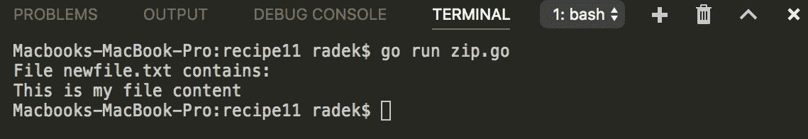

# 工作原理...

内置包`zip`包含`NewWriter`和`NewReader`函数，用于创建`zip.Writer`以进行压缩，以及`zip.Reader`以进行解压缩。

ZIP 文件的每个记录都是使用创建的`zip.Writer`的`Create`方法创建的。然后使用返回的`Writer`来写入内容主体。

要解压文件，使用`OpenReader`函数创建 zipped 文件中记录的`ReadCloser`。创建的`ReaderCloser`的`File`字段是`zip.File`指针的切片。通过调用`Open`方法并读取返回的`ReadCloser`来获取文件的内容。

只需在`Create`方法的文件名中添加斜杠即可创建文件夹。例如`folder/newfile.txt`。

# 有效解析大型 XML 文件

XML 是一种非常常见的数据交换格式。Go 库包含对解析 XML 文件的支持，方式与 JSON 相同。通常，使用与 XML 方案对应的结构，并借助此帮助一次解析 XML 内容。问题在于当 XML 文件太大而无法放入内存时，因此需要分块解析文件。这个示例将揭示如何处理大型 XML 文件并解析所需的信息。

# 如何做...

1.  打开控制台并创建文件夹`chapter05/recipe11`。

1.  导航到目录。

1.  创建`data.xml`文件，内容如下：

```go
        <?xml version="1.0"?>
        <catalog>
          <book id="bk101">
            <author>Gambardella, Matthew</author>
            <title>XML Developer's Guide</title>
            <genre>Computer</genre>
            <price>44.95</price>
            <publish_date>2000-10-01</publish_date>
            <description>An in-depth look at creating applications 
             with XML.</description>
          </book>
          <book id="bk112">
            <author>Galos, Mike</author>
            <title>Visual Studio 7: A Comprehensive Guide</title>
            <genre>Computer</genre>
            <price>49.95</price>
            <publish_date>2001-04-16</publish_date>
            <description>Microsoft Visual Studio 7 is explored
             in depth, looking at how Visual Basic, Visual C++, C#,
             and ASP+ are integrated into a comprehensive development
             environment.</description>
          </book>
        </catalog>
```

1.  创建`xml.go`文件，内容如下：

```go
        package main

        import (
          "encoding/xml"
          "fmt"
          "os"
        )

        type Book struct {
          Title string `xml:"title"`
          Author string `xml:"author"`
        }

        func main() {

          f, err := os.Open("data.xml")
          if err != nil {
            panic(err)
          }
          defer f.Close()
          decoder := xml.NewDecoder(f)

          // Read the book one by one
          books := make([]Book, 0)
          for {
            tok, _ := decoder.Token()
            if tok == nil {
              break
            }
            switch tp := tok.(type) {
              case xml.StartElement:
                if tp.Name.Local == "book" {
                  // Decode the element to struct
                  var b Book
                  decoder.DecodeElement(&b, &tp)
                  books = append(books, b)
                }
            }
          }
          fmt.Println(books)
        }
```

1.  通过`go run xml.go`执行代码。

1.  查看输出：

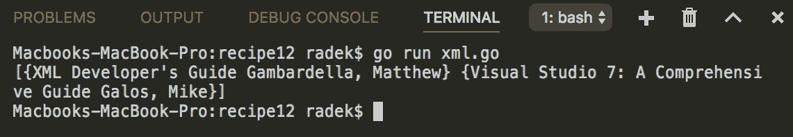

# 工作原理...

使用`xml`包的`NewDecoder`函数创建 XML 内容的`Decoder`。

通过在`Decoder`上调用`Token`方法，接收`xml.Token`。`xml.Token`是保存令牌类型的接口。可以根据类型定义代码的行为。示例代码测试解析的`xml.StartElement`是否是`book`元素之一。然后将数据部分解析为`Book`结构。这样，底层`Decoder`中的`Reader`中的指针位置将被结构数据移动，解析可以继续进行。

# 从不完整的 JSON 数组中提取数据

这个示例包含一个非常特定的用例，即您的程序从不可靠的来源消耗 JSON，而 JSON 包含一个具有开始标记`[`的对象数组，但数组中的项目数量非常大，而 JSON 的结尾可能已损坏。

# 如何做...

1.  打开控制台并创建文件夹`chapter05/recipe13`。

1.  导航到目录。

1.  创建`json.go`文件，内容如下：

```go
        package main

        import (
          "encoding/json"
          "fmt"
          "strings"
        )

        const js = `
          [
            {
              "name":"Axel",
              "lastname":"Fooley"
            },
            {
              "name":"Tim",
              "lastname":"Burton"
            },
            {
              "name":"Tim",
              "lastname":"Burton"
        `

        type User struct {
          Name string `json:"name"`
          LastName string `json:"lastname"`
        }

        func main() {

          userSlice := make([]User, 0)
          r := strings.NewReader(js)
          dec := json.NewDecoder(r)
          for {
            tok, err := dec.Token()
            if err != nil {
              break
            }
            if tok == nil {
              break
            }
            switch tp := tok.(type) {
              case json.Delim:
                str := tp.String()
                if str == "" || str == "{" {
                  for dec.More() {
                    u := User{}
                    err := dec.Decode(&u)
                    if err == nil {
                      userSlice = append(userSlice, u)
                    } else {
                      break
                    }
                  }
                }
              }
            }

            fmt.Println(userSlice)
          }
```

1.  通过`go run json.go`执行代码。

1.  查看输出：

![

# 工作原理...

除了`Unmarshall`函数外，`json`包还包含`Decoder` API。使用`NewDecoder`可以创建`Decoder`。通过在解码器上调用`Token`方法，可以读取底层`Reader`并返回`Token`接口。这可以保存多个值。

其中之一是`Delim`类型，它是包含`{`、`[`、`]`、`}`中之一的 rune。基于此，检测到 JSON 数组的开始。通过解码器上的`More`方法，可以检测到更多要解码的对象。
