# 连接网络

本章包含以下示例：

+   解析本地 IP 地址

+   连接到远程服务器

+   通过 IP 地址解析域名，反之亦然

+   连接到 HTTP 服务器

+   解析和构建 URL

+   创建 HTTP 请求

+   读取和写入 HTTP 头

+   处理 HTTP 重定向

+   使用 RESTful API

+   发送简单的电子邮件

+   调用 JSON-RPC 服务

# 介绍

本章主要讨论网络。本章中的大多数示例都集中在客户端。我们将介绍如何解析有关机器、域名和 IP 解析的基本信息，以及如何通过 TCP 相关协议（如 HTTP 和 SMTP）进行连接。最后，我们将使用标准库进行 JSON-RCP 1.0 的远程过程调用。

检查 Go 是否已正确安装。第一章中的*准备就绪*部分中的*检索 Golang 版本*示例，*与环境交互*，将有所帮助。验证是否有其他应用程序阻止了`7070`端口。

# 解析本地 IP 地址

本示例解释了如何从可用的本地接口中检索 IP 地址。

# 如何做...

1.  打开控制台并创建文件夹`chapter07/recipe01`。

1.  导航到目录。

1.  创建`interfaces.go`文件，内容如下：

```go
        package main

        import (
          "fmt"
          "net"
        )

        func main() {

          // Get all network interfaces
          interfaces, err := net.Interfaces()
          if err != nil {
            panic(err)
          }

          for _, interf := range interfaces {
            // Resolve addresses
            // for each interface
            addrs, err := interf.Addrs()
            if err != nil {
              panic(err)
            }
            fmt.Println(interf.Name)
            for _, add := range addrs {
              if ip, ok := add.(*net.IPNet); ok {
                fmt.Printf("\t%v\n", ip)
              }
            }

          }
        }
```

1.  在主终端中运行`go run interfaces.go`来执行代码。

1.  您将看到以下输出：

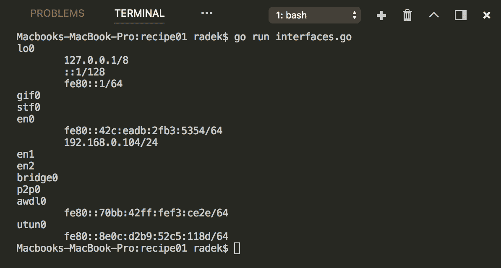

# 它是如何工作的...

net 包包含`Interfaces`函数，它将网络接口列为`Interface`结构的切片。`Interface`结构具有`Addrs`方法，它列出可用的网络地址。这样，您可以按接口列出地址。

另一个选项是使用`net`包的`InterfaceAddrs`函数，它提供了实现`Addr`接口的结构体切片。这为您提供了获取所需信息的方法。

# 连接到远程服务器

基于 TCP 的协议是网络通信中最重要的协议。作为提醒，HTTP、FTP、SMTP 和其他协议都属于这一组。本示例让您了解如何一般连接到 TCP 服务器。

# 如何做...

1.  打开控制台并创建文件夹`chapter07/recipe02`。

1.  导航到目录。

1.  创建`tcpclient.go`文件，内容如下：

```go
        package main

        import (
          "bufio"
          "context"
          "fmt"
          "io"
          "net"
          "net/http"
          "time"
        )

        type StringServer string

        func (s StringServer) ServeHTTP(rw http.ResponseWriter,
                                        req *http.Request) {
          rw.Write([]byte(string(s)))
        }

        func createServer(addr string) http.Server {
          return http.Server{
            Addr: addr,
            Handler: StringServer("HELLO GOPHER!\n"),
          }
       }

       const addr = "localhost:7070"

       func main() {
         s := createServer(addr)
         go s.ListenAndServe()

         // Connect with plain TCP
         conn, err := net.Dial("tcp", addr)
         if err != nil {
           panic(err)
         }
         defer conn.Close()

         _, err = io.WriteString(conn, "GET / HTTP/1.1\r\nHost:
                                 localhost:7070\r\n\r\n")
         if err != nil {
           panic(err)
         }

         scanner := bufio.NewScanner(conn)
         conn.SetReadDeadline(time.Now().Add(time.Second))
         for scanner.Scan() {
           fmt.Println(scanner.Text())
         }

         ctx, _ := context.WithTimeout(context.Background(),
                                       5*time.Second)
         s.Shutdown(ctx)

       }
```

1.  在主终端中运行`go run tcpclient.go`来执行代码。

1.  您将看到以下输出：

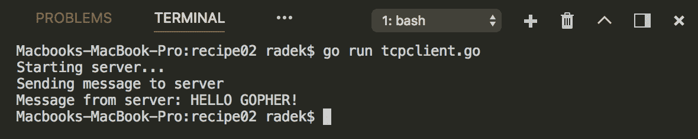

# 它是如何工作的...

net 包包含`Dial`函数，它消耗网络类型和地址。在前面的示例中，网络是`tcp`，地址是`localhost:8080`。

一旦`Dial`函数成功，就会返回`Conn`类型，它作为已打开套接字的引用。`Conn`接口还定义了`Read`和`Write`函数，因此它们可以用作写入和从套接字读取的`Writer`和`Reader`函数。最后，示例代码使用`Scanner`来获取响应。请注意，这种情况下`Scanner`可以工作是因为有换行符。否则，应该使用更通用的`Read`方法。在示例中，通过`SetReadDeadline`方法设置了`Read`截止日期。关键之处在于截止日期不是持续时间，而是`Time`。这意味着截止日期被设置为将来的时间点。如果您在循环中从套接字读取数据并需要将读取超时设置为 10 秒，则每次迭代都应包含类似于`conn.SetReadDeadline(time.Now().Add(10*time.Second))`的代码。

只是为了解释整个代码示例，使用了`HTTP`标准包中的 HTTP 服务器作为客户端的对应部分。这部分在另一个示例中有所涵盖。

# 通过 IP 地址解析域名，反之亦然

这个教程将介绍如何将 IP 地址转换为主机地址，反之亦然。

# 如何做到...

1.  打开控制台并创建文件夹`chapter07/recipe03`。

1.  导航到目录。

1.  创建`lookup.go`文件，内容如下：

```go
        package main

        import (
          "fmt"
          "net"
        )

        func main() {

          // Resolve by IP
          addrs, err := net.LookupAddr("127.0.0.1")
          if err != nil {
            panic(err)
          }

          for _, addr := range addrs {
            fmt.Println(addr)
          }

          //Resolve by address
          ips, err := net.LookupIP("localhost")
          if err != nil {
            panic(err)
          }

          for _, ip := range ips {
            fmt.Println(ip.String())
          }
        }
```

1.  在主终端中运行`go run lookup.go`来执行代码。

1.  你将看到以下输出：

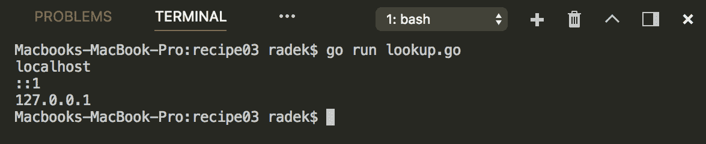

# 它是如何工作的...

从 IP 地址解析域名可以使用`net`包中的`LookupAddr`函数来完成。要从域名找出 IP 地址，应用`LookupIP`函数。

# 连接到 HTTP 服务器

前面的教程*连接到远程服务器*让我们深入了解了如何在较低级别连接 TCP 服务器。在这个教程中，将展示如何在较高级别与 HTTP 服务器通信。

# 如何做到...

1.  打开控制台并创建文件夹`chapter07/recipe04`。

1.  导航到目录。

1.  创建`http.go`文件，内容如下：

```go
        package main

        import (
          "fmt"
          "io/ioutil"
          "net/http"
          "net/url"
          "strings"
        )

        type StringServer string

        func (s StringServer) ServeHTTP(rw http.ResponseWriter,
                                        req *http.Request) {
          req.ParseForm()
          fmt.Printf("Received form data: %v\n", req.Form)
          rw.Write([]byte(string(s)))
        } 

        func createServer(addr string) http.Server {
          return http.Server{
            Addr: addr,
            Handler: StringServer("Hello world"),
          }
        }

        const addr = "localhost:7070"

        func main() {
          s := createServer(addr)
          go s.ListenAndServe()

          useRequest()
          simplePost()

        }

        func simplePost() {
          res, err := http.Post("http://localhost:7070",
                          "application/x-www-form-urlencoded",
                          strings.NewReader("name=Radek&surname=Sohlich"))
          if err != nil {
            panic(err)
          }

          data, err := ioutil.ReadAll(res.Body)
          if err != nil {
            panic(err)
          }
          res.Body.Close()
          fmt.Println("Response from server:" + string(data))
        }

        func useRequest() {

          hc := http.Client{}
          form := url.Values{}
          form.Add("name", "Radek")
          form.Add("surname", "Sohlich")

          req, err := http.NewRequest("POST",
                        "http://localhost:7070",
                        strings.NewReader(form.Encode()))
                        req.Header.Add("Content-Type",
                        "application/x-www-form-urlencoded")

          res, err := hc.Do(req)

          if err != nil {
            panic(err)
          }

          data, err := ioutil.ReadAll(res.Body)
          if err != nil {
            panic(err)
          }
          res.Body.Close()
          fmt.Println("Response from server:" + string(data))
        }
```

1.  在主终端中运行`go run http.go`来执行代码。

1.  你将看到以下输出：

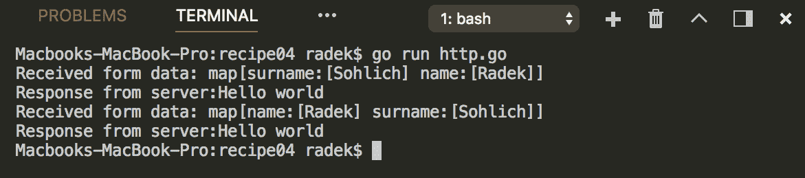

# 它是如何工作的...

连接到 HTTP 服务器可以借助`net/http`包来完成。当然，你还有其他方法可以实现这一点，但上面的代码说明了两种最常见的方法。第一种选项实现了`simplePost`函数，并且演示了使用默认客户端。这里选择了 POST 方法，因为它比 GET 更复杂。`Post`方法接受 URL、内容类型和`Reader`形式的主体。调用`Post`函数立即请求服务器并返回结果。

请注意，`Post`方法只是在其实现中使用了`http.DefaultClient`的一个包装函数。`net/http`包还包含`Get`函数。

`useRequest`函数实现了相同的功能，但使用了更可定制的 API 和自己的`Client`实例。该实现利用`NewRequest`函数根据给定的参数创建请求：方法、URL 和请求主体。内容类型必须单独设置到`Header`属性中。请求是通过`Client`上创建的`Do`方法执行的。

# 另请参阅

*创建一个 HTTP 请求*的教程将帮助您详细组装请求。

# 解析和构建 URL

在许多情况下，最好使用方便的工具来操作 URL，而不是试图将其作为简单的字符串处理。Go 标准库自然包含了操作 URL 的工具。这个教程将介绍其中一些主要功能。

# 如何做到...

1.  打开控制台并创建文件夹`chapter07/recipe05`。

1.  导航到目录。

1.  创建`url.go`文件，内容如下：

```go
        package main

        import (
          "encoding/json"
          "fmt"
          "net/url"
        )

        func main() {

          u := &url.URL{}
          u.Scheme = "http"
          u.Host = "localhost"
          u.Path = "index.html"
          u.RawQuery = "id=1&name=John"
          u.User = url.UserPassword("admin", "1234")

          fmt.Printf("Assembled URL:\n%v\n\n\n", u)

          parsedURL, err := url.Parse(u.String())
          if err != nil {
            panic(err)
          }
          jsonURL, err := json.Marshal(parsedURL)
          if err != nil {
            panic(err)
          }
          fmt.Println("Parsed URL:")
          fmt.Println(string(jsonURL))

        }
```

1.  在主终端中运行`go run url.go`来执行代码。

1.  你将看到以下输出：

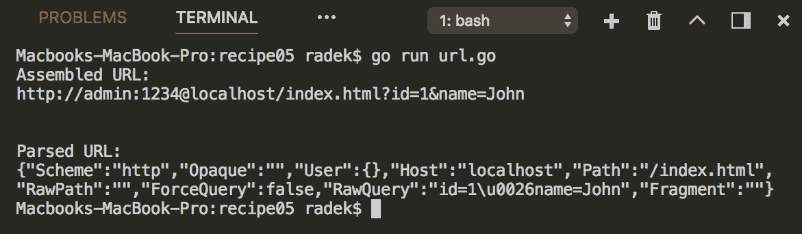

# 它是如何工作的...

`net/url`包旨在帮助您操作和解析 URL。`URL`结构包含了组合 URL 所需的字段。通过`URL`结构的`String`方法，可以轻松地将其转换为简单的字符串。

当字符串表示可用且需要额外操作时，可以利用`net/url`的`Parse`函数。这样，字符串可以转换为`URL`结构，并且可以修改底层 URL。

# 创建一个 HTTP 请求

这个教程将向您展示如何使用特定参数构造 HTTP 请求。

# 如何做到...

1.  打开控制台并创建文件夹`chapter07/recipe06`。

1.  导航到目录。

1.  创建`request.go`文件，内容如下：

```go
        package main

        import (
          "fmt"
          "io/ioutil"
          "net/http"
          "net/url"
          "strings"
        )

        type StringServer string

        func (s StringServer) ServeHTTP(rw http.ResponseWriter,
                                        req *http.Request) {
          req.ParseForm()
          fmt.Printf("Received form data: %v\n", req.Form)
          fmt.Printf("Received header: %v\n", req.Header)
          rw.Write([]byte(string(s)))
        }

        func createServer(addr string) http.Server {
          return http.Server{
            Addr: addr,
            Handler: StringServer("Hello world"),
          }
        } 

        const addr = "localhost:7070"

        func main() {
          s := createServer(addr)
          go s.ListenAndServe()

          form := url.Values{}
          form.Set("id", "5")
          form.Set("name", "Wolfgang")

          req, err := http.NewRequest(http.MethodPost,
                              "http://localhost:7070",
                              strings.NewReader(form.Encode()))

          if err != nil {
            panic(err)
          }
          req.Header.Set("Content-Type",
                         "application/x-www-form-urlencoded")

          res, err := http.DefaultClient.Do(req)
          if err != nil {
            panic(err)
          }
          data, err := ioutil.ReadAll(res.Body)
          if err != nil {
            panic(err)
          }
          res.Body.Close()
          fmt.Println("Response from server:" + string(data))

        }
```

1.  在主终端中运行`go run request.go`来执行代码。

1.  你将看到以下输出：

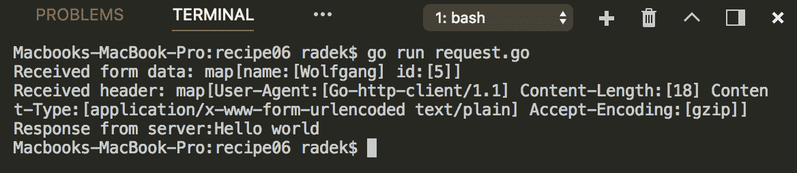

# 它是如何工作的...

构造请求的更复杂的方式在示例代码中呈现。使用`net/http`包的`NewRequest`方法返回`Request`结构的指针。该函数消耗方法的请求、URL 和请求的主体。注意表单的构建方式。使用`url.Values`结构而不是使用普通字符串。最后，调用`Encode`方法对给定的表单值进行编码。通过请求的`http.Header`属性设置头。

# 读取和写入 HTTP 头

前面的示例描述了如何一般创建 HTTP 请求。本示例将详细介绍如何读取和写入请求头。

# 如何做...

1.  打开控制台并创建文件夹`chapter07/recipe07`。

1.  导航到目录。

1.  创建包含以下内容的`headers.go`文件：

```go
        package main

        import (
          "fmt"
          "net/http"
        )

        func main() {

          header := http.Header{}

          // Using the header as slice
          header.Set("Auth-X", "abcdef1234")
          header.Add("Auth-X", "defghijkl")
          fmt.Println(header)

          // retrieving slice of values in header
          resSlice := header["Auth-X"]
          fmt.Println(resSlice)

          // get the first value
          resFirst := header.Get("Auth-X")
          fmt.Println(resFirst)

          // replace all existing values with
          // this one
          header.Set("Auth-X", "newvalue")
          fmt.Println(header)

          // Remove header
          header.Del("Auth-X")
          fmt.Println(header)

        }
```

1.  在主终端中运行`go run headers.go`来执行代码。

1.  您将看到以下输出：

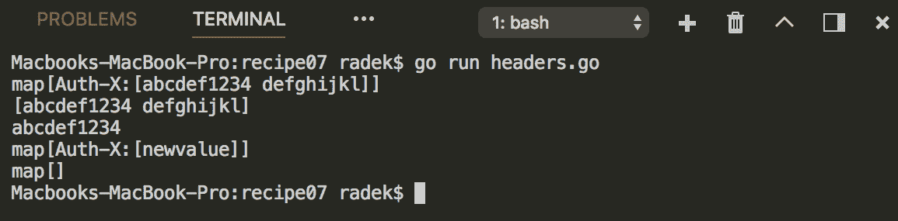

# 它是如何工作的...

`http`包中的头实际上表示为`map[string][]string`，因此必须处理`Header`类型。前面的代码显示了如何设置和读取头值。关于头的重要事情是头键的值是`string`切片。因此，头中的每个键可以包含多个值。

`Header`类型的`Set`方法设置给定键下的单项切片。另一方面，`Add`方法将值附加到切片。

使用`Get`方法将从给定键下的切片中检索第一个值。如果需要整个切片，则需要将`Header`处理为映射。可以使用`Del`方法删除整个头键。

服务器和客户端都使用`http`包的`Request`和`Header`类型，因此在服务器端和客户端端的处理方式相同。

# 处理 HTTP 重定向

在某些情况下，您需要更多控制重定向的处理方式。本示例将向您展示 Go 客户端实现的机制，以便您更多地控制处理 HTTP 重定向。

# 如何做...

1.  打开控制台并创建文件夹`chapter07/recipe08`。

1.  导航到目录。

1.  创建包含以下内容的`redirects.go`文件：

```go
        package main

        import (
          "fmt"
          "net/http"
        )

        const addr = "localhost:7070"

        type RedirecServer struct {
          redirectCount int
        }

        func (s *RedirecServer) ServeHTTP(rw http.ResponseWriter,
                                          req *http.Request) {
          s.redirectCount++
          fmt.Println("Received header: " + 
                      req.Header.Get("Known-redirects"))
          http.Redirect(rw, req, fmt.Sprintf("/redirect%d",
                        s.redirectCount), http.StatusTemporaryRedirect)
        }

        func main() {
          s := http.Server{
            Addr: addr,
            Handler: &RedirecServer{0},
          }
          go s.ListenAndServe()

          client := http.Client{}
          redirectCount := 0

          // If the count of redirects is reached
          // than return error.
          client.CheckRedirect = func(req *http.Request, 
                                 via []*http.Request) error {
            fmt.Println("Redirected")
            if redirectCount > 2 {
              return fmt.Errorf("Too many redirects")
            }
            req.Header.Set("Known-redirects", fmt.Sprintf("%d",
                           redirectCount))
            redirectCount++
            for _, prReq := range via {
              fmt.Printf("Previous request: %v\n", prReq.URL)
            }
            return nil
          }

          _, err := client.Get("http://" + addr)
          if err != nil {
            panic(err)
          }
        }
```

1.  在主终端中运行`go run redirects.go`来执行代码。

1.  您将看到以下输出：

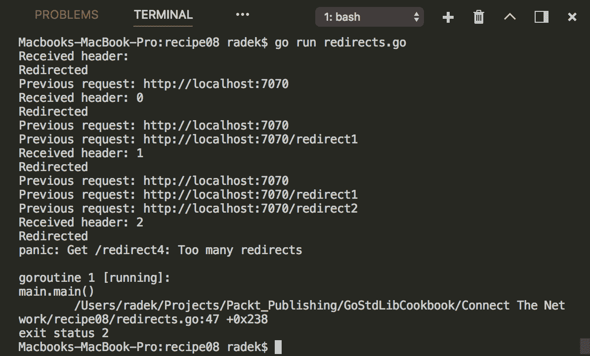

# 它是如何工作...

`http`包的`Client`包含`CheckRedirect`字段。该字段是一个具有`req`和`via`参数的函数。`req`是即将到来的请求，`via`指的是以前的请求。这样，您可以在重定向后修改请求。在前面的示例中，修改了`Known-redirects`头。

如果`CheckRedirect`函数返回错误，则返回带有包装错误的关闭主体的最后响应。如果返回`http.ErrUseLastResponse`，则返回最后的响应，但主体未关闭，因此可以读取它。

默认情况下，`CheckRedirect`属性为 nil。在这种情况下，它最多有 10 次重定向。超过此计数后，重定向将停止。

# 消费 RESTful API

RESTful API 是应用程序和服务器提供其服务访问的最常见方式。本示例将向您展示如何使用标准库中的 HTTP 客户端来消费它。

# 如何做...

1.  打开控制台并创建文件夹`chapter07/recipe09`。

1.  导航到目录。

1.  创建包含以下内容的`rest.go`文件：

```go
        package main

        import (
          "encoding/json"
          "fmt"
          "io"
          "io/ioutil"
          "net/http"
          "strconv"
          "strings"
        )

        const addr = "localhost:7070"

        type City struct {
          ID string
          Name string `json:"name"`
          Location string `json:"location"`
        }

        func (c City) toJson() string {
          return fmt.Sprintf(`{"name":"%s","location":"%s"}`,
                             c.Name, c.Location)
        }

        func main() {
          s := createServer(addr)
          go s.ListenAndServe()

          cities, err := getCities()
          if err != nil {
            panic(err)
          }
          fmt.Printf("Retrived cities: %v\n", cities)

          city, err := saveCity(City{"", "Paris", "France"})
          if err != nil {
            panic(err)
          }
          fmt.Printf("Saved city: %v\n", city)

        }

        func saveCity(city City) (City, error) {
          r, err := http.Post("http://"+addr+"/cities",
                              "application/json",
                               strings.NewReader(city.toJson()))
          if err != nil {
            return City{}, err
          }
          defer r.Body.Close()
          return decodeCity(r.Body)
        }

        func getCities() ([]City, error) {
          r, err := http.Get("http://" + addr + "/cities")
          if err != nil {
            return nil, err
          }
          defer r.Body.Close()
          return decodeCities(r.Body)
        }

        func decodeCity(r io.Reader) (City, error) {
          city := City{}
          dec := json.NewDecoder(r)
          err := dec.Decode(&city)
          return city, err
        }

       func decodeCities(r io.Reader) ([]City, error) {
         cities := []City{}
         dec := json.NewDecoder(r)
         err := dec.Decode(&cities)
         return cities, err
       }

       func createServer(addr string) http.Server {
         cities := []City{City{"1", "Prague", "Czechia"},
                          City{"2", "Bratislava", "Slovakia"}}
         mux := http.NewServeMux()
         mux.HandleFunc("/cities", func(w http.ResponseWriter,
                                        r *http.Request) {
           enc := json.NewEncoder(w)
           if r.Method == http.MethodGet {
             enc.Encode(cities)
           } else if r.Method == http.MethodPost {
             data, err := ioutil.ReadAll(r.Body)
             if err != nil {
               http.Error(w, err.Error(), 500)
             }
             r.Body.Close()
             city := City{}
             json.Unmarshal(data, &city)
             city.ID = strconv.Itoa(len(cities) + 1)
             cities = append(cities, city)
             enc.Encode(city)
           }

         })
         return http.Server{
           Addr: addr,
           Handler: mux,
         }
       }
```

1.  在主终端中运行`go run rest.go`来执行代码。

1.  您将看到以下输出：

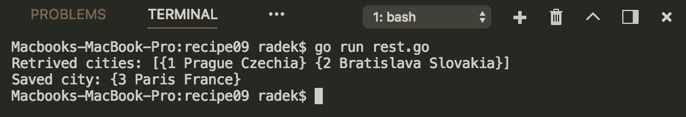

# 它是如何工作的...

前面的示例代码显示了 REST API 的样子以及如何使用它。请注意，`decodeCity`和`decodeCities`函数受益于请求的`Body`实现了`Reader`接口。结构的反序列化通过`json.Decoder`完成。

# 发送简单的电子邮件

本教程将简要介绍如何使用标准库连接到 SMTP 服务器并发送电子邮件。

# 准备工作

在本教程中，我们将使用谷歌 Gmail 账户发送电子邮件。通过一些配置，本教程也适用于其他 SMTP 服务器。

# 如何做...

1.  打开控制台并创建文件夹`chapter07/recipe10`。

1.  导航到目录。

1.  创建`smtp.go`文件，内容如下：

```go
        package main

        import (
          "crypto/tls"
          "fmt"
          "net/smtp"
        )

        func main() {

          var email string
          fmt.Println("Enter username for smtp: ")
          fmt.Scanln(&email)

          var pass string
          fmt.Println("Enter password for smtp: ")
          fmt.Scanln(&pass)

          auth := smtp.PlainAuth("", email, pass, "smtp.gmail.com")

          c, err := smtp.Dial("smtp.gmail.com:587")
          if err != nil {
            panic(err)
          }
          defer c.Close()
          config := &tls.Config{ServerName: "smtp.gmail.com"}

          if err = c.StartTLS(config); err != nil {
            panic(err)
          }

          if err = c.Auth(auth); err != nil {
            panic(err)
          }

          if err = c.Mail(email); err != nil {
            panic(err)
          }
          if err = c.Rcpt(email); err != nil {
            panic(err)
          }

          w, err := c.Data()
          if err != nil {
            panic(err)
          }

          msg := []byte("Hello this is content")
          if _, err := w.Write(msg); err != nil {
            panic(err)
          }

          err = w.Close()
          if err != nil {
            panic(err)
          }
          err = c.Quit()

          if err != nil {
            panic(err)
          }

        }
```

1.  在主终端中运行`go run smtp.go`来执行代码。

1.  输入账户的电子邮件（谷歌账户）并按*Enter*。

1.  输入账户的密码并按*Enter*。

1.  在检查电子邮箱之前，您将看到以下输出：

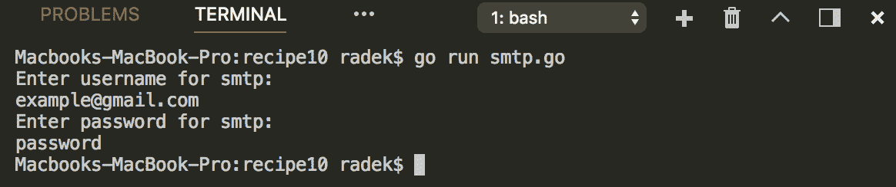

# 工作原理...

`smtp`包提供了与 SMTP 服务器交互的基本功能。`Dial`函数提供客户端。客户端最重要的方法是`Mail`，用于设置发件人邮件，`Rcpt`，用于设置收件人邮件，以及`Data`，提供`Writer`，用于写入邮件内容。最后，`Quit`方法发送 QUIT 并关闭与服务器的连接。

前面的示例使用了安全连接到 SMTP 服务器，因此客户端的`Auth`方法用于设置身份验证，并调用`StartTLS`方法以启动与服务器的安全连接。

请注意，`Auth`结构是通过`smtp`包的`PlainAuth`函数单独创建的。

# 调用 JSON-RPC 服务

本教程将说明如何使用标准库调用 JSON-RPC 协议的过程。

# 如何做...

1.  打开控制台并创建文件夹`chapter07/recipe11`。

1.  导航到目录。

1.  创建`jsonrpc.go`文件，内容如下：

```go
        package main

        import (
          "log"
          "net"
          "net/rpc"
          "net/rpc/jsonrpc"
        )

        type Args struct {
          A, B int
        }

        type Result int

        type RpcServer struct{}

        func (t RpcServer) Add(args *Args, result *Result) error {
          log.Printf("Adding %d to %d\n", args.A, args.B)
          *result = Result(args.A + args.B)
          return nil
        } 

        const addr = ":7070"

        func main() {
          go createServer(addr)
          client, err := jsonrpc.Dial("tcp", addr)
          if err != nil {
            panic(err)
          }
          defer client.Close()
          args := &Args{
            A: 2,
            B: 3,
          }
          var result Result
          err = client.Call("RpcServer.Add", args, &result)
          if err != nil {
            log.Fatalf("error in RpcServer", err)
          }
          log.Printf("%d+%d=%d\n", args.A, args.B, result)
        }

        func createServer(addr string) {
          server := rpc.NewServer()
          err := server.Register(RpcServer{})
          if err != nil {
            panic(err)
          }
          l, e := net.Listen("tcp", addr)
          if e != nil {
            log.Fatalf("Couldn't start listening on %s errors: %s",
                       addr, e)
          }
          for {
            conn, err := l.Accept()
            if err != nil {
              log.Fatal(err)
            }
            go server.ServeCodec(jsonrpc.NewServerCodec(conn))
          }
        }
```

1.  在主终端中运行`go run jsonrpc.go`来执行代码。

1.  您将看到以下输出：

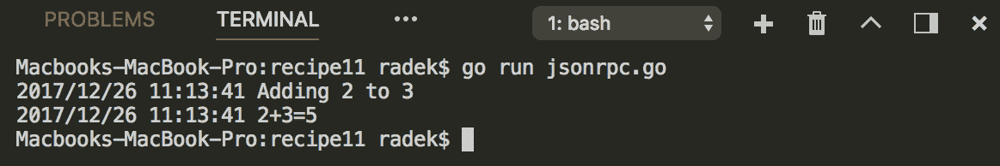

# 工作原理...

Go 的标准库作为其内置包的一部分实现了 JSON-RPC 1.0。`jsonrpc`包实现了`Dial`函数，用于生成调用远程过程的客户端。客户端本身包含`Call`方法，接受过程调用、参数和结果存储的指针。

`createServer`将创建一个示例服务器来测试客户端调用。

HTTP 协议可以用作 JSON-RPC 的传输层。`net/rpc`包包含`DialHTTP`函数，能够创建客户端并调用远程过程。
