# 第九章：来到服务器端

本章包含以下配方：

+   创建 TCP 服务器

+   创建 UDP 服务器

+   处理多个客户端

+   创建 HTTP 服务器

+   处理 HTTP 请求

+   创建 HTTP 中间件层

+   提供静态文件

+   提供使用模板生成的内容

+   处理重定向

+   处理 cookies

+   优雅地关闭 HTTP 服务器

+   提供安全的 HTTP 内容

+   解析表单变量

# 介绍

本章涵盖了从实现简单的 TCP 和 UDP 服务器到启动 HTTP 服务器的主题。这些配方将引导您从处理 HTTP 请求、提供静态内容，到提供安全的 HTTP 内容。

检查 Go 是否已正确安装。*第一章*的*准备就绪*部分中的*检索 Golang 版本*配方将有所帮助。

确保端口`8080`和`7070`没有被其他应用程序使用。

# 创建 TCP 服务器

在*连接网络*章节中，介绍了 TCP 连接的客户端部分。在本配方中，将描述服务器端。

# 如何做...

1.  打开控制台并创建文件夹`chapter09/recipe01`。

1.  导航到该目录。

1.  创建`servertcp.go`文件，内容如下：

```go
        package main

        import (
          "bufio"
          "fmt"
          "io"
          "net"
        )

        func main() {

          l, err := net.Listen("tcp", ":8080")
          if err != nil {
            panic(err)
          }
          for {
            fmt.Println("Waiting for client...")
            conn, err := l.Accept()
            if err != nil {
              panic(err)
            }

            msg, err := bufio.NewReader(conn).ReadString('\n')
            if err != nil {
              panic(err)
            }
            _, err = io.WriteString(conn, "Received: "+string(msg))
            if err != nil {
              fmt.Println(err)
            }
            conn.Close()
          }
        }
```

1.  通过`go run servertcp.go`执行代码：

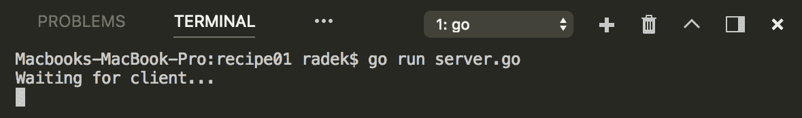

1.  打开另一个终端并执行`nc localhost 8080`。

1.  写入任何文本，例如`Hello`。

1.  查看输出：

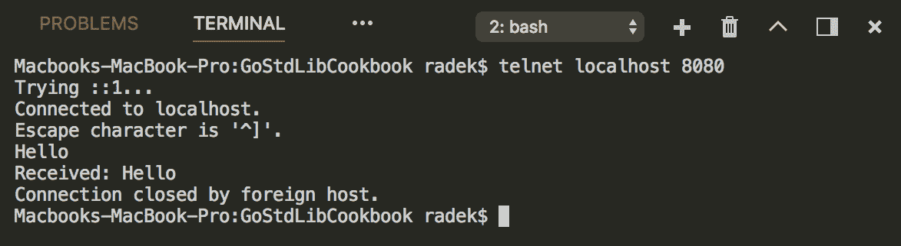

# 工作原理...

可以使用`net`包创建 TCP 服务器。net 包包含`Listen`函数，用于创建`TCPListener`，可以`Accept`客户端连接。`Accept`方法调用`TCPListener`上的方法，直到接收到客户端连接。如果客户端连接成功，`Accept`方法会返回`TCPConn`连接。`TCPConn`是连接到客户端的连接，用于读取和写入数据。

`TCPConn`实现了`Reader`和`Writer`接口。可以使用所有写入和读取数据的方法。请注意，读取数据时有一个分隔符字符，否则，如果客户端强制关闭连接，则会收到 EOF。

请注意，此实现一次只能处理一个客户端。

# 创建 UDP 服务器

**用户数据报协议**（UDP）是互联网的基本协议之一。本篇将向您展示如何监听 UDP 数据包并读取内容。

# 如何做...

1.  打开控制台并创建文件夹`chapter09/recipe02`。

1.  导航到该目录。

1.  创建`serverudp.go`文件，内容如下：

```go
        package main

        import (
          "fmt"
          "log"
          "net"
        )

        func main() {

          pc, err := net.ListenPacket("udp", ":7070")
          if err != nil {
            log.Fatal(err)
          }
          defer pc.Close()

          buffer := make([]byte, 2048)
          fmt.Println("Waiting for client...")
          for {
            _, addr, err := pc.ReadFrom(buffer)
            if err == nil {
              rcvMsq := string(buffer)
              fmt.Println("Received: " + rcvMsq)
              if _, err := pc.WriteTo([]byte("Received: "+rcvMsq), addr);
              err != nil {
                fmt.Println("error on write: " + err.Error())
              }
            } else {
              fmt.Println("error: " + err.Error())
            }
          }
        }
```

1.  通过`go run serverudp.go`启动服务器：

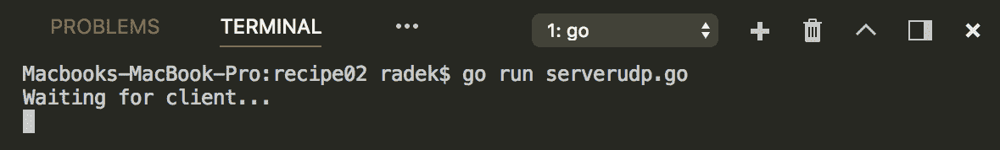

1.  打开另一个终端并执行`nc -u localhost 7070`。

1.  在终端中写入任何消息，例如`Hello`，然后按*Enter*。

1.  查看输出：

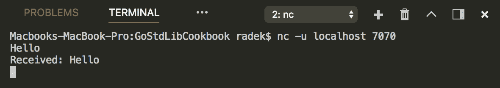

# 工作原理...

与 TCP 服务器一样，可以使用`net`包创建 UDP 服务器。使用`ListenPacket`函数创建`PacketConn`。

`PacketConn`不像`TCPConn`那样实现`Reader`和`Writer`接口。要读取接收到的数据包，应该使用`ReadFrom`方法。`ReadFrom`方法会阻塞，直到接收到数据包。然后返回客户端的`Addr`（记住 UDP 不是基于连接的）。要响应客户端，可以使用`PacketConn`的`WriteTo`方法；这会消耗消息和`Addr`，在这种情况下是客户端的`Addr`。

# 处理多个客户端

前面的配方展示了如何创建 UDP 和 TCP 服务器。示例代码尚未准备好同时处理多个客户端。在本配方中，我们将介绍如何同时处理更多客户端。

# 如何做...

1.  打开控制台并创建文件夹`chapter09/recipe03`。

1.  导航到该目录。

1.  创建`multipletcp.go`文件，内容如下：

```go
        package main

        import (
          "fmt"
          "log"
          "net"
        )

        func main() {

          pc, err := net.ListenPacket("udp", ":7070")
          if err != nil {
            log.Fatal(err)
          }
          defer pc.Close()

          buffer := make([]byte, 2048)
          fmt.Println("Waiting for client...")
          for {

            _, addr, err := pc.ReadFrom(buffer)
            if err == nil {
              rcvMsq := string(buffer)
              fmt.Println("Received: " + rcvMsq)
              if _, err := pc.WriteTo([]byte("Received: "+rcvMsq), addr);
              err != nil {
                fmt.Println("error on write: " + err.Error())
              }
            } else {
              fmt.Println("error: " + err.Error())
            }
          }

        }
```

1.  通过`go run multipletcp.go`执行代码。

1.  打开另外两个终端并执行`nc localhost 8080`。

1.  在两个打开的终端中写入一些内容并查看输出。以下两个图像是连接的客户端。

+   +   终端 1 连接到`localhost:8080`：

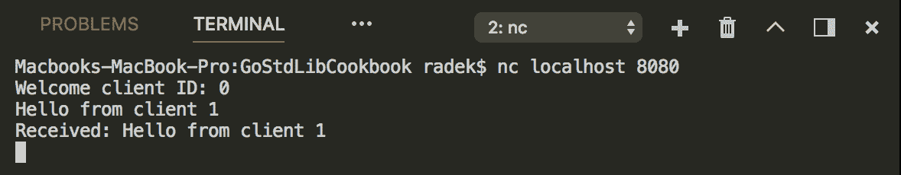

+   +   终端 2 连接到`localhost:8080`：

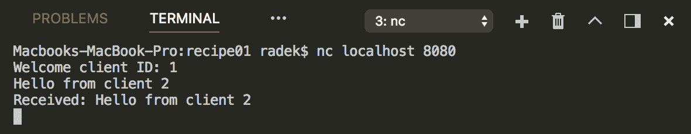

服务器运行的终端中的输出：

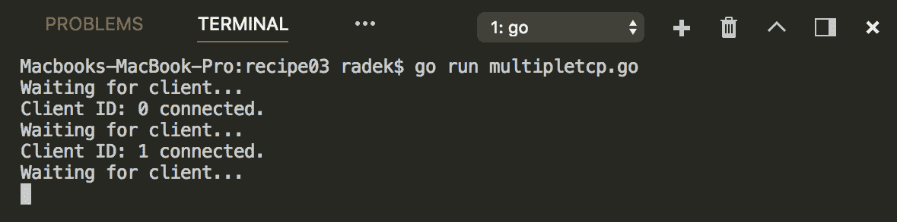

# 工作原理...

TCP 服务器的实现与本章的前一个配方*创建 TCP 服务器*相同。实现已增强，具有同时处理多个客户端的能力。请注意，我们现在在单独的`goroutine`中处理接受的连接。这意味着服务器可以继续使用`Accept`方法接受客户端连接。

因为 UDP 协议不是有状态的，也不保持任何连接，所以处理多个客户端的工作被移动到应用程序逻辑中，您需要识别客户端和数据包序列。只有向客户端写入响应才能使用 goroutines 并行化。

# 创建 HTTP 服务器

在 Go 中创建 HTTP 服务器非常容易，标准库提供了更多的方法来实现。让我们看看最基本的方法。

# 如何做...

1.  打开控制台并创建文件夹`chapter09/recipe04`。

1.  导航到目录。

1.  创建`httpserver.go`文件，内容如下：

```go
        package main

        import (
          "fmt"
          "net/http"
        )

        type SimpleHTTP struct{}

        func (s SimpleHTTP) ServeHTTP(rw http.ResponseWriter,
                            r *http.Request) {
          fmt.Fprintln(rw, "Hello world")
        }

        func main() {
          fmt.Println("Starting HTTP server on port 8080")
          // Eventually you can use
          // http.ListenAndServe(":8080", SimpleHTTP{})
          s := &http.Server{Addr: ":8080", Handler: SimpleHTTP{}}
          s.ListenAndServe()
        }
```

1.  通过`go run httpserver.go`执行代码。

1.  查看输出：

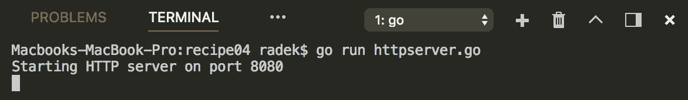

1.  在浏览器中访问 URL `http://localhost:8080`，或使用`curl`。应该显示`Hello world`内容：

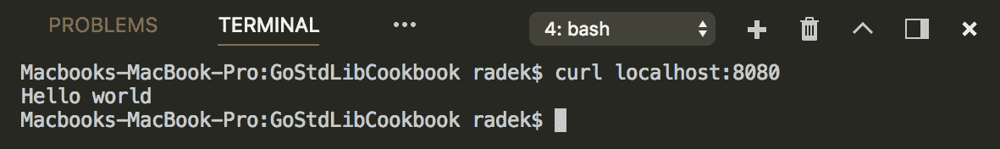

# 工作原理...

`net/http`包包含了几种创建 HTTP 服务器的方法。最简单的方法是实现`net/http`包中的`Handler`接口。`Handler`接口要求类型实现`ServeHTTP`方法。这个方法处理请求和响应。

服务器本身以`net/http`包中的`Server`结构的形式创建。`Server`结构需要`Handler`和`Addr`字段。通过调用`ListenAndServe`方法，服务器开始在给定地址上提供内容。

如果使用`Server`的`Serve`方法，则必须提供`Listener`。

`net/http`包还提供了默认服务器，如果从`net/http`包中调用`ListenAndServe`作为函数，则可以使用。它消耗`Handler`和`Addr`，与`Server`结构相同。在内部，创建了`Server`。

# 处理 HTTP 请求

应用程序通常使用 URL 路径和 HTTP 方法来定义应用程序的行为。本配方将说明如何利用标准库来处理不同的 URL 和方法。

# 如何做...

1.  打开控制台并创建文件夹`chapter09/recipe05`。

1.  导航到目录。

1.  创建`handle.go`文件，内容如下：

```go
        package main

        import (
          "fmt"
          "net/http"
        )

        func main() {

          mux := http.NewServeMux()
          mux.HandleFunc("/user", func(w http.ResponseWriter, 
                         r *http.Request) {
            if r.Method == http.MethodGet {
              fmt.Fprintln(w, "User GET")
            }
            if r.Method == http.MethodPost {
              fmt.Fprintln(w, "User POST")
            }
          })

          // separate handler
          itemMux := http.NewServeMux()
          itemMux.HandleFunc("/items/clothes", func(w http.ResponseWriter,
                             r *http.Request) {
            fmt.Fprintln(w, "Clothes")
          })
          mux.Handle("/items/", itemMux)

          // Admin handlers
          adminMux := http.NewServeMux()
          adminMux.HandleFunc("/ports", func(w http.ResponseWriter,
                              r *http.Request) {
            fmt.Fprintln(w, "Ports")
          })

          mux.Handle("/admin/", http.StripPrefix("/admin",
                                adminMux))

          // Default server
          http.ListenAndServe(":8080", mux)

        }
```

1.  通过`go run handle.go`执行代码。

1.  在浏览器中或通过`curl`检查以下 URL：

+   `http://localhost:8080/user`

+   `http://localhost:8080/items/clothes`

+   `http://localhost:8080/admin/ports`

1.  查看输出：

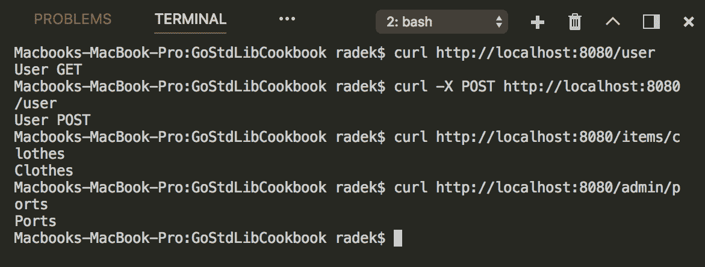

# 工作原理...

`net/http`包包含`ServeMux`结构，该结构实现了`Handler`接口，可用于`Server`结构，但还包含了如何定义不同路径处理的机制。`ServeMux`指针包含`HandleFunc`和`Handle`方法，接受路径，`HandlerFunc`函数处理给定路径的请求，或者另一个处理程序执行相同的操作。

参见前面的示例，了解如何使用这些。`Handler`接口和`HandlerFunc`需要实现带有请求和响应参数的函数。这样你就可以访问这两个结构。请求本身可以访问`Headers`、HTTP 方法和其他请求参数。

# 创建 HTTP 中间件层

具有 Web UI 或 REST API 的现代应用程序通常使用中间件机制来记录活动或保护给定接口的安全性。在本示例中，将介绍实现这种中间件层。

# 如何做...

1.  打开控制台并创建文件夹`chapter09/recipe06`。

1.  导航到目录。

1.  创建具有以下内容的`middleware.go`文件：

```go
        package main

        import (
          "io"
          "net/http"
        )

        func main() {

          // Secured API
          mux := http.NewServeMux()
          mux.HandleFunc("/api/users", Secure(func(w http.ResponseWriter,
                         r *http.Request) {
            io.WriteString(w,  `[{"id":"1","login":"ffghi"},
                           {"id":"2","login":"ffghj"}]`)
          }))

          http.ListenAndServe(":8080", mux)

        }

        func Secure(h http.HandlerFunc) http.HandlerFunc {
          return func(w http.ResponseWriter, r *http.Request) {
            sec := r.Header.Get("X-Auth")
            if sec != "authenticated" {
              w.WriteHeader(http.StatusUnauthorized)
              return
            }
            h(w, r) // use the handler
          }

        }
```

1.  通过`go run middleware.go`执行代码。

1.  使用`curl`检查 URL`http://localhost:8080/api/users`，通过执行这两个命令（第一个不带`X-Auth`头，第二个带`X-Auth`头）：

+   `curl -X GET -I http://localhost:8080/api/users`

+   `curl -X GET -H "X-Auth: authenticated" -I http://localhost:8080/api/users`

1.  查看输出：

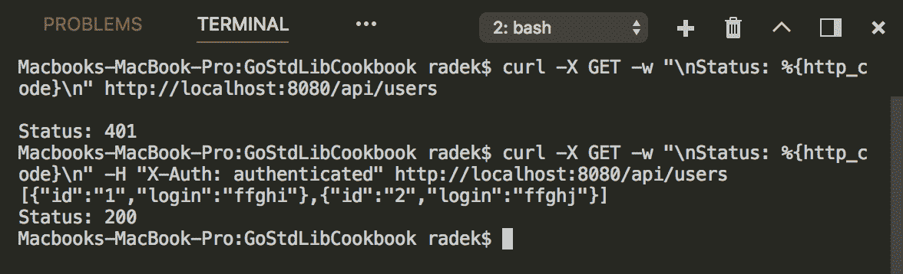

1.  使用`X-User`头测试 URL`http://localhost:8080/api/profile`。

1.  查看输出：

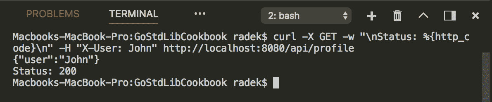

# 工作原理...

在前面的示例中，中间件的实现利用了 Golang 的*函数作为一等公民*功能。原始的`HandlerFunc`被包装成检查`X-Auth`头的`HandlerFunc`。然后使用`Secure`函数来保护`HandlerFunc`，并在`ServeMux`的`HandleFunc`方法中使用。

请注意，这只是一个简单的示例，但是您可以实现更复杂的解决方案。例如，用户身份可以从`Header`令牌中提取，随后可以定义新类型的处理程序，如`type AuthHandler func(u *User,w http.ResponseWriter, r *http.Request)`。然后，`WithUser`函数为`ServeMux`创建`HandlerFunc`。

# 提供静态文件

几乎任何 Web 应用程序都需要提供静态文件。使用标准库可以轻松实现 JavaScript 文件、静态 HTML 页面或 CSS 样式表的提供。本示例将展示如何实现。

# 如何做...

1.  打开控制台并创建文件夹`chapter09/recipe07`。

1.  导航到目录。

1.  创建具有以下内容的文件`welcome.txt`：

```go
        Hi, Go is awesome!
```

1.  创建文件夹`html`，导航到该文件夹并创建具有以下内容的文件`page.html`：

```go
        <html>
          <body>
            Hi, I'm HTML body for index.html!
          </body>
        </html>
```

1.  创建具有以下内容的`static.go`文件：

```go
        package main

        import (
          "net/http"
        )

        func main() {

          fileSrv := http.FileServer(http.Dir("html"))
          fileSrv = http.StripPrefix("/html", fileSrv)

          http.HandleFunc("/welcome", serveWelcome)
          http.Handle("/html/", fileSrv)
          http.ListenAndServe(":8080", nil)
        }

        func serveWelcome(w http.ResponseWriter, r *http.Request) {
          http.ServeFile(w, r, "welcome.txt")
        }
```

1.  通过`go run static.go`执行代码。

1.  使用浏览器或`curl`实用程序检查以下 URL：

+   `http://localhost:8080/html/page.html`

+   `http://localhost:8080/welcome`

1.  查看输出：

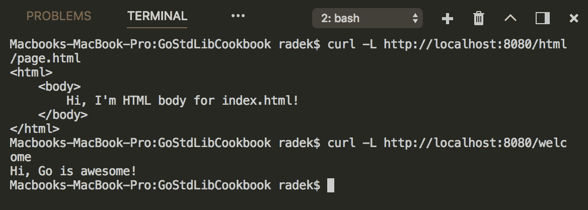

# 工作原理...

`net/http`包提供了`ServeFile`和`FileServer`函数，用于提供静态文件。`ServeFile`函数只消耗给定文件路径参数的`ResponseWriter`和`Request`，并将文件内容写入响应。

`FileServer`函数创建整个消耗`FileSystem`参数的`Handler`。前面的示例使用了`Dir`类型，它实现了`FileSystem`接口。`FileSystem`接口需要实现`Open`方法，该方法消耗字符串并返回给定路径的实际`File`。

# 使用模板生成的内容

对于某些目的，不需要使用所有 JavaScript 创建高度动态的 Web UI，生成内容的静态内容可能已经足够。Go 标准库提供了一种构建动态生成内容的方法。本示例将引导您进入 Go 标准库模板化。

# 如何做...

1.  打开控制台并创建文件夹`chapter09/recipe08`。

1.  导航到目录。

1.  创建具有以下内容的文件`template.tpl`：

```go
        <html>
          <body>
            Hi, I'm HTML body for index.html!
          </body>
        </html>
```

1.  创建文件`dynamic.go`，内容如下：

```go
        package main

        import "net/http"
        import "html/template"

        func main() {
          tpl, err := template.ParseFiles("template.tpl")
          if err != nil {
            panic(err)
          }

          http.HandleFunc("/",func(w http.ResponseWriter, r *http.Request){
            err := tpl.Execute(w, "John Doe")
            if err != nil {
              panic(err)
            }
          })
          http.ListenAndServe(":8080", nil)
        }
```

1.  通过`go run dynamic.go`执行代码。

1.  检查 URL `http://localhost:8080`并查看输出：

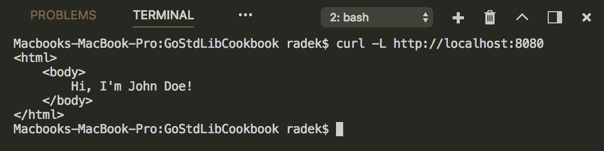

# 工作原理...

Go 标准库还包含用于模板化内容的包。`html/template`和`text/template`包提供了解析模板和使用它们创建输出的函数。解析是使用`ParseXXX`函数或新创建的`Template`结构指针的方法完成的。前面的示例使用了`html/template`包的`ParseFiles`函数。

模板本身是基于文本的文档或包含动态变量的文本片段。模板的使用基于将模板文本与包含模板中的变量值的结构进行合并。为了将模板与这些结构进行合并，有`Execute`和`ExecuteTemplate`方法。请注意，这些方法使用写入器接口，其中写入输出；在这种情况下使用`ResponseWriter`。

模板语法和特性在文档中有很好的解释。

# 处理重定向

重定向是告诉客户端内容已经移动或需要在其他地方完成请求的常用方式。本教程描述了如何使用标准库实现重定向。

# 如何做...

1.  打开控制台并创建文件夹`chapter09/recipe09`。

1.  导航到目录。

1.  创建文件`redirect.go`，内容如下：

```go
        package main

        import (
          "fmt"
          "log"
          "net/http"
        )

        func main() {
          log.Println("Server is starting...")

          http.Handle("/secured/handle",
               http.RedirectHandler("/login", 
                      http.StatusTemporaryRedirect))
          http.HandleFunc("/secured/hadlefunc", 
               func(w http.ResponseWriter, r *http.Request) {
            http.Redirect(w, r, "/login", http.StatusTemporaryRedirect)
          })
          http.HandleFunc("/login", func(w http.ResponseWriter,
                          r *http.Request) {
            fmt.Fprintf(w, "Welcome user! Please login!\n")
          })
          if err := http.ListenAndServe(":8080", nil); err != nil {
            panic(err)
          }
        }
```

1.  通过`go run redirect.go`执行代码。

1.  使用`curl -v -L http://localhost:8080/s`

`ecured/handle`以查看重定向是否有效：

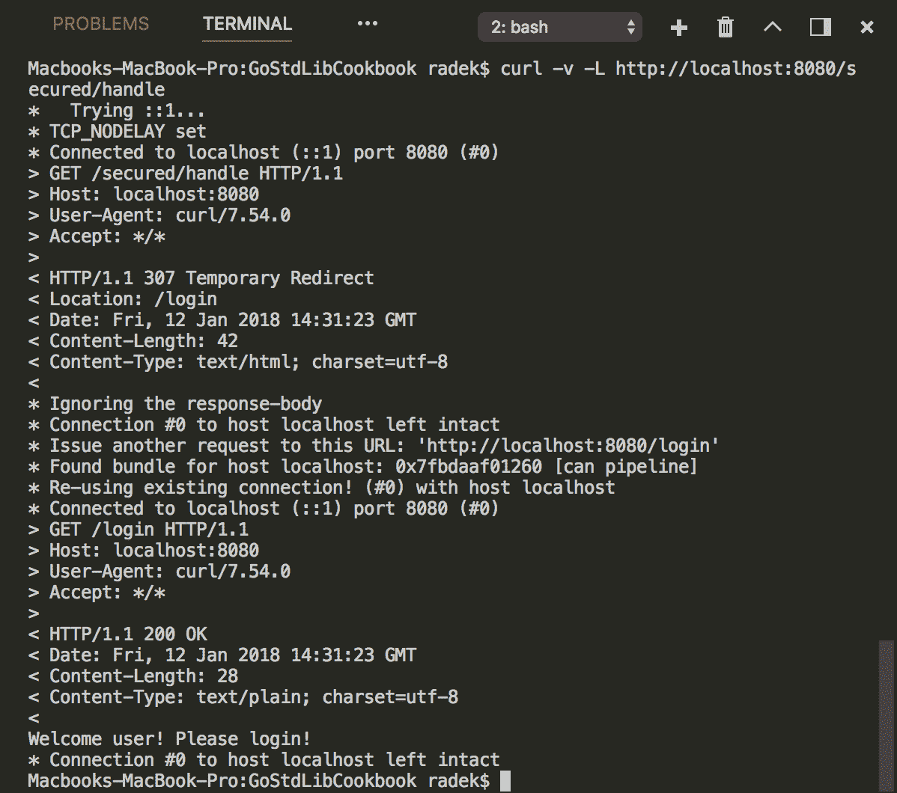

# 工作原理...

`net/http`包中包含了执行重定向的简单方法。可以利用`RedirectHandler`。该函数接受请求将被重定向的`URL`和将发送给客户端的`状态码`。该函数本身将结果发送给`Handler`，可以在`ServeMux`的`Handle`方法中使用（示例直接使用包中的默认方法）。

第二种方法是使用`Redirect`函数，它可以为您执行重定向。该函数接受`ResponseWriter`、请求指针和与`RequestHandler`相同的 URL 和状态码，这些将发送给客户端。

重定向也可以通过手动设置`Location`头并编写适当的状态码来完成。Go 库使开发人员能够轻松使用这一功能。

# 处理 cookies

Cookies 提供了一种在客户端方便地存储数据的方式。本教程演示了如何使用标准库设置、检索和删除 cookies。

# 如何做...

1.  打开控制台并创建文件夹`chapter09/recipe10`。

1.  导航到目录。

1.  创建文件`cookies.go`，内容如下：

```go
        package main

        import (
          "fmt"
          "log"
          "net/http"
          "time"
        )

        const cookieName = "X-Cookie"

        func main() {
          log.Println("Server is starting...")

          http.HandleFunc("/set", func(w http.ResponseWriter,
                          r *http.Request) {
            c := &http.Cookie{
              Name: cookieName,
              Value: "Go is awesome.",
              Expires: time.Now().Add(time.Hour),
              Domain: "localhost",
            }
            http.SetCookie(w, c)
            fmt.Fprintln(w, "Cookie is set!")
          })
          http.HandleFunc("/get", func(w http.ResponseWriter,
                          r *http.Request) {
            val, err := r.Cookie(cookieName)
            if err != nil {
              fmt.Fprintln(w, "Cookie err: "+err.Error())
              return
            }
            fmt.Fprintf(w, "Cookie is: %s \n", val.Value)
            fmt.Fprintf(w, "Other cookies")
            for _, v := range r.Cookies() {
              fmt.Fprintf(w, "%s => %s \n", v.Name, v.Value)
            }
          })
          http.HandleFunc("/remove", func(w http.ResponseWriter,
                          r *http.Request) {
            val, err := r.Cookie(cookieName)
            if err != nil {
              fmt.Fprintln(w, "Cookie err: "+err.Error())
              return
            }
            val.MaxAge = -1
            http.SetCookie(w, val)
            fmt.Fprintln(w, "Cookie is removed!")
          })
          if err := http.ListenAndServe(":8080", nil); err != nil {
            panic(err)
          }
        }
```

1.  通过`go run cookies.go`执行代码。

1.  按照以下顺序访问 URL 并查看：

+   +   在浏览器中访问 URL `http://localhost:8080/set`的响应：


+   +   在浏览器中访问 URL `http://localhost:8080/get`的响应（响应包含可用的 cookies）：

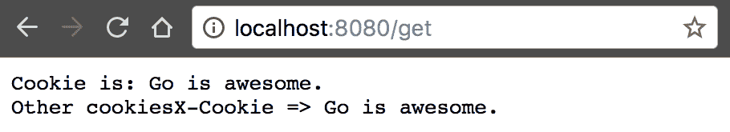

+   +   在浏览器中访问 URL `http://localhost:8080/remove`的响应（这将删除 cookie）：

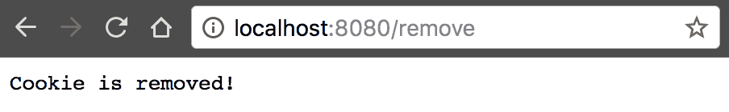

+   +   在浏览器中访问 URL `http://localhost:8080/get`的响应（证明 cookie `X-Cookie`已被移除）：

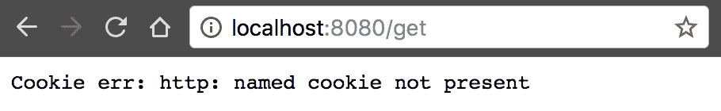

# 工作原理...

`net/http`包还提供了操作 cookie 的函数和机制。示例代码介绍了如何设置/获取和删除 cookie。`SetCookie`函数接受代表 cookie 的`Cookie`结构指针，自然也接受`ResponseWriter`。`Name`、`Value`、`Domain`和过期时间直接在`Cookie`结构中设置。在幕后，`SetCookie`函数写入头文件以设置 cookie。

可以从`Request`结构中检索 cookie 值。具有名称参数的`Cookie`方法返回指向`Cookie`的指针，如果请求中存在 cookie。

要列出请求中的所有 cookie，可以调用`Cookies`方法。此方法返回`Cookie`结构指针的切片。

为了让客户端知道应该删除 cookie，可以检索具有给定名称的`Cookie`，并将`MaxAge`字段设置为负值。请注意，这不是 Go 的特性，而是客户端应该工作的方式。

# 优雅关闭 HTTP 服务器

在第一章中，*与环境交互*，介绍了实现优雅关闭的机制。在这个示例中，我们将描述如何关闭 HTTP 服务器并给予它处理现有客户端的时间。

# 操作步骤...

1.  打开控制台并创建文件夹`chapter09/recipe11`。

1.  导航到目录。

1.  创建名为`gracefully.go`的文件，内容如下：

```go
        package main

        import (
          "context"
          "fmt"
          "log"
          "net/http"
          "os"
          "os/signal"
          "time"
        )

        func main() {

          mux := http.NewServeMux()
          mux.HandleFunc("/",func(w http.ResponseWriter, r *http.Request){
            fmt.Fprintln(w, "Hello world!")
          })

          srv := &http.Server{Addr: ":8080", Handler: mux}
          go func() {
            if err := srv.ListenAndServe(); err != nil {
              log.Printf("Server error: %s\n", err)
            }
          }()

          log.Println("Server listening on : " + srv.Addr)

          stopChan := make(chan os.Signal)
          signal.Notify(stopChan, os.Interrupt)

          <-stopChan // wait for SIGINT
          log.Println("Shutting down server...")

          ctx, cancel := context.WithTimeout(
            context.Background(),
            5*time.Second)
          srv.Shutdown(ctx)
          <-ctx.Done()
          cancel()
          log.Println("Server gracefully stopped")
        }
```

1.  通过`go run gracefully.go`执行代码。

1.  等待服务器开始监听：

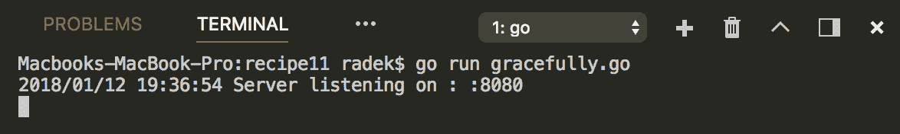

1.  使用浏览器连接到`http://localhost:8080`；这将导致浏览器等待 10 秒钟的响应。

1.  在 10 秒的间隔内，按下*Ctrl* + *C*发送`SIGINT`信号。

1.  尝试从另一个标签页重新连接（服务器应该拒绝其他连接）。

1.  在终端中查看输出：

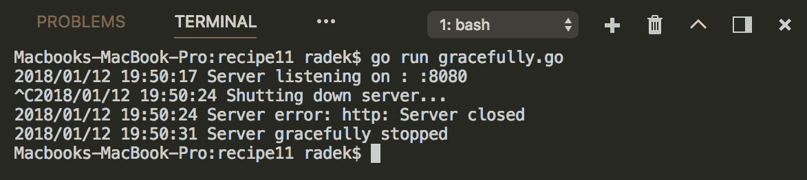

# 工作原理...

`net/http`包中的`Server`提供了优雅关闭连接的方法。前面的代码在一个单独的`goroutine`中启动 HTTP 服务器，并在一个变量中保留对`Server`结构的引用。

通过调用`Shutdown`方法，`Server`开始拒绝新连接并关闭打开的监听器和空闲连接。然后它无限期地等待已经挂起的连接，直到这些连接变为空闲。在所有连接关闭后，服务器关闭。请注意，`Shutdown`方法会消耗`Context`。如果提供的`Context`在关闭之前过期，则会返回来自`Context`的错误，并且`Shutdown`不再阻塞。

# 提供安全的 HTTP 内容

这个示例描述了创建 HTTP 服务器的最简单方式，它通过 TLS/SSL 层提供内容。

# 准备工作

准备私钥和自签名的 X-509 证书。为此，可以使用 OpenSSL 实用程序。通过执行命令`openssl genrsa -out server.key 2048`，使用 RSA 算法生成私钥到文件`server.key`。基于此私钥，可以通过调用`openssl req -new -x509 -sha256 -key server.key -out server.crt -days 365`生成 X-509 证书。创建`server.crt`文件。

# 操作步骤...

1.  打开控制台并创建文件夹`chapter09/recipe12`。

1.  导航到目录。

1.  将创建的`server.key`和`server.crt`文件放入其中。

1.  创建名为`servetls.go`的文件，内容如下：

```go
        package main

        import (
          "fmt"
          "net/http"
        )

        type SimpleHTTP struct{}

          func (s SimpleHTTP) ServeHTTP(rw http.ResponseWriter,
                              r *http.Request) {
            fmt.Fprintln(rw, "Hello world")
          }

          func main() {
            fmt.Println("Starting HTTP server on port 8080")
            // Eventually you can use
            // http.ListenAndServe(":8080", SimpleHTTP{})
            s := &http.Server{Addr: ":8080", Handler: SimpleHTTP{}}
            if err := s.ListenAndServeTLS("server.crt", "server.key");
            err != nil {
              panic(err)
            }
          }
```

1.  通过`go run servetls.go`执行服务器。

1.  访问 URL `https://localhost:8080`（使用 HTTPS 协议）。如果使用`curl`实用程序，则必须使用`--insecure`标志，因为我们的证书是自签名的，不受信任：

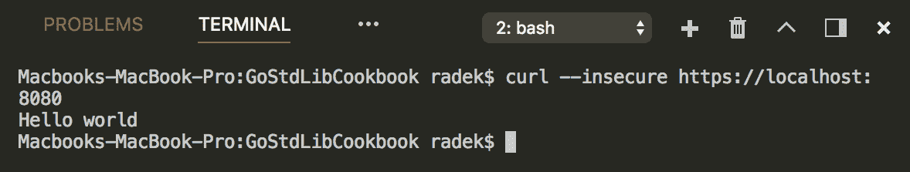

# 工作原理...

除了`net/http`包中的`ListenAndServe`函数之外，还存在用于通过 SSL/TLS 提供 HTTP 服务的 TLS 变体。通过`Server`的`ListenAndServeTLS`方法，可以提供安全的 HTTP 服务。`ListenAndServeTLS`需要私钥和 X-509 证书的路径。当然，也可以直接使用`net/http`包中的`ListenAndServeTLS`函数。

# 解析表单变量

HTTP 的`POST`表单是向服务器传递信息的一种常见方式，以结构化的方式。这个示例展示了如何在服务器端解析和访问这些信息。

# 如何做...

1.  打开控制台，创建文件夹`chapter09/recipe12`。

1.  导航到目录。

1.  创建名为`form.go`的文件，内容如下：

```go
        package main

        import (
          "fmt"
          "net/http"
        )

        type StringServer string

        func (s StringServer) ServeHTTP(rw http.ResponseWriter,
                              req *http.Request) {
          fmt.Printf("Prior ParseForm: %v\n", req.Form)
          req.ParseForm()
          fmt.Printf("Post ParseForm: %v\n", req.Form)
          fmt.Println("Param1 is : " + req.Form.Get("param1"))
          rw.Write([]byte(string(s)))
        }

        func createServer(addr string) http.Server {
          return http.Server{
            Addr: addr,
            Handler: StringServer("Hello world"),
          }
        }

        func main() {
          s := createServer(":8080")
          fmt.Println("Server is starting...")
          if err := s.ListenAndServe(); err != nil {
            panic(err)
          }
        }
```

1.  通过`go run form.go`执行代码。

1.  打开第二个终端，使用`curl`执行`POST`：

```go
 curl -X POST -H "Content-Type: app
lication/x-www-form-urlencoded" -d "param1=data1&param2=data2" "localhost:8080?
param1=overriden&param3=data3"
```

1.  在运行服务器的第一个终端中查看输出：

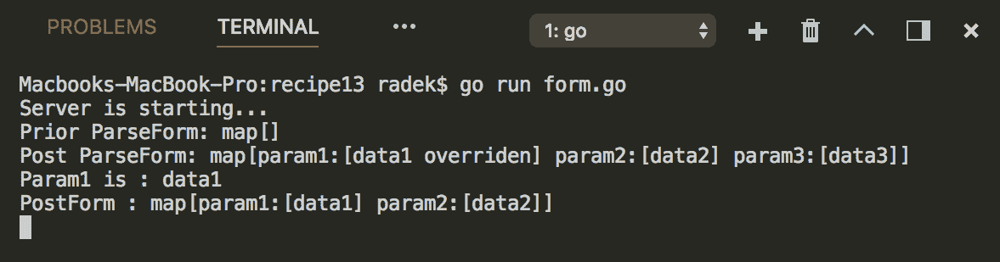

# 工作原理...

`net/http`包的`Request`结构包含`Form`字段，其中包含了`POST`表单变量和 URL 查询变量的合并。在前面的代码中，重要的一步是在`Request`指针上调用`ParseForm`方法。这个方法调用会将`POST`表单值和查询值解析为一个`Form`变量。请注意，如果在`Form`字段上使用`Get`方法，则会优先考虑参数的`POST`值。`Form`和`PostForm`字段实际上都是`url.Values`类型。

如果只需要访问`POST`表单中的参数，可以使用`Request`的`PostForm`字段。这个字段只保留了`POST`主体中的参数。
