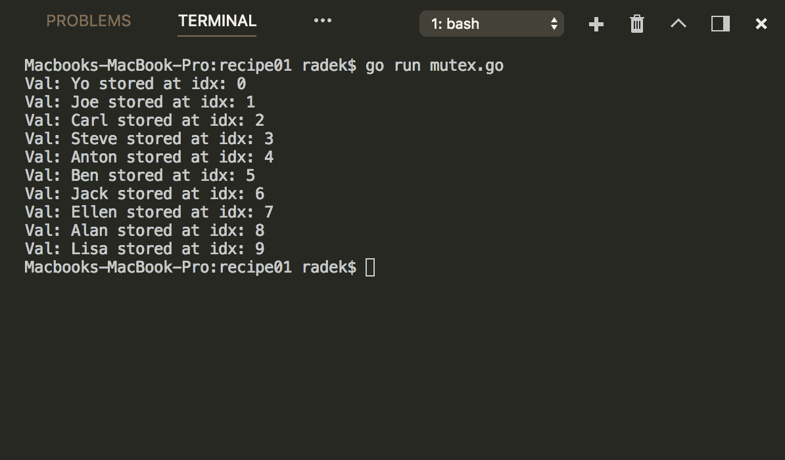
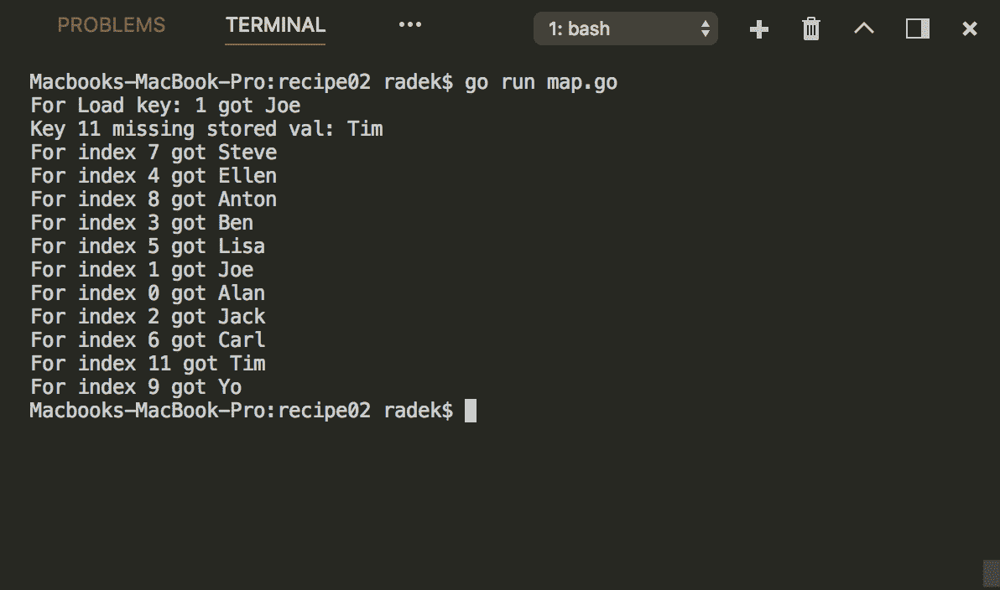
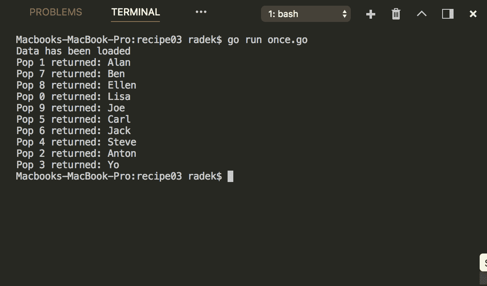
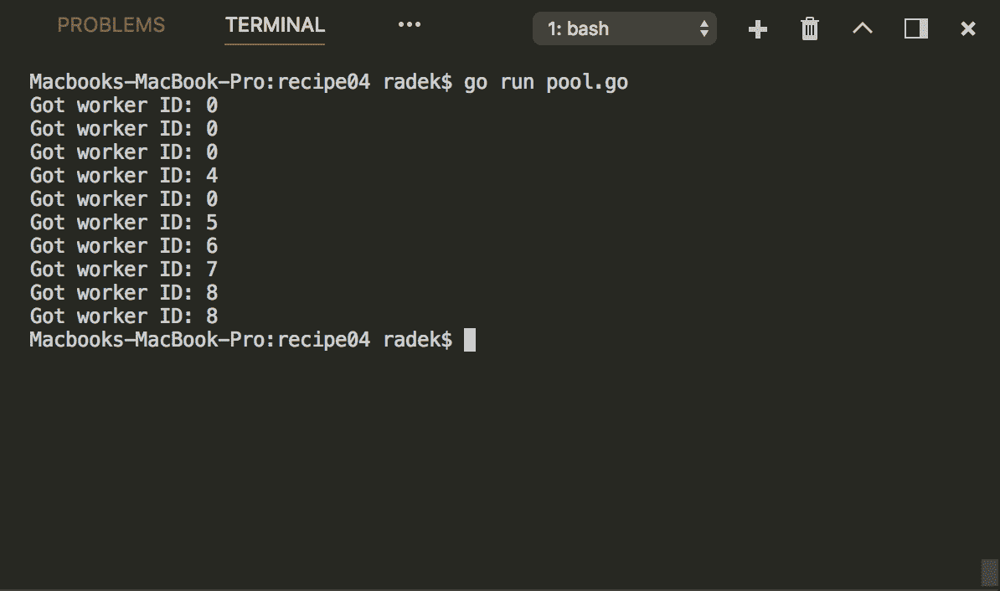
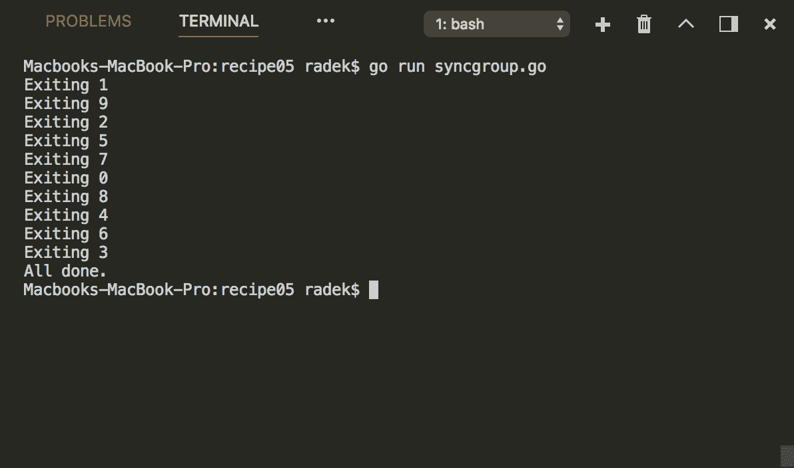
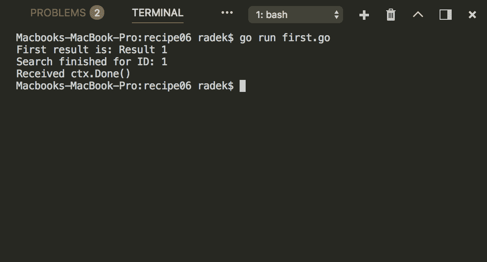
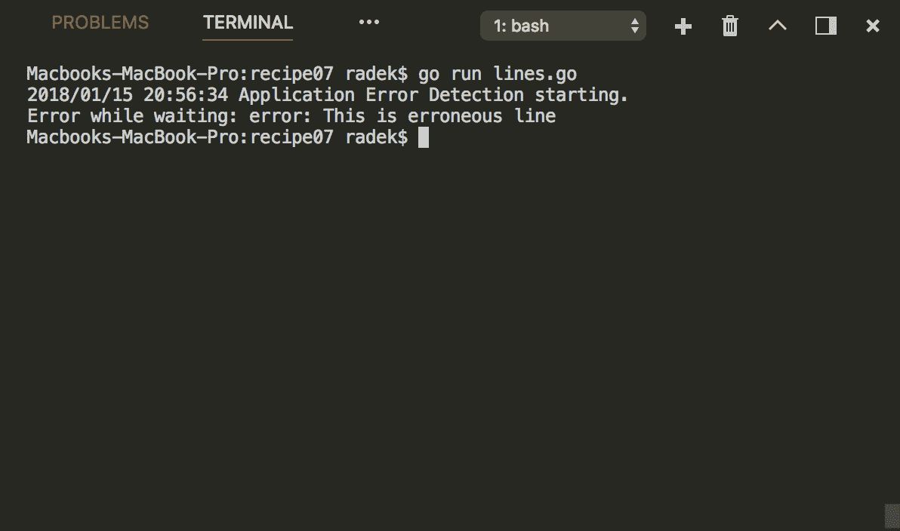

# 第十章：并发乐趣

本章包含以下教程：

+   使用 Mutex 同步对资源的访问

+   为并发访问创建 map

+   只运行一次代码块

+   在多个 goroutines 之间池化资源

+   使用 WaitGroup 同步 goroutines

+   从多个来源获取最快的结果

+   使用 errgroup 传播错误

# 介绍

并发行为的编程总是很困难的。Go 具有非常好的机制来管理并发，如通道。除了通道作为同步机制外，Go 标准库还提供了处理更传统核心方式的并发部分的包。本章描述了如何利用 sync 包来实现常见的同步任务。最后一个教程将展示如何简化一组 goroutines 的错误传播。

检查 Go 是否已正确安装。*第一章*的*检索 Golang 版本*教程中的*准备就绪*部分将对你有所帮助。

确保端口`8080`和`7070`没有被其他应用程序使用。

# 使用 Mutex 同步对资源的访问

如果代码使用并发访问被认为对并发使用不安全的任何资源，就需要实现同步机制来保护访问。除了使用通道，还可以利用互斥锁来实现这一目的。这个教程将向你展示如何做到这一点。

# 如何做...

1.  打开控制台并创建文件夹`chapter10/recipe01`。

1.  导航到目录。

1.  创建文件`mutex.go`，内容如下：

```go
        package main

        import (
          "fmt"
          "sync"
        )

        var names = []string{"Alan", "Joe", "Jack", "Ben",
                             "Ellen", "Lisa", "Carl", "Steve",
                             "Anton", "Yo"}

        type SyncList struct {
          m sync.Mutex
          slice []interface{}
        }

        func NewSyncList(cap int) *SyncList {
          return &SyncList{
            sync.Mutex{},
            make([]interface{}, cap),
          }
        }

        func (l *SyncList) Load(i int) interface{} {
          l.m.Lock()
          defer l.m.Unlock()
          return l.slice[i]
        }

        func (l *SyncList) Append(val interface{}) {
          l.m.Lock()
          defer l.m.Unlock()
          l.slice = append(l.slice, val)
        }

        func (l *SyncList) Store(i int, val interface{}) {
          l.m.Lock()
          defer l.m.Unlock()
          l.slice[i] = val
        }

        func main() {

          l := NewSyncList(0)
          wg := &sync.WaitGroup{}
          wg.Add(10)
          for i := 0; i < 10; i++ {
            go func(idx int) {
              l.Append(names[idx])
              wg.Done()
            }(i)
          }
          wg.Wait()

          for i := 0; i < 10; i++ {
            fmt.Printf("Val: %v stored at idx: %d\n", l.Load(i), i)
          }

        }
```

1.  通过`go run mutex.go`执行代码。

1.  查看输出：



# 它是如何工作的...

同步原语`Mutex`由`sync`包提供。`Mutex`作为一个锁，用于保护部分或资源。一旦`goroutine`在`Mutex`上调用`Lock`并且`Mutex`处于未锁定状态，`Mutex`就会被锁定，`goroutine`就可以独占地访问临界区。如果`Mutex`处于锁定状态，`goroutine`调用`Lock`方法。这个`goroutine`会被阻塞，需要等待`Mutex`再次解锁。

请注意，在示例中，我们使用`Mutex`来同步对切片原语的访问，这被认为是不安全的并发使用。

重要的事实是`Mutex`在第一次使用后不能被复制。

# 为并发访问创建 map

在 Golang 中，map 原语应被视为不安全的并发访问。在上一个教程中，我们描述了如何使用 Mutex 同步对资源的访问，这也可以用于对 map 原语的访问。但是 Go 标准库还提供了专为并发访问设计的 map 结构。这个教程将说明如何使用它。

# 如何做...

1.  打开控制台并创建文件夹`chapter10/recipe02`。

1.  导航到目录。

1.  创建文件`map.go`，内容如下：

```go
        package main

        import (
          "fmt"
          "sync"
        )

        var names = []string{"Alan", "Joe", "Jack", "Ben",
                             "Ellen", "Lisa", "Carl", "Steve",
                             "Anton", "Yo"}

        func main() {

          m := sync.Map{}
          wg := &sync.WaitGroup{}
          wg.Add(10)
          for i := 0; i < 10; i++ {
            go func(idx int) {
              m.Store(fmt.Sprintf("%d", idx), names[idx])
              wg.Done()
            }(i)
          }
          wg.Wait()

          v, ok := m.Load("1")
          if ok {
            fmt.Printf("For Load key: 1 got %v\n", v)
          }

          v, ok = m.LoadOrStore("11", "Tim")
          if !ok {
            fmt.Printf("Key 11 missing stored val: %v\n", v)
          }

          m.Range(func(k, v interface{}) bool {
            key, _ := k.(string)
            t, _ := v.(string)
            fmt.Printf("For index %v got %v\n", key, t)
            return true
          })

        }
```

1.  通过`go run map.go`执行代码。

1.  查看输出：



# 它是如何工作的...

`sync`包中包含了`Map`结构，该结构被设计用于从多个 Go 例程中并发使用。`Map`结构及其方法模仿了 map 原语的行为。`Store`方法相当于`m[key] = val`语句。`Load`方法相当于`val, ok := m[key]`，`Range`方法提供了遍历 map 的能力。请注意，`Range`函数与`Map`的当前状态一起工作，因此如果在运行`Range`方法期间更改了值，则会反映这些更改，但前提是该键尚未被访问。`Range`函数只会访问其键一次。

# 只运行一次代码块

在多个 goroutine 运行相同代码的情况下，例如，有一个初始化共享资源的代码块，Go 标准库提供了解决方案，将在下文中描述。

# 如何做...

1.  打开控制台并创建文件夹`chapter10/recipe03`。

1.  导航到目录。

1.  创建文件`once.go`，内容如下：

```go
        package main

        import (
          "fmt"
          "sync"
        )

        var names = []interface{}{"Alan", "Joe", "Jack", "Ben",
                                  "Ellen", "Lisa", "Carl", "Steve",
                                  "Anton", "Yo"}

        type Source struct {
          m *sync.Mutex
          o *sync.Once
          data []interface{}
        }

        func (s *Source) Pop() (interface{}, error) {
          s.m.Lock()
          defer s.m.Unlock()
          s.o.Do(func() {
            s.data = names
            fmt.Println("Data has been loaded.")
          })
          if len(s.data) > 0 {
            res := s.data[0]
            s.data = s.data[1:]
            return res, nil
          }
          return nil, fmt.Errorf("No data available")
        }

        func main() {

          s := &Source{&sync.Mutex{}, &sync.Once{}, nil}
          wg := &sync.WaitGroup{}
          wg.Add(10)
          for i := 0; i < 10; i++ {
            go func(idx int) {
              // This code block is done only once
              if val, err := s.Pop(); err == nil {
                fmt.Printf("Pop %d returned: %s\n", idx, val)
              }
              wg.Done()
            }(i)
          }
          wg.Wait()
        }
```

1.  使用`go run once.go`执行代码。

1.  查看输出：



# 工作原理...

示例代码说明了在访问容器结构时数据的延迟加载。由于数据只应加载一次，因此在`Pop`方法中使用了`sync`包中的`Once`结构。`Once`只实现了一个名为`Do`的方法，该方法消耗了一个无参数的`func`，并且该函数在每个`Once`实例的执行期间只执行一次。

`Do`方法调用会阻塞，直到第一次运行完成。这一事实与`Once`旨在用于初始化的事实相对应。

# 在多个 goroutine 之间池化资源

资源池是提高性能和节省资源的传统方式。通常，值得使用昂贵初始化的资源进行池化。Go 标准库提供了用于资源池的骨架结构，被认为对多个 goroutine 访问是安全的。本示例描述了如何使用它。

# 如何做...

1.  打开控制台并创建文件夹`chapter10/recipe04`。

1.  导航到目录。

1.  创建文件`pool.go`，内容如下：

```go
        package main

        import "sync"
        import "fmt"
        import "time"

        type Worker struct {
          id string
        }

        func (w *Worker) String() string {
          return w.id
        }

        var globalCounter = 0

        var pool = sync.Pool{
          New: func() interface{} {
            res := &Worker{fmt.Sprintf("%d", globalCounter)}
            globalCounter++
            return res
          },
        }

        func main() {
          wg := &sync.WaitGroup{}
          wg.Add(10)
          for i := 0; i < 10; i++ {
            go func(idx int) {
              // This code block is done only once
              w := pool.Get().(*Worker)
              fmt.Println("Got worker ID: " + w.String())
              time.Sleep(time.Second)
              pool.Put(w)
              wg.Done()
            }(i)
          }
          wg.Wait()
        }
```

1.  使用`go run pool.go`执行代码。

1.  查看输出：



# 工作原理...

`sync`包包含了用于池化资源的结构。`Pool`结构具有`Get`和`Put`方法，用于检索资源并将其放回池中。`Pool`结构被认为对并发访问是安全的。

在创建`Pool`结构时，需要设置`New`字段。`New`字段是一个无参数函数，应该返回指向池化项目的指针。如果需要初始化池中的新对象，则会调用此函数。

从前面示例的日志中可以看出，`Worker`在返回到池中时被重用。重要的事实是，不应该对`Get`检索的项目和`Put`方法返回的项目做任何假设（比如我刚刚把三个对象放到池中，所以至少会有三个可用）。这主要是因为`Pool`中的空闲项目可能随时被自动删除。

如果资源初始化很昂贵，资源池化通常是值得的。然而，资源的管理也带来了一些额外的成本。

# 使用 WaitGroup 同步 goroutine

在处理并发运行的代码分支时，程序在某个时刻需要等待并发运行的代码部分。本示例介绍了如何使用`WaitGroup`等待运行的 goroutine。

# 如何做...

1.  打开控制台并创建文件夹`chapter10/recipe05`。

1.  导航到目录。

1.  创建文件`syncgroup.go`，内容如下：

```go
        package main

        import "sync"
        import "fmt"

        func main() {
          wg := &sync.WaitGroup{}
          for i := 0; i < 10; i++ {
            wg.Add(1)
            go func(idx int) {
              // Do some work
              defer wg.Done()
              fmt.Printf("Exiting %d\n", idx)
            }(i)
          }
          wg.Wait()
          fmt.Println("All done.")
        }
```

1.  使用`go run syncgroup.go`执行代码。

1.  查看输出：



# 工作原理...

通过`sync`包中的`WaitGroup`结构，程序可以等待有限数量的 goroutine 完成运行。`WaitGroup`结构实现了`Add`方法，用于添加要等待的 goroutine 数量。然后在 goroutine 完成后，应调用`Done`方法来减少要等待的 goroutine 数量。`Wait`方法被调用时会阻塞，直到完成给定数量的`Done`调用（通常在`goroutine`结束时）。`WaitGroup`应该与`sync`包中的所有同步原语一样使用。在创建对象后，结构不应被复制。

# 从多个来源获取最快的结果

在某些情况下，例如，在整合来自多个来源的信息检索时，您只需要第一个结果，最快的结果，其他结果在那之后就不相关了。现实世界中的一个例子可能是提取货币汇率以计算价格。您有多个第三方服务，因为您需要尽快显示价格，所以只需要从任何服务接收到的第一个汇率。本教程将展示如何实现这种行为的模式。

# 如何做...

1.  打开控制台并创建文件夹 `chapter10/recipe06`。

1.  导航到目录。

1.  创建文件 `first.go`，内容如下：

```go
        package main

        import (
          "context"
          "fmt"
          "sync"
          "time"
        )

        type SearchSrc struct {
          ID string
          Delay int
        }

        func (s *SearchSrc) Search(ctx context.Context) <-chan string {
          out := make(chan string)
          go func() {
            time.Sleep(time.Duration(s.Delay) * time.Second)
            select {
              case out <- "Result " + s.ID:
              case <-ctx.Done():
              fmt.Println("Search received Done()")
            }
            close(out)
            fmt.Println("Search finished for ID: " + s.ID)
          }()
          return out
        }

        func main() {

          ctx, cancel := context.WithCancel(context.Background())

          src1 := &SearchSrc{"1", 2}
          src2 := &SearchSrc{"2", 6}

          r1 := src1.Search(ctx)
          r2 := src2.Search(ctx)

          out := merge(ctx, r1, r2)

          for firstResult := range out {
            cancel()
            fmt.Println("First result is: " + firstResult)
          }
        }

        func merge(ctx context.Context, results ...<-chan string)
                   <-chan string {
          wg := sync.WaitGroup{}
          out := make(chan string)

          output := func(c <-chan string) {
            defer wg.Done()
            select {
              case <-ctx.Done():
                fmt.Println("Received ctx.Done()")
              case res := <-c:
              out <- res
            }
          }

          wg.Add(len(results))
          for _, c := range results {
            go output(c)
          }

          go func() {
            wg.Wait()
            close(out)
          }()
          return out
        }
```

1.  通过 `go run first.go` 执行代码。

1.  查看输出：



# 它是如何工作的...

上述代码提出了执行多个任务并输出一些结果的解决方案，我们只需要最快的一个。解决方案使用 `Context` 和取消函数来在获得第一个结果后调用取消。`SearchSrc` 结构提供了 `Search` 方法，该方法会导致写入结果的通道。请注意，`Search` 方法使用 `time.Sleep` 函数模拟延迟。对于来自 `Search` 方法的每个通道，合并函数触发写入最终输出通道的 `goroutine`，该通道在 `main` 方法中读取。从 `merge` 函数产生的输出通道接收到第一个结果时，将调用存储在变量 `cancel` 中的 `CancelFunc` 来取消其余处理。

请注意，`Search` 方法仍然需要结束，即使其结果不会被处理；因此，需要处理以避免 `goroutine` 和通道泄漏。

# 使用 errgroup 传播错误

本教程将展示如何轻松使用 errgroup 扩展包来检测 goroutine 组中运行子任务的错误。

# 如何做...

1.  打开控制台并创建文件夹 `chapter10/recipe07`。

1.  导航到目录。

1.  创建文件 `lines.go`，内容如下：

```go
        package main

        import (
          "bufio"
          "context"
          "fmt"
          "log"
          "strings"

          "golang.org/x/sync/errgroup"
        )

        const data = `line one
        line two with more words
        error: This is erroneous line`

        func main() {
          log.Printf("Application %s starting.", "Error Detection")
          scanner := bufio.NewScanner(strings.NewReader(data))
          scanner.Split(bufio.ScanLines)

          // For each line fire a goroutine
          g, _ := errgroup.WithContext(context.Background())
          for scanner.Scan() {
            row := scanner.Text()
            g.Go(func() error {
              return func(s string) error {
                if strings.Contains(s, "error:") {
                  return fmt.Errorf(s)
                }
                return nil
              }(row)
            })
          }

          // Wait until the goroutines finish
          if err := g.Wait(); err != nil {
            fmt.Println("Error while waiting: " + err.Error())
          }

        }
```

1.  通过 `go run lines.go` 执行代码。

1.  查看输出：



# 它是如何工作的...

`golang.org/x/sync/errgroup` 包有助于简化 goroutine 组的错误传播和上下文取消。`Group` 包含消耗无参数函数返回 `error` 的 Go 方法。此函数应包含应由执行的 `goroutine` 完成的任务。`errgroup` 的 `Group` 的 `Wait` 方法等待直到 Go 方法中执行的所有任务完成，如果其中任何一个返回 `err`，则返回第一个非空错误。这样，就可以简单地从运行的 goroutine 组中传播错误。

请注意，`Group` 也是使用上下文创建的。`Context` 用作取消其他任务的机制，如果发生错误。在 `goroutine` 函数返回 `error` 后，内部实现会取消上下文，因此正在运行的任务也可能会被取消。
