# 第十一章：提示和技巧

本章将涵盖以下示例：

+   日志定制

+   测试代码

+   对代码进行基准测试

+   创建子测试

+   测试 HTTP 处理程序

+   通过反射访问标签

+   对切片进行排序

+   将 HTTP 处理程序分成组

+   利用 HTTP/2 服务器推送

# 介绍

这最后一章添加了一些与测试、设计应用程序接口以及利用`sort`和`reflect`包相关的附加示例。

检查 Go 是否已正确安装。*第一章*中*准备就绪*部分的*检索 Golang 版本*示例，*与环境交互*将帮助您。

确保端口`8080`未被其他应用程序使用。

# 日志定制

除了使用`log`包中的默认记录器进行记录外，标准库还提供了一种根据应用程序或包的需求创建自定义记录器的方法。本示例将简要介绍如何创建自定义记录器。

# 如何做...

1.  打开控制台并创建文件夹`chapter11/recipe01`。

1.  导航到目录。

1.  创建名为`logging.go`的文件，其中包含以下内容：

```go
        package main

        import (
          "log"
          "os"
        )

        func main() {
          custLogger := log.New(os.Stdout, "custom1: ",
                                log.Ldate|log.Ltime)
          custLogger.Println("Hello I'm customized")

          custLoggerEnh := log.New(os.Stdout, "custom2: ",
                                   log.Ldate|log.Lshortfile)
          custLoggerEnh.Println("Hello I'm customized logger 2")

        }
```

1.  通过`go run logging.go`执行代码。

1.  查看输出：

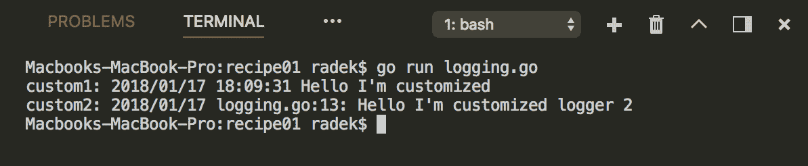

# 它是如何工作的...

`log`包提供了`New`函数，简化了自定义记录器的创建。`New`函数接受`Writer`作为参数，该参数可以是实现`Writer`接口的任何对象，以及以字符串形式的前缀和由标志组成的日志消息的形式。最后一个参数是最有趣的，因为通过它，您可以使用动态字段增强日志消息，例如日期和文件名。

请注意，前面的示例中，第一个记录器`custLogger`配置了在日志消息前显示日期和时间的标志。第二个记录器`custLoggerEnh`使用标志`Ldate`和`Lshortfile`来显示文件名和日期。

# 测试代码

测试和基准测试自然属于软件开发。作为一种现代语言，Go 支持从头开始进行这些操作。在这个示例中，将描述测试的基础知识。

# 如何做...

1.  打开控制台并创建文件夹`chapter11/recipe02`。

1.  导航到目录。

1.  创建名为`sample_test.go`的文件，其中包含以下内容：

```go
        package main

        import (
          "strconv"
          "testing"
        )

        func TestSampleOne(t *testing.T) {
          expected := "11"
          result := strconv.Itoa(10)
          compare(expected, result, t)
        }

        func TestSampleTwo(t *testing.T) {
          expected := "11"
          result := strconv.Itoa(10)
          compareWithHelper(expected, result, t)
        }

        func TestSampleThree(t *testing.T) {
          expected := "10"
          result := strconv.Itoa(10)
          compare(expected, result, t)
        }

        func compareWithHelper(expected, result string, t *testing.T) {
          t.Helper()
          if expected != result {
            t.Fatalf("Expected result %v does not match result %v",
                     expected, result)
          }
        }

        func compare(expected, result string, t *testing.T) {
          if expected != result {
            t.Fatalf("Fail: Expected result %v does not match result %v",
                     expected, result)
          }
          t.Logf("OK: Expected result %v = %v",
                 expected, result)
        }
```

1.  通过`go test -v`执行测试。

1.  在终端中查看输出：

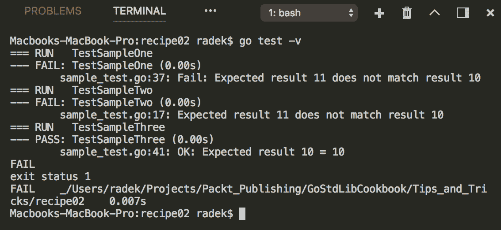

# 它是如何工作的...

标准库的`testing`包提供了对代码测试需求的支持。`test`函数需要满足名称模式`TestXXX`。默认情况下，测试工具会查找名为`xxx_test.go`的文件。请注意，每个测试函数都需要接受`T`指针参数，该参数提供了用于测试控制的有用方法。通过`T`结构指针，可以设置测试的状态。例如，`Fail`和`FailNow`方法会导致测试失败。借助`T`结构指针的帮助，可以通过调用`Skip`、`Skipf`或`SkipNow`来跳过测试。

`T`指针的有趣方法是`Helper`方法。通过调用`Helper`方法，当前函数被标记为辅助函数，如果在该函数内调用`FailNow`（`Fatal`），则测试输出将指向测试中调用该函数的代码行，如前面示例代码中所示。

请注意，如果测试工具未以详细模式运行（使用`-v`标志），或者特定测试失败（仅适用于`T`测试），则`Log`方法（及其变体）将不可见。尝试在不使用`-v`标志的情况下运行此示例代码。

# 另请参阅

+   以下示例涵盖了基准测试的基础知识

+   有关测试包的更详细描述，请参阅[`golang.org/pkg/testing`](https://golang.org/pkg/testing)中测试包的丰富文档。

# 对代码进行基准测试

上一个示例介绍了测试包的测试部分，在本示例中将介绍基准测试的基础知识。

# 如何做...

1.  打开控制台并创建文件夹`chapter11/recipe03`。

1.  导航到目录。

1.  创建名为`sample_test.go`的文件，内容如下：

```go
        package main

        import (
          "log"
          "testing"
        )

        func BenchmarkSampleOne(b *testing.B) {
          logger := log.New(devNull{}, "test", log.Llongfile)
          b.ResetTimer()
          b.StartTimer()
          for i := 0; i < b.N; i++ {
            logger.Println("This si awesome")
          }
          b.StopTimer()
        }

        type devNull struct{}

        func (d devNull) Write(b []byte) (int, error) {
          return 0, nil
        }
```

1.  通过`go test -bench=`执行基准测试。

1.  在终端中查看输出：

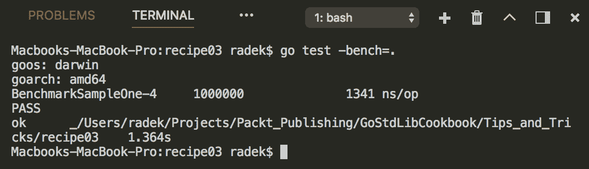

# 它是如何工作的...

除了纯测试支持外，测试包还提供了用于测量代码性能的机制。为此，使用`B`结构指针作为参数，并且测试文件中的基准测试函数命名为`BenchmarkXXXX`。

基准测试函数的关键部分是操作定时器和使用循环迭代计数器`N`。

如您所见，定时器通过`Reset`/`Start`/`StopTimer`方法进行操作。通过这些方法，基准测试的结果会受到影响。请注意，定时器在基准测试函数开始时开始运行，而`ResetTimer`函数只是重新启动它。

`B`的`N`字段是测量循环中的迭代次数。`N`值设置为足够高的值，以可靠地测量基准测试的结果。基准测试日志中显示迭代次数和每次迭代的测量时间。

# 另请参阅

+   下一个示例将展示如何在测试中创建子测试

+   有关基准测试的更多选项和信息，请查看此处的包文档：[`golang.org/pkg/testing`](https://golang.org/pkg/testing)

# 创建子测试

在某些情况下，有用的是创建一组可能具有类似设置或清理代码的测试。这可以在没有为每个测试创建单独函数的情况下完成。

# 如何做...

1.  打开控制台并创建文件夹`chapter11/recipe04`。

1.  导航到目录。

1.  创建名为`sample_test.go`的文件，内容如下：

```go
        package main

        import (
          "fmt"
          "strconv"
          "testing"
        )

        var testData = []int{10, 11, 017}

        func TestSampleOne(t *testing.T) {
          expected := "10"
          for _, val := range testData {
            tc := val
            t.Run(fmt.Sprintf("input = %d", tc), func(t *testing.T) {
              if expected != strconv.Itoa(tc) {
                t.Fail()
              }
            })
          }
        }
```

1.  通过`go test -v`执行测试。

1.  在终端中查看输出：

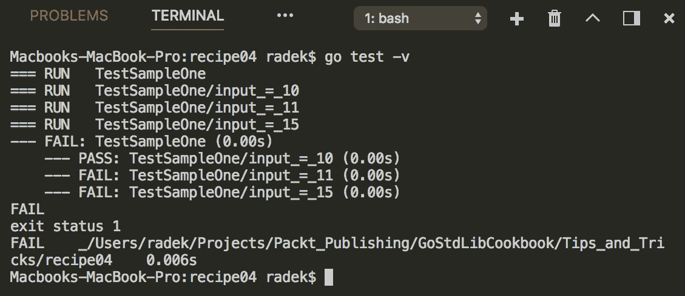

# 它是如何工作的...

`testing`包的`T`结构还提供了`Run`方法，可用于运行嵌套测试。`Run`方法需要子测试的名称和将要执行的测试函数。例如，使用表驱动测试时，这种方法可能很有益。代码示例只是使用`int`值的简单切片作为输入。

基准测试结构`B`也包含相同的方法`Run`，可以提供一种创建复杂基准测试后续步骤的方法。

# 另请参阅

在包文档中仍有很多内容要找出，[`golang.org/pkg/testing`](https://golang.org/pkg/testing)。

# 测试 HTTP 处理程序

测试`HTTP`服务器可能会很复杂。Go 标准库通过一个方便的包`net/http/httptest`简化了这一点。本示例描述了如何利用此包来测试`HTTP`处理程序。

# 如何做...

1.  打开控制台并创建文件夹`chapter11/recipe05`。

1.  导航到目录。

1.  创建名为`sample_test.go`的文件，内容如下：

```go
        package main

        import (
          "fmt"
          "io/ioutil"
          "net/http"
          "net/http/httptest"
          "testing"
          "time"
        )

        const cookieName = "X-Cookie"

        func HandlerUnderTest(w http.ResponseWriter, r *http.Request) {
          http.SetCookie(w, &http.Cookie{
            Domain: "localhost",
            Expires: time.Now().Add(3 * time.Hour),
            Name: cookieName,
          })
          r.ParseForm()
          username := r.FormValue("username")
          fmt.Fprintf(w, "Hello %s!", username)
        }

        func TestHttpRequest(t *testing.T) {

          req := httptest.NewRequest("GET",
                          "http://unknown.io?username=John", nil)
          w := httptest.NewRecorder()
          HandlerUnderTest(w, req)

          var res *http.Cookie
          for _, c := range w.Result().Cookies() {
            if c.Name == cookieName {
              res = c
            }
          }

          if res == nil {
            t.Fatal("Cannot find " + cookieName)
          }

          content, err := ioutil.ReadAll(w.Result().Body)
          if err != nil {
            t.Fatal("Cannot read response body")
          }

          if string(content) != "Hello John!" {
            t.Fatal("Content not matching expected value")
          }
        }
```

1.  通过`go test`执行测试。

1.  在终端中查看输出：

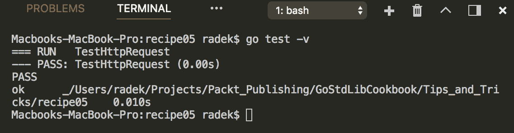

# 它是如何工作的...

对于`Handler`或`HandlerFunc`的测试，可以利用`net/http/httptest`。该包提供了`ResponseRecorder`结构，能够记录响应内容并将其提供回来以断言值。用于组装请求的是`net/http`包的`NewRequest`函数。

`net/http/httptest`包还包含了在本地主机上监听系统选择端口的 HTTP 服务器版本。此实现旨在用于端到端测试。

# 通过反射访问标签

Go 语言允许给结构化字段打标签，附加额外信息。这些信息通常用作编码器的附加信息，或者对结构体进行任何类型的额外处理。这个示例将向你展示如何访问这些信息。

# 如何做...

1.  打开控制台并创建文件夹`chapter11/recipe06`。

1.  导航到目录。

1.  创建文件`structtags.go`，内容如下：

```go
        package main

        import (
          "fmt"
          "reflect"
        )

        type Person struct {
          Name string `json:"p_name" bson:"pName"`
          Age int `json:"p_age" bson:"pAge"`
        }

        func main() {
          f := &Person{"Tom", 30}
          describe(f)
        }

        func describe(f interface{}) {
          val := reflect.TypeOf(f).Elem()
          for i := 0; i < val.NumField(); i++ {
            typeF := val.Field(i)
            fieldName := typeF.Name
            jsonTag := typeF.Tag.Get("json")
            bsonTag := typeF.Tag.Get("bson")
            fmt.Printf("Field : %s jsonTag: %s bsonTag: %s\n",
                       fieldName, jsonTag, bsonTag)
          }
        }
```

1.  通过`go run structtags.go`执行代码。

1.  在终端中查看输出：

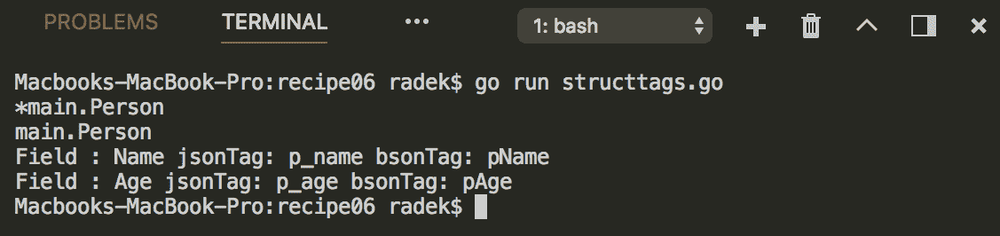

# 它是如何工作的...

可以使用`reflect`包提取`struct`标签。通过调用`TypeOf`，我们得到了`Person`的指针`Type`，随后通过调用`Elem`，我们得到了指针指向的值的`Type`。

结果的`Type`让我们可以访问`struct`类型`Person`及其字段。通过遍历字段并调用`Field`方法检索字段，我们可以获得`StructField`。`StructField`类型包含`Tag`字段，该字段提供对`struct`标签的访问。然后，`StructTag`字段上的`Get`方法返回特定的标签。

# 对切片进行排序

数据排序是一个非常常见的任务。Go 标准库通过 sort 包简化了排序。这个示例简要介绍了如何使用它。

# 如何做...

1.  打开控制台并创建文件夹`chapter11/recipe07`。

1.  导航到目录。

1.  创建文件`sort.go`，内容如下：

```go
        package main

        import (
          "fmt"
          "sort"
        )

        type Gopher struct {
          Name string
          Age int
        }

        var data = []Gopher{
          {"Daniel", 25},
          {"Tom", 19},
          {"Murthy", 33},
        }

        type Gophers []Gopher

        func (g Gophers) Len() int {
          return len(g)
        }

        func (g Gophers) Less(i, j int) bool {
          return g[i].Age > g[j].Age
        }

        func (g Gophers) Swap(i, j int) {
          tmp := g[j]
          g[j] = g[i]
          g[i] = tmp
        }

        func main() {

          sort.Slice(data, func(i, j int) bool {
            return sort.StringsAreSorted([]string{data[i].Name, 
                                      data[j].Name})
          })

          fmt.Printf("Sorted by name: %v\n", data)

          gophers := Gophers(data)
          sort.Sort(gophers)

          fmt.Printf("Sorted by age: %v\n", data)

        }
```

1.  通过`go run sort.go`执行代码。

1.  在终端中查看输出：

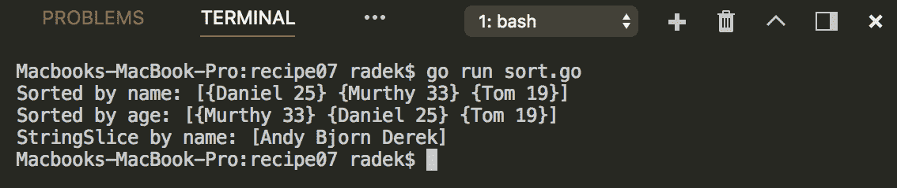

# 它是如何工作的...

示例代码展示了如何舒适地使用`sort`包对切片进行排序的两种方式。第一种方法更加临时，它使用了`sort`包的`Slice`函数。`Slice`函数消耗要排序的切片和所谓的 less 函数，该函数定义了元素`i`是否应该在元素`j`之前排序。

第二种方法需要更多的代码和提前规划。它利用了`sort`包的`Interface`接口。该接口充当数据的代表，并要求其在排序数据上实现必要的方法：`Len`（定义数据的数量）、`Less`（less 函数）、`Swap`（调用以交换元素）。如果数据值实现了这个接口，那么可以使用`sort`包的`Sort`函数。

原始类型切片`float64`、`int`和`string`在`sort`包中有涵盖。因此，可以使用现有的实现。例如，要对字符串切片进行排序，可以调用`Strings`函数。

# 将 HTTP 处理程序分组

这个示例提供了关于如何将 HTTP 处理程序分离成模块的建议。

# 如何做...

1.  打开控制台并创建文件夹`chapter11/recipe08`。

1.  导航到目录。

1.  创建文件`handlegroups.go`，内容如下：

```go
        package main

        import (
          "fmt"
          "log"
          "net/http"
        )

         func main() {

           log.Println("Staring server...")
           // Adding to mani Mux
           mainMux := http.NewServeMux()
           mainMux.Handle("/api/",
           http.StripPrefix("/api", restModule()))
           mainMux.Handle("/ui/",
           http.StripPrefix("/ui", uiModule()))

           if err := http.ListenAndServe(":8080", mainMux); err != nil {
             panic(err)
           }

         }

         func restModule() http.Handler {
           // Separate Mux for all REST
           restApi := http.NewServeMux()
           restApi.HandleFunc("/users", func(w http.ResponseWriter,
                              r *http.Request) {
             w.Header().Set("Content-Type", "application/json")
             fmt.Fprint(w, `[{"id":1,"name":"John"}]`)
           })
           return restApi
         }

         func uiModule() http.Handler {
           // Separate Mux for all UI
           ui := http.NewServeMux()
           ui.HandleFunc("/users", func(w http.ResponseWriter, 
                         r *http.Request) {
             w.Header().Set("Content-Type", "text/html")
             fmt.Fprint(w, `<html><body>Hello from UI!</body></html>`)
           })

           return ui
         }
```

1.  通过`go run handlegroups.go`执行代码。

1.  查看输出：

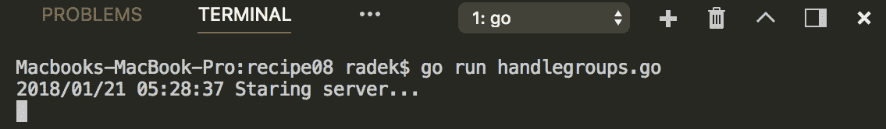

1.  访问浏览器 URL`http://localhost:8080/api/users`，输出应该如下所示：

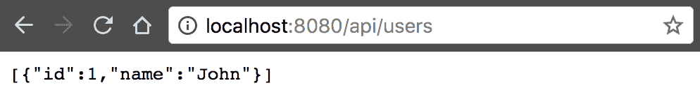

1.  同样，您可以测试`http://localhost:8080/ui/users`： 

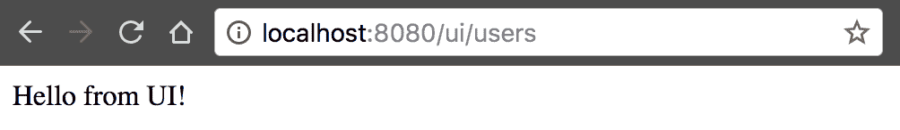

# 它是如何工作的...

为了将处理程序分离成模块，代码使用了`ServeMux`来为每个模块（`rest`和`ui`）进行处理。给定模块的 URL 处理是相对定义的。这意味着如果`Handler`的最终 URL 应该是`/api/users`，那么模块内定义的路径将是`/users`。模块本身将设置为`/api/` URL。

通过利用`StripPrefix`函数将模块插入到名为`mainMux`的主`ServeMux`指针中，模块被插入到主`ServeMux`中。例如，通过`StripPrefix("/api",restModule())`将由`restModule`函数创建的 REST 模块插入到主`ServeMux`中。然后模块内的处理 URL 将是`/users`，而不是`/api/users`。

# 利用 HTTP/2 服务器推送

HTTP/2 规范为服务器提供了在被请求之前推送资源的能力。本示例演示了如何实现服务器推送。

# 准备工作

准备私钥和自签名 X-509 证书。为此，可以使用`openssl`实用程序。通过执行命令`openssl genrsa -out server.key 2048`，使用 RSA 算法生成私钥文件`server.key`。基于此私钥，可以通过调用`openssl req -new -x509 -sha256 -key server.key -out server.crt -days 365`生成 X-509 证书。创建了`server.crt`文件。

# 操作步骤...

1.  打开控制台并创建文件夹`chapter11/recipe09`。

1.  导航到目录。

1.  创建文件`push.go`，内容如下：

```go
        package main

        import (
          "io"
          "log"
          "net/http"
        )

        func main() {

          log.Println("Staring server...")
          // Adding to mani Mux
          http.HandleFunc("/",func(w http.ResponseWriter, r *http.Request){
            if p, ok := w.(http.Pusher); ok {
              if err := p.Push("/app.css", nil); err != nil {
                log.Printf("Push err : %v", err)
              }
            }
            io.WriteString(w,
              `<html>
                 <head>
                   <link rel="stylesheet" type="text/css" href="app.css">
                 </head>
                 <body>
                   <p>Hello</p>
                 </body>
               </html>`
             )
           })
           http.HandleFunc("/app.css", func(w http.ResponseWriter,
                           r *http.Request) {
             io.WriteString(w,
               `p {
                 text-align: center;
                 color: red;
               }`)
           })

           if err := http.ListenAndServeTLS(":8080", "server.crt",
                                            "server.key", nil);
           err != nil {
             panic(err)
           }

         }
```

1.  通过`go run push.go`启动服务器。

1.  打开浏览器，在 URL `https://localhost:8080` 中打开开发者工具（查看`Push`作为`app.css`的发起者）：

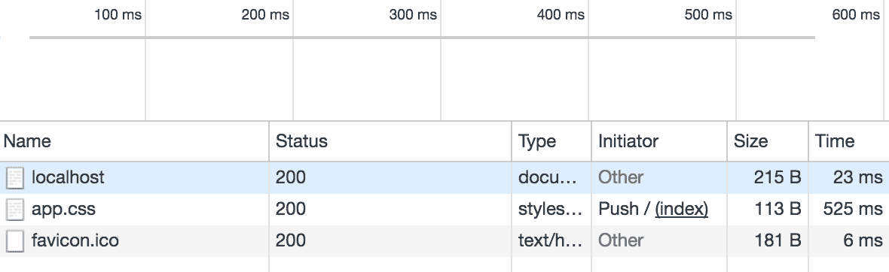

# 工作原理...

首先，注意 HTTP/2 需要安全连接。服务器推送非常简单实现。自 Go 1.8 以来，HTTP 包提供了`Pusher`接口，可以在资源被请求之前用于`Push`资产。如果客户端（通常是浏览器）支持 HTTP/2 协议并且与服务器的握手成功，`Handler`或`HandlerFunc`中的`ResponseWriter`可以转换为`Pusher`。`Pusher`只提供`Push`方法。`Push`方法消耗目标（可以是绝对路径或绝对 URL）到资源和`PushOptions`，可以提供额外选项（默认情况下可以使用 nil）。

在上面的示例中，查看浏览器中开发者工具的输出。推送的资源在 Initiator 列中具有值`Push`。
