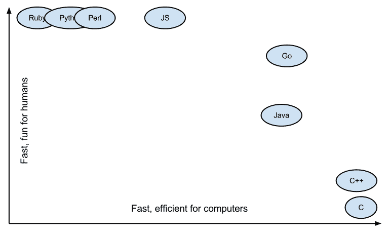
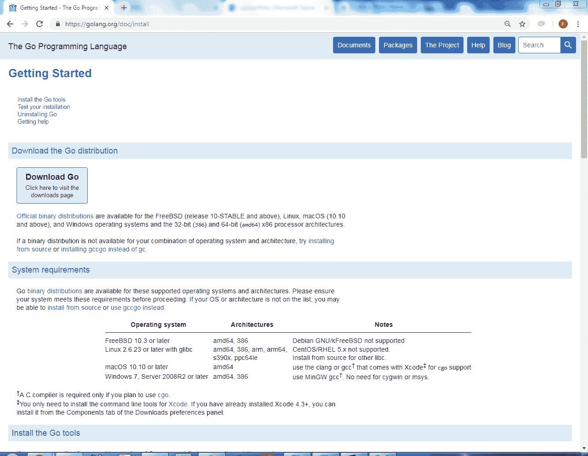
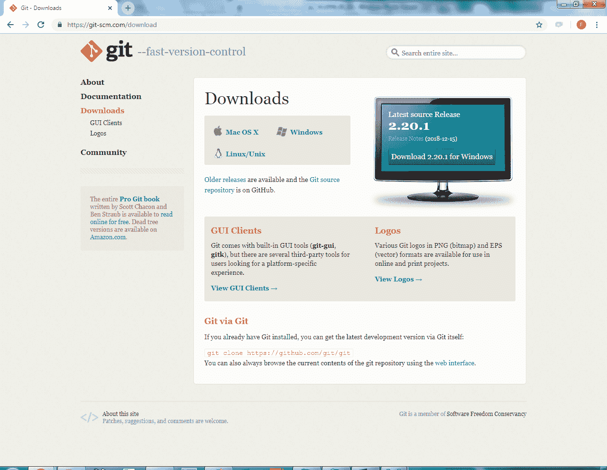
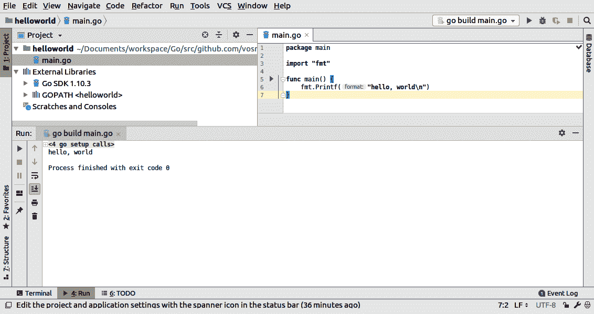
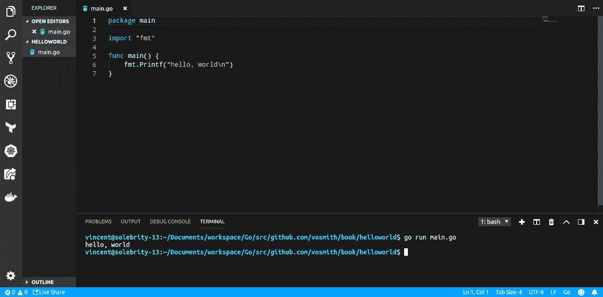
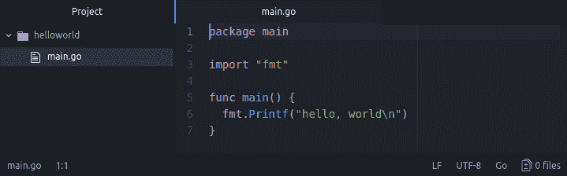

# 第一章：介绍网络爬虫和 Go

收集、解析、存储和处理数据是几乎每个人在软件开发职业生涯中都需要做的基本任务。跟上大大提高应用程序开发的稳定性、速度和效率的新兴技术是另一个挑战。为了提供如何实现这两个目标的见解，我写了这本书。在这里，您将找到一个在 Go 中执行网络爬虫的指南。本书涵盖了网络爬虫的广泛视角，从**超文本传输协议**（**HTTP**）和**超文本标记语言**（**HTML**）的基础知识到构建高度并发的分布式系统。

在本章中，您将找到以下主题的解释：

+   什么是网络爬虫？

+   为什么您需要一个网络爬虫？

+   什么是 Go？

+   为什么 Go 非常适合网络爬虫？

+   您如何设置 Go 开发环境？

# 什么是网络爬虫？

网络爬虫在本质上是为了特定目的从互联网上收集公开可用的信息。它以许多不同的名称出现，比如以下：

+   蜘蛛

+   爬虫

+   机器人

尽管这个名字可能带有负面含义，但网络爬虫的实践自互联网诞生以来就存在，并发展成了各种技术和技巧。事实上，一些公司甚至建立了他们整个业务模式在网络爬虫上！

# 为什么您需要一个网络爬虫？

有许多不同的用例，您可能需要构建一个网络爬虫。所有这些用例都围绕着互联网上的信息通常是分散的，但当收集到一个单一的包中时，可能非常有价值。在这些情况下，收集信息的人通常与数据的生产者没有工作或商业关系，这意味着他们无法要求将信息打包并交付给他们。由于缺乏这种关系，需要数据的人必须依靠自己的手段来收集信息。

# 搜索引擎

网络爬虫的一个众所周知的用例是为了构建搜索引擎而对网站进行索引。在这种情况下，网络爬虫会访问不同的网站，并跟踪其他网站的引用，以便发现互联网上所有可用的内容。通过收集页面上的一些内容，您可以通过将术语与您收集的页面的内容进行匹配来响应搜索查询。如果您跟踪页面如何链接在一起，并根据它们与其他站点的连接数量对最重要的页面进行排名，您还可以建议类似的页面。

Googlebot 是用于构建搜索引擎的网络爬虫的最著名的例子。它是构建搜索引擎的第一步，因为它会下载、索引和对网站上的每个页面进行排名。它还会跟踪到其他网站的链接，这就是它能够索引互联网上大部分内容的原因。根据 Googlebot 的文档，网络爬虫试图每隔几秒钟到达每个网页，这需要它们每天达到数十亿页的估计！

如果您的目标是构建一个搜索引擎，尽管规模要小得多，您将在本书中找到足够的工具来收集您需要的信息。但是，本书不会涵盖索引和排名页面以提供相关的搜索结果。

# 价格比较

另一个已知的用例是查找通过各种网站销售的特定产品或服务，并跟踪它们的价格。您可以看到谁在销售该商品，谁的价格最低，或者它最有可能何时有货。您甚至可能对来自不同来源的类似产品感兴趣。定期让网络爬虫访问网站以监视这些产品和服务将很容易解决这个问题。这与跟踪航班、酒店和租车价格非常相似。

像 camelcamelcamel（[`camelcamelcamel.com/`](https://camelcamelcamel.com/)）这样的网站就是围绕这种情况构建其商业模式的。根据他们解释他们系统如何工作的博客文章，他们每隔半小时到几个小时主动收集来自多个零售商的定价信息，涵盖数百万种产品。这使用户可以查看多个平台上的价格差异，并在物品价格下降时收到通知。

您可以在[`camelcamelcamel.com/blog/how-our-price-checking-system-works`](https://camelcamelcamel.com/blog/how-our-price-checking-system-works)阅读他们的文章。

这种类型的网络爬虫需要非常仔细地解析网页，以提取只与相关的内容。在后面的章节中，您将学习如何从 HTML 页面中提取信息，以收集这些信息。

# 构建数据集

数据科学家通常需要数十万个数据点来构建、训练和测试机器学习模型。在某些情况下，这些数据已经预打包并准备好供使用。大多数情况下，科学家需要自己去构建一个定制的数据集。这通常是通过构建一个网络爬虫来收集来自各种感兴趣来源的原始数据，并对其进行精炼，以便以后进行处理。这些网络爬虫还需要定期收集新鲜数据，以使用最相关的信息更新其预测模型。

数据科学家经常遇到的一个常见用例是确定人们对特定主题的感受，即所谓的情感分析。通过这个过程，公司可以寻找围绕其产品或整体存在的讨论，并收集一个普遍的共识。为了做到这一点，模型必须在什么是积极评论和消极评论上进行训练，这可能需要成千上万的个别评论才能构建一个平衡的训练集。构建一个网络爬虫来收集相关论坛、评论和社交媒体网站上的评论，对于构建这样的数据集将是有帮助的。

这些只是一些驱动谷歌、Mozenda 和[Cheapflights.com](http://Cheapflights.com)等大型企业的网络爬虫的例子。还有一些公司会按费用为您从网络上爬取所需的任何可用数据。为了以如此大规模运行爬虫，您需要使用一种快速、可扩展且易于维护的语言。

# 什么是 Go？

Go 是由谷歌员工于 2007 年创建的一种编程语言。在创建时，目标是构建一种快速、安全和简单的语言。Go 于 2012 年首次正式发布 1.0 版本，是当今增长最快的编程语言之一。根据*Stack Overflow 2018 开发者调查*，Go 在最受喜爱语言中排名前五，在最想要语言中排名前三。

Go 支持许多大规模网络基础架构平台和工具，如 Docker、Kubernetes 和 Terraform。这些平台使公司能够构建支持财富 500 强公司的生产规模产品。这主要是由于 Go 语言的设计，使其易于直接清晰地使用。许多其他使用 Go 进行开发的公司经常吹嘘其性能优于其他语言。

# 为什么 Go 很适合网络爬虫？

Go 编程语言的架构以及其标准库使其成为构建快速、可扩展和易于维护的网络爬虫的绝佳选择。Go 是一种静态类型、垃圾回收的语言，其语法更接近于 C/C++。对于从面向对象编程语言转过来的开发人员来说，该语言的语法会感觉非常熟悉。Go 还具有一些函数式编程元素，例如高阶函数。总的来说，有三个主要原因使得 Go 非常适合网络爬虫：



# Go 很快

速度是 Go 编程语言的主要目标之一。许多基准测试将 Go 的速度与 C++、Java 和 Rust 相提并论，并远远领先于 Python 和 Ruby 等语言。基准测试应该始终带有一些怀疑态度，但 Go 始终以极高的性能数字脱颖而出。这种速度通常与低资源占用量相结合，因为运行时非常轻量级，不占用太多内存。其中一个隐藏的好处是能够在较小的机器上运行 Go 程序，或者在同一台机器上运行多个实例，而不会有显著的开销。这降低了在更大规模上运行网络爬虫的成本。

这种速度在构建网络爬虫中非常重要，并且在更大的规模下变得更加明显。例如，一个需要两分钟来爬取一个页面的网络爬虫；理论上你可以在一天内处理 720 页。如果你能将处理时间减少到每页一分钟，你就可以将每天的页面数量翻倍到 1440 页！更好的是，这将以相同的成本完成。Go 的速度和效率使你能够用更少的资源做更多的事情。

# Go 是安全的

导致其速度的一个因素是 Go 是静态类型的。这使得该语言非常适合在大规模构建系统，并且对程序在生产环境中的运行非常有信心。此外，由于 Go 程序是通过编译器构建而不是通过解释器运行的，它允许你在编译时捕获更多的错误，并大大减少了可怕的运行时错误。

这种安全保障也延伸到了 Go 的垃圾收集器。垃圾收集意味着你不需要手动分配和释放内存。这有助于防止由于代码中对象处理不当而可能导致的内存泄漏。有人可能会认为垃圾收集会影响应用程序的性能，然而，Go 的垃圾收集器在干扰代码执行方面几乎没有什么额外开销。许多来源报告说，Go 的垃圾收集器引起的暂停时间不到一毫秒。在大多数情况下，这是为了避免未来追踪内存泄漏而付出的非常小的代价。对于网络爬虫来说，这当然是正确的。

随着网络爬虫在规模和复杂性上的增长，跟踪处理过程中可能发生的所有错误可能会变得困难。考虑到每天处理成千上万个网页，一个小错误可能会显著影响数据的收集。在一天结束时，错过的数据就是失去的金钱，因此在系统运行之前尽可能地防止尽可能多的已知错误对你的系统至关重要。

# Go 是简单的

除了 Go 编程语言本身的架构之外，标准库提供了所有你需要使网络爬虫变得简单的正确包。Go 在`net/http`包中提供了一个内置的 HTTP 客户端，它在开箱即用的同时也允许进行大量的定制。发起 HTTP 请求就像下面这样简单：

```go
http.Get("http://example.com")
```

`net/http`包的一部分还包括结构化 HTTP 请求、HTTP 响应以及所有 HTTP 状态码的实用程序，我们将在本书的后面进行深入讨论。你很少需要任何第三方包来处理与 Web 服务器的通信。Go 标准库还提供了工具来帮助分析 HTTP 请求，快速消耗 HTTP 响应主体，并调试你的网络爬虫中的请求和响应。`net/http`包中的 HTTP 客户端也是非常可配置的，让你调整特殊参数和方法以满足你的特定需求。通常情况下不需要这样做，但如果你遇到这样的情况，这个选项是存在的。

这种简单性将有助于消除编写代码时的一些猜测。您不需要确定进行 HTTP 请求的最佳方式；Go 已经解决了这个问题，并为您提供了完成工作所需的最佳工具。即使您需要的不仅仅是标准库，Go 社区也构建了遵循相同简单文化的工具。这无疑使集成第三方库变得容易。

# 如何设置 Go 开发环境

在开始构建网络爬虫之前，您需要适当的工具。为编写 Go 代码设置开发环境相对简单。您不需要安装很多外部工具，并且所有主要计算平台都得到支持。对于本章中列出的所有工具，您将找到适用于 Windows、Mac 和 Linux 系统的单独说明。此外，由于我们将使用的所有工具都是开源的，因此如果需要，您将能够访问源代码并根据自己的需求构建它们。

# Go 语言和工具

首先，您需要在计算机上安装 Go 编程语言和工具。安装过程因不同操作系统而异，请按照[`golang.org/doc/install`](https://golang.org/doc/install)上的说明进行操作。在安装页面上，您将找到适用于您的平台的 Go 下载说明，以及最低操作系统要求。

您最好花一些额外的时间浏览 Go 编程语言网站，了解更多关于该语言的信息，阅读教程，并查找标准库文档。

这是来自 Go 网站安装页面的截图，包含了在计算机上安装 Go 所需的所有说明：



如果您愿意，也可以从源代码构建该语言。安装结束时，您应该拥有所有 Go 库、Go 命令行以及一个简单的 hello world 项目，以确保一切都安装正确。

非常重要的是要按照说明一直测试您的安装。有时候，Go 在`$GOPATH`方面可能有点棘手。设置好`$GOPATH`后，您必须确保完成以下操作：

+   您有所需的`src`、`bin`和`pkg`目录

+   所有源代码都包含在`src`目录中

+   `src`目录中的文件夹结构模仿了您希望包名称的结构。

通过完成测试部分，您将节省将来很多的烦恼。

自从 1.11 版本发布以来，Go 团队宣布支持 Go 模块，这允许您在`$GOPATH`之外进行开发。由于这个功能仍然被认为是实验性的，本书将继续使用经典的 Go 开发方法。

# Git

您还需要安装 Git 版本控制软件。这将用于在计算机上下载第三方库。`go get`命令依赖于系统上安装了 Git，以便直接将库下载并安装到您的`$GOPATH`中。您也可以随意使用 Git 下载每个章节的示例。本书中的所有示例都将使用在 GitHub 上可用的开源库。您可以按照[`git-scm.com/download`](https://git-scm.com/download)上的说明为您的系统安装 Git。

Git 命令行工具是一组广泛的命令，用于对源代码进行版本控制、存储和检索。这些命令是支持 GitHub 网站的基础。强烈建议您学习如何使用该工具与 GitHub 网站进行交互，而不是通过用户界面进行操作。

以下是 Git 下载页面的截图，包含了适用于您操作系统的链接：



# 编辑器

你将需要的第二个工具是一个好的文本编辑器或**集成开发环境**（**IDE**）。如果你对 IDE 不熟悉，它们基本上是为特定编程语言编写应用程序而定制的文本编辑器。JetBrains 的 GoLand 是一个著名的 Go 语言 IDE。它具有内置的语法高亮显示、运行和调试模式、内置版本控制和包管理支持。

GoLand 提供 30 天的试用期，之后您必须购买许可证才能继续使用。

以下是 GoLand IDE 显示标准`Hello World`程序的截图：



如果您更喜欢使用文本编辑器，那么有许多可用的编辑器，它们通常都有适用于 Go 的插件，使开发更加容易。如今最好的两个文本编辑器是微软的 Visual Studio Code 和 GitHub 的 Atom。这两者都是通用编辑器，也有用于语法高亮显示、构建和运行 Go 代码的插件。这样您就可以添加所需的功能而不会增加太多开销。

这个截图显示的是在 Visual Studio Code 中显示的相同`Hello World`程序：



最后，Atom 版本的`Hello World`程序如下截图所示：



由于插件的社区支持水平很高，Visual Studio Code 和 Atom 都是构建 Go 应用程序的绝佳选择，我强烈建议安装。或者，您可以在任何文本编辑器中编写 Go 程序，并使用标准的 Go 命令在终端或命令提示符中运行代码。

您将需要一个稳定的互联网连接。良好的互联网连接将消除连接到不同网站时出现的错误。如果您正在构建一个位于网络防火墙后面的网络爬虫，或者您的网络连接较弱，您可能会遇到访问本书示例中使用的一些网站时出现困难。

# 摘要

在本章中，您学习了构建网络爬虫的一些用例以及与之相关的企业示例。您还学习了 Go 编程语言的一些优势，并创建了一个适合构建网络爬虫的开发环境。这些步骤应该可以帮助您开始这条道路。

在第二章中，*请求/响应循环*，我们将学习如何在 Go 中与 Web 服务器通信。我们将学习您的网络爬虫如何与 Web 服务器通信的基础知识。
