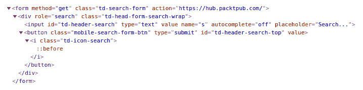
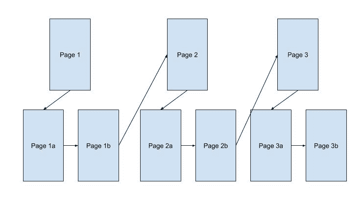
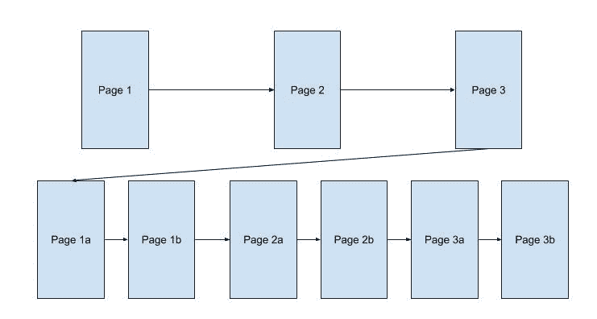

# 第五章：网络爬取导航

到目前为止，本书侧重于为单个网页检索信息。虽然这是网络爬取的基础，但并不涵盖大多数用例。很可能，你需要访问多个网页或网站，以收集满足你需求的所有信息。这可能涉及直接通过 URL 列表访问许多已知网站，或者跟踪在某些页面上发现的链接到更多未知的地方。有许多不同的方式来引导你的网络爬虫浏览网页。

在本章中，我们将涵盖以下主题：

+   如何跟踪链接

+   如何使用`POST`请求提交表单

+   如何跟踪你的历史记录以避免循环

+   广度优先和深度优先爬取的区别

# 跟踪链接

正如你在本书中许多示例中所看到的，有一些由`<a>`标签表示的 HTML 元素，其中包含`href`属性，引用不同的 URL。这些标签称为锚标签，是网页上生成链接的方式。在网页浏览器中，这些链接通常会有不同的字体颜色，通常是蓝色，带有下划线。作为网页浏览器中的用户，如果你想要跟踪一个链接，通常只需点击它，你就会被重定向到 URL。作为一个网络爬虫，点击操作通常是不必要的。相反，你可以向`href`属性本身发送一个`GET`请求。

如果你发现`href`属性缺少`http://`或`https://`前缀和主机名，你必须使用当前网页的前缀和主机名。

# 示例-每日特惠

在第四章中，*解析 HTML*，我们使用了一个示例，从 Packt Publishing 网站上检索了最新发布的书籍的标题和价格。你可以通过跟踪每个链接到书籍的主要网页来收集更多关于每本书的信息。在下面的代码示例中，我们将添加导航以实现这一点：

```go
package main

import (
  "fmt"
  "strings"
  "time"
  "github.com/PuerkitoBio/goquery"
)

func main() {
  doc, err := goquery.NewDocument("https://www.packtpub.com/latest-releases")
  if err != nil {
    panic(err)
  }

  println("Here are the latest releases!")
  println("-----------------------------")
  time.Sleep(1 * time.Second)
  doc.Find(`div.landing-page-row div[itemtype$="/Product"] a`).
    Each(func(i int, e *goquery.Selection) {
      var title, description, author, price string
      link, _ := e.Attr("href")
      link = "https://www.packtpub.com" + link

      bookPage, err := goquery.NewDocument(link)
      if err != nil {
        panic(err)
      }
      title = bookPage.Find("div.book-top-block-info h1").Text()
      description = strings.TrimSpace(bookPage.Find("div.book-top-
      block-info div.book-top-block-info-one-liner").Text())
      price = strings.TrimSpace(bookPage.Find("div.book-top-block-info 
      div.onlyDesktop div.book-top-pricing-main-ebook-price").Text())
      authorNodes := bookPage.Find("div.book-top-block-info div.book-
      top-block-info-authors")
       if len(authorNodes.Nodes) < 1 {
        return
      } 
      author = strings.TrimSpace(authorNodes.Nodes[0].FirstChild.Data)
      fmt.Printf("%s\nby: %s\n%s\n%s\n---------------------\n\n", 
      title, author, price, description)
      time.Sleep(1 * time.Second)
    })
}
```

正如你所看到的，我们已经修改了`Each()`循环，以提取网页中列出的每个产品的链接。每个链接只包含到书籍的相对路径，所以我们在每个链接前缀中加入了[`www.packtpub.com`](https://www.packtpub.com)字符串。接下来，我们使用我们构建的链接导航到页面本身，并抓取所需的信息。在每页的末尾，我们休眠`1`秒，以便我们的网络爬虫不会过度负担服务器，遵守我们在第三章中学到的良好礼仪，*网络爬取礼仪*。

# 提交表单

到目前为止，我们已经能够使用 HTTP `GET`请求从服务器请求信息。这些请求涵盖了你在构建自己的网络爬虫时会遇到的绝大多数网络爬取任务。然而，总会有一些时候，你可能需要提交某种表单数据，以便检索你正在寻找的信息。这些表单数据可能包括搜索查询，或者登录界面，或者任何需要你在框中输入并点击提交按钮的页面。

对于简单的网站，这是通过一个包含一个或多个`<input>`元素和一个提交按钮的 HTML `<form>`元素来完成的。这个`<form>`元素通常具有定义`action`（发送`<form>`数据的位置）和`method`（要使用的 HTTP 方法）的属性。默认情况下，网页将使用 HTTP `GET`请求发送表单数据，但也很常见看到 HTTP `POST`请求。

# 示例-提交搜索

在下面的示例中，您将看到如何通过使用 HTML 表单的属性和元素来模拟表单提交。我们将使用位于[`hub.packtpub.com/`](https://hub.packtpub.com/)网站上的表单来发现有关 Go 编程语言（通常称为 GoLang）的文章。在[`hub.packtpub.com`](https://hub.packtpub.com)的主页上，有一个搜索框位于页面的左上角，如下面的屏幕截图所示：


通过右键单击搜索框，您应该能够使用浏览器的开发者工具检查元素。这会显示页面的 HTML 源代码，显示该框位于 HTML 表单中。在 Google Chrome 中，它看起来类似于下面的屏幕截图：



这个表单使用 HTTP `GET`方法，并提交到[`hub.packtpub.com/`](https://hub.packtpub.com/)端点。这个表单的值是从`<input>`标签中使用`name`属性作为键，搜索框中的文本作为值。因为这个表单使用`GET`作为方法，键值对被发送到服务器作为 URL 的查询部分。在我们的例子中，我们想要提交 GoLang 作为我们的搜索查询。为了做到这一点，当您点击按钮提交您的查询时，您的浏览器将发送一个`GET`请求到[`hub.packtpub.com/?s=Golang`](https://hub.packtpub.com/?s=Golang)。

结果页面将包含所有与 Go 相关的文章。您可以爬取标题、日期、作者等，以便保持 Go 文章的索引。通过定期提交此查询，您可以在发布时立即发现新文章。

# 示例-POST 方法

在前面的例子中使用的表单使用`GET`作为方法。假设，如果它使用`POST`方法，表单提交的方式将有所不同。您需要构建一个请求主体，而不是将值放在 URL 中。在下面的例子中，相同的表单和搜索查询将被构造为`POST`请求：

```go
package main

import (
  "net/http"
  "net/url"
)

func main() {
  data := url.Values{}
  data.Set("s", "Golang")

  response, err := http.PostForm("https://hub.packtpub.com/", data)

  // ... Continue processing the response ...
}
```

在 Go 中，您可以使用`url.Values`结构构建表单提交。您可以使用此功能设置表单的输入——在我们的例子中是`s=Golang`——并使用`http.Post()`函数提交它。如果表单使用`POST`作为其方法，这种技术将只有帮助。

# 避免循环

如果您正在构建一个遵循链接的网络爬虫，您可能需要知道您已经访问过哪些页面。您正在访问的页面很可能包含一个指向您已经访问过的页面的链接，将您带入一个无限循环。因此，非常重要的是在您的爬虫中构建一个跟踪系统，记录其历史。

存储唯一项目集合的最简单数据结构将是一个集合。Go 标准库没有集合数据结构，但可以通过使用`map[string]interface{}]`来模拟。

在 Go 中，`interface{}`是一个通用对象，类似于`java.lang.Object`。

在 Go 中，您可以定义一个地图如下：

```go
visitedMap := map[string]interface{}{}
```

在这种情况下，我们将使用访问的 URL 作为键，以及您想要的任何值。我们将只使用`nil`，因为只要键存在，我们就知道我们已经访问了该站点。添加我们已经访问的站点将简单地将 URL 插入为键，`nil`作为值，如下面的代码块所示：

```go
visitedMap["http://example.com/index.html"] = nil
```

当您尝试从地图中检索一个值时，Go 将返回两个值：如果存在，键的值和一个布尔值，说明键是否存在于地图中。在我们的例子中，我们只关心后者。

我们将检查类似于以下代码块中演示的站点访问：

```go
_, ok := visitedMap["http://example.com/index.html"]

if ok {
  // ok == true, meaning the URL exists in the visitedMap
  // Skip this URL
} else {
  // ok == false, meaning the URL does not exist in the visitedMap
  // Make the HTTP Request and continue processing this page
  // ...
} 
```

# 广度优先与深度优先爬行

现在，您可以导航到不同的页面，并且可以避免陷入循环，当爬行网站时，您还有一个重要的选择要做。一般来说，有两种主要方法可以通过跟随链接来覆盖所有页面：广度优先和深度优先。想象一下，您正在爬取一个包含 20 个链接的单个网页。自然地，您会跟随页面上的第一个链接。在第二页上，还有十个链接。在这里就是您的决定：跟随第二页上的第一个链接，还是返回到第一页上的第二个链接。

# 深度优先

如果您选择在第二页上跟随第一个链接，这将被视为深度优先爬行：



您的爬虫将继续尽可能深入地跟随链接以收集所有页面。在产品的情况下，您可能会跟随推荐或类似项目的路径。这可能会将您带到远离爬虫的原始起点的产品。另一方面，它也可能帮助快速构建相关项目的更紧密网络。在包含文章的网站上，深度优先爬行将迅速将您带回到过去，因为链接的页面很可能是对先前撰写的文章的引用。这将帮助您迅速到达许多链接路径的起源。

在第六章中，*保护您的网络爬虫*，我们将学习如何通过确保我们有适当的边界来避免深度优先爬行的一些陷阱。

# 广度优先

如果您选择在第一页上跟随第二个链接，这将被视为广度优先爬行：



使用这种技术，您很可能会在原始搜索域内停留更长时间。例如，如果您在一个包含产品的网站上搜索鞋子，页面上大多数链接都与鞋子相关。您将首先收集同一域内的链接。随着您在网站内部的深入，推荐项目可能会将您带到其他类型的服装。广度优先爬行将帮助您更快地收集完整的页面集群。

如何导航您的爬虫没有对错之分；这完全取决于您的具体需求。深度优先爬行将揭示特定主题的起源，而广度优先爬行将在发现新内容之前完成整个集群。如果这符合您的要求，您甚至可以使用多种技术的组合。

# 使用 JavaScript 导航

到目前为止，我们已经专注于简单的网页，所有所需的信息都只在 HTML 文件中。对于更现代的网站来说，情况并非总是如此，它们包含负责在初始页面加载后加载额外信息的 JavaScript 代码。在许多网站上，当您执行搜索时，初始页面可能会显示一个空表，并在后台发出第二个请求以收集要显示的实际结果。为了做到这一点，您的 Web 浏览器会运行 JavaScript 中编写的自定义代码。在这种情况下，使用标准的 HTTP 客户端是不够的，您需要使用支持 JavaScript 执行的外部浏览器。

在 Go 中，由于几个标准协议的存在，有许多选项可以将爬虫代码与 Web 浏览器集成。WebDriver 协议是由 Selenium 开发的最初的标准，并得到大多数主要浏览器的支持。该协议允许程序发送浏览器的命令，例如加载网页，等待元素，点击按钮和捕获 HTML。这些命令对于从通过 JavaScript 加载项目的网页收集结果是必要的。支持 WebDriver 客户端协议的一个库是 GitHub 用户`tebeka`的`selenium`。

# 示例 - 书评

在 Packt Publishing 网站上，书评是通过 JavaScript 加载的，在页面首次加载时是不可见的。此示例演示了如何使用`selenium`包从 Packt Publishing 网站上的书目录中爬取评论。

`selenium`包依赖于四个外部依赖项才能正常运行：

+   Google Chrome 或 Mozilla Firefox 网络浏览器

+   与 Chrome 或 Firefox 兼容的 WebDriver

+   Selenium 服务器二进制文件

+   Java

所有这些依赖项都将在安装期间由`selenium`脚本下载，除了 Java。

请确保您的计算机上已安装 Java。如果没有，请从[`www.java.com/en/download/help/download_options.xml`](https://www.java.com/en/download/help/download_options.xml)下载并安装官方版本。

首先，通过以下方式安装软件包：

```go
go get github.com/tebeka/selenium
```

这将在您的`GOPATH`中的`$GOPATH/src/github.com/tebeka/selenium`内安装`selenium`。此安装脚本依赖于其他一些软件包才能运行。您可以使用以下命令安装它们：

```go
go get cloud.google.com/go/storage
go get github.com/golang/glog
go get google.golang.org/api/option
```

接下来，我们安装代码示例需要的浏览器、驱动程序和`selenium`二进制文件。转到`selenium`目录内的`Vendor`文件夹，并通过运行以下命令完成安装：

```go
go run init.go
```

现在`selenium`及其所有依赖项都已设置好，您可以在`$GOPATH/src`中创建一个带有`main.go`文件的新文件夹。让我们逐步了解您需要编写的代码，以便收集一本书的评论。首先，让我们看一下`import`语句：

```go
package main

import (
  "github.com/tebeka/selenium"
)
```

正如您所看到的，我们的程序只依赖于`selenium`包来运行示例！接下来，我们可以看到`main`函数的开始，并定义一些重要的变量：

```go
func main() {

 // The paths to these binaries will be different on your machine!

  const (
    seleniumPath = "/home/vincent/Documents/workspace/Go/src/github.com/tebeka/selenium/vendor/selenium-server-standalone-3.14.0.jar"

  geckoDriverPath = "/home/vincent/Documents/workspace/Go/src/github.com/tebeka/selenium/vendor/geckodriver-v0.23.0-linux64"
  )
```

在这里，我们为`selenium`服务器可执行文件的路径和 Firefox WebDriver 的路径（称为`geckodriver`）渲染常量。如果您要使用 Chrome 运行此示例，您将提供路径到您的`chromedriver`。所有这些文件都是由之前运行的`init.go`程序安装的，您的路径将与此处写的路径不同。请确保更改这些以适应您的环境。函数的下一部分初始化了`selenium`驱动程序：

```go
  service, err := selenium.NewSeleniumService(
    seleniumPath, 
    8080, 
    selenium.GeckoDriver(geckoDriverPath))

  if err != nil {
    panic(err)
  }
  defer service.Stop()

  caps := selenium.Capabilities{"browserName": "firefox"}
  wd, err := selenium.NewRemote(caps, "http://localhost:8080/wd/hub")
  if err != nil {
    panic(err)
  }
  defer wd.Quit()
```

`defer`语句告诉 Go 在函数结束时运行以下命令。推迟清理语句是一个好习惯，这样您就不会忘记将它们放在函数的末尾！

在这里，我们通过提供它所需的可执行文件的路径以及我们的代码将与`selenium`服务器通信的端口来创建`selenium`驱动程序。我们还通过调用`NewRemote()`来获取与 WebDriver 的连接。`wd`对象是我们将用于向 Firefox 浏览器发送命令的 WebDriver 连接，如下面的代码片段所示：

```go
  err = wd.Get("https://www.packtpub.com/networking-and-servers/mastering-go")
  if err != nil {
    panic(err)
  }

  var elems []selenium.WebElement
  wd.Wait(func(wd2 selenium.WebDriver) (bool, error) {
    elems, err = wd.FindElements(selenium.ByCSSSelector, "div.product-reviews-review div.review-body")
    if err != nil {
      return false, err
    } else {
      return len(elems) > 0, nil
    }
  })

  for _, review := range elems {
    body, err := review.Text()
    if err != nil {
      panic(err)
    }
    println(body)
  }
}
```

我们告诉浏览器加载*Mihalis Tsoukalos*的*Mastering Go*网页，并等待我们的产品评论的 CSS 查询返回多于一个结果。这将一直循环，直到评论出现。一旦我们发现评论，我们就打印每一个评论的文本。

# 摘要

在本章中，我们介绍了如何通过网站导航您的网络爬虫的基础知识。我们研究了网页链接的结构，以及如何使用 HTTP `GET`请求来模拟跟踪链接。我们研究了 HTTP 表单（如搜索框）如何生成 HTTP 请求。我们还看到了 HTTP `GET`和`POST`请求之间的区别，以及如何在 Go 中发送`POST`请求。我们还介绍了如何通过跟踪历史记录来避免循环。最后，我们介绍了广度优先和深度优先网络爬行之间的差异，以及它们各自的权衡。

在第六章中，*保护您的网络爬虫*，我们将探讨在爬取网络时如何确保您的安全。
