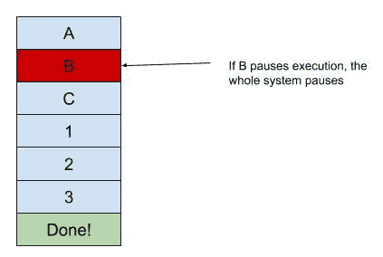
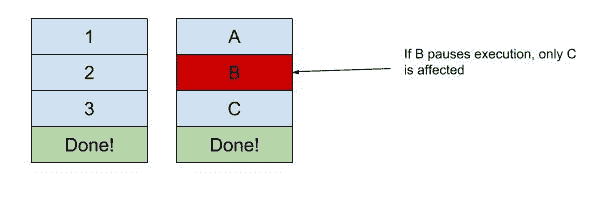
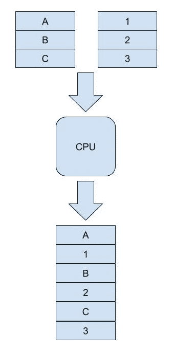
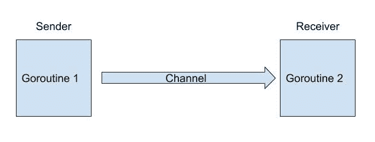

# 并发爬取

当您开始将更多目标网站添加到您的爬取需求中时，最终会达到一个希望能够更快地进行更多调用的点。在单个程序中，爬取延迟可能会为您的爬虫增加额外的时间，从而增加处理其他站点的不必要时间。您在下面的图表中看到问题了吗？



如果这两个网站可以并行运行，就不会有任何干扰。也许访问和解析页面的时间比网站的爬取延迟长，而在第一个响应处理完成之前启动第二个请求可能也能节省时间。看看下面的图表，情况是如何改善的：



在任何这些情况下，您都需要将并发引入您的网络爬虫中。

在本章中，我们将涵盖以下主题：

+   并发是什么

+   并发陷阱

+   Go 并发模型

+   同步包助手

# 并发是什么

程序中的指令由**中央处理单元**（**CPU**）运行。这个 CPU 可以运行多个线程，可以同时处理不同任务的指令。这是通过在两个任务之间切换并以交替方式执行指令来实现的，就像拉动拉链的两侧一样。这种重叠执行任务的方式称为并发。为了简单起见，我们将描述它为同时执行多个任务。下面的图表显示了它可能的外观：



并发不应与并行混淆，其中两个事物或指令可以实际上同时执行。

通过向您的网络爬虫引入并发架构，您将能够在不等待一个站点响应的情况下对不同站点进行多次网络请求。这样，一个慢站点或与一个服务器的连接不佳只会影响到爬取特定站点的任务，而不会影响其他站点。由于网络爬取中花费的大部分时间是在网络通信上，这是您问题的一个很好的解决方案。

构建具有并发架构的程序有时可能是一项艰巨的任务，因为它会引发一系列需要考虑的新问题。当多个线程运行时，它们通常需要一些用于通信的机制，并且必须非常小心地尝试同时修改相同的对象。如果没有经过深思熟虑的方法，您的爬虫将遇到各种问题，这些问题可能非常难以检测和修复。

# 并发陷阱

并发的大部分问题的根源在于如何安全地共享信息，并在多个线程之间提供对该信息的访问。最简单的解决方案似乎是让两个线程都可以访问和修改的对象，以便与另一个线程进行通信。这种看似无害的策略更容易说得比做得。让我们看一个例子，在这个例子中，两个线程共享相同的网页堆栈进行爬取。它们需要知道哪些网页已经完成，另一个线程正在处理哪些网页。

我们将在这个例子中使用一个简单的地图，如下面的代码所示：

```go
siteStatus := map[string]string{
  "http://example.com/page1.html" : "READY",
  "http://example.com/page2.html" : "READY",
  "http://example.com/page3.html" : "READY",
}
```

`"READY"`状态表示该站点尚未被爬取。

# 竞争条件

从一开始，这种策略就存在一个主要问题。如果两个线程同时查看地图，它们会看到`page1.html`已经准备好被爬取。然后它们都会将`page1.html`的值更新为`"WORKING"`，并同时开始爬取同一个站点！这不仅会是重复的工作，还会给[example.com](http://example.com)服务器增加额外的负载。更糟糕的情况是，如果一个线程正在将状态更新为`"WORKING"`，而另一个线程正在尝试读取状态。那么，您的爬虫将崩溃。在 Go 中不允许并发读和/或写操作。

这种情况被称为竞争条件，是您构建并发程序时会遇到的最常见的问题之一。为了防止竞争条件的发生，需要有一种机制，其中一个线程可以阻止所有其他线程访问地图。Go 标准库提供了`sync`包，其中包含许多有用的工具来构建并发应用程序。在我们的特定情况下，`sync.Mutex`将是一个非常有用的工具。

您还可以使用`"-race"`标志与许多 Go 命令（例如：`go run`和`go test`）一起，以帮助检测竞争条件并提供有用的信息。在他们的博客文章中了解更多信息[`blog.golang.org/race-detector`](https://blog.golang.org/race-detector)。

`sync.Mutex`是一个可锁定的对象，就像门上的锁一样，对其他对象起着屏障的作用。为了进入房间，您首先检查门是否被锁上。如果被锁上，您必须等待有人解锁它才能继续。以下代码是在 Go 中如何使用`sync.Mutex`来保护对地图的并发读写的示例：

```go
mtx := *sync.Mutex{}

mtx.Lock()
if siteStatus["http://example.com/page1.html"] == "READY" {
  siteStatus["http://example.com/page1.html"] = "WORKING"
}
mtx.Unlock()
```

当线程调用`mtx.Lock()`时，首先检查是否有其他线程持有的现有锁。如果已经有现有的锁被持有，您的线程将等待直到现有的锁被释放。在任何给定时间只有一个线程可以持有锁，就像之前提到的门一样。

当对象的访问允许并发读取，但必须在进行写操作时保护对象时，`sync`包提供了`sync.RWMutex`结构。这与`sync.Mutex`类似，只是它将锁定分为两个单独的方法：

+   `Lock()` / `Unlock()`: 写操作进行时专门使用的锁

+   `RLock()` / `RUnlock()`: 读操作进行时专门使用的锁

多个线程可以获取读锁而不阻止访问对象，除了试图获取写锁的线程。同样，如果存在写锁，则无法获取读锁。使用`RWMutex`，前面的示例将如下所示：

```go
mtx := *sync.RWMutex{}

mtx.RLock()
if siteStatus["http://example.com/page1.html"] == "READY" {
  mtx.RUnlock()
  mtx.Lock()
  siteStatus["http://example.com/page1.html"] = "WORKING"
  mtx.UnLock()
} else{
  mtx.RUnlock()
}
```

线程在检查地图之前获取读锁，以确保没有进行写操作。然后释放读锁，无论`if`语句是`true`还是`false`，然后在更新地图之前获取写锁。使用这两种类型的互斥锁将有助于保护您的爬虫免受竞争条件的影响。但是，这也可能会增加另一个常见的并发陷阱。

# 死锁

在并发应用程序中添加锁和解锁代码时，有一种情况是您可能会发现您的应用程序完全停止，但没有崩溃。在花费了大量时间挖掘代码，添加额外的打印语句和通过调试器逐步执行之后，您终于看到了它；一个锁没有被释放！这种情况就是所谓的死锁。

Go 标准库没有任何工具来帮助检测和克服死锁。但是，在开源社区中有支持。GitHub 用户`sacha-s`的一个这样的包是`go-deadlock`。`go-deadlock`包提供了`sync.Mutex`和`sync.RWMutex`的一个可替换项，用于监视对象上的锁已经被持有多长时间。默认情况下，当它检测到死锁时，它将退出程序。

死锁超时持续时间和采取的操作都可以通过`deadlock.Opts`对象进行配置，如以下示例所示：

```go
deadlock.Opts.DeadlockTimeout = 120 * time.Second // 2 minute timeout
deadlock.Opts.OnPotentialDeadlock = func() {
  printf("Deadlock detected")
  beginGracefulShutdown()  // This is a hypothetical function
}
```

使用互斥锁和死锁检测是确保并发线程可以在不互相干扰的情况下运行的标准方法之一。这些传统方法是通过 Go 编程语言提供的。然而，它们提供了一个不同的视角，即并发线程应该如何相互通信。

# Go 并发模型

正如您所见，许多并发程序的问题源于多个线程之间共享内存资源。这种共享内存用于通信状态，可能非常脆弱，需要非常小心地确保一切正常运行。在 Go 中，并发是以以下口号为基础的：

*不要通过共享内存进行通信；相反，通过通信共享内存。*

当您在一个共同对象周围使用互斥锁和锁时，您是通过共享内存进行通信。多个线程查看相同的内存位置以通知其他线程并提供信息供其使用。Go 提供了工具来帮助通过通信共享内存。

# Goroutines

直到这一点，我们一直将执行的并发路径称为线程。在 Go 中，实现这一点的同义工具称为**goroutine**。Goroutines 被描述为：

*轻量级执行线程*。

与 C 和 Java 中找到的传统线程不同，goroutines 由 Go 运行时管理，而不是由操作系统线程调度程序管理。这使得 Go 运行时调度程序能够专注于 Go 程序中的任务。它还根据需要利用操作系统线程，提供更精细的操作单元。操作系统线程需要大量的开销来创建每个线程，并且相对较慢地确定应在哪个线程上运行任务。Go 运行时在创建 goroutines 的分离时选择了更小的占用空间，允许更多的 goroutines 同时运行。

创建 goroutines 在 Go 中是一个非常简单的任务。通过在任何函数调用前加上`go`这个词，它将在一个新的 goroutine 中运行该函数。以下示例是一个简单的程序，运行一个小的 goroutine：

```go
package main

import (
 "fmt"
 "time"
)

func startTicker() {
 ticks := 0
 for true {
 fmt.Println(ticks)
 ticks++
 time.Sleep(1 * time.Second)
 }
}

func main() {
 println("Starting ticker")
 go startTicker()
 time.Sleep(10 * time.Second)
}
```

当您运行此代码时，您会看到`startTicker()`中的数字被打印出来，即使主 goroutine 睡眠了 10 秒。如果修改此代码，将`startTicker()`改为`startTicker()`，则此代码将永远运行，每秒打印一次，直到进程被强制终止。

当多个 goroutines 需要相互通信时，Go 为它们提供了一个简单的工具。

# 通道

通道是 goroutines 可以发送和接收信息的通道。这是 Go 共享内存的并发模型的核心所在。通道允许 goroutines 彼此之间进行通信，而不是尝试访问相同的信息。通道也是单向的，意味着数据只能在一个方向流动，如下图所示：



如果需要双向通信，将需要使用两个通道。

在我们之前使用互斥锁的示例中，多个线程试图通过创建释放锁来访问包含每个网站状态的地图。我们可以通过将刮削器线程作为单独的 goroutines 启动，并通过通道将它们的状态传递回主 goroutine 来使用通道作为更安全的方法。这在以下示例中显示：

```go
package main

func scrapeSite(url string, statusChan chan map[string]string) {
  // Performing scraping operations...
  statusChan <- map[string]string{url: "DONE"}
}

func main() {
  siteStatus := map[string]string{
    "http://example.com/page1.html": "READY",
    "http://example.com/page2.html": "READY",
    "http://example.com/page3.html": "READY",
  }

  updatesChan := make(chan map[string]string)

  numberCompleted := 0
  for site := range siteStatus {
    siteStatus[site] = "WORKING"
    go scrapeSite(site, updatesChan)
  }

  for update := range updatesChan {
    for url, status := range update {
      siteStatus[url] = status
      numberCompleted++
    }
    if numberCompleted == len(siteStatus) {
      close(updatesChan)
    }
  }
}
```

在此程序的主函数中，创建了`updatesChan`作为 goroutine 向主 goroutine 提供其状态的手段。这些 goroutine 通过调用 Go `scrapeSite`在第一个`for`循环中启动，该函数接受要爬取的网站的 URL 和对`updatesChan`的引用。然后，主 goroutine 进入第二个`for`循环，监听`updatesChan`传递的数据，为任何 URL 提供新的状态更新。随着每个站点提供更新，完成的站点数量递增，直到所有站点都完成。此时，主 goroutine 关闭通道。

关闭通道会阻止通过该通道发送和接收更多数据。就 for-range 操作而言，这标志着流的结束，退出循环。

通过将通信方法转换为使用通道，共享数据只有一个所有者，并且更新映射的责任重新落在单个 goroutine 身上。这允许每个 goroutine 的工作人员安全地提供状态更新，而无需锁定或共享内存。

# sync 包助手

Goroutine 和通道是 Go 中并发编程的核心构造，它们将提供大部分您所需的实用程序。然而，Go 标准库提供了许多有用的对象，也很有用。我们已经看到了`sync.Mutex`和`sync.RWMutex`的工作原理，但让我们看看其他提供的一些对象。

# 条件

现在，您可以将爬虫任务启动到多个线程中，需要放置一些控件以防止事情失控。在 Go 中，很容易启动 1,000 个 goroutine 同时从单个程序中爬取 1,000 个页面。然而，您的计算机很可能无法承受相同的负载。`sync`包提供了一些实用程序来帮助维护您的网络爬虫的顺序。

您需要放置的一个常见控件是活动并发爬取线程的数量。在启动新的 goroutine 之前，您需要满足某个条件，即活动线程的数量小于某个值。如果此条件未通过检查，您的新 goroutine 将不得不等待，直到收到条件通过的信号。使用`sync.Cond`对象解决了这种情况。

`sync.Cond`对象提供了一种机制，告诉 goroutine 等待直到收到信号，基于任何定义的条件。`sync.Cond`结构包装了一个`sync.Locker`（通常是`sync.Mutex`或`sync.RWMutex`），以控制对条件本身的访问。以下是如何使用`sync.Cond`来控制活动爬虫线程数量的示例：

```go
package main

import (
  "sync"
  "time"
)

var sites []string = []string{
  "http://example.com/site1.html",
  "http://example.com/site2.html",
  "http://example.com/site3.html",
}
var activeThreads = 0
var doneCount = 0
const maxActiveThreads = 1

func scrapeSite(site string, condition *sync.Cond) {
  condition.L.Lock()
  if activeThreads >= maxActiveThreads {
    condition.Wait()
  }
  activeThreads++
  condition.L.Unlock()
  println("scraping " + site)
  // Scraping code goes here ...
  condition.L.Lock()

  activeThreads--
  doneCount++
  condition.L.Unlock()
  condition.Signal()
}

func main() {
  var l = sync.Mutex{}
  var c = sync.NewCond(&l)

  for _, site := range sites {
    println("starting scraper for " + site)
    go scrapeSite(site, c)
  }
  for doneCount < len(sites){
    time.Sleep(1 * time.Second)
  }
  println("Done!")
}
```

这段代码的主要重点在于`scrapeSite()`函数。在代码的这部分中，程序首先检查是否已达到最大并发线程数。如果条件为真，它将等待。这会暂停 goroutine，直到从`sync.Cond`调用`Signal()`或`Broadcast()`。在我们的情况下，我们使用`Signal()`来通知单个 goroutine 条件已经通过，可以继续。如果这里使用`Broadcast()`，它将释放当前正在等待条件的所有 goroutine。一个很好的用例是暂停整个系统以对`fly`进行一些配置更改，然后恢复所有暂停的 goroutine。

# 原子计数器

在上一个例子中，我们用`Lock()`/`Unlock()`包围了`activeThreads`的任何增量或减量。如果需要多次执行此操作，这可能会变得非常冗长，就像我们的情况一样。`sync`包提供了一个名为 atomic 的子包，它提供了更新对象的方法，而无需使用锁。这是通过在每次进行更改时创建一个新变量来完成的，同时防止多次写入同时发生。以下示例显示了使用`activeThreads`作为`atomic`计数器所需的一些更改：

```go
package main

import (
  "sync"
  "sync/atomic"
)
// ...
var activeThreads int32 = 0
// ...
func scrapeSite(site string, condition *sync.Cond) {
 condition.L.Lock()
 if activeThreads >= maxActiveThreads {
 condition.Wait()
 }
 condition.L.Unlock()

 atomic.AddInt32(&activeThreads, 1)
 // Scraping code goes here ...
 atomic.AddInt32(&activeThreads, -1)
 condition.Signal()
}
// ...
```

# 总结

在本章中，我们讨论了许多关于网络爬虫并发性的主题。我们看了并发是什么以及我们如何从中受益。我们回顾了在构建并发程序时必须避免的一些常见问题。我们还了解了 Go 并发模型以及如何使用其原始对象来构建并发的 Go 应用程序。最后，我们看了一些 Go 在其`sync`包中包含的便利功能。在我们的最后一章中，我们将探讨如何将我们的爬虫提升到最高水平。
