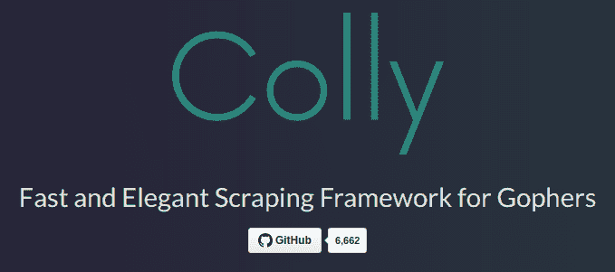

# 100 倍速抓取

到目前为止，您应该对如何构建一个稳固的网页抓取程序有了非常广泛的了解。到目前为止，您已经学会了如何高效、安全和尊重地从互联网收集信息。您手头的工具足以构建小到中等规模的网页抓取程序，这可能正是您需要实现目标的。然而，可能有一天您需要将应用程序升级以处理大型和生产规模的项目。您可能很幸运地能够通过提供服务谋生，随着业务的增长，您将需要一个稳健且可管理的架构。在本章中，我们将回顾构建良好的网页抓取系统的架构组件，并查看开源社区的示例项目。以下是我们将讨论的主题：

+   网页抓取系统的组件

+   使用 colly 抓取 HTML 页面

+   使用 chrome-protocol 抓取 JavaScript 页面

+   使用 dataflowkit 进行分布式抓取

# 网页抓取系统的组件

在第七章中，*并发抓取*，关于并发性，我们看到如何在程序中定义工作 goroutine 和主 goroutine 之间的明确角色分离有助于减轻问题。通过明确地将主 goroutine 赋予维护目标 URL 状态的责任，并允许爬虫线程专注于抓取，我们为构建一个可以轻松扩展各个组件的模块化系统奠定了基础。这种关注点的分离是构建任何大型系统的基础。

网页抓取系统由一些主要组件组成。如果这些组件得到适当解耦，每个组件都应该能够独立扩展而不影响系统的其他部分。如果您可以将此系统分解为自己的包并在其他项目中重用它，那么您就会知道这种解耦是牢固的。您甚至可能希望将其发布到开源社区！让我们来看看其中一些组件。

# 队列

在网页抓取程序开始收集信息之前，它需要知道去哪里。它还需要知道它已经去过哪里。一个合适的排队系统将实现这两个目标。队列可以以许多不同的方式设置。在许多先前的示例中，我们使用`[]string`或`map[string]string`来保存爬虫应该追踪的目标 URL。这适用于规模较小的网页抓取程序，其中工作被推送到工作线程。

在较大的应用程序中，工作窃取队列将是首选。在工作窃取队列中，工作线程将尽快从队列中获取第一个可用的任务。这样，如果您需要系统增加吞吐量，您只需简单地添加更多的工作线程。在这个系统中，队列不需要关心工作线程的状态，只关注作业的状态。这对于推送给工作线程的系统是有益的，因为它必须知道有多少工作线程，哪些工作线程正在忙碌或空闲，并处理工作线程的上线和下线。

排队系统并不总是主要抓取应用程序的一部分。有许多适合外部队列的解决方案，例如数据库，或者流平台，例如 Redis 和 Kafka。这些工具将支持您的排队系统达到您自己想象的极限。

# 缓存

正如我们在第三章中所看到的，*网络爬虫礼仪*，缓存网页是高效网络爬虫的重要组成部分。有了缓存，我们可以避免从网站请求内容，如果我们知道没有发生变化。在我们之前的例子中，我们使用了一个本地缓存，它将内容保存到本地机器上的一个文件夹中。在具有多台机器的大型网络爬虫中，这会导致问题，因为每台机器都需要维护自己的缓存。拥有一个共享的缓存解决方案将解决这个问题，并提高您的网络爬虫的效率。

解决这个问题有许多不同的方法。就像排队系统一样，数据库可以帮助存储您的信息的缓存。大多数数据库支持存储二进制对象，因此无论您是存储 HTML 页面、图像还是其他任何内容，都可以将其放入数据库中。您还可以包含有关文件的大量元数据，例如恢复日期、过期日期、大小、Etag 等。您可以使用的另一个缓存解决方案是一种云对象存储，例如 Amazon S3、Google Cloud Store 和 Microsoft 对象存储。这些服务通常提供低成本的存储解决方案，模拟文件系统并需要特定的 SDK 或使用它们的 API。您可以使用的第三种解决方案是**网络文件系统**（**NFS**），其中每个节点都会连接。在 NFS 上写入缓存与在本地文件系统上写入缓存对于您的爬虫代码来说是一样的。配置工作机器连接到 NFS 可能会有挑战。每种方法都有自己独特的一套优缺点，具体取决于您自己的设置。

# 存储

在大多数情况下，当您爬取网络时，您将寻找非常具体的信息。这可能相对于网页本身的大小来说是非常少量的数据。由于缓存存储了整个网页的内容，您将需要一些其他存储系统来存储解析后的信息。网络爬虫的存储组件可以是一个简单的文本文件，也可以是一个分布式数据库。

如今，有许多数据库解决方案可满足不同的需求。如果您的数据有许多复杂的关系，那么 SQL 数据库可能适合您。如果您的数据具有更多的嵌套结构，那么您可能需要查看 NoSQL 数据库。还有一些解决方案提供全文索引，以使搜索文档更容易，并且如果您需要将数据与某种时间顺序相关联，则需要时间序列数据库。由于没有一种大小适合所有的解决方案，Go 标准库只通过`sql`包提供了处理最常见数据库系列的包。

`sql`包旨在提供一组用于与 MySQL、PostgreSQL 和 Couchbase 等 SQL 数据库通信的常用函数。为每个这些数据库，都编写了一个单独的驱动程序，以适应`sql`包定义的框架。这些驱动程序以及其他各种驱动程序可以在 GitHub 上找到，并轻松集成到您的项目中。`sql`包的核心提供了用于打开和关闭数据库连接、查询数据库、迭代结果行以及对数据进行插入和修改的方法。通过强制驱动程序的标准接口，Go 允许您更轻松地将数据库替换为另一个 SQL 数据库。

# 日志

在设计爬取系统时经常被忽视的一个系统是日志系统。首先，重要的是要有清晰的日志声明，而不记录太多不必要的项目。这些声明应该通知操作员有关爬取的当前状态以及爬虫遇到的任何错误或成功。这有助于您了解您的网络爬虫的整体健康状况。

最简单的日志记录方法是使用`println()`或`fmt.Println()`类型的语句将消息打印到终端。这对于单个节点来说已经足够好了，但是当你的爬虫发展成分布式架构时，就会出现问题。为了检查系统的运行情况，操作员需要登录每台机器查看日志。如果系统出现实际问题，试图从多个来源拼凑日志可能会很难诊断。这时建立一个适用于分布式计算的日志记录系统将是理想的。

在开源世界中有许多日志记录解决方案。其中比较流行的选择之一是 Graylog。设置 Graylog 服务器是一个简单的过程，需要一个 MongoDB 数据库和一个 Elasticsearch 数据库来支持它。Graylog 定义了一个名为 GELF 的 JSON 格式，用于将日志数据发送到其服务器，并接受非常灵活的键集。Graylog 服务器可以接受来自多个来源的日志流，您还可以定义后处理操作，比如根据用户定义的规则重新格式化数据和发送警报。还有许多其他类似的系统，以及付费服务，提供非常相似的功能。

由于有各种各样的日志记录解决方案，开源社区构建了一个库，简化了与不同系统集成的负担。GitHub 用户`sirupsen`的`logrus`包提供了一个标准的实用程序来编写日志语句，以及一个用于日志格式化的插件架构。许多人已经为日志语句构建了格式化程序，包括一个用于将 GELF 语句发送到 Graylog 服务器的格式化程序。如果您在开发爬虫时决定更改日志服务器，您只需要更改格式化程序，而不是替换所有的日志语句。

# 使用 colly 抓取 HTML 页面

`colly`是 GitHub 上可用的项目之一，涵盖了前面讨论过的大部分系统。由于它依赖于本地缓存和排队系统，这个项目是为在单台机器上运行而构建的。



`colly`中的主要工作对象`Collector`是为了在自己的 goroutine 中运行而构建的，这使您可以同时运行多个`Collector`。这种设计为您提供了同时从多个站点抓取的能力，具有不同的参数，比如爬行延迟、白名单和黑名单以及代理。

`colly`只能处理 HTML 和 XML 文件。它不支持 JavaScript 执行。然而，你会惊讶地发现，纯 HTML 可以收集到多少信息。下面的例子是从 GitHub 的`README`中改编的：

```go
package main

import (
  "github.com/gocolly/colly"
  "fmt"
)

func main() {
  c := colly.NewCollector(colly.AllowedDomains("go-colly.org"))

  // Find and visit all links
  c.OnHTML("a[href]", func(e *colly.HTMLElement) {
    e.Request.Visit(e.Attr("href"))
  })

  c.OnRequest(func(r *colly.Request) {
    fmt.Println("Visiting", r.URL)
  })

  c.Visit("http://go-colly.org/")
}
```

在运行此示例之前，请通过以下方式下载`colly`：

`go get github.com/gocolly/colly/...`

在这个例子中，创建了一个`Collector`，并为`go-colly.org`定义了一个白名单，并使用`OnHTML()`函数定义了一个回调。在这个函数中，它对包含`href`属性的`<a>`标签执行了 CSS 查询。回调指定收集器应该导航到该链接中包含的端点。对于它访问的每个新页面，它重复访问每个链接的过程。使用`OnRequest()`函数向收集器添加了另一个回调。这个回调打印了它访问的每个站点的 URL 名称。正如你所看到的，`Collector`对网站进行了深度优先爬取，因为它会在检查同一页上的其他链接之前尽可能深入地跟踪每个链接。

`colly`提供了许多其他功能，比如遵守`robots.txt`、可扩展的队列存储系统，以及系统中不同事件的各种回调。这个项目是任何只需要 HTML 页面的网络爬虫的绝佳起点。它不需要太多设置，就可以拥有一个灵活的 HTML 页面解析系统。

# 使用 chrome-protocol 抓取 JavaScript 页面

在第五章中，*网页抓取导航*，我们看了一下使用`selenium`和 WebDriver 协议导航需要 JavaScript 的网站。最近开发了另一个协议，它提供了许多更多功能，您可以利用它来驱动 Web 浏览器。Chrome DevTools Protocol 最初是用于 Chrome 浏览器的，但它已被*W3C 的 Web 平台孵化器社区组*采纳为一个项目。主要的 Web 浏览器共同开发了一个称为 DevTools Protocol 的标准协议，以适用于所有他们的浏览器。

DevTools Protocol 允许外部程序连接到 Web 浏览器并发送命令来运行 JavaScript，并从浏览器中收集信息。最重要的是，该协议允许程序按需收集 HTML。这样，如果您正在抓取一个通过 JavaScript 加载搜索结果的网页，您可以等待结果显示，请求 HTML 页面，并继续解析所需的信息。

GitHub 上的`chrome-protocol`项目由 GitHub 用户`4ydx`开发，提供了使用 DevTools Protocol 驱动兼容的 Web 浏览器的访问权限。因为这些浏览器像 Web 服务器一样公开了一个端口，所以您可以在多台机器上运行浏览器。使用`chrome-protocol`包，您可以通过端口连接到浏览器，并开始构建一系列任务，例如：

+   `Navigate`：打开一个网页

+   `FindAll`：通过 CSS 查询搜索元素

+   `Click`：向特定元素发送点击事件

您可以向浏览器发送许多其他操作，通过构建自己的自定义脚本，您可以浏览 JavaScript 网站并收集所需的数据。

# 示例-亚马逊每日优惠

在下面的示例中，我们将使用`chrome-protocol`和`goquery`来检索[amazon.com](http://amazon.com)的每日优惠。这个示例有点复杂，所以程序已经被分成了更小的块，我们将逐个讨论。让我们从包和`import`语句开始，如下面的代码所示：

```go
package main

import (
  "encoding/json"
  "fmt"
  "strings"
  "time"

  "github.com/4ydx/cdp/protocol/dom"
  "github.com/4ydx/chrome-protocol"
  "github.com/4ydx/chrome-protocol/actions"
  "github.com/PuerkitoBio/goquery"
)
```

这段代码块导入了运行程序的其余部分所需的包。我们之前没有见过的一些新包是：

+   `encoding/json`：处理 JSON 数据的 Go 标准库

+   `github.com/4ydx/chrome-protocol`：使用 DevTools Protocol 的开源库

+   `github.com/4ydx/chrome-protocol/actions`：定义 DevTools Protocol 操作的开源库

+   `github.com/4ydx/cdp/protocol/dom`：用于处理 DOM 节点的开源库，与`chrome-protocol`一起使用

导入的其余库应该对您来说很熟悉，因为我们在之前的章节中使用过它们。接下来，我们将定义两个函数：一个用于从亚马逊检索 HTML 页面，另一个用于使用`goquery`解析结果。以下代码显示了检索 HTML 数据的函数：

```go
func getHTML() string {
  browser := cdp.NewBrowser("/usr/bin/google-chrome", 9222, "browser.log")
  handle := cdp.Start(browser, cdp.LogBasic)
  err := actions.EnableAll(handle, 2*time.Second)
  if err != nil {
    panic(err)
  }
  _, err = actions.Navigate(handle, "https://www.amazon.com/gp/goldbox", 
     30*time.Second)
  if err != nil {
    panic(err)}

  var nodes []dom.Node
  retries := 5

  for len(nodes) == 0 && retries > 0 {
    nodes, err = actions.FindAll(
      handle,
      "div.GB-M-COMMON.GB-SUPPLE:first-child #widgetContent",
      10*time.Second)
    retries--
    time.Sleep(1 * time.Second)
  }

  if len(nodes) == 0 || retries == 0 {
    panic("could not find results")
  }

  reply, err := actions.Evaluate(handle, "document.body.outerHTML;", 30*time.Second)
  if err != nil {
    panic(err)
  }

  a := struct{
    Value string
  }{}
  json.Unmarshal([]byte("{\"value\":" + string(*reply.Result.Value)+"}"), &a)
  body := a.Value

  handle.Stop(false)
  browser.Stop()
  return body
}
```

该函数首先打开一个新的 Google Chrome 浏览器实例，并获取其句柄以供将来使用。我们使用`actions.EnableAll()`函数来确保 Chrome 浏览器中发生的所有事件都会被发送回我们的程序，以便我们不会错过任何内容。接下来，我们导航到[`www.amazon.com/gp/goldbox`](https://www.amazon.com/gp/goldbox)，这是亚马逊的每日优惠网页。

如果您使用简单的`GET`命令检索此页面，您将得到一个相当空的 HTML 代码外壳，其中有许多等待运行的 JavaScript 文件。在浏览器中进行请求会自动运行 JavaScript，从而填充剩余的内容。

然后，该函数进入一个`for`循环，检查包含每日交易数据的 HTML 元素以填充页面。`for`循环将每秒检查 5 秒（由重试变量定义），然后找到结果或放弃。如果没有结果，我们将退出程序。接下来，该函数向浏览器发送请求，通过 JavaScript 命令检索`<body>`元素。结果的处理有点棘手，因为需要将回复的值处理为 JSON 字符串，以便返回原始 HTML 内容。一旦内容被解析出来，函数就会返回它。

负责解析 HTML 内容的第二个功能如下：

```go
func parseProducts(htmlBody string) []string {
  rdr := strings.NewReader(htmlBody)
  body, err := goquery.NewDocumentFromReader(rdr)
  if err != nil {
    panic(err)
  }

  products := []string{}
  details := body.Find("div.dealDetailContainer")
  details.Each(func(_ int, detail *goquery.Selection) {
    println(".")
    title := detail.Find("a#dealTitle").Text()
    price := detail.Find("div.priceBlock").Text()

    title = strings.TrimSpace(title)
    price = strings.TrimSpace(price)

    products = append(products, title + "\n"+price)
  })
  return products
}
```

就像我们在第四章中看到的示例*解析 HTML*一样，我们使用`goquery`首先查找包含结果的 HTML 元素。在该容器内，我们遍历每个每日交易项目的详细信息，提取每个项目的标题和价格。然后，我们将每个产品的标题和价格字符串附加到数组中并返回该数组。

`main`函数将这两个功能联系在一起，首先检索 HTML 页面的主体，然后将其传递给解析结果。`main`函数然后打印每个每日交易的标题和价格。`main`函数如下：

```go
func main() {
  println("getting HTML...")
  html := getHTML()
  println("parsing HTML...")
  products := parseProducts(html)

  println("Results:")
  for _, product := range products {
    fmt.Println(product + "\n")
  }
}
```

正如您所看到的，驱动网络浏览器可能比仅使用简单的 HTTP 请求进行抓取更困难，但这是可以做到的。

# 使用 dataflowkit 进行分布式抓取

现在您已经看到了构建完整功能的网络爬虫的进展，我想向您介绍今天已经构建的最完整的 Go 网络爬虫项目。`dataflowkit`，由 GitHub 用户`slotix`创建，是一个功能齐全的网络爬虫，可用于构建可扩展的大规模分布式应用程序。它允许多个后端存储缓存和计算信息，并且能够进行简单的 HTTP 请求以及通过 DevTools 协议驱动浏览器。除此之外，`dataflowkit`还具有命令行界面和 JSON 格式来声明网络爬取脚本。

`dataflowkit`的架构分为两个不同的部分：获取和解析。系统的获取和解析阶段都构建为单独的二进制文件，可以在不同的机器上运行。它们通过 API 通过 HTTP 进行通信，就像您需要发送或接收任何信息一样。通过将它们作为单独的实体运行，获取操作和解析操作可以在系统增长时独立扩展。根据您抓取的网站类型，您可能需要更多的获取器而不是解析器，因为 JavaScript 网站往往需要更多的资源。一旦页面被接收，解析页面通常提供很少的开销。

要开始使用`dataflowkit`，您可以使用以下代码从 GitHub 克隆它：

```go
git clone https://github.com/slotix/dataflowkit
```

或者通过`go get`，使用以下代码：

```go
go get github.com/slotix/dataflowkit/...
```

# 获取服务

获取服务负责通过简单的 HTTP 请求或驱动 Google Chrome 等网络浏览器来检索 HTML 数据。要开始使用获取服务，首先导航到您的本地存储库，然后从`cmd/fetch.d`目录运行`go build`。构建完成后，您可以通过`./fetch.d`启动服务。

在启动获取服务之前，必须先启动一个 Google Chrome 浏览器实例。此实例必须使用`--remote-debugging-port`选项设置（通常为 9222）。您也可以使用`--headless`标志来在不显示任何内容的情况下运行。

获取服务现在已准备好接受命令。您现在应该打开第二个终端窗口，然后导航到`cmd/fetch.cli`目录并运行`go build`。这将构建 CLI 工具，您可以使用它向获取服务发送命令。使用 CLI，您可以告诉获取服务代表您检索网页，如下所示：

```go
./fetch.cli -u example.com
```

这也可以通过向 Fetch 服务的`/fetch`发送简单的 JSON `POST`请求来完成。在 Go 中，您可以编写类似以下代码：

```go
package main

import (
  "bytes"
  "encoding/json"
  "fmt"
  "io/ioutil"
  "net/http"

  "github.com/slotix/dataflowkit/fetch"
)

func main() {
  r := fetch.Request{
    Type: "base",
    URL: "http://example.com",
    Method: "GET",
    UserToken: "randomString",
    Actions: "",
  }

  data, err := json.Marshal(&r)

  if err != nil {
    panic(err)
  }
  resp, err := http.Post("http://localhost:8000/fetch", "application/json", bytes.NewBuffer(data))
  if err != nil {
    panic(err)
  }

  body, err := ioutil.ReadAll(resp.Body)
  if err != nil {
    panic(err)
  }

  fmt.Println(string(body))
}
```

`fetch.Request`对象是构造我们的`POST`请求数据的便捷方式，`json`库使其易于附加为请求主体。您已经在早期章节中看到了大部分其他代码。在此示例中，我们使用的是基本类型的抓取器，它仅使用 HTTP 请求。如果我们需要驱动浏览器，我们将能够在我们的请求中向浏览器发送操作。

操作作为表示一小部分命令的 JSON 对象数组发送。目前，只支持点击和分页命令。如果要向浏览器发送`click`命令，您的 Fetch 请求将类似于以下示例：

```go
r := fetch.Request{
    Type: "chrome",
    URL: "http://example.com",
    Method: "GET",
    UserToken: "randomString",
    Actions: `[{"click":{"element":"a"}}]`,
}
```

通过与外部 Fetch 服务通信，您可以轻松控制 HTTP 请求和驱动 Web 浏览器之间的切换。结合远程执行的强大功能，您可以确保为正确的工作选择正确的机器。

# Parse 服务

Parse 服务负责从 HTML 页面中解析数据并以易于使用的格式返回，例如 CSV、XML 或 JSON。Parse 服务依赖于 Fetch 服务来检索页面，并且不能独立运行。要开始使用 Parse 服务，首先导航到本地存储库，然后从`cmd/parse.d`目录运行`go build`。构建完成后，可以通过`./parse.d`启动服务。在配置 Parse 服务时，可以设置许多选项，这些选项将确定它用于缓存结果的后端：如何处理分页、Fetch 服务的位置等。现在，我们将使用标准默认值。

向 Parse 服务发送命令，您可以使用`POST`请求到`/parse`端点。请求的主体包含有关要打开的站点、如何将 HTML 元素映射到字段以及如何格式化返回的数据的信息。让我们看一下来自第四章的每日交易示例，*解析 HTML*，并为 Parse 服务构建一个请求。首先，我们将查看`package`和`import`语句，如下所示：

```go
package main

import (
  "bytes"
  "encoding/json"
  "fmt"
  "io/ioutil"
  "net/http"

  "github.com/slotix/dataflowkit/fetch"
  "github.com/slotix/dataflowkit/scrape"
)
```

在这里，您可以看到我们导入了必要的`dataflowkit`包。`fetch`包在此示例中用于构建要发送到 Fetch 服务的 Parse 服务请求。您可以在`main`函数中看到它，如下所示：

```go
func main() {
  r := scrape.Payload{
    Name: "Daily Deals",
    Request: fetch.Request{
      Type: "Base",
      URL: "https://www.packtpub.com/latest-releases",
      Method: "GET",
    },
    Fields: []scrape.Field{
      {
        Name: "Title",
        Selector: `div.landing-page-row div[itemtype$="/Product"]  
         div.book-block-title`,
        Extractor: scrape.Extractor{
          Types: []string{"text"},
          Filters: []string{"trim"},
        },
      }, {
        Name: "Price",
        Selector: `div.landing-page-row div[itemtype$="/Product"] div.book-block-
        price-discounted`,
        Extractor: scrape.Extractor{
          Types: []string{"text"},
          Filters: []string{"trim"},
        },
      },
    },
    Format: "CSV",
  }
```

这个`scrape.Payload`对象是我们用来与 Parse 服务通信的对象。它定义了要发送到 Fetch 服务的请求，以及如何收集和格式化我们的数据。在我们的例子中，我们想收集两个字段的行：标题和价格。我们使用 CSS 选择器来定义字段的位置以及从哪里提取数据。此程序将使用的`Extractor`是文本提取器，它将复制匹配元素的所有内部文本。

最后，我们向 Parse 服务发送请求并等待结果，如下例所示：

```go
  data, err := json.Marshal(&r)

  if err != nil {
    panic(err)
  }
  resp, err := http.Post("http://localhost:8001/parse", "application/json", 
  bytes.NewBuffer(data))
  if err != nil {
    panic(err)
  }

  body, err := ioutil.ReadAll(resp.Body)
  if err != nil {
    panic(err)
  }

  fmt.Println(string(body))
}
```

Parse 服务以 JSON 对象的形式回复，总结了整个过程，包括我们可以在其中找到包含结果的文件，如下例所示：

```go
{
  "Output file":"results/f5ae68fa_2019-01-13_22:53.CSV",
  "Requests":{
    "initial":1
  },
  "Responses":1,
  "Task ID":"1Fk0qAso17vNnKpzddCyWUcVv6r",
  "Took":"3.209452023s"
}
```

Parse 服务提供的便利性使您作为用户可以更有创意地构建。通过开源和可组合的系统，您可以从坚实的基础开始，并运用您最好的技能来构建完整的系统。您已经掌握了足够的知识和工具来构建高效和强大的系统，但我希望您的学习不会止步于此！

# 总结

在本章中，我们深入研究了构建稳健网络抓取系统的组件。我们使用`colly`来抓取不需要 JavaScript 的 HTML 页面。我们使用`chrome-protocol`来驱动网络浏览器抓取需要 JavaScript 的网站。最后，我们研究了`dataflowkit`，看到了它的架构如何为构建分布式网络爬虫打开了大门。在使用 Go 构建分布式系统方面还有更多的知识和工作要学习和做，但这就是本书的范围所在。我希望你能阅读一些其他关于在 Go 中构建应用程序的出版物，并继续磨练你的技能！
