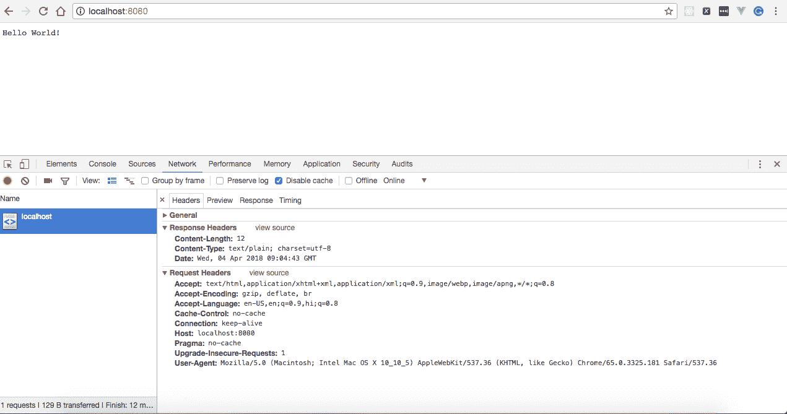
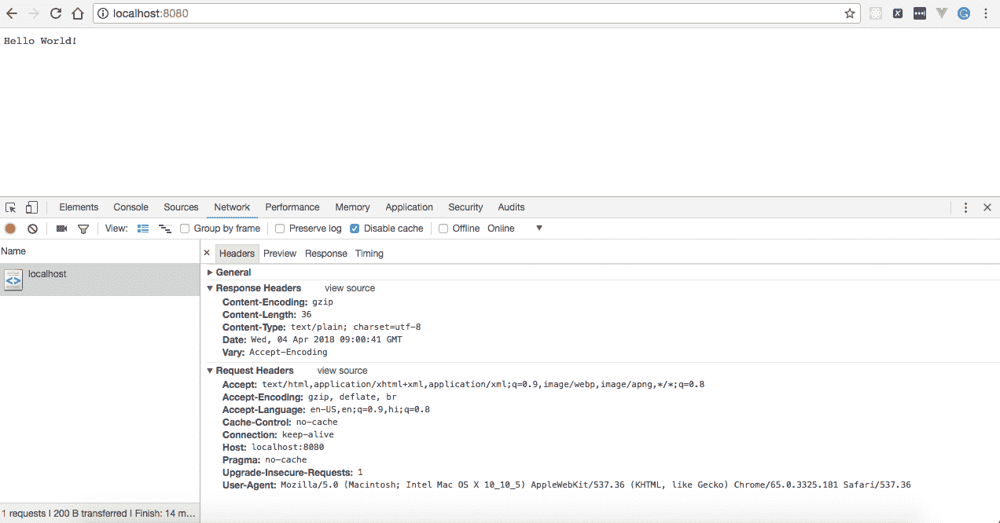
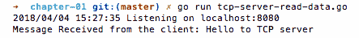
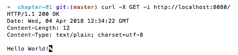
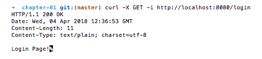
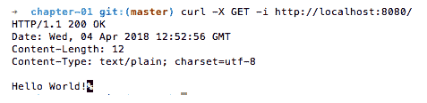
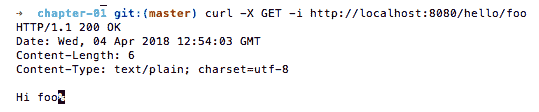
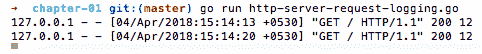
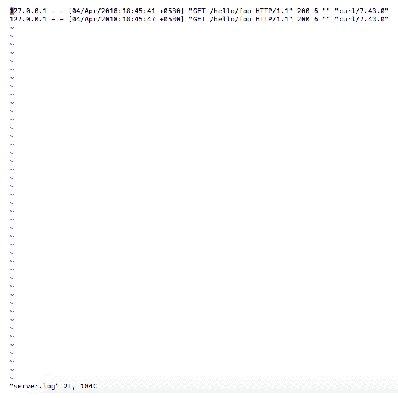

# 第一章：在 Go 中创建你的第一个服务器

在本章中，我们将涵盖以下内容：

+   创建一个简单的 HTTP 服务器

+   在一个简单的 HTTP 服务器上实现基本身份验证

+   使用 GZIP 压缩优化 HTTP 服务器响应

+   创建一个简单的 TCP 服务器

+   从 TCP 连接读取数据

+   向 TCP 连接写入数据

+   实现 HTTP 请求路由

+   使用 Gorilla Mux 实现 HTTP 请求路由

+   记录 HTTP 请求

# 介绍

Go 是为了解决多核处理器的新架构带来的问题而创建的，它创建了高性能网络，可以处理数百万个请求和计算密集型任务。Go 的理念是通过实现快速原型设计、减少编译和构建时间以及实现更好的依赖管理来提高生产力。

与大多数其他编程语言不同，Go 提供了`net/http`包，用于创建 HTTP 客户端和服务器。本章将介绍在 Go 中创建 HTTP 和 TCP 服务器。

我们将从一些简单的示例开始，创建一个 HTTP 和 TCP 服务器，并逐渐转向更复杂的示例，其中我们实现基本身份验证、优化服务器响应、定义多个路由和记录 HTTP 请求。我们还将涵盖 Go 处理程序、Goroutines 和 Gorilla 等概念和关键字-Go 的 Web 工具包。

# 创建一个简单的 HTTP 服务器

作为程序员，如果你需要创建一个简单的 HTTP 服务器，那么你可以很容易地使用 Go 的`net/http`包来编写，我们将在这个示例中介绍。

# 如何做…

在这个示例中，我们将创建一个简单的 HTTP 服务器，当我们在浏览器中浏览`http://localhost:8080`或在命令行中执行`curl` `http://localhost:8080`时，它将呈现 Hello World！执行以下步骤：

1.  创建`http-server.go`并复制以下内容：

```go
package main
import 
(
  "fmt"
  "log"
  "net/http"
)
const 
(
  CONN_HOST = "localhost"
  CONN_PORT = "8080"
)
func helloWorld(w http.ResponseWriter, r *http.Request) 
{
  fmt.Fprintf(w, "Hello World!")
}
func main() 
{
  http.HandleFunc("/", helloWorld)
  err := http.ListenAndServe(CONN_HOST+":"+CONN_PORT, nil)
  if err != nil 
  {
    log.Fatal("error starting http server : ", err)
    return
  }
}
```

1.  使用以下命令运行程序：

```go
$ go run http-server.go
```

# 它是如何工作的…

一旦我们运行程序，一个 HTTP 服务器将在本地监听端口`8080`。在浏览器中打开`http://localhost:8080`将显示来自服务器的 Hello World！，如下面的屏幕截图所示：



你好，世界！

让我们理解程序中每一行的含义：

+   `package main`: 这定义了程序的包名称。

+   `import ( "fmt" "log" "net/http" )`: 这是一个预处理命令，告诉 Go 编译器包括`fmt`、`log`和`net/http`包中的所有文件。

+   `const ( CONN_HOST = "localhost" CONN_PORT = "8080" )`: 我们使用`const`关键字在 Go 程序中声明常量。这里我们声明了两个常量-一个是`CONN_HOST`，值为 localhost，另一个是`CONN_PORT`，值为`8080`。

+   `func helloWorld(w http.ResponseWriter, r *http.Request) { fmt.Fprintf(w, "Hello World!") }`: 这是一个 Go 函数，它以`ResponseWriter`和`Request`作为输入，并在 HTTP 响应流上写入`Hello World!`。

接下来，我们声明了`main()`方法，程序执行从这里开始，因为这个方法做了很多事情。让我们逐行理解它：

+   `http.HandleFunc("/", helloWorld)`: 在这里，我们使用`net/http`包的`HandleFunc`注册了`helloWorld`函数与`/`URL 模式，这意味着每当我们访问具有模式`/`的 HTTP URL 时，`helloWorld`会被执行，并将`(http.ResponseWriter`, `*http.Request)`作为参数传递给它。

+   `err := http.ListenAndServe(CONN_HOST+":"+CONN_PORT, nil)`: 在这里，我们调用`http.ListenAndServe`来处理每个传入连接的 HTTP 请求，每个连接在一个单独的 Goroutine 中处理。`ListenAndServe`接受两个参数-服务器地址和处理程序。在这里，我们将服务器地址传递为`localhost:8080`，处理程序为`nil`，这意味着我们要求服务器使用`DefaultServeMux`作为处理程序。

+   `if err != nil { log.Fatal("error starting http server : ", err) return}`：在这里，我们检查是否有问题启动服务器。如果有问题，那么记录错误并以状态码`1`退出。

# 在简单的 HTTP 服务器上实现基本身份验证

一旦创建了 HTTP 服务器，您可能希望限制特定用户访问资源，例如应用程序的管理员。如果是这样，那么您可以在 HTTP 服务器上实现基本身份验证，我们将在这个配方中介绍。

# 准备工作

由于我们已经在上一个配方中创建了一个 HTTP 服务器，我们只需扩展它以包含基本身份验证。

# 如何做…

在这个配方中，我们将通过添加`BasicAuth`函数并修改`HandleFunc`来调用它来更新我们在上一个配方中创建的 HTTP 服务器。执行以下步骤：

1.  创建`http-server-basic-authentication.go`并复制以下内容：

```go
package main
import 
(
  "crypto/subtle"
  "fmt"
  "log"
  "net/http"
)
const 
(
  CONN_HOST = "localhost"
  CONN_PORT = "8080"
  ADMIN_USER = "admin"
  ADMIN_PASSWORD = "admin"
)
func helloWorld(w http.ResponseWriter, r *http.Request) 
{
  fmt.Fprintf(w, "Hello World!")
}
func BasicAuth(handler http.HandlerFunc, realm string) http.HandlerFunc {
  return func(w http.ResponseWriter, r *http.Request) 
  {
    user, pass, ok := r.BasicAuth()
    if !ok || subtle.ConstantTimeCompare([]byte(user),
    []byte(ADMIN_USER)) != 1||subtle.ConstantTimeCompare([]byte(pass), 
    []byte(ADMIN_PASSWORD)) != 1 
    {
      w.Header().Set("WWW-Authenticate", `Basic realm="`+realm+`"`)
      w.WriteHeader(401)
      w.Write([]byte("You are Unauthorized to access the
      application.\n"))
      return
    }
    handler(w, r)
  }
}
func main() 
{
  http.HandleFunc("/", BasicAuth(helloWorld, "Please enter your
  username and password"))
  err := http.ListenAndServe(CONN_HOST+":"+CONN_PORT, nil)
  if err != nil 
  {
    log.Fatal("error starting http server : ", err)
    return
  }
}
```

1.  使用以下命令运行程序：

```go
$ go run http-server-basic-authentication.go
```

# 它是如何工作的…

一旦我们运行程序，HTTP 服务器将在本地监听端口`8080`上启动。

一旦服务器启动，在浏览器中访问`http://localhost:8080`将提示您输入用户名和密码。提供`admin`，`admin`将在屏幕上呈现 Hello World！对于其他用户名和密码的组合，它将呈现您未经授权访问应用程序。

要从命令行访问服务器，我们必须在`curl`命令中提供`--user`标志，如下所示：

```go
$ curl --user admin:admin http://localhost:8080/
Hello World!
```

我们还可以使用`base64`编码的`username:password`令牌访问服务器，我们可以从任何网站（例如`https://www.base64encode.org/`）获取，并将其作为`curl`命令中的授权标头传递，如下所示：

```go
$ curl -i -H 'Authorization:Basic YWRtaW46YWRtaW4=' http://localhost:8080/

HTTP/1.1 200 OK
Date: Sat, 12 Aug 2017 12:02:51 GMT
Content-Length: 12
Content-Type: text/plain; charset=utf-8
Hello World!
```

让我们了解我们引入的更改作为这个配方的一部分：

+   `import`函数添加了一个额外的包，`crypto/subtle`，我们将使用它来比较用户输入凭据中的用户名和密码。

+   使用`const`函数，我们定义了两个额外的常量，`ADMIN_USER`和`ADMIN_PASSWORD`，我们将在验证用户时使用它们。

+   接下来，我们声明了一个`BasicAuth()`方法，它接受两个输入参数——一个处理程序，在用户成功验证后执行，和一个领域，返回`HandlerFunc`，如下所示：

```go
func BasicAuth(handler http.HandlerFunc, realm string) http.HandlerFunc 
{
  return func(w http.ResponseWriter, r *http.Request)
  {
    user, pass, ok := r.BasicAuth()
    if !ok || subtle.ConstantTimeCompare([]byte(user),
    []byte(ADMIN_USER)) != 1||subtle.ConstantTimeCompare
    ([]byte(pass),
    []byte(ADMIN_PASSWORD)) != 1
    {
      w.Header().Set("WWW-Authenticate", `Basic realm="`+realm+`"`)
      w.WriteHeader(401)
      w.Write([]byte("Unauthorized.\n"))
      return
    }
    handler(w, r)
  }
}
```

在前面的处理程序中，我们首先使用`r.BasicAuth()`获取请求的授权标头中提供的用户名和密码，然后将其与程序中声明的常量进行比较。如果凭据匹配，则返回处理程序，否则设置`WWW-Authenticate`以及状态码`401`，并在 HTTP 响应流上写入`You are Unauthorized to access the application`。

最后，我们在`main()`方法中引入了一个更改，以从`HandleFunc`中调用`BasicAuth`，如下所示：

```go
http.HandleFunc("/", BasicAuth(helloWorld, "Please enter your username and password"))
```

我们只需传递一个`BasicAuth`处理程序，而不是`nil`或`DefaultServeMux`来处理所有带有 URL 模式为`/`的传入请求。

# 使用 GZIP 压缩优化 HTTP 服务器响应

GZIP 压缩意味着从服务器以`.gzip`格式向客户端发送响应，而不是发送纯文本响应，如果客户端/浏览器支持的话，发送压缩响应总是一个好习惯。

通过发送压缩响应，我们节省了网络带宽和下载时间，最终使页面加载更快。 GZIP 压缩的原理是浏览器发送一个请求标头，告诉服务器它接受压缩内容（`.gzip`和`.deflate`），如果服务器有能力以压缩形式发送响应，则发送压缩形式的响应。如果服务器支持压缩，则它将设置`Content-Encoding: gzip`作为响应标头，否则它将向客户端发送一个纯文本响应，这清楚地表示要求压缩响应只是浏览器的请求，而不是要求。我们将使用 Gorilla 的 handlers 包在这个配方中实现它。

# 如何做…

在本教程中，我们将创建一个带有单个处理程序的 HTTP 服务器，该处理程序将在 HTTP 响应流上写入 Hello World！并使用 Gorilla `CompressHandler`以`.gzip`格式将所有响应发送回客户端。执行以下步骤：

1.  使用大猩猩处理程序，首先我们需要使用`go get`命令安装包，或者手动将其复制到`$GOPATH/src`或`$GOPATH`，如下所示：

```go
$ go get github.com/gorilla/handlers
```

1.  创建`http-server-mux.go`并复制以下内容：

```go
package main
import 
(
  "io"
  "net/http"
  "github.com/gorilla/handlers"
)
const 
(
  CONN_HOST = "localhost"
  CONN_PORT = "8080"
)
func helloWorld(w http.ResponseWriter, r *http.Request) 
{
  io.WriteString(w, "Hello World!")
}
func main() 
{
  mux := http.NewServeMux()
  mux.HandleFunc("/", helloWorld)
  err := http.ListenAndServe(CONN_HOST+":"+CONN_PORT,
  handlers.CompressHandler(mux))
  if err != nil 
  {
    log.Fatal("error starting http server : ", err)
    return
  }
}
```

1.  使用以下命令运行程序：

```go
$ go run http-server-mux.go
```

# 工作原理…

运行程序后，HTTP 服务器将在本地监听端口`8080`。

在浏览器中打开`http://localhost:8080`将显示来自服务器的 Hello World！并显示 Content-Encoding 响应头值 gzip，如下面的屏幕截图所示：



你好，世界！

让我们了解程序中每一行的含义：

+   `package main`：这定义了程序的包名称。

+   `import ( "io" "net/http" "github.com/gorilla/handlers" )`: 这是一个预处理命令，告诉 Go 编译器包括来自`io`、`net/http`和`github.com/gorilla/handlers`包的所有文件。

+   `const ( CONN_HOST = "localhost" CONN_PORT = "8080" )`: 我们使用 const 关键字在 Go 程序中声明常量。在这里，我们声明了两个常量，一个是值为 localhost 的`CONN_HOST`，另一个是值为 8080 的`CONN_PORT`。

+   `func helloWorld(w http.ResponseWriter, r *http.Request) { io.WriteString(w, "Hello World!")}`: 这是一个接受`ResponseWriter`和`Request`作为输入参数并在 HTTP 响应流上写入`Hello World!`的 Go 函数。

接下来，我们声明了`main()`方法，程序的执行从这里开始。由于这个方法做了很多事情，让我们逐行理解它：

+   `mux := http.NewServeMux()`: 这将分配并返回一个新的 HTTP 请求多路复用器（`ServeMux`），它将匹配每个传入请求的 URL 与已注册模式列表，并调用最接近 URL 的模式的处理程序。使用它的好处之一是程序完全控制与服务器一起使用的处理程序，尽管任何使用`DefaultServeMux`注册的处理程序都将被忽略。

+   `http.HandleFunc("/", helloWorld)`: 在这里，我们使用`net/http`包的`HandleFunc`将`helloWorld`函数注册到`/`URL 模式，这意味着每当我们访问具有`/`模式的 HTTP URL 时，`helloWorld`将被执行，并将`(http.ResponseWriter`, `*http.Request)`作为参数传递给它。

+   `err := http.ListenAndServe(CONN_HOST+":"+CONN_PORT, handlers.CompressHandler(mux))`: 在这里，我们调用`http.ListenAndServe`来为我们处理每个传入连接的 HTTP 请求。`ListenAndServe`接受两个参数——服务器地址和处理程序。在这里，我们将服务器地址传递为`localhost:8080`，处理程序为`CompressHandler`，它用`.gzip`处理程序包装我们的服务器以将所有响应压缩为`.gzip`格式。

+   `if err != nil { log.Fatal("error starting http server: ", err) return}`: 在这里，我们检查是否有任何启动服务器的问题。如果有问题，记录错误并以状态码 1 退出。

# 创建一个简单的 TCP 服务器

每当你需要构建高性能导向系统时，编写 TCP 服务器总是优于 HTTP 服务器的最佳选择，因为 TCP 套接字比 HTTP 更轻。Go 支持并提供了一种方便的方法来编写使用`net`包的 TCP 服务器，我们将在本教程中介绍。

# 如何做…

在本教程中，我们将创建一个简单的 TCP 服务器，它将在`localhost:8080`上接受连接。执行以下步骤：

1.  创建`tcp-server.go`并复制以下内容：

```go
package main
import 
(
  "log"
  "net"
)
const 
(
  CONN_HOST = "localhost"
  CONN_PORT = "8080"
  CONN_TYPE = "tcp"
)
func main() 
{
  listener, err := net.Listen(CONN_TYPE, CONN_HOST+":"+CONN_PORT)
  if err != nil 
  {
    log.Fatal("Error starting tcp server : ", err)
  }
  defer listener.Close()
  log.Println("Listening on " + CONN_HOST + ":" + CONN_PORT)
  for 
  {
    conn, err := listener.Accept()
    if err != nil 
    {
      log.Fatal("Error accepting: ", err.Error())
    }
    log.Println(conn)
  }
}
```

1.  使用以下命令运行程序：

```go
$ go run tcp-server.go
```

# 工作原理…

运行程序后，TCP 服务器将在本地监听端口`8080`。

让我们理解程序中每一行的含义：

+   `package main`: 这定义了程序的包名称。

+   `import ( "log" "net")`: 这是一个预处理命令，告诉 Go 编译器包括`log`和`net`包中的所有文件。

+   `const ( CONN_HOST = "localhost" CONN_PORT = "8080" CONN_TYPE = "tcp" )`: 我们使用 const 关键字在 Go 程序中声明常量。在这里，我们声明了三个常量——一个是`CONN_HOST`，值为`localhost`，另一个是`CONN_PORT`，值为`8080`，最后一个是`CONN_TYPE`，值为`tcp`。

接下来，我们从`main()`方法中声明了`main()`方法，程序执行从这里开始。由于这个方法做了很多事情，让我们逐行理解它：

+   `listener, err := net.Listen(CONN_TYPE, CONN_HOST+":"+CONN_PORT)`: 这将在本地端口`8080`上创建一个 TCP 服务器。

+   `if err != nil { log.Fatal("Error starting tcp server: ", err) }`: 在这里，我们检查是否有问题启动 TCP 服务器。如果有问题，就记录错误并以状态码 1 退出。

+   `defer listener.Close()`: 这个延迟语句在应用程序关闭时关闭 TCP 套接字监听器。

接下来，我们在一个常量循环中接受 TCP 服务器的传入请求，如果在接受请求时出现任何错误，我们将记录并退出；否则，我们只是在服务器控制台上打印连接对象，如下所示：

```go
for 
{
  conn, err := listener.Accept()
  if err != nil 
  {
    log.Fatal("Error accepting: ", err.Error())
  }
  log.Println(conn)
}
```

# 从 TCP 连接读取数据

在任何应用程序中最常见的情况之一是客户端与服务器进行交互。TCP 是这种交互中最广泛使用的协议之一。Go 提供了一种方便的方式通过实现缓冲的`Input/Output`来读取传入连接数据，我们将在这个示例中介绍。

# 准备就绪…

由于我们已经在之前的示例中创建了一个 TCP 服务器，我们将更新它以从传入连接中读取数据。

# 如何做…

在这个示例中，我们将更新`main()`方法，调用`handleRequest`方法并传递连接对象以读取和打印服务器控制台上的数据。执行以下步骤：

1.  创建`tcp-server-read-data.go`并复制以下内容：

```go
package main
import 
(
  "bufio"
  "fmt"
  "log"
  "net"
)
const 
(
  CONN_HOST = "localhost"
  CONN_PORT = "8080"
  CONN_TYPE = "tcp"
)
func main() 
{
  listener, err := net.Listen(CONN_TYPE, CONN_HOST+":"+CONN_PORT)
  if err != nil 
  {
    log.Fatal("Error starting tcp server : ", err)
  }
  defer listener.Close()
  log.Println("Listening on " + CONN_HOST + ":" + CONN_PORT)
  for 
  {
    conn, err := listener.Accept()
    if err != nil 
    {
      log.Fatal("Error accepting: ", err.Error())
    }
    go handleRequest(conn)
  }
}
func handleRequest(conn net.Conn) 
{
  message, err := bufio.NewReader(conn).ReadString('\n')
  if err != nil 
  {
    fmt.Println("Error reading:", err.Error())
  }
  fmt.Print("Message Received from the client: ", string(message))
  conn.Close()
}
```

1.  使用以下命令运行程序：

```go
$ go run tcp-server-read-data.go
```

# 工作原理…

一旦我们运行程序，TCP 服务器将在本地端口`8080`上开始监听。从命令行执行`echo`命令将向 TCP 服务器发送消息：

```go
$ echo -n "Hello to TCP server\n" | nc localhost 8080
```

这显然会将其记录到服务器控制台，如下面的屏幕截图所示：



让我们理解这个示例中引入的变化：

1.  首先，我们使用`go`关键字从`main()`方法中调用`handleRequest`，这意味着我们在 Goroutine 中调用函数，如下所示：

```go
func main() 
{
  ...
  go handleRequest(conn)
  ...
}
```

1.  接下来，我们定义了`handleRequest`函数，它将传入的连接读入缓冲区，直到第一个`\n`出现，并在控制台上打印消息。如果在读取消息时出现任何错误，则打印错误消息以及错误对象，最后关闭连接，如下所示：

```go
func handleRequest(conn net.Conn) 
{
  message, err := bufio.NewReader(conn).ReadString('\n')
  if err != nil 
  {
    fmt.Println("Error reading:", err.Error())
  }
  fmt.Print("Message Received: ", string(message))
  conn.Close()
}
```

# 向 TCP 连接写入数据

在任何 Web 应用程序中，另一个常见且重要的情况是向客户端发送数据或响应客户端。Go 提供了一种方便的方式，以字节的形式在连接上写入消息，我们将在这个示例中介绍。

# 准备就绪…

由于我们已经在之前的示例中创建了一个 TCP 服务器，用于读取传入连接的数据，所以我们只需更新它以将消息写回客户端。

# 如何做…

在这个示例中，我们将更新程序中的`handleRequest`方法，以便向客户端写入数据。执行以下步骤：

1.  创建`tcp-server-write-data.go`并复制以下内容：

```go
package main
import 
(
  "bufio"
  "fmt"
  "log"
  "net"
)
const 
(
  CONN_HOST = "localhost"
  CONN_PORT = "8080"
  CONN_TYPE = "tcp"
)
func main() 
{
  listener, err := net.Listen(CONN_TYPE, CONN_HOST+":"+CONN_PORT)
  if err != nil 
  {
    log.Fatal("Error starting tcp server : ", err)
  }
  defer listener.Close()
  log.Println("Listening on " + CONN_HOST + ":" + CONN_PORT)
  for 
  {
    conn, err := listener.Accept()
    if err != nil 
    {
      log.Fatal("Error accepting: ", err.Error())
    }
    go handleRequest(conn)
  }
}
func handleRequest(conn net.Conn) 
{
  message, err := bufio.NewReader(conn).ReadString('\n')
  if err != nil 
  {
    fmt.Println("Error reading: ", err.Error())
  }
  fmt.Print("Message Received:", string(message))
  conn.Write([]byte(message + "\n"))
  conn.Close()
}
```

1.  使用以下命令运行程序：

```go
$ go run tcp-server-write-data.go
```

# 工作原理…

一旦我们运行程序，TCP 服务器将在本地端口`8080`上开始监听。从命令行执行`echo`命令，如下所示：

```go
$ echo -n "Hello to TCP server\n" | nc localhost 8080
```

这将为我们提供来自服务器的以下响应：

```go
Hello to TCP server
```

让我们看看我们在这个示例中引入的更改，以便向客户端写入数据。`handleRequest`中的一切都与上一个示例中完全相同，只是我们引入了一行新的代码，将数据作为字节数组写入连接，如下所示：

```go
func handleRequest(conn net.Conn) 
{
  ...
  conn.Write([]byte(message + "\n"))
  ...
}
```

# 实现 HTTP 请求路由

大多数情况下，您必须在 Web 应用程序中定义多个 URL 路由，这涉及将 URL 路径映射到处理程序或资源。在这个示例中，我们将学习如何在 Go 中实现它。

# 如何做…

在这个示例中，我们将定义三个路由，如`/`、`/login`和`/logout`，以及它们的处理程序。执行以下步骤：

1.  创建`http-server-basic-routing.go`并复制以下内容：

```go
package main
import 
(
  "fmt"
  "log"
  "net/http"
)
const 
(
  CONN_HOST = "localhost"
  CONN_PORT = "8080"
)
func helloWorld(w http.ResponseWriter, r *http.Request) 
{
  fmt.Fprintf(w, "Hello World!")
}
func login(w http.ResponseWriter, r *http.Request) 
{
  fmt.Fprintf(w, "Login Page!")
}
func logout(w http.ResponseWriter, r *http.Request) 
{
  fmt.Fprintf(w, "Logout Page!")
}
func main() 
{
  http.HandleFunc("/", helloWorld)
  http.HandleFunc("/login", login)
  http.HandleFunc("/logout", logout)
  err := http.ListenAndServe(CONN_HOST+":"+CONN_PORT, nil)
  if err != nil 
  {
    log.Fatal("error starting http server : ", err)
    return
  }
}
```

1.  使用以下命令运行程序：

```go
$ go run http-server-basic-routing.go
```

# 它是如何工作的…

一旦我们运行程序，HTTP 服务器将在本地监听端口`8080`，并且从浏览器或命令行访问`http://localhost:8080/`、`http://localhost:8080/login`和`http://localhost:8080/logout`将呈现相应处理程序定义中的消息。例如，从命令行执行`http://localhost:8080/`，如下所示：

```go
$ curl -X GET -i http://localhost:8080/
```

这将为我们提供来自服务器的以下响应：



我们也可以从命令行执行`http://localhost:8080/login`，如下所示：

```go
$ curl -X GET -i http://localhost:8080/login
```

这将为我们提供来自服务器的以下响应：



让我们了解我们编写的程序：

1.  我们首先定义了三个处理程序或 Web 资源，如下所示：

```go
func helloWorld(w http.ResponseWriter, r *http.Request) 
{
  fmt.Fprintf(w, "Hello World!")
}
func login(w http.ResponseWriter, r *http.Request) 
{
  fmt.Fprintf(w, "Login Page!")
}
func logout(w http.ResponseWriter, r *http.Request) 
{
  fmt.Fprintf(w, "Logout Page!")
}
```

在这里，`helloWorld`处理程序在 HTTP 响应流上写入`Hello World!`。类似地，登录和注销处理程序在 HTTP 响应流上写入`Login Page!`和`Logout Page!`。

1.  接下来，我们使用`http.HandleFunc()`在`DefaultServeMux`上注册了三个 URL 路径——`/`、`/login`和`/logout`。如果传入的请求 URL 模式与注册的路径之一匹配，那么相应的处理程序将被调用，并将`(http.ResponseWriter`、`*http.Request)`作为参数传递给它，如下所示：

```go
func main() 
{
  http.HandleFunc("/", helloWorld)
  http.HandleFunc("/login", login)
  http.HandleFunc("/logout", logout)
  err := http.ListenAndServe(CONN_HOST+":"+CONN_PORT, nil)
  if err != nil 
  {
    log.Fatal("error starting http server : ", err)
    return
  }
}
```

# 使用 Gorilla Mux 实现 HTTP 请求路由

Go 的`net/http`包为 HTTP 请求的 URL 路由提供了许多功能。它做得不太好的一件事是动态 URL 路由。幸运的是，我们可以通过`gorilla/mux`包实现这一点，我们将在这个示例中介绍。

# 如何做…

在这个示例中，我们将使用`gorilla/mux`来定义一些路由，就像我们在之前的示例中所做的那样，以及它们的处理程序或资源。正如我们在之前的示例中已经看到的，要使用外部包，首先我们必须使用`go get`命令安装包，或者我们必须手动将其复制到`$GOPATH/src`或`$GOPATH`。我们在这个示例中也会这样做。执行以下步骤：

1.  使用`go get`命令安装`github.com/gorilla/mux`，如下所示：

```go
$ go get github.com/gorilla/mux
```

1.  创建`http-server-gorilla-mux-routing.go`并复制以下内容：

```go
package main
import 
(
  "net/http"
  "github.com/gorilla/mux"
)
const 
(
  CONN_HOST = "localhost"
  CONN_PORT = "8080"
)
var GetRequestHandler = http.HandlerFunc
(
  func(w http.ResponseWriter, r *http.Request) 
  {
    w.Write([]byte("Hello World!"))
  }
)
var PostRequestHandler = http.HandlerFunc
(
  func(w http.ResponseWriter, r *http.Request) 
  {
    w.Write([]byte("It's a Post Request!"))
  }
)
var PathVariableHandler = http.HandlerFunc
(
  func(w http.ResponseWriter, r *http.Request) 
  {
    vars := mux.Vars(r)
    name := vars["name"]
    w.Write([]byte("Hi " + name))
  }
)
func main() 
{
  router := mux.NewRouter()
  router.Handle("/", GetRequestHandler).Methods("GET")
  router.Handle("/post", PostRequestHandler).Methods("POST")
  router.Handle("/hello/{name}", 
  PathVariableHandler).Methods("GET", "PUT")
  http.ListenAndServe(CONN_HOST+":"+CONN_PORT, router)
}
```

1.  使用以下命令运行程序：

```go
$ go run http-server-gorilla-mux-routing.go
```

# 它是如何工作…

一旦我们运行程序，HTTP 服务器将在本地监听端口`8080`，并且从浏览器或命令行访问`http://localhost:8080/`、`http://localhost:8080/post`和`http://localhost:8080/hello/foo`将产生相应处理程序定义中的消息。例如，从命令行执行`http://localhost:8080/`，如下所示：

```go
$ curl -X GET -i http://localhost:8080/
```

这将为我们提供来自服务器的以下响应：



我们也可以从命令行执行`http://localhost:8080/hello/foo`，如下所示：

```go
$ curl -X GET -i http://localhost:8080/hello/foo
```

这将为我们提供来自服务器的以下响应：



让我们了解我们在这个示例中所做的代码更改：

1.  首先，我们定义了`GetRequestHandler`和`PostRequestHandler`，它们只是在 HTTP 响应流上写入一条消息，如下所示：

```go
var GetRequestHandler = http.HandlerFunc
(
  func(w http.ResponseWriter, r *http.Request) 
  {
    w.Write([]byte("Hello World!"))
  }
)
var PostRequestHandler = http.HandlerFunc
(
  func(w http.ResponseWriter, r *http.Request) 
  {
    w.Write([]byte("It's a Post Request!"))
  }
)
```

1.  接下来，我们定义了`PathVariableHandler`，它提取请求路径变量，获取值，并将其写入 HTTP 响应流，如下所示：

```go
var PathVariableHandler = http.HandlerFunc
(
  func(w http.ResponseWriter, r *http.Request) 
  {
    vars := mux.Vars(r)
    name := vars["name"]
    w.Write([]byte("Hi " + name))
  }
)
```

1.  然后，我们将所有这些处理程序注册到`gorilla/mux`路由器中，并对其进行实例化，调用 mux 路由器的`NewRouter()`处理程序，如下所示：

```go
func main() 
{
  router := mux.NewRouter()
  router.Handle("/", GetRequestHandler).Methods("GET")
  router.Handle("/post", PostCallHandler).Methods("POST")
  router.Handle("/hello/{name}", PathVariableHandler).
  Methods("GET", "PUT")
  http.ListenAndServe(CONN_HOST+":"+CONN_PORT, router)
}
```

# 记录 HTTP 请求

在故障排除 Web 应用程序时，记录 HTTP 请求总是很有用，因此记录具有适当消息和记录级别的请求/响应是一个好主意。Go 提供了`log`包，可以帮助我们在应用程序中实现日志记录。然而，在这个示例中，我们将使用 Gorilla 日志处理程序来实现它，因为该库提供了更多功能，比如记录 Apache Combined 日志格式和 Apache Common 日志格式，这些功能目前还不受 Go `log`包支持。

# 准备就绪...

由于我们已经在之前的示例中创建了一个 HTTP 服务器并使用 Gorilla Mux 定义了路由，我们将更新它以整合 Gorilla 日志处理程序。

# 如何做...

让我们使用 Gorilla 处理程序实现日志记录。执行以下步骤：

1.  使用`go get`命令安装`github.com/gorilla/handler`和`github.com/gorilla/mux`包，如下所示：

```go
$ go get github.com/gorilla/handlers
$ go get github.com/gorilla/mux
```

1.  创建`http-server-request-logging.go`并复制以下内容：

```go
package main
import 
(
  "net/http"
  "os"
  "github.com/gorilla/handlers"
  "github.com/gorilla/mux"
)
const 
(
  CONN_HOST = "localhost"
  CONN_PORT = "8080"
)
var GetRequestHandler = http.HandlerFunc
(
  func(w http.ResponseWriter, r *http.Request) 
  {
    w.Write([]byte("Hello World!"))
  }
)
var PostRequestHandler = http.HandlerFunc
(
  func(w http.ResponseWriter, r *http.Request) 
  {
    w.Write([]byte("It's a Post Request!"))
  }
)
var PathVariableHandler = http.HandlerFunc
(
  func(w http.ResponseWriter, r *http.Request) 
  {
    vars := mux.Vars(r)
    name := vars["name"]
    w.Write([]byte("Hi " + name))
  }
)
func main() 
{
  router := mux.NewRouter()
  router.Handle("/", handlers.LoggingHandler(os.Stdout,
  http.HandlerFunc(GetRequestHandler))).Methods("GET")
  logFile, err := os.OpenFile("server.log",
  os.O_WRONLY|os.O_CREATE|os.O_APPEND, 0666)
  if err != nil 
  {
    log.Fatal("error starting http server : ", err)
    return
  }
  router.Handle("/post", handlers.LoggingHandler(logFile,
  PostRequestHandler)).Methods("POST")
  router.Handle("/hello/{name}",
  handlers.CombinedLoggingHandler(logFile,
  PathVariableHandler)).Methods("GET")
  http.ListenAndServe(CONN_HOST+":"+CONN_PORT, router)
}
```

1.  运行程序，使用以下命令：

```go
$ go run http-server-request-logging.go
```

# 它是如何工作的...

一旦我们运行程序，HTTP 服务器将在本地监听端口`8080`。

从命令行执行`GET`请求，如下所示：

```go
$ curl -X GET -i http://localhost:8080/
```

这将在 Apache Common 日志格式中记录请求的详细信息，如下面的屏幕截图所示：



我们也可以从命令行执行`http://localhost:8080/hello/foo`，如下所示：

```go
$ curl -X GET -i http://localhost:8080/hello/foo
```

这将在`server.log`中以 Apache Combined 日志格式记录请求的详细信息，如下面的屏幕截图所示：



让我们了解一下在这个示例中我们做了什么：

1.  首先，我们导入了两个额外的包，一个是`os`，我们用它来打开一个文件。另一个是`github.com/gorilla/handlers`，我们用它来导入用于记录 HTTP 请求的日志处理程序，如下所示：

```go
import ( "net/http" "os" "github.com/gorilla/handlers" "github.com/gorilla/mux" )
```

1.  接下来，我们修改了`main()`方法。使用`router.Handle("/", handlers.LoggingHandler(os.Stdout,`

`http.HandlerFunc(GetRequestHandler))).Methods("GET")`，我们用 Gorilla 日志处理程序包装了`GetRequestHandler`，并将标准输出流作为写入器传递给它，这意味着我们只是要求在控制台上以 Apache Common 日志格式记录每个 URL 路径为`/`的请求。

1.  接下来，我们以只写模式创建一个名为`server.log`的新文件，或者如果它已经存在，则打开它。如果有任何错误，那么记录下来并以状态码 1 退出，如下所示：

```go
logFile, err := os.OpenFile("server.log", os.O_WRONLY|os.O_CREATE|os.O_APPEND, 0666)
if err != nil 
{
  log.Fatal("error starting http server : ", err)
  return
}
```

1.  使用`router.Handle("/post", handlers.LoggingHandler(logFile, PostRequestHandler)).Methods("POST")`，我们用 Gorilla 日志处理程序包装了`GetRequestHandler`，并将文件作为写入器传递给它，这意味着我们只是要求在名为`/hello/{name}`的文件中以 Apache Common 日志格式记录每个 URL 路径为`/post`的请求。

1.  使用`router.Handle("/hello/{name}", handlers.CombinedLoggingHandler(logFile, PathVariableHandler)).Methods("GET")`，我们用 Gorilla 日志处理程序包装了`GetRequestHandler`，并将文件作为写入器传递给它，这意味着我们只是要求在名为`server.log`的文件中以 Apache Combined 日志格式记录每个 URL 路径为`/hello/{name}`的请求。
