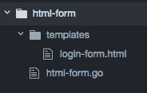
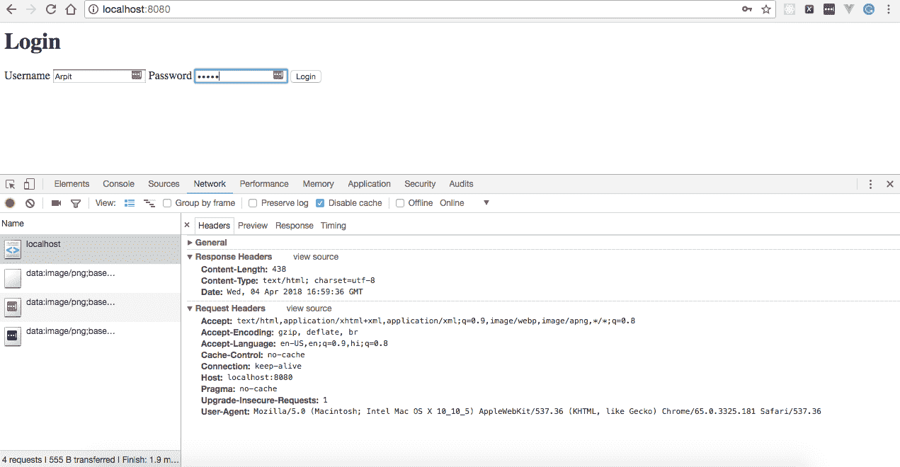
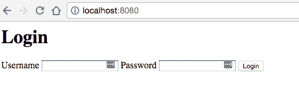
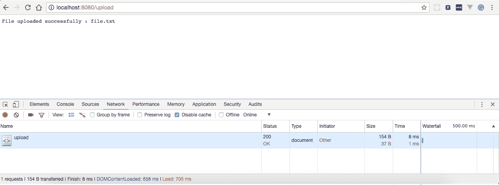

# 第二章：使用模板、静态文件和 HTML 表单

在本章中，我们将涵盖以下内容：

+   创建您的第一个模板

+   通过 HTTP 提供静态文件

+   使用 Gorilla Mux 通过 HTTP 提供静态文件

+   创建您的第一个 HTML 表单

+   阅读您的第一个 HTML 表单

+   验证您的第一个 HTML 表单

+   上传您的第一个文件

# 介绍

我们经常希望创建 HTML 表单，以便以指定的格式从客户端获取信息，将文件或文件夹上传到服务器，并生成通用的 HTML 模板，而不是重复相同的静态文本。有了本章涵盖的概念知识，我们将能够在 Go 中高效地实现所有这些功能。

在本章中，我们将从创建基本模板开始，然后继续从文件系统中提供静态文件，如`.js`、`.css`和`images`，最终创建、读取和验证 HTML 表单，并将文件上传到服务器。

# 创建您的第一个模板

模板允许我们定义动态内容的占位符，可以由模板引擎在运行时替换为值。然后可以将它们转换为 HTML 文件并发送到客户端。在 Go 中创建模板非常容易，使用 Go 的`html/template`包，我们将在本示例中介绍。

# 如何做…

在这个示例中，我们将创建一个`first-template.html`，其中包含一些占位符，其值将在运行时由模板引擎注入。执行以下步骤：

1.  通过执行以下 Unix 命令在`templates`目录中创建`first-template.html`：

```go
$ mkdir templates && cd templates && touch first-template.html
```

1.  将以下内容复制到`first-template.html`中：

```go
<html>
  <head>
    <meta charset="utf-8">
    <title>First Template</title>
    <link rel="stylesheet" href="/static/stylesheets/main.css">
  </head>
  <body>
    <h1>Hello {{.Name}}!</h1>
    Your Id is {{.Id}}
  </body>
</html>
```

上述模板有两个占位符，`{{.Name}}`和`{{.Id}}`，它们的值将由模板引擎在运行时替换或注入。

1.  创建`first-template.go`，在其中我们将为占位符填充值，生成 HTML 输出，并将其写入客户端，如下所示：

```go
import 
(
  "fmt"
  "html/template"
  "log"
  "net/http"
)
const 
(
  CONN_HOST = "localhost"
  CONN_PORT = "8080"
)
type Person struct 
{
  Id   string
  Name string
}
func renderTemplate(w http.ResponseWriter, r *http.Request) 
{
  person := Person{Id: "1", Name: "Foo"}
  parsedTemplate, _ := template.ParseFiles("templates/
  first-template.html")
  err := parsedTemplate.Execute(w, person)
  if err != nil 
  {
    log.Printf("Error occurred while executing the template
    or writing its output : ", err)
    return
  }
}
func main() 
{
  http.HandleFunc("/", renderTemplate)
  err := http.ListenAndServe(CONN_HOST+":"+CONN_PORT, nil)
  if err != nil 
  {
    log.Fatal("error starting http server : ", err)
    return
  }
}
```

一切就绪后，目录结构应如下所示：

！[](img/ab60eb27-0295-4b8a-9c7b-9d85f6c65b55.png)

1.  使用以下命令运行程序：

```go
$ go run first-template.go
```

# 它是如何工作的…

一旦我们运行程序，HTTP 服务器将在本地监听端口`8080`上启动。

浏览`http://localhost:8080`将显示模板引擎提供的 Hello Foo！，如下截图所示：

！[](img/f54a702f-1181-404b-8c55-f0502b2365fb.png)

从命令行执行`curl -X GET http://localhost:8080`如下：

```go
$ curl -X GET http://localhost:8080
```

这将导致服务器返回以下响应：

！[](img/5125ff70-60b0-4b27-a291-1fd30a424f85.png)

让我们了解我们编写的 Go 程序：

+   `type Person struct { Id string Name string }`: 在这里，我们定义了一个`person`结构类型，具有`Id`和`Name`字段。

类型定义中的字段名称应以大写字母开头；否则，将导致错误并且不会在模板中被替换。

接下来，我们定义了一个`renderTemplate()`处理程序，它执行了许多操作。

+   `person := Person{Id: "1", Name: "Foo"}`: 在这里，我们初始化了一个`person`结构类型，其中`Id`为`1`，`Name`为`Foo`。

+   `parsedTemplate, _ := template.ParseFiles("templates/first-template.html")`: 在这里，我们调用`html/template`包的`ParseFiles`，它创建一个新模板并解析我们传入的文件名，即`templates`目录中的`first-template.html`。生成的模板将具有输入文件的名称和内容。

+   `err := parsedTemplate.Execute(w, person)`: 在这里，我们在解析的模板上调用`Execute`处理程序，它将`person`数据注入模板，生成 HTML 输出，并将其写入 HTTP 响应流。

+   `if err != nil {log.Printf("Error occurred while executing the template or writing its output : ", err) return }`: 在这里，我们检查执行模板或将其输出写入响应流时是否出现任何问题。如果有问题，我们将记录错误并以状态码 1 退出。

# 通过 HTTP 提供静态文件

在设计 Web 应用程序时，最好的做法是从文件系统或任何**内容传递网络**（**CDN**）（如 Akamai 或 Amazon CloudFront）提供静态资源，例如`.js`、`.css`和`images`，而不是从 Web 服务器提供。这是因为所有这些类型的文件都是静态的，不需要处理；那么为什么我们要给服务器增加额外的负载呢？此外，它有助于提高应用程序的性能，因为所有对静态文件的请求都将从外部来源提供，并因此减少了对服务器的负载。

Go 的`net/http`包足以通过`FileServer`从文件系统中提供静态资源，我们将在本教程中介绍。

# 准备就绪…

由于我们已经在上一个教程中创建了一个模板，我们将扩展它以从`static/css`目录中提供静态`.css`文件。

# 如何做…

在本教程中，我们将创建一个文件服务器，它将从文件系统中提供静态资源。执行以下步骤：

1.  在`static/css`目录中创建`main.css`，如下所示：

```go
$ mkdir static && cd static && mkdir css && cd css && touch main.css
```

1.  将以下内容复制到`main.css`中：

```go
body {color: #00008B}
```

1.  创建`serve-static-files.go`，在那里我们将创建`FileServer`，它将为所有带有`/static`的 URL 模式从文件系统中的`static/css`目录提供资源，如下所示：

```go
package main
import 
(
  "fmt"
  "html/template"
  "log"
  "net/http"
)
const 
(
  CONN_HOST = "localhost"
  CONN_PORT = "8080"
)
type Person struct 
{
  Name string
  Age string
}
func renderTemplate(w http.ResponseWriter, r *http.Request) 
{
  person := Person{Id: "1", Name: "Foo"}
  parsedTemplate, _ := template.ParseFiles("templates/
  first-template.html")
  err := parsedTemplate.Execute(w, person)
  if err != nil 
  {
    log.Printf("Error occurred while executing the template 
    or writing its output : ", err)
    return
  }
}
func main() 
{
  fileServer := http.FileServer(http.Dir("static"))
  http.Handle("/static/", http.StripPrefix("/static/", fileServer))
  http.HandleFunc("/", renderTemplate)
  err := http.ListenAndServe(CONN_HOST+":"+CONN_PORT, nil)
  if err != nil 
  {
    log.Fatal("error starting http server : ", err)
    return
  }
}
```

1.  更新`first-template.html`（在我们的上一个教程中创建）以包含来自文件系统中的`static/css`目录的`main.css`：

```go
<html>
  <head>
    <meta charset="utf-8">
    <title>First Template</title>
    <link rel="stylesheet" href="/static/css/main.css">
  </head>
  <body>
    <h1>Hello {{.Name}}!</h1>
    Your Id is {{.Id}}
  </body>
</html>
```

一切就绪后，目录结构应如下所示：


1.  使用以下命令运行程序：

```go
$ go run serve-static-files.go
```

# 它是如何工作的…

一旦我们运行程序，HTTP 服务器将在本地监听端口`8080`。浏览`http://localhost:8080`将显示与上一个教程中相同的输出，但是这次文本颜色已从默认的**黑色**更改为**蓝色**，如下图所示：


如果我们查看 Chrome DevTools 的网络选项卡，我们可以看到`main.css`是从文件系统中的`static/css`目录加载的。

让我们了解我们在本教程的`main()`方法中引入的更改：

+   `fileServer := http.FileServer(http.Dir("static"))`：在这里，我们使用`net/http`包的`FileServer`处理程序创建了一个文件服务器，它从文件系统中的`static`目录提供 HTTP 请求。

+   `http.Handle("/static/", http.StripPrefix("/static/", fileServer))`：在这里，我们使用`net/http`包的`HandleFunc`将`http.StripPrefix("/static/", fileServer)`处理程序注册到`/static`URL 模式，这意味着每当我们访问带有`/static`模式的 HTTP URL 时，`http.StripPrefix("/static/", fileServer)`将被执行，并将`(http.ResponseWriter, *http.Request)`作为参数传递给它。

+   `http.StripPrefix("/static/", fileServer)`：这将返回一个处理程序，通过从请求 URL 的路径中删除`/static`来提供 HTTP 请求，并调用文件服务器。`StripPrefix`通过用 HTTP 404 回复处理不以前缀开头的路径的请求。

# 使用 Gorilla Mux 通过 HTTP 提供静态文件

在上一个教程中，我们通过 Go 的 HTTP 文件服务器提供了`static`资源。在本教程中，我们将看看如何通过 Gorilla Mux 路由器提供它，这也是创建 HTTP 路由器的最常见方式之一。

# 准备就绪…

由于我们已经在上一个教程中创建了一个模板，该模板从文件系统中的`static/css`目录中提供`main.css`，因此我们将更新它以使用 Gorilla Mux 路由器。

# 如何做…

1.  使用`go get`命令安装`github.com/gorilla/mux`包，如下所示：

```go
$ go get github.com/gorilla/mux
```

1.  创建`serve-static-files-gorilla-mux.go`，在那里我们将创建一个 Gorilla Mux 路由器，而不是 HTTP`FileServer`，如下所示：

```go
package main
import 
(
  "html/template"
  "log"
  "net/http"
  "github.com/gorilla/mux"
)
const 
(
  CONN_HOST = "localhost"
  CONN_PORT = "8080"
)
type Person struct 
{
  Id string
  Name string
}
func renderTemplate(w http.ResponseWriter, r *http.Request) 
{
  person := Person{Id: "1", Name: "Foo"}
  parsedTemplate, _ := template.ParseFiles("templates/
  first-template.html")
  err := parsedTemplate.Execute(w, person)
  if err != nil 
  {
    log.Printf("Error occurred while executing the template 
    or writing its output : ", err)
    return
  }
}
func main() 
{
  router := mux.NewRouter()
  router.HandleFunc("/", renderTemplate).Methods("GET")
  router.PathPrefix("/").Handler(http.StripPrefix("/static",
  http.FileServer(http.Dir("static/"))))
  err := http.ListenAndServe(CONN_HOST+":"+CONN_PORT, router)
  if err != nil 
  {
    log.Fatal("error starting http server : ", err)
    return
  }
}
```

1.  使用以下命令运行程序：

```go
$ go run serve-static-files-gorilla-mux.go
```

# 它是如何工作的…

一旦我们运行程序，HTTP 服务器将在本地监听端口`8080`上启动。

浏览`http://localhost:8080`将显示与我们上一个示例中看到的相同的输出，如下屏幕截图所示：


让我们了解我们在本示例的`main()`方法中引入的更改：

+   `router :=mux.NewRouter()：在这里，我们调用`mux`路由器的`NewRouter()`处理程序实例化了`gorilla/mux`路由器。

+   `router.HandleFunc("/",renderTemplate).Methods("GET")：在这里，我们使用`renderTemplate`处理程序注册了`/` URL 模式。这意味着`renderTemplate`将对每个 URL 模式为`/`的请求执行。

+   `router.PathPrefix("/").Handler(http.StripPrefix("/static", http.FileServer(http.Dir("static/")))：在这里，我们将`/`注册为一个新的路由，并设置处理程序在调用时执行。

+   `http.StripPrefix("/static", http.FileServer(http.Dir("static/")))：这返回一个处理程序，通过从请求 URL 的路径中删除`/static`并调用文件服务器来提供 HTTP 请求。`StripPrefix`通过回复 HTTP 404 来处理不以前缀开头的路径的请求。

# 创建您的第一个 HTML 表单

每当我们想要从客户端收集数据并将其发送到服务器进行处理时，实现 HTML 表单是最佳选择。我们将在本示例中介绍这个。

# 如何做...

在本示例中，我们将创建一个简单的 HTML 表单，其中包含两个输入字段和一个提交表单的按钮。执行以下步骤：

1.  在`templates`目录中创建`login-form.html`，如下所示：

```go
$ mkdir templates && cd templates && touch login-form.html
```

1.  将以下内容复制到`login-form.html`中：

```go
<html>
  <head>
    <title>First Form</title>
  </head>
  <body>
    <h1>Login</h1>
    <form method="post" action="/login">
      <label for="username">Username</label>
      <input type="text" id="username" name="username">
      <label for="password">Password</label>
      <input type="password" id="password" name="password">
      <button type="submit">Login</button>
    </form>
  </body>
</html>
```

上述模板有两个文本框——`用户名`和`密码`——以及一个登录按钮。

单击登录按钮后，客户端将对在 HTML 表单中定义的操作进行`POST`调用，我们的情况下是`/login`。

1.  创建`html-form.go`，在那里我们将解析表单模板并将其写入 HTTP 响应流，如下所示：

```go
package main
import 
(
  "html/template"
  "log"
  "net/http"
)
const 
(
  CONN_HOST = "localhost"
  CONN_PORT = "8080"
)
func login(w http.ResponseWriter, r *http.Request) 
{
  parsedTemplate, _ := template.ParseFiles("templates/
  login-form.html")
  parsedTemplate.Execute(w, nil)
}
func main() 
{
  http.HandleFunc("/", login)
  err := http.ListenAndServe(CONN_HOST+":"+CONN_PORT, nil)
  if err != nil 
  {
    log.Fatal("error starting http server : ", err)
    return
  }
}
```

一切就绪后，目录结构应如下所示：



1.  使用以下命令运行程序：

```go
$ go run html-form.go
```

# 它是如何工作的...

一旦我们运行程序，HTTP 服务器将在本地监听端口`8080`上启动。浏览`http://localhost:8080`将显示一个 HTML 表单，如下屏幕截图所示：


让我们了解我们编写的程序：

+   `func login(w http.ResponseWriter, r *http.Request) { parsedTemplate, _ := template.ParseFiles("templates/login-form.html") parsedTemplate.Execute(w, nil) }：这是一个接受`ResponseWriter`和`Request`作为输入参数的 Go 函数，解析`login-form.html`并返回一个新模板。

+   `http.HandleFunc("/", login)：在这里，我们使用`net/http`包的`HandleFunc`将登录函数注册到`/` URL 模式，这意味着每次访问`/`模式的 HTTP URL 时，登录函数都会被执行，传递`ResponseWriter`和`Request`作为参数。

+   `err := http.ListenAndServe(CONN_HOST+":"+CONN_PORT, nil)：在这里，我们调用`http.ListenAndServe`来提供处理每个传入连接的 HTTP 请求的服务。`ListenAndServe`接受两个参数——服务器地址和处理程序——其中服务器地址为`localhost:8080`，处理程序为`nil`。

+   `if err != nil { log.Fatal("error starting http server : ", err) return}：在这里，我们检查是否启动服务器时出现问题。如果有问题，记录错误并以状态码`1`退出。

# 阅读您的第一个 HTML 表单

一旦提交 HTML 表单，我们必须在服务器端读取客户端数据以采取适当的操作。我们将在本示例中介绍这个。

# 准备好...

由于我们已经在上一个示例中创建了一个 HTML 表单，我们只需扩展该示例以读取其字段值。

# 如何做...

1.  使用以下命令安装`github.com/gorilla/schema`包：

```go
$ go get github.com/gorilla/schema
```

1.  创建`html-form-read.go`，在这里我们将使用`github.com/gorilla/schema`包解码 HTML 表单字段，并在 HTTP 响应流中写入 Hello，后跟用户名。

```go
package main
import 
(
  "fmt"
  "html/template"
  "log"
  "net/http"
  "github.com/gorilla/schema"
)
const 
(
  CONN_HOST = "localhost"
  CONN_PORT = "8080"
)
type User struct 
{
  Username string
  Password string
}
func readForm(r *http.Request) *User 
{
  r.ParseForm()
  user := new(User)
  decoder := schema.NewDecoder()
  decodeErr := decoder.Decode(user, r.PostForm)
  if decodeErr != nil 
  {
    log.Printf("error mapping parsed form data to struct : ",
    decodeErr)
  }
  return user
}
func login(w http.ResponseWriter, r *http.Request) 
{
  if r.Method == "GET" 
  {
    parsedTemplate, _ := template.ParseFiles("templates/
    login-form.html")
    parsedTemplate.Execute(w, nil)
  } 
  else 
  {
    user := readForm(r)
    fmt.Fprintf(w, "Hello "+user.Username+"!")
  }
}
func main() 
{
  http.HandleFunc("/", login)
  err := http.ListenAndServe(CONN_HOST+":"+CONN_PORT, nil)
  if err != nil 
  {
    log.Fatal("error starting http server : ", err)
    return
  }
}
```

1.  使用以下命令运行程序：

```go
$ go run html-form-read.go
```

# 工作原理...

一旦我们运行程序，HTTP 服务器将在本地监听端口`8080`。浏览`http://localhost:8080`将显示一个 HTML 表单，如下面的屏幕截图所示：



一旦我们输入用户名和密码并单击登录按钮，我们将在服务器的响应中看到 Hello，后跟用户名，如下面的屏幕截图所示：


让我们了解一下我们在这个配方中引入的更改：

1.  使用`import ("fmt" "html/template" "log" "net/http" "github.com/gorilla/schema")`，我们导入了两个额外的包——`fmt`和`github.com/gorilla/schema`——它们有助于将`structs`与`Form`值相互转换。

1.  接下来，我们定义了`User struct`类型，它具有`Username`和`Password`字段，如下所示：

```go
type User struct 
{
  Username string
  Password string
}
```

1.  接下来，我们定义了`readForm`处理程序，它以`HTTP 请求`作为输入参数，并返回`User`，如下所示：

```go
func readForm(r *http.Request) *User {
 r.ParseForm()
 user := new(User)
 decoder := schema.NewDecoder()
 decodeErr := decoder.Decode(user, r.PostForm)
 if decodeErr != nil {
 log.Printf("error mapping parsed form data to struct : ", decodeErr)
 }
 return user
 }
```

让我们详细了解一下这个 Go 函数：

+   `r.ParseForm()`: 在这里，我们将请求体解析为一个表单，并将结果放入`r.PostForm`和`r.Form`中。

+   `user := new(User)`: 在这里，我们创建了一个新的`User struct`类型。

+   `decoder := schema.NewDecoder()`: 在这里，我们正在创建一个解码器，我们将使用它来用`Form`值填充一个用户`struct`。

+   `decodeErr := decoder.Decode(user, r.PostForm)`: 在这里，我们将从`POST`体参数中解码解析的表单数据到一个用户`struct`中。

`r.PostForm`只有在调用`ParseForm`之后才可用。

+   `if decodeErr != nil { log.Printf("error mapping parsed form data to struct : ", decodeErr) }`: 在这里，我们检查是否有任何将表单数据映射到结构体的问题。如果有，就记录下来。

然后，我们定义了一个`login`处理程序，它检查调用处理程序的 HTTP 请求是否是`GET`请求，然后从模板目录中解析`login-form.html`并将其写入 HTTP 响应流；否则，它调用`readForm`处理程序，如下所示：

```go
func login(w http.ResponseWriter, r *http.Request) 
{
  if r.Method == "GET" 
  {
    parsedTemplate, _ := template.ParseFiles("templates/
    login-form.html")
    parsedTemplate.Execute(w, nil)
  } 
  else 
  {
    user := readForm(r)
    fmt.Fprintf(w, "Hello "+user.Username+"!")
  }
}
```

# 验证您的第一个 HTML 表单

大多数情况下，我们在处理客户端输入之前必须对其进行验证，这可以通过 Go 中的许多外部包来实现，例如`gopkg.in/go-playground/validator.v9`、`gopkg.in/validator.v2`和`github.com/asaskevich/govalidator`。

在这个配方中，我们将使用最著名和常用的验证器`github.com/asaskevich/govalidator`来验证我们的 HTML 表单。

# 准备工作...

由于我们已经在上一个配方中创建并读取了一个 HTML 表单，我们只需扩展它以验证其字段值。

# 如何做...

1.  使用以下命令安装`github.com/asaskevich/govalidator`和`github.com/gorilla/schema`包：

```go
$ go get github.com/asaskevich/govalidator
$ go get github.com/gorilla/schema
```

1.  创建`html-form-validation.go`，在这里我们将读取一个 HTML 表单，使用`github.com/gorilla/schema`对其进行解码，并使用`github.com/asaskevich/govalidator`对其每个字段进行验证，验证标签定义在`User struct`中。

```go
package main
import 
(
  "fmt"
  "html/template"
  "log"
  "net/http"
  "github.com/asaskevich/govalidator"
  "github.com/gorilla/schema"
)
const 
(
  CONN_HOST = "localhost"
  CONN_PORT = "8080"
  USERNAME_ERROR_MESSAGE = "Please enter a valid Username"
  PASSWORD_ERROR_MESSAGE = "Please enter a valid Password"
  GENERIC_ERROR_MESSAGE = "Validation Error"
)
type User struct 
{
  Username string `valid:"alpha,required"`
  Password string `valid:"alpha,required"`
}
func readForm(r *http.Request) *User 
{
  r.ParseForm()
  user := new(User)
  decoder := schema.NewDecoder()
  decodeErr := decoder.Decode(user, r.PostForm)
  if decodeErr != nil 
  {
    log.Printf("error mapping parsed form data to struct : ",
    decodeErr)
  }
  return user
}
func validateUser(w http.ResponseWriter, r *http.Request, user *User) (bool, string) 
{
  valid, validationError := govalidator.ValidateStruct(user)
  if !valid 
  {
    usernameError := govalidator.ErrorByField(validationError,
    "Username")
    passwordError := govalidator.ErrorByField(validationError,
    "Password")
    if usernameError != "" 
    {
      log.Printf("username validation error : ", usernameError)
      return valid, USERNAME_ERROR_MESSAGE
    }
    if passwordError != "" 
    {
      log.Printf("password validation error : ", passwordError)
      return valid, PASSWORD_ERROR_MESSAGE
    }
  }
  return valid, GENERIC_ERROR_MESSAGE
}
func login(w http.ResponseWriter, r *http.Request) 
{
  if r.Method == "GET" 
  {
    parsedTemplate, _ := template.ParseFiles("templates/
    login-form.html")
    parsedTemplate.Execute(w, nil)
  } 
  else 
  {
    user := readForm(r)
    valid, validationErrorMessage := validateUser(w, r, user)
    if !valid 
    {
      fmt.Fprintf(w, validationErrorMessage)
      return
    }
    fmt.Fprintf(w, "Hello "+user.Username+"!")
  }
}
func main() 
{
  http.HandleFunc("/", login)
  err := http.ListenAndServe(CONN_HOST+":"+CONN_PORT, nil)
  if err != nil 
  {
    log.Fatal("error starting http server : ", err)
    return
  }
}
```

1.  使用以下命令运行程序：

```go
$ go run html-form-validation.go
```

# 工作原理...

一旦我们运行程序，HTTP 服务器将在本地监听端口`8080`。浏览`http://localhost:8080`将显示一个 HTML 表单，如下面的屏幕截图所示：



然后提交具有有效值的表单：


它将在浏览器屏幕上显示 Hello，后跟用户名，如下面的屏幕截图所示：


在任何字段中提交值为非字母的表单将显示错误消息。例如，提交用户名值为`1234`的表单：


它将在浏览器上显示错误消息，如下面的屏幕截图所示：


此外，我们可以从命令行提交 HTML 表单，如下所示：

```go
$ curl --data "username=Foo&password=password" http://localhost:8080/
```

这将给我们在浏览器中得到的相同输出：


让我们了解一下我们在这个示例中引入的更改：

1.  使用`import ("fmt", "html/template", "log", "net/http" "github.com/asaskevich/govalidator" "github.com/gorilla/schema" )`，我们导入了一个额外的包——`github.com/asaskevich/govalidator`，它可以帮助我们验证结构。

1.  接下来，我们更新了`User struct`类型，包括一个字符串字面标签，`key`为`valid`，`value`为`alpha, required`，如下所示：

```go
type User struct 
{
  Username string `valid:"alpha,required"`
  Password string 
  valid:"alpha,required"
}
```

1.  接下来，我们定义了一个`validateUser`处理程序，它接受`ResponseWriter`、`Request`和`User`作为输入，并返回`bool`和`string`，分别是结构的有效状态和验证错误消息。在这个处理程序中，我们调用`govalidator`的`ValidateStruct`处理程序来验证结构标签。如果在验证字段时出现错误，我们将调用`govalidator`的`ErrorByField`处理程序来获取错误，并将结果与验证错误消息一起返回。

1.  接下来，我们更新了`login`处理程序，调用`validateUser`并将`(w http.ResponseWriter, r *http.Request, user *User)`作为输入参数传递给它，并检查是否有任何验证错误。如果有错误，我们将在 HTTP 响应流中写入错误消息并返回它。

# 上传您的第一个文件

在任何 Web 应用程序中，最常见的情景之一就是上传文件或文件夹到服务器。例如，如果我们正在开发一个求职门户网站，那么我们可能需要提供一个选项，申请人可以上传他们的个人资料/简历，或者，比如说，我们需要开发一个电子商务网站，其中客户可以使用文件批量上传他们的订单。

在 Go 中实现上传文件的功能非常容易，使用其内置的包，我们将在本示例中进行介绍。

# 如何做…

在这个示例中，我们将创建一个带有`file`类型字段的 HTML 表单，允许用户选择一个或多个文件通过表单提交上传到服务器。执行以下步骤：

1.  在`templates`目录中创建`upload-file.html`，如下所示：

```go
$ mkdir templates && cd templates && touch upload-file.html
```

1.  将以下内容复制到`upload-file.html`中：

```go
<html>
  <head>
    <meta charset="utf-8">
    <title>File Upload</title>
  </head>
  <body>
    <form action="/upload" method="post" enctype="multipart/
    form-data">
      <label for="file">File:</label>
      <input type="file" name="file" id="file">
      <input type="submit" name="submit" value="Submit">
    </form>
  </body>
</html>
```

在前面的模板中，我们定义了一个`file`类型的字段，以及一个`Submit`按钮。

点击“提交”按钮后，客户端将对请求的主体进行编码，并对表单操作进行`POST`调用，这在我们的情况下是`/upload`。

1.  创建`upload-file.go`，在其中我们将定义处理程序来渲染文件上传模板，从请求中获取文件，处理它，并将响应写入 HTTP 响应流，如下所示：

```go
package main
import 
(
  "fmt"
  "html/template"
  "io"
  "log"
  "net/http"
  "os"
)
const 
(
  CONN_HOST = "localhost"
  CONN_PORT = "8080"
)
func fileHandler(w http.ResponseWriter, r *http.Request) 
{
  file, header, err := r.FormFile("file")
  if err != nil 
  {
    log.Printf("error getting a file for the provided form key : ",
    err)
    return
  }
  defer file.Close()
  out, pathError := os.Create("/tmp/uploadedFile")
  if pathError != nil 
  {
    log.Printf("error creating a file for writing : ", pathError)
    return
  }
  defer out.Close()
  _, copyFileError := io.Copy(out, file)
  if copyFileError != nil 
  {
    log.Printf("error occurred while file copy : ", copyFileError)
  }
  fmt.Fprintf(w, "File uploaded successfully : "+header.Filename)
}
func index(w http.ResponseWriter, r *http.Request) 
{
  parsedTemplate, _ := template.ParseFiles("templates/
  upload-file.html")
  parsedTemplate.Execute(w, nil)
}
func main() 
{
  http.HandleFunc("/", index)
  http.HandleFunc("/upload", fileHandler)
  err := http.ListenAndServe(CONN_HOST+":"+CONN_PORT, nil)
  if err != nil 
  {
    log.Fatal("error starting http server : ", err)
    return
  }
}
```

一切就绪后，目录结构应该如下所示：


1.  使用以下命令运行程序：

```go
$ go run upload-file.go
```

# 它是如何工作的…

一旦我们运行程序，HTTP 服务器将在本地监听端口`8080`。浏览`http://localhost:8080`将会显示文件上传表单，如下面的屏幕截图所示：


在选择文件后按下“提交”按钮将会在服务器上创建一个名为`uploadedFile`的文件，位于`/tmp`目录中。您可以通过执行以下命令来查看：

****

此外，成功上传将在浏览器上显示消息，如下面的屏幕截图所示：



让我们了解一下我们编写的 Go 程序：

我们定义了`fileHandler()`处理程序，它从请求中获取文件，读取其内容，最终将其写入服务器上的文件。由于这个处理程序做了很多事情，让我们逐步详细介绍一下：

+   `file, header, err := r.FormFile("file")`: 在这里，我们调用 HTTP 请求的`FormFile`处理程序，以获取提供的表单键对应的文件。

+   `if err != nil { log.Printf("error getting a file for the provided form key : ", err) return }`: 在这里，我们检查是否在从请求中获取文件时出现了任何问题。如果有问题，记录错误并以状态码`1`退出。

+   `defer file.Close()`: `defer`语句会在函数返回时关闭`file`。

+   `out, pathError := os.Create("/tmp/uploadedFile")`: 在这里，我们创建了一个名为`uploadedFile`的文件，放在`/tmp`目录下，权限为`666`，这意味着客户端可以读写但不能执行该文件。

+   `if pathError != nil { log.Printf("error creating a file for writing : ", pathError) return }`: 在这里，我们检查在服务器上创建文件时是否出现了任何问题。如果有问题，记录错误并以状态码`1`退出。

+   `_, copyFileError := io.Copy(out, file)`: 在这里，我们将从接收到的文件中的内容复制到`/tmp`目录下创建的文件中。

+   `fmt.Fprintf(w, "File uploaded successfully : "+header.Filename)`: 在这里，我们向 HTTP 响应流写入一条消息和文件名。
