# 在 Go 中处理会话、错误和缓存

在本章中，我们将涵盖以下示例：

+   创建你的第一个 HTTP 会话

+   使用 Redis 管理你的 HTTP 会话

+   创建你的第一个 HTTP cookie

+   在 Go 中实现缓存

+   在 Go 中实现 HTTP 错误处理

+   在 Web 应用程序中实现登录和注销

# 介绍

有时，我们希望在应用程序级别持久保存用户数据等信息，而不是将其持久保存在数据库中，这可以很容易地通过会话和 cookies 来实现。两者之间的区别在于，会话存储在服务器端，而 cookies 存储在客户端。我们还可能需要缓存静态数据，以避免不必要地调用数据库或 Web 服务，并在开发 Web 应用程序时实现错误处理。通过掌握本章涵盖的概念，我们将能够以相当简单的方式实现所有这些功能。

在本章中，我们将从创建一个 HTTP 会话开始，然后学习如何使用 Redis 进行管理，创建 cookies，缓存 HTTP 响应，实现错误处理，最终以在 Go 中实现登录和注销机制结束。

# 创建你的第一个 HTTP 会话

HTTP 是一个无状态协议，这意味着每次客户端检索网页时，客户端都会打开一个独立的连接到服务器，服务器会对其进行响应，而不保留任何关于先前客户端请求的记录。因此，如果我们想要实现一个机制，让服务器知道客户端发送给它的请求，那么我们可以使用会话来实现。

当我们使用会话时，客户端只需要发送一个 ID，数据就会从服务器加载出来。我们可以在 Web 应用程序中实现这三种方式：

+   Cookies

+   隐藏表单字段

+   URL 重写

在这个示例中，我们将使用 HTTP cookies 来实现一个会话。

# 如何做…

1.  使用`go get`命令安装`github.com/gorilla/sessions`包，如下所示：

```go
$ go get github.com/gorilla/sessions
```

1.  创建`http-session.go`，在其中我们将创建一个 Gorilla cookie 存储来保存和检索会话信息，定义三个处理程序—`/login`、`/home`和`/logout`—在这里我们将创建一个有效的会话 cookie，向 HTTP 响应流写入响应，以及分别使会话 cookie 失效，如下所示：

```go
package main
import 
(
  "fmt"
  "log"
  "net/http"
  "github.com/gorilla/sessions"
)
const 
(
  CONN_HOST = "localhost"
  CONN_PORT = "8080"
)
var store *sessions.CookieStore
func init() 
{
  store = sessions.NewCookieStore([]byte("secret-key"))
}
func home(w http.ResponseWriter, r *http.Request) 
{
  session, _ := store.Get(r, "session-name")
  var authenticated interface{} = session.Values["authenticated"]
  if authenticated != nil 
  {
    isAuthenticated := session.Values["authenticated"].(bool)
    if !isAuthenticated 
    {
      http.Error(w, "You are unauthorized to view the page",
      http.StatusForbidden)
      return
    }
    fmt.Fprintln(w, "Home Page")
  } 
  else 
  {
    http.Error(w, "You are unauthorized to view the page",
    http.StatusForbidden)
    return
  }
}
func login(w http.ResponseWriter, r *http.Request) 
{
  session, _ := store.Get(r, "session-name")
  session.Values["authenticated"] = true
  session.Save(r, w)
  fmt.Fprintln(w, "You have successfully logged in.")
}
func logout(w http.ResponseWriter, r *http.Request) 
{
  session, _ := store.Get(r, "session-name")
  session.Values["authenticated"] = false
  session.Save(r, w)
  fmt.Fprintln(w, "You have successfully logged out.")
}
func main() 
{
  http.HandleFunc("/home", home)
  http.HandleFunc("/login", login)
  http.HandleFunc("/logout", logout)
  err := http.ListenAndServe(CONN_HOST+":"+CONN_PORT, nil)
  if err != nil 
  {
    log.Fatal("error starting http server : ", err)
    return
  }
}
```

1.  使用以下命令运行程序：

```go
$ go run http-session.go
```

# 工作原理…

一旦我们运行程序，HTTP 服务器将在本地监听端口`8080`。

接下来，我们将执行一些命令来看会话是如何工作的。

首先，我们将通过执行以下命令访问`/home`：

```go
$ curl -X GET http://localhost:8080/home
```

这将导致服务器显示未经授权的访问消息，如下面的屏幕截图所示：


这是因为我们首先必须登录到一个应用程序，这将创建一个服务器将在提供对任何网页的访问之前验证的会话 ID。所以，让我们登录到应用程序：

```go
$ curl -X GET -i http://localhost:8080/login
```

执行前面的命令将给我们一个`Cookie`，它必须被设置为一个请求头来访问任何网页：

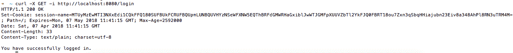

接下来，我们将使用提供的`Cookie`来访问`/home`，如下所示：

```go
$ curl --cookie "session-name=MTUyMzEwMTI3NXxEdi1CQkFFQ180SUFBUkFCRUFBQUpmLUNBQUVHYzNSeWFXNW5EQThBRFdGMWRHaGxiblJwWTJGMFpXUUVZbTl2YkFJQ0FBRT18ou7Zxn3qSbqHHiajubn23Eiv8a348AhPl8RN3uTRM4M=;" http://localhost:8080/home
```

这将导致服务器作为响应的主页：

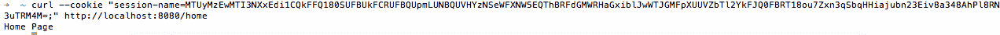

让我们了解我们编写的 Go 程序：

+   使用`var store *sessions.CookieStore`，我们声明了一个私有的 cookie 存储，用来使用安全的 cookies 来存储会话。

+   使用`func init() { store = sessions.NewCookieStore([]byte("secret-key")) }`，我们定义了一个在`main()`之前运行的`init()`函数，用来创建一个新的 cookie 存储并将其分配给`store`。

`init()`函数总是被调用，无论是否有主函数，所以如果你导入一个包含`init`函数的包，它将被执行。

+   接下来，我们定义了一个`home`处理程序，在那里我们从 cookie 存储中获取一个会话，将其添加到注册表中并使用`store.Get`获取`authenticated`键的值。如果为 true，则我们将`Home Page`写入 HTTP 响应流；否则，我们将写入一个`403`HTTP 代码以及消息 You are unauthorized to view the page.。

+   接下来，我们定义了一个`login`处理程序，在那里我们再次获取一个会话，将`authenticated`键设置为`true`，保存它，最后将 You have successfully logged in.写入 HTTP 响应流。

+   接下来，我们定义了一个`logout`处理程序，在那里我们获取一个会话，将一个`authenticated`键设置为`false`，保存它，最后将 You have successfully logged out.写入 HTTP 响应流。

+   最后，我们定义了`main()`，在那里我们将所有处理程序`home`，`login`和`logout`映射到`/home`，`/login`和`/logout`，并在`localhost:8080`上启动 HTTP 服务器。

# 使用 Redis 管理您的 HTTP 会话

在处理分布式应用程序时，我们可能需要为前端用户实现无状态负载平衡。这样我们就可以将会话信息持久化存储在数据库或文件系统中，以便在服务器关闭或重新启动时识别用户并检索他们的信息。

我们将在这个配方的一部分中使用 Redis 作为持久存储来解决这个问题。

# 准备就绪...

由于我们已经在上一个配方中使用 Gorilla cookie 存储创建了一个会话变量，因此我们只需扩展此配方以将会话信息保存在 Redis 中，而不是在服务器上维护它。

Gorilla 会话存储有多种实现，您可以在`https://github.com/gorilla/sessions#store-implementations`找到。由于我们使用 Redis 作为后端存储，我们将使用`https://github.com/boj/redistore`，它依赖于 Redigo Redis 库来存储会话。

这个配方假设您已经在本地端口`6379`和`4567`上安装并运行了 Redis 和 Redis 浏览器。

# 如何做...

1.  使用`go get`命令安装`gopkg.in/boj/redistore.v1`和`github.com/gorilla/sessions`，如下所示：

```go
$ go get gopkg.in/boj/redistore.v1
$ go get github.com/gorilla/sessions
```

1.  创建`http-session-redis.go`，在那里我们将创建一个`RedisStore`来存储和检索会话变量，如下所示：

```go
package main
import 
(
  "fmt"
  "log"
  "net/http"
  "github.com/gorilla/sessions"
  redisStore "gopkg.in/boj/redistore.v1"
)
const 
(
  CONN_HOST = "localhost"
  CONN_PORT = "8080"
)
var store *redisStore.RediStore
var err error
func init() 
{
  store, err = redisStore.NewRediStore(10, "tcp", ":6379", "",
  []byte("secret-key"))
  if err != nil 
  {
    log.Fatal("error getting redis store : ", err)
  }
}
func home(w http.ResponseWriter, r *http.Request) 
{
  session, _ := store.Get(r, "session-name")
  var authenticated interface{} = session.Values["authenticated"]
  if authenticated != nil 
  {
    isAuthenticated := session.Values["authenticated"].(bool)
    if !isAuthenticated 
    {
      http.Error(w, "You are unauthorized to view the page",
      http.StatusForbidden)
      return
    }
    fmt.Fprintln(w, "Home Page")
  } 
  else 
  {
    http.Error(w, "You are unauthorized to view the page",
    http.StatusForbidden)
    return
  }
}
func login(w http.ResponseWriter, r *http.Request) 
{
  session, _ := store.Get(r, "session-name")
  session.Values["authenticated"] = true
  if err = sessions.Save(r, w); err != nil 
  {
    log.Fatalf("Error saving session: %v", err)
  }
  fmt.Fprintln(w, "You have successfully logged in.")
}
func logout(w http.ResponseWriter, r *http.Request) 
{
  session, _ := store.Get(r, "session-name")
  session.Values["authenticated"] = false
  session.Save(r, w)
  fmt.Fprintln(w, "You have successfully logged out.")
}
func main() 
{
  http.HandleFunc("/home", home)
  http.HandleFunc("/login", login)
  http.HandleFunc("/logout", logout)
  err := http.ListenAndServe(CONN_HOST+":"+CONN_PORT, nil)
  defer store.Close()
  if err != nil 
  {
    log.Fatal("error starting http server : ", err)
    return
  }
}
```

1.  使用以下命令运行程序：

```go
$ go run http-session-redis.go
```

# 它是如何工作的...

运行程序后，HTTP 服务器将在本地端口`8080`上开始监听。

接下来，我们将执行一些命令来看看会话是如何工作的。

首先，我们将通过执行以下命令访问`/home`：

```go
$ curl -X GET http://localhost:8080/home
```

这将导致服务器显示未经授权的访问消息，如下面的屏幕截图所示：

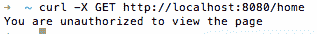

这是因为我们首先必须登录到一个应用程序，这将创建一个服务器将在提供对任何网页的访问之前验证的**会话 ID**。所以，让我们登录到应用程序：

```go
$ curl -X GET -i http://localhost:8080/login
```

执行上一个命令将给我们一个`Cookie`，必须将其设置为请求头以访问任何网页：

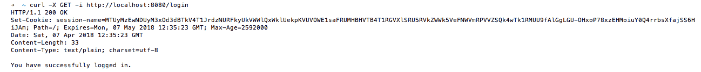

一旦执行了上一个命令，将会创建一个`Cookie`并保存在 Redis 中，您可以通过从`redis-cli`执行命令或在 Redis 浏览器中查看，如下面的屏幕截图所示：

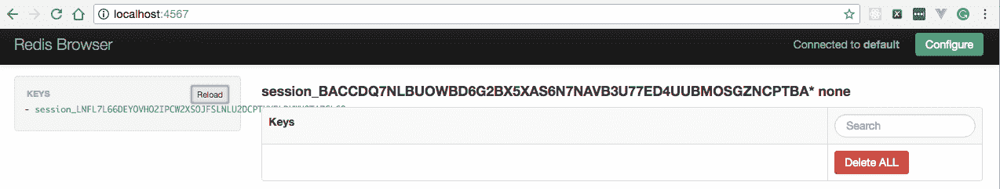

接下来，我们将使用提供的`Cookie`来访问`/home`，如下所示：

```go
$ curl --cookie "session-name=MTUyMzEwNDUyM3xOd3dBTkV4T1JrdzNURFkyUkVWWlQxWklUekpKVUVOWE1saFRUMHBHVTB4T1RGVXlSRU5RVkZWWk5VeFNWVmRPVVZSQk4wTk1RMUU9fAlGgLGU-OHxoP78xzEHMoiuY0Q4rrbsXfajSS6HiJAm;" http://localhost:8080/home
```

这将导致服务器作为响应的主页：

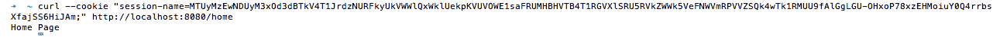

让我们了解我们在这个配方中引入的更改：

1.  使用`var store *redisStore.RediStore`，我们声明了一个私有的`RediStore`来在 Redis 中存储会话。

1.  接下来，我们更新了`init()`函数，使用大小和最大空闲连接数为`10`创建`NewRediStore`，并将其分配给存储。如果在创建存储时出现错误，我们将记录错误并以状态码`1`退出。

1.  最后，我们更新了`main()`，引入了`defer store.Close()`语句，一旦我们从函数返回，就会关闭 Redis 存储。

# 创建你的第一个 HTTP cookie

在客户端存储信息时，cookie 扮演着重要的角色，我们可以使用它们的值来识别用户。基本上，cookie 是为了解决记住用户信息或持久登录身份验证的问题而发明的，这指的是网站能够在会话之间记住主体的身份。

Cookie 是在互联网上访问网站时 Web 浏览器创建的简单文本文件。您的设备会在本地存储这些文本文件，允许您的浏览器访问 cookie 并将数据传递回原始网站，并以名称-值对的形式保存。

# 如何做到这一点...

1.  使用`go get`命令安装`github.com/gorilla/securecookie`包，如下所示：

```go
$ go get github.com/gorilla/securecookie
```

1.  创建`http-cookie.go`，在其中我们将创建一个 Gorilla 安全 cookie 来存储和检索 cookie，如下所示：

```go
package main
import 
(
  "fmt"
  "log"
  "net/http"
  "github.com/gorilla/securecookie"
)
const 
(
  CONN_HOST = "localhost"
  CONN_PORT = "8080"
)
var cookieHandler *securecookie.SecureCookie
func init() 
{
  cookieHandler = securecookie.New(securecookie.
  GenerateRandomKey(64),
  securecookie.GenerateRandomKey(32))
}
func createCookie(w http.ResponseWriter, r *http.Request) 
{
  value := map[string]string
  {
    "username": "Foo",
  }
  base64Encoded, err := cookieHandler.Encode("key", value)
  if err == nil 
  {
    cookie := &http.Cookie
    {
      Name: "first-cookie",
      Value: base64Encoded,
      Path: "/",
    }
    http.SetCookie(w, cookie)
  }
  w.Write([]byte(fmt.Sprintf("Cookie created.")))
}
func readCookie(w http.ResponseWriter, r *http.Request) 
{
  log.Printf("Reading Cookie..")
  cookie, err := r.Cookie("first-cookie")
  if cookie != nil && err == nil 
  {
    value := make(map[string]string)
    if err = cookieHandler.Decode("key", cookie.Value, &value); 
    err == nil 
    {
      w.Write([]byte(fmt.Sprintf("Hello %v \n", 
      value["username"])))
    }
  } 
  else 
  {
    log.Printf("Cookie not found..")
    w.Write([]byte(fmt.Sprint("Hello")))
  }
}

func main() 
{
  http.HandleFunc("/create", createCookie)
  http.HandleFunc("/read", readCookie)
  err := http.ListenAndServe(CONN_HOST+":"+CONN_PORT, nil)
  if err != nil 
  {
    log.Fatal("error starting http server : ", err)
    return
  }
}
```

1.  使用以下命令运行程序：

```go
$ go run http-cookie.go
```

# 它是如何工作的...

一旦我们运行程序，HTTP 服务器将在本地监听端口`8080`。

浏览`http://localhost:8080/read`将在浏览器中显示 Hello，如下面的屏幕截图所示：

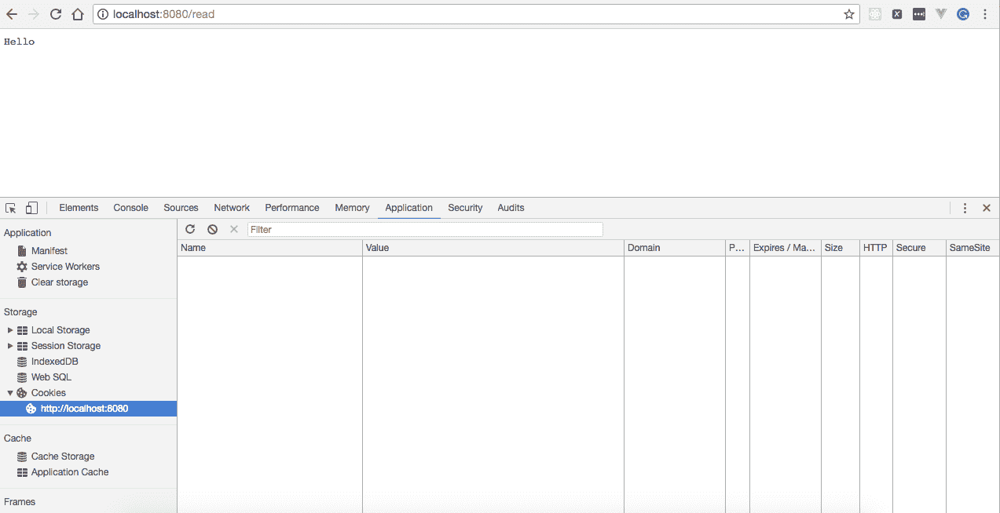

接下来，我们将访问`http://localhost:8080/create`，这将创建一个名为 first-cookie 的 cookie，并在浏览器中显示 Cookie created 消息：

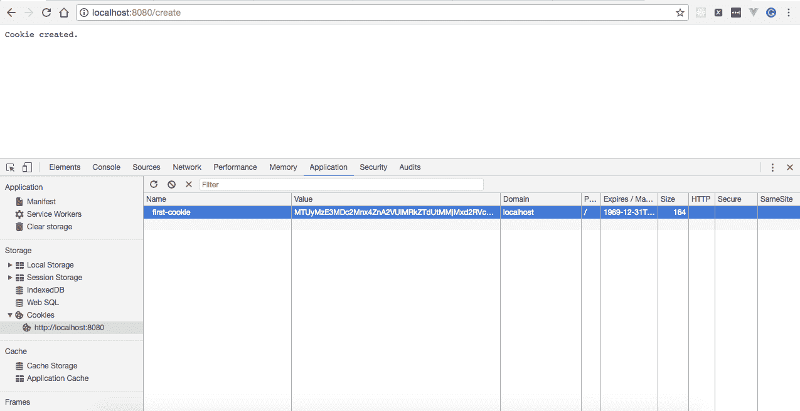

现在，随后访问`http://localhost:8080/read`将使用`first-cookie`来显示 Hello，然后是`first-cookie`的值，如下所示：

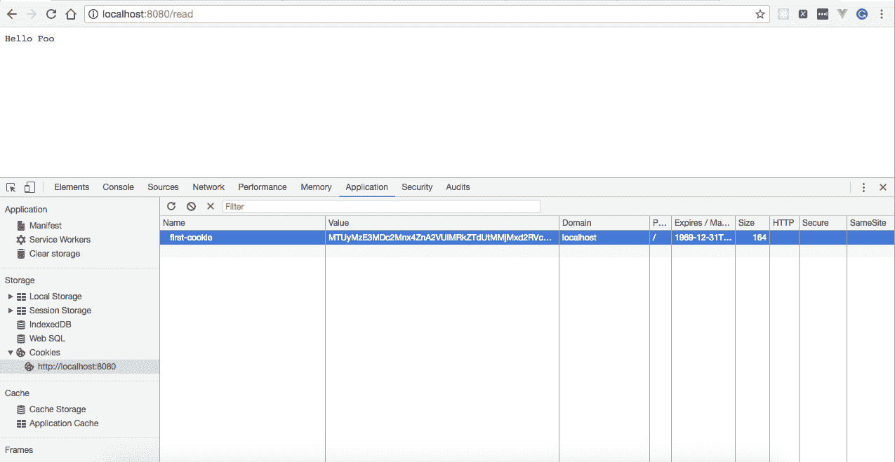

让我们了解我们编写的程序：

+   使用`import ("fmt" "log" "net/http" "github.com/gorilla

/securecookie")`，我们引入了一个额外的包—`github.com/gorilla/securecookie`，我们将使用它来对经过身份验证和加密的 cookie 值进行编码和解码。

+   使用`var cookieHandler *securecookie.SecureCookie`，我们声明了一个私有的安全 cookie。

+   接下来，我们更新了`init()`函数，创建了一个`SecureCookie`，传递了一个 64 字节的哈希密钥，用于使用 HMAC 对值进行身份验证，以及一个 32 字节的块密钥，用于加密值。

+   接下来，我们定义了一个`createCookie`处理程序，在其中使用`gorilla/securecookie`的`Encode`处理程序创建一个以`username`为键，`Foo`为值的`Base64`编码的 cookie。然后，我们向提供的`ResponseWriter`头部添加一个`Set-Cookie`头，并向 HTTP 响应中写入一个`Cookie created.`的消息。

+   接下来，我们定义了一个`readCookie`处理程序，在其中我们从请求中检索一个 cookie，这在我们的代码中是`first-cookie`，为其获取一个值，并将其写入 HTTP 响应。

+   最后，我们定义了`main()`，在其中将所有处理程序—`createCookie`和`readCookie`—映射到`/create`和`/read`，并在`localhost:8080`上启动了 HTTP 服务器。

# 在 Go 中实现缓存

在 Web 应用程序中缓存数据有时是必要的，以避免反复从数据库或外部服务请求静态数据。Go 没有提供任何内置的包来缓存响应，但它通过外部包支持缓存。

有许多包，例如`https://github.com/coocood/freecache`和`https://github.com/patrickmn/go-cache`，可以帮助实现缓存，在本教程中，我们将使用`https://github.com/patrickmn/go-cache`来实现它。

# 如何做到这一点...

1.  使用`go get`命令安装`github.com/patrickmn/go-cache`包，如下所示：

```go
$ go get github.com/patrickmn/go-cache
```

1.  创建`http-caching.go`，在其中我们将在服务器启动时创建一个缓存并填充数据，如下所示：

```go
package main
import 
(
  "fmt"
  "log"
  "net/http"
  "time"
  "github.com/patrickmn/go-cache"
)
const 
(
  CONN_HOST = "localhost"
  CONN_PORT = "8080"
)
var newCache *cache.Cache
func init() 
{
  newCache = cache.New(5*time.Minute, 10*time.Minute)
  newCache.Set("foo", "bar", cache.DefaultExpiration)
}
func getFromCache(w http.ResponseWriter, r *http.Request) 
{
  foo, found := newCache.Get("foo")
  if found 
  {
    log.Print("Key Found in Cache with value as :: ", 
    foo.(string))
    fmt.Fprintf(w, "Hello "+foo.(string))
  } 
  else 
  {
    log.Print("Key Not Found in Cache :: ", "foo")
    fmt.Fprintf(w, "Key Not Found in Cache")
  }
}
func main() 
{
  http.HandleFunc("/", getFromCache)
  err := http.ListenAndServe(CONN_HOST+":"+CONN_PORT, nil)
  if err != nil 
  {
    log.Fatal("error starting http server : ", err)
    return
  }
}
```

1.  使用以下命令运行程序：

```go
$ go run http-caching.go
```

# 它是如何工作的…

一旦我们运行程序，HTTP 服务器将在本地监听端口`8080`。

在启动时，具有名称`foo`和值为`bar`的键将被添加到缓存中。

浏览`http://localhost:8080/`将从缓存中读取一个键值，并将其附加到 Hello，如下截图所示：

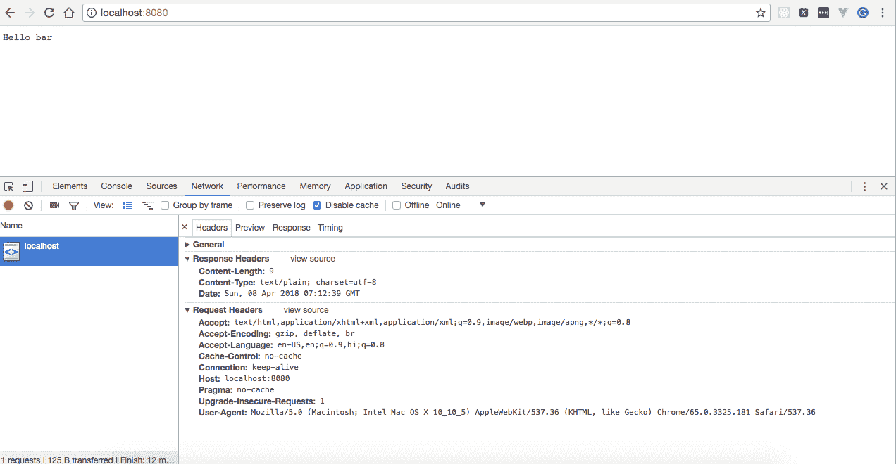

我们在程序中指定了缓存数据的过期时间为五分钟，这意味着我们在服务器启动时在缓存中创建的键在五分钟后将不再存在。因此，五分钟后再次访问相同的 URL 将从服务器返回缓存中找不到键的消息，如下所示：


让我们理解我们编写的程序：

1.  使用`var newCache *cache.Cache`，我们声明了一个私有缓存。

1.  接下来，我们更新了`init()`函数，在其中创建了一个具有五分钟过期时间和十分钟清理间隔的缓存，并向缓存中添加了一个键为`foo`，值为`bar`，过期值为`0`的项目，这意味着我们要使用缓存的默认过期时间。

如果过期持续时间小于一（或`NoExpiration`），则缓存中的项目永远不会过期（默认情况下），必须手动删除。如果清理间隔小于一，则在调用`c.DeleteExpired()`之前不会从缓存中删除过期的项目。

1.  接下来，我们定义了`getFromCache`处理程序，从缓存中检索键的值。如果找到，我们将其写入 HTTP 响应；否则，我们将`Key Not Found in Cache`的消息写入 HTTP 响应。

# 在 Go 中实现 HTTP 错误处理

在任何 Web 应用程序中实现错误处理是主要方面之一，因为它有助于更快地进行故障排除和修复错误。错误处理意味着每当应用程序发生错误时，应该将其记录在某个地方，无论是在文件中还是在数据库中，都应该有适当的错误消息以及堆栈跟踪。

在 Go 中，可以以多种方式实现。一种方法是编写自定义处理程序，我们将在本教程中介绍。

# 如何做…

1.  使用`go get`命令安装`github.com/gorilla/mux`包，如下所示：

```go
$ go get github.com/gorilla/mux
```

1.  创建`http-error-handling.go`，在其中我们将创建一个自定义处理程序，作为处理所有 HTTP 请求的包装器，如下所示：

```go
package main
import 
(
  "errors"
  "fmt"
  "log"
  "net/http"
  "strings"
  "github.com/gorilla/mux"
)
const 
(
  CONN_HOST = "localhost"
  CONN_PORT = "8080"
)
type NameNotFoundError struct 
{
  Code int
  Err error
}
func (nameNotFoundError NameNotFoundError) Error() string 
{
  return nameNotFoundError.Err.Error()
}
type WrapperHandler func(http.ResponseWriter, *http.Request) 
error
func (wrapperHandler WrapperHandler) ServeHTTP(w http.
ResponseWriter, r *http.Request) 
{
  err := wrapperHandler(w, r)
  if err != nil 
  {
    switch e := err.(type) 
    {
      case NameNotFoundError:
      log.Printf("HTTP %s - %d", e.Err, e.Code)
      http.Error(w, e.Err.Error(), e.Code)
      default:
      http.Error(w, http.StatusText(http.
      StatusInternalServerError),
      http.StatusInternalServerError)
    }
  }
}
func getName(w http.ResponseWriter, r *http.Request) error 
{
  vars := mux.Vars(r)
  name := vars["name"]
  if strings.EqualFold(name, "foo") 
  {
    fmt.Fprintf(w, "Hello "+name)
    return nil
  } 
  else 
  {
    return NameNotFoundError{500, errors.New("Name Not Found")}
  }
}
func main() 
{
  router := mux.NewRouter()
  router.Handle("/employee/get/{name}",
  WrapperHandler(getName)).Methods("GET")
  err := http.ListenAndServe(CONN_HOST+":"+CONN_PORT, router)
  if err != nil 
  {
    log.Fatal("error starting http server : ", err)
    return
  }
}
```

1.  使用以下命令运行程序：

```go
$ go run http-error-handling.go
```

# 它是如何工作的…

一旦我们运行程序，HTTP 服务器将在本地监听端口`8080`。

接下来，浏览`http://localhost:8080/employee/get/foo`将在浏览器中作为响应给我们 Hello，后跟员工姓名和状态码为`200`：

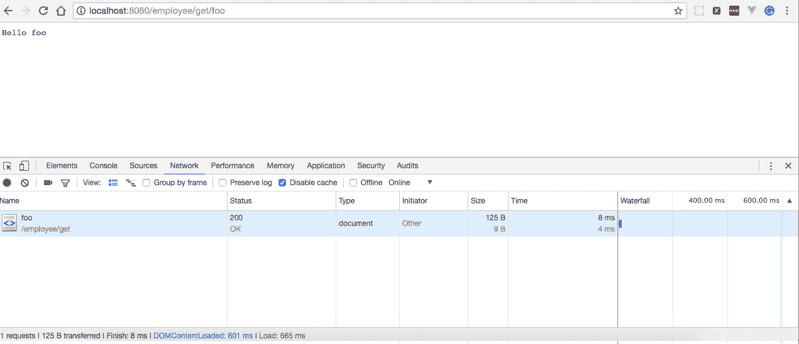

另一方面，访问`http://localhost:8080/employee/get/bar`将返回一个带有消息 Name Not Found 和错误代码`500`的 HTTP 错误：

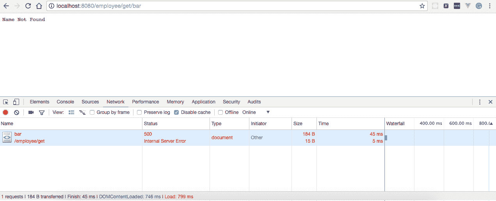

让我们理解我们编写的程序：

1.  我们定义了一个`NameNotFoundError`结构，它有两个字段——类型为`int`的`Code`和类型为`error`的`Err`，它表示一个带有关联 HTTP 状态码的错误，如下所示：

```go
type NameNotFoundError struct 
{
  Code int
  Err error
}
```

1.  然后，我们允许`NameNotFoundError`满足错误接口，如下所示：

```go
func (nameNotFoundError NameNotFoundError) Error() string 
{
  return nameNotFoundError.Err.Error()
}
```

1.  接下来，我们定义了一个用户定义类型`WrapperHandler`，它是一个接受任何接受`func(http.ResponseWriter, *http.Request)`作为输入参数并返回错误的处理程序的 Go 函数。

1.  然后，我们定义了一个`ServeHTTP`处理程序，它调用我们传递给`WrapperHandler`的处理程序，将`(http.ResponseWriter, *http.Request)`作为参数传递给它，并检查处理程序是否返回任何错误。如果有错误，则使用 switch case 适当处理它们，如下所示：

```go
if err != nil 
{
  switch e := err.(type) 
  {
    case NameNotFoundError:
    log.Printf("HTTP %s - %d", e.Err, e.Code)
    http.Error(w, e.Err.Error(), e.Code)
    default:
    http.Error(w, http.StatusText(http.
    StatusInternalServerError),
    http.StatusInternalServerError)
  }
}
```

1.  接下来，我们定义了`getName`处理程序，它提取请求路径变量，获取`name`变量的值，并检查名称是否匹配`foo`。如果是，则将 Hello，后跟名称，写入 HTTP 响应；否则，它将返回一个`Code`字段值为`500`的`NameNotFoundError`结构和一个`err`字段值为`error`的文本`Name Not Found`。

1.  最后，我们定义了`main()`，在其中将`WrapperHandler`注册为 URL 模式`/get/{name}`的处理程序。

# 在 Web 应用程序中实现登录和注销

每当我们希望应用程序只能被注册用户访问时，我们都必须实现一个机制，在允许他们查看任何网页之前要求用户提供凭据，这将在本示例中进行介绍。

# 准备工作…

由于我们已经在之前的示例中创建了一个 HTML 表单，我们只需更新它以使用`gorilla/securecookie`包实现登录和注销机制。

在第二章的*使用模板、静态文件和 HTML 表单*中查看*在 Web 应用程序中实现登录和注销*的示例。

# 如何做…

1.  使用`go get`命令安装`github.com/gorilla/mux`和`github.com/gorilla/securecookie`，如下所示：

```go
$ go get github.com/gorilla/mux
$ go get github.com/gorilla/securecookie
```

1.  在`templates`目录中创建`home.html`，如下所示：

```go
$ mkdir templates && cd templates && touch home.html
```

1.  将以下内容复制到`home.html`：

```go
<html>
  <head>
    <title></title>
  </head>
  <body>
    <h1>Welcome {{.userName}}!</h1>
    <form method="post" action="/logout">
      <button type="submit">Logout</button>
    </form>
  </body>
</html>
```

在上述模板中，我们定义了一个占位符`{{.userName}}`，其值将在运行时由模板引擎替换，以及一个注销按钮。点击注销按钮后，客户端将对表单动作进行`POST`调用，这在我们的例子中是`/logout`。

1.  创建`html-form-login-logout.go`，在这里我们将解析登录表单，读取用户名字段，并在用户点击登录按钮时设置会话 cookie。用户点击注销按钮后，我们也会清除会话，如下所示：

```go
package main
import 
(
  "html/template"
  "log"
  "net/http"
  "github.com/gorilla/mux"
  "github.com/gorilla/securecookie"
)
const 
(
  CONN_HOST = "localhost"
  CONN_PORT = "8080"
)
var cookieHandler = securecookie.New
(
  securecookie.GenerateRandomKey(64),
  securecookie.GenerateRandomKey(32)
)
func getUserName(request *http.Request) (userName string) 
{
  cookie, err := request.Cookie("session")
  if err == nil 
  {
    cookieValue := make(map[string]string)
    err = cookieHandler.Decode("session", cookie.Value,
    &cookieValue)
    if err == nil 
    {
      userName = cookieValue["username"]
    }
  }
  return userName
}
func setSession(userName string, response http.ResponseWriter) 
{
  value := map[string]string
  {
    "username": userName,
  }
  encoded, err := cookieHandler.Encode("session", value)
  if err == nil 
  {
    cookie := &http.Cookie
    {
      Name: "session",
      Value: encoded,
      Path: "/",
    }
    http.SetCookie(response, cookie)
  }
}
func clearSession(response http.ResponseWriter) 
{
  cookie := &http.Cookie
  {
    Name: "session",
    Value: "",
    Path: "/",
    MaxAge: -1,
  }
  http.SetCookie(response, cookie)
}
func login(response http.ResponseWriter, request *http.Request) 
{
  username := request.FormValue("username")
  password := request.FormValue("password")
  target := "/"
  if username != "" && password != "" 
  {
    setSession(username, response)
    target = "/home"
  }
  http.Redirect(response, request, target, 302)
}
func logout(response http.ResponseWriter, request *http.Request) 
{
  clearSession(response)
  http.Redirect(response, request, "/", 302)
}
func loginPage(w http.ResponseWriter, r *http.Request) 
{
  parsedTemplate, _ := template.ParseFiles("templates/
  login-form.html")
  parsedTemplate.Execute(w, nil)
}
func homePage(response http.ResponseWriter, request *http.Request) 
{
  userName := getUserName(request)
  if userName != "" 
  {
    data := map[string]interface{}
    {
      "userName": userName,
    }
    parsedTemplate, _ := template.ParseFiles("templates/home.html")
    parsedTemplate.Execute(response, data)
  } 
  else 
  {
    http.Redirect(response, request, "/", 302)
  }
}
func main() 
{
  var router = mux.NewRouter()
  router.HandleFunc("/", loginPage)
  router.HandleFunc("/home", homePage)
  router.HandleFunc("/login", login).Methods("POST")
  router.HandleFunc("/logout", logout).Methods("POST")
  http.Handle("/", router)
  err := http.ListenAndServe(CONN_HOST+":"+CONN_PORT, nil)
  if err != nil 
  {
    log.Fatal("error starting http server : ", err)
    return
  }
}
```

一切就绪后，目录结构应如下所示：

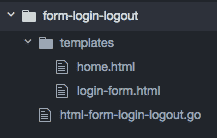

1.  使用以下命令运行程序：

```go
$ go run html-form-login-logout.go
```

# 工作原理…

一旦我们运行程序，HTTP 服务器将在本地的 8080 端口上开始监听。

接下来，浏览`http://localhost:8080`将显示我们的登录表单，如下截图所示：

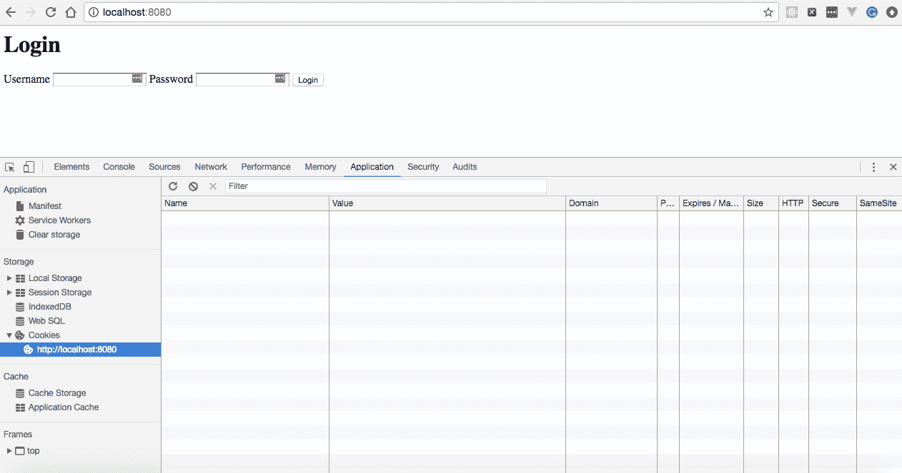

在输入用户名`Foo`和随机密码后提交表单将在浏览器中显示欢迎 Foo!消息，并创建一个名为 session 的 cookie，用于管理用户的登录/注销状态：

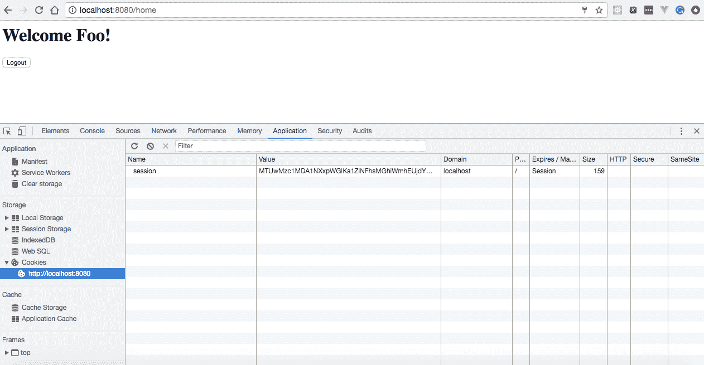

现在，直到名为 session 的 cookie 存在，对`http://localhost:8080/home`的每个后续请求都将在浏览器中显示欢迎 Foo!消息。

接下来，清除 cookie 后访问`http://localhost:8080/home`将重定向我们到`http://localhost:8080/`并显示登录表单：

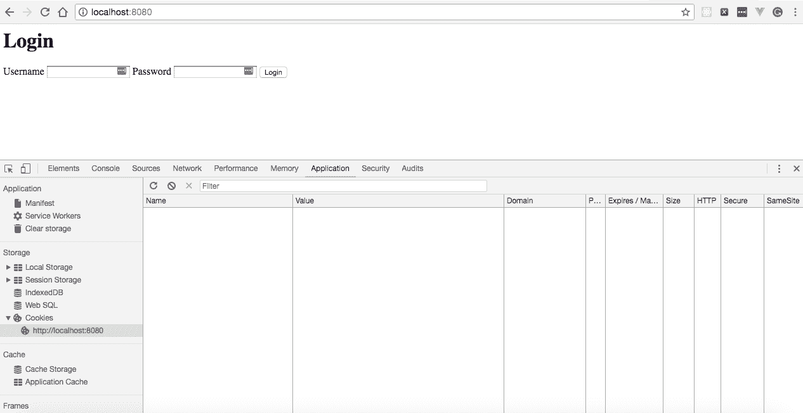

让我们了解我们编写的程序。

1.  使用`var cookieHandler = securecookie.New(securecookie.

使用`GenerateRandomKey(64), securecookie.GenerateRandomKey(32))`，我们创建了一个安全 cookie，将哈希密钥作为第一个参数，块密钥作为第二个参数。哈希密钥用于使用 HMAC 对值进行身份验证，块密钥用于加密值。

1.  接下来，我们定义了`getUserName`处理程序，从 HTTP 请求中获取一个 cookie，初始化一个字符串`键`到字符串`值`的`cookieValue`映射，解码一个 cookie，并获取用户名的值并返回。

1.  接下来，我们定义了`setSession`处理程序，其中我们创建并初始化一个带有`key`和`value`的映射，将其序列化，使用消息认证码对其进行签名，使用`cookieHandler.Encode`处理程序对其进行编码，创建一个新的 HTTP cookie，并将其写入 HTTP 响应流。

1.  接下来，我们定义了`clearSession`，它基本上将 cookie 的值设置为空，并将其写入 HTTP 响应流。

1.  接下来，我们定义了一个`login`处理程序，在这里，我们从 HTTP 表单中获取用户名和密码，检查两者是否都不为空，然后调用`setSession`处理程序并重定向到`/home`，否则重定向到根 URL`/`。

1.  接下来，我们定义了一个`logout`处理程序，在这里，我们调用`clearSession`处理程序清除会话值，并重定向到根 URL。

1.  接下来，我们定义了一个`loginPage`处理程序，在这里，我们解析`login-form.html`，返回一个具有名称和内容的新模板，调用已解析模板上的`Execute`处理程序，生成 HTML 输出，并将其写入 HTTP 响应流。

1.  接下来，我们定义了一个`homePage`处理程序，该处理程序从调用`getUserName`处理程序的 HTTP 请求中获取用户名。然后，我们检查它是否不为空或是否存在 cookie 值。如果用户名不为空，我们解析`home.html`，将用户名注入数据映射，生成 HTML 输出，并将其写入 HTTP 响应流；否则，我们将其重定向到根 URL`/`。

最后，我们定义了`main()`方法，我们在这里启动程序执行。由于这个方法做了很多事情，让我们逐行查看它：

+   `var router = mux.NewRouter()`: 在这里，我们创建了一个新的路由器实例。

+   `router.HandleFunc("/", loginPage)`: 在这里，我们使用`gorilla/mux`包的`HandleFunc`注册了`loginPageHandler`处理程序，并使用`/` URL 模式，这意味着每当我们访问具有`/`模式的 HTTP URL 时，`loginPage`处理程序将通过传递`(http.ResponseWriter, *http.Request)`作为参数来执行。

+   `router.HandleFunc("/home", homePage)`: 在这里，我们使用`gorilla/mux`包的`HandleFunc`注册了`homePageHandler`处理程序，并使用`/home` URL 模式，这意味着每当我们访问具有`/home`模式的 HTTP URL 时，`homePage`处理程序将通过传递`(http.ResponseWriter, *http.Request)`作为参数来执行。

+   `router.HandleFunc("/login", login).Methods("POST")`: 在这里，我们使用`gorilla/mux`包的`HandleFunc`注册了`loginHandler`处理程序，并使用`/login` URL 模式，这意味着每当我们访问具有`/login`模式的 HTTP URL 时，`login`处理程序将通过传递`(http.ResponseWriter, *http.Request)`作为参数来执行。

+   `router.HandleFunc("/logout", logout).Methods("POST")`: 在这里，我们使用`gorilla/mux`包的`HandleFunc`注册了`logoutHandler`处理程序，并使用`/logout` URL 模式，这意味着每当我们访问具有`/logout`模式的 HTTP URL 时，`logout`处理程序将通过传递`(http.ResponseWriter, *http.Request)`作为参数来执行。

+   `http.Handle("/", router)`: 在这里，我们使用`net/http`包的`HandleFunc`为`/` URL 模式注册了路由器，这意味着所有具有`/` URL 模式的请求都由路由器处理。

+   `err := http.ListenAndServe(CONN_HOST+":"+CONN_PORT, nil)`: 在这里，我们调用`http.ListenAndServe`来提供处理每个传入连接的 HTTP 请求的请求。`ListenAndServe`接受两个参数——服务器地址和处理程序，其中服务器地址为`localhost:8080`，处理程序为`nil`，这意味着我们要求服务器使用`DefaultServeMux`作为处理程序。

+   `if err != nil { log.Fatal("error starting http server : ", err) return}`: 在这里，我们检查是否有任何启动服务器的问题。如果有，记录错误并以状态码`1`退出。
