# 在 Go 中编写和使用 RESTful Web 服务

在本章中，我们将涵盖以下内容：

+   创建你的第一个 HTTP GET 方法

+   创建你的第一个 HTTP POST 方法

+   创建你的第一个 HTTP PUT 方法

+   创建你的第一个 HTTP DELETE 方法

+   对你的 REST API 进行版本控制

+   创建你的第一个 REST 客户端

+   创建你的第一个 AngularJS 客户端

+   创建你的第一个 ReactJS 客户端

+   创建你的第一个 VueJS 客户端

# 介绍

每当我们构建一个封装了对其他相关应用有帮助的逻辑的 Web 应用程序时，我们通常也会编写和使用 Web 服务。这是因为它们通过网络公开功能，可以通过 HTTP 协议访问，使应用程序成为唯一的真相来源。

在本章中，我们将编写一个支持`GET`，`POST`，`PUT`和`DELETE` HTTP 方法的 RESTful API，然后我们将学习如何对 REST API 进行版本控制，这在我们创建公开使用的 API 时非常有帮助。最后，我们将编写 REST 客户端来消耗它们。

# 创建你的第一个 HTTP GET 方法

在编写 Web 应用程序时，我们经常需要将我们的服务暴露给客户端或 UI，以便它们可以消耗在不同系统上运行的代码。通过 HTTP 协议方法可以暴露服务。在许多 HTTP 方法中，我们将学习在本教程中实现 HTTP `GET`方法。

# 如何做...

1.  使用`go get`命令安装`github.com/gorilla/mux`包，如下所示：

```go
$ go get github.com/gorilla/mux
```

1.  创建`http-rest-get.go`，在其中我们将定义两个路由—`/employees`和`/employee/{id}`以及它们的处理程序。前者写入员工的静态数组，后者将为提供的 ID 写入相应 ID 的员工详情到 HTTP 响应流，如下所示：

```go
package main
import 
(
  "encoding/json"
  "log"
  "net/http"
  "github.com/gorilla/mux"
)
const 
(
  CONN_HOST = "localhost"
  CONN_PORT = "8080"
)
type Route struct 
{
  Name string
  Method string
  Pattern string
  HandlerFunc http.HandlerFunc
}
type Routes []Route
var routes = Routes
{
  Route
  {
    "getEmployees",
    "GET",
    "/employees",
    getEmployees,
  },
  Route
  {
    "getEmployee",
    "GET",
    "/employee/{id}",
    getEmployee,
  },
}
type Employee struct 
{
  Id string `json:"id"`
  FirstName string `json:"firstName"`
  LastName string `json:"lastName"`
}
type Employees []Employee
var employees []Employee
func init() 
{
  employees = Employees
  {
    Employee{Id: "1", FirstName: "Foo", LastName: "Bar"},
    Employee{Id: "2", FirstName: "Baz", LastName: "Qux"},
  }
}
func getEmployees(w http.ResponseWriter, r *http.Request) 
{
  json.NewEncoder(w).Encode(employees)
}
func getEmployee(w http.ResponseWriter, r *http.Request) 
{
  vars := mux.Vars(r)
  id := vars["id"]
  for _, employee := range employees 
  {
    if employee.Id == id 
    {
      if err := json.NewEncoder(w).Encode(employee); err != nil 
      {
        log.Print("error getting requested employee :: ", err)
      }
    }
  }
}
func AddRoutes(router *mux.Router) *mux.Router 
{
  for _, route := range routes 
  {
    router.
    Methods(route.Method).
    Path(route.Pattern).
    Name(route.Name).
    Handler(route.HandlerFunc)
  }
  return router
}
func main() 
{
  muxRouter := mux.NewRouter().StrictSlash(true)
  router := AddRoutes(muxRouter)
  err := http.ListenAndServe(CONN_HOST+":"+CONN_PORT, router)
  if err != nil 
  {
    log.Fatal("error starting http server :: ", err)
    return
  }
}
```

1.  使用以下命令运行程序：

```go
$ go run http-rest-get.go
```

# 它是如何工作的...

一旦我们运行程序，HTTP 服务器将在本地监听端口`8080`上启动。

接下来，从命令行执行`GET`请求如下将给你一个员工列表：

```go
$ curl -X GET http://localhost:8080/employees
[{"id":"1","firstName":"Foo","lastName":"Bar"},{"id":"2","firstName":"Baz","lastName":"Qux"}]
```

在这里，从命令行执行`GET`请求获取特定员工 ID，将为你提供相应 ID 的员工详情：

```go
$ curl -X GET http://localhost:8080/employee/1
 {"id":"1","firstName":"Foo","lastName":"Bar"}
```

让我们了解我们编写的程序：

1.  我们使用了`import ("encoding/json" "log" "net/http" "strconv" "github.com/gorilla/mux")`。在这里，我们导入了`github.com/gorilla/mux`来创建一个`Gorilla Mux Router`。

1.  接下来，我们声明了`Route`结构类型，具有四个字段—`Name`，`Method`，`Pattern`和`HandlerFunc`，其中`Name`表示 HTTP 方法的名称，`Method`表示 HTTP 方法类型，可以是`GET`，`POST`，`PUT`，`DELETE`等，`Pattern`表示 URL 路径，`HandlerFunc`表示 HTTP 处理程序。

1.  接下来，我们为`GET`请求定义了两个路由，如下：

```go
var routes = Routes
{
  Route
  {
    "getEmployees",
    "GET",
    "/employees",
    getEmployees,
  },
  Route
  {
    "getEmployee",
    "GET",
    "/employee/{id}",
    getEmployee,
  },
}
```

1.  接下来，我们定义了一个静态的`Employees`数组，如下：

```go
func init() 
{
  employees = Employees 
  {
    Employee{Id: "1", FirstName: "Foo", LastName: "Bar"},
    Employee{Id: "2", FirstName: "Baz", LastName: "Qux"},
  }
}
```

1.  然后，我们定义了两个处理程序—`getEmployees`和`getEmployee`，前者只是将员工的静态数组编组并将其写入 HTTP 响应流，后者从 HTTP 请求变量获取员工 ID，从数组中获取相应 ID 的员工，编组对象，并将其写入 HTTP 响应流。

1.  在处理程序之后，我们定义了一个`AddRoutes`函数，它遍历我们定义的路由数组，将其添加到`gorilla/mux`路由器，并返回`Router`对象。

1.  最后，我们定义了`main()`，在其中使用`NewRouter()`处理程序创建了一个`gorilla/mux`路由器实例，对于新路由的尾部斜杠行为为 true，这意味着应用程序将始终将路径视为路由中指定的路径。例如，如果路由路径是`/path/`，访问`/path`将重定向到前者，反之亦然。

# 创建你的第一个 HTTP POST 方法

每当我们需要通过异步调用或 HTML 表单将数据发送到服务器时，我们使用 HTTP `POST`方法的实现，这将在本教程中介绍。

# 如何做...

1.  使用以下命令安装`github.com/gorilla/mux`包，如下所示：

```go
$ go get github.com/gorilla/mux
```

1.  创建`http-rest-post.go`，在其中我们将定义一个支持 HTTP `POST`方法的附加路由和一个处理程序，该处理程序将员工添加到初始静态数组的员工，并将更新后的列表写入 HTTP 响应流，如下所示：

```go
package main
import 
(
  "encoding/json"
  "log"
  "net/http"
  "github.com/gorilla/mux"
)
const 
(
  CONN_HOST = "localhost"
  CONN_PORT = "8080"
)
type Route struct 
{
  Name string
  Method string
  Pattern string
  HandlerFunc http.HandlerFunc
}
type Routes []Route
var routes = Routes
{
  Route
  {
    "getEmployees",
    "GET",
    "/employees",
    getEmployees,
  },
  Route
  {
    "addEmployee",
    "POST",
    "/employee/add",
    addEmployee,
  },
}
type Employee struct 
{
  Id string `json:"id"`
  FirstName string `json:"firstName"`
  LastName string `json:"lastName"`
}
type Employees []Employee
var employees []Employee
func init() 
{
  employees = Employees
  {
    Employee{Id: "1", FirstName: "Foo", LastName: "Bar"},
    Employee{Id: "2", FirstName: "Baz", LastName: "Qux"},
  }
}
func getEmployees(w http.ResponseWriter, r *http.Request) 
{
  json.NewEncoder(w).Encode(employees)
}
func addEmployee(w http.ResponseWriter, r *http.Request) 
{
  employee := Employee{}
  err := json.NewDecoder(r.Body).Decode(&employee)
  if err != nil 
  {
    log.Print("error occurred while decoding employee 
    data :: ", err)
    return
  }
  log.Printf("adding employee id :: %s with firstName 
  as :: %s and lastName as :: %s ", employee.Id, 
  employee.FirstName, employee.LastName)
  employees = append(employees, Employee{Id: employee.Id, 
  FirstName: employee.FirstName, LastName: employee.LastName})
  json.NewEncoder(w).Encode(employees)
}
func AddRoutes(router *mux.Router) *mux.Router 
{
  for _, route := range routes 
  {
    router.
    Methods(route.Method).
    Path(route.Pattern).
    Name(route.Name).
    Handler(route.HandlerFunc)
  }
  return router
}
func main() 
{
  muxRouter := mux.NewRouter().StrictSlash(true)
  router := AddRoutes(muxRouter)
  err := http.ListenAndServe(CONN_HOST+":"+CONN_PORT, router)
  if err != nil 
  {
    log.Fatal("error starting http server :: ", err)
    return
  }
}
```

1.  使用以下命令运行程序：

```go
$ go run http-rest-post.go
```

# 工作原理…

运行程序后，HTTP 服务器将在本地监听端口`8080`。

接下来，使用以下命令从命令行执行`POST`请求将员工添加到具有`ID`为`3`的列表，并将员工列表作为响应返回：

```go
$ curl -H "Content-Type: application/json" -X POST -d '{"Id":"3", "firstName":"Quux", "lastName":"Corge"}' http://localhost:8080/employee/add
```

这可以在以下截图中看到：

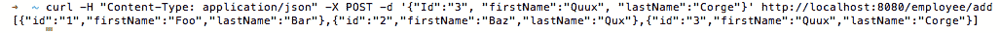

让我们了解本节中引入的更改：

1.  首先，我们添加了另一个名为`addEmployee`的路由，该路由为 URL 模式`/employee/add`的每个`POST`请求执行`addEmployee`处理程序。

1.  然后，我们定义了一个`addEmployee`处理程序，它基本上解码了作为`POST`请求的一部分传递的员工数据，使用 Go 的内置`encoding/json`包的`NewDecoder`处理程序将其附加到员工的初始静态数组，并将其写入 HTTP 响应流。

# 创建您的第一个 HTTP PUT 方法

每当我们想要更新我们之前创建的记录或者如果记录不存在则创建新记录，通常称为**Upsert**，我们就会使用 HTTP `PUT`方法的实现，我们将在本节中介绍。

# 操作步骤…

1.  使用`go get`命令安装`github.com/gorilla/mux`包，如下所示：

```go
$ go get github.com/gorilla/mux
```

1.  创建`http-rest-put.go`，在其中我们将定义一个支持 HTTP `PUT`方法的附加路由和一个处理程序，该处理程序要么更新提供的 ID 的员工详细信息，要么将员工添加到初始静态数组的员工；如果 ID 不存在，则将其编组为 JSON，并将其写入 HTTP 响应流，如下所示：

```go
package main
import 
(
  "encoding/json"
  "log"
  "net/http"
  "github.com/gorilla/mux"
)
const 
(
  CONN_HOST = "localhost"
  CONN_PORT = "8080"
)
type Route struct 
{
  Name string
  Method string
  Pattern string
  HandlerFunc http.HandlerFunc
}
type Routes []Route
var routes = Routes
{
  Route
  {
    "getEmployees",
    "GET",
    "/employees",
    getEmployees,
  },
  Route
  {
    "addEmployee",
    "POST",
    "/employee/add",
    addEmployee,
  },
  Route
  {
    "updateEmployee",
    "PUT",
    "/employee/update",
    updateEmployee,
  },
}
type Employee struct 
{
  Id string `json:"id"`
  FirstName string `json:"firstName"`
  LastName string `json:"lastName"`
}
type Employees []Employee
var employees []Employee
func init() 
{
  employees = Employees
  {
    Employee{Id: "1", FirstName: "Foo", LastName: "Bar"},
    Employee{Id: "2", FirstName: "Baz", LastName: "Qux"},
  }
}
func getEmployees(w http.ResponseWriter, r *http.Request) 
{
  json.NewEncoder(w).Encode(employees)
}
func updateEmployee(w http.ResponseWriter, r *http.Request) 
{
  employee := Employee{}
  err := json.NewDecoder(r.Body).Decode(&employee)
  if err != nil 
  {
    log.Print("error occurred while decoding employee 
    data :: ", err)
    return
  }
  var isUpsert = true
  for idx, emp := range employees 
  {
    if emp.Id == employee.Id 
    {
      isUpsert = false
      log.Printf("updating employee id :: %s with 
      firstName as :: %s and lastName as:: %s ", 
      employee.Id, employee.FirstName, employee.LastName)
      employees[idx].FirstName = employee.FirstName
      employees[idx].LastName = employee.LastName
      break
    }
  }
  if isUpsert 
  {
    log.Printf("upserting employee id :: %s with 
    firstName as :: %s and lastName as:: %s ", 
    employee.Id, employee.FirstName, employee.LastName)
    employees = append(employees, Employee{Id: employee.Id,
    FirstName: employee.FirstName, LastName: employee.LastName})
  }
  json.NewEncoder(w).Encode(employees)
}
func addEmployee(w http.ResponseWriter, r *http.Request) 
{
  employee := Employee{}
  err := json.NewDecoder(r.Body).Decode(&employee)
  if err != nil 
  {
    log.Print("error occurred while decoding employee 
    data :: ", err)
    return
  }
  log.Printf("adding employee id :: %s with firstName 
  as :: %s and lastName as :: %s ", employee.Id, 
  employee.FirstName, employee.LastName)
  employees = append(employees, Employee{Id: employee.Id, 
  FirstName: employee.FirstName, LastName: employee.LastName})
  json.NewEncoder(w).Encode(employees)
}
func AddRoutes(router *mux.Router) *mux.Router 
{
  for _, route := range routes 
  {
    router.
    Methods(route.Method).
    Path(route.Pattern).
    Name(route.Name).
    Handler(route.HandlerFunc)
  }
  return router
}
func main() 
{
  muxRouter := mux.NewRouter().StrictSlash(true)
  router := AddRoutes(muxRouter)
  err := http.ListenAndServe(CONN_HOST+":"+CONN_PORT, router)
  if err != nil 
  {
    log.Fatal("error starting http server :: ", err)
    return
  }
}
```

1.  使用以下命令运行程序：

```go
$ go run http-rest-put.go
```

# 工作原理…

运行程序后，HTTP 服务器将在本地监听端口`8080`。

接下来，使用以下命令从命令行执行`PUT`请求，将为具有 ID `1`的员工更新`firstName`和`lastName`：

```go
$ curl -H "Content-Type: application/json" -X PUT -d '{"Id":"1", "firstName":"Grault", "lastName":"Garply"}' http://localhost:8080/employee/update
```

这可以在以下截图中看到：

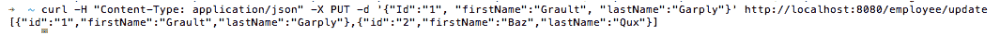

如果我们从命令行执行`PUT`请求，为具有 ID `3`的员工添加另一个员工到数组中，因为没有 ID 为 3 的员工，这演示了 upsert 场景：

```go
$ curl -H "Content-Type: application/json" -X PUT -d '{"Id":"3", "firstName":"Quux", "lastName":"Corge"}' http://localhost:8080/employee/update
```

这可以在以下截图中看到：

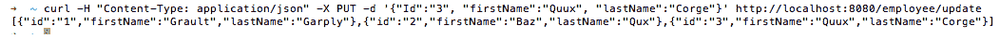

让我们了解本节中引入的更改：

1.  首先，我们添加了另一个名为`updateEmployee`的路由，该路由为 URL 模式`/employee/update`的每个`PUT`请求执行`updateEmployee`处理程序。

1.  然后，我们定义了一个`updateEmployee`处理程序，它基本上解码了作为`PUT`请求的一部分传递的员工数据，使用 Go 的内置`encoding/json`包的`NewDecoder`处理程序迭代员工数组以了解员工 ID 请求是否存在于员工的初始静态数组中，我们也可以称之为 UPDATE 或 UPSERT 场景，执行所需的操作，并将响应写入 HTTP 响应流。

# 创建您的第一个 HTTP DELETE 方法

每当我们想要删除不再需要的记录时，我们就会使用 HTTP `DELETE`方法的实现，我们将在本节中介绍。

# 工作原理…

1.  使用`go get`命令安装`github.com/gorilla/mux`包，如下所示：

```go
$ go get github.com/gorilla/mux
```

1.  创建`http-rest-delete.go`，在其中我们将定义一个支持 HTTP `DELETE`方法的路由和一个处理程序，该处理程序从员工的静态数组中删除提供的 ID 的员工详细信息，将数组编组为 JSON，并将其写入 HTTP 响应流，如下所示：

```go
package main
import 
(
  "encoding/json"
  "log"
  "net/http"
  "github.com/gorilla/mux"
)
const 
(
  CONN_HOST = "localhost"
  CONN_PORT = "8080"
)
type Route struct 
{
  Name string
  Method string
  Pattern string
  HandlerFunc http.HandlerFunc
}
type Routes []Route
var routes = Routes
{
  Route
  {
    "getEmployees",
    "GET",
    "/employees",
    getEmployees,
  },
  Route
  {
    "addEmployee",
    "POST",
    "/employee/add/",
    addEmployee,
  },
  Route
  {
    "deleteEmployee",
    "DELETE",
    "/employee/delete",
    deleteEmployee,
  },
}
type Employee struct 
{
  Id string `json:"id"`
  FirstName string `json:"firstName"`
  LastName string `json:"lastName"`
}
type Employees []Employee
var employees []Employee
func init() 
{
  employees = Employees
  {
    Employee{Id: "1", FirstName: "Foo", LastName: "Bar"},
    Employee{Id: "2", FirstName: "Baz", LastName: "Qux"},
  }
}
func getEmployees(w http.ResponseWriter, r *http.Request) 
{
  json.NewEncoder(w).Encode(employees)
}
func deleteEmployee(w http.ResponseWriter, r *http.Request) 
{
  employee := Employee{}
  err := json.NewDecoder(r.Body).Decode(&employee)
  if err != nil 
  {
    log.Print("error occurred while decoding employee 
    data :: ", err)
    return
  }
  log.Printf("deleting employee id :: %s with firstName 
  as :: %s and lastName as :: %s ", employee.Id, 
  employee.FirstName, employee.LastName)
  index := GetIndex(employee.Id)
  employees = append(employees[:index], employees[index+1:]...)
  json.NewEncoder(w).Encode(employees)
}
func GetIndex(id string) int 
{
  for i := 0; i < len(employees); i++ 
  {
    if employees[i].Id == id 
    {
      return i
    }
  }
  return -1
}
func addEmployee(w http.ResponseWriter, r *http.Request) 
{
  employee := Employee{}
  err := json.NewDecoder(r.Body).Decode(&employee)
  if err != nil 
  {
    log.Print("error occurred while decoding employee 
    data :: ", err)
    return
  }
  log.Printf("adding employee id :: %s with firstName 
  as :: %s and lastName as :: %s ", employee.Id, 
  employee.FirstName, employee.LastName)
  employees = append(employees, Employee{Id: employee.Id, 
  FirstName: employee.FirstName, LastName: employee.LastName})
  json.NewEncoder(w).Encode(employees)
}
func AddRoutes(router *mux.Router) *mux.Router 
{
  for _, route := range routes 
  {
    router.
    Methods(route.Method).
    Path(route.Pattern).
    Name(route.Name).
    Handler(route.HandlerFunc)
  }
  return router
}
func main() 
{
  muxRouter := mux.NewRouter().StrictSlash(true)
  router := AddRoutes(muxRouter)
  err := http.ListenAndServe(CONN_HOST+":"+CONN_PORT, router)
  if err != nil 
  {
    log.Fatal("error starting http server :: ", err)
    return
  }
}
```

1.  使用以下命令运行程序：

```go
$ go run http-rest-delete.go
```

# 工作原理…

一旦我们运行程序，HTTP 服务器将在本地监听端口`8080`。

接下来，从命令行执行`DELETE`请求，将删除 ID 为 1 的员工，并给我们更新后的员工列表：

```go
$ curl -H "Content-Type: application/json" -X DELETE -d '{"Id":"1", "firstName": "Foo", "lastName": "Bar"}' http://localhost:8080/employee/delete
```

这可以在以下截图中看到：

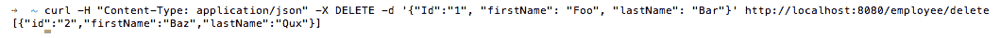

让我们了解我们在这个示例中引入的更改：

1.  首先，我们添加了另一个名为`deleteEmployee`的路由，它为 URL 模式`/employee/delete`的每个`DELETE`请求执行`deleteEmployee`处理程序。

1.  然后，我们定义了一个`deleteEmployee`处理程序，基本上是使用 Go 内置的`encoding/json`包的`NewDecoder`处理程序解码作为`DELETE`请求的一部分传入的员工数据，使用`GetIndex`辅助函数获取请求的员工的索引，删除员工，并将更新后的数组以 JSON 格式写入 HTTP 响应流。

# 对 REST API 进行版本控制

当您创建一个 RESTful API 来为内部客户端提供服务时，您可能不必担心对 API 进行版本控制。更进一步，如果您可以控制访问您的 API 的所有客户端，情况可能是一样的。

然而，在您有一个公共 API 或者您无法控制每个使用它的客户端的 API 的情况下，可能需要对 API 进行版本控制，因为业务需要不断发展，我们将在这个示例中进行介绍。

# 如何做...

1.  使用`go get`命令安装`github.com/gorilla/mux`包，如下所示：

```go
$ go get github.com/gorilla/mux
```

1.  创建`http-rest-versioning.go`，在其中我们将定义支持 HTTP `GET`方法的相同 URL 路径的两个版本，其中一个具有`v1`作为前缀，另一个具有`v2`作为前缀，如下所示：

```go
package main
import 
(
  "encoding/json"
  "log"
  "net/http"
  "strings"
  "github.com/gorilla/mux"
)
const 
(
  CONN_HOST = "localhost"
  CONN_PORT = "8080"
)
type Route struct 
{
  Name string
  Method string
  Pattern string
  HandlerFunc http.HandlerFunc
}
type Routes []Route
var routes = Routes
{
  Route
  {
    "getEmployees",
    "GET",
    "/employees",
    getEmployees,
  },
}
type Employee struct 
{
  Id string `json:"id"`
  FirstName string `json:"firstName"`
  LastName string `json:"lastName"`
}
type Employees []Employee
var employees []Employee
var employeesV1 []Employee
var employeesV2 []Employee
func init() 
{
  employees = Employees
  {
    Employee{Id: "1", FirstName: "Foo", LastName: "Bar"},
  }
  employeesV1 = Employees
  {
    Employee{Id: "1", FirstName: "Foo", LastName: "Bar"},
    Employee{Id: "2", FirstName: "Baz", LastName: "Qux"},
  }
  employeesV2 = Employees
  {
    Employee{Id: "1", FirstName: "Baz", LastName: "Qux"},
    Employee{Id: "2", FirstName: "Quux", LastName: "Quuz"},
  }
}
func getEmployees(w http.ResponseWriter, r *http.Request) 
{
  if strings.HasPrefix(r.URL.Path, "/v1") 
  {
    json.NewEncoder(w).Encode(employeesV1)
  } 
  else if strings.HasPrefix(r.URL.Path, "/v2") 
  {
    json.NewEncoder(w).Encode(employeesV2)
  } 
  else 
  {
    json.NewEncoder(w).Encode(employees)
  }
}
func AddRoutes(router *mux.Router) *mux.Router 
{
  for _, route := range routes 
  {
    router.
    Methods(route.Method).
    Path(route.Pattern).
    Name(route.Name).
    Handler(route.HandlerFunc)
  }
  return router
}
func main() 
{
  muxRouter := mux.NewRouter().StrictSlash(true)
  router := AddRoutes(muxRouter)
  // v1
  AddRoutes(muxRouter.PathPrefix("/v1").Subrouter())
  // v2
  AddRoutes(muxRouter.PathPrefix("/v2").Subrouter())
  err := http.ListenAndServe(CONN_HOST+":"+CONN_PORT, router)
  if err != nil 
  {
    log.Fatal("error starting http server :: ", err)
    return
  }
}
```

1.  使用以下命令运行程序：

```go
$ go run http-rest-versioning.go
```

# 它是如何工作的...

一旦我们运行程序，HTTP 服务器将在本地监听端口`8080`。

接下来，从命令行执行带有路径前缀为`/v1`的`GET`请求，将给您一个员工列表：

```go
$ curl -X GET http://localhost:8080/v1/employees
[{"id":"1","firstName":"Foo","lastName":"Bar"},{"id":"2","firstName":"Baz","lastName":"Qux"}]
```

在这里，使用路径前缀为`/v2`执行`GET`请求将给您另一组员工的列表，如下所示：

```go
$ curl -X GET http://localhost:8080/v2/employees
 [{"id":"1","firstName":"Baz","lastName":"Qux"},{"id":"2","firstName":"Quux","lastName":"Quuz"}]
```

有时，在设计 REST URL 时，如果客户端在不指定 URL 路径中的版本的情况下查询端点，我们更倾向于返回默认数据。为了实现这一点，我们修改了`getEmployees`处理程序，以检查 URL 中的前缀并相应地采取行动。因此，从命令行执行不带路径前缀的`GET`请求，将给您一个带有单个记录的列表，我们可以称之为 REST 端点的默认或初始响应：

```go
$ curl -X GET http://localhost:8080/employees
 [{"id":"1","firstName":"Foo","lastName":"Bar"}]
```

让我们了解我们在这个示例中引入的更改：

1.  首先，我们定义了一个名为`getEmployees`的单一路由，它为 URL 模式`/employees`的每个`GET`请求执行`getEmployees`处理程序。

1.  然后，我们创建了三个数组，分别是`employees`，`employeesV1`和`employeesV2`，它们作为对 URL 模式`/employees`，`/v1/employees`和`/v2/employees`的 HTTP `GET`调用的响应返回。

1.  接下来，我们定义了一个`getEmployees`处理程序，在其中我们检查 URL 路径中的前缀，并根据其执行操作。

1.  然后，我们定义了一个`AddRoutes`辅助函数，它遍历我们定义的路由数组，将其添加到`gorilla/mux`路由器中，并返回`Router`对象。

1.  最后，我们定义了`main()`，在其中我们使用`NewRouter()`处理程序创建一个带有尾部斜杠行为为 true 的`gorilla/mux`路由器实例，并通过调用`AddRoutes`辅助函数将路由添加到其中，传递默认路由器和两个子路由器，一个带有前缀`v1`，另一个带有前缀`v2`。

# 创建您的第一个 REST 客户端

如今，大多数与服务器通信的应用程序都使用 RESTful 服务。根据我们的需求，我们通过 JavaScript、jQuery 或 REST 客户端来消费这些服务。

在这个食谱中，我们将使用`https://gopkg.in/resty.v1`包编写一个 REST 客户端，该包本身受到 Ruby rest 客户端的启发，用于消耗 RESTful 服务。

# 准备就绪…

在一个单独的终端中运行我们在之前的食谱中创建的`http-rest-get.go`，执行以下命令：

```go
$ go run http-rest-get.go
```

参见*创建您的第一个 HTTP GET 方法*食谱。

通过执行以下命令验证`/employees`服务是否在本地端口`8080`上运行：

```go
$ curl -X GET http://localhost:8080/employees
```

这应该返回以下响应：

```go
[{"id":"1","firstName":"Foo","lastName":"Bar"},{"id":"2","firstName":"Baz","lastName":"Qux"}]
```

# 如何做…

1.  使用`go get`命令安装`github.com/gorilla/mux`和`gopkg.in/resty.v1`包，如下所示：

```go
$ go get github.com/gorilla/mux
$ go get -u gopkg.in/resty.v1
```

1.  创建`http-rest-client.go`，在其中我们将定义调用`resty`处理程序的处理程序，如`GET`、`POST`、`PUT`和`DELETE`，从 REST 服务获取响应，并将其写入 HTTP 响应流，如下所示：

```go
package main
import 
(
  "encoding/json"
  "fmt"
  "log"
  "net/http"
  "github.com/gorilla/mux"
  resty "gopkg.in/resty.v1"
)
const 
(
  CONN_HOST = "localhost"
  CONN_PORT = "8090"
)
const WEB_SERVICE_HOST string = "http://localhost:8080"
type Employee struct 
{
  Id string `json:"id"`
  FirstName string `json:"firstName"`
  LastName string `json:"lastName"`
}
func getEmployees(w http.ResponseWriter, r *http.Request) 
{
  response, err := resty.R().Get(WEB_SERVICE_HOST + 
  "/employees")
  if err != nil 
  {
    log.Print("error getting data from the web service :: ", err)
    return
  }
  printOutput(response, err)
  fmt.Fprintf(w, response.String())
}
func addEmployee(w http.ResponseWriter, r *http.Request) 
{
  employee := Employee{}
  decodingErr := json.NewDecoder(r.Body).Decode(&employee)
  if decodingErr != nil 
  {
    log.Print("error occurred while decoding employee 
    data :: ", decodingErr)
    return
  }
  log.Printf("adding employee id :: %s with firstName 
  as :: %s and lastName as :: %s ", employee.Id, 
  employee.FirstName, employee.LastName)
  response, err := resty.R().
  SetHeader("Content-Type", "application/json").
  SetBody(Employee{Id: employee.Id, FirstName: 
  employee.FirstName, LastName: employee.LastName}).
  Post(WEB_SERVICE_HOST + "/employee/add")
  if err != nil 
  {
    log.Print("error occurred while adding employee :: ", err)
    return
  }
  printOutput(response, err)
  fmt.Fprintf(w, response.String())
}
func updateEmployee(w http.ResponseWriter, r *http.Request) 
{
  employee := Employee{}
  decodingErr := json.NewDecoder(r.Body).Decode(&employee)
  if decodingErr != nil 
  {
    log.Print("error occurred while decoding employee 
    data :: ", decodingErr)
    return
  }
  log.Printf("updating employee id :: %s with firstName 
  as :: %s and lastName as :: %s ", employee.Id, 
  employee.FirstName, employee.LastName)
  response, err := resty.R().
  SetBody(Employee{Id: employee.Id, FirstName: 
  employee.FirstName, LastName: employee.LastName}).
  Put(WEB_SERVICE_HOST + "/employee/update")
  if err != nil 
  {
    log.Print("error occurred while updating employee :: ", err)
    return
  }
  printOutput(response, err)
  fmt.Fprintf(w, response.String())
}
func deleteEmployee(w http.ResponseWriter, r *http.Request) 
{
  employee := Employee{}
  decodingErr := json.NewDecoder(r.Body).Decode(&employee)
  if decodingErr != nil 
  {
    log.Print("error occurred while decoding employee 
    data :: ", decodingErr)
    return
  }
  log.Printf("deleting employee id :: %s with firstName 
  as :: %s and lastName as :: %s ", employee.Id, 
  employee.FirstName, employee.LastName)
  response, err := resty.R().
  SetBody(Employee{Id: employee.Id, FirstName: 
  employee.FirstName, LastName: employee.LastName}).
  Delete(WEB_SERVICE_HOST + "/employee/delete")
  if err != nil 
  {
    log.Print("error occurred while deleting employee :: ", err)
    return
  }
  printOutput(response, err)
  fmt.Fprintf(w, response.String())
}
func printOutput(resp *resty.Response, err error) 
{
  log.Println(resp, err)
}
func main() 
{
  router := mux.NewRouter().StrictSlash(false)
  router.HandleFunc("/employees", getEmployees).Methods("GET")
  employee := router.PathPrefix("/employee").Subrouter()
  employee.HandleFunc("/add", addEmployee).Methods("POST")
  employee.HandleFunc("/update", updateEmployee).Methods("PUT")
  employee.HandleFunc("/delete", deleteEmployee).Methods("DELETE")
  err := http.ListenAndServe(CONN_HOST+":"+CONN_PORT, router)
  if err != nil 
  {
    log.Fatal("error starting http server : ", err)
    return
  }
}
```

1.  使用以下命令运行程序：

```go
$ go run http-rest-client.go
```

# 工作原理…

一旦我们运行程序，HTTP 服务器将在本地监听端口`8090`。

接下来，通过执行以下命令向 REST 客户端发送`GET`请求，将会得到来自服务的所有员工的列表：

```go
$ curl -X GET http://localhost:8090/employees
 [{"id":"1","firstName":"Foo","lastName":"Bar"},{"id":"2","firstName":"Baz","lastName":"Qux"}]
```

同样地，在一个单独的终端中运行我们在之前的食谱中创建的`http-rest-post.go`，执行以下命令：

```go
$ go run http-rest-post.go
```

从命令行执行`POST`请求到 REST 客户端，如下所示：

```go
$ curl -H "Content-Type: application/json" -X POST -d '{"Id":"3", "firstName":"Quux", "lastName":"Corge"}' http://localhost:8090/employee/add [{"id":"1","firstName":"Foo","lastName":"Bar"},{"id":"2","firstName":"Baz","lastName":"Qux"},{"id":"3","firstName":"Quux","lastName":"Corge"}]
```

这将向初始静态列表添加一个员工，并返回更新后的员工列表，如下截图所示：

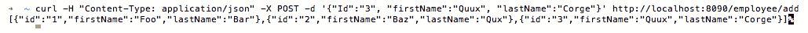

让我们了解我们编写的程序：

1.  使用`import ("encoding/json" "fmt" "log" "net/http" "github.com/gorilla/mux" resty “gopkg.in/resty.v1")`，我们导入了`github.com/gorilla/mux`来创建`Gorilla Mux Router`，并使用包别名`resty`导入了`gopkg.in/resty.v1`，它是 Go 的 REST 客户端，具有各种处理程序来消耗 RESTful web 服务。

1.  使用`const WEB_SERVICE_HOST string = "http://localhost:8080"`，我们声明了 RESTful web 服务主机的完整 URL。

根据项目大小，您可以将`WEB_SERVICE_HOST`字符串移动到常量文件或属性文件中，以帮助您在运行时覆盖其值。

1.  接下来，我们定义了一个`getEmployees`处理程序，在其中我们创建一个新的`resty`请求对象调用其`R()`处理程序，调用`Get`方法，执行 HTTP `GET`请求，获取响应，并将其写入 HTTP 响应。

1.  类似地，我们定义了另外三个处理程序，用于向 RESTful 服务发送`POST`、`PUT`和`DELETE`请求，以及一个`main()`，在其中我们创建了一个`gorilla/mux`路由器实例，并使用`getEmployees`处理程序注册了`/employees` URL 路径，以及使用`addEmployee`、`updateEmployee`和`deleteEmployee`处理程序分别注册了`/employee/add`、`/employee/update`和`/employee/delete`。

# 创建您的第一个 AngularJS 客户端

AngularJS 是一个开源的 JavaScript Model-View-Whatever（MVW）框架，它让我们能够构建结构良好、易于测试和易于维护的基于浏览器的应用程序。

在这个食谱中，我们将学习创建一个 AngularJS 与 TypeScript 2 客户端，向本地运行的 HTTP 服务器发送`POST`请求。

# 准备就绪…

由于我们已经在之前的食谱中创建了一个接受`GET`和`POST`请求的 HTTP 服务器，我们将使用相同的代码库作为我们的 HTTP 服务器。

此外，此处的食谱假设您的机器上已安装了 Angular2 CLI。如果没有，请执行以下命令进行安装：

```go
$ npm install -g @angular/cli
```

参见*创建您的第一个 HTTP POST 方法*食谱。

# 如何做…

1.  通过执行以下命令创建一个新项目和骨架应用程序：

```go
$ ng new angularjs-client
```

1.  移动到`angularjs-client`目录，并通过执行以下命令创建`server.go`：

```go
$ cd angularjs-client && touch server.go
```

1.  将以下代码复制到`server.go`中：

```go
package main
import 
(
  "encoding/json"
  "log"
  "net/http"
  "github.com/gorilla/mux"
)
const 
(
  CONN_HOST = "localhost"
  CONN_PORT = "8080"
)
type Route struct 
{
  Name string
  Method string
  Pattern string
  HandlerFunc http.HandlerFunc
}
type Routes []Route
var routes = Routes
{
  Route
  {
    "getEmployees",
    "GET",
    "/employees",
    getEmployees,
  },
  Route
  {
    "addEmployee",
    "POST",
    "/employee/add",
    addEmployee,
  },
}
type Employee struct 
{
  Id string `json:"id"`
  FirstName string `json:"firstName"`
  LastName string `json:"lastName"`
}
type Employees []Employee
var employees []Employee
func init() 
{
  employees = Employees
  {
    Employee{Id: "1", FirstName: "Foo", LastName: "Bar"},
    Employee{Id: "2", FirstName: "Baz", LastName: "Qux"},
  }
}
func getEmployees(w http.ResponseWriter, r *http.Request) 
{
  json.NewEncoder(w).Encode(employees)
}
func addEmployee(w http.ResponseWriter, r *http.Request) 
{
  employee := Employee{}
  err := json.NewDecoder(r.Body).Decode(&employee)
  if err != nil 
  {
    log.Print("error occurred while decoding employee 
    data :: ", err)
    return
  }
  log.Printf("adding employee id :: %s with firstName 
  as :: %s and lastName as :: %s ", employee.Id, 
  employee.FirstName, employee.LastName)
  employees = append(employees, Employee{Id: employee.Id, 
  FirstName: employee.FirstName, LastName: employee.LastName})
  json.NewEncoder(w).Encode(employees)
}
func AddRoutes(router *mux.Router) *mux.Router 
{
  for _, route := range routes 
  {
    router.
    Methods(route.Method).
    Path(route.Pattern).
    Name(route.Name).
    Handler(route.HandlerFunc)
  }
  return router
}
func main() 
{
  muxRouter := mux.NewRouter().StrictSlash(true)
  router := AddRoutes(muxRouter)
  router.PathPrefix("/").Handler(http.FileServer
  (http.Dir("./dist/")))
  err := http.ListenAndServe(CONN_HOST+":"+CONN_PORT, router)
  if err != nil 
  {
    log.Fatal("error starting http server :: ", err)
    return
  }
}
```

1.  移动到`angularjs-client`目录，并通过执行以下命令创建`models/employee.ts`和`service/employee.service.ts`：

```go
$ cd src/app/ && mkdir models && mkdir services && cd models && touch employee.ts && cd ../services && touch employee.service.ts
```

1.  将以下代码复制到`angularjs-client/src/app/models/employee.ts`中：

```go
export class Employee 
{
  constructor
  (
    public id: string,
    public firstName: string,
    public lastName: string
  ) {}
}
```

1.  将以下代码复制到`angularjs-client/src/app/services`中

/employee.service.ts`:

```go
import { Injectable } from '@angular/core';
import { Http, Response, Headers, RequestOptions } from '@angular/http';
import { Observable } from 'rxjs/Rx';
import { Employee } from "app/models/employee";

@Injectable()
export class EmployeeService 
{
  constructor(private http: Http) { }
  getEmployees(): Observable<Employee[]> 
  {
    return this.http.get("http://localhost:8080/employees")
    .map((res: Response) => res.json())
    .catch((error: any) => Observable.throw(error.json().
    error || 'Server error'));
  }
  addEmployee(employee: Employee): Observable<Employee> 
  {
    let headers = new Headers({ 'Content-Type': 
    'application/json' });
    let options = new RequestOptions({ headers: headers });
    return this.http.post("http://localhost:8080/employee
    /add", employee, options)
    .map(this.extractData)
    .catch(this.handleErrorObservable);
  }
  private extractData(res: Response) 
  {
    let body = res.json();
    return body || {};
  }
  private handleErrorObservable(error: Response | any) 
  {
    console.error(error.message || error);
    return Observable.throw(error.message || error);
  }
}
```

1.  用以下内容替换`angularjs-client/src/app/app.component.html`的代码：

```go
<div class = "container" style="padding:5px">
  <form>
    <div class = "form-group">
      <label for = "id">ID</label>
      <input type = "text" class = "form-control" id = "id" 
      required [(ngModel)] = "employee.id" name = "id">
    </div>
    <div class = "form-group">
      <label for = "firstName">FirstName</label>
      <input type = "text" class = "form-control" id = 
      "firstName" [(ngModel)] = "employee.firstName" name =
      "firstName">
    </div>
    <div class = "form-group">
      <label for = "lastName">LastName</label>
      <input type = "text" class = "form-control" id = 
      "lastName" [(ngModel)] = "employee.lastName" name =
      "lastName">
    </div>
    <div>
      <button (click)="addEmployee()">Add</button>
    </div>
  </form>
</div>
<table>
  <thead>
    <th>ID</th>
    <th>FirstName</th>
    <th>LastName</th>
  </thead>
  <tbody>
    <tr *ngFor="let employee of employees">
      <td>{{employee.id}}</td>
      <td>{{employee.firstName}}</td>
      <td>{{employee.lastName}}</td>
    </tr>
  </tbody>
</table>
```

1.  用以下内容替换`angularjs-client/src/app/app.component.ts`的代码：

```go
import { Component, OnInit } from '@angular/core';
import { EmployeeService } from "app/services/employee.service";
import { Employee } from './models/employee';

@Component
({
  selector: 'app-root',
  templateUrl: './app.component.html',
  styleUrls: ['./app.component.css'],
})
export class AppComponent implements OnInit 
{
  title = 'app';
  employee = new Employee('', '', '');
  employees;
  constructor(private employeeService: EmployeeService) { }
  ngOnInit(): void 
  {
    this.getEmployees();
  }
  getEmployees(): void 
  {
    this.employeeService.getEmployees()
    .subscribe(employees => this.employees = employees);
  }
  addEmployee(): void 
  {
    this.employeeService.addEmployee(this.employee)
    .subscribe
    (
      employee => 
      {
        this.getEmployees();
        this.reset();
      }
    );
  }
  private reset() 
  {
    this.employee.id = null;
    this.employee.firstName = null;
    this.employee.lastName = null;
  }
}
```

1.  用以下内容替换`angularjs-client/src/app/app.module.ts`的代码：

```go
import { BrowserModule } from '@angular/platform-browser';
import { NgModule } from '@angular/core';
import { HttpModule } from '@angular/http';
import { AppComponent } from './app.component';
import { EmployeeService } from "app/services/employee.service";
import { FormsModule } from '@angular/forms';

@NgModule
({
 declarations: 
 [
   AppComponent
 ],
 imports: 
 [
   BrowserModule, HttpModule, FormsModule
 ],
 providers: [EmployeeService],
 bootstrap: [AppComponent]
})
export class AppModule { }
```

一切就绪后，目录结构应如下所示：

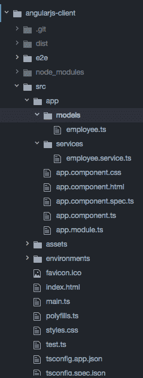

1.  移动到`angularjs-client`目录并执行以下命令来构建项目构件并运行程序：

```go
$ ng build
$ go run server.go
```

# 它是如何工作的…

一旦我们运行程序，HTTP 服务器将在本地监听端口`8080`。

浏览到`http://localhost:8080`将显示 AngularJS 客户端页面，其中有一个带有 Id、FirstName 和 LastName 字段的 HTML 表单，如下图所示：

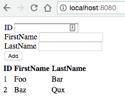

在填写表单后点击“Add”按钮将向运行在端口`8080`上的 HTTP 服务器发送一个`POST`请求。一旦服务器处理了请求，它将返回所有静态员工的列表以及新添加的员工，并在浏览器中显示，如下图所示：

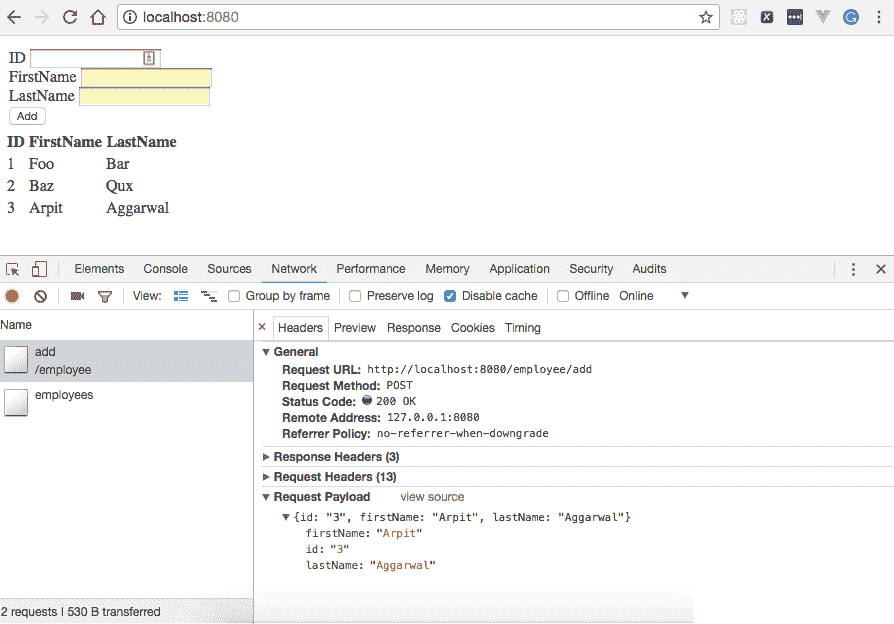

所有静态员工的列表以及新添加的员工

# 创建你的第一个 ReactJS 客户端

ReactJS 是一个声明式的 JavaScript 库，有助于高效构建用户界面。因为它基于虚拟 DOM 的概念工作，它提高了应用程序的性能，因为 JavaScript 虚拟 DOM 比常规 DOM 更快。

在这个教程中，我们将学习创建一个 ReactJS 客户端来向本地运行的 HTTP 服务器发送`POST`请求。

# 准备就绪…

由于我们已经在之前的教程中创建了一个接受`GET`和`POST` HTTP 请求的 HTTP 服务器，我们将使用相同的代码库作为我们的 HTTP 服务器。

此外，本教程假设您已在您的机器上安装了`npm`，并且对`npm`和`webpack`有基本的了解，它是一个 JavaScript 模块打包工具。

参见*创建你的第一个 HTTP POST 方法*教程。

# 如何做…

1.  创建一个`reactjs-client`目录，我们将在其中保存所有我们的 ReactJS 源文件和一个 HTTP 服务器，如下所示：

```go
$ mkdir reactjs-client && cd reactjs-client && touch server.go
```

1.  将以下代码复制到`server.go`中：

```go
package main
import 
(
  "encoding/json"
  "log"
  "net/http"
  "github.com/gorilla/mux"
)
const 
(
  CONN_HOST = "localhost"
  CONN_PORT = "8080"
)
type Route struct 
{
  Name string
  Method string
  Pattern string
  HandlerFunc http.HandlerFunc
}
type Routes []Route
var routes = Routes
{
  Route
  {
    "getEmployees",
    "GET",
    "/employees",
    getEmployees,
  },
  Route
  {
    "addEmployee",
    "POST",
    "/employee/add",
    addEmployee,
  },
}
type Employee struct 
{
  Id string `json:"id"`
  FirstName string `json:"firstName"`
  LastName string `json:"lastName"`
}
type Employees []Employee
var employees []Employee
func init() 
{
  employees = Employees
  {
    Employee{Id: "1", FirstName: "Foo", LastName: "Bar"},
    Employee{Id: "2", FirstName: "Baz", LastName: "Qux"},
  }
}
func getEmployees(w http.ResponseWriter, r *http.Request) 
{
  json.NewEncoder(w).Encode(employees)
}
func addEmployee(w http.ResponseWriter, r *http.Request) 
{
  employee := Employee{}
  err := json.NewDecoder(r.Body).Decode(&employee)
  if err != nil 
  {
    log.Print("error occurred while decoding employee 
    data :: ", err)
    return
  }
  log.Printf("adding employee id :: %s with firstName 
  as :: %s and lastName as :: %s ", employee.Id, 
  employee.FirstName, employee.LastName)
  employees = append(employees, Employee{Id: employee.Id, 
  FirstName: employee.FirstName, LastName: employee.LastName})
  json.NewEncoder(w).Encode(employees)
}
func AddRoutes(router *mux.Router) *mux.Router 
{
  for _, route := range routes 
  {
    router.
    Methods(route.Method).
    Path(route.Pattern).
    Name(route.Name).
    Handler(route.HandlerFunc)
  }
  return router
}
func main() 
{
  muxRouter := mux.NewRouter().StrictSlash(true)
  router := AddRoutes(muxRouter)
  router.PathPrefix("/").Handler(http.FileServer
  (http.Dir("./assets/")))
  err := http.ListenAndServe(CONN_HOST+":"+CONN_PORT, router)
  if err != nil 
  {
    log.Fatal("error starting http server :: ", err)
    return
  }
}
```

1.  创建另一个名为`assets`的目录，其中将保存所有我们的前端代码文件，如`.html`、`.js`、`.css`和`images`，如下所示：

```go
$ mkdir assets && cd assets && touch index.html
```

1.  将以下内容复制到`index.html`中：

```go
<html>
  <head lang="en">
    <meta charset="UTF-8" />
    <title>ReactJS Client</title>
  </head> 
  <body>
    <div id="react"></div>
    <script src="img/script.js"></script>
```

```go
  </body>
</html>
```

1.  移动到`reactjs-client`目录并执行`npm init`来创建`package.json`，在其中我们指定构建我们的 react 客户端所需的所有依赖项，如`React`、`React DOM`、`Webpack`、`Babel Loader`、`Babel Core`、`Babel Preset: ES2015`和`Babel Preset: React`，如下所示：

```go
$ cd reactjs-client && touch npm init
```

用以下内容替换`package.json`的内容：

```go
{
  "name": "reactjs-client",
  "version": "1.0.0",
  "description": "ReactJs Client",
  "keywords": 
  [
    "react"
  ],
  "author": "Arpit Aggarwal",
  "dependencies": 
  {
    "axios": "⁰.18.0",
    "react": "¹⁶.2.0",
    "react-dom": "¹⁶.2.0",
    "react-router-dom": "⁴.2.2",
    "webpack": "⁴.2.0",
    "webpack-cli": "².0.9",
    "lodash": "⁴.17.5"
  },
  "scripts": 
  {
    "build": "webpack",
    "watch": "webpack --watch -d"
  },
  "devDependencies": 
  {
    "babel-core": "⁶.18.2",
    "babel-loader": "⁷.1.4",
    "babel-polyfill": "⁶.16.0",
    "babel-preset-es2015": "⁶.18.0",
    "babel-preset-react": "⁶.16.0"
  }
}
```

1.  创建`webpack.config.js`，在其中我们将配置`webpack`，如下所示：

```go
$ cd reactjs-client && touch webpack.config.js
```

将以下内容复制到`webpack.config.js`中：

```go
var path = require('path');
module.exports = 
{
  resolve: 
  {
    extensions: ['.js', '.jsx']
  },
  mode: 'development',
  entry: './app/main.js',
  cache: true,
  output: 
  {
    path: __dirname,
    filename: './assets/script.js'
  },
  module: 
  {
    rules: 
    [
      {
        test: path.join(__dirname, '.'),
        exclude: /(node_modules)/,
        loader: 'babel-loader',
        query: 
        {
          cacheDirectory: true,
          presets: ['es2015', 'react']
        }
      }
    ]
  }
};
```

1.  通过执行以下命令为`webpack`创建入口点，即`reactjs-client/app/main.js`：

```go
$ cd reactjs-client && mkdir app && cd app && touch main.js
```

将以下内容复制到`main.js`中：

```go
'use strict';
const React = require('react');
const ReactDOM = require('react-dom')
import EmployeeApp from './components/employee-app.jsx'
ReactDOM.render
(
  <EmployeeApp />,
  document.getElementById('react')
)
```

1.  通过执行以下命令定义`ReactApp`以及它的子组件：

```go
$ cd reactjs-client && mkdir components && cd components && touch react-app.jsx employee-list.jsx employee.jsx add-employee.jsx
```

将以下内容复制到`reactjs-client/app/components/employee-app.jsx`中：

```go
'use strict';
const React = require('react');
var axios = require('axios');
import EmployeeList from './employee-list.jsx'
import AddEmployee from './add-employee.jsx'
export default class EmployeeApp extends React.Component 
{
  constructor(props) 
  {
    super(props);
    this.state = {employees: []};
    this.addEmployee = this.addEmployee.bind(this);
    this.Axios = axios.create
    (
      {
        headers: {'content-type': 'application/json'}
      }
    );
  }
  componentDidMount() 
  {
    let _this = this;
    this.Axios.get('/employees')
    .then
    (
      function (response) 
      {
        _this.setState({employees: response.data});
      }
    )
    .catch(function (error) { });
  }
  addEmployee(employeeName)
  {
    let _this = this;
    this.Axios.post
    (
      '/employee/add', 
      {
        firstName: employeeName
      }
    )
    .then
    (
      function (response) 
      {
        _this.setState({employees: response.data});
      }
    )
    .catch(function (error) { });
    }
    render() 
    {
      return 
      (
        <div>
          <AddEmployee addEmployee={this.addEmployee}/>
          <EmployeeList employees={this.state.employees}/>
        </div>
      )
   }
}
```

将以下内容复制到`reactjs-client/app/components/employee.jsx`中：

```go
const React = require('react');
export default class Employee extends React.Component
{
  render() 
  {
    return 
    (
      <tr>
        <td>{this.props.employee.firstName}</td>
      </tr>
    )
  }
}

```

将以下内容复制到`reactjs-client/app/components/employee-list.jsx`中：

```go
const React = require('react');
import Employee from './employee.jsx'
export default class EmployeeList extends React.Component
{
  render() 
  {
    var employees = this.props.employees.map
    (
      (employee, i) =>
      <Employee key={i} employee={employee}/>
    );
    return 
    (
      <table>
        <tbody>
          <tr>
            <th>FirstName</th>
          </tr>
          {employees}
        </tbody>
      </table>
    )
  }
}
```

将以下内容复制到`reactjs-client/app/components/add-employee.jsx`中：

```go
import React, { Component, PropTypes } from 'react'
export default class AddEmployee extends React.Component 
{
  render()
  {
    return 
    (
      <div>
        <input type = 'text' ref = 'input' />
        <button onClick = {(e) => this.handleClick(e)}>
          Add
        </button>
      </div>
    )
  }
  handleClick(e) 
  {
    const node = this.refs.input
    const text = node.value.trim()
    this.props.addEmployee(text)
    node.value = ''
  }
}
```

一切就绪后，目录结构应如下所示：

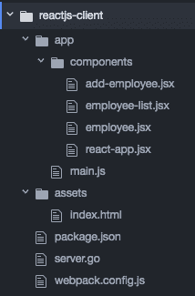

目录结构

1.  移动到`reactjs-client`目录并执行以下命令来安装`node modules`和构建`webpack`：

```go
$ npm install
$ npm run build
```

1.  使用以下命令运行程序：

```go
$ go run server.go
```

# 它是如何工作的…

一旦我们运行程序，HTTP 服务器将在本地监听端口`8080`。

浏览到`http://localhost:8080`将会显示我们的 VueJS 客户端页面，如下截图所示：

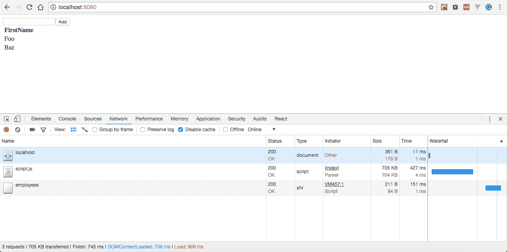

ReactJS 客户端页面

在填写文本框后点击添加按钮将会向运行在端口`8080`上的 HTTP 服务器发送一个`POST`请求：

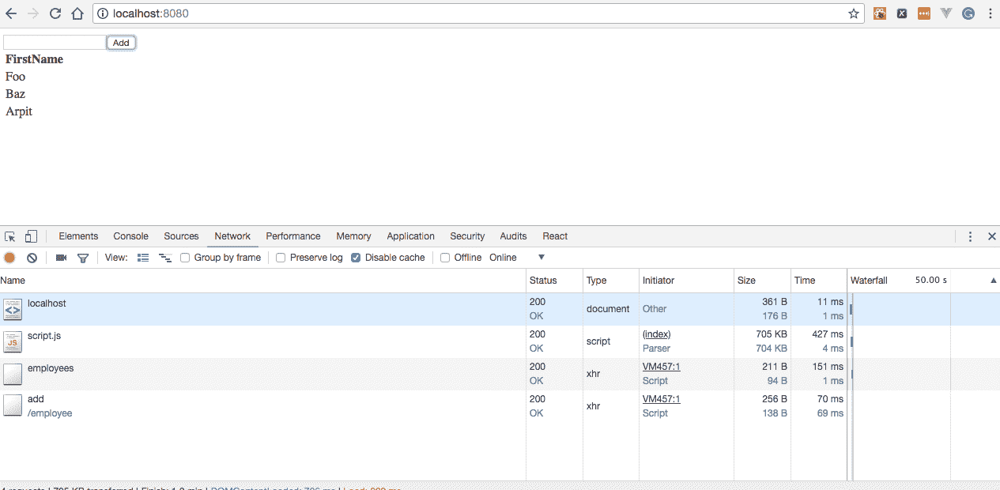

在填写文本框后点击添加按钮

接下来，从命令行执行一个`GET`请求将会给你一个所有静态员工的列表：

```go
$ curl -X GET http://localhost:8080/employees
```

这将会和新添加的员工一起显示如下：

```go
[{"id":"1","firstName":"Foo","lastName":"Bar"},{"id":"2","firstName":"Baz","lastName":"Qux"},{"id":"","firstName":"Arpit","lastName":""}]
```

# 创建你的第一个 VueJS 客户端

作为开源项目，VueJS 是逐步可采用和渐进式的 JavaScript 框架之一，公司正在采用它来构建他们的前端或面向客户的用户界面。

在这个教程中，我们将学习在 VueJS 中创建一个客户端，通过向本地运行的 HTTP 服务器发送一个 HTTP `POST`请求来添加一个员工。

# 准备好…

由于我们已经在之前的教程中创建了一个接受`GET`和`POST`请求的 HTTP 服务器，我们将使用相同的代码库作为我们的 HTTP 服务器。

参见*创建你的第一个 HTTP POST 方法*教程。

# 如何做…

1.  创建一个`vuejs-client`目录，我们将在其中保存所有 VueJS 源文件和一个 HTTP 服务器，如下所示：

```go
$ mkdir vuejs-client && cd vuejs-client && touch server.go
```

1.  将以下代码复制到`server.go`中：

```go
package main
import 
(
  "encoding/json"
  "log"
  "net/http"
  "github.com/gorilla/mux"
)
const 
(
  CONN_HOST = "localhost"
  CONN_PORT = "8080"
)
type Route struct 
{
  Name string
  Method string
  Pattern string
  HandlerFunc http.HandlerFunc
}
type Routes []Route
var routes = Routes
{
  Route
  {
    "getEmployees",
    "GET",
    "/employees",
    getEmployees,
  },
  Route
  {
    "addEmployee",
    "POST",
    "/employee/add",
    addEmployee,
  },
}
type Employee struct 
{
  Id string `json:"id"`
  FirstName string `json:"firstName"`
  LastName string `json:"lastName"`
}
type Employees []Employee
var employees []Employee
func init() 
{
  employees = Employees
  {
    Employee{Id: "1", FirstName: "Foo", LastName: "Bar"},
    Employee{Id: "2", FirstName: "Baz", LastName: "Qux"},
  }
}
func getEmployees(w http.ResponseWriter, r *http.Request) 
{
  json.NewEncoder(w).Encode(employees)
}
func addEmployee(w http.ResponseWriter, r *http.Request) 
{
  employee := Employee{}
  err := json.NewDecoder(r.Body).Decode(&employee)
  if err != nil 
  {
    log.Print("error occurred while decoding employee 
    data :: ", err)
    return
  }
  log.Printf("adding employee id :: %s with firstName 
  as :: %s and lastName as :: %s ", employee.Id, 
  employee.FirstName, employee.LastName)
  employees = append(employees, Employee{Id: employee.Id, 
  FirstName: employee.FirstName, LastName: employee.LastName})
  json.NewEncoder(w).Encode(employees)
}
func AddRoutes(router *mux.Router) *mux.Router 
{
  for _, route := range routes 
  {
    router.
    Methods(route.Method).
    Path(route.Pattern).
    Name(route.Name).
    Handler(route.HandlerFunc)
  }
  return router
}
func main() 
{
  muxRouter := mux.NewRouter().StrictSlash(true)
  router := AddRoutes(muxRouter)
  router.PathPrefix("/").Handler(http.FileServer
  (http.Dir("./assets/")))
  err := http.ListenAndServe(CONN_HOST+":"+CONN_PORT, router)
  if err != nil 
  {
    log.Fatal("error starting http server :: ", err)
    return
  }
}
```

1.  创建另一个名为`assets`的目录，其中将保存所有我们的前端代码文件，如`.html`、`.js`、`.css`和`images`，如下所示：

```go
$ mkdir assets && cd assets && touch index.html && touch main.js
```

1.  将以下内容复制到`index.html`中：

```go
<html>
  <head>
    <title>VueJs Client</title>
    <script type = "text/javascript" src = "https://cdnjs.
    cloudflare.com/ajax/libs/vue/2.4.0/vue.js"></script>
    <script type = "text/javascript" src="img/vue-resource@1.5.0"></script>
  </head>
  <body>
    <div id = "form">
      <h1>{{ message }}</h1>
      <table>
        <tr>
          <td><label for="id">Id</label></td>
          <td><input type="text" value="" v-model="id"/></td>
        </tr>
        <tr>
          <td><label for="firstName">FirstName</label></td>
          <td><input type="text" value="" v-model="firstName"/>
          <td>
        </tr>
        <tr>
          <td><label for="lastName">LastName</label></td>
          <td> <input type="text" value="" v-model="lastName" />
          </td>
        </tr>
        <tr>
          <td><a href="#" class="btn" @click="addEmployee">Add
          </a></td>
        </tr>
      </table>
    </div>
    <script type = "text/javascript" src = "main.js"></script>
  </body>
</html>
```

1.  将以下内容复制到`main.js`中：

```go
var vue_det = new Vue
({
 el: '#form',
 data: 
 {
   message: 'Employee Dashboard',
   id: '',
   firstName:'',
   lastName:''
 },
 methods: 
 {
   addEmployee: function() 
   {
     this.$http.post
     (
       '/employee/add', 
       {
         id: this.id,
         firstName:this.firstName,
         lastName:this.lastName
       }
     )
     .then
     (
       response => 
       {
         console.log(response);
       }, 
       error => 
       {
         console.error(error);
       }
     );
   }
 }
});
```

一切就绪后，目录结构应该如下所示：

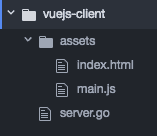

目录结构

1.  用以下命令运行程序：

```go
$ go run server.go
```

# 工作原理…

一旦我们运行程序，HTTP 服务器将在本地监听端口`8080`。

浏览到`http://localhost:8080`将会显示我们的 VueJS 客户端页面，其中有一个包含 Id、FirstName 和 LastName 字段的 HTML 表单，如下截图所示：

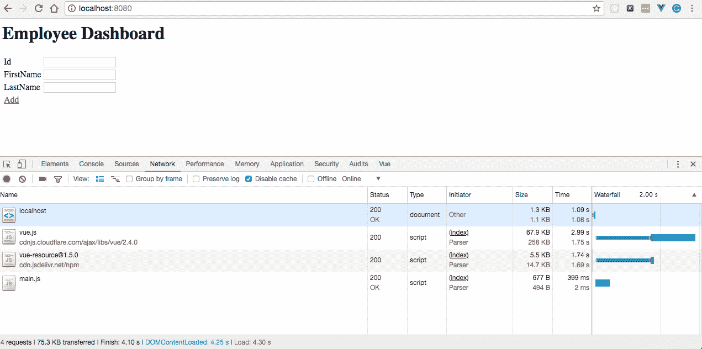

VueJS 客户端页面

在填写表单后点击添加按钮将会向运行在端口`8080`上的 HTTP 服务器发送一个`POST`请求，如下截图所示：

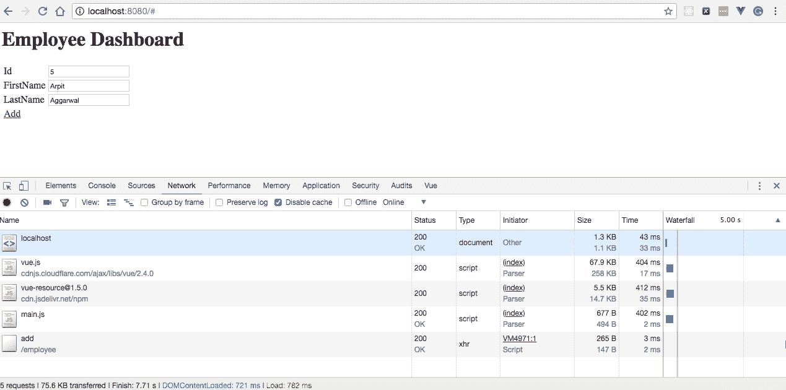

在填写表单后点击添加按钮

接下来，从命令行执行一个`GET`请求，将会给你一个所有静态员工的列表：

```go
$ curl -X GET http://localhost:8080/employees
```

这将会和新添加的员工一起显示如下：

```go
[{"id":"1","firstName":"Foo","lastName":"Bar"},{"id":"2","firstName":"Baz","lastName":"Qux"},{"id":"5","firstName":"Arpit","lastName":"Aggarwal"}]
```
