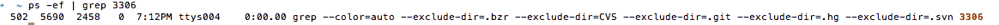
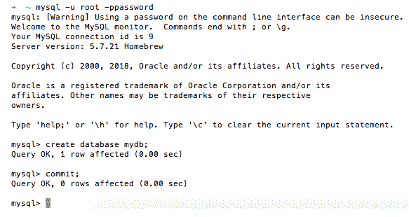
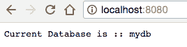
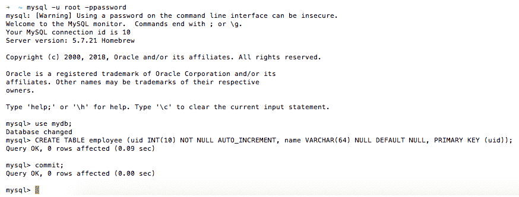
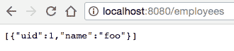
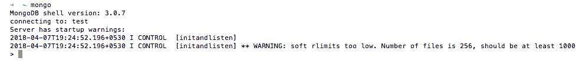
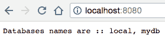
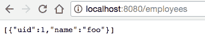

# 第五章：使用 SQL 和 NoSQL 数据库

在本章中，我们将涵盖以下内容：

+   集成 MySQL 和 Go

+   在 MySQL 中创建您的第一条记录

+   从 MySQL 中读取记录

+   更新您的第一条记录在 MySQL 中

+   从 MySQL 中删除您的第一条记录

+   集成 MongoDB 和 Go

+   在 MongoDB 中创建您的第一个文档

+   从 MongoDB 中读取文档

+   在 MongoDB 中更新您的第一个文档

+   从 MongoDB 中删除您的第一个文档

# 介绍

每当我们想要持久保存数据时，我们总是期待将其保存在数据库中，主要分为两类——**SQL**和**NoSQL**。每个类别下都有许多可以根据业务用例使用的数据库，因为每个数据库都具有不同的特性并且服务于不同的目的。

在本章中，我们将把 Go Web 应用程序与最著名的开源数据库——**MySQL**和**MongoDB**集成，并学习在它们上执行 CRUD 操作。由于我们将使用 MySQL 和 MongoDB，我假设这两个数据库都已安装并在您的本地机器上运行。

# 集成 MySQL 和 Go

假设您是一名开发人员，并且希望将应用程序数据保存在 MySQL 数据库中。作为第一步，您必须在应用程序和 MySQL 之间建立连接，我们将在本示例中介绍。

# 准备就绪...

通过执行以下命令验证本地端口`3306`上是否安装并运行了 MySQL：

```go
$ ps -ef | grep 3306
```

这应该返回以下响应：



还要登录到 MySQL 数据库并创建一个 mydb 数据库，执行如下截图中显示的命令：



# 如何做...

1.  使用`go get`命令安装`github.com/go-sql-driver/mysql`包，如下所示：

```go
$ go get github.com/go-sql-driver/mysql
```

1.  创建`connect-mysql.go`。然后我们连接到 MySQL 数据库并执行`SELECT`查询以获取当前数据库名称，如下所示：

```go
package main
import 
(
  "database/sql"
  "fmt"
  "log"
  "net/http"
  "github.com/go-sql-driver/mysql"
)
const 
(
  CONN_HOST = "localhost"
  CONN_PORT = "8080"
  DRIVER_NAME = "mysql"
  DATA_SOURCE_NAME = "root:password@/mydb"
)
var db *sql.DB
var connectionError error
func init() 
{
  db, connectionError = sql.Open(DRIVER_NAME, DATA_SOURCE_NAME)
  if connectionError != nil 
  {
    log.Fatal("error connecting to database :: ", connectionError)
  }
}
func getCurrentDb(w http.ResponseWriter, r *http.Request) 
{
  rows, err := db.Query("SELECT DATABASE() as db")
  if err != nil 
  {
    log.Print("error executing query :: ", err)
    return
  }
  var db string
  for rows.Next() 
  {
    rows.Scan(&db)
  }
  fmt.Fprintf(w, "Current Database is :: %s", db)
}
func main() 
{
  http.HandleFunc("/", getCurrentDb)
  defer db.Close()
  err := http.ListenAndServe(CONN_HOST+":"+CONN_PORT, nil)
  if err != nil 
  {
    log.Fatal("error starting http server :: ", err)
    return
  }
}
```

1.  使用以下命令运行程序：

```go
$ go run connect-mysql.go
```

# 它是如何工作的...

一旦我们运行程序，HTTP 服务器将在本地监听端口`8080`。

浏览到`http://localhost:8080/`将返回当前数据库名称，如下截图所示：



让我们了解我们编写的程序：

1.  使用`import ("database/sql" "fmt" "log" "net/http" _ "github.com/go-sql-driver/mysql")`，我们导入了`github.com/go-sql-driver/mysql`以进行副作用或初始化，使用下划线在导入语句前面明确表示。

1.  使用`var db *sql.DB`，我们声明了一个私有的`DB`实例。

根据项目大小，您可以全局声明一个 DB 实例，使用处理程序将其注入为依赖项，或将连接池指针放入`x/net/context`中。

1.  接下来，我们定义了一个`init()`函数，在其中我们连接到数据库并将数据库驱动程序名称和数据源传递给它。

1.  然后，我们定义了一个`getCurrentDb`处理程序，基本上在数据库上执行选择查询以获取当前数据库名称，遍历记录，将其值复制到变量中，最终将其写入 HTTP 响应流。

# 在 MySQL 中创建您的第一条记录

在数据库中创建或保存记录需要我们编写 SQL 查询并执行它们，实现**对象关系映射**（**ORM**），或实现数据映射技术。

在这个示例中，我们将编写一个 SQL 查询，并使用`database/sql`包执行它来创建一条记录。为了实现这一点，您还可以使用 Go 中许多第三方库中可用的任何库来实现 ORM，例如`https://github.com/jinzhu/gorm`，`https://github.com/go-gorp/gorp`和`https://github.com/jirfag/go-queryset`。

# 准备就绪...

由于我们在上一个示例中已经与 MySQL 数据库建立了连接，我们将扩展它以执行 SQL 查询来创建一条记录。

在创建记录之前，我们必须在 MySQL 数据库中创建一个表，我们将通过执行以下截图中显示的命令来完成：



# 操作步骤…

1.  使用`go get`命令安装`github.com/go-sql-driver/mysql`和`github.com/gorilla/mux`包，如下所示：

```go
$ go get github.com/go-sql-driver/mysql
$ go get github.com/gorilla/mux
```

1.  创建`create-record-mysql.go`。然后我们连接到 MySQL 数据库并执行 INSERT 查询以创建员工记录，如下所示：

```go
package main
import 
(
  "database/sql"
  "fmt"
  "log"
  "net/http"
  "strconv"
  "github.com/go-sql-driver/mysql"
  "github.com/gorilla/mux"
)
const 
(
  CONN_HOST = "localhost"
  CONN_PORT = "8080"
  DRIVER_NAME = "mysql"
  DATA_SOURCE_NAME = "root:password@/mydb"
)
var db *sql.DB
var connectionError error
func init() 
{
  db, connectionError = sql.Open(DRIVER_NAME, DATA_SOURCE_NAME)
  if connectionError != nil 
  {
    log.Fatal("error connecting to database : ", connectionError)
  }
}
func createRecord(w http.ResponseWriter, r *http.Request) 
{
  vals := r.URL.Query()
  name, ok := vals["name"]
  if ok 
  {
    log.Print("going to insert record in database for name : ",
    name[0])
    stmt, err := db.Prepare("INSERT employee SET name=?")
    if err != nil 
    {
      log.Print("error preparing query :: ", err)
      return
    }
    result, err := stmt.Exec(name[0])
    if err != nil 
    {
      log.Print("error executing query :: ", err)
      return
    }
    id, err := result.LastInsertId()
    fmt.Fprintf(w, "Last Inserted Record Id is :: %s",
    strconv.FormatInt(id, 10))
  } 
  else 
  {
    fmt.Fprintf(w, "Error occurred while creating record in 
    database for name :: %s", name[0])
  }
}
func main() 
{
  router := mux.NewRouter()
  router.HandleFunc("/employee/create", createRecord).
  Methods("POST")
  defer db.Close()
  err := http.ListenAndServe(CONN_HOST+":"+CONN_PORT, router)
  if err != nil 
  {
    log.Fatal("error starting http server : ", err)
    return
  }
}
```

1.  使用以下命令运行程序：

```go
$ go run create-record-mysql.go
```

# 工作原理…

运行程序后，HTTP 服务器将在本地监听端口`8080`。

从命令行执行`POST`请求以创建员工记录，将会给出最后创建的记录的 ID：

```go
$ curl -X POST http://localhost:8080/employee/create?name=foo
Last created record id is :: 1
```

让我们理解我们编写的程序：

1.  使用`import ("database/sql" "fmt" "log" "net/http" "strconv" _ "github.com/go-sql-driver/mysql" "github.com/gorilla/mux")`，我们导入了`github.com/gorilla/mux`来创建一个 Gorilla Mux 路由器，并初始化了 Go MySQL 驱动，导入了`github.com/go-sql-driver/mysql`包。

1.  接下来，我们定义了一个`createRecord`处理程序，它从请求中获取姓名，将其分配给本地变量名，准备一个带有姓名占位符的`INSERT`语句，该占位符将动态替换为姓名，执行该语句，并最终将最后创建的 ID 写入 HTTP 响应流。

# 从 MySQL 中读取记录

在上一个示例中，我们在 MySQL 数据库中创建了一个员工记录。现在，在这个示例中，我们将学习如何通过执行 SQL 查询来读取它。

# 操作步骤…

1.  使用`go get`命令安装`github.com/go-sql-driver/mysql`和`github.com/gorilla/mux`包，如下所示：

```go
$ go get github.com/go-sql-driver/mysql
$ go get github.com/gorilla/mux
```

1.  创建`read-record-mysql.go`，在其中我们连接到 MySQL 数据库，执行`SELECT`查询以获取数据库中的所有员工，遍历记录，将其值复制到结构体中，将所有记录添加到列表中，并将其写入 HTTP 响应流，如下所示：

```go
package main
import 
(
  "database/sql" "encoding/json"
  "log"
  "net/http"
  "github.com/go-sql-driver/mysql"
  "github.com/gorilla/mux"
)
const 
(
  CONN_HOST = "localhost"
  CONN_PORT = "8080"
  DRIVER_NAME = "mysql"
  DATA_SOURCE_NAME = "root:password@/mydb"
)
var db *sql.DB
var connectionError error
func init() 
{
  db, connectionError = sql.Open(DRIVER_NAME, DATA_SOURCE_NAME)
  if connectionError != nil 
  {
    log.Fatal("error connecting to database :: ", connectionError)
  }
}
type Employee struct 
{
  Id int `json:"uid"`
  Name string `json:"name"`
}
func readRecords(w http.ResponseWriter, r *http.Request) 
{
  log.Print("reading records from database")
  rows, err := db.Query("SELECT * FROM employee")
  if err != nil 
  {
    log.Print("error occurred while executing select 
    query :: ",err)
    return
  }
  employees := []Employee{}
  for rows.Next() 
  {
    var uid int
    var name string
    err = rows.Scan(&uid, &name)
    employee := Employee{Id: uid, Name: name}
    employees = append(employees, employee)
  }
  json.NewEncoder(w).Encode(employees)
}
func main() 
{
  router := mux.NewRouter()
  router.HandleFunc("/employees", readRecords).Methods("GET")
  defer db.Close()
  err := http.ListenAndServe(CONN_HOST+":"+CONN_PORT, router)
  if err != nil 
  {
    log.Fatal("error starting http server :: ", err)
    return
  }
}
```

1.  使用以下命令运行程序：

```go
$ go run read-record-mysql.go
```

# 工作原理…

运行程序后，HTTP 服务器将在本地监听端口`8080`。

浏览到`http://localhost:8080/employees`将列出员工表中的所有记录，如下截图所示：



让我们看一下我们编写的程序：

1.  使用`import ("database/sql" "encoding/json" "log" "net/http" _ "github.com/go-sql-driver/mysql" "github.com/gorilla/mux")`，我们导入了一个额外的包`encoding/json`，它有助于将 Go 数据结构编组为`JSON`。

1.  接下来，我们声明了 Go 数据结构`Person`，它具有`Id`和`Name`字段。

请记住，在类型定义中字段名称应以大写字母开头，否则可能会出现错误。

1.  接下来，我们定义了一个`readRecords`处理程序，它查询数据库以获取员工表中的所有记录，遍历记录，将其值复制到结构体中，将所有记录添加到列表中，将对象列表编组为 JSON，并将其写入 HTTP 响应流。

# 在 MySQL 中更新您的第一个记录

考虑这样一个情景，你在数据库中创建了一个员工的记录，包括姓名、部门、地址等所有细节，一段时间后员工更换了部门。在这种情况下，我们必须在数据库中更新他们的部门，以便他们的详细信息在整个组织中保持同步，这可以通过`SQL UPDATE`语句实现，在这个示例中，我们将学习如何在 Go 中实现它。

# 操作步骤…

1.  使用`go get`命令安装`github.com/go-sql-driver/mysql`和`github.com/gorilla/mux`包，如下所示：

```go
$ go get github.com/go-sql-driver/mysql
$ go get github.com/gorilla/mux
```

1.  创建`update-record-mysql.go`。然后我们连接到 MySQL 数据库，更新员工的姓名，然后将更新的记录数量写入数据库到 HTTP 响应流中，如下所示：

```go
package main
import 
(
  "database/sql"
  "fmt"
  "log"
  "net/http" 
  "github.com/go-sql-driver/mysql"
  "github.com/gorilla/mux"
)
const 
(
  CONN_HOST = "localhost"
  CONN_PORT = "8080"
  DRIVER_NAME = "mysql"
  DATA_SOURCE_NAME = "root:password@/mydb"
)
var db *sql.DB
var connectionError error 
func init() 
{
  db, connectionError = sql.Open(DRIVER_NAME, DATA_SOURCE_NAME)
  if connectionError != nil 
  {
    log.Fatal("error connecting to database :: ", connectionError)
  }
}
type Employee struct 
{
  Id   int    `json:"uid"`
  Name string `json:"name"`
}
func updateRecord(w http.ResponseWriter, r *http.Request) 
{
  vars := mux.Vars(r)
  id := vars["id"]
  vals := r.URL.Query()
  name, ok := vals["name"]
  if ok 
  {
    log.Print("going to update record in database 
    for id :: ", id)
    stmt, err := db.Prepare("UPDATE employee SET name=? 
    where uid=?")
    if err != nil 
    {
      log.Print("error occurred while preparing query :: ", err)
      return
    }
    result, err := stmt.Exec(name[0], id)
    if err != nil 
    {
      log.Print("error occurred while executing query :: ", err)
      return
    }
    rowsAffected, err := result.RowsAffected()
    fmt.Fprintf(w, "Number of rows updated in database 
    are :: %d",rowsAffected)
  } 
  else 
  {
    fmt.Fprintf(w, "Error occurred while updating record in 
    database for id :: %s", id)
  }
}
func main() 
{
  router := mux.NewRouter()
  router.HandleFunc("/employee/update/{id}",
  updateRecord).Methods("PUT")
  defer db.Close()
  err := http.ListenAndServe(CONN_HOST+":"+CONN_PORT, router)
  if err != nil 
  {
    log.Fatal("error starting http server :: ", err)
    return
  }
}
```

1.  使用以下命令运行程序：

```go
$ go run update-record-mysql.go
```

# 工作原理…

一旦我们运行程序，HTTP 服务器将在本地监听端口`8080`。

接下来，从命令行执行`PUT`请求以更新 ID 为`1`的员工记录将给出数据库中更新的记录数作为响应：

```go
$ curl -X PUT http://localhost:8080/employee/update/1?name\=bar
Number of rows updated in database are :: 1
```

让我们看一下我们编写的程序：

1.  我们定义了一个`updateRecord`处理程序，它以 URL 路径变量路径中要更新的 ID 和请求变量中的新名称作为输入，准备一个带有名称和 UID 占位符的`update`语句，该占位符将动态替换，执行该语句，获取执行结果中更新的行数，并将其写入 HTTP 响应流。

1.  接下来，我们注册了一个`updateRecord`处理程序，用于处理`gorilla/mux`路由器中`/employee/update/{id}`的 URL 模式的每个`PUT`请求，并在从`main()`函数返回时使用`defer db.Close()`语句关闭数据库。

# 从 MySQL 中删除您的第一条记录

考虑这样一个情景，员工已经离开组织，您想要从数据库中撤销他们的详细信息。在这种情况下，我们可以使用`SQL DELETE`语句，我们将在本教程中介绍。

# 如何做到这一点...

1.  使用`go get`命令安装`github.com/go-sql-driver/mysql`和`github.com/gorilla/mux`包，如下所示：

```go
$ go get github.com/go-sql-driver/mysql
$ go get github.com/gorilla/mux
```

1.  创建`delete-record-mysql.go`。然后我们连接到 MySQL 数据库，从数据库中删除员工的名称，并将从数据库中删除的记录数写入 HTTP 响应流，如下所示：

```go
package main
import 
(
  "database/sql"
  "fmt"
  "log"
  "net/http"
  "github.com/go-sql-driver/mysql"
  "github.com/gorilla/mux"
)
const 
(
  CONN_HOST = "localhost"
  CONN_PORT = "8080"
  DRIVER_NAME = "mysql"
  DATA_SOURCE_NAME = "root:password@/mydb"
)
var db *sql.DB
var connectionError error
func init() 
{
  db, connectionError = sql.Open(DRIVER_NAME, DATA_SOURCE_NAME)
  if connectionError != nil 
  {
    log.Fatal("error connecting to database :: ", connectionError)
  }
}
func deleteRecord(w http.ResponseWriter, r *http.Request) 
{
  vals := r.URL.Query()
  name, ok := vals["name"]
  if ok 
  {
    log.Print("going to delete record in database for 
    name :: ", name[0])
    stmt, err := db.Prepare("DELETE from employee where name=?")
    if err != nil 
    {
      log.Print("error occurred while preparing query :: ", err)
      return
    }
    result, err := stmt.Exec(name[0])
    if err != nil 
    {
      log.Print("error occurred while executing query :: ", err)
      return
    }
    rowsAffected, err := result.RowsAffected()
    fmt.Fprintf(w, "Number of rows deleted in database are :: %d",
    rowsAffected)
  } 
  else 
  {
    fmt.Fprintf(w, "Error occurred while deleting record in 
    database for name %s", name[0])
  }
}
func main() 
{
  router := mux.NewRouter()
  router.HandleFunc("/employee/delete",
  deleteRecord).Methods("DELETE")
  defer db.Close()
  err := http.ListenAndServe(CONN_HOST+":"+CONN_PORT, router)
  if err != nil 
  {
    log.Fatal("error starting http server :: ", err)
    return
  }
}
```

1.  使用以下命令运行程序：

```go
$ go run delete-record-mysql.go
```

# 它是如何工作的...

一旦我们运行程序，HTTP 服务器将在本地监听端口`8080`。

接下来，从命令行执行`DELETE`请求以删除名称为`bar`的员工将给出从数据库中删除的记录数：

```go
$ curl -X DELETE http://localhost:8080/employee/delete?name\=bar
Number of rows deleted in database are :: 1
```

让我们看一下我们编写的程序：

1.  我们定义了一个`deleteRecord`处理程序，它以请求变量中要从数据库中删除的名称作为输入，准备一个带有名称占位符的`DELETE`语句，该占位符将动态替换，执行该语句，获取执行结果中删除的行数，并将其写入 HTTP 响应流。

1.  接下来，我们注册了一个`deleteRecord`处理程序，用于处理`gorilla/mux`路由器中`/employee/delete`的 URL 模式的每个`DELETE`请求，并在从`main()`函数返回时使用`defer db.Close()`语句关闭数据库。

# 集成 MongoDB 和 Go

每当您想要在 MongoDB 数据库中持久保存数据时，您必须采取的第一步是在数据库和您的 Web 应用程序之间建立连接，在本教程中，我们将使用 Go 中最著名和常用的 MongoDB 驱动程序之一`gopkg.in/mgo.v2`。

# 准备就绪...

通过执行以下命令验证`MongoDB`是否安装并在本地端口`27017`上运行：

```go
$ mongo
```

这应该返回以下响应：



# 如何做到这一点...

1.  使用`go get`命令安装`gopkg.in/mgo.v`包，如下所示：

```go
$ go get gopkg.in/mgo.v
```

1.  创建`connect-mongodb.go`。然后我们连接到`MongoDB`数据库，从集群中获取所有数据库名称，并将它们写入 HTTP 响应流，如下所示：

```go
package main
import 
(
  "fmt"
  "log"
  "net/http"
  "strings"
  mgo "gopkg.in/mgo.v2"
)
const 
(
  CONN_HOST = "localhost"
  CONN_PORT = "8080"
  MONGO_DB_URL = "127.0.0.1"
)
var session *mgo.Session
var connectionError error
func init() 
{
  session, connectionError = mgo.Dial(MONGO_DB_URL)
  if connectionError != nil 
  {
    log.Fatal("error connecting to database :: ", connectionError)
  }
  session.SetMode(mgo.Monotonic, true)
}
func getDbNames(w http.ResponseWriter, r *http.Request) 
{
  db, err := session.DatabaseNames()
  if err != nil 
  {
    log.Print("error getting database names :: ", err)
    return
  }
  fmt.Fprintf(w, "Databases names are :: %s", strings.Join
  (db, ", "))
}
func main() 
{
  http.HandleFunc("/", getDbNames)
  defer session.Close()
  err := http.ListenAndServe(CONN_HOST+":"+CONN_PORT, nil)
  if err != nil 
  {
    log.Fatal("error starting http server :: ", err)
    return
  }
}
```

1.  使用以下命令运行程序：

```go
$ go run connect-mongodb.go
```

# 它是如何工作的...

一旦我们运行程序，HTTP 服务器将在本地监听端口`8080`。

浏览到`http://localhost:8080/`将列出 MongoDB 集群中存在的所有数据库的名称，并显示如下屏幕截图所示：



让我们看一下我们编写的程序：

1.  使用`import（"fmt" "log" "net/http" "strings" mgo

"gopkg.in/mgo.v2"）`，我们导入了`gopkg.in/mgo.v2`并使用`mgo`作为包别名。

1.  使用`var session *mgo.Session`，我们声明了私有的 MongoDB`Session`实例，它作为与数据库的通信会话。

1.  使用`var connectionError error`，我们声明了一个私有的`error`对象。

1.  接下来，我们定义了`init()`函数，在这里我们连接到 MongoDB，传递主机为`127.0.0.1`，这意味着 MongoDB 和应用程序都在同一台机器上的端口`27017`上运行，可选择将会话切换到单调行为，以便在同一会话中的顺序查询中读取的数据将是一致的，并且在会话中进行的修改将在随后的查询中被观察到。

如果你的 MongoDB 运行在除`27017`之外的端口上，那么你必须传递主机和端口，用冒号分隔，如：`mgo.Dial("localhost:27018")`。

1.  接下来，我们定义了一个`getDbNames`处理程序，它基本上从 MongoDB 集群中获取所有数据库名称，并将它们作为逗号分隔的字符串写入 HTTP 响应流。

# 在 MongoDB 中创建你的第一个文档

在这个示例中，我们将学习如何在数据库中创建一个 BSON 文档（JSON 样式文档的二进制编码序列化），使用 Go 的 MongoDB 驱动程序（[gopkg.in/mgo.v2](http://gopkg.in/mgo.v2)）。

# 如何做...

1.  使用以下命令，安装`gopkg.in/mgo.v2`和`github.com/gorilla/mux`包：

```go
$ go get gopkg.in/mgo.v2
$ go get github.com/gorilla/mux
```

1.  创建`create-record-mongodb.go`。然后我们连接到 MongoDB 数据库，创建一个包含两个字段（ID 和姓名）的员工文档，并将最后创建的文档 ID 写入 HTTP 响应流，如下所示：

```go
package main
import 
(
  "fmt"
  "log"
  "net/http"
  "strconv"
  "github.com/gorilla/mux"
  mgo "gopkg.in/mgo.v2"
)
const 
(
  CONN_HOST = "localhost"
  CONN_PORT = "8080"
  MONGO_DB_URL = "127.0.0.1"
)
var session *mgo.Session
var connectionError error
type Employee struct 
{
  Id int `json:"uid"`
  Name string `json:"name"`
}
func init() 
{
  session, connectionError = mgo.Dial(MONGO_DB_URL)
  if connectionError != nil 
  {
    log.Fatal("error connecting to database :: ", connectionError)
  }
  session.SetMode(mgo.Monotonic, true)
}
func createDocument(w http.ResponseWriter, r *http.Request) 
{
  vals := r.URL.Query()
  name, nameOk := vals["name"]
  id, idOk := vals["id"]
  if nameOk && idOk 
  {
    employeeId, err := strconv.Atoi(id[0])
    if err != nil 
    {
      log.Print("error converting string id to int :: ", err)
      return
    }
    log.Print("going to insert document in database for name 
    :: ", name[0])
    collection := session.DB("mydb").C("employee")
    err = collection.Insert(&Employee{employeeId, name[0]})
    if err != nil 
    {
      log.Print("error occurred while inserting document in 
      database :: ", err)
      return
    }
    fmt.Fprintf(w, "Last created document id is :: %s", id[0])
  } 
  else 
  {
    fmt.Fprintf(w, "Error occurred while creating document in
    database for name :: %s", name[0])
  }
}
func main() 
{
  router := mux.NewRouter()
  router.HandleFunc("/employee/create",
  createDocument).Methods("POST")
  defer session.Close()
  err := http.ListenAndServe(CONN_HOST+":"+CONN_PORT, router)
  if err != nil 
  {
    log.Fatal("error starting http server :: ", err)
    return
  }
}
```

1.  使用以下命令运行程序：

```go
$ go run create-record-mongodb.go
```

# 它是如何工作的...

一旦我们运行程序，HTTP 服务器将在本地监听端口`8080`。

接下来，执行以下命令行中的`POST`请求来创建一个员工文档将会给你在 MongoDB 中创建的文档的 ID：

```go
$ curl -X POST http://localhost:8080/employee/create?name=foo\&id=1
Last created document id is :: 1
```

让我们来看一下我们编写的程序：

1.  使用`import ("fmt" "log" "net/http" "strconv" "github.com/gorilla/mux" mgo "gopkg.in/mgo.v2")`，我们导入了`github.com/gorilla/mux`来创建一个 Gorilla Mux 路由器，以及`gopkg.in/mgo.v2`，包别名为`mgo`，它将作为 MongoDB 驱动程序。

1.  接下来，我们定义了一个`createDocument`处理程序，它从 HTTP 请求中获取员工的姓名和 ID。因为请求变量的类型是`string`，我们将`string`类型的变量 ID 转换为`int`类型。然后，我们从 MongoDB 获取员工集合，并调用`collection.Insert`处理程序将`Employee`结构类型的实例保存到数据库中。

# 从 MongoDB 中读取文档

在上一个示例中，我们在 MongoDB 中创建了一个 BSON 文档。现在，在这个示例中，我们将学习如何使用`gopkg.in/mgo.v2/bson`包来读取它，该包有助于查询 MongoDB 集合。

# 如何做...

1.  使用以下命令，安装`gopkg.in/mgo.v2`、`gopkg.in/mgo.v2/bson`和`github.com/gorilla/mux`包：

```go
$ go get gopkg.in/mgo.v2
$ go get gopkg.in/mgo.v2/bson
$ go get github.com/gorilla/mux
```

1.  创建`read-record-mongodb.go`。然后我们连接到 MongoDB 数据库，读取员工集合中的所有文档，将列表编组为 JSON，并将其写入 HTTP 响应流，如下所示：

```go
package main
import 
(
  "encoding/json"
  "log"
  "net/http"
  "github.com/gorilla/mux"
  mgo "gopkg.in/mgo.v2"
  "gopkg.in/mgo.v2/bson"
)
const 
(
  CONN_HOST = "localhost"
  CONN_PORT = "8080"
  MONGO_DB_URL = "127.0.0.1"
)
var session *mgo.Session
var connectionError error
func init() 
{
  session, connectionError = mgo.Dial(MONGO_DB_URL)
  if connectionError != nil 
  {
    log.Fatal("error connecting to database :: ", connectionError)
  }
  session.SetMode(mgo.Monotonic, true)
}
type Employee struct 
{
  Id int `json:"uid"`
  Name string `json:"name"`
}
func readDocuments(w http.ResponseWriter, r *http.Request) 
{
  log.Print("reading documents from database")
  var employees []Employee
  collection := session.DB("mydb").C("employee")
  err := collection.Find(bson.M{}).All(&employees)
  if err != nil 
  {
    log.Print("error occurred while reading documents from 
    database :: ", err)
    return
  }
  json.NewEncoder(w).Encode(employees)
}
func main() 
{
  router := mux.NewRouter()
  router.HandleFunc("/employees", readDocuments).Methods("GET")
  defer session.Close()
  err := http.ListenAndServe(CONN_HOST+":"+CONN_PORT, router)
  if err != nil 
  {
    log.Fatal("error starting http server :: ", err)
    return
  }
}
```

1.  使用以下命令运行程序：

```go
$ go run read-record-mongodb.go
```

# 它是如何工作的...

一旦我们运行程序，HTTP 服务器将在本地监听端口`8080`。

接下来，浏览到`http://localhost:8080/employees`将会给你 MongoDB 员工集合中所有员工的列表：



让我们来看一下我们在程序中引入的更改：

1.  使用`import ("encoding/json" "log" "net/http" "github.com/gorilla/mux" mgo "gopkg.in/mgo.v2" "gopkg.in/mgo.v2/bson")`，我们导入了额外的`gopkg.in/mgo.v2/bson`包，它是 Go 的 BSON 规范，以及`encoding/json`包，我们用它来将我们从 MongoDB 获取的对象列表编组为`JSON`。

1.  接下来，我们定义了一个`readDocuments`处理程序，在这里我们首先从 MongoDB 获取员工集合，查询其中的所有文档，遍历文档将其映射到`Employee`结构的数组中，最后将其编组为`JSON`。

# 在 MongoDB 中更新您的第一个文档

一旦创建了一个 BSON 文档，我们可能需要更新其中的一些字段。在这种情况下，我们必须在 MongoDB 集合上执行`update/upsert`查询，这将在本教程中介绍。

# 如何做…

1.  使用`go get`命令安装`gopkg.in/mgo.v2`、`gopkg.in/mgo.v2/bson`和`github.com/gorilla/mux`包，如下所示：

```go
$ go get gopkg.in/mgo.v2
$ go get gopkg.in/mgo.v2/bson
$ go get github.com/gorilla/mux
```

1.  创建`update-record-mongodb.go`。然后我们连接到 MongoDB 数据库，更新 ID 的员工的名称，并将在 HTTP 响应流中写入在 MongoDB 中更新的记录数量，如下所示：

```go
package main
import 
(
  "fmt"
  "log"
  "net/http"
  "strconv"
  "github.com/gorilla/mux"
  mgo "gopkg.in/mgo.v2"
  "gopkg.in/mgo.v2/bson"
)
const 
(
  CONN_HOST = "localhost"
  CONN_PORT = "8080"
  MONGO_DB_URL = "127.0.0.1"
)
var session *mgo.Session
var connectionError error
type Employee struct 
{
  Id int `json:"uid"`
  Name string `json:"name"`
}
func init() 
{
  session, connectionError = mgo.Dial(MONGO_DB_URL)
  if connectionError != nil 
  {
    log.Fatal("error connecting to database :: ", 
    connectionError)
  }
  session.SetMode(mgo.Monotonic, true)
}
func updateDocument(w http.ResponseWriter, r *http.Request) 
{
  vars := mux.Vars(r)
  id := vars["id"]
  vals := r.URL.Query()
  name, ok := vals["name"]
  if ok 
  {
    employeeId, err := strconv.Atoi(id)
    if err != nil 
    {
      log.Print("error converting string id to int :: ", err)
      return
    }
    log.Print("going to update document in database 
    for id :: ", id)
    collection := session.DB("mydb").C("employee")
    var changeInfo *mgo.ChangeInfo
    changeInfo, err = collection.Upsert(bson.M{"id": employeeId},
    &Employee{employeeId, name[0]})
    if err != nil 
    {
      log.Print("error occurred while updating record in 
      database :: ", err)
      return
    }
    fmt.Fprintf(w, "Number of documents updated in database 
    are :: %d", changeInfo.Updated)
  } 
  else 
  {
    fmt.Fprintf(w, "Error occurred while updating document
    in database for id :: %s", id)
  }
}
func main() 
{
  router := mux.NewRouter()
  router.HandleFunc("/employee/update/{id}",
  updateDocument).Methods("PUT")
  defer session.Close()
  err := http.ListenAndServe(CONN_HOST+":"+CONN_PORT, router)
  if err != nil 
  {
    log.Fatal("error starting http server :: ", err)
    return
  }
}
```

1.  使用以下命令运行程序：

```go
$ go run update-record-mongodb.go
```

# 它是如何工作的…

一旦我们运行程序，HTTP 服务器将在本地监听端口`8080`。

接下来，通过命令行执行`PUT`请求来更新员工文档，如下所示，将会给出在 MongoDB 中更新的文档数量：

```go
$ curl -X PUT http://localhost:8080/employee/update/1\?name\=bar
Number of documents updated in database are :: 1
```

让我们来看一下我们写的程序：

1.  我们定义了一个`updateDocument`处理程序，它从 URL 路径变量中获取要在 MongoDB 中更新的 ID 和作为 HTTP 请求变量的新名称。由于请求变量是字符串类型，我们将`string`类型的变量 ID 转换为`int`类型。然后，我们从 MongoDB 获取员工集合，并调用`collection.Upsert`处理程序，以插入（如果不存在）或更新具有新名称的员工文档的 ID。

1.  接下来，我们注册了一个`updateDocument`处理程序，用于处理`/employee/update/{id}`的 URL 模式，对于每个使用`gorilla/mux`路由器的`PUT`请求，并在我们从`main()`函数返回时使用`defer session.Close()`语句关闭 MongoDB 会话。

# 从 MongoDB 中删除您的第一个文档

每当我们想要清理数据库或删除不再需要的文档时，我们可以使用 Go 的 MongoDB 驱动程序（[gopkg.in/mgo.v2](http://gopkg.in/mgo.v2)）轻松地删除它们，这将在本教程中介绍。

# 如何做…

1.  使用`go get`命令安装`gopkg.in/mgo.v2`、`gopkg.in/mgo.v2/bson`和`github.com/gorilla/mux`包，如下所示：

```go
$ go get gopkg.in/mgo.v2
$ go get gopkg.in/mgo.v2/bson
$ go get github.com/gorilla/mux
```

1.  创建`delete-record-mongodb.go`。然后我们连接到 MongoDB，从数据库中获取要删除的员工的名称作为 HTTP 请求变量，获取命名集合，并按如下方式删除文档：

```go
package main
import 
(
  "fmt"
  "log"
  "net/http"
  "github.com/gorilla/mux"
  mgo "gopkg.in/mgo.v2"
  "gopkg.in/mgo.v2/bson"
)
const 
(
  CONN_HOST = "localhost"
  CONN_PORT = "8080"
  MONGO_DB_URL = "127.0.0.1"
)
var session *mgo.Session
var connectionError error
type Employee struct 
{
  Id int `json:"uid"`
  Name string `json:"name"`
}
func init() 
{
  session, connectionError = mgo.Dial(MONGO_DB_URL)
  if connectionError != nil 
  {
    log.Fatal("error connecting to database :: ", 
    connectionError)
  }
  session.SetMode(mgo.Monotonic, true)
}
func deleteDocument(w http.ResponseWriter, r *http.Request) 
{
  vals := r.URL.Query()
  name, ok := vals["name"]
  if ok 
  {
    log.Print("going to delete document in database for 
    name :: ", name[0])
    collection := session.DB("mydb").C("employee")
    removeErr := collection.Remove(bson.M{"name": name[0]})
    if removeErr != nil 
    {
      log.Print("error removing document from 
      database :: ", removeErr)
      return
    }
    fmt.Fprintf(w, "Document with name %s is deleted from 
    database", name[0])
  } 
  else 
  {
    fmt.Fprintf(w, "Error occurred while deleting document 
    in database for name :: %s", name[0])
  }
}
func main() 
{
  router := mux.NewRouter()
  router.HandleFunc("/employee/delete",
  deleteDocument).Methods("DELETE")
  defer session.Close()
  err := http.ListenAndServe(CONN_HOST+":"+CONN_PORT, router)
  if err != nil 
  {
    log.Fatal("error starting http server :: ", err)
    return
  }
}
```

1.  使用以下命令运行程序：

```go
$ go run delete-record-mongodb.go
```

# 它是如何工作的…

一旦我们运行程序，HTTP 服务器将在本地监听端口`8080`。

接下来，通过命令行执行`DELETE`请求来删除 BSON 文档，如下所示，将会给出从数据库中删除的文档的名称：

```go
$ curl -X DELETE http://localhost:8080/employee/delete?name\=bar
Document with name bar is deleted from database
```

让我们来看一下我们写的程序：

1.  我们定义了一个`deleteDocument`处理程序，它从 MongoDB 获取要删除的名称作为请求变量，从 MongoDB 获取员工集合，并调用`collection.Remove`处理程序来删除给定名称的文档。

1.  然后，我们注册了一个`deleteDocument`处理程序，用于处理`/employee/delete`的 URL 模式，对于每个使用`gorilla/mux`路由器的`DELETE`请求，并在我们从`main()`函数返回时使用`defer session.Close()`语句关闭 MongoDB 会话。
