# 使用 Micro 编写 Go 中的微服务-微服务工具包

在本章中，我们将涵盖以下内容：

+   创建您的第一个协议缓冲

+   启动微服务发现客户端

+   创建您的第一个微服务

+   创建您的第二个微服务

+   创建您的微服务 API

+   使用命令行界面和 Web UI 与微服务进行交互

# 介绍

随着组织现在转向 DevOps，微服务也开始变得流行起来。由于这些服务具有独立的性质，并且可以用任何语言开发，这使得组织能够专注于它们的开发。通过掌握本章涵盖的概念，我们将能够以相当简单的方式使用 Go Micro 编写微服务。

在本章中，我们将首先编写协议缓冲。然后我们将学习如何启动 Consul，这是一个微服务发现客户端，最终转向创建微服务并通过命令行和 Web 仪表板与它们进行交互。

# 创建您的第一个协议缓冲

协议缓冲是 Go 支持的一种灵活、高效和自动化的编码和序列化结构化数据的机制。在本教程中，我们将学习如何编写我们的第一个协议缓冲。

# 准备就绪…

1.  验证是否通过执行以下命令安装了`protoc`：

```go
$ protoc --version
 libprotoc 3.3.2
```

1.  通过以下方式安装`protobuf`：

```go
$ git clone https://github.com/google/protobuf
$ cd protobuf
$ ./autogen.sh
$ ./configure
$ make
$ make check
$ make install
```

# 如何做…

1.  在`proto`目录中创建`hello.proto`并定义一个名为`Say`的`service`接口，其中包含两种数据类型-`Request`和`Response`，如下所示：

```go
syntax = "proto3";
service Say 
{
  rpc Hello(Request) returns (Response) {}
}
message Request 
{
  string name = 1;
}
message Response 
{
  string msg = 1;
}
```

1.  使用以下命令编译`hello.proto`：

```go
$ protoc --go_out=plugins=micro:. hello.proto
```

# 它是如何工作的…

一旦命令成功执行，`hello.pb.go`将在`proto`目录中创建，其外观如下截图所示：

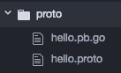

让我们了解我们编写的`.proto`文件：

+   `syntax = "proto3";`：在这里，我们指定我们使用`proto3`语法，这使得编译器了解协议缓冲必须使用版本 3 进行编译。如果我们不明确指定语法，则编译器会假定我们使用`proto2`。

+   `service Say { rpc Hello(Request) returns (Response) {} }`：在这里，我们定义了一个名为`Say`的 RPC 服务和一个接受`Request`并返回`Response`的`Hello`方法。

+   `message Request { string name = 1; }`：在这里，我们定义了具有`name`字段的`Request`数据类型。

+   `message Response { string msg = 1; }`：在这里，我们定义了具有`msg`字段的`Response`数据类型。

# 启动微服务发现客户端

在部署了多个服务的微服务架构中，服务发现客户端帮助应用程序找到它们依赖的服务，可以通过 DNS 或 HTTP 进行。当我们谈论服务发现客户端时，最常见和著名的之一是 HashiCorp 的`Consul`，我们将在本教程中启动它。

# 准备就绪…

通过执行以下命令验证是否安装了`Consul`：

```go
$ consul version
 Consul v0.8.5
 Protocol 2 spoken by default, understands 2 to 3 (agent will automatically use protocol >2 when speaking to compatible agents)
```

# 如何做…

通过执行以下命令以服务器模式启动`consul agent`：

```go
$ consul agent -dev
```

# 它是如何工作的…

一旦命令成功执行，Consul 代理将以服务器模式运行，给我们以下输出：

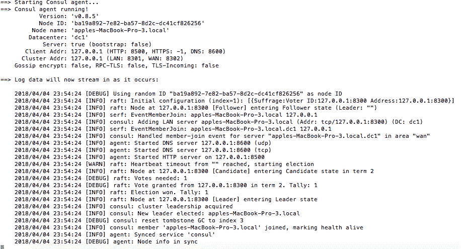

我们还可以通过执行以下命令列出 Consul 集群的成员：

```go
$ consul members
```

这将给我们以下结果：

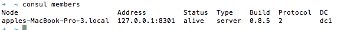

由于 Consul 可以在服务器模式或客户端模式下运行，至少需要一个服务器，为了保持最低限度的设置，我们已经以服务器模式启动了我们的代理，尽管这并不推荐，因为在故障情况下存在数据丢失的可能性。

此外，浏览到`http://localhost:8500/ui/`将显示 Consul Web UI，我们可以在其中查看所有服务和节点，如下所示：

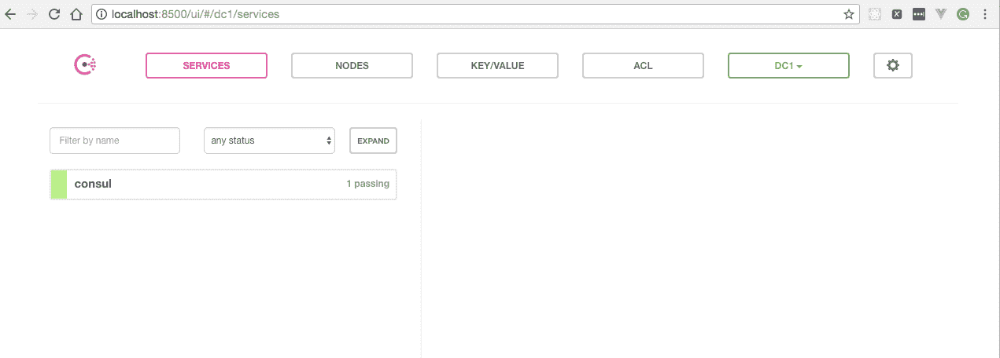

# 创建您的第一个微服务

微服务只是作为唯一进程运行并通过明确定义的轻量级机制进行通信以服务于业务目标的代码片段，我们将在这个示例中使用`https://github.com/micro/micro`编写，尽管还有许多其他库可用，如`https://github.com/go-kit/kit`和`https://github.com/grpc/grpc-go`，它们具有相同的目的。

# 准备就绪…

1.  通过执行以下命令启动`consul agent`：

```go
$ consul agent -dev
```

1.  通过执行以下命令安装和运行`micro`：

```go
$ go get github.com/micro/micro
$ micro api
 2018/02/06 00:03:36 Registering RPC Handler at /rpc
 2018/02/06 00:03:36 Registering API Default Handler at /
 2018/02/06 00:03:36 Listening on [::]:8080
 2018/02/06 00:03:36 Listening on [::]:54814
 2018/02/06 00:03:36 Broker Listening on [::]:54815
 2018/02/06 00:03:36 Registering node: go.micro.api-a6a82a54-0aaf-11e8-8d64-685b35d52676
```

# 如何做…

1.  通过执行命令`$ mkdir services && cd services && touch first-greeting-service.go`在`services`目录中创建`first-greeting-service.go`。

1.  将以下内容复制到`first-greeting-service.go`：

```go
package main
import 
(
  "log"
  "time"
  hello "../proto"
  "github.com/micro/go-micro"
)
type Say struct{}
func (s *Say) Hello(ctx context.Context, req *hello.Request, 
rsp *hello.Response) error 
{
  log.Print("Received Say.Hello request - first greeting service")
  rsp.Msg = "Hello " + req.Name
  return nil
}
func main() 
{
  service := micro.NewService
  (
    micro.Name("go.micro.service.greeter"),
    micro.RegisterTTL(time.Second*30),
    micro.RegisterInterval(time.Second*10),
  )
  service.Init()
  hello.RegisterSayHandler(service.Server(), new(Say))
  if err := service.Run(); err != nil 
  {
    log.Fatal("error starting service : ", err)
    return
  }
}
```

一切就绪后，目录结构应如下所示：

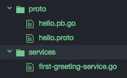

1.  转到`services`目录并使用以下命令运行程序：

```go
$ go run first-greeting-service.go
```

# 它是如何工作的…

一旦我们运行程序，RPC 服务器将在本地监听端口`8080`。

接下来，从命令行执行`POST`请求，如下所示：

```go
$ curl -X POST -H 'Content-Type: application/json' -d '{"service": "go.micro.service.greeter", "method": "Say.Hello", "request": {"name": "Arpit Aggarwal"}}' http://localhost:8080/rpc
```

这将使我们从服务器获得 Hello，然后是名称作为响应，如下所示的屏幕截图：

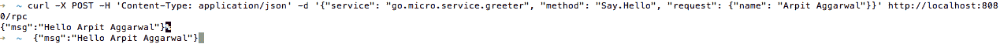

查看`first-greeting-service.go`的日志将向我们展示请求是由第一个问候服务提供的，如下所示：

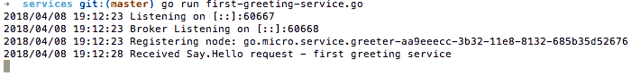

让我们看一下我们编写的程序：

+   使用`import ("log" "time" hello "../proto" "github.com/micro/go-micro" "golang.org/x/net/context")`，我们导入了`"hello "../proto"`，一个包含协议缓冲区源代码和已编译协议缓冲区后缀`.pb.go`的目录。此外，我们导入了`github.com/micro/go-micro`包，其中包含编写微服务所需的所有库。

+   接下来，我们定义了一个`main()`处理程序，在其中使用`micro.NewService()`创建一个名为`go.micro.service.greeter`的新服务，初始化它，注册处理程序，并最终启动它。

# 创建您的第二个微服务

在这个示例中，我们将使用`go-micro`创建另一个微服务，它是`first-greeting-service.go`的副本，除了在控制台上打印的日志消息之外，它演示了两个具有相同名称的服务的客户端负载平衡的概念。

# 如何做…

1.  通过执行命令`$ cd services && touch second-greeting-service.go`在`services`目录中创建`second-greeting-service.go`。

1.  将以下内容复制到`second-greeting-service.go`：

```go
package main
import 
(
  "context"
  "log"
  "time"
  hello "../proto"
  "github.com/micro/go-micro"
)
type Say struct{}
func (s *Say) Hello(ctx context.Context, req *hello.Request, 
rsp *hello.Response) error 
{
  log.Print("Received Say.Hello request - second greeting
  service")
  rsp.Msg = "Hello " + req.Name
  return nil
}
func main() 
{
  service := micro.NewService
  (
    micro.Name("go.micro.service.greeter"),
    micro.RegisterTTL(time.Second*30),
    micro.RegisterInterval(time.Second*10),
  )
  service.Init()
  hello.RegisterSayHandler(service.Server(), new(Say))
  if err := service.Run(); err != nil 
  {
    log.Fatal("error starting service : ", err)
    return
  }
}
```

一切就绪后，目录结构应如下所示：

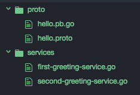

1.  转到`services`目录并使用以下命令运行程序：

```go
$ go run second-greeting-service.go
```

# 它是如何工作的…

一旦我们运行程序，RPC 服务器将在本地监听端口`8080`。

接下来，从命令行执行`POST`请求，如下所示：

```go
$ curl -X POST -H 'Content-Type: application/json' -d '{"service": "go.micro.service.greeter", "method": "Say.Hello", "request": {"name": "Arpit Aggarwal"}}' http://localhost:8080/rpc
```

这将使我们从服务器获得 Hello，然后是名称作为响应，如下所示：

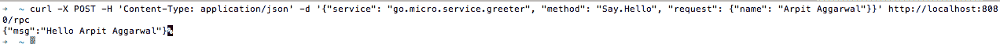

查看`second-greeting-service.go`的日志将向我们展示请求是由第二个问候服务提供的：

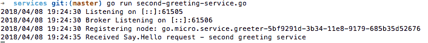

现在，如果我们再次执行`POST`请求，它将在`first-greeting-service.go`控制台中打印日志，这是因为 Go Micro 提供的智能客户端负载平衡构建在发现之上的服务。


# 创建您的 Micro API

到目前为止，我们已经通过名称显式调用了后端服务和访问它的方法。在这个示例中，我们将学习如何使用 Go Micro API 访问服务，该 API 实现了 API 网关模式，提供了微服务的单一入口点。使用 Go Micro API 的优势在于它通过 HTTP 提供服务，并使用 HTTP 处理程序动态路由到适当的后端服务。

# 准备就绪…

通过执行以下命令在单独的终端中启动 `consul agent`、`micro API`、`first-greeting-service.go` 和 `second-greeting-service.go`：

```go
$ consul agent -dev
$ micro api
$ go run first-greeting-service.go
$ go run second-greeting-service.go
```

# 操作步骤…

1.  通过执行命令 `$ mkdir api && cd api && touch greeting-api.go` 在 `api` 目录中创建 `greeting-api.go`。

1.  将以下内容复制到 `greeting-api.go`：

```go
package main
import 
(
  "context"
  "encoding/json"
  "log"
  "strings"
  hello "../proto"
  "github.com/micro/go-micro"
  api "github.com/micro/micro/api/proto"
)
type Say struct 
{
  Client hello.SayClient
}
func (s *Say) Hello(ctx context.Context, req *api.Request, 
rsp *api.Response) error 
{
  log.Print("Received Say.Hello request - Micro Greeter API")
  name, ok := req.Get["name"]
  if ok 
  {
    response, err := s.Client.Hello
    (
      ctx, &hello.Request
      {
        Name: strings.Join(name.Values, " "),
      }
    )
    if err != nil 
    {
      return err
    }
    message, _ := json.Marshal
    (
      map[string]string
      {
        "message": response.Msg,
      }
    )
    rsp.Body = string(message)
  }
  return nil
}
func main() 
{
  service := micro.NewService
  (
    micro.Name("go.micro.api.greeter"),
  )
  service.Init()
  service.Server().Handle
  (
    service.Server().NewHandler
    (
      &Say{Client: hello.NewSayClient("go.micro.service.
      greeter", service.Client())},
    ),
  )
  if err := service.Run(); err != nil 
  {
    log.Fatal("error starting micro api : ", err)
    return
  }
}
```

一切就绪后，目录结构应该如下所示：

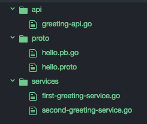

1.  转到 `api` 目录并使用以下命令运行程序：

```go
$ go run greeting-api.go
```

# 工作原理…

一旦我们运行程序，HTTP 服务器将在本地监听端口 `8080`。

接下来，按照以下步骤浏览至 `http://localhost:8080/greeter/say/hello?name=Arpit+Aggarwal`：

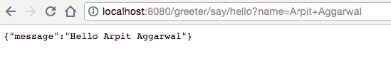

这将给出响应 Hello，后跟作为 HTTP 请求变量接收到的名称。此外，查看 `second-greeting-service.go` 的日志将显示请求是由第二个问候服务提供的，如下所示：


现在，如果我们再次执行 `GET` 请求，它将在 `first-greeting-service.go` 控制台中打印日志，这是因为 Go Micro 提供的发现功能上构建的服务的智能客户端负载平衡：

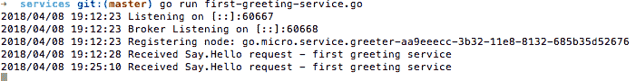

# 使用命令行界面和 web UI 与微服务交互

到目前为止，我们已经使用命令行执行了 `GET` 和 `POST` HTTP 请求来访问服务。这也可以通过 Go Micro web 用户界面来实现。我们只需要启动 `micro web`，这将在本示例中介绍。

# 操作步骤…

1.  使用以下命令安装 `go get github.com/micro/micro` 包：

```go
$ go get github.com/micro/micro
```

1.  使用以下命令运行 web UI：

```go
$ micro web
```

# 工作原理…

一旦命令成功执行，浏览至 `http://localhost:8082/registry` 将列出所有已注册的服务，如下截图所示：

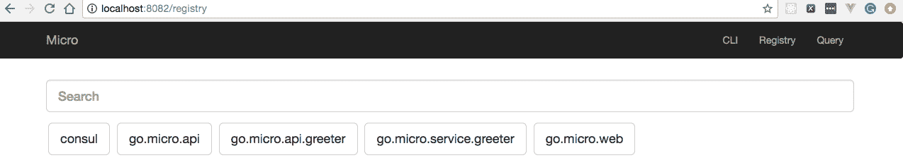

使用 web UI 查询我们的 `greeter` 服务，请求为 `{"name" : "Arpit Aggarwal"}`，将会得到响应 `{"msg": "Hello Arpit Aggarwal"} `：

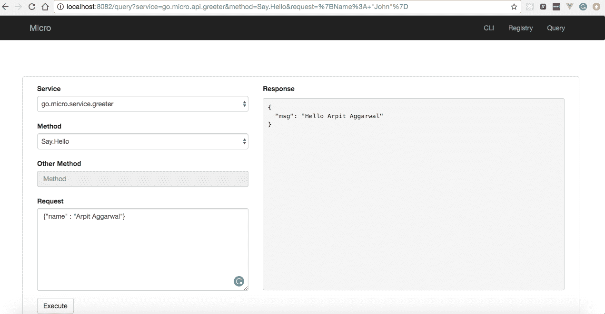

使用 `CLI` 命令查询相同的 `greeter` 服务，命令为 `query go.micro.service.greeter Say.Hello {"name" : "Arpit Aggarwal"}`，将会得到响应 `{"msg": "Hello Arpit Aggarwal"}`：

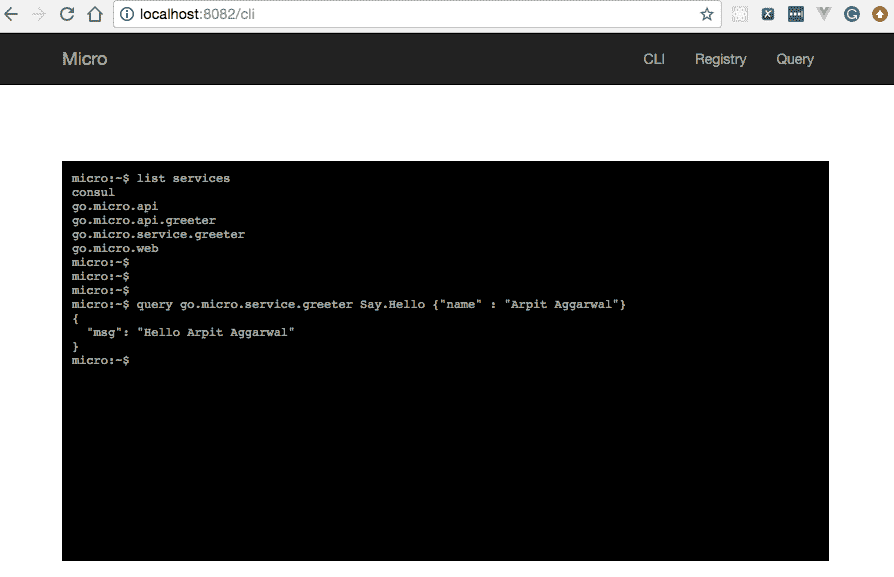
