# 在 Go 中使用 WebSocket

在本章中，我们将涵盖以下示例：

+   创建你的第一个 WebSocket 服务器

+   创建你的第一个 WebSocket 客户端

+   调试你的第一个本地 WebSocket 服务器

+   调试你的第一个远程 WebSocket 服务器

+   单元测试你的第一个 WebSocket 服务器

# 介绍

WebSocket 提供了服务器和客户端之间的双向、单一套接字、全双工连接，使实时通信比其他方式如长轮询和服务器发送事件更加高效。

使用 WebSocket，客户端和服务器可以独立通信，每个都能在初始握手后同时发送和接收信息，重复使用从客户端到服务器和服务器到客户端的相同连接，最终大大减少延迟和服务器负载，使 Web 应用程序能够以最有效的方式执行现代任务。WebSocket 协议得到大多数主流浏览器的支持，包括 Google Chrome、Microsoft Edge、Internet Explorer、Firefox、Safari 和 Opera。因此没有兼容性问题。

在本章中，我们将学习如何创建 WebSocket 服务器和客户端，编写单元测试并调试运行在本地或远程的服务器。

# 创建你的第一个 WebSocket 服务器

在这个示例中，我们将学习如何编写一个 WebSocket 服务器，它是一个 TCP 应用程序，监听在端口`8080`上，允许连接的客户端彼此发送消息。

# 如何做…

1.  使用`go get`命令安装`github.com/gorilla/websocket`包，如下所示：

```go
$ go get github.com/gorilla/websocket
```

1.  创建`websocket-server.go`，我们将在其中将 HTTP 请求升级为 WebSocket，从客户端读取 JSON 消息，并将其广播给所有连接的客户端，如下所示：

```go
package main 
import 
(
  "log"
  "net/http"
  "github.com/gorilla/websocket"
)
var clients = make(map[*websocket.Conn]bool)
var broadcast = make(chan Message) 
var upgrader = websocket.Upgrader{}
type Message struct 
{
  Message string `json:"message"`
}
func HandleClients(w http.ResponseWriter, r *http.Request) 
{
  go broadcastMessagesToClients()
  websocket, err := upgrader.Upgrade(w, r, nil)
  if err != nil 
  {
    log.Fatal("error upgrading GET request to a 
    websocket :: ", err)
  }
  defer websocket.Close()
  clients[websocket] = true
  for 
  {
    var message Message
    err := websocket.ReadJSON(&message)
    if err != nil 
    {
      log.Printf("error occurred while reading 
      message : %v", err)
      delete(clients, websocket)
      break
    }
    broadcast <- message
  }
}
func main() 
{
  http.HandleFunc
  (
    "/", func(w http.ResponseWriter, 
    r *http.Request) 
    {
      http.ServeFile(w, r, "index.html")
    }
  )
  http.HandleFunc("/echo", HandleClients)
  err := http.ListenAndServe(":8080", nil)
  if err != nil 
  {
    log.Fatal("error starting http server :: ", err)
    return
  }
}
func broadcastMessagesToClients() 
{
  for 
  {
    message := <-broadcast
    for client := range clients 
    {
      err := client.WriteJSON(message)
      if err != nil 
      {
        log.Printf("error occurred while writing 
        message to client: %v", err)
        client.Close()
        delete(clients, client)
      }
    }
  }
}
```

1.  使用以下命令运行程序：

```go
$ go run websocket-server.go
```

# 工作原理…

一旦我们运行程序，WebSocket 服务器将在本地监听端口`8080`。

让我们了解我们编写的程序：

1.  我们使用了`import ("log" "net/http" "github.com/gorilla/websocket")`，这是一个预处理命令，告诉 Go 编译器包括所有来自`log`、`net/http`和`github.com/gorilla/websocket`包的文件。

1.  使用`var clients = make(map[*websocket.Conn]bool)`，我们创建了一个表示连接到 WebSocket 服务器的客户端的映射，KeyType 为 WebSocket 连接对象，ValueType 为布尔值。

1.  使用`var broadcast = make(chan Message)`，我们创建了一个通道，所有接收到的消息都会被写入其中。

1.  接下来，我们定义了一个`HandleClients`处理程序，当收到`HTTP GET`请求时，将其升级为`WebSocket`，将客户端注册到套接字服务器，读取请求的 JSON 消息，并将其写入广播通道。

1.  然后，我们定义了一个 Go 函数`broadcastMessagesToClients`，它抓取写入广播通道的消息，并将其发送给当前连接到 WebSocket 服务器的每个客户端。

# 创建你的第一个 WebSocket 客户端

在这个示例中，我们将创建一个简单的客户端来开始 WebSocket 握手过程。客户端将向 WebSocket 服务器发送一个相当标准的`HTTP GET`请求，服务器通过响应中的 Upgrade 头将其升级。

# 如何做…

1.  创建`index.html`，我们将在页面加载时打开到非安全 WebSocket 服务器的连接，如下所示：

```go
<html>
  <title>WebSocket Server</title>
  <input id="input" type="text" />
  <button onclick="send()">Send</button>
  <pre id="output"></pre>
  <script>
    var input = document.getElementById("input");
    var output = document.getElementById("output");
    var socket = new WebSocket("ws://" + window.
    location.host + "/echo");
    socket.onopen = function () 
    {
      output.innerHTML += "Status: Connected\n";
    };
    socket.onmessage = function (e) 
    {
      output.innerHTML += "Message from Server: " + 
      e.data + "\n";
    };
    function send() 
    {
      socket.send
      (
        JSON.stringify
        (
          {
            message: input.value
          }
        )
      );
      input.value = "";
    }
  </script>
</html>
```

一切就绪后，目录结构应该如下所示：

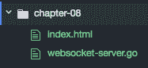

1.  使用以下命令运行程序：

```go
$ go run websocket-server.go
```

# 工作原理…

一旦我们运行程序，WebSocket 服务器将在本地监听端口`8080`。

浏览到`http://localhost:8080`将显示带有文本框和发送按钮的 WebSocket 客户端页面，如下截图所示：

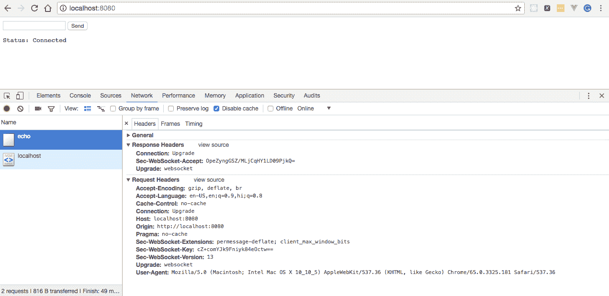

# 调试你的第一个本地 WebSocket 服务器

调试 Web 应用程序是开发人员学习的最重要的技能之一，因为它有助于识别问题、隔离问题的来源，然后要么纠正问题，要么确定解决问题的方法。在这个示例中，我们将学习如何使用 GoLand IDE 调试在本地运行的 WebSocket 服务器。

# 准备...

本示例假定您已经安装并配置了 GoLand IDE 以在您的机器上运行 Go 应用程序。

# 如何做...

1.  单击 GoLand IDE 中的 Open Project 以打开我们在以前的示例中编写的`websocket-server.go`，如下截图所示：

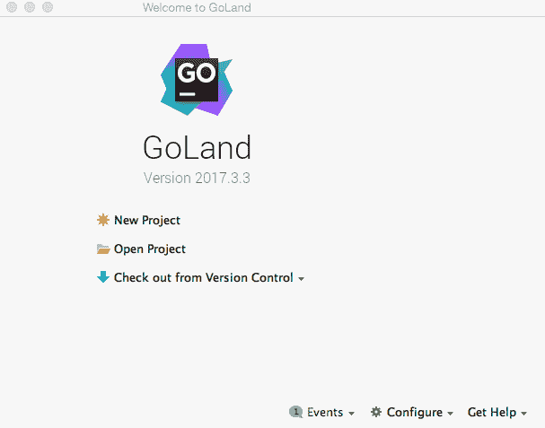

1.  一旦项目打开，单击 Edit Configurations，如下截图所示：

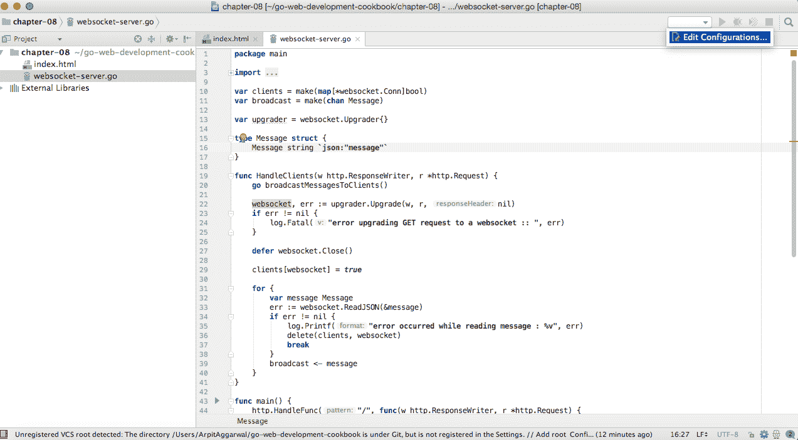

1.  通过单击+号显示如下截图所示的 Add New Configuration 来选择 Add New Configuration：

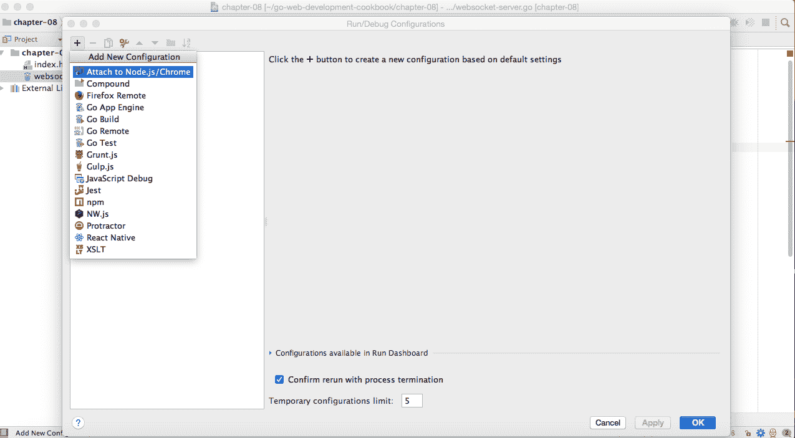

1.  选择 Go Build，将配置重命名为`WebSocket Local Debug`，将运行类型更改为目录，然后单击应用和确定，如下截图所示：

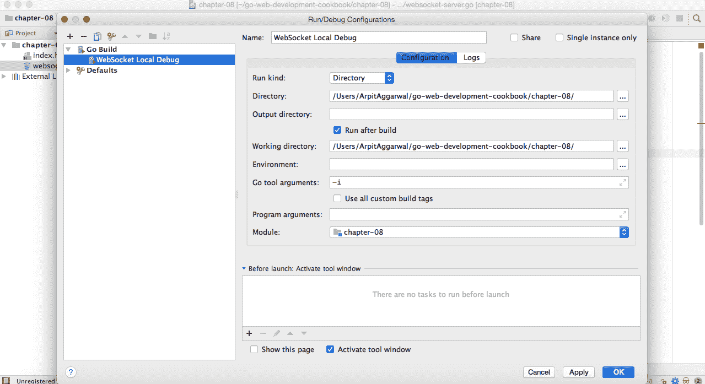

1.  放置一些断点并单击调试按钮：

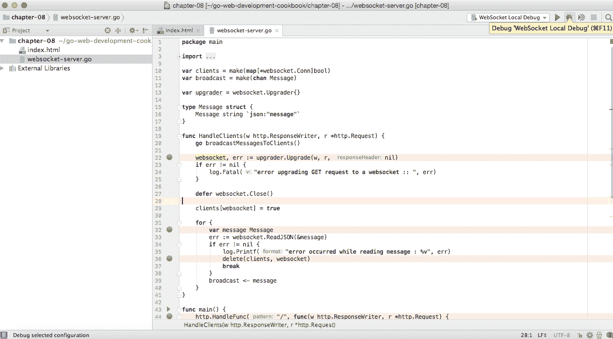

# 它是如何工作的...

一旦我们运行程序，WebSocket 服务器将在本地以调试模式启动，监听端口`8080`。

浏览到`http://localhost:8080`将显示带有文本框和发送按钮的 WebSocket 客户端页面，如下截图所示：

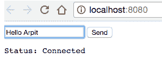

输入文本并单击发送按钮，以查看程序执行停在我们在 GoLand IDE 中放置的断点处，如下所示：

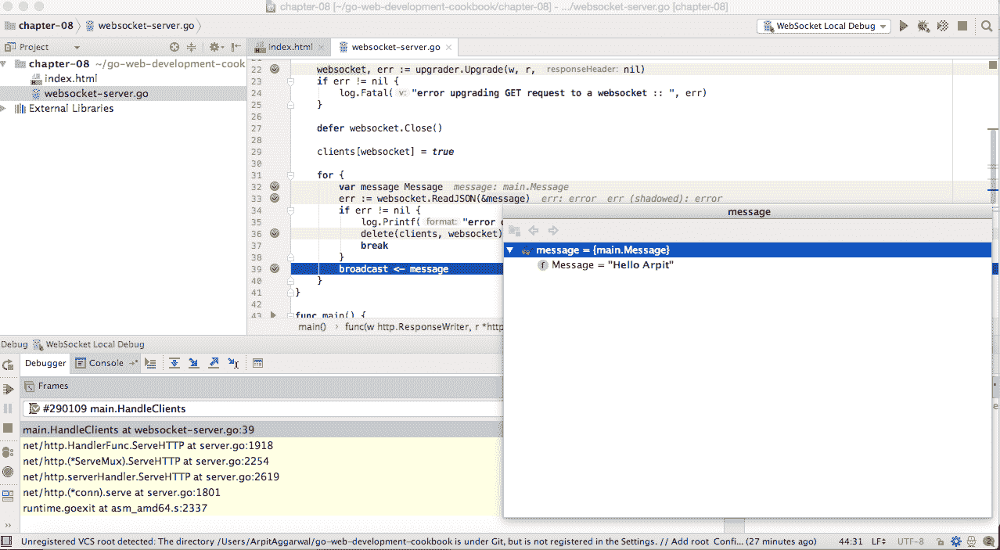

# 调试您的第一个远程 WebSocket 服务器

在以前的示例中，我们学习了如何调试在本地运行的 WebSocket 服务器。在这个示例中，我们将学习如何在另一台或远程机器上调试它。

这些步骤与我们在以前的示例中所采取的步骤基本相同，只是在调试配置部分，我们将把本地主机更改为远程机器 IP 或 DNS，并启动 Delve 服务器，这是 Go 编程语言在远程机器上的调试器。

# 如何做...

1.  通过单击 Edit Configurations...添加另一个配置，如下截图所示：

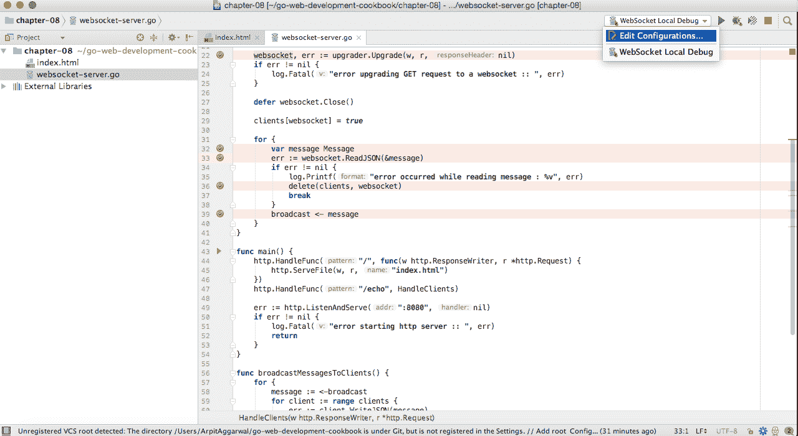

1.  单击+号添加新配置，然后选择 Go Remote：

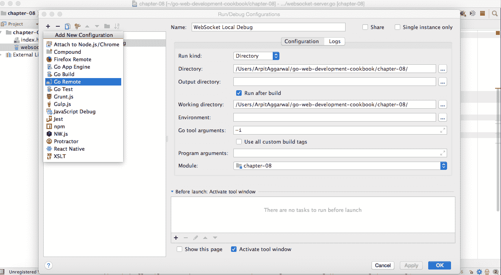

1.  将调试配置重命名为`WebSocket Remote Debug`，将主机更改为`remote-machine-IP`或`DNS`，然后单击应用和确定，如下截图所示：

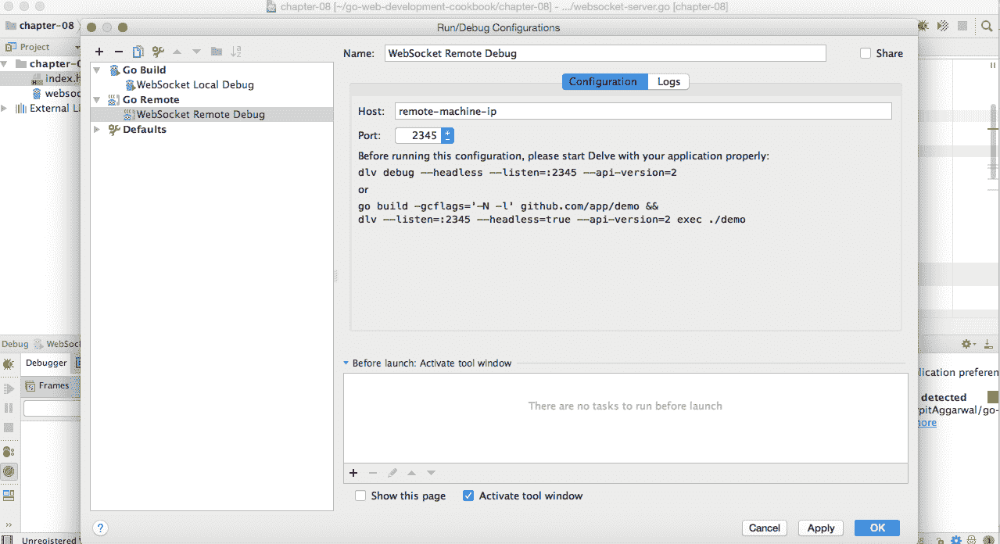

1.  通过执行以下命令在目标或远程机器上运行无头 Delve 服务器：

```go
dlv debug --headless --listen=:2345 --api-version=2
```

上述命令将启动一个监听端口`2345`的 API 服务器。

1.  选择 WebSocket Remote Debug 配置，然后单击调试按钮：

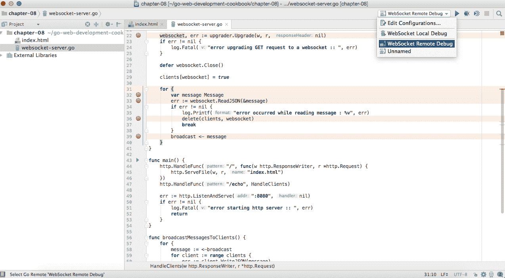

# 它是如何工作的...

浏览到远程可用的 WebSocket 客户端页面，输入一些文本，然后单击发送按钮，以查看程序执行停在我们放置的断点处：


# 单元测试您的第一个 WebSocket 服务器

单元测试或测试驱动开发有助于开发人员设计松散耦合的代码，重点放在代码的可重用性上。它还帮助我们意识到何时停止编码并快速进行更改。

在这个示例中，我们将学习如何为我们在以前的示例中已经编写的 WebSocket 服务器编写单元测试。

参见*创建您的第一个 WebSocket 服务器*示例。

# 如何做...

1.  使用`go get`命令安装`github.com/gorilla/websocket`和`github.com/stretchr/testify/assert`包，如下所示：

```go
$ go get github.com/gorilla/websocket
$ go get github.com/stretchr/testify/assert
```

1.  创建`websocket-server_test.go`，我们将在其中创建一个测试服务器，使用 Gorilla 客户端连接到它，并最终读取和编写消息以测试连接，如下所示：

```go
package main
import 
(
  "net/http"
  "net/http/httptest"
  "strings"
  "testing"
  "github.com/gorilla/websocket"
  "github.com/stretchr/testify/assert"
)
func TestWebSocketServer(t *testing.T) 
{
  server := httptest.NewServer(http.HandlerFunc
  (HandleClients))
  defer server.Close()
  u := "ws" + strings.TrimPrefix(server.URL, "http")
  socket, _, err := websocket.DefaultDialer.Dial(u, nil)
  if err != nil 
  {
    t.Fatalf("%v", err)
  }
  defer socket.Close()
  m := Message{Message: "hello"}
  if err := socket.WriteJSON(&m); err != nil 
  {
    t.Fatalf("%v", err)
  }
  var message Message
  err = socket.ReadJSON(&message)
  if err != nil 
  {
    t.Fatalf("%v", err)
  }
  assert.Equal(t, "hello", message.Message, "they 
  should be equal")
}
```

# 工作原理…

从命令行执行`go test`如下：

```go
$ go test websocket-server_test.go websocket-server.go
ok  command-line-arguments 0.048s
```

它将给我们响应`ok`，这意味着测试已成功编译和执行。

让我们看看当 Go 测试失败时会是什么样子。将`assert`语句中的预期输出更改为其他内容。在以下示例中，`hello`已更改为`hi`：

```go
...
assert.Equal(t, "hi", message.Message, "they should be equal")
...
```

通过运行`go test`命令再次执行测试：

```go
$ go test websocket-server_test.go websocket-server.go
```

它将给我们失败的响应，以及如下截图所示的错误跟踪：

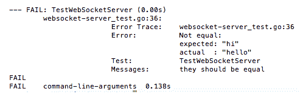
