# 使用 Go Web 应用程序框架-Beego

在本章中，我们将涵盖以下内容：

+   使用 Beego 创建你的第一个项目

+   创建你的第一个控制器和路由器

+   创建你的第一个视图

+   创建你的第一个会话变量

+   创建你的第一个过滤器

+   在 Beego 中处理 HTTP 错误

+   在 Beego 中实现缓存

+   监视 Beego 应用程序

+   在本地机器上部署 Beego 应用程序

+   使用 Nginx 部署 Beego 应用程序

# 介绍

无论何时我们开发一个应用程序，Web 应用程序框架都是必不可少的，因为它通过消除编写大量重复代码的需要并提供模型、API 和其他元素等功能，显著加快和简化了我们的工作。使用应用程序框架，我们可以享受其架构模式的好处，并加速应用程序的开发。

一种流行的 Web 应用程序框架类型是**模型-视图-控制器**（**MVC**），Go 语言有许多 MVC 框架可用，如 Revel、Utron 和 Beego。

在本章中，我们将学习 Beego，这是一个最受欢迎和常用的 Web MVC 框架之一。我们将从创建项目开始，然后转向创建控制器、视图和过滤器。我们还将看看如何实现缓存，监视和部署应用程序。

# 使用 Beego 创建你的第一个项目

开始一个项目的第一件事是设置其基本架构。在 Beego 中，可以使用一个叫做`bee`的工具轻松实现这一点，我们将在这个示例中介绍。

# 如何做…

1.  使用`go get`命令安装`github.com/beego/bee`包，如下所示：

```go
$ go get github.com/beego/bee
```

1.  打开终端到你的`$GOPATH/src`目录，并使用`bee new`命令创建一个项目，如下所示：

```go
$ cd $GOPATH/src
$ bee new my-first-beego-project
```

一旦命令成功执行，它将创建一个新的 Beego 项目，并在控制台上的创建步骤将如下屏幕截图所示：

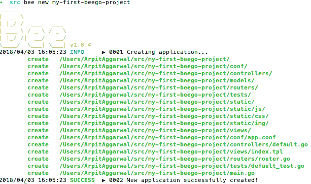

1.  转到新创建的项目路径，输入`bee run`编译和运行项目，如下所示：

```go
$ cd $GOPATH/src/my-first-beego-project
$ bee run
```

一旦命令成功执行，`bee`将构建项目并启动应用程序，如下面的屏幕截图所示：

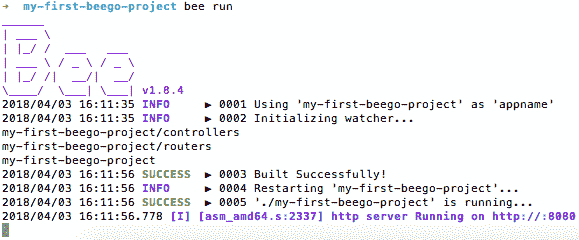

# 它是如何工作的…

一旦命令成功执行，Web 应用程序将在默认的 Beego 端口`8080`上运行，并浏览`http://localhost:8080/`将呈现应用程序的欢迎页面，如下面的屏幕截图所示：

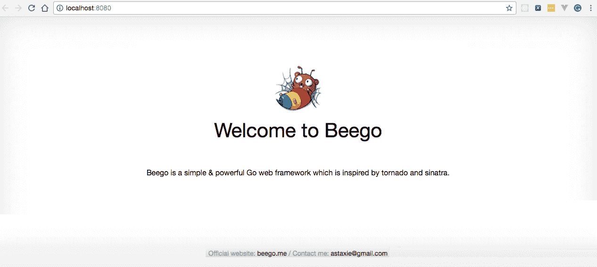

# 创建你的第一个控制器和路由器

Web 应用程序的一个主要组件是控制器，它充当视图和模型之间的协调者，并处理用户的请求，这可能是按钮点击、菜单选择或 HTTP `GET`和`POST`请求。在这个示例中，我们将学习如何在 Beego 中创建一个控制器。

# 如何做…

1.  转到`$GOPATH/src/my-first-beego-project/controllers`并创建`firstcontroller.go`，如下所示：

```go
package controllers
import "github.com/astaxie/beego"
type FirstController struct 
{
  beego.Controller
}
type Employee struct 
{
  Id int `json:"id"`
  FirstName string `json:"firstName"`
  LastName string `json:"lastName"`
}
type Employees []Employee
var employees []Employee
func init() 
{
  employees = Employees
  {
    Employee{Id: 1, FirstName: "Foo", LastName: "Bar"},
    Employee{Id: 2, FirstName: "Baz", LastName: "Qux"},
  }
}
func (this *FirstController) GetEmployees() 
{
  this.Ctx.ResponseWriter.WriteHeader(200)
  this.Data["json"] = employees
  this.ServeJSON()
}
```

1.  转到`$GOPATH/src/my-first-beego-project/routers`并编辑`router.go`以添加`GET`映射`/employees`，由`FirstController`中定义的`GetEmployees`处理程序处理，如下所示：

```go
package routers
import 
(
  "my-first-beego-project/controllers"
  "github.com/astaxie/beego"
)
func init() 
{
  beego.Router("/", &controllers.MainController{})
  beego.Router("/employees", &controllers.FirstController{},
  "get:GetEmployees")
}
```

1.  使用以下命令运行项目：

```go
$ bee run
```

# 它是如何工作的…

一旦命令成功执行，Web 应用程序将在默认的 Beego 端口`8080`上运行。

接下来，从命令行执行`GET`请求将给你列出所有员工的列表：

```go
$ curl -X GET http://localhost:8080/employees
[
 {
 "id": 1,
 "firstName": "Foo",
 "lastName": "Bar"
 },
 {
 "id": 2,
 "firstName": "Baz",
 "lastName": "Qux"
 }
]
```

让我们理解我们编写的程序：

+   导入“github.com/astaxie/beego”：在这里，我们导入了 Beego。

+   `type FirstController struct { beego.Controller }`：在这里，我们定义了`FirstController`结构类型，它包含了一个匿名的`beego.Controller`类型的结构字段，因此`FirstController`自动获取了`beego.Controller`的所有方法。

+   `func (this *FirstController) GetEmployees() { this.Ctx.ResponseWriter.WriteHeader(200) this.Data["json"] = employees this.ServeJSON() }`：在这里，我们定义了`GetEmployees`处理程序，它将为 URL 模式`/employees`的每个`GET`请求执行。

在 Go 中，以大写字母开头的函数或处理程序是导出函数，这意味着它们是公共的，并且可以在程序外部使用。这就是我们在程序中定义所有函数时都使用大写字母而不是驼峰命名法的原因。

# 创建你的第一个视图

视图是模型的可视表示。它通过模型访问数据，并指定数据应该如何呈现。当模型发生变化时，它保持其呈现的一致性，这可以通过推模型或拉模型来实现。在推模型中，视图向模型注册自己以获取更改通知，而在拉模型中，视图负责在需要检索最新数据时调用模型。在本示例中，我们将学习如何创建我们的第一个视图来呈现员工列表。

# 如何做…

1.  移动到`$GOPATH/src/my-first-beego-project/views`并创建`dashboard.tpl`，并复制以下内容：

```go
<!DOCTYPE html>
<html>
  <body>
    <table border= "1" style="width:100%;">
      {{range .employees}}
      <tr>
        <td>{{.Id}}</td>
        <td>{{.FirstName}}</td>
        <td>{{.LastName}}</td>
      </tr>
      {{end}}
    </table>
  </body>
</html>
```

1.  移动到`$GOPATH/src/my-first-beego-project/controllers`并编辑`firstcontroller.go`，添加`Dashboard`处理程序，如下所示：

```go
package controllers
import "github.com/astaxie/beego"
type FirstController struct 
{
  beego.Controller
}
type Employee struct 
{
  Id int `json:"id"`
  FirstName string `json:"firstName"`
  LastName string `json:"lastName"`
}
type Employees []Employee
var employees []Employee
func init() 
{
  employees = Employees
  {
    Employee{Id: 1, FirstName: "Foo", LastName: "Bar"},
    Employee{Id: 2, FirstName: "Baz", LastName: "Qux"},
  }
}
...
func (this *FirstController) Dashbaord() 
{
  this.Data["employees"] = employees
  this.TplName = "dashboard.tpl"
}
```

1.  移动到`$GOPATH/src/my-first-beego-project/routers`并编辑`router.go`，添加`GET`映射`/dashboard`，由`FirstController`中定义的`Dashboard`处理程序处理，如下所示：

```go
package routers
import 
(
  "my-first-beego-project/controllers"
  "github.com/astaxie/beego"
)
func init() 
{
  beego.Router("/", &controllers.MainController{})
  beego.Router("/employees", &controllers.FirstController{},
  "get:GetEmployees")
  beego.Router("/dashboard", &controllers.FirstController{},
  "get:Dashbaord")
}

```

1.  使用以下命令运行项目：

```go
$ bee run
```

# 它是如何工作的…

一旦命令成功执行，Web 应用程序将在默认的 Beego 端口`8080`上运行。

浏览`http://localhost:8080/dashboard`将呈现员工仪表板，如下截图所示：

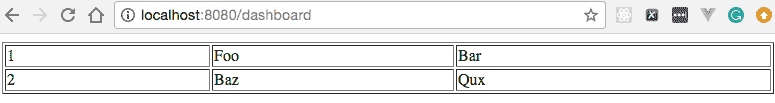

# 创建你的第一个会话变量

每当我们需要将用户数据从一个 HTTP 请求传递到另一个 HTTP 请求时，我们可以使用 HTTP 会话，我们将在本示例中介绍。

# 准备好…

此示例假定您已经在本地端口`6379`上安装并运行了`Redis`。

# 如何做…

1.  使用`go get`命令安装`github.com/astaxie/beego/session/redis`包，如下所示：

```go
$ go get -u github.com/astaxie/beego/session/redis
```

1.  移动到`$GOPATH/src/my-first-beego-project/controllers`并创建`sessioncontroller.go`，在这里我们将定义处理程序，确保只有经过身份验证的用户才能查看主页，如下所示：

```go
package controllers 
import "github.com/astaxie/beego"
type SessionController struct 
{
  beego.Controller
}
func (this *SessionController) Home() 
{
  isAuthenticated := this.GetSession("authenticated")
  if isAuthenticated == nil || isAuthenticated == false 
  {
    this.Ctx.WriteString("You are unauthorized to 
    view the page.")
    return
  }
  this.Ctx.ResponseWriter.WriteHeader(200)
  this.Ctx.WriteString("Home Page")
}
func (this *SessionController) Login() 
{
  this.SetSession("authenticated", true)
  this.Ctx.ResponseWriter.WriteHeader(200)
  this.Ctx.WriteString("You have successfully logged in.")
}
func (this *SessionController) Logout() 
{
  this.SetSession("authenticated", false)
  this.Ctx.ResponseWriter.WriteHeader(200)
  this.Ctx.WriteString("You have successfully logged out.")
}
```

1.  移动到`$GOPATH/src/my-first-beego-project/routers`并编辑`router.go`，添加`GET`映射`/home`，`/login`和`/logout`，分别由`FirstController`中定义的`Home`，`Login`和`Logout`处理程序处理，如下所示：

```go
package routers
import 
(
  "my-first-beego-project/controllers"
  "github.com/astaxie/beego"
)
func init() 
{
  beego.Router("/", &controllers.MainController{})
  beego.Router("/employees", &controllers.FirstController{},
  "get:GetEmployees")
  beego.Router("/dashboard", &controllers.FirstController{}, 
  "get:Dashbaord")
  beego.Router("/home", &controllers.SessionController{},
  "get:Home")
  beego.Router("/login", &controllers.SessionController{}, 
  "get:Login")
  beego.Router("/logout", &controllers.SessionController{}, 
  "get:Logout")
}
```

1.  移动到`$GOPATH/src/my-first-beego-project`并编辑`main.go`，导入`github.com/astaxie/beego/session/redis`，如下所示：

```go
package main
import 
(
  _ "my-first-beego-project/routers"
  "github.com/astaxie/beego"
  _ "github.com/astaxie/beego/session/redis"
)
func main() 
{
  beego.BConfig.WebConfig.DirectoryIndex = true
  beego.BConfig.WebConfig.StaticDir["/swagger"] = "swagger"
  beego.Run()
}
```

1.  在`$GOPATH/src/my-first-beego-project/conf/app.conf`中打开`session`的使用，如下所示：

```go
SessionOn = true
SessionProvider = "redis"
SessionProviderConfig = "127.0.0.1:6379"
```

1.  使用以下命令运行程序：

```go
$ bee run 
```

# 它是如何工作的…

一旦命令成功执行，Web 应用程序将在默认的 Beego 端口`8080`上运行。

接下来，我们将执行一些命令来看会话是如何工作的。首先，我们将通过执行以下命令访问`/home`：

```go
$ curl -X GET http://localhost:8080/home 
```

这将导致我们从服务器收到未经授权的访问消息：

```go
You are unauthorized to view the page.
```

显然，我们无法访问它，因为我们必须首先登录到应用程序，这将创建一个`beegosessionID`。现在让我们通过执行以下命令登录到应用程序：

```go
$ curl -X GET -i http://localhost:8080/login
```

这将导致服务器返回以下响应：

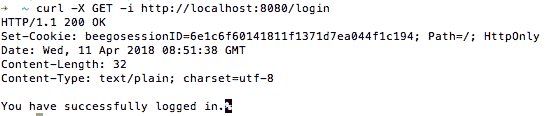

现在我们将使用作为`/login`请求的一部分创建的 cookie`beegosessionID`来访问`/home`，如下所示：

```go
$ curl --cookie "beegosessionID=6e1c6f60141811f1371d7ea044f1c194" http://localhost:8080/home Home Page
```

# 创建你的第一个过滤器

有时，我们可能希望在调用操作方法之前或之后执行逻辑。在这种情况下，我们使用过滤器，我们将在本示例中介绍。

过滤器基本上是封装常见功能或横切关注点的处理程序。我们只需定义它们一次，然后将它们应用于不同的控制器和操作方法。

# 操作步骤…

1.  使用`go get`命令安装`github.com/astaxie/beego/context`包，如下所示：

```go
$ go get github.com/astaxie/beego/context
```

1.  移动到`$GOPATH/src/my-first-beego-project/filters`并创建`firstfilter.go`，在`Controller`之前运行，并记录 IP 地址和当前时间戳，如下所示：

```go
package filters 
import 
(
  "fmt"
  "time"
  "github.com/astaxie/beego/context"
)
var LogManager = func(ctx *context.Context) 
{ 
  fmt.Println("IP :: " + ctx.Request.RemoteAddr + ", 
  Time :: " + time.Now().Format(time.RFC850))
}
```

1.  移动到`$GOPATH/src/my-first-beego-project/routers`并编辑`router.go`以添加`GET`映射`/*`，将由`LogManager`过滤器处理，如下所示：

```go
package routers 
import 
(
  "my-first-beego-project/controllers"
  "my-first-beego-project/filters"
  "github.com/astaxie/beego"
)
func init() 
{
  beego.Router("/", &controllers.MainController{})
  ...
  beego.InsertFilter("/*", beego.BeforeRouter, 
  filters.LogManager)
}
```

1.  使用以下命令运行程序：

```go
$ bee run
```

# 工作原理…

一旦命令成功执行，Web 应用程序将在默认的 Beego 端口`8080`上运行。

接下来，我们将执行一个请求，通过执行以下命令获取所有员工：

```go
$ curl -X GET http://localhost:8080/employees
[
 {
 "id": 1,
 "firstName": "Foo",
 "lastName": "Bar"
 },
 {
 "id": 2,
 "firstName": "Baz",
 "lastName": "Qux"
 }
]
```

一旦命令成功执行，我们可以在控制台的应用程序日志中看到打印的 IP 和时间戳，如下所示：

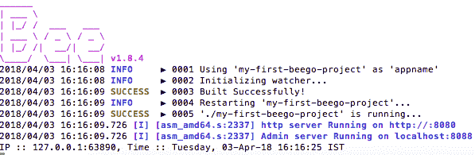

使用`beego.InsertFilter("/*", beego.BeforeRouter, filters.LogManager)`，我们在应用程序中插入了一个过滤器，该过滤器在找到路由器之前执行 URL 模式`/*`，并由`LogManager`处理。类似于`beego.BeforeRouter`，还有四个其他位置可以放置过滤器：`beego.BeforeStatic`，`beego.BeforeExec`，`beego.AfterExec`和`beego.FinishRouter`。

# 在 Beego 中处理 HTTP 错误

错误处理是 Web 应用程序设计中最重要的方面之一，因为它在两个方面有所帮助。首先，它以相对友好的方式让应用程序用户知道出了问题，他们应该联系技术支持部门或者应该通知技术支持部门的人员。其次，它允许程序员添加一些细节来帮助调试问题。在本示例中，我们将学习如何在 Beego 中实现错误处理。

# 操作步骤…

1.  移动到`$GOPATH/src/my-first-beego-project/controllers`并创建`errorcontroller.go`，在其中我们将定义处理`404`和`500` HTTP 错误的处理程序，以及处理应用程序中任何通用错误的处理程序，如下所示：

```go
package controllers
import "github.com/astaxie/beego"
type ErrorController struct 
{
  beego.Controller
}
func (c *ErrorController) Error404() 
{
  c.Data["content"] = "Page Not Found"
  c.TplName = "404.tpl"
}
func (c *ErrorController) Error500() 
{
  c.Data["content"] = "Internal Server Error"
  c.TplName = "500.tpl"
}
func (c *ErrorController) ErrorGeneric() 
{
  c.Data["content"] = "Some Error Occurred"
  c.TplName = "genericerror.tpl"
}
```

1.  移动到`$GOPATH/src/my-first-beego-project/controllers`并编辑`firstcontroller.go`以添加`GetEmployee`处理程序，该处理程序将从 HTTP 请求参数中获取 ID，从静态员工数组中获取员工详细信息，并将其作为响应返回，或者如果请求的 ID 不存在，则抛出通用错误，如下所示：

```go
package controllers
import "github.com/astaxie/beego"
type FirstController struct 
{
  beego.Controller
}
type Employee struct 
{
  Id int `json:"id"`
  FirstName string `json:"firstName"`
  LastName string `json:"lastName"`
}
type Employees []Employee
var employees []Employee
func init() 
{
  employees = Employees
  {
    Employee{Id: 1, FirstName: "Foo", LastName: "Bar"},
    Employee{Id: 2, FirstName: "Baz", LastName: "Qux"},
  }
}
...
func (this *FirstController) GetEmployee() 
{
  var id int
  this.Ctx.Input.Bind(&id, "id")
  var isEmployeeExist bool
  var emps []Employee
  for _, employee := range employees 
  {
    if employee.Id == id 
    {
      emps = append(emps, Employee{Id: employee.Id, 
      FirstName: employee.FirstName, LastName: 
      employee.LastName})
      isEmployeeExist = true
      break
    }
  }
  if !isEmployeeExist 
  {
    this.Abort("Generic")
  } 
  else 
  {
    this.Data["employees"] = emps
    this.TplName = "dashboard.tpl"
  }
}
```

1.  移动到`$GOPATH/src/my-first-beego-project/views`并创建`genericerror.tpl`，内容如下：

```go
<!DOCTYPE html>
<html>
  <body>
    {{.content}}
  </body>
</html>
```

1.  使用以下命令运行程序：

```go
$ bee run 
```

# 工作原理…

一旦命令成功执行，Web 应用程序将在默认的 Beego 端口`8080`上运行。

接下来，浏览`http://localhost:8080/employee?id=2`将会给出员工的详细信息，如下面的屏幕截图所示：

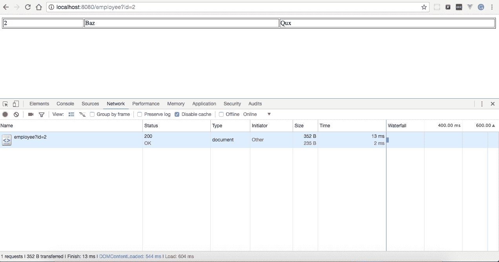

当浏览`http://localhost:8080/employee?id=4`时：

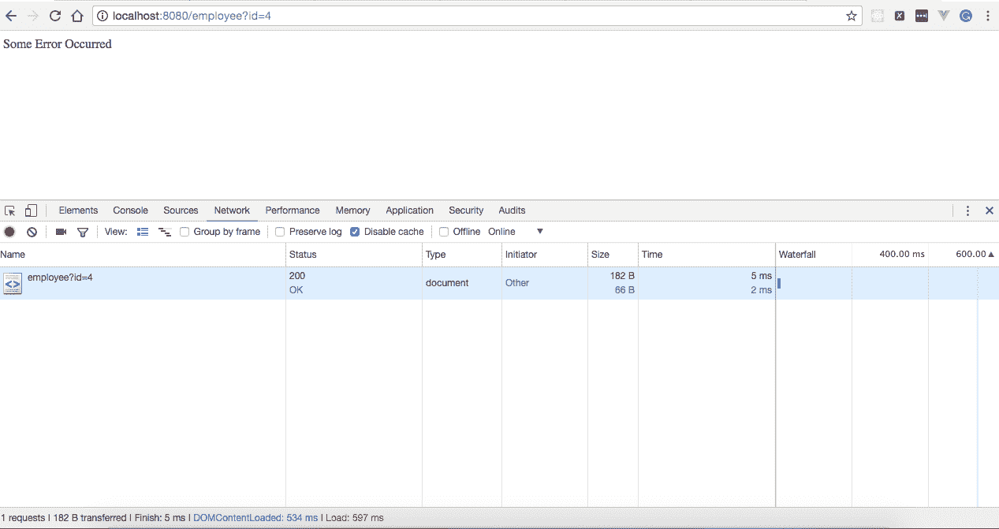

它将给出错误消息，如“发生了一些错误”。这是因为我们要求获取 ID 为`4`的员工的详细信息，而在静态员工数组中不存在，因此服务器抛出通用错误，由`errorcontroller.go`中定义的`ErrorGeneric`处理程序处理。

# 在 Beego 中实现缓存

在 Web 应用程序中缓存数据有时是必要的，以避免反复请求数据库或外部服务的静态数据。在本示例中，我们将学习如何在 Beego 应用程序中实现缓存。

Beego 支持四种缓存提供程序：`file`，`Memcache`，`memory`和`Redis`。在本示例中，我们将使用框架默认的`memory`缓存提供程序。

# 操作步骤…

1.  使用`go get`命令安装`github.com/astaxie/beego/cache`包，如下所示：

```go
$ go get github.com/astaxie/beego/cache
```

1.  移动到`$GOPATH/src/my-first-beego-project/controllers`并创建`cachecontroller.go`，在其中我们将定义`GetFromCache`处理程序，该处理程序将从缓存中获取键的值并将其写入 HTTP 响应，如下所示：

```go
package controllers
import 
(
  "fmt"
  "time"
  "github.com/astaxie/beego"
  "github.com/astaxie/beego/cache"
)
type CacheController struct 
{
  beego.Controller
}
var beegoCache cache.Cache
var err error
func init() 
{
  beegoCache, err = cache.NewCache("memory",
  `{"interval":60}`)
  beegoCache.Put("foo", "bar", 100000*time.Second)
}
func (this *CacheController) GetFromCache() 
{
  foo := beegoCache.Get("foo")
  this.Ctx.WriteString("Hello " + fmt.Sprintf("%v", foo))
}
```

1.  移动到`$GOPATH/src/my-first-beego-project/routers`并编辑`router.go`以添加`GET`映射`/getFromCache`，该映射将由`CacheController`中定义的`GetFromCache`处理程序处理，如下所示：

```go
package routers
import 
(
  "my-first-beego-project/controllers"
  "my-first-beego-project/filters"
  "github.com/astaxie/beego"
)
func init() 
{
  beego.Router("/", &controllers.MainController{})
  ... 
  beego.Router("/getFromCache", &controllers.
  CacheController{}, "get:GetFromCache")
}
```

1.  使用以下命令运行程序：

```go
$ bee run
```

# 它是如何工作的…

一旦命令成功执行，Web 应用程序将在默认的 Beego 端口`8080`上运行。

在应用程序启动时，将使用名称为`foo`且值为`bar`的键添加到缓存中。接下来，浏览`http://localhost:8080/getFromCache`将从缓存中读取`foo`键值，将其附加到 Hello，并在浏览器上显示，如下面的屏幕截图所示：

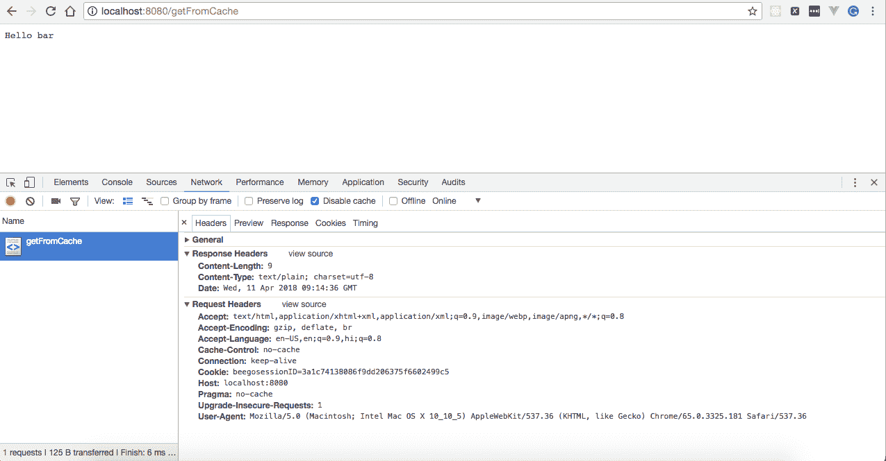

# 监控 Beego 应用程序

一旦 Beego 应用程序启动并运行，我们可以轻松地通过其管理仪表板监视应用程序请求统计信息、性能、健康检查、任务和配置状态。我们将在本教程中学习如何做到这一点。

# 如何做到这一点…

1.  通过在`$GOPATH/src/my-first-beego-project/conf/app.conf`中添加`EnableAdmin = true`来启用应用程序实时监视，如下所示：

```go
appname = my-first-beego-project
...
EnableAdmin = true
..
```

可选地，通过在`$GOPATH/src/my-first-beego-project/conf/app.conf`中添加字段来更改其监听的端口：

```go
AdminAddr = "localhost"
AdminPort = 8088
```

1.  使用以下命令运行程序：

```go
$ bee run
```

# 它是如何工作的…

一旦命令成功执行，Web 应用程序将在默认的 Beego 端口`8080`上运行，并且浏览`http://localhost:8088/`将呈现管理仪表板，如下面的屏幕截图所示：

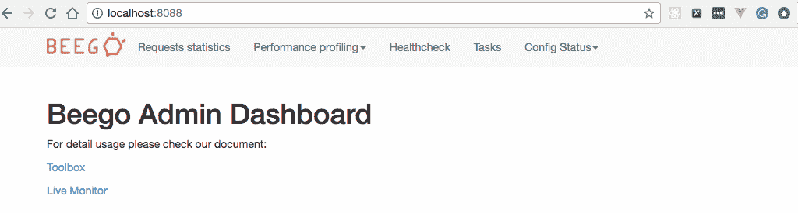

浏览`http://localhost:8088/qps`将显示应用程序的请求统计信息，如下面的屏幕截图所示：

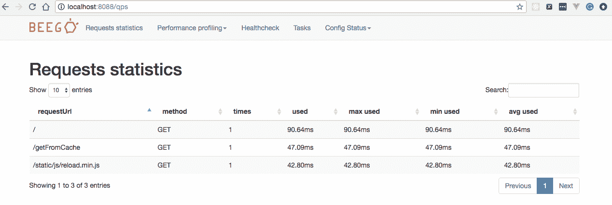

# 在本地机器上部署 Beego 应用程序

一旦应用程序开发结束，我们必须部署它以供最终用户使用，这可以在本地或远程进行。在本教程中，我们将学习如何在本地机器上部署我们的 Beego 应用程序。

# 如何做到这一点…

1.  因为`bee`创建的应用程序默认处于开发模式，并且在公共服务器上运行应用程序时，始终以生产模式运行应用程序是最佳实践，因此我们必须在`$GOPATH/src/my-first-beego-project/conf/app.conf`中将`RunMode`更改为`prod`，如下所示：

```go
beego.RunMode = "prod"
```

1.  通过执行以下命令将静态文件、配置文件和模板作为 Beego 应用程序的字节码文件的一部分包含在一个单独的目录中：

```go
$ mkdir $GOPATH/my-first-beego-app-deployment
$ cp my-first-beego-project $GOPATH/my-first-beego-app-deployment
$ cp -fr views $GOPATH/my-first-beego-app-deployment
$ cp -fr static $GOPATH/my-first-beego-app-deployment
$ cp -fr conf $GOPATH/my-first-beego-app-deployment
```

1.  移动到`$GOPATH/my-first-beego-app-deployment`并使用`nohup`命令将应用程序作为后台进程运行，如下所示：

```go
$ cd $GOPATH/my-first-beego-app-deployment
$ nohup ./my-first-beego-project &
```

# 它是如何工作的…

一旦命令成功执行，Web 应用程序将在默认的 Beego 端口`8080`上运行，浏览`http://localhost:8080/`将呈现应用程序的欢迎页面，如下面的屏幕截图所示：


# 使用 Nginx 部署 Beego 应用程序

在上一个教程中，我们学习了如何在本地运行 Beego 应用程序。在本教程中，我们将使用`Nginx`部署相同的应用程序。

# 准备就绪…

这个教程假设您已经安装并在端口`80`上运行了`Nginx`。对我来说，它安装在`/Users/ArpitAggarwal/nginx`。

# 如何做到这一点…

1.  打开`/Users/ArpitAggarwal/nginx/conf/nginx.conf`中的 Nginx 配置文件，并将`server`下的`location`块替换为以下内容：

```go
location / 
{
 # root html;
 # index index.html index.htm;
 proxy_pass http://localhost:8080/;
}
```

1.  通过执行以下命令启动 Nginx：

```go
$ cd /Users/ArpitAggarwal/nginx/sbin
$ ./nginx
```

1.  通过执行以下命令运行 Beego 应用程序：

```go
$ bee run
```

# 它是如何工作的…

一旦命令成功执行，浏览`http://localhost:80/`将呈现应用程序的欢迎页面，如下截图所示：

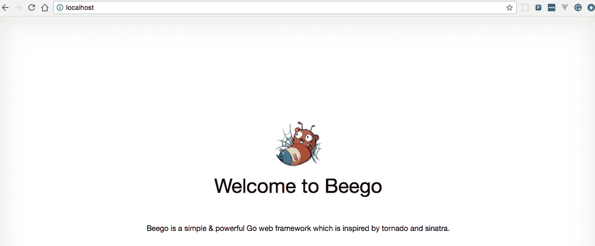
