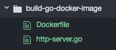
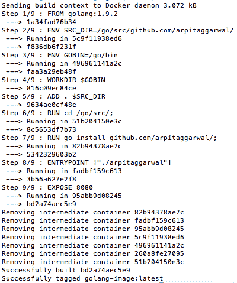
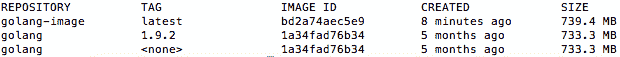
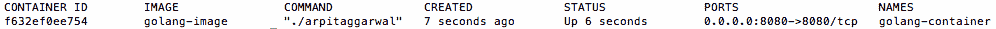
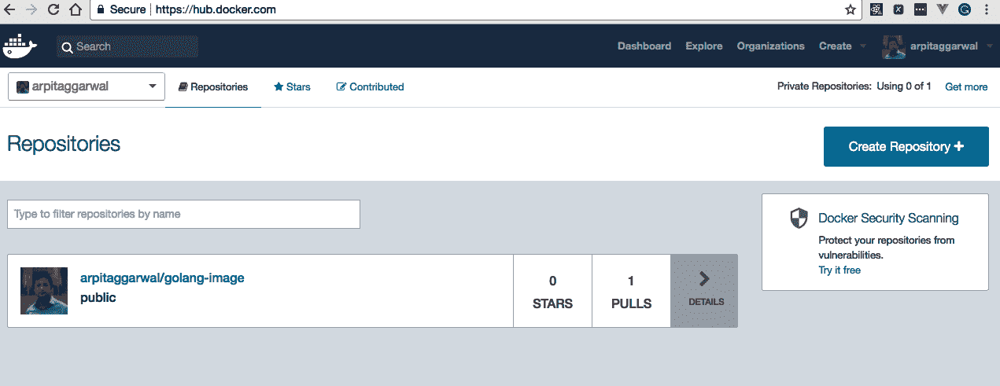
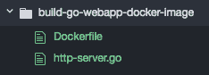
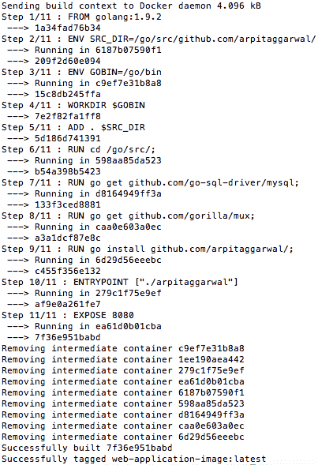
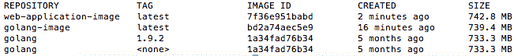
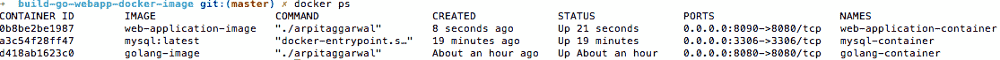
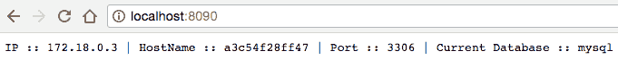

# 第九章：使用 Go 和 Docker

在本章中，我们将涵盖以下内容：

+   构建你的第一个 Go Docker 镜像

+   运行你的第一个 Go Docker 容器

+   将你的 Docker 镜像推送到 Docker 注册表

+   创建你的第一个用户定义的桥接网络

+   在用户定义的桥接网络上运行 MySQL Docker 镜像

+   构建一个 Go web 应用的 Docker 镜像

+   在用户定义的桥接网络上运行一个与 MySQL Docker 容器链接的 web 应用 Docker 容器

# 介绍

随着组织向 DevOps 迈进，Docker 也开始变得流行起来。Docker 允许将应用程序及其所有依赖项打包成标准化的软件开发单元。如果该单元在您的本地机器上运行，我们可以保证它将在任何地方，从 QA 到暂存，再到生产环境中以完全相同的方式运行。通过本章涵盖的概念，我们将能够轻松编写 Docker 镜像并部署 Docker 容器。

在本章中，我们将学习如何创建一个 Docker 镜像和 Docker 容器来部署一个简单的 Go web 应用，之后我们将看看如何将容器保存为镜像并将其推送到 Docker 注册表，以及一些 Docker 网络的基本概念。

由于我们将要使用 Docker，我假设它已经安装并在您的本地机器上运行。

# 构建你的第一个 Go Docker 镜像

Docker 镜像是我们应用程序的文件系统和配置，进一步用于创建 Docker 容器。有两种方式可以创建 Docker 镜像，即从头开始或从父镜像创建。在这个示例中，我们将学习如何从父镜像创建 Docker 镜像。这意味着基本上创建的镜像是指其父级的内容，并且`Dockerfile`中的后续声明修改了父镜像的内容。

# 准备就绪…

通过执行以下命令验证`Docker`和`Docker Machine`是否已安装：

```go
$ docker --version
Docker version 18.03.0-ce, build 0520e24  $ docker-machine --version
docker-machine version 0.14.0, build 89b8332
```

# 操作步骤如下…

1.  创建`http-server.go`，在这里我们将创建一个简单的 HTTP 服务器，它将在浏览`http://docker-machine-ip:8080`或从命令行执行`curl -X GET http://docker-machine-ip:8080`时呈现 Hello World！

```go
package main
import 
(
  "fmt"
  "log"
  "net/http"
)
const 
(
  CONN_HOST = "localhost"
  CONN_PORT = "8080"
)
func helloWorld(w http.ResponseWriter, r *http.Request) 
{
  fmt.Fprintf(w, "Hello World!")
}
func main() 
{
  http.HandleFunc("/", helloWorld)
  err := http.ListenAndServe(CONN_HOST+":"+CONN_PORT, nil)
  if err != nil 
  {
    log.Fatal("error starting http server : ", err)
    return
  }
}
```

1.  创建一个`DockerFile`，这是一个包含构建镜像所需的所有命令的文本文件。我们将使用`golang:1.9.2`作为基础或父镜像，我们在`Dockerfile`中使用`FROM`指令指定了这一点，如下所示：

```go
FROM golang:1.9.2
 ENV SRC_DIR=/go/src/github.com/arpitaggarwal/
 ENV GOBIN=/go/bin

 WORKDIR $GOBIN

 # Add the source code:
 ADD . $SRC_DIR

 RUN cd /go/src/;

 RUN go install github.com/arpitaggarwal/;
 ENTRYPOINT ["./arpitaggarwal"]

 EXPOSE 8080
```

一切就绪后，目录结构应该如下所示：



1.  使用`-t`标志执行`docker build`命令构建一个名为`golang-image`的 Docker 镜像，如下所示：

```go
$ docker build --no-cache=true -t golang-image .
```

一旦前面的命令成功执行，它将产生以下输出：



如果您在公司代理后面构建镜像，您可能需要提供代理设置。您可以通过在`Dockerfile`中使用`ENV`语句添加环境变量来实现这一点，我们通常称之为运行时定制，如下所示：

```go
FROM golang:1.9.2
....
ENV http_proxy "http://proxy.corp.com:80"
ENV https_proxy "http://proxy.corp.com:80"
...
```

我们还可以使用`--build-arg <varname>=<value>`标志在构建时将代理设置传递给构建器，这被称为构建时定制。

```go
$ docker build --no-cache=true --build-arg http_proxy="http://proxy.corp.com:80" -t golang-image.
```

# 工作原理…

通过执行以下命令验证 Docker 镜像是否已成功创建：

```go
$ docker images
```

这将列出所有顶级镜像，它们的仓库、标签和大小，如下截图所示：



让我们了解我们创建的`Dockerfile`：

+   `FROM golang:1.9.2`: `FROM`指令指定了基础镜像，对我们来说是`golang:1.9.2`

+   `ENV SRC_DIR=/go/src/github.com/arpitaggarwal/`：在这里，我们使用`ENV`语句将 Go 源代码目录设置为环境变量

+   `ENV GOBIN=/go/bin`：在这里，我们使用`ENV`语句将`GOBIN`或生成可执行二进制文件的目录设置为环境变量。

+   `WORKDIR $GOBIN`：`WORKDIR`指令为我们的镜像设置了任何`RUN`、`CMD`、`ENTRYPOINT`、`COPY`和`ADD`语句的工作目录，对于我们的镜像来说，这个目录是`/go/bin`。

+   `ADD . $SRC_DIR`：在这里，我们使用`ADD`语句将当前目录中的`http-server.go`复制到`golang-image`的`/go/src/github.com/arpitaggarwal/`目录中。

+   `RUN cd /go/src/`：在这里，我们使用`RUN`语句将当前目录更改为`/go/src/`中的`golang-image`。

+   `RUN go install github.com/arpitaggarwal/`：在这里，我们编译`/go/src/github.com/arpitaggarwal/http-server.go`，并在`/go/bin`目录中生成可执行二进制文件。

+   `ENTRYPOINT ["./arpitaggarwal"]`：在这里，我们指定要作为可执行文件运行的可执行二进制文件。

+   `EXPOSE 8080`：`EXPOSE`指令通知 Docker，我们将从镜像创建的容器在运行时监听网络端口`8080`。

# 运行您的第一个 Go Docker 容器

Docker 容器包括一个应用程序及其所有依赖项。它与其他容器共享内核，并作为主机操作系统上用户空间中的隔离进程运行。要运行实际的应用程序，我们必须从镜像创建和运行容器，这将在本教程中介绍。

# 如何做…

执行`docker run`命令从`golang-image`创建并运行一个 Docker 容器，使用`-name`标志将容器命名为`golang-container`，如下所示：

```go
$ docker run -d -p 8080:8080 --name golang-container -it golang-image
 9eb53d8d41a237ac216c9bb0f76b4b47d2747fab690569ef6ff4b216e6aab486
```

`docker run`命令中指定的`-d`标志以守护进程模式启动容器，末尾的哈希字符串代表`golang-container`的 ID。

# 工作原理…

通过执行以下命令验证 Docker 容器是否已创建并成功运行：

```go
$ docker ps
```

一旦上述命令成功执行，它将给我们正在运行的 Docker 容器的详细信息，如下面的屏幕截图所示：



要列出所有 Docker 容器，无论它们是否正在运行，我们必须传递一个额外的标志`-a`，如`docker ps -a`。

浏览`http://localhost:8080/`或从命令行执行`GET`调用，如下所示：

```go
$ curl -X GET http://localhost:8080/
 Hello World!
```

这将给我们一个 Hello World!的响应，这意味着 HTTP 服务器在 Docker 容器内的端口`8080`上监听。

# 将您的 Docker 镜像推送到 Docker 注册表

一旦创建了 Docker 镜像，最佳做法是存储或保存该镜像，这样下次您要从自定义镜像启动容器时，就不必再去烦恼或记住之前创建它时执行的步骤。

您可以将镜像保存在本地计算机上，也可以保存在艺术工厂或任何公共或私有的 Docker 注册表中，例如 Docker Hub、Quay、Google 容器注册表、AWS 容器注册表等。在本教程中，我们将学习如何将我们在之前的教程中创建的镜像保存或推送到 Docker Hub。

查看*构建您的第一个 Go Docker 镜像*教程*.*

# 如何做…

1.  在 Docker Hub（`https://hub.docker.com/`）上创建您的帐户。

1.  通过执行`docker login`命令从命令行登录到 Docker Hub，如下所示：

```go
$ docker login --username arpitaggarwal --password XXXXX
 Login Succeeded
```

1.  为`golang-image`打标签：

```go
$ docker tag golang-image arpitaggarwal/golang-image
```

1.  通过执行`docker images`命令验证镜像是否已成功标记：

```go
$ docker images
```

执行上述命令将列出所有 Docker 镜像，如下面的屏幕截图所示：


1.  通过执行`docker push`命令将标记的镜像推送到 Docker Hub，如下所示：

```go
$ docker push arpitaggarwal/golang-image
 The push refers to a repository [docker.io/arpitaggarwal
 /golang-image]
 4db0afeaa6dd: Pushed
 4e648ebe6cf2: Pushed
 6bfc813a3812: Mounted from library/golang
 e1e44e9665b9: Mounted from library/golang
 1654abf914f4: Mounted from library/golang
 2a55a2194a6c: Mounted from library/golang
 52c175f1a4b1: Mounted from library/golang
 faccc7315fd9: Pushed
 e38b8aef9521: Mounted from library/golang
 a75caa09eb1f: Mounted from library/golang
 latest: digest: sha256:ca8f0a1530d3add72ad4e328e51235ef70c5fb8f38bde906a378d74d2b75c8a8 size: 2422
```

# 工作原理…

要验证图像是否已成功推送到 Docker Hub，请浏览`https://hub.docker.com/`，使用您的凭据登录，一旦登录，您将看到已标记的图像，如下面的屏幕截图所示：



如果对 Docker 容器进行了任何更改，并且希望将其作为图像的一部分进行持久化，那么首先必须使用`docker commit`命令将更改提交到新图像或相同图像，然后将其标记并推送到 Docker Hub，如下所示：

**`$ docker commit <container-id> golang-image-new`**

**`$ docker tag golang-image-new arpitaggarwal/golang-image`**

**`$ docker push arpitaggarwal/golang-image`**

# 创建您的第一个用户定义的桥接网络

每当我们想要通过容器名称将一个 Docker 容器连接到另一个 Docker 容器时，首先我们必须创建一个用户定义的网络。这是因为 Docker 不支持在默认桥接网络上的自动服务发现。在本教程中，我们将学习如何创建自己的桥接网络。

# 如何做…

执行`docker network`命令创建一个名为`my-bridge-network`的桥接网络，如下所示：

```go
$ docker network create my-bridge-network
 325bca66cc2ccb98fb6044b1da90ed4b6b0f29b54c4588840e259fb7b6505331
```

# 它是如何工作的…

通过执行以下命令验证`my-bridge-network`是否已成功创建：

```go
$ docker network ls
 NETWORK ID NAME DRIVER
 20dc090404cb bridge bridge
 9fa39d9bb674 host host
 325bca66cc2c my-bridge-network bridge
 f36203e11372 none null
```

要查看有关`my-bridge-network`的详细信息，请运行`docker network inspect`命令，然后输入网络名称，如下所示：

```go
$ docker network inspect my-bridge-network
 [
 {
 "Name": "my-bridge-network",
 "Id": "325bca66cc2ccb98fb6044b1da90ed4b6b0
     f29b54c4588840e259fb7b6505331",
 "Scope": "local",
 "Driver": "bridge",
 "EnableIPv6": false,
 "IPAM": 
     {
 "Driver": "default",
 "Options": {},
 "Config": 
       [
 {
 "Subnet": "172.18.0.0/16",
 "Gateway": "172.18.0.1"
 }
 ]
 },
 "Internal": false,
 "Containers": {},
 "Options": {},
 "Labels": {}
 }
 ]
```

# 在用户定义的桥接网络上运行 MySQL Docker 图像

每当我们运行 Docker 图像创建和启动容器时，它都会使用默认的桥接网络，Docker 在安装期间创建。要在特定网络上运行图像，该网络可以是用户定义的，也可以是 Docker 自动创建的另外两个网络之一，即主机或无网络，我们必须在`docker run`命令的一部分中提供附加的`--net`标志，并将值作为网络名称。

在本教程中，我们将在上一个教程中创建的用户定义的桥接网络上运行 MySQL 图像，将`--net`标志值传递为`my-bridge-network`。

# 如何做…

执行`docker run`命令，从`mysql:latest`图像创建和运行 MySQL Docker 容器，并使用`--name`标志将容器名称分配为`mysql-container`，如下所示：

```go
$ docker run --net=my-bridge-network -p 3306:3306 --name mysql-container -e MYSQL_ROOT_PASSWORD=my-pass -d mysql:latest
 c3ca3e6f253efa40b1e691023155ab3f37eb07b767b1744266ac4ae85fca1722
```

`docker run`命令中指定的`--net`标志将`mysql-container`连接到`my-bridge-network`。`docker run`命令中指定的`-p`标志将容器的`3306`端口发布到主机的`3306`端口。`docker run`命令中指定的`-e`标志将`MYSQL_ROOT_PASSWORD`值设置为`my-pass`，这是`mysql:latest`图像的环境变量。`docker run`命令中指定的`-d`标志以守护进程模式启动容器，末尾的哈希字符串表示`mysql-container`的 ID。

# 它是如何工作…

通过执行以下命令验证 Docker 容器是否已成功创建并正在运行：

```go
$ docker ps
 CONTAINER ID IMAGE COMMAND CREATED STATUS PORTS NAMES
 f2ec80f82056 mysql:latest "docker-entrypoint.sh" 8 seconds ago Up 6 seconds 0.0.0.0:3306->3306/tcp mysql-container
```

再次检查`my-bridge-network`将在`Containers`部分显示`mysql-container`的详细信息，如下所示：

```go
$ docker network inspect my-bridge-network
[
 {
 "Name": "my-bridge-network",
 "Id": "325bca66cc2ccb98fb6044b1da90ed
    4b6b0f29b54c4588840e259fb7b6505331",
 "Scope": "local",
 "Driver": "bridge",
 "EnableIPv6": false,
 "IPAM": 
    {
 "Driver": "default",
 "Options": {},
 "Config": 
      [
 {
 "Subnet": "172.18.0.0/16",
 "Gateway": "172.18.0.1"
 }
 ]
 },
 "Internal": false,
 "Containers": 
    {
 "f2ec80f820566707ba7b18ce12ca7a65
      c87fa120fd4221e11967131656f68e59": 
      {
 "Name": "mysql-container",
 "EndpointID": "58092b80bd34135d94154e4d8a8f5806bad
        601257cfbe28e53b5d7161da3b350",
 "MacAddress": "02:42:ac:12:00:02",
 "IPv4Address": "172.18.0.2/16",
 "IPv6Address": ""
 }
 },
 "Options": {},
 "Labels": {}
 }
]
```

# 构建 Go Web 应用程序 Docker 图像

在本教程中，我们将构建一个 Docker 图像，该图像连接到单独运行的 MySQL 数据库实例的 Docker 容器。

# 如何做…

1.  创建`http-server.go`，在其中我们将创建一个简单的 HTTP 服务器和一个处理程序，该处理程序将为我们提供当前数据库详细信息，例如机器 IP、主机名、端口和所选数据库，如下所示：

```go
package main
import 
(
  "bytes"
  "database/sql"
  "fmt"
  "log"
  "net/http"
  "github.com/go-sql-driver/mysql"
  "github.com/gorilla/mux"
)
var db *sql.DB
var connectionError error
const 
(
  CONN_PORT = "8080"
  DRIVER_NAME = "mysql"
  DATA_SOURCE_NAME = "root:my-pass@tcp(mysql-container:3306)/mysql"
)
func init() 
{
  db, connectionError = sql.Open(DRIVER_NAME, DATA_SOURCE_NAME)
  if connectionError != nil 
  {
    log.Fatal("error connecting to database : ", connectionError)
  }
}
func getDBInfo(w http.ResponseWriter, r *http.Request) 
{
  rows, err := db.Query("SELECT SUBSTRING_INDEX(USER(), 
  '@', -1) AS ip, @@hostname as hostname, @@port as port,
  DATABASE() as current_database;")
  if err != nil 
  {
    log.Print("error executing database query : ", err)
    return
  }
  var buffer bytes.Buffer
  for rows.Next() 
  {
    var ip string
    var hostname string
    var port string
    var current_database string
    err = rows.Scan(&ip, &hostname, &port, &current_database)
    buffer.WriteString("IP :: " + ip + " | HostName :: " + 
    hostname + " | Port :: " + port + " | Current 
    Database :: " + current_database)
  }
  fmt.Fprintf(w, buffer.String())
}
func main() 
{
  router := mux.NewRouter()
  router.HandleFunc("/", getDBInfo).Methods("GET")
  defer db.Close()
  err := http.ListenAndServe(":"+CONN_PORT, router)
  if err != nil 
  {
    log.Fatal("error starting http server : ", err)
    return
  }
}
```

1.  创建一个`DockerFile`，这是一个包含构建图像所需的所有命令的文本文件，如下所示：

```go
FROM golang:1.9.2

 ENV SRC_DIR=/go/src/github.com/arpitaggarwal/
 ENV GOBIN=/go/bin

 WORKDIR $GOBIN

 ADD . $SRC_DIR

 RUN cd /go/src/;
 RUN go get github.com/go-sql-driver/mysql;
 RUN go get github.com/gorilla/mux;

 RUN go install github.com/arpitaggarwal/;
 ENTRYPOINT ["./arpitaggarwal"]

 EXPOSE 8080
```

一切就绪后，目录结构应如下所示：



1.  从`Dockerfile`构建 Docker 图像，使用`-t`标志将图像名称设置为`web-application-image`，如下所示：

```go
$ docker build --no-cache=true -t web-application-image .
```

一旦上述命令成功执行，它将呈现以下输出：



# 工作原理…

通过执行以下命令验证 Docker 镜像是否已成功创建：

```go
$ docker images
```

这将列出所有顶级镜像，它们的存储库、标签和大小，如下截图所示：



我们在这个教程中创建的`Dockerfile`与我们在之前的教程中创建的完全相同，除了在构建镜像时安装 Go MySQL Driver 和 Gorilla Mux URL 路由器的两个额外命令，如下：

```go
...
RUN go get github.com/go-sql-driver/mysql;
RUN go get github.com/gorilla/mux;
...
```

参见*构建您的第一个 Go Docker 镜像*教程。

# 在用户定义的桥接网络上运行与 MySQL Docker 容器链接的 Web 应用程序 Docker 容器

在这个教程中，我们将学习如何运行一个 Go Web 应用程序 Docker 镜像，创建一个容器，该容器将与在单独的 Docker 容器中运行的 MYSQL 数据库实例进行通信。

由于我们知道 Docker 不支持默认桥接网络上的自动服务发现，我们将使用我们在之前的教程中创建的用户定义网络来运行 Go Web 应用程序 Docker 镜像。

# 如何做…

执行`docker run`命令，从`web-application-image`创建一个 Web 应用程序 Docker 容器，使用`--name`标志将容器名称指定为`web-application-container`，命令如下：

```go
$ docker run --net=my-bridge-network -p 8090:8080 --name web-application-container -d web-application-image
 ef9c73396e9f9e04c94b7327e8f02cf57ce5f0cd674791e2805c86c70e5b9564
```

`docker run`命令中指定的`--net`标志将`mysql-container`连接到`my-bridge-network`。`docker run`命令中指定的`-p`标志将容器的`8080`端口发布到主机的`8080`端口。`docker run`命令中指定的`-d`标志以守护进程模式启动容器，末尾的哈希字符串表示`web-application-container`的 ID。

# 工作原理…

通过执行以下命令验证 Docker 容器是否已成功创建并正在运行：

```go
$ docker ps
```

这将呈现以下输出：



浏览`http://localhost:8090/`将会给我们返回机器 IP、主机名、端口和当前数据库详情：



此外，再次检查`my-bridge-network`将显示`mysql-container`和`web-application-container`的详细信息在`Containers`部分，如下：

```go
$ docker network inspect my-bridge-network
[
 {
 "Name": "my-bridge-network",
 "Id": "325bca66cc2ccb98fb6044b1da90ed4b6b0
    f29b54c4588840e259fb7b6505331",
 "Scope": "local",
 "Driver": "bridge",
 "EnableIPv6": false,
 "IPAM": 
    {
 "Driver": "default",
 "Options": {},
 "Config": 
      [
 {
 "Subnet": "172.18.0.0/16",
 "Gateway": "172.18.0.1"
 }
 ]
 },
 "Internal": false,
 "Containers": 
    {
 "08ce8f20c3205fa3e421083fa1077b
      673cdd10fd5be34f5ef431fead06219019": 
      {
 "Name": "web-application-container",
 "EndpointID": "d22f7076cf037ef0f0057ffb9fec
        0a07e07b44b442182544731db1ad10db87e4",
 "MacAddress": "02:42:ac:12:00:03",
 "IPv4Address": "172.18.0.3/16",
 "IPv6Address": ""
 },
 "f2ec80f820566707ba7b18ce12ca7a65
      c87fa120fd4221e11967131656f68e59": 
      {
 "Name": "mysql-container",
 "EndpointID": "58092b80bd34135d94154e4d8
        a8f5806bad601257cfbe28e53b5d7161da3b350",
 "MacAddress": "02:42:ac:12:00:02",
 "IPv4Address": "172.18.0.2/16",
 "IPv6Address": ""
 }
 },
 "Options": {},
 "Labels": {}
 }
]
```
