# 第十一章：将 Go Web 应用程序和 Docker 容器部署到 AWS

在本章中，我们将涵盖以下内容：

+   创建您的第一个 EC2 实例以运行 Go Web 应用程序

+   与您的第一个 EC2 实例交互

+   在您的第一个 EC2 实例上创建、复制和运行 Go Web 应用程序

+   设置 EC2 实例以运行 Docker 容器

+   在 AWS EC2 实例上从 Docker Hub 拉取 Docker 镜像

+   在 EC2 实例上运行您的 Go Docker 容器

# 介绍

如今，每个组织都在向 DevOps 转变，每个人都在谈论持续集成和持续部署，通常称为 CI 和 CD，这已经成为开发人员必须学习的技能。当我们谈论 CI/CD 时，我们在很高的层面上谈论通过持续集成工具（如 Jenkins 和 Bamboo）将容器部署到公共/私有云中。

在本章中，我们将学习如何将简单的 Go Web 应用程序和 Go Docker 容器部署到手动配置的 EC2 实例上。由于我们将使用 Docker 和 AWS，我假设您具有 Docker 和 AWS 的基本知识。

# 创建您的第一个 EC2 实例以运行 Go Web 应用程序

在 AWS 上创建 EC2 实例与获取新机器并安装所需软件以运行 Web 应用程序是一样的。在本教程中，我们将创建一个 EC2 实例，对其进行配置，并运行一个简单的 Go Web 应用程序。

# 准备工作…

要开始在 AWS EC2 实例上创建和部署，首先必须创建和激活 AWS 账户。由于这与本教程无关，我们将不在此处进行操作。

您可以按照以下链接中提供的详细说明来创建和激活 AWS 账户：`https://aws.amazon.com/premiumsupport/knowledge-center/create-and-activate-aws-account/`

# 操作步骤…

1.  登录到 AWS，转到 EC2 管理控制台，并在“创建实例”部分点击“启动实例”，如下截图所示：

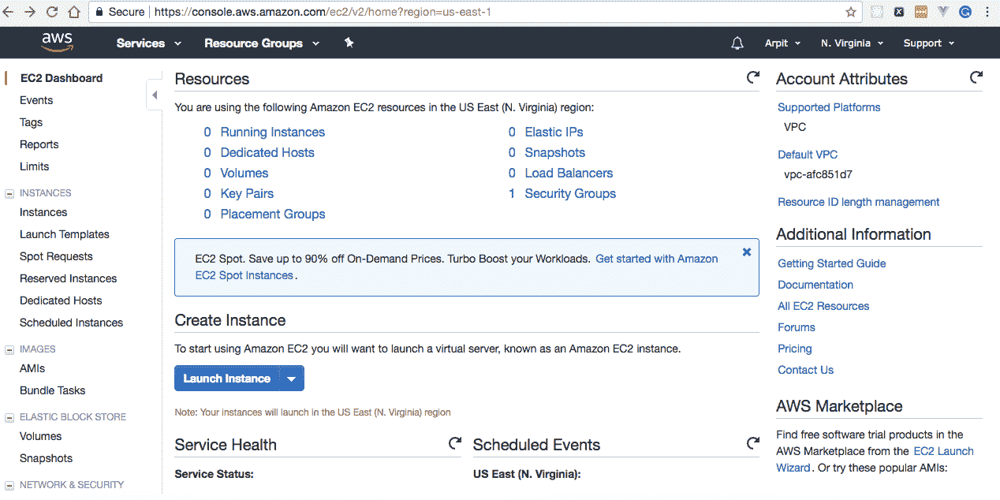

1.  选择 Amazon Linux AMI 2017.09.1（HVM），SSD 卷类型，如下截图所示：

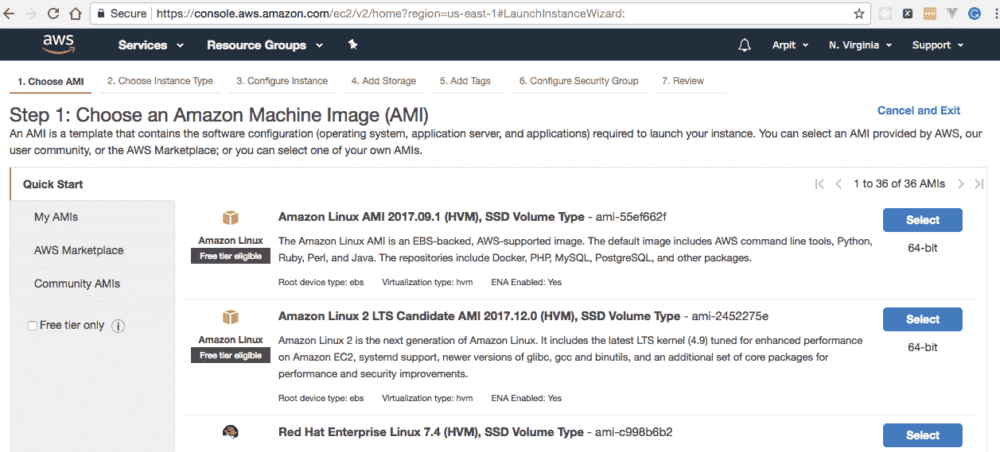

1.  选择 t2.micro 实例类型，然后点击“下一步：配置实例详细信息”：

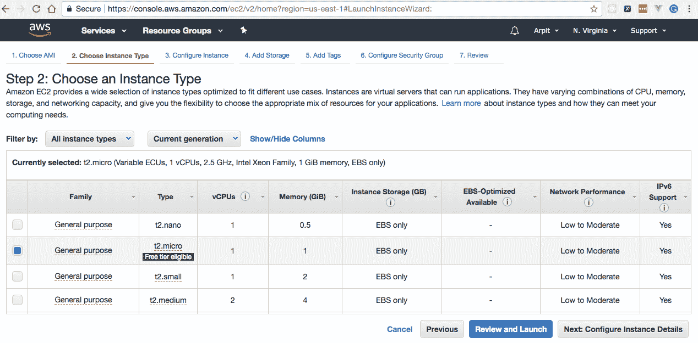

1.  在“配置实例详细信息”部分启用“自动分配公共 IP”，如下截图所示：

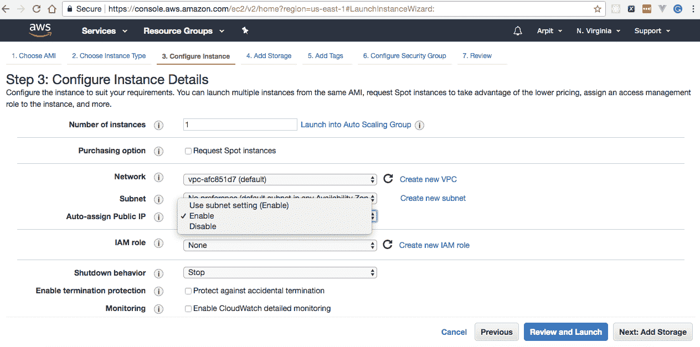

1.  不要对添加存储和添加标签部分进行任何更改。

1.  添加 HTTP 和 HTTPS 规则，然后在配置安全组部分点击“Review and Launch”按钮，如下截图所示：

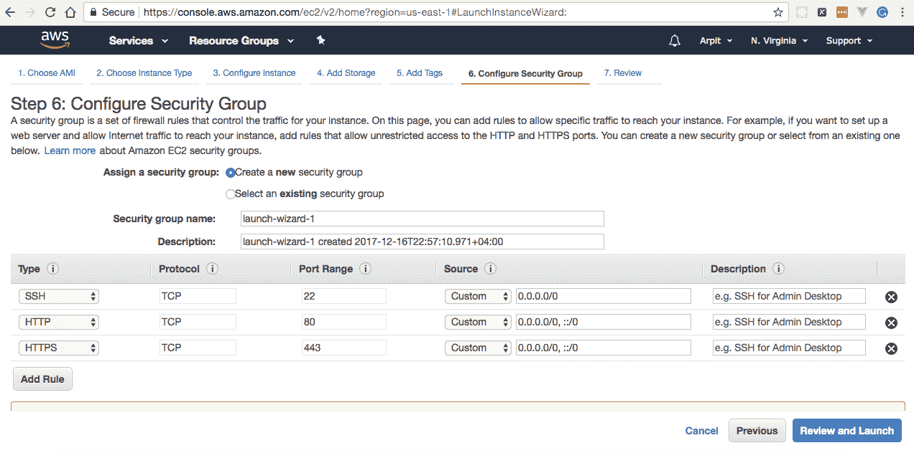

1.  从下拉菜单中选择“创建新的密钥对”，为密钥对命名，然后点击“下载密钥对”按钮。保存`my-first-ec2-instance.pem`文件，然后点击“启动实例”，如下截图所示：

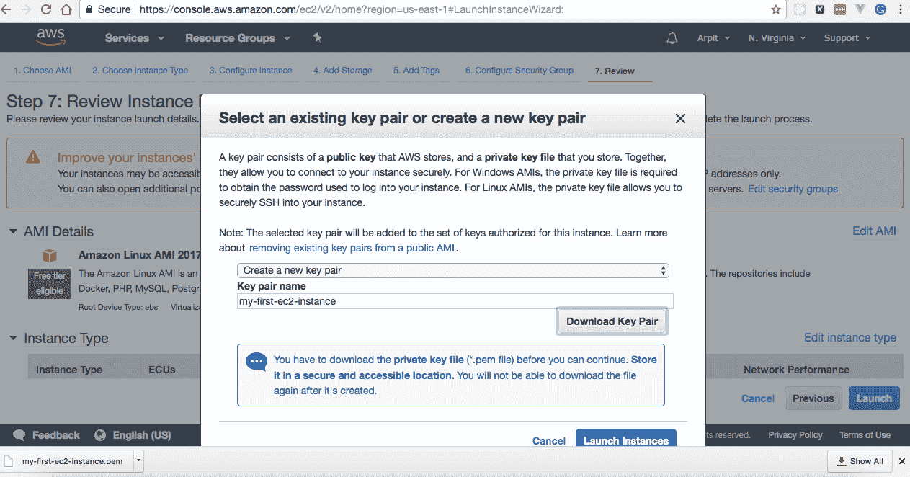

# 工作原理…

点击“启动实例”后，它将在 AWS 上创建并启动一个 Linux 机器，并为实例分配 ID、公共 DNS 和公共 IP，通过这些信息我们可以访问它。

转到 EC2 仪表板的实例部分，您可以看到正在运行的实例，如下截图所示：

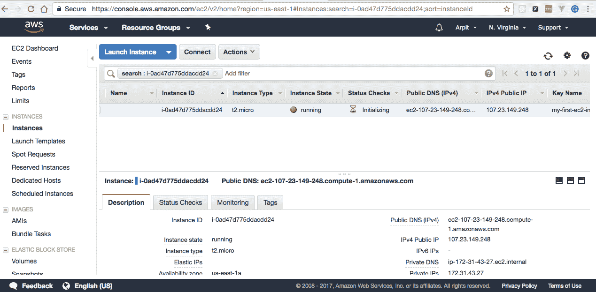

# 与您的第一个 EC2 实例交互

要在 EC2 实例上部署应用程序，我们首先必须登录并安装必要的软件包/软件，这可以通过 SSH 客户端（如 MobaXterm，Putty 等）轻松完成。在本教程中，我们将登录到之前创建的 EC2 实例，并使用 Red Hat 软件包管理器安装 Go。

# 操作步骤…

1.  将私钥文件`my-first-ec2-instance.pem`的权限设置为`400`，这意味着用户/所有者可以读取，但不能写入，也不能执行，而组和其他人都不能读取，不能写入，也不能执行，通过执行`chmod`命令，如下所示：

```go
$ chmod 400 my-first-ec2-instance.pem
```

1.  获取 EC2 实例的公共 DNS，并使用私钥文件作为`ec2-user`连接到它，如下所示执行`ssh`命令：

```go
$ ssh -i my-first-ec2-instance.pem ec2-user@ec2-172-31-34-99.compute-1.amazonaws.com
```

一旦命令成功执行，我们将登录到 EC2 实例，并且输出将如下所示：

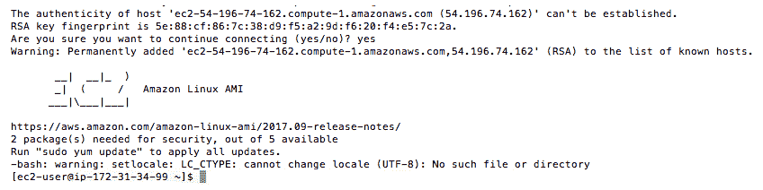

1.  通过执行`sudo`命令从`ec2-user`切换到`root`用户：

```go
[ec2-user@ip-172-31-34-99 ~]$ sudo su
```

1.  使用 Red Hat 软件包管理器`yum`安装`Go`，如下所示：

```go
[root@ip-172-31-34-99 ~]$ yum install -y go
```

# 工作原理…

通过执行`go version`命令验证`ec2-user`是否成功安装了`Go`，如下所示：

```go
[ec2-user@ip-172-31-34-99 ~]$ go version
go version go1.8.4 linux/amd64
```

# 在第一个 EC2 实例上创建、复制和运行 Go Web 应用程序

一旦我们准备好具有所需库的 EC2 实例，我们可以使用安全拷贝协议简单地复制应用程序，然后使用`go run`命令运行它，这将在本教程中介绍。

# 如何做…

1.  创建`http-server.go`，我们将创建一个简单的 HTTP 服务器，它将在`http://ec2-instance-public-dns:80`上呈现 Hello World!，或者从命令行执行`curl -X GET http://ec2-instance-public-dns:80`，如下所示：

```go
package main
import 
(
  "fmt"
  "log"
  "net/http"
)
const 
(
  CONN_PORT = "80"
)
func helloWorld(w http.ResponseWriter, r *http.Request) 
{
  fmt.Fprintf(w, "Hello World!")
}
func main() 
{ 
  http.HandleFunc("/", helloWorld)
  err := http.ListenAndServe(":"+CONN_PORT, nil)
  if err != nil 
  {
    log.Fatal("error starting http server : ", err)
    return
  }
}
```

一切就绪后，目录结构应如下所示：

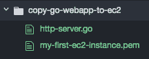

1.  使用安全拷贝或`scp`命令将`http-server.go`从本地机器目录复制到 EC2 用户主目录(`/home/ec2-user`)，如下所示：

```go
$ scp -i my-first-ec2-instance.pem http-server.go ec2-user@ec2-172-31-34-99.compute-1.amazonaws.com:/home/ec2-user
```

1.  使用私钥文件和公共 DNS 名称登录 EC2 实例，如下所示：

```go
$ ssh -i my-first-ec2-instance.pem ec2-user@ec2-172-31-34-99.compute-1.amazonaws.com
```

1.  在后台运行`http-server.go`，执行无挂起或`nohup`命令，如下所示：

```go
[ec2-user@ip-172-31-34-99 ~] $ nohup go run http-server.go &
```

# 工作原理…

一旦在 EC2 实例上运行程序，HTTP 服务器将在本地监听端口`80`。

接下来，从命令行执行`GET`请求：

```go
$ curl -i -X GET http://ec2-172-31-34-99.compute-1.amazonaws.com:80/
```

这将作为响应给出“Hello World!”，将给出以下输出：

```go
HTTP/1.1 200 OK
Date: Sat, 06 Jan 2018 10:59:38 GMT
Content-Length: 12
Content-Type: text/plain; charset=utf-8

Hello World!
```

# 设置 EC2 实例以运行 Docker 容器

要在 EC2 实例上运行 Docker 容器，我们首先必须设置一个带有 Docker 安装的实例，并将`ec2-user`添加到 Docker 组，以便我们可以以`ec2-user`而不是`root`用户执行 Docker 命令，这将在本教程中介绍。

# 如何做…

1.  通过执行以下命令从`ec2-user`用户切换到`root`用户：

```go
[ec2-user@ip-172-31-34-99 ~]$ sudo su
[root@ip-172-31-34-99 ec2-user]#
```

1.  安装`Docker`并通过执行以下命令更新 EC2 实例：

```go
[root@ip-172-31-34-99 ec2-user] yum install -y docker
[root@ip-172-31-34-99 ec2-user] yum update -y
```

1.  通过执行以下命令在 EC2 实例上启动`Docker`服务：

```go
[root@ip-172-31-34-99 ec2-user] service docker start
```

1.  将`ec2-user`添加到`docker`组，以便您可以在不使用`sudo`的情况下执行 Docker 命令，如下所示：

```go
[root@ip-172-31-34-99 ec2-user] usermod -a -G docker ec2-user
```

1.  通过执行以下命令退出 EC2 实例：

```go
[root@ip-172-31-34-99 ec2-user]# exit
 exit
[ec2-user@ip-172-31-34-99 ~]$ exit
 logout
Connection to ec2-172-31-34-99.compute-1.amazonaws.com closed.
```

1.  通过执行以下命令再次登录以获取新的 Docker 组权限：

```go
$ ssh -i my-first-ec2-instance.pem ec2-user@ec2-172-31-34-99.compute-1.amazonaws.com
```

这将在控制台上给出输出，如下截图所示：

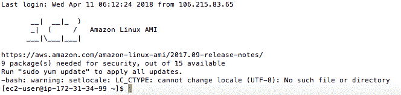

# 工作原理…

登录 EC2 实例并通过执行以下命令验证`ec2-user`是否可以在不使用`sudo`的情况下运行 Docker 命令：

```go
[ec2-user@ip-54-196-74-162 ~]$ docker info
```

这将显示有关 Docker 安装的系统范围信息，如下输出所示：

```go
 Containers: 1
 Running: 1
 Paused: 0
 Stopped: 0
 Images: 1
 ...
 Kernel Version: 4.9.62-21.56.amzn1.x86_64
 Operating System: Amazon Linux AMI 2017.09
 ...
 Live Restore Enabled: false
```

# 从 Docker Hub 在 AWS EC2 实例上拉取 Docker 镜像

要运行 Docker 容器，我们需要有一个 Docker 镜像，可以从`DockerFile`构建，也可以从任何公共或私有 Docker 注册表中拉取，例如 Docker Hub、Quay、Google 容器注册表、AWS 容器注册表等等。

由于我们已经学习了如何从`DockerFile`创建 Docker 镜像并在第九章“使用 Go 和 Docker”中将其推送到 Docker Hub，因此我们不会在本教程中再次构建镜像。相反，我们将在 EC2 实例上从 Docker Hub 拉取预构建的镜像。

在第九章中查看*构建您的第一个 Go Docker 镜像*教程，与 Go 和 Docker 一起工作。

# 如何做…

1.  使用您的凭据从命令行登录到 Docker Hub，执行以下命令：

```go
$ docker login --username arpitaggarwal --password XXXXX
 Login Succeeded
```

1.  执行`docker pull`命令从 Docker Hub 拉取`arpitaggarwal/golang-image`，如下所示：

```go
$ docker pull arpitaggarwal/golang-image
```

这将导致以下输出：

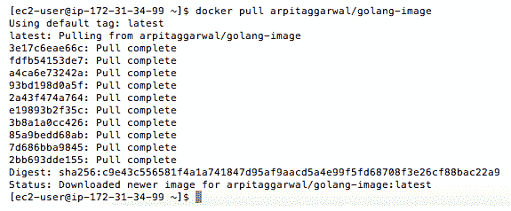

# 工作原理…

登录到 EC2 实例并通过执行以下命令验证是否成功从 Docker Hub 拉取了`arpitaggarwal/golang-image`：

```go
$ docker images
```

这将列出所有顶级镜像、它们的存储库、标签和大小，如下截图所示：

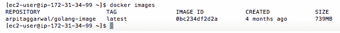

# 在 EC2 实例上运行您的 Go Docker 容器

一旦我们在 EC2 实例上安装了 Docker 镜像和 Docker，那么您可以通过执行`docker run`命令来简单地运行 Docker 容器，我们将在本教程中介绍这一点。

# 如何做…

登录到 EC2 实例并执行`docker run`命令，从`arpitaggarwal/golang-image`创建和运行一个 Docker 容器，使用`--name`标志将容器名称分配为`golang-container`，如下所示：

```go
$ docker run -d -p 80:8080 --name golang-container -it arpitaggarwal/golang-image
 8a9256fcbffc505ad9406f5a8b42ae33ab3951fffb791502cfe3ada42aff781e
```

`docker run`命令中指定的`-d`标志以守护进程模式启动容器，末尾的哈希字符串表示`golang-container`的 ID。

`docker run`命令中指定的`-p`标志将容器的端口发布到主机。由于我们在 Docker 容器内的端口`8080`上运行 HTTP 服务器，并且我们为 E2C 实例的入站流量打开了端口`80`，因此我们将其映射为`80:8080`。

# 工作原理…

登录到 EC2 实例并通过执行以下命令验证 Docker 容器是否已创建并成功运行：

```go
$ docker ps
```

一旦前面的命令成功执行，它将给我们运行中的 Docker 容器的详细信息，如下截图所示：

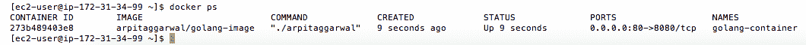

获取 EC2 实例的公共 DNS，并从命令行执行`GET`请求：

```go
$ curl -i -X GET http://ec2-172-31-34-99.compute-1.amazonaws.com/
```

这将作为响应给出“Hello World!”，如下输出所示：

```go
 HTTP/1.1 200 OK
 Date: Sat, 06 Jan 2018 12:49:28 GMT
 Content-Length: 12
 Content-Type: text/plain; charset=utf-8
 Hello World!
```
