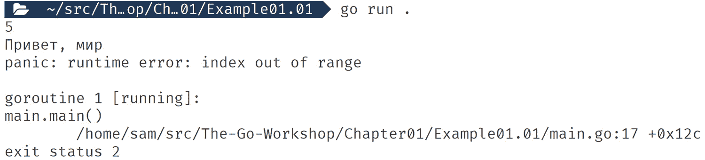
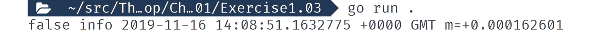
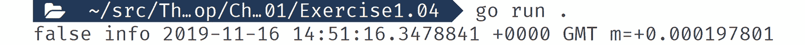
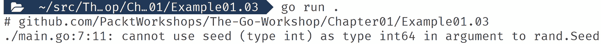
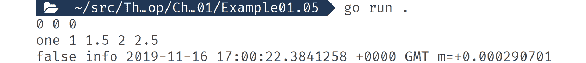
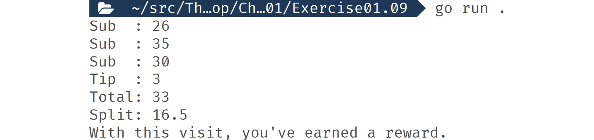
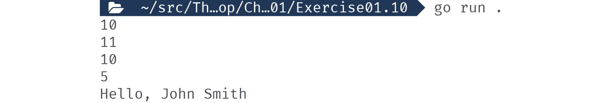
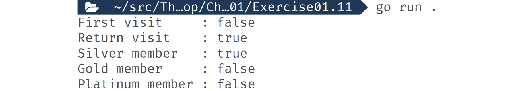
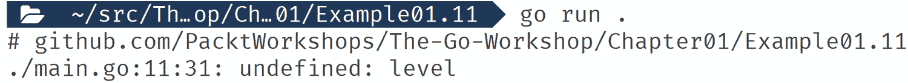

# 第一章：1. 变量和运算符

概述

在本章中，你将了解 Go 的特性，并基本了解 Go 代码的样子。你还将深入了解变量是如何工作的，并通过练习和活动来获得实践经验，以便开始动手操作。

到本章结束时，你将能够使用 Go 中的变量、包和函数。你将学习如何在 Go 中更改变量的值。在本章的后面部分，你将使用数字与运算符一起使用，并使用指针设计函数。

# 简介

Go（或通常称为 golang）是一种深受开发者喜爱的编程语言，因为使用它开发软件非常有益。它也受到公司的青睐，因为所有规模的公司团队都可以使用它来提高生产力。Go 还因其始终如一地提供性能极高的软件而赢得了声誉。

Go 有着令人印象深刻的血统，因为它是由一支来自 Google 的团队创造的，这支团队有着悠久的构建优秀的编程语言和操作系统的历史。他们创造了一种感觉上类似于 JavaScript 或 PHP 这样的动态语言的语言，但具有 C++和 Java 这样的强类型语言的性能和效率。他们希望创造一种对程序员来说既吸引人又在拥有数百名开发者的项目中实用的语言。

Go 语言充满了有趣且独特的特性，例如内存安全和基于通道的并发。我们将在本章中探讨这些特性。通过这样做，你会发现它们在 Go 中的独特实现正是 Go 真正特殊的原因。

Go 是用文本文件编写的，然后编译成机器代码并打包成一个单一的独立可执行文件。这个可执行文件是自包含的，不需要先安装任何东西就可以运行。拥有一个单独的文件使得部署和分发 Go 软件变得无烦恼。在编译时，你可以选择几个目标操作系统之一，包括但不限于 Windows、Linux、macOS 和 Android。使用 Go，你只需编写一次代码，就可以在任何地方运行。编译型语言已经不再受欢迎，因为程序员讨厌等待代码编译的漫长过程。Go 团队知道这一点，并构建了一个闪电般的编译器，即使项目规模扩大，编译速度仍然很快。

Go 具有静态类型和类型安全的内存模型，并带有垃圾回收器。这种组合保护开发者免受在软件中发现的许多最常见错误和安全漏洞的影响，同时仍然提供出色的性能和效率。动态类型语言，如 Ruby 和 Python，部分因为程序员觉得如果他们不必担心类型和内存，他们可以更有效率，因此变得流行。这些语言的缺点是它们放弃了性能和内存效率，并且更容易出现类型不匹配的错误。Go 具有与动态类型语言相同的生产力水平，同时没有放弃性能和效率。

计算机性能发生了巨大的转变。现在要快速运行，你需要能够尽可能并行或并发地完成更多的工作。这种变化是由于现代 CPU 的设计所致，它强调的是核心数量而非时钟速度。目前流行的所有编程语言都没有被设计用来利用这一事实，这使得在这些语言中编写并行和并发代码容易出错。Go 语言被设计用来利用多个 CPU 核心，它消除了所有挫折和充满错误的代码。Go 语言被设计成允许任何开发者轻松且安全地编写并行和并发代码，使他们能够利用现代的多核 CPU 和云计算 `–` 无需戏剧性的事件即可解锁高性能处理和大规模可扩展性。

## Go 语言看起来是什么样子？

让我们首先看看一些 Go 代码。这段代码会从预定义的消息列表中随机打印一条消息到控制台：

```go
package main
// Import extra functionality from packages
import (
  "errors"
  "fmt"
  "log"
  "math/rand"
  "strconv"
  "time"
)// Taken from: https://en.wiktionary.org/wiki/Hello_World#Translations
var helloList = []string{
  "Hello, world",
  "Καλημέρα κόσμε",
  "こんにちは世界",
  "سلام دنیا‎",
  "Привет, мир",
}
```

`main()` 函数被定义为：

```go
func main() {
  // Seed random number generator using the current time
  rand.Seed(time.Now().UnixNano())
  // Generate a random number in the range of out list
  index := rand.Intn(len(helloList))
  // Call a function and receive multiple return values
  msg, err := hello(index)
  // Handle any errors
  if err != nil {
  log.Fatal(err)
  }
  // Print our message to the console
  fmt.Println(msg)
}
```

让我们考虑一下 `hello()` 函数：

```go
func hello(index int) (string, error) {
  if index < 0 || index > len(helloList)-1 {
  // Create an error, convert the int type to a string
  return "", errors.New("out of range: " + strconv.Itoa(index))
  }
  return helloList[index], nil
}
```

现在，让我们逐块分析这段代码。

在我们的脚本顶部是以下内容：

```go
package main
```

这段代码是我们的包声明。所有 Go 文件都必须以其中之一开始。如果你想直接运行代码，你需要将其命名为 `main`。如果你不命名为 `main`，那么你可以将其用作库，并将其导入到其他 Go 代码中。在创建可导入的包时，你可以给它任何名称。同一目录下的所有 Go 文件都被视为同一包的一部分，这意味着所有文件都必须有相同的包名。

在以下代码中，我们正在从包中导入代码：

```go
// Import extra functionality from packages
import (
  "errors"
  "fmt"
  "log"
  "math/rand"
  "strconv"
  "time"
)
```

在这个例子中，所有包都来自 Go 的标准库。Go 的标准库质量很高且功能全面。强烈建议你最大限度地使用它。如果你发现一个包不是来自标准库，因为它看起来像 URL，例如 `github.com/fatih/color`。

Go 语言有一个模块系统，这使得使用外部包变得简单。要使用一个新的模块，只需将其添加到你的导入路径。Go 语言会在你下次构建代码时自动为你下载它。

导入只适用于它们声明的文件，这意味着你必须在同一个包和项目中反复声明相同的导入。不过，无需担心，你不需要手动完成这项工作。有许多工具和 Go 编辑器可以自动为你添加和删除导入：

```go
// Taken from: https://en.wiktionary.org/wiki/Hello_World#Translations
var helloList = []string{
  "Hello, world",
  "Καλημέρα κόσμε",
  "こんにちは世界",
  "سلام دنیا‎",
  "Привет, мир",
}
```

在这里，我们声明了一个全局变量，它是一个字符串列表，并用数据初始化它。Go 中的文本或字符串支持多字节 UTF-8 编码，这使得它们对任何语言都是安全的。我们在这里使用的列表类型被称为切片。Go 中有三种列表类型：切片、数组和映射。所有三种都是键和值的集合，您使用键从集合中获取值。切片和数组集合使用数字作为键。在切片和数组中，第一个键始终是 0。此外，在切片和数组中，数字是连续的，这意味着数字序列中永远不会出现中断。对于`map`类型，您可以选择`key`的类型。当您想使用其他数据在映射中查找值时，您会使用它。例如，您可以使用一本书的 ISBN 来查找其标题和作者：

```go
func main() {
…
}
```

在这里，我们声明了一个函数。函数是一段在调用时运行的代码。您可以将一个或多个变量作为数据传递给函数，并可选择从它接收一个或多个变量。Go 中的`main()`函数是特殊的。`main()`函数是 Go 代码的入口点。当您的代码运行时，Go 会自动调用`main`来开始执行：

```go
  // Seed random number generator using the current time
  rand.Seed(time.Now().UnixNano())
  // Generate a random number in the range of out list
  index := rand.Intn(len(helloList))
```

在前面的代码中，我们正在生成一个随机数。我们首先需要确保它是一个好的随机数，因此为了做到这一点，我们必须“初始化”随机数生成器。我们使用当前时间格式化为 Unix 时间戳（包含纳秒）来初始化它。为了获取时间，我们调用`time`包中的`Now`函数。`Now`函数返回一个结构体类型的变量。结构体是一组属性和函数的集合，类似于其他语言中的对象。在这种情况下，我们立即在该结构体上调用`UnixNano`函数。`UnixNano`函数返回一个`int64`类型的变量，这是一个 64 位整数，或者更简单地说，是一个数字。这个数字被传递到`rand.Seed`中。`rand.Seed`函数接受一个`int64`变量作为其输入。请注意，来自`time.UnixNano`和`rand.Seed`的变量的类型必须相同。现在，我们已经成功初始化了随机数生成器。

我们想要的是一个可以用来获取随机消息的数字。我们将使用`rand.Intn`来完成这项工作。这个函数给我们一个介于 0 和 1 之间的随机数，减去您传递的数字。这听起来可能有点奇怪，但它对我们试图做的事情来说非常完美。这是因为我们的列表是一个从 0 开始，每个值递增 1 的切片。这意味着最后一个索引比切片的长度少 1。

为了向您展示这意味着什么，这里有一些简单的代码：

```go
package main
import (
  "fmt"
)
func main() {
  helloList := []string{
  "Hello, world",
  "Καλημέρα κόσμε",
  "こんにちは世界",
  "سلام دنیا‎",
  "Привет, мир",
  }
  fmt.Println(len(helloList))
  fmt.Println(helloList[len(helloList)-1])
  fmt.Println(helloList[len(helloList)])
}
```

这段代码打印出列表的长度，然后使用该长度来打印最后一个元素。为了做到这一点，我们必须减去 1，否则我们会得到一个错误，这就是最后一行引起的问题：



图 1.01：显示错误的输出

一旦我们生成了我们的随机数，我们就将它分配给一个变量。我们使用 `:=` 符号来做这件事，这是 Go 中一个非常受欢迎的快捷方式。它告诉编译器继续将那个值分配给我的变量，并为那个值选择适当的数据类型。这个快捷方式是许多使 Go 感觉像动态类型语言的事情之一：

```go
  // Call a function and receive multiple return values
  msg, err := hello(index)
```

我们然后使用那个变量来调用一个名为 `hello` 的函数。我们稍后会看看 `hello`。重要的是要注意，我们从函数中接收两个值，并且我们可以使用 `:=` 符号将它们分配给两个新的变量，`msg` 和 `err`：

```go
func hello(index int) (string, error) {
…
}
```

这段代码是 `hello` 函数的定义；我们现在不展示函数体。函数作为一个逻辑单元，当需要时被调用。当调用函数时，调用它的代码会停止运行，等待函数运行完成。函数是保持你的代码有组织和可理解的伟大工具。在 `hello` 的签名中，我们定义了它接受一个 `int` 类型的值，并且返回一个 `string` 和一个 `error` 类型的值。在 Go 中，将 `error` 作为最后一个返回值是非常常见的事情。`{}` 之间的代码是函数体。以下是在调用函数时运行的代码：

```go
  if index < 0 || index > len(helloList)-1 {
  // Create an error, convert the int type to a string
  return "", errors.New("out of range: " + strconv.Itoa(index))
  }
  return helloList[index], nil
```

在这里，我们处于函数内部；函数体的第一行是一个 `if` 语句。一个 `if` 语句在其布尔表达式为真时运行其 `{}` 内的代码。布尔表达式是 `if` 和 `{}` 之间的逻辑。在这种情况下，我们正在测试传递的 `index` 变量是否大于 0 或小于可能的最大切片索引键。

如果布尔表达式是真的，那么我们的代码将返回一个空的 `string` 和一个 `error`。在这个时候，函数将停止运行，调用函数的代码将继续运行。如果布尔表达式不是真的，它的代码将被跳过，我们的函数将从 `helloList` 返回一个值和 `nil`。在 Go 中，`nil` 代表没有值和没有类型的东西：

```go
  // Handle any errors
  if err != nil {
  log.Fatal(err)
  }
```

在我们运行 `hello` 之后，我们首先需要做的是检查它是否成功运行。我们通过检查存储在 `err` 中的 `error` 值来做这件事。如果 `err` 不等于 `nil`，那么我们知道我们有一个错误。然后，我们调用 `log.Fatal`，它将记录消息并杀死我们的应用程序。一旦应用程序被杀死，就没有更多的代码运行：

```go
  // Print our message to the console
  fmt.Println(msg)
```

如果没有错误，那么我们知道 `hello` 成功运行，并且 `msg` 的值可以信赖持有有效值。我们需要做的最后一件事是通过终端将消息打印到屏幕上。

这就是它的样子：

![图 1.02：显示有效值的输出]

![图 B14177_01_02.jpg]

![图 1.02：显示有效值的输出]

在这个简单的 Go 程序中，我们已经能够涵盖许多关键概念，我们将在接下来的章节中全面探讨。

## 练习 1.01：使用变量、包和函数打印星星

使用字符串重复器创建一个包含所需星星数量的字符串：

1.  创建一个新的文件夹并将一个`main.go`文件添加到其中。

1.  声明变量

    ```go
    package main
    ```

1.  现在，添加我们将在此文件中使用的导入：

    ```go
    import (
      "fmt"
      "math/rand"
      "strings"
      "time"
    )
    ```

1.  ](img/B14177_01_03.jpg)

    ```go
    func main() {
    ```

1.  初始化随机数生成器：

    ```go
      rand.Seed(time.Now().UnixNano())
    ```

1.  在这个练习中，我们将使用在前面的例子中学到的一些知识来打印一个介于 1 到 5 之间的随机数（`*`）到控制台。这个练习将让你感受到使用 Go 的感觉，并练习我们将要使用的一些 Go 功能。让我们开始吧：

    ```go
      r := rand.Intn(5) + 1
    ```

1.  活动一.01 定义和打印

    ```go
      stars := strings.Repeat("*", r)
    ```

1.  图 1.04：分配变量后的预期输出

    ```go
      fmt.Println(stars)
    }
    ```

1.  为以下内容创建一个变量：

    ```go
    go run .
    ```

生成一个介于 0 和 1 之间的随机数，然后加 1 以得到一个介于 1 到 5 之间的数字：


本活动的解决方案可在第 684 页找到

我们现在将介绍所有可以声明变量的方式。

## 使用`var`声明变量

花生过敏作为一个`bool`

一个变量暂时为你保存数据，以便你可以使用它。当你声明一个变量时，它需要四个要素：一个声明你正在声明变量的语句、变量的名称、它可以保存的数据类型以及它的初始值。幸运的是，其中一些部分是可选的，但这也意味着定义变量的方式不止一种。

关键部分是`var`、`foo`、`string`和`= "bar"`：

## 图 1.03：显示星星的输出

保存文件。然后，在新的文件夹中，运行以下命令：

```go
var foo string = "bar"
```

使用`var`是声明变量的基础方法。我们将要讨论的其他所有方法都是这种方法的变体，通常是通过省略定义的一部分。一个完整的`var`定义，包含所有要素，看起来像这样：

+   `var`是我们定义变量的声明。

+   `foo`是变量的名称。

+   `string`是变量的类型。

+   `= "bar"`是其初始值。

## 练习 1.02：使用 var 声明一个变量

在这个练习中，我们将使用完整的`var`表示法声明两个变量，然后我们将它们打印到控制台。你会看到你可以在代码的任何地方使用 var 表示法，这不是所有变量声明表示法的共性。让我们开始吧：

1.  创建一个新的文件夹并添加一个`main.go`文件到其中：

1.  在`main.go`中，将主包名添加到文件顶部：

    ```go
    package main
    ```

1.  添加导入：

    ```go
    import (
      "fmt"
    )
    ```

1.  在包级别作用域中声明一个变量。我们将在稍后详细介绍作用域：

    ```go
    var foo string = "bar"
    ```

1.  创建`main()`函数：

    ```go
    func main() {
    ```

1.  在我们的函数中使用`var`声明另一个变量：

    ```go
      var baz string = "qux"
    ```

1.  将两个变量都打印到控制台：

    ```go
      fmt.Println(foo, baz)
    ```

1.  关闭`main()`函数：

    ```go
    }
    ```

1.  保存文件。然后，在新文件夹中运行以下命令：

    ```go
    go run .
    ```

    以下是输出：

    ```go
    bar qux
    ```

在这个例子中，`foo`是在包级别声明的，而`baz`是在函数级别声明的。变量的声明位置很重要，因为声明变量的位置也限制了你可以使用的表示法。

接下来，我们将看看另一种使用`var`表示法的方法。

## 使用 var 一次声明多个变量

我们可以使用单个`var`声明来定义多个变量。当声明包级别变量时，这种方法很常见。变量不需要是同一类型，并且它们都可以有自己的初始值。这种表示法看起来是这样的：

```go
Var (
  <name1> <type1> = <value1>
  <name2> <type2> = <value2>
…
  <nameN> <typeN> = <valueN>
)
```

你可以有多个这种类型的声明，这是一种将相关变量分组的好方法，从而使你的代码更易于阅读。你可以在函数中使用这种表示法，但很少在那里看到它的使用。

## 练习 1.03：使用 var 一次声明多个变量

在这个练习中，我们将使用一个 var 语句声明多个变量，每个变量具有不同的类型和初始值。然后，我们将打印每个变量的值到控制台。让我们开始吧：

1.  创建一个新的文件夹并添加一个`main.go`文件到其中。

1.  在`main.go`中，将`main`包名添加到文件顶部：

    ```go
    package main
    ```

1.  添加导入：

    ```go
    import (
      "fmt"
      "time"
    )
    ```

1.  开始`var`声明：

    ```go
    var (
    ```

1.  定义三个变量：

    ```go
      Debug     bool    = false
      LogLevel  string  = "info"
      startUpTime time.Time = time.Now()
    ```

1.  关闭`var`声明：

    ```go
    )
    ```

1.  在`main()`函数中，将每个变量打印到控制台：

    ```go
    func main() {
      fmt.Println(Debug, LogLevel, startUpTime)
    }
    ```

1.  保存文件。然后，在新文件夹中运行以下命令：

    ```go
    go run .
    ```

    以下是输出：



图 1.05：显示三个变量值的输出

在这个练习中，我们使用单个 var 语句声明了三个变量。对于`time.Time`变量，你的输出看起来不同，但这是正确的。格式是相同的，但时间本身是不同的。

以这种方式使用 var 表示法是一种保持代码井然有序并节省你输入的好方法。

接下来，我们将开始移除 var 表示法的一些可选部分。

## 声明变量时省略类型或值

在现实世界的代码中，使用完整的变量表示法并不常见。有一些情况下，你需要定义一个具有初始值和严格类型控制的包级别变量。在这些情况下，你需要使用完整的表示法。当需要时，这将是显而易见的，因为你将会有某种类型不匹配，所以现在不必过于担心。其余时间，你会移除可选部分或使用简短的变量声明。

在声明变量时，你不需要同时包含类型和初始值。你可以只使用其中一个；Go 会处理其余部分。如果你在声明中有类型但没有初始值，Go 会使用你选择的类型的零值。我们将在后面的章节中更多地讨论零值是什么。另一方面，如果你有初始值但没有类型，Go 有一套规则来推断从你使用的字面值中需要的类型。

## 练习 1.04：在声明变量时省略类型或值

在这个练习中，我们将更新之前的练习，跳过变量声明中的可选初始值或类型声明。然后，我们将像之前一样将值打印到控制台，以显示结果相同。让我们开始吧：

1.  创建一个新的文件夹，并向其中添加一个`main.go`文件。

1.  在`main.go`中，将`main`包名添加到文件顶部：

    ```go
    package main
    ```

1.  导入我们需要的包：

    ```go
    import (
      "fmt"
      "time"
    )
    ```

1.  开始多变量声明：

    ```go
    var (
    ```

1.  第一项练习中的`bool`有一个初始值 false。这是`bool`的零值，所以我们将从其声明中省略初始值：

    ```go
      Debug     bool
    ```

1.  下两个变量都有非零值的类型，所以我们将省略它们的类型声明：

    ```go
      LogLevel  = "info"
      startUpTime = time.Now()
    ```

1.  关闭变量声明：

    ```go
    )
    ```

1.  在`main()`函数中，打印出每个变量：

    ```go
    func main() {
      fmt.Println(Debug, LogLevel, startUpTime)
    }
    ```

1.  保存文件。然后，在新文件夹中，运行以下命令：

    ```go
    go run .
    ```

    以下为输出结果：



图 1.06：输出显示变量值，尽管在声明变量时没有提及类型

在这个练习中，我们能够更新之前的代码，使用更紧凑的变量声明。声明变量是你必须经常做的事情，而且不需要使用表示法会使编写代码时的体验更好。

接下来，我们将看看一个你不能省略任何部分的情况。

## 类型推断错误

有时候你需要使用声明中的所有部分，例如，当 Go 无法猜测你需要的正确类型时。让我们看看这个例子：

```go
package main
import "math/rand"
func main() {
  var seed = 1234456789
  rand.Seed(seed)
}
```

以下为输出结果：



图 1.07：输出显示错误

这里的问题是`rand.Seed`需要一个`int64`类型的变量。Go 的类型推断规则将整数（如我们用作`int`的整数）视为一个整体。我们将在后面的章节中更详细地探讨它们之间的区别。为了解决这个问题，我们将向声明中添加`int64`。以下是这样做的外观：

```go
package main
import "math/rand"
func main() {
  var seed int64 = 1234456789
  rand.Seed(seed)
}
```

接下来，我们将探讨一种更快的方式来声明变量。

## 简短变量声明

当在函数和函数中声明变量时，我们可以使用`:=`简写。这个简写允许我们使我们的声明更加简短。它是通过允许我们不必使用`var`关键字，并且始终从所需的初始值推断类型来实现的。

## 练习 1.05：实现简短变量声明

在这个练习中，我们将更新我们的先前练习以使用简短变量声明。由于你只能在函数中使用简短变量声明，因此我们将把变量移出包作用域。在此之前，`Debug`有一个类型但没有初始值，我们将将其切换回具有初始值，因为使用简短变量声明时需要初始值。最后，我们将将其打印到控制台。让我们开始吧：

1.  创建一个新的文件夹，并向其中添加一个`main.go`文件。

1.  在`main.go`中，将`main`包名添加到文件顶部：

    ```go
    package main
    ```

1.  导入我们需要的包：

    ```go
    import (
      "fmt"
      "time"
    )
    ```

1.  创建`main()`函数：

    ```go
    func main() {
    ```

1.  使用简短变量声明符号声明每个变量：

    ```go
      Debug := false
      LogLevel := "info"
      startUpTime := time.Now()
    ```

1.  将变量打印到控制台：

    ```go
      fmt.Println(Debug, LogLevel, startUpTime)
    }
    ```

1.  保存文件。然后，在新文件夹中运行以下命令：

    ```go
    go run .
    ```

以下为输出结果：


图 1.08：使用简短变量声明符号后打印的变量值

在这个练习中，我们将我们的先前代码更新为当我们有一个初始值可以使用时，使用一种非常紧凑的方式来声明变量。

`:=`简写是 Go 开发者中非常受欢迎的，并且在现实世界的 Go 代码中定义变量的最常见方式。开发者喜欢它使他们的代码简洁紧凑，同时仍然清楚地表明正在发生什么。

另一个快捷方式是在同一行声明多个变量。

## 使用简短变量声明声明多个变量

使用简短变量声明可以同时声明多个变量。它们必须在同一行上，并且每个变量都必须有一个相应的初始值。符号看起来像`<var1>, <var2>, …, <varN> := <val1>, <val2>, …, <valN>`。变量名位于`:=`的左侧，由逗号分隔。初始值再次位于`:=`的右侧，每个值由逗号分隔。最左侧的变量名获得最左侧的值。必须具有相同数量的名称和值。

这里是一个使用我们先前练习代码的示例：

```go
package main
import (
  "fmt"
  "time"
)
func main() {
  Debug, LogLevel, startUpTime := false, "info", time.Now()
  fmt.Println(Debug, LogLevel, startUpTime)
}
```

以下为输出结果：


图 1.09：显示具有变量声明函数的程序变量值的示例输出

有时，你确实会看到这样的真实世界代码。它读起来有点困难，所以在直接值方面并不常见。但这并不意味着它不常见，因为在调用返回多个值的函数时，这种情况非常普遍。我们将在稍后的章节中详细讨论这一点。

## 练习 1.06：从函数声明多个变量

在这个练习中，我们将调用一个返回多个值的函数，并将每个值分配给一个新的变量。然后，我们将打印这些值到控制台。让我们开始吧：

1.  创建一个新的文件夹，并向其中添加一个`main.go`文件。

1.  在`main.go`文件中，将`main`包名添加到文件顶部：

    ```go
    package main
    ```

1.  导入我们需要的包：

    ```go
    import (
      "fmt"
      "time"
    )
    ```

1.  创建一个返回三个值的函数：

    ```go
    func getConfig() (bool, string, time.Time) {
    ```

1.  在函数中，返回三个字面值，每个值之间用逗号分隔：

    ```go
      return false, "info", time.Now()
    ```

1.  关闭函数：

    ```go
    }
    ```

1.  创建`main()`函数：

    ```go
    func main() {
    ```

1.  使用简短的变量声明，捕获函数返回的三个新变量的值：

    ```go
      Debug, LogLevel, startUpTime := getConfig()
    ```

1.  将三个变量打印到控制台：

    ```go
      fmt.Println(Debug, LogLevel, startUpTime)
    ```

1.  关闭`main()`函数：

    ```go
    }
    ```

1.  保存文件。然后，在新文件夹中运行以下命令：

    ```go
    go run .
    ```

    以下为输出结果：

    

图 1.10：显示具有变量声明函数的程序变量值的输出

在这个练习中，我们能够调用一个返回多个值的函数，并使用一行简短的变量声明来捕获它们。如果我们使用`var`表示法，它将看起来像这样：

```go
var (
  Debug bool
  LogLevel string
  startUpTime time.Time
)
Debug, LogLevel, startUpTime = getConfig()
```

短变量表示法是 Go 语言具有动态语言感觉的一个重要部分。

尽管我们对`var`还没有完全了解，但它仍然有一个有用的技巧。

## 使用`var`在一行中声明多个变量

虽然使用简短的变量声明更为常见，但你也可以使用`var`在一行中定义多个变量。这种方法的局限性在于，当声明类型时，所有值必须具有相同的类型。如果你使用初始值，那么每个值将根据字面值推断其类型，这样它们就可以不同。以下是一个示例：

```go
package main
import (
  "fmt"
  "time"
)
func getConfig() (bool, string, time.Time) {
  return false, "info", time.Now()
}
func main() {
  // Type only
  var start, middle, end float32
  fmt.Println(start, middle, end)
  // Initial value mixed type
  var name, left, right, top, bottom = "one", 1, 1.5, 2, 2.5
  fmt.Println(name, left, right, top, bottom)
  // works with functions also
  var Debug, LogLevel, startUpTime = getConfig()
  fmt.Println(Debug, LogLevel, startUpTime)
}
```

以下为输出结果：



图 1.11：显示变量值的输出

当使用简短的变量声明时，大多数这些代码更加紧凑。这个事实意味着它们在现实世界的代码中并不常见。例外的是仅类型示例。当需要许多相同类型的变量，并且需要仔细控制该类型时，这种表示法可能很有用。

## 非英语变量名

Go 是一个 UTF-8 兼容的语言，这意味着你可以使用除拉丁字母以外的字母来定义变量名，例如英语使用的字母。关于变量名可以是什么有一些限制。变量名的第一个字符必须是字母或下划线 `_`。其余部分可以是字母、数字和下划线的组合。让我们看看它是什么样子：

```go
package main
import (
  "fmt"
  "time"
)
func main() {
  デバッグ := false
  日志级别 := "info"
  ይጀምሩ := time.Now()
  _A1_Μείγμα := "
"
  fmt.Println(デバッグ, 日志级别, ይጀምሩ, _A1_Μείγμα)
}
```

以下是输出：


图 1.12：显示变量值的输出

注意

**语言和语言**：并非所有编程语言都允许你使用 UTF-8 字符作为变量和函数名。这个特性可能是 Go 在亚洲国家，尤其是在中国如此受欢迎的原因之一。

## 改变变量的值

现在我们已经定义了我们的变量，让我们看看我们可以用它们做什么。首先，让我们将值从其初始值改变。要做到这一点，我们使用与设置初始值时相似的符号。这看起来像 `<variable> = <value>`。

## 练习 1.07：改变变量的值

1.  创建一个新的文件夹并将 `main.go` 文件添加到其中。

1.  在 `main.go` 中，将 `main` 包名添加到文件顶部：

    ```go
    package main
    ```

1.  导入我们需要的包：

    ```go
    import "fmt"
    ```

1.  创建 `main()` 函数：

    ```go
    func main() {
    ```

1.  声明一个变量：

    ```go
      offset := 5
    ```

1.  打印变量到控制台：

    ```go
      fmt.Println(offset)
    ```

1.  改变变量的值：

    ```go
      offset = 10
    ```

1.  再次将其打印到控制台并关闭 `main()` 函数：

    ```go
      fmt.Println(offset)
    }
    ```

1.  保存文件。然后，在新文件夹中，运行以下命令：

    ```go
    go run .
    ```

以下是改变变量值之前的输出：

```go
5
10
```

在这个例子中，我们将偏移量的值从其初始值 `5` 改变为 `10`。在任何使用原始值的地方，例如我们例子中的 `5` 和 `10`，你都可以使用变量。这看起来是这样的：

```go
package main
import "fmt"var defaultOffset = 10 func main() {
  offset := defaultOffset
  fmt.Println(offset)
  offset = offset + defaultOffset
  fmt.Println(offset)
}
```

以下是改变变量值后的输出：

```go
10
20
```

接下来，我们将看看如何在单行语句中改变多个变量。

## 一次性改变多个值

就像你可以在一行中声明多个变量一样，你也可以一次性改变多个变量的值。语法也类似；看起来像 `<var1>, <var2>, …, <varN> = <val1>, <val2>, …, <valN>`。

## 练习 1.08：一次性改变多个值

在这个练习中，我们将定义一些变量，并使用单行语句来改变它们的值。然后，我们将打印它们的新值到控制台。让我们开始吧：

1.  创建一个新的文件夹并将 `main.go` 文件添加到其中。

1.  在 `main.go` 中，将 `main` 包名添加到文件顶部：

    ```go
    package main
    ```

1.  导入我们需要的包：

    ```go
    import "fmt"
    ```

1.  创建 `main()` 函数：

    ```go
    func main() {
    ```

1.  使用初始值声明我们的变量：

    ```go
      query, limit, offset := "bat", 10, 0
    ```

1.  使用单行语句改变每个变量的值：

    ```go
      query, limit, offset = "ball", offset, 20
    ```

1.  将值打印到控制台并关闭 `main()` 函数：

    ```go
      fmt.Println(query, limit, offset)
    }
    ```

1.  保存文件。然后，在新文件夹中，运行以下命令：

    ```go
    go run .
    ```

以下是使用单行语句显示改变后的变量值的输出：

```go
ball 0 20
```

在这个练习中，我们能够在单行中更改多个变量。这种方法在调用函数时也同样适用，就像变量声明一样。你需要小心使用这种特性，确保首先你的代码易于阅读和理解。如果使用这种单行语句使得代码难以理解，那么最好占用更多行来编写代码。

接下来，我们将看看运算符是什么以及它们如何以有趣的方式改变你的变量。

## 运算符

当变量保存你的应用程序数据时，当你开始使用它们来构建软件逻辑时，它们才真正有用。运算符是你用来处理软件数据的工具。有了运算符，你可以比较数据与其他数据。例如，你可以在交易应用程序中检查价格是否过低或过高。你还可以使用运算符来操纵数据。例如，你可以使用运算符将购物车中所有商品的成本相加以获得总价。

下面的列表提到了运算符的组：

+   算术运算符

    用于数学相关的任务，如加法、减法和乘法。

+   比较运算符

    用于比较两个值；例如，它们是否相等，不相等，小于还是大于对方。

+   逻辑运算符

    与布尔值一起使用，以查看它们是否都为真，只有一个为真，或者布尔值是否为假。

+   地址运算符

    我们将在查看指针时详细讲解这些。这些用于与它们一起使用。

+   接收运算符

    当与 Go 通道一起使用时使用，我们将在后面的章节中介绍。

## 练习 1.09 使用运算符进行数字运算

在这个练习中，我们将模拟餐厅账单。为了构建我们的模拟，我们需要使用数学和比较运算符。我们将首先探索运算符的所有主要用途。

在我们的模拟中，我们将把所有东西加起来，并根据百分比计算出小费。然后，我们将使用比较运算符来查看顾客是否获得奖励。让我们开始吧：

注意

我们已经将美元作为本练习的货币。你可以考虑任何你喜欢的货币；这里的主要重点是操作。

1.  在新文件夹中创建一个`main.go`文件：

1.  在`main.go`中，将`main`包名添加到文件顶部：

    ```go
    package main
    ```

1.  导入你需要的包：

    ```go
    import "fmt"
    ```

1.  创建`main()`函数：

    ```go
    func main() {
    ```

1.  创建一个变量来保存总和。对于账单上的这一项，顾客购买了 2 件价值 13 美元的商品。我们使用`*`来进行乘法运算。然后，我们打印出小计：

    ```go
      // Main course
      var total float64 = 2 * 13
      fmt.Println("Sub  :", total)
    ```

1.  在这里，他们购买了 4 件价值 2.25 美元的商品。我们使用乘法来计算这些商品的总价，然后使用`+`将其加到之前总价值上，然后再将其赋值回总和：

    ```go
      // Drinks
      total = total + (4 * 2.25)
      fmt.Println("Sub  :", total)
    ```

1.  这个顾客将获得 5 美元的折扣。在这里，我们使用`–`从总金额中减去 5 美元：

    ```go
      // Discount
      total = total - 5
      fmt.Println("Sub  :", total)
    ```

1.  然后，我们使用乘法来计算 10%的小费：

    ```go
      // 10% Tip
      tip := total * 0.1
      fmt.Println("Tip  :", tip)
    ```

1.  最后，我们将小费加到总额上：

    ```go
      total = total + tip
      fmt.Println("Total:", total)
    ```

1.  账单将分给两个人。使用`/`将总额分成两部分：

    ```go
      // Split bill
      split := total / 2
      fmt.Println("Split:", split)
    ```

1.  在这里，我们将计算客户是否获得奖励。首先，我们将设置`visitCount`，然后向这次访问添加 1 美元：

    ```go
      // Reward every 5th visit
      visitCount := 24
      visitCount = visitCount + 1
    ```

1.  然后，我们将使用`%`来获取`visitCount`除以 5 美元后的任何余数：

    ```go
      remainder := visitCount % 5
    ```

1.  客户在每次第五次访问时都会获得奖励。如果余数是 0，那么这就是其中一次访问。使用`==`运算符检查余数是否为 0：

    ```go
      if remainder == 0 {
    ```

1.  如果是，打印一条消息，说明他们获得了奖励：

    ```go
        fmt.Println("With this visit, you've earned a reward.")
      }
    }
    ```

1.  保存文件。然后在新的文件夹中，运行以下命令：

    ```go
    go run .
    ```

以下是将显示的输出：



图 1.13：使用数字的运算符输出

在这个练习中，我们使用了数学和比较运算符与数字。它们使我们能够模拟一个复杂的情况——计算餐厅账单。有很多运算符，你可以使用哪些取决于不同类型的值。例如，除了有数字的加法运算符外，你还可以使用`+`符号将字符串连接起来。下面是它的实际应用：

```go
package main
import "fmt"
func main() {
  givenName := "John"
  familyName := "Smith"
  fullName := givenName + " " + familyName
  fmt.Println("Hello,", fullName)
}
```

以下是将显示的输出：

```go
Hello, John Smith
```

对于某些情况，我们可以使用运算符来简化操作。我们将在下一节中介绍这一点。

注意

**位运算符**：Go 语言拥有所有你在编程语言中都能找到的熟悉的位运算符。如果你知道位运算符是什么，那么这里对你来说不会有惊喜。如果你不知道位运算符是什么，不用担心——它们在现实世界的代码中并不常见。

## 简写运算符

当你想对一个现有值执行操作时，有一些简写赋值运算符。例如：

+   --：将数字减 1

+   ++：将数字增加 1

+   +=：加并赋值

+   -=：减并赋值

## 练习 1.10：实现简写运算符

在这个练习中，我们将使用一些运算符简写的例子来展示它们如何使你的代码更加紧凑且易于编写。我们将创建一些变量，然后使用简写来改变它们，在过程中打印它们。让我们开始吧：

1.  创建一个新的文件夹，并向其中添加一个`main.go`文件。

1.  在`main.go`中，将`main`包名添加到文件顶部：

    ```go
    package main
    ```

1.  导入我们需要的包：

    ```go
    import "fmt"
    ```

1.  创建`main()`函数：

    ```go
    func main() {
    ```

1.  创建一个具有初始值的变量：

    ```go
      count := 5
    ```

1.  我们将向其添加内容，然后将结果赋值回自身。然后，我们将打印出来：

    ```go
      count += 5
      fmt.Println(count)
    ```

1.  将值增加 1 然后打印出来：

    ```go
      count++
      fmt.Println(count)
    ```

1.  减去 1 然后打印出来：

    ```go
      count--
      fmt.Println(count)
    ```

1.  从自身减去并赋值给自身。打印出新的值：

    ```go
      count -= 5
      fmt.Println(count)
    ```

1.  此外，还有一个与字符串一起工作的简写。定义一个字符串：

    ```go
      name := "John"
    ```

1.  接下来，我们将向其末尾追加另一个字符串，然后打印出来：

    ```go
      name += " Smith"
      fmt.Println("Hello,", name)
    ```

1.  关闭`main()`函数：

    ```go
    }
    ```

1.  保存文件。然后在新的文件夹中，运行以下命令：

    ```go
    go run .
    ```

以下是将显示的输出：



图 1.14：使用简写运算符的输出

在这个练习中，我们使用了一些简写运算符。一组专注于修改和赋值。这种操作很常见，并且有这些快捷方式可以使编码更加有趣。其他运算符是递增和递减。这些在需要逐个遍历数据时在循环中很有用。这些快捷方式使任何阅读你代码的人都能清楚地知道你在做什么。

接下来，我们将详细探讨比较值。

## 比较值

应用程序中的逻辑是一个让你的代码做出决定的问题。这些决定是通过比较变量的值与您定义的规则来做出的。这些规则以比较的形式出现。我们使用另一组运算符来进行这些比较。这些比较的结果总是真或假。你通常还需要进行多次这些比较才能做出一个决定。为了帮助做到这一点，我们有逻辑运算符。

这些运算符大部分与两个值一起工作，并且总是产生布尔值。你只能使用逻辑运算符与布尔值一起使用。让我们更详细地看看比较运算符和逻辑运算符：

**比较运算符**

+   `==` 如果两个值相同，则为真

+   `!=` 如果两个值不相同，则为真

+   `<` 如果左边的值小于右边的值，则为真

+   `<=` 如果左边的值小于或等于右边的值，则为真

+   `>` 如果左边的值大于右边的值，则为真

+   `>=` 如果左边的值大于或等于右边的值，则为真

**逻辑运算符**

+   `&&` 如果左边的值和右边的值都为真，则为真

+   `||` 如果左边的值或两个值中的任何一个为真，则为真

+   `!` 此运算符仅与单个值一起使用，如果值为假，则结果为真

## 练习 1.11：比较值

在这个练习中，我们将使用比较和逻辑运算符来查看在测试不同条件时我们得到什么布尔结果。我们正在测试根据他们已访问的次数来确定用户的会员等级。

我们的会员等级如下：

+   银级：包含 10 到 20 次访问

+   金级：包含 21 到 30 次访问

+   白金级：超过 30 次访问

让我们开始吧：

1.  创建一个新的文件夹，并向其中添加一个`main.go`文件。

1.  在`main.go`中，将`main`包名添加到文件顶部：

    ```go
    package main
    ```

1.  导入我们将需要的包：

    ```go
    import "fmt"
    ```

1.  创建`main()`函数：

    ```go
    func main() {
    ```

1.  定义我们的`visits`变量并将其初始化为值：

    ```go
      visits := 15
    ```

1.  使用等于运算符来查看这是否是他们的第一次访问。然后，将结果打印到控制台：

    ```go
      fmt.Println("First visit   :", visits == 1)
    ```

1.  使用不等运算符来查看他们是否是回头客：

    ```go
      fmt.Println("Return visit  :", visits != 1)
    ```

1.  让我们使用以下代码检查他们是否是银级会员：

    ```go
      fmt.Println("Silver member   :", visits >= 10 && visits < 21)
    ```

1.  让我们使用以下代码检查他们是否是金级会员：

    ```go
      fmt.Println("Gold member   :", visits > 20 && visits <= 30)
    ```

1.  让我们使用以下代码检查他们是否是白金级会员：

    ```go
      fmt.Println("Platinum member :", visits > 30)
    ```

1.  关闭`main()`函数：

    ```go
    }
    ```

1.  保存文件。然后，在新文件夹中运行以下命令：

    ```go
    go run .
    ```

以下是输出结果：

![图 1.15：显示比较结果的输出]



图 1.15：显示比较结果的输出

在这个练习中，我们使用了比较和逻辑运算符来对数据进行决策。你可以以无限多种方式组合这些运算符，以表达软件需要执行的几乎任何类型的逻辑。

接下来，我们将看看当你没有为变量提供一个初始值时会发生什么。

## 零值

变量的零值是该变量类型的空或默认值。Go 有一套规则说明零值适用于所有核心类型。让我们看看：

![图 1.16：变量类型及其零值]

![img/B14177_01_16.jpg]

图 1.16：变量类型及其零值

还有其他类型，但它们都是基于这些核心类型派生出来的，所以相同的规则仍然适用。

我们将在接下来的练习中查看一些类型的零值。

## 练习 1.12 零值

在这个例子中，我们将定义一些没有初始值的变量。然后，我们将打印出它们的值。我们在这个练习中使用`fmt.Printf`来帮助我们，因为我们可以得到关于值类型的更多细节。`fmt.Printf`使用一种模板语言，允许我们转换传递的值。我们使用的替换是`%#v`。这种转换是显示变量值和类型的有用工具。以下是一些你可以尝试的其他常见替换：

![图 1.17：替换表]

![img/B14177_01_17.jpg]

图 1.17：替换表

当使用`fmt.Printf`时，你需要自己添加换行符号，这可以通过在字符串末尾添加`\n`来实现。让我们开始吧：

1.  在新文件夹中创建一个`main.go`文件：

1.  在`main.go`中，将`main`包名添加到文件顶部：

    ```go
    package main
    ```

1.  导入我们需要的包：

    ```go
    import (
      "fmt"
      "time"
    )
    ```

1.  创建`main()`函数：

    ```go
    func main() {
    ```

1.  声明并打印一个整数：

    ```go
      var count int
      fmt.Printf("Count  : %#v \n", count) 
    ```

1.  声明并打印一个`float`：

    ```go
      var discount float64
      fmt.Printf("Discount : %#v \n", discount) 
    ```

1.  声明并打印一个布尔值：

    ```go
      var debug bool
      fmt.Printf("Debug  : %#v \n", debug) 
    ```

1.  声明并打印一个`string`：

    ```go
      var message string
      fmt.Printf("Message  : %#v \n", message) 
    ```

1.  声明并打印一个字符串集合：

    ```go
      var emails []string
      fmt.Printf("Emails   : %#v \n", emails) 
    ```

1.  声明并打印一个结构体（由其他类型组成的一种类型；我们将在以后的章节中介绍）：

    ```go
      var startTime time.Time
      fmt.Printf("Start  : %#v \n", startTime)
    ```

1.  关闭`main()`函数：

    ```go
    }
    ```

1.  保存文件。然后，在新文件夹中运行以下命令：

    ```go
    go run .
    ```

以下为输出结果：

![图 1.18：显示零值的输出]

![img/B14177_01_18.jpg]

图 1.18：显示零值的输出

在这个练习中，我们定义了各种没有初始值的变量类型。然后，我们使用`fmt.Printf`打印它们，以暴露更多关于值的细节。了解零值是什么以及 Go 如何控制它们，可以帮助你避免错误并编写简洁的代码。

接下来，我们将看看指针是什么以及它们如何帮助你编写高效的软件。

## 值与指针

对于像`int`、`bool`和`string`这样的值，当你将它们传递给函数时，Go 会复制这个值，并且函数中使用的是这个副本。这种复制意味着在函数中对值的更改不会影响你在调用函数时使用的值。

通过复制传递值往往会导致代码中错误更少。使用这种传递值的方法，Go 可以使用其简单的内存管理系统，即栈。缺点是随着值从函数传递到函数，复制会消耗越来越多的内存。在实际代码中，函数往往很小，值会被传递到很多函数中，所以按值复制有时可能会使用比所需更多的内存。

有一种使用更少内存的复制替代方案。我们不是传递一个值，而是创建一个称为指针的东西，然后将它传递给函数。指针本身不是一个值，你不能用指针做任何有用的事情，除了用它来获取一个值。你可以把指针想象成指向你想要的价值的方向，要到达这个值，你必须遵循这些方向。如果你使用指针，Go 在将指针传递给函数时不会复制该值。

当创建一个指向值的指针时，Go 无法使用栈来管理该值的内存。这是因为栈依赖于简单的范围逻辑来知道何时可以回收由值使用的内存，而拥有一个变量的指针意味着这些规则不起作用。相反，Go 将值放在堆上。堆允许值存在，直到你的软件的任何部分都没有指向它的指针为止。Go 通过其所谓的垃圾回收过程回收这些值。这种垃圾回收在后台定期发生，你不需要担心它。

拥有一个指向值的指针意味着该值被放在堆上，但这不是唯一的原因。确定一个值是否需要放在堆上被称为逃逸分析。有时即使没有指针的值也会被放在堆上，而且原因并不总是很清楚。

你无法直接控制一个值是放在栈上还是堆上。内存管理不是 Go 语言规范的一部分。内存管理被视为内部实现细节。这意味着它可以在任何时候更改，而我们之前讨论的只是一些一般性指南，而不是固定规则，并且可能在以后发生变化。

虽然使用指针而不是传递给许多函数的值在内存使用上的好处是明显的，但在 CPU 使用上则不太明显。当一个值被复制时，Go 需要 CPU 周期来获取该内存并在稍后释放它。使用指针在传递给函数时可以避免这种 CPU 使用。另一方面，堆上的值意味着它需要通过复杂的垃圾回收过程来管理。这个过程在某些情况下可能成为 CPU 瓶颈，例如，如果堆上有许多值。当这种情况发生时，垃圾收集器需要进行大量的检查，这会消耗 CPU 周期。这里没有正确答案，最佳方法是经典的性能优化方法。首先，不要过早优化。当你确实遇到性能问题时，在做出更改之前进行测量，然后在更改之后再次进行测量。

除了性能之外，你还可以使用指针来改变你的代码设计。有时，使用指针可以使接口更清晰，并简化你的代码。例如，如果你需要知道一个值是否存在，非指针值总是至少有它的零值，这在你的逻辑中可能是有效的。你可以使用指针来允许`is not set`状态以及持有值。这是因为指针，除了持有值的地址外，还可以是`nil`，这意味着没有值。在 Go 中，`nil`是一个特殊类型，表示没有值。

指针可以为 nil 的能力还意味着，当它没有与之关联的值时，你可以获取指针的值，这意味着你将得到运行时错误。为了防止运行时错误，在尝试获取其值之前，你可以将指针与 nil 进行比较。这看起来像`<pointer> != nil`。你可以将指针与相同类型的其他指针进行比较，但只有在比较的是指针自身时，它们才会返回 true。不会比较关联的值。

作为该语言的初学者，我建议在它们成为必要之前避免使用指针，无论是由于你有性能问题，还是因为使用指针可以使你的代码更清晰。

## 获取指针

要获取指针，你有几种选择。你可以使用`var`语句将变量声明为指针类型。你可以通过在大多数类型的前面添加一个`*`来实现这一点。这种表示法看起来像`var <name> *<type>`。使用此方法声明的变量的初始值是`nil`。你可以使用内置的`new`函数来做到这一点。此函数旨在用于为类型获取内存并返回对该地址的指针。表示法看起来像`<name> := new(<type>).` `new`函数也可以与`var`一起使用。你还可以使用`&`从现有变量中获取指针。这看起来像`<var1> := &<var2>.`

## 练习 1.13：获取指针

在这个练习中，我们将使用我们可以使用的方法来获取指针变量。然后，我们将使用 `fmt.Printf` 将它们打印到控制台，以查看它们的类型和值。让我们开始吧：

1.  创建一个新的文件夹，并向其中添加一个 `main.go` 文件。

1.  在 `main.go` 文件中，将 `main` 包名添加到文件顶部：

    ```go
    package main
    ```

1.  导入我们需要的包：

    ```go
    import (
      "fmt"
      "time"
    )
    ```

1.  创建 `main()` 函数：

    ```go
    func main() {
    ```

1.  使用 `var` 语句声明一个指针：

    ```go
      var count1 *int
    ```

1.  使用 `new` 创建一个变量：

    ```go
      count2 := new(int)
    ```

1.  你不能取一个字面量的地址。创建一个临时变量来保存一个数字：

    ```go
      countTemp := 5
    ```

1.  使用 `&` 从现有变量创建一个指针：

    ```go
      count3 := &countTemp
    ```

1.  在某些类型中，可以不使用临时变量就创建一个指针。这里，我们使用我们信任的 `time` 结构体：

    ```go
      t := &time.Time{}
    ```

1.  使用 `fmt.Printf` 打印每个变量：

    ```go
      fmt.Printf("count1: %#v\n", count1)
      fmt.Printf("count2: %#v\n", count2)
      fmt.Printf("count3: %#v\n", count3)
      fmt.Printf("time  : %#v\n", t)
    ```

1.  关闭 `main()` 函数：

    ```go
    }
    ```

1.  保存文件。然后，在新文件夹中运行以下命令：

    ```go
    go run .
    ```

以下为输出结果：

![图 1.19：创建指针后的输出

![图 1.19：创建指针后的输出

图 1.19：创建指针后的输出

在这个练习中，我们探讨了创建指针的三种不同方法。每一种方法都有用，取决于你的代码需要什么。使用 `var` 语句时，指针的值为 `nil`，而其他指针已经与它们关联了值地址。对于 `time` 变量，我们可以看到其值，但我们可以判断它是一个指针，因为其输出以 `&` 开头。

接下来，我们将看看如何从一个指针中获取一个值。

## 从指针获取值

在上一个练习中，当我们打印出指向 `int` 指针的指针变量到控制台时，我们要么得到 `nil`，要么看到内存地址。要获取指针关联的值，你需要使用变量名前的 `*` 来解引用该值。这看起来像 `fmt.Println(*<val>)`。

在 Go 软件中，解引用零或 `nil` 指针是一个常见的错误，因为编译器无法警告你，这发生在应用程序运行时。因此，在解引用之前始终检查指针不是 `nil` 是最好的实践，除非你确定它不是 `nil`。

你并不总是需要解引用；例如，当属性或函数位于结构体上时。不用担心太多你不应该解引用的情况，因为 Go 会给你清晰的错误信息，告诉你何时可以和不可以解引用一个值。

## 练习 1.14：从指针获取值

在这个练习中，我们将更新我们之前的练习，以从指针解引用值。我们还将添加 `nil` 检查以防止我们得到任何错误。让我们开始吧：

1.  创建一个新的文件夹，并向其中添加一个 `main.go` 文件。

1.  在 `main.go` 文件中，将 `main` 包名添加到文件顶部：

    ```go
    package main
    ```

1.  导入我们需要的包：

    ```go
    import (
      "fmt"
      "time"
    )
    ```

1.  创建 `main()` 函数：

    ```go
    func main() {
    ```

1.  我们声明的指针与之前的方式相同：

    ```go
      var count1 *int
      count2 := new(int)
      countTemp := 5
      count3 := &countTemp
      t := &time.Time{}
    ```

1.  对于计数 1、2 和 3，我们需要添加一个 `nil` 检查，并在变量名前添加 `*`：

    ```go
      if count1 != nil {
      fmt.Printf("count1: %#v\n", *count1)
      }
      if count2 != nil {
      fmt.Printf("count2: %#v\n", *count2)
      }
      if count3 != nil {
      fmt.Printf("count3: %#v\n", *count3)
      }
    ```

1.  我们还将为 `time` 变量添加 `nil` 检查：

    ```go
      if t != nil {
    ```

1.  我们将使用 `*` 解引用变量，就像我们之前对 `count` 变量所做的那样：

    ```go
      fmt.Printf("time  : %#v\n", *t)
    ```

1.  在这里，我们正在对`time`变量调用一个函数。这次，我们不需要解引用它：

    ```go
      fmt.Printf("time  : %#v\n", t.String())
    ```

1.  关闭`nil`检查：

    ```go
      }
    ```

1.  关闭`main()`函数：

    ```go
    }
    ```

1.  保存文件。然后，在新文件夹中运行以下命令：

    ```go
    go run .
    ```

以下是对输出：

![图 1.20：使用指针获取的值的输出]

![图片 B14177_01_20.jpg]

图 1.20：使用指针获取的值的输出

在这个练习中，我们使用解引用从我们的指针中获取值。我们还使用了 nil 检查来防止解引用错误。从这个练习的输出中，我们可以看到`count1`是一个 nil 值，如果我们尝试解引用，我们会得到一个错误。`count2`是使用`new`创建的，它的值是其类型的零值。`count3`也有一个与从其获取指针的变量的值匹配的值。对于我们的`time`变量，我们能够解引用整个结构体，这就是为什么我们的输出不以`&`开头。

接下来，我们将看看使用指针如何允许我们改变代码的设计。

## 指针设计函数

我们将在后面的章节中更详细地介绍函数，但你知道到目前为止我们所做的一切，足以看到使用指针如何改变你使用函数的方式。一个函数必须被编码为接受指针，这不是你可以选择是否要做的事情。如果你有一个指针变量或者将变量的指针传递给函数，函数中对变量值的任何更改也会影响函数外部的变量值。

## 练习 1.15：指针设计函数

在这个练习中，我们将创建两个函数：一个函数通过值接受一个数字，将其加 5，然后将其打印到控制台；另一个函数接受一个数字作为指针，将其加 5，然后将其打印出来。我们还会在调用每个函数后打印出数字，以评估它对传递给函数的变量的影响。让我们开始吧：

1.  创建一个新的文件夹，并向其中添加一个`main.go`文件。

1.  在`main.go`中，将`main`包名添加到文件顶部：

    ```go
    package main
    ```

1.  导入我们需要的包：

    ```go
    import "fmt"
    ```

1.  创建一个接受`int`作为参数的函数：

    ```go
    func add5Value(count int) {
    ```

1.  将`5`加到传递的数字上：

    ```go
      count += 5
    ```

1.  将更新的数字打印到控制台：

    ```go
      fmt.Println("add5Value   :", count)
    ```

1.  关闭函数：

    ```go
    }
    ```

1.  创建另一个接受`int`指针的函数：

    ```go
    func add5Point(count *int) {
    ```

1.  解引用值并加`5`：

    ```go
      *count += 5
    ```

1.  打印出更新后的`count`值并解引用它：

    ```go
      fmt.Println("add5Point   :", *count)
    ```

1.  关闭函数：

    ```go
    }
    ```

1.  创建`main()`函数：

    ```go
    func main() {
    ```

1.  声明一个`int`变量：

    ```go
      var count int
    ```

1.  使用变量调用第一个函数：

    ```go
      add5Value(count)
    ```

1.  打印变量的当前值：

    ```go
      fmt.Println("add5Value post:", count)
    ```

1.  调用第二个函数。这次，你需要使用`&`来传递变量的指针：

    ```go
      add5Point(&count)
    ```

1.  打印变量的当前值：

    ```go
      fmt.Println("add5Point post:", count)
    ```

1.  关闭`main()`函数：

    ```go
    }
    ```

1.  保存文件。然后，在新文件夹中运行以下命令：

    ```go
    go run .
    ```

以下是对输出：

![图 1.21：显示变量当前值的输出]

![图片 B14177_01_21.jpg]

图 1.21：显示变量当前值的输出

在这个练习中，我们向你展示了通过指针传递值如何影响传递给函数的变量值。我们看到，在按值传递时，你在函数中对值所做的更改不会影响传递给函数的变量值，而传递值的指针会改变传递给函数的变量值。

你可以利用这个事实来解决尴尬的设计问题，有时还可以简化你代码的设计。通过指针传递值传统上被认为更容易出错，因此请谨慎使用这种设计。在函数中使用指针以创建更高效的代码也是常见的，Go 的标准库就做了很多这方面的工作。

## 活动 1.02：指针值交换

在这个活动中，你的任务是完成一位同事开始的一些代码。在这里，我们有一些未完成的代码需要你完成。你的任务是填写缺失的代码，其中注释指示交换`a`和`b`的值。`swap`函数只接受指针，并且不返回任何内容：

```go
package main
import "fmt"
func main() {
  a, b := 5, 10
  // call swap here
  fmt.Println(a == 10, b == 5)
}
func swap(a *int, b *int) {
  // swap the values here
}
```

1.  调用`swap`函数时，确保你传递的是指针。

1.  在`swap`函数中，将值赋给另一个指针，确保你解引用了这些值。

    以下是我们预期的输出：

    ```go
    true true
    ```

    注意

    这个活动的解决方案可以在第 685 页找到

接下来，我们将探讨如何创建具有固定值的变量。

## 常量

常量就像变量，但你不能更改它们的初始值。这些在代码运行时常量的值不需要或不应更改的情况下非常有用。你可以认为你可以将这些值硬编码到代码中，它会产生类似的效果。经验表明，虽然这些值在运行时不需要更改，但它们可能需要在以后更改。如果发生这种情况，追踪和修复所有硬编码的值可能是一项艰巨且容易出错的任务。使用常量现在只需做一点工作，但可以在以后节省你大量的精力。

常量声明与`var`语句类似。常量需要提供一个初始值。类型是可选的，如果省略则自动推断。初始值可以是字面量或简单的语句，并且可以使用其他常量的值。像`var`一样，你可以在一个语句中声明多个常量。以下是一些表示法：

```go
constant <name> <type> = <value>
constant (
  <name1> <type1> = <value1>
  <name2> <type2> = <value3>
…
  <nameN> <typeN> = <valueN>
)
```

## 练习 1.16：常量

在这个练习中，我们遇到了性能问题。我们的数据库服务器运行得太慢。我们将创建一个自定义内存缓存。我们将使用 Go 的`map`集合类型，它将充当缓存。缓存中可以存储的项目数量有一个全局限制。我们将使用一个`map`来帮助跟踪缓存中项目的数量。我们需要缓存两种类型的数据：书籍和 CD。两者都使用 ID，因此我们需要一种方法在共享缓存中区分这两种类型的项目。我们需要一种方法来设置和获取缓存中的项目。

我们将设置缓存中项的最大数量。我们还将使用常量来添加前缀，以区分书籍和 CD。让我们开始吧：

1.  创建一个新的文件夹并将`main.go`文件添加到其中。

1.  在`main.go`中，将`main`包名添加到文件顶部：

    ```go
    package main
    ```

1.  导入我们将需要的包：

    ```go
    import "fmt"
    ```

1.  创建一个代表全局限制大小的常量：

    ```go
    const GlobalLimit = 100
    ```

1.  创建一个`MaxCacheSize`，它是全局限制大小的 10 倍：

    ```go
    const MaxCacheSize int = 10 * GlobalLimit
    ```

1.  创建我们的缓存前缀：

    ```go
    const (
      CacheKeyBook = "book_"
      CacheKeyCD   = "cd_"
    )
    ```

1.  声明一个具有`string`键和`string`值的`map`作为我们的缓存：

    ```go
    var cache map[string]string
    ```

1.  创建一个从缓存中获取项的函数：

    ```go
    func cacheGet(key string) string {
      return cache[key]
    }
    ```

1.  创建一个设置缓存中项的函数：

    ```go
    func cacheSet(key, val string) {
    ```

1.  在这个函数中，查看`MaxCacheSize`常量以防止缓存超过该大小：

    ```go
      if len(cache)+1 >= MaxCacheSize {
        return
      }
      cache[key] = val
    }
    ```

1.  创建一个从缓存中获取书籍的函数：

    ```go
    func GetBook(isbn string) string {
    ```

1.  使用书缓存前缀来创建一个唯一的键：

    ```go
      return cacheGet(CacheKeyBook + isbn)
    }
    ```

1.  创建一个向缓存中添加书的函数：

    ```go
    func SetBook(isbn string, name string) {
    ```

1.  使用书缓存前缀来创建一个唯一的键：

    ```go
      cacheSet(CacheKeyBook+isbn, name)
    }
    ```

1.  创建一个从缓存中获取 CD 数据的函数：

    ```go
    func GetCD(sku string) string {
    ```

1.  使用`CD`缓存前缀来创建一个唯一的键：

    ```go
      return cacheGet(CacheKeyCD + sku)
    }
    ```

1.  创建一个向共享缓存添加 CD 的函数：

    ```go
    func SetCD(sku string, title string) {
    ```

1.  使用`CD`缓存前缀常量来为共享缓存构建一个唯一的键：

    ```go
      cacheSet(CacheKeyCD+sku, title)
    }
    ```

1.  创建`main()`函数：

    ```go
    func main() {
    ```

1.  通过创建`map`来初始化我们的缓存：

    ```go
      cache = make(map[string]string)
    ```

1.  向缓存中添加一本书：

    ```go
      SetBook("1234-5678", "Get Ready To Go")
    ```

1.  向缓存中添加一个`CD`：

    ```go
      SetCD("1234-5678", "Get Ready To Go Audio Book")
    ```

1.  从缓存中获取并打印那个`Book`：

    ```go
      fmt.Println("Book :", GetBook("1234-5678"))
    ```

1.  从缓存中获取并打印那个`CD`：

    ```go
      fmt.Println("CD   :", GetCD("1234-5678"))
    ```

1.  关闭`main()`函数：

    ```go
    }
    ```

1.  保存文件。然后在新的文件夹中，运行以下命令：

    ```go
    go run .
    ```

以下是输出：


图 1.22：显示书籍和 CD 缓存的输出

在这个练习中，我们使用常量来定义在代码运行期间不需要更改的值。我们使用各种表示法声明了它们，一些带有类型设置，一些没有。我们声明了一个单个常量，并在一个语句中声明了多个常量。

接下来，我们将探讨与值更紧密相关的常量的变体。

## 枚举

枚举是定义一组相关值的固定列表的方式。Go 没有内置的枚举类型，但它提供了如`iota`之类的工具，让你可以使用常量定义自己的枚举，我们现在将探讨这一点。

例如，在以下代码中，我们将一周中的日子定义为常量。这段代码是 Go 的`iota`功能的良好候选：

```go
…
const (
  Sunday  = 0
  Monday  = 1
  Tuesday   = 2
  Wednesday = 3
  Thursday  = 4
  Friday  = 5
  Saturday  = 6
)
…
```

使用`iota`，Go 帮助我们像这样管理列表。使用`iota`，以下代码等同于前面的代码：

```go
…
const (
  Sunday = iota
  Monday
  Tuesday
  Wednesday
  Thursday
  Friday
  Saturday
)
…
```

现在，我们有`iota`为我们分配数字。使用`iota`使得枚举更容易创建和维护，尤其是当你需要在代码的中间添加新值时。

接下来，我们将详细探讨 Go 的变量作用域规则以及它们如何影响你编写代码的方式。

## 作用域

Go 中的所有变量都存在于作用域中。顶级作用域是包作用域。作用域可以包含其内部的作用域。定义子作用域有几种方式；最容易想到的是，当你看到 `{` 时，你开始了一个新的子作用域，并且这个子作用域在遇到匹配的 `}` 时结束。父-子关系是在代码编译时定义的，而不是在代码运行时。当访问一个变量时，Go 会查看代码定义的作用域。如果它找不到具有该名称的变量，它会查看父作用域，然后是祖父作用域，一直到最后到达包作用域。一旦找到匹配名称的变量，它就会停止搜索；如果找不到匹配项，则会引发错误。

换句话说，当你的代码使用一个变量时，Go 需要确定该变量是在哪里定义的。它从当前正在运行的代码的作用域开始搜索。如果在那个作用域中有一个使用该名称的变量定义，那么它就会停止搜索并使用该变量定义来完成其工作。如果它找不到变量定义，那么它就会开始沿着作用域栈向上搜索，一旦找到具有该名称的变量就停止搜索。这种搜索完全是基于变量名称进行的。如果在找到该名称的变量但类型不正确时，Go 会引发错误。

在此示例中，我们有四个不同的作用域，但我们只定义了 `level` 变量一次。这个事实意味着无论你在哪里使用 `level`，都使用的是同一个变量：

```go
package main
import "fmt"
var level = "pkg"
func main() {
  fmt.Println("Main start  :", level)
  if true {
    fmt.Println("Block start :", level)
    funcA()
  }
}
func funcA() {
  fmt.Println("funcA start :", level)
}
```

以下为使用级别显示变量的输出：

```go
Main start  : pkg
Block start : pkg
funcA start : pkg
```

在此示例中，我们已隐藏了 `level` 变量。这个新的 `level` 变量与包作用域中的 `level` 变量无关。当我们在这个代码块中打印 `level` 时，Go 运行时会立即停止寻找名为 `level` 的变量，因为它已经找到了在 `main` 中定义的那个。这种逻辑导致一旦新变量遮蔽了包变量，就会打印出不同的值。您也可以看到它是一个不同的变量，因为它是一个不同的类型，而在 Go 中变量类型不能改变：

```go
package main
import "fmt"
var level = "pkg"
func main() {
  fmt.Println("Main start  :", level)
  // Create a shadow variable
  level := 42
  if true {
    fmt.Println("Block start :", level)
    funcA()
  }
  fmt.Println("Main end    :", level)
}
func funcA() {
  fmt.Println("funcA start :", level)
}
```

以下为输出：

```go
Main start  : pkg
Block start : 42
funcA start : pkg
Main end    : 42
```

当我们调用 `funcA` 时，Go 的静态作用域解析开始发挥作用。这就是为什么当 `funcA` 运行时，它仍然可以看到包作用域中的 `level` 变量。作用域解析不会关注 `funcA` 是在哪里被调用的。

你不能访问在子作用域中定义的变量：

```go
package main
import "fmt"
func main() {
  {
    level := "Nest 1"
    fmt.Println("Block end   :", level)
  }
  // Error: undefined: level
  //fmt.Println("Main end  :", level)
}
```

以下为输出：



图 1.23：显示错误的输出

## 活动 1.03：消息错误

以下代码无法工作。编写此代码的人无法修复它，他们已经要求你帮助他们。你能让它工作吗？

```go
package main
import "fmt"
func main() {
  count := 5
  if count > 5 {
    message := "Greater than 5"
  } else {
    message := "Not greater than 5"
  }
  fmt.Println(message)
}
```

1.  运行代码并查看输出结果。

1.  问题出在 `message` 上；对代码进行修改。

1.  重新运行代码并查看它有什么不同。

1.  重复此过程，直到看到预期输出。

    以下为预期输出：

    ```go
    Not greater than 5
    ```

    注意

    本活动的解决方案可在第 685 页找到

在这个活动中，我们看到了你定义变量的位置对代码有很大的影响。在定义变量时，始终要考虑你需要变量处于哪个作用域。

在下一个活动中，我们将研究一个类似但稍微复杂一点的问题。

## 活动一.04：错误计数问题

你的朋友又回来了，他们代码中又有了一个 bug。这段代码应该打印`true`，但它打印的是`false`。你能帮助他们修复这个 bug 吗？

```go
package main
import "fmt"
func main() {
  count := 0
  if count < 5 {
    count := 10
    count++
  }
  fmt.Println(count == 11)
}
```

1.  运行代码并查看输出结果。

1.  问题出在`count`上；对代码进行修改。

1.  重新运行代码，看看它有什么不同。

1.  重复此过程，直到你看到预期的输出。

    以下为预期的输出：

    ```go
    True
    ```

    注意

    本活动的解决方案可在第 686 页找到

# 摘要

在本章中，我们深入探讨了变量的细节，包括如何声明变量以及你可以用来声明变量的所有不同符号。这种符号的多样性为你提供了 90%工作中使用的简洁符号，同时仍然在你需要时提供非常具体的 10%的能力。我们探讨了在声明变量后如何更改和更新变量的值。同样，Go 为你提供了一些简写，以帮助在最常见的用例中使你的生活更轻松。所有你的数据最终都以某种形式存储在变量中。数据使代码变得动态和响应。没有数据，你的代码只能永远做一件事；数据释放了软件的真正力量。

现在你的应用程序有了数据，它需要根据这些数据做出选择。这就是变量比较发挥作用的地方。这有助于我们判断某事是真是假，是更大还是更小，并基于这些比较的结果做出选择。

通过查看零值、指针和作用域逻辑，我们研究了 Go 如何实现其变量系统。现在，我们知道这些细节是交付无 bug 高效软件和未能做到之间的区别。

我们还探讨了如何通过使用常量来声明不可变变量，以及`iota`如何帮助管理列表或相关常量，例如枚举。

在下一章中，我们将开始通过定义逻辑和遍历变量集合来使用我们的变量。
