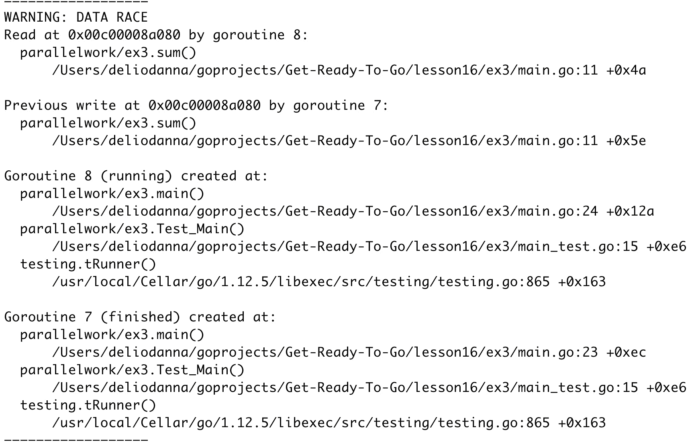
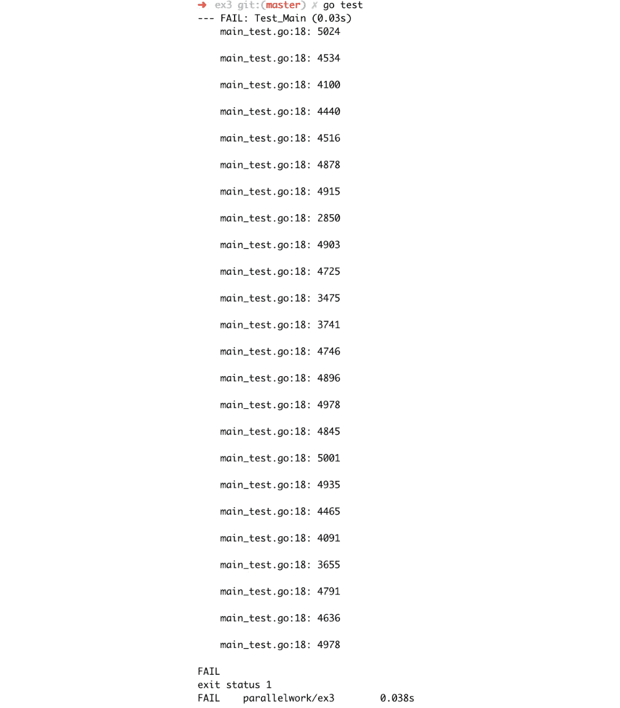
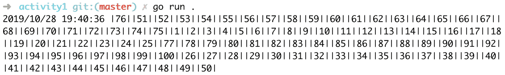
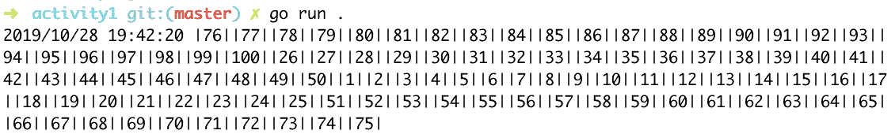

# 第十六章：16. 并发工作

概述

本章介绍了 Go 的特性，这些特性将允许你执行并发工作，换句话说，实现并发。你将学习的第一个特性被称为 Goroutine。你将了解 Goroutine 是什么以及如何使用它来实现并发。然后，你将学习如何利用 WaitGroups 来同步多个 Goroutines 的执行。你还将学习如何使用原子更改来实现跨不同 Goroutines 共享变量的同步和线程安全更改。为了同步更复杂的变化，你将使用互斥锁。

在本章的后面部分，你将实验通道的功能，并使用消息跟踪来跟踪任务的完成情况。

# 简介

有一些软件是为单个用户使用的，而你在这本书中学到的许多内容都允许你开发这样的应用程序。然而，还有一些软件是为同时供多个用户使用的。一个例子是网络服务器。你在*第十五章，HTTP 服务器*中创建了网络服务器。它们被设计用来服务于网站或通常由数千个用户同时使用的网络应用程序。

当多个用户访问一个网络服务器时，有时它需要执行一系列完全独立且其结果对最终输出唯一重要的事情。所有这些情况都需要一种编程方式，在这种方式中，不同的任务可以同时执行，彼此独立。一些语言允许并行计算，其中任务可以同时计算。然而，在某些语言中，例如 Go，任务是通过机器逐个完成的；也就是说，每个任务或进程被分成小块，程序将一次执行一小块任务，直到所有任务都完成。这被称为并发编程。

在并发编程中，当一个任务开始时，所有其他任务也会开始，但机器不是逐个完成它们，而是同时执行每个任务的一小部分。虽然 Go 允许并发编程，但当机器有多个核心时，任务也可以并行执行。然而，从程序员的视角来看，这种区别并不重要，因为任务是按照它们将并行执行的想法创建的，以及机器将如何执行它们的任何方式。让我们在本章中了解更多。

# Goroutines

想象有几个人有一些钉子要钉到墙上。每个人都有不同数量的钉子和不同的墙面区域，但只有一把锤子。每个人用锤子钉一个钉子，然后传给下一个人，以此类推。钉子最少的人会先完成，但他们都会使用同一把锤子；这就是 Goroutines 的工作方式。

使用 Goroutines，Go 允许多个任务同时运行（它们也被称为协程）。这些是可以在同一进程中并发运行的线程（读取任务）。Goroutines 不共享内存，这就是它们与线程不同的原因。然而，我们将看到如何在你的代码中轻松地在它们之间传递变量，以及这可能会引起一些意外的行为。

编写 Goroutine 并没有什么特别之处；它们只是普通的函数。实际上，每个函数都可以轻松地成为 Goroutine；我们只需要在调用函数之前写上单词`go`。

让我们考虑一个名为`hello`的函数：

```go
func hello() {
  fmt.Println("hello world")
}
```

为了将我们的函数作为 Goroutine 调用，我们进行以下操作：

```go
go hello()
```

函数将以 Goroutine 的形式运行。这意味着什么可以通过以下代码更好地理解：

```go
func main() {
  fmt.Println("Start")
  go hello()
  fmt.Println("End")
```

代码首先打印`Start`，然后调用`hello()`函数。然后，执行直接跳转到打印`End`，而不等待`hello()`函数完成。无论`hello()`函数运行多长时间，`main()`函数都不会关心`hello()`函数，因为这些函数将以独立的方式运行。为了更好地理解这是如何工作的，让我们做一些练习。

注意

需要记住的重要一点是，Go 不是一种并行语言，而是一种并发语言，这意味着 Goroutines 不是以独立的方式工作，而是每个 Goroutine 被分割成更小的部分，并且每个 Goroutine 一次运行其子部分之一。

## 练习 16.01：使用并发线程

让我们假设我们想要进行两个计算。首先，我们将`1`到`10`之间的所有数字相加，然后是`1`到`100`之间的数字。为了节省时间，我们希望这两个计算独立进行，并且同时看到两个结果。

1.  在你的文件系统中创建一个新的文件夹，并在其中创建一个`main.go`文件，并编写以下内容：

    ```go
    package main
    import "fmt"
    ```

1.  创建一个函数来求两个数的和：

    ```go
    func sum(from,to int) int {
        res := 0
        for i:=from;i<=to; i++ {
            res += i
        }
        return res
    }
    ```

    这个函数接受两个整数作为极值（区间的最小值和最大值），并返回这两个极值之间所有数字的总和。

1.  创建一个`main()`函数，它将数字`1`和`100`相加，然后打印结果：

    ```go
    func main() {
        s1 := sum(1,100)
        fmt.Println(s1)
    }
    ```

1.  运行程序：

    ```go
    go run main.go
    ```

    你将看到以下输出：

    ```go
    5050 55
    ```

1.  现在，让我们引入一些并发性。将`main()`函数修改如下：

    ```go
    func main() {
        var s1 int
        go func() {
            s1 = sum(1,100)
        }()
        fmt.Println(s1)
    }
    ```

    在这里，我们正在运行一个匿名函数，它将值`s1`赋给总和，就像之前一样，但如果我们运行代码，结果将是`0`。如果你尝试在`func()`部分之前移除`go`，你会看到结果是`5050`。在这种情况下，匿名函数将运行并开始求和数字，但随后有一个调用`fmt.Println`，它打印`s1`的值。在这里，程序在打印`s1`的值之前等待`sum()`函数结束，因此返回正确的结果。

    如果我们在调用函数时在前面加上`go`这个词，程序会在函数仍在计算总和时（总和仍然是`0`）打印出`s1`的当前值，然后终止。

    让我们调用两次`sum`函数，使用两个不同的范围。修改`main()`函数：

    ```go
    func main() {
        var s1,s2 int
        go func() {
            s1 = sum(1,100)
        }()
        s2 = sum(1,10)
        fmt.Println(s1, s2)
    }
    ```

    如果你运行这个程序，它将打印出数字`0`和`55`。这是因为并发函数`go func()`没有时间返回结果。`main()`函数更快，因为它只需要数到`55`，而不是`5050`，所以程序在并发函数完成之前就终止了。

    为了解决这个问题，我们想要找到一个等待并发函数完成的方法。有一些正确的方法可以做到这一点，但现在，让我们做一件相当粗糙但有效的事情，那就是等待固定的时间。为了做到这一点，只需在`fmt.Println`命令之前添加这一行：

    ```go
    time.Sleep(time.Second)
    ```

1.  如果你的 IDE 没有为你做这件事，修改`import`部分，就在`package main`指令下面，使其看起来如下：

    ```go
    import (
        "log"
        "time"
    )
    ```

    如果你现在运行你的程序，你应该在屏幕上看到打印出`5050 55`。

1.  在`main()`函数中，编写要打印的日志代码：

    ```go
    log.Println(s1, s2)
    ```

1.  如果你现在运行你的程序，你将再次看到相同的输出，`5050` `55`，但前面会加上一个时间戳，表示你运行代码的时间：

    ```go
    2019/10/28 19:23:00 5050 55
    ```

如你所见，计算是并发发生的，我们同时收到了两个输出。

注意

这个练习的完整代码可以在以下链接找到：[`packt.live/2Qek69K`](https://packt.live/2Qek69K)

# WaitGroup

在上一个练习中，我们使用了一种不太优雅的方法来确保 Goroutine 通过让主例程等待一秒来结束。重要的是要理解，即使程序没有通过`go`调用显式使用 Goroutines，它仍然使用了一个 Goroutine，那就是主例程。当我们运行程序并创建一个新的 Goroutine 时，我们实际上运行了两个 Goroutines：一个是主 Goroutine，另一个是我们刚刚创建的。为了同步这两个 Goroutine，Go 提供了一个名为`WaitGroup`的函数。你可以使用以下代码定义一个 WaitGroup：

```go
wg := sync.WaitGroup{}
```

WaitGroup 需要导入`sync`包。使用 WaitGroup 的典型代码可能如下所示：

```go
package main
import "sync"
func main() {
  wg := &sync.WaitGroup{}
  wg.Add(1)
  …………………..
  wg.Wait()
  ………….
  ………….
}
```

在这里，我们创建了一个指向新 WaitGroup 的指针，然后提到我们正在添加一个异步操作，该操作使用`wg.Add(1)`将 1 添加到组中。这本质上是一个计数器，用于记录所有正在运行的并发例程的数量。稍后，我们添加实际运行并发调用的代码。最后，我们告诉 WaitGroup 使用`wg.Wait()`等待 Goroutines 结束。

WaitGroup 是如何知道例程已经完成的呢？嗯，我们需要在 Goroutine 内部显式地告诉 WaitGroup，如下所示：

```go
wg.Done()
```

这必须在主 Goroutine 函数内部，这意味着它需要一个对 WaitGroup 的引用。我们将在下一个练习中看到这一点。

## 练习 16.02：使用 WaitGroup 进行实验

假设我们再次计算 *练习 16.01*，*使用并发线程* 中的加法，这次使用与主进程并发运行的 Goroutine。然而，这次我们想要使用 `WaitGroup` 来同步结果。我们需要做一些更改。本质上，`sum()` 函数需要接受一个新的 `WaitGroup` 参数，并且不需要使用 `time` 包。

1.  在新文件夹中创建一个 `main.go` 文件。你的文件的包和导入部分如下所示：

    ```go
    package main
    import (
        "log"
        "sync"
    )
    ```

    在这里，我们只是定义包为 `main` 包，然后导入 `log` 和 `sync` 包。`log` 将再次用于打印消息，而 `sync` 将用于 `WaitGroup`。

1.  接下来，编写 `sum` 函数：

    ```go
    func sum(from,to int, wg *sync.WaitGroup, res *int) {
    ```

    现在，我们添加一个名为 `wg` 的参数，它是一个指向 `sync.WaitGroup` 的指针，以及结果参数。在前一个练习中，我们用匿名函数包装了 `sum` 函数，该函数作为一个 Goroutine 运行。这里，我们想要避免这样做，但我们需要以某种方式获取 `sum` 函数的结果。因此，我们传递一个额外的指针参数，它将返回正确的值。

1.  创建一个循环来增加 `sum` 函数：

    ```go
    *res = 0
    for i:=from;i<=to; i++ {
        *res += i
    }
    ```

    在这里，我们将 `res` 指针所持有的值设置为 `0`，然后我们只是使用之前看到的相同循环，但再次将 `sum` 与 `res` 参数所指向的值关联起来。

1.  我们现在可以完成这个函数：

    ```go
    wg.Done()
      return
    }
    ```

    在这里，我们告诉 `WaitGroup` 这个 Goroutine 已完成，然后返回。

1.  现在，让我们编写 `main()` 函数，该函数将设置变量并运行计算 `sum` 的 Goroutine。然后我们将等待 Goroutine 完成，并显示结果：

    ```go
    func main() {
        s1 := 0
        wg := &sync.WaitGroup{}
    ```

    在这里，定义了 `main()` 函数，并设置了一个名为 `s1` 的变量为 `0`。同时，创建了一个指向 WaitGroup 的指针。

1.  将 WaitGroup 的计数加一，然后运行 Goroutine：

    ```go
        wg.Add(1)
        go sum(1,100, wg, &s1)
    ```

    此代码通知 WaitGroup 有一个 Goroutine 正在运行，然后创建一个新的 Goroutine 来计算 `sum`。`sum()` 函数将调用 `.Done()` 方法来通知 `WaitGroup` 其完成。

1.  我们需要等待 Goroutine 完成。为此，编写以下代码：

    ```go
        wg.Wait()
        log.Println(s1)
    }
    ```

    这也将结果记录到标准输出。

1.  运行程序：

    ```go
    go run main.go
    ```

    你将看到使用 WaitGroups 的函数的日志输出，如下所示，带有时间戳：

    ```go
    2019/10/28 19:24:51 5050
    ```

通过这个练习，我们通过在我们的代码中同步 Goroutines 探索了 `WaitGroup` 的功能。

# 竞态条件

需要考虑的一个重要问题是，无论何时我们并发运行多个函数，我们都没有保证每个函数中的每个指令将按什么顺序执行。在许多架构中，这并不是一个问题。有些函数与其他函数没有任何联系，并且函数在其例程中执行的操作不会影响其他例程中执行的操作。然而，这并不总是正确的。我们可以想到的第一个情况是，当一些函数需要共享相同的参数时。一些函数将只从这个参数中读取，而其他函数将写入这个参数。由于我们不知道哪个操作将首先运行，一个函数覆盖另一个函数更新的值的可能性很高。让我们看看一个解释这种情况的例子：

```go
func next(v *int) {
  c := *v
  *v = c+1
}
```

这个函数将一个指向整数的指针作为参数。这是因为我们想要使用`next`函数运行几个 Goroutines 并更新`v`。如果我们运行以下代码，我们预计`a`将持有值 3：

```go
a := 0
next(&a)
next(&a)
next(&a)
```

这完全没问题。然而，如果我们运行以下代码：

```go
a := 0
go next(&a)
go next(&a)
go next(&a)
```

在这种情况下，我们可能会看到`a`的值是 3、2 或 1。为什么会这样呢？因为当一个函数执行以下语句时，所有在独立 Goroutines 中运行的函数的`v`值可能都是 0：

```go
c := *v
```

如果这种情况发生，那么每个函数都会将`v`设置为`c+1`，这意味着没有任何一个例程知道其他例程正在做什么，并覆盖了其他例程所做的任何更改。这个问题被称为*竞态条件*，每次我们在没有采取预防措施的情况下处理共享资源时都会发生。幸运的是，我们有几种方法可以防止这种情况，并确保相同的更改只发生一次。我们将在下一节中查看这些解决方案，并更详细地探讨我们刚才描述的情况，包括适当的解决方案和竞态检测。

# 原子操作

让我们假设我们再次想要运行独立的函数。然而，在这种情况下，我们想要修改变量的值。我们仍然想要从 1 加到 100，但我们将工作分成两个并发的 Goroutines。我们可以在一个例程中计算从 1 到 50 的数字之和，在另一个例程中计算从 51 到 100 的数字之和。最后，我们仍然需要得到 5050 这个值，但两个不同的例程可以同时向同一个变量添加一个数字。让我们看看一个只有 4 个数字的例子，我们想要计算 1、2、3 和 4 的和，结果是 10。

想象有一个名为`s:=0`的变量，然后进行一个循环，其中`s`的值变为以下：

```go
s=0
s=1
s=3 //(1+2)
s=6
s=10
```

然而，我们也可以有以下的循环。在这种情况下，数字求和的顺序不同：

```go
S=0
s=1
s=4 //3+1, the previous value of 1
s=6 //2+4 the previous value of 4
s=10
```

实际上，这只是求和的交换律，但这给我们一个提示，我们可以将求和拆分成两个或更多的并发调用。这里出现的问题是，所有函数都需要操作同一个变量`s`，这可能导致*竞态条件*和最终值不正确。*竞态条件*发生在两个进程更改同一个变量时，其中一个进程在未考虑先前更改的情况下覆盖了另一个进程所做的更改。幸运的是，我们有一个名为*atomic*的包，它允许我们在 Goroutines 之间安全地修改变量。

我们将很快查看这个包是如何工作的，但，现在你需要知道的是，这个包有一些函数可以执行变量上的简单并发安全操作。让我们看一个例子：

```go
func AddInt32(addr *int32, delta int32) (new int32)
```

此代码接受`int32`的指针，并通过将指针指向的值添加到`delta`的值来修改它。如果`addr`持有值为 2 且`delta`为 4，在调用此函数后，`addr`将持有 6。

## 练习 16.03：原子更改

在这个练习中，我们想要计算 1 到 100 之间所有数字的总和，但使用更多的并发 Goroutines，比如说 4 个。因此，我们有一个函数在 1-25 的范围内求和，一个在 26-50 的范围内，然后是 51-75，最后是 76-100。我们将使用我们关于原子操作和 WaitGroups 的知识。

1.  创建一个新的文件夹和一个`main.go`文件。在它里面，编写以下代码：

    ```go
    package main
    import (
        "log"
        "sync"
        "sync/atomic"
    )
    ```

    这将导入之前练习中使用的相同包，以及`sync/atomic`包。

1.  下一步是将*练习 16.02*，*使用 WaitGroup 进行实验*中的`sum`函数重构，以使用`atomic`包：

    ```go
    func sum(from,to int, wg *sync.WaitGroup, res *int32) {
    ```

    在这里，我们将`res`从`int`改为`*int32`。这样做的原因是，专门用于算术操作的原子操作仅适用于`int32/64`和相关的`uint32/64`。

1.  在这一点上，编写一个循环将每个数字加到总数中：

    ```go
        for i:=from;i<=to; i++ {
            atomic.AddInt32(res, int32(i))
        }
        wg.Done()
        return
    }
    ```

    如你所见，我们不再将`res`的值赋为`0`，而是现在将`i`加到`res`持有的总值上。其余的代码保持不变。

1.  下一步是编写`main()`函数，在四个不同的 Goroutines 中计算`sum`：

    ```go
    func main() {
        s1 := int32(0)
        wg := &sync.WaitGroup{}
    ```

    在这里，我们将`s1`设置为`int32`类型而不是`int`，这样我们就可以将其作为参数发送到`sum`函数。然后我们创建 WaitGroup 的指针。

1.  现在，告诉 WaitGroup 我们将有四个 Goroutines 在运行：

    ```go
    wg.Add(4)
    ```

1.  现在，运行四个 Goroutines，分别对四个范围进行求和：1-25，26-50，51-75 和 76-100：

    ```go
        go sum(1,25, wg, &s1)
        go sum(26,50, wg, &s1)
        go sum(51,75, wg, &s1)
        go sum(76,100, wg, &s1)
    ```

1.  现在，添加等待例程完成并打印结果的代码：

    ```go
        wg.Wait()
        log.Println(s1)
    }
    ```

1.  现在，如果你使用以下代码运行：

    ```go
    go run main.go
    ```

    你会看到类似这样的内容：

    ```go
    2019/10/28 19:26:04 5050
    ```

    实际的日期将不同，因为它取决于你何时运行此代码。

1.  现在，让我们测试一下代码。我们将使用它来向您展示什么是竞态条件，为什么我们使用这个原子包，以及什么是并发安全性。以下是测试代码：

    ```go
    package main
    import (
        "bytes"
        "log"
        "testing"
    )
    func Test_Main(t *testing.T) {
        for i:=0;i < 10000; i++ {
            var s bytes.Buffer
            log.SetOutput(&s)
            log.SetFlags(0)
            main()
            if s.String() != "5050\n" {
                t.Error(s.String())
            }
        }
    }
    ```

    我们将运行相同的测试 10,000 次。

1.  运行你的测试：

    ```go
    go test
    ```

    原子更改测试的结果如下：

    ```go
    PASS
    Ok    parallelwork/ex3    0.048s
    ```

1.  现在添加`race`标志：

    ```go
    go test -race
    ```

    使用`race`标志运行这些测试的输出如下：

    ```go
    PASS
    Ok    parallelwork/ex3    3.417s
    ```

    再次，到目前为止一切正常。

1.  现在让我们移除`sync/atomic`导入，并修改`sum`函数中看到此行的地方：

    ```go
    atomic.AddInt32(res, int32(i))
    ```

1.  将其改为：

    ```go
    *res = *res + int32(i)
    ```

1.  现在运行你的程序：

    ```go
    go run main.go
    ```

1.  使用指针时，非原子更改的日志输出保持不变：

    ```go
    2019/10/28 19:30:47 5050
    ```

1.  但如果你尝试多次运行测试，你可能会看到一些不同的结果，尽管在这种情况下，这种情况相当不可能。然而，此时尝试使用`-race`标志运行测试：

    ```go
    go test -race main.go
    ```

    你将看到以下输出：

    

    图 16.1：在此使用指针时会出现竞态条件

    注意

    'GCC'必须安装才能运行此代码。

1.  现在，让我们在没有`race`标志的情况下运行代码：



图 16.2：带有竞态条件的堆栈跟踪

通过多次运行代码，你可以看到不同的结果，因为每个例程可以在任何时间以任何顺序更改`s1`的值，而我们无法提前知道。

在这个练习中，你学习了如何使用原子包安全地修改多个 Goroutine 共享的变量。你已经了解到从不同的 Goroutine 直接访问相同的变量可能会很危险，以及如何使用原子包来避免这种情况。

注意

本练习的完整代码可在[`packt.live/35UXbqD`](https://packt.live/35UXbqD)找到。

# 不可见并发

在前面的练习中，我们已经看到了通过竞态条件产生的并发影响，但我们想在实际中看到它们。很容易理解并发问题很难可视化，因为它们在每次运行程序时并不以相同的方式表现出来。这就是为什么我们专注于寻找同步并发工作的方法。然而，有一种简单的方法可以可视化它，但在测试中很难使用，那就是打印出每个并发例程，并查看这些例程被调用的顺序。例如，在前面的练习中，我们可以在`for`循环的每次迭代中发送另一个带有名称的参数，并打印出函数的名称。

如果我们想看到并发的影响并仍然能够测试它，我们可以再次使用原子包，这次使用字符串，这样我们就可以构建一个包含每个 Goroutine 消息的字符串。对于这种情况，我们将再次使用`sync`包，但我们将不使用原子操作。相反，我们将使用一个新的结构体，称为`mutex`。互斥锁（Mutex）是“互斥”的缩写，它本质上是一种停止所有例程、运行代码中的一个，然后继续并发代码的方式。让我们看看我们如何使用它。首先，它需要导入`sync`包。然后，我们创建一个互斥锁，如下所示：

```go
mtx := sync.Mutex{}
```

但大多数时候我们希望将互斥锁传递给几个函数，所以我们最好创建一个指向互斥锁的指针：

```go
mtx := &sync.Mutex{}
```

这确保了我们可以在任何地方使用相同的互斥锁。使用相同的互斥锁很重要，但为什么互斥锁必须只有一个的原因将在分析 Mutex 结构中的方法后变得清晰；考虑以下代码：

```go
mtx.Lock()
s = s + 5
```

上述代码片段将锁定所有例程的执行，除了将更改变量的那个例程。在此阶段，我们将向`s`的当前值添加 5。之后，我们将使用以下命令释放锁，以便任何其他例程都可以修改`s`的值。

```go
mtx.Unlock()
```

从现在开始，任何后续的代码都将并发运行。我们稍后会看到一些更好的方法来确保在修改变量时的安全性，但，目前请不要担心在锁定/解锁部分之间添加过多的代码。在这些结构之间有越多的代码，你的代码并发性就越低。因此，你应该锁定程序的执行，只添加确保安全性的逻辑，然后解锁并继续执行剩余的代码，这些代码不会触及共享变量。

一个需要注意的重要事情是异步执行代码的顺序可能会改变。这是因为 Goroutines 是独立运行的，你无法知道哪个先运行。然而，每个例程在让另一个例程运行之前都会完全运行。因此，你不应该依赖 Goroutines 来正确排序事物；如果你需要一个特定的顺序，你可能需要在之后对结果进行排序。

## 活动十六.01：列出数字

在这个活动中，你需要构建一个包含从 1 到 100 的所有数字的字符串。然而，你不需要使用单个循环，你需要将工作分配给四个循环，就像在*练习 16.03*中一样。此外，每个循环将在其自己的循环中添加数字。以下是步骤：

1.  创建一个文件夹和一个`main.go`文件。

1.  创建一个函数，该函数接受一个范围作为参数，并将一个字符串作为参数，你将在其中添加该范围内的所有数字（也作为字符串）。

1.  将每个数字用字符`"|"`包裹起来，例如，`|4|`，这样列表将具有`|4||10|`的形式。

1.  创建一个`main()`函数，在其中创建四个 Goroutines，每个 Goroutine 有一个 25 个数字的范围。

1.  确保所有例程安全地修改相同的字符串。

1.  确保`main()`函数等待例程的完成。

1.  打印最终的字符串并运行程序。

你应该能够使用本章迄今为止学到的所有内容来完成这个活动。

当你运行你的程序时，你应该看到类似以下的内容：



图 16.3：列出数字时的第一次输出

然而，如果你多次运行它，你很可能会看到不同的结果：



图 16.4：列出数字的第二次尝试返回不同的顺序

注意

这个活动的解决方案可以在第 766 页找到。

# 通道

我们已经看到了如何通过 Goroutines 创建并发代码，如何使用 WaitGroup 进行同步，如何执行原子操作，以及如何暂时停止并发以同步对共享变量的访问。现在，我们将介绍一个不同的概念，即通道，这是 Go 语言的特点。通道就是名字所暗示的——它是一个可以传递消息的地方，任何协程都可以通过通道发送或接收消息。与切片类似，通道的创建方式如下：

```go
var ch chan int
ch = make(chan int)
```

当然，可以直接使用以下方式实例化通道：

```go
ch := make(chan int)
```

就像切片一样，我们也可以做以下操作：

```go
ch := make(chan int, 10)
```

这里，我们创建了一个带有 10 个项的缓冲区通道。

通道可以是任何类型，例如`整数`、`布尔值`、`浮点数`，以及任何可以定义的`结构体`，甚至切片和指针，尽管后两者使用得较少。

通道可以作为参数传递给函数，这就是不同的 Goroutines 如何共享内容。让我们看看如何向通道发送消息：

```go
ch <- 2
```

在这种情况下，我们将数字 2 的值发送到`ch`通道，这是一个整数通道。当然，尝试向整数通道发送非整数值将导致错误。

在发送消息后，我们需要能够从通道接收消息。为此，我们可以这样做：

```go
<- ch
```

这样做可以确保消息被接收；然而，消息并没有被存储。失去消息似乎没有用处，但我们将看到这实际上可能是有意义的。尽管如此，我们可能希望保留从通道接收到的值，我们可以通过将值存储到新变量中来实现这一点：

```go
i := <- ch
```

让我们看看一个简单的程序，它展示了我们如何使用到目前为止所学的知识：

```go
package main
import "log"
func main() {
    ch := make(chan int,1)
    ch <- 1
    i:= <- ch
    log.Println(i)
}
```

这个程序本质上创建了一个新的通道，将整数 1 管道输入，然后读取它，最后打印出`i`的值，应该是 1。在实际应用中，这段代码并不那么有用，但通过一个小改动，我们可以看到一些有趣的东西。让我们通过将通道定义改为以下内容来使通道无缓冲：

```go
ch := make(chan int)
```

如果你运行代码，你将得到以下输出：

```go
fatal error: all goroutines are asleep - deadlock!
goroutine 1 [chan send]:
main.main()
    /Users/deliodanna/goprojects/parallelwork/exercise 4/main.go:8 +0x59
Process finished with exit code 2
```

消息可能因你使用的 Go 版本而异。此外，一些错误如这些在新版本中已经被引入。然而，在旧版本中，编译器更为宽容。在这个特定的情况下，问题很简单：如果我们不知道通道的大小，协程将无限期地等待，这被称为死锁。这并不意味着我们不能处理无缓冲通道。我们将在后面看到如何处理它们，因为它们需要多个协程运行。只有一个协程时，在我们发送消息后，我们将阻塞执行，没有其他协程能够接收消息；因此，我们遇到了死锁。

在我们进一步之前，让我们看看通道的一个更多特性，即它们可以被关闭。当通道被创建的任务完成后，需要关闭通道。为了关闭通道，请输入以下内容：

```go
close(ch)
```

或者，你可以延迟关闭，如下面的代码片段所示：

```go
...
defer close(ch)
for i:=0; i< 100; i++ {
    ch <- i
}
return
```

在这种情况下，在 `return` 语句之后，通道被关闭，因为关闭被延迟到 `return` 语句之后执行。

## 练习 16.04：通过 Channels 交换问候消息

在这个练习中，我们将使用 Goroutine 发送问候消息，然后我们在主进程中接收问候。这个练习非常简单，不需要并发，但它是一个了解消息传递如何工作的起点。

1.  创建一个文件夹。在其中创建一个 `main.go` 文件，并使用 `main` 包：

    ```go
    package main
    import (
        "log"
    )
    ```

1.  然后，创建 `greeter()` 函数：

    ```go
    func greet(ch chan string) {
        ch <- "Hello"
    }
    ```

    此函数只是向通道发送一个 `Hello` 消息并结束。

1.  现在创建一个 `main()` 函数，在其中实例化一个通道并将其传递给 `greeter`：

    ```go
    func main() {
        ch := make(chan string)
        go greet(ch)
    ```

    这里，只创建了一个字符串通道并将其作为参数传递给新调用的 `greet` 函数：

1.  现在打印结果并完成函数：

    ```go
    log.Println(<-ch)
    }
    ```

    这里，我们正在打印从通道中来的任何内容。代码的以下部分返回一个值，该值直接传递给 `Println` 函数：

    ```go
    <- ch
    ```

1.  使用以下命令运行程序：

    ```go
    go run main.go
    ```

    你将看到以下输出：

    ```go
    2019/10/28 19:44:11 Hello
    ```

    现在我们可以看到消息已经通过通道传递到了 `main` 函数。

在这个练习中，你看到了如何使用通道使不同的 Goroutine 互相通信并同步它们的计算。

## 练习 16.05：使用 Channels 进行双向消息交换

现在我们想要从主程序向第二个程序发送消息，然后得到一个响应消息。我们将基于之前的代码并扩展它。主程序将发送一个 `"Hello John"` 消息，而第二个程序将返回 "`Thanks`" 作为收到的消息的回复，并完整地表达出来，然后添加一条消息："Hello David"。

1.  创建一个文件夹。在其中创建一个 `main.go` 文件，并使用 main 包：

    ```go
    package main
    import (
        "fmt"
        "log"
    )
    ```

    在导入必要的包后，我们将使用 `fmt` 包来操作字符串。

1.  编写一个 `greet()` 函数以返回预期的消息：

    ```go
    func greet(ch chan string) {
        msg := <- ch
        ch <- fmt.Sprintf("Thanks for %s", msg)
        ch <- "Hello David"
    }
    ```

    `greet()` 函数签名没有改变。然而，现在在发送消息之前，它将首先等待一个消息，然后回复。在收到消息后，此函数发送一条消息表示感谢问候，然后发送它自己的问候。

1.  现在创建 `main()` 函数并作为 Goroutine 调用 `greet()` 函数：

    ```go
    func main() {
        ch := make(chan string)
        go greet(ch)
    ```

    在这里，创建了主函数并实例化了一个字符串通道。然后，启动了第二个 Goroutine。接下来，我们需要从主程序向第二个等待的程序发送第一条消息。

1.  现在，要将消息 "`Hello John`" 发送到通道，请编写以下代码：

    ```go
    ch <- "Hello John"
    ```

1.  最后，添加在打印消息之前等待消息返回的代码：

    ```go
        log.Println(<-ch)
        log.Println(<-ch)
    }
    ```

    你可以看到，你需要记录两次，因为你预计会收到两条消息。在许多情况下，你会使用循环来检索所有消息，我们将在下一个练习中看到。现在，尝试运行你的代码，你将看到如下内容：

    ```go
    2019/10/28 19:44:49 Thanks for Hello John
    2019/10/28 19:44:49 Hello David
    ```

从输出中，你可以看到两条消息都已经通过通道接收到了。

在这个练习中，你学习了 goroutine 如何通过同一个通道发送和接收消息，以及两个 goroutine 如何通过同一个通道在两个方向上交换消息。

## 练习 16.06：从各个地方求和数字

假设你想要加几个数字，但这些数字来自多个来源。它们可能来自一个源或数据库；我们并不知道我们将要加的哪些数字以及它们来自哪里。然而，我们需要将它们全部加在一个地方。在这个练习中，我们将有四个 Goroutines 在特定的范围内发送数字，以及主程序，它将计算它们的总和。

1.  让我们先创建一个新的文件夹和主文件。完成这些后，编写包和导入语句：

    ```go
    package main
    import (
        "log"
        "time"
    )
    ```

    这里，我们还包含了`time`包，我们将使用它来做一个小技巧，这将帮助我们更好地可视化并发的影响。

1.  现在编写`push`函数：

    ```go
    func push(from,to int, out chan int) {
        for i:=from;i<=to; i++ {
            out <- i
            time.Sleep(time.Microsecond)
        }
    }
    ```

    这会将`from, to`范围内的所有数字发送到通道。在每条消息发送后，程序将暂停一微秒，以便另一个程序可以接手工作。

1.  现在编写`main()`函数：

    ```go
    func main() {
        s1 := 0
        ch := make(chan int, 100)
    ```

    这段代码创建了一个用于最终总和的变量`sum1`和一个具有 100 个缓冲区的通道`ch`。

1.  现在创建四个`go` routines：

    ```go
        go push(1,25, ch)
        go push(26,50,ch)
        go push(51,75,ch)
        go push(76,100, ch)
    ```

1.  在这个阶段，我们需要收集所有需要相加的数字，因此我们创建了一个包含 100 个周期的循环：

    ```go
        for c :=0; c< 100; c++ {
    ```

1.  然后按照这种方式从通道读取数字：

    ```go
            i := <- ch
    ```

1.  我们还想知道哪个数字来自哪个 Goroutine：

    ```go
            log.Println(i)
    ```

1.  最后，我们计算总和并显示结果：

    ```go
            s1 += i
        }
        log.Println(s1)
    }
    ```

    在这里，一旦运行程序，我们将得到以下截断的输出：

    ```go
    2019/07/08 21:42:09 76
    2019/07/08 21:42:09 26
    2019/07/08 21:42:09 51
    2019/07/08 21:42:09 77
    2019/07/08 21:42:09 52
    ……………………………………………………………
    2019/07/08 21:42:09 48
    2019/07/08 21:42:09 75
    2019/07/08 21:42:09 100
    2019/07/08 21:42:09 23
    2019/07/08 21:42:09 49
    2019/07/08 21:42:09 24
    2019/07/08 21:42:09 50
    2019/07/08 21:42:09 25
    2019/07/08 21:42:09 5050
    ```

    根据结果，我们可以轻松地猜测哪个数字来自哪个程序。最后一行显示了所有数字的总和。如果你多次运行程序，你还会看到数字的顺序也会改变。

在这个练习中，我们看到了如何将一些计算工作分配给几个并发程序，然后在单个程序中汇总所有计算。每个程序执行一个任务。在这种情况下，一个发送数字，而另一个接收数字并执行求和。

## 练习 16.07：请求 Goroutines

在这个练习中，我们将解决与练习 16.06 相同的相同问题，即*从各个地方求和数字*，但以不同的方式。我们不会像程序发送时那样接收数字，而是让主程序从其他程序请求数字。我们将玩转通道操作，并实验它们的阻塞特性。

1.  创建一个文件夹和一个名为`main.go`的`main`包文件。然后，添加以下导入：

    ```go
    package main
    import (
        "log"
    )
    ```

1.  然后编写`push`函数的签名：

    ```go
    func push(from,to int, in chan bool, out chan int) {
    ```

    这里有两个通道，一个布尔通道称为`in`，代表传入的请求，另一个是`out`，将用于发送回消息。

1.  现在编写一个循环，当接收到请求时发送数字：

    ```go
        for i:=from;i<=to; i++ {
            <- in
            out <- i
        }
    }
    ```

    如你所见，循环仍然是固定数量的项。在发送任何内容之前，它等待从`in`通道来的请求。当它收到请求时，它发送一个数字。

1.  现在创建`main()`函数，在其中调用四个不同的 goroutine 中的`push`函数，每个 goroutine 发送 1 到 100 的数字的子集：

    ```go
    func main() {
        s1 := 0
        out := make(chan int, 100)
        in := make(chan bool,100)
        go push(1,25, in, out)
        go push(26,50,in, out)
        go push(51,75,in, out)
        go push(76,100, in, out)
    ```

    这与上一个练习非常相似，但它创建了额外的通道`in`。

1.  现在创建一个循环来请求一个数字，打印它，并将其添加到总数中：

    ```go
        for c :=0; c< 100; c++ {
            in <- true
            i := <- out
            log.Println(i)
            s1 += i
        }
        log.Println(s1)
    }
    ```

    在这种情况下，循环首先请求一个数字，然后等待接收另一个数字。在这里，我们不需要等待一微秒，因为我们收到一个数字后，下一个请求将转到任何活动的 Goroutine。如果你运行程序，你将再次看到与上一个练习类似的内容。这里，我们有截断的输出：

    ```go
    2019/07/08 22:18:00 76
    2019/07/08 22:18:00 1
    2019/07/08 22:18:00 77
    2019/07/08 22:18:00 26
    2019/07/08 22:18:00 51
    2019/07/08 22:18:00 2
    2019/07/08 22:18:00 78
    …………………………………………………………
    2019/07/08 22:18:00 74
    2019/07/08 22:18:00 25
    2019/07/08 22:18:00 50
    2019/07/08 22:18:00 75
    2019/07/08 22:18:00 5050
    ```

你可以看到每个数字都是按照接收的顺序打印的。然后，所有数字的总和打印在屏幕上。

在这个练习中，你学习了如何使用通道请求其他 goroutine 执行某些操作。通道可以用来发送一些触发消息，而不仅仅是交换内容和值。

# 并发的重要性

到目前为止，我们看到了如何使用并发将工作分配给多个 Goroutine，但在所有这些练习中，并发并不是真正必要的。事实上，你做我们做的事情并没有节省多少时间，也没有其他优势。当你需要执行几个逻辑上相互独立的不同任务时，并发就很重要了。最容易理解的情况是 Web 服务器。你在*第十五章*，*HTTP 服务器*中看到，几个客户端很可能会连接到同一个服务器，所有这些连接都会导致服务器执行一些操作。此外，这些操作都是独立的；这就是并发之所以重要的地方，因为你不希望你的用户在他们的请求得到处理之前必须等待所有其他 HTTP 请求完成。并发的另一个情况是，当你有不同数据源来收集数据，你实际上可以在不同的 goroutine 中收集这些数据，并在最后将结果合并。我们现在将看到一些更复杂的并发应用，并学习如何将其用于 HTTP 服务器。

## 练习 16.08：在 goroutine 之间平均分配工作

在这个练习中，我们将看到我们如何在预定义的例程中执行数字的求和，以便它们在最后收集结果。本质上，我们想要创建一个函数，该函数可以添加数字并从通道接收数字。当函数不再接收更多数字时，我们将通过通道将总和发送到主函数。

这里需要注意的一点是，执行求和的函数事先不知道它将接收多少数字，这意味着我们不能有一个固定的 `from, to` 范围。因此，我们必须找到另一种解决方案。我们需要能够将工作分割成任意数量的 Goroutines，而不仅仅受 `from, to` 范围的限制。此外，我们不想在主函数中进行加法。相反，我们想要创建一个函数，该函数将在多个例程之间分割工作。

1.  创建一个文件夹和一个名为 `main.go` 的文件，包含主包，并编写以下内容：

    ```go
    package main
    import (
        "log"
    )
    ```

1.  现在让我们编写一个执行部分加法的函数。我们将称之为 `worker()`，因为我们将会有一组固定的例程运行这个相同的函数，等待数字的到来：

    ```go
    func worker(in chan int, out chan int) {
    sum := 0
        for i := range in {
            sum += i
        }
        out <- sum
    }
    ```

    如你所见，我们有一个整数 `in` 通道和一个 `out` 通道。然后，我们实例化 `sum` 变量，它将存储发送到这个工人的所有数字的总和。

1.  到这一点，我们有一个遍历通道的循环。这很有趣，因为我们没有直接使用 `in` 如下：

    ```go
    <- in
    ```

    我们相反，只依赖于范围来获取数字。在循环中，我们只需将 `i` 添加到总数中，并在最后将部分和发送回去。即使我们不知道将要发送多少项到通道，我们仍然可以无问题地遍历范围。我们依赖于这样一个事实：当没有更多项发送时，`in` 通道将被关闭。

1.  现在创建 `sum()` 函数：

    ```go
    func sum(workers, from, to int) int {
    ```

    这是实际的 `sum` 函数，它具有工人数和通常的加数范围。

1.  现在编写一个循环来运行请求的工人数：

    ```go
        out := make(chan int, workers)
        in := make(chan int,4)
        for i:=0;i<workers;i++ {
            go worker(in, out)
        }
    ```

    这创建了两个 `in`/`out` 通道，并运行由 `workers` 参数设置的工人数。

1.  然后创建一个循环，将所有数字发送到 `in` 通道：

    ```go
        for i:=from;i<=to; i++ {
            in <- i
        }
    ```

    这将所有要加的数字发送到通道，该通道将数字分配给所有例程。如果你要打印出带有工人索引接收到的数字，你可以看到数字是如何均匀地分配给例程的，这并不意味着一个精确的分割，但至少是公平的。

1.  由于我们发送了所有数字，我们现在需要接收部分和，但在那之前，我们需要通知函数数字加法已完成，所以添加以下内容：

    ```go
        close(in)

    ```

1.  然后执行部分和的求和：

    ```go
        sum := 0
        for i:=0;i<workers; i++ {
            sum += <-out
        }
    ```

1.  然后，最后，关闭 `out` 通道并返回结果：

    ```go
        close(out)
        return sum
    }
    ```

1.  到这一点，我们需要以某种方式执行这个函数。所以，让我们编写一个简单的 `main` 函数来做这件事：

    ```go
    func main() {
        res := sum(100,1,100)
        log.Println(res)
    }
    ```

    这只是从一个使用并发性的函数中输出一个总和，然后打印出结果。

1.  如果运行你的程序，你应该看到数字总和的日志输出被分成不同的例程，如下所示：

    ```go
    2019/10/28 19:49:13 5050
    ```

如你所见，在将计算分配到多个 goroutine 之后，结果被同步到一个单一的结果中。

在这个练习中，你学习了如何利用并发将你的计算分配到几个并发 goroutine，然后将所有这些计算组合成一个单一的结果。

# 并发模式

我们在每一个应用中组织并发工作的方式几乎都是一样的。我们将查看一个称为*管道*的常见模式，其中有一个源，然后消息从一个例程发送到另一个例程，直到线路的尽头，直到管道中的所有例程都被利用。另一个模式是*扇出/扇入*模式，其中，就像之前的练习一样，工作被发送到几个从同一通道读取的例程。然而，所有这些模式通常都由一个*源*阶段组成，这是管道的第一个阶段，它收集或提供数据，然后是一些内部步骤，最后是一个*汇*，这是所有其他例程处理结果的最终合并阶段。它被称为汇，因为所有数据都流入其中。

## 活动 16.02：源文件

在这个活动中，你将创建一个程序，该程序将同时读取包含一些数字的两个文件。你需要将这些数字通过管道传输到一个函数，该函数将根据它们的值将它们分成偶数和奇数。然后，它将奇数发送到一个例程，偶数发送到另一个例程。然后，它将所有偶数和奇数的总和写入另一个文件。

你将需要两个包含数字的文件，这些数字将作为源文件使用。然后，你将生成一个文件，其中包含一行中所有奇数的总和，然后是下一行中所有偶数的总和。这个活动的概要步骤如下：

1.  创建两个输入文件。你可以使用更多，但建议的代码将使用两个。

1.  在你的输入文件中添加一些数字，每行一个数字，不要添加其他内容。你需要在每个文件的末尾添加一个空行。

1.  创建你的主程序并从导入开始。

1.  创建一个函数来读取文件并将每一行通过管道传输到通道。不过，请注意；你可能需要添加一个 WaitGroup 或其他东西来避免任何死锁。

1.  创建一个函数来接收数字并将奇数通过一个通道传输，偶数通过另一个通道传输。

1.  创建一个函数来计算数字并将结果通过管道传输到新的通道。

1.  创建一个合并函数，从奇数和偶数通道读取并将结果写入名为`result.txt`的文件。该文件中的每一行应包含根据值确定的单词“Odd”或“Even”，后跟总和。

1.  创建主函数来运行所有的 Goroutines，并在需要时处理 WaitGroups。

如果你运行你的程序，你应该在控制台看到什么都没有，但应该创建一个名为`result.txt`的文件。根据你的输入文件中的数字，你会发现输出文件的内容类似于以下内容：

```go
Odd 9
Even 12
```

注意

这个活动的解决方案可以在第 768 页找到。

# 缓冲区

你在之前的练习中看到，有固定长度的通道和不确定长度的通道：

```go
ch1 := make(chan int)
ch2 := make(chan int, 10)
```

让我们看看我们如何利用这一点。

缓冲区就像一个需要填充一些内容的容器，所以当你期望接收那个内容时，你就准备它。我们说过，通道上的操作是阻塞操作，这意味着每次你尝试从通道读取消息时，程序的执行都会停止并等待。让我们通过一个例子来尝试理解这在实践中意味着什么。假设我们在一个 Goroutine 中有以下代码：

```go
i := <- ch
```

我们知道在我们可以继续执行代码之前，我们需要收到一条消息。然而，关于这种阻塞行为还有一些其他的事情。如果通道没有缓冲区，Goroutine 也会被阻塞。无法向通道写入，也无法从通道接收。我们可以通过一个例子更好地理解这一点，并展示如何使用无缓冲通道达到相同的结果，这样你将更好地理解你在之前的练习中看到的内容。

让我们看看这段代码：

```go
ch := make(chan int, 2)
ch <- 1
ch <- 2
fmt.Println(<-ch)
fmt.Println(<-ch)
```

如果你将这段代码放入一个函数中，你会看到它工作得非常完美，并将显示以下内容：

```go
1
2
```

但如果你添加一个额外的读取操作呢？让我们看看：

```go
ch := make(chan int, 2)
ch <- 1
ch <- 2
ch <- 3
fmt.Println(<-ch)
fmt.Println(←ch)
```

在这种情况下，你会看到一个错误：

```go
fatal error: all goroutines are asleep - deadlock!
goroutine 1 [chan send]:
main.main()
    /tmp/sandbox223984687/prog.go:9 +0xa0
```

这是因为运行这段代码的程序在缓冲区大小为 2 的情况下被阻塞，因为从读取操作（通常称为读取）中来的数据大小为 2，这导致缓冲区被数据填满，在这种情况下，有 2 个数据，缓冲区的大小为 2。我们可以增加缓冲区的大小：

```go
ch := make(chan int, 3)
```

并且它将再次工作；我们只是没有显示第三个数字。

现在，让我们看看如果我们移除缓冲区会发生什么。试一试，你将再次看到之前的错误。这是因为缓冲区总是满的，程序被阻塞了。无缓冲通道相当于以下内容：

```go
ch := make(chan int, 0)
```

我们已经无问题地使用了无缓冲通道。让我们看看如何使用它们的例子：

```go
package main
import "fmt"
func readThem(ch chan int) {
  for {
    fmt.Println(<- ch)
  }
}
func main() {
    ch := make(chan int)
    go readThem(ch)
    ch <- 1
    ch <- 2
    ch <- 3
}
```

如果你运行这个程序，你应该看到以下内容：

```go
1
2
3
```

但你可能会看到更少的数字。如果你在 Go Playground 上运行这个程序，你应该看到这个结果，但如果你在自己的机器上运行它，你可能看到更少的数字。尝试发送更多的数字：

```go
ch <- 4
ch <- 5
```

在每次添加时运行你的程序；你可能看不到所有数字。基本上，有两个常规：一个是读取来自无缓冲通道的消息，而主常规是通过相同的通道发送这些消息。因此，没有死锁。这表明我们可以通过使用两个常规，完美地利用无缓冲通道进行读写操作。然而，我们仍然有一个问题，即不是所有数字都显示出来，我们可以在以下方式中修复它：

```go
package main
import "fmt"
import "sync"
func readThem(ch chan int, wg *sync.WaitGroup) {
  for i := range ch {
    fmt.Println(i)
  }
  wg.Done()
}
func main() {
    wg := &sync.WaitGroup{}
    wg.Add(1)
    ch := make(chan int)
    go readThem(ch, wg)
    ch <- 1
    ch <- 2
    ch <- 3
    ch <- 4
    ch <- 5
    close(ch)
    wg.Wait()
}
```

在这里，我们在 Goroutine 内部迭代通道，一旦通道关闭就停止迭代。这是因为当通道关闭时，range 停止迭代。通道在主常规中关闭，在所有消息发送完毕后。我们在这里使用 WaitGroup 来知道一切已完成。如果我们不在主函数中关闭通道，我们就会在主常规中，这将在第二个常规打印所有数字之前终止。然而，还有另一种等待第二个常规执行完成的方法，那就是通过显式通知，我们将在下一个练习中看到。需要注意的是，即使我们关闭了通道，消息仍然会到达接收常规。这是因为通道仅在所有消息被接收者接收后才会关闭。

## 练习 16.09：在计算完成后通知

在这个练习中，我们希望有一个常规用于发送消息，另一个用于打印它们。此外，我们还想知道发送者何时完成消息的发送。代码将与之前的示例类似，但有一些修改。

1.  创建一个新文件并导入必要的包：

    ```go
    package main
    import "log"
    ```

1.  然后定义一个函数，该函数首先接收字符串，稍后打印它们：

    ```go
    func readThem(in, out chan string) {
    ```

1.  然后创建一个循环，直到通道关闭：

    ```go
        for i := range in {
            log.Println(i)
        }
    ```

1.  最后，发送通知，表示处理已完成：

    ```go
        out <- "done"
    }
    ```

1.  现在，让我们构建 `main()` 函数：

    ```go
    func main() {
        log.SetFlags(0)
    ```

    在这里，我们还将 `log` 标志设置为 `0`，这样我们就不会看到除了我们发送的字符串之外的其他内容。

1.  现在，创建必要的通道并使用它们来启动 Goroutine：

    ```go
        in, out  := make(chan string), make(chan string)
        go readThem(in, out)
    ```

1.  接下来，创建一个字符串集并遍历它们，将每个字符串发送到通道：

    ```go
        strs := []string{"a","b", "c", "d", "e", "f"}
        for _, s := range strs {
            in <- s
        }
    ```

1.  之后，关闭用于发送消息的通道并等待完成信号：

    ```go
        close(in)
        <-out
    }
    ```

    如果你运行程序，你会看到使用 `done` 通道的代码的日志输出：

    ```go
    a
    b
    c
    d
    e
    f
    ```

    我们看到主函数已经从 Goroutine 接收了所有消息并打印了它们。主函数仅在通知所有传入消息都已发送后才终止。

在这个练习中，你学习了如何通过通过通道传递消息而不需要 WaitGroup 来让一个 Goroutine 通知另一个 Goroutine 工作已完成。

## 一些常见实践

在所有这些示例中，我们创建了通道并通过它们传递，但函数也可以返回通道，并可以启动新的常规。以下是一个示例：

```go
func doSomething() chan int {
    ch := make(chan int)
    go func() {
        for i := range ch {
            log.Println(i)
        }
    }()
    return ch
}
```

在这种情况下，我们实际上可以在`main()`函数中有以下内容：

```go
ch := doSomething()
ch <- 1
ch <- 4
```

我们不需要将`doSomething`函数作为 Goroutine 来调用，因为它实际上会自己启动一个新的。

一些函数也可以返回或接受：

```go
<- chan int
```

或者：

```go
chan <- int
```

这清楚地说明了函数如何使用通道。实际上，你可以尝试在所有之前的练习中指定方向，并看看如果你指定了一个错误的方向会发生什么。

# HTTP 服务器

你已经看到了如何在*第十五章，HTTP 服务器*中构建 HTTP 服务器，但你可能还记得，在 HTTP 服务器中有些东西很难处理，那就是应用程序的状态。本质上，HTTP 服务器作为一个单独的程序运行，并在主例程中监听请求。然而，当客户端发起一个新的 HTTP 请求时，会创建一个新的例程来处理该特定请求。你没有手动做这件事，也没有管理服务器的通道，但这是它内部的工作方式。你实际上不需要在不同的 Goroutines 之间发送任何东西，因为每个例程和每个请求都是独立的，因为它们是由不同的人发起的。

然而，你必须考虑的是，当你想要保持状态时，如何不创建竞态条件。大多数 HTTP 服务器是无状态的，特别是如果你正在构建一个微服务环境。然而，你可能想用计数器跟踪一些事情，或者你可能实际上在与 TCP 服务器、游戏服务器或聊天应用一起工作，在这些应用中你需要保持状态并从所有对等方收集信息。你在这章中学到的技术允许你这样做。你可以使用互斥锁来确保计数器在所有请求中是线程安全的，或者更好的是，是例程安全的。我建议你回到你的 HTTP 服务器代码，并使用互斥锁来确保安全性。

# 作为例程的方法

到目前为止，你只看到函数被用作 Goroutines，但方法实际上是带有接收者的简单函数；因此，它们也可以异步使用。如果你想要共享你结构体的一些属性，比如在 HTTP 服务器中的计数器，这可能会很有用。

使用这种技术，你可以封装你用于同一结构体实例所属的多个例程之间的通道，而无需将这些通道传递到每个地方。

这里有一个简单的例子说明如何做到这一点：

```go
type MyStruct struct {}
func (m MyStruct) doIt()
. . . . . . 
ms := MyStruct{}
go ms.doIt()
```

但让我们看看如何在练习中应用这一点。

## 练习 16.10：结构化工作

在这个练习中，我们将使用几个工作线程来计算总和。工作线程本质上是一个函数，我们将把这些工作线程组织到一个单独的结构体中。

1.  创建你的文件夹和`main`文件。在其中，添加所需的导入并定义一个带有两个通道`in`和`out`的`Worker`结构体。确保你添加了一个互斥锁：

    ```go
    package main
    import (
        "fmt"
        "sync"
    )
    type Worker struct {
        in, out chan int
        sbw int
        mtx *sync.Mutex
    }
    ```

1.  要创建其方法，请编写以下内容：

    ```go
    func (w *Worker) readThem() {
        w.sbw++
        go func() {
    ```

    在这里，我们创建一个方法并增加`subworkers`的数量。子工作基本上是相同的程序，它们将需要完成的工作分割开来。请注意，这个函数旨在直接使用，而不是作为一个 Goroutine，因为它本身会创建一个新的 Goroutine。

1.  现在，构建产生程序的内容：

    ```go
            partial := 0
            for i := range w.in {
                partial += i
            }
            w.out <- partial
    ```

1.  这与你之前所做的是类似的；现在来谈谈难点部分：

    ```go
            w.mtx.Lock()
            w.sbw--
            if w.sbw == 0 {
                close(w.out)
            }
            w.mtx.Unlock()
        }()
    }
    ```

    在这里，我们锁定程序，安全地减少子工作的计数器，然后，如果所有工作都终止了，我们关闭了输出通道。然后我们解锁执行，允许程序继续。

1.  在这一点上，我们需要创建一个能够返回总和的函数：

    ```go
    func (w *Worker) gatherResult() int {
        total := 0
        wg := &sync.WaitGroup{}
        wg.Add(1)
        go func() {
    ```

1.  在这里，我们创建了一个总数，然后是一个 Waitgroup，并且我们给它加 1，因为我们只将产生一个内容如下所示的程序：

    ```go
            for  i:= range w.out{
                total += i
            }
            wg.Done()
        }()
    ```

    正如你所见，我们已经循环直到子工作中的一个关闭了输出通道。

1.  在这一点上，我们可以等待程序完成并返回结果：

    ```go
        wg.Wait()
        return total
    }
    ```

1.  主代码只是为工作及其子工作设置变量：

    ```go
    func main() {
        mtx := &sync.Mutex{}
        in := make(chan int, 100)
        wrNum := 10
        out := make(chan int)
        wrk := Worker{in: in, out:out, mtx:mtx}
    ```

1.  现在创建一个循环，调用`readThem()`方法`wrNum`次。这将创建一些子工作：

    ```go
        for i:=1; i<=wrNum; i++ {
            wrk.readThem()
        }
    ```

1.  现在将需要求和的数字发送到通道：

    ```go
        for i:=1;i<=100; i++ {
            in <- i
        }
    ```

1.  关闭通道以通知所有数字都已发送：

    ```go
        close(in)
    ```

1.  然后等待结果并打印出来：

    ```go
        res := wrk.gatherResult()
        fmt.Println(res)
    }
    ```

1.  如果你运行程序，你将看到使用结构体组织我们的工作所做的求和的日志输出：

    ```go
    5050
    ```

在这个练习中，你学习了如何使用结构体的方法来创建一个新的 Goroutine。这个方法可以像任何函数一样被调用，但结果将创建一个新的匿名 Goroutine。

# Go Context Package

我们已经看到了如何运行并发代码，并运行它直到完成，通过 WaitGroup 或通道读取等待某些处理完成。你可能在一些 Go 代码中看到过，特别是与 HTTP 调用相关的代码，一些来自`context`包的参数，你可能想知道它是什么以及为什么使用它。我们在这里编写的所有代码都在我们的机器上运行，并不通过互联网，所以我们几乎没有因为延迟造成的延迟；然而，在涉及 HTTP 调用的场合，我们可能会遇到不响应的服务器并卡住。在这种情况下，如果服务器在一段时间后没有响应，我们如何停止我们的调用？当发生事件时，我们如何停止独立运行的程序的执行？嗯，我们有一些方法，但一个标准的方法是使用上下文，我们现在将看到它们是如何工作的。上下文是一个变量，它通过一系列调用传递，可能包含一些值或者可能是空的。它是一个容器，但它不是用来在函数之间发送值的；你可以使用正常的整数、字符串等来达到这个目的。上下文被传递是为了获取对正在发生的事情的控制：

```go
func doIt(c context.Context , a int, b string) {
  fmt.Println(b)
  doThat(c, a*2)
}
func doThat(c context.Context , a int) {
  fmt.Println(a)
  doMore(c)
}
```

正如你所见，有几个调用，`c`被传递了，但我们并没有对它做任何事情。然而，它可以包含数据，并且它包含了我们可以用来停止当前例程执行的函数。我们将在下一个练习中看到它是如何工作的。

## 练习 16.11：使用上下文管理例程

在这个练习中，我们将启动一个无限循环的 Goroutine，从零开始计数，直到我们决定停止它。我们将利用上下文来通知例程停止，并使用睡眠函数来确保我们知道我们进行了多少次迭代。

1.  创建你的文件夹和一个`main.go`文件，然后编写以下内容：

    ```go
    package main
    import (
        "context"
        "log"
        "time"
    )
    ```

    对于常规导入，我们有`logs`和`time`，我们已经见过，加上`context`包。

1.  让我们编写一个每 100 毫秒从 0 开始计数的函数：

    ```go
    func countNumbers(c context.Context, r chan int) {
        v := 0
        for {
    ```

    在这里，`v`是我们从零开始计数的值。`c`变量是上下文，而`r`变量是返回结果的通道。然后，我们开始定义循环。

1.  现在，我们开始一个无限循环，但在这个循环内部我们将有`select`：

    ```go
             select {
            case <-c.Done():
                r <- v
                break
    ```

    在这个`select`组中，我们有一个检查上下文是否`完成`的情况，如果是，我们就跳出循环并返回到目前为止所计的值。

1.  如果上下文尚未`完成`，我们需要继续计数：

    ```go
                default:
                time.Sleep(time.Millisecond * 100)
                v++
            }
        }
    }
    ```

    在这里，我们睡眠 100 毫秒，然后增加值 1。

1.  下一步是编写一个`main()`函数，使其使用这个计数器：

    ```go
    func main() {
        r := make(chan int)
        c := context.TODO()
    ```

    我们创建了一个整数通道来传递给计数器和一个`上下文`。

1.  我们需要能够取消上下文，所以我们将这个简单的上下文扩展为可取消的上下文：

    ```go
         cl, stop := context.WithCancel(c)
        go countNumbers(cl, r)
    ```

    在这里，我们也最终调用了计数例程。

1.  在这一点上，我们需要一种方法来跳出循环，所以我们将使用`context.WithCancel`返回的`stop()`函数，但我们将在另一个 Goroutine 中这样做。这将使上下文在 300 毫秒后停止：

    ```go
         go func() {
            time.Sleep(time.Millisecond*100*3)
            stop()
        }()
    ```

1.  在这一点上，我们只需要等待收到带有计数的消息并将其记录下来：

    ```go
         v := <- r
        log.Println(v)
    }
    ```

    经过 300 毫秒后，计数器将返回 3，因为由于上下文操作，例程在第三次迭代时停止：

    ```go
    2019/10/28 20:00:58 3
    ```

    在这里，我们可以看到，尽管循环是无限的，但执行在三次迭代后停止。

在这个练习中，你学习了如何使用上下文来停止例程的执行。这在许多情况下非常有用，例如在执行长时间任务且希望在其后最多时间内停止任务时。

有一个需要提到的是，在这个练习中，我们做了一些在某些情况下可能导致问题的操作。我们所做的是在一个 Goroutine 中创建了一个通道，但在另一个 Goroutine 中关闭了它。这并不错；在某些情况下，它可能是有用的，但尽量避免它，因为它可能导致在有人查看代码或几个月后查看代码时出现问题，因为很难跟踪在多个函数中关闭通道的位置。

# 摘要

在本章中，你已经学会了如何创建生产就绪的并发代码，如何处理竞态条件，以及如何确保你的代码是并发安全的。你学习了如何使用通道使 goroutines 之间相互通信，以及如何使用上下文来停止它们的执行。

你已经掌握了处理并发计算的一些技术。在许多实际场景中，你可能只需要使用为你处理并发的函数和方法，尤其是如果你在进行 Web 编程的话，但也有一些情况，你必须自己处理来自不同来源的工作。你需要通过不同的通道匹配请求和响应。你可能需要从不同的来源将不同的数据汇集到单个例程中。通过在这里学到的知识，你将能够完成所有这些。你将能够确保在等待所有 Goroutines 完成时不会丢失数据。你将能够从不同的例程中修改相同的变量，确保如果你不希望覆盖值时不会覆盖。你还学习了如何避免死锁，以及如何使用通道来共享信息。Go 的一个座右铭是“通过通信来共享，而不是通过共享来通信。”这意味着共享值的首选方式是通过通道发送，如果不是严格必要的话，不要依赖互斥锁。你现在知道如何做到所有这些。

在下一章中，你将学习如何让你的代码更加专业。本质上，你将学习作为一个专业人士在真实工作环境中应该做什么，那就是测试和检查你的代码，确保你的代码能够工作并且是有效的。
