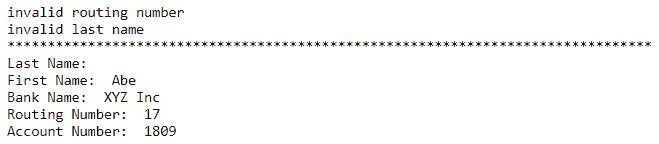

# 附录

## 关于

本节包含以帮助学生执行书中现有的活动。它包括学生为完成和实现本书目标而要执行的详细步骤。

# 第一章：变量和运算符

## 活动一.01 定义和打印

**解决方案**：

1.  定义包名：

    ```go
    package main
    ```

1.  导入所需的包：

    ```go
    import "fmt"
    ```

1.  创建`main()`函数：

    ```go
    func main() {
    ```

1.  声明并初始化一个字符串变量用于给定名称：

    ```go
      firstName := "Bob"
    ```

1.  声明并初始化一个字符串变量用于姓氏：

    ```go
      familyName := "Smith" 
    ```

1.  声明并初始化一个`int`变量用于`age`：

    ```go
      age := 34 
    ```

1.  声明并初始化一个`bool`变量用于`peanutAllergy`：

    ```go
      peanutAllergy := false
    ```

1.  将每个变量打印到控制台：

    ```go
      fmt.Println(firstName)
      fmt.Println(familyName)
      fmt.Println(age)
      fmt.Println(pean
    utAllergy)
    ```

1.  关闭`main()`函数：

    ```go
    }
    ```

    以下为预期的输出：


图 1.24：分配变量后的预期输出

## 活动一.02：指针值交换

**解决方案**：

1.  让我们从以下代码开始练习：

    ```go
    package main
    import "fmt"
    func main() {
      a, b := 5, 10
    ```

1.  您需要从`a`和`b`获取指针以传递给`swap`使用`&`：

    ```go
      swap(&a, &b)
      fmt.Println(a == 10, b == 5)
    }
    func swap(a *int, b *int) {
    ```

1.  您需要首先使用`*`解引用值。您可以通过使用 Go 的多重赋值能力来交换值，而不需要临时变量。右侧在左侧之前解析：

    ```go
      *a, *b = *b, *a
    }
    ```

    以下为预期的输出：

    ```go
    true true
    ```

## 活动一.03：消息错误

**解决方案**：

1.  创建`package` `main`并添加必要的导入：

    ```go
    package main
    import "fmt"
    func main() {
      count := 5
    ```

1.  在`if`语句之前定义`message`：

    ```go
      var message string
      if count > 5 {
    ```

1.  定义一个`message`，该`message`将在步骤 2 中更新：

    ```go
      message = "Greater than 5"
      } else {
    ```

1.  定义一个`message`，该`message`将在步骤 3 中更新：

    ```go
      message = "Not greater than 5"
      }
      fmt.Println(message)
    }
    ```

    以下为预期的输出：

    ```go
    Not greater than 5
    ```

## 活动一.04：坏计数错误

**解决方案**：

1.  让我们从以下代码开始练习：

    ```go
    package main
    import "fmt"
    func main() {
      count := 0
      if count < 5 {
    ```

1.  此处的赋值导致前面的`count`被遮蔽：

    ```go
        count = 10
        count++
      }
      fmt.Println(count == 11)
    }
    ```

    以下为预期的输出：

    ```go
    true
    ```

# 第二章：逻辑和循环

## 活动二.01：实现 FizzBuzz

**解决方案**：

1.  定义`package`并包含`import`：

    ```go
    package main
    import (
      "fmt"
      "strconv"
    )
    ```

1.  创建`main`函数：

    ```go
    func main() {
    ```

1.  创建一个从 1 开始，直到`i`达到 99 的`for`循环：

    ```go
      for i := 1; i <= 100; i++{
    ```

1.  初始化一个字符串变量，该变量将保存输出：

    ```go
      out := ""
    ```

1.  使用模块逻辑检查可除性，如果`i`能被 3 整除，则将`"Fizz"`添加到`out`字符串中：

    ```go
      if i%3 == 0 {
      out += "Fizz"
      }
    ```

1.  如果能被 5 整除，则将`"Buzz"`添加到字符串中：

    ```go
      if i%5 == 0 {
      out += "Buzz"
      }
    ```

1.  如果都不是，将数字转换为字符串，然后添加到输出字符串中：

    ```go
      if out == "" {
      out = strconv.Itoa(i)
      }
    ```

1.  打印输出变量：

    ```go
      fmt.Println(out)
    ```

1.  关闭循环和`main`：

    ```go
      }
    }
    ```

1.  在您创建代码的文件夹中运行：

    ```go
    go run main.go
    ```

    预期输出如下：


图 2.03：FizzBuzz 输出

## 活动二.02：使用`range`遍历 Map 数据

**解决方案**：

1.  加载`main`包：

    ```go
    package main
    ```

1.  导入`fmt`包：

    ```go
    import "fmt"
    ```

1.  创建`main`函数：

    ```go
    func main() {
    ```

1.  初始化`words`映射：

    ```go
      words := map[string]int{
        "Gonna": 3,
        "You":   3,
        "Give":  2,
        "Never": 1,
        "Up":    4,
      }
    ```

1.  将`topWord`变量初始化为空字符串，将`topCount`变量初始化为 0：

    ```go
      topWord := ""
      topCount := 0
    ```

1.  创建一个使用`range`获取每个元素键和值的`for`循环：

    ```go
      for key, value := range words {
    ```

1.  检查当前`map`元素是否有比顶级计数更大的计数：

    ```go
        if value > topCount {
    ```

1.  如果是，则使用当前元素的值更新顶部值：

    ```go
          topCount = value
          topWord = key
    ```

1.  关闭`if`语句：

    ```go
        }
    ```

1.  关闭循环：

    ```go
      }
    ```

1.  循环完成后，你就有结果了。将其打印到控制台：

    ```go
      fmt.Println("Most popular word:", topWord)
      fmt.Println("With a count of  :", topCount)
    }
    ```

1.  在你创建的代码文件夹中运行：

    ```go
    go run main.go
    ```

    以下是将显示最常用词及其计数值的预期输出：

    ```go
    Most popular word: Up
    With a count of  : 4
    ```

## 活动 2.03：冒泡排序

**解决方案：**

1.  定义包并添加导入的包：

    ```go
    package main
    import "fmt"
    ```

1.  创建`main`：

    ```go
    func main() {
    ```

1.  定义一个整数切片并用未排序的数字初始化它：

    ```go
      nums := []int{5, 8, 2, 4, 0, 1, 3, 7, 9, 6}
    ```

1.  打印排序前的切片：

    ```go
      fmt.Println("Before:", nums)
    ```

1.  创建一个`for`循环；在`initial`语句中，定义一个布尔值，其初始值为`true`。在条件中检查该布尔值。留空`post`语句：

    ```go
      for swapped := true; swapped; {
    ```

1.  将布尔变量设置为`false`：

    ```go
        swapped = false
    ```

1.  创建一个嵌套的`for` `i`循环，遍历整个`int`值的切片。从第二个元素开始循环：

    ```go
        for i := 1; i < len(nums); i++ {
    ```

1.  检查前一个元素是否大于当前元素：

    ```go
          if nums[i-1] > nums[i] {
    ```

1.  如果前一个元素更大，则交换元素的值：

    ```go
            nums[i], nums[i-1] = nums[i-1], nums[i]
    ```

1.  将我们的布尔值设置为`true`以指示我们进行了交换，我们需要继续进行：

    ```go
            swapped = true
    ```

1.  关闭`if`语句和两个循环：

    ```go
          }
        }
      }
    ```

1.  打印现在排序好的切片并关闭`main`：

    ```go
      fmt.Println("After :", nums)
    }
    ```

1.  在你创建的代码文件夹中运行：

    ```go
    go run main.go
    ```

    以下是将显示的预期输出：

    ```go
    Before: [5, 8, 2, 4, 0, 1, 3, 7, 9, 6]
    After : [0, 1, 2, 3, 4, 5, 6, 7, 8, 9]
    ```

# 第三章：核心类型

## 活动 3.01：销售税计算器

**解决方案：**

1.  创建一个新的文件夹并添加一个`main.go`文件。

1.  在`main.go`中，将`main`包名添加到文件顶部：

    ```go
    package main
    ```

1.  现在添加我们将在此文件中使用的导入：

    ```go
    import "fmt"
    ```

1.  创建一个函数，该函数接受两个浮点数参数并返回一个浮点数：

    ```go
    func salesTax(cost float64, taxRate float64) float64 {
    ```

1.  将两个参数相乘并返回结果：

    ```go
      return cost * taxRate
    ```

1.  关闭函数：

    ```go
    }
    ```

1.  创建`main()`函数：

    ```go
    func main() {
    ```

1.  声明一个变量作为浮点数：

    ```go
      taxTotal := .0
    ```

1.  将`cake`添加到`taxTotal`：

    ```go
      // Cake
      taxTotal += salesTax(.99, .075)
    ```

1.  将`milk`添加到`taxTotal`：

    ```go
      // Milk
      taxTotal += salesTax(2.75, .015)
    ```

1.  将`butter`添加到`taxTotal`：

    ```go
      // Butter
      taxTotal += salesTax(.87, .02)
    ```

1.  将`taxTotal`打印到控制台：

    ```go
      // Total
      fmt.Println("Sales Tax Total: ", taxTotal)
    ```

1.  关闭`main()`函数：

    ```go
    }
    ```

1.  保存文件，并在你创建的文件夹内运行以下命令：

    ```go
    go run main.go
    ```

    运行前面的代码会显示以下输出：

    ```go
    Sales Tax Total: 0.1329
    ```

## 活动 3.02：贷款计算器

**解决方案：**

1.  定义包：

    ```go
    package main
    ```

1.  导入必要的包：

    ```go
    import (
      "errors"
      "fmt"
    )
    ```

1.  定义分数和比率的常量：

    ```go
    const (
      goodScore      = 450
      lowScoreRatio  = 10
      goodScoreRatio = 20
    )
    ```

1.  预定义错误：

    ```go
    var (
      ErrCreditScore = errors.New("invalid credit score")
      ErrIncome      = errors.New("income invalid")
      ErrLoanAmount  = errors.New("loan amount invalid")
      ErrLoanTerm    = errors.New("loan term not a multiple of 12")
    )
    ```

1.  创建一个检查贷款详情的函数。此函数将接受一个`creditScore`、一个`income`、一个`loanAmount`和一个`loanTerm`，并返回一个错误：

    ```go
    func checkLoan(creditScore int, income float64, loanAmount float64, loanTerm   float64) error {
    ```

1.  设置一个基本的`interest`利率：

    ```go
      interest := 20.0
    ```

1.  良好的`creditScore`可以得到更好的利率：

    ```go
      if creditScore >= goodScore {
        interest = 15.0
      }
    ```

1.  验证`creditScore`，如果它有问题则返回错误：

    ```go
      if creditScore < 1 {
        return ErrCreditScore
      }
    ```

1.  验证`income`，如果它有问题则返回错误：

    ```go
      if income < 1 {
        return ErrIncome
      }
    ```

1.  验证`loanAmount`，如果它有问题则返回错误：

    ```go
      if loanAmount < 1 {
        return ErrLoanAmount
      }
    ```

1.  验证`loanTerm`，如果它有问题则返回错误：

    ```go
      if loanTerm < 1 || int(loanTerm)%12 != 0 {
        return ErrLoanTerm
      }
    ```

1.  将利率转换为我们可以用于计算的形式：

    ```go
      rate := interest / 100
    ```

1.  通过将`loanAmount`乘以贷款`rate`来计算付款。然后将结果除以`loanTerm`。现在将`loanAmount`除以`loanTerm`。

    最后，将这两个金额相加：

    ```go
      payment := ((loanAmount * rate) / loanTerm) + (loanAmount / loanTerm)
    ```

1.  通过将付款乘以 `loanTerm` 然后减去 `loanAmount` 来计算贷款的总成本：

    ```go
      totalInterest := (payment * loanTerm) - loanAmount
    ```

1.  声明一个用于 `approval` 的变量：

    ```go
      approved := false
    ```

1.  添加一个条件来检查收入是否超过付款：

    ```go
      if income > payment {
    ```

1.  计算他们收入中被支付的部分所占的百分比：

    ```go
        ratio := (payment / income) * 100
    ```

1.  如果他们的信用评分良好，允许更高的比率：

    ```go
        if creditScore >= goodScore && ratio < goodScoreRation {
          approved = true
        } else if ratio < lowScoreRation {
          approved = true
        }
      }
    ```

1.  将应用程序的所有详细信息打印到控制台：

    ```go
      fmt.Println("Credit Score    :", creditScore)
      fmt.Println("Income          :", income)
      fmt.Println("Loan Amount     :", loanAmount)
      fmt.Println("Loan Term       :", loanTerm)
      fmt.Println("Monthly Payment :", payment)
      fmt.Println("Rate            :", interest)
      fmt.Println("Total Cost      :", totalInterest)
      fmt.Println("Approved        :", approved)
      fmt.Println("")
    ```

1.  无错误返回并关闭函数：

    ```go
      return nil
    }
    ```

1.  创建 `main()` 函数：

    ```go
    func main() {
    ```

1.  创建一个将被批准的示例：

    ```go
      // Approved
      fmt.Println("Applicant 1")
      fmt.Println("-----------")
      err := checkLoan(500, 1000, 1000, 24)
    ```

1.  如果发现任何错误，打印出来：

    ```go
      if err != nil {
        fmt.Println("Error:", err)
        return
      }
    ```

1.  创建一个将被拒绝的示例：

    ```go
      // Denied
      fmt.Println("Applicant 2")
      fmt.Println("-----------")
      err = checkLoan(350, 1000, 10000, 12)
    ```

1.  如果发现任何错误，打印出来：

    ```go
      if err != nil {
        fmt.Println("Error:", err)
        return
      }
    ```

1.  关闭 `main()` 函数：

    ```go
    }
    ```

1.  在编写代码的文件夹中运行以下命令：

    ```go
    go run main.go
    ```

    以下是预期的输出：


图 3.15：贷款计算器输出

# 第四章：复杂类型

## 活动 4.01：填充数组

**解决方案：**

1.  创建一个新的文件夹并添加一个名为 `main.go` 的文件。

1.  在 `main.go` 中添加包和导入：

    ```go
    package main
    import "fmt"
    ```

1.  创建一个返回数组的函数：

    ```go
    func getArr() [10]int {
    ```

1.  定义一个数组变量：

    ```go
      var arr [10]int
    ```

1.  使用 `for i` 循环对数组的每个元素进行操作：

    ```go
      for i := 0; i < 10; i++ {
    ```

1.  使用 `i` 和一些数学计算来设置正确的值：

    ```go
      arr[i] = i + 1
      }
    ```

1.  返回数组变量并关闭函数：

    ```go
      return arr
    }
    ```

1.  在 `main()` 函数中调用函数并将返回值打印到控制台：

    ```go
    func main() {
      fmt.Println(getArr())
    }
    ```

1.  保存文件。然后，在步骤 1 中创建的文件夹中，使用以下命令运行代码：

    ```go
    go run .
    ```

    运行前面的代码会产生以下输出：

    ```go
    [1 2 3 4 5 6 7 8 9 10]
    ```

## 活动 4.02：根据用户输入打印用户姓名

**解决方案：**

1.  创建一个新的文件夹并添加一个名为 `main.go` 的文件。

1.  在 `main.go` 中添加包和导入：

    ```go
    package main
    import (
      "fmt"
      "os"
    )
    ```

1.  定义用户数据的 `map`：

    ```go
    var users = map[string]string{
      "305": "Sue",
      "204": "Bob",
      "631": "Jake",
      "073": "Tracy",
    }
    ```

1.  创建一个返回用户的姓名以及它是否存在函数：

    ```go
    func getName(id string) (string, bool) {
      name, exists := users[id]
      return name, exists
    }
    ```

1.  在 `main()` 函数中检查传入的参数。调用函数，如果有错误则打印，如果用户不存在则退出。如果用户存在，打印问候语：

    ```go
    func main() {
      if len(os.Args) < 2 {
        fmt.Println("User ID not passed")
        os.Exit(1)
      }
      name, exists := getName(os.Args[1])
      if !exists {
        fmt.Printf("error: user (%v) not found", os.Args[1])
        os.Exit(1)
      }
      fmt.Println("Hi,", name)
    }
    ```

1.  保存文件。然后，在步骤 1 中创建的文件夹中，使用以下命令运行代码：

    ```go
    go run .
    ```

    运行前面的代码会产生以下输出：

    ```go
    Hi, Tracy
    ```

## 活动 4.03：创建区域检查器

**解决方案：**

1.  创建一个新的文件夹并添加一个名为 `main.go` 的文件。

1.  在 `main.go` 中添加包和导入：

    ```go
    package main
    import (
      "fmt"
      "os"
      "strings"
    )
    ```

1.  定义一个包含 `language` 和 `territory` 的 `locale` 结构体，这两个都将字符串：

    ```go
    type locale struct {
      language string
      territory string
    }
    ```

1.  创建一个返回测试数据的函数：

    ```go
    func getLocales() map[locale]struct{} {
      supportedLocales := make(map[locale]struct{}, 5)
      supportedLocales[locale{"en", "US"}] = struct{}{}
      supportedLocales[locale{"en", "CN"}] = struct{}{}
      supportedLocales[locale{"fr", "CN"}] = struct{}{}
      supportedLocales[locale{"fr", "FR"}] = struct{}{}
      supportedLocales[locale{"ru", "RU"}] = struct{}{}
      return supportedLocales
    }
    ```

1.  创建一个函数，使用传入的本地结构体来检查样本数据中是否存在区域：

    ```go
    func localeExists(l locale) bool {
      _, exists := getLocales()[l]
      return exists
    }
    ```

1.  创建 `main()` 函数：

    ```go
    func main() {
    ```

1.  检查是否已传递参数：

    ```go
      if len(os.Args) < 2 {
        fmt.Println("No locale passed")
        os.Exit(1)
      }
    ```

1.  处理传入的参数以确保其格式有效：

    ```go
      localeParts := strings.Split(os.Args[1], "_")
      if len(localeParts) != 2 {
        fmt.Printf("Invalid locale passed: %v\n", os.Args[1])
        os.Exit(1)
      }
    ```

1.  使用传入的参数数据创建一个本地结构体值：

    ```go
      passedLocale := locale{
        territory: localeParts[1],
        language:  localeParts[0],
      }
    ```

1.  调用函数，如果不存在则打印错误消息；否则，打印该区域受支持：

    ```go
      if !localeExists(passedLocale) {
        fmt.Printf("Locale not supported: %v\n", os.Args[1])
        os.Exit(1)
      }
      fmt.Println("Locale passed is supported")
    }
    ```

1.  保存文件。然后，在步骤 1 中创建的文件夹中，使用以下命令运行代码：

    ```go
    go run .
    ```

    运行前面的代码会产生以下输出：

![图 4.17：区域检查结果]

![图片/B14177_04_17.jpg]

图 4.17：区域检查结果

## 活动 4.04：切片一周

**解决方案：**

1.  创建一个新的文件夹，并向其中添加一个名为 `main.go` 的文件。

1.  在 `main.go` 中添加包和导入：

    ```go
    package main
    import "fmt"
    ```

1.  创建一个返回字符串切片的函数：

    ```go
    func getWeek() []string {
    ```

1.  定义一个切片并用一周的天数初始化，从星期一开始：

    ```go
      week := []string{"Monday", "Tuesday", "Wednesday", "Thursday", "Friday",     "Saturday", "Sunday"}
    ```

1.  创建一个从索引 6 开始到切片末尾的范围。然后，创建一个从切片开头开始到索引 6 的切片范围。使用 `append` 将第二个范围添加到第一个范围。捕获 `append` 的值：

    ```go
      week = append(week[6:], week[:6]...)
    ```

1.  返回结果并关闭函数：

    ```go
      return week
    }
    ```

1.  在 `main` 中调用函数并将结果打印到控制台：

    ```go
    func main() {
      fmt.Println(getWeek())
    }
    ```

1.  保存文件。然后，在你在 *步骤 1* 中创建的文件夹中，使用以下命令运行代码：

    ```go
    go run .
    ```

    运行前面的代码将产生以下输出：

    ```go
    [Sunday Monday Tuesday Wednesday Thursday Friday Saturday]
    ```

## 活动 4.05：从切片中移除元素

**解决方案：**

1.  创建一个新的文件夹，并向其中添加一个名为 `main.go` 的文件。

1.  在 `main.go` 中添加包和导入：

    ```go
    package main
    import "fmt"
    ```

1.  创建一个返回字符串切片的函数：

    ```go
    func removeBad() []string {
    ```

1.  定义一个包含 `Good` 和 `Bad` 数据的字符串切片：

    ```go
      sli := []string{"Good", "Good", "Bad", "Good", "Good"}
    ```

1.  从切片的开始创建一个范围直到 `Bad` 索引。创建另一个从 `Bad` 数据后一个索引开始直到切片末尾的范围。将第二个切片追加到第一个切片并捕获结果：

    ```go
      sli = append(sli[:2], sli[3:]...)
    ```

1.  返回切片并关闭函数：

    ```go
      return sli
    }
    ```

1.  在 `main` 中调用函数并将结果打印到控制台：

    ```go
    func main() {
      fmt.Println(removeBad())
    }
    ```

1.  保存文件。然后，在你在 *步骤 1* 中创建的文件夹中，使用以下命令运行代码：

    ```go
    go run .
    ```

    预期的输出如下：

    ```go
    [Good Good Good Good]
    ```

## 活动 4.06：类型检查器

**解决方案：**

1.  定义包：

    ```go
    package main
    ```

1.  导入所需的库：

    ```go
    import "fmt"
    ```

1.  创建一个返回 `interface{}` 值切片的函数。这将包含我们的示例值：

    ```go
    func getData() []interface{} {
      return []interface{}{
        1,
        3.14,
        "hello",
        true,
        struct{}{},
      }
    }
    ```

1.  创建一个接受单个 `interface{}` 值并返回 `string` 的函数：

    ```go
    func getTypeName(v interface{}) string {
    ```

1.  使用类型 `switch`：

    ```go
      switch v.(type) {
    ```

1.  为所有 `int` 类型添加 `case`：

    ```go
      case int, int32, int64:
    ```

1.  返回表示它们的字符串：

    ```go
        return "int"
    ```

1.  为浮点数添加 `case` 并返回一个字符串：

    ```go
      case float64, float32:
        return "float"
    ```

1.  为布尔类型添加 `case` 并返回一个字符串：

    ```go
      case bool:
        return "bool"
    ```

1.  然后为字符串添加一个 `case`：

    ```go
      case string:
        return "string"
    ```

1.  添加一个默认 `case`，表示你不知道类型：

    ```go
      default:
        return "unknown"
    ```

1.  关闭 `switch` 语句和函数：

    ```go
      }
    }
    ```

1.  创建 `main()` 函数：

    ```go
    func main() {
    ```

1.  获取示例数据并将其分配给一个变量：

    ```go
      data := getData()
    ```

1.  使用 `for i` 循环逐个遍历示例值：

    ```go
      for i := 0; i < len(data); i++ {
    ```

1.  将每个示例值传递给前面的函数并将结果打印到控制台：

    ```go
        fmt.Printf("%v is %v\n", data[i], getTypeName(data[i]))
    ```

1.  关闭循环并执行函数：

    ```go
      }
    }
    ```

1.  在你创建代码的文件夹中，运行以下命令：

    ```go
    go run .
    ```

    运行前面的代码将产生以下输出：

![图 4.18：显示类型的输出]

![图片/B14177_04_18.jpg]

图 4.18：显示类型的输出

# 第五章：函数

## 活动 5.01：计算员工的工时

**解决方案：**

所有目录和文件都应该创建在你的 `$GOPATH` 内：

1.  创建一个名为 `Activity5.01` 的目录。

1.  在 `Activity5.01` 中创建一个名为 `main.go` 的文件。

1.  在 `Activity5.01/main.go` 中，声明 `main` 包及其导入：

    ```go
    package main
    import "fmt"
    ```

1.  创建一个 `Developer` 类型。注意 `WorkWeek` 是一个包含 `7` 个元素的数组。这是因为一周有 7 天，我们使用数组来确保固定的大小：

    ```go
    type Developer struct {
      Individual Employee
      HourlyRate int
      WorkWeek   [7]int
    }
    ```

1.  创建一个 `Employee` 类型：

    ```go
    type Employee struct {
      Id        int
      FirstName string
      LastName  string
    }
    ```

1.  创建一个类型为 `int` 的 `Weekday`：

    ```go
    type Weekday int
    ```

1.  创建一个类型为 `Weekday` 的常量。这是一个工作日的枚举：

    ```go
    const (
      Sunday Weekday = iota //starts at zero
      Monday
      Tuesday
      Wednesday
      Thursday
      Friday
      Saturday
    )
    ```

1.  在 `main()` 函数中，包括以下代码；用以下详细信息初始化 `Developer`：

    ```go
    func main() {
      d := Developer{Individual:Employee{Id: 1, FirstName: "Tony", LastName:     "Stark"}, HourlyRate: 10}
    ```

1.  接下来，调用 `LogHours` 方法：

    ```go
      d.LogHours(Monday, 8)
      d.LogHours(Tuesday, 10)
    ```

1.  打印出工作周和一周的工作时数：

    ```go
      fmt.Println("Hours worked on Monday:  " ,d.WorkWeek[Monday])
      fmt.Println("Hours worked on Tuesday:  " ,d.WorkWeek[Tuesday])
      fmt.Printf("Hours worked this week:  %d",d.HoursWorked())
    }
    ```

1.  创建一个 `LogHours` 方法；它是一个指针接收器方法。它接受一个名为 `Weekday` 的自定义类型和一个 `int`。该方法将 `WorkWeek` 字段赋给当天工作的小时数。`WorkWeek` 是一个大小为 `7` 的固定大小数组，因为一周有 `7` 天：

    ```go
    func (d *Developer) LogHours(day Weekday, hours int) {
      d.WorkWeek[day] = hours
    }
    ```

1.  创建一个返回 `int` 类型的 `HoursWorked` 方法。`HoursWorked` 函数遍历 `WorkWeek`，将每天的小时数加到 `total` 上：

    ```go
    func (d *Developer) HoursWorked() int {
      total := 0
      for _, v := range d.WorkWeek {
        total += v
      }
      return total
    }
    ```

    以下为预期输出：

    ```go
    Hours worked on Monday:  8
    Hours worked on Tuesday:  10
    Hours worked this week:  18
    ```

## 活动 5.02：根据工作小时数计算员工的应付款项

**解决方案：**

1.  创建一个名为 `Activity5.02` 的目录。

1.  在步骤 1 中的目录中创建一个名为 `main.go()` 的文件。

1.  将以下代码复制到 `Activity5.02/main.go` 中。这是与 *Activity5.01* 中步骤 3-7 相同的代码；请参阅那些步骤以了解代码的描述：

    ```go
    main.go
    3  type Developer struct {
    4    Individual Employee
    5    HourlyRate int
    6    WorkWeek   [7]int
    7  }
    8  type Employee struct {
    9    Id        int
    10   FirstName string
    11   LastName  string
    12 }
    13 type Weekday int
    14 const (
    15   Sunday Weekday = iota //starts at zero
    The full code for this step is available at: https://packt.live/34NsT7T
    ```

1.  在 `main()` 函数中，放置以下代码。将 `x` 赋值为 `nonLoggedHours()` 的返回值。如您所回忆的，返回值是 `func(int)int`。以下三个 `print` 语句将一个值传递给 `x` `func`。每次调用 `x` `func` 时，它都会将传递给运行总量的值相加：

    ```go
    func main() {
      d := Developer{Individual: Employee{Id: 1, FirstName: "Tony", LastName:     "Stark"}, HourlyRate: 10}
      x := nonLoggedHours()
      fmt.Println("Tracking hours worked thus far today: ", x(2))
      fmt.Println("Tracking hours worked thus far today: ", x(3))
      fmt.Println("Tracking hours worked thus far today: ", x(5))
      fmt.Println()
      d.LogHours(Monday, 8)
      d.LogHours(Tuesday, 10)
      d.LogHours(Wednesday, 10)
      d.LogHours(Thursday, 10)
      d.LogHours(Friday, 6)
      d.LogHours(Saturday, 8)
      d.PayDetails()
    }
    ```

1.  `LogHours` 和 `HoursWorked` 保持不变：

    ```go
    func (d *Developer) LogHours(day Weekday, hours int) {
      d.WorkWeek[day] = hours
    }
    func (d *Developer) HoursWorked() int {
      total := 0
      for _, v := range d.WorkWeek {
        total += v
      }
      return total
    }
    ```

1.  创建一个名为 `PayDay()` 的方法，它返回一个 `int` 和一个 `bool`。该方法评估 `HoursWorked` 是否大于 `40`。如果是，则计算 `hoursOver` 作为加班费。如果工资包括加班费，则返回总工资和 `true`：

    ```go
    func (d *Developer) PayDay() (int, bool) {
      if d.HoursWorked() > 40 {
        hoursOver := d.HoursWorked() - 40
        overTime := hoursOver * 2
        regularPay := d.HoursWorked() * d.HourlyRate
        return regularPay + overTime, true
      }
      return d.HoursWorked() * d.HourlyRate, false
    }
    ```

1.  创建一个名为 `nonLoggedHours()` 的函数。这是一个返回类型为 `func(int)int` 的函数。该函数是一个闭包，它封装了匿名函数。每次调用该函数时，它都会将传递给运行总量的整数相加，并返回总量：

    ```go
    func nonLoggedHours() func(int) int {
      total := 0
      return func(i int) int {
        total += i
        return total
      }
    }
    ```

1.  创建一个名为 `PayDetails` 的方法。在 `PayDetails` 方法内部，它遍历 `d.WorkWeek`。它将 `i` 值赋给切片的索引，将 `v` 赋给切片中存储的值。`i` switch 是切片的索引；它代表一周中的某一天。`case` 语句评估 `i` 的值，并根据该值打印出那一天和那一周的时数。

1.  该函数还打印出一周的工作时数、一周的工资以及是否为加班费。

1.  第一个 `print` 语句打印出工作的小时数。

1.  `pay` 和 `overtime` 被分配了从 `d.Payday()` 返回的值。

1.  以下 `pay` 语句打印出工资、是否加班以及一个空行：

```go
main.go
64 func (d *Developer) PayDetails() {
65   for i, v := range d.WorkWeek {
66     switch i {
67     case 0:
68       fmt.Println("Sunday hours: ", v)
69     case 1:
70       fmt.Println("Monday hours: ", v)
71     case 2:
The full code for this step is available at: https://packt.live/2QeUNEF
```

运行此活动的结果如下：


图 5.14：可支付金额活动的输出

# 第六章：错误

## 活动六点零一：为银行应用程序创建自定义错误信息

**解决方案：**

1.  在你的 `$GOPATH` 内创建一个名为 *Activity6.01* 的目录。

1.  在 *步骤 1* 中创建的目录内保存一个名为 `main.go` 的文件。

1.  定义 `package main` 并导入两个包，`errors` 和 `fmt`：

    ```go
    package main
    import (
      «errors»
      «fmt»
    )
    ```

1.  接下来，定义我们的自定义错误，它将返回一个显示 `"invalid last name"` 的错误：

    ```go
    var ErrInvalidLastName = errors.New("invalid last name")
    ```

1.  我们还需要一个自定义错误，它将返回一个显示 `"invalid routing number"` 的错误：

    ```go
    var ErrInvalidRoutingNum = errors.New("invalid routing number")
    ```

1.  在 `main()` 函数中，我们将打印出每个错误：

    ```go
    func main() {
      fmt.Println(ErrInvalidLastName)
      fmt.Println(ErrInvalidRoutingNum)
    }
    ```

1.  在命令行中，导航到 *步骤 1* 中创建的目录。

1.  在命令行中，输入以下内容：

    ```go
    go build
    ```

    `go build` 命令将编译你的程序，并创建一个以你在 *步骤 1* 中创建的目录命名的可执行文件。

1.  输入 *步骤 8* 中创建的文件名并按 *Enter* 运行可执行文件。

    预期输出如下：

```go
invalid last name
invalid routing number
```

## 活动六点零二：验证银行客户直接存款提交

**解决方案：**

1.  在 `$GOPATH` 内创建一个名为 *Activity6.02* 的目录。

1.  在 *步骤 1* 中创建的目录内保存一个名为 `main.go` 的文件。

1.  定义 `package main` 并为该应用程序添加以下导入：

    ```go
    package main
    import (
      "errors"
      "fmt"
      "strings"
    )
    ```

1.  定义活动描述中提到的结构和字段：

    ```go
    type directDeposit struct {
      lastName      string
      firstName     string
      bankName      string
      routingNumber int
      accountNumber int
    }
    ```

1.  定义两个错误，稍后将在 `directDeposit` 方法中使用：

    ```go
    var ErrInvalidLastName = errors.New("invalid last name")
    var ErrInvalidRoutingNum = errors.New("invalid routing number")
    ```

1.  在 `main()` 函数中，分配一个 `directDeposit` 类型的变量并设置其字段：

    ```go
    func main() {
      dd := directDeposit{
        lastName:      "  ",
        firstName:     "Abe",
        bankName:      "XYZ Inc",
        routingNumber: 17,
        accountNumber: 1809,
      }
    ```

1.  将名为 `err` 的变量分配给 `directDeposit`、`validateRoutingNumber` 和 `validateLastName` 方法。如果返回错误，则打印错误：

    ```go
      err := dd.validateRoutingNumber()
      if err != nil {
        fmt.Println(err)
      }
      err = dd.validateLastName()
      if err != nil {
        fmt.Println(err)
      }
    ```

1.  调用 `report()` 方法以打印出字段的值：

    ```go
      dd.report()
    }
    ```

1.  创建一个方法，用于检查 `routingNumber` 是否小于 100。如果该条件为 `true`，则返回自定义错误 `ErrInvalidRoutingNum`，否则返回 `nil`：

    ```go
    func (dd *directDeposit) validateRoutingNumber() error {
      if dd.routingNumber < 100 {
        return ErrInvalidRoutingNum
      }
      return nil
    }
    ```

1.  现在我们将添加 `validateLastName` 方法。此方法从 `lastName` 中删除所有尾随空格，并检查 `lastName` 的长度是否为零。如果 `lastName` 的长度为零，则该方法将返回错误 `ErrInvalidLasName`。如果 `lastName` 不为零，则返回 `nil`：

    ```go
    func (dd *directDeposit) validateLastName() error {
      dd.lastName = strings.TrimSpace(dd.lastName)
      if len(dd.lastName) == 0 {
        return ErrInvalidLastName
      }
      return nil
    }
    ```

1.  下一个 `report()` 方法将打印出每个 `directDeposit` 字段的值：

    ```go
    func (dd *directDeposit) report() {
      fmt.Println(strings.Repeat("*", 80))
      fmt.Println("Last Name: ", dd.lastName)
      fmt.Println("First Name: ", dd.firstName)
      fmt.Println("Bank Name: ", dd.bankName)
      fmt.Println("Routing Number: ", dd.routingNumber)
      fmt.Println("Account Number: ", dd.accountNumber)
    }
    ```

1.  在命令行中，导航到 *步骤 1* 中创建的目录。

1.  在命令行中，输入以下内容：

    ```go
    go build
    ```

    `go build` 命令将编译你的程序，并创建一个以你在 *步骤 1* 中创建的目录命名的可执行文件。

1.  输入 *步骤 13* 中创建的文件名并按 *Enter* 运行可执行文件。

    预期输出如下：


图 6.14：验证银行客户的直接存款提交

## 活动第 6.03：无效数据提交时的恐慌

**解决方案**：

1.  导航到*活动 6.02*的*步骤 1*中使用的目录，*验证银行的客户直接存款提交*。

1.  将返回的`ErrInvalidRoutingNum`改为使用`panic()`函数传递`ErrInvalidRoutingNum`来 panic：

    ```go
    func (dd *directDeposit) validateRoutingNumber() error {
      if dd.routingNumber < 100 {
        panic(ErrInvalidRoutingNum)
      }
      return nil
    }
    ```

1.  在命令行中，导航到*步骤 1*中使用的目录。

1.  在命令行中，键入以下内容：

    ```go
    go build
    ```

    `go build`命令将编译你的程序并创建一个以你在*步骤 1*中使用的目录命名的可执行文件。

1.  键入在*步骤 4*中创建的文件名并按*Enter*键运行可执行文件。

    预期输出如下：


图 6.15：无效路由号码的 panic

## 活动第 6.04：防止 panic 崩溃应用程序

**解决方案**：

1.  导航到*活动 6.03*的*步骤 1*中使用的目录，*无效数据提交时的恐慌*。

1.  在`validateRoutingNumber`方法中添加一个`defer`函数。

1.  在`defer`函数中，检查是否有错误从`recover()`函数返回。

1.  如果有错误，从`recover()`函数中打印错误。

    唯一的改变是添加一个延迟函数：

    ```go
    func (dd *directDeposit) validateRoutingNumber() error {
      defer func() {
        if r:= recover(); r != nil {
          fmt.Println(r)
        }
      }()
      if dd.routingNumber < 100 {
        panic(ErrInvalidRoutingNum)
      }
      return nil
    }
    ```

1.  在命令行中，导航到*步骤 1*中使用的目录。

1.  在命令行中，键入以下内容：

    ```go
    go build
    ```

    `go build`命令将编译你的程序并创建一个以你在*步骤 1*中使用的目录命名的可执行文件。

1.  在*步骤 6*中创建的文件名中键入并按*Enter*键运行可执行文件。

    预期输出如下：



图 6.16：从无效路由号码的 panic 中恢复

# 第七章：接口

## 活动第 7.01：计算工资和绩效评估

**解决方案**：

1.  创建一个`main.go`文件。

1.  在`main.go`文件中，我们有一个`main`包，我们需要导入`errors`、`fmt`和`os`包：

    ```go
    package main
    import (
      "errors"
      "fmt"
      "os"
    )
    ```

1.  按照以下方式创建`Employee`结构体：

    ```go
    type Employee struct {
      Id        int
      FirstName string
      LastName  string
    }
    ```

1.  创建`Developer`结构体。`Developer`结构体将`Employee`结构体嵌入其中：

    ```go
    type Developer struct {
      Individual        Employee
      HourlyRate        float64
      HoursWorkedInYear float64
      Review            map[string]interface{}
    }
    ```

1.  创建`Manager`结构体；它也将`Employee`结构体嵌入其中：

    ```go
    type Manager struct {
      Individual     Employee
      Salary         float64
      CommissionRate float64
    }
    ```

1.  `Pay`接口将由`Manager`和`Developer`类型使用来计算他们的工资：

    ```go
    type Payer interface {
      Pay() (string, float64)
    }
    ```

1.  在`Developer`结构体中添加一个`FullName()`方法。这是用于连接开发者的`FirstName`和`LastName`并返回它的：

    ```go
    func (d Developer) FullName() string {
      fullName := d.Individual.FirstName + " " + d.Individual.LastName
      return fullName
    }
    ```

1.  为开发者创建一个实现`Payer`接口的`Pay()`方法。

    `Developer`结构体通过有一个返回字符串和 float64 的`Pay`方法来满足`Payer`接口。`Developer Pay()`方法返回开发者的`fullName`，并通过计算`Developer HourlRate * HoursWorkedInYear`来返回该年的工资：

    ```go
    func (d Developer) Pay() (string, float64) {
      fullName := d.FullName()
      return fullName, d.HourlyRate * d.HoursWorkedInYear
    }
    ```

1.  为`Manager`结构体创建一个`Pay()`方法，该方法将实现`Payer`接口。

1.  `Manager`结构体通过具有名为`Pay()`的方法来满足`Payer{}`接口，该方法返回一个字符串和一个`float64`。`Manager Pay`方法返回`Manager`结构体的`fullName`，并通过计算`Manager`工资加上`Manager`工资乘以经理的`CommissionRate`来返回当年的工资：

    ```go
    func (m Manager) Pay() (string, float64) {
      fullName := m.Individual.FirstName + " " + m.Individual.LastName
      return fullName, m.Salary + (m.Salary * m.CommissionRate)
    }
    ```

1.  创建一个接受`Payer{}`接口的`payDetails()`函数。它将调用传入类型的`Pay()`方法；`Pay()`方法是`Payer`接口所必需的。打印从`Pay()`方法返回的`fullName`和`yearPay`：

    ```go
    func payDetails(p Payer) {
      fullName, yearPay := p.Pay()
      fmt.Printf("%s got paid %.2f for the year\n", fullName, yearPay)
    }
    ```

    `payDetails()`函数接受一个`Payer{}`接口。然后它打印从`Pay()`方法返回的`fullName`和`yearPay`。

1.  在`main`函数内部，我们需要创建一个`Developer`类型和一个`Manager`类型，并设置它们的字段值：

    ```go
      d := Developer{Individual: Employee{Id: 1, FirstName: "Eric", LastName: "Davis"}, HourlyRate: 35, HoursWorkedInYear: 2400, Review: employeeReview}
      m := Manager{Individual: Employee{Id: 2, FirstName: "Mr.", LastName: "Boss"}, Salary: 150000, CommissionRate: .07}
    ```

1.  调用`payDetails()`并传递开发者和经理作为参数。由于`Developer`和`Manager`都满足`Payer{}`接口，我们可以将它们传递给`payDetails()`函数。

    在`main`函数中，我们将`d`初始化为`Developer`结构字面量，将`m`初始化为`Manager`结构字面量：

    ```go
      payDetails(d)
      payDetails(m)
    ```

1.  现在我们需要为开发者创建员工评审的数据。我们将创建一个以字符串为键、接口为值的映射。如您所回忆的那样，不同的经理可以为分类分配的评分使用数值或字符串值：

    ```go
      employeeReview := make(map[string]interface{})
      employeeReview["WorkQuality"] = 5
      employeeReview["TeamWork"] = 2
      employeeReview["Communication"] = "Poor"
      employeeReview["Problem-solving"] = 4
      employeeReview["Dependability"] = "Unsatisfactory"
    ```

1.  对于评审评分，我们需要能够将分类的字符串评分转换为分类的整数版本。我们将创建一个名为`convertReviewToInt()`的函数来执行此转换，使用`switch case`语句。字符串上的`switch`语句检查评分的不同字符串版本，并返回评分的整数版本。如果评分的字符串版本未找到，则执行默认子句并返回一个错误：

    ```go
    func convertReviewToInt(str string) (int, error) {
      switch str {
      case "Excellent":
        return 5, nil
      case "Good":
        return 4, nil
      case "Fair":
        return 3, nil
      case "Poor":
        return 2, nil
      case "Unsatisfactory":
        return 1, nil
      default:
        return 0, errors.New("invalid rating: " + str)
      }
    }
    ```

    我们需要创建一个名为`OverallReview()`的函数，该函数接受一个接口并返回一个整数和一个错误。

    回想一下，我们的评审过程提供了字符串和整数作为评分；这就是为什么这个函数接受一个接口，这样我们就可以评估任何类型。

    我们使用`switch`类型代码结构来确定接口的具体类型。`v`变量被分配给`i`的具体类型。

    评分的有效类型只有`int`和字符串。任何其他类型都被视为无效，并导致执行默认语句。如果类型在`case`语句中未找到，则默认语句将返回一个错误。

1.  如果类型是`int`，它将直接返回一个`int`。如果接口的具体类型是字符串，则将执行`case` `string`中的代码。它将字符串传递给`convertReviewToInt(v)`函数。这个函数，如前所述，将查找评分的字符串版本并返回相应的整数：

    ```go
    func OverallReview(i interface{}) (int, error) {
      switch v := i.(type) {
      case int:
        return v, nil
      case string:
        rating, err := convertReviewToInt(v)
        if err != nil {
          return 0, err
        }
        return rating, nil
      default:
        return 0, errors.New("unknown type")
      }
    }
    ```

1.  接下来，创建`ReviewRating()`方法以执行开发者的评级计算。`Developer`的`ReviewRating()`方法执行`Review`的计算。它遍历`d.Review`字段，该字段是`map[string]interface{}`类型。它将每个 interface 值传递给`OverallReview(v)`函数以获取评级的整数值。每个循环迭代将那个评级加到总变量中。然后计算评级的平均值并打印结果。以下是性能评级的输出结果：

    ```go
    func (d Developer) ReviewRating() error {
      total := 0
      for _, v := range d.Review {
        rating, err := OverallReview(v)
        if err != nil {
          return err
        }
        total += rating
      }
      averageRating := float64(total) / float64(len(d.Review))
      fmt.Printf("%s got a review rating of %.2f\n",d.FullName(),averageRating)
      return nil
    }
    ```

1.  在`main()`函数中，调用`ReviewRating()`并打印任何错误：

    ```go
    err := d.ReviewRating()
      if err != nil {
        fmt.Println(err)
        os.Exit(1)
      }
    ```

1.  接下来，为`Developer`类型和`Manager`类型调用`payDetails()`函数：

    ```go
        payDetails(d)
        payDetails(m)
    }
    ```

1.  通过在命令行中运行`go build`来构建程序：

    ```go
    go build
    ```

1.  通过在命令行中输入可执行文件名来运行程序。

    预期输出如下：

```go
Eric Davis got a review rating of 2.80
Eric Davis got paid 84000.00 for the year
Mr. Boss got paid 160500.00 for the year
```

# 第八章：包

## 活动第 8.01 节：创建计算工资和绩效评估的函数

**解决方案**：

所有目录和文件都应该在`$GOPATH`内部创建：

1.  创建名为`Activity8.01`的目录。

1.  在`Activity8.01`内部创建名为`pay`和`payroll`的目录。

1.  在`Chapter08/Activity8.01/pay`内部创建名为`main.go`的文件。

1.  创建以下文件：在`payroll`内部创建`developer.go`、`employee.go`和`manager.go`。

1.  目录结构和文件应该类似于以下截图：![图 8.16：程序目录结构]

    ![img/B14177_08_16.jpg]

    图 8.16：程序目录结构

1.  在`Chapter08/Activity8.01/payroll/developer.go`内部，将包声明为`payroll`：

    ```go
    package payroll
    import (
      "errors"
      "fmt"
    )
    ```

1.  `Developer`类型及其以下方法`Pay()`和`ReviewRating()`都将可导出，因此第一个字母需要大写。这意味着它们对`payroll`之外的其它包可见。

1.  从[`packt.live/2YNnfS6`](https://packt.live/2YNnfS6)，将关于开发者类型和方法的代码移动到`Chapter08/Activity8.01/payroll/developer.go`文件中。它应该看起来像以下代码片段：

    ```go
    developer.go
    1  package payroll
    2  import (
    3    "errors"
    4    "fmt"
    5  )
    6  type Developer struct {
    7    Individual        Employee
    8    HourlyRate        float64
    9    HoursWorkedInYear float64
    10   Review            map[string]interface{}
    11 }
    The full code for this step is available at: https://packt.live/34NTAtn
    ```

1.  在`Chapter08/Activity8.01/payroll/employee.go`内部，将包声明为`payroll`：

    ```go
    package payroll
    import "fmt"
    ```

1.  `Employee`类型、`Payer`接口及其方法都将可导出，因此第一个字母需要大写。这意味着它们对`payroll`之外的其它包可见。

1.  从[`packt.live/2YNnfS6`](https://packt.live/2YNnfS6)，将关于员工类型和方法的代码移动到`Chapter08/Activity8.01/payroll/employee.go`文件中。它应该看起来像以下代码片段：

    ```go
    package payroll
    import "fmt"
    type Payer interface {
      Pay() (string, float64)
    }
    type Employee struct {
      Id        int
      FirstName string
      LastName  string
    }
    func PayDetails(p Payer) {
      fullName, yearPay := p.Pay()
      fmt.Printf("%s got paid %.2f for the year\n", fullName, yearPay)
    }
    ```

1.  在`Chapter08/Activity8.01/payroll/manager.go`内部，将`package`声明为`payroll`：

    ```go
    package payroll
    ```

1.  在`manager.go`中，`Manager`类型及其方法将是可导出的。所有类型和方法都是可导出的，因为第一个字母是大写的。这意味着它们对`payroll`之外的其它包可见。

1.  从[`packt.live/2YNnfS6`](https://packt.live/2YNnfS6)，将关于员工类型和方法的代码移动到`Chapter08/Activity8.01/payroll/manager.go`文件。它应该看起来像以下代码片段：

    ```go
    package payroll
    type Manager struct {
      Individual     Employee
      Salary         float64
      CommissionRate float64
    }
    func (m Manager) Pay() (string, float64) {
      fullName := m.Individual.FirstName + " " + m.Individual.LastName
      return fullName, m.Salary + (m.Salary * m.CommissionRate)
    }
    ```

    `developer.go`、`employee.go`和`manager.go`文件组成了`payroll`包。尽管`payroll`包被拆分成了三个文件：`developer.go`、`employee.go`和`manager.go`，但它们都可以在`payroll`包的文件中访问。这个目录中的每个文件都属于`payroll`包。

1.  接下来，在`Chapter08/Activity8.01/pay/main.go`文件中，通过查看`package`声明，我们可以看到这是一个可执行的包。这是因为任何作为主包的包都是可执行的。我们还知道，由于这是主包，它将有一个`main()`函数：

    ```go
    package main
    ```

1.  从初始化过程中我们知道，包将首先初始化它们的变量和`init()`函数。在`import`声明中，我们正在导入我们的`payroll`包。`payroll`包也将被别名为`pr`：

    ```go
    import (
      "fmt"
      "os"
      pr "github.com/PacktWorkshops/Get-Ready-To-Go/Chapter08/Activity8.01/payroll"
    )
    ```

1.  `main`包的`employeeReview`变量将在`import`项之后初始化：

    ```go
    var employeeReview = make(map[string]interface{})
    ```

1.  接下来，创建`init()`函数。它将在`main`包中的其他函数之前运行。它将用一条消息问候用户：

    ```go
    func init() {
      fmt.Println("Welcome to the Employee Pay and Performance Review")
      fmt.Println("++++++++++++++++++++++++++++++++++++++++++++++++++")
    }
    ```

1.  这是`main`包中的第二个`init()`函数，它将在下一个运行。它将`employeeReview`变量初始化为在这个包中将使用的值：

    ```go
    func init() {
      fmt.Println("Initializing variables")
      employeeReview["WorkQuality"] = 5
      employeeReview["TeamWork"] = 2
      employeeReview["Communication"] = "Poor"
      employeeReview["Problem-solving"] = 4
      employeeReview["Dependability"] = "Unsatisfactory"
    }
    ```

1.  现在我们来到了`main()`函数。每个主包都有一个`main()`函数。这是我们的可执行程序的入口点：

    ```go
    func main() {
    ```

1.  我们在`import`声明中将我们的`payroll`别名为`pr`。我们通过`pr`的`payroll`别名初始化可导出的`Developer`类型。由于`payroll`包中的`Developer`是可导出的，我们可以在`main`包中看到它。对于`Employee`类型也是如此：

    ```go
      d := pr.Developer{Individual: pr.Employee{Id: 1, FirstName: "Eric", LastName: "Davis"}, HourlyRate: 35, HoursWorkedInYear: 2400, Review: employeeReview}
    ```

1.  我们在`import`声明中将我们的`payroll`别名为`pr`。我们通过`pr`的`payroll`别名初始化可导出的`Manager`类型。由于`payroll`包中的`Manager`是可导出的，我们可以在`main`包中看到它。对于`Employee`类型也是如此：

    ```go
      m := pr.Manager{Individual: pr.Employee{Id: 2, FirstName: "Mr.", LastName: "Boss"}, Salary: 150000, CommissionRate: .07}
    ```

1.  `Developer`方法，`ReviewRating()`也是可导出的。这允许我们从`payroll`包中调用该方法：

    ```go
      err := d.ReviewRating()
      if err != nil {
        fmt.Println(err)
        os.Exit(1)
      }
    ```

1.  `PayDetails`函数是可导出的，我们也可以在`payroll`包中调用该函数。我们使用别名`pr`来调用它：

    ```go
      pr.PayDetails(d)
      pr.PayDetails(m)
    }
    ```

1.  在命令行中，进入`/Exercise8.01/Activity8.01/pay`目录结构。

1.  在命令行中，输入以下内容：

    ```go
    go build
    ```

1.  `go build`命令将编译你的程序并创建一个以`dir`区域命名的可执行文件。

1.  输入可执行文件名并按*Enter*键：

    ```go
    ./pay
    ```

    结果应该是这样的：

    ```go
    Welcome to the Employee Pay and Performance Review
    ++++++++++++++++++++++++++++++++++++++++++++++++++
    Initializing variables
    Eric Davis got a review rating of 2.80
    Eric Davis got paid 84000.00 for the year
    Mr. Boss got paid 160500.00 for the year
    ```

# 第九章：基本调试

## 活动第 9.01：构建验证社会保险号码的程序

**解决方案：**

所有创建的目录和文件都应该位于你的`$GOPATH`内：

1.  在 `Chapter09` 目录下创建一个名为 `Activity9.01` 的目录。

1.  在 `Chapter09/Activity9.01/` 目录下创建一个名为 `main.go` 的文件。

1.  使用 Visual Studio Code 打开 `main.go` 文件。

1.  将以下代码添加到 `main.go` 中。

    这里是构建的 `main` 函数：

    ```go
    package main
    import (
        "errors"
        "fmt"
        "log"
        "strconv"
        "strings"
    )
    ```

1.  添加以下自定义错误类型。我们将使用这些自定义错误记录到我们的程序中。这些自定义错误将由它们各自的功能返回。它们将在日志中适用的情况下出现：

    ```go
    var (
        ErrInvalidSSNLength     = errors.New("ssn is not nine characters long")
        ErrInvalidSSNNumbers    = errors.New("ssn has non-numeric digits")
        ErrInvalidSSNPrefix     = errors.New("ssn has three zeros as a prefix")
        ErrInvalidSSNDigitPlace = errors.New("ssn starts with a 9 requires 7 or       9 in the fourth place")
    )
    ```

1.  创建一个函数，用于检查 SSN 的长度是否有效。如果长度不是 9，则返回一个错误，包括导致自定义错误 `ErrInvalidSSNLength` 的 SSN 详细信息：

    ```go
    func validLength(ssn string) error {
        ssn = strings.TrimSpace(ssn)
        if len(ssn) != 9 {
            return fmt.Errorf("the value of %s caused an error: %v\n", ssn,           ErrInvalidSSNLength)
        }
        return nil
    }
    ```

1.  创建一个函数，用于检查 SSN 中的所有字符是否都是数字。如果 SSN 无效，返回一个错误，包括导致自定义错误 `ErrInvalidSSNNumbers` 的 SSN 详细信息：

    ```go
    func isNumber(ssn string) error {
        _, err := strconv.Atoi(ssn)
        if err != nil {
            return fmt.Errorf("the value of %s caused an error: %v\n", ssn,           ErrInvalidSSNNumbers)
        }
        return nil
    }
    ```

1.  创建一个函数，用于检查 SSN 是否以 000 开头。如果 SSN 无效，返回一个错误，包括导致自定义错误 `ErrInvalidSSNPrefix` 的 SSN 详细信息：

    ```go
    func isPrefixValid(ssn string) error {
        if strings.HasPrefix(ssn, "000") {
            return fmt.Errorf("the value of %s caused an error: %v\n", ssn,           ErrInvalidSSNPrefix)
        }
        return nil
    }
    ```

1.  创建一个函数，用于检查如果 SSN 以 9 开头，那么 SSN 的第四位数字应该是 7 或 9。如果 SSN 无效，返回一个错误，包括导致自定义错误 `ErrInvalidSSNDigitPlace` 的 SSN 详细信息：

    ```go
    func validDigitPlace(ssn string) error {
        if string(ssn[0]) == "9" && (string(ssn[3]) != "9" && string(ssn[3]) !=       "7") {
            return fmt.Errorf("the value of %s caused an error: %v\n", ssn,           ErrInvalidSSNDigitPlace)
        }
        return nil
    }
    ```

1.  在 `main()` 函数中，设置我们的日志标志：

    ```go
    func main() {
        log.SetFlags(log.Ldate | log.Lmicroseconds | log.Llongfile)
    ```

1.  初始化我们的 `validateSSN` 切片，包含我们将要验证的各种 SSN 号码：

    ```go
        validateSSN := []string{"123-45-6789", "012-8-678", "000-12-0962", "999-      33-3333", "087-65-4321","123-45-zzzz"}
    ```

1.  使用 `%#v` 打印 `validateSSN` 变量的 Go 表示形式：

    ```go
        log.Printf("Checking data %#v",validateSSN)
    ```

1.  接下来，创建一个 `for` 循环，使用 `range` 子句遍历 SSN 切片：

    ```go
        for idx,ssn := range validateSSN {
    ```

1.  在 `for` 循环中，对于每个 SSN，我们想要打印一些关于 `ssn` 的详细信息。我们想要打印我们正在验证的切片中 SSN 的当前条目顺序，使用 `%d` 修饰符。最后，我们需要使用 `%d` 修饰符打印切片中的项目总数：

    ```go
            log.Printf("Validate data %#v %d of %d ",ssn,idx+1,len(validateSSN))
    ```

1.  从我们的 SSN 中删除任何破折号：

    ```go
            ssn = strings.Replace(ssn, "-", "", -1)
    ```

1.  调用我们用于验证 SSN 的每个函数。记录从函数返回的错误：

    ```go
            Err := isNumber(ssn)
            if err != nil {
                log.Print(err)
            }
            err = validLength(ssn)
            if err != nil {
                log.Print(err)
            }
            err = isPrefixValid(ssn)
            if err != nil {
                log.Print(err)
            }
            err = validDigitPlace(ssn)
            if err != nil {
                log.Print(err)
            }
        }
    }
    ```

1.  在命令行中，使用以下代码更改目录：

    ```go
    cd Chapter09/Exercise9.02/ 
    ```

1.  在 *练习 9.02*，*打印十进制、二进制和十六进制值* 目录中，输入以下命令：

    ```go
    go build
    ```

    输入由 `go build` 命令创建的可执行文件，并按 *Enter* 键。

    预期输出如下：


图 9.15：验证 SSN 输出

# 第十章：关于时间

## 活动 10.01：根据用户要求格式化日期

**解决方案：**

1.  创建一个名为 `Chapter_10_Activity_1.go` 的文件，并使用以下代码初始化它：

    ```go
    package main
    import "fmt"
    import "time"
    import "strconv"
    func main(){
    ```

1.  捕获以下值：`date`、`day`、`month`、`year`、`hour`、`minute` 和 `second`：

    ```go
      date := time.Now()
      day := strconv.Itoa(date.Day())
      month := strconv.Itoa(int(date.Month()))
      year := strconv.Itoa(date.Year())
      hour := strconv.Itoa(date.Hour())
      minute := strconv.Itoa(date.Minute())
      second := strconv.Itoa(date.Second())
    ```

1.  打印连接的输出：

    ```go
      fmt.Println(hour + ":" + minute + ":" + second + " " + year + "/" + month   + "/" + day)
    }
    ```

    预期输出如下（请注意，这取决于你何时运行代码）：

    ```go
    15:32:30 2019/10/17
    ```

## 活动 10.02：强制执行日期和时间的特定格式

**解决方案：**

1.  创建一个名为 `Chapter_10_Activity_2.go` 的文件，并按以下方式初始化脚本：

    ```go
    package main
    import "fmt"
    import "time"
    import "strconv"
    func main(){
    ```

1.  捕获以下值：`日期`、`日`、`月`、`年`、`时`、`分`和`秒`：

    ```go
      date := time.Date(2019, 1, 31, 2, 49, 21, 324359102, time.UTC)
      day := strconv.Itoa(date.Day())
      month := strconv.Itoa(int(date.Month()))
      year := strconv.Itoa(date.Year())
      hour := strconv.Itoa(date.Hour())
      minute := strconv.Itoa(date.Minute())
      second := strconv.Itoa(date.Second())
    ```

1.  打印连接后的输出：

    ```go
    fmt.Println(hour + ":" + minute + ":" + second + " " + year + "/" + month +   "/" + day)
    }
    ```

    预期输出如下：

    ```go
    2:49:21 2019/1/31
    ```

## 活动 10.03：测量经过的时间

**解决方案：**

1.  创建一个名为 `Chapter_10_Activity_3.go` 的文件，并按以下方式初始化：

    ```go
    package main
    import "fmt"
    import "time"
    func main(){
    ```

1.  在变量中捕获执行的开始时间，并暂停 2 秒：

    ```go
      start := time.Now()
      time.Sleep(2 * time.Second)
    ```

1.  在变量中捕获执行的结束时间并计算长度：

    ```go
      end := time.Now()
      length := end.Sub(start)
    ```

1.  打印 `sleep` 执行所需的时间：

    ```go
    fmt.Println("The execution took exactly",length.Seconds(),"seconds!")
    }
    ```

    预期输出如下：

    ```go
    The execution took exactly 2.0016895 seconds!
    ```

## 活动 10.04：计算未来的日期和时间

**解决方案：**

1.  创建一个名为 `Chapter_10_Activity_4.go` 的文件，并按以下方式初始化：

    ```go
    package main
    import "fmt"
    import "time"
    func main(){
    ```

1.  捕获并打印 `当前` 时间：

    ```go
      Current := time.Now()
      fmt.Println("The current time is:",Current.Format(time.ANSIC))
    ```

1.  计算指定时长并创建一个名为 `Future` 的变量：

    ```go
      SSS := time.Duration(21966 * time.Second)
      Future := Current.Add(SSS)
    ```

1.  以 ANSIC 格式打印 `Future` 的时间值：

    ```go
    fmt.Println("6 hours, 6 minutes and 6 seconds from now the time will be:   ",Future.Format(time.ANSIC))
    }
    ```

    预期输出如下：

    ```go
    The current time: Thu Oct 17 15:16:48 2019
    6 hours, 6 minutes and 6 seconds from now the time will be:  Thu Oct 17 21:22:54 2019
    ```

## 活动 10.05：在不同时区打印本地时间

**解决方案：**

1.  创建一个名为 `Chapter_10_Activity_5.go` 的文件，并按以下方式初始化：

    ```go
    package main
    import "fmt"
    import "time"
    func main(){
    ```

1.  捕获以下值：`当前`、`纽约时间`和`洛杉矶时间`：

    ```go
    Current := time.Now()
      NYtime, _ := time.LoadLocation("America/New_York")
      LA, _ := time.LoadLocation("America/Los_Angeles")
    ```

1.  以以下格式打印值：

    ```go
    fmt.Println("The local current time is:",Current.Format(time.ANSIC))
      fmt.Println("The time in New York is:     ",Current.In(NYtime).Format(time.ANSIC))
      fmt.Println("The time in Los Angeles is:     ",Current.In(LA).Format(time.ANSIC))
    }
    ```

    预期输出如下：

    ```go
    The local current time is: Thu Oct 17 15:16:13 2019
    The time in New York is: Thu Oct 17 09:16:13 2019
    The time in Los Angeles is: Thu Oct 17 06:16:13 2019
    ```

# 第十一章：编码和解码（JSON）

## 活动 11.01：使用 JSON 模拟客户订单

**解决方案：**

所有创建的目录和文件都需要在您的 `$GOPATH` 内创建：

1.  在名为 `Chapter11` 的目录内创建一个名为 `Activity11.01` 的目录。

1.  在 `Chapter11/Activity11.01` 内创建一个名为 `main.go` 的文件。

1.  使用 Visual Studio Code 打开新创建的 `main.go` 文件。

1.  添加以下包名和导入语句：

    ```go
    package main
    import (
      "encoding/json"
      "fmt"
      "os"
    )
    ```

1.  添加以下带有相应 JSON 标签的 `customer` `struct`：

    ```go
    type customer struct {
      UserName      string  `json:"username"`
      Password      string  `json:"-"`
      Token         string  `json:"-"`
      ShipTo        address `json:"shipto"`
      PurchaseOrder order   `json:"order"`
    }
    ```

1.  添加以下带有相应 JSON 标签的 `order` `struct`：

    ```go
    type order struct {
      TotalPrice  int    `json:"total"`
      IsPaid      bool   `json:"paid"`
      Fragile     bool   `json:",omitempty"`
      OrderDetail []item `json:"orderdetail"`
    }
    ```

1.  添加以下带有相应 JSON 标签的 `item` `struct`：

    ```go
    type item struct {
      Name        string `json:"itemname"`
      Description string `json:"desc,omitempty"`
      Quantity    int    `json:"qty"`
      Price       int    `json:"price"`
    }
    ```

1.  添加以下带有相应 JSON 标签的 `address` `struct`：

    ```go
    type address struct {
      Street  string `json:"street"`
      City    string `json:"city"`
      State   string `json:"state"`
      ZipCode int    `json:"zipcode"`
    }
    ```

1.  在客户类型上创建一个名为 `Total()` 的方法。此方法将计算客户类型 `PurchaseOrder` 的 `TotalPrice`。计算方式为，对于每个项目，`数量 * 价格`：

    ```go
    func (c *customer) Total() {
      price := 0
      for _, item := range c.PurchaseOrder.OrderDetail {
        price += item.Quantity * item.Price
      }
      c.PurchaseOrder.TotalPrice = price
    }
    ```

1.  添加一个带有 `jsonData []byte` 的 `main()` 函数：

    ```go
    func main() {
      jsonData := []byte(`
      {
        "username" :"blackhat",
        "shipto":  
          {
              "street": "Sulphur Springs Rd",
              "city": "Park City",
              "state": "VA",
              "zipcode": 12345
          },
        "order":
          {
            "paid":false,
            "orderdetail" : 
               [{
                "itemname":"A Guide to the World of zeros and ones",
                "desc": "book",
                "qty": 3,
                "price": 50
              }]
          }
      }
      `)
    ```

1.  接下来，我们需要验证 `jsonData` 是否是有效的 JSON。如果不是，打印一条消息并退出应用程序：

    ```go
      if !json.Valid(jsonData) {
        fmt.Printf("JSON is not valid: %s", jsonData)
        os.Exit(1)
      }
    ```

1.  声明一个客户类型的变量：

    ```go
      var c customer
    ```

1.  将 `jsonData` 解码到客户变量中。检查是否有错误，如果有错误，打印错误并退出应用程序：

    ```go
      err := json.Unmarshal(jsonData, &c)
      if err != nil {
        fmt.Println(err)
        os.Exit(1)
      }
    ```

1.  声明一个 `item{}` 类型的变量并设置所有字段：

    ```go
      game := item{}
      game.Name = "Final Fantasy The Zodiac Age"
      game.Description = "Nintendo Switch Game"
      game.Quantity = 1
      game.Price = 50
    ```

1.  声明另一个 `item{}` 类型的变量并设置所有字段，除了 `Description` 字段：

    ```go
      glass := item{}
      glass.Name = "Crystal Drinking Glass"
      glass.Quantity = 11
      glass.Price = 25
    ```

1.  将两个新创建的项目添加到客户订单的 `OrderDetail` 中：

    ```go
      c.PurchaseOrder.OrderDetail = append(c.PurchaseOrder.OrderDetail, game)
      c.PurchaseOrder.OrderDetail = append(c.PurchaseOrder.OrderDetail, glass)
    ```

1.  现在我们有了所有项目，我们可以通过调用 `c.Total()` 函数来计算价格：

    ```go
      c.Total()
    ```

1.  设置一些 `PurchaseOrder` 字段：

    ```go
      c.PurchaseOrder.IsPaid = true
      c.PurchaseOrder.Fragile = true
    ```

1.  将客户信息序列化为 JSON。正确设置缩进，以便可以轻松阅读 JSON。检查任何错误，如果有错误，打印消息，然后退出应用程序：

    ```go
      customerOrder, err := json.MarshalIndent(c, "", "    ")
      if err != nil {
        fmt.Println(err)
        os.Exit(1)
      }
    ```

1.  打印 JSON：

    ```go
      fmt.Println(string(customerOrder))
    }
    ```

1.  通过在命令行中运行`go build`来构建程序：

    ```go
    go build
    ```

1.  通过输入可执行文件名并按*Enter*键来运行可执行文件。

    结果如下：


图 11.22：客户订单打印输出

# 第十二章：文件和系统

## 活动十二点零一：解析银行交易文件

**解决方案**：

所有创建的目录和文件都应该在您的`$GOPATH`内部。

1.  创建一个`Chapter12/Activity12.01/`目录。

1.  在`Chapter12/Activity12.01/`内部创建一个`main.go`文件。

1.  将以下代码添加到`main.go`文件中：

    ```go
    package main
    import (
      "encoding/csv"
      "errors"
      "flag"
      "fmt"
      "io"
      "log"
      "os"
      "strconv"
      "strings"
    )
    ```

1.  为燃料、食物、抵押贷款、维修、保险、公用事业和退休创建预算类别类型：

    ```go
    type budgetCategory string
    const (
      autoFuel   budgetCategory = "fuel"
      food     budgetCategory = "food"
      mortgage   budgetCategory = "mortgage"
      repairs  budgetCategory = "repairs"
      insurance  budgetCategory = "insurance"
      utilities  budgetCategory = "utilities"
      retirement budgetCategory = "retirement"
    )
    ```

1.  创建我们的自定义错误类型，当找不到预算类别时使用：

    ```go
    var (
      ErrInvalidBudgetCategory = errors.New("budget category not found")
    )
    ```

1.  创建我们的`transaction` `struct`，它将存储我们银行交易文件中的数据：

    ```go
    type transaction struct {
      id     int
      payee  string
      spent  float64
      category budgetCategory
    }
    ```

1.  在`main()`函数内部，我们需要创建两个标志。第一个要创建的标志是`bankFile`。`bankFile`变量是 CSV 交易文件。为`bankFile`变量定义我们的标志。标志类型是字符串。CLI 将使用`-c`；这是用于存储 CSV `bankFile`位置的。默认值是空字符串，因此如果标志没有被设置，它的值将是空字符串。`bankFile`变量是存储标志值的地址：

    ```go
    func main() {
      bankFile := flag.String("c", "", "location of the bank transaction csv file")
    //…
    }
    ```

1.  下一个标志将是我们的`logFile`。这是用于记录错误的文件。定义我们的日志文件标志。标志类型是字符串。CLI 将使用`-l`；这是用于存储`logFile`变量位置的。默认值是空字符串，因此如果标志没有被设置，它的值将是空字符串。`logFile`变量是存储标志值的地址：

    ```go
      logFile := flag.String("l", "", "logging of errors")
    ```

1.  在定义标志后，您必须调用`flag.Parse()`来将命令行解析到定义的标志中。调用`flag.Parse()`将`-value`的参数放入`*bankFile`和`*logFile`。一旦您调用了`flag.Parse()`，标志将可用：

    ```go
      flag.Parse()
    ```

1.  我们的`bankFile`变量是必需的，因此我们需要确保它已被提供。当我们定义我们的标志时，我们将默认值设置为空字符串。如果`*bankFile`的值是空字符串，我们知道它没有被正确设置。如果没有提供`*bankFile`，我们打印一条消息，说明该字段是必需的，并带有`usage`语句。然后，退出程序：

    ```go
      if *bankFile == "" {
      fmt.Println("csvFile is required.")
      flag.PrintDefaults()
      os.Exit(1)
      }
    ```

1.  如果没有提供 CSV 文件，你应该得到以下消息：

    图 12.23：csvFile 是必需的消息

1.  `logfile`变量是必需的，我们需要确保它已被提供。实现与上一步相同的代码，除了`logfile`：

    ```go
      if *logFile == "" {
      fmt.Println("logFile is required.")
      flag.PrintDefaults()
      os.Exit(1)
      }
    ```

1.  实现代码以检查`bankFile`变量是否存在。我们正在对`*bankFile`文件调用`os.Stat()`来检查它是否存在。如果文件存在，`os.Stat()`方法将返回一个`FileInfo`。如果不存在，`FileInfo`将为`nil`，并返回错误。

1.  `os.Stat()`方法可以返回多个错误。我们必须检查错误以确定错误是否是由于文件不存在。标准库提供了`os.IsNotExist(error)`，可以用来检查错误是否是由于文件不存在：

    ```go
      _, err := os.Stat(*bankFile)
      if os.IsNotExist((err)) {
      fmt.Println("BankFile does not exist: ", *bankFile)
      os.Exit(1)
      }
    ```

1.  同样，检查日志文件是否存在。如果存在，我们需要删除它：

    ```go
      _, err = os.Stat(*logFile)
      if !os.IsNotExist((err)) {
      os.Remove(*logFile)
      }
    ```

1.  接下来，打开`bankFile`变量。在打开`bankFile`时，`os.Open`函数返回一个满足`io.Reader`接口的`*os.File`类型，这将允许我们将其传递给下一个函数。

1.  和往常一样，检查是否有错误返回。如果有，显示错误并退出程序：

    ```go
      csvFile, err := os.Open(*bankFile)
      if err != nil {
      fmt.Println("Error opening file: ", *bankFile)
      os.Exit(1)
      }
    ```

1.  我们将调用`parseBankFile()`函数；大部分工作都在这里完成。它将 CSV 文件转换为我们的交易结构体。然后我们需要遍历交易切片并打印交易数据：

    ```go
      trxs := parseBankFile(csvFile, *logFile)
        fmt.Println()
        for _, trx := range trxs {
        fmt.Printf("%v\n", trx)
      }
    }
    ```

1.  创建一个名为`parseBankFile(bankTransaction io.Reader, logFile string) []transaction`的函数：

    ```go
    func parseBankFile(bankTransactions io.Reader, logFile string) []transaction {
    /…
    }
    ```

1.  为 CSV 数据创建一个读取器。`NewReader`方法接受一个`io.Reader`类型的参数，并返回一个用于读取 CSV 数据的`Reader`类型。

1.  创建一个类型为切片的`transaction`变量。

1.  创建一个变量来检测 CSV 文件的标题：

    ```go
      r := csv.NewReader(bankTransactions)
      trxs := []transaction{}
      header := true
    ```

1.  实现代码，在无限循环中逐条读取每个记录。

1.  在读取每条记录后，我们首先检查它是否是文件末尾（`io.EOF`）。我们需要执行此检查，以便在达到 EOF 时能够跳出无限循环。

1.  `r.Read()`方法读取一条记录；这是从`r`变量中获取的字段切片。它以`[]string`的形式返回该记录：

    ```go
    for {
      trx := transaction{}
      record, err := r.Read()
      if err == io.EOF {
        break
      }
      if err != nil {
        log.Fatal(err)
      }
    ```

1.  我们将使用`header`变量作为标志。当提供标题字段时，它们通常是文件的第一行。我们不需要处理列标题：

    ```go
    if !header
    ```

1.  目前，我们的第一个循环遍历 CSV 文件，但我们还需要一个循环来遍历记录中的每一列。记录是一个字段切片。`idx`是字段在切片中的位置：

    ```go
    for idx, value := range record {
    ```

1.  我们将在切片的`idx`（索引）上使用`switch`语句来识别存储在该位置的数据：

    ```go
    switch idx {
    // id
    case 0:
    // payee
    case 1:
    // spent
    case 2:
    // category
    } 
    ```

1.  CSV 文件中的数据是字符串格式；我们需要对 CSV 文件中的字段进行各种转换。第一个字段是 ID。我们需要确保字段中没有尾随空格。

1.  我们需要将字段从字符串转换为`int`，因为我们的结构体中`id`字段的数据类型是整数：

    ```go
    // id
    case 0:
    value = strings.TrimSpace(value)
    trx.id, err = strconv.Atoi(value)
    ```

1.  第二个索引值是`1`。该列包含`payee`的数据：

    ```go
    // payee
    case 1:
      value = strings.TrimSpace(value)
      trx.payee = value
    ```

    第三个索引值是`2`。该列包含`bankFile`文件中支出列的数据。

1.  `spent`是`float`类型，因此我们将`spent`列的`string`类型转换为`float`类型：

    ```go
    // spent
    case 2:
      value = strings.TrimSpace(value)
      trx.spent, err = strconv.ParseFloat(value, 64)
      if err != nil {
      log.Fatal(err)
      }
    ```

    第三个索引值是`3`。此列包含银行提供的类别数据。

1.  我们需要将 CSV 文件的类别列转换为我们的`budgetCategory`类型。

1.  在类别`case`语句中，我们检查`convertToBudgetCategory`函数返回的任何错误。

1.  如果有错误，我们不想停止处理 CSV 银行文件，因此我们通过`writeErrorToLog`函数将错误写入日志：

    ```go
    // category
      case 3:
      trx.category, err = convertToBudgetCategory(value)
      if err != nil {
        s := strings.Join(record, ", ")
        writeErrorToLog("error converting csv category column - ", err, s, logFile)
      }
      }
    }
    ```

1.  我们已经到达了记录中字段的循环末尾。现在我们需要将我们的交易添加到交易切片中：

    ```go
    trxs = append(trxs, trx)
    }
    ```

1.  `header`在函数开始时为`true`；我们将将其设置为`false`，这表示在 CSV 文件的其余部分，我们将解析数据而不是`header`信息：

    ```go
        header = false
      }
    ```

1.  我们已经完成了 CSV 文件的解析。现在我们需要返回交易切片：

    ```go
      return trxs
    }
    ```

1.  创建一个名为`convertToBudgetCategory(value string)(budgetCategory)`的函数。此函数负责将银行类别映射到我们定义的类别。如果找不到类别，它将返回`ErrInvalidBudgetCategory`错误。

1.  使用一个`switch`语句评估每个值。当它匹配时，返回相应的`budgetCategory`类型：

    ```go
    func convertToBudgetCategory(value string) (budgetCategory, error) {
      value = strings.TrimSpace(strings.ToLower(value))
      switch value {
      case "fuel", "gas":
      return autoFuel, nil
      case "food":
      return food, nil
      case "mortgage":
      return mortgage, nil
      case "repairs":
      return repairs, nil
      case "car insurance", "life insurance":
      return insurance, nil
      case "utilities":
      return utilities, nil
      default:
      return "", ErrInvalidBudgetCategory
      }
    }
    ```

1.  创建一个`writeErrorToLog(msg string, err error, data string, logFile string) error`函数。此函数将消息写入日志文件。

1.  然后，它需要格式化有关错误的详细信息，包括`msg`、`error`和`data`：

    ```go
    func writeErrorToLog(msg string, err error, data string, logFile string) error {
      msg += "\n" + err.Error() + "\nData: " + data + "\n\n"
      f, err := os.OpenFile(logFile, os.O_APPEND|os.O_CREATE|os.O_WRONLY, 0644)
      if err != nil {
      return err
      }
      defer f.Close()
      if _, err := f.WriteString(msg); err != nil {
      return err
      }
      return nil
    }
    ```

1.  运行程序：

    ```go
    go run main.go -c bank.csv -l log.log
    ```

    这里是应用程序的一个可能的输出：


图 12.24：活动输出

`log.log`文件的可能内容如下：


图 12.25：log.log 内容

# 第十三章：SQL 和数据库

## 活动 13.1：在表中存储用户数据

**解决方案：**

1.  使用适当的导入初始化你的脚本。让我们称它为`main.go`。准备一个空的`main()`函数：

    ```go
    package main
    import "fmt"
    import "database/sql"
    import _ "github.com/lib/pq"
    func main(){
    }
    ```

1.  让我们定义一个将保存用户的`struct`：

    ```go
    type Users struct {
        id int
        name string
        email string
    }
    ```

1.  现在是创建两个用户的时候了：

    ```go
    users := []Users{
      {1,"Szabo Daniel","daniel@packt.com"},
      {2,"Szabo Florian","florian@packt.com"},
    }
    ```

1.  让我们打开到我们的`Postgres`服务器的连接：

    ```go
    db, err := sql.Open("postgres", "user=postgres password=Start!123   host=127.0.0.1 port=5432 dbname=postgres sslmode=disable")
    if err != nil {
      panic(err)
    }else{
      fmt.Println("The connection to the DB was successfully initialized!")
    }
    ```

1.  我们应该使用`Ping()`函数来检查连接是否正常：

    ```go
    connectivity := db.Ping()
    if connectivity != nil{
      panic(connectivity)
    }else{
      fmt.Println("Good to go!")
    }
    ```

1.  现在我们可以为我们的表创建一个多行字符串：

    ```go
    TableCreate := `
    CREATE TABLE users
    (
      ID integer NOT NULL,
      Name text COLLATE pg_catalog."default" NOT NULL,
      Email text COLLATE pg_catalog."default" NOT NULL,
      CONSTRAINT "Users_pkey" PRIMARY KEY (ID)
    )
    WITH (
      OIDS = FALSE
    )
    TABLESPACE pg_default;
    ALTER TABLE users
      OWNER to postgres;
    `
    ```

1.  一旦字符串准备就绪，我们应该创建我们的表：

    ```go
    _,err = db.Exec(TableCreate)
    if err != nil {
      panic(err)
    } else{
      fmt.Println("The table called Users was successfully created!")
    }
    ```

1.  使用`users`结构，我们可以构造一个`for`循环来插入用户：

    ```go
    insert, insertErr := db.Prepare("INSERT INTO users VALUES($1,$2,$3)")
    if insertErr != nil{
      panic(insertErr)
    }
    for _, u := range users{
      _, err = insert.Exec(u.id,u.name,u.email)
      if err != nil{
        panic(err)
      }else{
        fmt.Println("The user with name:",u.name,"and email:",u.email,"was   successfully added!")
      }
    }
    insert.Close()
    ```

1.  现在有了数据库中的用户，我们可以更新相应的字段：

    ```go
    update, updateErr := db.Prepare("UPDATE users SET Email=$1 WHERE ID=$2")
    if updateErr != nil{
      panic(updateErr)
    }
    _, err = update.Exec("user@packt.com",1)
    if err != nil{
      panic(err)
    } else{
      fmt.Println("The user's email address was successfully updated!")
    }
    update.Close()
    ```

1.  最后的任务是删除`ID=2`的`user`：

    ```go
    remove, removeErr := db.Prepare("DELETE FROM users WHERE ID=$1")
    if removeErr != nil{
      panic(removeErr)
    }
    _,err = remove.Exec(2)
    if err != nil{
      panic(err)
    }else{
      fmt.Println("The second user was successfully removed!")
    }
    remove.Close()
    ```

1.  由于我们的工作已经完成，我们应该关闭到数据库的连接：

    ```go
    db.Close()
    ```

成功完成后，你应该看到以下输出：


图 13.10：可能的输出

## 活动 13.2：查找特定用户的消息

**解决方案：**

1.  使用适当的导入初始化您的脚本。让我们称它为`main.go`。准备一个空的`main()`函数：

    ```go
    package main
    import "fmt"
    import "bufio"
    import "os"
    import "strings"
    import "database/sql"
    import _ "github.com/lib/pq"
    func main(){
    }
    ```

1.  让我们定义一个`struct`，它将保存我们想要插入的消息：

    ```go
    type Messages struct {
      UserID int
      Message string
    }
    ```

1.  我们需要四个变量，这些变量将在以后使用：

    ```go
    var toLookFor string
    var message string
    var email string
    var name string
    ```

1.  创建一个`reader`函数，当需要时将从用户那里获取输入：

    ```go
    reader := bufio.NewReader(os.Stdin)
    ```

1.  现在，创建实际的消息：

    ```go
    messages := []Messages{
      {1,"Hi Florian, when are you coming home?"},
      {1,"Can you send some cash?"},
      {2,"Hi can you bring some bread and milk?"},
      {7,"Well..."},
    }
    ```

1.  连接到数据库：

    ```go
    db, err := sql.Open("postgres", "user=postgres password=Start!123   host=127.0.0.1 port=5432 dbname=postgres sslmode=disable")
    if err != nil {
      panic(err)
    }else{
      fmt.Println("The connection to the DB was successfully initialized!")
    }
    ```

1.  检查数据库的连接性：

    ```go
    connectivity := db.Ping()
    if connectivity != nil{
      panic(connectivity)
    }else{
      fmt.Println("Good to go!")
    }
    ```

1.  如果连接正常，我们可以编写我们的表创建脚本：

    ```go
    TableCreate := `
    CREATE TABLE public.messages
    (
        UserID integer NOT NULL,
        Message character varying(280) COLLATE pg_catalog."default" NOT NULL
    )
    WITH (
        OIDS = FALSE
    )
    TABLESPACE pg_default;
    ALTER TABLE public.messages
        OWNER to postgres;
    `
    ```

1.  创建用于存储消息的表：

    ```go
    _,err = db.Exec(TableCreate)
    if err != nil {
      panic(err)
    } else{
      fmt.Println("The table called Messages was successfully created!")
    }
    ```

1.  一旦表就绪，插入消息：

    ```go
    insertMessages, insertErr := db.Prepare("INSERT INTO messages   VALUES($1,$2)")
    if insertErr != nil{
      panic(insertErr)
    }
    for _, u := range messages{
      _, err = insertMessages.Exec(u.UserID,u.Message)
      if err != nil{
        panic(err)
      }else{
        fmt.Println("The UserID:",u.UserID,"with message:",u.Message,"was   successfully added!")
      }
    }
    insertMessages.Close()
    ```

1.  现在您有了消息，您可以询问用户想要在过滤消息时查找的名称：

    ```go
    fmt.Print("Give me the user's name: ")
    toLookFor, err = reader.ReadString('\n')
    toLookFor = strings.TrimRight(toLookFor, "\r\n")
    if err != nil{
      panic(err)
    } else {
      fmt.Println("Looking for all the messages of user with   name:",toLookFor,"##")
    }
    ```

1.  以下查询将给出我们想要的结果：

    ```go
    UserMessages := "SELECT users.Name, users.Email, messages.Message FROM   messages INNER JOIN users ON users.ID=messages.UserID WHERE users.Name     LIKE $1"
    ```

1.  现在执行过滤查询并检查返回了多少条记录：

    ```go
    usersMessages, err := db.Prepare(UserMessages)
    if err != nil {
      panic(err)
    }
    result, err := usersMessages.Query(toLookFor)
    numberof := 0
    for result.Next(){
      numberof++
    }
    ```

1.  根据结果数量，打印适当的消息：

    ```go
    if numberof == 0 {
       fmt.Println("The query returned nothing, no such user:",toLookFor)
    }else{
      fmt.Println("There are a total of",numberof,"messages from the     user:",toLookFor)
      result, err := usersMessages.Query(toLookFor)
      for result.Next(){
        err = result.Scan(&name, &email, &message)
        if err != nil{
        panic(err)
        }
        fmt.Println("The user:",name,"with email:",email,"has sent the following       message:",message)
      }
    }
    usersMessages.Close()
    ```

1.  最后，关闭数据库连接：

    ```go
    db.Close()
    ```

    这应该是输出，具体取决于您如何用用户名和消息填充数据库：


图 13.11：预期输出

# 第十四章：使用 Go HTTP 客户端

## 活动 14.01：从 Web 服务器请求数据并处理响应

**解决方案：**

1.  添加必要的导入：

    ```go
    package main
    import (
        "encoding/json"
        "fmt"
        "io/ioutil"
        "log"
        "net/http"
    )
    ```

    在这里，使用`encoding/json`解析响应并将其`Marshal`到`struct`中。使用`fmt`打印计数，使用`io/ioutil`读取响应正文。如果出现问题，使用`log`输出错误。`net/http`是我们用来进行 GET 请求的。

1.  创建解析数据的`struct`：

    ```go
    type Names struct {
        Names []string `json:"names"`
    }
    ```

1.  创建一个名为`getDataAndParseResponse`的函数，它返回两个整数：

    ```go
    func getDataAndParseResponse() (int, int) {
    ```

1.  向服务器发送`GET`请求：

    ```go
        r, err := http.Get("http://localhost:8080")
        if err != nil {
            log.Fatal(err)
        }
    ```

1.  解析响应数据：

    ```go
        defer r.Body.Close()
        data, err := ioutil.ReadAll(r.Body)
        if err != nil {
            log.Fatal(err)
        }
        names := Names{}
        err = json.Unmarshal(data, &names)
        if err != nil {
            log.Fatal(err)
        }
    ```

1.  遍历名称并计算每个名称的出现次数：

    ```go
        electricCount := 0
        boogalooCount := 0
        for _, name := range names.Names {
            if name == "Electric" {
                electricCount++
            } else if name == "Boogaloo" {
                boogalooCount++
            }
        }
    ```

1.  返回计数：

    ```go
        return electricCount, boogalooCount
    ```

1.  打印计数：

    ```go
    func main() {
        electricCount, boogalooCount := getDataAndParseResponse()
        fmt.Println("Electric Count: ", electricCount)
        fmt.Println("Boogaloo Count: ", boogalooCount)
    }
    ```

1.  这是此活动的服务器代码：

```go
server.go
12 func (srv server) ServeHTTP(w http.ResponseWriter, r      *http.Request) {
13     names := Names{}
14     // Generate random number of 'Electric' names
15     for i := 0; i < rand.Intn(5)+1; i++ {
16         names.Names = append(names.Names, "Electric")
17     }
18     // Generate random number of 'Boogaloo' names
19     for i := 0; i < rand.Intn(5)+1; i++ {
20         names.Names = append(names.Names, "Boogaloo")
21     }
22     // convert struct to bytes
23     jsonBytes, _ := json.Marshal(names)
24     log.Println(string(jsonBytes))
25     w.Write(jsonBytes)
26 }
The full code is available at: https://packt.live/2sfnWaR
```

将此代码添加到您创建的`server.go`文件中并运行它。这将创建一个您可以连接客户端的服务器。一旦创建，您应该能够运行它并看到与此类似的输出：


图 14.10：可能的输出

## 活动 14.02：使用 POST 和 GET 向 Web 服务器发送数据并检查数据是否已接收

**解决方案：**

1.  添加所有必需的导入：

    ```go
    package main
    import (
        "bytes"
        "encoding/json"
        "errors"
        "fmt"
        "io/ioutil"
        "log"
        "net/http"
    )
    ```

1.  创建发送请求和接收响应所需的`struct`：

    ```go
    var url = "http://localhost:8088"
    type Name struct {
        Name string `json:"name"`
    }
    type Names struct {
        Names []string `json:"names"`
    }
    type Resp struct {
        OK bool `json:"ok"`
    }
    ```

1.  创建`addNameAndParseResponse`函数：

    ```go
    func addNameAndParseResponse(nameToAdd string) error {
    ```

1.  创建一个`name`结构体，将其`Marshal`为`json`，然后将其 POST 到 URL：

    ```go
        name := Name{Name: nameToAdd}
        nameBytes, err := json.Marshal(name)
        if err != nil {
            return err
        }
        r, err := http.Post(fmt.Sprintf("%s/addName", url),      "text/json", bytes.NewReader(nameBytes))
        if err != nil {
            return err
        }
    ```

1.  解析 POST 请求的响应：

    ```go
        defer r.Body.Close()
        data, err := ioutil.ReadAll(r.Body)
        if err != nil {
            return err
        }
        resp := Resp{}
        err = json.Unmarshal(data, &resp)
        if err != nil {
            return err
        }
    ```

1.  检查响应是否返回 OK：

    ```go
        if !resp.OK {
            return errors.New("response not ok")
        }
        return nil
    ```

1.  创建`getDataAndParseResponse`函数：

    ```go
    func getDataAndParseResponse() []string {
    ```

1.  向服务器发送 GET 请求并读取正文：

    ```go
        r, err := http.Get(fmt.Sprintf("%s/", url))
        if err != nil {
            log.Fatal(err)
        }
        // get data from the response body
        defer r.Body.Close()
        data, err := ioutil.ReadAll(r.Body)
        if err != nil {
            log.Fatal(err)
        }
    ```

1.  将响应解包到`Names`结构体中并返回`names`数组：

    ```go
        names := Names{}
        err = json.Unmarshal(data, &names)
        if err != nil {
            log.Fatal(err)
        }
        // return the data
        return names.Names
    ```

1.  创建一个`main`函数以添加名称，从服务器请求名称并打印它们：

    ```go
    func main() {
        err := addNameAndParseResponse("Electric")
        if err != nil {
            log.Fatal(err)
        }
        err = addNameAndParseResponse("Boogaloo")
        if err != nil {
            log.Fatal(err)
        }
        names := getDataAndParseResponse()
        for _, name := range names {
            log.Println(name)
        }
    }
    ```

    服务器代码如下：

```go
server.go
1 package main
2 import (
3     "encoding/json"
4     "log"
5     "net/http"
6 )
7 var names []string
8 type Name struct {
9     Name string `json:"name"`
10 }
11 type Names struct {
12     Names []string `json:"names"`
13 }
14 type Resp struct {
15     OK bool `json:"ok"`
The full code for this step is available at: https://packt.live/2Qg5dE8
```

启动服务器并运行您的客户端。客户端的输出应类似于以下内容：


图 14.11：可能的输出

# 第十五章：HTTP 服务器

## 活动十五.01：向 HTML 页面添加页面计数器

**解决方案：**

1.  首先，我们导入必要的包：

    ```go
    package main
    import (
    "fmt"
    "log"
    "net/http"
    )
    ```

1.  在这里，"`net/http`"是 http 通信的常用包，"`log`"是用于记录的包（在这种情况下是输出到标准输出），而"`fmt`"是用于格式化输入和输出的包。这可以用来向标准输出发送消息，但我们在这里只是将其用作消息格式化器。

1.  我们在这里定义了一个名为`PageWithCounter`的类型，它代表我们的处理器，可以计数访问次数，并为页面提供标题和一些内容。每当页面加载时，计数器都会增加：

    ```go
    type PageWithCounter struct{
    counter int
    heading string
    content string
    }
    func(h *PageWithCounter) ServeHTTP(w http.ResponseWriter, r *http.Request)   {
    ```

    这是任何实现`http.Handler`接口的结构的标准处理器函数。首先注意方法接收器中的`*`。在这个方法中，我们想要修改一个结构的属性以增加计数器。为了做到这一点，我们需要指定我们的方法是通过指针接收的，这样我们就可以永久地修改计数器。如果没有指针接收器，我们总是会看到页面上的`1`（你可以尝试修改它并亲自看看）。

1.  接下来，增加计数器，然后我们使用一些 HTML 标签格式化一个字符串。`fmt.Sprintf`函数将右边的变量注入到占位符`%s`和`%d`所在的位置。第一个占位符期望一个字符串，而第二个期望一个数字。之后，我们像往常一样，将整个字符串作为一个字节数组写入响应中：

    ```go
       h.counter++
       msg := fmt.Sprintf("<h1>%s</h1>\n<p>%s<p>\n<p>Views: %d</p>", h.heading,   h.content, h.counter)
       w.Write([]byte(msg))
    }
    ```

1.  在这里，我们创建`main()`函数，并设置三个处理器，一个带有标题`hello world`和一些内容，而其他两个处理器代表你的书的头两章，因此相应地实例化。请注意，计数器没有明确设置，因为任何整数都将默认为`0`，这是我们的计数器开始的地方：

    ```go
    func main() {
      hello := PageWithCounter{heading: "Hello World",content:"This is the main   page"}
      cha1 := PageWithCounter{heading: "Chapter 1",content:"This is the first   chapter"}
      cha2 := PageWithCounter{heading: "Chapter 2",content:"This is the second   chapter"}
    ```

1.  将三个处理器添加到路由中，`/`、`/chapter1`和`/chapter2`，设置它们使用之前创建的处理器。请注意，我们需要使用`&`传递引用，因为`ServeHTTP`方法有一个指针接收器：

    ```go
    http.Handle("/", &hello)
    http.Handle("/chapter1", &cha1)
    http.Handle("/chapter2", &cha2)
    ```

1.  现在，完成监听端口的代码：

    ```go
      log.Fatal(http.ListenAndServe(":8080", nil))
    }
    ```

当你运行服务器时，你应该看到以下内容：


图 15.39：运行服务器第一次时的浏览器输出

如果你刷新页面，你应该看到以下内容：


图 15.40：运行服务器第二次时的浏览器输出

接下来，通过在地址栏中输入`localhost:8080/chapter1`来导航到`chapter 1`。你应该能看到以下内容：


图 15.41：首次访问 chapter1 页面时的浏览器输出

类似地，导航到 *第二章*，你应该能看到以下关于查看次数的增加：


图 15.42：当你第一次访问第二章页面时的浏览器输出

当你再次访问 *第一章* 时，你应该看到查看次数的增加如下：


图 15.43：当你第二次访问第一章页面时的浏览器输出

## 活动 15.02：使用 JSON 有效负载服务请求

**解决方案：**

虽然你的浏览器可能以不同的方式显示 JSON 文档，但此活动的完整解决方案如下：

1.  我们创建一个包并添加必要的导入，其中 "`encoding/json`" 是用于将文档格式化为 JSON 字符串的：

    ```go
    package main
    import (
       "encoding/json"
       "log"
       "net/http"
    )
    ```

1.  我们创建了一个 `PageWithCounter` 结构体，它看起来与 `活动 1` 中的完全一样。然而，需要添加一些 JSON 标签。这些标签确保在将结构体转换为 JSON 字符串时，属性采用特定的名称。`Content` 将变为 `content`，但 `Heading` 将变为 `title`，而 `Counter` 将变为 `views`。请注意，所有属性现在都是大写的。正如你所知，大写属性使它们成为导出的，这意味着其他任何包都可以看到并使用它们：

    ```go
    type PageWithCounter struct{
       Counter int `json:"views"`
       Heading string `json:"title"`
       Content string `json:"content"`
    }
    ```

1.  我们创建了一个常用的处理方法来服务页面：

    ```go
    func(h *PageWithCounter) ServeHTTP(w http.ResponseWriter, r *http.Request) {
    ```

1.  我们增加计数器：

    ```go
       h.Counter++
    ```

1.  现在，我们通过 `json.Marshal` 方法将结构体本身 `h` 序列化为 JSON，该方法返回表示 JSON 文档的字节数组和一个错误。在这里，导出属性很重要。如果没有这些属性，序列化函数将无法看到属性并无法转换它们，从而导致表示空文档的 JSON 字符串：

    ```go
       bts, err := json.Marshal(h)
    ```

1.  我们检查是否有错误，如果有，我们将代码 `400` 写入响应头。这意味着在序列化错误的情况下，你将看不到实际的页面，而是一个错误消息：

    ```go
       if err!=nil {
      w.WriteHeader(400)
      return
       }
    ```

1.  最后，如果没有错误，我们将 JSON 编码的结构体写入响应写入器：

    ```go
       w.Write([]byte(bts))
    }
    ```

1.  代码的其余部分几乎与 *活动 15.01* 中的相同，唯一的区别在于 `PageWithCounter` 结构体实例化时具有大写属性，因为它们现在都是导出的：

    ```go
    func main() {
       hello :=PageWithCounter{Heading: "Hello World",Content:"This is the main   page"}
       cha1 := PageWithCounter{Heading: "Chapter 1",Content:"This is the first   chapter"}
       cha2 := PageWithCounter{Heading: "Chapter 2",Content:"This is the second   chapter"}
       http.Handle("/", &hello)
       http.Handle("/chapter1", &cha1)
       http.Handle("/chapter2", &cha2)
       log.Fatal(http.ListenAndServe(":8080", nil))
    }
    ```

    运行你的服务器，你应该能看到以下分配路由的输出：


图 15.44：当处理程序为 / 时的预期输出


图 15.45：当处理程序为 /chapter1 时的预期输出


图 15.46：当处理程序为 /chapter2 时的预期输出

## 活动 15.03：外部模板

**解决方案：**

1.  创建一个名为 `index.html` 的 HTML 文件：

    ```go
    <!DOCTYPE html>
    <html lang="en">
    <head>
      <meta charset="UTF-8">
      <title>Welcome</title>
    </head>
    <body>
    ```

1.  在主体中，现在添加模板标签以用于标题：

    ```go
      <h1>Hello {{if .Name}}{{.Name}}{{else}}visitor{{end}}</h1>
    ```

    你可以看到有一个`if`语句，如果`Name`属性不为空，则显示`Name`属性，否则显示`visitor`字符串。

1.  现在，完成 HTML 文件，添加欢迎信息和结束标签：

    ```go
      <p>May I give you a warm welcome</p>
    </body>
    </html>
    ```

1.  现在，创建一个`main.go`文件并开始添加包和导入：

    ```go
    package main
    import (
       "html/template"
       "log"
       "net/http"
       "strings"
    )
    ```

1.  现在，创建`Visitor`结构体，这是一个用作模板模型的结构体。它只包含`Name`字段，因为这是我们唯一关心的东西。注意，到目前为止，我们一直在使用结构体，因为它们更安全，但你可以直接传递一个`map[string]string`到你的模板中，它也会工作。然而，结构体允许我们执行更好的清理。写下以下内容：

    ```go
    type Visitor struct {
       Name string
    }
    ```

1.  现在，创建一个处理程序。这是一个只包含模板指针的结构体：

    ```go
    type Hello struct {
       tpl *template.Template
    }
    ```

1.  现在需要实现处理程序接口：

    ```go
    func (h Hello) ServeHTTP(w http.ResponseWriter, r *http.Request) {
    ```

1.  现在，我们需要从查询字符串中获取请求，所以写下以下内容：

    ```go
       vl := r.URL.Query()
    ```

1.  现在，我们需要为这个请求创建一个访客，所以执行以下命令：

    ```go
       cust := Visitor{}
       name, ok := vl["name"]
    ```

1.  如果名称存在，则将内容合并成一个字符串，以防我们有多重名称：

    ```go
       if ok {
      cust.Name = strings.Join(name, ",")
       }
    ```

1.  现在，执行模板以获取完整页面并将其传递给响应写入器以提供文件模板：

    ```go
       h.tpl.Execute(w, cust)
    }
    ```

1.  现在，创建一个函数来实例化一个新的页面，使用特定的模板文件，返回一个`Hello`模板指针：

    ```go
    // NewHello returns a new Hello handler
    func NewHello(tplPath string) (*Hello, error){
    ```

1.  解析模板并将其分配给变量：

    ```go
       tmpl, err := template.ParseFiles(tplPath)
       if err != nil {
      return nil, err
       }
    ```

1.  返回设置有模板文件的`Hello`模板：

    ```go
       return &Hello{tmpl}, nil
    }
    ```

1.  创建`main()`函数以运行：

    ```go
    func main() {
    ```

1.  现在，使用`NewHello`函数为`index.html`模板创建一个页面：

    ```go
       hello, err := NewHello("./index.html")
       if err != nil {
      log.Fatal(err)
       }
    ```

1.  使用实例化的模板处理基本路径：

    ```go
       http.Handle("/", hello)
    ```

1.  在你喜欢的端口上运行服务器，并在发生错误时退出：

    ```go
       log.Fatal(http.ListenAndServe(":8080", nil))
    }
    ```

    输出将如下所示：


图 15.47：匿名访客页面

包含名称的访客页面看起来可能如下截图所示：


图 15.48：名为“Will”的访客页面

# 第十六章：并发工作

## 活动 16.01：列出数字

**解决方案：**

1.  创建`main.go`文件并导入必要的包：

    ```go
    package main
    import (
        "fmt"
        "log"
        "sync"
    )
    ```

1.  定义一个名为`sum()`的函数，它将使用指向字符串的指针来保存结果：

    ```go
    func sum(from,to int, wg *sync.WaitGroup, res *string, mtx *sync.Mutex) {
        for i:=from;i<=to; i++ {
            mtx.Lock()
            *res = fmt.Sprintf("%s|%d|",*res, i)
            mtx.Unlock()
        }
        wg.Done()
        return
    }
    ```

1.  创建`main()`函数以执行求和操作：

    ```go
    func main() {
        s1 := ""
        mtx := &sync.Mutex{}
        wg := &sync.WaitGroup{}
        wg.Add(4)
        go sum(1,25, wg,&s1, mtx)
        go sum(26,50, wg, &s1, mtx)
        go sum(51,75, wg, &s1, mtx)
        go sum(76,100, wg, &s1, mtx)
        wg.Wait()
        log.Println(s1)
    }
    ```

    让我们分步骤分析代码：

1.  让我们看看`sum()`函数：

    ```go
    func sum(from,to int, wg *sync.WaitGroup, res *string, mtx *sync.Mutex) {
        for i:=from;i<=to; i++ {
    ```

    在这里，我们创建一个函数，其签名包含一个范围，`from`，`to int`，然后是一个 WaitGroup，一个将要用来修改共享字符串值的字符串指针，最后是一个指向互斥锁的指针，用于同步对字符串的工作。之后，我们在定义的范围内创建一个循环。

1.  下一步是：

    ```go
            mtx.Lock()
            *res = fmt.Sprintf("%s|%d|",*res, i)
            mtx.Unlock()
        }
    ```

    在这里，我们锁定执行并添加当前`i`的当前值作为字符串在`s`的当前值之后。然后，我们解锁进程并结束循环。

1.  在这一点上，我们告诉 WaitGroup 例程已完成其计算，并且在这里终止：

    ```go
        wg.Done()
        return
    }
    ```

1.  接下来，我们定义`main()`函数：

    ```go
    func main() {
        s1 := ""
        mtx := &sync.Mutex{}
        wg := &sync.WaitGroup{}
    ```

    我们将起始字符串设置为 `""`，然后实例化一个 `mutex` 和一个 WaitGroup。然后代码与你在之前的练习中看到的是类似的，即运行四个 Goroutines 并记录结果。

1.  当你运行你的程序时，你应该看到类似这样的输出：

    图 16.5：列出数字时的第一次输出

1.  然而，如果你再次多次运行它，你很可能会看到不同的结果。这是由于并发性，因为机器执行顺序的不确定性：


图 16.6：列出数字的第二次尝试以不同的顺序返回

## 活动 16.02：源文件

**解决方案：**

1.  使用以下导入创建 `main` 包：

    ```go
    package main
    import (
        "bufio"
        "fmt"
        "os"
        "strconv"
        "strings"
        "sync"
    )
    ```

1.  创建 `source()` 函数从文件中读取数字并将它们发送到通道：

    ```go
    func source(filename string, out chan int, wg *sync.WaitGroup)  {
        f, err :=  os.Open(filename)
        if err != nil {
            panic(err)
        }
        rd := bufio.NewReader(f)
        for {
            str, err := rd.ReadString('\n')
            if err != nil {
                if err.Error() == "EOF" {
                    wg.Done()
                    return
                } else {
                    panic(err)
                }
            }
            iStr := strings.ReplaceAll(str, "\n", "")
            i, err := strconv.Atoi(iStr)
            if err != nil {
                panic(err)
            }
            out <- i
        }
    }
    ```

1.  现在创建一个 `splitter()` 函数来接收数字，然后将它们发送到两个不同的通道，一个用于 `odd`（奇数）数字，另一个用于 `even`（偶数）数字：

    ```go
    func splitter(in, odd, even chan int, wg *sync.WaitGroup)  {
        for i := range in {
            switch i%2 {
            case 0:
                even <- i
            case 1:
                odd <- i
            }
        }
        close(even)
        close(odd)
        wg.Done()
    )
    ```

1.  现在编写一个函数来计算传入的数字的总和，并将 `sum` 发送到一个输出通道：

    ```go
    func sum(in, out chan int, wg *sync.WaitGroup) {
        sum := 0
        for i := range in {
            sum += i
        }
        out <- sum
        wg.Done()
    }
    ```

1.  现在创建一个 `merger()` 函数，该函数将输出偶数和奇数的总和：

    ```go
    func merger(even, odd chan int, wg *sync.WaitGroup, resultFile string) {
        rs, err := os.Create(resultFile)
        if err != nil {
            panic(err)
        }
        for i:= 0; i< 2; i++{
            select {
            case i:= <- even:
                rs.Write([]byte(fmt.Sprintf("Even %d\n", i)))
            case i:= <- odd:
                rs.Write([]byte(fmt.Sprintf("Odd %d\n", i)))
            }
        }
        wg.Done()
    }
    ```

1.  现在创建一个 `main()` 函数，在其中初始化所有通道并调用你之前创建的所有函数，以生成 `sum`：

    ```go
    func main() {
        wg := &sync.WaitGroup{}
        wg.Add(2)
        wg2 := &sync.WaitGroup{}
        wg2.Add(4)
        odd := make(chan int)
        even := make(chan int)
        out := make(chan int)
        sumodd := make(chan int)
        sumeven := make(chan int)
        go source("./input1.dat", out, wg)
        go source("./input2.dat", out, wg)
        go splitter(out, odd, even, wg2)
        go sum(even, sumeven, wg2)
        go sum(odd, sumodd,wg2)
        go merger(sumeven, sumodd, wg2, "./result.txt")
        wg.Wait()
        close(out)
        wg2.Wait()
    }
    ```

    让我们更详细地分析一下代码。

1.  在 `source` 函数中，我们有一个用于打开输入文件的文件名，一个用于管道消息的通道，以及一个用于通知过程结束的 WaitGroup。此函数将以两个 Goroutines 运行，每个输入文件一个。在这个函数内部，我们逐行读取文件。你应该已经学过如何从文件中读取，并且有几种优化的方法可以做到这一点。这里，我们只是逐行读取，使用 `'\n'` 作为分隔符：

    ```go
    rd := bufio.NewReader(f)
        for {
            str, err := rd.ReadString('\n')
    ```

    因此，我们在文件 `f` 上创建了一个缓冲读取器，然后使用带有换行符 `'\n'` 作为分隔符的 `ReadString` 函数进行循环。请注意，它必须使用单引号，而不是 `"\n"`，因为分隔符是一个字符，而不是一个字符串。

1.  之后，我们处理错误，如果发生文件结束错误 (`EOF`)，我们只需终止函数。注意，如果我们不这样做，代码就会崩溃：

    ```go
    if err.Error() == "EOF" {
                    wg.Done()
                    return
                }
    ```

1.  我们还需要去除行尾，这样我们只剩下一个数字：

    ```go
    iStr := strings.ReplaceAll(str, "\n", "")
            i, err := strconv.Atoi(iStr)
            if err != nil {
                panic(err)
            }
            out <- i
        }
    }
    ```

    在这里，我们将字符串的最后部分 `"\n"` 替换为一个空字符串。之后，我们将文本转换为整数，如果它不是一个整数，我们再次陷入恐慌。最后，我们只输出数字并完成函数。

1.  下一步是创建一个拆分函数：

    ```go
    func splitter(in, odd, even chan int, wg *sync.WaitGroup)  {
    ```

1.  此函数有一个通道从源获取数字，两个通道用于将数字管道传输到；一个用于偶数，一个用于奇数。再次使用 Waitgroup 来通知主程序完成。此函数的目的是拆分数字，这样我们就可以遍历通道：

    ```go
        for i := range in {
    ```

1.  在 for 循环中，我们可以使用 `switch` 来识别奇数和偶数：

    ```go
            switch i%2 {
            case 0:
                even <- i
            case 1:
                odd <- i
            }
        }
    ```

    此代码根据除以 2 的余数来分割数字。如果余数为 0，则该数字是偶数，并将其通过偶数通道传输，否则为奇数。

1.  我们关闭通道以通知下一个过程：

    ```go
        close(even)
        close(odd)
        wg.Done()
    }
    ```

1.  我们现在有了分拆器，但我们需要对传输进来的消息进行求和，这通过一个与之前练习中看到类似的函数来完成：

    ```go
    func sum(in, out chan int, wg *sync.WaitGroup) {
        sum := 0
        for i := range in {
            sum += i
        }
        out <- sum
        wg.Done()
    }
    ```

1.  到目前为止，我们需要合并所有结果，因此我们使用一个合并器：

    ```go
    func merger(even, odd chan int, wg *sync.WaitGroup, resultFile string) {
    ```

    此函数包含偶数和奇数的两个通道，一个 Waitgroup 来处理完成，以及一个结果文件的名称。

1.  然后，我们开始创建 `results.txt` 文件：

    ```go
        rs, err := os.Create(resultFile)
        if err != nil {
            panic(err)
        }
    ```

1.  我们遍历奇数和偶数的两个通道：

    ```go
        for i:= 0; i< 2; i++{
    ```

1.  然后我们编写代码来根据数字类型选择通道：

    ```go
            select {
            case i:= <- even:
                rs.Write([]byte(fmt.Sprintf("Even %d\n", i)))
            case i:= <- odd:
                rs.Write([]byte(fmt.Sprintf("Odd %d\n", i)))
            }
        }
        wg.Done()
    }
    ```

    使用 `Write` 方法将内容写入文件，该方法需要字节。这样，我们将包含添加的数字类型（`odd`，`even`）及其总和的字符串转换为字节。

1.  我们现在在主函数中编排所有内容：

    ```go
    func main() {
        wg := &sync.WaitGroup{}
        wg.Add(2)
        wg2 := &sync.WaitGroup{}
        wg2.Add(4)
    ```

1.  我们在这里使用了两个 Waitgroup；一个用于源，一个用于其他例程。你很快就会看到原因。

1.  接下来，我们创建所有需要的通道：

    ```go
        odd := make(chan int)
        even := make(chan int)
        out := make(chan int)
        sumodd := make(chan int)
        sumeven := make(chan int)
    ```

    `out` 是源函数用来将消息传输到分拆器的通道，`odd` 和 `even` 是将数字传输以进行求和的通道，最后两个通道包含单个数字及其总和。

1.  然后我们启动所有需要的例程：

    ```go
        go source("./input1.dat", out, wg)
        go source("./input2.dat", out, wg)
        go splitter(out, odd, even, wg2)
        go sum(even, sumeven, wg2)
        go sum(odd, sumodd,wg2)
        go merger(sumeven, sumodd, wg2, "./result.txt")
    ```

1.  然后我们等待例程完成：

    ```go
        wg.Wait()
        close(out)
    ```

    请注意，在这里，我们可以使用超过两个文件。甚至可以使用任意数量的文件。因此，分拆器无法知道如何终止执行，所以我们在源完成将数字传输到通道后关闭通道。

1.  之后，我们为剩余的例程添加第二个 Waitgroup。本质上，我们需要保持所有例程运行，直到最后一个求和被添加：

    ```go
        wg2.Wait()
    }
    ```

1.  虽然你可以用作输入的文件可能不同，但请使用以下两个文件来测试输出。

    `input1.dat`

    ```go
    1
    2
    5
    ```

    `input2.dat`

    ```go
    3
    4
    6
    ```

    注意每个文件末尾的换行符。

1.  现在你已经创建了输入文件，运行以下命令：

    ```go
    go run main.go
    ```

    你应该会看到一个名为 `results.txt` 的文件，其内容如下。

    ```go
    Odd 9
    Even 12
    ```

# 第十七章：使用 Go 工具

## 活动 17.01：使用 gofmt、goimport、go vet 和 go get 来修正文件

**解决方案：**

1.  对文件运行 `gofmt` 以检查任何格式问题并确保它们有意义：

    ```go
    gofmt main.go
    ```

    这应该输出一个看起来更整洁的文件，如下所示：

    ![图 17.11：gofmt 的预期输出    ![图 17.11：gofmt 的预期输出    图 17.11：gofmt 的预期输出 1.  使用 `gofmt` 的 `-w` 选项来更改文件并保存更改：    ```go    gofmt -w main.go    ```1.  使用 `goimports` 检查导入是否正确：    ```go    goimport main.go    ```1.  使用 `goimports` 来修复文件中的导入语句：    ```go    goimports -w main.go    ```1.  最后的阶段是使用 `go vet` 来检查编译器可能遗漏的任何问题。运行它对 `main.go` 进行检查：    ```go    go vet main.go    ```1.  它将发现一个不可达代码的问题，如下面的输出所示：

    

    图 17.12：go vet 的预期输出

1.  通过将 `log.Println("completed")` 行移动到 `return` 语句之前来纠正问题：

    ```go
    func ExampleHandler(w http.ResponseWriter, r *http.Request) {
      w.WriteHeader(http.StatusOK)
      fmt.Fprintf(w, "Hello Packt")
      log.Println("completed")
      return
    }
    ```

1.  你应该确保通过运行 `go get` 命令下载了第三方包：

    ```go
    go get github.com/gorilla/mux
    ```

1.  这将启动 web 服务器：

    

    图 17.13：运行代码时的预期输出

1.  你可以通过在浏览器中访问 `http://localhost:8888` 来检查它是否工作：


图 18.13：通过 Firefox 访问 web 服务器时的预期输出

# 第十八章：安全

## 活动 18.01：使用散列密码在应用程序中验证用户

**解决方案**：

1.  创建一个 `main.go` 文件，并导入以下包：

    `crypto/sha512`：此包将提供加密密码所需的散列功能。

    `database/sql`：将使用此包创建用于存储用户详情的数据库。

    `github.com/mattn/go-sqlite3`：这是一个用于创建 `sqlite` 实例进行测试的第三方库。

    ```go
    package main
    import (
      "crypto/sha512"
      "database/sql"
      "fmt"
      "os"
      _ "github.com/mattn/go-sqlite3"
    )
    ```

1.  定义一个名为 `getConnection()` 的函数来初始化数据库连接：

    ```go
    func getConnection() (*sql.DB, error) {
      conn, err := sql.Open("sqlite3", "test.DB")
      if err != nil {
        return nil, fmt.Errorf("could not open db connection %v", err)
      }
      return conn, nil
    }
    ```

1.  定义辅助函数来设置和拆除数据库：

    ```go
    main.go
    13 var testData = []*UserDetails{
    14   {
    15     Id:       "1",
    16     Password: "1234",
    17   },
    18   {
    19     Id:       "2",
    20     Password: "5678",
    21   },
    22 }
    23 func initializeDB(db *sql.DB) error {
    24   _, err := db.Exec(`CREATE TABLE IF NOT EXISTS USER_DETAILS (USER_ID TEXT,     PASSWORD TEXT)`)
    25   if err != nil {
    26     return err
    27   }
    The full code for this step is available at: https://packt.live/2sUYVlg
    ```

1.  定义一个名为 `GetPassword()` 的函数，用于从数据库中检索用户密码：

    ```go
    func GetPassword(db *sql.DB, userID string) (resp []byte, err error) {
      query := `SELECT PASSWORD FROM USER_DETAILS WHERE USER_ID = ?`
      row := db.QueryRow(query, userID)
      switch err = row.Scan(&resp); err {
      case sql.ErrNoRows:
        return resp, fmt.Errorf("no rows returned")
      case nil:
        return resp, err
      default:
        return resp, err
      }
    }
    ```

1.  定义一个名为 `UpdatePassword()` 的函数，用于使用散列密码在数据库中更新用户密码：

    ```go
    main.go
    55 func UpdatePassword(db *sql.DB, Id string, Password string) error {
    56   query := `UPDATE USER_DETAILS SET PASSWORD=? WHERE USER_ID=?`
    57   cipher := sha512.Sum512([]byte(Password))
    58   fmt.Printf("storing encrypted password:\n%x\n", string(cipher[:]))
    59   result, err := db.Exec(query, string(cipher[:]), Id)
    60   if err != nil {
    61     return err
    62   }
    63   rows, err := result.RowsAffected()
    64   if err != nil {
    65     return err
    66   }
    The full code for this step is available at: https://packt.live/35QwJi8
    ```

1.  编写 `main()` 函数。在 `main()` 函数中，你应该设置数据库连接并使用一些测试数据初始化数据库。应调用 `UpdatePassword()` 函数将用户密码更新为散列密码。应调用 `GetPassword()` 函数来验证散列密码：

    ```go
    main.go
    87 func main() {
    88   db, err := getConnection()
    89   if err != nil {
    90     fmt.Println(err)
    91     os.Exit(1)
    92   }
    93   err = initializeDB(db)
    94   if err != nil {
    95     fmt.Println(err)
    96     os.Exit(1)
    97   }
    98   defer tearDownDB(db)
    99   err = UpdatePassword(db, "1", "NewPassword")
    The full code for this step is available at: https://packt.live/2PVxWPH
    ```

1.  使用以下命令运行程序：

    ```go
    go run -v main.go
    ```

    你应该得到以下输出。


图 18.13：预期输出

在这个活动中，我们实现了使用散列存储和验证用户密码的实际情况。如果数据库详细信息泄露，散列密码本身对攻击者将没有用处。

## 活动 18.02：使用 Crypto 库创建 CA 签名的证书

**解决方案**：

1.  创建一个名为 `main.go` 的文件，并导入以下包：

    这里将使用 crypto 包来生成和验证 x509 证书：

    ```go
    package main
    import (
      "crypto"
      "crypto/ecdsa"
      "crypto/elliptic"
      "crypto/rand"
      "crypto/x509"
      "crypto/x509/pkix"
      "fmt"
      "math/big"
      "os"
      "time"
    )
    ```

1.  创建一个名为 `generateCert()` 的函数，该函数返回一个 x509 证书及其私钥：

    ```go
    main.go
    44 func generateCert(cn string, caCert *x509.Certificate, caPriv      crypto.PrivateKey) (cert *x509.Certificate, privateKey        crypto.PrivateKey, err error) {
    45   serialNumber, err := rand.Int(rand.Reader, big.NewInt(27))
    46   if err != nil {
    47     return cert, privateKey, err
    48   }
    49   var isCA bool
    50   if caCert == nil {
    51     isCA = true
    52   }
    53   template := &x509.Certificate{
    54     SerialNumber:          serialNumber,
    The full code for this step is available at: https://packt.live/39a2R24
    ```

1.  创建一个名为 `main()` 的函数来调用 `generateCert()` 函数。这将从一个根证书生成一个根证书和一个叶证书。验证叶证书：

    ```go
    main.go
    14 func main() {
    15   // Generate CA certificates
    16   caCert, caPriv, err := generateCert("CA cert", nil, nil)
    17   if err != nil {
    18     fmt.Printf("error generating server certificate: %v", err)
    19     os.Exit(1)
    20   } else {
    21     fmt.Println("ca certificate generated successfully")
    22    }
    23   // User CA cert to generate and sign server certificate
    24   cert, _, err := generateCert("Test Cert", caCert, caPriv)
    The full code for this step is available at: https://packt.live/398aM04
    ```

1.  使用以下命令运行 `main.go` 来测试代码：

    ```go
    go run main.go
    ```

    输出应该如下所示：

    ```go
    gobin:activity2 Gobin$ go run main.go
    ca certificate generated successfully 
    leaf certificate generated successfully
    leaf certificate successfully verified
    ```

在这个活动中，我们生成了 x509 公钥证书。我们还看到了如何使用根证书生成叶证书。当你尝试实现自己的 PKI 服务器时，这可能会很有用。

# 第十九章：特殊功能

## 活动 19.01：使用文件名定义构建约束

**解决方案**：

1.  创建一个名为 `custom` 的目录。

1.  在此目录下创建一个名为 `print_darwin.go` 的文件。

1.  定义一个名为 `Print()` 的函数：

    ```go
    package custom
    import "fmt"
    func Print() {
      fmt.Println("Hello I am running on a darwin machine.")
    }
    ```

1.  在 `custom` 目录内创建另一个名为 `print_386.go` 的文件。

1.  在此包内定义一个名为 `Print()` 的函数：

    ```go
    import "fmt"
    func Print() {
      fmt.Println("Hello I am running on 386 machine.")
    }
    ```

1.  使用以下命令运行程序：

    ```go
    go run main.go
    ```

    你应该看到以下输出：

    ```go
    $ go run main.go
    Hello I am running on a darwin machine.
    ```

## 活动 19.02：使用 Go Test 的通配符

**解决方案**：

1.  创建一个名为 `package1` 的目录：

    图 19.5：目录结构

1.  在此目录下创建一个名为 `run_test.go` 的文件，并定义以下测试用例：

    ```go
    package package1
    import "testing"
    func TestPackage1(t *testing.T){
      t.Log("running TestPackage1")
    }
    ```

1.  在父目录中，创建另一个名为 `package2` 的目录：

    图 19.6：目录结构

1.  在此目录下创建一个名为 `run_test.go` 的文件，并包含以下内容：

    ```go
    package package2
    import "testing"
    func TestPackage2(t *testing.T){
      t.Log("running TestPackage2")
    }
    ```

1.  使用以下命令从父目录运行所有测试用例：

    ```go
    go test -v ./...
    ```

    你应该得到以下输出：


图 19.7：使用通配符模式的递归测试
