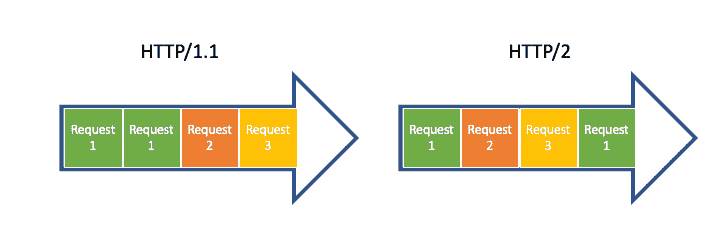
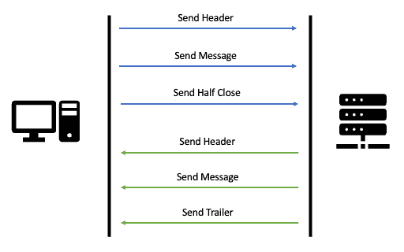
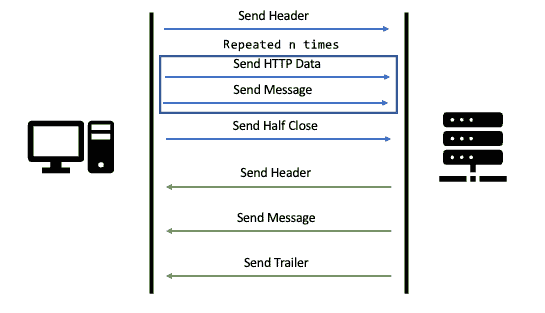
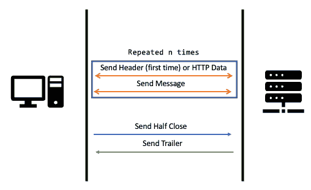
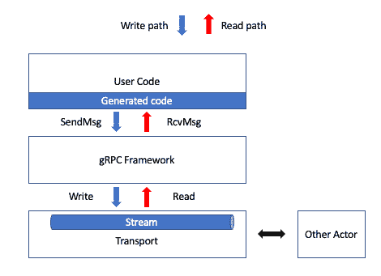
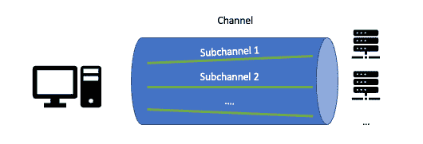
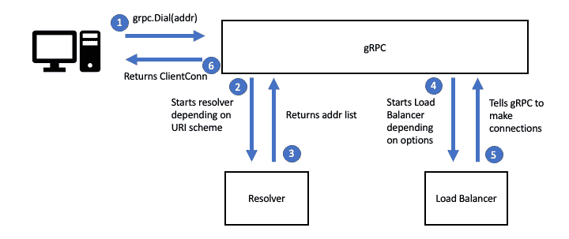
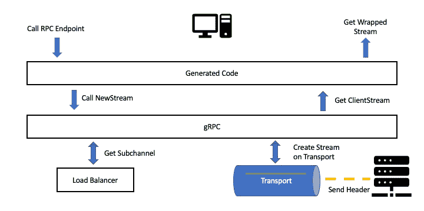
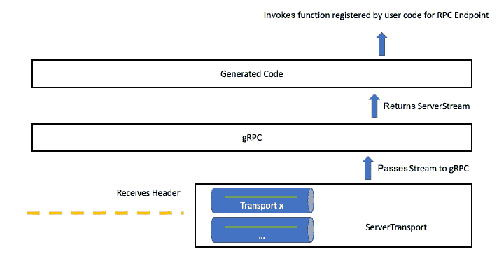

# 第一章：网络基础

网络通信是我们所有现代技术的核心，而 gRPC 是我们可以用来实现高效数据接收和传输的高级框架之一。由于它是高级的，它为你提供了发送和接收数据的抽象，无需考虑在通过网络通信时可能出现的所有问题。在本章中，目标是理解在较低级别（不是最低级别）上，当我们发送/接收 gRPC Go 中的消息时会发生什么。这将帮助你了解正在发生的事情，并且在我们讨论调试和可观察性时，你将能够更容易地掌握所提出的概念。

在本章中，我们将涵盖以下主要主题：

+   HTTP/2

+   RPC 操作

+   RPC 类型

+   RPC 的生命周期

# 前提条件

在本章中，我将使用 [第一章目录](https://www.wireshark.org)。

要显示这些捕获文件，您可以将它们导入 Wireshark 并应用显示过滤器。由于我们特别关注 HTTP/2 和 gRPC 有效负载，而我使用端口 `50051` 进行通信，您可以使用以下过滤器：`tcp.port == 50051 and (grpc or http2)`。

# 理解 HTTP/2

如果您正在阅读这本书，我将假设您熟悉 HTTP/1.1，或者至少您对如何在网络上进行传统 HTTP API 调用有一个概念。我猜是这样，因为与我们交互的大多数 API 都有由该协议带来的概念。我指的是像头部这样的概念，它可以提供调用的元数据；主体，它包含主要数据；以及诸如 GET、POST、UPDATE 等操作，这些操作定义了您打算对主体中的数据做什么。

HTTP/2 仍然具有所有这些概念，但在几个方面提高了效率、安全性和可用性。HTTP/2 相对于传统的 HTTP/1.1 的第一个优势是压缩到二进制。在 HTTP/2 之前，通过网络发送的所有内容都是纯文本，用户需要决定是否对其进行压缩。在版本 2 中，HTTP 语义的每一部分都被转换为二进制，从而使计算机在调用之间序列化和反序列化数据时更快，从而减少了请求/响应的有效负载大小。

HTTP/2 的第二个优势是一个名为服务器推送的功能。这是一个赋予服务器从客户端的单次调用中发送多个响应的能力的功能。这里的总体目标是减少服务器和客户端之间的嘈杂通信，从而减少达到相同最终结果的总有效负载。没有这个功能，当客户端想要请求一个网页及其所有资源时，它必须为每个资源进行一次请求。然而，有了服务器推送功能，客户端只需发送一个网页请求，服务器就会返回该网页，然后返回 CSS 和可能的一些 JS 脚本。这导致客户端只需一个调用，而不是三个。

![图 1.1 – HTTP/2 服务器推送图 1.1 – HTTP/2 服务器推送另一个重要的效率方面是创建一个长连接而不是每个请求一个连接。在 HTTP/0.9 中，每个调用都由创建 TCP 连接开始，并以关闭该连接结束。这在当今互联网的使用中非常低效。然后，HTTP/1.1 引入了 KeepAlive 的概念，允许单个 TCP 连接的重用。然而，这并不意味着我们可以发送交错的数据包来同时满足多个请求；这意味着在完成第一个请求后，我们可以重用相同的连接来处理第二个请求。这在 1997 年协议发布时可能还可以接受，但如今我们发送的请求越来越多，而且请求的大小也越来越大，等待请求完成后再开始下一个请求是不切实际的。HTTP/2 通过创建一个可以处理多个交错请求和响应的单个长连接来解决这个问题。

图 1.2 – 通过网络传输的 HTTP/2 交错数据包

这里展示的显然是对 HTTP/2 协议的过度简化。要解释协议的所有实现细节，可能需要一本书。当我们谈论 gRPC 时，我们主要需要了解的是，在 HTTP/2 中，我们可以通过网络发送结构化二进制消息而不是文本，我们可以有流，其中服务器可以为单个响应发送多个响应，最后，我们以高效的方式做到这一点，因为我们只创建一个 TCP 连接，它将处理多个请求和响应。然而，了解 gRPC 在 HTTP/2 之上有自己的通信协议也很重要。这意味着这里展示的所有 HTTP 协议改进都是通信的促进者。gRPC 使用所有这些，并结合四个 RPC 操作。

# RPC 操作

服务器和客户端之间通过 gRPC 进行的每个交互都可以描述为四个 RPC 操作。这些操作以创建框架中的复杂高级操作的方式组合。让我们看看这些操作，然后我将解释一个简单的 gRPC 调用是如何使用它们的。

重要提示

在本节中，我将使用 Wireshark 的 RPC 调用结果。我将在本书后面的章节中解释如何复制我在本节中做的事情。现在，我将只强调在转储中需要注意的重要事项。

## 发送头部

`发送头部`操作让服务器知道客户端将发送请求，或者让客户端知道服务器将发送响应。这充当服务器和客户端之间的开关，让双方都知道谁需要读取谁需要写入。

通过使用 Wireshark 分析一个简单的 gRPC 调用，我们可以观察到以下头部（简化版）是由客户端发送的，以便让服务器知道它将发送一个请求：

```go
HyperText Transfer Protocol 2
    Stream: HEADERS, Stream ID: 1, Length 67, POST
        /greet.GreetService/Greet
        Flags: 0x04, End Headers
            00.0 ..0\. = Unused: 0x00
            ..0\. .... = Priority: False
            .... 0... = Padded: False
            .... .1.. = End Headers: True
            .... ...0 = End Stream: False
         Header: :method: POST
         Header: content-type: application/grpc
```

在这个头部中需要注意的重要信息是，它提到客户端想要在`/greet.GreetService/Greet`路由上调用 HTTP POST，然后在标志中提到这是头部数据的结束。

然后，在调用过程中稍后，我们将看到以下头部（简化版）由服务器发送，以便让客户端知道它将发送响应：

```go
HyperText Transfer Protocol 2
    Stream: HEADERS, Stream ID: 1, Length 14, 200 OK
        Flags: 0x04, End Headers
            00.0 ..0\. = Unused: 0x00
            ..0\. .... = Priority: False
            .... 0... = Padded: False
            .... .1.. = End Headers: True
            .... ...0 = End Stream: False
        Header: :status: 200 OK
        Header: content-type: application/grpc
```

在这里，我们再次可以看到这是一个头部，这是将要发送的最后一个。不过，主要区别在于服务器告诉客户端请求已被正确处理，并且通过发送状态码 200 来表示。

## 发送消息

`Send Message`操作是发送实际数据的操作。对于我们这些 API 开发者来说，这是最重要的操作。在发送头部之后，客户端可以发送一个消息作为请求，服务器可以发送一个消息作为响应。

通过使用 Wireshark 分析与`Send Header`相同的 gRPC 调用，我们可以观察到以下数据（简化版）作为请求由客户端发送：

```go
GRPC Message: /greet.GreetService/Greet, Request
    0... .... = Frame Type: Data (0)
    .... ...0 = Compressed Flag: Not Compressed (0)
    Message Length: 9
    Message Data: 9 bytes
Protocol Buffers: /greet.GreetService/Greet,request
    Message: <UNKNOWN> Message Type
        Field(1):
            [Field Name: <UNKNOWN>]
            .000 1... = Field Number: 1
            .... .010 = Wire Type: Length-delimited (2)
            Value Length: 7
            Value: 436c656d656e74
```

在这个头部中需要注意的重要信息是，它提到客户端在`/greet.GreetService/Greet`路由上发送数据，这与头部中发送的相同。然后，我们可以看到我们正在发送协议缓冲区数据（稍后详细介绍）以及该消息的二进制值为`436c656d656e74`。

之后，在调用过程中，在服务器头部之后，我们看到以下数据（简化版）作为响应由服务器发送：

```go
GRPC Message: /greet.GreetService/Greet, Response
    0... .... = Frame Type: Data (0)
    .... ...0 = Compressed Flag: Not Compressed (0)
    Message Length: 15
    Message Data: 15 bytes
Protocol Buffers: /greet.GreetService/Greet,response
    Message: <UNKNOWN> Message Type
        Field(1):
            [Field Name: <UNKNOWN>]
            .000 1... = Field Number: 1
            .... .010 = Wire Type: Length-delimited (2)
            Value Length: 13
            Value: 48656c6c6f20436c656d656e74
```

在这里，我们可以看到这是一个对在`/greet.GreetService/Greet`路由上进行的调用发送的响应消息，该消息的二进制值为`48656c6c6f20436c656d656e74`。

## 发送半关闭

`Send Half Close`操作关闭了 actor 的输入或输出。例如，在传统的请求/响应设置中，当客户端完成发送请求时，发送`Half Close`关闭客户端流。这在某种程度上类似于`Send Header`，因为它作为一个开关来通知服务器现在是工作的时间。

再次查看与相同 gRPC 调用相关的 Wireshark 转储，我们应该能够看到在`Send Message`操作期间设置了头部。我们可以观察到以下数据（简化版）：

```go
HyperText Transfer Protocol 2
    Stream: DATA, Stream ID: 1, Length 14
        Length: 14
        Type: DATA (0)
        Flags: 0x01, End Stream
            0000 .00\. = Unused: 0x00
            .... 0... = Padded: False
            .... ...1 = End Stream: True
```

这次，我们有一个表示请求结束的标志。然而请注意，在这里，我们发送的是类型为`DATA`的有效负载。这与我们之前看到的不同，因为`DATA`比头部要轻得多。这是用于半关闭的，因为我们只想发送一个布尔值，表示客户端已完成。

## 发送尾部

最后，我们有一个用于终止整个 RPC 的操作。这是 `Send Trailer` 操作。这个操作也给我们提供了更多关于调用的信息，例如状态码、错误消息等。就本书的这一部分而言，我们只需要知道这些信息主要用于处理 API 错误。

如果我们查看相同的 Wireshark 调用，我们将得到以下数据（简化版）：

```go
HyperText Transfer Protocol 2
    Stream: HEADERS, Stream ID: 1, Length 24
        Length: 24
        Type: HEADERS (1)
        Flags: 0x05, End Headers, End Stream
            00.0 ..0\. = Unused: 0x00
            ..0\. .... = Priority: False
            .... 0... = Padded: False
            .... .1.. = End Headers: True
            .... ...1 = End Stream: True
        Header: grpc-status: 0
        Header: grpc-message:
```

注意，拖车基本上是一个头。有了这个头，我们将获得更多关于调用的信息（`grpc-status` 和 `grpc-message`）。然后我们接收两个标志 – 一个表示这是流的结束（在我们的情况下，请求/响应）。另一个表示这个拖车在这里结束。

# RPC 类型

现在我们知道了有四种 RPC 操作，我们可以看到它们是如何组合起来创建 gRPC 提供的不同 RPC 类型的。我们将讨论一元、服务器流、客户端流和双向 RPC 类型。我们将看到每种类型都是之前提出的 RPC 操作的组合。

## 一元

一元 RPC 是执行一个请求并返回一个响应的 RPC。我们已经在上一节中提到了这一点，但让我们继续并使这个过程更清晰。

总是首先，客户端发送初始头。这个头将包含与我们想要调用的 RPC 端点相关的信息。就本书的这一部分而言，我们只需要知道这主要包含 RPC 路由和流 ID。前者是让服务器知道它应该调用哪个用户代码函数来处理请求。后者是确定数据应该发送到哪个流的方式。这是因为我们可以同时进行多个流。

由于服务器现在知道客户端将发送请求，客户端现在可以发送消息。这个消息将包含实际的请求有效负载。在我们的情况下，我们只将发送 Protocol Buffers 编码的数据，但请注意，您可以使用 gRPC 发送任何类型的数据。

之后，因为我们处于一元设置中，客户端已经完成了请求的发送。正如我们所知，客户端现在应该发送一个半关闭。这是告诉服务器 *我已经完成，请发送给我* *响应*。

在这一点上，服务器将执行类似的工作。如图中所示，它将发送一个头，发送作为 Protobuf 编码消息的响应，并结束 RPC。然而，正如我们所知，服务器不会发送半关闭；它会发送拖车。这是表示调用是否成功的一些数据，有一个可选的错误消息，以及一些我们可以通过用户代码添加的其他键值对。



图 1.3 – 一元 RPC 流

## 服务器流

服务器流式 RPC 是执行一个请求并返回一个或多个响应的 RPC。这种 RPC 类型在客户端期望从服务器获取更新时很有用。例如，我们可以有一个客户端显示选定公司的股票价格。使用服务器流式，客户端可以订阅，服务器可以在一段时间内发送不同的价格。

在这种情况下，客户端没有任何变化。它将发送头部、消息和半关闭。然而，在服务器端，我们将交错发送 HTTP 数据消息和数据有效负载。

如以下图所示，服务器将首先发送其头部。当一个演员想要让另一个演员知道它将发送消息时，这是惯例。之后，如上所述，服务器将在发送 HTTP 数据消息和 Protobuf 有效负载之间交替。最初的数据消息将看起来像这样（简化版）：

```go
HyperText Transfer Protocol 2
    Stream: DATA, Stream ID: 1, Length 30
        Length: 30
        Type: DATA (0)
        Flags: 0x00
            0000 .00\. = Unused: 0x00
            .... 0... = Padded: False
            .... ...0 = End Stream: False
```

这表示将发送一条消息。这是一个轻量级的头部。一旦我们到达要发送的最后一条消息，服务器将使用尾部完成 RPC，此时客户端将知道服务器已完成发送响应。


图 1.4 – 服务器流式处理流程

## 客户端流式

客户端流式 RPC 与服务器流式 RPC 类似，但这次客户端可以发送一个或多个请求，而服务器返回一个响应。这在客户端需要向服务器发送实时信息的情况下非常有用。例如，这可能对微控制器发送来自某种传感器的数据并更新服务器当前测量状态很有用。

客户端流式与服务器流式类似。正如你在以下图中可以看到的，客户端将执行服务器在服务器流式中所做的操作。这意味着客户端将交错发送 HTTP 数据消息，这些消息类似于之前提到的服务器流式中的消息，以及 Protobuf 消息。最后，当客户端完成时，它将简单地发送半关闭。



图 1.5 – 客户端流式处理流程

## 双向流

到目前为止，你可能已经猜到双向流是服务器流式和客户端流的混合。客户端可以发送一个或多个请求，服务器返回一个或多个响应。这在其中一个演员需要对其数据反馈时特别有用。例如，如果你有一个寻找出租车的应用程序，服务器发送有关出租车的更新可能就不够了。用户可能也在向目的地走去，希望能在路上截到出租车。因此，服务器也需要知道用户的位置。

双向流比客户端和服务器流更不可预测。这是因为每个参与者发送消息的顺序没有定义。服务器可以为每个请求或任何数量的请求提供响应。因此，对于本节，让我们假设我们正在与一个为每个请求返回响应的服务器一起工作。

在这种情况下，正如你在下面的图中可以看到的，客户端将发送一个头部和一个消息。然后，服务器将发送其头部和消息。之后，我们将从每个参与者那里获取数据和消息。最后，我们将从客户端获得半关闭（Half Close）和从服务器获得尾部（Trailer）。



图 1.6 – 双向流流程

# RPC 的生命周期

现在我们已经了解了可以在 gRPC 中执行的基本 RPC 操作和不同类型的 RPC，我们可以看看 RPC 的生命周期。在本节中，我们将自上而下地介绍，首先解释当客户端发送请求和服务器接收它、发送响应和客户端接收响应时发生了什么。然后，我们将深入一点，讨论三个阶段：

1.  连接 - 当客户端连接到服务器时会发生什么？

1.  客户端端 - 当客户端发送消息时会发生什么？

1.  服务器端 - 当服务器接收到消息时会发生什么？

重要提示

gRPC 在不同语言中有多种实现。最初的是 C++，一些实现只是 C++代码的包装器。然而，gRPC Go 是一个独立的实现。这意味着它是从头开始在 Go 中实现的，并没有包装 C++代码。因此，在本节中，我们将专门讨论 gRPC Go，这可能在其他实现中有所不同。

在深入细节之前，让我们先从宏观的角度出发，通过定义一些概念来开始。首先，我们需要明确的是，gRPC 是由用户代码中生成的代码驱动的。这意味着我们只与 gRPC API 的几个点进行交互，我们主要处理的是基于我们的 Protocol Buffer 服务定义生成的代码。现在不必过于担心这一点；我们将在最后一节中介绍它。

第二个重要的概念是传输的概念。传输可以看作是参与者和连接之间的管理者，它通过网络发送/接收原始字节。它包含一个读写流，该流设计为能够以任何顺序在网络中读写。在我们的情况下，最重要的方面是我们可以在`io.Reader`上调用读取，我们可以在`io.Writer`上调用写入。

最后，需要澄清的是，客户端和服务器非常相似。在客户端上调用的所有函数也将被服务器调用。它们只是在不同的对象上被调用（例如，`ClientTransport`和`ServerTransport`）。

现在，我们理解了所有这些，我们可以看看 RPC 生命周期的可视化表示。



图 1.7 – RPC 生命周期的鸟瞰图

我们可以看到，我们可以简单地定义一个通用的参与者，它将代表服务器和客户端。然后，我们可以看到生成的代码将通过调用名为 `SendMsg` 的函数直接与 gRPC 框架交互。

这正如其名所示，是为了在网络中发送数据。这个 `SendMsg` 函数将调用一个名为 `Write` 的底层函数。这是 Transport 中 `io.Writer` 提供的函数。一旦完成，其他参与者将在 `io.Reader` 上读取，然后是 `RcvMsg` 函数，最后，用户代码将接收到数据。

现在，我们将更深入地探讨 gRPC 通信的重要部分。对于任何类型的有线传输，客户端都需要连接到服务器，因此我们将从连接的具体细节开始。

## 连接

要创建一个连接，客户端代码将调用一个名为 `Dial` 的函数，该函数带有目标 URI 和一些选项作为参数。当接收到 `Dial` 请求时，gRPC 框架将根据 RFC 3986 解析目标地址，并根据 URI 的方案创建一个 `Resolver`。例如，如果我们使用 `dns://` 方案，这是 gRPC 在 URI 中省略方案或提供的方案未知时使用的默认方案，gRPC 将创建一个 `dnsResolver` 对象。

dnsResolver 然后，解析器将执行其工作，即解析主机名并返回一个可以连接的地址列表。有了这些地址，gRPC 将根据用户在 `Dial` 选项中提供的配置创建一个负载均衡器。框架默认提供两个负载均衡器：

+   首先选择（默认），它连接到它可以连接的第一个地址，并将所有 RPC 发送到它

+   轮询，它连接到所有地址，并按顺序逐个将 RPC 发送到每个后端

如我们所见，负载均衡器的目标是找出客户端应该在哪个地址（们）上创建连接（们）。因此，它将返回一个地址列表，gRPC 应连接到这些地址，然后 gRPC 将创建一个通道，这是 RPC 使用的连接的抽象，以及子通道，这是负载均衡器可以用来将数据定向到一个或多个后端的连接的抽象。



图 1.8 – 通道与子通道

最后，用户代码将接收到一个`ClientConn`对象，该对象将用于关闭连接，但更重要的是，用于创建在生成的代码中定义的客户端对象，我们可以在其上调用 RPC 端点。最后要注意的是，默认情况下，整个过程是非阻塞的。这意味着 gRPC 不会等待连接建立就返回`ClientConn`对象。



图 1.9 – RPC 连接摘要

## 客户端端

现在我们已经建立了连接，我们可以开始考虑发送请求。目前，让我们假设我们已经生成了代码，并且它有一个`Greet` RPC 端点。并且对于我们的当前目的，它正在做什么并不重要；它只是一个 API 端点。

要发送请求，用户代码将简单地调用`Greet`端点。这将触发 gRPC 框架中名为`NewStream`的函数。那个函数的名字有点误导，因为在这里流不一定代表一个流式 RPC。实际上，无论你是否在进行流式 RPC，它都会被调用，并创建一个`ClientStream`对象。所以在这里，`Stream`大致等同于所有 RPC 的抽象。

在创建那个`ClientStream`的过程中，gRPC 框架将执行两个操作。第一个操作是它会调用负载均衡器以获取一个可用的子通道。这是根据在连接创建期间选择的负载均衡器策略来完成的。第二个操作是与传输交互。gRPC 框架将创建`ClientTransport`，它包含用于发送和接收数据的读写流，并将头部发送到服务器以初始化一个 RPC 调用。

一旦完成这些，gRPC 框架将简单地返回`ClientStream`给生成的代码，生成的代码将简单地用另一个对象封装它，为用户提供一组更小的可调用函数（例如，`Send`、`Recv`等）。



图 1.10 – 客户端通信摘要

## 服务器端

自然地，在发送请求后，我们期望从服务器获得响应。正如我们目前所知，客户端发送了一个头部来初始化一个 RPC 调用。这个头部将由`ServerTransport`处理。现在服务器已经知道客户端想要发送一个针对`Greet` RPC 端点的请求。

在此基础上，传输将向 gRPC 框架发送一个`transport.Stream`对象。然后，再次，这个流将被薄薄地封装在一个`ServerStream`对象中，并传递给生成的代码。此时，生成的代码知道要调用哪个用户代码函数。它之所以知道这一点，是因为用户代码将函数注册到特定的 RPC 端点上。

就这样，服务器将对接收到的数据进行计算，并将简单地通过相应的传输向客户端返回响应。`ClientTransport` 将读取它并将响应返回给用户代码。



图 1.11 – 服务器端通信摘要

# 摘要

所有这些知识现在可能令人感到压倒，但不要担心，你不需要记住所有展示给对象的名称来理解 gRPC 的工作原理。本章的重点是更多地给你一个关于在建立连接和发送/接收数据过程中涉及的不同角色的感觉。

我们看到，我们有四个客户端和/或服务器可以执行 RPC 操作。每个参与者发送一个头部来指示轮到它发送数据，然后他们发送消息，最后，他们各自有一个特殊操作来指示他们已完成发送消息。

之后，我们看到了 gRPC 是如何创建服务器和客户端之间的连接的。这是通过解析器完成的，解析器根据我们尝试连接的地址找到 IP 地址，以及负载均衡器，它帮助 gRPC 确定将数据发送到哪个子通道。

然后，我们讨论了通道和子通道。我们看到了它们是如何由客户端创建来连接服务器的。最后，我们看到了服务器将接收数据并调用用户代码为 RPC 端点注册的某些代码。

在下一章中，我们将介绍 Protocol Buffers 以及它们与 gRPC 的关系。

# 测验

1.  哪个 RPC 操作告诉服务器客户端已准备好发送请求？

    1.  `发送尾部`

    1.  `发送消息`

    1.  `发送头部`

1.  哪个 RPC 操作告诉客户端服务器已完成返回响应（s）？

    1.  `发送半关闭`

    1.  `发送尾部`

    1.  `发送头部`

1.  哪种 RPC 类型可以从客户端以块的形式在一个请求中下载信息？

    1.  服务器流式传输

    1.  客户端流式传输

    1.  双向流式传输

    1.  单一

1.  哪种 RPC 类型相当于传统的 HTTP/1.1 请求？

    1.  服务器流式传输

    1.  客户端流式传输

    1.  双向流式传输

    1.  单一

1.  什么是通道？

    1.  RPCs 用于表示通过负载均衡器发现的任何可用服务器连接的抽象。

    1.  负载均衡器用于表示连接到特定服务器的抽象。

    1.  以上两者

1.  什么是子通道？

    1.  RPCs 用于表示通过负载均衡器发现的任何可用服务器连接的抽象。

    1.  负载均衡器用于表示连接到特定服务器的抽象。

    1.  以上两者

1.  当从 `grpc.Dial` 接收 `ClientConn` 对象时，你能确定客户端已与服务器建立了连接吗？

    1.  是

    1.  否

# 答案

1.  C

1.  B

1.  A

1.  D

1.  A

1.  B

1.  B](https://www.wireshark.org) [](https://www.wireshark.org)
