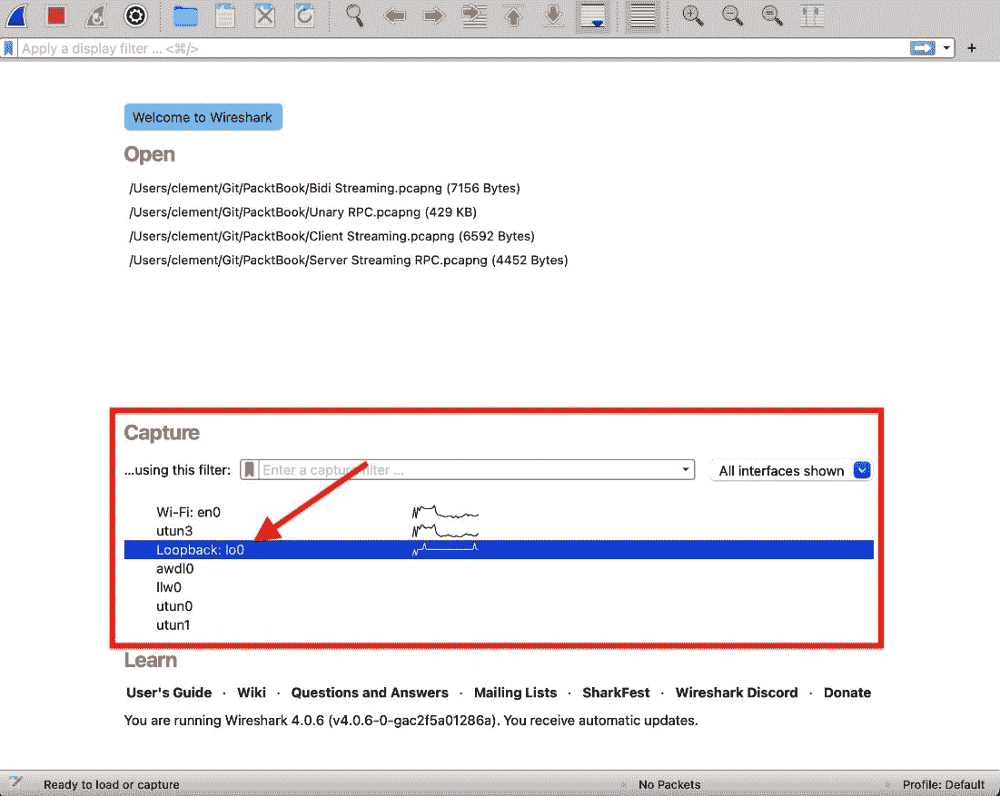
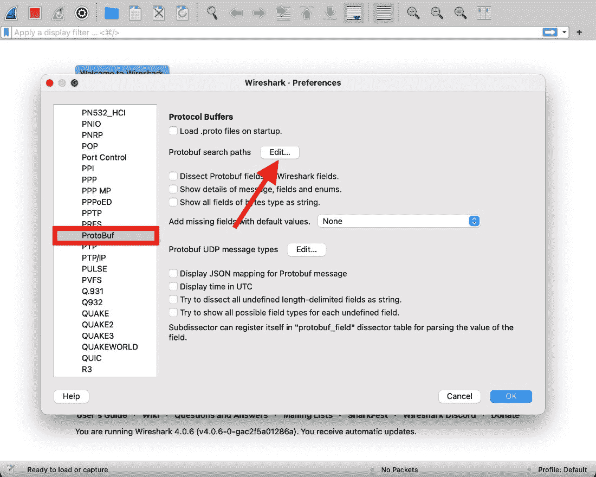
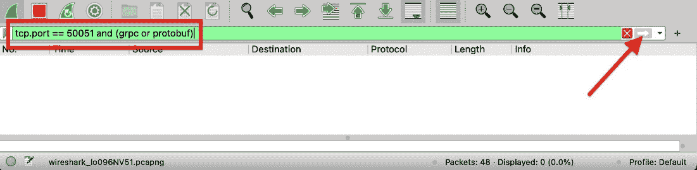
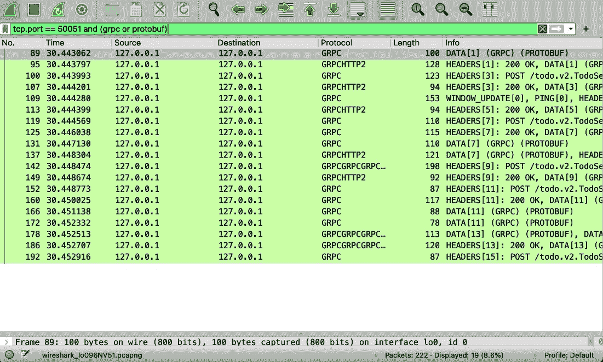

# 第九章：量产级 API

迄今为止，我们一直关注 gRPC 提供的功能和社区项目添加的功能。这是一个重要的主题，但并不是全部。我们现在需要考虑如何测试、调试和部署我们的 gRPC 服务器。

在本章中，我们将看到如何对服务进行单元和负载测试。然后，我们将看到如何手动与我们的 API 交互以调试它。最后，我们将看到如何容器化和部署我们的服务。本章分为以下主要主题：

+   测试 API

+   使用服务器反射进行调试

+   在 Kubernetes 上部署 gRPC 服务

# 技术要求

您可以在本书配套仓库中名为 chapter5 的文件夹中找到本章的代码，该仓库的网址为[`github.com/PacktPublishing/gRPC-Go-for-Professionals/tree/main/chapter9`](https://github.com/PacktPublishing/gRPC-Go-for-Professionals/tree/main/chapter9)。在本章中，我将使用三个主要工具：`ghz`、`grpcurl`和 Wireshark。您应该已经从*第一章*安装了 Wireshark，但如果没有，您可以在[`www.wireshark.org/`](https://www.wireshark.org/)找到它。ghz 是一个让我们能够进行 API 负载测试的工具。您可以通过访问[`ghz.sh/`](https://ghz.sh/)来获取它。最后，我们将使用 grpcurl 从终端与我们的 API 交互。您应该能够从[`github.com/fullstorydev/grpcurl`](https://github.com/fullstorydev/grpcurl)获取它。

# 测试

开发量产级 API 始于编写全面的测试，以确保满足业务需求，同时验证 API 的一致性和性能。第一部分主要在单元和集成测试中处理，第二部分通过负载测试处理。

在本节的第一个部分，我们将重点关注服务器的单元测试。我们将针对每种 API 类型进行一次测试，以了解如何在未来引入更多测试。在第二部分，我们将介绍 ghz，这是一个用于负载测试 gRPC API 的工具。我们将介绍该工具的不同选项以及如何使用凭据、作为头部的认证令牌等进行 API 负载测试。

## 单元测试

如前所述，我们将重点关注服务器的单元测试。在开始之前，重要的是要知道这里展示的测试并不是我们可能做的所有测试。为了使本书易于阅读，我将展示如何为每种 API 类型编写单元测试，您可以在`server/impl_test.go`文件中找到其他测试的示例。

在编写任何测试之前，我们需要做一些设置。我们将为不同的测试编写一些样板代码，以便它们可以共享相同的服务器和连接。这主要是为了避免每次运行测试时都创建新的服务器和连接。然而，请注意，这些是非密封测试。这意味着意外的状态可能会在多个测试之间共享，从而使测试变得不可靠。我们将介绍处理这种情况的方法，并确保我们清除状态。

我们首先可以做的事情是创建一个假数据库。这就像我们处理 `inMemoryDb` 一样，实际上，`FakeDb` 是 `inMemoryDb` 的包装器，但我们还将测试由于数据库连接问题引起的问题。

为了做到这一点，我们将使用与 `grpc.ServerOption` 相同的模式。`grpc.ServerOption` 是一个将值应用到私有结构体的函数。这个模式的例子是 `grpc.Creds`：

```go
func Creds(c credentials.TransportCredentials) ServerOption {
  return newFuncServerOption(func(o *serverOptions) {
    o.creds = c
  })
}
```

它返回一个函数，一旦调用，就会将 `c` 的值设置为 `serverOptions` 中的 `creds` 属性。请注意，`serverOptions` 与 `ServerOption` 不同。这是一个私有结构体。

我们将创建一个函数，告诉我们数据库是否可用。稍后，我们将启用选项，如果不可用则返回错误。在 `test_options.go` 中，我们将有以下内容：

```go
func IsAvailable(a bool) TestOption {
  return newFuncTestOption(func(o *testOptions) {
    o.isAvailable = a
  })
}
```

我将留给你们去检查 `test_options.go` 的其余内容。那里的函数和结构体只是创建一些工具和变量，以便能够编写 `IsAvailable` 函数并获取 `isAvailable` 的默认值。

现在，我们可以创建 `FakeDb`。如前所述，这是一个 `inMemoryDb` 的包装器，它有一些选项。在 `fake_db.go` 中，我们可以有以下内容：

```go
type FakeDb struct {
  d *inMemoryDb
  opts testOptions
}
func NewFakeDb(opt ...TestOption) *FakeDb {
  opts := defaultTestOptions
  for _, o := range opt {
    o.apply(&opts)
  }
  return &FakeDb{
    d: &inMemoryDb{},
    opts: opts,
  }
}
func (db *FakeDb) Reset() {
  db.opts = defaultTestOptions
  db.d = &inMemoryDb{}
}
```

我们现在可以通过多种方式创建一个 `FakeDb`：

```go
NewFakeDb()
NewFakeDb(IsAvailable(false))
```

我们还重写了 `inMemoryDb` 的函数，以便我们的 `FakeDb` 实现了 `db` 接口，并且我们可以使用这个数据库实例化一个服务器。`FakeDb` 的每个函数都遵循相同的模式。我们检查数据库是否可用；如果不，我们返回一个错误，如果可用，我们返回 `inMemoryDb` 的结果。一个例子是 `addTask`（在 `fake_db.go` 中）：

```go
func (db *FakeDb) addTask(description string, dueDate
  time.Time) (uint64, error) {
  if !db.opts.isAvailable {
    return 0, fmt.Errorf(
      "couldn't access the database",
    )
  }
  return db.d.addTask(description, dueDate)
}
```

既然我们已经有了这个，我们就可以再向前迈进一步，编写实际的单元测试。我们现在需要创建一个服务器。然而，我们不想这个服务器实际上使用我们电脑上的端口。使用实际端口可能会使我们的测试变得不可靠，因为如果端口已经被占用，测试会直接返回一个错误，表示无法创建服务器的实例。

为了解决这个问题，gRPC 有一个名为`bufconn`的包（`grpc/test/bufconn`）。它允许我们创建一个缓冲连接，因此不需要使用端口。`bufconn.Listen`将创建一个监听器，我们将能够使用这个监听器来处理请求。在`server_test.go`中，我们将监听器和数据库作为全局变量共享。这将允许我们在所有测试完成后销毁监听器，并在测试中从数据库中添加/清除任务。此外，我们将创建一个返回`net.Conn`连接的函数，这样我们就可以在测试中使用它来创建一个客户端：

```go
import (
  "context"
  "log"
  "net"
  pb "github.com/PacktPublishing/gRPC-Go-for-Professionals/
    proto/todo/v2"
  "google.golang.org/grpc"
  "google.golang.org/grpc/test/bufconn"
)
const bufSize = 1024 * 1024
var lis *bufconn.Listener
var fakeDb *FakeDb = NewFakeDb()
func init() {
  lis = bufconn.Listen(bufSize)
  s := grpc.NewServer()
  var testServer *server = &server{
    d: fakeDb,
  }
  pb.RegisterTodoServiceServer(s, testServer)
  go func() {
    if err := s.Serve(lis); err != nil && err.Error() !=
        "closed" {
      log.Fatalf("Server exited with error: %v\n", err)
    }
  }()
}
func bufDialer(context.Context, string) (net.Conn, error) {
  return lis.Dial()
}
```

首先要注意的是，我们使用 Go 的`init()`函数在测试开始之前进行此设置。然后，注意我们创建了我们服务器的实例并注册了我们的`TodoService`实现的实例。最后，服务器在一个 goroutine 中提供服务。所以，我们需要确保 goroutine 被取消。

我们几乎完成了样板代码。我们需要创建一个使用`bufDialer`函数通过缓冲连接连接到服务器的客户端。在`impl_test.go`中，我们将创建一个返回`TodoServiceClient`和`grpc.ClientConn`的函数。第一个显然是用来调用我们的端点，但第二个是为了我们在每个测试结束时关闭客户端连接：

```go
func newClient(t *testing.T) (*grpc.ClientConn,
  pb.TodoServiceClient) {
  ctx := context.Background()
  creds := grpc.WithTransportCredentials
    (insecure.NewCredentials())
  conn, err := grpc.DialContext(ctx, "bufnet",
    grpc.WithContextDialer(bufDialer), creds)
  if err != nil {
    t.Fatalf("failed to dial bufnet: %v", err)
  }
  return conn, pb.NewTodoServiceClient(conn)
}
```

在这里需要理解的一个重要的事情是，我们不是在测试我们在`main.go`中编写的整个服务器。我们只是在测试我们的端点实现。这就是为什么我们可以使用不安全的凭据连接到服务器。拦截器、加密等应该在集成测试中进行测试。

最后，我们可以创建一个小的实用函数来检查一个错误是否是 gRPC 错误，并且它有一个预期的消息：

```go
func errorIs(err error, code codes.Code, msg string) bool {
  if err != nil {
    if s, ok := status.FromError(err); ok {
      if code == s.Code() && s.Message() == msg {
        return true
      }
    }
  }
  return false
}
```

我们现在准备编写一些单元测试。我们将创建一个函数，该函数将运行所有单元测试，并在所有子测试完成后销毁监听器：

```go
func TestRunAll(t *testing.T) {
}
```

现在，我们能够用子测试填充`TestRunAll`函数，如下所示：

```go
func TestRunAll(t *testing.T) {
  t.Run("AddTaskTests", func(t *testing.T) {
    //...
  })
  t.Cleanup(func() {
    lis.Close()
  })
}
```

现在，让我们编写`testAddTaskEmptyDescription`函数，该函数检查当我们发送一个带有空描述的请求时是否会得到一个错误。我们将创建一个客户端的新实例，创建一个空请求，将其发送到`AddTask`，最后检查我们的错误是否有一个未知代码（由`protoc-gen-validate`返回）以及消息是`invalid AddTaskRequest.Description: value length must be at least 1 runes`（也来自`protoc-gen-validate`）：

```go
const (
  errorInvalidDescription = "invalid AddTaskRequest
    .Description: value length must be at least 1 runes"
)
func testAddTaskEmptyDescription(t *testing.T) {
  conn, c := newClient(t)
  defer conn.Close()
  req := &pb.AddTaskRequest{}
  _, err := c.AddTask(context.TODO()), req)
  if !errorIs(err, codes.Unknown, errorInvalidDescription) {
    t.Errorf(
      "expected Unknown with message \"%s\", got %v",
      errorInvalidDescription, err,
    )
  }
}
```

然后，我们可以将其添加到我们的`TestRunAll`函数中，如下所示：

```go
func TestRunAll(t *testing.T) {
  t.Run("AddTaskTests", func(t *testing.T) {
    t.Run("TestAddTaskEmptyDescription",
       testAddTaskEmptyDescription)
  }
  //...
}
```

要运行这个测试，我们可以在根目录中运行以下命令：

```go
$ go test -run ^TestRunAll$ ./server
ok
```

现在，在继续查看如何测试流之前，让我们看看我们如何测试一个不可用的数据库。这几乎与我们在`testAddTaskEmptyDescription`中做的是一样的，但我们将要覆盖数据库。最后，我们将检查我们得到一个内部错误并重置数据库（以清除选项）：

```go
const (
  //...
  errorNoDatabaseAccess = "unexpected error: couldn't
    access the database"
)
func testAddTaskUnavailableDb(t *testing.T) {
  conn, c := newClient(t)
  defer conn.Close()
  newDb := NewFakeDb(IsAvailable(false))
  *fakeDb = *newDb
  req := &pb.AddTaskRequest{
    Description: "test",
    DueDate: timestamppb.New(time.Now().Add(5 *
        time.Hour)),
  }
  _, err := c.AddTask(context.TODO(), req)
  fakeDb.Reset()
  if !errorIs(err, codes.Internal, errorNoDatabaseAccess) {
    t.Errorf("expected Internal, got %v", err)
  }
}
```

我们可以看到测试数据库故障很容易。这就是一元 RPC 的全部内容。我将让你将`testAddTaskUnavailableDb`添加到`TestRunAll`中，并查看`impl_test.go`中`AddTasks`的其他测试。

现在，我们将测试`ListTasks`。我们将在我们的模拟数据库中添加一些任务，调用`ListTasks`，确保没有错误，并检查`ListTasks`是否遍历了所有任务：

```go
func testListTasks(t *testing.T) {
  conn, c := newClient(t)
  defer conn.Close()
  fakeDb.d.tasks = []*pb.Task{
    {}, {}, {}, // 3 empty tasks
  }
  expectedRead := len(fakeDb.d.tasks)
  req := &pb.ListTasksRequest{}
  count := 0
  res, err := c.ListTasks(context.TODO(), req)

  if err != nil {
    t.Errorf("unexpected error: %v", err)
  }
  for {
    _, err := res.Recv()
    if err == io.EOF {
      break
    }
    if err != nil {
      t.Errorf("error while reading stream: %v", err)
    }
    count++
  }
  if count != expectedRead {
    t.Errorf(
      "expected reading %d tasks, read %d",
      expectedRead, count,
    )
  }
}
```

在调用 API 方面没有新的内容。我们已经在编写客户端时知道了所有这些。然而，对于这次测试，主要的不同之处在于我们不看值；我们只是断言我们循环的时间。当然，你可以从这个基础上创建更复杂的测试，但我只想展示一个简单的服务器流式 API 测试，这样你就可以在此基础上构建。

接下来，让我们测试客户端流式 API 端点。由于我们正在使用`UpdateTasks`端点，我们需要在我们的数据库中设置数据。之后，我们将基本上创建一个`UpdateTasksRequest`数组，以便更改数据库中的所有项目，发送请求，并检查所有更新是否运行无误：

```go
func testUpdateTasks(t *testing.T) {
  conn, c := newClient(t)
  defer conn.Close()
  fakeDb.d.tasks = []*pb.Task{
    {Id: 0, Description: "test1"},
    {Id: 1, Description: "test2"},
    {Id: 2, Description: "test3"},
  }
  requests := []*pb.UpdateTasksRequest{
    {Id: 0}, {Id: 1}, {Id: 2},
  }
  expectedUpdates := len(requests)
  stream, err := c.UpdateTasks(context.TODO())
  count := 0
  if err != nil {
    t.Errorf("unexpected error: %v", err)
  }
  for _, req := range requests {
    if err := stream.Send(req); err != nil {
      t.Fatal(err)
    }
    count++
  }
  _, err = stream.CloseAndRecv()
  if err != nil {
    t.Errorf("unexpected error: %v", err)
  }
  if count != expectedUpdates {
    t.Errorf(
      "expected updating %d tasks, updated %d",
      expectedUpdates, count,
    )
  }
}
```

这与之前的测试类似。我们使用计数器来检查所有更新都被“应用”。在一个集成测试中，你将不得不检查数据库中的值是否实际上发生了变化；然而，因为我们是在单元测试中，并且我们有一个内存数据库，检查实际值并没有什么意义。

最后，我们将测试双向流式 API。在测试环境中，这稍微复杂一些，但我们将一步一步地解决这个问题。之前，在客户端，当一个 goroutine 中发生错误时，我们简单地运行`log.Fatalf`来退出。然而，在这里，因为我们想跟踪错误，并且我们不能从测试的另一个 goroutine 中调用`t.Fatalf`，我们将使用一个名为`countAndError`的`struct`通道。正如其名所示，这是一个包含计数器和可选错误的结构：

```go
type countAndError struct {
  count int
  err error
}
```

这很有用，因为现在我们将能够等待 goroutine 完成并获取通道的结果。首先，让我们创建一个发送所有请求的函数。这个函数被命名为`sendRequestsOverStream`，它也将在一个单独的 goroutine 中被调用：

```go
func sendRequestsOverStream(stream
  pb.TodoService_DeleteTasksClient, requests
    []*pb.DeleteTasksRequest, waitc chan countAndError) {
  for _, req := range requests {
    if err := stream.Send(req); err != nil {
      waitc <- countAndError{err: err}
      close(waitc)
      return
    }
  }
  if err := stream.CloseSend(); err != nil {
    waitc <- countAndError{err: err}
    close(waitc)
  }
}
```

如果发生错误，我们将使用在`countAndError`结构中设置错误来关闭等待的通道。

然后，我们可以创建一个读取响应的函数。这个函数被命名为`readResponsesOverStream`，它将在一个单独的 goroutine 中被调用：

```go
func readResponsesOverStream(stream
  pb.TodoService_DeleteTasksClient, waitc chan
    countAndError) {
  count := 0

  for {
    _, err := stream.Recv()
    if err == io.EOF {
      break
    }
    if err != nil {
      waitc <- countAndError{err: err}
      close(waitc)
      return
    }
    count++
  }
  waitc <- countAndError{count: count}
  close(waitc)
}
```

这次，如果一切顺利，通道将获得一个设置计数的`countAndError`。这个计数与我们在之前的测试中所做的是相同的。它检查收集到的没有错误的响应数量。

现在我们有了这两个函数，我们就可以为我们的双向流 API 编写实际的测试了。这与我们为 `ListTasks` 和 `UpdateTasks` 做的事情类似；然而，这次，我们启动了两个 goroutines，等待结果，并检查我们没有错误并且计数等于请求数量：

```go
func testDeleteTasks(t *testing.T) {
  conn, c := newClient(t)
  defer conn.Close()
  fakeDb.d.tasks = []*pb.Task{
    {Id: 1}, {Id: 2}, {Id: 3},
  }
  expectedRead := len(fakeDb.d.tasks)
  waitc := make(chan countAndError)
  requests := []*pb.DeleteTasksRequest{
    {Id: 1}, {Id: 2}, {Id: 3},
  }
  stream, err := c.DeleteTasks(context.TODO())
  if err != nil {
    t.Errorf("unexpected error: %v", err)
  }
  go sendRequestsOverStream(stream, requests, waitc)
  go readResponsesOverStream(stream, waitc)
  countAndError := <-waitc
  if countAndError.err != nil {
    t.Errorf("expected error: %v", countAndError.err)
  }
  if countAndError.count != expectedRead {
    t.Errorf(
      "expected reading %d responses, read %d",
      expectedRead, countAndError.count,
    )
  }
}
```

有了这个，我们终于完成了所有不同类型 gRPC API 的测试。再次强调，还有更多可以进行的测试，其他示例可以在 `impl_test.go` 中找到。我强烈建议你看看那里，以便获得更多灵感。

在将所有这些测试添加到 `TestRunAll` 之后，你应该能够像这样运行它们：

```go
$ go test -run ^TestRunAll$ ./server
ok
```

如果你想查看测试运行了什么更详细的信息，可以添加 `–v` 选项。这将返回类似以下的内容：

```go
$ go test -run ^TestRunAll$ -v ./server
--- PASS: TestRunAll
    --- PASS: TestRunAll/AddTaskTests
        --- PASS: TestRunAll/AddTaskTests/
          TestAddTaskUnavailableDb
        --- PASS:
//...
PASS
```

### Bazel

为了使用 Bazel 运行测试，你可以运行 Gazelle 生成 `//server:server_test` 目标：

```go
$ bazel run //:gazelle
```

然后，你将在 `server/BUILD.bazel` 中有这个目标，你应该能够运行以下命令：

```go
$ bazel run //server:server_test
PASS
```

如果你想为你的测试获取更详细的输出，可以使用 `–test_arg` 选项并将其设置为 `-test.v`。它将返回类似以下的内容：

```go
$ bazel run //server:server_test --test_arg=-test.v
--- PASS: TestRunAll
    --- PASS: TestRunAll/AddTaskTests
        --- PASS: TestRunAll/AddTaskTests/
          TestAddTaskUnavailableDb
        --- PASS:
//...
PASS
```

为了总结，我们看到了如何测试一元、服务器端流、客户端流和双向流 API。我们看到了在使用 `bufconn` 时，我们不需要在运行测试的机器上使用端口。这使得我们的测试对运行环境的依赖性更小。最后，我们还看到了我们可以使用模拟来测试我们的系统依赖。这超出了本书的范围，但对我来说，展示你可以即使使用 gRPC 也能编写正常的测试是很重要的。

## 压力测试

测试你的服务时，确保它们高效并能处理特定负载是另一个重要步骤。为此，我们使用并发向我们的服务发送请求的负载测试工具。ghz 就是这样一个工具。在本节中，我们将看到如何使用这个工具以及我们需要设置的一些选项，以便测试我们的 API。

ghz 是一个高度可配置的工具。运行以下命令以查看和理解输出：

```go
$ ghz --help
```

显然，我们不会使用所有这些选项，但我们将检查最常用的选项以及在某些特定情况下我们需要使用的选项。让我们先尝试进行一个简单的调用。

重要提示

为了运行以下负载测试，你需要在 `server/main.go` 文件中禁用速率限制中间件。你可以通过注释掉 `ratelimit.UnaryServerInterceptor` 和 `ratelimit.StreamServerInterceptor` 来做到这一点。

我们首先运行我们的服务器：

```go
$ go run ./server 0.0.0.0:50051 0.0.0.0:50052
metrics server listening at 0.0.0.0:50052
gRPC server listening at 0.0.0.0:50051
```

我们将要讨论的前四个选项是最常见的。我们需要能够命名我们想要调用的服务和方法（`--call`），指出服务定义在哪个 proto 文件中（`--proto`）以及在哪里可以找到导入（`--import_paths`），最后，指定作为请求发送的数据。在我们的例子中，一个基本的命令，从`chapter9`文件夹运行，看起来像这样：

```go
$ ghz --proto ./proto/todo/v2/todo.proto \
      --import-paths=proto               \
      --call todo.v2.TodoService.AddTask \
      --data '{"description":"task"}'    \
      0.0.0.0:50051
```

然而，如果你尝试运行这个命令，你最终会得到一个类似以下错误的消息：

```go
connection error: desc = "transport: authentication
handshake failed: tls: failed to verify certificate: x509:
"test-server1" certificate is not standards compliant"
```

如你从消息中可以肯定猜到的，这是因为我们设置了我们的服务器只接受安全连接。为了解决这个问题，我们将使用`--cacert`选项，它允许我们指定 CA 证书的路径。如果你记得，这正是我们在客户端代码中做的。`ghz`也需要这个信息：

```go
$ ghz #... \
      --cacert ./certs/ca_cert.pem \
      0.0.0.0:50051
```

如果你运行这个命令，你会得到与之前相同的错误。这是因为证书与一个域名相关联。这意味着只有来自特定域名的请求才会被接受。然而，因为我们是从本地主机工作的，这根本不符合那个要求，所以失败了。为了解决这个问题，我们将使用`--cname`选项来覆盖我们发送的域名，以符合证书：

```go
$ ghz #... \
      --cacert ./certs/ca_cert.pem \
      --cname "check.test.example.com" \
      0.0.0.0:50051
```

在这里，我们使用了`check.test.example.com`，因为我们从[`github.com/grpc/grpc-go/tree/master/examples/data/x509`](https://github.com/grpc/grpc-go/tree/master/examples/data/x509)下载的生成证书是以 DNS 名称`*.test.example.com`生成的（见`openssl.cnf`）。此外，请注意，这个`--cacert`和`--cname`选项仅对自签名证书有用。通常，除了特定情况外，这些证书用于测试和非生产环境。

现在，如果你运行前面的命令，你应该会得到以下错误：

```go
Unauthenticated desc = failed to get auth_token
```

这应该会让你想起什么。这是我们发送到认证拦截器中的错误，当客户端没有提供`auth_token`元数据时。为了发送这些元数据，我们将使用`--metadata`选项，它接受一个 JSON 字符串作为键和值：

```go
ghz #... \
    --metadata '{"auth_token":"authd"}' \
    0.0.0.0:50051
```

在运行了所有这些选项之后，我们应该能够运行我们的第一次负载测试（你的结果可能会有所不同）：

```go
$ ghz --proto ./proto/todo/v2/todo.proto \
      --import-paths=proto                \
      --call todo.v2.TodoService.AddTask  \
      --data '{"description":"task"}'     \
      --cacert ./certs/ca_cert.pem        \
     --cname "check.test.example.com"    \
      --metadata '{"auth_token":"authd"}' \
      0.0.0.0:50051
Summary:
  Count:    200
  Total:    22.89 ms
  Slowest:    16.70 ms
  Fastest:    0.20 ms
  Average:    4.60 ms
  Requests/sec:    8736.44
Response time histogram:
  0.204  [1]   |
  1.854  [111] |∎∎∎∎∎∎∎∎∎∎∎∎∎∎∎∎∎∎∎∎∎∎∎∎∎∎∎∎∎∎∎∎∎∎∎∎∎∎∎∎∎
  3.504  [38]  |∎∎∎∎∎∎∎∎∎∎∎∎∎∎
  5.153  [0]   |
  6.803  [0]   |
  8.453  [0]   |
  10.103 [0]   |
  11.753 [0]   |
  13.403 [2]   |∎
  15.053 [26]  |∎∎∎∎∎∎∎∎∎
  16.703 [22]  |∎∎∎∎∎∎∎∎
Latency distribution:
  10 % in 0.33 ms
  25 % in 0.78 ms
  50 % in 1.75 ms
  75 % in 2.39 ms
  90 % in 15.12 ms
  95 % in 15.31 ms
  99 % in 16.48 ms
Status code distribution:
  [OK]   200 responses
```

在这个总结中有很多东西可以讨论和观察。然而，让我们关注一些有趣的观点。第一个是请求的数量。我们可以看到在这个测试中我们发出了 200 个请求。这是默认的请求数量。我们可以通过使用`--total`选项并设置另一个数字（例如，500）来改变它。

在响应时间直方图中，我们可以看到 200 个请求中有 111 个在约 2.29 毫秒内执行。这里还有一个有趣的现象，我们有一些命令（50 个）运行时间超过 13 毫秒。如果我们处于生产环境，我们可能需要深入挖掘以找出这些“高”执行时间的原因。这很大程度上取决于用例和需求。在我们的案例中，这几乎肯定是由于我们使用的“数据库”效率低下，或者更确切地说，是我们在 `inMemoryDb.addTask` 中反复调用的 `append`。

之后，我们来看我们的执行时间分布。我们可以看到，75% 的请求在 2.39 毫秒以下执行。实际上，这与之前展示的信息类似。如果我们把 3.504 毫秒以下的请求数量加起来，并计算百分比，我们得到 (1 + 111 + 38) * 100 / 200 = 75%。

然后，我们来看状态码分布。在我们的案例中，所有 200 个请求都成功了。然而，在生产环境中，你可能会遇到类似以下情况（来自 ghz 文档）：

```go
Status code distribution:
  [Unavailable] 3 responses
  [PermissionDenied] 3 responses
  [OK] 186 responses
  [Internal] 8 responses
```

最后，我们无法看到的是错误分布。这是错误消息的分布。同样，在生产环境中，你可能会看到类似以下情况（来自 ghz 文档）：

```go
Error distribution:
[8] rpc error: code = Internal desc = Internal error.
[3] rpc error: code = PermissionDenied desc = Permission
  denied.
[3] rpc error: code = Unavailable desc = Service unavailable.
```

显然，我们可以用这个工具做更多的事情。如前所述，它是高度可配置的，甚至可以将结果链接到 Grafana（`https://ghz.sh/docs/extras`）进行可视化。然而，这超出了本书的范围。我将把它留给你去尝试不同的选项，并在我们的其他 API 端点调用 ghz 来查看它们的性能。

总结来说，我们看到了如何使用 ghz 对我们的服务进行负载测试。我们只展示了如何用于我们的单一 API，但它也适用于测试其他所有流式 API。执行 ghz 命令后，我们看到了可以获取有关延迟、错误代码、错误消息分布以及最快和最慢运行时间的信息。所有这些都很有用，但重要的是要理解，当与可视化工具如 Grafana 链接时，它可能更加强大。

# 调试

无论我们如何对服务进行单元测试，我们都是人，人都会犯错误。在某个时刻，我们都需要调试一个服务。在本节中，我们将探讨如何进行调试。我们首先将启用服务器反射，这将使我们能够从命令行简单地调用我们的服务。之后，我们将使用 Wireshark 检查线上的数据。最后，因为错误可能并不总是直接来自我们的代码，我们将了解如何查看 gRPC 日志。

## 服务器反射

服务器反射是向外部客户端暴露 API 时一个有趣的功能。这是因为它让服务器描述自己。换句话说，服务器知道所有注册的服务和消息定义。如果客户端请求更多信息，服务器通过反射可以列出所有服务、消息等。有了这个，客户端甚至不需要有 proto 文件的副本。现在，这不仅对向外部客户端暴露 API 有用。它对手动测试/调试也很有用。它让开发者/测试者只需专注于调试 API，而不必让整个环境都工作（复制 proto 文件等）。

在 gRPC Go 中启用服务器反射是一件简单的事情。我们只需要两行代码：一个 `import` 语句和对 `reflection.Register` 函数的调用，以在我们的服务器上注册反射服务。它看起来像这样（`server/main.go`）：

```go
import (
  //...
  "google.golang.org/grpc/reflection"
)
func newGrpcServer(lis net.Listener, srvMetrics
  *grpcprom.ServerMetrics) (*grpc.Server, error) {
  //...
  s := grpc.NewServer(opts...)
  pb.RegisterTodoServiceServer(/*…*/)
  reflection.Register(s)
  return s, nil
}
```

然而，尽管这足以暴露信息，我们仍需要获取一个联系服务器并理解其获取信息的客户端。市面上有多个这样的工具。[最受欢迎的一个是 `grpcurl` (`https://github.com/fullstorydev/grpcurl`)](https://github.com/fullstorydev/grpcurl)。如果你熟悉 cURL，这个工具基本上是类似的，但它理解 gRPC 协议。尽管我们将使用这个工具来探索服务器反射，但要知道它也可以发出其他正常请求。如果你对这样的工具感兴趣，仓库的 README 中充满了如何使用它进行其他任务的示例。

让我们首先尝试使用 `grpcurl` 创建一个简单的命令。我们将使用与我们在 ghz 中使用的类似选项。我们将使用 CA 证书，并用 `–cacert` 和 `-authority` 覆盖域名。然后，我们将为反射添加一个 `auth_token` 标头，最后，我们将使用列表动词来列出服务器上存在的服务：

```go
$ grpcurl  -cacert ./certs/ca_cert.pem \
           -authority "check.test.example.com" \
           -reflect-header 'auth_token: authd' \
           0.0.0.0:50051 list
```

一旦我们运行这个命令，我们应该得到以下输出：

```go
grpc.reflection.v1alpha.ServerReflection
todo.v2.TodoService
```

我们可以看到，我们既有我们的 `TodoService`，也有我们之前注册的 `ServerReflection` 服务。有了这些，我们可以描述一个获取它包含的所有 RPC 端点服务的服务。我们通过在服务名称后跟 `describe` 动词来实现这一点：

```go
$ grpcurl  -cacert ./certs/ca_cert.pem \
           -authority "check.test.example.com" \
           -reflect-header 'auth_token: authd' \
           0.0.0.0:50051 describe todo.v2.TodoService
```

运行此命令将显示服务的定义：

```go
todo.v2.TodoService is a service:
service TodoService {
  rpc AddTask ( .todo.v2.AddTaskRequest ) returns (
    .todo.v2.AddTaskResponse );
  rpc DeleteTasks ( stream .todo.v2.DeleteTasksRequest )
    returns ( stream .todo.v2.DeleteTasksResponse );
  rpc ListTasks ( .todo.v2.ListTasksRequest ) returns (
    stream .todo.v2.ListTasksResponse );
  rpc UpdateTasks ( stream .todo.v2.UpdateTasksRequest )
    returns ( .todo.v2.UpdateTasksResponse );
}
```

我们还可以通过将 `describe` 后面的服务名称替换为消息名称来查看消息内容。以下是对 `AddTaskRequest` 的一个示例：

```go
$ grpcurl -cacert ./certs/ca_cert.pem \
          -authority "check.test.example.com" \
          -reflect-header 'auth_token: authd' \
          0.0.0.0:50051 describe todo.v2.AddTaskRequest
todo.v2.AddTaskRequest is a message:
message AddTaskRequest {
  string description = 1 [(.validate.rules) = {
    string:<min_len:1> }];
  .google.protobuf.Timestamp due_date = 2
    [(.validate.rules) = { timestamp:<gt_now:true> }];
}
```

现在，既然我们在本节中讨论调试，我们希望能够调用这些 RPC 端点并使用不同的数据对其进行测试。这很简单，因为我们甚至不需要携带 proto 文件。服务器反射将帮助 `grpcurl` 为我们解决所有问题。让我们用无效请求调用 `AddTask` 端点：

```go
$ grpcurl -cacert ./certs/ca_cert.pem \
               -authority "check.test.example.com" \
               -rpc-header 'auth_token: authd' \
               -reflect-header 'auth_token: authd' \
               -d '' \
               -use-reflection \
               0.0.0.0:50051 todo.v2.TodoService.AddTask
```

注意我们在这里使用了其他选项。我们使用 `-d` 选项来设置我们想要发送的数据作为 `AddTaskRequest`。我们使用 `–use-reflection` 选项，以便 `grpcurl` 可以验证数据的有效性（我们很快就会看到这一点），并且使用 `–rpc-header` 在 `–reflect-header` 之上，因为 `–reflect-header` 只会将头部发送到 `ServerReflection` 服务，而我们还需要将头部发送到 `TodoService`。

如预期，之前的命令返回以下错误：

```go
ERROR:
  Code: Unknown
  Message: invalid AddTaskRequest.Description: value length
    must be at least 1 runes
```

现在，正如提到的，grpcurl 不允许我们在不添加防护措施的情况下执行命令。在这里使用反射是有用的，因为它不允许我们发送无法在请求消息中反序列化的数据。以下是一个示例：

```go
$ grpcurl #... \
               -d '{"notexisting": true}' \
               0.0.0.0:50051 todo.v2.TodoService.AddTask
Error invoking method "todo.v2.TodoService.AddTask": error
getting request data: message type todo.v2.AddTaskRequest
has no known field named notexisting
```

最后，因为我们还有一个我们想要测试的非一元 RPC 端点，我们可以使用交互式终端。这将使我们能够发送和接收多个消息。为此，我们将数据设置为 `@` 并以 `<<EOF` 结束命令，其中 `EOF` 代表文件结束（你可以使用任何后缀）。这将使我们能够交互式地输入数据，当我们完成时，我们写入 `EOF` 来让 grpcurl 知道。

让我们先在我们的服务器上添加两个新的任务：

```go
$ grpcurl #… \
          -d '{"description": "a task!"}' \
          0.0.0.0:50051 todo.v2.TodoService.AddTask
$ grpcurl #… \
          -d '{"description": "another task!"}' \
          0.0.0.0:50051 todo.v2.TodoService.AddTask
```

然后，我们可以使用 `ListTasks` 来显示任务：

```go
$ grpcurl #... \
               -d '' \
               0.0.0.0:50051 todo.v2.TodoService.ListTasks
{
  "task": {
    "id": "1",
    "description": "a task!",
    "dueDate": "1970-01-01T00:00:00Z"
  },
  "overdue": true
}
{
  "task": {
    "id": "2",
    "description": "another task!",
    "dueDate": "1970-01-01T00:00:00Z"
  },
  "overdue": true
}
```

你能在这里找到任何 bug 吗？如果没有，请不要担心；我们很快就会回到这个问题上。

然后，为了调用我们的客户端流式 API (`UpdateTasks`)，我们可以在 Linux/Mac 上使用以下命令（在最后一个 `EOF` 后按 *Enter*）：

```go
$ grpcurl #… \
          -d @ \
          0.0.0.0:50051 todo.v2.TodoService.UpdateTasks <<EOF
{ "id": 1, "description": "a better task!" }
{ "id": 2, "description": "another better task!" }
EOF
```

Windows（PowerShell）用户应使用以下命令：

```go
$ $Messages = @"
{ "id": 1, "description": "new description" }
{ "id": 2, "description": "new description" }
"@
$ grpcurl #… \
          -d $Messages \
           0.0.0.0:50051 todo.v2.TodoService.UpdateTasks
```

之后，再次调用 `ListTasks` 应该会显示带有新描述的数据。

现在，在执行这些函数时，你可能已经注意到了一个 bug。如果你没有，请不要担心；我们将一起解决这个问题。问题是我们可以发送一个空的 `DueDate`，然后它被转换为 Unix 时间（`1970-01-01`）中的 `0` 值。这个 bug 来自于 `protoc-gen-validate` 只在设置时检查 `DueDate`。

为了解决这个问题，我们可以在 `todo.proto` 文件中为 `due_date` 添加另一个验证规则。这个规则是 `required`。这将使得字段无法不设置。你可能认为任务不需要截止日期，但我们可以为 `Adding Notes` 创建一个不同的端点，并说 `Tasks` 应该有截止日期，但 `Note` 不需要。

`due_date` 将被定义为以下形式：

```go
google.protobuf.Timestamp due_date = 2 [
  (validate.rules).timestamp.gt_now = true,
  (validate.rules).timestamp.required = true
];
```

我们可以重新运行 `validate` 插件的生成（在 `chapter9` 中）：

```go
$ protoc -Iproto --validate_out="lang=go,
paths=source_relative:proto" proto/todo/v2/*.proto
```

然后，我们关闭并重新启动我们的服务器：

```go
$ go run ./server 0.0.0.0:50051 0.0.0.0:50052
metrics server listening at 0.0.0.0:50052
gRPC server listening at 0.0.0.0:50051
```

如果我们重新运行之前的 `AddTask` 命令之一，它应该会失败：

```go
$ grpcurl #… \
-d '{"description": "a task!"}' \
          0.0.0.0:50051 todo.v2.TodoService.AddTask
ERROR:
  Code: Unknown
  Message: invalid AddTaskRequest.DueDate: value is
    required
```

我们解决了 bug！这真是太棒了？

如果你现在想发送一个带有 `due_data` 值的请求，你必须指定一个日期，格式为 `RFC3339` 的字符串。以下是一个示例，使用从写作此文档之日起 500 年的 `due_date` 值：

```go
$ ghz #… \
    -d '{"description":"task", "due_date": "2523-06-01T14
    :18:25+00:00"}' \
    0.0.0.0:50051
```

### Bazel

为了使用 Bazel 运行服务器，你必须更新依赖项。你可以运行 Gazelle 来更新 `//server:server`：

```go
$ bazel run //:gazelle
```

然后，你将能够正常运行服务器：

```go
$ bazel run //server:server 0.0.0.0:50051 0.0.0.0:50052
```

总结来说，我们看到了可以通过开启服务器反射来获取信息和与服务器交互以进行调试。我们看到了可以列出服务并描述服务和消息。我们还看到了可以调用单一 RPC 端点，最后，我们看到了也可以使用交互式终端调用流式 API。

## 使用 Wireshark

有时，我们需要能够检查通过线缆传输的数据。这让我们能够了解有效载荷的重量，知道我们是否执行了过多的请求等等。在本节中，我们将看到如何使用 Wireshark 分析有效载荷和请求。

为了获取可读信息，我们首先需要禁用我们在 `第七章` 中启用的 TLS 加密。请注意，这应该没问题，因为我们处于开发模式，但当你将代码推回生产环境时，你需要确保加密是开启的。

要禁用加密，我们将创建一个开关变量。使用这个变量，通过将 `ENABLE_TLS` 环境变量设置为 `false` 来禁用 TLS。显然，因为我们想将 TLS 设置为默认值，所以我们将检查环境变量值是否与 `false` 不同，这样如果值有误或未设置，TLS 将被启用。

在 `server/main.go` 中，我们可以有如下代码：

```go
func newGrpcServer(lis net.Listener, srvMetrics
  *grpcprom.ServerMetrics) (*grpc.Server, error) {
  var credsOpt grpc.ServerOption
  enableTls := os.Getenv("ENABLE_TLS") != "false"
  if enableTls {
    creds, err := credentials.NewServerTLSFromFile(
      "./certs/server_cert.pem", "./certs/server_key.pem")
    if err != nil {
      return nil, err
    }
    credsOpt = grpc.Creds(creds)
  }
  //...
  opts := []grpc.ServerOption{/*…*/}
  if credsOpt != nil {
    opts = append(opts, credsOpt)
  }
  //...
}
```

我们现在需要在客户端进行类似操作（`client/main.go`）：

```go
func main() {
  //...
  var credsOpt grpc.DialOption
  enableTls := os.Getenv("ENABLE_TLS") != "false"
  if enableTls {
    creds, err := credentials.NewClientTLSFromFile
      ("./certs/ca_cert.pem", "x.test.example.com")
    if err != nil {
      log.Fatalf("failed to load credentials: %v", err)
    }
    credsOpt = grpc.WithTransportCredentials(creds)
  } else {
    credsOpt = grpc.WithTransportCredentials
      (insecure.NewCredentials())
  }
  //...
  opts := []grpc.DialOption{
    credsOpt,
    //...
  }
  //...
}
```

通过这样，我们现在可以轻松地启用/禁用 TLS。要在 Linux 或 Mac 上运行服务器而不使用 TLS，现在可以运行以下命令：

```go
$ ENABLE_TLS=false go run ./server 0.0.0.0:50051
0.0.0.0:50052
```

对于 Windows（PowerShell），我们可以运行以下命令：

```go
$ $env:ENABLE_TLS='false'; go run ./server 0.0.0.0:50051
0.0.0.0:50052; $env:ENABLE_TLS=$null
```

同样，对于客户端，我们可以运行以下命令（Linux/Mac）：

```go
$ ENABLE_TLS=false go run ./client 0.0.0.0:50051
```

对于 Windows（PowerShell），可以运行以下命令：

```go
$ $env:ENABLE_TLS='false'; go run ./client 0.0.0.0:50051;
$env:ENABLE_TLS=$null
```

现在，我们已经准备好开始检查通过线缆发送的数据。在 Wireshark 中，我们首先检查我们想要拦截有效载荷的网络接口：



图 9.1 – 选择网络接口

回环接口是我们正在工作的接口：localhost。通过双击它，我们将进入记录界面。但在做之前，我们希望告诉 Wireshark 哪里可以找到我们的 proto 文件。如果没有它们，它只会显示字段标签和值。如果能同时看到字段名会更好。

要做到这一点，我们将进入 `chapter9/proto` 文件夹以及访问已知类型的所需文件夹。最后一个路径取决于你如何安装 `protoc`。以下是最常见的路径：

+   如果通过 GitHub 发布版安装并且将 `include` 文件夹移动到 `/usr/local`，则第二个路径是 `/usr/local/include`。

+   如果通过 `brew` 安装，你应该可以使用 `brew --prefix protobuf` 命令获取 protobuf 安装的路径。这将给出一个路径；只需将 `/include` 添加到路径中。

+   如果通过 Chocolatey 安装，你应该运行 `choco list --local-only --exact protoc --trace` 命令。这将列出以 `.files` 结尾的路径。在记事本等工具中打开路径，找到包含 `include/google/protobuf` 的路径，并选择它直到 `include` 文件夹 – 例如，`C:\ProgramData\chocolatey\lib\protoc\tools\include`。



图 9.2 – 将路径添加到 proto 文件中

完成这些后，我们可以回到我们的回环接口，并双击它。现在，我们应该有以下记录接口。

然后，我们将输入一个过滤器，只显示端口 `50051` 上的请求，以及与 gRPC 和 Protobuf 相关的请求。确保你点击过滤器区域旁边的箭头；否则，你将看到接口上发出的所有请求。



图 9.3 – 输入过滤器

之后，我们可以继续运行服务器和客户端。一旦客户端执行完毕，你将在 Wireshark 中看到一些日志出现。这应该看起来像以下这样：



图 9.4 – Wireshark 中出现的日志

现在，我们可以理解通过网络发送了什么。如果我们查看有效载荷，我们应该查看 `DATA (GRPC) (PROTOBUF)` 帧。例如，`AddTask` 的 `DATA` 帧如下：

```go
Protocol Buffers: /todo.v2.TodoService/AddTask,request
    Message: todo.v2.AddTaskRequest
        Field(1): description = This is another task
          (string)
        Field(2): due_date = 2023-06-01T17:06:20
          .531406+0800 (message)
            Message: google.protobuf.Timestamp
                Field(1): seconds = 1685610380 (int64)
                Field(2): nanos = 531406000 (int32)
                [Message Value: 2023-06-01T17:06:
                  20.531406+0800]
```

最后，如果我们正在查看与 gRPC 相关的记录，我们可以查看 `HEADERS` 和 `DATA (GRPC)` 帧。这些可以告诉你何时发送半关闭和跟踪器以及它们的大小。`ListTasks` 的一个半关闭示例如下：

```go
HyperText Transfer Protocol 2
    Stream: DATA, Stream ID: 7, Length 45
        Length: 45
        Type: DATA (0)
        Flags: 0x00
            0000 .00\. = Unused: 0x00
            .... 0... = Padded: False
            .... ...0 = End Stream: False
        0... .... .... .... .... .... ... = Reserved: 0x0
        .000 0000 0000 0000 0000 0000 0000 0111 = Stream
          Identifier: 7
        [Pad Length: 0]
        DATA payload (45 bytes)
```

`DeleteTasks` 的一个示例跟踪器如下：

```go
HyperText Transfer Protocol 2
    Stream: HEADERS, Stream ID: 13, Length 2
        Length: 2
        Type: HEADERS (1)
        Flags: 0x05, End Headers, End Stream
            00.0 ..0\. = Unused: 0x00
            ..0\. .... = Priority: False
            .... 0... = Padded: False
            .... .1.. = End Headers: True
            .... ...1 = End Stream: True
        0... .... .... .... .... .. .... = Reserved: 0x0
        .000 0000 0000 0000 0000 0000 0000 1101 = Stream
           Identifier: 13
        [Pad Length: 0]
        Header Block Fragment: bfbe
        [Header Length: 40]
        [Header Count: 2]
        Header: grpc-status: 0
        Header: grpc-message:
```

为了使这本书易于阅读，我们不得不在这里结束这一节。然而，还有很多东西可以查看和发现。我们看到了可以使用 Wireshark 截获线上的消息。我们创建了一个开关变量，以便暂时禁用 TLS，以便不读取加密数据。我们将 protobuf 消息加载到 Wireshark 中，以便它知道如何反序列化消息。最后，我们看到了我们可以查看消息，以及 HTTP2 协议的更低级别的部分。

## 打开 gRPC 日志

最后，如果你准备比 Wireshark 更低级别地调试 gRPC 应用程序，gRPC 提供了两个重要的环境变量来获取框架的日志。

第一个环境变量是 `GRPC_GO_LOG_SEVERITY_LEVEL`。它将根据某些严重级别（`debug`、`info` 或 `error`）提供 gRPC 编写的日志。要启用此功能，你可以简单地使用 `GRPC_GO_LOG_SEVERITY_LEVEL` 在二进制文件或 Go 命令之前执行。我们用自定义的 `ENABLE_TLS` 变量做了类似的事情。

在启动服务器和关闭服务器时设置 `GRPC_GO_LOG_SEVERITY_LEVEL` 为 `info` 的示例如下（对于 Linux/Mac）：

```go
$ GRPC_GO_LOG_SEVERITY_LEVEL=info go run ./server
  0.0.0.0:50051 0.0.0.0:50052
INFO: [core] [Server #1] Server created
metrics server listening at 0.0.0.0:50052
gRPC server listening at 0.0.0.0:50051
INFO: [core] [Server #1 ListenSocket #2] ListenSocket
created
shutting down servers, please wait...
INFO: [core] [Server #1 ListenSocket #2] ListenSocket
deleted
gRPC server shutdown
metrics server shutdown
```

对于 Windows（PowerShell），我们有以下内容：

```go
$ $env:GRPC_GO_LOG_SEVERITY_LEVEL='info'; go run ./server
  0.0.0.0:50051 0.0.0.0:50052;
  $env:GRPC_GO_LOG_SEVERITY_LEVEL=$null
```

在严重程度级别之上，您还可以使用 `GRPC_GO_LOG_VERBOSITY_LEVEL` 设置这些日志的详细程度，它接受一个介于 2 到 99 之间的数字，数字越大，日志越详细。这不会在短期运行时出现，比如我们现在所拥有的。这在长期运行中更有用，我们通常为服务器进行长期运行。要启用它，我们在 `GRPC_GO_LOG_SEVERITY_LEVEL` 之后添加 `GRPC_GO_LOG_VERBOSITY_LEVEL`：

```go
$ GRPC_GO_LOG_SEVERITY_LEVEL=info GRPC_GO_LOG
  _VERBOSITY_LEVEL=99 go run ./server 0.0.0.0:50051
    0.0.0.0:50052
```

最后，我知道我说过有两个重要的环境变量，但还有一个值得提及。如果您计划解析日志，这个变量很重要。您可以设置日志的格式化器。到目前为止，我们有以下设置：

```go
INFO: [core] [Server #1] Server created
```

但我们可以将格式设置为 JSON 以获取以下内容：

```go
{"message":"[core] [Server #1] Server created\n",
  "severity":"INFO"}
```

现在，您将能够反序列化 JSON 并实现所有需要的工具来监控和报告错误。

总结来说，在本节中，我们看到了我们可以获取我们未编写的代码的信息：gRPC 框架。我清楚本节中展示的例子是表面的，但通常，这些标志是在真正出错或您参与 gRPC Go 本身开发时设置的。我仍然认为了解它们的存续很重要，并鼓励您尝试从中获取更有趣的消息。

调试的方法有无数种，取决于需求和设置。因此，我们无法在此涵盖所有内容，但至少您有了基本的技能和工具来开始破解。在本节中，我们看到了我们可以启用服务器反射以从服务器获取信息，并使用 grpcurl 与其交互。我们还看到了我们可以使用 Wireshark 截获消息以了解请求及其大小。最后，我们看到了我们可以打开一个特定的标志来获取 gRPC 的日志。在进入下一节之前，我想提到还有一个可能对您有用的工具，我们没有在此涵盖。这个工具叫做 Channelz ([`grpc.io/blog/a-short-introduction-to-channelz/`](https://grpc.io/blog/a-short-introduction-to-channelz/))。它的目的是调试网络问题。您可能想看看它。

# 部署

生产级 API 的另一个关键步骤是将服务在线部署。在本节中，我们将看到如何为 gRPC Go 创建 Docker 镜像，将其部署到 Kubernetes，最后部署 Envoy 代理以允许客户端从集群外部向集群内部的服务器发送请求。

## Docker

部署的第一步通常是使用 Docker 容器化您的应用程序。如果我们没有这样做，我们就必须处理与服务器架构相关的错误，工具不可用等问题。通过容器化我们的应用程序，我们只需构建一次镜像，就可以在任何有 Docker 的地方运行。

我们将专注于容器化我们的服务器。与客户端相比，这更有意义，因为我们将在 Kubernetes 中将我们的 gRPC 服务器作为微服务部署，并且我们将使客户端（外部）向它们发出请求。

我们首先可以想到的是构建我们应用程序所需的步骤。我们已经运行了它很多次，但我们需要记住最初设置的所有的工具。这包括以下内容：

+   使用 protoc 编译我们的 proto 文件

+   Proto Go、gRPC 和 `validate` 插件，用于从 proto 文件生成 Go 代码

+   显然，是 Golang

让我们从获取 protoc 开始。为此，我们将基于 Alpine 创建一个第一阶段，使用 `wget` 获取 protoc ZIP 文件并在 `/usr/local` 内解压它。如果你不耐烦，可以在 `server/Dockerfile` 中找到整个 Dockerfile，但我们将会一步一步地解释它：

```go
FROM --platform=$BUILDPLATFORM alpine as protoc
ARG BUILDPLATFORM TARGETOS TARGETARCH
RUN export PROTOC_VERSION=23.0 \
    && export PROTOC_ARCH=$(uname -m | sed
      s/aarch64/aarch_64/) \
    && export PROTOC_OS=$(echo $TARGETOS | sed
      s/darwin/linux/) \
    && export PROTOC_ZIP=protoc-$PROTOC_VERSION-$PROTOC_OS-
      $PROTOC_ARCH.zip \
    && echo "downloading: " https://github.com/
    protocolbuffers/protobuf/releases/download/
    v$PROTOC_VERSION/$PROTOC_ZIP \
    && wget https://github.com/protocolbuffers/protobuf/
    releases/download/v$PROTOC_VERSION/$PROTOC_ZIP \
    && unzip -o $PROTOC_ZIP -d /usr/local bin/protoc
    'include/*' \
    && rm -f $PROTOC_ZIP
```

这里发生了很多事情。首先请注意，我们正在使用 Docker BuildKit 引擎。这让我们可以使用定义的变量，如 `BUILDPLATFORM`、`TARGETOS` 和 `TARGETARCH`。我们这样做是因为尽管我们正在容器化我们的应用程序以避免处理架构，但运行与主机（虚拟化）具有相同架构的容器（容器）比仿真要高效得多。此外，正如你所见，我们需要在 URL 中指定架构和操作系统以下载 protoc。

然后，我们定义一些对于构建下载 URL 重要的变量。我们设置 protoc 的版本（这里为 23.0）。然后，我们设置我们想要工作的架构。这是基于 `uname –m` 的结果，它提供了有关机器的信息。请注意，我们使用了一个小技巧将 `aarch64` 替换为 `aarch_64`。这是因为如果你查看 Protobuf 存储库的发布版（`https://github.com/protocolbuffers/protobuf/releases`），它们在 ZIP 文件名中使用 `aarch_64`。

之后，我们使用 `TARGETOS` 变量来定义我们想要处理的操作系统。请注意，再次使用类似的小技巧将 `darwin` 替换为 `linux`。这仅仅是因为 protoc 没有针对 macOS 的特定二进制文件。你可以简单地使用 Linux 的。

然后，我们通过连接之前定义的所有变量来实际下载文件，并将文件解压到 `/usr/local`。请注意，我们正在提取 protoc 二进制文件（`/bin/protoc`）和 `/include` 文件夹，因为前者是我们将要使用的编译器，后者是包含 Well-Known Types 所需的所有文件。

现在已经完成，我们可以为使用 Go 构建应用程序创建另一个阶段。在这里，我们将从上一个阶段复制 protoc，下载 protoc 插件，编译 proto 文件，并编译 Go 项目。我们将使用基于 Alpine 的镜像来完成这项工作：

```go
FROM --platform=$BUILDPLATFORM golang:1.20-alpine as build
ARG BUILDPLATFORM TARGETOS TARGETARCH
COPY --from=protoc /usr/local/bin/protoc /usr/local/
bin/protoc
COPY --from=protoc /usr/local/include/google /usr/local/
include/google
RUN go install google.golang.org/protobuf/cmd/protoc-gen-
go@latest
RUN go install google.golang.org/grpc/cmd/protoc-gen-go-
grpc@latest
RUN go install github.com/envoyproxy/protoc-gen-
validate@latest
WORKDIR /go/src/proto
COPY ./proto .
RUN protoc –I. \
    --go_out=. \
    --go_opt=paths=source_relative \
    --go-grpc_out=. \
    --go-grpc_opt=paths=source_relative \
    --validate_out="lang=go,paths=source_relative:." \
    **/*.proto
WORKDIR /go/src/server
COPY ./server .
RUN go mod download
RUN CGO_ENABLED=0 GOOS=$TARGETOS GOARCH=$TARGETARCH go
  build -ldflags="-s -w" -o /go/bin/server
```

到目前为止，这一切都不应该让人感到困惑。这正是我们在本书前面所做过的。然而，我想提及一些在这里发生的不平凡的事情。我们再次使用 BuildKit 定义的参数。这使得我们可以使用`GOOS`和`GOARCH`环境变量来为这个特定设置构建 Go 二进制文件。

此外，请注意，我们正在复制 protoc 和`include`文件夹。正如所述，后者是包含已知类型的目录，我们在我们的 proto 文件中使用了一些类型，因此这是必要的。

最后，我使用了两个链接器标志。`-s`标志在这里是为了禁用 Go 符号表的生成。虽然我不会深入探讨这意味着什么，但有时在创建较小的二进制文件时，会使用它来删除不应影响运行时功能的一些信息。`-w`移除调试信息。由于这些信息在生产环境中不是必需的，我们可以直接删除它们。

最后，我们将构建我们的最后一个阶段，它将基于一个 scratch 镜像。这是一个没有操作系统的镜像，我们用它来托管二进制文件并使我们的镜像非常小。在那里，我们将我们的证书复制到`certs`目录中，复制我们使用`go build`创建的二进制文件，并使用我们通常设置的参数启动应用程序：

```go
FROM scratch
COPY ./certs/server_cert.pem ./certs/server_cert.pem
COPY ./certs/server_key.pem ./certs/server_key.pem
COPY --from=build /go/bin/server /
EXPOSE 50051 50052
CMD ["/server", "0.0.0.0:50051", "0.0.0.0:50052"]
```

有了这些，我们就准备好构建我们的第一个服务器镜像。我们可以创建的第一件事是一个 Docker Builder。正如 Docker 文档所述：“Builder 实例是构建可以调用的隔离环境。”这基本上是我们需要启动镜像构建的环境。为了创建它，我们可以运行以下命令：

重要提示

你需要确保 Docker 正在运行。这就像确保 Docker Desktop 正在运行一样简单。最后，如果你在 Linux/Mac 上，并且你没有创建 Docker 组并将你的用户添加到其中，你可能需要将所有以下 Docker 命令的前缀设置为`sudo`。

```go
$ docker buildx create --name mybuild --driver=docker-
  container
```

注意，我们给这个构建环境命名为`mybuild`，并且我们使用的是`docker-container`驱动程序。这个驱动程序将允许我们生成多平台镜像。我们将在稍后看到这一点。

执行完命令后，我们将能够在另一个 Docker 命令中使用这个 Builder：`docker buildx build`。使用这个命令，我们将生成镜像。我们将给它一个标签（一个名称），指定 Dockerfile 的位置，指定我们想要构建的架构，并将镜像加载到 Docker 中。要为`arm64`（你可以尝试`amd64`）构建镜像，我们从`chapter9`运行以下命令：

```go
$ docker buildx build \
  --tag clementjean/grpc-go-packt-book:server \
  --file server/Dockerfile \
  --platform linux/arm64 \
  --builder mybuild \
  --load .
```

一切构建完成后，我们可以通过执行以下命令来查看镜像：

```go
$ docker image ls
REPOSITORY                       TAG      SIZE
clementjean/grpc-go-packt-book   server   10.9MB
```

最后，让我们尝试运行服务器镜像并向其发送请求。我们将运行我们刚刚创建的镜像，并将我们用于服务器的端口（`50051`和`50052`）暴露在主机上的相同端口：

```go
$ docker run -p 50051:50051 -p 50052:50052
  clementjean/grpc-go-packt-book:server
metrics server listening at 0.0.0.0:50052
gRPC server listening at 0.0.0.0:50051
```

现在，如果我们正常运行我们的客户端，我们应该能够获取我们之前所有的日志：

```go
$ go run ./client 0.0.0.0:50051
```

总结来说，我们看到了我们可以在我们的 gRPC 应用程序周围创建瘦镜像。我们使用了一个多阶段 Dockerfile，首先下载了 protoc 和 Protobuf Well-Known Types。然后下载了所有 Golang 依赖项并构建了一个二进制文件，最后将二进制文件复制到一个 scratch 镜像中，以创建一个围绕它的薄包装。

## Kubernetes

现在我们已经有了我们的服务器镜像，我们可以部署我们服务的多个实例，这样我们就已经创建了我们的待办微服务。在本节中，我们将主要关注如何部署我们的 gRPC 服务。这意味着我们将编写一个 Kubernetes 配置。如果你不熟悉 Kubernetes，没有必要害怕。我们的配置很简单，我会解释所有的块。

我们首先需要考虑的是我们的服务如何被访问。我们有两种主要方式来公开我们的服务：只从集群内部访问或从集群外部访问。在大多数情况下，我们不希望我们的服务被直接访问。我们希望通过一个代理来访问，该代理将重定向并将请求负载均衡到我们服务的多个实例。

因此，我们将创建一个 Kubernetes 服务，它将为我们的服务所有实例分配一个 DNS A 记录。这基本上意味着我们的每个服务都将有一个集群内部的独立地址。这将让我们的代理解析所有地址并在它们之间进行负载均衡。

这样的服务被称为无头服务。在 Kubernetes 中，这是一个将`clusterIp`属性设置为`None`的服务。以下是服务定义（`k8s/server.yaml`）：

```go
apiVersion: v1
kind: Service
metadata:
  name: todo-server
spec:
  clusterIP: None
  ports:
  - name: grpc
    port: 50051
  selector:
    app: todo-server
```

注意我们创建了一个名为`grpc`的端口，其值为`50051`。这是因为我们希望能够访问端口`50051`上的所有服务。然后，请注意我们正在创建一个选择器来指定这个服务将处理哪个应用程序。在我们的例子中，我们称之为`todo-server`，这将是我们的部署名称。

现在，我们可以考虑创建我们服务的实例。我们将使用 Kubernetes Deployment 来完成这项工作。这将让我们指定我们想要多少实例，使用哪个镜像，以及使用哪个容器端口。这看起来如下（`k8s/server.yaml`）：

```go
apiVersion: apps/v1
kind: Deployment
metadata:
  name: todo-server
  labels:
    app: todo-server
spec:
  replicas: 3
  selector:
    matchLabels:
      app: todo-server
  template:
    metadata:
      labels:
        app: todo-server
    spec:
      containers:
      - name: todo-server
        image: clementjean/grpc-go-packt-book:server
        imagePullPolicy: Always
        ports:
        - name: grpc
          containerPort: 50051
```

在这里，我们指定 Pod 的名称将与`todo-server`匹配。这使得它们由服务处理。然后，我们指定我们想要使用我们之前创建的镜像。然而，请注意，我们在这里将`imagePullPolicy`设置为`Always`。这意味着每次我们创建 Pod 时，它们都会从镜像仓库拉取一个新的镜像。这确保了我们总是获取仓库上的最新镜像。然而，请注意，如果镜像不经常更改，并且你有本地副本的镜像且这些镜像不是过时的，这可能会效率低下。我建议你根据你的 Kubernetes 环境，检查`imagePullPolicy`的值应该使用什么。最后，我们使用端口`50051`。这并没有比指定我们的服务在哪个端口上暴露 API 更多。

重要提示

在本章的剩余部分，我期望你已经有一个 Kubernetes 集群。如果你在云中有，这很完美，你可以继续。如果你没有，你可以参考 Kind ([`kind.sigs.k8s.io/`](https://kind.sigs.k8s.io/))，一旦安装，你可以使用在`k8s/kind.yaml`中提供的配置创建一个简单的集群。只需运行`kind create cluster --config k8s/kind.yaml`。

现在，我们可以部署我们的三个服务。我们将从`chapter9`文件夹运行以下命令：

```go
$ kubectl apply -f k8s/server.yaml
```

我们将执行以下命令来查看正在创建的 Pod：

```go
$ kubectl get pods
NAME                           READY   STATUS
todo-server-7d874bfbdb-2cqjn   1/1     Running
todo-server-7d874bfbdb-gzfch   1/1     Running
todo-server-7d874bfbdb-hkmtp   1/1     Running
```

现在，由于我们没有代理，我们将简单地使用 Kubernetes 的`port-forward`命令来访问一个服务器并查看它是否工作。这纯粹是为了测试目的，我们将在稍后看到如何通过代理隐藏服务。所以，我们运行以下命令：

```go
$ kubectl port-forward pod/todo-server-7d874bfbdb-2cqjn
50051
Forwarding from 127.0.0.1:50051 -> 50051
Forwarding from [::1]:50051 -> 50051
```

然后，我们应该能够在`localhost:50051`上正常使用我们的客户端：

```go
$ go run ./client 0.0.0.0:50051
```

总结来说，我们看到了我们可以使用无头服务为部署中的每个 Pod 创建一个 DNS A 记录。然后我们部署了三个 Pod，并看到我们可以通过在`kubectl`中使用`port-forward`命令来测试它们是否工作。

## Envoy 代理

现在我们已经创建了我们的微服务，我们需要添加一个代理来在它们之间平衡负载。这个代理是 Envoy。这是少数几个可以与 gRPC 服务交互的代理之一。我们将看到如何设置 Envoy 来将流量重定向到我们的服务，使用轮询算法进行负载均衡，并启用 TLS。

让我们首先专注于编写一个监听器。这是一个指定要监听地址和端口的实体，并定义了一些过滤器。这些过滤器，至少在我们的案例中，将允许我们将`todo.v2.TodoService`的请求路由到 Envoy 集群。集群是允许我们定义实际端点并展示如何进行负载均衡的实体。我们首先编写我们的监听器（`envoy/envoy.yaml`）：

```go
node:
  id: todo-envoy-proxy
  cluster: grpc_cluster
static_resources:
  listeners:
  - name: listener_grpc
    address:
      socket_address:
        address: 0.0.0.0
        port_value: 50051
    filter_chains:
    - filters:
      - name: envoy.filters.network.http_connection_manager
        typed_config:
          "@type": type.googleapis.com/envoy.extensions
          .filters.network.http_connection_manager.
           v3.HttpConnectionManager
          stat_prefix: listener_http
          http_filters:
          - name: envoy.filters.http.router
            typed_config:
              "@type": type.googleapis.com/envoy.extensions
               .filters.http.router.v3.Router
          route_config:
            name: route
            virtual_hosts:
            - name: vh
              domains: ["*"]
              routes:
              - match:
                  prefix: /todo.v2.TodoService
                  grpc: {}
                route:
                  cluster: grpc_cluster
```

需要注意的最重要的事情是，我们定义了一个匹配来自任何域名且匹配`/todo.v2.TodoService`前缀的所有 gRPC 请求的路由。然后，所有这些请求都将被重定向到`grpc_cluster`。

之后，让我们定义我们的集群。我们将使用`STRICT_DNS`解析通过 DNS A 记录检测所有 gRPC 服务。然后，我们将指定我们只接受 HTTP/2 请求。这是因为，正如你所知，gRPC 基于 HTTP/2。之后，我们将设置负载均衡策略为轮询。最后，我们将指定端点的地址和端口：

```go
clusters:
- name: grpc_cluster
  type: STRICT_DNS
  http2_protocol_options: {}
  lb_policy: round_robin
  load_assignment:
    cluster_name: grpc_cluster
    endpoints:
    - lb_endpoints:
      - endpoint:
        address:
          socket_address:
            address: "todo-server.default.svc
.cluster.local"
            port_value: 50051
```

注意我们使用的是 Kubernetes 生成的地址。其形式为`$SERVICE_NAME-$NAMESPACE-svc-cluster.local`。

为了测试我们的配置，我们首先可以在本地运行一切。我们将临时将`listener_0`端口设置为`50050`，以免与我们的服务器端口冲突：

```go
static_resources:
  listeners:
  - name: listener_grpc
    address:
      socket_address:
        address: 0.0.0.0
        port_value: 50050
```

我们还必须将端点地址设置为 localhost，以便访问本地运行的服务器：

```go
- endpoint:
  address:
    socket_address:
      address: 0.0.0.0
      port_value: 50051
```

然后，我们将运行我们的服务器：

```go
$ go run ./server 0.0.0.0:50051 0.0.0.0:50052
metrics server listening at 0.0.0.0:50052
gRPC server listening at 0.0.0.0:50051
```

我们现在可以使用`func-e`运行我们的 envoy 实例：

```go
$ func-e run -c envoy/envoy.yaml
```

最后，我们可以在端口`50050`而不是`50051`上运行我们的客户端：

```go
$ go run ./client 0.0.0.0:50050
--------ADD--------
2023/06/04 11:36:45 rpc error: code = Unavailable desc =
last connection error: connection error: desc = "transport:
authentication handshake failed: tls: first record does not
look like a TLS handshake"
```

如你所猜，这是因为 Envoy 在某种程度上破坏了服务器和客户端之间的 TLS 连接。为了解决这个问题，我们将指定我们的集群上游使用 TLS，并且我们的监听器下游也使用 TLS。

在过滤器中，我们将告诉 Envoy 在哪里找到我们的自签名证书：

```go
#...
filter_chains:
- filters:
  #...
  transport_socket:
  name: envoy.transport_sockets.tls
  typed_config:
    "@type": type.googleapis.com/envoy.extensions
      .transport_sockets.tls.v3.DownstreamTlsContext
      common_tls_context:
        tls_certificates:
          - certificate_chain:
              filename: /etc/envoy/certs/server_cert.pem
            private_key:
              filename: /etc/envoy/certs/server_key.pem
```

注意，这很可能不是你会在生产中做的事情。你将使用像 Let’s Encrypt 这样的工具来自动生成你的证书并将它们链接起来。

现在，我们将告诉集群上游也使用 TLS：

```go
clusters:
- name: grpc_cluster
  #...
  transport_socket:
    name: envoy.transport_sockets.tls
    typed_config:
      "@type": type.googleapis.com/envoy.extensions
        .transport_sockets.tls.v3.UpstreamTlsContext
```

显然，这不会直接工作。在我们的本地计算机上，我们没有`/etc/envoy/certs/server_cert.pem`和`/etc/envoy/certs/server_key.pem`文件。但我们在`chapter9`的`certs`文件夹中有它们。我们将临时替换它们：

```go
- certificate_chain:
    filename: ./certs/server_cert.pem
  private_key:
    filename: ./certs/server_key.pem
```

现在让我们杀死之前的 Envoy 实例并重新运行它：

```go
$ func-e run -c envoy/envoy.yaml
```

最后，我们应该能够运行我们的客户端并从我们的服务器接收响应：

```go
$ go run ./client 0.0.0.0:50050
```

我们现在可以确定我们的请求是通过 Envoy 并且被重定向到我们的 gRPC 服务器。下一步将是撤销我们为测试所做的所有临时更改（监听器端口到`50051`，端点地址到`todo-server.default.svc.cluster.local`，以及`certs`路径到`/etc/envoy`），并创建一个我们将用于在 Kubernetes 集群中部署 Envoy 的 Docker 镜像。

要构建这样的镜像，我们将证书复制到`/etc/envoy/certs`（再次强调，在生产环境中不推荐这样做）和配置（`envoy.yaml`）到`/etc/envoy`。最后，这个镜像将使用带有`--config-path`标志的`envoy`命令运行，该标志将指向`/etc/envoy/envoy.yaml`路径。在`envoy/Dockerfile`中，我们有以下内容：

```go
FROM envoyproxy/envoy-distroless:v1.26-latest
COPY ./envoy/envoy.yaml /etc/envoy/envoy.yaml
COPY ./certs/server_cert.pem /etc/envoy/certs/
server_cert.pem
COPY ./certs/server_key.pem /etc/envoy/certs/server_key.pem
EXPOSE 50051
CMD ["--config-path", "/etc/envoy/envoy.yaml"]
```

我们现在可以构建`arm64`（你可以使用`amd64`）的镜像，如下所示：

```go
$ docker buildx build \
    --tag clementjean/grpc-go-packt-book:envoy-proxy \
    --file ./envoy/Dockerfile \
    --platform linux/arm64 \
    --builder mybuild \
    --load .
```

就这样！我们准备好在 TODO 微服务前部署 Envoy 了。我们需要一个无头服务来为 Envoy 服务。这与我们为微服务创建无头服务时的原因相同。在生产环境中，可能存在多个 Envoy 实例，你需要确保它们都是可访问的。在`envoy/service.yaml`中，我们有以下内容：

```go
apiVersion: v1
kind: Service
metadata:
  name: todo-envoy
spec:
  clusterIP: None
  ports:
  - name: grpc
    port: 50051
  selector:
    app: todo-envoy
```

然后，我们需要创建一个`Deployment`。这次，因为我们处于开发环境，我们将只为 Envoy 部署一个 Pod。其余的配置与我们在 gRPC 服务器上所做的类似。在`envoy/deployment.yaml`中，我们有以下内容：

```go
apiVersion: apps/v1
kind: Deployment
metadata:
  name: todo-envoy
  labels:
    app: todo-envoy
spec:
  replicas: 1
  selector:
    matchLabels:
      app: todo-envoy
  template:
    metadata:
      labels:
        app: todo-envoy
    spec:
      containers:
      - name: todo-envoy
        image: clementjean/grpc-go-packt-book:envoy-proxy
        imagePullPolicy: Always
        ports:
          - name: grpc
            containerPort: 50051
```

我们现在可以运行所有这些。我假设你没有拆掉我们之前为部署微服务所做的步骤。现在，你应该有以下内容：

```go
$ kubectl get pods
NAME                           READY   STATUS
todo-server-7d874bfbdb-2cqjn   1/1     Running
todo-server-7d874bfbdb-gzfch   1/1     Running
todo-server-7d874bfbdb-hkmtp   1/1     Running
```

因此，现在我们可以首先添加服务，然后添加 Envoy 的部署：

```go
$ kubectl apply -f envoy/service.yaml
$ kubectl apply -f envoy/deployment.yaml
$ kubectl get pods
NAME                           READY   STATUS
todo-envoy-64db4dcb9c-s2726    1/1     Running
todo-server-7d874bfbdb-2cqjn   1/1     Running
todo-server-7d874bfbdb-gzfch   1/1     Running
todo-server-7d874bfbdb-hkmtp   1/1     Running
```

最后，在运行客户端之前，我们可以使用`port-forward`命令将 Envoy 的端口`50051`转发到`localhost:50051`：

```go
$ kubectl port-forward pod/todo-envoy-64db4dcb9c-s2726
  50051
Forwarding from 127.0.0.1:50051 -> 50051
Forwarding from [::1]:50051 -> 50051
```

我们可以运行客户端，并且应该能够得到一些结果：

```go
$ go run ./client 0.0.0.0:50051
//...
error while receiving: rpc error: code = Internal desc =
unexpected error: task with id 1 not found
```

注意，由于负载均衡以及我们没有使用真实数据库，Pod 无法找到存储在其他 Pod 内存中的任务。在我们的情况下这是正常的，但在生产环境中，你会依赖于共享数据库，这些问题就不会出现。

总结来说，我们看到了我们可以在服务前实例化 Envoy，以使用特定的负载均衡策略重定向请求。这次，与我们在`第七章`中看到的负载均衡不同，客户端实际上并不知道任何服务器地址。它连接到 Envoy，Envoy 正在重定向请求和响应。显然，我们没有涵盖 Envoy 的所有可能配置，我建议你查看其他功能，如速率限制和身份验证。

# 摘要

在本章中，我们介绍了单元测试和负载测试。我们看到了通过广泛测试我们系统的不同部分，我们可以找到错误和性能问题。然后，我们看到了当我们找到错误时如何调试我们的应用程序。我们使用了服务器反射和 grpcurl 从终端与我们的 API 交互。最后，我们看到了我们如何容器化我们的服务并在 Kubernetes 上部署它们。我们看到了我们可以创建无头服务，通过每个 gRPC 服务器的 DNS A 记录来公开我们的微服务，并且我们看到了我们可以在它们前面放置 Envoy 来进行负载均衡、速率限制、身份验证等。

# 问答

1.  哪个工具对负载测试有用？

    1.  Wireshark

    1.  grpcurl

    1.  ghz

1.  在 Wireshark 中，你可以查看哪些信息？

    1.  gRPC HTTP/2 帧

    1.  Protobuf 消息

    1.  所有这些

1.  Envoy 用于什么？

    1.  重定向请求和响应

    1.  记录日志

    1.  暴露指标

    1.  负载均衡

    1.  A 和 D

    1.  B 和 C

# 答案

1.  C

1.  C

1.  E

# 挑战

+   添加对真实数据库的支持。你应该可以通过实现`db`接口并在注册的服务器实例中创建你的结构体实例来实现这一点。

+   在你的 Kubernetes 集群中公开 Prometheus 指标。你可以查看 `prometheus-operator` ([`github.com/prometheus-operator/prometheus-operator`](https://github.com/prometheus-operator/prometheus-operator))。

# 尾声

随着我们来到这本关于在 Golang 中构建 gRPC 微服务的书籍的结尾，我希望你发现 gRPC Go 既有趣又有用，并且你愿意在下一个项目中尝试它。这本书是我开始学习这项令人惊叹的技术时希望拥有的书籍，并且希望它在任何方面都对你有所帮助。

在这本书中，我们共同探讨了 gRPC 服务的一些理论元素和一些实际实现。从学习网络概念到纯实现和我们可以使用的工具，再到学习在设计 API 时有用的考虑因素，你学习了作为后端工程师职业生涯中最重要的技能。

为了结束这本书，我想邀请你关注所有与 gRPC 和 Protobuf 相关的主题。你可以通过关注 GitHub Topics、阅读一些博客文章或者简单地参与一些开源项目来实现这一点。这是一个需要更多关注、更多通过构建工具提供帮助以及更多人在全球范围内建立社区的后端工程领域。

感谢你陪伴我走过这段制作生产级 gRPC API 的旅程。我祝愿你在未来的努力中一切顺利。愿你能创造出创新和有效的 API。

祝你工程愉快！
