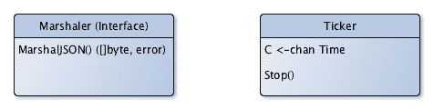
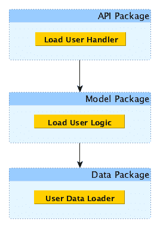
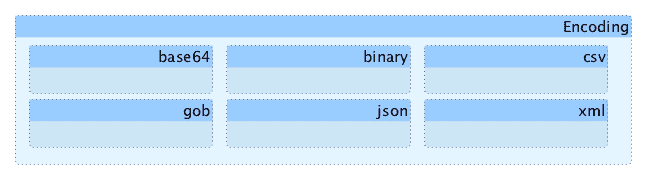
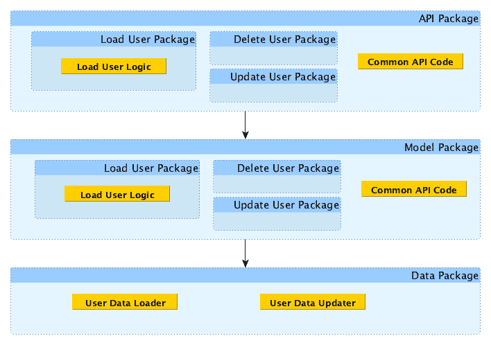
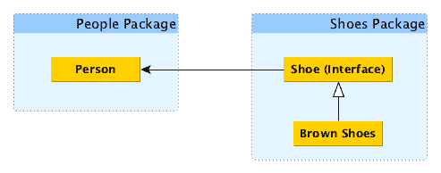
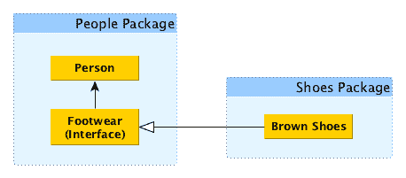

# Go 的 SOLID 设计原则

2002 年，*Robert "Uncle Bob" Martin*出版了《敏捷软件开发，原则，模式和实践》一书，其中他定义了可重用程序的五个原则，他称之为 SOLID 原则。虽然在一个 10 年后发明的编程语言的书中包含这些原则似乎有些奇怪，但这些原则今天仍然是相关的。

在本章中，我们将简要讨论这些原则，它们与**依赖注入**（DI）的关系以及对 Go 意味着什么。SOLID 是五个流行的面向对象软件设计原则的首字母缩写：

+   单一责任原则

+   开闭原则

+   Liskov 替换原则

+   接口隔离原则

+   依赖反转原则

# 技术要求

本章的唯一要求是对对象和接口有基本的了解，并持开放的态度。

本章中的所有代码都可以在[`github.com/PacktPublishing/Hands-On-Dependency-Injection-in-Go/tree/master/ch02`](https://github.com/PacktPublishing/Hands-On-Dependency-Injection-in-Go/tree/master/ch02)找到。

您将在本章结束时的*进一步阅读*部分中找到本章中提到的其他信息和参考链接。

# 单一责任原则（SRP）

“一个类应该有一个，且仅有一个，变化的原因。”

–Robert C. Martin

Go 没有类，但如果我们稍微闭上眼睛，将*类*替换为*对象*（结构，函数，接口或包），那么这个概念仍然适用。

我们为什么希望我们的对象只做一件事？让我们看看一些只做一件事的对象：



这些对象简单易用，用途广泛。

设计对象，使它们只做一件事，在抽象层面上听起来还不错。但你可能会认为为整个系统这样做会增加更多的代码。是的，会增加。但它不会增加复杂性；事实上，它会显著减少复杂性。每段代码会更小，更容易理解，因此更容易测试。这一事实给我们带来了 SRP 的第一个优势：

**SRP 通过将代码分解为更小，更简洁的部分来减少复杂性**

以单一责任原则这样的名字，可以安全地假设它完全是关于责任的，但到目前为止，我们谈论的都是变化。为什么？让我们看一个例子：

```go
// Calculator calculates the test coverage for a directory 
// and it's sub-directories
type Calculator struct {
  // coverage data populated by `Calculate()` method
  data map[string]float64
}

// Calculate will calculate the coverage
func (c *Calculator) Calculate(path string) error {
  // run `go test -cover ./[path]/...` and store the results
  return nil
}

// Output will print the coverage data to the supplied writer
func (c *Calculator) Output(writer io.Writer) {
  for path, result := range c.data {
    fmt.Fprintf(writer, "%s -> %.1f\n", path, result)
  }
}
```

代码看起来合理——一个成员变量和两个方法。但它并不符合 SRP。假设应用程序很成功，我们决定还需要将结果输出到 CSV。我们可以添加一个方法来做到这一点，如下面的代码所示：

```go
// Calculator calculates the test coverage for a directory 
// and it's sub-directories
type Calculator struct {
  // coverage data populated by `Calculate()` method
  data map[string]float64
}

// Calculate will calculate the coverage
func (c *Calculator) Calculate(path string) error {
  // run `go test -cover ./[path]/...` and store the results
  return nil
}

// Output will print the coverage data to the supplied writer
func (c Calculator) Output(writer io.Writer) {
  for path, result := range c.data {
    fmt.Fprintf(writer, "%s -> %.1f\n", path, result)
  }
}

// OutputCSV will print the coverage data to the supplied writer
func (c Calculator) OutputCSV(writer io.Writer) {
  for path, result := range c.data {
    fmt.Fprintf(writer, "%s,%.1f\n", path, result)
  }
}
```

我们已经改变了结构并添加了另一个`Output()`方法。我们为结构添加了更多的责任，在这样做的过程中，我们增加了复杂性。在这个简单的例子中，我们的更改局限于一个方法，因此没有风险破坏以前的代码。然而，随着结构变得越来越大和更加复杂，我们的更改不太可能如此干净。

相反，如果我们将责任分解为`Calculate`和`Output`，那么添加更多的输出只是定义新的结构。此外，如果我们决定不喜欢默认的输出格式，我们可以单独更改它。

让我们尝试不同的实现：

```go
// Calculator calculates the test coverage for a directory 
// and it's sub-directories
type Calculator struct {
  // coverage data populated by `Calculate()` method
  data map[string]float64
}

// Calculate will calculate the coverage
func (c *Calculator) Calculate(path string) error {
  // run `go test -cover ./[path]/...` and store the results
  return nil
}

func (c *Calculator) getData() map[string]float64 {
  // copy and return the map
  return nil
}

type Printer interface {
  Output(data map[string]float64)
}

type DefaultPrinter struct {
  Writer io.Writer
}

// Output implements Printer
func (d *DefaultPrinter) Output(data map[string]float64) {
  for path, result := range data {
    fmt.Fprintf(d.Writer, "%s -> %.1f\n", path, result)
  }
}

type CSVPrinter struct {
  Writer io.Writer
}

// Output implements Printer
func (d *CSVPrinter) Output(data map[string]float64) {
```

```go
for path, result := range data {
    fmt.Fprintf(d.Writer, "%s,%.1f\n", path, result)
  }
}
```

你有没有注意到打印机有什么显著的地方？它们与计算完全没有任何连接。它们可以用于相同格式的任何数据。这导致了 SRP 的第二个优势：

**SRP 增加了代码的潜在可重用性**。

在我们的覆盖率计算器的第一个实现中，要测试`Output()`方法，我们首先要调用`Calculate()`方法。这种方法通过将计算与输出耦合，增加了我们测试的复杂性。考虑以下情景：

+   我们如何测试没有结果？

+   我们如何测试边缘条件，比如 0%或 100%的覆盖率？

在解耦这些职责之后，我们应该鼓励自己以更少的相互依赖方式考虑每个部分的输入和输出，从而使得测试更容易编写和维护。这导致了 SRP 的第三个优势：

**SRP 使测试更简单，更易于维护**。

SRP 也是提高代码可读性的绝佳方式。看下面的例子：

```go
func loadUserHandler(resp http.ResponseWriter, req *http.Request) {
  err := req.ParseForm()
  if err != nil {
    resp.WriteHeader(http.StatusInternalServerError)
    return
  }
  userID, err := strconv.ParseInt(req.Form.Get("UserID"), 10, 64)
  if err != nil {
    resp.WriteHeader(http.StatusPreconditionFailed)
    return
  }

  row := DB.QueryRow("SELECT * FROM Users WHERE ID = ?", userID)

  person := &Person{}
  err = row.Scan(&person.ID, &person.Name, &person.Phone)
  if err != nil {
    resp.WriteHeader(http.StatusInternalServerError)
    return
  }

  encoder := json.NewEncoder(resp)
  encoder.Encode(person)
}
```

我敢打赌你花了超过五秒钟才理解。那么这段代码呢？

```go
func loadUserHandler(resp http.ResponseWriter, req *http.Request) {
  userID, err := extractIDFromRequest(req)
  if err != nil {
    resp.WriteHeader(http.StatusPreconditionFailed)
    return
  }

  person, err := loadPersonByID(userID)
  if err != nil {
    resp.WriteHeader(http.StatusInternalServerError)
    return
  }

  outputPerson(resp, person)
}
```

通过在函数级别应用 SRP，我们减少了函数的膨胀并增加了其可读性。函数的单一责任现在是协调对其他函数的调用。

# 这与 DI 有什么关系？

在对我们的代码应用 DI 时，我们不奇怪地注入我们的依赖，通常以函数参数的形式。如果你看到一个函数有很多注入的依赖，这很可能是该方法做了太多事情的迹象。

此外，应用 SRP 将指导我们的对象设计。因此，这有助于我们确定何时以及在哪里使用 DI。

# 这对 Go 意味着什么？

在第一章中，*永远不要停止追求更好*，我们提到了 Go 与 Unix 哲学的关系，即我们应该*设计代码只做一件事，但要做得很好，并且与其他代码很好地协同工作*。应用 SRP 后，我们的对象将完全符合这一原则。

# Go 接口、结构和函数

在接口和结构级别应用 SRP 会产生许多小接口。符合 SRP 的函数输入少，代码相当短（即不到一屏的代码）。这两个特点本质上解决了我们在第一章中提到的代码膨胀问题。

通过解决代码膨胀问题，我们发现 SRP 的一个不太被宣传的优势是它使代码更容易理解。简而言之，当一段代码只做一件事时，它的目的更加清晰。

在对现有代码应用 SRP 时，通常会将代码分解为更小的部分。由于你可能觉得自己可能需要编写更多的测试，因此你可能会自然而然地对此产生厌恶。在将结构或接口拆分为多个部分的情况下，这可能是真的。然而，如果你正在重构的代码具有高单元测试覆盖率，那么你可能已经拥有许多你需要的测试。它们只需要稍微移动一下。

另一方面，当将 SRP 应用于函数以减少膨胀时，不需要新的测试；原始函数的测试是完全可以接受的。让我们看一个对我们的`loadUserHandler()`的测试的例子，这在前面的例子中已经展示过了：

```go
func TestLoadUserHandler(t *testing.T) {
   // build request
   req := &http.Request{
      Form: url.Values{},
   }
   req.Form.Add("UserID", "1234")

   // call function under test
   resp := httptest.NewRecorder()
   loadUserHandler(resp, req)

   // validate result
   assert.Equal(t, http.StatusOK, resp.Code)

   expectedBody := `{"ID":1,"Name":"Bob","Phone":"0123456789"}` + "\n"
   assert.Equal(t, expectedBody, resp.Body.String())
}
```

这个测试可以应用于我们函数的任何形式，并且会达到相同的效果。在这种情况下，我们正在重构以提高可读性，我们不希望有任何事情阻止我们这样做。此外，从 API（公共方法或其他函数调用的函数）进行测试更加稳定，因为 API 合同不太可能改变，而内部实现可能会改变。

# Go 包

在包级别应用 SRP 可能更难。系统通常是分层设计的。例如，通常会看到一个按以下方式排列层的 HTTP REST 服务：



这些抽象很好而且清晰；然而，当我们的服务有多个端点时，问题开始出现。我们很快就会得到充满完全无关逻辑的庞大包。另一方面，良好的包应该是小巧、简洁且目的明确的。

找到正确的抽象可能很困难。通常，当我需要灵感时，我会求助于专家，并检查标准的 Go 库。例如，让我们来看看`encoding`包：



正如您所看到的，每种不同类型都整齐地组织在自己的包中，但所有的包仍然按父目录逻辑分组。我们的 REST 服务将按照下图所示进行拆分：



我们最初的抽象是正确的，只是从太高的层次开始。

`encoding`包的另一个不明显的方面是共享代码位于父包中。在开发功能时，程序员通常会想到*我需要我之前写的那段代码*，并且会被诱惑将代码提取到`commons`或`utils`包中。请抵制这种诱惑——重用代码是绝对正确的，但您应该抵制通用包名称的诱惑。这样的包本质上违反了 SRP，因为它们没有明确的目的。

另一个常见的诱惑是将新代码添加到现有代码旁边。让我们想象一下，我们正在编写先前提到的`encoding`包，我们制作的第一个编码器是 JSON 编码器。接下来，我们添加了 GobEncoder，一切都进行得很顺利。再添加几个编码器，突然间我们有了一个大量代码和大量导出 API 的实质性包。在某个时候，我们的`encoding`包的文档变得如此之长，以至于用户很难跟踪。同样地，我们的包中有如此多的代码，以至于我们的扩展和调试工作变慢，因为很难找到东西。

SRP 帮助我们确定更改的原因；多个更改原因表示多个责任。解耦这些责任使我们能够开发更好的抽象。

如果您有时间或意愿从一开始就做正确，那太棒了。然而，从一开始应用 SRP 并找到正确的抽象是困难的。您可以通过首先打破规则，然后使用后续更改来发现软件希望如何发展，以此作为重构的基础。

# 开闭原则（OCP）

"软件实体（类、模块、函数等）应该对扩展开放，对修改关闭。"

- Bertrand Meyer

术语*开放*和*封闭*在讨论软件工程时并不是我经常听到的，所以也许需要做一些解释。

开放意味着我们应该能够通过添加新的行为和功能来扩展或调整代码。封闭意味着我们应该避免对现有代码进行更改，这些更改可能导致错误或其他类型的退化。

这两个特征可能看起来矛盾，但缺失的是范围。当谈论开放时，我们指的是软件的设计或结构。从这个角度来看，开放意味着很容易添加新的包、新的接口或现有接口的新实现。

当我们谈论封闭时，我们指的是现有的代码，以及最小化我们对其进行的更改，特别是被他人使用的 API。这带我们来到 OCP 的第一个优势：

**OCP 有助于减少增加和扩展的风险**

您可以将 OCP 视为一种风险缓解策略。修改现有代码总是存在一定的风险，尤其是对他人使用的代码进行更改。虽然我们可以通过单元测试来保护自己免受这种风险，但这些测试仅限于我们打算的场景和我们可以想象到的误用；它们不会涵盖我们的用户可能想出的一切。

以下代码不遵循 OCP：

```go
func BuildOutput(response http.ResponseWriter, format string, person Person) {
  var err error

  switch format {
  case "csv":
    err = outputCSV(response, person)

  case "json":
    err = outputJSON(response, person)
  }

  if err != nil {
    // output a server error and quit
    response.WriteHeader(http.StatusInternalServerError)
    return
  }

  response.WriteHeader(http.StatusOK)
}
```

第一个提示出现在`switch`语句中。很容易想象情况会发生变化，我们可能需要添加或甚至删除输出格式。

如果我们需要添加另一个格式，需要改变多少？请看下面：

+   **我们需要在`switch`中添加另一个 case 条件**：这个方法已经有 18 行长了；在我们无法在一个屏幕上看到所有内容之前，我们需要添加多少个格式？这个`switch`语句还存在于多少其他地方？它们也需要更新吗？

+   **我们需要编写另一个格式化函数**：这是三个不可避免的变化之一

+   **方法的调用者必须更新以使用新格式**：这是另一个不可避免的变化

+   **我们需要添加另一组测试场景以匹配新的格式**：这也是不可避免的；然而，这里的测试可能会比仅测试独立格式化要长

开始作为*一个小而简单的改变*，现在开始感觉比我们预期的更艰难和风险。

让我们用一个抽象替换格式输入参数和`switch`语句，如下所示：

```go
func BuildOutput(response http.ResponseWriter, formatter PersonFormatter, person Person) {
  err := formatter.Format(response, person)
  if err != nil {
    // output a server error and quit
    response.WriteHeader(http.StatusInternalServerError)
    return
  }

  response.WriteHeader(http.StatusOK)
}
```

这次有多少变化？让我们看看：

+   我们需要定义`PersonFormatter`接口的另一个实现

+   方法的调用者必须更新以使用新格式

+   我们必须为新的`PersonFormatter`编写测试场景

这好多了：我们只剩下三个不可避免的变化，*而主要函数根本没有改变*。这向我们展示了 OCP 的第二个优势：

**OCP 可以帮助减少添加或删除功能所需的更改数量**。

此外，如果在添加新格式化程序后，新结构中出现了错误，那么错误只会出现在一个地方——新代码中。这是 OCP 的第三个优势：

**OCP 将错误的局部性缩小到仅限于新代码及其使用**。

让我们看另一个例子，我们不会应用 DI：

```go
func GetUserHandlerV1(resp http.ResponseWriter, req *http.Request) {
  // validate inputs
  err := req.ParseForm()
  if err != nil {
    resp.WriteHeader(http.StatusInternalServerError)
    return
  }
  userID, err := strconv.ParseInt(req.Form.Get("UserID"), 10, 64)
  if err != nil {
    resp.WriteHeader(http.StatusPreconditionFailed)
    return
  }

  user := loadUser(userID)
  outputUser(resp, user)
}

func DeleteUserHandlerV1(resp http.ResponseWriter, req *http.Request) {
  // validate inputs
  err := req.ParseForm()
  if err != nil {
    resp.WriteHeader(http.StatusInternalServerError)
    return
  }
  userID, err := strconv.ParseInt(req.Form.Get("UserID"), 10, 64)
  if err != nil {
    resp.WriteHeader(http.StatusPreconditionFailed)
    return
  }

  deleteUser(userID)
}
```

正如您所看到的，我们的 HTTP 处理程序都是从表单中提取数据，然后将其转换为数字。有一天，我们决定加强输入验证，并确保数字是正数。可能的结果？一些相当恶劣的霰弹手术。然而，在这种情况下，没有其他办法。我们搞砸了；现在我们需要清理。修复方法显而易见——将重复的逻辑提取到一个地方，然后在那里添加新的验证，如下面的代码所示：

```go
func GetUserHandlerV2(resp http.ResponseWriter, req *http.Request) {
  // validate inputs
  err := req.ParseForm()
  if err != nil {
    resp.WriteHeader(http.StatusInternalServerError)
    return
  }
  userID, err := extractUserID(req.Form)
  if err != nil {
    resp.WriteHeader(http.StatusPreconditionFailed)
    return
  }

  user := loadUser(userID)
  outputUser(resp, user)
}

func DeleteUserHandlerV2(resp http.ResponseWriter, req *http.Request) {
  // validate inputs
  err := req.ParseForm()
  if err != nil {
    resp.WriteHeader(http.StatusInternalServerError)
    return
  }
  userID, err := extractUserID(req.Form)
  if err != nil {
    resp.WriteHeader(http.StatusPreconditionFailed)
    return
  }

  deleteUser(userID)
}
```

遗憾的是，原始代码并没有减少，但肯定更容易阅读。除此之外，我们已经未来证明了对`UserID`字段验证的任何进一步更改。

对于我们的两个例子，满足 OCP 的关键是找到正确的抽象。

# 这与 DI 有什么关系？

在第一章中，*永远不要停止追求更好*，我们将 DI 定义为*以依赖于抽象的方式编码*。通过使用 OCP，我们可以发现更清晰和更持久的抽象。

# 这对 Go 意味着什么？

通常，在讨论 OCP 时，示例中充斥着抽象类、继承、虚函数和 Go 没有的各种东西。还是有吗？

抽象类到底是什么？它实际上试图实现什么？

它试图提供一个用于多个实现之间共享代码的地方。我们可以在 Go 中做到这一点——这就是**组合**。您可以在下面的代码中看到它的工作：

```go
type rowConverter struct {
}

// populate the supplied Person from *sql.Row or *sql.Rows object
func (d *rowConverter) populate(in *Person, scan func(dest ...interface{}) error) error {
  return scan(in.Name, in.Email)
}

type LoadPerson struct {
  // compose the row converter into this loader
  rowConverter
}

func (loader *LoadPerson) ByID(id int) (Person, error) {
  row := loader.loadFromDB(id)

  person := Person{}
  // call the composed "abstract class"
  err := loader.populate(&person, row.Scan)

  return person, err
}

type LoadAll struct {
  // compose the row converter into this loader
  rowConverter
}

func (loader *LoadPerson) All() ([]Person, error) {
  rows := loader.loadAllFromDB()
  defer rows.Close()

  output := []Person{}
  for rows.Next() {
    person := Person{}

    // call the composed "abstract class"
    err := loader.populate(&person, rows.Scan)
    if err != nil {
      return nil, err
    }
  }

  return output, nil
}
```

在前面的例子中，我们将一些共享逻辑提取到`rowConverter`结构中。然后，通过将该结构嵌入其他结构中，我们可以在不进行任何更改的情况下使用它。我们已经实现了抽象类和 OCP 的目标。我们的代码是开放的；我们可以随意嵌入，但是封闭的。嵌入的类不知道自己被嵌入，也不需要进行任何更改就可以使用。

早些时候，我们将*封闭*定义为保持不变，但范围仅限于 API 的部分被导出或被他人使用。我们不能期望内部实现细节，包括私有成员变量，永远不会改变。实现这一点的最佳方法是隐藏这些实现细节。这就是**封装**。

在包级别上，封装很简单：我们将其设为私有。在这里的一个很好的经验法则是，将所有东西都设为私有，只有在真正需要时才将其设为公共。再次，我的理由是风险和工作的避免。一旦你导出了某些东西，就意味着有人可能依赖它。一旦他们依赖它，它就应该变成封闭的；你必须维护它，任何更改都有更高的风险会破坏某些东西。通过适当的封装，包内的更改应该对现有用户是不可见的。

在对象级别上，私有并不意味着在其他语言中的意思，所以我们必须学会自律。访问私有成员变量会使对象紧密耦合，这个决定将会给我们带来麻烦。

我最喜欢 Go 类型系统的一个特性是能够将方法附加到几乎任何东西上。比如说，你正在为健康检查编写一个 HTTP 处理程序。它只是返回状态`204`（无内容）。我们需要满足的接口如下：

```go
type Handler interface {
   ServeHTTP(ResponseWriter, *Request)
}
```

一个简单的实现可能如下所示的代码：

```go
// a HTTP health check handler in long form
type healthCheck struct {
}

func (h *healthCheck) ServeHTTP(resp http.ResponseWriter, _ *http.Request) {
   resp.WriteHeader(http.StatusNoContent)
}

func healthCheckUsage() {
   http.Handle("/health", &healthCheckLong{})
}
```

我们可以创建一个新的结构来实现一个接口，但这至少需要五行。我们可以将其减少到三行，如下所示的代码：

```go
// a HTTP health check handler in short form
func healthCheck(resp http.ResponseWriter, _ *http.Request) {
  resp.WriteHeader(http.StatusNoContent)
}

func healthCheckUsage() {
  http.Handle("/health", http.HandlerFunc(healthCheck))
}
```

在这种情况下，秘密酱汁隐藏在标准库中。我们将我们的函数转换为`http.HandlerFunc`类型，它附加了一个`ServeHTTP`方法。这个巧妙的小技巧使我们很容易满足`http.Handler`接口。正如我们在本章中已经看到的，朝着接口的方向前进会使我们的代码更少耦合，更容易维护和扩展。

# 里斯科夫替换原则（LSP）

“如果对于类型为 S 的每个对象 o1，都有类型为 T 的对象 o2，使得对于所有以 T 定义的程序 P，当 o1 替换 o2 时，P 的行为不变，则 S 是 T 的子类型。”

-芭芭拉·里斯科夫

读了三遍之后，我仍然不确定我是否理解正确。幸运的是，罗伯特 C.马丁为我们总结了如下：

“子类型必须可以替换其基类型。”

-罗伯特 C.马丁

我能理解这一点。然而，他是不是又在谈论抽象类了？可能是。正如我们在 OCP 部分看到的，虽然 Go 没有抽象类或继承，但它确实有组合和接口实现。

让我们退后一步，看看这个原则的动机。LSP 要求*子类型可以相互替换*。我们可以使用 Go 接口，这将始终成立。

但是等等，这段代码怎么样：

```go
func Go(vehicle actions) {
  if sled, ok := vehicle.(*Sled); ok {
    sled.pushStart()
  } else {
    vehicle.startEngine()
  }

  vehicle.drive()
}

type actions interface {
  drive()
  startEngine()
}

type Vehicle struct {
}

func (v Vehicle) drive() {
  // TODO: implement
}

func (v Vehicle) startEngine() {
  // TODO: implement
}

func (v Vehicle) stopEngine() {
  // TODO: implement
}

type Car struct {
  Vehicle
}

type Sled struct {
  Vehicle
}

func (s Sled) startEngine() {
  // override so that is does nothing
}

func (s Sled) stopEngine() {
  // override so that is does nothing
}

func (s Sled) pushStart() {
  // TODO: implement
}
```

它使用了一个接口，但显然违反了 LSP。我们可以通过添加更多接口来修复这个问题，如下所示的代码：

```go
func Go(vehicle actions) {
   switch concrete := vehicle.(type) {
   case poweredActions:
      concrete.startEngine()

   case unpoweredActions:
      concrete.pushStart()
   }

   vehicle.drive()
}

type actions interface {
   drive()
}

type poweredActions interface {
   actions
   startEngine()
   stopEngine()
}

type unpoweredActions interface {
   actions
   pushStart()
}

type Vehicle struct {
}

func (v Vehicle) drive() {
   // TODO: implement
}

type PoweredVehicle struct {
   Vehicle
}

func (v PoweredVehicle) startEngine() {
   // common engine start code
}

type Car struct {
   PoweredVehicle
}

type Buggy struct {
   Vehicle
}

func (b Buggy) pushStart() {
   // do nothing
}
```

然而，这并不是更好的。这段代码仍然有异味，这表明我们可能使用了错误的抽象或错误的组合。让我们再试一次重构：

```go
func Go(vehicle actions) {
  vehicle.start()
  vehicle.drive()
}

type actions interface {
  start()
  drive()
}

type Car struct {
  poweredVehicle
}

func (c Car) start() {
  c.poweredVehicle.startEngine()
}

func (c Car) drive() {
  // TODO: implement
}

type poweredVehicle struct {
}

func (p poweredVehicle) startEngine() {
  // common engine start code
}

type Buggy struct {
}

func (b Buggy) start() {
  // push start
}

func (b Buggy) drive() {
  // TODO: implement
}
```

这样好多了。`Buggy`短语不再被迫实现毫无意义的方法，也不包含任何它不需要的逻辑，两种车辆类型的使用都很干净。这展示了 LSP 的一个关键点：

**LSP 指的是行为而不是实现**。

一个对象可以实现任何它喜欢的接口，但这并不意味着它在行为上与同一接口的其他实现是一致的。看看下面的代码：

```go
type Collection interface {
   Add(item interface{})
   Get(index int) interface{}
}

type CollectionImpl struct {
   items []interface{}
}

func (c *CollectionImpl) Add(item interface{}) {
   c.items = append(c.items, item)
}

func (c *CollectionImpl) Get(index int) interface{} {
   return c.items[index]
}

type ReadOnlyCollection struct {
   CollectionImpl
}

func (ro *ReadOnlyCollection) Add(item interface{}) {
   // intentionally does nothing
}
```

在前面的例子中，我们通过实现所有方法来满足 API 合同，但我们将不需要的方法转换为 NO-OP。通过让我们的`ReadOnlyCollection`实现`Add()`方法，它满足了接口，但引入了混乱的可能性。当你有一个接受`Collection`的函数时会发生什么？当你调用`Add()`时，你会期望发生什么？

在这种情况下，修复方法可能会让你感到惊讶。我们可以将关系反转，而不是将`MutableCollection`转换为`ImmutableCollection`，如下面的代码所示：

```go
type ImmutableCollection interface {
   Get(index int) interface{}
}

type MutableCollection interface {
   ImmutableCollection
   Add(item interface{})
}

type ReadOnlyCollectionV2 struct {
   items []interface{}
}

func (ro *ReadOnlyCollectionV2) Get(index int) interface{} {
   return ro.items[index]
}

type CollectionImplV2 struct {
   ReadOnlyCollectionV2
}

func (c *CollectionImplV2) Add(item interface{}) {
   c.items = append(c.items, item)
}
```

这种新结构的一个好处是，我们现在可以让编译器确保我们不会在需要`MutableCollection`的地方使用`ImmutableCollection`。

# 这与 DI 有什么关系？

通过遵循 LSP，我们的代码在注入的依赖关系不同的情况下表现一致。另一方面，违反 LSP 会导致我们违反 OCP。这些违规行为使我们的代码对实现有太多的了解，从而打破了注入依赖的抽象。

# 这对 Go 有什么意义？

在使用组合，特别是未命名变量形式来满足接口时，LSP 的应用方式与面向对象语言中的应用方式一样。

在实现接口时，我们可以利用 LSP 对*一致的*行为的关注，作为检测与不正确的抽象相关的代码异味的一种方式。

# 接口隔离原则（ISP）

“客户端不应被强迫依赖他们不使用的方法。”

–Robert C. Martin

就我个人而言，我更喜欢一个更直接的定义——*接口应该被减少到可能的最小尺寸*。

让我们首先讨论为什么臃肿的接口可能是一件坏事。臃肿的接口有更多的方法，因此可能更难理解。它们也需要更多的工作来使用，无论是通过实现、模拟还是存根。

臃肿的接口表明更多的责任，正如我们在 SRP 中看到的，一个对象承担的责任越多，它就越有可能想要改变。如果接口发生变化，它会通过所有的用户产生连锁反应，违反 OCP 并引起大量的散弹手术。这是 ISP 的第一个优势：

**ISP 要求我们定义薄接口**

对于许多程序员来说，他们的自然倾向是向现有接口添加内容，而不是定义一个新的接口，从而创建一个臃肿的接口。这导致了一种情况，即有时候，实现变得与接口的用户紧密耦合。这种耦合使得接口、它们的实现和用户更加抵制变化。考虑以下例子：

```go
type FatDbInterface interface {
   BatchGetItem(IDs ...int) ([]Item, error)
   BatchGetItemWithContext(ctx context.Context, IDs ...int) ([]Item, error)

   BatchPutItem(items ...Item) error
   BatchPutItemWithContext(ctx context.Context, items ...Item) error

   DeleteItem(ID int) error
   DeleteItemWithContext(ctx context.Context, item Item) error

   GetItem(ID int) (Item, error)
   GetItemWithContext(ctx context.Context, ID int) (Item, error)

   PutItem(item Item) error
   PutItemWithContext(ctx context.Context, item Item) error

   Query(query string, args ...interface{}) ([]Item, error)
   QueryWithContext(ctx context.Context, query string, args ...interface{}) ([]Item, error)

   UpdateItem(item Item) error
   UpdateItemWithContext(ctx context.Context, item Item) error
}

type Cache struct {
   db FatDbInterface
}

func (c *Cache) Get(key string) interface{} {
   // code removed

   // load from DB
   _, _ = c.db.GetItem(42)

   // code removed
   return nil
}

func (c *Cache) Set(key string, value interface{}) {
   // code removed

   // save to DB
   _ = c.db.PutItem(Item{})

   // code removed
}
```

很容易想象所有这些方法都属于一个结构。例如`GetItem()`和`GetItemWithContext()`这样的方法对很可能共享大部分，如果不是全部相同的代码。另一方面，使用`GetItem()`的用户不太可能也会使用`GetItemWithContext()`。对于这种特定的用例，一个更合适的接口应该是以下这样的：

```go
type myDB interface {
   GetItem(ID int) (Item, error)
   PutItem(item Item) error
}

type CacheV2 struct {
   db myDB
}

func (c *CacheV2) Get(key string) interface{} {
   // code removed

   // load from DB
   _, _ = c.db.GetItem(42)

   // code removed
   return nil
}

func (c *CacheV2) Set(key string, value interface{}) {
   // code removed

   // save from DB
   _ = c.db.PutItem(Item{})

   // code removed
}
```

利用这个新的薄接口，使函数签名更加明确和灵活。这带来了 ISP 的第二个优势：

**ISP 导致明确的输入**。

薄接口也更容易更完全地实现，使我们远离与 LSP 相关的潜在问题。

在使用接口作为输入并且接口需要臃肿的情况下，这是方法违反 SRP 的一个有力指示。考虑以下代码：

```go
func Encrypt(ctx context.Context, data []byte) ([]byte, error) {
   // As this operation make take too long, we need to be able to kill it
   stop := ctx.Done()
   result := make(chan []byte, 1)

   go func() {
      defer close(result)

      // pull the encryption key from context
      keyRaw := ctx.Value("encryption-key")
      if keyRaw == nil {
         panic("encryption key not found in context")
      }
      key := keyRaw.([]byte)

      // perform encryption
      ciperText := performEncryption(key, data)

      // signal complete by sending the result
      result <- ciperText
   }()

   select {
   case ciperText := <-result:
      // happy path
      return ciperText, nil

   case <-stop:
      // cancelled
      return nil, errors.New("operation cancelled")
   }
}
```

你看到问题了吗？我们正在使用`context`接口，这是很棒并且强烈推荐的，但我们正在违反 ISP。作为务实的程序员，我们可以争辩说这个接口被广泛使用和理解，定义我们自己的接口来将其减少到我们需要的两种方法是不必要的。在大多数情况下，我会同意，但在这种特殊情况下，我们应该重新考虑。我们在这里使用`context`接口有两个完全不同的目的。第一个是控制通道，允许我们提前停止或超时任务，第二个是提供一个值。实际上，我们在这里使用`context`违反了 SRP，并且因此存在潜在的混淆风险，并且导致更大的变更阻力。

如果我们决定不在请求级别上使用停止通道模式，而是在应用级别上使用，会发生什么？如果键值不在`context`中，而是来自其他来源会发生什么？通过应用 ISP，我们可以将关注点分离为两个接口，如下面的代码所示：

```go
type Value interface {
   Value(key interface{}) interface{}
}

type Monitor interface {
   Done() <-chan struct{}
}

func EncryptV2(keyValue Value, monitor Monitor, data []byte) ([]byte, error) {
   // As this operation make take too long, we need to be able to kill it
   stop := monitor.Done()
   result := make(chan []byte, 1)

   go func() {
      defer close(result)

      // pull the encryption key from Value
      keyRaw := keyValue.Value("encryption-key")
      if keyRaw == nil {
         panic("encryption key not found in context")
      }
      key := keyRaw.([]byte)

      // perform encryption
      ciperText := performEncryption(key, data)

      // signal complete by sending the result
      result <- ciperText
   }()

   select {
   case ciperText := <-result:
      // happy path
      return ciperText, nil

   case <-stop:
      // cancelled
      return nil, errors.New("operation cancelled")
   }
}
```

我们的函数现在符合 ISP，并且两个输入可以分别自由演化。但是这个函数的用户会发生什么？他们必须停止使用`context`吗？绝对不是。该方法可以如下所示调用：

```go
// create a context
ctx, cancel := context.WithCancel(context.Background())
defer cancel()

// store the key
ctx = context.WithValue(ctx, "encryption-key", "-secret-")

// call the function
_, _ = EncryptV2(ctx, ctx, []byte("my data"))
```

重复使用`context`作为参数可能会感觉有点奇怪，但正如你所看到的，这是有充分理由的。这将我们带到了 ISP 的最后一个优势：

**ISP 有助于将输入与其具体实现解耦，使它们能够分别演化**。

# 这与 DI 有什么关系？

正如我们所看到的，ISP 帮助我们将接口分解为逻辑上的独立部分，每个部分提供特定的功能——有时被称为角色接口的概念。通过在我们的 DI 中利用这些角色接口，我们的代码与输入的具体实现解耦。

这种解耦不仅允许代码的各个部分分别演化，而且往往更容易识别测试向量。在前面的例子中，逐个扫描输入并考虑它们可能的值和状态更容易。这个过程可能会导致一个类似下面的向量列表：

** *value* 输入的测试向量包括**：

+   **正常路径**：返回一个有效值

+   **错误路径**：返回一个空值

** *monitor* 输入的测试向量包括**：

+   **正常路径**：不返回完成信号

+   **错误路径**：立即返回完成信号

# 这对 Go 意味着什么？

在第一章中，我们提到了由*Jack Lindamood*创造的流行 Go 成语——*接受接口，返回结构体*。将这个想法与 ISP 结合起来，事情就开始起飞了。由此产生的函数对其需求非常简洁，同时对其输出也非常明确。在其他语言中，我们可能需要以抽象的形式定义输出，或者创建适配器类来完全解耦我们的函数和用户。然而，由于 Go 支持隐式接口，这是不需要的。

隐式接口是一种语言特性，实现者（即结构体）不需要定义它实现的接口，而只需要定义适当的方法来满足接口，如下面的代码所示：

```go
type Talker interface {
   SayHello() string
}

type Dog struct{}

// The method implicitly implements the Talker interface
func (d Dog) SayHello() string {
   return "Woof!"
}

func Speak() {
   var talker Talker
   talker = Dog{}

   fmt.Print(talker.SayHello())
}
```

这可能看起来像一个简洁的技巧，而且确实是。但这并不是使用它的唯一原因。当使用显式接口时，实现对象与其依赖对象之间存在一定的耦合，因为它们之间有一个相当明确的链接。然而，也许最重要的原因是简单性。让我们来看一下 Go 中最流行的接口之一，你可能从未听说过的：

```go
// Stringer is implemented by any value that has a String method, which 
// defines the “native” format for that value. The String method is used 
// to print values passed as an operand to any format that accepts a 
// string or to an unformatted printer such as Print.
type Stringer interface {
    String() string
}
```

这个接口可能看起来并不令人印象深刻，但`fmt`包支持这个接口的事实使你能够做到以下几点：

```go
func main() {
  kitty := Cat{}

  fmt.Printf("Kitty %s", kitty)
}

type Cat struct{}

// Implicitly implement the fmt.Stringer interface
func (c Cat) String() string {
  return "Meow!"
}
```

如果我们有显式接口，想象一下我们将不得不声明我们实现`Stringer`多少次。也许在 Go 中，隐式接口给我们带来的最大优势是当它们与 ISP 和 DI 结合使用时。这三者的结合允许我们定义输入接口，这些接口很薄，特定于特定用例，并且与其他所有内容解耦，就像我们在`Stringer`接口中看到的那样。

此外，在使用的包中定义接口会缩小对工作在一段代码上所需的知识范围，从而使理解和测试变得更加容易。

# 依赖反转原则（DIP）

“高级模块不应依赖于低级模块。两者都应依赖于抽象。抽象不应依赖于细节。细节应依赖于抽象”

-罗伯特 C.马丁

你有没有发现自己站在鞋店里犹豫是买棕色还是黑色的鞋子，然后回家后后悔自己的选择？不幸的是，一旦你买了它们，它们就是你的了。针对具体实现进行编程也是一样的：一旦你选择了，你就被困住了，退款和重构都不管用。但为什么要选择，当你不必选择？看看下图中显示的关系：


不太灵活，是吧？让我们将关系转换为抽象：



好多了。一切都只依赖于干净的抽象，满足 LSP 和 ISP。这些包简洁明了，愉快地满足 SRP。代码甚至*似乎*满足*Robert C*. *Martin*对 DIP 的描述，但遗憾的是，它并没有。中间那个讨厌的词，反转。

在我们的例子中，`Shoes`包拥有`Shoe`接口，这是完全合理的。然而，当需求发生变化时就会出现问题。对`Shoes`包的更改可能会导致`Shoe`接口发生变化。这将进而要求`Person`对象发生变化。我们添加到`Shoe`接口的任何新功能可能不需要或与`Person`对象无关。因此，`Person`对象仍然与`Shoe`包耦合。

为了完全打破这种耦合，我们需要将关系从**Person**使用 Shoe 更改为**Person**需要**Footwear**，就像这样：



这里有两个关键点。首先，DIP 迫使我们专注于抽象的所有权。在我们的例子中，这意味着将接口移动到使用它的包中，并将关系从*uses*更改为*requires*；这是一个微妙的区别，但很重要。

其次，DIP 鼓励我们将使用要求与实现解耦。在我们的例子中，我们的`Brown Shoes`对象实现了`Footwear`，但很容易想象有更多的实现，有些甚至可能不是鞋子。

# 这与 DI 有什么关系？

依赖反转很容易被误解为依赖注入，包括我在内的许多人长期以来都认为它们是等价的。但正如我们所见，依赖反转关注的是依赖项的抽象定义的所有权，而 DI 则专注于使用这些抽象。

通过将 DIP 与 DI 结合应用，我们最终得到了非常良好解耦的包，这些包非常容易理解、易于扩展和简单测试。

# 这对 Go 意味着什么？

我们之前已经讨论过 Go 对隐式接口的支持，以及我们如何利用它在同一个包中将我们的依赖项定义为接口，而不是从另一个包导入接口。这种方法就是 DIP。

也许你内心的怀疑者正在疯狂地大喊，“但这意味着我到处都要定义接口！”是的，这可能是真的。这甚至可能导致一些重复。然而，你会发现，没有依赖倒置的情况下你定义的接口会更加臃肿和难以控制，这个事实将会在未来给你带来更多的工作成本。

应用 DIP 后，你不太可能遇到任何循环依赖的问题。事实上，你几乎肯定会发现你的代码中导入的数量显著减少，你的依赖图变得相当扁平。事实上，许多包只会被`main`包导入。

# 总结

在这个对 SOLID 设计原则的简要介绍中，我们了解到它们不仅适用于 DI，还适用于 Go。在本书第二部分对各种 DI 方法的讨论中，我们将经常引用这些原则。

在下一章中，我们将继续研究应该在你学习和尝试新技术时放在首要位置的编码方面。我还会向你介绍一些方便的工具，让你的编码生活变得更加轻松。

# 问题

1.  单一职责原则如何改进 Go 代码？

1.  开闭原则如何改进 Go 代码？

1.  里斯科夫替换原则如何改进 Go 代码？

1.  接口隔离原则如何改进 Go 代码？

1.  依赖倒置原则如何改进 Go 代码？

1.  依赖倒置与依赖注入有何不同？

# 进一步阅读

Packt 还有许多其他关于学习 SOLID 原则的优秀资源：

+   [`www.packtpub.com/mapt/book/application_development/9781787121300/1`](https://www.packtpub.com/mapt/book/application_development/9781787121300/1)

+   [`www.packtpub.com/mapt/book/application_development/9781785884375/10/ch10lvl1sec50/the-solid-principles`](https://www.packtpub.com/mapt/book/application_development/9781785884375/10/ch10lvl1sec50/the-solid-principles)

+   [`www.packtpub.com/mapt/book/application_development/9781785280832/8`](https://www.packtpub.com/mapt/book/application_development/9781785280832/8)
