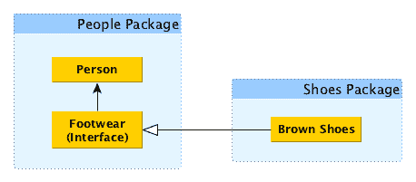
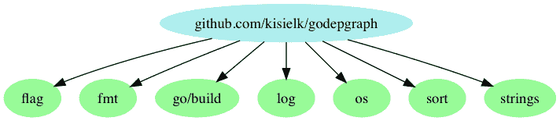
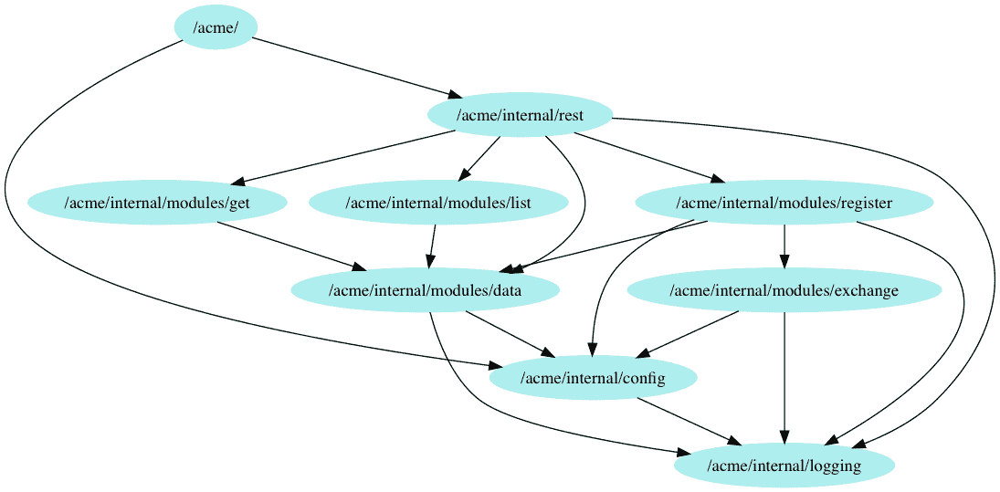
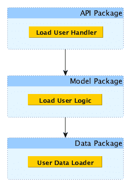

# 为用户体验编码

在本章中，我们将研究编程中经常被忽视但有价值的几个方面，主要是测试、用户体验和依赖图。虽然这些主题可能看起来与**依赖注入**（DI）没有任何关系，但它们被包含在内是为了给你一个坚实但务实的基础，以便你可以评估本书第二部分的技术。

本章将涵盖以下主题：

+   为人类进行优化

+   一个名为*单元测试*的安全保障。

+   测试诱发的损害

+   使用 Godepgraph 可视化您的包依赖关系

# 发现良好的用户体验

良好的用户体验不需要被推测。它也不需要从一些有经验的大师那里传授。事实上，经验的问题在于，今天对你来说容易、简单和明显的东西与上个月、去年或你刚开始时大不相同。

通过逻辑、坚持和实践可以发现良好的 UX。要找出对于你的用户来说良好的 UX 是什么样的，你可以应用我的 UX 发现调查。

问问自己以下四个问题：

+   谁是用户？

+   你的用户有什么能力？

+   用户为什么想要使用你的代码？

+   你的用户希望如何使用它？

# 技术要求

对于本章，你需要对 Go 有基本的了解。

本章中的所有代码都可以在[`github.com/PacktPublishing/Hands-On-Dependency-Injection-in-Go/tree/master/ch03`](https://github.com/PacktPublishing/Hands-On-Dependency-Injection-in-Go/tree/master/ch03)找到。

# 为人类进行优化

近年来，我们看到了 UX 这个术语的兴起，它代表用户体验。在其核心，UX 是关于可用性的——理解用户并设计交互和界面，使其对他们更直观或更自然。

UX 通常指的是客户，这是有道理的，毕竟那里有钱。然而，我们程序员错过了一些相当重要的东西。让我问你，你写的代码的用户是谁？不是使用软件本身的客户。代码的用户是你的同事和未来的你。你想让他们的生活更轻松吗？换句话说，你宁愿花时间去弄清楚一段代码的目的，还是扩展系统？那里才有钱。作为程序员，我们得到的报酬是交付功能，而不是美丽的代码，而具有良好 UX 的代码可以更快地交付功能，并且风险更小。

# 对于 Go 代码，用户体验意味着什么？

对于 Go 代码，UX 意味着什么？简而言之，*我们应该编写代码，任何有能力的程序员在第一次阅读后就能理解其一般意图*。

这听起来有点像挥手吗？是的，可能是挥手。这是解决任何创造性努力中的问题的标准问题；当你看到它时，你知道它，当它不存在时，你会感觉到它。也许定义*能力*的问题主要是因为团队成员和环境的定义差异很大。同样，很难实现的原因也在于代码本身对作者来说比其他人更容易理解。

但首先，让我们看一些简单的原则，以便朝着正确的方向开始。

# 从简单开始——只有在必要时才变得复杂

作为程序员，我们应该始终努力保持简单，并在没有其他办法时才求助于复杂。让我们看看这个原则是如何实施的。试着在三秒钟内确定下一个示例的作用：

```go
func NotSoSimple(ID int64, name string, age int, registered bool) string {
  out := &bytes.Buffer{}
  out.WriteString(strconv.FormatInt(ID, 10))
  out.WriteString("-")
  out.WriteString(strings.Replace(name, " ", "_", -1))
  out.WriteString("-")
  out.WriteString(strconv.Itoa(age))
  out.WriteString("-")
  out.WriteString(strconv.FormatBool(registered))
  return out.String()
}
```

这个怎么样：

```go
func Simpler(ID int64, name string, age int, registered bool) string {
  nameWithNoSpaces := strings.Replace(name, " ", "_", -1)
  return fmt.Sprintf("%d-%s-%d-%t", ID, nameWithNoSpaces, age, registered)
}
```

将第一个代码中体现的方法应用到整个系统几乎肯定会使其运行更快，但不仅编码可能需要更长时间，而且阅读起来也更困难，因此维护和扩展也更困难。

有时你需要从代码中提取极端的性能，但最好等到无法避免时再增加额外的复杂性。

# 只应用足够的抽象

过度的抽象会导致过度的心理负担和过度的打字。虽然有人可能会认为任何可以在以后交换或扩展的代码片段都应该有一个抽象，但我会主张更加务实的方法。实现足够的内容以交付我们所负责的业务价值，然后根据需要进行重构。看看以下代码：

```go
type myGetter interface {
  Get(url string) (*http.Response, error)
}

func TooAbstract(getter myGetter, url string) ([]byte, error) {
  resp, err := getter.Get(url)
  if err != nil {
    return nil, err
  }
  defer resp.Body.Close()

  return ioutil.ReadAll(resp.Body)
}
```

将上述代码与以下常见概念的使用进行比较：

```go
func CommonConcept(url string) ([]byte, error) {
  resp, err := http.Get(url)
  if err != nil {
    return nil, err
  }
  defer resp.Body.Close()

  return ioutil.ReadAll(resp.Body)
}
```

# 遵循行业、团队和语言约定

当概念、变量和函数名称遵循约定时，它们都*很容易理解*。问问自己，如果你在一个关于汽车的系统上工作，你会期望一个名为`flower`的变量是什么？

编码风格可以说是 Go 做对的事情。多年来，我一直参与*括号放置*和*制表符与空格*之争，但转到 Go 后，一切都改变了。有一个固定的、有文档的、易于重现的风格——运行`gofmt`，问题解决了。仍然有一些地方你可能会伤害到自己。从一个没有检查异常的语言转过来，你可能会想要使用 Go 的`panic()`短语；虽然可能，但这是官方代码审查评论维基明确不鼓励的约定之一（[`github.com/golang/go/wiki/CodeReviewComments`](https://github.com/golang/go/wiki/CodeReviewComments)）。

团队约定有点难以定义，有时也难以遵循。`channel`类型的变量应该叫做`result`、`resultCh`还是`resultChan`？我见过，也可能写过，这三种情况都有。

错误日志记录呢？有些团队喜欢在触发错误的地方记录错误，而其他人更喜欢在调用堆栈的顶部这样做。我有自己的偏好，我相信你也有，但我还没有看到一个非常有说服力的论点支持其中任何一种。

# 只导出必要的内容

当你对你的导出 API 小心谨慎时，会发生很多好事。主要的是，它变得更容易让其他人理解；当一个方法有更少的参数时，它自然更容易理解。看看以下代码：

```go
NewPet("Fido", true)
```

`true`是什么意思？不打开函数或文档很难说。但是，如果我们这样做呢：

```go
NewDog("Fido")
```

在这种情况下，目的是明确的，错误不太可能发生，而且封装性得到了改善。

同样，具有较少方法和对象的接口和结构以及包更容易理解，更有明确的目的。让我们看另一个例子：

```go
type WideFormatter interface {
  ToCSV(pets []Pet) ([]byte, error)
  ToGOB(pets []Pet) ([]byte, error)
  ToJSON(pets []Pet) ([]byte, error)
}
```

将前面的代码与以下进行比较：

```go
type ThinFormatter interface {
  Format(pets []Pet) ([]byte, error)
}

type CSVFormatter struct {}

func (f CSVFormatter) Format(pets []Pet) ([]byte, error) {
  // convert slice of pets to CSV
}
```

是的，在这两种情况下，结果都是更多的代码。更直接的代码，但无论如何都更多的代码。为用户提供更好的用户体验通常会带来一些额外的成本，但用户的生产力收益是成倍增加的。考虑到，在许多情况下，你编写的代码的用户之一是未来的你，你可以说现在多做一点额外的工作会为你节省大量的未来工作。

继续关注*未来的我*，这种方法提供的第二个优势是更容易改变主意。一旦一个函数或类型被导出，它就可以被使用；一旦被使用，就必须被维护，并且更改需要付出更多的努力。这种方法使这些更改变得更容易。

# 积极应用单一职责原则

正如我们在第二章中看到的，*Go 的 SOLID 设计原则*，应用**单一职责原则**（**SRP**）鼓励对象更简洁、更连贯，因此更容易理解。

# 谁是用户？

大部分时间，答案将是“未来的我”和我的同事。你的“未来的我”将会是一个更好、更聪明、更英俊的版本。另一方面，你的同事则更难预测。如果有帮助的话，我们可以避免考虑那些聪明、了不起的人；希望无论我们做什么，他们都能理解。然而，实习生则更难预测。如果我们的代码能让他们理解，那么对其他人来说也就没问题了。

如果你有机会为公司范围或一般用途编写软件库，那么这个问题就会变得更加困难。一般来说，你希望目标低，只有在没有其他选择时才离开标准和简单的格式。

# 你的用户有什么能力？

既然我们清楚了用户是谁，我们就可以更好地理解他们的世界观。你和你的用户之间，甚至你和未来的你之间的技能、经验和领域知识可能存在巨大的差异。这就是大多数技术工具和软件库失败的地方。回想一下你刚开始使用 Go 的时候。你的代码是什么样子的？在 Go 中有没有一些语言特性是你还没有使用过的？就我个人而言，我来自 Java 背景，因此我带着一些先入为主的观念进入这个领域：

+   我以为线程很昂贵（而 goroutine 就是线程）

+   我以为一切都必须在一个结构体中

+   习惯于显式接口意味着我对使用**接口隔离原则**（**ISP**）或**依赖反转原则**（**DSP**）的热情不如现在

+   我不理解通道的威力

+   传递 lambda 让我大开眼界

随着时间的推移，我看到这些事情一次又一次地出现，特别是在代码审查的评论中。回答问题“你的用户有什么能力？”有一种非常有效的方法：写一个例子，然后问你的同事以下问题：

+   这是做什么的？

+   你会怎么做？

+   你期望这个函数做什么？

如果你没有任何可以询问的用户，另一个选择是问自己，“还有什么类似的东西存在？”我并不是建议你跟随别人的错误。基本理论是，如果其他类似的东西存在，而你的用户对它感到舒适，那么如果你的东西类似的话，他们就不必学习如何使用。这在我使用 lambda 时给我留下了深刻的印象。来自函数式背景的同事对此很满意，但来自面向对象背景的同事则觉得有些困惑或者不直观。

# 用户为什么想要使用你的代码？

回答为什么你的用户想要使用你的代码的问题可能是长而多样的。如果是这样，你可能需要回去重新阅读*SRP*部分。除了能够将代码分割成更小、更简洁的块之外，我们还需要列出一个清单。我们将这个清单应用到 80/20 法则上。通常，80%的使用来自 20%的用例。让我用一个例子来解释一下。

考虑一个**自动取款机**（**ATM**）。它的用例列表可能如下所示：

+   取款

+   存款

+   查询余额

+   更改 PIN 码

+   转账

+   存款支票

我估计一个人使用自动取款机的至少 80%的目的是取钱。那么我们可以怎么利用这个信息呢？我们可以优化界面，使最常见的用例尽可能方便。对于自动取款机来说，可能只需要在第一个屏幕的顶部放置取款功能，这样用户就不必搜索了。既然我们了解了用户想要实现什么，我们可以在此基础上继续思考他们期望如何使用它。

# 他们期望如何使用它？

虽然 ATM 的例子很清楚，但它是一个系统，所以你可能会想知道它如何可能适用于诸如函数之类的低级概念。让我们看一个例子：

```go
// PetFetcher searches the data store for pets whose name matches
// the search string.
// Limit is optional (default is 100). Offset is optional (default 0).
// sortBy is optional (default name). sortAscending is optional
func PetFetcher(search string, limit int, offset int, sortBy string, sortAscending bool) []Pet {
  return []Pet{}
}
```

这看起来可能还不错，对吧？问题是大多数使用看起来像下面这样：

```go
results := PetFetcher("Fido", 0, 0, "", true)
```

正如你所看到的，大多数情况下我们并不需要所有这些返回值，而且许多输入都被忽略了。

解决这种情况的第一步是查看代码中未被充分利用的部分，并问自己，我们真的需要它们吗？如果它们只存在于测试中，那么它们就是“测试诱导的破坏”，我们将在本章后面讨论。

如果它们存在于一些不经常使用但引人注目的用例中，那么我们可以用另一种方式来解决。第一种选择是将函数分成多个部分；这将允许用户只采用他们需要的复杂性。第二个选择是将配置合并到一个对象中，允许用户忽略他们不使用的部分。

在这两种方法中，我们提供“合理的默认值”，通过允许用户只关注他们需要的内容来减少函数的心理负担。

# 何时妥协

拥有出色的用户体验是一个值得追求的目标，但并非必需。总会有一些情况下需要牺牲用户体验。第一个，也许是最常见的情况是团队的发展。

随着团队的发展和对 Go 的经验增加，他们将不可避免地发现一些早期的软件模式不再那么有效。这些可能包括全局变量的使用、panic、从环境变量加载配置，甚至何时使用函数而不是对象。随着团队的发展，他们对良好软件的定义以及标准或直观的定义也在发生变化。

第二个，而且在许多情况下，是对糟糕用户体验的过度使用的借口，是性能。正如我们在本章的早期例子中看到的，通常可以编写更快的代码，但更快的代码通常更难理解。这里的最佳选择是首先为人类优化，然后，只有当系统被证明不够快时，才为速度进行优化。即使在这种情况下，这些优化也应该有选择地应用于系统中那些经过测量证明值得重构和长期成本低于理想用户体验的部分。

最后一种情况是可见性；有时，你就是看不到一个好的用户体验可能是什么。在这些情况下，更有效的选择是实施，然后根据使用和出现的任何不便逐步进行重构。

# 关于为用户体验编码的最后思考

程序员的时间，你的时间，是昂贵的；你应该节约它以优先考虑 CPU 时间。开发人员的用户体验是具有挑战性的，因为我们天生就有解决问题和交付有用软件的需求。然而，节约程序员的时间是可能的。试着记住以下几点：

+   使某物更具配置性并不会使其更易用，而是使其更令人困惑

+   为所有用例设计会使代码对每个人都不方便

+   用户的能力和期望在你的代码被感知以及被采用方面起着重要作用

也许最重要的是，改变用户体验以适应用户总是更好、更容易，而不是相反。

# 一个名为单元测试的安全保障。

许多人会告诉你，“你必须为你的代码编写单元测试；它们可以确保你没有错误”。它们实际上根本不这样做。我写单元测试不是因为有人告诉我必须这样做，而是因为它们对我有用。单元测试是有力的。它们实际上减少了我需要做的工作量。也许这些不是你以前听过的理由。让我们更详细地探讨一下。

单元测试给您重构的自由和信心：我喜欢重构，也许有点过分，但这是另一个话题。重构让我可以尝试不同风格的代码、实现和 UX。通过进行单元测试，我可以大胆尝试，并且有信心不会无意中破坏任何东西。它们还可以让您有勇气尝试新技术、库或编码技术。

现有的单元测试使添加新功能变得更容易：正如我们之前提到的，添加新功能确实会带来一些风险——我们可能会破坏某些东西。有了测试，就提供了一个安全网，让我们不那么在意已经存在的东西，更专注于添加新功能。这可能看起来有些反直觉，但单元测试实际上让您更快地前进。随着系统的扩展，有了单元测试的安全保障，您可以自信地继续前进，而不必担心可能会破坏的东西。

单元测试可以防止重复的回归：无论如何，回归都很糟糕。它会让你看起来很糟糕，还会让你额外工作，但它是会发生的。我们最希望的是不要反复修复同一个错误。虽然测试确实可以防止一些回归，但它们无法完全阻止。通过编写一个由于错误而失败的测试，然后修复错误，我们实现了两件事。首先，我们知道错误何时被修复，因为测试通过了。其次，错误不会再次发生。

单元测试记录了您的意图：虽然我并不是在暗示测试可以取代文档，但它们是您编写代码时所期望的明确、可执行的表达。这在团队中工作时是一个非常可取的品质。它允许您在系统的任何部分工作，而不必担心破坏他人编写的代码，甚至可能完全理解它。

单元测试记录了您对依赖项的需求：在本书的第二部分中，我们将通过一些示例来应用 DI 到现有的代码库中。这个过程的一个重要部分将包括将功能分组并提取到抽象中。这些抽象自然成为*工作单元*。然后分别对每个单元进行测试并隔离。因此，这些测试更加专注，更容易编写和维护。

此外，对使用 DI 的代码进行测试通常会关注该函数如何使用和对依赖项做出反应。这些测试有效地定义了依赖项的需求合同，并有助于防止回归。让我们看一个例子：

```go
type Loader interface {
  Load(ID int) (*Pet, error)
}

func TestLoadAndPrint_happyPath(t *testing.T) {
  result := &bytes.Buffer{}
  LoadAndPrint(&happyPathLoader{}, 1, result)
  assert.Contains(t, result.String(), "Pet named")
}

func TestLoadAndPrint_notFound(t *testing.T) {
  result := &bytes.Buffer{}
  LoadAndPrint(&missingLoader{}, 1, result)
  assert.Contains(t, result.String(), "no such pet")
}

func TestLoadAndPrint_error(t *testing.T) {
  result := &bytes.Buffer{}
  LoadAndPrint(&errorLoader{}, 1, result)
  assert.Contains(t, result.String(), "failed to load")
}

func LoadAndPrint(loader Loader, ID int, dest io.Writer) {
  loadedPet, err := loader.Load(ID)
  if err != nil {
    fmt.Fprintf(dest, "failed to load pet with ID %d. err: %s", ID, err)
    return
  }

  if loadedPet == nil {
    fmt.Fprintf(dest, "no such pet found")
    return
  }

  fmt.Fprintf(dest, "Pet named %s loaded", loadedPet.Name)
}
```

正如您所看到的，这段代码期望依赖项以某种方式运行。虽然测试不会强制执行依赖项的行为，但它们确实有助于定义代码的需求。

单元测试可以帮助恢复信心并增加理解：您的系统中是否有您不敢更改的代码，因为如果更改，会有东西会出错？您是否有一些代码，您真的不确定它是做什么的？单元测试对这两种情况都非常棒。针对这些代码编写测试是一种不显眼的方式，既可以了解它的功能，又可以验证它是否符合您的预期。这些测试的额外好处是它们还可以用作未来任何更改的回归预防，并且可以教给其他人这段代码的功能。

# 那么我为什么要写单元测试？

对我来说，写单元测试最具说服力的原因是它让我感觉良好。在一天或一周结束时，知道一切都按预期工作，并且测试正在确保这一点，感觉真好。

这并不是说没有错误，但肯定会更少。一旦修复，错误就不会再次出现，这让我免于尴尬，也节省了时间。也许最重要的是，修复错误意味着晚上和周末的支持电话更少，因为某些东西出了问题。

# 我应该测试什么？

我希望能给你一个清晰、可量化的度量标准，告诉你应该测试什么，不应该测试什么，但事情并不那么清楚。第一个规则肯定如下：

*不要测试太简单的代码。*

这包括语言特性，比如以下代码中显示的那些：

```go
func NewPet(name string) *Pet {
   return &Pet{
      Name: name,
   }
}

func TestLanguageFeatures(t *testing.T) {
   petFish := NewPet("Goldie")
   assert.IsType(t, &Pet{}, petFish)
}
```

这也包括简单的函数，就像以下代码中显示的那样：

```go
func concat(a, b string) string {
   return a + b
}

func TestTooSimple(t *testing.T) {
   a := "Hello "
   b := "World"
   expected := "Hello World"

   assert.Equal(t, expected, concat(a, b))
}
```

之后，要实事求是。我们得到报酬是为了编写能够工作的代码；测试只是确保它确实如此并持续如此的工具。测试过多是完全可能的。过多的测试不仅会导致大量额外的工作，还会导致测试变得脆弱，并在重构或扩展过程中经常出现故障。

因此，我建议从稍高且更*黑盒*的层次进行测试。看一下这个例子中的结构：

```go
type PetSaver struct{}

// save the supplied pet and return the ID
func (p PetSaver) Save(pet Pet) (int, error) {
   err := p.validate(pet)
   if err != nil {
      return 0, err
   }

   result, err := p.save(pet)
   if err != nil {
      return 0, err
   }

   return p.extractID(result)
}

// ensure the pet record is complete
func (p PetSaver) validate(pet Pet) (error) {
   return nil
}

// save to the datastore
func (p PetSaver) save(pet Pet) (sql.Result, error) {
   return nil, nil
}

// extract the ID from the result
func (p PetSaver) extractID(result sql.Result) (int, error) {
   return 0, nil
}
```

如果我们为这个结构的每个方法编写测试，那么我们将被阻止重构这些方法，甚至从`Save()`中提取它们，因为我们还需要重构相应的测试。然而，如果我们只测试`Save()`方法，这是其他方法使用的唯一方法，那么我们可以更轻松地重构其余部分。

测试的类型也很重要。通常，我们应该测试以下内容：

+   **快乐路径**：这是一切都如预期那样进行时。这些测试也倾向于记录如何使用代码。

+   **输入错误**：不正确和意外的输入通常会导致代码以奇怪的方式运行。这些测试确保我们的代码以可预测的方式处理这些问题。

+   **依赖问题**：另一个常见的失败原因是依赖项未能按我们需要的方式执行，要么是通过编码错误（如回归），要么是通过环境问题（如丢失文件或对数据库的调用失败）。

希望到现在为止，你已经对单元测试感到满意，并对它们能为你做些什么感到兴奋。测试经常被忽视的另一个方面是它们的质量。我说的不是用例覆盖率或代码覆盖率百分比，而是原始代码质量。遗憾的是，通常会以一种我们不允许自己用于生产代码的方式编写测试。

重复、可读性差和缺乏结构都是常见的错误。幸运的是，这些问题可以很容易地解决。第一步只是注意到这个问题，并且应用与生产代码一样的努力和技能。第二步需要使用一些特定于测试的技术；有很多，但在本章中，我只会介绍三种。它们如下：

+   表驱动测试

+   存根

+   模拟

# 表驱动测试

通常，在编写测试时，你会发现对同一个方法的多个测试会导致大量的重复。看这个例子：

```go
func TestRound_down(t *testing.T) {
   in := float64(1.1)
   expected := 1

   result := Round(in)
   assert.Equal(t, expected, result)
}

func TestRound_up(t *testing.T) {
   in := float64(3.7)
   expected := 4

   result := Round(in)
   assert.Equal(t, expected, result)
}

func TestRound_noChange(t *testing.T) {
   in := float64(6.0)
   expected := 6

   result := Round(in)
   assert.Equal(t, expected, result)
}
```

这里没有什么令人惊讶的，也没有什么错误的意图。表驱动测试承认了重复的需要，并将变化提取到一个*表*中。正是这个表驱动了原本需要重复的代码的单个副本。让我们将我们的测试转换成表驱动测试：

```go
func TestRound(t *testing.T) {
   scenarios := []struct {
      desc     string
      in       float64
      expected int
   }{
      {
         desc:     "round down",
         in:       1.1,
         expected: 1,
      },
      {
         desc:     "round up",
         in:       3.7,
         expected: 4,
      },
      {
         desc:     "unchanged",
         in:       6.0,
         expected: 6,
      },
   }

   for _, scenario := range scenarios {
      in := float64(scenario.in)

      result := Round(in)
      assert.Equal(t, scenario.expected, result)
   }
}
```

现在我们的测试保证在这个方法的所有场景中都是一致的，这反过来使它们更有效。如果我们必须更改函数签名或调用模式，我们只需要在一个地方进行，从而减少维护成本。最后，将输入和输出减少到一个表格中，可以廉价地添加新的测试场景，并通过鼓励我们专注于输入来帮助识别测试场景。

# 存根

有时被称为*测试替身*，存根是依赖项（即接口）的虚假实现，它提供可预测的、通常是固定的结果。存根也用于帮助执行代码路径，比如错误，否则可能会非常困难或不可能触发。

让我们看一个接口的例子：

```go
type PersonLoader interface {
   Load(ID int) (*Person, error)
}
```

假设获取器接口的生产实现实际上调用上游 REST 服务。使用我们之前的*测试类型*列表，我们想测试以下场景：

+   正常路径：获取器返回数据

+   输入错误：获取器未能找到我们请求的“人员”

+   系统错误：上游服务宕机

我们可以实现更多可能的测试，但这已经足够满足我们的目的了。

让我们想一想如果不使用存根，我们将如何进行测试：

+   正常路径：上游服务必须正常运行，并且我们必须确保我们随时都有一个有效的 ID 来请求。

+   输入错误：上游服务必须正常运行，但在这种情况下，我们必须有一个保证无效的 ID；否则，这个测试将是不稳定的。

+   系统错误：服务必须宕机？如果我们假设上游服务属于另一个团队或者有其他用户，我认为他们不会欣赏我们每次需要测试时都关闭服务。我们可以为服务配置一个不正确的 URL，但那么我们将为不同的测试场景运行不同的配置。

前面的场景存在很多非编程问题。让我们看看一点代码是否可以解决问题：

```go
// Stubbed implementation of PersonLoader
type PersonLoaderStub struct {
   Person *Person
   Error error
}

func (p *PersonLoaderStub) Load(ID int) (*Person, error) {
   return p.Person, p.Error
}
```

通过前面的存根实现，我们现在可以使用表驱动测试为每个场景创建一个存根实例，如下面的代码所示：

```go
func TestLoadPersonName(t *testing.T) {
   // this value does not matter as the stub ignores it
   fakeID := 1

   scenarios := []struct {
      desc         string
      loaderStub   *PersonLoaderStub
      expectedName string
      expectErr    bool
   }{
      {
         desc: "happy path",
         loaderStub: &PersonLoaderStub{
            Person: &Person{Name: "Sophia"},
         },
         expectedName: "Sophia",
         expectErr:    false,
      },
      {
         desc: "input error",
         loaderStub: &PersonLoaderStub{
            Error: ErrNotFound,
         },
         expectedName: "",
         expectErr:    true,
      },
      {
         desc: "system error path",
         loaderStub: &PersonLoaderStub{
            Error: errors.New("something failed"),
         },
         expectedName: "",
         expectErr:    true,
      },
   }

   for _, scenario := range scenarios {
      result, resultErr := LoadPersonName(scenario.loaderStub, fakeID)

      assert.Equal(t, scenario.expectedName, result, scenario.desc)
      assert.Equal(t, scenario.expectErr, resultErr != nil, scenario.desc)
   }
}
```

正如你所看到的，我们的测试现在不会因为依赖而失败；它们不再需要项目本身之外的任何东西，而且它们可能运行得更快。如果你觉得编写存根很繁琐，我建议两件事。首先，查看之前的第二章，*Go 的 SOLID 设计原则*，看看你是否可以将接口分解成更小的部分。其次，查看 Go 社区中的众多优秀工具之一；你肯定会找到一个适合你需求的工具。

# 过度的测试覆盖

另一个可能出现的问题是过度的测试覆盖。是的，你没看错。写太多的测试是可能的。作为技术思维的程序员，我们喜欢度量。单元测试覆盖率就是这样一种度量。虽然可能实现 100%的测试覆盖率，但实现这个目标是一个巨大的时间浪费，而且结果可能相当糟糕。考虑以下代码：

```go
func WriteAndClose(destination io.WriteCloser, contents string) error {
   defer destination.Close()

   _, err := destination.Write([]byte(contents))
   if err != nil {
      return err
   }

   return nil 
}
```

要实现 100%的覆盖率，我们需要编写一个测试，其中“destination.Close（）”调用失败。我们完全可以做到这一点，但这会实现什么？我们将测试什么？这将给我们另一个需要编写和维护的测试。如果这行代码不起作用，你会注意到吗？比如这个例子：

```go
func PrintAsJSON(destination io.Writer, plant Plant) error {
   bytes, err := json.Marshal(plant)
   if err != nil {
      return err
   }

   destination.Write(bytes)
   return nil
}

type Plant struct {
   Name string
}
```

同样，我们完全可以测试这一点。但我们真的在测试什么？在这种情况下，我们将测试 Go 标准库中的 JSON 包是否按预期工作。外部 SDK 和包应该有它们自己的测试，这样我们就可以相信它们会按照它们声称的那样工作。如果情况不是这样，我们可以随时为它们编写测试并将它们发送回项目。这样整个社区都会受益。

# 模拟

模拟非常像存根，但它们有一个根本的区别。模拟有期望。当我们使用存根时，我们的测试对我们对依赖的使用没有任何验证；而使用模拟，它们会有。你使用哪种取决于测试的类型和依赖本身。例如，你可能想为日志依赖使用存根，除非你正在编写一个确保代码在特定情况下记录日志的测试。然而，你通常需要为数据库依赖使用模拟。让我们将之前的测试从存根更改为模拟，以确保我们进行这些调用：

```go
func TestLoadPersonName(t *testing.T) {
   // this value does not matter as the stub ignores it
   fakeID := 1

   scenarios := []struct {
      desc          string
      configureMock func(stub *PersonLoaderMock)
      expectedName  string
      expectErr     bool
   }{
      {
         desc: "happy path",
         configureMock: func(loaderMock *PersonLoaderMock) {
            loaderMock.On("Load", mock.Anything).
               Return(&Person{Name: "Sophia"}, nil).
               Once()
         },
         expectedName: "Sophia",
         expectErr:    false,
      },
      {
         desc: "input error",
         configureMock: func(loaderMock *PersonLoaderMock) {
            loaderMock.On("Load", mock.Anything).
               Return(nil, ErrNotFound).
               Once()
         },
         expectedName: "",
         expectErr:    true,
      },
      {
         desc: "system error path",
         configureMock: func(loaderMock *PersonLoaderMock) {
            loaderMock.On("Load", mock.Anything).
               Return(nil, errors.New("something failed")).
               Once()
         },
         expectedName: "",
         expectErr:    true,
      },
   }

   for _, scenario := range scenarios {
      mockLoader := &PersonLoaderMock{}
      scenario.configureMock(mockLoader)

      result, resultErr := LoadPersonName(mockLoader, fakeID)

      assert.Equal(t, scenario.expectedName, result, scenario.desc)
      assert.Equal(t, scenario.expectErr, resultErr != nil, scenario.desc)
      assert.True(t, mockLoader.AssertExpectations(t), scenario.desc)
   }
}
```

在上面的示例中，我们正在验证是否进行了适当的调用，并且输入是否符合我们的预期。鉴于基于模拟的测试更加明确，它们通常比基于存根的测试更脆弱和冗长。我可以给你的最好建议是选择最适合你要编写的测试的选项，如果设置量似乎过多，请考虑这对你正在测试的代码意味着什么。您可能会遇到特性嫉妒或低效的抽象。重构以符合 DIP 或 SRP 可能会有所帮助。

与存根一样，社区中有许多用于生成模拟的优秀工具。我个人使用过 Vektra 的 mockery ([`github.com/vektra/mockery`](https://github.com/vektra/mockery))。

您可以使用以下命令安装 mockery：

```go
$ go get github.com/vektra/mockery/.../
```

安装后，我们可以使用命令行中的 mockery 为我们的测试接口生成模拟，或者通过在源代码中添加注释来使用 Go SDK 提供的`go generate`工具，如下面的代码所示：

```go
//go:generate mockery -name PersonLoader -testonly -inpkg -case=underscore
type PersonLoader interface {
   Load(ID int) (*Person, error)
}
```

安装完成后，我们运行以下命令：

```go
$ go generate ./…
```

然后生成的模拟可以像前面的示例中那样使用。在本书的第二部分中，我们将大量使用 mockery 和它生成的模拟。如果您希望下载 mockery，您将在本章末尾找到指向他们 GitHub 项目的链接。

# 测试引起的损害

在 2014 年的一篇博客文章中，*David Heinemeier Hansson*表示，为了使测试更容易或更快而对系统进行更改会导致测试引起的损害。虽然我同意 David 的意图，但我不确定我们在细节上是否一致。他创造了这个术语，以回应他认为过度应用 DI 和**测试驱动开发**（**TDD**）。

就个人而言，我对两者都采取务实的态度。它们只是工具。请尝试它们。如果它们对你有用，那太棒了。如果不行，也没关系。我从来没有能够像其他方法那样高效地使用 TDD。通常，我会先编写我的函数，至少是正常路径，然后应用我的测试。然后我进行重构和清理。

# 测试引起的损害的警告信号

尽管测试可能会对软件设计造成许多损害，但以下是一些更常见的损害类型。

# 仅因测试而存在的参数、配置选项或输出

虽然单个实例可能并不会产生巨大影响，但成本最终会累积起来。请记住，每个参数、选项和输出都是用户必须理解的内容。同样，每个参数、选项和输出都必须经过测试、记录和其他维护。

# 导致或由不完全抽象引起的参数

通常会看到数据库连接字符串或 URL 被传递到业务逻辑层，唯一目的是将其传递到数据层（数据库或 HTTP 客户端）。通常的动机是通过层传递配置，以便我们可以将实际配置替换为更友好的测试。这听起来不错，但它破坏了数据层的封装。也许更令人担忧的是，如果我们将数据层实现更改为其他内容，我们可能会有大量的重构工作。这里的实际问题不是测试，而是我们选择如何*替换数据层。使用 DIP，我们可以在业务逻辑层中将我们的需求定义为接口，然后进行模拟或存根。这将完全将业务逻辑层与数据层解耦，并消除了传递测试配置的需要。

# 在生产代码中发布模拟

模拟和存根是测试工具；因此，它们应该只存在于测试代码中。在 Go 中，这意味着一个`_test.go`文件。我见过许多好心的人在生产代码中发布接口及其模拟。这样做的第一个问题是，它引入了一个可能性，无论多么微小，这段代码最终会进入生产环境。根据此错误在系统中的位置，结果可能是灾难性的。

第二个问题有点微妙。在发布接口和模拟时，意图是减少重复，这是很棒的。然而，这也增加了依赖性和抵抗变化。一旦这段代码被发布并被其他人采用，修改它将需要改变它的所有用法。

# 使用 Godepgraph 可视化您的软件包依赖关系

在一本关于 DI 的书中，您可以期待我们花费大量时间讨论依赖关系。在最低级别的依赖关系，函数、结构和接口很容易可视化；我们可以只需阅读代码，或者如果我们想要一个漂亮的图片，我们可以制作一个类图，就像下面的例子一样：



如果我们放大到软件包级别并尝试映射软件包之间的依赖关系，那么生活就会变得更加困难。这就是我们再次依赖开源社区丰富的开源工具的地方。这一次，我们将需要两个名为**godepgraph**和**Graphviz**（[`www.graphviz.org/`](http://www.graphviz.org/)）的工具。Godepgraph 是一个用于生成 Go 软件包依赖关系图的程序，而 Graphviz 是一个源图可视化软件。

# 安装工具

简单的`go get`将安装`godepgraph`，如下面的代码所示：

```go
 $ go get github.com/kisielk/godepgraph
```

如何安装 Graphviz 取决于您的操作系统。您可以使用 Windows 二进制文件，Linux 软件包，以及 MacPorts 和 HomeBrew 用于 OSX。

# 生成依赖图

一旦一切都安装好了，使用以下命令：

```go
$ godepgraph github.com/kisielk/godepgraph | dot -Tpng -o godepgraph.png
```

将为您生成以下漂亮的图片：



正如您所看到的，`godepgraph`的依赖图很好而且平坦，只依赖于标准库的软件包（绿色圆圈）。

让我们尝试一些更复杂的东西：让我们为我们将在本书第二部分中使用的代码生成依赖图：

```go
$ godepgraph github.com/PacktPublishing/Hands-On-Dependency-Injection-in-Go/ch04/acme/ | dot -Tpng -o acme-graph-v1.png
```

这给我们一个非常复杂的图表，永远不会适合在页面上。如果您想看看它有多复杂，请查看`ch03/04_visualizing_dependencies/acme-graph-v1.png`。不要太担心试图弄清楚细节；它现在不是一个非常有用的形式。

我们可以做的第一件事是删除标准库导入（使用`-s`标志），如下面的代码所示。我们可以假设使用标准库是可以接受的，并且不是我们需要转换为抽象或使用 DI 的东西：

```go
$ godepgraph -s github.com/PacktPublishing/Hands-On-Dependency-Injection-in-Go/ch04/acme/ | dot -Tpng -o acme-graph-v2.png
```

我们可以使用这个图，但对我来说还是太复杂了。假设我们不会鲁莽地采用外部依赖项，我们可以像标准库一样对待它们，并将它们从图表中隐藏（使用`-o`标志），如下面的代码所示：

```go
$ godepgraph -s -o github.com/PacktPublishing/Hands-On-Dependency-Injection-in-Go/ch04/acme/ github.com/PacktPublishing/Hands-On-Dependency-Injection-in-Go/ch04/acme/ | dot -Tpng -o acme-graph-v3.png
```

这给我们以下内容：



删除所有外部软件包后，我们可以看到我们的软件包之间的关系和依赖关系。

如果您使用 OSX 或 Linux，我在本章的源代码中包含了一个名为`depgraph.sh`的 Bash 脚本，我用它来生成这些图表。

# 解释依赖图

就像编程世界中的许多事物一样，依赖图所表达的意思在很大程度上是开放的。我使用图表来发现我可以在代码中搜索的潜在问题。

那么，*完美*的图表会是什么样子？如果有一个，它将非常平坦，几乎所有的东西都悬挂在主包下。在这样的系统中，所有的包都将完全解耦，并且除了它们的外部依赖和标准库之外，不会有任何依赖。

这实际上是不可行的。正如您将在本书的第二部分中看到的各种 DI 方法，目标通常是解耦层，以便依赖关系只能单向流动-从上到下。

从抽象的角度来看，这看起来有点像下面这样：



考虑到这一点，我们在图表中看到了哪些潜在问题？

查看任何包时要考虑的第一件事是有多少箭头指向它或指向外部。这是耦合的基本度量。指向包的每个箭头表示该包的用户。因此，每个指向内部的箭头意味着如果我们对当前包进行更改，该包可能必须更改。反之亦然-当前包依赖的包越多，它可能因它们的更改而需要更改。

考虑到 DIP，虽然从另一个包采用接口是快速简便的方法，但定义我们自己的接口允许我们依赖于自己，并减少更改的可能性。

接下来引人注目的是 config 包。几乎每个包都依赖于它。正如我们所见，承担这么多责任，对该包进行更改可能会有些棘手。在棘手程度方面，日志包也不甘落后。也许最令人担忧的是 config 包依赖于日志包。这意味着我们离循环依赖问题只差一个糟糕的导入。这些都是我们需要在后面的章节中利用 DI 来处理的问题。

否则，图表看起来很好；它从主包像金字塔一样流出，几乎所有的依赖关系都是单向的。下次您寻找改进代码库的方法或遇到循环依赖问题时，为什么不启动`godepgraph`并查看它对您的系统的说法。依赖图不会准确告诉您问题所在或问题所在，但它会给您一些提示从哪里开始查找。

# 摘要

恭喜！我们已经到达了第一部分的结尾！希望在这一点上，您已经发现了一些新东西，或者可能已经想起了一些您已经忘记的软件设计概念。

编程，就像任何专业努力一样，都需要不断讨论、学习和健康的怀疑态度。

在第二部分，您将找到几种非常不同的 DI 技术，有些您可能会喜欢，有些您可能不会。有了我们迄今为止所检查的一切，您将毫无困难地确定每种技术何时以及如何适合您。

# 问题

1.  为什么代码的可用性很重要？

1.  谁最能从具有良好用户体验的代码中受益？

1.  如何构建良好的用户体验？

1.  单元测试对您有什么作用？

1.  您应该考虑哪些测试场景？

1.  表驱动测试如何帮助？

1.  测试如何损害您的软件设计？
