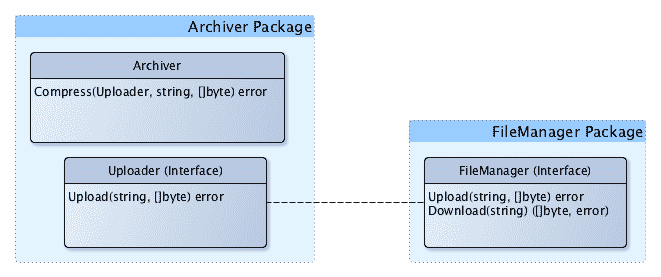

# 第四章：ACME 注册服务简介

在本章中，我们将介绍一个名为***ACME 注册服务***的小型但虚假的服务。这个服务的代码将成为本书其余大部分示例的基础。我们将研究这个服务所在的商业环境，讨论服务和代码的目标，最后，我们将看一些我们可以通过应用**依赖注入**（**DI**）来解决的问题的例子。

通过本章结束时，您应该有足够的知识来加入团队，一起完成我们将在接下来的章节中进行的改进。

本章将涵盖以下主题：

+   我们系统的目标

+   我们系统的介绍

+   已知问题

# 技术要求

由于我们正在了解本书中将要使用的系统，我强烈建议下载源代码并在您喜欢的 IDE 中运行它。

本章中的所有代码都可以在[`github.com/PacktPublishing/Hands-On-Dependency-Injection-in-Go/tree/master/ch04`](https://github.com/PacktPublishing/Hands-On-Dependency-Injection-in-Go/tree/master/ch04)找到。

有关如何获取代码和配置示例服务的说明，请参阅 README 文件，网址为[`github.com/PacktPublishing/Hands-On-Dependency-Injection-in-Go/`](https://github.com/PacktPublishing/Hands-On-Dependency-Injection-in-Go/)。

您可以在`ch04/acme`文件中找到服务的代码。

# 我们系统的目标

您有没有尝试过从种子开始种植自己的蔬菜？这是一个漫长、缓慢但令人满意的经历。构建优秀的代码也是一样的。在园艺中，跳过第一步直接从苗圃购买植物作为幼苗可能更常见，编程也是如此。大多数情况下，当我们加入一个项目时，代码已经存在；有时它很健康，但通常它是生病和垂死的。

在这种情况下，我们正在采用一个系统。它有效，但有一些问题——好吧，也许不止一些。通过一些精心的关怀，我们将把这个系统变成健康和蓬勃发展的东西。

那么，我们如何定义一个健康的系统？我们现有的系统有效；它做了业务需要它做的事情。这就足够了，对吧？

绝对不！我们可能明确地被支付一定数量的功能，但我们隐含地被支付以提供可维护和可扩展的代码。除了考虑我们为什么被支付，让我们以更自私的角度来看：您希望明天的工作比今天更容易还是更难？

一个健康的代码库具有以下关键特征：

+   高可读性

+   高可测试性

+   低耦合

我们在第一部分中已经谈到或暗示了所有这些要求，但它们的重要性意味着我们将再次重点介绍它们。

# 高可读性

简而言之，高可读性意味着能够阅读代码并理解它。不可读的代码会减慢您的速度，并可能导致错误，您可能会假设它做一件事，但实际上它做了另一件事。

让我们看一个示例，如下所示的代码：

```go
type House struct {
   a string
   b int
   t int
   p float64
}
```

在这个例子中，代码的命名存在问题。短变量名似乎是一个胜利；少打字意味着少工作，对吗？短期内是的，但从长远来看，它们很难理解。您被迫阅读代码以确定变量的含义，然后在该上下文中重新阅读代码，而一个好的名称本来可以省去我们的第一步。这并不意味着超长的名称是正确的；它们也增加了心理负担并浪费了屏幕空间。一个好的变量通常是一个单词，具有常见的含义或目的。

有两种情况下不应遵循上述原则。第一种是方法。也许是因为我使用 C++和 Java 的时间以及 Go 中缺少`this`运算符，但我发现短方法接收器很有用，可能是因为它们在整个结构中是一致的，只有短变量使它们与其他所有变量有所不同。

第二种情况是我们在处理测试名称时。测试本质上是小故事；在这种情况下，长名称通常是完全合适的。注释也可以起作用，但效果较差，因为测试运行器在失败时输出测试的名称而不是注释。

让我们在考虑这些想法的基础上更新前面的示例，看看它是否更好，如下所示：

```go
type House struct {
   address string
   bedrooms int
   toilets int
   price float64
}
```

有关可读性的更多信息，请翻回到第三章中的*Optimizing for humans*部分。

# 高可测试性

编写自动化测试可能会感觉像是*额外的工作*，会占用我们编写功能的真正目的的时间。事实上，自动化测试的主要目标是确保代码的执行符合预期，并且尽管我们对代码库作出任何更改或添加，它仍然如此。但自动化测试确实有成本：您必须编写和维护它们。因此，如果我们的代码易于测试，我们就不太可能在测试上吝啬，并匆忙进行下一个令人兴奋的功能。

让我们看一个示例，如下所示：

```go
func longMethod(resp http.ResponseWriter, req *http.Request) {
   err := req.ParseForm()
   if err != nil {
      resp.WriteHeader(http.StatusPreconditionFailed)
      return
   }
   userID, err := strconv.ParseInt(req.Form.Get("UserID"), 10, 64)
   if err != nil {
      resp.WriteHeader(http.StatusPreconditionFailed)
      return
   }

   row := DB.QueryRow("SELECT * FROM Users WHERE userID = ?", userID)

   person := &Person{}
   err = row.Scan(person.ID, person.Name, person.Phone)
   if err != nil {
      resp.WriteHeader(http.StatusInternalServerError)
      return
   }

   encoder := json.NewEncoder(resp)
   err = encoder.Encode(person)
   if err != nil {
      resp.WriteHeader(http.StatusInternalServerError)
      return
   }
}
```

所以这个例子有什么问题？最简单的答案是它知道得太多，或者更自私地说，它让我知道得太多。

它包含边界层（HTTP 和数据库）逻辑，也包含业务逻辑。它相当长，意味着我必须在脑海中保留更多的上下文。它基本上违反了**单一职责原则**（**SRP**）。有很多原因它可能会改变。输入格式可能会改变。数据库格式可能会改变。业务规则可能会改变。任何这样的改变都意味着这段代码的每个测试很可能也需要改变。让我们看看前面代码的测试可能是什么样子，如下所示：

```go
func TestLongMethod_happyPath(t *testing.T) {
   // build request
   request := &http.Request{}
   request.PostForm = url.Values{}
   request.PostForm.Add("UserID", "123")

   // mock the database
   var mockDB sqlmock.Sqlmock
   var err error

   DB, mockDB, err = sqlmock.New()
   require.NoError(t, err)
     mockDB.ExpectQuery("SELECT .* FROM people WHERE ID = ?").
    WithArgs(123).
    WillReturnRows(
      sqlmock.NewRows(
        []string{"ID", "Name", "Phone"}).
        AddRow(123, "May", "0123456789"))

   // build response
   response := httptest.NewRecorder()

   // call method
   longMethod(response, request)

   // validate response
   require.Equal(t, http.StatusOK, response.Code)

   // validate the JSON
   responseBytes, err := ioutil.ReadAll(response.Body)
   require.NoError(t, err)

   expectedJSON := `{"ID":123,"Name":"May","Phone":"0123456789"}` + "\n"
   assert.Equal(t, expectedJSON, string(responseBytes))
}
```

正如您所看到的，这个测试冗长且笨重。最糟糕的是，对于这个方法的任何其他测试都将涉及复制这个测试并进行微小的更改。这听起来很有效，但有两个问题。这些样板代码中可能很难发现小的差异，而我们测试的功能发生任何更改都需要对所有这些测试进行更改。

虽然有许多方法可以修复我们示例的可测试性，但也许最简单的选择是分离不同的关注点，然后逐个方法进行大部分测试，如下所示：

```go
func shortMethods(resp http.ResponseWriter, req *http.Request) {
   userID, err := extractUserID(req)
   if err != nil {
      resp.WriteHeader(http.StatusInternalServerError)
      return
   }

   person, err := loadPerson(userID)
   if err != nil {
      resp.WriteHeader(http.StatusInternalServerError)
      return
   }

   outputPerson(resp, person)
}

func extractUserID(req *http.Request) (int64, error) {
   err := req.ParseForm()
   if err != nil {
      return 0, err
   }

   return strconv.ParseInt(req.Form.Get("UserID"), 10, 64)
}

func loadPerson(userID int64) (*Person, error) {
   row := DB.QueryRow("SELECT * FROM people WHERE ID = ?", userID)

   person := &Person{}
   err := row.Scan(&person.ID, &person.Name, &person.Phone)
   if err != nil {
      return nil, err
   }
   return person, nil
}

func outputPerson(resp http.ResponseWriter, person *Person) {
   encoder := json.NewEncoder(resp)
   err := encoder.Encode(person)
   if err != nil {
      resp.WriteHeader(http.StatusInternalServerError)
      return
   }
}
```

有关单元测试对您的作用，可以翻回到第三章中的*A security blanket named unit tests*部分。

# 低耦合度

耦合是一个对象或包与其他对象的关系程度的度量。如果对一个对象的更改可能导致其他对象的更改，或者反之亦然，则认为该对象的耦合度高。相反，当一个对象的耦合度低时，它独立于其他对象或包。在 Go 中，低耦合度最好通过隐式接口和稳定且最小化的公开 API 来实现。

低耦合度是可取的，因为它导致代码的更改局部化。在下面的示例中，通过使用隐式接口来定义我们的要求，我们能够使自己免受对依赖项的更改的影响：



正如您从前面的例子中所看到的，我们不再依赖 FileManager Package，这在其他方面也对我们有所帮助。这种缺乏依赖也意味着在阅读代码时我们需要记住的上下文更少，在编写测试时依赖更少。

要了解如何实现低耦合性，请翻回到第二章中涵盖的*SOLID Design Principles for Go*。

# 关于目标的最终想法

到现在为止，您可能已经看到了一个模式。所有这些目标将导致易于阅读、理解、测试和扩展的代码，也就是说，可维护的代码。虽然这些目标可能看起来是自私或完美主义的，但我认为这对于企业长远来说是必不可少的。在短期内，向用户提供价值，通常以功能的形式，是至关重要的。但是，当这样做得不好时，可以添加功能的速度、添加功能所需的程序员数量以及因更改引入的错误数量都会增加，并且会给企业带来的成本将超过开发良好代码的成本。

现在我们已经定义了我们对服务的目标，让我们来看看它的当前状态。

# 我们系统的介绍

欢迎加入项目！那么，加入团队需要了解什么呢？与任何项目一样，您首先想要了解它的功能，用户以及部署环境。

我们正在处理的系统是基于 HTTP 的事件注册服务。它旨在被我们的 Web 应用程序或原生移动应用程序调用。以下图表显示了它如何适应我们的网络：

！[](img/f6f650d4-a5f0-4ddf-8df7-9eb76718354a.png)

目前有三个端点，列举如下：

+   **注册**：这将创建一个新的注册记录

+   **获取**：这将返回现有注册记录的全部详细信息

+   **列表**：这将返回所有注册的列表

所有请求和响应负载都是 JSON 格式。数据存储在 MySQL 数据库中。

我们还有一个上游货币转换服务——我们在注册时调用它，将 100 欧元的注册价格转换为用户请求的货币。

如果您希望在本地运行服务或测试，请参考`ch04/README.md`文件中的说明。

# 软件架构

从概念上讲，我们的代码有三层，如下图所示：

！[](img/b9bd6944-d7c7-40ee-b32d-b3ad0dfe40ce.png)

这些层如下：

+   REST：这个包接受 HTTP 请求并将它们转换为业务逻辑中的函数调用。然后将业务逻辑响应转换回 HTTP。

+   业务逻辑：这就是魔法发生的地方。这一层使用外部服务和数据层来执行业务功能。

+   外部服务和数据：这一层包括访问数据库和提供货币汇率的上游服务的代码。

我在本节的开头使用了“概念上”的词，因为我们的导入图显示了一个略有不同的故事：

！[](img/2c796c74-08f7-49c5-acce-06f2aca8863b.png)

正如您所看到的，我们有一个准第四层，其中包括配置和日志包，更糟糕的是，一切似乎都依赖于它们。这很可能会在某个时候给我们带来问题。

这里显示了一个不太明显的问题。看到 REST 和数据包之间的链接了吗？这表明我们的 HTTP 层依赖于数据层。这是有风险的，因为它们有不同的生命周期和不同的变更原因。我们将在下一节中看到这一点以及其他一些令人不快的惊喜。

# 已知问题

每个系统都有它的骨架，我们不以之为傲的代码部分。有时，它们是我们本可以做得更好的代码部分，如果我们有更多的时间的话。这个项目也不例外。让我们来看看我们目前知道的问题。

# 可测试性

尽管是一个小型且工作正常的服务，但我们有相当多的问题，其中最严重的是难以测试。现在，我们不想开始引入测试导致的破坏，但我们确实希望有一个我们有信心的系统。为了实现这一点，我们需要减少测试的复杂性和冗长。看看下面的测试：

```go
func TestGetHandler_ServeHTTP(t *testing.T) {
   // ensure the test always fails by giving it a timeout
   ctx, cancel := context.WithTimeout(context.Background(), 5*time.Second)
   defer cancel()

     // Create and start a server
  // With out current implementation, we cannot test this handler 
  // without a full server as we need the mux.
  address, err := startServer(ctx)
  require.NoError(t, err)

   // build inputs
   response, err := http.Get("http://" + address + "/person/1/")

   // validate outputs
   require.NoError(t, err)
   require.Equal(t, http.StatusOK, response.StatusCode)

   expectedPayload := []byte(`{"id":1,"name":"John","phone":"0123456780","currency":"USD","price":100}` + "\n")
   payload, _ := ioutil.ReadAll(response.Body)
   defer response.Body.Close()

   assert.Equal(t, expectedPayload, payload)
}
```

这个测试是针对我们最简单的端点`Get`的。问问自己，这个测试可能会以什么方式失败？什么样的技术或业务相关的变化会导致这个测试需要更新？系统的哪些部分必须正常工作才能通过这个测试？

对这些问题的一些潜在答案包括以下：

+   如果 URL 路径发生变化，这个测试就会失败

+   如果输出格式发生变化，这个测试就会失败

+   如果`config`文件没有正确配置，这个测试就会失败

+   如果数据库不工作，这个测试就会失败

+   如果数据库中缺少记录 ID 1，这个测试就会失败

+   如果业务逻辑层出现错误，这个测试就会失败

+   如果数据库层出现错误，这个测试就会失败

这个简单端点的测试列表相当恶劣。这个测试可以以这么多种方式失败意味着它是一个脆弱的测试。脆弱的测试令人筋疲力尽，而且通常编写起来也很费力。

# 工作的重复

让我们来看看业务层中`Get`端点的测试，如下所示：

```go
func TestGetter_Do(t *testing.T) {
   // inputs
   ID := 1
   name := "John"

   // call method
   getter := &Getter{}
   person, err := getter.Do(ID)

   // validate expectations
   require.NoError(t, err)
   assert.Equal(t, ID, person.ID)
   assert.Equal(t, name, person.FullName)
}
```

这个测试几乎与前一节的测试相同。也许这是合理的，因为它是相同的端点。但让我们以自私的角度来看，这个测试除了更好的单元测试覆盖率之外，还给了我们什么？

没有。因为之前的测试实际上是一个集成测试，它测试了整个堆栈。这个测试也是一个集成测试，但是更深一层。因为它测试了之前示例中测试过的代码，我们做了双倍的工作，有双倍数量的测试需要维护，但没有任何收获。

# 测试中的隔离不足

在我们之前的代码中显示的缺乏隔离是层之间高耦合的症状。在接下来的部分，我们将应用 DI 和**依赖反转原则**（**DIP**）来解决这个问题。

# 数据和 REST 包之间的高耦合

我们的`REST`包使用了`data`包中定义的`Person`结构。从表面上看，这是有道理的。更少的代码意味着写和维护更少的工作；然而，这意味着输出格式和数据格式是相互关联的。考虑一下，如果我们开始存储与客户相关的私人信息，比如密码或 IP 地址会发生什么。这些信息可能对某些功能是必要的，但很少需要通过`Get`或`List`端点发布。

还有另一个考虑我们应该记住。随着存储的数据量或使用量的增长，可能需要更改数据的格式。对这个结构的任何更改都会破坏 API 合同，因此也会破坏我们的用户。

也许这里最大的风险就是人为错误；如果你在`data`包上工作，你可能不记得`REST`包如何使用那个结构。假设我们添加了用户登录系统的功能。最简单的实现方式是在数据库中添加一个密码字段。如果我们的`Get`端点构建其输出如下所示的代码会发生什么？

```go
// output the supplied person as JSON
func (h *GetHandler) writeJSON(writer io.Writer, person *data.Person) error {
   return json.NewEncoder(writer).Encode(person)
}
```

我们的`Get`端点负载现在将包括密码。哎呀！

这个问题是 SRP 违规，解决这个问题的方法是确保这两个用例是解耦的，并允许它们分别发展。

# 与配置包的高耦合

正如我们在依赖图中看到的那样，几乎所有东西都依赖于`config`包。这主要原因是代码直接引用公共全局变量来配置自身。这带来的第一个问题是它对测试的影响。现在几乎所有的测试都确保在运行之前已经正确初始化了配置全局变量。因为所有的测试都使用同一个全局变量，我们被迫在不改变配置的情况下进行选择，这影响了我们的测试能力，或者按顺序运行测试，这浪费了我们的时间。

让我们来看一个例子，如下面的代码所示：

```go
// bind stop channel to context
ctx := context.Background()

// start REST server
server := rest.New(config.App.Address)
server.Listen(ctx.Done())
```

在这段代码中，我们正在启动我们的 REST 服务器，并将地址（主机和端口）传递给它以绑定。如果我们决定要启动多个服务器以便隔离测试不同的事物，那么我们将不得不更改存储在`config.App.Address`中的值。然而，通过在一个测试中这样做，我们可能会意外地影响到另一个测试。

第二个问题并不经常出现，但这种耦合也意味着这段代码不能轻松地被其他项目、包或用例所使用，超出了最初的意图。

最后一个问题可能是最烦人的：由于循环依赖问题，您无法在配置中使用自定义数据类型，这些类型在`Config`包之外定义。

考虑以下代码：

```go
// Currency is a custom type; used for convenience and code readability
type Currency string

// UnmarshalJSON implements json.Unmarshaler
func (c *Currency) UnmarshalJSON(in []byte) error {
   var s string
   err := json.Unmarshal(in, &s)
   if err != nil {
      return err
   }

   currency, valid := validCurrencies[s]
   if !valid {
      return fmt.Errorf("'%s' is not a valid currency", s)
   }

   *c = currency

   return nil
}
```

假设您的配置包括以下内容：

```go
type Config struct {
   DefaultCurrency currency.Currency `json:"default_currency"`
}
```

在这种情况下，任何尝试在与我们的`Currency`类型相同的包中使用配置包都将被阻止。

# 下游货币服务

交换包对外部服务进行 HTTP 调用以获取汇率。目前，当运行测试时，它将调用该服务。这意味着我们的测试具有以下特点：

+   它们需要互联网连接

+   它们依赖于下游服务可访问和正常工作

+   它们需要来自下游服务的适当凭据和配额

所有这些因素要么超出我们的控制，要么与我们的服务完全无关。如果我们从测试的可靠性是我们工作质量的衡量标准的角度来看，那么我们的质量现在取决于我们无法控制的事情。这远非理想。

我们可以创建一个虚假的货币服务，并更改我们的配置指向该服务，在测试交换包时，我可能会这样做。但在其他地方这样做是令人讨厌的，并且容易出错。

# 总结

在本章中，我们介绍了一个状况相当糟糕的小型服务。我们将通过一系列重构来改进这个服务，同时探索许多 DI 技术。在接下来的章节中，我们将通过应用 Go 中可用的不同 DI 技术来解决本章中概述的问题。

对于每种不同的技术，要记住代码异味，SOLID 原则，代码 UX 以及我们在第一部分讨论的所有其他想法。还要记得带上你内心的怀疑者。

始终要问自己，这种技术实现了什么？这种技术如何使代码变得更好/更糟？你如何应用这种技术来改进属于你的其他代码？

# 问题

1.  对于我们的服务定义的目标，哪一个对你个人来说最重要？

1.  概述中列出的问题中哪一个似乎是最紧迫或最重要的？
