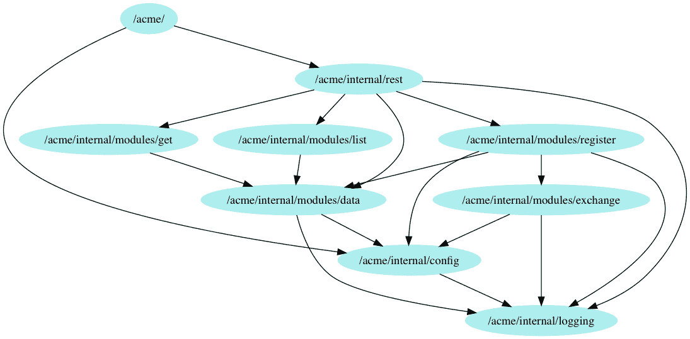

# 第六章：构造函数注入的依赖注入

在本章中，我们将研究**依赖注入**（**DI**）最独特的形式之一，即猴子补丁，然后将其推向另一个极端，看看可能是最*正常*或传统的构造函数注入。

虽然构造函数注入是如此普遍，以至于您甚至可能在不知不觉中使用它，但它有许多微妙之处，特别是关于优缺点的考虑。

与上一章类似，我们将把这种技术应用到我们的示例服务中，从而获得显著的改进。

本章将涵盖以下主题：

+   构造函数注入

+   构造函数注入的优点

+   应用构造函数注入

+   构造函数注入的缺点

# 技术要求

熟悉我们在第四章中介绍的服务代码将是有益的，*ACME 注册服务简介*。

您可能还会发现阅读和运行本章的完整代码版本很有用，这些代码可以在[`github.com/PacktPublishing/Hands-On-Dependency-Injection-in-Go/tree/master/ch06`](https://github.com/PacktPublishing/Hands-On-Dependency-Injection-in-Go/tree/master/ch06)上找到。

获取代码并配置示例服务的说明可在此处的 README 中找到[`github.com/PacktPublishing/Hands-On-Dependency-Injection-in-Go/`](https://github.com/PacktPublishing/Hands-On-Dependency-Injection-in-Go/)。

您可以在`ch06/acme`中找到我们的服务代码，并已应用了本章的更改。

# 构造函数注入

当对象需要一个依赖项来工作时，确保该依赖项始终可用的最简单方法是要求所有用户将其作为对象构造函数的参数提供。这被称为**构造函数注入**。

让我们通过一个示例来解释，我们将提取一个依赖项，将其概括，并实现构造函数注入。假设我们正在为一个在线社区构建网站。对于这个网站，我们希望在用户注册时向新用户发送电子邮件。这段代码可能是这样的：

```go
// WelcomeSender sends a Welcome email to new users
type WelcomeSender struct {
   mailer *Mailer
}

func (w *WelcomeSender) Send(to string) error {
   body := w.buildMessage()

   return w.mailer.Send(to, body)
}
```

我们将`*Mailer`设为私有，以确保类的内部封装。我们可以通过将其定义为构造函数的参数来注入`*Mailer`依赖项，如下面的代码所示：

```go
func NewWelcomeSender(in *Mailer) (*WelcomeSender, error) {
   // guard clause
   if in == nil {
      return nil, errors.New("programmer error: mailer must not provided")
   }

   return &WelcomeSender{
      mailer: in,
   }, nil
}
```

在前面的示例中，我们包含了一个守卫子句。其目的是确保提供的依赖项不是`nil`。这并非必需，是否包含取决于个人风格；这样做是完全可以接受的：

```go
func NewWelcomeSenderNoGuard(in *Mailer) *WelcomeSender {
   return &WelcomeSender{
      mailer: in,
   }
}
```

您可能会认为我们已经完成了。毕竟，我们正在将依赖项`Mailer`注入`WelcomeSender`。

遗憾的是，我们还没有完全达到目标。事实上，我们错过了 DI 的真正目的。不，这不是测试，尽管我们会做到这一点。DI 的真正目的是解耦。

在这一点上，我们的`WelcomeSender`没有`Mailer`实例就无法工作。它们之间耦合度很高。因此，让我们通过应用第二章中的*依赖反转原则*部分来解耦它们，*Go 的 SOLID 设计原则*。

首先，让我们看一下`Mailer`结构：

```go
// Mailer sends and receives emails
type Mailer struct{
   Host string
   Port string
   Username string
   Password string
}

func (m *Mailer) Send(to string, body string) error {
   // send email
   return nil
}

func (m *Mailer) Receive(address string) (string, error) {
   // receive email
   return "", nil
}
```

我们可以通过基于方法签名的接口将其转换为抽象：

```go
// Mailer sends and receives emails
type MailerInterface interface {
   Send(to string, body string) error
   Receive(address string) (string, error)
}
```

等一下，我们只需要发送电子邮件。让我们应用*接口隔离原则*，将接口减少到我们使用的方法，并更新我们的构造函数。现在，我们有这样的代码：

```go
type Sender interface {
   Send(to string, body string) error
}

func NewWelcomeSenderV2(in Sender) *WelcomeSenderV2 {
   return &WelcomeSenderV2{
      sender: in,
   }
}
```

通过这一个小改变，发生了一些方便的事情。首先，我们的代码现在完全自包含。这意味着任何错误、扩展、测试或其他更改只涉及这个包。其次，我们可以使用模拟或存根来测试我们的代码，阻止我们用电子邮件轰炸自己，并要求一个工作的电子邮件服务器来通过我们的测试。最后，我们不再受限于`Mailer`类。如果我们想要从欢迎电子邮件更改为短信或推特，我们可以将我们的输入参数更改为不同的`Sender`并完成。

通过将我们的依赖项定义为一个抽象（作为一个本地接口）并将该依赖项传递到我们的构造函数中，我们已经明确地定义了我们的要求，并在测试和扩展中给了我们更大的自由度。

# 解决房间里的鸭子

在我们深入研究构造函数注入之前，我们应该花一点时间来谈谈鸭子类型。

我们之前提到过 Go 对隐式接口的支持，以及我们如何利用它来执行依赖反转和解耦对象。对于熟悉 Python 或 Ruby 的人来说，这可能感觉像鸭子类型。对于其他人来说，什么是鸭子类型？它被描述如下：

**如果它看起来像一只鸭子，它叫起来像一只鸭子，那么它就是一只鸭子**

或者，更加技术性地说：

**在运行时，仅根据访问的对象部分动态确定对象的适用性**

让我们看一个 Go 的例子，看看它是否支持鸭子类型：

```go
type Talker interface {
   Speak() string
   Shout() string
}

type Dog struct{}

func (d Dog) Speak() string {
   return "Woof!"
}

func (d Dog) Shout() string {
   return "WOOF!"
}

func SpeakExample() {
   var talker Talker
   talker = Dog{}

   fmt.Print(talker.Speak())
}
```

正如你所看到的，我们的`Dog`类型并没有声明它实现了`Talker`接口，正如我们可能从 Java 或 C#中期望的那样，但我们仍然能够将它用作`Talker`。

从我们的例子来看，Go 可能支持鸭子类型，但存在一些问题：

+   在鸭子类型中，兼容性是在运行时确定的；Go 将在编译时检查我们的`Dog`类型是否实现了`Talker`。

+   在鸭子类型中，适用性仅基于访问的对象部分。在前面的例子中，只有`Speak()`方法被实际使用。然而，如果我们的`Dog`类型没有实现`Shout()`方法，那么它将无法编译通过。

那么如果它不是鸭子类型，那它是什么？有点类似的东西叫做**结构类型**。结构类型是一种静态类型系统，它根据类型的结构在编译时确定适用性。不要让这个不太花哨的名字愚弄你；结构类型是非常强大和极其有用的。Go 提供了编译时检查的安全性，而不需要明确声明实现的接口的强制形式。

# 构造函数注入的优势

对于许多程序员和编程语言，构造函数注入是它们的默认 DI 方法。因此，它具有许多优势也许并不奇怪。

**与依赖项生命周期的分离**-构造函数注入，像大多数 DI 方法一样，将依赖项的生命周期管理与被注入的对象分开。通过这样做，对象变得更加简单和易于理解。

**易于实现**-正如我们在之前的例子中看到的，将这个变得很容易：

```go
// WelcomeSender sends a Welcome email to new users
type WelcomeSender struct {
   Mailer *Mailer
}

func (w *WelcomeSender) Send(to string) error {
   body := w.buildMessage()

   return w.Mailer.Send(to, body)
}
```

并将其更改为：

```go
func NewWelcomeSender(mailer *Mailer) *WelcomeSender {
   return &WelcomeSender{
      mailer: mailer,
   }
}

// WelcomeSender sends a Welcome email to new users
type WelcomeSender struct {
   mailer *Mailer
}

func (w *WelcomeSender) Send(to string) error {
   body := w.buildMessage()

   return w.mailer.Send(to, body)
}
```

**可预测且简洁**-通过将依赖项的赋值移动到构造函数，我们不仅明确了我们的要求，而且还确保依赖项被设置并可用于我们的方法。如果在构造函数中包含了一个守卫子句，这一点尤其正确。没有构造函数，每个方法可能都必须包含一个守卫子句（如下例所示），否则可能会出现 nil 指针异常：

```go
type Car struct {
   Engine Engine
}

func (c *Car) Drive() error {
   if c.Engine == nil {
      return errors.New("engine ie missing")
   }

   // use the engine
   c.Engine.Start()
   c.Engine.IncreasePower()

   return nil
}

func (c *Car) Stop() error {
   if c.Engine == nil {

      return errors.New("engine ie missing")
   }

   // use the engine
   c.Engine.DecreasePower()
   c.Engine.Stop()

   return nil
}
```

而不是更简洁的以下内容：

```go
func NewCar(engine Engine) (*Car, error) {
  if engine == nil {
    return nil, errors.New("invalid engine supplied")
  }

  return &Car{
    engine: engine,
  }, nil
}

type Car struct {
   engine Engine
}

func (c *Car) Drive() error {
   // use the engine
   c.engine.Start()
   c.engine.IncreasePower()

   return nil
}

func (c *Car) Stop() error {
   // use the engine
   c.engine.DecreasePower()
   c.engine.Stop()

   return nil
}
```

通过扩展，方法还可以假定我们的依赖在访问依赖时处于良好的准备状态，因此无需在构造函数之外的任何地方处理初始化延迟或配置问题。此外，访问依赖时没有与数据竞争相关的问题。它在构造过程中设置，永远不会改变。

**封装** - 构造函数注入提供了关于对象如何使用依赖的高度封装。考虑一下，如果我们通过添加`FillPetrolTank()`方法来扩展我们之前的`Car`示例，如下面的代码所示：

```go
func (c *Car) FillPetrolTank() error {
   // use the engine
   if c.engine.IsRunning() {
      return errors.New("cannot fill the tank while the engine is running")
   }

   // fill the tank!
   return c.fill()
}
```

如果我们假设*加油*与`Engine`无关，并且在调用此方法之前没有填充`Engine`，那么原来的代码会发生什么？

如果没有构造函数注入来确保我们提供了`Engine`，这个方法将会崩溃并引发空指针异常。或者，这个方法也可以不使用构造函数注入来编写，如下面的代码所示：

```go
func (c *Car) FillPetrolTank(engine Engine) error {
   // use the engine
   if engine.IsRunning() {
      return errors.New("cannot fill the tank while the engine is running")
   }

   // fill the tank!
   return c.fill()
}
```

然而，这个版本现在泄漏了方法需要`Engine`来工作的实现细节。

**帮助发现代码异味** - 向现有结构或接口添加*只是一个*功能是一个容易陷阱。正如我们在*单一职责原则*的早期讨论中所看到的，我们应该抵制这种冲动，尽可能保持我们的对象和接口尽可能小。发现对象承担太多责任的一个简单方法是计算其依赖关系。通常，对象承担的责任越多，它积累的依赖关系就越多。因此，通过将所有依赖关系清楚地列在一个地方，即构造函数中，很容易就能察觉到可能有些不对劲。

# 改进测试场景覆盖率

我们要做的第一件事是在测试中消除对上游货币服务的依赖。然后，我们将继续添加测试来覆盖以前无法覆盖的其他场景。我们当前的测试看起来是这样的：

```go
func TestRegisterHandler_ServeHTTP(t *testing.T) {
   // ensure the test always fails by giving it a timeout
   ctx, cancel := context.WithTimeout(context.Background(), 5*time.Second)
   defer cancel()

   // Create and start a server
   // With out current implementation, we cannot test this handler without
   // a full server as we need the mux.
   address, err := startServer(ctx)
   require.NoError(t, err)

   // build inputs
   validRequest := buildValidRequest()
   response, err := http.Post("http://"+address+"/person/register", "application/json", validRequest)

   // validate outputs
   require.NoError(t, err)
   require.Equal(t, http.StatusCreated, response.StatusCode)
   defer response.Body.Close()

   // call should output the location to the new person
   headerLocation := response.Header.Get("Location")
   assert.Contains(t, headerLocation, "/person/")
}
```

我们目前正在启动整个 HTTP 服务器；这似乎有些过分，所以让我们将测试范围缩小到只有`RegisterHandler`。

这种测试范围的缩减还将通过消除其他外围问题来改进测试，比如 HTTP 路由。

由于我们知道我们将有多个类似的场景需要测试，让我们从添加表驱动测试的框架开始：

```go
func TestRegisterHandler_ServeHTTP(t *testing.T) {
   scenarios := []struct {
      desc           string
      inRequest      func() *http.Request
      inModelMock    func() *MockRegisterModel
      expectedStatus int
      expectedHeader string
   }{
      // scenarios go here
   }

   for _, s := range scenarios {
      scenario := s
      t.Run(scenario.desc, func(t *testing.T) {
         // test goes here
      })
   }
}
```

从原始测试中，我们可以看到我们的输入是`*http.Request`和`*MockRegisterModel`。两者都有点复杂，需要创建和配置，所以我们选择用一个函数来构建它们。同样，从原始测试中，我们可以看到测试的输出是 HTTP 响应代码和`Location`头部。

这四个对象，`*http.Request`，`*MockRegistrationModel`，HTTP 状态码和`Location`头部，将构成我们测试场景的配置，如前面的代码所示。

为了完成我们的表驱动测试，我们将原始测试的内容复制到测试循环中，并替换输入和输出，如下面的代码所示：

```go
for _, s := range scenarios {
   scenario := s
   t.Run(scenario.desc, func(t *testing.T) {
      // define model layer mock
      mockRegisterModel := scenario.inModelMock()

      // build handler
      handler := &RegisterHandler{
         registerer: mockRegisterModel,
      }

      // perform request
      response := httptest.NewRecorder()
      handler.ServeHTTP(response, scenario.inRequest())

      // validate outputs
      require.Equal(t, scenario.expectedStatus, response.Code)

      // call should output the location to the new person
      resultHeader := response.Header().Get("Location")
      assert.Equal(t, scenario.expectedHeader, resultHeader)

      // validate the mock was used as we expected
      assert.True(t, mockRegisterModel.AssertExpectations(t))
   })
}
```

现在我们已经把所有的部分都准备好了，我们开始编写我们的测试场景，从正常情况开始：

```go
{
   desc: "Happy Path",
   inRequest: func() *http.Request {
      validRequest := buildValidRegisterRequest()
      request, err := http.NewRequest("POST", "/person/register", validRequest)
      require.NoError(t, err)

      return request
   },
   inModelMock: func() *MockRegisterModel {
      // valid downstream configuration
      resultID := 1234
      var resultErr error

      mockRegisterModel := &MockRegisterModel{}
      mockRegisterModel.On("Do", mock.Anything).Return(resultID, resultErr).Once()

      return mockRegisterModel
   },
   expectedStatus: http.StatusCreated,
   expectedHeader: "/person/1234/",
},
```

接下来，我们需要测试我们的代码是否能很好地处理错误。那么我们可以期望出现什么样的错误？我们可以检查代码，寻找类似`if err != nil`的代码。

这可能感觉像一个有用的快捷方式，但请考虑一下。如果我们的测试反映了当前的实现，当实现发生变化时会发生什么？

一个更好的角度是考虑的不是实现，而是功能本身以及其情况或使用。几乎总是有两个答案适用。*用户错误*，如不正确的输入，以及*从依赖项返回的错误*。

我们的*用户错误*场景如下所示：

```go
{
   desc: "Bad Input / User Error",
   inRequest: func() *http.Request {
      invalidRequest := bytes.NewBufferString(`this is not valid JSON`)
      request, err := http.NewRequest("POST", "/person/register", invalidRequest)
      require.NoError(t, err)

      return request
   },
   inModelMock: func() *MockRegisterModel {
      // Dependency should not be called
      mockRegisterModel := &MockRegisterModel{}
      return mockRegisterModel
   },
   expectedStatus: http.StatusBadRequest,
   expectedHeader: "",
},

```

我们从依赖项返回的*错误*如下所示：

```go
{
   desc: "Dependency Failure",
   inRequest: func() *http.Request {
      validRequest := buildValidRegisterRequest()
      request, err := http.NewRequest("POST", "/person/register", validRequest)
      require.NoError(t, err)

      return request
   },
   inModelMock: func() *MockRegisterModel {
      // call to the dependency failed
      resultErr := errors.New("something failed")

      mockRegisterModel := &MockRegisterModel{}
      mockRegisterModel.On("Do", mock.Anything).Return(0, resultErr).Once()

      return mockRegisterModel
   },
   expectedStatus: http.StatusInternalServerError,
   expectedHeader: "",
},

```

有了这三个测试，我们有了合理的测试场景覆盖，但我们遇到了一个问题。我们的*从依赖项返回的错误*场景导致 HTTP 状态码为`400`（错误请求），而不是预期的 HTTP`500`（内部服务器错误）。在查看模型层的实现后，显然`400`错误是有意的，并且应该表明请求不完整，因此验证失败。

我们的第一反应很可能是希望将验证移到 HTTP 层。但请考虑：如果我们添加另一种服务器类型，例如 gRPC，会发生什么？这种验证仍然需要执行。那么我们如何将用户错误与系统错误分开呢？

另一个选择是从模型返回命名错误以进行验证错误，另一个选择是其他错误。很容易检测和分别处理响应。然而，这将导致我们的代码与`model`包保持紧密耦合。

另一个选择是将我们对模型包的调用分成两个调用，也许是`Validate()`和`Do()`，但这会减少我们的`model`包的用户体验。我将留给您决定这些或其他选项是否适合您。

在对`RegisterHandler`和此包中的其他处理程序进行这些更改后，我们可以使用 Go 的测试覆盖工具来查看是否错过了任何明显的场景。

对于 Unix/Linux 用户，我在本章的源代码中包含了一个用于生成 HTML 覆盖率的脚本，步骤应该类似于其他平台。该脚本可以在[`github.com/PacktPublishing/Hands-On-Dependency-Injection-in-Go/blob/master/ch06/pcov-html`](https://github.com/PacktPublishing/Hands-On-Dependency-Injection-in-Go/blob/master/ch06/pcov-html)找到。

请注意，这里的测试覆盖百分比并不重要。重要的是要查看哪些代码没有被任何测试执行，并决定是否表明可能发生错误，因此我们需要添加的场景。

现在我们的`RegisterHandler`的形式好多了，我们可以以同样的方式将构造函数注入到`REST`包中的其他处理程序中。

这些更改的结果可以在本章的源代码中看到[`github.com/PacktPublishing/Hands-On-Dependency-Injection-in-Go/tree/master/ch06/acme/internal/rest`](https://github.com/PacktPublishing/Hands-On-Dependency-Injection-in-Go/tree/master/ch06/acme/internal/rest)。

# 应用构造函数注入

让我们将构造函数注入到我们的 ACME 注册服务中。这次我们将重构 REST 包，从`Register`端点开始。您可能还记得`Register`是我们服务中的三个端点之一，其他端点是`Get`和`List`。

`Register`端点有三个责任：

+   验证注册是否完成并有效

+   调用货币转换服务将注册价格转换为注册时请求的货币

+   保存注册和转换后的注册价格到数据库中

我们`Register`端点的代码目前如下所示：

```go
// RegisterHandler is the HTTP handler for the "Register" endpoint
// In this simplified example we are assuming all possible errors 
// are user errors and returning "bad request" HTTP 400.
// There are some programmer errors possible but hopefully these 
// will be caught in testing.
type RegisterHandler struct {
}

// ServeHTTP implements http.Handler
func (h *RegisterHandler) ServeHTTP(response http.ResponseWriter, request *http.Request) {
   // extract payload from request
   requestPayload, err := h.extractPayload(request)
   if err != nil {
      // output error
      response.WriteHeader(http.StatusBadRequest)
      return
   }

   // register person
   id, err := h.register(requestPayload)
   if err != nil {
      // not need to log here as we can expect other layers to do so
      response.WriteHeader(http.StatusBadRequest)
      return
   }

   // happy path
   response.Header().Add("Location", fmt.Sprintf("/person/%d/", id))
   response.WriteHeader(http.StatusCreated)
}

// extract payload from request
func (h *RegisterHandler) extractPayload(request *http.Request) (*registerRequest, error) {
   requestPayload := &registerRequest{}

   decoder := json.NewDecoder(request.Body)
   err := decoder.Decode(requestPayload)
   if err != nil {
      return nil, err
   }

   return requestPayload, nil
}

// call the logic layer
func (h *RegisterHandler) register(requestPayload *registerRequest) (int, error) {
   person := &data.Person{
      FullName: requestPayload.FullName,
      Phone:    requestPayload.Phone,
      Currency: requestPayload.Currency,
   }

   registerer := &register.Registerer{}
   return registerer.Do(person)
}
```

令人失望的是，我们目前只对此函数进行了一个测试，并且它很容易出错。它需要数据库和我们的下游汇率服务都可访问和配置。

虽然我们可以确保我们的本地数据库正在工作，并且对其进行的任何更改不会影响除我们之外的任何人，但下游汇率服务在互联网上并且受到速率限制。我们无法控制它或它何时工作。

这意味着即使我们只有一个测试，该测试也有很高的潜力会因为我们无法控制的原因而变得烦人并且难以维护。

幸运的是，我们不仅可以消除这些依赖，还可以使用模拟来创建我们无法实现的情况。例如，通过模拟，我们可以测试当汇率服务停机或配额用完时的错误处理代码。

# 与依赖的解耦

第一步是确定我们希望注入的依赖项。对于我们的处理程序来说，这不是数据库或汇率调用。我们希望注入下一个软件层，也就是模型层。

具体来说，我们想要从我们的`register`方法中注入这一行：

```go
registerer := &register.Registerer{}
```

按照我们使用更容易的相同过程，我们首先将对象提升为成员变量，如下面的代码所示：

```go
// RegisterHandler is the HTTP handler for the "Register" endpoint
type RegisterHandler struct {
   registerer *register.Registerer
}
```

由于这对我们的代码与依赖的解耦没有任何作用，我们随后将我们的要求定义为一个本地接口，并更新成员变量，如下面的代码所示：

```go
// RegisterModel will validate and save a registration
type RegisterModel interface {
   Do(in *data.Person) (int, error)
}

// RegisterHandler is the HTTP handler for the "Register" endpoint
type RegisterHandler struct {
   registerer RegisterModel
}
```

# 构建构造函数

现在`RegisterHandler`需要一个抽象依赖项，我们需要确保通过应用构造函数注入来设置依赖项，如下面的代码所示：

```go
// NewRegisterHandler is the constructor for RegisterHandler
func NewRegisterHandler(model RegisterModel) *RegisterHandler {
   return &RegisterHandler{
      registerer: model,
   }
}
```

应用构造函数注入后，我们的`RegisterHandler`与模型层和外部资源（数据库和上游服务）的耦合性较小。我们可以利用这种较松散的耦合来改进和扩展我们的`RegisterHandler`的测试。

# 使用依赖图验证我们的改进

在我们结束对`REST`包的工作之前，让我们回顾一下我们的起点和现在的位置。当我们开始时，我们的处理程序与它们匹配的`model`包紧密耦合，并且测试不足。这两个问题都已得到解决。

让我们看看我们的依赖图是否显示出任何改善的迹象：



遗憾的是，它看起来仍然和以前一样。在深入代码后，我们找到了罪魁祸首：

```go
// New will create and initialize the server
func New(address string) *Server {
   return &Server{
      address:         address,
      handlerGet:      NewGetHandler(&get.Getter{}),
      handlerList:     NewListHandler(&list.Lister{}),
      handlerNotFound: notFoundHandler,
      handlerRegister: NewRegisterHandler(&register.Registerer{}),
   }
}
```

我们在`Server`（`REST`包的一部分）的构造函数中实例化了我们的模型层对象。修复很容易，也很明显。我们将依赖项上推一级，如下面的代码所示：

```go
// New will create and initialize the server
func New(address string,
   getModel GetModel,
   listModel ListModel,
   registerModel RegisterModel) *Server {

   return &Server{
      address:         address,
      handlerGet:      NewGetHandler(getModel),
      handlerList:     NewListHandler(listModel),
      handlerNotFound: notFoundHandler,
      handlerRegister: NewRegisterHandler(registerModel),
   }
}
```

再次检查我们的依赖图，现在终于显示了一些改进：


正如你所看到的，它更加平坦；`REST`包不依赖于模块层（`list`、`get`和`register`包）。

对`data`和`config`包的依赖仍然太多，但我们将在后面的章节中处理这个问题。

# 构造函数注入的缺点

遗憾的是，对于 DI 来说，没有银弹。尽管构造函数注入的效用很大，但并非所有情况都适用。本节介绍了构造函数注入的缺点和限制。

**可能导致大量更改**-将构造函数注入应用于现有代码时，可能会导致大量更改。如果代码最初是以函数形式编写的，这一点尤其真实。

考虑以下代码：

```go
// Dealer will shuffle a deck of cards and deal them to the players
func DealCards() (player1 []Card, player2 []Card) {
   // create a new deck of cards
   cards := newDeck()

   // shuffle the cards
   shuffler := &myShuffler{}
   shuffler.Shuffle(cards)

   // deal
   player1 = append(player1, cards[0])
   player2 = append(player2, cards[1])

   player1 = append(player1, cards[2])
   player2 = append(player2, cards[3])
   return
}
```

正如我们在前一节中看到的，要将其转换为使用构造函数注入，我们需要执行以下操作：

+   从函数转换为结构体

+   通过定义接口将对`*myShuffler`的依赖转换为抽象的

+   创建一个构造函数

+   更新所有当前使用该函数的地方，使用构造函数注入依赖

在所有的变化中，最令人担忧的是最后一个。在同一包中发生的更改，也就是说，在同一个包中更容易进行，因此风险更小，但对外部包的更改，特别是属于另一个团队的代码，风险显著更大。

除了非常小心外，减轻风险的最佳方法是进行测试。如果重构之前的代码几乎没有测试或没有测试，那么在开始任何重构之前首先创建一些测试是有益的。

使用猴子补丁的 DI 可能是一个吸引人的选择，可以在这些测试中替换任何依赖关系。是的，这些测试在切换到构造函数注入后需要重构或删除，但这并没有什么不对。有了测试，可以确保在重构之前代码是有效的，并且这些测试在重构过程中仍然具有信息性。换句话说，测试将有助于使重构更加安全。

**可能引起初始化问题**——在讨论构造函数注入的优势时，我们提到了将对象与其依赖的生命周期分离。这段代码和复杂性仍然存在，只是被推到了调用图的更高层。虽然能够分别处理这些问题显然是一个优势，但它也带来了一个次要问题：对象初始化顺序。考虑我们的 ACME 注册服务。它有三层，呈现层、模型层和数据层。

在呈现层能够工作之前，我们需要有一个可用的模型层。

在模型层能够工作之前，我们需要有一个可用的数据层。

在数据层能够正常工作之前，我们必须创建一个数据库连接池。

对于一个简单的服务来说，这已经变得有些复杂了。这种复杂性导致了许多 DI 框架的产生，我们将在第十章《现成的注入》中调查其中一个框架，谷歌的 Wire。

这里可能存在的另一个问题是在应用程序启动时将创建大量对象。虽然这会导致应用程序启动稍微变慢，但一旦支付了这个初始的“成本”，应用程序就不再会因为依赖关系的创建而延迟。

在这里需要考虑的最后一个初始化问题是调试。当依赖关系的创建和使用在代码的同一部分时，更容易理解和调试它们的生命周期和关系。

**滥用的危险**——鉴于这种技术如此易于理解和使用，滥用也是非常容易的。滥用的最明显迹象是构造函数参数过多。过多的构造函数参数可能表明对象承担了太多的责任，但也可能是提取和抽象了太多的依赖的症状。

在提取依赖之前，考虑封装。这个对象的用户需要了解哪些信息？我们能够隐藏与实现相关的信息越多，我们就越有灵活性进行重构。

另一个需要考虑的方面是：依赖关系是否需要被提取，还是可以留给配置？考虑以下代码：

```go
// FetchRates rates from downstream service
type FetchRates struct{}

func (f *FetchRates) Fetch() ([]Rate, error) {
   // build the URL from which to fetch the rates
   url := downstreamServer + "/rates"

   // build request
   request, err := http.NewRequest("GET", url, nil)
   if err != nil {
      return nil, err
   }

   // fetch rates
   response, err := http.DefaultClient.Do(request)
   if err != nil {
      return nil, err
   }
   defer response.Body.Close()

   // read the content of the response
   data, err := ioutil.ReadAll(response.Body)
   if err != nil {
      return nil, err
   }

   // convert JSON bytes to Go structs
   out := &downstreamResponse{}
   err = json.Unmarshal(data, out)
   if err != nil {
      return nil, err
   }

   return out.Rates, nil
}
```

虽然可以对 `*http.Client` 进行抽象和注入，但这真的有必要吗？事实上，唯一需要改变的方面是基本 URI。我们将在第八章《配置注入》中进一步探讨这种方法。

**不明显的要求**——在 Go 中使用构造函数不是一个必需的模式。在一些团队中，甚至不是一个标准模式。因此，用户可能甚至没有意识到构造函数的存在以及他们必须使用它。鉴于没有注入依赖关系，代码很可能会崩溃，这不太可能导致生产问题，但可能会有些烦人。

一些团队尝试通过将对象设为私有，只导出构造函数和接口来解决这个问题，如下面的代码所示：

```go
// NewClient creates and initialises the client
func NewClient(service DepService) Client {
   return &clientImpl{
      service: service,
   }
}

// Client is the exported API
type Client interface {
   DoSomethingUseful() (bool, error)
}

// implement Client
type clientImpl struct {
   service DepService
}

func (c *clientImpl) DoSomethingUseful() (bool, error) {
   // this function does something useful
   return false, errors.New("not implemented")
}
```

这种方法确保了构造函数的使用，但也有一些成本。

首先，我们现在必须保持接口和结构同步。这并不难，但这是额外的工作，可能会变得烦人。

其次，一些用户倾向于使用接口而不是在本地定义自己的接口。这会导致用户和导出接口之间的紧密耦合。这种耦合会使得向导出 API 添加内容变得更加困难。

考虑在另一个包中使用前面的示例，如下面的代码所示：

```go
package other

// StubClient is a stub implementation of sdk.Client interface
type StubClient struct{}

// DoSomethingUseful implements sdk.Client
func (s *StubClient) DoSomethingUseful() (bool, error) {
   return true, nil
}
```

现在，如果我们向`Client`接口添加另一个方法，上述的代码将会失效。

**构造函数不会被继承** - 与我们将在下一章中研究的方法和*方法注入*不同，构造函数在进行组合时不会被包括；相反，我们需要记住构造函数的存在并使用它们。

在进行组合时需要考虑的另一个因素是，内部结构的构造函数的任何参数都必须添加到外部结构的构造函数中，如下面的代码所示：

```go
type InnerService struct {
   innerDep Dependency
}

func NewInnerService(innerDep Dependency) *InnerService {
   return &InnerService{
      innerDep: innerDep,
   }
}

type OuterService struct {
   // composition
   innerService *InnerService

   outerDep Dependency
}

func NewOuterService(outerDep Dependency, innerDep Dependency) *OuterService {
   return &OuterService{
      innerService: NewInnerService(innerDep),
      outerDep:     outerDep,
   }
}
```

像前面的关系会严重阻碍我们改变`InnerService`，因为我们将被迫对`OuterService`进行匹配的更改。

# 总结

在本章中，我们已经研究了构造函数注入的 DI。我们已经看到了它是多么容易理解和应用。这就是为什么它是许多程序员和许多情况下的默认选择。

我们已经看到构造函数注入如何为对象和其依赖之间的关系带来了一定程度的可预测性，特别是当我们使用守卫子句时。

通过将构造函数注入应用于我们的`REST`包，我们得到了一组松散耦合且易于遵循的对象。因此，我们能够轻松扩展我们的测试场景覆盖范围。我们还可以期望，对模型层的任何后续更改现在不太可能会不适当地影响我们的`REST`包。

在下一章中，我们将介绍 DI 的方法注入，这是处理可选依赖项的一种非常方便的方式。

# 问题

1.  我们采用了哪些步骤来采用构造函数注入？

1.  什么是守卫子句，何时使用它？

1.  构造函数注入如何影响依赖项的生命周期？

1.  构造函数注入的理想用例是什么？
