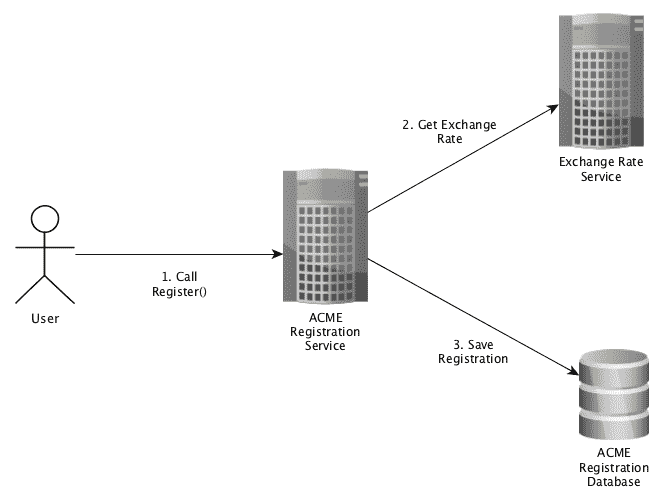

# 方法注入的依赖注入

在上一章中，我们使用构造函数来注入我们的依赖项。这样做简化了我们的对象和其依赖项的生命周期。但是当我们的依赖项对于每个请求都不同的时候会发生什么？这就是方法注入发挥作用的地方。

本章将涵盖以下主题：

+   方法注入

+   方法注入的优势

+   应用方法注入

+   方法注入的缺点

# 技术要求

熟悉我们服务的代码可能会很有益，就像第四章中介绍的那样，*ACME 注册服务简介*。

你可能还会发现阅读并运行本章的完整代码版本很有用，可在[`github.com/PacktPublishing/Hands-On-Dependency-Injection-in-Go/tree/master/ch07`](https://github.com/PacktPublishing/Hands-On-Dependency-Injection-in-Go/tree/master/ch07)找到。

有关如何获取代码和配置示例服务的说明，请参阅 README 文件，位于[`github.com/PacktPublishing/Hands-On-Dependency-Injection-in-Go/`](https://github.com/PacktPublishing/Hands-On-Dependency-Injection-in-Go/)。

您可以在`ch07/acme`中找到我们的服务代码，并已应用了本章的更改。

# 方法注入

方法注入随处可见。你可能每天都在使用它，甚至都没有意识到。你有没有写过这样的代码？：

```go
fmt.Fprint(os.Stdout, "Hello World")
```

这样怎么样？：

```go
req, err := http.NewRequest("POST", "/login", body)
```

这就是方法注入——将依赖项作为参数传递给请求。

让我们更详细地检查之前的例子。`Fprint()`的函数签名如下：

```go
// Fprint formats using the default formats for its operands and writes 
// to w. It returns the number of bytes written and any write error 
// encountered.
func Fprint(w io.Writer, a ...interface{}) (n int, err error)
```

正如你所看到的，第一个参数`io.Writer`是这个函数的一个依赖项。这与任何其他函数调用不同的是，依赖项为函数调用提供了调用上下文或数据。

在第一个例子中，依赖是必需的，因为它被用作输出目的地。然而，在方法注入中使用的依赖项并不总是必需的。有时，依赖是可选的，就像我们在下面的例子中看到的那样：

```go
func NewRequest(method, url string, body io.Reader) (*http.Request, error) {
   // validate method
   m, err := validateMethod(method)
   if err != nil {
      return nil, err
   }

   // validate URL
   u, err := validateURL(url)
   if err != nil {
      return nil, err
   }

   // process body (if exists)
   var b io.ReadCloser
   if body != nil {
      // read body
      b = ioutil.NopCloser(body)
   }

   // build Request and return
   req := &http.Request{
      URL:    u,
      Method: m,
      Body:   b,
   }

   return req, nil
}
```

这不是标准库中的实际实现；我已经简化了它以突出关键部分。在前面的例子中，`io.Reader`是可选的，因此受到守卫条款的保护。

在应用方法注入时，依赖项是特定于当前调用的，并且我们经常会发现自己需要守卫条款。为了帮助我们决定是否包含守卫条款，让我们深入研究一下我们的例子。

在`fmt.Fprint()`标准库实现中，对`io.Writer`没有守卫条款，这意味着提供`nil`将导致函数发生 panic。这是因为没有`io.Writer`，输出就无处可去。

然而，在`http.NewRequest()`的实现中，有一个守卫条款，因为可能发出不包含请求体的 HTTP 请求。

那么，对于我们编写的函数来说意味着什么呢？在大多数情况下，我们应该避免编写可能导致崩溃的代码。让我们实现一个类似于`Fprint()`的函数，并看看是否可以避免崩溃。这是第一个粗糙的实现（带有 panic）：

```go
// TimeStampWriterV1 will output the supplied message to 
//writer preceded with a timestamp
func TimeStampWriterV1(writer io.Writer, message string) {
   timestamp := time.Now().Format(time.RFC3339)
   fmt.Fprintf(writer, "%s -> %s", timestamp, message)
}
```

避免`nil`写入器引起的 panic 的第一件事是什么？

我们可以添加一个守卫条款，并在未提供`io.Writer`时返回错误，如下面的代码所示：

```go
// TimeStampWriterV2 will output the supplied message to 
//writer preceded with a timestamp
func TimeStampWriterV2(writer io.Writer, message string) error {
   if writer == nil {
      return errors.New("writer cannot be nil")
   }

   timestamp := time.Now().Format(time.RFC3339)
   fmt.Fprintf(writer,"%s -> %s", timestamp, message)

   return nil
}
```

虽然这看起来和感觉起来仍然像是常规的有效的 Go 代码，但我们现在有一个只有在我们程序员犯错时才会发生的错误。一个更好的选择是*合理的默认值*，如下面的代码所示：

```go
// TimeStampWriterV3 will output the supplied message to 
//writer preceded with a timestamp
func TimeStampWriterV3(writer io.Writer, message string) {
   if writer == nil {
      // default to Standard Out
      writer = os.Stdout
   }

   timestamp := time.Now().Format(time.RFC3339)
   fmt.Fprintf(writer,"%s -> %s", timestamp, message)
}
```

这种技术称为**防御性编码**。其核心概念是*即使体验降级，也比崩溃更好*。

尽管这些示例都是函数，但方法注入可以以完全相同的方式与结构体一起使用。有一个警告——不要将注入的依赖保存为成员变量。我们使用方法注入是因为依赖项提供函数调用上下文或数据。将依赖项保存为成员变量会导致它在调用之间共享，从而在请求之间泄漏此上下文。

# 方法注入的优势

正如我们在前一节中看到的，方法注入在标准库中被广泛使用。当您想要编写自己的共享库或框架时，它也非常有用。它的用途并不止于此。

**它在函数中表现出色**——每个人都喜欢一个好函数，特别是那些遵循*单一责任原则*部分的函数，如第二章中所讨论的*Go 的 SOLID 设计原则*。它们简单、无状态，并且可以被高度重用。将方法注入到函数中将通过将依赖项转换为抽象来增加其可重用性。考虑以下 HTTP 处理程序：

```go
func HandlerV1(response http.ResponseWriter, request *http.Request) {
   garfield := &Animal{
      Type: "Cat",
      Name: "Garfield",
   }

   // encode as JSON and output
   encoder := json.NewEncoder(response)
   err := encoder.Encode(garfield)
   if err != nil {
      response.WriteHeader(http.StatusInternalServerError)
      return
   }

   response.WriteHeader(http.StatusOK)
}
```

简单明了。它构建一个 Go 对象，然后将对象的内容作为 JSON 写入响应。很容易想象，我们接下来编写的下一个 HTTP 处理程序也将具有相同的最终九行。因此，让我们将它们提取到一个函数中，而不是复制和粘贴：

```go
func outputAnimal(response http.ResponseWriter, animal *Animal) {
   encoder := json.NewEncoder(response)
   err := encoder.Encode(animal)
   if err != nil {
      response.WriteHeader(http.StatusInternalServerError)
      return
   }

   // Happy Path
   response.WriteHeader(http.StatusOK)
}
```

现在让我们检查函数的输入；我们如何使这些更通用或抽象？

虽然 JSON 编码器只需要`io.Writer`而不是完整的`http.ResponseWriter`，但我们也输出 HTTP 状态码。因此，除了定义我们自己的接口之外，这是我们能做的最好的了。第二个参数是`*Animal`。在我们的函数中，我们实际上需要的最少是什么？

我们只使用`*Animal`作为 JSON 编码器的输入，其函数签名为

`Encode(v interface{}) error`。因此，我们可以减少我们的参数以匹配，得到以下结果：

```go
func outputJSON(response http.ResponseWriter, data interface{}) {
   encoder := json.NewEncoder(response)
   err := encoder.Encode(data)
   if err != nil {
      response.WriteHeader(http.StatusInternalServerError)
      return
   }

   // Happy Path
   response.WriteHeader(http.StatusOK)
}
```

通常，我避免使用`interface{}`，因为它的使用会导致代码中充斥着类型转换和使代码更难阅读的语句。然而，在这种情况下，这是最好（也是唯一）的选择。

与其他章节中基于*接口隔离原则*的示例类似，最好是在函数或方法旁边定义最小可能的接口；或者如果可能的话，使用标准库中适当的最小接口（如`io.Writer`）。

**依赖项充当数据**——因为方法注入要求用户在每次调用时传入依赖项，这对依赖项和使用之间的关系产生了一些有趣的副作用。依赖项成为请求中的数据的一部分，并且可以极大地改变调用的结果。考虑以下代码：

```go
func WriteLog(writer io.Writer, message string) error {
   _, err := writer.Write([]byte(message))
   return err
}
```

一个非常无害和直接的函数，但是看看当我们提供一些不同的依赖项时会发生什么：

```go
// Write to console
WriteLog(os.Stdout, "Hello World!")

// Write to file
file, _ := os.Create("my-log.log")
WriteLog(file, "Hello World!")

// Write to TCP connection
tcpPipe, _ := net.Dial("tcp", "127.0.0.1:1234")
WriteLog(tcpPipe, "Hello World!")
```

**依赖项是请求范围的**——这些依赖项根据定义一直在被创建和销毁。因此，它们不适合构造函数注入甚至猴子补丁。当然，我们可以在每个请求中创建使用依赖项的对象，但这既不高效也不总是必要的。

让我们看一个 HTTP 请求处理程序：

```go
// LoadOrderHandler is a HTTP handler that loads orders based on the current user and supplied user ID
type LoadOrderHandler struct {
   loader OrderLoader
}

// ServeHTTP implements http.Handler
func (l *LoadOrderHandler) ServeHTTP(response http.ResponseWriter, request *http.Request) {
   // extract user from supplied authentication credentials
   currentUser, err := l.authenticateUser(request)
   if err != nil {
      response.WriteHeader(http.StatusUnauthorized)
      return
   }

   // extract order ID from request
   orderID, err := l.extractOrderID(request)
   if err != nil {
      response.WriteHeader(http.StatusBadRequest)
      return
   }

   // load order using the current user as a request-scoped dependency
   // (with method injection)
   order, err := l.loader.loadOrder(currentUser, orderID)
   if err != nil {
      response.WriteHeader(http.StatusInternalServerError)
      return
   }

   // output order
   encoder := json.NewEncoder(response)
   err = encoder.Encode(order)
   if err != nil {
      response.WriteHeader(http.StatusInternalServerError)
      return
   }

   response.WriteHeader(http.StatusOK)
}
```

作为 HTTP 处理程序，`ServeHTTP()`方法将针对每个传入的 HTTP 请求调用一次。`LoadOrderHandler`依赖于`OrderLoader`，我们将使用构造函数注入我们的实现`AuthenticatedLoader`。

`AuthenticatedLoader`的实现可以在以下代码中看到：

```go
// AuthenticatedLoader will load orders for based on the supplied owner
type AuthenticatedLoader struct {
   // This pool is expensive to create.  
   // We will want to create it once and then reuse it.
   db *sql.DB
}

// load the order from the database based on owner and order ID
func (a *AuthenticatedLoader) loadByOwner(owner Owner, orderID int) (*Order, error) {
   order, err := a.load(orderID)
   if err != nil {
      return nil, err
   }

   if order.OwnerID != owner.ID() {
      // Return not found so we do not leak information to hackers
      return nil, errNotFound
   }

   // happy path
   return order, nil
}
```

正如您所看到的，`AuthenticatedLoader`依赖于数据库连接池；这很昂贵，所以我们不希望在每个请求中重新创建它。

`loadByOwner()`函数接受使用方法注入的`Owner`。我们在这里使用方法注入，因为我们期望`Owner`会随着每个请求而变化。

这个例子使用构造函数注入长期依赖项和方法注入请求范围的依赖项。这样，我们就不会不必要地创建和销毁对象。

**协助不可变性、无状态性和并发性**—你可能会指责我有点夸大其词，但在编写一些非常并发的 Go 系统之后，我发现无状态和/或不可变的对象不太容易出现与并发相关的问题。方法注入本身并不赋予这些特性，但确实使其更容易实现。通过传递依赖项，所有权和使用范围更加清晰。此外，我们不需要担心对依赖项的并发访问，就像它是成员变量一样。

# 应用方法注入

在本节中，我们将通过应用方法注入来改进我们的 ACME 注册服务，也许会用到我最喜欢的 Go 标准库中的包，上下文包。该包的核心是`Context`接口，它自述如下：

**上下文在 API 边界跨越期限、取消信号和请求范围值。它的方法可以同时被多个 goroutine 安全使用**

那么，为什么我这么喜欢它呢？通过应用方法注入，以上下文作为依赖项，我能够构建我的处理逻辑，以便可以自动取消和清理所有内容。

# 快速回顾

在我们深入改变之前，让我们更深入地看一下我们示例服务提供的注册函数及其与外部资源的交互。以下图表概述了在调用注册端点时执行的步骤：



这些交互如下：

1.  用户调用注册端点。

1.  我们的服务调用**汇率服务**。

1.  我们的服务将注册信息保存到数据库中。

现在让我们考虑这些交互可能出现的问题。问问自己以下问题：

+   可能会失败或变慢的是什么？

+   我希望如何对失败做出反应或恢复？

+   我的用户会如何对我的失败做出反应？

考虑到我们函数中的交互，立即想到两个问题：

+   **对数据库的调用可能会失败或变慢：**我们如何从中恢复？我们可以进行重试，但这一点我们必须非常小心。数据库往往更像是有限资源而不是 web 服务。因此，重试请求实际上可能会进一步降低数据库的性能。

+   **对汇率服务的调用可能会失败或变慢：**我们如何从中恢复？我们可以自动重试失败的请求。这将减少我们无法加载汇率的情况。假设业务批准，我们可以设置一些默认汇率来使用，而不是完全失败注册。

我们可以做出的最好的改变来提高系统的稳定性可能会让你感到意外。

我们可以根本不发出请求。如果我们能够改变注册流程，使得在处理的这一部分不需要汇率，那么它就永远不会给我们带来问题。

假设在我们（刻意制造的）例子中，前面提到的解决方案都不可用。我们唯一剩下的选择就是失败。如果加载汇率花费的时间太长，用户放弃并取消他们的请求会发生什么？他们很可能会认为注册失败，希望再次尝试。

考虑到这一点，我们最好的做法是放弃等待汇率，不再进一步处理注册。这个过程被称为**提前停止**。

# 提前停止

提前停止是基于外部信号中止处理请求的过程（在本应完成之前）。

在我们的情况下，外部信号将是用户 HTTP 请求的取消。在 Go 中，`http.Request`对象包括一个`Context()`方法；以下是该方法文档的摘录：

对于传入的服务器请求，当客户端的连接关闭时，请求被取消（使用 HTTP/2），或者当 ServeHTTP 方法返回时，上下文被取消。

当请求被取消时意味着什么？对我们来说最重要的是，这意味着没有人在等待响应。

如果用户放弃等待响应，他们很可能会认为请求失败，并希望再次尝试。

我们应该如何对这种情况做出反应取决于我们正在实现的功能，但在许多情况下，主要是与加载或获取数据相关的功能，最有效的响应是停止处理请求。

对于我们服务的注册端点，这是我们选择的选项。我们将通过方法注入从请求中传递`Context`到我们代码的所有层。如果用户取消他们的请求，我们将立即停止处理请求。

既然我们清楚我们要达到什么目标，让我们从内部开始将方法注入到我们服务的层中。我们需要从内部开始，以确保我们的代码和测试在重构过程中保持运行。

# 将方法注入应用到数据包

快速提醒，`data`包是一个提供对底层 MySQL 数据库的简化和抽象访问的**数据访问层**（**DAL**）。

以下是`Save()`函数的当前代码：

```go
// Save will save the supplied person and return the ID of the newly 
// created person or an error.
// Errors returned are caused by the underlying database or our 
// connection to it.
func Save(in *Person) (int, error) {
   db, err := getDB()
   if err != nil {
      logging.L.Error("failed to get DB connection. err: %s", err)
      return defaultPersonID, err
   }

   // perform DB insert
   result, err := db.Exec(sqlInsert, in.FullName, in.Phone, in.Currency, in.Price)
   if err != nil {
      logging.L.Error("failed to save person into DB. err: %s", err)
      return defaultPersonID, err
   }

   // retrieve and return the ID of the person created
   id, err := result.LastInsertId()
   if err != nil {
      logging.L.Error("failed to retrieve id of last saved person. err: %s", err)
      return defaultPersonID, err
   }

   return int(id), nil
}
```

通过应用方法注入，我们得到了以下结果：

```go
// Save will save the supplied person and return the ID of the newly 
// created person or an error.
// Errors returned are caused by the underlying database or our 
// connection to it.
func Save(ctx context.Context, in *Person) (int, error) {
   db, err := getDB()
   if err != nil {
      logging.L.Error("failed to get DB connection. err: %s", err)
      return defaultPersonID, err
   }

   // perform DB insert
   result, err := db.ExecContext(ctx, sqlInsert, in.FullName, in.Phone, in.Currency, in.Price)
   if err != nil {
      logging.L.Error("failed to save person into DB. err: %s", err)
      return defaultPersonID, err
   }

   // retrieve and return the ID of the person created
   id, err := result.LastInsertId()
   if err != nil {
      logging.L.Error("failed to retrieve id of last saved person. err: %s", err)
      return defaultPersonID, err
   }

   return int(id), nil
}
```

如您所见，我们将`Exec()`调用替换为`ExecContext()`，但其他方面没有改变。因为我们已经改变了函数签名，我们还需要更新对该包的使用如下：

```go
// save the registration
func (r *Registerer) save(in *data.Person, price float64) (int, error) {
   person := &data.Person{
      FullName: in.FullName,
      Phone:    in.Phone,
      Currency: in.Currency,
      Price:    price,
   }
   return saver(context.TODO(), person)
}

// this function as a variable allows us to Monkey Patch during testing
var saver = data.Save

```

您会注意到我们使用了`context.TODO()`；它在这里被用作占位符，直到我们可以将`save()`方法重构为使用方法注入为止。在更新了我们在重构过程中破坏的测试之后，我们可以继续进行下一个包。

# 将方法注入应用到 exchange 包

`exchange`包负责从上游服务加载当前的货币兑换率（例如，马来西亚林吉特兑澳大利亚元），与数据包类似，它提供了对这些数据的简化和抽象访问。

以下是当前代码的相关部分：

```go
// Converter will convert the base price to the currency supplied
type Converter struct{}

// Do will perform the load
func (c *Converter) Do(basePrice float64, currency string) (float64, error) {
   // load rate from the external API
   response, err := c.loadRateFromServer(currency)
   if err != nil {
      return defaultPrice, err
   }

   // extract rate from response
   rate, err := c.extractRate(response, currency)
   if err != nil {
      return defaultPrice, err
   }

   // apply rate and round to 2 decimal places
   return math.Floor((basePrice/rate)*100) / 100, nil
}

// load rate from the external API
func (c *Converter) loadRateFromServer(currency string) (*http.Response, error) {
   // build the request
   url := fmt.Sprintf(urlFormat,
      config.App.ExchangeRateBaseURL,
      config.App.ExchangeRateAPIKey,
      currency)

   // perform request
   response, err := http.Get(url)
   if err != nil {
      logging.L.Warn("[exchange] failed to load. err: %s", err)
      return nil, err
   }

   if response.StatusCode != http.StatusOK {
      err = fmt.Errorf("request failed with code %d", response.StatusCode)
      logging.L.Warn("[exchange] %s", err)
      return nil, err
   }

   return response, nil
}
```

第一个变化与之前的相同。在`Do()`和`loadRateFromServer()`方法上进行简单的方法注入，将这些方法签名更改为以下内容：

```go
// Converter will convert the base price to the currency supplied
type Converter struct{}

// Do will perform the load
func (c *Converter) Do(ctx context.Context, basePrice float64, currency string) (float64, error) {

}

// load rate from the external API
func (c *Converter) loadRateFromServer(ctx context.Context, currency string) (*http.Response, error) {

}
```

不幸的是，没有`http.GetWithContext()`方法，所以我们需要以稍微冗长的方式构建请求并设置上下文，得到以下结果：

```go
// load rate from the external API
func (c *Converter) loadRateFromServer(ctx context.Context, currency string) (*http.Response, error) {
   // build the request
   url := fmt.Sprintf(urlFormat,
      config.App.ExchangeRateBaseURL,
      config.App.ExchangeRateAPIKey,
      currency)

   // perform request
   req, err := http.NewRequest("GET", url, nil)
   if err != nil {
      logging.L.Warn("[exchange] failed to create request. err: %s", err)
      return nil, err
   }

   // replace the default context with our custom one
   req = req.WithContext(ctx)

   // perform the HTTP request
   response, err := http.DefaultClient.Do(req)
   if err != nil {
      logging.L.Warn("[exchange] failed to load. err: %s", err)
      return nil, err
   }

   if response.StatusCode != http.StatusOK {
      err = fmt.Errorf("request failed with code %d", response.StatusCode)
      logging.L.Warn("[exchange] %s", err)
      return nil, err
   }

   return response, nil
}
```

与之前一样，我们还需要在调用`exchange`包的模型层中使用`context.TODO()`，直到我们有机会将它们改为方法注入。完成了两个*底层*软件层（`data`和`exchange`包）后，我们可以继续进行下一个软件层、业务层或模型层。

# 将方法注入应用到模型层（Get、List 和 Register 包）

以前，在我们调用`data`或`exchange`包的地方，我们使用`context.TODO()`来确保代码仍然可以编译，并且我们的测试继续发挥作用。现在是时候将方法注入应用到模型层，并用注入的上下文替换`context.TODO()`的调用。首先，我们将`getPrice()`和`save()`方法更改为接受上下文：

```go
// get price in the requested currency
func (r *Registerer) getPrice(ctx context.Context, currency string) (float64, error) {
   converter := &exchange.Converter{}
   price, err := converter.Do(ctx, config.App.BasePrice, currency)
   if err != nil {
      logging.L.Warn("failed to convert the price. err: %s", err)
      return defaultPersonID, err
   }

   return price, nil
}

// save the registration
func (r *Registerer) save(ctx context.Context, in *data.Person, price float64) (int, error) {
   person := &data.Person{
      FullName: in.FullName,
      Phone:    in.Phone,
      Currency: in.Currency,
      Price:    price,
   }
   return saver(ctx, person)
}
```

然后我们可以更新包的公共 API 函数`Do()`：

```go
type Registerer struct {}

func (r *Registerer) Do(ctx context.Context, in *data.Person) (int, error) {
   // validate the request
   err := r.validateInput(in)
   if err != nil {
      logging.L.Warn("input validation failed with err: %s", err)
      return defaultPersonID, err
   }

   // get price in the requested currency
   price, err := r.getPrice(ctx, in.Currency)
   if err != nil {
      return defaultPersonID, err
   }

   // save registration
   id, err := r.save(ctx, in, price)
   if err != nil {
      // no need to log here as we expect the data layer to do so
      return defaultPersonID, err
   }

   return id, nil
}

```

我们已经将传递给数据和`exchange`包的`Context`对象合并为一个单一的注入依赖项；这是一个我们可以从 REST 包中的`http.Request`中提取的依赖项。

# 将上下文的方法注入到 REST 包中

最后，现在是关键的更改。首先，我们从请求中提取上下文：

```go
// ServeHTTP implements http.Handler
func (h *RegisterHandler) ServeHTTP(response http.ResponseWriter, request *http.Request) {
   // extract payload from request
   requestPayload, err := h.extractPayload(request)
   if err != nil {
      // output error
      response.WriteHeader(http.StatusBadRequest)
      return
   }

   // call the business logic using the request data and context
   id, err := h.register(request.Context(), requestPayload)
   if err != nil {
      // not need to log here as we can expect other layers to do so
      response.WriteHeader(http.StatusBadRequest)
      return
   }

   // happy path
   response.Header().Add("Location", fmt.Sprintf("/person/%d/", id))
   response.WriteHeader(http.StatusCreated)
}
```

然后我们将其传递给模型：

```go

// call the logic layer
func (h *RegisterHandler) register(ctx context.Context, requestPayload *registerRequest) (int, error) {
   person := &data.Person{
      FullName: requestPayload.FullName,
      Phone:    requestPayload.Phone,
      Currency: requestPayload.Currency,
   }

   return h.registerer.Do(ctx, person)
}
```

经过了许多*太简单*的更改之后，我们已经将方法注入应用到了注册端点的所有层。

让我们来看看我们取得了什么成就。我们的处理现在与请求的执行上下文相关联。因此，当请求被取消时，我们将立即停止处理该请求。

但这为什么重要呢？有两个原因；第一个和最重要的是用户期望。如果用户取消了请求，无论是手动还是通过超时，他们将看到一个错误。他们会得出结论，处理已失败。如果我们继续处理请求并设法完成它，这将违背他们的期望。

第二个原因更加务实；当我们停止处理请求时，我们减少了服务器和上游的负载。这种释放的容量随后可以用于处理其他请求。

当涉及满足用户期望时，上下文包实际上可以做更多的事情。我们可以添加延迟预算。

# 延迟预算

与许多 IT 术语一样，延迟预算可以以多种方式使用。在这种情况下，我们指的是调用允许的最长时间。

将这些转化为我们当前的重构，它涉及两件事：

+   允许上游（数据库或汇率服务）调用完成的最长时间

+   我们的注册 API 允许的最长完成时间

你可以看到这两件事情是如何相关的。让我们看看我们的 API 响应时间是如何组成的：

*API 响应时间 =（汇率服务调用+数据库调用+我们的代码）*

假设*我们的代码*的性能主要是一致的，那么我们的服务质量直接取决于上游调用的速度。这不是一个非常舒适的位置，那么我们能做什么呢？

在前一节中，我们检查了这些失败和一些选项，并决定暂时要失败请求。我们能为用户提供的最好的失败是什么？一个及时而有信息的失败。

为了实现这一点，我们将使用`context.Context`接口的另一个特性：

`WithTimeout(parent Context, timeout time.Duration) (Context, CancelFunc)`

你可能已经猜到了，这种方法在上下文中设置了一个超时。这个超时将作为一个计时器，如果超过了延迟预算（超时），上下文将被取消。然后，因为我们已经设置了停止短路，我们的请求将停止处理并退出。

首先，让我们将其应用到我们的数据库调用中。在下一个示例中，我们将从原始上下文中创建一个*子上下文*并为其设置一个超时。由于上下文是分层的，我们应用的超时只适用于子上下文和我们从中创建的任何上下文。

在我们的情况下，我们已经决定对数据库的调用的延迟预算为 1 秒，如下所示：

```go
// Save will save the supplied person and return the ID of the newly 
// created person or an error.
// Errors returned are caused by the underlying database or our 
// connection to it.
func Save(ctx context.Context, in *Person) (int, error) {
   db, err := getDB()
   if err != nil {
      logging.L.Error("failed to get DB connection. err: %s", err)
      return defaultPersonID, err
   }

   // set latency budget for the database call
   subCtx, cancel := context.WithTimeout(ctx, 1*time.Second)
   defer cancel()

   // perform DB insert
   result, err := db.ExecContext(subCtx, sqlInsert, in.FullName, in.Phone, in.Currency, in.Price)
   if err != nil {
      logging.L.Error("failed to save person into DB. err: %s", err)
      return defaultPersonID, err
   }

   // retrieve and return the ID of the person created
   id, err := result.LastInsertId()
   if err != nil {
      logging.L.Error("failed to retrieve id of last saved person. err: %s", err)
      return defaultPersonID, err
   }

   return int(id), nil
}
```

现在，让我们将延迟预算应用到交换服务调用中。为此，我们将使用`http.Request`的另一个特性，`Context()`方法，文档如下：

**对于出站客户端请求，上下文控制取消**

为了在我们的出站 HTTP 请求上设置延迟预算，我们将创建另一个子上下文，就像我们为数据库做的那样，然后使用`WithRequest()`方法将该上下文设置到请求中。在这些更改之后，我们的代码看起来像这样：

```go
// load rate from the external API
func (c *Converter) loadRateFromServer(ctx context.Context, currency string) (*http.Response, error) {
   // build the request
   url := fmt.Sprintf(urlFormat,
      config.App.ExchangeRateBaseURL,
      config.App.ExchangeRateAPIKey,
      currency)

   // perform request
   req, err := http.NewRequest("GET", url, nil)
   if err != nil {
      logging.L.Warn("[exchange] failed to create request. err: %s", err)
      return nil, err
   }

   // set latency budget for the upstream call
   subCtx, cancel := context.WithTimeout(ctx, 1*time.Second)
   defer cancel()

   // replace the default context with our custom one
   req = req.WithContext(subCtx)

   // perform the HTTP request
   response, err := http.DefaultClient.Do(req)
   if err != nil {
      logging.L.Warn("[exchange] failed to load. err: %s", err)
      return nil, err
   }

   if response.StatusCode != http.StatusOK {
      err = fmt.Errorf("request failed with code %d", response.StatusCode)
      logging.L.Warn("[exchange] %s", err)
      return nil, err
   }

   return response, nil
}
```

有了这些更改，让我们重新审视我们的 API 响应时间公式，并考虑最坏的情况-两个调用都花了不到 1 秒的时间但成功完成，给我们这个：

*API 响应时间 =（~1 秒+ ~1 秒+我们的代码）*

这给我们一个大约 2 秒的最大执行时间。但是如果我们决定允许自己的最大响应时间是 1.5 秒呢？

幸运的是，我们也可以轻松做到这一点。早些时候，我提到过上下文是分层的。我们所有的上下文当前都是从请求中的上下文派生出来的。虽然我们无法更改作为请求一部分的上下文，但我们可以从中派生出一个具有我们 API 的延迟预算的上下文，然后将其传递给数据和交换包。处理程序的更新部分如下所示：

```go
// ServeHTTP implements http.Handler
func (h *RegisterHandler) ServeHTTP(response http.ResponseWriter, request *http.Request) {
   // set latency budget for this API
   subCtx, cancel := context.WithTimeout(request.Context(), 1500 *time.Millisecond)
   defer cancel()

   // extract payload from request
   requestPayload, err := h.extractPayload(request)
   if err != nil {
      // output error
      response.WriteHeader(http.StatusBadRequest)
      return
   }

   // register person
   id, err := h.register(subCtx, requestPayload)
   if err != nil {
      // not need to log here as we can expect other layers to do so
      response.WriteHeader(http.StatusBadRequest)
      return
   }

   // happy path
   response.Header().Add("Location", fmt.Sprintf("/person/%d/", id))
   response.WriteHeader(http.StatusCreated)
}
```

经过一些简单的更改，我们可以更好地控制我们的 API 的性能，这要归功于上下文包和一点点方法注入。

# 方法注入的缺点

我没有为您列出很长的缺点；事实上，我只有两个。

**添加参数会降低用户体验** - 这是一个相当大的问题。向方法或函数添加参数会降低函数的用户体验。正如我们在第三章中所看到的，*为用户体验编码*，函数的糟糕用户体验会对其可用性产生负面影响。

考虑以下结构：

```go
// Load people from the database
type PersonLoader struct {
}

func (d *PersonLoader) Load(db *sql.DB, ID int) (*Person, error) {
   return nil, errors.New("not implemented")
}

func (d *PersonLoader) LoadAll(db *sql.DB) ([]*Person, error) {
   return nil, errors.New("not implemented")
}
```

这段代码有效，完成了任务。但是每次都必须传入数据库很烦人。除此之外，没有保证调用`Load()`的代码也会维护数据库池。

另一个要考虑的方面是封装。这些函数的用户是否需要知道它们依赖于数据库？请试着站在一会儿`Load()`函数的用户的角度。你想做什么，你知道什么？

你想加载一个人，你知道那个人的 ID。你不知道（或者不关心）数据来自哪里。如果你为自己设计这个函数，它会是什么样子：

```go
type MyPersonLoader interface {
   Load(ID int) (*Person, error)
}
```

它简洁易用，没有泄漏任何实现细节。

让我们看另一个例子：

```go
type Generator struct{}

func (g *Generator) Generate(storage Storage, template io.Reader, destination io.Writer, renderer Renderer, formatter Formatter, params ...interface{}) {

}
```

在这种情况下，我们有很多参数，很难将数据与非请求范围的依赖项分开。如果我们提取这些依赖项，我们会得到以下结果：

```go
func NewGeneratorV2(storage Storage, renderer Renderer, formatter Formatter) *GeneratorV2 {
   return &GeneratorV2{
      storage:   storage,
      renderer:  renderer,
      formatter: formatter,
   }
}

type GeneratorV2 struct {
   storage   Storage
   renderer  Renderer
   formatter Formatter
}

func (g *GeneratorV2) Generate(template io.Reader, destination io.Writer, params ...interface{}) {

}
```

虽然第二个例子中的用户体验更好，但仍然相当繁琐。代码可以从不同的角度受益，比如组合。

**适用性有限** - 正如我们在本章中所看到的，方法注入在函数和请求范围的依赖项中表现出色。虽然这种用例确实经常出现，但方法注入并不适用于非请求范围的依赖项，而这是我们想要使用**依赖注入**（**DI**）的大部分用例。

# 总结

在本章中，我们研究了方法注入的 DI，这可能是所有形式的 DI 中最普遍的。

当涉及从现有代码中提取依赖项以进行测试时，可能会首先想到的就是方法。请小心，我们不想引入*测试引起的损害*。

为了测试的唯一目的向导出的 API 函数添加参数无疑会损害 UX 代码。幸运的是，我们有一些技巧可用来避免损害我们的 API。我们可以定义仅存在于测试代码中的成员函数。我们还可以使用**即时**（**JIT**）依赖注入，我们将在第九章中进行探讨，*即时依赖注入*。

在本章中，我们已经研究了出色而强大的`context`包。您可能会惊讶地发现，我们可以从这个包中提取更多的价值。我鼓励您查看 Go 博客（[`blog.golang.org/context`](https://blog.golang.org/context)）并自行调查这个包。

在下一章中，我们将应用一种特定形式的构造函数注入和方法注入，称为**DI by config**。通过它，我们最终将`config`包从我们服务中几乎每个其他包都依赖的状态中解脱出来，使我们的包更加解耦，并显著提高它们的可重用性。

# 问题

1.  方法注入的理想用例是什么？

1.  为什么不保存使用方法注入注入的依赖关系很重要？

1.  如果我们过度使用方法注入会发生什么？

1.  为什么“停止短”对整个系统有用？

1.  延迟预算如何改善用户体验？
