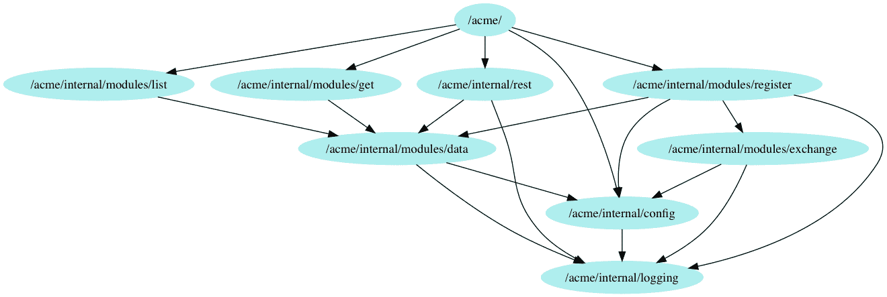
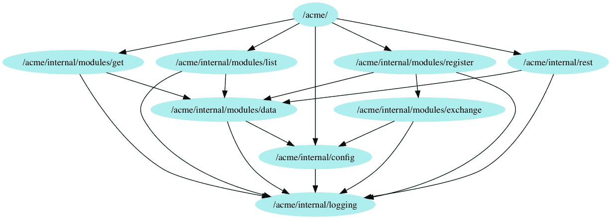
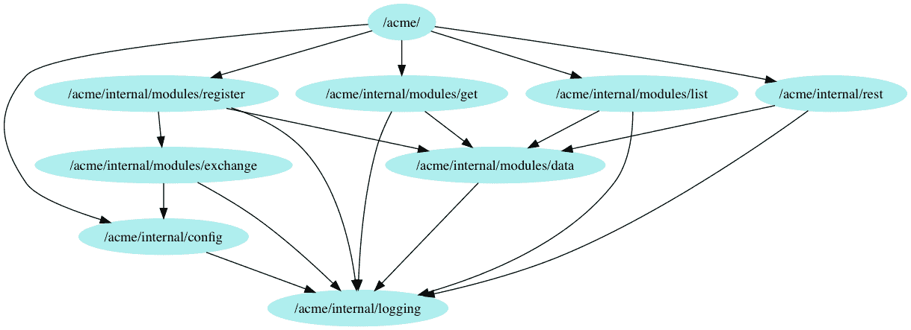
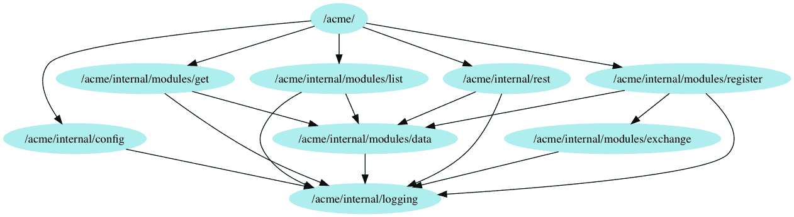

# 通过配置进行依赖注入

在本章中，我们将通过配置来看**依赖注入**（**DI**）。配置注入不是一种完全不同的方法，而是构造函数注入和方法注入的扩展。

它旨在解决这些方法可能存在的问题，比如过多或重复注入的依赖项，而不牺牲我们代码的用户体验。

本章将涵盖以下主题：

+   配置注入

+   配置注入的优点

+   应用配置注入

+   配置注入的缺点

# 技术要求

熟悉我们在第四章中介绍的服务代码将是有益的，*ACME 注册服务简介*。本章还假设您已经阅读了第六章，*构造函数注入的依赖注入*，和第七章，*方法注入的依赖注入*。

您可能还会发现阅读和运行本章的完整代码版本很有用，可在[`github.com/PacktPublishing/Hands-On-Dependency-Injection-in-Go/tree/master/ch08`](https://github.com/PacktPublishing/Hands-On-Dependency-Injection-in-Go/tree/master/ch08)找到。

获取代码并配置示例服务的说明可在此处的 README 中找到：[`github.com/PacktPublishing/Hands-On-Dependency-Injection-in-Go/`](https://github.com/PacktPublishing/Hands-On-Dependency-Injection-in-Go/)

您可以在`ch08/acme`中找到我们的服务代码，并已应用了本章的更改。

# 配置注入

配置注入是方法和参数注入的特定实现。通过配置注入，我们将多个依赖项和系统级配置合并到一个`config`接口中。

考虑以下构造函数：

```go
// NewLongConstructor is the constructor for MyStruct
func NewLongConstructor(logger Logger, stats Instrumentation, limiter RateLimiter, cache Cache, timeout time.Duration, workers int) *MyStruct {
 return &MyStruct{
 // code removed
 }
}
```

正如你所看到的，我们正在注入多个依赖项，包括记录器、仪器、速率限制器、缓存和一些配置。

可以肯定地假设我们很可能会将记录器和仪器注入到这个项目中的大多数对象中。这导致每个构造函数至少有两个参数。在整个系统中，这将增加大量额外的输入。它还通过使构造函数更难阅读来减少了我们的构造函数的用户体验，并且可能会隐藏重要参数。

考虑一下——超时和工作人数的值可能定义在哪里？它们可能是从某个中央来源定义的，比如一个`config`文件。

通过应用配置注入，我们的示例变成了以下内容：

```go
// NewByConfigConstructor is the constructor for MyStruct
func NewByConfigConstructor(cfg MyConfig, limiter RateLimiter, cache Cache) *MyStruct {
   return &MyStruct{
      // code removed
   }
}
```

我们已将常见问题和配置合并到配置定义中，但保留了重要参数。这样，函数参数仍然具有信息性，而无需阅读`config`接口定义。在某种程度上，我们隐藏或封装了常见问题。

考虑的另一个可用性方面是配置现在是一个接口。我们应该考虑哪种对象会实现这样的接口。这样的对象是否已经存在？它的责任是什么？

通常，配置来自单一来源，其责任是加载配置并提供对其的访问。即使我们引入配置接口以解耦实际的配置管理，利用它是单一来源仍然很方便。

考虑以下代码：

```go
myFetcher := NewFetcher(cfg, cfg.URL(), cfg.Timeout())
```

这段代码表明所有参数都来自同一位置。这表明它们可以合并。

如果你来自面向对象的背景，你可能熟悉服务定位器的概念。配置注入故意非常相似。然而，与典型的服务定位器用法不同，我们只提取配置和一些共享的依赖项。

配置注入采用这种方法来避免服务定位器的*上帝对象*和使用与上帝对象之间的耦合。

# 配置注入的优势

鉴于配置注入是构造函数和方法注入的扩展形式，其他方法的优点在这里也适用。在本节中，我们将仅讨论特定于此方法的附加优点。

**它非常适合与配置包解耦**-当我们有一个从单一位置加载的`config`包时，比如一个文件，那么这个包往往会成为系统中许多其他包的依赖项。考虑到第二章中的*单一职责原则*部分，我们意识到一个包或对象的用户越多，它就越难以改变。

通过配置注入，我们还在本地接口中定义我们的需求，并利用 Go 的隐式接口和**依赖反转原则**（**DIP**）来保持包的解耦。

这些步骤还使得测试我们的结构体变得更加容易。考虑以下代码：

```go
func TestInjectedConfig(t *testing.T) {
   // load test config
   cfg, err := config.LoadFromFile(testConfigLocation)
   require.NoError(t, err)

   // build and use object
   obj := NewMyObject(cfg)
   result, resultErr := obj.Do()

   // validate
   assert.NotNil(t, result)
   assert.NoError(t, resultErr)
}
```

现在，看一下使用配置注入的相同代码：

```go
func TestConfigInjection(t *testing.T) {
   // build test config
   cfg := &TestConfig{}

   // build and use object
   obj := NewMyObject(cfg)
   result, resultErr := obj.Do()

   // validate
   assert.NotNil(t, result)
   assert.NoError(t, resultErr)
}

// Simple implementation of the Config interface
type TestConfig struct {
   logger *logging.Logger
   stats  *stats.Collector
}

func (t *TestConfig) Logger() *logging.Logger {
   return t.logger
}

func (t *TestConfig) Stats() *stats.Collector {
   return t.stats
}
```

是的，代码量更大了。然而，我们不再需要管理测试配置文件，这通常会很麻烦。我们的测试是完全自包含的，不应该出现并发问题，就像全局配置对象可能出现的那样。

**减轻注入常见关注的负担**-在前面的例子中，我们使用配置注入来注入日志记录和仪表对象。这类常见关注是配置注入的一个很好的用例，因为它们经常需要，但并不涉及函数本身的目的。它们可以被视为环境依赖项。由于它们的共享性质，另一种方法是将它们转换为全局单例，而不是注入它们。个人而言，我更喜欢注入它们，因为这给了我验证它们使用的机会。这本身可能感觉奇怪，但在许多情况下，我们从仪表数据的存在或缺失构建系统监控和警报，从而使仪表成为我们代码的特性或契约的一部分，并且可能希望通过测试来防止它们的退化。

**通过减少参数来提高可用性**-与前面的优点类似，应用配置注入可以增强方法的可用性，特别是构造函数，同时减少参数的数量。考虑以下构造函数：

```go
func NewLongConstructor(logger Logger, stats Instrumentation, limiter RateLimiter, cache Cache, url string, credentials string) *MyStruct {
   return &MyStruct{
      // code removed
   }
}
```

现在，看一下使用配置注入的相同构造函数：

```go
func NewByConfigConstructor(cfg MyConfig, url string, credentials string) *MyStruct {
   return &MyStruct{
      // code removed
   }
}
```

通过从构造函数定义中移除环境依赖项，我们剩下的参数大大减少了。更重要的是，**唯一**剩下的参数是与目的相关的，因此使得方法更容易理解和使用。

**依赖项的创建可以推迟到使用时**-你是否曾经尝试注入一个依赖项，却发现它不存在或尚未准备好？你是否曾经有一个非常昂贵的依赖项，你只想在绝对必要的时候才创建它？

通过配置注入，依赖项的创建和访问只需要在使用时解决，而不是在注入时。

# 应用配置注入

之前，我提到我们的 ACME 注册服务有一些问题，我真的希望我们能解决。在这一部分，我们将使用配置注入来处理其中的两个问题。

第一个是我们的许多包都依赖于`config`和`logging`包，除了是一个重大的单一责任原则违反，这种耦合可能会导致循环依赖问题。

第二个问题是我们无法在不实际调用上游服务的情况下测试我们对汇率的调用。到目前为止，我们已经避免在这个包中添加任何测试，因为我们担心我们的测试会受到该服务的影响（在速度和稳定性方面）。

首先，让我们看看我们现在的情况。我们的依赖图目前如下图所示：



正如你所看到的，我们有四个包（`data`，`register`，`exchange`和`main`）依赖于`config`包，还有五个（`data`，`register`，`exchange`，`rest`和`config`）依赖于`logging`包。也许更糟糕的是这些包如何依赖于`config`和`logging`包。目前，它们直接访问公共单例。这意味着当我们想要测试我们的记录器使用或在测试期间替换一些配置时，我们将不得不进行猴子补丁，这将导致测试中的数据竞争不稳定性。

为了解决这个问题，我们将为我们的每个对象定义一个配置。每个配置将包括记录器和任何其他需要的配置。然后，我们将任何直接链接到全局变量的内容替换为对注入配置的引用。

这将导致一些大刀阔斧的手术（许多小的改变），但代码将因此变得更好。

我们只会在这里进行一组更改；如果您希望查看所有更改，请查看本章的源代码。

# 将配置注入应用到模型层

重新审视我们的`register`包，我们看到它引用了`config`和`logging`：

```go
// Registerer validates the supplied person, calculates the price in 
// the requested currency and saves the result.
// It will return an error when:
// -the person object does not include all the fields
// -the currency is invalid
// -the exchange rate cannot be loaded
// -the data layer throws an error.
type Registerer struct {
}

// get price in the requested currency
func (r *Registerer) getPrice(ctx context.Context, currency string) (float64, error) {
  converter := &exchange.Converter{}
  price, err := converter.Do(ctx, config.App.BasePrice, currency)
  if err != nil {
    logging.L.Warn("failed to convert the price. err: %s", err)
    return defaultPersonID, err
  }

  return price, nil
}
```

我们的第一步是定义一个接口，它将提供我们需要的依赖项：

```go
// Config is the configuration for the Registerer
type Config interface {
   Logger() *logging.LoggerStdOut
   BasePrice() float64
}
```

你有没有发现什么问题？首先显而易见的是我们的`Logger()`方法返回一个记录器实现的指针。这样可以工作，但不够具有未来性或可测试性。我们可以在本地定义一个`logging`接口，并完全与`logging`包解耦。然而，这意味着我们将不得不在大多数包中定义一个`logging`接口。从理论上讲，这是最好的选择，但实际上并不太实用。相反，我们可以定义一个`logging`接口，并让所有的包都依赖于它。虽然这意味着我们仍然与`logging`包保持耦合，但我们将依赖于一个很少改变的接口，而不是一个更有可能改变的实现。

第二个潜在问题是另一个方法`BasePrice()`的命名，因为它有点通用，并且可能会在以后造成混淆。它也是`Config`结构体中的字段名称，但 Go 不允许我们拥有相同名称的成员变量和方法，所以我们需要更改它。

更新我们的`config`接口后，我们有以下内容：

```go
// Config is the configuration for the Registerer
type Config interface {
  Logger() logging.Logger
  RegistrationBasePrice() float64
}
```

我们现在可以将配置注入应用到我们的`Registerer`，得到以下结果：

```go
// NewRegisterer creates and initializes a Registerer
func NewRegisterer(cfg Config) *Registerer {
   return &Registerer{
      cfg: cfg,
   }
}

// Config is the configuration for the Registerer
type Config interface {
   Logger() logging.Logger
   RegistrationBasePrice() float64
}

// Registerer validates the supplied person, calculates the price in 
// the requested currency and saves the result.
// It will return an error when:
// -the person object does not include all the fields
// -the currency is invalid
// -the exchange rate cannot be loaded
// -the data layer throws an error.
type Registerer struct {
   cfg Config
}

// get price in the requested currency
func (r *Registerer) getPrice(ctx context.Context, currency string) (float64, error) {
   converter := &exchange.Converter{}
   price, err := converter.Do(ctx, r.cfg.RegistrationBasePrice(), currency)
   if err != nil {
      r.logger().Warn("failed to convert the price. err: %s", err)
      return defaultPersonID, err
   }

   return price, nil
}

func (r *Registerer) logger() logging.Logger {
   return r.cfg.Logger()
}
```

我还添加了一个方便的方法`logger()`，以减少代码从`r.cfg.Logger()`到`r.logger()`。我们的服务和测试目前已经损坏，所以我们还需要做更多的改变。

为了再次进行测试，我们需要定义一个测试配置并更新我们的测试。对于我们的测试配置，我们可以使用 mockery 并创建一个模拟实现，但我们不感兴趣验证我们的配置使用或在所有测试中添加额外的代码来配置模拟。相反，我们将使用一个返回可预测值的存根实现。这是我们的存根测试配置：

```go
// Stub implementation of Config
type testConfig struct{}

// Logger implement Config
func (t *testConfig) Logger() logging.Logger {
   return &logging.LoggerStdOut{}
}

// RegistrationBasePrice implement Config
func (t *testConfig) RegistrationBasePrice() float64 {
   return 12.34
}
```

并将这个测试配置添加到我们所有的`Registerer`测试中，如下面的代码所示：

```go
registerer := &Registerer{
   cfg: &testConfig{},
}
```

我们的测试又可以运行了，但奇怪的是，虽然我们的服务编译通过了，但如果我们运行它，它会崩溃并出现`nil`指针异常。我们需要更新我们的`Registerer`的创建方式，从以下方式：

```go
registerModel := &register.Registerer{}
```

我们将其更改为：

```go
registerModel := register.NewRegisterer(config.App)
```

这导致了下一个问题。`config.App`结构体没有实现我们需要的方法。将这些方法添加到`config`，我们得到了以下结果：

```go
// Logger returns a reference to the singleton logger
func (c *Config) Logger() logging.Logger {
   if c.logger == nil {
      c.logger = &logging.LoggerStdOut{}
   }

   return c.logger
}

// RegistrationBasePrice returns the base price for registrations
func (c *Config) RegistrationBasePrice() float64 {
   return c.BasePrice
}
```

通过这些改变，我们已经切断了`registration`包和`config`包之间的依赖链接。在我们之前展示的`Logger()`方法中，你可以看到我们仍然将日志记录器作为单例使用，但它不再是一个全局公共变量，这样就不容易出现数据竞争，而是现在在`config`对象内部。表面上，这可能看起来没有任何区别；然而，我们主要关心的数据竞争是在测试期间。我们的对象现在依赖于注入版本的日志记录器，并且不需要使用全局公共变量。

在这里，我们检查了我们更新后的依赖图，看看接下来该怎么做：



我们只剩下三个连接到`config`包的链接，即来自`main`、`data`和`exchange`包。来自`main`包的链接无法移除，因此我们可以忽略它。所以，让我们看看`data`包。

# 将配置注入应用到数据包

我们的`data`包目前是基于函数的，因此与之前的改变相比，这些改变会有所不同。这是`data`包中的一个典型函数：

```go
// Load will attempt to load and return a person.
// It will return ErrNotFound when the requested person does not exist.
// Any other errors returned are caused by the underlying database 
// or our connection to it.
func Load(ctx context.Context, ID int) (*Person, error) {
   db, err := getDB()
   if err != nil {
      logging.L.Error("failed to get DB connection. err: %s", err)
      return nil, err
   }

   // set latency budget for the database call
   subCtx, cancel := context.WithTimeout(ctx, 1*time.Second)
   defer cancel()

   // perform DB select
   row := db.QueryRowContext(subCtx, sqlLoadByID, ID)

   // retrieve columns and populate the person object
   out, err := populatePerson(row.Scan)
   if err != nil {
      if err == sql.ErrNoRows {
         logging.L.Warn("failed to load requested person '%d'. err: %s", ID, err)
         return nil, ErrNotFound
      }

      logging.L.Error("failed to convert query result. err: %s", err)
      return nil, err
   }
   return out, nil
}
```

在这个函数中，我们引用了我们想要移除的日志记录器，以及我们真正需要提取的一个配置。这个配置是前面代码中函数的第一行需要的。这是`getDB()`函数：

```go
var getDB = func() (*sql.DB, error) {
   if db == nil {
      if config.App == nil {
         return nil, errors.New("config is not initialized")
      }

      var err error
      db, err = sql.Open("mysql", config.App.DSN)
      if err != nil {
         // if the DB cannot be accessed we are dead
         panic(err.Error())
      }
   }

   return db, nil
}
```

我们有一个引用`DSN`来创建数据库池。那么，你认为我们的第一步应该是什么？

和之前的改变一样，让我们首先定义一个包括我们想要注入的所有依赖和配置的接口：

```go
// Config is the configuration for the data package
type Config interface {
   // Logger returns a reference to the logger
   Logger() logging.Logger

   // DataDSN returns the data source name
   DataDSN() string
}
```

现在，让我们更新我们的函数以注入`config`接口：

```go
// Load will attempt to load and return a person.
// It will return ErrNotFound when the requested person does not exist.
// Any other errors returned are caused by the underlying database 
// or our connection to it.
func Load(ctx context.Context, cfg Config, ID int) (*Person, error) {
   db, err := getDB(cfg)
   if err != nil {
      cfg.Logger().Error("failed to get DB connection. err: %s", err)
      return nil, err
   }

   // set latency budget for the database call
   subCtx, cancel := context.WithTimeout(ctx, 1*time.Second)
   defer cancel()

   // perform DB select
   row := db.QueryRowContext(subCtx, sqlLoadByID, ID)

   // retrieve columns and populate the person object
   out, err := populatePerson(row.Scan)
   if err != nil {
      if err == sql.ErrNoRows {
         cfg.Logger().Warn("failed to load requested person '%d'. err: %s", ID, err)
         return nil, ErrNotFound
      }

      cfg.Logger().Error("failed to convert query result. err: %s", err)
      return nil, err
   }
   return out, nil
}

var getDB = func(cfg Config) (*sql.DB, error) {
   if db == nil {
      var err error
      db, err = sql.Open("mysql", cfg.DataDSN())
      if err != nil {
         // if the DB cannot be accessed we are dead
         panic(err.Error())
      }
   }

   return db, nil
}
```

不幸的是，这个改变会导致很多问题，因为`getDB()`被`data`包中所有公共函数调用，而这些函数又被模型层包调用。幸运的是，我们有足够的单元测试来帮助防止在修改过程中出现回归。

我想请你停下来思考一下：我们试图做的是一个微不足道的改变，但它导致了一大堆小改变。此外，我们被迫在这个包的每个公共函数中添加一个参数。这让你对基于函数构建这个包的决定有什么感觉？从函数中重构不是一件小事，但你认为这样做值得吗？

模型层的改变很小，但有趣的是，由于我们已经使用了配置注入，所以这些改变是有意义的。

只需要做两个小改变：

+   我们将`DataDSN()`方法添加到我们的 config

+   我们需要通过`loader()`调用将配置传递到数据包

这是应用了改变的代码：

```go
// Config is the configuration for Getter
type Config interface {
   Logger() logging.Logger
   DataDSN() string
}

// Getter will attempt to load a person.
// It can return an error caused by the data layer or when the 
// requested person is not found
type Getter struct {
   cfg Config
}

// Do will perform the get
func (g *Getter) Do(ID int) (*data.Person, error) {
   // load person from the data layer
   person, err := loader(context.TODO(), g.cfg, ID)
   if err != nil {
      if err == data.ErrNotFound {
         // By converting the error we are hiding the implementation 
         // details from our users.
         return nil, errPersonNotFound
      }
      return nil, err
   }

   return person, err
}

// this function as a variable allows us to Monkey Patch during testing
var loader = data.Load
```

遗憾的是，我们需要在所有模型层包中进行这些小改变。完成后，我们的依赖图现在如下图所示：



太棒了。只剩下一个不必要的连接到`config`包，它来自`exchange`包。

# 将配置注入应用到 exchange 包

我们可以像对其他包一样，对`exchange`包应用配置注入，使用以下步骤：

1.  定义一个包括我们想要注入的依赖和配置的接口

1.  定义/更新构造函数以接受`config`接口

1.  将注入的配置保存为成员变量

1.  更改引用（例如指向`config`和`logger`）以指向成员变量

1.  更新其他层的`config`接口以包含任何新内容

在我们对`exchange`包应用配置注入后，出现了一种不寻常的情况。我们的依赖图显示，我们已经从`exchange`到`config`包的链接，如下图所示：



然而，为了使我们的测试继续工作，我们仍然需要引用配置，如下面的代码所示：

```go
type testConfig struct{}

// ExchangeBaseURL implements Config
func (t *testConfig) ExchangeBaseURL() string {
   return config.App.ExchangeRateBaseURL
}

// ExchangeAPIKey implements Config
func (t *testConfig) ExchangeAPIKey() string {
   return config.App.ExchangeRateAPIKey
}
```

退一步看，我们注意到我们所指的测试并不是针对`exchange`包的测试，而是针对其用户`register`包的测试。这是一个很大的警示。我们可以通过在这两个包之间的关系上应用构造函数注入来快速解决这个问题的第一部分。然后我们可以对对外部服务的调用进行模拟或存根。

我们还可以撤消对`Config`接口的一些早期更改，删除与`exchange`包相关的方法，并将其还原为以下内容：

```go
// Config is the configuration for the Registerer
type Config interface {
   Logger() logging.Logger
   RegistrationBasePrice() float64
   DataDSN() string
}
```

这最终使我们能够从我们的`register`测试到`config`包的链接，并且更重要的是，使我们能够将我们的测试与外部汇率服务解耦。

当我们开始这一部分时，我们定义了两个目标。首先，从`config`包和`logging`包中解耦，并且其次，能够在不调用外部服务的情况下进行测试。到目前为止，我们已经完全解耦了`config`包。我们已经从除`config`包以外的所有包中删除了对全局公共记录器的使用，并且我们还删除了对外部汇率服务的依赖。

然而，我们的服务仍然依赖于该外部服务，但我们绝对没有测试来验证我们是否正确调用它，或者证明服务是否按我们期望的方式响应。这些测试被称为**边界测试**。

# 边界测试

边界测试有两种形式，各自有自己的目标——内部边界和外部边界。

内部边界测试旨在验证两件事：

+   我们的代码是否按我们期望的方式调用外部服务

+   我们的代码对来自外部服务的所有响应（包括正常路径和错误）都做出了我们期望的反应

因此，内部边界测试不与外部服务交互，而是与外部服务的模拟或存根实现交互。

外部边界测试则相反。它们与外部服务进行交互，并验证外部服务是否按我们需要的方式执行。请注意，它们不验证外部服务的 API 合同，也不会按照其所有者的期望进行操作。然而，它们只关注我们的需求。外部边界测试通常会比单元测试更慢、更不可靠。因此，我们可能不希望始终运行它们。我们可以使用 Go 的构建标志来实现这一点。

让我们首先向我们的服务添加外部边界测试。我们可以编写一个测试，其中包含按照服务文档建议的格式对外部服务进行 HTTP 调用，然后验证响应。如果我们对这项服务不熟悉，并且尚未构建调用该服务的代码，这也是了解外部服务的绝佳方式。

然而，在我们的情况下，我们已经编写了代码，因此更快的选择是使用*live*配置调用该代码。这样做会返回一个类似于以下内容的 JSON 负载：

```go
{
   "success":true,
   "historical":true,
   "date":"2010-11-09",
   "timestamp":1289347199,
   "source":"USD",
   "quotes":{
      "USDAUD":0.989981
   }
}
```

虽然响应的格式是可预测的，但`timestamp`和`quotes`的值会改变。那么，我们可以测试什么？也许更重要的是，我们依赖响应的哪些部分？在仔细检查我们的代码后，我们意识到在响应中的所有字段中，我们唯一使用的是`quotes`映射。此外，我们从外部服务需要的唯一东西是我们请求的货币存在于该映射中，并且该值是`float64`类型。因此，通过仅测试这些特定属性，我们的测试将尽可能地对更改具有弹性。

这给我们一个看起来像以下代码的测试：

```go
func TestExternalBoundaryTest(t *testing.T) {
   // define the config
   cfg := &testConfig{
      baseURL: config.App.ExchangeRateBaseURL,
      apiKey:  config.App.ExchangeRateAPIKey,
   }

   // create a converter to test
   converter := NewConverter(cfg)

   // fetch from the server
   response, err := converter.loadRateFromServer(context.Background(), "AUD")
   require.NotNil(t, response)
   require.NoError(t, err)

   // parse the response
   resultRate, err := converter.extractRate(response, "AUD")
   require.NoError(t, err)

   // validate the result
   assert.True(t, resultRate > 0)
}
```

为了确保这个测试只在我们想要的时候运行，我们在文件顶部放置了以下构建标签：

```go
// +build external
```

现在，让我们看看内部边界测试。第一步是制作外部服务的模拟实现。我们有先前提到的结果有效负载。为此，我们将使用`httptest`包创建一个返回我们的测试有效负载的 HTTP 服务器，如下所示：

```go
type happyExchangeRateService struct{}

// ServeHTTP implements http.Handler
func (*happyExchangeRateService) ServeHTTP(response http.ResponseWriter, request *http.Request) {
  payload := []byte(`
{
   "success":true,
   "historical":true,
   "date":"2010-11-09",
   "timestamp":1289347199,
   "source":"USD",
   "quotes":{
      "USDAUD":0.989981
   }
}`)
  response.Write(payload)
}
```

现在，它返回一个固定的响应，并且不对请求进行验证。我们现在可以构建我们的内部边界测试。与外部边界测试不同，结果现在完全由我们控制，因此是可预测的。因此，我们可以测试确切的结果，如下面的代码所示：

```go
func TestInternalBoundaryTest(t *testing.T) {
   // start our test server
   server := httptest.NewServer(&happyExchangeRateService{})
   defer server.Close()

   // define the config
   cfg := &testConfig{
      baseURL: server.URL,
      apiKey:  "",
   }

   // create a converter to test
   converter := NewConverter(cfg)
   resultRate, resultErr := converter.Exchange(context.Background(), 100.00, "AUD")

   // validate the result
   assert.Equal(t, 101.01, resultRate)
   assert.NoError(t, resultErr)
}
```

现在我们有了一个基本的内部边界测试。我们能够验证，而不依赖外部服务，外部服务返回我们期望的有效负载，并且我们能够正确提取和使用结果。我们可以进一步扩展我们的测试，包括以下内容：

+   验证我们的代码，并在外部服务宕机或缓慢时返回合理的错误

+   证明我们的代码在外部服务返回空或无效响应时返回合理的错误

+   验证我们的代码执行的 HTTP 请求的测试

在我们的内部边界测试就位后，我们最终对我们的汇率代码进行了测试。我们已经确保我们的代码按预期工作，并且我们的测试是可靠的，并且完全由我们控制。此外，我们还有外部边界测试，我们可以偶尔运行以通知我们外部服务的任何更改将会破坏我们的服务。

# 配置注入的缺点

正如我们所看到的，配置注入可以与构造函数和函数一起使用，因此可以构建一个只使用配置注入的系统。不幸的是，配置注入也有一些缺点。

**传递配置而不是抽象依赖项泄漏实现细节** - 考虑以下代码：

```go
type PeopleFilterConfig interface {
   DSN() string
}

func PeopleFilter(cfg PeopleFilterConfig, filter string) ([]Person, error) {
   // load people
   loader := &PersonLoader{}
   people, err := loader.LoadAll(cfg)
   if err != nil {
      return nil, err
   }

   // filter people
   out := []Person{}
   for _, person := range people {
      if strings.Contains(person.Name, filter) {
         out = append(out, person)
      }
   }

   return out, nil
}

type PersonLoaderConfig interface {
   DSN() string
}

type PersonLoader struct{}

func (p *PersonLoader) LoadAll(cfg PersonLoaderConfig) ([]Person, error) {
   return nil, errors.New("not implemented")
}
```

在这个例子中，`PeopleFilter`函数知道`PersonLoader`是一个数据库。这可能看起来不是什么大不了的事，如果实现策略永远不改变，它就不会产生不利影响。然而，如果我们从数据库转移到外部服务或其他任何地方，我们将不得不同时更改我们的`PersonLoader`数据库。一个更具未来性的实现如下：

```go
type Loader interface {
   LoadAll() ([]Person, error)
}

func PeopleFilter(loader Loader, filter string) ([]Person, error) {
   // load people
   people, err := loader.LoadAll()
   if err != nil {
      return nil, err
   }

   // filter people
   out := []Person{}
   for _, person := range people {
      if strings.Contains(person.Name, filter) {
         out = append(out, person)
      }
   }

   return out, nil
}
```

如果我们改变数据加载的位置，这种实现不太可能需要更改。

**依赖生命周期不太可预测** - 在优势中，我们说过依赖项的创建可以推迟到使用时。你内心的批评者可能反对这种说法，而且有充分的理由。这是一个优势，但它也使得依赖项的生命周期不太可预测。当使用构造函数注入或方法注入时，依赖项必须在注入之前存在。因此，依赖项的创建或初始化的任何问题都会在此较早的时间出现。当依赖项在某个未知的时间点初始化时，可能会出现一些问题。

首先，如果问题是无法恢复的或导致系统崩溃，这意味着系统最初看起来健康，然后变得不健康或崩溃不可预测。这种不可预测性可能导致极其难以调试的问题。

其次，如果依赖项的初始化包括延迟的可能性，我们必须意识到并考虑任何这样的延迟。考虑以下代码：

```go
func DoJob(pool WorkerPool, job Job) error {
   // wait for pool
   ready := pool.IsReady()

   select {
   case <-ready:
      // happy path

   case <-time.After(1 * time.Second):
      return errors.New("timeout waiting for worker pool")
   }

   worker := pool.GetWorker()
   return worker.Do(job)
}
```

现在将其与假设池在注入之前已准备就绪的实现进行比较：

```go
func DoJobUpdated(pool WorkerPool, job Job) error {
   worker := pool.GetWorker()
   return worker.Do(job)
}
```

如果这个函数是端点的一部分，并且具有延迟预算，会发生什么？如果启动延迟大于延迟预算，那么第一个请求将总是失败。

**过度使用会降低用户体验** - 虽然我强烈建议您只在配置和环境依赖项（如仪器）中使用这种模式，但也可以在许多其他地方应用这种模式。但是，通过将依赖项推入`config`接口，它们变得不太明显，并且我们有一个更大的接口要实现。让我们重新审视一个早期的例子：

```go
// NewByConfigConstructor is the constructor for MyStruct
func NewByConfigConstructor(cfg MyConfig, limiter RateLimiter, cache Cache) *MyStruct {
   return &MyStruct{
   // code removed
   }
}
```

考虑速率限制器依赖。如果我们将其合并到`Config`接口中会发生什么？这个对象使用和依赖速率限制器的事实就不太明显了。如果每个类似的函数都有速率限制，那么随着使用变得更加环境化，这将不再是一个问题。

另一个不太显而易见的方面是配置。速率限制器的配置可能在所有用法中并不一致。当所有其他依赖项和配置都来自共享对象时，这是一个问题。我们可以组合配置对象并自定义返回的速率限制器，但这感觉像是过度设计。

**更改可能会在软件层中传播** - 当配置通过层传递时，这个问题才会出现。考虑以下例子：

```go
func NewLayer1Object(config Layer1Config) *Layer1Object {
   return &Layer1Object{
      MyConfig:     config,
      MyDependency: NewLayer2Object(config),
   }
}

// Configuration for the Layer 1 Object
type Layer1Config interface {
   Logger() Logger
}

// Layer 1 Object
type Layer1Object struct {
   MyConfig     Layer1Config
   MyDependency *Layer2Object
}

// Configuration for the Layer 2 Object
type Layer2Config interface {
   Logger() Logger
}

// Layer 2 Object
type Layer2Object struct {
   MyConfig Layer2Config
}

func NewLayer2Object(config Layer2Config) *Layer2Object {
   return &Layer2Object{
      MyConfig: config,
   }
}
```

有了这种结构，当我们需要向`Layer2Config`接口添加新的配置或依赖时，我们也会被迫将其添加到`Layer1Config`接口中。`Layer1Config`将违反接口隔离原则，正如第二章中讨论的*SOLID 设计原则 for Go*，这表明我们可能会有问题。此外，根据代码的分层和重用级别，更改的数量可能会很大。在这种情况下，更好的选择是应用构造函数注入，将`Layer2Object`注入`Layer1Object`。这将完全解耦对象并消除对分层更改的需求。

# 总结

在本章中，我们利用了配置注入，这是构造函数和方法注入的扩展版本，以改善我们的代码的用户体验，主要是通过将环境依赖和配置与上下文相关的依赖分开处理。

在对我们的示例服务应用配置注入时，我们已经将所有可能的包与`config`包解耦，使其有更多的自由发展。我们还将大部分日志记录器的使用从全局公共变量切换为注入的抽象依赖，从而消除了与日志记录器实例相关的任何数据竞争的可能性，并使我们能够在没有任何混乱的猴子补丁的情况下测试日志记录器的使用。

在下一章中，我们将研究另一种不寻常的依赖注入形式，称为**即时**（**JIT**）**依赖注入**。通过这种技术，我们将减少与层之间的依赖创建和注入相关的负担，同时不会牺牲使用模拟和存根进行测试的能力。

# 问题

1.  配置注入与方法或构造函数注入有何不同？

1.  我们如何决定将哪些参数移动到配置注入？

1.  为什么我们不通过配置注入注入所有依赖项？

1.  为什么我们想要注入环境依赖（如日志记录器），而不是使用全局公共变量？

1.  边界测试为什么重要？

1.  配置注入的理想使用案例是什么？
