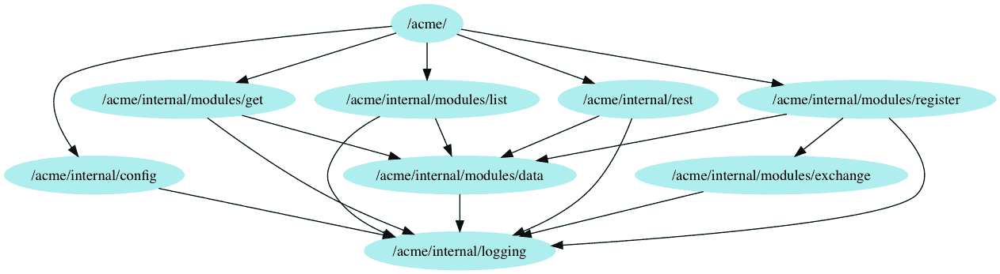
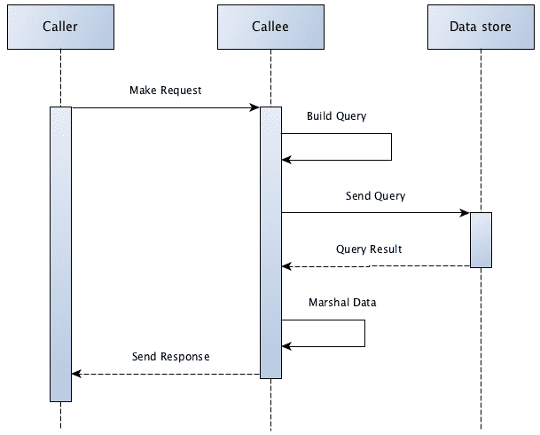
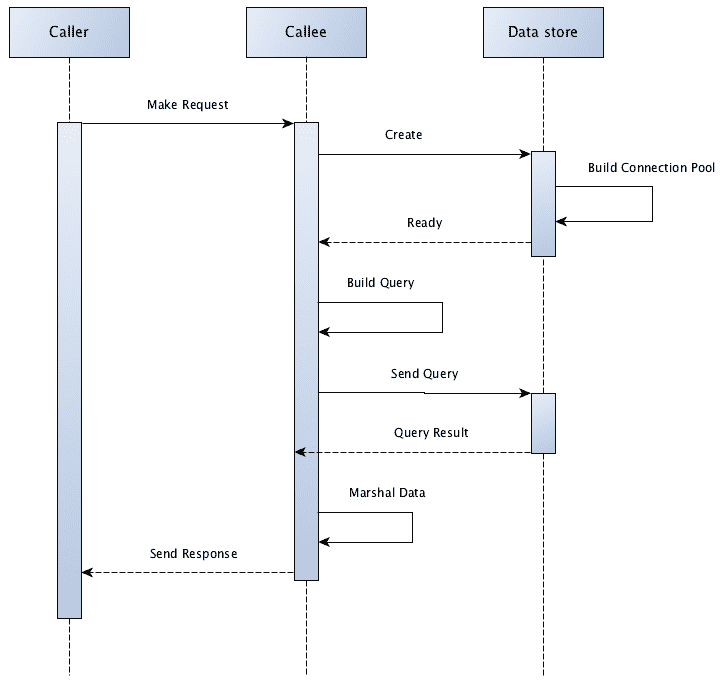
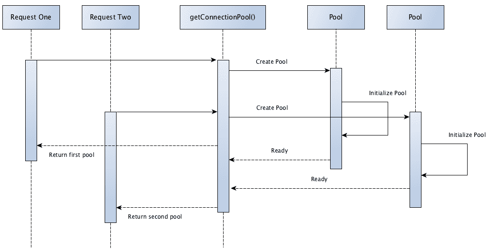

# 刚性依赖注入

使用*传统* **依赖注入**（**DI**）方法，父对象或调用对象向子类提供依赖项。然而，有许多情况下，依赖项只有一个实现。在这些情况下，一个务实的方法是问自己，为什么要注入依赖项？在本章中，我们将研究**just-in-time**（**JIT**）依赖注入，这是一种策略，它给我们带来了 DI 的许多好处，如解耦和可测试性，而不需要向我们的构造函数或方法添加参数。

本章将涵盖以下主题：

+   JIT 注入

+   JIT 注入的优势

+   应用 JIT 注入

+   JIT 注入的缺点

# 技术要求

熟悉我们在第四章中介绍的服务代码可能会有所帮助，*ACME 注册服务简介*。本章还假定您已经阅读了第六章，*构造函数注入的依赖注入*，以及在较小程度上，第五章，*使用 Monkey Patching 进行依赖注入*。

您可能还会发现阅读和运行本章的完整代码版本很有用，该代码版本可在[`github.com/PacktPublishing/Hands-On-Dependency-Injection-in-Go/tree/master/ch09`](https://github.com/PacktPublishing/Hands-On-Dependency-Injection-in-Go/tree/master/ch09)上找到。

获取代码并配置示例服务的说明可在此处的 README 部分找到：[`github.com/PacktPublishing/Hands-On-Dependency-Injection-in-Go/`](https://github.com/PacktPublishing/Hands-On-Dependency-Injection-in-Go/)。

您可以在`ch09/acme`中找到我们的服务代码，其中已经应用了本章的更改。

在本章中，我们将使用 mockery（[`github.com/vektra/mockery`](https://github.com/vektra/mockery)）生成我们接口的模拟实现，并介绍一个名为**package coverage**（[`github.com/corsc/go-tools/tree/master/package-coverage)`](https://github.com/corsc/go-tools/tree/master/package-coverage)）的新工具。

# JIT 注入

您是否曾经编写过一个对象，并注入了一个您知道只会有一个实现的依赖项？也许您已经将数据库处理代码注入到业务逻辑层中，如下面的代码所示：

```go
func NewMyLoadPersonLogic(ds DataSource) *MyLoadPersonLogic {
   return &MyLoadPersonLogic{
      dataSource: ds,
   }
}

type MyLoadPersonLogic struct {
   dataSource DataSource
}

// Load person by supplied ID
func (m *MyLoadPersonLogic) Load(ID int) (Person, error) {
   return m.dataSource.Load(ID)
}
```

您是否曾经为了在测试期间将其模拟而将依赖项添加到构造函数中？这在以下代码中显示：

```go
func NewLoadPersonHandler(logic LoadPersonLogic) *LoadPersonHandler {
   return &LoadPersonHandler{
      businessLogic: logic,
   }
}

type LoadPersonHandler struct {
   businessLogic LoadPersonLogic
}

func (h *LoadPersonHandler) ServeHTTP(response http.ResponseWriter, request *http.Request) {
   requestedID, err := h.extractInputFromRequest(request)

   output, err := h.businessLogic.Load(requestedID)
   if err != nil {
      response.WriteHeader(http.StatusInternalServerError)
      return
   }

   h.writeOutput(response, output)
}
```

这些事情可能会感觉像是不必要的额外工作，它们确实会降低代码的用户体验。 JIT 注入为我们提供了一个舒适的中间地带。 JIT 注入可能最好通过一些示例来解释。让我们看看我们第一个应用了 JIT 注入的示例：

```go
type MyLoadPersonLogicJIT struct {
   dataSource DataSourceJIT
}

// Load person by supplied ID
func (m *MyLoadPersonLogicJIT) Load(ID int) (Person, error) {
   return m.getDataSource().Load(ID)
}

func (m *MyLoadPersonLogicJIT) getDataSource() DataSourceJIT {
   if m.dataSource == nil {
      m.dataSource = NewMyDataSourceJIT()
   }

   return m.dataSource
}
```

如您所见，我们已经通过添加一个`getter`函数`getDataSource()`，将直接引用从`m.dataSource`更改为`m.getDataSource()`。在`getDataSource()`中，我们执行了一个简单而高效的检查，以查看依赖项是否已经存在，当它不存在时，我们创建它。这就是我们得到*just-in-time 注入*名称的地方。

因此，如果我们不打算注入依赖项，那么为什么需要注入？简单的答案是测试。

在我们的原始示例中，我们能够在测试期间使用模拟实现*替换*我们的依赖项，如下面的代码所示：

```go
func TestMyLoadPersonLogic(t *testing.T) {
   // setup the mock db
   mockDB := &mockDB{
      out: Person{Name: "Fred"},
   }

   // call the object we are testing
   testObj := NewMyLoadPersonLogic(mockDB)
   result, resultErr := testObj.Load(123)

   // validate expectations
   assert.Equal(t, Person{Name: "Fred"}, result)
   assert.Nil(t, resultErr)
}
```

使用 JIT 注入，我们仍然可以提供一个模拟实现，但是不是通过构造函数提供，而是直接将其注入到私有成员变量中，就像这样：

```go
func TestMyLoadPersonLogicJIT(t *testing.T) {
   // setup the mock db
   mockDB := &mockDB{
      out: Person{Name: "Fred"},
   }

   // call the object we are testing
   testObj := MyLoadPersonLogicJIT{
      dataSource: mockDB,
   }
   result, resultErr := testObj.Load(123)

   // validate expectations
   assert.Equal(t, Person{Name: "Fred"}, result)
   assert.Nil(t, resultErr)
}
```

您可能还注意到，在这个例子中，我们放弃了使用构造函数。这并不是必要的，也不会总是这种情况。应用 JIT 注入通过减少参数的数量来提高对象的可用性。在我们的例子中，没有剩下的参数，所以放弃构造函数似乎也是合适的。

JIT 注入使我们能够打破 DI 的传统规则，使对象能够在需要时创建自己的依赖关系。虽然严格来说这是违反了*单一责任原则*部分，正如在第二章中讨论的那样，*Go 的 SOLID 设计原则*，但可用性的改进是显著的。

# JIT 注入的优势

这种方法旨在解决传统 DI 的一些痛点。这里列出的优势是特定于这种方法的，与其他形式的依赖注入形成对比。这种方法的特定优势包括以下内容。

更好的用户体验（UX）由于更少的输入 - 我知道我已经提到了这一点很多次，但是更容易理解的代码也更容易维护和扩展。当一个函数的参数更少时，它本质上更容易理解。比较构造函数：

```go
func NewGenerator(storage Storage, renderer Renderer, template io.Reader) *Generator {
   return &Generator{
      storage:  storage,
      renderer: renderer,
      template: template,
   }
}
```

与这个：

```go
func NewGenerator(template io.Reader) *Generator {
   return &Generator{
      template: template,
   }
}
```

在这个例子中，我们删除了所有只有一个活动实现的依赖项，并用 JIT 注入替换了它们。现在，这个函数的用户只需要提供一个可能会改变的依赖项。

**它非常适合可选依赖项** - 与前面关于 UX 的观点类似，可选依赖项可能会使函数的参数列表膨胀。此外，依赖项是否是可选的并不是立即显而易见的。将依赖项移动到公共成员变量允许用户仅在需要时提供它。然后应用 JIT 注入允许对象实例化默认依赖项的副本。这显著简化了对象内部的代码。

考虑以下不使用 JIT 注入的代码：

```go
func (l *LoaderWithoutJIT) Load(ID int) (*Animal, error) {
   var output *Animal
   var err error

   // attempt to load from cache
   if l.OptionalCache != nil {
      output = l.OptionalCache.Get(ID)
      if output != nil {
         // return cached value
         return output, nil
      }
   }

   // load from data store
   output, err = l.datastore.Load(ID)
   if err != nil {
      return nil, err
   }

   // cache the loaded value
   if l.OptionalCache != nil {
      l.OptionalCache.Put(ID, output)
   }

   // output the result
   return output, nil
}
```

应用 JIT 注入，这变成了以下形式：

```go
func (l *LoaderWithJIT) Load(ID int) (*Animal, error) {
   // attempt to load from cache
   output := l.cache().Get(ID)
   if output != nil {
      // return cached value
      return output, nil
   }

   // load from data store
   output, err := l.datastore.Load(ID)
   if err != nil {
      return nil, err
   }

   // cache the loaded value
   l.cache().Put(ID, output)

   // output the result
   return output, nil
}
```

这个函数现在更加简洁，更容易阅读。我们将在下一节中更详细地讨论使用 JIT 注入处理可选依赖项。

**更好地封装实现细节** - 对典型 DI（即构造函数或参数注入）的反驳之一是，通过暴露一个对象对另一个对象的依赖，你泄漏了实现细节。考虑以下构造函数：

```go
func NewLoader(ds Datastore, cache Cache) *MyLoader {
   return &MyLoader{
      ds:    ds,
      cache: cache,
   }
}
```

现在，把自己放在`MyLoader`的用户的位置上，不知道它的实现。对你来说，`MyLoader`使用数据库还是缓存重要吗？如果你没有多个实现或配置可供使用，让`MyLoader`的作者为你处理会更容易吗？

**减少测试引起的损害** - 反对 DI 的人经常抱怨的另一个问题是，依赖项被添加到构造函数中，唯一目的是在测试期间替换它们。这个观点是有根据的；你会经常看到这种情况，也是测试引起的损害的更常见形式之一。JIT 注入通过将关系更改为私有成员变量并将其从公共 API 中移除来缓解了这一问题。这仍然允许我们在测试期间替换依赖项，但不会造成公共损害。

如果你在想，选择私有成员变量而不是公共的是有意的，也是有意限制的。私有的话，我们只能在同一个包内的测试期间访问和替换依赖项。包外的测试故意没有访问权限。这样做的第一个原因是封装。我们希望隐藏实现细节，使其他包不与我们的包耦合。任何这样的耦合都会使对我们实现的更改变得更加困难。

第二个原因是 API 污染。如果我们将成员变量设为公共的，那么不仅测试可以访问，而且所有人都可以访问，从而打开了意外、无效或危险使用我们内部的可能性。

**这是一个很好的替代方法**——正如你可能还记得第五章中所说的，*使用猴子补丁进行依赖注入*，猴子补丁的最大问题之一是测试期间的并发性。通过调整单个全局变量以适应当前测试，任何使用该变量的其他测试都会受到影响，很可能会出错。可以使用 JIT 注入来避免这个问题。考虑以下代码：

```go
// Global singleton of connections to our data store
var storage UserStorage

type Saver struct {
}

func (s *Saver) Do(in *User) error {
   err := s.validate(in)
   if err != nil {
      return err
   }

   return storage.Save(in)
}
```

目前，全局变量存储在测试期间需要进行猴子补丁。但是当我们应用 JIT 注入时会发生什么呢？

```go
// Global singleton of connections to our data store
var storage UserStorage

type Saver struct {
   storage UserStorage
}

func (s *Saver) Do(in *User) error {
   err := s.validate(in)
   if err != nil {
      return err
   }

   return s.getStorage().Save(in)
}

// Just-in-time DI
func (s *Saver) getStorage() UserStorage {
   if s.storage == nil {
      s.storage = storage
   }

   return s.storage
}
```

现在所有对全局变量的访问都通过`getStorage()`进行，我们能够使用 JIT 注入来*替换*`storage`成员变量，而不是对全局（和共享）变量进行猴子补丁，就像这个例子中所示的那样：

```go
func TestSaver_Do(t *testing.T) {
   // input
   carol := &User{
      Name:     "Carol",
      Password: "IamKing",
   }

   // mocks/stubs
   stubStorage := &StubUserStorage{}

   // do call
   saver := &Saver{
      storage: stubStorage,
   }
   resultErr := saver.Do(carol)

   // validate
   assert.NotEqual(t, resultErr, "unexpected error")
}
```

在上述测试中，全局变量上不再存在数据竞争。

**对于分层代码来说非常好**——当将依赖注入应用于整个项目时，很常见的是在应用程序执行的早期看到大量对象被创建。例如，我们的最小示例服务已经在`main()`中创建了四个对象。四个听起来可能不多，但我们还没有将 DI 应用到所有的包，到目前为止我们只有三个端点。

对于我们的服务，我们有三层代码，REST、业务逻辑和数据。层之间的关系很简单。REST 层中的一个对象调用其业务逻辑层的合作对象，然后调用数据层。除了测试之外，我们总是注入相同的依赖项。应用 JIT 注入将允许我们从构造函数中删除这些依赖项，并使代码更易于使用。

**实现成本低**——正如我们在之前的猴子补丁示例中看到的，应用 JIT 注入非常容易。此外，更改范围很小。

同样，对于原本没有任何形式的 DI 的代码应用 JIT 注入也很便宜。考虑以下代码：

```go
type Car struct {
   engine Engine
}

func (c *Car) Drive() {
   c.engine.Start()
   defer c.engine.Stop()

   c.engine.Drive()
}
```

如果我们决定将`Car`与`Engine`解耦，那么我们只需要将抽象交互定义为接口，然后将所有对`c.engine`的直接访问更改为使用`getter`函数，如下面的代码所示：

```go
type Car struct {
   engine Engine
}

func (c *Car) Drive() {
   engine := c.getEngine()

   engine.Start()
   defer engine.Stop()

   engine.Drive()
}

func (c *Car) getEngine() Engine {
   if c.engine == nil {
      c.engine = newEngine()
   }

   return c.engine
}
```

考虑一下应用构造函数注入的过程。我们需要在哪些地方进行更改？

# 应用 JIT 注入

在之前的章节中，我提到了 JIT 注入可以用于私有和公共依赖项，这是两种非常不同的用例。在本节中，我们将应用这两种选项以实现非常不同的结果。

# 单元测试覆盖率

在 Go 中，测试覆盖率是通过在调用 go test 时添加`-cover`标志来计算的。由于这只适用于一个包，我觉得这很不方便。因此，我们将使用一个工具，该工具可以递归计算目录树中所有包的测试覆盖率。这个工具叫做**package-coverage**，可以从 GitHub ([`github.com/corsc/go-tools/tree/master/package-coverage`](https://github.com/corsc/go-tools/tree/master/package-coverage)) 获取。

使用`package-coverage`计算覆盖率时，我们使用以下命令：

```go
$ cd $GOPATH/src/github.com/PacktPublishing/Hands-On-Dependency-Injection-in-Go/ch08/

$ export ACME_CONFIG=$GOPATH/src/github.com/PacktPublishing/Hands-On-Dependency-Injection-in-Go/config.json

$ package-coverage -a -prefix $(go list)/ ./acme/
```

注意：我故意使用了第八章中的代码，*通过配置进行依赖注入*，所以覆盖率数字是在我们在本章可能进行的任何更改之前。

这给我们带来了以下结果：

```go
-------------------------------------------------------------------------
|      Branch     |       Dir       |                                   |
|   Cov% |  Stmts |   Cov% |  Stmts | Package                           |
-------------------------------------------------------------------------
|  65.66 |    265 |   0.00 |      7 | acme/                             |
|  47.83 |     23 |  47.83 |     23 | acme/internal/config/             |
|   0.00 |      4 |   0.00 |      4 | acme/internal/logging/            |
|  73.77 |     61 |  73.77 |     61 | acme/internal/modules/data/       |
|  61.70 |     47 |  61.70 |     47 | acme/internal/modules/exchange/   |
|  85.71 |      7 |  85.71 |      7 | acme/internal/modules/get/        |
|  46.15 |     13 |  46.15 |     13 | acme/internal/modules/list/       |
|  62.07 |     29 |  62.07 |     29 | acme/internal/modules/register/   |
|  79.73 |     74 |  79.73 |     74 | acme/internal/rest/               |
-------------------------------------------------------------------------
```

所以，我们可以从这些数字中推断出什么呢？

1.  代码覆盖率是合理的。它可能会更好，但除了`logging`包上的 0 之外，几乎所有包都有 50%以上。

1.  语句（`stmts`）计数很有趣。语句大致相当于*代码行*，因此这些数字表明哪些包有更多或更少的代码。我们可以看到`rest`、`data`和`exchange`包是最大的。

1.  我们可以从包中的代码量推断出，包含的代码越多，责任和复杂性就越大。因此，这个包带来的风险也就越大。

考虑到两个最大的、最具风险的包`rest`和`data`都有很好的测试覆盖率，我们仍然没有任何迫切需要关注的迹象。但是如果我们将测试覆盖率和依赖图结合起来会发生什么呢？

# 私有依赖

我们可以通过应用 JIT 注入来改进我们的服务的许多地方。那么我们该如何决定呢？让我们看看我们的依赖图有什么说法：



有很多连接进入日志包。但是我们在第八章中已经相当程度地解耦了它，*通过配置进行依赖注入*。

下一个用户最多的包是`data`包。我们在第五章中曾经讨论过它，*使用 Monkey Patching 进行依赖注入*，但也许现在是时候重新审视它，看看我们是否可以进一步改进它。

在我们做出决定之前，我将向你介绍另一种了解代码健康状况和我们最好花费精力的方法：单元测试覆盖率。与依赖图一样，它不能提供明确的指标，只能给你一些暗示。

# 覆盖率和依赖图

依赖图告诉我们，`data`包有很多用户。测试覆盖率告诉我们，它也是我们拥有的最大的包之一。因此，我们可以推断，如果我们想要做改进，这可能是开始的合适地方。

你可能还记得之前章节提到的，`data`包使用了函数和全局单例池，这两者都给我们带来了不便。因此，让我们看看是否可以使用 JIT 注入来摆脱这些痛点。

# 赶走猴子

以下是`get`包目前如何使用`data`包的方式：

```go
// Do will perform the get
func (g *Getter) Do(ID int) (*data.Person, error) {
   // load person from the data layer
   person, err := loader(context.TODO(), g.cfg, ID)
   if err != nil {
      if err == data.ErrNotFound {
         // By converting the error we are hiding the implementation 
         // details from our users.
         return nil, errPersonNotFound
      }
      return nil, err
   }

   return person, err
}

// this function as a variable allows us to Monkey Patch during testing
var loader = data.Load

```

我们的第一个改变将是定义一个接口，用它来替换我们的`loader`函数：

```go
//go:generate mockery -name=myLoader -case underscore -testonly -inpkg
type myLoader interface {
   Load(ctx context.Context, ID int) (*data.Person, error)
}
```

你可能已经注意到我们删除了配置参数。等我们完成后，我们将不必在每次调用时传递这个参数。我还添加了一个`go generate`注释，它将创建一个我们以后会使用的模拟。

接下来，我们将将这个依赖作为私有成员变量添加，并更新我们的`Do()`方法以使用 JIT 注入：

```go
// Do will perform the get
func (g *Getter) Do(ID int) (*data.Person, error) {
   // load person from the data layer
   person, err := g.getLoader().Load(context.TODO(), ID)
   if err != nil {
      if err == data.ErrNotFound {
         // By converting the error we are hiding the implementation 
         // details from our users.
         return nil, errPersonNotFound
      }
      return nil, err
   }

   return person, err
}
```

但是我们的 JIT 注入`getter`方法会是什么样子呢？基本结构将是标准的，如下面的代码所示：

```go
func (g *Getter) getLoader() myLoader {
   if g.data == nil {
      // To be determined
   }

   return g.data
}
```

因为`data`包是以函数实现的，我们目前没有任何实现我们的`loader`接口的东西。我们的代码和单元测试现在都出问题了，所以在我们让它们再次工作之前，我们将不得不盲目行事一段时间。

让我们首先定义一个**数据访问对象**（**DAO**），这是让我们的代码再次工作的最短路径。这将用一个结构体替换`data`包中的函数，并给我们一个实现`myLoader`接口的东西。为了尽量减少更改，我们将让 DAO 方法调用现有的函数，如下面的代码所示：

```go
// NewDAO will initialize the database connection pool (if not already 
// done) and return a data access object which can be used to interact 
// with the database
func NewDAO(cfg Config) *DAO {
   // initialize the db connection pool
   _, _ = getDB(cfg)

   return &DAO{
      cfg: cfg,
   }
}

type DAO struct {
   cfg Config
}

// Load will attempt to load and return a person.
func (d *DAO) Load(ctx context.Context, ID int) (*Person, error) {
   return Load(ctx, d.cfg, ID)
}
```

即使在我们将 DAO 添加到`getLoader()`函数中后，我们的测试仍然没有恢复。我们的测试仍然使用了 Monkey Patching，因此我们需要删除该代码并用一个模拟替换它，得到以下结果：

```go
func TestGetter_Do_happyPath(t *testing.T) {
   // inputs
   ID := 1234

   // configure the mock loader
   mockResult := &data.Person{
      ID:       1234,
      FullName: "Doug",
   }
   mockLoader := &mockMyLoader{}
   mockLoader.On("Load", mock.Anything, ID).Return(mockResult, nil).Once()

   // call method
   getter := &Getter{
      data: mockLoader,
   }
   person, err := getter.Do(ID)

   // validate expectations
   require.NoError(t, err)
   assert.Equal(t, ID, person.ID)
   assert.Equal(t, "Doug", person.FullName)
   assert.True(t, mockLoader.AssertExpectations(t))
}
```

最后，我们的测试又可以工作了。通过这些重构，我们还实现了一些其他的改进：

+   我们的`get`包的测试不再使用 Monkey Patching；这意味着我们可以确定没有与 Monkey Patching 相关的并发问题

+   除了数据结构（`data.Person`）之外，`get`包的测试不再使用`data`包

+   也许最重要的是，`get`包的测试不再需要配置数据库

完成`get`包的计划更改后，我们可以转移到`data`包。

早些时候，我们定义了一个 DAO，其中我们的`Load()`方法调用了现有的`Load()`函数。由于`Load()`函数没有更多的用户，我们可以简单地复制代码并更新相应的测试。

在为`data`包及其用户重复这个简单的过程之后，我们成功地迁移到了基于对象的包，而不是基于函数的包。

# 可选的公共依赖项

到目前为止，我们已经将 JIT 依赖注入应用于私有依赖项，目标是减少参数，并使我们的`data`包更加简单易用。

还有另一种使用 JIT 注入的方式——可选的公共依赖项。这些依赖项是公共的，因为我们希望用户能够更改它们，但我们不将它们作为构造函数的一部分，因为它们是可选的。这样做会影响用户体验，特别是在可选依赖项很少使用的情况下。

假设我们在服务的*加载所有注册*端点遇到性能问题，并且我们怀疑问题与数据库的响应速度有关。

面对这样的问题，我们决定需要通过添加一些仪器来跟踪这些查询花费了多长时间。为了确保我们能够轻松地打开和关闭这个跟踪器，我们可以将其作为可选依赖项。

我们的第一步将是定义我们的`tracker`接口：

```go
// QueryTracker is an interface to track query timing
type QueryTracker interface {
   // Track will record/out the time a query took by calculating 
   // time.Now().Sub(start)
   Track(key string, start time.Time)
}
```

我们需要做出决定。使用`QueryTracker`是可选的，这意味着用户不能保证已注入依赖项。

为了避免在使用`QueryTracker`时出现守卫子句，我们将引入一个 NO-OP 实现，当用户没有提供时可以使用。NO-OP 实现，有时被称为**空对象**，是一个实现接口但所有方法都故意不执行任何操作的对象。

这是`QueryTracker`的 NO-OP 实现：

```go
// NO-OP implementation of QueryTracker
type noopTracker struct{}

// Track implements QueryTracker
func (_ *noopTracker) Track(_ string, _ time.Time) {
   // intentionally does nothing
}
```

现在，我们可以将其引入到我们的 DAO 作为一个公共成员变量：

```go
// DAO is a data access object that provides an abstraction over 
// our database interactions.
type DAO struct {
   cfg Config

   // Tracker is an optional query timer
   Tracker QueryTracker
}
```

我们可以使用 JIT 注入来访问默认为 NO-OP 版本的跟踪器：

```go
func (d *DAO) getTracker() QueryTracker {
   if d.Tracker == nil {
      d.Tracker = &noopTracker{}
   }

   return d.Tracker
}
```

现在一切就绪，我们可以在想要跟踪的任何方法的开头添加以下行：

```go
// track processing time
defer d.getTracker().Track("LoadAll", time.Now())
```

这里值得注意的是`defer`的使用。基本上，`defer`在这里有两个重要的特性。首先，它将在函数退出时被调用，这样我们可以一次添加跟踪器，而不是在每个返回语句旁边添加。其次，`defer`的参数是在遇到该行时确定的，而不是在执行时确定的。这意味着`time.Now()`的值将在我们跟踪的函数开始时调用，而不是在`Track()`函数返回时调用。

为了使我们的跟踪器有用，我们需要提供除了 NO-OP 之外的实现。我们可以将这些值推送到像 StatsD 或 Graphite 这样的外部系统，但为了简单起见，我们将结果输出到日志。代码如下：

```go
// NewLogTracker returns a Tracker that outputs tracking data to log
func NewLogTracker(logger logging.Logger) *LogTracker {
   return &LogTracker{
      logger: logger,
   }
}

// LogTracker implements QueryTracker and outputs to the supplied logger
type LogTracker struct {
   logger logging.Logger
}

// Track implements QueryTracker
func (l *LogTracker) Track(key string, start time.Time) {
   l.logger.Info("[%s] Timing: %s\n", key, time.Now().Sub(start).String())
}
```

现在，我们可以暂时将我们的 DAO 使用从这个更新为：

```go
func (l *Lister) getLoader() myLoader {
   if l.data == nil {
      l.data = data.NewDAO(l.cfg)
   }

   return l.data
}
```

现在更新为：

```go
func (l *Lister) getLoader() myLoader {
   if l.data == nil {
      l.data = data.NewDAO(l.cfg)

      // temporarily add a log tracker
      l.data.(*data.DAO).Tracker = data.NewLogTracker(l.cfg.Logger())
   }

   return l.data
}
```

是的，这行有点丑，但幸运的是它只是临时的。如果我们决定让我们的 QueryTracker 永久存在，或者发现自己大部分时间都在使用它，那么我们可以很容易地切换到构造函数注入。

# JIT 注入的缺点

虽然 JIT 注入可能很方便，但并非在所有情况下都可以使用，而且有一些需要注意的地方。其中包括以下内容：

**只能应用于静态依赖项**-第一个，也许是最重要的缺点是，这种方法只能应用于在测试期间只发生变化的依赖项。我们不能用它来替代参数注入或配置注入。这是因为依赖项的实例化发生在私有方法内部，只在第一次尝试访问变量时发生。

**依赖和用户生命周期没有分开**-当使用构造函数注入或参数注入时，通常可以假定被注入的依赖已经完全初始化并准备就绪。任何成本或延迟，比如与创建资源池或预加载数据相关的成本，都已经支付。使用 JIT 注入时，依赖项会在第一次使用之前立即创建。因此，任何初始化成本都必须由第一个请求支付。下图显示了三个对象之间的典型交互（调用者、被调用者和数据存储）：



现在，将其与在调用期间创建数据存储对象时的交互进行比较：



您可以看到第二个图中产生的额外时间（成本）。在大多数情况下，这些成本并不会发生，因为在 Go 中创建对象很快。但是，当它们存在时，它们可能会在应用程序启动期间导致一些意外或不便的行为。

在像前面提到的那种情况下，依赖项的状态不确定，导致生成的代码存在另一个缺点。考虑以下代码：

```go
func (l *Sender) Send(ctx context.Context, payload []byte) error {
   pool := l.getConnectionPool()

   // ensure pool is ready
   select {
   case <-pool.IsReady():
      // happy path

   case <-ctx.Done():
      // context timed out or was cancelled
      return errors.New("failed to get connection")
   }

   // get connection from pool and return afterwards
   conn := pool.Get()
   defer l.connectionPool.Release(conn)

   // send and return
   _, err := conn.Write(payload)

   return err
}
```

将前面的代码与保证依赖项处于*就绪*状态的相同代码进行比较：

```go
func (l *Sender) Send(payload []byte) error {
   pool := l.getConnectionPool()

   // get connection from pool and return afterwards
   conn := pool.Get()
   defer l.connectionPool.Release(conn)

   // send and return
   _, err := conn.Write(payload)

   return err
}
```

这只是几行代码，当然，它要简单得多，因此更易于阅读和维护。它也更容易实现和测试。

**潜在的数据和初始化竞争**-与前一点类似，这一点也围绕着依赖项的初始化。然而，在这种情况下，问题与访问依赖项本身有关。让我们回到前面关于连接池的例子，但改变实例化的方式：

```go
func newConnectionPool() ConnectionPool {
   pool := &myConnectionPool{}

   // initialize the pool
   pool.init()

   // return a "ready to use pool"
   return pool
}
```

正如您所看到的，连接池的构造函数在池完全初始化之前不会返回。那么，在初始化正在进行时再次调用`getConnectionPool()`会发生什么？

我们可能会创建两个连接池。这张图显示了这种交互：



那么，另一个连接池会发生什么？它将被遗弃。用于创建它的所有 CPU 都是浪费的，甚至可能无法被垃圾收集器正确清理；因此，任何资源，如内存、文件句柄或网络端口，都可能丢失。

有一种简单的方法可以确保避免这个问题，但它会带来非常小的成本。我们可以使用`standard`库中的 sync 包。这个包有几个不错的选项，但在这种情况下，我建议使用`Once()`。通过将`Once()`添加到我们的`getConnectionPool()`方法中，我们得到了这个：

```go
func (l *Sender) getConnection() ConnectionPool {
   l.initPoolOnce.Do(func() {
      l.connectionPool = newConnectionPool()
   })

   return l.connectionPool
}
```

这种方法有两个小成本。第一个是代码的复杂性增加；这很小，但确实存在。

第二个成本是对`getConnectionPool()`的每次调用，可能有很多次，都会检查`Once()`，看它是否是第一次调用。这是一个非常小的成本，但根据您的性能要求，可能会不方便。

**对象并非完全解耦**-在整本书中，我们使用依赖图来识别潜在问题，特别是关于包之间的关系，以及在某些情况下对特定包的过度依赖。虽然我们仍然可以并且应该使用第二章中的*依赖反转原则*部分，*Go 的 SOLID 设计原则*，并将我们的依赖定义为本地接口，但通过在我们的代码中包含依赖的创建，依赖图仍将显示我们的包与依赖之间的关系。在某种程度上，我们的对象仍然与我们的依赖有些耦合。

# 摘要

在本章中，我们使用了 JIT 注入，这是一种不太常见的 DI 方法，以消除前几章中的一些猴子补丁。

我们还使用了不同形式的 JIT 注入来添加可选依赖项，而不会影响我们代码的用户体验。

此外，我们还研究了 JIT 注入如何用于减少测试引起的损害，而不牺牲我们在测试中使用模拟和存根的能力。

在下一章中，我们将研究本书中的最后一个 DI 方法，即现成的注入。我们将讨论采用 DI 框架的一般优缺点，并且在我们的示例中，我们将使用 Google 的 Wire 框架。

# 问题

1.  JIT 注入与构造函数注入有何不同？

1.  在处理可选依赖关系时，为什么使用 NO-OP 实现很重要？

1.  JIT 注入的理想用例是什么？
