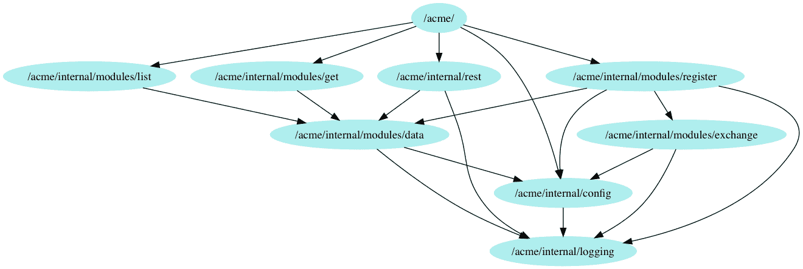
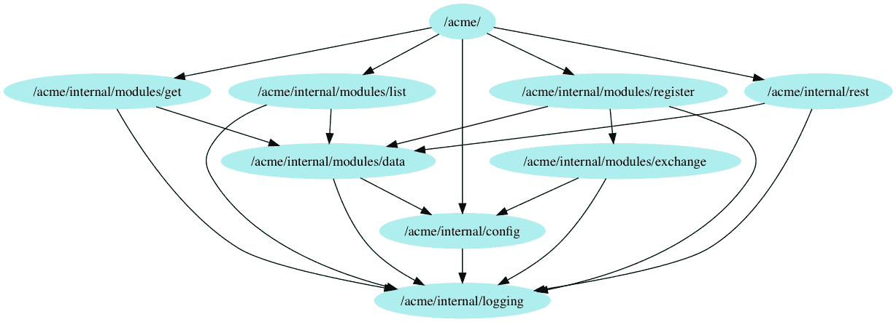
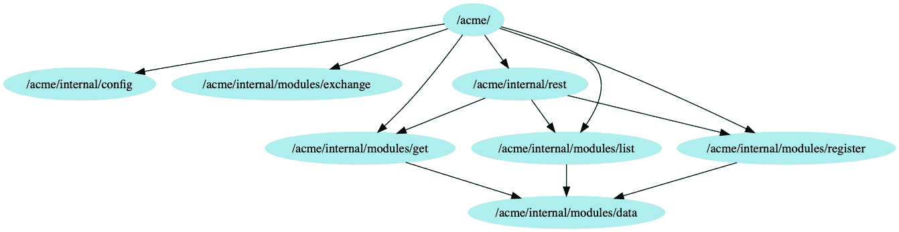
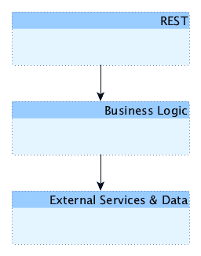

# 第十二章：回顾我们的进展

在我们的最后一章中，我们将回顾并比较应用**依赖注入**（**DI**）后，我们的示例服务的状态和质量与我们开始时的情况。

我们将回顾我们所做的改进，以及最后一次查看我们的依赖图，并讨论我们在测试覆盖率和服务的可测试性方面的改进。

最后，我们将以简要讨论结束本章，讨论如果我们从头开始使用 DI 而不是将其应用于现有代码，我们本可以做些什么。

本章将涵盖以下主题：

+   改进概述

+   依赖图的回顾

+   测试覆盖率和可测试性的回顾

+   使用 DI 开始一个新服务

# 技术要求

熟悉我们服务的代码将是有益的，如第四章中介绍的*ACME 注册服务简介*。本章还假设您已经阅读了第五章中的*使用 Monkey Patching 进行依赖注入*，一直到第十章中的*现成的注入*，介绍了我们在这一过程中所做的各种 DI 方法和其他各种改进。

您可能还会发现阅读和运行本章的完整代码版本很有用，这些代码可以在[`github.com/PacktPublishing/Hands-On-Dependency-Injection-in-Go/tree/master/ch12`](https://github.com/PacktPublishing/Hands-On-Dependency-Injection-in-Go/tree/master/ch12)找到。

获取代码并配置示例服务的说明可在 README 中找到，该 README 位于[`github.com/PacktPublishing/Hands-On-Dependency-Injection-in-Go/`](https://github.com/PacktPublishing/Hands-On-Dependency-Injection-in-Go/)。

您可以在[`github.com/PacktPublishing/Hands-On-Dependency-Injection-in-Go/tree/master/ch12/acme`](https://github.com/PacktPublishing/Hands-On-Dependency-Injection-in-Go/tree/master/ch12/acme)找到我们服务的代码，其中已经应用了本章的更改。

# 改进概述

呼，我们做到了。您认为我们做得如何？您认为这些改进值得努力吗？让我们看看。

为了了解我们已经走了多远，我们首先应该回顾我们的起点。

在第四章中，*ACME 注册服务简介*，我们有一个小型、简单、可工作的服务。它为我们的用户完成了工作，但对于我们必须维护和扩展它的人来说，它造成了许多不便。

# 全局单例

最大的痛点之一无疑是使用全局公共单例。乍一看，它们似乎使代码更简洁，但实际上使我们的测试工作变得更加困难。

使用`init()`函数创建变量意味着我们要么必须使用实时版本（即数据库上的版本），要么必须对全局变量进行 Monkey Patch，这可能导致数据竞争。

我们最初有两个公共全局变量（`config`和`logger`）和一个私有全局变量（数据库连接池）。在第五章中，*使用 Monkey Patching 进行依赖注入*，我们使用了 Monkey Patching 来使我们能够测试依赖于数据库连接池单例的代码。

在第十章中，*现成的注入*，我们终于成功移除了`config`全局变量，在我们在第八章中进行的更改中，首先移除了对它的大部分直接访问，*通过配置进行依赖注入*。

通过删除直接访问并定义本地配置接口，我们能够完全将我们的模型和数据层与配置解耦。这意味着我们的代码是可移植的，如果我们将来想在另一个应用程序中使用它。

也许最重要的是，这意味着现在在这段代码上编写测试的工作要少得多，我们的测试可以独立并发地运行。没有与全局实例的链接，我们不必进行猴子补丁。没有依赖链接，我们只剩下一个更小、更专注的`config`接口，更容易模拟、存根和理解。

全局`logger`实例设法在我们的许多重构中幸存下来，但它唯一被使用的地方是在`config`加载代码中。因此，现在让我们将其移除。我们当前的`config`加载函数看起来像下面的代码所示：

```go
// Load returns the config loaded from environment
func Load() (*Config, error) {
   filename, found := os.LookupEnv(DefaultEnvVar)
   if !found {
      err := fmt.Errorf("failed to locate file specified by %s", DefaultEnvVar)
      logging.L.Error(err.Error())
      return nil, err
   }

   cfg, err := load(filename)
   if err != nil {
      logging.L.Error("failed to load config with err %s", err)
      return nil, err
   }

   return cfg, nil
}
```

可以非常肯定地说，如果我们未能加载配置，我们的服务就无法工作。因此，我们可以直接将错误更改为直接写入*标准错误*。我们更新后的函数如下所示：

```go
// Load returns the config loaded from environment
func Load() (*Config, error) {
   filename, found := os.LookupEnv(DefaultEnvVar)
   if !found {
      err := fmt.Errorf("failed to locate file specified by %s", DefaultEnvVar)
      fmt.Fprintf(os.Stderr, err.Error())
      return nil, err
   }

   cfg, err := load(filename)
   if err != nil {
      fmt.Fprintf(os.Stderr, "failed to load config with err %s", err)
      return nil, err
   }

   return cfg, nil
}
```

否则，日志记录器是通过配置注入*传递*的。通过使用配置注入，我们能够忘记常见的关注点（如`logger`），而不会影响我们构造函数的用户体验。现在我们也能够轻松编写测试来验证日志记录，而不会出现任何数据竞争问题。虽然这样的测试可能会感觉奇怪，但请考虑一下——日志是我们系统的输出，当出现问题需要调试时，我们经常会依赖于它们。

因此，可能有些情况下，确保我们按预期创建日志并继续这样做是有用的。这不是我们经常想要测试的事情，但当我们这样做时，测试本身就像下面这样简单：

```go
func TestLogging(t *testing.T) {
   // build log recorder
   recorder := &LogRecorder{}

   // Call struct that uses a logger
   calculator := &Calculator{
      logger: recorder,
   }
   result := calculator.divide(10, 0)

   // validate expectations, including that the logger was called
   assert.Equal(t, 0, result)
   require.Equal(t, 1, len(recorder.Logs))
   assert.Equal(t, "cannot divide by 0", recorder.Logs[0])
}

type Calculator struct {
   logger Logger
}

func (c *Calculator) divide(dividend int, divisor int) int {
   if divisor == 0 {
      c.logger.Error("cannot divide by 0")
      return 0
   }

   return dividend / divisor
}

// Logger is our standard interface
type Logger interface {
   Error(message string, args ...interface{})
}

// LogRecorder implements Logger interface
type LogRecorder struct {
   Logs []string
}

func (l *LogRecorder) Error(message string, args ...interface{}) {
   // build log message
   logMessage := fmt.Sprintf(message, args...)

   // record log message
   l.Logs = append(l.Logs, logMessage)
}
```

最后，数据库连接池的全局实例仍然存在；然而，与`Config`和`Logger`不同，它是私有的，因此与之相关的任何风险都有限的范围。事实上，通过使用**即时**（**JIT**）DI，我们能够完全将我们的模型层测试与数据包完全解耦，而不会影响模型层包的用户体验。

# 与 config 包的高耦合

当我们在第四章中开始时，*ACME 注册服务简介*，我们根本没有使用任何接口，因此我们所有的包都彼此紧密耦合。因此，我们的包对变化的抵抗力很强；其中最突出的是`config`包。这是我们原来的`Config`结构和全局单例：

```go
// App is the application config
var App *Config

// Config defines the JSON format for the config file
type Config struct {
   // DSN is the data source name (format: https://github.com/go-sql-driver/mysql/#dsn-data-source-name)
   DSN string

   // Address is the IP address and port to bind this rest to
   Address string

   // BasePrice is the price of registration
   BasePrice float64

   // ExchangeRateBaseURL is the server and protocol part of the 
   // URL from which to load the exchange rate
   ExchangeRateBaseURL string

   // ExchangeRateAPIKey is the API for the exchange rate API
   ExchangeRateAPIKey string
}
```

由于全局单例的组合、缺乏接口，以及几乎每个包都引用了这个包，我们对`Config`结构所做的任何更改都有可能导致一切都被破坏。同样地，如果我们决定将配置格式从平面 JSON 文件更改为更复杂的结构，我们将面临一些非常恶劣的手术。

让我们比较一下我们原来的`Config`结构和现在的情况：

```go
// Config defines the JSON format for the config file
type Config struct {
   // DSN is the data source name (format: https://github.com/go-sql-driver/mysql/#dsn-data-source-name)
   DSN string

   // Address is the IP address and port to bind this rest to
   Address string

   // BasePrice is the price of registration
   BasePrice float64

   // ExchangeRateBaseURL is the server and protocol part of the 
   // URL from which to load the exchange rate
   ExchangeRateBaseURL string

   // ExchangeRateAPIKey is the API for the exchange rate API
   ExchangeRateAPIKey string

   // environmental dependencies
   logger logging.Logger
}

// Logger returns a reference to the singleton logger
func (c *Config) Logger() logging.Logger {
   if c.logger == nil {
      c.logger = &logging.LoggerStdOut{}
   }

   return c.logger
}

// RegistrationBasePrice returns the base price for registrations
func (c *Config) RegistrationBasePrice() float64 {
   return c.BasePrice
}

// DataDSN returns the DSN
func (c *Config) DataDSN() string {
   return c.DSN
}

// ExchangeBaseURL returns the Base URL from which we can load 
// exchange rates
func (c *Config) ExchangeBaseURL() string {
   return c.ExchangeRateBaseURL
}

// ExchangeAPIKey returns the DSN
func (c *Config) ExchangeAPIKey() string {
   return c.ExchangeRateAPIKey
}

// BindAddress returns the host and port this service should bind to
func (c *Config) BindAddress() string {
   return c.Address
}
```

可以看到，我们现在有了更多的代码。然而，额外的代码主要包括实现包的各种配置接口的`getter`函数。这些`getter`函数为我们提供了一层间接，使我们能够更改配置的加载和存储方式，而无需影响其他包。

通过在许多包中引入本地`Config`接口，我们能够将这些包与我们的`config`包解耦。虽然其他包仍然间接使用`config`包，但我们获得了两个好处。首先，它们可以分别发展。其次，这些包都在本地*记录*它们的需求，这使我们在处理包时有了更小的范围。这在测试期间特别有帮助，当我们使用模拟和存根时。

# 测试覆盖率和可测试性的回顾

当我们引入我们的示例服务时，我们发现了与测试相关的几个问题。其中一个问题是*缺乏隔离*，其中一个层的测试也间接测试了所有在它下面的层，如下面的代码所示：

```go
func TestGetHandler_ServeHTTP(t *testing.T) {
   // ensure the test always fails by giving it a timeout
   ctx, cancel := context.WithTimeout(context.Background(), 5*time.Second)
   defer cancel()

   // Create and start a server
   // With out current implementation, we cannot test this handler without 
   // a full server as we need the mux.
   address, err := startServer(ctx)
   require.NoError(t, err)

   // build inputs
   response, err := http.Get("http://" + address + "/person/1/")

   // validate outputs
   require.NoError(t, err)
   require.Equal(t, http.StatusOK, response.StatusCode)

   expectedPayload := []byte(`{"id":1,"name":"John","phone":"0123456780","currency":"USD","price":100}` + "\n")
   payload, _ := ioutil.ReadAll(response.Body)
   defer response.Body.Close()

   assert.Equal(t, expectedPayload, payload)
}
```

这是 REST 层的测试，但因为它调用实际的模型，因此也调用了实际的数据层，它实际上测试了一切。这使它成为一个合理的集成测试，因为它确保各层之间适当地协同工作。但它是一个糟糕的单元测试，因为各层没有被隔离。

我们的单元测试现在如下所示：

```go
func TestGetHandler_ServeHTTP(t *testing.T) {
   scenarios := []struct {
      desc            string
      inRequest       func() *http.Request
      inModelMock     func() *MockGetModel
      expectedStatus  int
      expectedPayload string
   }{
      // scenarios removed
   }

   for _, s := range scenarios {
      scenario := s
      t.Run(scenario.desc, func(t *testing.T) {
         // define model layer mock
         mockGetModel := scenario.inModelMock()

         // build handler
         handler := NewGetHandler(&testConfig{}, mockGetModel)

         // perform request
         response := httptest.NewRecorder()
         handler.ServeHTTP(response, scenario.inRequest())

         // validate outputs
         require.Equal(t, scenario.expectedStatus, response.Code, scenario.desc)

         payload, _ := ioutil.ReadAll(response.Body)
         assert.Equal(t, scenario.expectedPayload, string(payload), scenario.desc)
      })
   }
}
```

这个测试被认为是隔离的，因为我们不是依赖于其他层，而是依赖于一个抽象——在我们的例子中，是一个名为`*MockGetModel`的模拟实现。让我们看一个典型的模拟实现：

```go
type MockGetModel struct {
   mock.Mock
}

func (_m *MockGetModel) Do(ID int) (*Person, error) {
   outputs := _m.Called(ID)

   if outputs.Get(0) != nil {
      return outputs.Get(0).(*Person), outputs.Error(1)
   }

   return nil, outputs.Error(1)
}
```

正如你所看到的，模拟实现非常简单；绝对比这个依赖的实际实现简单。由于这种简单性，我们能够相信它的表现与我们期望的一样，因此，测试中出现的任何问题都将是由实际代码而不是模拟引起的。通过使用代码生成器（如在第三章中介绍的 Mockery，*用户体验编码*），这种信任可以得到进一步加强，它生成可靠和一致的代码。

模拟还使我们能够轻松测试其他场景。我们现在对以下内容进行了测试：

+   快乐路径

+   请求中缺少 ID

+   请求中的无效 ID

+   依赖（模型层或更低层）失败

+   请求的记录不存在

在没有我们所做的更改的情况下，许多这些情况很难进行可靠的测试。

现在我们的测试与其他层隔离，测试本身的范围更小。这意味着我们需要了解的东西更少；我们只需要了解我们正在测试的层的 API 契约。

在我们的例子中，这意味着我们只需要担心 HTTP 相关的问题，比如从请求中提取数据，输出正确的状态代码和呈现响应有效负载。此外，我们正在测试的代码可能失败的方式也减少了。因此，我们得到了更少的测试设置，更短的测试和更多的场景覆盖。

与测试相关的第二个问题是*工作重复*。由于缺乏隔离，我们原始的测试通常有些多余。例如，Get 端点的模型层测试看起来是这样的：

```go
func TestGetter_Do(t *testing.T) {
   // inputs
   ID := 1

   // call method
   getter := &Getter{}
   person, err := getter.Do(ID)

   // validate expectations
   require.NoError(t, err)
   assert.Equal(t, ID, person.ID)
   assert.Equal(t, "John", person.FullName)
}
```

这看起来表面上没问题，但当我们考虑到这个测试场景已经被我们的`REST`包测试覆盖时，我们实际上从这个测试中得不到任何东西。另一方面，让我们看看我们现在有的几个测试中的一个：

```go
func TestGetter_Do_noSuchPerson(t *testing.T) {
   // inputs
   ID := 5678

   // configure the mock loader
   mockLoader := &mockMyLoader{}
   mockLoader.On("Load", mock.Anything, ID).Return(nil, data.ErrNotFound).Once()

   // call method
   getter := &Getter{
      data: mockLoader,
   }
   person, err := getter.Do(ID)

   // validate expectations
   require.Equal(t, errPersonNotFound, err)
   assert.Nil(t, person)
   assert.True(t, mockLoader.AssertExpectations(t))
}
```

这个测试现在是 100%可预测的，因为它不依赖于数据库的当前状态。它不测试数据库，也不测试我们如何与数据库交互，而是测试我们如何与*数据加载器*抽象交互。这意味着数据层的实现可以自由地发展或更改，而无需重新审视和更新测试。这个测试还验证了，如果我们从数据层收到错误，我们会如我们的 API 契约所期望的那样适当地转换这个错误。

我们仍然在两个层上进行测试，但现在，这些测试不再毫无价值，而是带来了重大的价值。

第三，我们在测试中遇到的另一个问题是*测试冗长*。我们所做的许多更改之一是采用表驱动测试。我们注册端点的原始服务测试看起来如下：

```go
func TestRegisterHandler_ServeHTTP(t *testing.T) {
   // ensure the test always fails by giving it a timeout
   ctx, cancel := context.WithTimeout(context.Background(), 5*time.Second)
   defer cancel()

   // Create and start a server
   // With out current implementation, we cannot test this handler without 
   // a full server as we need the mux.
   address, err := startServer(ctx)
   require.NoError(t, err)

   // build inputs
   validRequest := buildValidRequest()
   response, err := http.Post("http://"+address+"/person/register", "application/json", validRequest)

   // validate outputs
   require.NoError(t, err)
   require.Equal(t, http.StatusCreated, response.StatusCode)
   defer response.Body.Close()

   // call should output the location to the new person
   headerLocation := response.Header.Get("Location")
   assert.Contains(t, headerLocation, "/person/")
}
```

现在，考虑它在以下代码块中的样子：

```go
func TestRegisterHandler_ServeHTTP(t *testing.T) {
   scenarios := []struct {
      desc           string
      inRequest      func() *http.Request
      inModelMock    func() *MockRegisterModel
      expectedStatus int
      expectedHeader string
   }{
      // scenarios removed
   }

   for _, s := range scenarios {
      scenario := s
      t.Run(scenario.desc, func(t *testing.T) {
         // define model layer mock
         mockRegisterModel := scenario.inModelMock()

         // build handler
         handler := NewRegisterHandler(mockRegisterModel)

         // perform request
         response := httptest.NewRecorder()
         handler.ServeHTTP(response, scenario.inRequest())

         // validate outputs
         require.Equal(t, scenario.expectedStatus, response.Code)

         // call should output the location to the new person
         resultHeader := response.Header().Get("Location")
         assert.Equal(t, scenario.expectedHeader, resultHeader)

         // validate the mock was used as we expected
         assert.True(t, mockRegisterModel.AssertExpectations(t))
      })
   }
}
```

我知道你在想什么，测试变得更啰嗦了，而不是更简洁。是的，这个单独的测试确实是。然而，在原始测试中，如果我们要测试另一种情况，第一步将是*复制并粘贴*几乎整个测试，留下大约 10 行重复的代码和只有几行是该测试场景独有的。

使用我们的表驱动测试风格，我们有八行共享代码，每个场景都会执行，并且清晰可见。每个场景都被整洁地指定为切片中的一个对象，如下所示：

```go
{
   desc: "Happy Path",
   inRequest: func() *http.Request {
      validRequest := buildValidRegisterRequest()
      request, err := http.NewRequest("POST", "/person/register", validRequest)
      require.NoError(t, err)

      return request
   },
   inModelMock: func() *MockRegisterModel {
      // valid downstream configuration
      resultID := 1234
      var resultErr error

      mockRegisterModel := &MockRegisterModel{}
      mockRegisterModel.On("Do", mock.Anything, mock.Anything).Return(resultID, resultErr).Once()

      return mockRegisterModel
   },
   expectedStatus: http.StatusCreated,
   expectedHeader: "/person/1234/",
},

```

我们只需向切片添加另一个项目，就可以添加另一个场景。这既非常简单，又相当整洁。

最后，如果我们需要对测试进行更改，也许是因为 API 合同发生了变化，现在我们只需要修复一个测试，而不是很多个。

我们遇到的第四个问题是*依赖于我们的上游服务*。这是我非常讨厌的事情之一。测试应该是可靠和可预测的，测试失败应该是存在问题需要修复的绝对指标。当测试依赖于第三方和互联网连接时，任何事情都可能出错，测试可能因任何原因而失败。幸运的是，在我们在第八章中的更改之后，除了外部边界测试，我们的所有测试现在都依赖于上游服务的抽象和模拟实现。我们的测试不仅可靠，而且现在可以轻松地测试我们的错误处理条件，类似于我们之前讨论的方式。

在以下测试中，我们已经删除并模拟了对`converter`包的调用，以测试当我们无法加载货币转换时我们的注册会发生什么：

```go
func TestRegisterer_Do_exchangeError(t *testing.T) {
   // configure the mocks
   mockSaver := &mockMySaver{}
   mockExchanger := &MockExchanger{}
   mockExchanger.
      On("Exchange", mock.Anything, mock.Anything, mock.Anything).
      Return(0.0, errors.New("failed to load conversion")).
      Once()

   // define context and therefore test timeout
   ctx, cancel := context.WithTimeout(context.Background(), 1*time.Second)
   defer cancel()

   // inputs
   in := &Person{
      FullName: "Chang",
      Phone:    "11122233355",
      Currency: "CNY",
   }

   // call method
   registerer := &Registerer{
      cfg:       &testConfig{},
      exchanger: mockExchanger,
      data:      mockSaver,
   }
   ID, err := registerer.Do(ctx, in)

   // validate expectations
   require.Error(t, err)
   assert.Equal(t, 0, ID)
   assert.True(t, mockSaver.AssertExpectations(t))
   assert.True(t, mockExchanger.AssertExpectations(t))
}
```

您可能还记得我们的 exchange 包中仍然有测试。事实上，我们有两种类型。我们有*内部边界测试*，它们调用我们创建的一个虚假 HTTP 服务器。这些测试确保当服务器给出特定响应时，我们的代码会如我们所期望的那样做出反应，如下面的代码片段所示：

```go
func TestInternalBoundaryTest(t *testing.T) {
   // start our test server
   server := httptest.NewServer(&happyExchangeRateService{})
   defer server.Close()

   // define the config
   cfg := &testConfig{
      baseURL: server.URL,
      apiKey:  "",
   }

   // create a converter to test
   converter := NewConverter(cfg)
   resultRate, resultErr := converter.Exchange(context.Background(), 100.00, "AUD")

   // validate the result
   assert.Equal(t, 158.79, resultRate)
   assert.NoError(t, resultErr)
}

type happyExchangeRateService struct{}

// ServeHTTP implements http.Handler
func (*happyExchangeRateService) ServeHTTP(response http.ResponseWriter, request *http.Request) {
   payload := []byte(`
{
  "success":true,
  "timestamp":1535250248,
  "base":"EUR",
  "date":"2018-08-26",
  "rates": {
   "AUD":1.587884
  }
}
`)
   response.Write(payload)
}
```

但我们还有*外部边界测试*，它们仍然调用上游服务。这些测试帮助我们验证上游服务是否按照我们的需求执行，与我们的代码协同工作。但是，为了确保我们的测试是可预测的，我们不经常运行外部测试。我们通过向该文件添加构建标签来实现这一点，从而可以轻松地决定何时包括这些测试。通常情况下，我只会在出现问题时运行这些测试，或者为了设置构建流水线中仅运行这些测试的特殊步骤。然后，我们可以在这些测试期间的任何失败后决定如何继续。

# 测试覆盖率

说到原始数字，当我们开始时，我们服务的测试覆盖率如下：

```go
-------------------------------------------------------------------------
|      Branch     |       Dir       |                                   |
|   Cov% |  Stmts |   Cov% |  Stmts | Package                           |
-------------------------------------------------------------------------
|  52.94 |    238 |   0.00 |      3 | acme/                             |
|  73.33 |     15 |  73.33 |     15 | acme/internal/config/             |
|   0.00 |      4 |   0.00 |      4 | acme/internal/logging/            |
|  63.33 |     60 |  63.33 |     60 | acme/internal/modules/data/       |
|   0.00 |     38 |   0.00 |     38 | acme/internal/modules/exchange/   |
|  50.00 |      6 |  50.00 |      6 | acme/internal/modules/get/        |
|  25.00 |     12 |  25.00 |     12 | acme/internal/modules/list/       |
|  64.29 |     28 |  64.29 |     28 | acme/internal/modules/register/   |
|  73.61 |     72 |  73.61 |     72 | acme/internal/rest/               |
-------------------------------------------------------------------------
```

如您所见，测试覆盖率有些低。由于编写测试的难度以及我们无法模拟或存根我们的依赖关系，这并不奇怪。

在我们的更改之后，我们的测试覆盖率正在提高：

```go
-------------------------------------------------------------------------
|      Branch     |       Dir       |                                   |
|   Cov% |  Stmts |   Cov% |  Stmts | Package                           |
-------------------------------------------------------------------------
|  63.11 |    309 |  30.00 |     20 | acme/                             |
|  28.57 |     28 |  28.57 |     28 | acme/internal/config/             |
|   0.00 |      4 |   0.00 |      4 | acme/internal/logging/            |
|  74.65 |     71 |  74.65 |     71 | acme/internal/modules/data/       |
|  61.70 |     47 |  61.70 |     47 | acme/internal/modules/exchange/   |
|  81.82 |     11 |  81.82 |     11 | acme/internal/modules/get/        |
|  38.10 |     21 |  38.10 |     21 | acme/internal/modules/list/       |
|  75.76 |     33 |  75.76 |     33 | acme/internal/modules/register/   |
|  77.03 |     74 |  77.03 |     74 | acme/internal/rest/               |
-------------------------------------------------------------------------
```

虽然我们对服务进行的大部分更改使得测试变得更容易，但我们并没有花太多时间添加额外的测试。我们所取得的改进主要来自增加了场景覆盖，主要涉及能够测试非正常路径代码。

如果我们想要提高测试覆盖率，找出需要更多测试的最简单方法是使用标准的 go 工具来计算覆盖率并将其显示为 HTML。为此，我们在终端中运行以下命令：

```go
# Change directory to the code for this chapter
$ cd $GOPATH/src/github.com/PacktPublishing/Hands-On-Dependency-Injection-in-Go/ch12/

# Set the config location
$ export ACME_CONFIG=cd $GOPATH/src/github.com/PacktPublishing/Hands-On-Dependency-Injection-in-Go/config.json

# Calculate coverage
$ go test ./acme/ -coverprofile=coverage.out

# Render as HTML
$ go tool cover -html=coverage.out
```

运行这些命令后，覆盖率将在您的默认浏览器中打开。为了找到潜在的改进位置，我们会浏览文件，寻找红色代码块。红色高亮的代码表示在测试期间未执行的行。

删除所有未经测试的代码并不现实，特别是因为有些错误几乎不可能触发——关键是审查代码，决定是否应该对其进行测试。

考虑以下示例（未覆盖的行用粗体标出）——我们现在将更详细地检查它：

```go
// load rate from the external API
func (c *Converter) loadRateFromServer(ctx context.Context, currency string) (*http.Response, error) {
   // build the request
   url := fmt.Sprintf(urlFormat,
      c.cfg.ExchangeBaseURL(),
      c.cfg.ExchangeAPIKey(),
      currency)

   // perform request
   req, err := http.NewRequest("GET", url, nil)
   if err != nil {
      c.logger().Warn("[exchange] failed to create request. err: %s", err) return nil, err
   }

   // set latency budget for the upstream call
   subCtx, cancel := context.WithTimeout(ctx, 1*time.Second)
   defer cancel()

   // replace the default context with our custom one
   req = req.WithContext(subCtx)

   // perform the HTTP request
   response, err := http.DefaultClient.Do(req)
   if err != nil {
      c.logger().Warn("[exchange] failed to load. err: %s", err)
 return nil, err
   }

   if response.StatusCode != http.StatusOK {
      err = fmt.Errorf("request failed with code %d", response.StatusCode)
 c.logger().Warn("[exchange] %s", err)
 return nil, err
   }

   return response, nil
}
```

首先，让我们谈谈这些行：

```go
if response.StatusCode != http.StatusOK {
   err = fmt.Errorf("request failed with code %d", response.StatusCode)
   c.logger().Warn("[exchange] %s", err)
   return nil, err
}
```

这些行处理了上游服务未能返回 HTTP `200`（OK）的情况。考虑到互联网和 HTTP 服务的性质，这种情况很有可能发生。因此，我们应该构建一个测试来确保我们的代码处理了这种情况。

现在，看一下这些行：

```go
req, err := http.NewRequest("GET", url, nil)
if err != nil {
   c.logger().Warn("[exchange] failed to create request. err: %s", err)
   return nil, err
}
```

你知道`http.NewRequest()`如何失败吗？在标准库中查找后，似乎它会在我们指定有效的 HTTP 方法或 URL 无法解析时失败。这些都是程序员的错误，而且我们不太可能犯这些错误。即使我们犯了，结果也是显而易见的，并且会被现有的测试捕捉到。

此外，为这些情况添加测试将会很困难，并且几乎肯定会对我们的代码的整洁度产生不利影响。

最后，到目前为止，我们的测试缺乏*端到端测试*。在第十章 *现成的注入* 结束时，我们添加了少量端到端测试。最初，我们使用这些测试来验证 Google Wire 的表现是否符合我们的预期。从长远来看，它们将用于保护我们的 API 免受意外的回归。对我们服务的公共 API 进行更改，无论是 URL、输入还是输出负载，都很有可能导致我们用户的代码出现问题。有时更改是必要的，在这种情况下，这些测试也将提醒我们需要采取其他措施，比如通知我们的用户或对 API 进行版本控制。

# 消除对上游服务的依赖

在第六章 *构造函数注入的依赖注入* 中，我们使用构造函数注入来将我们的模型层与`exchange`包解耦。你可能还记得`exchange`包是对我们上游货币转换服务的一个薄抽象。这不仅确保我们的模型层测试不再需要上游服务正常工作才能通过，而且还使我们能够确保我们已充分处理了服务失败的情况。

在第八章 *配置的依赖注入* 中，我们添加了边界测试，进一步减少了对上游服务的依赖，使我们能够独立测试`exchange`包，而不依赖上游服务。在我们的频繁运行的单元测试中移除了对上游服务的所有依赖之后，我们添加了一个外部边界来测试外部服务。然而，我们用一个构建标签来保护这个测试，使我们能够有选择地偶尔运行它，从而保护我们免受互联网和上游服务的问题。

# 提前停止和延迟预算

在第七章 *方法注入的依赖注入* 中，我们使用方法注入引入了`context`包和请求范围的依赖。通过将`context`用作请求范围的依赖，我们随后能够实现延迟预算和*提前停止*。有了这些，我们能够在异常系统行为期间减少资源使用。例如，如果检索数据（从上游货币转换服务或数据库）花费的时间太长，以至于客户端不再等待响应，我们可以取消请求并停止任何进一步的处理。

# 简化依赖创建

当我们在第四章 *ACME 注册服务简介* 中开始时，我们的`main()`函数看起来相当简单，如下面的代码所示：

```go
func main() {
   // bind stop channel to context
   ctx := context.Background()

   // start REST server
   server := rest.New(config.App.Address)
   server.Listen(ctx.Done())
}
```

在我们的代码中应用了几种 DI 方法之后，到了第九章 *即时依赖注入*，我们的`main()`函数变成了以下形式：

```go
func main() {
   // bind stop channel to context
   ctx := context.Background()

   // build the exchanger
   exchanger := exchange.NewConverter(config.App)

   // build model layer
   getModel := get.NewGetter(config.App)
   listModel := list.NewLister(config.App)
   registerModel := register.NewRegisterer(config.App, exchanger)

   // start REST server
   server := rest.New(config.App, getModel, listModel, registerModel)
   server.Listen(ctx.Done())
}
```

如你所见，它变得更长、更复杂了。这是关于 DI 的一个常见抱怨。因此，在第十章中，*现成的注入*，我们通过让 Wire 为我们完成来减少这种成本。这使我们回到了一个简洁的`main()`函数，如下所示：

```go
func main() {
   // bind stop channel to context
   ctx := context.Background()

   // start REST server
   server, err := initializeServer()
   if err != nil {
      os.Exit(-1)
   }

   server.Listen(ctx.Done())
}
```

同样，在第九章中，*即时依赖注入*，我们意识到数据层只会有一个活动实现，而我们唯一需要注入不同内容的时间是在测试期间。因此，我们决定不将数据层作为构造函数参数，而是使用即时注入，如下面的代码所示：

```go
// Getter will attempt to load a person.
type Getter struct {
   cfg  Config
   data myLoader
}

// Do will perform the get
func (g *Getter) Do(ID int) (*data.Person, error) {
   // load person from the data layer
   person, err := g.getLoader().Load(context.TODO(), ID)
   if err != nil {
      if err == data.ErrNotFound {
         return nil, errPersonNotFound
      }
      return nil, err
   }

   return person, err
}

// Use JIT DI to lessen the constructor parameters
func (g *Getter) getLoader() myLoader {
   if g.data == nil {
      g.data = data.NewDAO(g.cfg)
   }

   return g.data
}
```

正如所见，这为我们提供了简化的本地依赖创建，而不会减少我们构造函数的用户体验，也不会在测试期间丢失我们模拟数据层的能力。

# 耦合和可扩展性

在所有的变化之后，也许我们最重要的胜利是解耦我们的包。在可能的情况下，我们的包只定义并依赖于本地接口。由于这个，我们的单元测试完全与其他包隔离，并验证我们对依赖关系的使用——包之间的契约——而不依赖于它们。这意味着在处理我们的包时需要的知识范围是最小的。

或许更重要的是，我们可能想要进行的任何更改或扩展都可能只限于一个或少数几个包。例如，如果我们想在上游货币转换服务前添加一个缓存，所有的更改都将只在`exchange`包中进行。同样，如果我们想在另一个服务中重用这个包，我们可以复制或提取它并在不进行任何更改的情况下使用它。

# 依赖图的审查

在整本书中，我们一直将依赖图作为发现潜在问题的一种方式。这是我们开始时的样子：



对于只有三个端点的小服务来说，它有点复杂。从这个图表中，我们还注意到有很多箭头指向`data`、`config`和`logging`包。

在假设更多箭头进入或离开一个包意味着更多的风险、复杂性和耦合的前提下，我们开始尝试减少这些关系。

最大的影响是我们采用了配置注入，其中包括本地`config`接口的定义（如前一节所讨论的）。这移除了所有进入 config 包的箭头，除了来自`main()`的箭头，这个我们无法移除。

此外，在我们进行配置注入工作期间，我们还移除了对全局日志实例的所有引用，并改为注入日志记录器。然而，这并没有改变图表。这是因为我们决定重用该包中定义的`Logger`接口。

我们本可以在每个包内定义一个此接口的副本并移除这种耦合，但我们决定不这样做，因为日志记录器的定义可能不会改变。在图中移除箭头之外，复制接口到每个地方只会增加代码而没有任何好处。

在所有重构和解耦工作之后，我们的依赖图看起来像下面的图表：



这样做更好了，但遗憾的是，仍然相当混乱。为了解决这个问题以及我们之前提到的关于日志接口的问题，我还有一个技巧要向你展示。

到目前为止，我们一直使用以下命令生成图表：

```go
$ BASE_PKG=github.com/PacktPublishing/Hands-On-Dependency-Injection-in-Go/ch12/acme
godepgraph -s -o $BASE_PKG $BASE_PKG | dot -Tpng -o depgraph.png
```

我们可以通过使用 Godepgraph 的排除功能来从图表中移除`logging`包，将命令改为以下形式：

```go
$ BASE_PKG=github.com/PacktPublishing/Hands-On-Dependency-Injection-in-Go/ch12/acme
godepgraph -s -o $BASE_PKG -p $BASE_PKG/internal/logging $BASE_PKG | dot -Tpng -o depgraph.png
```

最终，这给我们带来了我们一直追求的清晰的金字塔形图表：



你可能想知道我们是否可以通过移除`REST`和`model`包之间的链接（`get`、`list`和`register`）来进一步扁平化图形。

我们目前正在将模型代码注入到`REST`包中；然而，两者之间仅剩下的链接是`model`包的输出格式。现在让我们来看看这个。

我们的列表模型 API 看起来是这样的：

```go
// Lister will attempt to load all people in the database.
// It can return an error caused by the data layer
type Lister struct {
   cfg  Config
   data myLoader
}

// Exchange will load the people from the data layer
func (l *Lister) Do() ([]*data.Person, error) {
   // code removed
}
```

我们返回的是`*data.Person`类型的切片，这迫使我们在`REST`包中定义本地接口如下：

```go
type ListModel interface {
   Do() ([]*data.Person, error)
}
```

鉴于`data.Person`是一个**数据传输对象**（**DTO**），我倾向于务实地保留它。当然，我们可以移除它。要这样做，我们需要改变我们的`ListModel`定义，以期望一个`interface{}`切片，然后定义一个接口，我们可以将我们的`*data.Person`转换成它。

这有两个主要问题。首先，这需要做很多额外的工作，只是为了从依赖图中删除一行，但会使代码变得更混乱。其次，我们实际上是绕过了类型系统，创建了一种让我们的代码在运行时失败的方式，如果我们的模型层的返回类型与`REST`包的期望不同。

# 使用 DI 开始一个新的服务

在本书中，我们已经将 DI 应用到了现有的服务中。虽然这是我们最常见的情况，但有时我们会有幸从头开始启动一个新项目。

那么，我们能做些什么不同的吗？

# 用户体验

我们应该做的第一件事是停下来思考我们要解决的问题。回到 UX 发现调查（第三章，*为用户体验编码*）。问自己以下问题：

+   我们的用户是谁？

+   我们的用户想要实现什么？

+   我们的用户能做什么？

+   我们的用户期望如何使用我们即将创建的系统？

想象一下，如果你要开始 ACME 注册服务，你会如何回答这些问题？

答案可能是以下内容：

+   **我们的用户是谁？**—这项服务的用户将是负责注册前端的移动应用程序和 Web 开发人员。

+   **我们的用户想要实现什么？**—他们希望能够创建、查看和管理注册。

+   **我们的用户能做什么？**—他们熟悉调用基于 HTTP 的 REST 服务。他们熟悉传递和消费 JSON 编码的数据。

+   **我们的用户期望如何使用我们即将创建的系统？**—鉴于他们对 JSON 和 REST 的熟悉程度，他们希望通过 HTTP 请求来完成所有操作。第一组最明显的用户已经处理完毕，我们可以转向第二重要的用户群：开发团队。

+   **我们代码的用户是谁？**—我和开发团队的其他成员。

+   **我们的用户想要实现什么？**—我们想要构建一个快速、可靠的系统，易于管理和扩展。

+   **我们的用户能做什么？**—我们也熟悉 HTTP、REST 和 JSON。我们也熟悉 MySQL 和 Go。我们也熟悉 DI 的许多形式。

+   **我们的用户期望如何使用我们即将创建的代码？**—我们希望使用 DI 来确保我们的代码松耦合，易于测试和维护。

通过考虑我们的用户，你可以看到我们已经开始概述我们的服务。我们已经确定了从用户和开发者对 HTTP、JSON 和 REST 的熟悉程度来看，这是通信的最佳选择。鉴于开发人员对 Go 和 MySQL 的熟悉程度，这些将是关于实现技术的最佳选择。

# 代码结构

通过了解我们的用户提供的框架，我们已经准备好考虑实现和代码结构。

假设我们正在开发一个独立的服务，我们将需要一个`main()`函数。之后，我总是在`main()`下直接添加一个`internal`文件夹。这样可以在此服务的代码和同一存储库中的任何其他代码之间建立清晰的边界。

当您发布一个供他人使用的包或 SDK 时，这是一种简单的方法，可以确保您的内部实现包不会泄漏到公共 API 中。如果您的团队使用单一存储库或一个存储库中有多个服务，那么这是一种确保您不会与其他团队发生包名称冲突的好方法。

我们原始服务中的层相对正常，因此可以在此处重用它们。这些层如下图所示：



使用这组特定层的主要优势是，每个层代表处理请求时所需的不同方面。**REST**层仅处理与 HTTP 相关的问题；具体来说，从请求中提取数据和呈现响应。**业务逻辑**层是业务逻辑所在的地方。它还倾向于包含与调用**外部服务和数据**层相关的协调逻辑。**外部服务和数据**将处理与外部服务和系统（如数据库）的交互。

正如您所看到的，每个层都有完全独立的责任和视角。任何系统级的更改，例如更改数据库或从 JSON 更改为其他格式，都可以完全在一个层中处理，并且不应该对其他层造成任何更改。层之间的依赖关系将被定义为接口，这就是我们将利用的不仅是 DI，还有使用模拟和存根进行测试。

随着服务的增长，我们的层可能会由许多小包组成，而不是每个层一个大包。这些小包将导出它们自己的公共 API，以便该层中的其他包可以使用它们。然而，这会破坏层的封装。让我们看一个例子。

假设我们的数据库存在性能问题，想要添加缓存以减少对其的调用次数。代码可能看起来像下面所示：

```go
// DAO is a data access object that provides an abstraction over our 
// database interactions.
type DAO struct {
   cfg Config

   db    *sql.DB
   cache *cache.Cache
}

// Load will attempt to load and return a person.
// It will return ErrNotFound when the requested person does not exist.
// Any other errors returned are caused by the underlying database or 
// our connection to it.
func (d *DAO) Load(ctx context.Context, ID int) (*Person, error) {
   // load from cache
   out := d.loadFromCache(ID)
   if out != nil {
      return out, nil
   }

   // load from database
   row := d.db.QueryRowContext(ctx, sqlLoadByID, ID)

   // retrieve columns and populate the person object
   out, err := populatePerson(row.Scan)
   if err != nil {
      if err == sql.ErrNoRows {
         d.cfg.Logger().Warn("failed to load requested person '%d'. err: %s", ID, err)
         return nil, ErrNotFound
      }

      d.cfg.Logger().Error("failed to convert query result. err: %s", err)
      return nil, err
   }

   // save person into the cache
   d.saveToCache(ID, out)

   return out, nil
}
```

然而，**业务逻辑**层无需知道此缓存的存在。我们可以通过在`data`文件夹下添加另一个`internal`文件夹来确保数据层的封装不会泄漏`cache`包。

这种改变可能看起来是不必要的，对于小项目来说，这是一个很好的论点。但随着项目的增长，添加额外的`internal`文件夹的成本很小，将会得到回报，并确保我们的封装永远不会泄漏。

# 横切关注点

我们已经看到处理横切关注点（如日志和配置）有许多不同的方法。建议提前决定一种策略，并让团队对此达成一致意见。猴子补丁，构造函数注入，配置注入和 JIT 注入都是传递或访问配置和日志单例的可能方式。选择完全取决于您和您的偏好。

# 从外部到内部的设计

从项目开始应用 DI 的一个很大的好处是，它使我们能够推迟决策，直到我们更好地了解情况。

例如，在决定实现 HTTP REST 服务后，我们可以继续设计我们的端点。在设计我们的 Get 端点时，我们可以这样描述：

**Get 端点以 JSON 格式返回一个人的对象，形式为{"id":1,"name":"John","phone":"0123456789","currency":"USD","price":100}**

您可能会注意到，这只描述了用户的需求，并没有指定数据来自何处。然后我们可以实际编写我们的端点来实现这个确切的目标。它甚至可能看起来很像第十章中的*现成注入*：

```go
type GetHandler struct {
   getter GetModel
}

// ServeHTTP implements http.Handler
func (h *GetHandler) ServeHTTP(response http.ResponseWriter, request *http.Request) {
   // extract person id from request
   id, err := h.extractID(request)
   if err != nil {
      // output error
      response.WriteHeader(http.StatusBadRequest)
      return
   }

   // attempt get
   person, err := h.getter.Do(id)
   if err != nil {
      // not need to log here as we can expect other layers to do so
      response.WriteHeader(http.StatusNotFound)
      return
   }

   // happy path
   err = h.writeJSON(response, person)
   if err != nil {
      // this error should not happen but if it does there is nothing we
      // can do to recover
      response.WriteHeader(http.StatusInternalServerError)
   }
}
```

由于`GetModel`是一个本地定义的抽象，它也没有描述数据存储在哪里或如何存储。

同样的过程也可以应用到我们在业务逻辑层中对`GetModel`的实现。它不需要知道它是如何被调用的或数据存储在哪里，它只需要知道它需要协调这个过程，并将来自数据层的任何响应转换为 REST 层期望的格式。

在每个步骤中，问题的范围都很小。与下层的交互取决于抽象，每个层的实现都很简单。

当一个函数的所有层都实现后，我们可以使用 DI 将它们全部连接起来。

# 总结

在本章中，我们审查了应用 DI 后我们样本服务的状态和质量，并将其与原始状态进行了对比，从而提醒自己我们为什么做出了这些改变，以及我们从中获得了什么。

我们最后再次查看了我们的依赖图，以直观地了解我们成功地将包解耦的程度。

我们还看到了在进行改变后，我们的样本服务在测试时更容易，而且我们的测试更加专注。

在本章末尾，我们还讨论了如何开始一个新的服务，以及 DI 如何在这方面提供帮助。

通过这样，我们完成了对 Go 语言 DI 的审查。感谢您抽出时间阅读本书——我希望您觉得它既实用又有用。

愉快的编码！

# 问题

1.  我们的样本服务中最重要的改进是什么？

1.  在我们的依赖图中，为什么数据包不在`main`下面？

1.  如果您要启动一个新的服务，您会做些什么不同？
