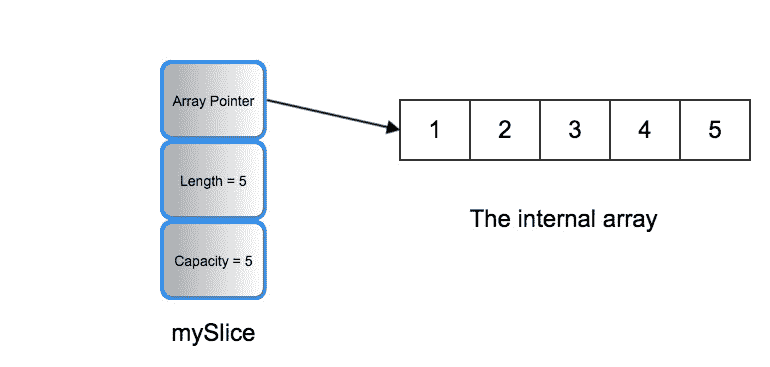
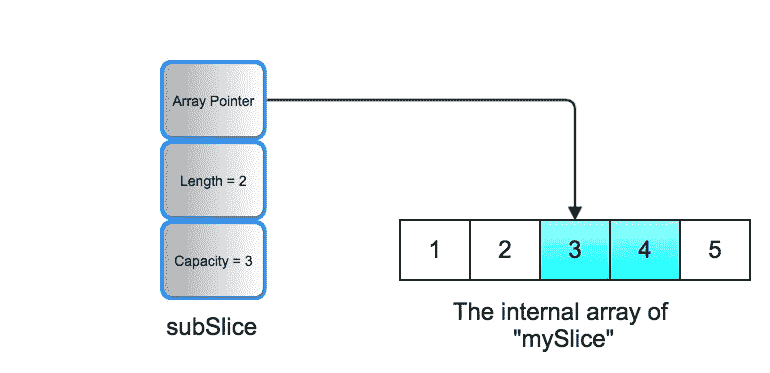

# 第二章：Go 语言的基本构建块

欢迎来到我们旅程的第一章，我们将学习 Go 语言的完整栈开发。本章是为那些还不熟悉 Go 语言的读者准备的。如果你已经精通 Go 语言，你可以跳过这一章。我们将简要但实用地介绍构成 Go 语言基础的基本构建块。然后，我们将向你展示 Go 语言的函数和循环等基本编程结构的语法。我们还将涵盖一些 Go 语言特有的概念，如切片、`panic` 和 `defer`。本章假设你对编程概念（如变量、函数、循环和条件语句）有一定的了解。本章还假设你对终端、命令行以及环境变量的概念有一定的了解。

一个从零开始学习 Go 语言的极好资源可以在 [tour.golang.org](http://tour.golang.org) 找到。

在本章中，我们将涵盖以下主题：

+   基本概念——包、变量、数据类型和指针

+   函数和闭包

+   条件语句和循环

+   `panic`、`recover` 和 `defer`

+   Go 数据结构

+   Go 接口

# 技术要求

为了跟随本章的内容，你可以执行以下操作之一：

+   前往 [play.golang.org](http://play.golang.org)，这将允许你在网上运行或测试你的代码。

+   下载 Go 编程语言，以及兼容的集成开发环境（IDE）

如果你还没有下载 Go，你可以通过访问 [`golang.org/dl/`](https://golang.org/dl/) 下载 Go 语言，下载适合你操作系统的 Go 版本，然后进行安装。

对于本地 IDE，我更喜欢 Visual Studio Code ([`code.visualstudio.com`](https://code.visualstudio.com))，以及其流行的 Go 插件 ([`code.visualstudio.com/docs/languages/go`](https://code.visualstudio.com/docs/languages/go))。

# Go 的游乐场

Go 编程语言的游乐场是一个相当受欢迎的网站，它允许 Go 社区在线测试 Go 代码示例。该网站可在 [play.golang.org](http://play.golang.org) 找到。无论何时你想快速测试一段简单的 Go 代码，请访问该网站并运行你的代码。

# 设置 Go 的工作空间

为了在你的计算机上编写 Go 代码，你需要设置一个 Go 工作空间。Go 工作空间是一个文件夹，你将在其中编写 Go 代码。设置 Go 工作空间相对简单。以下是你需要做的事情：

1.  首先，请确保你已经安装了 Go。正如我们之前提到的，你可以通过访问 [`golang.org/dl/`](https://golang.org/dl/) 下载并安装 Go。

1.  安装 Go 后，在你的计算机中为 Go 工作空间创建一个新的文件夹。我的文件夹名为 `GoProjects`。

1.  在您的 Go 工作空间文件夹内，您必须创建三个主要文件夹：`src`、`pkg` 和 `bin`。在您的 Go 工作空间文件夹内创建具有这些确切名称的文件夹非常重要。以下是这三个文件夹为什么重要的原因：

    +   `src` 文件夹将托管所有您的代码文件。每次您决定开始一个新的程序时，您只需前往 `src` 文件夹并创建一个以您新程序名称命名的新文件夹。

    +   `pkg` 文件夹通常托管您的代码的编译包文件。

    +   `bin` 文件夹通常托管由您的 Go 程序生成的二进制文件。

1.  您需要设置两个环境变量：

    +   第一个环境变量被称为 `GoRoot`，它将包含您的 Go 安装路径。通常，`GoRoot` 应由 Go 安装程序处理。但是，如果它缺失，或者您想将您的 Go 安装移动到不同的位置，那么您需要设置 `GoRoot`。

    +   第二个环境变量被称为 `GoPath`。`GoPath` 包含了您 Go 的工作空间文件夹的路径。默认情况下，如果没有设置，`GoPath` 在 Unix 系统上假定是 `$HOME/go`，在 Windows 系统上假定是 `%USERPROFILE%\go`。有一个整个 GitHub 页面涵盖了在不同操作系统上设置 `GoPath` 的方法，可以在 [`github.com/golang/go/wiki/SettingGOPATH`](https://github.com/golang/go/wiki/SettingGOPATH) 找到。

一旦您的 Go 环境设置完成，您就可以使用 Go 工具，该工具与 Go 语言一起安装，以便您编译和运行您的 Go 程序。

我们将在下一节中查看 Go 语言的一些基本构建块。

# 包、变量、数据类型和指针

包、变量、数据类型和指针代表了 Go 语言最基本的构建块。在本节中，我们将从实际的角度逐一介绍它们。

# 包

任何 Go 程序都由一个或多个包组成。每个包基本上是一个文件夹，其中包含一个或多个 Go 文件。您所写的每个 Go 代码文件都必须属于一个包。包文件夹位于您的 Go 工作空间文件夹的 `src` 文件夹内。

当您编写 Go 代码时，您需要在您的 Go 文件顶部声明您的包名。以下是代码中的样子：

```go
package mypackage
```

在这里，`mypackage` 是我的 Go 文件所属的包的名称。在 Go 中，使用小写字母的包名是惯例。通常，将包文件夹的名称与包名称相同是首选的做法。因此，当您创建一个新的包时，只需创建一个以您的包名称命名的新文件夹，然后在那个文件夹内创建您的包文件。

要导入外部包并在自己的包中使用它，你需要使用`import`关键字。例如，Go 标准库中的一个流行包是`fmt`包，它允许你将数据写入标准输出（即写入你的控制台屏幕）。假设我们想在我们的包中使用`fmt`包。代码将如下所示：

```go
package mypackage 
 import "fmt"
```

一些包文件夹可以存在于其他包的文件夹中。例如，Go 中包含`rand`包的文件夹，该包用于生成随机数，存在于包含`math`包的文件夹中。要导入这样的包，你需要使用以下语法：

```go
import "math/rand"
```

现在，如果我们想一次性导入多个包，这很简单——语法将看起来像这样：

```go
import (
 "fmt"
 "math/rand"
 )
```

Go 不允许你导入一个包然后不使用它，以确保你的代码干净简洁。然而，有一些情况（我们将在本书的后面部分讨论）你可能想要加载一个包，但又不直接使用它。这可以通过在导入语句中包名前添加一个下划线来实现。这将如下所示：

```go
import (
 "database/sql"
 _ "github.com/go-sql-driver/mysql"
)
```

最著名的包名是`main`。你的主包是运行在 Go 程序中的第一个包。

要编译 Go 程序，你需要在控制台中导航到你的`main`包所在的文件夹，然后输入以下命令：

```go
go install
```

此命令将编译你的 Go 程序，并将生成的二进制文件放置在你的工作区的`bin`文件夹中。

或者，你可以运行以下命令：

```go
go build
```

此命令将编译并部署生成的二进制文件到当前文件夹。

如果你想要指定输出路径和文件名，你可以运行以下命令：

```go
go build -o ./output/myexecutable.exe
```

这将编译你的代码，然后在指定的输出文件夹中打包成一个名为`myexecutable.exe`的可执行文件。如果你的操作系统不是 Windows，你可以忽略前面的例子中的`exe`扩展名。

# 变量和数据类型

变量是 Go 语言的基本构建块之一。在 Go 中，要声明变量，你可以简单地使用`var`关键字。这看起来是这样的：

```go
var s string
```

显然，`string`是数据类型。假设我们想在同一个语句中声明多个字符串类型的变量。这看起来是这样的：

```go
var s1,s2,s3 string
```

要使用初始值初始化变量，Go 提供了一些选项。一个选项是在指定变量类型的同时初始化变量。这看起来是这样的：

```go
var s1,s2,s3 string = "first-string", "second-string", "third-string"
```

另一个选项是不指定数据类型来初始化变量。这看起来是这样的：

```go
var s1,s2,s3 = "first-string", "second-string", "third-string"
```

我们可以使用以下语法混合数据类型：

```go
var s,i,f = "mystring",12,14.53
```

同时声明和初始化多个变量的流行方式如下：

```go
var (
 s = "mystring"
 i = 12
 f = 14.53
 )
```

如果你在一个函数内部声明和初始化变量，甚至不需要使用 `var` 关键字。相反，你可以使用 `:=`。这被称为 **类型推断**，因为你可以从提供的值中推断变量类型。以下是使用类型推断声明和初始化 `s`、`i` 和 `f` 变量的方法：

```go
s := "mystring"

i := 12

f:=14.53
```

然而，`var` 关键字提供了更多的控制，因为它允许你显式指定你想要为变量使用的数据类型。

现在，让我们来讨论数据类型。Go 语言有一组标准的数据类型，这些数据类型与任何其他静态类型编程语言中的数据类型非常相似。以下是 Go 语言标准数据类型的总结：

| **数据类型** | **描述** |
| --- | --- |
| `bool` | 布尔值（要么是 true，要么是 false）。 |
| `string` | `string` 是 `byte` 的集合，可以存储任何字符。字符串是只读的（不可变），所以每次你需要向字符串中添加或删除字符时，实际上是在创建一个新的字符串。 |
| `int`、`int8`、`int16`、`int32` 和 `int64` | 有符号整数类型。它们表示非十进制数，可以是正数或负数。从类型名称中你可能已经猜到，你可以显式指定它可以允许的位数。如果你选择 `int` 类型，它将选择与你的环境相对应的位数。对于大多数现代 CPU 架构，它将选择 64 位，除非你正在使用较小的 CPU 或较旧的环境。对于较小的 CPU 或较旧的环境，选择变为 32 位。 |
| `uint`、`uint8`、`uint16`、`uint32`、`uint64` 和 `uintptr` | 无符号整数类型。它们表示非十进制数，只能为正数。除了符号外，它们与它们的带符号兄弟相似。`uintptr` 类型是一个足够大的无符号整数类型，可以存储内存地址。 |
| `byte` | `uint8` 的别名，它包含 8 位，基本上代表一个字节的内存。 |
| `rune` | `int32` 的别名，通常用于表示 Unicode 字符。 |
| `float32` 和 `float64` | 简单的十进制数。对于较小的十进制数，使用 `float32` 类型，因为它只允许 32 位的数据。对于较大的十进制数，使用 `float64` 类型，因为它只允许 64 位的数据。 |
| `complex64` 和 `complex128` | 复数。这些数据类型在需要严肃数学的程序中非常有用。第一种类型 `complex64` 是一个复数，其实部是一个 32 位浮点数，虚部也是一个 32 位浮点数。第二种类型 `complex128` 是一个复数，其实部是一个 64 位浮点数，而虚部也是一个 64 位浮点数。 |

没有显式初始值的变量会被分配所谓的 **零值**。以下是零值的表格：

| **类型** | **零值** |
| --- | --- |
| 数值类型 | `0` |
| 布尔类型 | `false` |
| 字符串类型 | `""` |
| 指针 | `nil` |

# 指针

指针的概念很简单——**指针**是一种语言类型，它表示您的值的内存位置。Go 中的指针无处不在，这是因为它们给程序员提供了很多对代码的控制权。例如，访问内存中的值允许您从代码的不同部分更改原始值，而无需复制您的值。

在 Go 中，要创建一个指针，只需在您的值的数据类型前添加 `*` 即可。例如，这里是一个指向 `int` 值的指针：

```go
var iptr *int
```

正如我们在上一节中提到的，指针的零值是 `nil`。`nil` 的行为类似于 Java 等语言中的 `null`，也就是说，如果您尝试使用 `nil` 指针，将会抛出一个错误。

现在，假设我们有一个名为 `x` 的 `int` 类型的值：

```go
var x int = 5
```

我们还想要一个指针指向 `x` 的地址，以供以后使用：

```go
var xptr = &x
```

这里的 `&` 运算符意味着我们想要 `x` 的地址。每次在变量前添加 `&` 运算符时，它基本上意味着我们想要该变量的地址。

如果我们有一个指针，并且我们想要检索它指向的值呢？这个操作称为 **解引用**，下面是如何进行操作的示例：

```go
y := *xptr
```

在前面的代码中，我们解引用了指针 `xptr` 来获取它指向的值，然后我们将值的副本存储在一个名为 `y` 的新变量中。

如果我们想要更改指针指向的值呢？我们仍然可以使用解引用来做到这一点，下面是这个操作的示例：

```go
*xptr = 4
```

完美！有了这些，您应该具备足够的知识来在代码中使用 Go 指针。

如果您已经从 C 或 C++ 等不同的编程语言中获得了指针的经验，您可能熟悉指针算术的概念。这是指在指针上进行算术运算（如加法或减法），以到达不同的内存地址。默认情况下，Go 不支持我们对本节中描述的纯指针进行指针算术。然而，有一个名为 `unsafe` 的包允许您这样做。`unsafe` 包仅存在于为您提供权力的目的，如果您确实需要，但强烈建议除非绝对必要，否则不要使用它。

现在，让我们探索 Go 中的函数和闭包。

# 函数和闭包

现在是时候讨论函数和闭包了，所以请坐稳并享受这段旅程。函数被认为是任何编程语言中的关键构建块之一，因为它们允许您在代码中定义操作。

让我们来讨论函数的基础知识。

# 函数 – 基础

下面是如何在 Go 中编写函数的示例：

```go
func main(){
//do something
}
```

`main` 函数几乎总是您 Go 程序中首先执行的功能。`main` 函数需要位于 `main` 包中，因为 `main` 是您 Go 程序的入口点包。

下面是一个带有参数的函数的示例：

```go
func add(a int, b int){
//a+b
}
```

由于前面的代码中的 `a` 和 `b` 参数类型相同，我们也可以这样做：

```go
func add(a,b int){
//a+b
}
```

现在，假设我们想从我们的函数中返回一个值。这看起来会是这样：

```go
func add(a,b int)int{
return a+b
}
```

Go 语言还允许多重返回，所以你可以这样做：

```go
func addSubtract(a,b int)(int,int){
return a+b,a-b
}
```

在 Go 语言中，有一个称为 *named returns* 的概念，这基本上意味着你可以在函数头部命名你的返回值。这看起来是这样的：

```go
func addSubtract(a,b int)(add,sub int){
add = a+b
sub = a-b
return
}
```

在 Go 语言中，函数也是一等公民，这意味着你可以将一个函数赋值给一个变量，并使用它作为值。以下是一个示例：

```go
var adder = func(a,b int)int{
return a+b
}
var subtractor = func(a,b int) int{
return a-b
}
var addResult = adder(3,2)
var subResult = subtractor(3,2)
```

由于这个原因，你还可以将函数作为参数传递给其他函数：

```go
func execute(op func(int,int)int, a,b int) int{
return op(a,b)
}
```

这里是一个示例，展示了我们如何使用之前定义的 `execute` 函数：

```go
var adder = func(a, b int) int {
    return a + b
}
execute(adder,3,2)
```

Go 语言还支持可变参数函数的概念。一个 **可变参数函数** 是一个可以接受任意数量参数的函数。以下是一个 `adder` 函数的示例，它接受任意数量的 `int` 参数并将它们相加：

```go
func infiniteAdder(inputs ...int) (sum int) {
  for _, v := range inputs {
    sum += v
  }
  return
}
```

前面的函数接受任意数量的 `int` 参数，然后将它们全部相加。我们将在本章的 *条件语句和循环* 部分稍后介绍 `for..range` 语法。然后我们可以使用以下语法调用我们的新函数：

```go
infiniteAdder(1,2,2,2) // 1 + 2 + 2 + 2
```

在下一节中，我们将探讨如何从其他包中访问函数。

# 函数 – 从其他包访问函数

在本章的早期，我们介绍了包的概念，以及一个 Go 程序由多个连接的包组成的事实。那么，我们究竟是如何连接包的呢？我们通过能够从其他包中调用函数和检索类型来连接包。但随之而来的问题是，我们如何将一个函数暴露给其他包？

在 Go 语言中，没有像大多数其他静态类型编程语言那样的 `private` 或 `public` 关键字。如果你想使你的函数 `public`，你只需要将函数名以大写字母开头。在 Go 语言中，这被称为使你的函数 **exported**。相反，如果你的函数以小写字母开头，那么你的函数被认为是 **unexpected**。

为了理解前面的两段内容，让我们通过一些代码来实践。这里有一个名为 `adder` 的包，它包含一个名为 `Add` 的单个函数：

```go
package adder

func Add(a,b int)int {
  return a+b
}
```

现在，假设我们想从一个不同的包中调用 `Add`。以下是我们会做的事情：

```go
package main

//get the adder package
import "adder"

func main() {
  result := adder.Add(4, 3)
  //do something with result
}
```

在前面的代码中，我们在主包的 `main` 函数中调用了导出的函数 `Add`。我们做了两件事：

+   使用 `import` 关键字加载 `adder` 包

+   在主函数中，我们调用了 `adder.Add(..)`

如演示所示，要调用导出的函数，你需要使用以下语法：

```go
<package name>.<exported function name>
```

如果在 `adder` 包中我们将函数命名为 `add` 而不是 `Add`，那么前面的代码将不会工作。这是因为当函数以小写字母开头时，它会被认为是意外的，这实际上意味着它对其他包是不可见的。

让我们看看 Go 标准包中的几个例子。

Go 标准包中的一个非常流行的包是`fmt`包。`fmt`包可以写入你的环境的标准输出。它还可以格式化字符串并从标准输入扫描数据，等等。以下是一个简单但非常常用的代码片段：

```go
package main

import (
  "fmt"
)

func main() {
  fmt.Println("Hello Go world!!")
}
```

在前面的代码中，我们调用了一个名为`Println`的函数，该函数位于`fmt`包中。`Println`函数将接受你的字符串消息并将其打印到标准输出。前面程序的输出如下：

```go
Hello Go world!!
```

在 Go 的世界中，另一个流行的包是`math/rand`，我们可以用它来生成随机数。正如我们在本章前面的*包*部分提到的，包名不是`rand`而是`math/rand`，这仅仅是因为`rand`包文件夹位于`math`包文件夹之下。所以，尽管`rand`更像是子包，但我们只需要在需要调用属于它的导出函数时使用包名。以下是一个简单的例子：

```go
package main

import (
  "fmt"
  "math/rand"
)

func main() {
  fmt.Println("Let's generate a random int", rand.Intn(10))
}
```

在前面的代码中，我们导入了两个包——`fmt`包和`math/rand`包。然后，我们从每个包中调用了两个函数。我们首先调用了属于`fmt`包的`Println`函数，将其输出到标准输出。然后，我们调用了属于`math/rand`包的`Intn`函数，以生成介于零和九之间的随机数。

现在，让我们看看闭包的构成。

# 闭包

函数也可以是闭包。闭包是一个与外部变量绑定的函数值。这意味着闭包可以访问和改变这些变量的值。没有例子很难理解闭包。以下是对加法函数的另一种风格的示例，它返回一个闭包：

```go
func adder() func(int) int {
  sum := 0
  return func(x int) int {
    sum += x
    return sum
  }
}
```

在前面的例子中，闭包可以访问`sum`变量，这意味着它会记住`sum`变量的当前值，并且还能改变`sum`变量的值。再次强调，这最好通过另一个例子来解释：

```go

func adder() func(int) int {
  sum := 0
  return func(x int) int {
    sum += x
    return sum
  }
}

func main() {
  // when we call "adder()",it returns the closure
  sumClosure := adder() // the value of the sum variable is 0
  sumClosure(1) //now the value of the sum variable is 0+1 = 1
  sumClosure(2) //now the value of the sum variable is 1+2=3
 //Use the value received from the closure somehow
}
```

我们已经涵盖了 Go 的基础知识。在下一节中，我们将继续讨论 Go 数据结构。

# Go 数据结构

在本节中，我们将讨论 Go 语言的一些关键概念。现在是时候探索构建 Go 语言非平凡程序所需的基础数据结构了。

在接下来的几节中，我们将讨论 Go 的各种数据结构，包括数组、切片、映射、Go 结构和方法。

# 数组

数组是任何编程语言中都存在的常见数据结构。在 Go 中，数组是具有相同数据类型和预定义大小的值的集合。

这是如何在 Go 中声明数组的示例：

```go
var myarray [3]int
```

前面的数组是`int`类型，大小为`3`。

然后，我们可以这样初始化数组：

```go
myarray = [3]int{1,2,3}
```

或者，我们可以这样做：

```go
//As per the array declaration, it has only 3 items of type int

myarray[0] = 1 //value at index 0
myarray[1] = 2 //value at index 1
myarray[2] = 3 //value at index 2
```

或者，类似于其他变量，我们可以在同一行声明和初始化数组，如下所示：

```go
var myarray = [3]int{1,2,3}
```

或者，如果我们是在函数内部声明和初始化数组，我们可以使用`:=`符号：

```go
myarray := [3]int{1,2,3}
```

Go 提供了一个名为`len()`的内置函数，它返回数组的大小/长度。例如，假设我们运行以下代码：

```go
n := len(myarray)
fmt.Println(n)
```

输出将简单地是`3`，因为`myarray`的大小是`3`。

Go 还允许你捕获主数组中的子数组。要做到这一点，你需要遵循以下语法：

```go
array[<index1>:<index2>+1]
```

例如，假设我声明了一个看起来像这样的新数组：

```go
myarray := [5]int{1,2,3,4,5}
```

我可以使用以下语法从我的数组索引二到索引三获取一个子数组：

```go
myarray[2:4]
```

前面代码的输出如下：

```go
[3 4]
```

传递给前面语法的两个索引是`2`，表示我们想要从索引二开始，然后是`4`，表示我们想要在索引四停止（*3+1=4*）。

在前面的语法中，方括号内你也可以留空任意一边。比如说，你让左边留空，就像这样：

```go
myarray[:4]
```

这表示你想要从索引零到索引三的子数组。

然而，假设你让右边留空，就像这样：

```go
myarray[2:]
```

这表示子数组将从索引二开始，直到你的原始数组末尾。

假设你做了类似这样的事情：

```go
mySubArray := myarray[2:4]
```

`mySubArray`不仅仅是`myarray`子部分的副本。实际上，这两个数组将指向相同的内存。让我们通过一个例子来详细说明。以下是一个简单的程序：

```go
package main

import (
  "fmt"
)

func main() {
  myarray := [5]int{1,2,3,4,5}
  mySubArray := myarray[2:4]
  mySubArray[0] = 2
  fmt.Println(myarray)
}
```

这个程序输出`myarray`，但它是在我们更改`mySubArray`中的值之后输出的。正如你在前面的代码中所看到的，`myarray`中的原始值是`1`、`2`、`3`、`4`和`5`。然而，因为我们更改了`mySubArray`中索引`0`的值，也就是`myarray`中索引`2`的值，所以输出最终会变成以下这样：

```go
[1 2 2 4 5]
```

完美！我们现在对如何在 Go 中使用数组有了清晰的认识。让我们继续学习切片。

# 切片

Go 的数组数据结构有一个非常明显的限制——你必须在声明新数组时指定大小。在现实生活中，有许多场景我们事先不知道期望的元素数量。几乎每种现代编程语言都有自己的数据结构来满足这一需求。在 Go 中，这个特殊的数据结构被称为**切片**。

从实际的角度来看，你可以把切片简单地看作是动态数组。从语法的角度来看，切片看起来与数组非常相似，只是你不需要指定大小。以下是一个例子：

```go
var mySlice []int
```

如你所见，切片声明与数组声明非常相似，只是切片不需要指定元素数量。

这里是我们用一些初始值初始化前面幻灯片的例子：

```go
mySlice = []int{1,2,3,4,5}
```

让我们一次性声明并初始化这个数组的一些初始值：

```go
var mySlice = []int{1,2,3,4,5}
```

由于切片可以增长大小，我们也可以初始化一个空的切片：

```go
var mySlice = []int{}
```

如果你想在切片中设置初始元素数量而不必手动编写初始值，你可以利用一个名为 `make` 的内置函数：

```go
var mySlice = make([]int,5)
```

前面的代码将声明并初始化一个初始长度为 `5` 个元素的 `int` 切片。

要编写高效的 Go 代码并从切片中受益，你首先需要了解切片是如何在内部工作的。

可以简单地将切片视为指向数组一部分的指针。切片包含三个主要信息：

+   指向切片指向的子数组第一个元素的指针。

+   切片暴露的子数组的长度。

+   容量，即原始数组中剩余的项目数量。容量始终等于长度或更大。

这听起来太理论化了，所以让我们利用代码和一些可视化来提供一个关于切片实际工作方式的实际解释。

假设我们创建了一个新的切片：

```go
var mySlice = []int{1,2,3,4,5}
```

我们内部创建的新切片指向一个包含我们设置的 `5` 个初始值的数组：



如前图所示，`mySlice` 包含了三个信息：

+   第一个是数组底部的指针，它包含数据

+   第二个是切片的长度，在这个例子中是 `5`

+   第三个是切片的完整容量，在这个例子中也是 `5`

然而，前图并没有真正阐明切片的容量如何与长度不同。为了揭示长度和容量之间的实际差异，我们需要深入挖掘。

假设我们决定从原始切片中提取一个子切片：

```go
var subSlice = mySlice[2:4]
```

重新切片 `mySlice` 不会产生数组底下的新、更小的副本。相反，前面的代码行将产生以下切片：



由于 `subSlice` 包含 `mySlice` 的索引二和索引三的元素，因此 `subSlice` 的长度是两个（记住数组索引从零开始，这就是为什么索引二是第三个元素而不是第二个）。然而，容量不同，这是因为原始数组从索引二开始还剩下三个元素，所以容量是三个，而不是两个，尽管长度是两个。

因此，换句话说，`subSlice` 的长度是两个，因为 `subSlice` 只关心两个元素。然而，容量是三个，因为从索引二开始，原始数组中还有三个元素，这是 `subSlice` 数组指针指向的索引。

有一个名为 `cap` 的内置函数，我们可以用它来获取切片的容量：

```go
cap(subSlice) //this will return 3
```

我们用于数组的内置函数 `len` 也可以用于切片，因为它会给你切片的长度：

```go
len(subSlice) //this will return 2
```

到现在为止，你可能想知道，为什么我应该关心长度和容量的区别？我只需要使用长度，完全忽略容量即可，因为容量只提供了关于隐藏内部数组的信息。

答案非常简单——**内存利用率**。如果`mySlice`有 100,000 个元素而不是仅仅五个呢？这意味着内部数组也将有 100,000 个元素。这个巨大的内部数组将存在于我们程序的内存中，只要我们使用从`mySlice`提取的任何子切片，即使我们使用的子切片只关心两个元素。

为了避免这种内存膨胀，我们需要明确地将我们关心的较少元素复制到一个新的切片中。通过这样做，一旦我们停止使用原始的大切片，Go 的垃圾回收器就会意识到巨大的数组不再需要，并将其清理掉。

那么，我们如何实现这一点呢？这可以通过一个内置函数`copy`来完成：

```go
  //let's assume this is a huge slice
  var myBigSlice = []int{1,2,3,4,5,6}
  //now here is a new slice that is smaller
  var mySubSlice = make([]int,2)
  //we copy two elements from myBigSlice to mySubSlice
  copy(mySubSlice,myBigSlice[2:4])
```

完美！有了这个，你应该对切片的内部结构和如何在切片中避免内存膨胀有了相当实际的理解。

我们一直说切片就像动态数组，但我们还没有看到如何实际扩展切片。Go 提供了一个简单的内置函数`append`，用于向切片中添加值。如果你达到了切片容量的极限，`append`函数将创建一个新的切片，其中包含更大的内部数组来存储你正在扩展的数据。`append`是一个可变参数函数，因此它可以接受任意数量的参数。下面是这个过程的示例：

```go
var mySlice = []int{1,2} //our slice holds 1 and 2
mySlice = append(mySlice,3,4,5) //now our slice holds 1,2,3,4,5
```

最后要提到的一个重要的事情是内置函数`make`。我们之前已经介绍了`make`函数以及它是如何用来初始化切片的：

```go
//Initialize a slice with length of 3
var mySlice = make([]int,3)
```

上述代码中的参数`3`代表切片的长度。但我们还没有提到的是，`make`也可以用来指定切片的容量。这可以通过以下代码实现：

```go
//initialize a slice with length of 3 and capacity of 5
var mySlice = make([]int,3,5)
```

如果我们不向`make()`函数提供容量，长度参数的值也将成为容量，换句话说，我们得到以下结果：

```go
//Initialize a slice with length of 3, and capacity of 3
var mySlice = make([]int,3)
```

现在，是时候讨论 map 了。

# Maps

HashMaps 在任何编程语言中都是非常流行且极其重要的数据结构。一个**map**是一个键值对的集合，你使用键来获取与之对应的值。使用 map 可以大大加快你的软件速度，因为使用 map 通过键获取值是一个非常快速的操作。

在 Go 中，你可以这样声明一个 map：

```go
var myMap map[int]string
```

上述代码声明了一个 map，其中键的类型为`int`，值类型为`string`。

你可以使用`make`函数来初始化一个 map：

```go
myMap = make(map[int]string)
```

在初始化之前你不能使用 map，否则会抛出错误。这里还有另一种初始化 map 的方法：

```go
myMap = map[int]string{}
```

如果你想用一些值初始化 map，你可以这样做：

```go
myMap = map[int]string{1: "first", 2: "Second", 3: "third"}
```

要向现有的 map 中添加值，你可以这样做：

```go
myMap[4] = "fourth"
```

要从一个 map 中获取值，你可以这样做：

```go
//x will hold the value in "myMap" that corresponds to key 4
var x = myMap[4]
```

你还可以使用以下语法检查映射中是否存在键，假设你的代码在一个函数块中：

```go
//If the key 5 is not in "myMap", then "ok" will be false
//Otherwise, "ok" will be true, and "x" will be the value
x,ok := myMap[5]
```

你可以使用内置的 `delete` 函数从映射中删除值：

```go
//delete key of value 4
delete(myMap,4)
```

# 结构体

在 Go 语言中，`struct` 是一种由字段组成的数据结构，其中每个字段都有一个类型。下面是一个 Go `struct` 的样子：

```go
type myStruct struct{
    intField int
    stringField string
    sliceField []int
}
```

上一段代码创建了一个名为 `myStruct` 的 `struct` 类型，它包含三个字段：

+   `intField` 类型为 `int`

+   `stringField` 类型为 `string`

+   `sliceField` 类型为 `[]int`

然后，你可以在你的代码中初始化和使用该 `struct` 类型：

```go
var s = myStruct{
intField: 3,
stringField: "three",
sliceField : []int{1,2,3},
}
```

上述初始化方法也被称为 **结构字面量**。它有一个更简短的版本，如下所示：

```go
var s = myStruct{3,"three",[]int{1,2,3}}
```

你还可以使用所谓的 *点符号*，如下所示：

```go
var s = myStruct{}
s.intField = 3
s.stringField = "three"
s.sliceField= []int{1,2,3}
```

你可以通过以下方式获得 `struct` 的指针：

```go
var sPtr = &myStruct{
intField:3,
stringField:"three",
sliceField: []int{1,2,3},
}
```

可以使用点符号与 Go `struct` 指针一起使用，因为 Go 会理解需要做什么，而无需进行任何指针解引用：

```go
var s = &myStruct{}
s.intField = 3
s.stringField = "three"
s.sliceField= []int{1,2,3}
```

如果 Go `struct` 字段名以小写字母开头，它们将对外部包不可见。如果你想让你的 `struct` 或其字段对其他包可见，请以大写字母开头命名 `struct` 和/或字段。

现在，让我们谈谈 Go 中的方法。

# 方法

方法基本上是一个附加到类型的函数。例如，假设我们有一个名为 `Person` 的 `struct` 类型：

```go
type Person struct{
    name string
    age int
}
```

Go 允许我们以这种方式给该类型附加一个方法：

```go
func (p Person) GetName()string{
  return p.name
}
```

关键字 `func` 和函数名 `GetName()` 之间的部分被称为 **方法接收者**。

假设我们声明一个 `Person` 类型的值，如下所示：

```go
var p = Person{
name: "Jason",
age: 29,
}
```

现在，我们可以按照以下方式调用值 `p` 的 `GetName` 方法：

```go
p.GetName()
```

让我们创建另一个名为 `GetAge()` 的方法，它返回附加的 `person` 的 `age`。以下是实现此功能的代码：

```go
func (p Person) GetAge()int{
  return p.age
}
```

现在，我们将看到类型嵌入是什么。

# 类型嵌入

但如果你想让一个 `struct` 继承另一个 `struct` 的方法，Go 语言提供的最接近继承概念的功能被称为 *类型嵌入*。这个特性最好通过一个例子来解释。让我们回到 `Person` `struct` 类型：

```go
type Person struct{
    name string
    age int
}

func (p Person) GetName()string{
  return p.name
}

func (p Person) GetAge()int{
  return p.age
}
```

现在，假设我们想要创建一个新的名为 `Student` 的 `struct` 类型，它具有 `Person` 类型所有的属性和方法，还有一些额外的功能：

```go
type Student struct{
    Person
    studentId int
}

func (s Student) GetStudentID()int{
    return s.studentId
}
```

注意，在上一段代码中，我们在 `Student` 类型的结构定义中包含了 `Person` 类型，但没有指定字段名。这将有效地使 `Student` 类型继承 `Person` `struct` 类型的所有导出方法和字段。换句话说，我们可以直接从 `Student` 类型的对象中访问 `Person` 的方法和字段：

```go
s := Student{}
//This code is valid, because the method GetAge() belongs to the embedded type 'Person':
s.GetAge()
s.GetName()
```

在 Go 语言中，当一个类型被嵌入到另一个类型中时，嵌入类型的导出方法和字段被称为被 *提升* 到父或嵌入类型。

在下一节中，我们将探讨如何在 Go 中构建接口。

# 接口

在介绍了方法之后，我们必须介绍接口，接口在 Go 语言中通过方法产生高效和可扩展的代码。

一个接口可以非常简单地描述为 Go 语言中包含一组方法的类型。

这里有一个简单的例子：

```go
type MyInterface interface{
    GetName()string
    GetAge()int
}
```

前面的接口定义了两个方法——`GetName()`和`GetAge()`。

之前，我们将两个具有相同签名的函数附加到了名为`Person`的类型上：

```go
type Person struct{
    name string
    age int
}
func (p Person) GetName()string{
  return p.name
}
func (p Person) GetAge()int{
  return p.age
}
```

在 Go 语言中，接口可以被其他类型实现，例如 Go 结构体。当一个 Go 类型实现接口时，接口类型的值可以包含该 Go 类型的数据。我们很快就会看到这意味着什么。

Go 语言中的一个非常特殊的功能是，为了实现或*继承*接口，类型只需要实现该接口的方法。

换句话说，前面代码中的`Person`结构体类型实现了`myInterface`接口类型。这是因为`Person`类型实现了`GetName()`和`GetAge()`，这些方法与`myInterface`中定义的方法相同。

那么，当`Person`实现`MyInterface`时，它意味着什么呢？

这意味着我们可以这样做：

```go
var myInterfaceValue MyInterface
var p = Person{}
p.name = "Jack"
p.age = 39
// some code
myInterfaceValue = p
myInterfaceValue.GetName() //returns: Jack
myInterfaceValue.GetAge() //returns: 39
```

我们也可以这样做：

```go
func main(){
    p := Person{"Alice",26}
    printNameAndAge(p)
}

func PrintNameAndAge(i MyInterface){
    fmt.Println(i.GetName(),i.GetAge())
}
```

接口在 API 和可扩展软件中得到了广泛的应用。它们允许你构建具有灵活功能的软件。这里有一个如何帮助构建灵活软件的简单例子。

假设我们想要创建一个新的`person`类型，该类型将头衔追加到名字中：

```go
type PersonWithTitle {
    name string
    title string
    age int
}

func (p PersonWithTitle) GetName()string{
   //This code returns <title> <space> <name>
    return p.title + " " + p.name
}

func (p PersonWithTitle) GetAge() int{
    return p.age
}

```

前面的类型也实现了`MyInterface`，这意味着我们可以这样做：

```go
func main(){
    pt := PersonWithTitle{"Alice","Dr.",26}
    printNameAndAge(pt)
}

func PrintNameAndAge(i MyInterface){
    fmt.Println(i.GetName(),i.GetAge())
}
```

`PrintNameAndAge()`函数签名不需要改变，因为它依赖于接口而不是具体类型。然而，由于我们将具体的`struct`类型从`Person`改为`PersonWithTitle`，行为会有所不同。这种能力允许你编写灵活的 API 和包，无需在代码中添加更多具体类型时进行更改。

有时候，你可能想从一个接口值中获取具体的类型值。Go 语言包含一个名为**类型断言**的功能，可以用于此目的。以下是类型断言最有用的形式：

```go
person, ok := myInterfaceValue.(Person)
```

前面的代码假设我们处于函数块内部。如果`myInterfaceValue`不包含`Person`类型的值，前面的代码将返回第一个返回值为空的结构体，第二个返回值为 false。因此，`ok`将为 false，而`Person`将为空。

另一方面，如果`myInterfaceValue`包含`Person`类型的值，那么`ok`将变为 true，`Person`变量将包含从`myInterfaceValue`检索到的数据。

现在，让我们通过介绍条件语句和循环来探索如何给我们的代码添加逻辑。

# 条件语句和循环

在 Go 语言中，有两个关键字用于条件语句——`if`和`switch`。让我们逐一实际看看它们。

# 如果语句

`if`语句看起来像这样：

```go
if <condition>{
}
```

因此，让我们假设我们想要比较一个值，`x`，是否等于`10`。下面是这个语法的样子：

```go
if x == 10{
}
```

在 Go 语言中，你还可以在`if`语句中执行一些初始化。下面是这个语法的样子：

```go
if x := getX(); x == 5{
}
```

和其他编程语言一样，一个`if`语句如果没有`else`子句就不完整。下面是 Go 语言中`if else`的样子：

```go
if x==5{
}else{
}
```

那么一个带有条件的`else`子句呢？

```go
if x == 5{
}else if x >10{
} else {
}
```

# `switch`语句

现在，让我们看看`switch`语句。下面是这个样子：

```go
switch x {
    case 5:
      fmt.Println("5")
    case 6:
      fmt.Println("6")

default:

  fmt.Println("default case")
}
```

如果你还没有注意到，没有`break`关键字。在 Go 语言中，每个 case 会自动跳出，不需要明确告诉它这样做。

和`if`语句类似，你可以在`switch`语句中进行初始化：

```go
switch x := getX();x {
    case 5:
      fmt.Println("5")
    case 6:
      fmt.Println("6")

default:

  fmt.Println("default case")
}
```

在 Go 语言中，一个`switch`语句可以像一组`if else`一样工作。这让你能够用更简洁的代码编写长的`if else`链：

```go
switch{
case x == 5:
//do something
case x > 10:
// do something else
default:
//default case
}
```

在某些情况下，你可能想让`switch`的 case 不自动跳出，而是继续到下一个 case。为此，你可以使用`fallthrough`关键字：

```go
switch{
case x > 5:
//do something
fallthrough
case x > 10:
// do something else. If x is greater than 10, then the first case will execute first, then this case will follow
default:
//default case
}
```

在条件语句之后，让我们看看循环。

# 循环

在 Go 语言中，当你想要写一个循环时，你可以使用一个单独的关键字——`for`。在 Go 语言中没有其他关键字来表示循环。

让我们看看下面的代码。假设我们想要从`1`循环到`10`；下面是如何做到这一点的方法：

```go
for i:=1;i<=10;i++{
//do something with i
}
```

和其他语言一样，你的`for`语句需要包含以下内容：

+   代码中的初始值（`i:=1`）——这是可选的

+   一个条件来指示是否继续迭代（`i<=10`）

+   下一个迭代的值（`i++`）

如果我们有一个切片或数组，并且我们想要在循环中遍历它，Go 语言通过`for .. range`的概念来提供帮助。假设我们有一个名为`myslice`的切片，并且我们想要遍历它。下面是这个代码的样子：

```go
myslice := []string{"one","two","three","four"}
for i,item := range myslice{
//do something with i and item
}
```

在前面的代码片段中，`i`代表当前迭代的索引。例如，如果我们处于`myslice`的第二项，那么`i`的值将是 1（因为索引从 0 开始）。另一方面，`item`变量代表当前迭代切片项的值。例如，如果我们处于切片的第三项，那么我们处于项值`three`。

有时候我们并不关心索引。为此，我们可以使用以下语法：

```go
for _,item := range myslice{
//do something with item
}
```

如果我们只关心索引怎么办？为此，我们可以这样做：

```go
for i := range myslice{
//do something with item
}
```

有人可能会问，为什么我只需要索引而不是切片本身的项目？答案是简单的——当你从`for..range`语句中获取项目时，你只获取了一个项目的副本，这意味着如果你需要的话，你将无法改变切片中存在的原始项目。然而，当你获取索引时，这给了你改变切片中项目的权力。在某些情况下，当你迭代切片时，你可能需要更改切片中的值。这就是你使用索引的时候。以下是一个简单的例子：

```go
myslice := []string{"one","two","three","four"}
  for i := range myslice {
     myslice[i] = "other"
  }
  fmt.Println(myslice)
  //output is: other other other other
```

但关于`while`循环呢？如果你来自除了 Go 以外的任何编程语言，你肯定完全了解`while`循环的概念。正如我们之前提到的，在 Go 中，所有循环都使用`for`关键字，所以换句话说，`for`也是 Go 中的`while`。以下是一个例子：

```go
for i>5{
//do something
}
```

正如其他编程语言一样，Go 支持`break`和`continue`关键字。在循环内部的`break`关键字会导致循环中断，即使它还没有完成。另一方面，`continue`关键字会强制循环跳到下一个迭代。

现在，我们将讨论`panic`、`recover`和`defer`

# `panic`、`recover`和`defer`

在 Go 中，有一个特殊的内置函数叫做`panic`。当你调用`panic`时，你的程序会被中断，并返回一个`panic`消息。如果`panic`被触发而你又没有及时捕捉到，你的程序将停止执行并退出，所以当你使用`panic`时要非常小心。以下是一个代码示例：

```go
func panicTest(p bool) {
  if p {
    panic("panic requested")
  }
}
```

在前面的例子中，我们编写了一个检查标志`p`的函数。如果`p`为真，那么我们就抛出一个`panic`。`panic`函数的参数是希望`panic`返回的消息。以下是一个更完整的程序，你可以在 Go 的 playground 中运行（[`play.golang.org`](http://play.golang.org)）：

```go
package main

import "fmt"

func main() {
  panicTest(true)
  fmt.Println("hello world")
}

func panicTest(p bool) {
  if p {
    panic("panic requested")
  }
}
```

当我在 Go 的 playground（[`play.golang.org`](http://play.golang.org)）中的主函数中执行那段代码时，我得到了以下错误：

```go
panic: panic requested

goroutine 1 [running]:
main.panicTest(0x128701, 0xee7e0)
  /tmp/sandbox420149193/main.go:12 +0x60
main.main()
  /tmp/sandbox420149193/main.go:6 +0x20

```

这个`panic`导致程序终止，这就是为什么`hello world`从未被打印出来。相反，我们得到了`panic`信息。

因此，既然我们已经了解了恐慌是如何工作的，一个显而易见的问题就出现了——我们如何捕捉一个`panic`并防止它杀死我们的程序？

在回答这个问题之前，我们首先需要介绍`defer`的概念。`defer`关键字可以用来表示一段代码必须在周围函数返回后才能执行。和往常一样，在查看代码示例之后，这会更容易理解：

```go
func printEnding(message string) {
  fmt.Println(message)
}

func doSomething() {
  //In here we use the keyword "defer"
  //This will call printEnding() right after doSomething()

  defer printEnding("doSomething() just ended")

  //In here, we just print values from 0 to 5
  for i := 0; i <= 5; i++ {
    fmt.Println(i)
  }
}
```

在前面的代码中，当我们使用`defer`时，我们实际上要求`printEnding()`函数在`doSomething()`执行完毕后立即执行。

`defer`语句基本上是将一个函数调用推送到一个列表中，并且当周围函数返回后，这个保存的调用列表会被执行。`defer`最常用于清理资源，比如关闭文件处理器等。

下面是前面程序的完整版本：

```go
package main

import (
  "fmt"
)

func main() {
  doSomething()
}

func printEnding(message string) {
  fmt.Println(message)
}

func doSomething() {
  defer printEnding("doSomething() just ended")
  for i := 0; i <= 5; i++ {
    fmt.Println(i)
  }
}
```

下面是这个程序的输出：

```go
0
1
2
3
4
5
doSomething() just ended
```

现在，如果我们多次在函数中使用 `defer` 呢？

```go
package main

import (
  "fmt"
)

func main() {
  doSomething()
}

func printEnding(message string) {
  fmt.Println(message)
}

func doSomething() {
  defer printEnding("doSomething() just ended 2")
  defer printEnding("doSomething() just ended")
  for i := 0; i <= 5; i++ {
    fmt.Println(i)
  }
}
```

`defer` 语句通常进入一个栈数据结构，这意味着它们根据先进后出的规则执行。所以，这基本上意味着代码中的第一个 `defer` 语句将最后执行，而下一个将直接在其之前执行，依此类推。为了更清晰地说明，让我们看看程序的输出：

```go
0
1
2
3
4
5
doSomething() just ended
doSomething() just ended 2
```

完美！我们现在可以回答我们之前的问题——如何在程序终止之前捕获和处理 `panic`？我们现在知道了 `defer` 以及它是如何确保我们选择的代码块在周围函数退出后立即执行的。所以，defers 可以用来在 `panic` 发生后插入代码，但 defers 足够吗？答案是：不够——有一个内置的函数叫做 `recover()`，我们可以用它来捕获 `panic` 并返回 `panic` 的消息。

再次强调，一个代码片段胜过千言万语：

```go
package main

import "fmt"

func main() {
  panicTest(true)
  fmt.Println("hello world")
}

func checkPanic() {
  if r := recover(); r != nil {
    fmt.Println("A Panic was captured, message:", r)
  }
}

func panicTest(p bool) {
  // in here we use a combination of defer and recover
  defer checkPanic()
  if p {
    panic("panic requested")
  }
}
```

上述代码将产生以下输出：

```go
A Panic was captured, message: panic requested
hello world
```

如你所见，我们利用了 `defer` 和 `recover()` 函数的组合来捕获 `panic`，以防止它终止我们的程序。如果没有发生 `panic`，`recover()` 函数将返回 `nil`。否则，`recover()` 函数将返回 `panic` 的错误值。如果我们单独使用 `recover()`，它不会有效，除非与 `defer` 结合使用。

# 摘要

本章带你踏上了 Go 语言构建块的实际学习之旅。我们涵盖了你在任何 Go 程序中可能看到的所有 Go 的基本特性。随着我们的进展，你将看到我们在本章中涵盖的构建块被反复利用。

在下一章中，我们将通过深入了解如何在 Go 中处理并发来介绍 Go 语言最受欢迎的特性之一。

# 问题

1.  `GoPath` 是用来做什么的？

1.  你如何在 Go 中编写 `while` 循环？

1.  什么是命名结果？

1.  函数和方法之间的区别是什么？

1.  什么是类型断言？

1.  `defer` 是用来做什么的？

1.  Go 中的 `panic` 是什么？

1.  我们如何从 `panic` 中恢复？

1.  Go 中数组和切片的区别是什么？

1.  什么是 interface？

1.  什么是 struct？

1.  什么是 map？

# 进一步阅读

关于本章所涵盖的内容的更多信息，你可以查看以下链接：

+   **Go 网站**: [golang.org](http://golang.org)

+   **安装 Go**: [`golang.org/doc/install`](https://golang.org/doc/install)

+   **Go 标准包**: [`golang.org/pkg/`](https://golang.org/pkg/)

+   **如何编写 Go 代码**: [`golang.org/doc/code.html`](https://golang.org/doc/code.html)

+   **Go 导航**: [tour.golang.org](http://tour.golang.org)

+   **切片内部结构**: [`blog.golang.org/go-slices-usage-and-internals`](https://blog.golang.org/go-slices-usage-and-internals)

+   **有效的 Go**：[`golang.org/doc/effective_go.html`](https://golang.org/doc/effective_go.html)

+   **使用 Go 进行组合**：[`www.ardanlabs.com/blog/2015/09/composition-with-go.html`](https://www.ardanlabs.com/blog/2015/09/composition-with-go.html)
