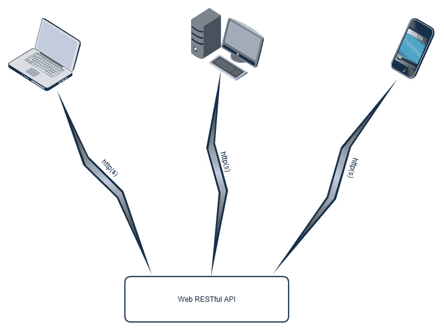
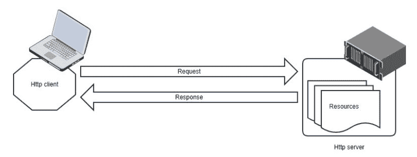

# 第六章：使用 Gin 框架在 Go 中构建 RESTful Web API

在前面的章节中，我们探讨了如何利用流行的 React 框架构建我们应用程序的引人入胜的前端。

现在是时候介绍如何在 Go 编程语言中构建高效的后端代码，以便与我们的前端一起工作。在本章中，我们将使用超快的 Gin 框架构建本书项目（即 GoMusic 商店）所需的某些 API。

在本章中，我们将介绍以下主题：

+   RESTful API

+   Gin 框架

+   模型和绑定

+   HTTP 处理器

# 技术要求

本章的代码可以在以下位置找到：[`github.com/PacktPublishing/Hands-On-Full-Stack-Development-with-Go/tree/master/Chapter06`](https://github.com/PacktPublishing/Hands-On-Full-Stack-Development-with-Go/tree/master/Chapter06)。

# RESTful API

任何后端软件系统都需要一组 API 来与前端通信。全栈软件简单地说是由一侧的前端组件和另一侧的后端组件交换消息组成的。全栈软件中最流行的 API 类型之一是 RESTful API。

让我们在下一节中概述 RESTful API。

# 概述

**RESTful API** 可以简单地定义为用于构建 Web 服务的一组规则，其中你可以检索或操作资源。**资源**通常是一种文档——它可能是一个 HTML 文档（例如网页），一个 JSON 文档（用于纯信息共享），或其它类型的文档。**JSON** 代表 **JavaScript 对象表示法**；这是因为它基本上指的是你如何在 JavaScript 中编写对象。它非常流行并且被广泛使用。

对于大多数 RESTful API，HTTP 被用作 API 的通信层：



这个主题可能非常冗长；然而，有一些简单的事实和概念你需要了解，以便正确地编写 RESTful API。在接下来的几节中，我们将概述 RESTful API 背后的关键构建块。

在接下来的几节中，我们将探讨客户端-服务器架构、URL 和 HTTP 方法。

# 客户端-服务器架构

RESTful API 依赖于客户端-服务器架构。这仅仅意味着对于 RESTful API，你需要两个主要组件——客户端和服务器。客户端向服务器发送 HTTP 请求，服务器向客户端回复 HTTP 响应。单个服务器通常同时处理多个客户端：



以下要点可以帮助解释前面的图表：

+   客户端是发起 API 请求的组件。客户端要么从服务器请求资源，要么向服务器发送资源。

+   服务器是接收请求并对其进行处理的组件。服务器在客户端请求时发送资源，或者在客户端请求这样做时添加/修改资源。

# URLs

URL 可以简单地定义为特定 RESTful API 资源的地址。

当客户端向服务器发送请求时，客户端会将请求发送到服务器正在监视的 URL 地址。任何 RESTful API 交互都涉及客户端向 URL 地址发送消息。

为了理解 URL 由什么组成，让我们以`http://www.example.com/user?id=1`为例。

前面的 URL 包含三个主要组成部分，我们需要注意如下：

1.  **服务器位置**：这基本上是协议和服务器域名的组合，`http://www.example.com/`。

1.  **相对 URL 路径**：这是从服务器地址开始的相对 URL 地址，`/user`。

1.  **查询**：这是一个用于识别我们寻求哪些资源的查询，例如`?id=1`。

前两个组件存在于绝大多数 RESTful API 交互中，而第三个组件用于更专业的 API 调用。

# HTTP 方法

如前所述，客户端向服务器发送请求。请求可以用来从服务器检索资源，或者操作由服务器托管的资源。然而，我们如何判断特定请求的意图？这就是 HTTP 方法发挥作用的地方。HTTP 方法基本上是客户端如何向服务器表明其意图。

HTTP 请求可以支持多种方法类型；然而，由于本书主要关注实用性，我们将讨论在 RESTful API 领域中最为常用的三种请求方法：

+   **GET 请求方法**：当客户端的意图是从服务器检索资源时，使用`GET` HTTP 请求方法。每次你打开一个网络浏览器，例如 Google Chrome，并输入`www.google.com`时，你的网络浏览器就充当一个 HTTP 客户端，向`www.google.com` URL 发送一个`GET` HTTP 请求。然后，Google 服务器接收你的客户端请求，并响应 Google 的主页，这是一个简单的 HTML 文档，然后由你的网络浏览器翻译成漂亮的界面。

+   **POST 请求方法**：当客户端的意图是向服务器发送数据时，使用`POST` HTTP 请求方法。当客户端发送`POST`请求时，它还必须在请求的消息体中包含服务器应该接收的数据。请求的 URL 地址标识了我们要添加或更改的资源。还有一个名为`PUT`的 HTTP 方法，可以用来添加或替换资源。然而，在我们的代码中我们将使用`POST`。

+   **删除**请求方法：当客户端的意图是从服务器删除资源时，会使用**删除** HTTP 请求方法。请求的 URL 将标识我们想要删除的资源。

现在我们已经涵盖了 REST API，是时候探索 Gin 框架了，这是我们将在 Go 代码中构建 REST API 的方式。

# Gin 框架

Gin 是一个非常流行的 Go 开源框架，主要用于构建超高性能的 RESTful API。该项目可以在 [`github.com/gin-gonic/gin`](https://github.com/gin-gonic/gin) 找到。Gin 不仅速度快，而且拥有简单、易于使用的 API，这使得构建生产级别的 RESTful API 变得轻而易举。

在本节中，我们将学习如何通过 Gin 框架构建一个 Web RESTful API，通过开始实现支持我们的 GoMusic 商店的必要后端代码。

让我们看看下一节中的模型和数据库层。

# 模型和数据库层

我们的后端显然需要一个数据库来存储我们的 RESTful API 应该公开的所有数据。让我们把数据库交互代码称为我们的**数据库层**。在后端软件系统的世界中，编写数据库层时需要谨慎和周到的设计。这是因为数据库层对于后端系统中的几乎所有主要功能都是至关重要的。

让我们在下一节中详细了解模型。

# 模型

构建良好设计的数据库层的第一步是为数据构建模型。**数据模型**可以简单地描述为表示我们从数据库检索并用于我们的 API 的信息的数据结构。这最好通过一个例子来解释。

在我们的 GoMusic 应用程序中，因为它只是一个简单的在线商店，出售产品，我们可以确定我们的应用程序需要支持的不同模型，如下所示：

+   一个产品

+   一个客户

+   一个客户订单

让我们开始编写一些代码；在你的项目根目录下，你需要创建一个名为 `backend` 的新文件夹。在这个文件夹下面，创建一个名为 `src` 的文件夹，然后在 `src` 文件夹下面，创建一个名为 `models` 的文件夹。现在，在 `models` 文件夹中，创建一个名为 `models.go` 的新文件。这就是我们将编写我们的模型的地方。我们首先需要做的是定义一个包，如下所示：

```go
package models
```

接下来，让我们编写我们的 `Product` 数据结构，如下所示：

```go
type Product struct{
  Image string `json:"img"`
  ImagAlt string `json:"imgalt"`
  Price float64 `json:"price"`
  Promotion float64 `json:"promotion"`
  ProductName string `json:"productname"`
  Description string `json:"desc"`
}
```

你可能对我们的 Go 结构体中奇怪的 `` `json:"..."` `` 语法感到困惑；这种语法被称为**结构体标签**。在我们的例子中，结构体标签用于指示相关字段在 JSON 文档中的外观。JSON 是一个非常流行的数据序列化格式，通常用于在 RESTful API 中共享数据。前面的 Go 结构体在 JSON 格式下将看起来像以下代码片段：

```go
{
     "img": "/path/to/img.jpeg",
     "imgalt": "image alt",
     "price": 100,
     "promotion":80,
     "productname": "guitar",
     "desc": "A black guitar with with amazing sounds!!"
}
```

从前面的 JSON 数据块中，你可以看出在 JSON 中表示数据是多么容易。

如果在我们的 Go 结构体中不使用 JSON 结构字段，Go 在将我们的 Go 结构体字段名转换为 JSON 字段名时会做出一些默认假设。例如，Go 结构体字段中的所有大写首字母将转换为 JSON 文档中的小写首字母。通常，使用 JSON 结构体标签是为了完全控制 JSON 文档的外观。

完美；现在，让我们编写我们的`Customer`数据结构，如下所示：

```go
type Customer struct {
  FirstName string `json:"firstname"`
  LastName string `json:"lastname"`
  Email string `json:"email"`
  LoggedIn bool `json:"loggedin"`
}
```

接下来，让我们编写我们的`Order`数据结构，如下所示：

```go
type Order struct{
  Product
  Customer
  CustomerID int `json:"customer_id"`
  ProductID int `json:"product_id"`
  Price float64 `json:"sell_price"`
  PurchaseDate time.Time `json:"purchase_date"`
}
```

前面的数据结构使用了 Go 的一项特性，称为*嵌入*。在我们的例子中，嵌入简单意味着我们在当前 Go 结构体中包含了另一个 Go 结构体的所有字段。我们在`Order` Go 结构体中嵌入了`Product`和`Customer` Go 结构体。这意味着所有产品客户 Go 结构体字段，如`img`和`firstname`，现在都是`Order`结构体的一部分。

让我们看一下下一节中的数据库层接口。

# 数据库层接口

设计良好的数据库层的另一个重要部分是数据库层接口。为了完全理解数据库接口层的必要性，让我们想象一个快速场景。假设你构建的后端使用数据库 *X*，并且所有代码都依赖于对数据库 *X* 的直接调用。现在，如果数据库 *X* 证明非常昂贵，而你发现了一个更便宜、更易于维护的数据库可以在代码中使用，我们可以将这个新数据库称为数据库 *Y*。你现在必须重新审视所有查询数据库 *X* 的代码，并进行更改，这可能会影响比数据库层更多的代码。

那么，我们该怎么做呢？我们只需创建一个接口，定义我们从数据库层期望的所有行为。数据库层之外的所有代码应该只使用此接口提供的方法，而不使用其他任何方法。现在，如果我们想从数据库 *X* 迁移到数据库 *Y*，我们可以简单地编写一个新的数据库层，它可以与数据库 *Y* 通信，同时仍然支持现有的数据库层接口。通过这样做，我们确保数据库层之外的大量现有代码将保持不变，并按预期运行。

我们下一步是编写 GoMusic 应用的数据库层接口。为此，我们必须首先确定我们希望从数据库层获得的行为，如下所示：

+   获取所有产品的列表

+   获取所有促销活动的列表

+   通过客户的首名和姓氏获取客户信息

+   通过客户的`id`获取客户信息

+   通过产品的`id`获取产品信息

+   将用户添加到数据库中

+   在数据库中将用户标记为已登录

+   在数据库中将用户标记为已注销

+   通过客户的`id`获取客户订单列表

在`backend/src`文件夹内，让我们创建一个名为`dblayer`的新文件夹。在这个文件夹内，我们将创建一个名为`dblayer.go`的新文件。这是我们编写数据库层接口的地方。我们通过声明包名和导入模型包开始我们的代码，如下所示：

```go
package dblayer

import (
  "github.com/PacktPublishing/Hands-On-Full-Stack-Development-with-Go/Chapter06/backend/src/models"
)
```

接下来，我们编写我们的接口，它封装了本节中涵盖的所有行为点，如下所示：

```go
type DBLayer interface{
  GetAllProducts() ([]models.Product, error)
  GetPromos() ([]models.Product, error)
  GetCustomerByName(string, string) (models.Customer, error)
  GetCustomerByID(int) (models.Customer, error)
  GetProduct(uint) (models.Product, error)
  AddUser(models.Customer) (models.Customer, error)
  SignInUser(username, password string) (models.Customer, error)
  SignOutUserById(int) error
  GetCustomerOrdersByID(int) ([]models.Order, error)
}
```

在下一章中，我们将回到数据库层继续其实现。但到目前为止，让我们专注于我们的 REST API 层及其使用 Gin 框架的实现。

# 使用 Gin 框架实现 RESTful API

如前所述，GoMusic 这样的全栈应用程序的后端代码需要通过 RESTful API 与前端组件交互。这仅仅意味着我们后端代码的一个主要部分是 RESTful API 层。从现在起，我们将讨论这个层，直到本章结束。

在开始编写代码之前，我们首先需要就我们的需求达成一致。任何精心设计的 RESTful API 后端的第一步是首先弄清楚前端组件和后端组件之间的不同交互。

这是我们的 RESTful API 需要做的事情：

1.  我们的后端需要向前端提供一个可用的产品列表。

1.  我们的后端需要向前端提供一个可用的促销列表。

1.  我们的前端需要将用户信息发送到我们的后端，以便登录现有用户或添加新用户。

1.  我们的前端需要将用户注销请求发送到后端。

1.  我们的后端需要提供一个特定用户的现有订单列表。

1.  我们的前端需要将信用卡令牌信息发送到后端以处理收费。

通过查看前面的点，我们可以猜测每个点应使用哪种 HTTP 方法：

+   对于第一、第二和第五点，我们使用`GET` HTTP 请求，因为服务器只需要提供资源（在我们的例子中，这些是 JSON 文档）作为对客户端请求的响应。

+   对于第三、第四和第六点，我们使用`POST` HTTP 请求，因为服务器预计将根据客户端请求添加或操作资源。

让我们看看如何在下一节中定义路由。

# 定义路由

实现 RESTful API 的下一步是定义对应于我们需要发生的不同 API 动作的不同 URL。这也被称为定义路由，因为 URL 是我们 API 资源的路由。

我们将逐一通过 RESTful API 交互并定义它们的路由。但首先，让我们为我们的 RESTful API 创建一个新文件。

在`backend/src`文件夹中，创建一个名为`rest`的新文件夹。在`rest`文件夹内，创建一个名为`rest.go`的文件。这是我们开始使用 Gin 框架的地方。在你的终端中，输入以下命令以部署和安装 Gin 框架到你的开发环境：

```go
go get -u github.com/gin-gonic/gin
```

在`rest.go`文件中，首先声明包名并导入 Gin 框架，如下所示：

```go
package rest

import (
  "github.com/gin-gonic/gin"
)
```

然后，声明一个作为我们 RESTful API 入口点的函数。这是我们定义 RESTful API 的 HTTP 路由的地方：

```go
func RunAPI(address string) error{
}
```

前面的方法接受一个参数，该参数将托管我们的 RESTful API 服务器的地址。

为了使用 Gin，我们首先需要获取一个**Gin 引擎**。Gin 引擎是对象类型，它为我们提供了将 HTTP 方法分配给 URL 以执行操作的能力：

```go
func RunAPI(address string) error{
    r := gin.Default()
}
```

接下来，我们需要开始将 HTTP 方法映射到 URL 以执行操作。为此，我们需要使用我们刚刚创建的 Gin 引擎对象。以下代码块是一个简单的示例，展示了我们如何使用 Gin 引擎接受一个到达相对 URL `/relativepath/to/url` 的`GET`请求：

```go
func RunAPI(address string) error{
    r := gin.Default()
 r.GET("/relativepath/to/url", func(c *gin.Context) {
 //take action
 })
}
```

在前面的代码中，匿名函数`func(c *gin.Context){}`是我们定义当收到满足我们条件（`/relativepath/to/url`相对路径和`GET` HTTP 方法）的客户端请求时想要执行的操作的地方。

`*gin.Context`类型是由 Gin 框架提供的。它为我们提供了所有工具，不仅可以帮助我们探索传入的请求，还可以采取行动并提供适当的响应。我们将在下一节中更详细地讨论`*gin.Context`类型，但现在，让我们专注于构建路由。让我们回顾一下 API 交互列表，并编写一些代码来表示每个交互：

1.  我们的后端需要通过一个`GET`请求向前端提供一个可用的产品列表：

```go
//get products
  r.GET("/products",func(c *gin.Context) {
      //return a list of all products to the client
    }
 )
```

1.  我们的后端需要通过一个`GET`请求向前端提供一个可用的促销列表：

```go
//get promos
  r.GET("/promos",func(c *gin.Context) {
      //return a list of all promotions to the client
    } 
  )
```

1.  我们的前端需要通过一个`POST`请求将用户信息发送到我们的后端，以便登录现有用户或添加新用户：

```go
//post user sign in
  r.POST("/users/signin", func(c *gin.Context) {
      //sign in a user
    } 
  )
//add user
r.POST("/users",func(c *gin.Context){
        //add a user
    }
)
```

1.  我们的前端需要通过一个`POST`请求将用户注销请求发送到后端：

```go
//post user sign out
 /*
  In the path below, our relative url needs to include the user id
  Since the id will differ based on the user, the Gin framework allows us to include a wildcard. In Gin, the wildcard will take the form ':id' to indicate that we are expecting a parameter here with the name 'id'
*/
  r.POST("/user/:id/signout",func(c *gin.Context) {
      //sign out a user with the provided id
    } 
  )
```

1.  我们的后端需要通过一个`GET`请求提供一个特定用户的现有订单列表：

```go
//get user orders
  r.GET("/user/:id/orders", func(c *gin.Context) {
      //get all orders belonging to the provided user id
    } 
  )
```

1.  我们的前端需要将信用卡令牌信息发送到后端以处理一笔交易：

```go
//post purchase charge
  r.POST("/users/charge", func(c *gin.Context) {
      //charge credit card for user
    } 
  )
```

让我们看看如何在下一节中构建一个 HTTP 处理器。

# 创建处理器

在构建我们的 RESTful API 的下一步逻辑步骤中，我们需要定义当收到客户端请求时需要执行的操作。这也被称为**构建处理器**。所以，让我们开始吧。

在`backend/src/rest`文件夹中，创建一个名为`handler.go`的新文件。在这个文件中，我们将编写处理服务器预期接收的不同 API 请求所需操作所需的代码。

像往常一样，我们首先需要做的是声明包并导入我们需要的外部包，如下所示：

```go
package rest

import (
  "fmt"
  "log"
  "net/http"
  "strconv"

  "github.com/PacktPublishing/Hands-On-Full-Stack-Development-with-Go/Chapter06/backend/src/dblayer"
  "github.com/PacktPublishing/Hands-On-Full-Stack-Development-with-Go/Chapter06/backend/src/models"
  "github.com/gin-gonic/gin"
)
```

为了编写可扩展的干净代码，让我们编写一个表示处理器需要支持的所有方法的接口，如下所示：

```go
 type HandlerInterface interface {
  GetProducts(c *gin.Context)
  GetPromos(c *gin.Context)
  AddUser(c *gin.Context)
  SignIn(c *gin.Context)
  SignOut(c *gin.Context)
  GetOrders(c *gin.Context)
  Charge(c *gin.Context)
}
```

接下来，让我们创建一个名为`Handler`的结构体类型；这将包含我们所有的`Handler`方法。`Handler`需要访问数据库层接口，因为我们的所有`Handler`方法都需要检索或更改数据：

```go
type Handler struct{
    db dblayer.DBLayer
}
```

为了遵循良好的设计原则，我们应该为`Handler`创建一个构造函数。我们现在将创建一个简单的构造函数，如下所示：

```go
func NewHandler() (*Handler, error) {
  //This creates a new pointer to the Handler object
  return new(Handler), nil
}
```

前面的构造函数将需要在将来进化以初始化数据库层。然而，让我们现在专注于`Handler`方法。

在接下来的几个部分中，让我们逐点关注我们的 API 需要做什么，然后创建相应的处理程序。每个小节将代表我们需要实现的 API 功能。

# 获取所有可用产品的完整列表

首先，让我们创建一个名为`GetProducts`的方法，它接受`*gin.Context`类型作为参数：

```go
func (h *Handler) GetProducts(c *gin.Context) {
}
```

接下来，我们需要确保我们的数据库接口已初始化且不是`nil`，然后我们使用数据库层接口来获取产品列表：

```go
func (h *Handler) GetProducts(c *gin.Context) {
  if h.db == nil {
    return
  }
  products, err := h.db.GetAllProducts()
}
```

那么，如果调用返回错误会发生什么？我们需要返回一个包含错误的 JSON 文档给客户端。客户端的响应还需要包括一个 HTTP 状态码，以指示请求失败。HTTP 状态码是一种在 HTTP 通信中报告错误的方式。这就是我们开始使用`*gin.Context`类型的地方，它包括一个名为`JSON()`的方法，我们可以使用它来返回 JSON 文档：

```go
func (h *Handler) GetProducts(c *gin.Context) {
  if h.db == nil {
    return
  }
  products, err := h.db.GetAllProducts()
  if err != nil {
 /*
 First argument is the http status code, whereas the second argument is the body of the request
 */
 c.JSON(http.StatusInternalServerError, gin.H{"error": err.Error()})
    return
  }
}
```

最后，如果没有错误，我们将返回从数据库检索到的产品列表。由于我们在数据模型中定义了 JSON 结构标签，我们的数据模型将转换为定义的 JSON 文档格式：

```go
func (h *Handler) GetProducts(c *gin.Context) {
  if h.db == nil {
    return
  }
  products, err := h.db.GetAllProducts()
  if err != nil {
    c.JSON(http.StatusInternalServerError, gin.H{"error": err.Error()})
    return
  }
 c.JSON(http.StatusOK, products)
}
```

# 获取促销列表

此处理程序将与`GetProducts`处理程序非常相似，但它将使用不同的数据库调用来检索促销列表，而不是产品列表：

```go
func (h *Handler) GetPromos(c *gin.Context) {
  if h.db == nil {
    return
  }
 promos, err := h.db.GetPromos()
  if err != nil {
    c.JSON(http.StatusInternalServerError, gin.H{"error": err.Error()})
    return
  }
 c.JSON(http.StatusOK, promos)
}
```

# 登录新用户或添加新用户

我们将在本节中创建的方法处理一个`POST`请求；在这里，我们期望从客户端接收一个 JSON 文档，在我们处理请求之前需要对其进行解码。让我们假设客户端发送了一个表示客户的 JSON 文档。解码 JSON 对象的代码将类似于以下代码块：

```go
func (h *Handler) SignIn(c *gin.Context) {
  if h.db == nil {
    return
  }
  var customer models.Customer
 err := c.ShouldBindJSON(&customer)
}
```

`c.ShouldBindJSON(...)`方法是由`*gin.Context`类型提供的。其主要目的是从我们的 HTTP 请求体中提取 JSON 文档，然后将其解析到提供的参数中。在我们的例子中，提供的参数是一个类型为`*models.Customer`的变量，这是我们的客户/用户数据模型。

我们`SignIn`方法的其余部分很简单——如果没有错误从 JSON 文档解码到数据模型，我们调用`SignInUser`数据库层方法来登录或把客户添加到数据库中：

```go
func (h *Handler) SignIn(c *gin.Context) {
  if h.db == nil {
    return
  }
  var customer models.Customer
  err := c.ShouldBindJSON(&customer)
  if err != nil {
    c.JSON(http.StatusBadRequest, gin.H{"error": err.Error()})
    return
  }
  customer,err = h.db.SignInUser(customer)
  if err != nil {
    c.JSON(http.StatusInternalServerError, gin.H{"error": err.Error()})
    return
  }
  c.JSON(http.StatusOK, customer)
}
```

要添加用户，逻辑将非常相似，只是我们添加用户而不是登录某人：

```go

func (h *Handler) AddUser(c *gin.Context) {
  if h.db == nil {
    return
  }
  var customer models.Customer
  err := c.ShouldBindJSON(&customer)
  if err != nil {
    c.JSON(http.StatusBadRequest, gin.H{"error": err.Error()})
    return
  }
  customer,err = h.db.AddUser(customer)
  if err != nil {
    c.JSON(http.StatusInternalServerError, gin.H{"error": err.Error()})
    return
  }
  c.JSON(http.StatusOK, customer)
}
```

# 登出请求

对于此处理程序，我们期望一个带有参数的 URL，例如 `/user/:id/signout`。以下是处理程序需要执行的操作：

1.  提取代表我们要注销的用户 ID 的参数。这可以通过调用一个名为 `Param()` 的方法来实现，该方法属于 `*gin.Context` 类型；以下代码块演示了这将如何显示：

```go
func (h *Handler) SignOut(c *gin.Context) {
  if h.db == nil {
    return
  }
  p := c.Param("id")
  // p is of type string, we need to convert it to an integer type
  id,err := strconv.Atoi(p)
  if err != nil {
    c.JSON(http.StatusBadRequest, gin.H{"error": err.Error()})
    return
  }
}
```

1.  接下来，我们需要调用 `SignOutUserById` 数据库层方法，以便在数据库中标记用户已注销：

```go
func (h *Handler) SignOut(c *gin.Context) {
  if h.db == nil {
    return
  }
  p := c.Param("id")
  id, err := strconv.Atoi(p)
  if err != nil {
    c.JSON(http.StatusBadRequest, gin.H{"error": err.Error()})
    return
  }

  err = h.db.SignOutUserById(id)
  if err != nil {
    c.JSON(http.StatusInternalServerError, gin.H{"error": err.Error()})
    return
  }
}
```

# 获取特定用户的订单

我们也期望这里有一个带有参数的 URL，例如 `/user/:id/orders`。`:id` 参数代表我们试图检索订单的用户 ID。代码将如下所示：

```go
func (h *Handler) GetOrders(c *gin.Context) {
  if h.db == nil {
    return
  }
  // get id parameter
  p := c.Param("id")
  // convert the string 'p' to integer 'id'
  id, err := strconv.Atoi(p)
  if err != nil {
    c.JSON(http.StatusBadRequest, gin.H{"error": err.Error()})
    return
  }
  // call the database layer method to get orders from id
  orders, err := h.db.GetCustomerOrdersByID(id)
  if err != nil {
    c.JSON(http.StatusInternalServerError, gin.H{"error": err.Error()})
    return
  }
  c.JSON(http.StatusOK, orders)
}
```

# 收费信用卡

此处理程序涉及的功能不仅限于读取请求和调用数据库。这是因为我们需要与 Stripe 的 API 交互，以向客户的信用卡收费。我们将在下一章中更详细地介绍此方法。现在，让我们创建一个空处理程序，如下所示，以便在我们的代码中使用：

```go
func (h *Handler) Charge(c *gin.Context) {
  if h.db == nil {
    return
  }
}
```

# 整合所有内容

在创建我们的处理程序后，让我们回到 `./backend/src/rest/rest.go`。而不是将我们的路由映射到空处理程序，让我们将我们的路由映射到上一节中创建的处理程序：

```go
func RunAPI(address string) error {
  //Get gin's default engine
  r := gin.Default()
  //Define a handler
  h, _ := NewHandler()
  //get products
  r.GET("/products", h.GetProducts)
  //get promos
  r.GET("/promos", h.GetPromos)
  //post user sign in
  r.POST("/users/signin", h.SignIn)
  //add a user
  r.POST("/users",h.AddUser)
  //post user sign out
  r.POST("/user/:id/signout", h.SignOut)
  //get user orders
  r.GET("/user/:id/orders", h.GetOrders)
  //post purchase charge
  r.POST("/users/charge", h.Charge)
  //run the server
  return r.Run(address)
}
```

观察我们函数中的最后一行：`r.Run(address)`。我们必须在定义完我们的 API 路由和处理程序后调用此方法，以便我们的 RESTful API 服务器开始监听来自 HTTP 客户端的传入请求。

由于我们的一些路由以 `/user/` 和 `/users` 开头，前面的代码可以使用名为 `Group()` 的方法进一步重构：

```go
func RunAPI(address string,h HandlerInterface) error {
  //Get gin's default engine
  r := gin.Default()
  //get products
  r.GET("/products", h.GetProducts)
  //get promos
  r.GET("/promos", h.GetPromos)
  /*
    //post user sign in
    r.POST("/user/signin", h.SignIn)
    //post user sign out
    r.POST("/user/:id/signout", h.SignOut)
    //get user orders
    r.GET("/user/:id/orders", h.GetOrders)
    //post purchase charge
    r.POST("/user/charge", h.Charge)
  */

  userGroup := r.Group("/user")
  {
    userGroup.POST("/:id/signout", h.SignOut)
    userGroup.GET("/:id/orders", h.GetOrders)
  }

  usersGroup := r.Group("/users")
  {
    usersGroup.POST("/charge", h.Charge)
    usersGroup.POST("/signin", h.SignIn)
    usersGroup.POST("", h.AddUser)
  }

  return r.Run(address)
}
```

上述技术有时被称为 *分组路由*。这是当我们将具有部分相对 URL 相同的 HTTP 路由组合到一个公共代码块中时。

为了使我们的代码更简洁，让我们将前面的函数重命名为 `RunAPIWithHandler()`，因为 `handler` 可以作为参数传递给它：

```go
func RunAPIWithHandler(address string,h HandlerInterface) error{
    //our code
}
```

然后，让我们创建一个具有旧名称 `RunAPI()` 的函数，它代表 `RunAPIWithHandler()` 的默认状态。这是当我们为我们的 `HandlerInterface` 使用默认实现时：

```go
func RunAPI(address string) error {
  h, err := NewHandler()
  if err != nil {
    return err
  }
  return RunAPIWithHandler(address, h)
}
```

现在，在我们的 `main.go` 文件中，它应该位于我们的项目 `backend/src` 文件夹中，我们可以简单地调用 `RunAPI()`，如下所示：

```go
func main() {
  log.Println("Main log....")
  log.Fatal(rest.RunAPI("127.0.0.1:8000"))
}
```

但如何将我们的 React 前端与新建的后端连接呢？这很简单；在我们的 React 应用 `root` 文件夹中，有一个名为 `package.json` 的文件。在 `package.json` 文件中，我们需要添加以下字段：

```go
"proxy": "http://127.0.0.1:8000/"
```

此字段将转发任何前端请求到作为代理指定的地址。如果我们的 Web 服务器监听 `127.0.0.1:8000`，这在我们的 `RunAPI()` 函数中由 `address` 参数表示，那么我们的 Web 服务器将接收来自前端的前入请求。

# 摘要

在本章中，我们从 RESTful API 的概述开始。然后我们深入到实际主题，如数据建模、定义路由、分组路由和创建处理器。我们涵盖了编写功能性的 Go Web API 所需的知识。

我们也首次接触到了强大的 Gin 框架，它非常流行于编写生产级别的 RESTful API。

在下一章中，我们将更深入地探讨后端 Web API。我们将涵盖更高级的主题，如 ORM 和安全性。我们还将回顾我们的应用程序的前端，并讨论它如何连接到我们构建的后端。

# 问题

1.  什么是 Gin？

1.  什么是 HTTP？

1.  什么是 RESTful API？

1.  什么是 URL？

1.  什么是处理器？

1.  什么是 JSON？

1.  `Param()`方法用于什么？

1.  `c.JSON()`方法用于什么？

1.  `Group()`方法用于什么？

# 进一步阅读

更多信息，您可以查看以下链接：

+   **琴酒：**[`github.com/gin-gonic/gin`](https://github.com/gin-gonic/gin)

+   **表征状态转移**：[ https://stackoverflow.com/a/29648972](https://stackoverflow.com/a/29648972)
