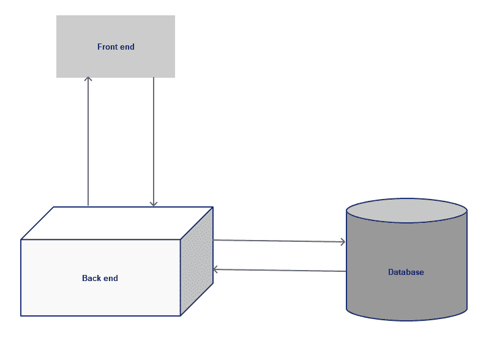
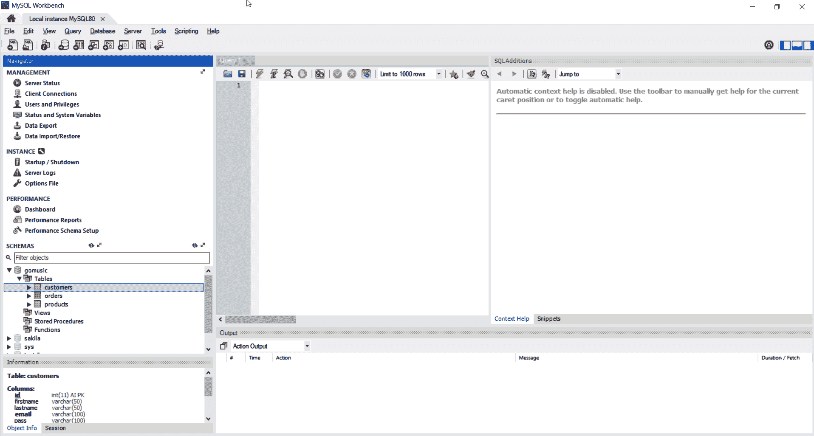
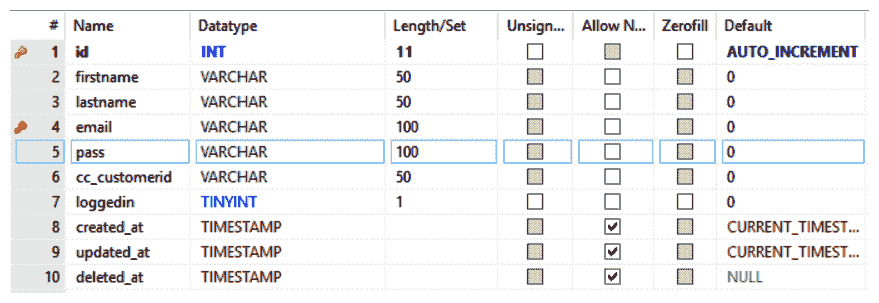
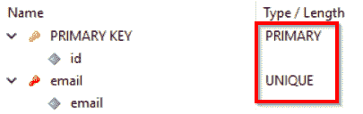
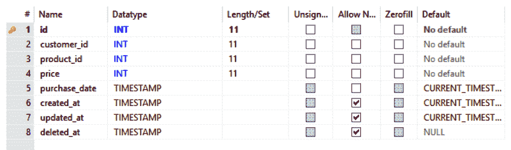
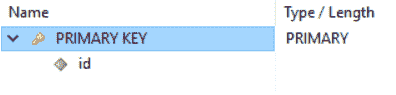
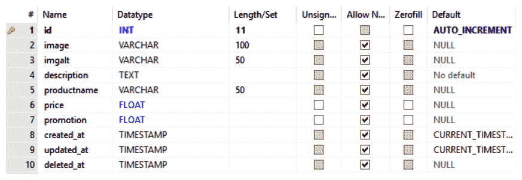
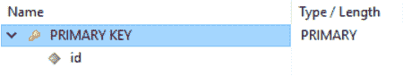

# 第七章：使用 Gin 和 React 的高级 Web Go 应用程序

在本章中，我们将继续构建我们的 GoMusic Web 应用程序。本章将涵盖一些高级概念，因为它将在深入探讨如何构建高级后端软件之前，增加我们在上一章中构建的内容。我们将涵盖一些重要且实用的主题，例如数据库层将我们的应用程序连接到生产数据库，**对象关系映射**（ORM）简化我们的数据库层代码，中间件在 Web API 处理器上添加功能，认证以保护我们的 Web 应用程序，以及信用卡收费。我们还将回顾 GoMusic 应用程序的前端，以了解我们的前端如何连接到后端。

具体来说，本章将涵盖以下主题：

+   数据库层和 ORM

+   中间件

+   安全性、认证和授权

+   信用卡收费

+   代理 React 应用程序

+   从 React 应用程序中进行授权和认证

本章将重新审视我们应用程序的前端层，以便将现有的 React 应用程序升级以利用新的后端功能。

# 技术要求

对于本章，我们建议您安装以下软件：

+   Go 语言

+   代码编辑器或 IDE，如 VS Code

+   npm 和 Node.js

+   React

需要了解以下主题：

+   Go (第二章，*Go 语言构建块*，和第三章，*Go 并发*)

+   JavaScript

+   React (第四章，*使用 React.js 进行前端开发*，和第五章，*为 GoMusic 构建前端*)

+   对关系型数据库和 MySQL 有一定的了解

本章的代码可以在本书的 GitHub 仓库中找到：[`github.com/PacktPublishing/Hands-On-Full-Stack-Development-with-Go/tree/master/Chapter07`](https://github.com/PacktPublishing/Hands-On-Full-Stack-Development-with-Go/tree/master/Chapter07)。

# 数据库层

在上一章中，我们开始编写我们的数据库层。作为提醒，我们的数据库层托管在`backend\src\dblayer`文件夹中。我们的第一步是编写数据库层接口，它定义了我们期望从数据库层获得的所有功能。数据库层接口看起来是这样的：

```go
type DBLayer interface {
  GetAllProducts() ([]models.Product, error)
  GetPromos() ([]models.Product, error)
  GetCustomerByName(string, string) (models.Customer, error)
  GetCustomerByID(int) (models.Customer, error)
  GetProduct(int) (models.Product, error)
  AddUser(models.Customer) (models.Customer, error)
  SignInUser(username, password string) (models.Customer, error)
  SignOutUserById(int) error
  GetCustomerOrdersByID(int) ([]models.Order, error)
}
```

现在，我们需要实现这些方法，以便在我们的数据库层中获得一些稳定的功能。

在开始实现此功能之前，我们首先需要准备一个数据库。

# 关系型数据库

数据库是任何应用程序后端的关键组成部分。这是后端层可以持久化和检索数据的地方。

关系型数据库可以简单地描述为存储数据在多个表中，然后在这些表之间建立关系的数据库。

当配置数据库时，我们需要定义三件事：

+   **数据库名称**：在我们的案例中，它将被称为 GoMusic。

+   **表名称**：在我们的案例中，为了简单起见，我们将使用三个表：

    +   **一个** `customer` **表**：此表是我们存储应用程序用户信息的地方

    +   **一个** `orders` **表**：此表应将客户映射到他们购买的产品

    +   **一个** `products` **表**：此表将包含 GoMusic 可用产品的列表

+   **索引和表之间的关系**：在我们的案例中，订单表将指向 `customer` 和 `products` 表。两个表都需要一个 `id` 索引。索引用于使查询更高效和更快。

MySQL 是一个知名的数据库，我们将在这本书中使用它。MySQL 是一个非常流行的开源数据库引擎，被用于众多大小项目。

这是我们的架构图，其中数据库为应用程序的后端提供数据：



在下一节中，我们将为我们的应用程序设置 MySQL。

# 设置

在我们开始创建数据库和表之前，我们首先需要安装 MySQL。MySQL 有企业版和社区版。MySQL 的社区版是我们将在类似我们的项目中使用的版本。这是因为社区版是免费的，可以用于学习和探索项目。要安装 MySQL 社区版服务器，您需要从以下链接下载它：[`dev.mysql.com/downloads/`](https://dev.mysql.com/downloads/)。

一旦我们安装了 MySQL，我们需要安装客户端工具来使用数据库。MySQL 通常附带一个名为 MySQL Workbench 的工具，如下面的截图所示：



MySQL Workbench 工具页面

您可以使用 MySQL Workbench 中的工具创建 MySQL 数据库、表、索引和关系。让我们逐个查看这些表。

# 客户表

如我们之前提到的，这是我们将存储我们的应用程序用户信息的表。以下是 `customer` 表的样式：



表由以下十个列组成：

1.  `id`: 这是每个客户的唯一 ID。

1.  `firstname`: 这是客户的姓名。

1.  `lastname`: 这是客户的姓氏。

1.  `email`: 这是客户的电子邮件。

1.  `pass`: 这是客户的密码。此字段必须以散列形式存储。

1.  `cc_customerid`: 这是一个代表客户信用卡的 ID。我们将在本章后面介绍此字段。

1.  `loggedin`: 此标志指定用户是否已登录。

1.  `created_at`: 此字段指定了客户被添加的日期。

1.  `updated_at`: 此字段指定了行/客户最后更新时间。

1.  `deleted_at`: 此字段指定了行最后被删除的时间。

此表将支持两个索引。如前所述，索引用于使查询更高效和更快。这是通过识别我们预期将用作查询搜索键的列来实现的。索引还可以用于识别唯一且不得重复的字段。



主键是客户`id`字段；它是对每个客户的唯一识别号。唯一键是`email`字段。我们不能有两个或更多具有相同电子邮件地址的客户。

# 订单表

现在，让我们看看`orders`表，它将托管 GoMusic 可用的产品列表：



此表由以下 8 列组成：

1.  `id`: 订单的唯一 ID

1.  `customer_id`: 下订单的客户的 ID

1.  `product_id`: 客户购买产品的 ID

1.  `price`: 购买价格

1.  `purchase_date`: 购买日期

1.  `created_at`: 行创建的日期/时间

1.  `updated_at`: 行最后更新的日期/时间

1.  `deleted_at`: 如果有的话，行被删除的日期/时间

此表将支持一个索引，如下面的截图所示：



索引仅仅是唯一 ID 索引。每个订单都将有自己的唯一 ID。

# 产品表

最后，让我们看看`products`表。此表将映射客户及其购买的产品：



该表由以下 10 列组成：

1.  `id`: 产品的唯一 ID

1.  `image`: 产品图像的相对位置

1.  `imgalt`: 图像的替代名称

1.  `description`: 产品描述

1.  `productname`: 产品名称

1.  `price`: 产品的原始价格

1.  `promotion`: 产品的促销价格

1.  `created_at`: 行创建的时间

1.  `updated_at`: 行最后更新时间

1.  `deleted_at`: 如果有的话，行被删除的时间

此表仅支持一个索引，即我们的唯一产品`id`字段：



通过这样，我们应该有一个足够好的数据库来支持我们的应用程序。我们的数据库相对简单，但它足以展示我们在本章需要涵盖的概念。

现在我们已经了解了我们的数据库将是什么样子，是时候讨论如何设计与我们的数据库交互的代码了。

# ORM

为了设计与我们的数据库交互的代码，我们将利用一种称为*ORM*的方法。ORM 允许您使用面向对象范式与数据库交互。ORM 生成代表数据库表作为代码对象的代码，并将查询表示为您的首选编程语言中的方法。

在 Go 语言的情况下，我们需要创建 Go 结构体来表示每个表。我们已经在上一章中开始编写我们的模型，即`product`、`customer`和`order`。

在我们继续编写代码之前，让我们首先讨论一下**Go 对象关系映射**（**GORM**），这是一个 Go 开源包，提供了 ORM 的支持。

# GORM

最受欢迎的 Go ORM 包之一是 GORM 包，可以在[`gorm.io/`](http://gorm.io/)找到。GORM 提供了一些成熟的功能，使得编写后端数据库层变得轻而易举。让我们通过利用 ORM，一步一步地继续编写我们的数据库层：

首先，我们需要检索 GORM 包：

```go
go get -u github.com/jinzhu/gorm
```

然后，我们需要演进我们的模型，以便它们可以被 GORM 正确使用。

ORM 需要模型对象来准确反映 ORM 库预期读取和/或操作的数据库表列。ORM 还可以使用一些元信息，例如，行最后一次更新、删除或创建的时间，以确保在运行时数据库和应用程序之间正确同步。

在 GORM 的情况下，有一个名为`gorm.Model`的数据类型，它只是一个 Go 结构体，包含表示行`id`字段、`created_at`时间、`updated_at`时间和`deleted_at`时间的字段。建议将`gorm.Model`嵌入表示你数据的 Go 结构体中。对于`customers`表，Go 结构体看起来会是这样：

```go
type Customer struct {
  gorm.Model
  Name string `json:"name"`
  FirstName string `gorm:"column:firstname" json:"firstname"`
  LastName string `gorm:"column:lastname" json:"lastname"`
  Email string `gorm:"column:email" json:"email"`
  Pass string `json:"password"`
  LoggedIn bool `gorm:"column:loggedin" json:"loggedin"`
  Orders []Order `json:"orders"`
}
```

前述代码还展示了大量的`struct tags`。前述示例中的`gorm`结构体标签用于标识与字段名称对应的列名。例如，结构体字段`FirstName`由名为`firstname`的列表示。这是通过`gorm:"column:firstname"`这一行来标识的。

我们还使用了前述代码中的`json` `struct`标签来标识字段在 JSON 格式中的样子。理论上，我们并不总是需要为每个字段分配`struct`标签；然而，我发现这样做更实用，可以避免混淆。

但 GORM 是如何识别`Customer` Go 结构体对应我们数据库中的`customers`表的？通常，GORM 会将我们的 Go 结构体名称的第一个字母转换为小写，然后在末尾添加一个'*s*'，这样就将`Customer`转换成了`customers`。然而，GORM 也赋予我们显式声明与 Go 结构体对应的表名的权力。这可以通过一个方法实现，其签名是`TableName()string`。换句话说，我们可以使用以下方法显式指定我们的表名：

```go
func (Customer) TableName() string {
  return "customers"
}
```

太好了！现在，在我们的项目文件夹内的`backend\src\models\models.go`文件中，让我们像之前做的那样，逐步演进`products`和`orders`表的数据模型：

```go
type Product struct {
  gorm.Model
  Image string `json:"img"`
  ImagAlt string `json:"imgalt" gorm:"column:imgalt"`
  Price float64 `json:"price"`
  Promotion float64 `json:"promotion"` //sql.NullFloat64
  PoructName string `gorm:"column:productname" json:"productname"`
  Description string
}

func (Product) TableName() string {
  return "products"
}

type Order struct {
  gorm.Model
  Product
  Customer
  CustomerID int `gorm:"column:customer_id"`
  ProductID int `gorm:"column:product_id"`
  Price float64 `gorm:"column:price" json:"sell_price"`
  PurchaseDate time.Time `gorm:"column:purchase_date" json:"purchase_date"`
}

func (Order) TableName() string {
  return "orders"
}
```

让我们在下一节中实现数据库层。

# 实现数据库层

现在，我们必须实现数据库层的功能。

在上一章中，我们设计了一个数据库层接口，该接口定义了我们预期需要的所有数据库操作。它看起来是这样的：

```go
type DBLayer interface {
  GetAllProducts() ([]models.Product, error)
  GetPromos() ([]models.Product, error)
  GetCustomerByName(string, string) (models.Customer, error)
  GetCustomerByID(int) (models.Customer, error)
  GetProduct(int) (models.Product, error)
  AddUser(models.Customer) (models.Customer, error)
  SignInUser(username, password string) (models.Customer, error)
  SignOutUserById(int) error
  GetCustomerOrdersByID(int) ([]models.Order, error)
}
```

在我们的项目文件夹中，让我们在 `dblayer` 同一文件夹中创建一个名为 `orm.go` 的新文件。该文件将位于 `{our_project_folder}/backend/src/dblayer` 文件夹中。

GORM 包依赖于插件来连接 GORM 支持的不同数据库。插件是需要在 GORM 被使用的包中静默导入的 Go 包。

要在 Go 中静默导入插件包，包括 GORM 包，我们可以使用以下语法：

```go
import (
    _ "github.com/go-sql-driver/mysql"
    "github.com/jinzhu/gorm"
)
```

我们的插件是 `github.com/go-sql-driver/mysql` 包。如果你还没有在你的机器上安装它，你需要使用你最喜欢的终端中的 `go get` 命令来检索它：

```go
go get github.com/go-sql-driver/mysql
```

接下来，我们需要创建一个 Go `struct` 类型，该类型将实现我们的 `DBLayer` 接口。

我们的 Go 结构体将托管一个名为 `*gorm.DB` 的数据类型。`*gorm.DB` 类型是我们使用 GORM 功能的入口点。以下是代码的样子：

```go
type DBORM struct {
  *gorm.DB
}
```

我们需要为我们的新类型创建一个构造函数。构造函数将初始化我们嵌入的 `*gorm.DB` 类型。

要获取初始化的 `*gorm.DB` 类型，我们需要使用一个名为 `gorm.Open()` 的函数。这个函数接受两个参数——我们的数据库类型名称，在我们的例子中是 `mysql`，以及我们的连接字符串。连接字符串基本上包含有关如何连接我们试图访问的特定数据库的信息。为了使我们的构造函数灵活，我们不会硬编码数据库名称或连接字符串。相反，我们将允许这些信息传递给构造函数。以下是代码：

```go
func NewORM(dbname, con string) (*DBORM, error) {
  db, err := gorm.Open(dbname, con)
  return &DBORM{
    DB: db,
  }, err
}
```

现在是时候开始实现 `DBLayer` 接口的方法了。

我们将首先利用 GORM 的有用方法，这将使我们免于编写显式的查询。要实现的第一种方法是 `GetAllProducts()`。该方法简单地返回所有产品的列表，这相当于一个 `select *` SQL 语句。这可以通过使用 GORM 的 `db.Find()` 方法实现，该方法属于 `*gorm.DB` 类型。以下是代码：

```go
func (db *DBORM) GetAllProducts() (products []models.Product, err error) {
  return products, db.Find(&products).Error
}
```

你可以看到使用像 GORM 这样的 ORM 可以产生极其高效的代码。前面方法中的单行代码在 `products` 表上执行了一个 `select * from products` 查询，然后返回了所有结果。`Find()` 方法能够检测我们寻求产品表，因为我们向它提供了一个类型为 `[]models.Product` 的参数。

接下来，我们编写 `GetPromos()` 方法，该方法返回一个促销字段不为空的产品的列表。

这只是一个带有 `where` 子句的选择语句。GORM 允许你通过使用一个名为 `Where()` 的方法，结合我们之前提到的 `Find()` 方法来实现这一点。以下是代码：

```go
func (db *DBORM) GetPromos() (products []models.Product, err error) {
  return products, db.Where("promotion IS NOT NULL").Find(&products).Error
}
```

再次强调，这很简单且高效。前面的方法只是简单地执行了以下查询的等效操作：

```go
select * from products where promotion IS NOT NULL
```

`Where()` 方法也可以接受一个 Go 结构体值，它代表查询中的条件。我们将在下一个 `DBLayer` 方法中看到这一点，即 `GetCustomerByName` 方法。此方法接受客户的姓和名，然后返回客户信息。以下是代码：

```go
func (db *DBORM) GetCustomerByName(firstname string, lastname string) (customer models.Customer, err error) {
  return customer, db.Where(&models.Customer{FirstName: firstname, LastName: lastname}).Find(&customer).Error
}
```

此方法与 `GetPromos()` 方法非常相似，只是 `Where()` 方法接收一个包含姓和名的 Go 结构体值，而不是字符串 `where` 子句。以下查询的等效操作被执行：

```go
select * from customers where firstname='..' and lastname='..'
```

接下来，我们将实现 `GetCustomerByID()` 方法，它将通过在数据库中使用客户的 ID 来检索客户。

这次，我们不再使用 `Where` 和 `Find` 的组合，而是将使用一个名为 `First` 的方法，它可以获取符合特定条件的第一条结果：

```go
func (db *DBORM) GetCustomerByID(id int) (customer models.Customer, err error) {
  return customer, db.First(&customer, id).Error
}
```

接下来，我们将实现一个通过 ID 获取产品的方法，这与 `GetCustomerByID()` 非常相似，但这次结果是产品而不是客户：

```go
func (db *DBORM) GetProduct(id int) (product models.Product, error error) {
  return product, db.First(&product, id).Error
}
```

到目前为止，我们一直在编写执行查询和检索结果的方法。但现在，是时候开始编写添加或更新行的方法了。

我们下一个方法是 `AddUser()`，它基本上是将新用户添加到数据库中。

此方法还将对用户的密码进行散列（我们将在后面的 *安全* 部分介绍），并将用户设置为已登录。GORM 提供了一个非常方便的方法 `Create()`，这样我们就可以将行添加到我们的数据库中：

```go
func (db *DBORM) AddUser(customer models.Customer) (models.Customer, error) {
  //we will cover the hashpassword function later
  hashPassword(&customer.Pass)
  customer.LoggedIn = true
  return customer, db.Create(&customer).Error
}

```

接下来，我们需要实现 `SignInUser` 方法，它基本上更新了我们客户表中代表特定客户的行中的 `loggedin` 字段。

`SignInUser` 方法将根据用户的电子邮件识别刚刚登录的用户。然后我们将验证用户的密码。如果密码正确，我们将更新数据库。以下是代码的示例：

```go
func (db *DBORM) SignInUser(email, pass string) (customer models.Customer, err error) {
  //Verify the password, we'll cover this function later
  if !checkPassword(pass) {
    return customer, errors.New("Invalid password")
  }
  //Obtain a *gorm.DB object representing our customer's row
  result := db.Table("Customers").Where(&models.Customer{Email: email})
  //update the loggedin field
  err = result.Update("loggedin", 1).Error
  if err != nil {
    return customer, err
  }
  //return the new customer row
  return customer, result.Find(&customer).Error
}
```

前面的代码涵盖了之前介绍过的许多方法，但有两个地方除外：

+   `result := db.Table("Customers").Where(&models.Customer{Email: email})`：这是我们获取我们感兴趣的行所表示的对象的方法

+   `result.Update("loggedin", 1)`：这是我们更新我们行的方法

`SignOutUserById()` 方法用于通过用户 ID 注销用户。这将遵循我们之前介绍过的相同技术：

```go
func (db *DBORM) SignOutUserById(id int) error {
 //Create a customer Go struct with the provided if
  customer := models.Customer{
    Model: gorm.Model{
      ID: uint(id),
    },
  }
 //Update the customer row to reflect the fact that the customer is not logged in
  return db.Table("Customers").Where(&customer).Update("loggedin", 0).Error
}
```

最后，我们实现 `GetCustomerOrdersByID()` 方法，通过 `customer_id` 获取客户订单：

```go
func (db *DBORM) GetCustomerOrdersByID(id int) (orders []models.Order, err error) {
    return orders, db.Table("orders").Select("*")
                .Joins("join customers on customers.id = customer_id")
                .Joins("join products on products.id = product_id")
                .Where("customer_id=?", id).Scan(&orders).Error 

}
```

上述代码与之前的方法略有不同。这是因为我们需要执行几个连接来生成我们所需的结果。我们需要连接三个表：`orders`表、`customers`表和`products`表。从`customers`表，我们只想获取与提供的客户 ID 对应的客户。对于`products`表，我们只想获取产品 ID 与当前订单的产品 ID 相对应的产品。幸运的是，GORM 包提供了一个名为`Joins`的方法，可以用来连接表。上述代码将转换为以下查询（假设我们有一个值为`'1'`的`customer_id`）：

```go
SELECT * FROM `orders` join customers on customers.id = customer_id join products on products.id = product_id WHERE (customer_id='1')
```

有了这些，我们的数据库层几乎就完成了。让我们在下一节看看什么是中间件。

# 中间件

中间件是现代网络应用世界中的一个重要且有趣的话题。在软件开发行业中，*中间件*这个词可以意味着很多不同的东西。然而，为了这本书的目的，我们只关心一个定义。**中间件**可以简单地定义为在收到 HTTP 请求和你的处理代码执行该请求之间运行的代码。这最好通过一个例子来解释。

在我们为 GoMusic 应用程序构建的 RESTful API 中，让我们挑选我们的一个 API 端点——`/products` 相对 URL。以下是用于将此相对 URL 分配给动作或函数处理器的代码：

```go
r.GET("/products", h.GetProducts)
```

这是`GetProducts`处理器的代码：

```go
func (h *Handler) GetProducts(c *gin.Context) {
  if h.db == nil {
    return
  }
  products, err := h.db.GetAllProducts()
  if err != nil {
    c.JSON(http.StatusInternalServerError, gin.H{"error": err.Error()})
    return
  }
  c.JSON(http.StatusOK, products)
}
```

到目前为止，一切顺利。以下是此 API 资源的流程：

1.  在`/products`相对 URL 地址收到一个 HTTP `GET` 请求。

1.  `GetProducts()`方法将被执行。

我们的 Web API 中间件只是我们可以在*步骤 1*和*步骤 2*之间，甚至更远的地方注入的一些代码。技术上讲，中间件只是一个包装我们自己的处理函数的 HTTP 处理函数。换句话说，它是一个将封装`GetProducts()`方法的函数，这将允许你在你的方法前后插入功能。

Gin 网络框架默认预加载了两件中间件。框架还允许你在需要时定义自己的自定义中间件。

Gin 网络服务器中注入的两个默认中间件是**日志中间件**和**恢复中间件**。日志中间件简单地记录了应用程序生命周期中的 API 活动。如果你在所选的终端中运行由 Gin 驱动的 Go 网络应用程序，你会看到类似以下的内容：

```go
[GIN] 2018/12/29 - 13:33:19 |?[97;42m 200 ?[0m| 2.7849836s | 127.0.0.1 |?[97;44m GET ?[0m /products
[GIN] 2018/12/29 - 13:33:19 |?[97;42m 200 ?[0m| 65.82ms | 127.0.0.1 |?[97;44m GET ?[0m /img/redguitar.jpeg
[GIN] 2018/12/29 - 13:33:19 |?[97;42m 200 ?[0m| 65.82ms | 127.0.0.1 |?[97;44m GET ?[0m /img/drums.jpg
[GIN] 2018/12/29 - 13:33:19 |?[97;42m 200 ?[0m| 67.4312ms | 127.0.0.1 |?[97;44m GET ?[0m /img/strings.png
[GIN] 2018/12/29 - 13:33:19 |?[97;42m 200 ?[0m| 9.4939ms | 127.0.0.1 |?[97;44m GET ?[0m /img/flute.jpeg
[GIN] 2018/12/29 - 13:33:19 |?[97;42m 200 ?[0m| 9.9734ms | 127.0.0.1 |?[97;44m GET ?[0m /img/saxophone.jpeg
[GIN] 2018/12/29 - 13:33:19 |?[97;42m 200 ?[0m| 18.3846ms | 127.0.0.1 |?[97;44m GET ?[0m /img/blackguitar.jpeg
```

这基本上是 Gin 的日志中间件在起作用。

另一方面，Gin 的恢复中间件确保在必要时从恐慌中恢复应用程序，并在响应中写入 HTTP 错误代码`500`。

对于 Gin，有许多开源的中间件选项可供选择。一份支持的中间件列表可以在[`github.com/gin-gonic/contrib`](https://github.com/gin-gonic/contrib)找到。

在下一节中，我们将看看如何编写自定义中间件。

# 自定义中间件

如我们之前提到的，Gin 允许你编写自己的中间件，以便你可以在你的 Web 应用程序中嵌入一些功能。在 Gin 中编写自定义中间件相对简单，正如我们可以在以下步骤中看到的那样。

第一步是编写中间件的实际代码。

如我们之前提到的，Web API 中间件简单来说就是一个封装其他 HTTP 处理函数的 HTTP 处理函数。以下是这个代码的示例：

```go
func MyCustomMiddleware() gin.HandlerFunc {
  return func(c *gin.Context) {
    //The code that is to be executed before our request gets handled, starts here

    // Set example variable
    c.Set("v", "123")
    //We can then retrieve the variable later via c.Get("v")

   // Now we our request gets handled
    c.Next()

    // This code gets executed after the handler gets handled

    // Access the status we are sending
    status := c.Writer.Status()
    // Do something with the status
  }
}
```

让我们编写一个非常简单的中间件，它会在请求前后打印 `************************************`：

```go
func MyCustomLogger() gin.HandlerFunc {
     return func(c *gin.Context) {
         fmt.Println("************************************")
         c.Next()
         fmt.Println("************************************")
     }
}
```

下一步是将此中间件添加到我们的 Gin 引擎中。这可以通过两种方式完成：

+   如果我们想保留 Gin 的默认中间件，但同时又想添加 `MyCustomLogger()`，我们可以这样做：

```go
func RunAPIWithHandler(address string, h HandlerInterface) error {
  //Get gin's default engine
  r := gin.Default()
  r.Use(MyCustomLogger())
  /*
    The rest of our code
    */
}
```

+   如果我们想忽略 Gin 的默认中间件，只启用我们的自定义中间件，我们可以使用以下代码路径：

```go
r := gin.New()
r.Use(MyCustomLogger())
```

如果我们想启用多个中间件，我们只需将它们作为 `Use()` 方法的参数添加，如下所示：

```go
 r := gin.New()
 r.Use(MyCustomLogger1(),MyCustomLogger2(),MyCustomLogger3())
```

在下一节中，我们将讨论如何确保我们的 Web 应用程序的安全。

# 安全性

当涉及到将 Web 应用程序部署到生产环境时，安全性是一个非常重要的话题。这个话题非常庞大，可能需要章节甚至书籍来涵盖。由于本书的目的是涵盖实用的动手操作主题，并且要简洁明了，我们将涵盖构建安全 Web 应用程序所需的最关键的知识点。

安全的 Web 应用程序主要依赖于加密客户端（浏览器）和服务器之间的数据。换句话说，它们依赖于加密前端和后端之间的数据。

如我们之前提到的，HTTP 是客户端和服务器之间使用的协议。HTTP 可以通过一个名为 **TLS**（**传输层安全性**）的协议来保护。HTTP 和 TLS 的组合通常被称为 **HTTPS**。

另有一个名为 SSL 的协议，它也被用来保护 HTTP。然而，TLS 更新且更安全。

在我们讨论代码之前，让我们首先了解一些关于 HTTPS 以及它是如何工作的背景知识。

# 证书和私钥

HTTPS 的工作原理如下：

1.  客户端和服务器之间通过握手以及证书和私钥建立信任。我们将在稍后详细讨论这一点。

1.  客户端和服务器商定一个加密密钥。

1.  客户端和服务器将使用他们商定的加密密钥加密他们的通信。

# 在客户端和服务器之间建立信任

我们在 *证书和私钥* 部分的 *步骤 1* 中提到的证书和私钥是另一回事。要理解它们，你首先必须理解公钥加密或非对称加密的概念。

**公钥**用于加密数据，并且可以安全地与其他方共享。然而，公钥不能解密数据。需要不同的密钥来解密数据。这个密钥被称为**私钥**，并且不能共享。任何人都可以使用公钥加密数据。然而，只有拥有与公钥相对应的私钥的人才能将数据解密回原始的可读形式。公钥和私钥是使用复杂的计算算法生成的。利用公钥和私钥的组合被称为非对称加密。

在“证书和私钥”部分的*步骤 1*中，在 Web 客户端和 Web 服务器之间使用非对称加密来协商一个共享的加密密钥（也称为共享秘密或会话密钥），然后用于对称加密（*步骤 2*和*步骤 3）。Web 客户端和 Web 服务器之间发生握手，客户端表明其意图与服务器开始一个安全的通信会话。通常，这包括就加密方式的一些数学细节达成一致。然后服务器回复一个*数字证书*。

数字证书（或公钥证书）是证明公钥所有权的电子文档。

数字证书是由可信第三方实体签发的数字文档。文档包含一个公钥加密密钥、密钥所属的服务器名称以及验证信息正确性和公钥属于预期的密钥所有者（也称为证书的签发者）的可信第三方实体名称。

发出证书的可信第三方实体被称为**证书颁发机构**（**CA**）。有多个已知的 CA 负责颁发证书并验证企业和组织的身份。大多数 CA 会对其服务收费；现在有一些是免费的，例如 Let's Encrypt ([`letsencrypt.org/`](https://letsencrypt.org/))。对于较大的组织或政府机构，它们会颁发自己的证书；这个过程被称为自签名，因此它们的证书被称为**自签名证书**。证书可能有到期日期，届时证书需要更新；这是为了在之前拥有证书的实体发生变化时提供额外的保护。

一个网络客户端通常包含它所知道的 CA 列表。因此，当客户端尝试连接到网络服务器时，网络服务器会响应一个数字证书。网络客户端会查找证书的发行者，并将发行者与它所知道的 CA 列表进行比较。如果网络客户端知道并信任证书发行者，那么它将继续与该服务器建立连接，并使用证书中的公钥。从服务器获得的公钥然后将被用来加密通信，以安全地协商一个共享的加密密钥（或会话密钥或共享密钥），然后用于网络客户端和网络服务器之间的对称加密通信。

有多种算法可以用来生成这个会话密钥，但它们超出了本章的范围。我们需要知道的是，一旦会话密钥达成一致，网络客户端和服务器之间的初始握手将结束，从而允许在共享会话密钥的保护下安全地进行实际的通信会话。

为了让我们的网络服务器支持 HTTPS，它需要一个证书和一个私钥来建立初始的 HTTPS 握手，正如*证书和私钥*部分中*步骤 1*所述。

# 达成一致并使用加密密钥

加密密钥是一段代码，它依赖于一些复杂的数学来加密数据。加密数据简单来说就是将人类可读的数据转换成人类无法阅读的形式，从而保护你的数据。然后还需要另一个密钥来将这个不可读的数据转换回人类可读的形式。

在上一节中的*步骤 2*和*步骤 3*中使用的加密密钥有时被称为**对称加密算法**。这仅仅意味着客户端和服务器使用相同的密钥来加密和解密它们之间的数据。这也被称为**对称加密**。

大多数时候，这个密钥在开发过程中对你来说是不可见的。

在下一节中，我们将探讨如何在 Gin 中支持 HTTPS。

# 在 Gin 中支持 HTTPS

在上一节中，我们获得了一些关于 HTTPS 实际工作原理的有价值知识。但我们如何在代码中支持它呢？实际上相当简单。在上一章中，我们使用了以下代码片段来建立一个由 Gin 支持的 HTTP 网络服务器：

```go
//Get gin's default engine
  r := gin.Default()
  /*
    Our code
  */
 //Start listening to incoming HTTP requests...
 r.Run(address)
```

我们需要在之前的代码中进行一个更改以支持 HTTPS 而不是 HTTP。在这里，我们将使用一个名为`RunTLS()`的方法。这个方法需要三个主要参数：

+   我们希望我们的后端网络服务监听的 HTTPS 地址

+   （上一节中提到的）证书文件

+   （上一节中提到的）私钥文件

下面是代码的示例：

```go
r.RunTLS(address, "cert.pem", "key.pem")
```

但我们如何生成一个证书文件和私钥？显然，如果这是一个学习项目或周末项目，我们就不需要从 CA 获取一个完全合法的证书。

在这种情况下，我们使用所谓的自签名证书。当你使用这样的证书时，显然你的网络浏览器不会信任它，因为证书不会属于知名 CA 列表。出于测试目的，你可能需要配置你的浏览器以信任该证书，或者只是忽略警告并继续。

但我们如何生成一个自签名证书呢？

有多种方法可以做到这一点。大多数人依赖于 OpenSSL ([`www.openssl.org/`](https://www.openssl.org/)) 工具来生成测试自签名证书。然而，因为我们使用 Go，我们可以利用 Go 语言标准库中提供的一个工具。

在你的项目文件夹中，只需运行以下命令：

```go
go run %GOROOT%/src/crypto/tls/generate_cert.go --host=127.0.0.1
```

这是一个 Go 在`tls`包文件夹中提供的简单工具。你可以使用它来生成证书。在这里，`%GOROOT%`代表你的 Go 根环境变量。如果你在 Linux 上运行此命令，你需要使用`$GOROOT`代替。

之前的命令将为`127.0.0.1`主机（环回本地主机）生成一个证书。这个工具有更多的标志/选项，你可以进行配置，例如以下内容：

```go
 -ca
 whether this cert should be its own Certificate Authority
 -duration duration
 Duration that certificate is valid for (default 8760h0m0s)
 -ecdsa-curve string
 ECDSA curve to use to generate a key. Valid values are P224, P256 (recommended), P384, P521
 -host string
 Comma-separated hostnames and IPs to generate a certificate for
 -rsa-bits int
 Size of RSA key to generate. Ignored if --ecdsa-curve is set (default 2048)
 -start-date string
 Creation date formatted as Jan 1 15:04:05 2011
```

命令将生成证书和私钥文件，并将它们放置在你的当前文件夹中。然后你可以将它们复制到任何你想要的地方，并在你的代码中引用它们。

要在测试时让你的 React 应用程序支持 HTTPS 模式，你需要在启动 React 应用程序时运行以下命令：

```go
set HTTPS=true&&npm start
```

让我们在下一节中看看密码散列。

# 密码散列

另一个非常重要的安全措施被称为密码散列。密码散列是一种用于保护我们应用程序处理的用户账户密码的方法。

让我们以我们的 GoMusic 应用程序为例——我们有一个`customers`表，其中包含客户的用户名和密码。那么，我们应该将客户的密码以纯文本形式存储吗？答案是响亮而坚定的*不*！

我们应该怎么做呢？我们如何保护客户的密码，同时在用户登录时验证他们的密码？这就是密码散列发挥作用的地方。它包括两个简单的步骤：

1.  当保存新客户的密码时，对密码进行散列然后保存散列。散列可以简单地定义为单向加密——你可以加密密码，但永远无法解密它。散列函数依赖于复杂的数学来实现这一点。

1.  当需要验证现有客户的密码时，对登录请求中提供的密码进行散列，然后将新传入密码的散列与原始密码保存的散列进行比较。

密码哈希可以保护客户的密码，因为它确保即使恶意黑客入侵您的数据库，也无法访问它们。

但是，在密码从网络客户端传输到我们的网络服务器的过程中如何保护密码呢？这就是 HTTPS 发挥作用的地方。从客户端发送的密码将在到达我们的后端网络服务器之前完全加密。

现在，让我们开始在我们的代码中实现一些密码哈希。第一步是进入我们的数据库层并实现以下逻辑：

+   在将新用户的密码保存到数据库之前进行哈希处理

+   当现有用户登录时，比较提供的密码与保存的哈希密码

在接下来的几节中，我们将探讨如何实现密码哈希和验证传入的密码。

# 实现密码哈希

在我们的数据库层中，我们将为无效密码错误定义一个新的类型。在我们的 `dblayer.go` 文件中，我们将添加以下行：

```go
var ErrINVALIDPASSWORD = errors.New("Invalid password")
```

然后，在我们的 `orm.go` 文件中，我们将添加以下函数：

```go
func hashPassword(s *string) error {
  if s == nil {
    return errors.New("Reference provided for hashing password is nil")
  }

  //convert password string to byte slice so that we can use it with the bcrypt package
  sBytes := []byte(*s)

  //Obtain hashed password via the GenerateFromPassword() method
  hashedBytes, err := bcrypt.GenerateFromPassword(sBytes, bcrypt.DefaultCost)
  if err != nil {
    return err
  }

  //update password string with the hashed version
  *s = string(hashedBytes[:])
  return nil
}
```

上述代码使用了名为 `bcrypt` 的包，这在密码哈希方面非常受欢迎。`bcrypt` 代表一个在 1990 年代末设计的流行密码哈希函数。`bcrypt` 是 OpenBSD 操作系统的默认密码哈希函数，并在多种编程语言中得到支持。

该包还提供了比较哈希密码与其可读版本的方法。

如果该包尚未安装到您的环境中，请运行以下命令：

```go
go get golang.org/x/crypto/bcrypt
```

我们已经在 `AddUser()` 方法中遇到了 `hashPassword()` 方法，它将哈希密码并将其保存到数据库中。

将以下 `HashPassword ()` 方法添加到您的代码中：

```go
func (db *DBORM) AddUser(customer models.Customer) (models.Customer, error) {
  //pass received password by reference so that we can change it to its hashed version
  hashPassword(&customer.Pass)
  customer.LoggedIn = true
  err := db.Create(&customer).Error
  customer.Pass = ""
  return customer, err
}
```

上述代码将执行密码哈希部分。在我们返回客户对象之前，我们需要将密码设置为空，因为出于安全原因，此信息不需要再次共享。

# 比较密码

现在，让我们编写将保存的哈希密码与尝试登录的用户提供的密码进行比较的代码。

我们只需要 `bcrypt` 包中的另一个方法来比较我们保存的哈希与传入的密码：

```go
func checkPassword(existingHash, incomingPass string) bool {
  //this method will return an error if the hash does not match the provided password string
  return bcrypt.CompareHashAndPassword([]byte(existingHash), []byte(incomingPass)) == nil
}
```

接下来，我们需要向 `SignInUser` 方法添加代码，以便我们可以检索尝试登录的客户的哈希密码。然后，我们可以比较密码。如果密码不匹配，我们返回一个错误。如果它们匹配，我们继续通过将登录标志设置为 `true` 来记录用户的登录：

```go
func (db *DBORM) SignInUser(email, pass string) (customer models.Customer, err error) {
  //Obtain a *gorm.DB object representing our customer's row
  result := db.Table("Customers").Where(&models.Customer{Email: email})
  //Retrieve the data for the customer with the passed email
  err = result.First(&customer).Error
  if err != nil {
    return customer, err
  }
  //Compare the saved hashed password with the password provided by the user trying to sign in
  if !checkPassword(customer.Pass, pass) {
    //If failed, returns an error
    return customer, ErrINVALIDPASSWORD
  }
  //set customer pass to empty because we don't need to share this information again
  customer.Pass = ""
  //update the loggedin field
  err = result.Update("loggedin", 1).Error
  if err != nil {
    return customer, err
  }
  //return the new customer row
  return customer, result.Find(&customer).Error
}
```

最后，我们需要在我们的 HTTP 网络处理程序中添加一个微小的更改来处理失败的登录。

让我们回到 `handlers.go` 文件并稍微编辑一下 `SignIn` 方法。代码的编辑部分以粗体显示：

```go
func (h *Handler) SignIn(c *gin.Context) {
  if h.db == nil {
    return
  }
  var customer models.Customer
  err := c.ShouldBindJSON(&customer)
  if err != nil {
    c.JSON(http.StatusBadRequest, gin.H{"error": err.Error()})
    return
  }
  customer, err = h.db.SignInUser(customer.Email, customer.Pass)
  if err != nil {
    //if the error is invalid password, return forbidden http error
    if err == dblayer.ErrINVALIDPASSWORD {
 c.JSON(http.StatusForbidden, gin.H{"error": err.Error()})
 return
 }
    c.JSON(http.StatusInternalServerError, gin.H{"error": err.Error()})
    return
  }
  c.JSON(http.StatusOK, customer)
}
```

让我们看看下一节中的信用卡处理。

# 信用卡处理

我们已经在 第五章 中实现了前端信用卡逻辑，即构建 GoMusic 的前端。现在是时候实现信用卡处理的后端部分了。

对于前端信用卡处理，我们使用了 Stripe API ([`stripe.com/docs/api`](https://stripe.com/docs/api))。在产品环境中，您需要创建一个 Stripe 账户并获取一个 API 密钥来用于您的应用程序。然而，出于测试目的，我们可以使用测试 API 密钥和测试信用卡号码，Stripe 高兴地为开发者提供这些，以便构建能够处理信用卡的生产力应用程序。要了解更多关于测试信用卡号码和 Stripe 提供的测试令牌的信息，请查看 [`stripe.com/docs/testing`](https://stripe.com/docs/testing)。

在我们的前端代码中，我们使用了以下 Stripe API 代码来创建一个令牌：

```go
let { token } = await this.props.stripe.createToken({ name: this.state.name });
```

我们还使用了一个非常流行的框架，称为 *Stripe elements*，它将收集我们所有的信用卡信息，并将其与创建令牌请求合并，以便我们得到一个代表我们试图处理的信用卡的令牌。

然后，我们将此令牌发送到后端，以便它可以进行处理和/或保存。

为了处理信用卡支付，我们需要一些关键信息：

+   由 Stripe API 提供的信用卡令牌

+   进行购买的客户 ID

+   客户试图购买的产品 ID

+   产品售价

+   是否应该记住卡片以供将来使用

+   是否使用预存卡片

我修改了前端代码，使其能够收集这些信息并将其传递给绑定到我们后端的 HTTP 请求。以下是前端代码中创建和提交我们请求的部分。以下代码位于 `creditcards.js` 文件中：

```go
    async handleSubmit(event) {
        event.preventDefault();
        let id = "";
       //If we are not using a pre-saved card, connect with stripe to obtain a card token
        if (!this.state.useExisting) {
           //Create the token via Stripe's API
            let { token } = await this.props.stripe.createToken({ name: this.state.name });
            if (token == null) {
                console.log("invalid token");
                this.setState({ status: FAILEDSTATE });
                return;
            }
            id = token.id;
        }
        //Create the request, then send it to the back-end
        let response = await fetch("/users/charge", {
 method: "POST",
 headers: { "Content-Type": "application/json" },
 body: JSON.stringify({
 token: id,
 customer_id: this.props.user,
 product_id: this.props.productid,
 sell_price: this.props.price,
 rememberCard: this.state.remember !== undefined,
 useExisting: this.state.useExisting
 })
 });
        //If response is ok, consider the operation a success
        if (response.ok) {
            console.log("Purchase Complete!");
            this.setState({ status: SUCCESSSTATE });
        } else {
            this.setState({ status: FAILEDSTATE });
        }
    }
```

上述代码使用了 `fetch()` 方法来向后端发送 `POST` 请求。该 `POST` 请求将包含一个 JSON 消息，其中包含我们后端需要处理请求的所有数据。

在下一节中，我们将探讨信用卡处理的后端是如何工作的。

# 后端信用卡处理

我们可以使用 Stripe API 按以下方式处理信用卡交易：

1.  创建一个 `*stripe.CustomerParams` 类型的对象，然后它可以接受前端提供的信用卡令牌。信用卡令牌是通过名为 `SetToken()` 的方法摄取的。

1.  创建一个 `*stripe.Customer` 类型的对象，它将 `stripe.CustomerParams` 类型的对象作为输入。这是通过 `customer.New()` 函数完成的。

1.  创建一个 `*stripe.ChargeParams` 类型的对象，它包含有关我们交易的信息，例如金额、货币和购买描述。

1.  `*stripe.ChargeParams` 对象还必须接收一个字段，该字段代表 Stripe 客户端 ID。这由我们在 *步骤 2* 中提到的 `*stripe.Customer` 对象提供。

记住，Stripe 客户端 ID 与我们数据库中引用客户的实际客户 ID 是不同的。

1.  如果我们想保存这张信用卡并在以后使用，我们可以简单地存储 Stripe 客户端 ID 字符串以供以后使用。

1.  最后，我们可以通过调用 `charge.New()` 来对信用卡进行扣款，该函数需要一个 `*stripe.ChargeParams` 对象作为输入。

如果前面的步骤听起来太难理解，不要担心。一旦我们开始查看代码，它就会变得清晰起来。

我们的大部分代码将位于 `charge` 处理方法中，该方法位于 `handler.go` 文件内。以下是该方法的当前状态：

```go
func (h *Handler) Charge(c *gin.Context) {
  if h.db == nil {
    c.JSON(http.StatusInternalServerError, gin.H{"error": "server database error"})
    return
  }
}
```

该方法目前还没有做任何事情。这是我们希望它执行的操作：

1.  使用传入的 HTTP 请求获取交易信息。

1.  如果请求要求我们使用现有的已保存卡，那么我们需要检索保存的客户 Stripe ID 并对卡进行扣款。

1.  如果请求要求我们在扣款之前记住当前提供的信用卡信息，那么我们将在扣款之前将其保存到数据库中。

首先，我们需要创建一个类型，它可以接受我们从前端接收到的数据。下面是这个类型的示例：

```go
request := struct {
    models.Order
    Remember bool `json:"rememberCard"`
    UseExisting bool `json:"useExisting"`
    Token string `json:"token"`
  }{}
```

在前面的代码中，我们声明了 Go 结构体并在同一代码块中初始化它。这是在 Go 中快速创建和使用 `struct` 类型的快捷方式。

接下来，我们需要将传入的 JSON 有效负载解析到 `request` 变量中：

```go
err := c.ShouldBindJSON(&request)
  //If an error occurred during parsing, report it then return
  if err != nil {
    c.JSON(http.StatusBadRequest, request)
    return
  }
```

现在，是时候开始编写一些 Stripe 代码了。首先，我们需要声明 stripe API 密钥——在这种情况下，我们将使用一个测试 API 密钥。然而，在生产环境中，您需要使用自己的 Stripe 密钥，并且要非常小心地保护它：

```go
stripe.Key = "sk_test_4eC39HqLyjWDarjtT1zdp7dc"
```

接下来，我们需要创建一个 `*stripe.ChargeParams` 对象，我们在本节开头 *步骤 3* 中已经介绍过。下面是这个对象的示例：

```go
  chargeP := &stripe.ChargeParams{
    //the price we obtained from the incoming request:
    Amount: stripe.Int64(int64(request.Price)),
    //the currency:
    Currency: stripe.String("usd"),
    //the description:
    Description: stripe.String("GoMusic charge..."),
  }
```

接下来，我们初始化 Stripe 客户端 ID 字符串。这是本节开头 *步骤 4* 中提到的关键字段：

```go
stripeCustomerID:=""
```

现在，如果传入的请求要求我们使用现有的卡，我们将从数据库中检索保存的 Stripe 客户端 ID 并使用它。以下代码使用了一个新的数据库方法，该方法从数据库中检索 Stripe 客户端 ID。我们将在本节的后面实现此方法：

```go
if request.UseExisting {
    //use existing
    log.Println("Getting credit card id...")
    //This is a new method which retrieve the stripe customer id from the database 
    stripeCustomerID, err = h.db.GetCreditCardCID(request.CustomerID)
    if err != nil {
      log.Println(err)
      c.JSON(http.StatusInternalServerError, gin.H{"error": err.Error()})
      return
    }
  } 
```

否则，我们可以创建一个 `*stripe.CustomerParams` 对象，该对象用于创建 `*stripe.Customer` 对象。这为我们提供了 Stripe 客户端 ID：

```go
...else {
        cp := &stripe.CustomerParams{}
        cp.SetSource(request.Token)
        customer, err := customer.New(cp)
        if err != nil {
             c.JSON(http.StatusInternalServerError, gin.H{"error": err.Error()})
            return
        }
        stripeCustomerID = customer.ID
```

如果要求我们记住这张卡，我们只需将 Stripe 客户端 ID 存储到数据库中：

```go
if request.Remember {
      //save the stripe customer id, and link it to the actual customer id in our database
      err = h.db.SaveCreditCardForCustomer(request.CustomerID, stripeCustomerID)
      if err != nil {
        c.JSON(http.StatusInternalServerError, gin.H{"error": err.Error()})
        return
      }
    }
```

接下来，我们尝试对信用卡进行扣款：

```go
  /*
    we should check if the customer already ordered the same item or not but for simplicity, let's assume it's a new order
*/

  //Assign the stipe customer id to the *stripe.ChargeParams object:
  chargeP.Customer = stripe.String(stripeCustomerID)

  //Charge the credit card
  _, err = charge.New(chargeP)
  if err != nil {
    c.JSON(http.StatusInternalServerError, gin.H{"error": err.Error()})
    return
  }
```

最后，我们将订单添加到我们的数据库中：

```go
 err = h.db.AddOrder(request.Order)
  if err != nil {
    c.JSON(http.StatusInternalServerError, gin.H{"error": err.Error()})
  }
```

至此，`charge()` 方法就完成了。

目前还有一些工作要做。添加到 `charge()` 处理器的代码使用了几个我们尚未创建的数据库方法：

+   `GetCreditCardCID()`: 从数据库检索保存的 Stripe 客户 ID

+   `SaveCreditCardForCustomer()`: 将 stripe 客户 ID 保存到我们的数据库

+   `AddOrder()`: 向数据库添加订单

我们需要在我们的`dblayer.go`文件中数据库层接口中添加这三个方法：

```go
type DBLayer interface {
  GetAllProducts() ([]models.Product, error)
  GetPromos() ([]models.Product, error)
  GetCustomerByName(string, string) (models.Customer, error)
  GetCustomerByID(int) (models.Customer, error)
  GetProduct(int) (models.Product, error)
  AddUser(models.Customer) (models.Customer, error)
  SignInUser(username, password string) (models.Customer, error)
  SignOutUserById(int) error
  GetCustomerOrdersByID(int) ([]models.Order, error)
 AddOrder(models.Order) error
 GetCreditCardCID(int) (string, error)
 SaveCreditCardForCustomer(int, string) error
}
```

我们将三个方法添加到我们`DBLayer`接口的具体实现中。这是在`orm.go`文件中完成的：

```go
//Add the order to the orders table
func (db *DBORM) AddOrder(order models.Order) error {
  return db.Create(&order).Error
}

//Get the id representing the credit card from the database
func (db *DBORM) GetCreditCardCID(id int) (string, error) {
  cusomterWithCCID := struct {
    models.Customer
    CCID string `gorm:"column:cc_customerid"`
  }{}
  return cusomterWithCCID.CCID, db.First(&cusomterWithCCID, id).Error
}

//Save the credit card information for the customer
func (db *DBORM) SaveCreditCardForCustomer(id int, ccid string) error {
  result := db.Table("customers").Where("id=?", id)
  return result.Update("cc_customerid", ccid).Error
}
```

现在，我们需要回到我们的`handler.go`文件，并修改我们的`handler`构造函数，使其能够连接到我们的数据库：

```go
func NewHandler(db,constring string) (HandlerInterface, error) {
  db, err := dblayer.NewORM(db, constring)
  if err != nil {
    return nil, err
  }
  return &Handler{
    db: db,
  }, nil
}
```

完美！有了这个，我们的 GoMusic 应用程序的后端代码已经完成了 99%，让我们在下一节中重新审视我们的前端代码。

# 重新审视前端代码

在前端代码方面，我们最后深入探讨的是第五章，*为 GoMusic 构建前端*。第四章，*使用 React.js 的前端*和第五章，*为 GoMusic 构建前端*，旨在构建关于如何构建可工作的 React 应用程序的坚实和实用的基础知识，这可以用作我们后端 Go 应用程序的前端。

这两个章节涵盖了 GoMusic 前端大约 85%的内容。然而，它们并没有涵盖所有必要的 JavaScript 代码，这些代码用于将我们在第四章，*使用 React.js 的前端*和第五章，*为 GoMusic 构建前端*中构建的不同 React 组件粘合在一起。在本节中，我们将概述整体前端架构，并填补一些空白。

在下一节中，我们将查看我们应用程序前端的应用结构。

# 应用程序结构

我们的前端组件分为以下文件：

+   `index.js`: 我们 React 应用程序的入口点，它调用`App`组件。

+   `App.js`: 我们 React 应用程序的主要组件。它将所有其他组件组合成我们的应用程序。在`App.js`文件中托管的`App`组件负责一些重要的中心任务，例如用户的登录或登出。

+   `modalwindows.js`: 这负责我们应用程序中的所有模态窗口。这包括登录、新用户注册和购买模态窗口。

+   `Navigation.js`: 这负责我们 React 应用程序中的导航菜单，这是我们如何从一个屏幕移动到另一个屏幕的方式。

+   `creditcards.js`: 这负责处理信用卡的前端部分。

+   `productcards.js`: 这负责显示产品卡片列表。这包括普通产品卡片和促销。

+   `orders.js`: 当用户登录时，这显示客户订单列表。

+   `about.js`: 这显示关于页面。

在下一节中，我们将了解如何将我们的前端和后端相互连接。

# 前端和后端之间的交互

在第四章，*使用 React.js 的前端*中，我们依赖于包含一些模拟数据的 JSON 文件来授权和运行我们的前端应用程序，而无需实际工作的后端。现在，我们需要替换所有依赖于 JSON 样本数据文件的代码，并改为向后端发送完整的 HTTP 请求。

为了让我们的 React 应用程序将请求路由到我们的后端，我们首先需要将一个名为`proxy`的字段添加到我们的 React 应用程序的`package.json`文件中。代理字段需要指向后端 API 地址。在我们的例子中，我们的应用程序的后端组件监听本地端口`8000`：

```go
"proxy": "http://127.0.0.1:8000/",
```

`package.json`文件将存在于你的 React 应用程序的主文件夹中。此文件由`node`包管理器用于确定你的`node`应用程序的全局设置、脚本和依赖项。

每当我们向后端发送请求时，我们都会使用强大的`fetch()`方法。此方法可以向相对 URL 发送 HTTP 请求。以下是一个获取客户订单请求的示例：

```go
fetch(this.props.location) //send http request to a location. The location here is /products
            .then(res => res.json())
            .then((result) => {
                this.setState({
                    orders: result
                });
            });
```

在下一节中，我们将探讨如何在我们的应用程序中使用 Cookies。

# 使用 Cookies

由于我们的应用程序不再依赖于全局样本数据文件来回答诸如用户是否当前已登录等重要问题，以及用户信息是什么等问题，因此前端应用程序现在使用浏览器 Cookies 来完成这些。浏览器 Cookies 的简单定义是，它们是使用网络浏览器存储在用户设备上的小块信息。这些信息可以在需要时简单地从 Cookies 中检索。

前端代码利用 Cookies 轻松保存和检索用户信息，以便填充需要这些信息的不同屏幕和 React 组件。这是通过使用`js-cookie` JavaScript 包来实现的。可以使用以下命令安装此包：

```go
npm install js-cookie --save
```

以下是一个设置 Cookies 的示例：

```go
cookie.set("user", userdata);
```

以下是从 Cookies 中检索数据的示例：

```go
const user = cookie.getJSON("user");
```

Cookies 也用于检查用户是否当前已登录或已登出。自我们在第五章，*为 GoMusic 构建前端*中覆盖的代码以来，已添加了处理用户登出时发生的状态变化的登出处理代码。当用户登出时，我们从 Cookies 中删除现有用户的信息，只保留没有人登录的事实。以下是执行此操作的代码：

```go
cookie.set("user",{loggedin:false});
```

关于我们如何在 React 应用程序中使用 Cookies 以及如何处理用户登出，请查看我们应用程序的 App React 组件：[`github.com/PacktPublishing/Hands-On-Full-Stack-Development-with-Go/blob/master/Chapter07/Frontend/src/App.js`](https://github.com/PacktPublishing/Hands-On-Full-Stack-Development-with-Go/blob/master/Chapter07/Frontend/src/App.js)

现在，让我们探索如何将我们的前端应用程序部署到生产环境中。

# 部署前端应用程序

一旦你完成了前端代码，它需要转换成一个可以在不需要重新安装开发过程中所需的 Node.js 工具和依赖项的情况下共享和复制到生产服务器环境中的形式。

当我们在 第四章、“使用 React.js 的前端”和 第五章、“为 GoMusic 构建前端”中创建 React 应用程序时，我们使用了一个名为 `create-react-app` 的工具来创建我们的应用程序并设置工具链。该工具支持一些我们可以用来运行和构建 React 应用程序的脚本。我们之前已经提到了 `npm start` 命令，该命令用于以开发模式运行我们的 React 应用程序，这样我们就可以在开发应用程序的同时实时运行和调试我们的代码。

有一个对于使我们的 React 应用程序准备好生产使用至关重要的脚本，它被称为 `build`。要运行此脚本，我们只需从 React 应用程序的主文件夹中输入 `npm run build` 命令。此命令将编译我们的整个应用程序到一些静态文件中，然后我们可以直接从我们的 Go 应用程序中提供这些文件。构建脚本的输出将进入一个名为 `build` 的文件夹，该文件夹将创建在我们的 React 应用程序根文件夹中。

让我们将这个文件夹称为 React 的 `build` 文件夹。然后我们可以将这个 `build` 文件夹复制到任何地方，并让我们的 Go 应用程序利用它来提供 GoMusic 应用程序的前端。

这里是我们需要在我们的 Go 代码中遵循的步骤，以便能够提供 React 输出 `build` 文件夹。

首先，我们需要导入一个名为 `static` 的 Gin 中间件，我们可以通过执行以下命令来完成：

```go
go get github.com/gin-contrib/static
```

我们需要进入我们的 `rest.go` 文件，该文件托管了我们的 HTTP 路由定义。这个文件可以在 `backend\src\rest.go` 中找到。在 `rest.go` 内部，我们将导入 Gin 静态中间件：

```go
import (
  "fmt" 
 "github.com/gin-contrib/static"
  "github.com/gin-gonic/gin"
)
```

在包含所有 HTTP 路由定义的 `RunAPIWithHandler` 函数内部，我们将用从 React 应用程序生成的 `build` 文件夹中提供所有静态文件的代码替换用于提供我们的 `img` 文件夹的代码。这将看起来像这样：

```go
//remove this line: r.Static("/img", "../public/img")
//This assumes the React app 'build' folder exists in the relative path '../public'
r.Use(static.ServeRoot("/", "../public/build"))
```

`static.ServeRoot()` 函数的第一个参数是我们 Web 应用程序的相对 HTTP 根 URL，而第二个参数基本上是 React 构建文件夹的位置。

我们还需要将包含我们所有乐器图片的 `img` 文件夹移动到 `build` 文件夹内部。现在，`build` 文件夹包含了我们 Web 应用程序的所有资产。

这就是我们需要做的全部。现在，我们可以通过使用 `go build` 或 `go install` 命令将我们的 Go 应用程序构建成一个单独的可执行文件。然后，我们可以将我们的可执行 web 应用程序以及 React 构建文件夹复制到我们想要部署 web 应用程序的地方。

# 摘要

本章涵盖了大量的内容。在本章中，我们学习了如何为我们的后端服务设计并实现数据库层。我们了解了网络 API 中间件的概念以及如何利用它。我们还深入探讨了诸如 TLS 和密码散列等实际安全概念。然后，我们学习了如何通过强大的 Stripe API 在后端服务中处理信用卡。有了这些知识，你现在具备了构建现代生产级 Go 网络应用程序的能力。

在下一章中，我们将介绍如何通过编写单元测试来测试我们的应用程序，以及如何通过运行基准测试来衡量其性能。

# 问题

1.  中间件是什么？

1.  什么是 Stripe 客户端 ID？

1.  什么是对象关系映射（ORM）？

1.  什么是 GORM？

1.  我们如何使用 GORM 编写连接查询？

1.  什么是 TLS？

1.  密码散列的含义是什么？

1.  什么是 `bcrypt`？

# 进一步阅读

+   **Stripe API**：**[`stripe.com/docs/api`](https://stripe.com/docs/api)**

+   **GORM**：[`gorm.io/`](http://gorm.io/)

+   **包 `bcrypt`**：[`godoc.org/golang.org/x/crypto/bcrypt`](https://godoc.org/golang.org/x/crypto/bcrypt)

+   **传输层安全性：**[`www.cloudflare.com/learning/ssl/transport-layer-security-tls/`](https://www.cloudflare.com/learning/ssl/transport-layer-security-tls/)
