# 第一章：开始使用 Go

本书将帮助您在 Go 编程之旅中，特别是在您开始积极开发 Go 应用程序时。本章节解决了新的 Go 开发人员以及与其他语言一起工作的人在日常编程中面临的最常见问题。希望您喜欢这本书并且觉得它有用。

我们将涵盖以下主题：

+   安装 Go 二进制文件

+   快速了解 Go 语言

# 安装 Go 二进制文件

让我们开始使用 Go。在本节中，我们将学习如何安装 Go 二进制文件，并简要了解 Go 语言。

要安装 Go 二进制文件，首先要做的是转到以下链接：[`golang.org/doc/install`](https://golang.org/doc/install)；您也可以直接在 Google 中搜索并访问它。您将找到一个逐步指南，介绍如何在不同平台和操作系统上安装 Go。如果您点击“下载 Go”，它将带您到下载页面，在那里您可以找到各种二进制格式。

您将在以下截图中找到 Windows、Linux 和 macOS 的 MSI：

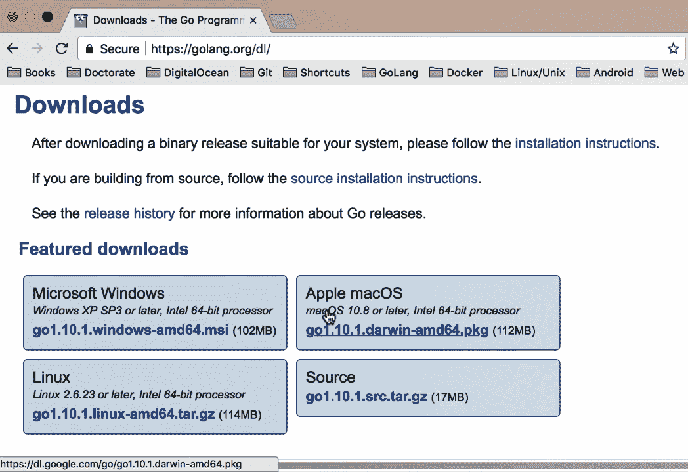

我将使用 macOS，但您也会发现其他平台的步骤类似。让我们继续进行下载。

安装程序基本上是一个逐步向导；您只需运行它并不断点击“继续”，直到安装完成。安装完成后，您可能还需要做一件事，那就是设置您的环境变量。此外，您还需要设置您的工作区。您将有三个文件夹，`bin`、`pkg`和`src`，如下截图所示：

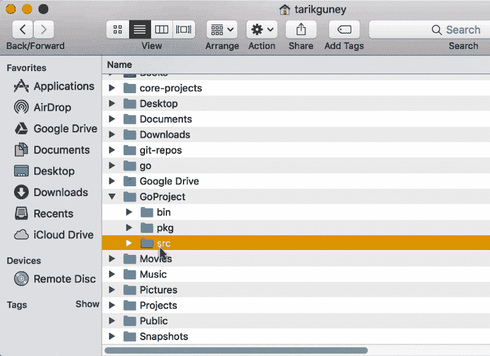

`src`文件夹是您放置源文件的地方，`pkg`文件夹是 Go 存储对象文件的地方，`bin`文件夹是存储二进制文件（实际可执行文件）的地方。接下来，我将使用我的 shell，并且您需要使用`export`来设置一些环境变量。您还可以使用配置文件来设置您的环境变量。如果您查看下面的截图，您可以看到路径`$PATH:/usr/local/go/bin`，这就是我的 Go 二进制文件所在的位置：

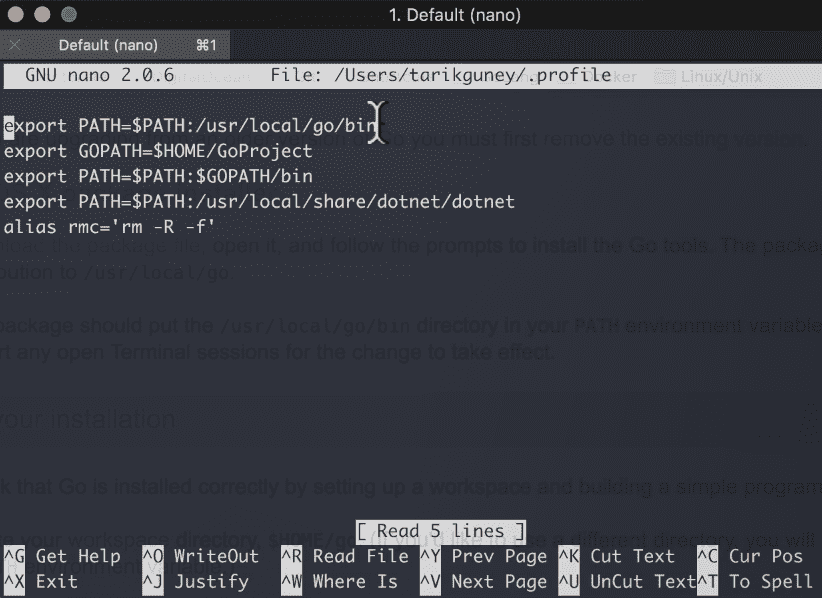

因此，当我运行`Go`命令时，它将自动找到 Go 程序的位置。

接下来，我们设置`GOPATH`。`GOPATH`基本上是您的 Go 工作区所在的位置。如果您记得的话，工作区包含三个文件夹，`pkg`、`src`和`bin`。`GoProject`是该结构的父文件夹。最后是`$GOPATH/bin`，当您希望终端找到已安装的 Go 二进制文件时使用。只需确保在重新启动终端之前添加这三个内容并保存此文件。然后，您就可以开始使用 Go 了！

您还可以通过点击链接找出如何设置 Go 路径的环境变量，如下截图所示，该链接位于同一页面上：

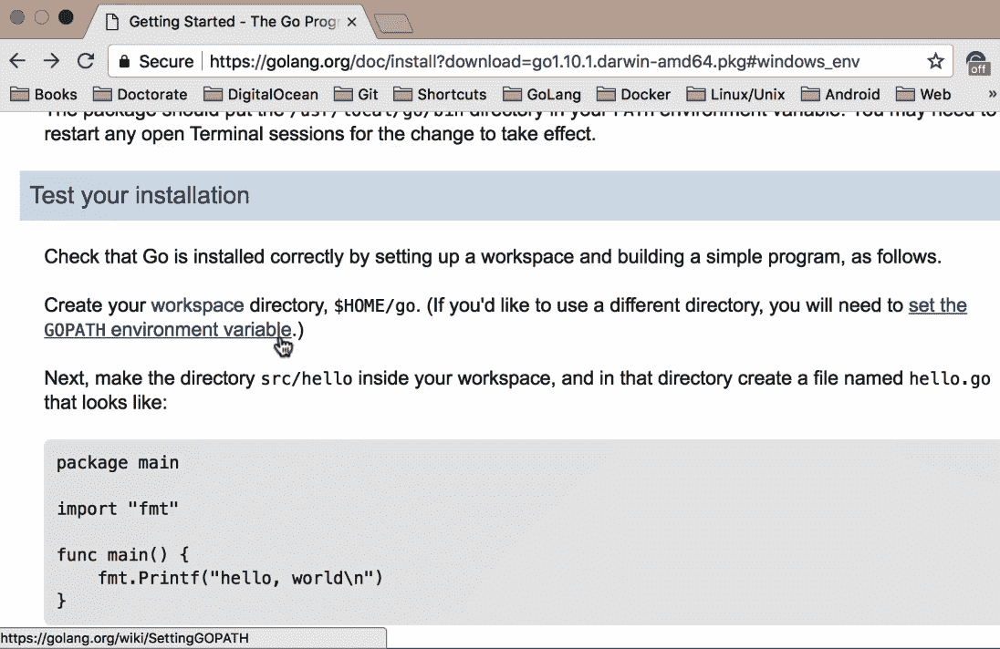

您将找到不同操作系统的说明。例如，对于基于 Unix 的系统，您可以使用`~/.bash_profile`，或者根据您使用的 shell 不同，您可以使用各种配置文件。在我的系统中，我使用的是如下截图中所见的配置文件：

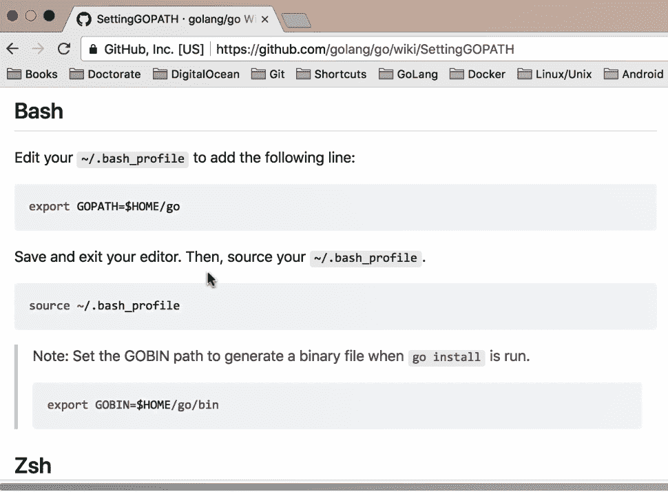

对于 Windows，在安装完成后，一旦您有了 Go 工作区，按照给定的说明进行操作，您就可以开始使用 Go 了。说明将如下截图所示：

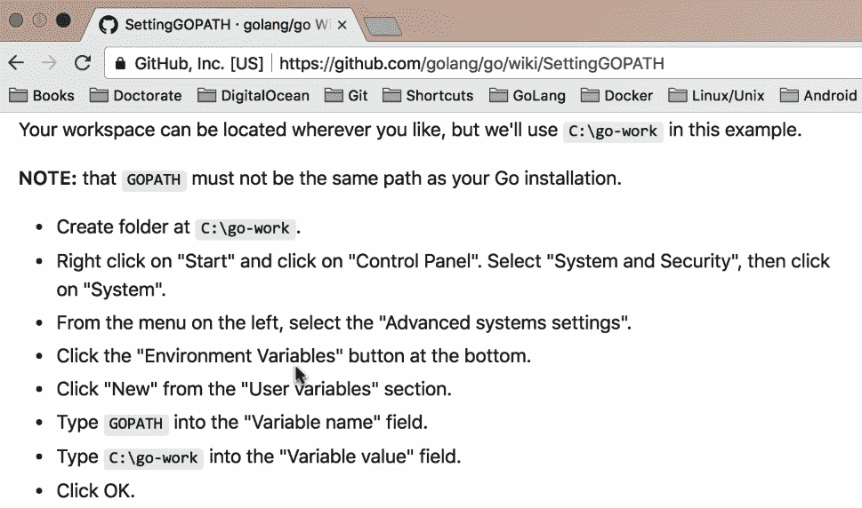

测试您是否已安装 Go 的最快方法就是输入`go`，如下截图所示：

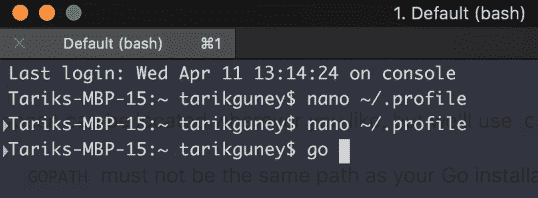

它将带出帮助教程，您可以通过使用 Go 版本查看可用命令和您拥有的代码版本。

这就是您如何轻松设置 Go 环境。在下一节中，我们将快速了解 Go 语言本身。

# 快速了解 Go 语言

在本节中，我们将快速了解 Go 编程语言。 Go 是一种表达力强，简洁，干净的语言；它具有并发机制，这有助于程序员编写能充分利用多核和网络机器的程序。它还可以快速编译为机器代码，并具有垃圾回收的便利性和运行时反射的强大性。它是一种静态类型的编译语言，但对大多数人来说，它感觉像是一种动态类型和解释语言。好了！让我们通过导航到[`tour.golang.org/welcome/1`](https://tour.golang.org/welcome/1)来查看 Go 的语法；这对于想要学习 Go 语法的人来说是一个很好的起点：

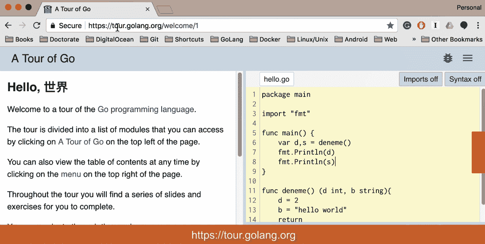

好的，所以如果您看一下截图中的语法，如果您来自诸如 Java 和 C#，或 C 和 C++之类的语言，您可能会发现语法有点不同。例如，如果您看一下返回类型，您实际上是在函数的末尾定义返回类型，而不是定义类型。我们还有一个主函数，这是我们应用程序的入口点，类似于许多其他编程语言，如果您看一下下面截图中显示的上下文，您会发现我们有包、变量和函数，以及流程控制语句：`for`、`if...else`，以及`struct`、`slices`和`maps`等类型：

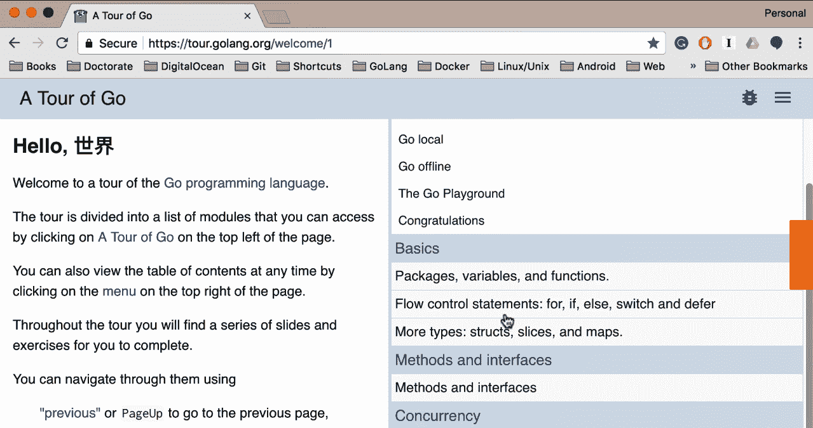

如果您想创建一个类，比如结构，您可以使用结构类型并将其与指针结合。此外，它具有方法和接口以及并发性，但它没有泛型。

说到这一点，我还将谈论我将在整本书中使用的工具。**GoLand**中有几个可用的工具。 GoLand 是 JetBrains 推出的一个相对较新的 IDE。我们将在整本书中使用 GoLand。您可以轻松创建新项目并为其命名，并选择 SDK，即 Go 1.9。您还可以添加新文件或新包等。

您可以通过输入您的入口文件来定义您的配置并构建您的 Go，如下截图所示。然后，您可以运行`main.go`并单击 OK：

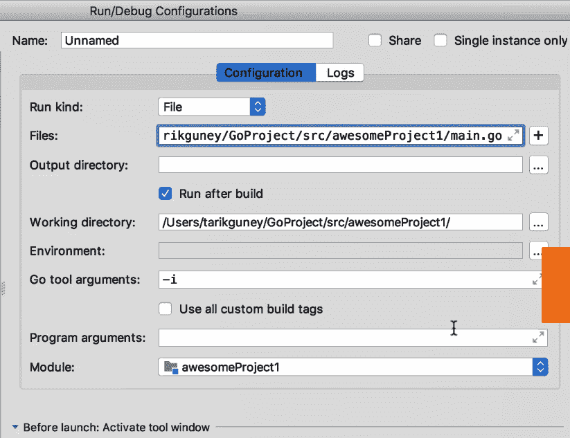

最后，按下*Ctrl* + *r*将构建您的项目，如下截图所示：

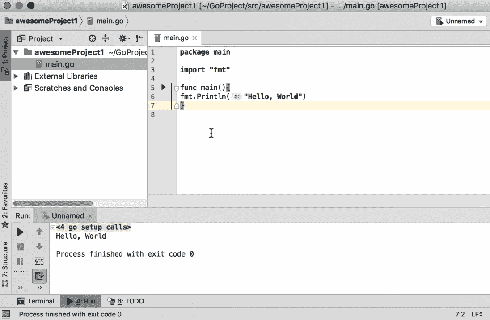

在我结束本章之前，让我快速向您展示一个仅使用终端的示例。我将使用`touch`命令创建`main.go`文件并添加以下代码：

```go
package main
import "fmt"
func main(){
 fmt.Println(a:"Hello World")
}
```

您可以使用`go run main.go`命令运行它，然后您将获得以下输出：

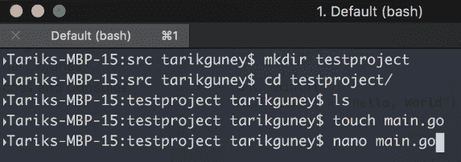

您可以保存它，然后运行它。因此，这就是您如何使用终端快速编写 Go 代码并运行它。

# 摘要

在本章中，我们学习了如何安装 Go 二进制文件，并简要了解了 Go 语言。我们学会了如何编写 Go 代码并仅使用终端运行它。我们还看了将在所有章节中使用的工具以及可以用来开发 Go 应用程序的其他工具。我们现在准备继续下一章，在那里我们将看到一些操作字符串值的示例。
